# 专题 1.1 丰富的图形世界（举一反三讲义）

【北师大版 2024】

# 题型归纳

【题型 1 几何体及其构成】....2

【题型2 几何体中的点、棱、面】 3

【题型 3 点、线、面、体间的关系】....5

【题型 4 几何体的展开图】....7

【题型 5 正方体的展开图】....8

【题型 6 截一个几何体】....10

【题型 7 从不同方向看几何体】....12

【题型 8 由从不同方向看到的图形确定几何体】....14

# 举一反三

# 知识点 1 立体图形的相关概念

1. 定义：有些几何图形（如长方体、正方体、圆柱、圆锥、棱柱、棱锥、球等）的各部分不都在同一个平面内，这就是立体图形。

立体图形除了按照柱体、锥体、球分类, 也可以按照围成几何体的面是否有曲面划分: ①有曲面: 圆柱、圆锥、球等; ②没有曲面: 棱柱、棱锥等.

2.棱柱的有关概念及其特征:

①在棱柱中, 相邻两个面的交线叫做棱, 相邻两个侧面的交线叫做侧棱, 棱柱所有侧棱长都相等, 棱柱的上下底面的形状、大小相同, 并且都是多边形; 棱柱的侧面形状都是平行四边形.  
(2)棱柱的顶点数、棱数和面数之间的关系: 底面多边形的边数 $n$ 确定该棱柱是 $\underline{n}$ 棱柱, 它有 $2 \underline{n}$ 个顶点, $3 \underline{n}$ 条棱, $\underline{n}$ 条侧棱, 有 $\underline{n+2}$ 个面, $\underline{n}$ 个侧面.

# 知识点 2 点、线、面、体的关系

定义: ①体与体相交成面, 面与面相交成线, 线与线相交成点.  
②点动成线，线动成面，面动成体.   
③点、线、面、体组成几何图形，点、线、面、体的运动组成了多姿多彩的图形世界.

# 知识点 3 正方体的展开图

定义: 正方体是特殊的棱柱, 它的六个面都是大小相同的正方形, 将一个正方体的表面展开, 可以得到 11 种不同的展开图, 把它归为四类: 一四一型有 6 种; 二三一型有 3 种; 三三型有 1 种; 二二二型有一种.

# 拓展：

正方体展开图口诀:

①一线不过四;田凹应弃之;   
②找相对面：相间，“Z”端是对面；  
③找邻面：间二，拐角邻面知.

# 知识点4 截面

定义：用一个平面去截一个几何体，截出的面叫做截面.

# 【题型1 几何体及其构成】

【例 1】（24-25 七年级上·宁夏银川·阶段练习）将下图中的立体图形分类.

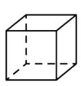  
①

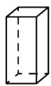  
②

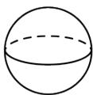  
③

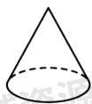  
④

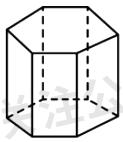  
⑤

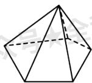  
⑥

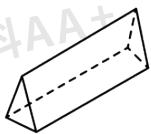  
⑦

  
⑧

柱体\_\_\_\_；锥体\_\_\_\_；球体\_\_\_\_。

【答案】

①②⑤⑦⑧

④⑥/⑥④

③

【分析】本题主要考查立体图形的分类，解题的关键掌握立体图形的特征．据此可得答案.

【详解】解：柱体：①②⑤⑦⑧；锥体：④⑥；球体：③.

故答案为：①②⑤⑦⑧；④⑥；③.

【变式 1-1】（24-25 七年级上·福建漳州·期末）谜语是我国民间文学的一种特殊形式，古时称“度辞(SōuCi)”或“隐语”。谜语：“正看三条边；侧看三条边；上看圆圈圈，就是没直边。”\_\_\_\_。（打一几何体）

【答案】圆锥

【分析】本题主要考查了生活中简单的几何体，解题的关键是熟练掌握圆锥的特点，根据圆锥特点即可解答.

【详解】解：这个几何体为圆锥.

故答案为：圆锥.

【变式 1-2】（24-25 七年级上·广东深圳·期中）如图，模块①由 15 个棱长为 1 的小正方体构成，模块② - ⑥ 均由 4 个棱长为 1 的小正方体构成。现在从模块② - ⑥ 中选出三个模块放到模块①上，与模块①组成一个棱长为 3 的大正方体。下列四个方案中，符合上述要求的是（）

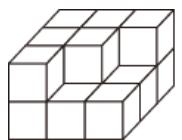  
模块①

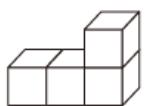  
模块②

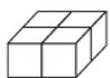  
模块③

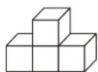  
模块④

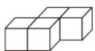  
模块⑤

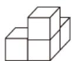  
模块⑥

A. 模块②，④，⑤ B. 模块③，④，⑥

C. 模块②，③，⑥ D. 模块③，

⑤，⑥

【答案】C

【分析】根据正方体的结构特征进行选择即可.

【详解】解：根据正方体的结构特征，可选择模块⑥放在模块①上的右下角，再将模块③放在模块①上在右上角，最后将模块②放在模块①上在左边，就使得模块①组成一个棱长为3的正方体，故选：C.

【点睛】本题考查正方体的结构特征，主要培养学生的空间想象能力和动手拼接图形的能力.

【变式 1-3】（24-25 七年级·福建漳州·期末）如图，指出图中物体分别是由哪些几何体组成的.

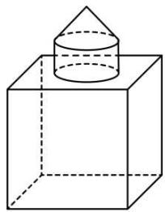

natural_image

Simple line drawing of a cube with a cone on top, no text or symbols present

①

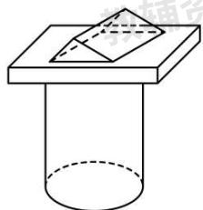

natural_image

Simple line drawing of a cylinder with a rectangular block on top, no text or symbols present.

②

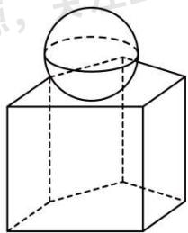

natural_image

Simple line drawing of a sphere resting on a cube, no text or symbols present

③

【答案】见解析

【分析】本题考查了组合几何体的构成．熟练掌握常见的几何体是解题的关键．根据常见的几何体的特征作答即可.

【详解】解：由题意知，①是由一个正方体、一个圆柱体、一个圆锥体组成的组合体；  
②是由一个圆柱体、一个长方体、一个三棱柱组成的组合体；  
③是由一个五棱柱、一个球体组成的组合体.

# 【题型 2 几何体中的点、棱、面】

【例 2】（24-25 七年级上·山西晋中·期中）小华新买了一个如图所示的笔筒，下列关于这个笔筒的描述错误的是（）

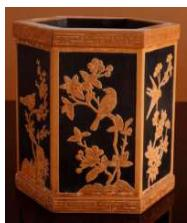

natural_image

Decorative box with floral and bird motifs in gold on black background (no text or symbols)

A. 笔简可以近似的看成六棱柱

B. 它的所有侧棱长都相等

C. 它有 10 个顶点

D. 侧面的形状都是长方形

【答案】C

【分析】本题主要考查了六棱柱的相关知识，根据六棱柱所有侧棱长都相等，有 12 个顶点，侧面的形状都是长方形一一判断即可.

【详解】解：A．笔简可以近似的看成六棱柱，说法正确，故该选项不符合题意；  
B. 它的所有侧棱长都相等，说法正确，故该选项不符合题意；  
C. 它有 12 个顶点，原说法错误，故该选项符合题意；  
D. 侧面的形状都是长方形, 说法正确, 故该选项不符合题意;

故选：C.

【变式 2-1】（24-25 六年级上·山东威海·期中）一个棱柱有10个面，且所有的侧棱长的和为64cm，底面边长都为3cm，它的侧面积是\_\_\_\_cm².

【答案】192

【分析】本题考查了棱柱的侧面积计算，先求出棱柱的棱数，再求出侧棱长，然后求侧面积即可，正确理解棱柱的有关定义是解题的关键.

【详解】解：∵棱柱有10个面，

∴是8棱柱，

∴侧棱长为 $64 \div 8 = 8$ (cm),

∵底面边长都是3cm，

∴底面周长是 $8 \times 3 = 24$ (cm),

∴侧面积 = $24 \times 8 = 192(\text{cm}^{2})$ ,

故答案为：192.

【变式 2-2】（24-25 六年级上·山东淄博·期中）一个 n 棱柱共有 15 条棱，则这个棱柱共有 \_\_\_\_ 个面.

【答案】7

【分析】本题主要考查立体几何的认识，掌握立体几何中点、棱、面的关系是解题的关键．棱柱的上，下棱的和是中间棱的2倍，由此即可求解.

【详解】解： $15 \div 3 = 5$ ，即上、中、下各有5条棱，

∴中间有5个面，上下各一个面，共7个面，

故答案为：7.

【变式 2-3】（24-25 七年级上·河北石家庄·期中）如图，从一个棱长为4cm的正方体的一顶点处挖去一个棱长为1cm的正方体，则第二个几何体有（）个面.

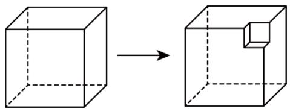

natural_image

Diagram showing a cube transforming into a 3D cube with an arrow indicating transformation (no text or symbols)

A. 6

B. 7

C. 8

D. 9

【答案】D

【分析】本题考查截一个几何体，根据挖去一个棱长为 $1 \mathrm{~cm}$ 的正方体，增加了三个边长为 $1 \mathrm{~cm}$ 的正方形面，进行求解即可.

【详解】解：因为从一个棱长为 $4 \mathrm{~cm}$ 的正方体的一顶点处挖去一个棱长为 $1 \mathrm{~cm}$ 的正方体，增加了三个边长为 $1 \mathrm{~cm}$ 的正方形面，

所以第二个几何体有9个面.

故选：D.

# 【题型3 点、线、面、体间的关系】

【例 3】（24-25 七年级上·广东深圳·期中）直升飞机螺旋桨一般由 4 片桨叶组成，直升飞机起飞时，螺旋桨旋转时向下推动空气，即向下施加一个作用力，直升飞机获得竖直向上的力，使得飞机能悬浮在空中．若把螺旋桨看作一条线段，旋转形成的痕迹体现了（）

A. 面动成体

B. 线动成面

C. 点动成线

D. 面面相交成线

【答案】B

【分析】本题考查了点、线、面、体的关系，明确点动成线，线动成面，面动成体．根据点、线、面、体的关系解答即可.

【详解】解：若把螺旋桨看作一条线段，旋转形成的痕迹体现了线动成面.

故选：B.

【变式 3-1】（24-25 七年级上·贵州贵阳·期中）笔尖在纸上快速滑动写出了一个字母 w，用数学知识解释为 \_\_\_\_.

【答案】点动成线

【分析】本题考查了点、线、面、体的关系，熟练掌握点、线、面、体四者之间的关系是解题的关键．根据点动成线的性质即可解答.

【详解】解：笔尖在纸上快速滑动写出了一个字母 w，用数学知识解释为“点动成线”.

故答案为：点动成线.

【变式 3-2】（24-25 九年级上·广西南宁·期中）如图下面的图形绕直线 l 旋转一周后得到的立体图形是（）

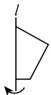

A.   
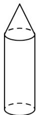

B.   
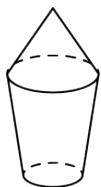

C.   
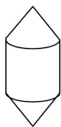

D.   
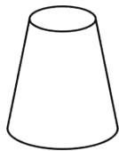

【答案】B

【分析】本题题考查点、线、面、体的问题，解决本题的关键是把旋转的图形分为上下两个部分，根据面动成体分别求出上下两部分旋转后的图形即可得到答案.

【详解】解：由题意得，该图形旋转后上部分得到的几何体是一个圆锥，下部分得到的几何体是一个圆台，∴四个选项中，只有 B 选项符合题意，

故选：B.

【变式 3-3】（24-25 七年级上·河南郑州·期中）如图，某酒店大堂的旋转门内部由四块宽 2m、高 3m 的长方形玻璃隔板组成.

(1)每扇旋转门旋转一周，能形成的几何体是 \_\_\_\_，这体现了\_\_\_\_动成体；   
(2)求每扇旋转门旋转一周形成的几何体的体积（结果保留 $\pi$ ）.

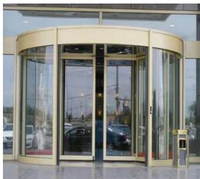

natural_image

Exterior view of a modern building entrance with glass doors and parked cars (no signage)

【答案】(1)圆柱；面；

(2) $12\pi(m^{3})$ .

【分析】本题考查了点、线、面、体，准确熟练地进行计算是解题的关键.

（1）根据圆柱的特征，以及点、线、面、体的关系，即可解答；  
(2) 利用圆柱的体积公式进行计算, 即可解答.

【详解】（1）解：每扇旋转门旋转一周，能形成的几何体是圆柱，这体现了面动成体，

故答案为：圆柱；面；

(2) 解: 由题意得: $\pi \times 2^{2} \times 3 = 12\pi (\mathrm{m}^{3})$ ,

∴每扇旋转门旋转一周形成的几何体的体积 $12\pi m^{3}$ .

# 【题型4 几何体的展开图】

【例 4】（24-25 七年级上·河南郑州·阶段练习）下面的图形经过折叠可以围成的几何体名称是\_\_\_\_。

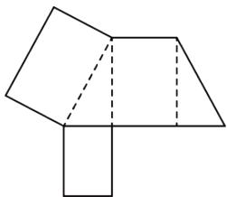

natural_image

Geometric diagram of a 3D shape composed of connected polygons (no text or symbols)

【答案】三棱柱

【分析】由平面图形的折叠及立体图形的表面展开图的特点解题.

考查了展开图折叠成几何体，解题时勿忘记三棱柱的特征及正方体展开图的各种情形.

【详解】根据题意得，有 2 个三角形的面，3 个长方形的面，

∴围成的几何体名称是三棱柱.

故答案为：三棱柱.

【变式 4-1】（24-25 七年级上·贵州贵阳·期中）可以围成一个棱柱的是（）。

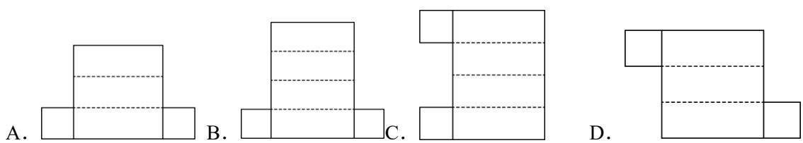

【答案】B

【分析】本题考查了几何体展开图的认识，结合四棱柱的展开图，即可作答.

【详解】解：依题意，观察四个选项，可以围成一个棱柱的是

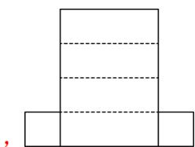

natural_image

Simple geometric diagram of a T-shaped structure with three horizontal dashed lines inside, no text or symbols present.

故选：B.

【变式 4-2】（24-25 七年级下·山东临沂·期中）如图是一个直三棱柱的展开图，其中三个面被标示为甲、乙、丙．将此展开图折成直三棱柱后，判断下列叙述正确的是（）

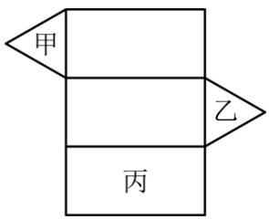

text_image

甲
乙
丙

A. 甲与乙平行，甲与丙垂直

B. 甲与乙平行，甲与丙平行

C. 甲与乙垂直, 甲与丙垂直

D. 甲与乙垂直，甲与丙平行

【答案】A

【分析】本题考查了几何体的认识，因为题干的图是一个直三棱柱的展开图，结合直三棱柱的相对面是平行的，相邻面是垂直的，据此进行作答即可.

【详解】解：依题意，在折成的直三棱柱中，甲与乙是相对面，甲与丙是相邻面，∴甲与乙平行，甲与丙垂直，

故选：A

【变式 4-3】（24-25 七年级上·宁夏中卫·期中）如图是一个底面为正方形的四棱柱的展开图，图上的数字代表棱柱各条棱的长度（单位：cm），则该棱柱的表面积是\_\_\_\_cm².

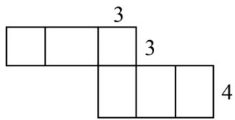

text_image

3
3
4

【答案】66

【分析】本题主要考查简单几何体的展开与折叠，根据棱柱展开图的特征来计算表面积即可.

【详解】解：由题图可知，该棱柱的底面是边长为3cm的正方形，侧面由四个长4cm，宽3cm的长方形组成，所以侧面积为： $4 \times 4 \times 3 = 48cm^{2}$ ，底面积为： $2 \times 3 \times 3 = 18cm^{2}$ 表面积为 $48 + 18 = 66cm^{2}$ .

故答案为：66.

# 【题型5 正方体的展开图】

【例 5】（24-25 七年级上·河南郑州·阶段练习）下图中，经过折叠能围成如图所示的几何体的是（）

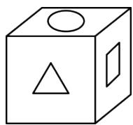

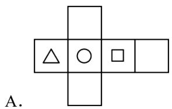

text_image

A.

B.   
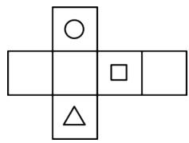

natural_image

Pure geometric diagram with four shapes (circle, square, triangle) arranged in a cross pattern without any text or symbols

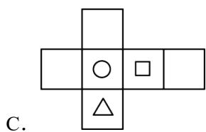

text_image

C.

D.   
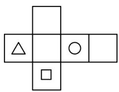

natural_image

Pure geometric diagram with shapes (triangle, circle, square) arranged in a cross pattern without any text or symbols

【答案】C

【分析】本题主要考查正方体的展开图，熟练掌握正方体的展开图是解题的关键；因此此题可根据正方体的展开图进行求解.

【详解】解：由图可知：能围成该几何体的只有 C 选项符合；

故选 C.

【变式 5-1】（24-25 七年级上·四川成都·期中）一个正方体盒子的展开图如图所示．如果要把它粘成一个正方体，那么与点F重合的点是\_\_\_\_.

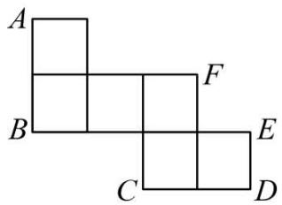

text_image

A
B
C
D
E
F

【答案】点A、点E

【分析】本题考查了正方体的展开图，根据正方体表面展开图的特征即可得出答案，熟练掌握正方体表面展开图的特征是解此题的关键.

【详解】解：根据正方体表面展开图的特征可知，折叠后与点F重合的点是点A、点E，

故答案为：点A、点E.

【变式 5-2】（24-25 七年级上·广东深圳·期中）如图的四个平面图形中，不是正方体的展开图的是（）

A.

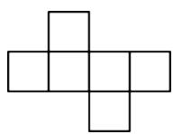

B.

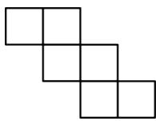

C.

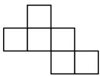

D.

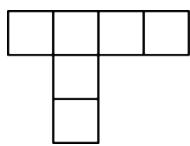

【答案】D

【分析】本题主要考查了正方体的展开图，正方体展开图中，相对的面中间一定隔着一个面，且正方体展开图有“141”型，“132”型，“33”型，“222”型，没有“411”型，据此可得答案.

【详解】解：由正方体展开图的特点可知，四个选项中只有 D 选项中的展开图不是正方体的展开图，故选：D.

【变式 5-3】（24-25 七年级上·山西晋中·期中）如图，A、B、C、D 四个位置中的某个正方形与实线部分的五个正方形组成的平面图形，其平面图形能拼成正方体的位置有（）个.

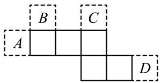

text_image

A
B
C
D

A. 1

B. 2

C. 3

D. 4

【答案】C

【分析】本题考查了展开图折叠成几何体，解题时勿忘记四棱柱的特征及正方体展开图的各种情形．注意：只要有“田”字格的展开图都不是正方体的表面展开图.

由平面图形的折叠及正方体的表面展开图的特点解题.

【详解】解：正方形 A 与实线部分的五个正方形组成的图形出现重叠的面，所以不能围成正方体．正方形 B、C、D 与实线部分的五个正方形组成的图形能围成正方体.

故其平面图形能拼成正方体的位置有 3 个.

故选：C.

# 【题型6 截一个几何体】

【例 6】（24-25 七年级上·福建三明·期中）一物体外形是正方体，其内部构造不详，用一个竖直的平面截这个物体，截了七次，得到一组自左向右的截面（如图），则这个正方体的内部构造可能是空了一个\_\_\_\_体.

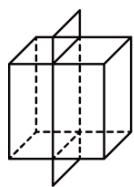

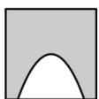

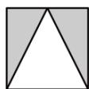

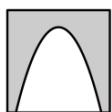

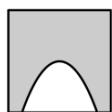

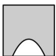

【答案】圆锥

【分析】本题考查了几何体的认识，熟练掌握几何体的特征是解题的关键．观察图形，除第四个图形外都是一条曲线，可以判断几何体内部是由曲面围成的，而且上小下大；再由第四个图形内部是一个三角形，

可推断这个几何体是圆锥，即可得出结论.

【详解】解：由题意得，这个正方体的内部构造可能是空了一个圆锥体.

故答案为：圆锥.

【变式 6-1】（24-25 九年级下·陕西咸阳·期中）玲玲用两种不同的方法分别去截同一个几何体，分别得到了如图所示的图形，这个几何体可能是（）

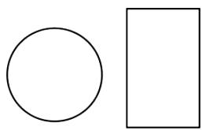

natural_image

Simple geometric shapes: a circle and a rectangle, no text or symbols present

A. 球

B. 圆柱

C. 长方体

D. 圆锥

【答案】B

【分析】本题考查了几何体的截面，截面的形状既与被截的几何体有关，还与截面的角度和方向有关，根据圆锥、圆柱、球体，长方体的几何特征，分别分析出用一个平面去截该几何体时，可能得到的截面的形状，逐一比照后，即可得到答案.

【详解】解：A、用不同的方法截球体，不能得到长方形，故该选项不符合题意；  
B、用不同的方法截圆柱，能得到以上各种图形，故该选项符合题意；  
C、用不同的方法截长方体，不能得到圆形，故该选项不符合题意；  
D、用不同的方法截圆锥，不能得到长方形，故该选项不符合题意；

故选：B.

【变式 6-2】（24-25 七年级上·宁夏银川·期中）用一平面去截下列几何体，其截面可能是长方形的有\_\_\_\_个.

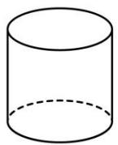

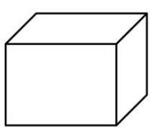

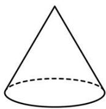

【答案】3

【分析】本题考查几何体的截面，根据圆柱、长方体、圆锥、四棱柱的形状判断即可，可用排除法，关键要理解面与面相交得到线，注意：截面的形状既与被截的几何体有关，还与截面的角度和方向有关.

【详解】解：圆锥不可能得到长方形截面，

∴能得到长方形截面的几何体有：圆柱、长方体、四棱柱，一共有3个，

故答案为：3.

【变式 6-3】（24-25 七年级上·江苏苏州·期中）用平面截一个 n 棱柱，得到的截面边数最多是 8 条边，且这

个 n 棱柱的每个侧面都是正方形，正方形的面积为 $\frac{9}{4}$ ，则这个 n 棱柱的棱长之和为 \_\_\_\_.

【答案】27

【分析】本题考查截一个几何体，求棱长，根据截面最多是8边形，得到几何体为6棱柱，根据每个侧面都是正方形，求出一条棱长，进而求出棱长和即可.

【详解】解：由题意，可知：n = 6，

∵每个侧面都是正方形，正方形的面积为 $\frac{9}{4}$ ,

∴每条棱长为 $\frac{3}{2}$ ,

∴棱长之和为： $18 \times \frac{3}{2} = 27$ ;

故答案为：27.

# 【题型7 从不同方向看几何体】

【例 7】（24-25 九年级下·湖南长沙·期中）鲁班锁起源于我国古代建筑中的榫卯结构．图（2）是六根鲁班锁图（1）中的一个构件，从前面看这个构件，可以得到的图形是（）

  
(1)

text_image

前面
教辅资

(2)

B.   

C.   

【答案】C

【分析】本题考查了从不同方向看几何体．找到从前面看到的图形即可.

【详解】

解：从前面看这个构件，可以得到的图形是

故选：C.

【变式 7-1】（24-25 七年级下·黑龙江哈尔滨·期中）由五个大小相同的正方体搭成的几何体如图所示，从上面看这个几何体得到的平面图形是（）.

text_image

正面

【答案】B

【分析】本题主要考查了从不同方向看几何体，解题关键是掌握从上面看得到的图形的特征．从上面看有2行，上面一行有3个正方形，下面一行最左侧有1个正方形，据此判断即可.

【详解】

解：从上面看这个几何体得到的平面图形是

故选：B.

【变式 7-2】（24-25 七年级上·山东济南·期中）黑陶是继彩陶之后中国新石器时代制陶工艺的又一个高峰，被誉为“土与火的艺术，力与美的结晶”。如图是山东博物馆收藏的蛋壳黑陶高柄杯。从三个不同方向观察，下列说法正确的是（）

正面

A. 从正面、左面看到的形状图相同

B. 从正面、上面看到的形状图相同

C. 从左面、上面看到的形状图相同

D. 从正面、左面、上面看到的形状图都相同

【答案】A

【分析】本题考查从不同方向看几何体，根据从前往后，从左到右，从上到下看到的图形，进行判断即可.

【详解】解：观察可知：从正面看和从左面看，看到的图形相同；

故选A.

【变式 7-3】（24-25 七年级上·宁夏银川·期中）小林所在的综合实践小组准备制作一些大小相同的正方体纸盒，收纳班级讲台上的粉笔（盒盖单独制作）.

  
图1  
图2  
图3

(1)图 1 是综合实践小组同学制作的图形，其中 \_\_\_\_（填序号）经过折叠能围成无盖正方体纸盒；  
(2)综合实践小组同学用制作的8个正方体纸盒摆成如图2所示的几何体.

①在图 3 中画出从正面，从左面，从上面观察图 2 几何体看到的形状图；  
②若每个小正方体的棱长为2cm，则这个几何体的表面积为 $cm^{2}$ .

【答案】(1)①，③，④

(2)①见解析；②128

【分析】本题考查正方体的展开图，从不同方向看几何体

（1）根据正方体的展开图分析，即可求解；

①画出从正面，从左面，从上面看到的图形即可；  
②分别数出①中三个方向小正方体的面的个数再加上2个面，再乘以2，然后求得一个面的面积，把它们相乘即可求解.

【详解】（1）解：由图可知：过折叠能围成无盖正方体纸盒的有①，③，④；

故答案为：①，③，④。

(2) 如图所示,

natural_image

Geometric grid pattern with five squares arranged in a staggered layout (no text or symbols)

从正面看

natural_image

Simple geometric shape composed of three connected squares on a grid background (no text or symbols)

从左面看

natural_image

Simple geometric grid pattern with six squares arranged in a 3x3 layout (no text or symbols)

从上面看  
图3

②这个几何体的表面积为 $\left[(6+4+5)\times2+2\right]\times2^{2}=128cm^{2}$

故答案为：128.

# 【题型8 由从不同方向看到的图形确定几何体】

【例 8】（24-25 七年级上·贵州毕节·期中）分别从正面、左面和上面观察一个几何体，看到的形状图如图所示，这个几何体是（）

  
从正面看

  
从左面看

  
从上面看

B.   

D.   

【答案】D

【分析】本题考查了从不同方向看几何体，根据观察物体的方法，从上面看，是三列，正方形的个数从左到右依次是 2、2、1，只有 D 选项满足.

【详解】解：从上面看，是三列，正方形的个数从左到右依次是2、2、1，A选项第二列是1个，B、C选项第一列是1个，只有D选项满足，D选项同时满足从正面看和从左面看到的图形.

故选：D.

【变式 8-1】（24-25 七年级上·河南商丘·期中）根据下列从三个方向看到的几何体的形状图（如图），填上对应几何体的名称：

图（1）所对应的几何体是 \_\_\_\_；图（2）所对应的几何体是 \_\_\_\_。

  
从正面看

  
从上面看

  
从左面看

  
从正面看

  
从上面看

  
从左面看

(1)

(2)

【答案】六棱柱 三棱柱

【分析】本题主要考查从不同方向看几何体，掌握不同方向看到的几何图形判断几何体的形状的方法是解题的关键.

根据不同方向看到的几何图形判断几何体的形状判断即可.

【详解】解：（1）从正面和左面看到的图形可知改几何体为柱体，根据上面看到的图形是六边形，即可判

断出该几何体为六棱柱；

（2）从正面和上面看到的图形可知该几何体为柱体，再结合从左面看到的图形是三角形，即可判定该几何体为三棱柱.

故答案为：六棱柱、三棱柱.

【变式 8-2】（24-25 七年级上·贵州黔东南·期中）由若干个大小相同的小正方体搭成的几何体从上面看到的形状如图所示，小正方形中的数字表示在该位置小正方体的个数.

(1)这个几何体是由\_个大小相同的小正方体搭成的;  
(2)请画出从正面和左面看到的这个几何体的形状图;   
(3)若每个小正方体的棱长为 $1 \, cm$ ，求这个几何体的表面积.

【答案】(1)8

(2)见解析   
(3) $34cm^{2}$

【分析】本题考查从不同方向看几何体．以及几何体的表面积，由几何体的从上面看到的形状及小正方形内的数字，可知左面的列数与上面的列数相同，且每列小正方形数目为俯视图中该列小正方形数字中的最大数字．左面的列数与上面的行数相同，且每列小正方形数目为上面看到的图中相应行中正方形数字中的最大数字.

（1）根据所给图形即可得到答案；  
(2) 由已知条件可知, 从正面看有 4 列, 每列小正方形的数目分别为 $1, 2, 1, 3$ ; 从左面看有 2 列, 每列小正方形的数目分别为 $3, 1$ ; 据此画出图形;  
（3）根据几何体三个方向看到的图形可求出几何体的表面积.

【详解】（1）解：根据题意可知，这个几何体是由8个大小相同的小正方体搭成的；

故答案为：8

(2)

natural_image

Grid pattern with 10 empty squares arranged in 3 rows and 5 columns (no text or symbols)

从正面看

natural_image

Simple geometric shape composed of three connected squares on a grid background (no text or symbols)

从左面看

(3) $2 \times (7 + 5 + 5) = 34 \, (\text{cm}^{2})$ ,

答: 该几何体的表面积为 $34 \mathrm{~cm}^{2}$ .

【变式 8-3】（24-25 七年级上·河南焦作·期中）一个几何体由若干个大小相同的小立方块搭成，其从正面和从左面看到的形状图如图所示，则要摆出这样的几何体最多需要\_\_\_\_个小立方块.

  
从正面看

  
从左面看

【答案】16

【分析】本题考查了从不同方向看几何体，根据从正面和从左面看到的形状图画出从俯视图看到各个位置最多的情况解答即可.

【详解】解：由从正面看到的形状图可以看出几何体从左到右共四列，第一列最多2层，第二列最多1层，第三列2层，第四列2层；由从左面看到的形状图可以看出，几何体共三排，第一排最多2层，第二排最多1层，第三排最多2层；如图，它最多需要16个小正方体.

<table><tr><td>2</td><td>1</td><td>2</td><td>1</td></tr><tr><td>1</td><td>1</td><td>1</td><td>1</td></tr><tr><td>2</td><td>1</td><td>2</td><td>1</td></tr></table>

故答案为：16.