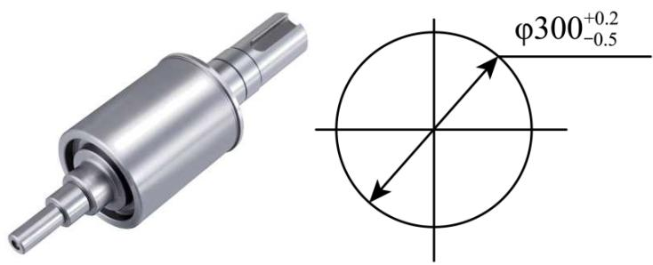
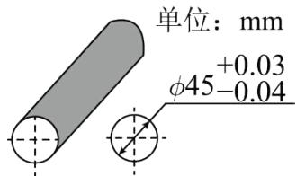
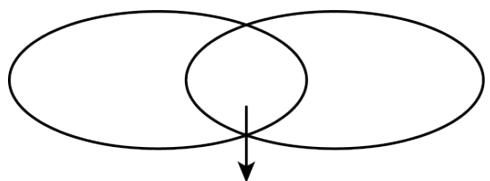
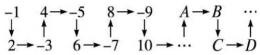
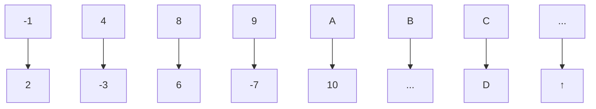
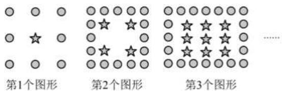

# 专题 2.1 正数与负数、有理数的概念（举一反三讲义）

【北师大版 2024】

# 题型归纳

【题型 1 认识正负数】....2

【题型 2 用正负数表示相反意义的量】....3

【题型3 正负数比较大小】....4

【题型 4 借助正负数的实际意义解决实际问题】....4

【题型5 有理数的概念及分类】....5

【题型6 数的集合】....6

【题型 7 有理数与规律探究】....7

# 举一反三

# 知识点 1 正数和负数的概念

1. 正数和负数的定义:

<table><tr><td></td><td>定义</td><td>示例</td><td>补充</td></tr><tr><td>正数</td><td>大于0的数叫做正数.有时,为了明确表达意义,在正数的前面也加上符号“+”(读作“正”)</td><td>3,1.8%,3.5, $\frac{3}{5}$ 都是正数</td><td>正数前的“+”可以省略不写</td></tr><tr><td>负数</td><td>在正数前加上符号“-”的数叫作负数</td><td>-3,-2.7%,- $\frac{3}{4}$ ,-4.5都是负数</td><td>负数前的“-”不能省略</td></tr></table>

2. 注意：0 既不是正数，也不是负数。

3.0 的意义

(1) 0 是正负数的分界;

(2) 0 可以表示“没有”;

（3）0 可以用来表示基准，一般地，高于基准的量用数表示，低于基准的量用负数表示.

# 知识点 2 具有相反意义的量

1. 定义：在日常生活中，人们常用正数、负数来表示一对具有相反意义的量.

2. 表示方法: 一般地, 对于具有相反意义的量, 我们可以把其中一种意义的量规定为正的, 并用正数来表示,把与它意义相反的量规定为负的, 并用负数来表示.

例如：若规定海平面的海拔高度为 0m，珠穆朗玛峰高于海平面 8848.86 m, 记作 +8 848.86 m.

# 知识点 3 有理数

1. 定义: 正整数、0、负整数统称为整数; 正分数和负分数统称为分数; 整数可以写成分数的形式; 可以写成分数形式的数称为有理数.

2.有理数的分类:

<table><tr><td colspan="2">按有理数的定义分类</td><td>按有理数的性质符号分类</td></tr><tr><td>有理数</td><td>整数 $\left\{ \begin{array}{l} \text{正整数} \\ 0 \\ \text{负整数} \end{array} \right.$ 分数 $\left\{ \begin{array}{l} \text{正分数} \\ \text{负分数} \end{array} \right.$ </td><td>有理数 $\left\{ \begin{array}{l} \text{正有理数} \\ 0 \\ \text{负有理数} \end{array} \right. \left\{ \begin{array}{l} \text{正整数} \\ \text{正分数} \end{array} \right.$ 可以写成正分数形式的负有理数 $\left\{ \begin{array}{l} \text{负整数} \\ \text{负分数} \end{array} \right.$ 可以写成负分数形式的</td></tr></table>

3.各类数的含义：

<table><tr><td>名称</td><td>描述</td><td rowspan="5"></td><td>名称</td><td>描述</td></tr><tr><td>正整数</td><td>大于0的整数</td><td>正整数</td><td>小于0的整数</td></tr><tr><td>正分数</td><td>大于0的分数</td><td>正分数</td><td>小于0的分数</td></tr><tr><td>非负数</td><td>正数和0</td><td>非正数</td><td>负数和0</td></tr><tr><td>非正整数</td><td>负整数和0</td><td>非负整数</td><td>正整数和0</td></tr></table>

# 【题型1 认识正负数】 教辅资源，关注公众号★全科AA+

【例 1】（24-25 六年级下·上海·期末）在 -18， $9\frac{1}{2}$ ，0，12%，-7.2， $-\frac{3}{4}$ ， $\pi$ ，7 中，非负数有（）

A. 6个

B. 5 个

C. 4 个

D. 3 个

【变式 1-1】（24-25 七年级上·河北保定·期末）我国东汉初期的数学家刘徽在注解《九章算术》时，明确提出了正数和负数的概念，比国外早了约 800 年．刘徽规定正数用红色小竹棒表示，负数用黑色小竹棒表示，则三根黑色小竹棒表示的数是（）

A. +3

B.-3

C. 0

D. $|-3|$

【变式 1-2】（24-25 七年级上·广东佛山·期末）下列语句：①不带负号“一”的数都是正数；②正数前面加上“一”号表示的数就是负数；③不存在既不是正数，也不是负数的数；④0℃表示没有温度，其中正确的有

( )

A. 0 个

B. 1 个

C. 2 个

D. 3 个

【变式 1-3】（24-25 七年级上·浙江温州·期中）如下表所示，算筹是我国古代的计算工具之一，摆法有纵式和横式两种，横式和纵式都可以表示同一个数，古人在个位数上划上斜线以表示负数。如“ $\pi = \pi$ ”表示 -723，则“T ≡ ≠”所表示的数是\_\_\_\_。

<table><tr><td>纵式</td><td>I</td><td>II</td><td>III</td><td>III</td><td>IIIIII</td><td>T</td><td> $\Pi$ </td><td> $\Pi\Pi$ </td><td> $\Pi\Pi\Pi$ </td></tr><tr><td>横式</td><td>-</td><td>=</td><td>≡</td><td>≡</td><td>≡</td><td>⊥</td><td>⊥</td><td>⊥</td><td>⊥</td></tr><tr><td></td><td>1</td><td>2</td><td>3</td><td>4</td><td>5</td><td>6</td><td>7</td><td>8</td><td>9</td></tr></table>

# 【题型 2 用正负数表示相反意义的量】

【例 2】（24-25 七年级上·贵州铜仁·阶段练习）仔细思考以下各对量：①胜二局与负三局；②气温升高3℃与气温为-3℃；③盈利3万元与亏损3万元；④两场篮球比赛，甲、乙两队的比分分别为65：60与60：

65. 其中具有相反意义的量有（）

A. 1 对

B. 2 对

C. 3 对

D. 4 对

【变式 2-1】（24-25 七年级上·福建厦门·期中）在跳远测验中，合格的标准是 4.00 米，王非跳出了 4.12 米，记为 +0.12 米，何叶跳出了 3.95 米，记作（）

A. +3.95米

B. -3.95米

C. +0.05米

D. -0.05米

【变式 2-2】（2025·辽宁大连·二模）随着国际油价的波动和国内成品油价格调整机制的运行，92 号汽油的价格也随之变化．如果每升 92 号汽油的价格上涨0.2元，记作 +0.2元，那么 -0.1元表示每升 92 号汽油的价格（）

A. 上涨0.1元

B. 上涨0.3元

C. 下降0.1元

D. 下降0.3元

【变式 2-3】（24-25 七年级上·北京海淀·期中）如图为小明微信账单．收到微信红包 3.71 元显示“+3.71”，则扫码付款 7.35 元，在阴影处显示的是\_\_\_\_。

text_image

× 账单 客服中心
全部账单▼
2025年2月▼
✓ 微信红包 +3.71
○ 扫码付款

# 【题型3 正负数比较大小】

【例 3】（24-25 七年级上·广东深圳·期末）初中生佳佳为了美观，总是不喜欢穿厚裤子。妈妈规定；每天最低气温在0℃以下或者最高气温在8℃以下，必须穿保暖裤。按照本地天气预报，周一到周日佳佳有几天必须要穿保暖裤？分别是哪几天？

<table><tr><td></td><td>周一</td><td>周二</td><td>周三</td><td>周四</td><td>周五</td><td>周六</td><td>周日</td></tr><tr><td>最高气温(°C)</td><td>18</td><td>9</td><td>6</td><td>3</td><td>2</td><td>7</td><td>9</td></tr><tr><td>最低气温(°C)</td><td>8</td><td>2</td><td>0</td><td>-3</td><td>-5</td><td>-1</td><td>1</td></tr></table>

【变式 3-1】（24-25 七年级上·广东深圳·期末）在 -0.5, 0, 3, -1 这四个数中，最小的数是 \_\_\_\_；既不是正数也不是负数的是 \_\_\_\_.

【变式 3-2】（24-25 六年级下·山东济南·期中）在 $-2^{\circ}C$ ， $8^{\circ}C$ ， $-32^{\circ}C$ ， $0^{\circ}C$ 中，最低温度是 \_\_\_\_，最高温度是 \_\_\_\_，其中 $-32^{\circ}C$ 表示 \_\_\_\_，读作 \_\_\_\_；零下 $18^{\circ}C$ 记作 \_\_\_\_。

【变式 3-3】（24-25 七年级上·宁夏银川·期中）下表是今年雨季某防汛小组测量的某条河的一周内的水位变化情况：（“+”表示水位比前一天上升，“-”号表示水位比前一天下降，单位是米）

<table><tr><td>星期</td><td>一</td><td>二</td><td>三</td><td>四</td><td>五</td><td>六</td><td>日</td></tr><tr><td>水位变化/米</td><td>+0.25</td><td>+0.52</td><td>-0.18</td><td>+0.06</td><td>-0.13</td><td>-0.49</td><td>+0.1</td></tr></table>

(1)上周末的水位是73.07米，本周星期一的水位是多少？

(2)在（1）的条件下，本周哪一天河流的水位最高？本周哪一天水位最低？它们位于警戒水位之上还是之下？

(3)与上周末相比，本周末的河流水位是上升了还是下降了，上升了或下降了多少米？

# 【题型4 借助正负数的实际意义解决实际问题】 教辅资源，关注公众号★全科AA+

【例 4】（24-25 七年级上·河南郑州·阶段练习）某项科学研究，以 45 分钟为 1 个时间单位，并记每天上午 10:00 时间为 0，10 时以前记为负，10 时以后记为正，例如：9:15 记为 -1，10:45 记为 1，依此类推，上午 6:15 记为（）

A. -4

B. -5

C. -3.45

D. 6.15

【变式 4-1】（24-25 七年级上·山西太原·期中）如图，加工一种轴时，轴直径在299.5毫米到300.2毫米之间的产品都是合格品，在图纸上通常用 $\varphi300_{-0.5}^{+0.2}$ 来表示这种轴的加工要求，这里 $\varphi300$ 表示直径是300毫米，+0.2表示最大限度可以比300毫米多0.2毫米，-0.5表示最大限度可以比300毫米少0.5毫米．现加工四根轴，轴直径的加工要求都是 $\varphi50_{-0.02}^{+0.03}$ ，下列数据是加工成的轴直径，其中不合格的是（）

text_image

φ300⁺°°²₋°°⁵

A. 50.02

B. 50.01

C. 49.99

D. 49.88

【变式 4-2】（24-25 七年级上·辽宁鞍山·阶段练习）如图是加工零件的尺寸要求，现有下列直径尺寸的产品（单位：毫米）：①Φ44.9；②Φ45.02；③Φ44.99；④Φ45.01．其中不合格的是\_\_\_\_．（填写序号）

text_image

单位：mm
+0.03
φ45-0.04

【变式 4-3】（24-25 七年级上·安徽合肥·期中）纽约、悉尼与北京的时差如下表（正数表示同一时刻比北京早的时数，负数表示同一时刻比北京晚的时数）：当北京 10 月 8 日 15 时，悉尼、纽约的时间分别是（）

<table><tr><td>城市</td><td>悉尼</td><td>纽约</td></tr><tr><td>时差/时</td><td>+2</td><td>-13</td></tr></table>

A. 10月8日13时；10月9日4时

B. 10月8日17时；10月8日2时

C. 10月8日17时；10月9日4时

D. 10月8日13时；10月8日2时

# 【题型5 有理数的概念及分类】

【例 5】（24-25 七年级上·浙江杭州·阶段练习）下列说法中：（1）一个整数不是正数就是负数；（2）最小的整数是零；（3）负数中没有最大的数；（4）自然数一定是正整数；（5）有理数包括正有理数、零和负有理数；（6）整数就是正整数和负整数；（7）零是整数但不是正数；（8）正数、负数统称为有理数；（9）非负有理数是指正有理数和 0．正确的个数有\_\_\_\_个．

【变式 5-1】（24-25 七年级上·湖北武汉·期末）下列关于“0”的叙述中，不正确的是（）

A. 表示“没有”，但有实际意义，是“正数”与“负数”的分界

B. 既不是正数，也不是负数

C. 是整数，也是最小的自然数

D. 不能写成分数的形式, 不是有理数

【变式 5-2】（24-25 七年级上·江苏常州·期中）下列各数：0.5，2π，1.264850349，0， $\frac{22}{7}$ ，0.2121121112...

（相邻两个2之间1的个数逐次加1），其中有理数有\_\_\_\_个.

【变式 5-3】（24-25 七年级上·甘肃平凉·期中）现给出如下有理数：-1.1，0，-0.8， $-3\frac{1}{3}$ ，5．其中负有理数的个数是（）

A. 4个

B. 3个

C. 2个

D. 1 个

# 【题型6 数的集合】

【例 6】（24-25 七年级上·山东济宁·期中）把下列各数填在相应的括号里.

-3, $2\frac{1}{3}$ , 0, $-\frac{\pi}{2}$ , 0.1010010001, $-12\%$ , 6, $-0.\dot{3}$ , 3.14, $-\frac{2}{7}$

整数集合：{ ...}

负分数集合：{ …}

非负有理数集合：{ ...}

【变式 6-1】（24-25 七年级上·河北邯郸·期中）在表中符合条件的空格里画上“√”.

<table><tr><td></td><td>有理数</td><td>整数</td><td>分数</td><td>正整数</td><td>负分数</td><td>自然数</td></tr><tr><td>-8是</td><td></td><td></td><td></td><td></td><td></td><td></td></tr><tr><td>-2.25是</td><td></td><td></td><td></td><td></td><td></td><td></td></tr><tr><td> $\frac{3}{5}$ 是</td><td></td><td></td><td></td><td></td><td></td><td></td></tr><tr><td>0是</td><td></td><td></td><td></td><td></td><td></td><td></td></tr></table>

【变式 6-2】（24-25 七年级上·安徽六安·期末）把下列各数填入图中相应的位置，并填写公共部分的名称.

$$
- 1 6, \quad 0, \quad - \frac {2}{3}, \quad - 4, \quad - 3. 6, \quad + 3 2
$$

text_image

Venn diagram showing two overlapping ellipses with a downward arrow indicating a subset or inversion.

负数( )整数

【变式 6-3】（24-25 七年级上·广东深圳·期中）将下列各数填入适当的括号内：

$$
5, - 3, \frac {3}{4}, 8. 9, \pi , - \frac {6}{7}, - 3. 1 4, - 9, 0, 2 \frac {3}{5}
$$

(1)正有理数集合：{ ...}

(2)负有理数集合：{ ...}

(3)整数集合：{ ...}

(4)分数集合：{ ...}

# 【题型7 有理数与规律探究】

【例 7】（24-25 七年级上·广东茂名·阶段练习）将一串有理数按下列规律排列，回答下列问题：

flowchart

(1)在 A 处的数是正数还是负数?  
(2)负数排在 A, B, C, D 中的什么位置?  
(3)第 2028 个数是正数还是负数？排在对应于 A, B, C, D 中的什么位置？

【变式 7-1】（24-25 七年级上·浙江杭州·阶段练习）观察下列各数： $-\frac{1}{2}, \frac{2}{3}, -\frac{3}{4}, \frac{4}{5}, -\frac{5}{6}, \cdots$ ，根据它们的排列规律写出第2024个数为\_\_\_\_。

【变式 7-2】（24-25 九年级上·甘肃庆阳·期末）下列图形都是由完全相同的圆点“●”和五角星“★”按一定规律组成的，已知第 1 个图形中有 8 个“●”和 1 个“★”，第 2 个图形中有 16 个“●”和 4 个“★”，第 3 个图形中有 24 个“●”和 9 个“★”，…，则第\_\_\_\_个图形中“●”的个数和“★”的个数相等.

text_image

第1个图形
第2个图形
第3个图形

【变式 7-3】（24-25 七年级上·山东青岛·期末）观察下面一列数：-1,2,-3,4,-5,6,-7,8,-9，....

(1)请写出这一列数中的第 100 个数和第 2026 个数.  
(2)在前 2026 个数中，正数和负数分别有多少个？  
(3)2025 和 -2025 是否都在这一列数中？若在，请指出它们分别是第几个数；若不在，请说明理由.