# 专题 2.1 正数与负数、有理数的概念（举一反三讲义）

【北师大版 2024】

# 题型归纳

【题型 1 认识正负数】....2

【题型 2 用正负数表示相反意义的量】....4

【题型3 正负数比较大小】....6

【题型 4 借助正负数的实际意义解决实际问题】....8

【题型 5 有理数的概念及分类】....10

【题型 6 数的集合】....12

【题型 7 有理数与规律探究】....14

# 举一反三

# 知识点 1 正数和负数的概念

1. 正数和负数的定义:

<table><tr><td></td><td>定义</td><td>示例</td><td>补充</td></tr><tr><td>正数</td><td>大于0的数叫做正数.有时,为了明确表达意义,在正数的前面也加上符号“+”(读作“正”)</td><td>3,1.8%,3.5, $\frac{3}{5}$ 都是正数</td><td>正数前的“+”可以省略不写</td></tr><tr><td>负数</td><td>在正数前加上符号“-”的数叫作负数</td><td>-3,-2.7%,- $\frac{3}{4}$ ,-4.5都是负数</td><td>负数前的“-”不能省略</td></tr></table>

2. 注意：0 既不是正数，也不是负数。

3.0 的意义

(1) 0 是正负数的分界;  
(2) 0 可以表示“没有”;  
（3）0 可以用来表示基准，一般地，高于基准的量用数表示，低于基准的量用负数表示.

# 知识点 2 具有相反意义的量

1. 定义：在日常生活中，人们常用正数、负数来表示一对具有相反意义的量.

2. 表示方法: 一般地, 对于具有相反意义的量, 我们可以把其中一种意义的量规定为正的, 并用正数来表示,把与它意义相反的量规定为负的, 并用负数来表示.

例如：若规定海平面的海拔高度为 0m，珠穆朗玛峰高于海平面 8848.86 m, 记作 +8 848.86 m.

# 知识点 3 有理数

1. 定义: 正整数、0、负整数统称为整数; 正分数和负分数统称为分数; 整数可以写成分数的形式; 可以写成分数形式的数称为有理数.

# 2.有理数的分类:

<table><tr><td colspan="2">按有理数的定义分类</td><td>按有理数的性质符号分类</td></tr><tr><td>有理数</td><td>整数 $\left\{ \begin{array}{l} \text{正整数} \\ 0 \\ \text{负整数} \end{array} \right.$ 分数 $\left\{ \begin{array}{l} \text{正分数} \\ \text{负分数} \end{array} \right.$ </td><td>有理数 $\left\{ \begin{array}{l} \text{正有理数} \\ 0 \\ \text{负有理数} \end{array} \right. \left\{ \begin{array}{l} \text{正整数} \\ \text{正分数} \end{array} \right.$ 可以写成正分数形式的 $\left\{ \begin{array}{l} \text{负整数} \\ \text{负分数} \end{array} \right.$ 可以写成负分数形式的</td></tr></table>

# 3.各类数的含义：

<table><tr><td>名称</td><td>描述</td><td rowspan="5"></td><td>名称</td><td>描述</td></tr><tr><td>正整数</td><td>大于0的整数</td><td>正整数</td><td>小于0的整数</td></tr><tr><td>正分数</td><td>大于0的分数</td><td>正分数</td><td>小于0的分数</td></tr><tr><td>非负数</td><td>正数和0</td><td>非正数</td><td>负数和0</td></tr><tr><td>非正整数</td><td>负整数和0</td><td>非负整数</td><td>正整数和0</td></tr></table>

# 【题型1 认识正负数】

【例 1】（24-25 六年级下·上海·期末）在 -18， $9\frac{1}{2}$ ，0，12%，-7.2， $-\frac{3}{4}$ ， $\pi$ ，7 中，非负数有（）

A. 6个

B. 5 个

C. 4 个

D. 3 个

【答案】B

【分析】本题考查了正负数的分类，熟悉掌握有理数的概念是解题的关键．根据非负数的定义逐一判断即可.

【详解】解：在-18， $9\frac{1}{2}$ ，0，12%，-7.2， $-\frac{3}{4}$ ， $\pi$ ，7中，

非负数有 $9\frac{1}{2}$ ，0， $12\%$ ， $\pi$ ，7共5个，

故选：B.

【变式 1-1】（24-25 七年级上·河北保定·期末）我国东汉初期的数学家刘徽在注解《九章算术》时，明确提出了正数和负数的概念，比国外早了约 800 年．刘徽规定正数用红色小竹棒表示，负数用黑色小竹棒表示，则三根黑色小竹棒表示的数是（）

A. +3

B. -3

C. 0

D. $|-3|$

【答案】B

【分析】根据正负数的意义解答即可.

本题考查了正负数的意义，熟练掌握定义是解题的关键.

【详解】解：根据题意，得三根黑色小竹棒表示的数是-3，

故选：B.

【变式 1-2】（24-25 七年级上·广东佛山·期末）下列语句：①不带负号“一”的数都是正数；②正数前面加上“一”号表示的数就是负数；③不存在既不是正数，也不是负数的数；④0℃表示没有温度，其中正确的有（）

A. 0 个

B. 1 个

C. 2 个

D. 3 个

【答案】B

【分析】明确“整数”“正”和“负”所表示的意义；再根据题意作答.

【详解】解：①0 不带“-”号，但是它不是正数；

②正数前面加上“-”号表示的数就是负数，正确，正数前面加上“-”号表示正数的相反数，故是负数；

③0 既不是正数也不是负数，故错误；

④0℃表示有温度，温度为0度，温度可以为负数（零下）也可以为正数（零上）.

综上所述，①③④错误，

故选B

【点睛】此题主要考查了正数、负数、整数、0的意义，理解概念是关键.

【变式 1-3】（24-25 七年级上·浙江温州·期中）如下表所示，算筹是我国古代的计算工具之一，摆法有纵式和横式两种，横式和纵式都可以表示同一个数，古人在个位数上划上斜线以表示负数。如“ $\Pi = \mathbb{N}$ ”表示 -723，则“T ≡ ≠”所表示的数是\_\_\_\_。

<table><tr><td>纵式</td><td>I</td><td>II</td><td>III</td><td>III</td><td>IIIIII</td><td>T</td><td> $\Pi$ </td><td> $\Pi\Pi$ </td><td> $\Pi\Pi\Pi$ </td></tr><tr><td>横式</td><td>-</td><td>=</td><td>≡</td><td>≡</td><td>≡</td><td>⊥</td><td>⊥</td><td>⊥</td><td>⊥</td></tr><tr><td></td><td>1</td><td>2</td><td>3</td><td>4</td><td>5</td><td>6</td><td>7</td><td>8</td><td>9</td></tr></table>

【答案】-652

【分析】本题主要考查了正数和负数，解题的关键是读懂题目，找出数筹和数字的对应关系.根据题干描述的算筹计数法计数即可.

【详解】

解：根据算筹计数法，“T ≡ ≡”所表示的数是-652，

故答案为：-652.

# 【题型 2 用正负数表示相反意义的量】

【例 2】（24-25 七年级上·贵州铜仁·阶段练习）仔细思考以下各对量：①胜二局与负三局；②气温升高3℃与气温为-3℃；③盈利3万元与亏损3万元；④两场篮球比赛，甲、乙两队的比分分别为65：60与60：

65. 其中具有相反意义的量有（）

A. 1 对

B. 2 对

C. 3 对

D. 4 对

【答案】B

【分析】在一对具有相反意义的量中，先规定其中一个为正，则另一个就用负表示，根据题意逐项分析判断即可求解.

【详解】解：①胜二局与负三局；胜与负具有相反意义，故①符合题意；

②气温升高3℃与气温为-3℃，升高与零下不具有相反意义，故②不合题意

③盈利3万元与亏损3万元；盈利与亏损具有相反意义，故③符合题意

④两场篮球比赛，甲、乙两队的比分分别为65：60与60：65．比分不具有相反意义，故④不合题意其中具有相反意义的量有①③.

故选：B.

【点睛】本题考查了正数和负数的意义，解题关键是理解“正”和“负”的相对性，确定一对具有相反意义的量.

【变式 2-1】（24-25 七年级上·福建厦门·期中）在跳远测验中，合格的标准是 4.00 米，王非跳出了 4.12 米，记为 +0.12 米，何叶跳出了 3.95 米，记作（）

A. +3.95米

B. -3.95米

C. +0.05米

D. -0.05米

【答案】D

【分析】根据正负数的意义解答即可

【详解】解：合格的标准是 4.00 米，王非跳出了 4.12 米，记为 +0.12 米，

∵4.00-3.95=0.05，即何叶跳出了3.95米，记作-0.05米，

故选：D.

【点睛】此题考查了正负数的意义，在一个实际问题中，规定一个量为正数，则相反意义表示的量即为负数.

【变式 2-2】（2025·辽宁大连·二模）随着国际油价的波动和国内成品油价格调整机制的运行，92 号汽油的价格也随之变化．如果每升 92 号汽油的价格上涨0.2元，记作 +0.2元，那么 -0.1元表示每升 92 号汽油的价格（）

A. 上涨0.1元

B. 上涨0.3元

C. 下降0.1元

D. 下降0.3元

【答案】C

【分析】本题考查了正数和负数，根据上涨记为正数，得到下降记为负数是解题的关键.

由上涨记为正数，可得下降记为负数，进而可得出-0.1元表示每升92号汽油的价格下降0.1元.

【详解】解：∵每升92号汽油的价格上涨0.2元，记作+0.2元，

∴-0.1元表示每升92号汽油的价格下降0.1元.

故选：C.

【变式 2-3】（24-25 七年级上·北京海淀·期中）如图为小明微信账单．收到微信红包 3.71 元显示“+3.71”，则扫码付款 7.35 元，在阴影处显示的是\_\_\_\_。

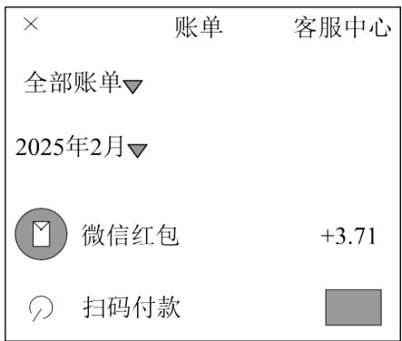

text_image

× 账单 客服中心
全部账单▼
2025年2月▼
✓ 微信红包 +3.71
○ 扫码付款 □

【答案】-7.35

【分析】本题主要考查了正负数的意义，

根据收到微信红包记作“+”，可知扫码付款记作“-”解答即可.

【详解】解：因为收到微信红包 3.71，记作“+3.71”，

所以扫码付款 7.35，记作“-7.35”.

故答案为：-7.35.

# 【题型3 正负数比较大小】

【例 3】（24-25 七年级上·广东深圳·期末）初中生佳佳为了美观，总是不喜欢穿厚裤子。妈妈规定；每天最低气温在0℃以下或者最高气温在8℃以下，必须穿保暖裤。按照本地天气预报，周一到周日佳佳有几天必须要穿保暖裤？分别是哪几天？

<table><tr><td></td><td>周一</td><td>周二</td><td>周三</td><td>周四</td><td>周五</td><td>周六</td><td>周日</td></tr><tr><td>最高气温(°C)</td><td>18</td><td>9</td><td>6</td><td>3</td><td>2</td><td>7</td><td>9</td></tr><tr><td>最低气温(°C)</td><td>8</td><td>2</td><td>0</td><td>-3</td><td>-5</td><td>-1</td><td>1</td></tr></table>

【答案】周一到周日佳佳有4天必须要穿保暖裤，分别周三、周四、周五、周六

【分析】本题考查了有理数的应用，熟练掌握相关知识点是解题的关键.

对周一到周日的气温数据逐一比对，即可得到答案.

【详解】解：根据表格数据得，

周一：最高气温 $18^{\circ}C > 8^{\circ}C$ ，最低气温 $8^{\circ}C > 0^{\circ}C$ ，故佳佳可以不穿保暖裤；

周二：最高气温 $9^{\circ}C > 8^{\circ}C$ ，最低气温 $2^{\circ}C > 0^{\circ}C$ ，故佳佳可以不穿保暖裤；

周三：最高气温 $6^{\circ}C<8^{\circ}C$ ，故佳佳必须穿保暖裤；

周四：最高气温 $3^{\circ}C<8^{\circ}C$ ，最低气温 $-3^{\circ}C<0^{\circ}C$ ，故佳佳必须穿保暖裤；

周五：最高气温 $2^{\circ}C<8^{\circ}C$ ，最低气温 $-5^{\circ}C<0^{\circ}C$ ，故佳佳必须穿保暖裤；

周六：最高气温 $7^{\circ}C<8^{\circ}C$ ，最低气温 $-1^{\circ}C<0^{\circ}C$ ，故佳佳必须穿保暖裤；

周日：最高气温 $9^{\circ}C > 8^{\circ}C$ ，最低气温 $1^{\circ}C > 0^{\circ}C$ ，故佳佳可以不穿保暖裤；

∴周一到周日佳佳有4天必须要穿保暖裤，分别周三、周四、周五、周六.

【变式 3-1】（24-25 七年级上·广东深圳·期末）在 -0.5, 0, 3, -1 这四个数中，最小的数是 \_\_\_\_；既不是正数也不是负数的是 \_\_\_\_.

【答案】 -1 0

【分析】本题考查了正负数的意义；根据正数大于0，负数小于0，正数大于一切负数，两个负数，绝对值大的反而小，0既不是正数也不是负数作答即可.

【详解】解：由题可知，-1<-0.5<0<3，

故最小的数是-1，

既不是正数也不是负数的是0，

故答案为：-1，0.

【变式 3-2】（24-25 六年级下·山东济南·期中）在 $-2^{\circ}C$ ， $8^{\circ}C$ ， $-32^{\circ}C$ ， $0^{\circ}C$ 中，最低温度是 \_\_\_\_，最高温度是 \_\_\_\_，其中 $-32^{\circ}C$ 表示 \_\_\_\_，读作 \_\_\_\_；零下 $18^{\circ}C$ 记作 \_\_\_\_。

【答案】 $-32^{\circ}\mathrm{C}$ $8^{\circ}\mathrm{C}$ 零下 $32^{\circ}\mathrm{C}$ 负三十二摄氏度或零下三十二摄氏度 $-18^{\circ}\mathrm{C}$

【分析】本题主要考查了正负数的意义，正确理解题意是解题的关键.

根据正负数表示据有相反意义的量，结合题意即可得出答案.

【详解】解：∵-32<-2<0<8，

∴ 最低温度是 $-32^{\circ}C$ ; 最高温度是 $8^{\circ}C$ ;

$-32^{\circ}C$ 表示零下 $32^{\circ}C$ ，读作负三十二摄氏度或零下三十二摄氏度；

零下18℃记作-18℃，

故答案为： $-32^{\circ}C$ ； $8^{\circ}C$ ；零下 $32^{\circ}C$ ；负三十二摄氏度或零下三十二摄氏度； $-18^{\circ}C$ .

【变式 3-3】（24-25 七年级上·宁夏银川·期中）下表是今年雨季某防汛小组测量的某条河的一周内的水位变化情况：（“+”表示水位比前一天上升，“-”号表示水位比前一天下降，单位是米）

<table><tr><td>星期</td><td>一</td><td>二</td><td>三</td><td>四</td><td>五</td><td>六</td><td>日</td></tr><tr><td>水位变化/米</td><td>+0.25</td><td>+0.52</td><td>-0.18</td><td>+0.06</td><td>-0.13</td><td>-0.49</td><td>+0.1</td></tr></table>

(1)上周末的水位是 73.07 米，本周星期一的水位是多少？

(2)在（1）的条件下，本周哪一天河流的水位最高？本周哪一天水位最低？它们位于警戒水位之上还是之下？

(3)与上周末相比，本周末的河流水位是上升了还是下降了，上升了或下降了多少米？

【答案】(1)73.32 米

(2)水位最高的是：周二，位于警戒水位以上；最低的是周六，位于警戒水位以下

(3)上升了0.13米

【分析】本题考查的是正负数的实际应用，有理数的加减混合运算的实际应用，理解题意，列出正确的运算式是解本题的关键.

（1）根据周一比上周末上升 0.25 米，结合正负数的实际意义，列式计算即可；  
(2) 根据非负数的意义分别计算每天的水位, 再比较即可;  
（3）用本周末的水位减去上周末的水位即可得到答案.

【详解】（1）解：由题意得， $73.07 + 0.25 = 73.32$ 米

(2) 解: 周一水位: 73.32 米,

周二水位： $73.32 + 0.52 = 73.84$ 米；

周三水位：73.84-0.18 = 73.66米；

周四水位： $73.66 + 0.06 = 73.72$ 米：

周五水位：73.72-0.13 = 73.59米；

周六水位：73.59-0.49 = 73.1米；

周日水位： $73.1 + 0.1 = 73.2$ 米，

则水位最高的是：周二，位于警戒水位以上；

最低的是周六，位于警戒水位以下；

（3）解：河流水位是上升了，73.2-73.07 = 0.13（米）.

∴上升了0.13米.

# 【题型4 借助正负数的实际意义解决实际问题】

【例 4】（24-25 七年级上·河南郑州·阶段练习）某项科学研究，以 45 分钟为 1 个时间单位，并记每天上午 10:00 时间为 0，10 时以前记为负，10 时以后记为正，例如：9:15 记为 -1，10:45 记为 1，依此类推，上午 6:15 记为（）

A. -4

B. -5

C. -3.45

D. 6.15

【答案】B

【分析】此题主要考查正负数在实际生活中的应用，解题关键是理解“正”和“负”的相对性，确定一对具有相反意义的量．先计算出上午6:15到10:00之间有多少分钟，再计算出有多少个45分钟，然后根据“正”和“负”的相对性，即可计算出正确结果.

【详解】解：上午6:15距10:00有225分钟， $225 \div 45 = 5$ ，

由于记每天上午10:00时间为0，10时以前记为负，10时以后记为正，

所以上午6:15记为-5.

故选：B.

【变式 4-1】（24-25 七年级上·山西太原·期中）如图，加工一种轴时，轴直径在299.5毫米到300.2毫米之间的产品都是合格品，在图纸上通常用 $\varphi300_{-0.5}^{+0.2}$ 来表示这种轴的加工要求，这里 $\varphi300$ 表示直径是300毫米，+0.2表示最大限度可以比300毫米多0.2毫米，-0.5表示最大限度可以比300毫米少0.5毫米．现加工四根轴，轴直径的加工要求都是 $\varphi50_{-0.02}^{+0.03}$ ，下列数据是加工成的轴直径，其中不合格的是（）

text_image

φ300⁺°°²₋°°⁵

A. 50.02

B. 50.01

C. 49.99

D. 49.88

【答案】D

【分析】根据题意可得出合格的范围，从而可判断出直径是否合格.

【详解】解：由题意得：合格范围为： $50 - 0.02 = 49.98$ 到 $50 + 0.03 = 50.03$ 而 $49.88\mathrm{mm} < 49.98\mathrm{mm}$

故可得 D 不合格.

故选D.

【点睛】本题考查正数和负数的知识，题目出的比较好，注意先求出合格的范围是关键.

【变式 4-2】（24-25 七年级上·辽宁鞍山·阶段练习）如图是加工零件的尺寸要求，现有下列直径尺寸的产品（单位：毫米）：①Φ44.9；②Φ45.02；③Φ44.99；④Φ45.01．其中不合格的是\_\_\_\_．（填写序号）

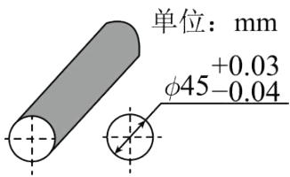

text_image

单位：mm
+0.03
φ45-0.04

【答案】①

【分析】本题主要考查的是正数和负数的意义，根据正负数的意义求得零件直径的合格范围是解题的关键．依据正负数的意义求得零件直径的合格范围，然后找出不符要求的选项即可.

【详解】解：∵45+0.03=45.03，45-0.04=44.96，

∴零件的直径的合格范围是： $44.96 \leq$ 零件的直径 $\leq 45.03$ ，

∵Φ44.9不在该范围之内，

∴不合格的是①，

故答案为：①.

【变式 4-3】（24-25 七年级上·安徽合肥·期中）纽约、悉尼与北京的时差如下表（正数表示同一时刻比北京早的时数，负数表示同一时刻比北京晚的时数）：当北京 10 月 8 日 15 时，悉尼、纽约的时间分别是（）

<table><tr><td>城市</td><td>悉尼</td><td>纽约</td></tr><tr><td>时差/时</td><td>+2</td><td>-13</td></tr></table>

A. 10月8日13时；10月9日4时

B. 10月8日17时；10月8日2时

C. 10月8日17时；10月9日4时

D. 10月8日13时；10月8日2时

【答案】B

【分析】由统计表得出：悉尼时间比北京时间早2小时，也就是10月8日17时．纽约比北京时间要晚13个小时，也就是10月8日2时.

【详解】解：悉尼的时间是：10月8日15时+2小时=10月8日17时，

纽约时间是：10月8日15时-13小时=10月8日2时.

故选：B.

【点睛】本题考查了正数和负数．解决本题的关键是根据图表得出正确信息，再结合题意计算.

# 【题型5 有理数的概念及分类】

【例 5】（24-25 七年级上·浙江杭州·阶段练习）下列说法中：（1）一个整数不是正数就是负数；（2）最小的整数是零；（3）负数中没有最大的数；（4）自然数一定是正整数；（5）有理数包括正有理数、零和负有理数；（6）整数就是正整数和负整数；（7）零是整数但不是正数；（8）正数、负数统称为有理数；（9）非负有理数是指正有理数和 0．正确的个数有\_\_\_\_个．

【答案】4

【分析】本题考查了有理数的概念和分类，根据有理数的概念和有理数的分类，正、负数依次进行判断即可.

【详解】解：整数分为正整数，0 和负整数，

∴一个整数不是正数就是负数错误，故（1）不符合题意；

没有最小的整数，故（2）不符合题意；

负数中没有最大的数，故（3）符合题意；

自然数包括 0，∴自然数一定是正整数错误，故（4）不符合题意；

有理数包括正有理数，零和负有理数，故（5）符合题意，

整数包括正整数，0 和负整数，故（6）不符合题意；

零是整数但不是正数，故（7）符合题意；

整数和分数统称为有理数，故（8）不符合题意；

非负有理数是指正有理数和0，故（9）符合题意，

综上所述，正确的有（3）（5）（7）（9），共4个，

故答案为：4.

【变式 5-1】（24-25 七年级上·湖北武汉·期末）下列关于“0”的叙述中，不正确的是（）

A. 表示“没有”，但有实际意义，是“正数”与“负数”的分界

B. 既不是正数，也不是负数

C. 是整数，也是最小的自然数

D. 不能写成分数的形式，不是有理数

【答案】D

【分析】本题考查了有理数，0 是重要的数，掌握有理数的相关概念和分类是解题的关键．依据 0 的含义以及有理数分类逐一判断即可.

【详解】解：A、表示“没有”，但有实际意义，是“正数”与“负数”的分界，故此选项正确，不符合题意；

B、0 既不是正数，也不是负数，故此选项正确，不符合题意；

C、0 是整数，也是最小的自然数，故此选项正确，不符合题意；

D、0 能写成分数的形式，是有理数，故此选项错误，符合题意；.

故选：D.

【变式 5-2】（24-25 七年级上·江苏常州·期中）下列各数：0.5，2π，1.264850349，0， $\frac{22}{7}$ ，0.2121121112…
（相邻两个 2 之间 1 的个数逐次加 1），其中有理数有 \_\_\_\_ 个.

【答案】4

【分析】本题考查有理数．根据整数和分数统称为有理数，进行判断即可.

【详解】解：0.5，2π，1.264850349，0， $\frac{22}{7}$ ，0.2121121112…（相邻两个2之间1的个数逐次加1），其中有理数有0.5，1.264850349，0， $\frac{22}{7}$ ，共4个；

故答案为：4.

【变式 5-3】（24-25 七年级上·甘肃平凉·期中）现给出如下有理数：-1.1，0，-0.8， $-3\frac{1}{3}$ ，5．其中负有理数的个数是（）

A. 4个

B. 3个

C. 2个

D. 1 个

【答案】B

【分析】本题考查有理数的分类，根据负有理数包括负整数和负分数，进行判断即可.

【详解】解：-1.1，0，-0.8， $-3\frac{1}{3}$ ，5中，负有理数有-1.1，-0.8， $-3\frac{1}{3}$ ，共3个；故选B.

# 【题型6 数的集合】

【例 6】（24-25 七年级上·山东济宁·期中）把下列各数填在相应的括号里.

-3, 2 $\frac{1}{3}$ , 0, $-\frac{\pi}{2}$ , 0.1010010001, $-12\%$ , 6, $-0.\dot{3}$ , 3.14, $-\frac{2}{7}$

整数集合：{ ...}

负分数集合：{ ...}

非负有理数集合：{ …}

【答案】见解析

【分析】本题主要考查了有理数分类，熟练掌握有理数的相关概念和分类，是解答本题的关键．根据整数、分数、正数、负数以及非负有理数的定义解答即可.

【详解】解：-3， $2\frac{1}{3}$ ，0， $-\frac{\pi}{2}$ ，0.1010010001，-12%，6，-0.3，3.14， $-\frac{2}{7}$ .

整数集合： $\{-3, 0, 6\}$ ;

负分数集合： $\{-12\%, -0.3, -\frac{2}{7}\}$ ;

非负有理数集合： $\left\{2\frac{1}{3},0,0.1010010001,6,3.14\right\}$ .

【变式 6-1】（24-25 七年级上·河北邯郸·期中）在表中符合条件的空格里画上“√”.

<table><tr><td></td><td>有理数</td><td>整数</td><td>分数</td><td>正整数</td><td>负分数</td><td>自然数</td></tr><tr><td>-8是</td><td></td><td></td><td></td><td></td><td></td><td></td></tr><tr><td>-2.25是</td><td></td><td></td><td></td><td></td><td></td><td></td></tr><tr><td> $\frac{3}{5}$ 是</td><td></td><td></td><td></td><td></td><td></td><td></td></tr><tr><td>0是</td><td></td><td></td><td></td><td></td><td></td><td></td></tr></table>

【答案】

<table><tr><td></td><td>有理数</td><td>整数</td><td>分数</td><td>正整数</td><td>负分数</td><td>自然数</td></tr><tr><td>-8是</td><td></td><td></td><td></td><td></td><td></td><td></td></tr><tr><td>-2.25是</td><td></td><td></td><td>√</td><td></td><td>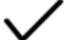</td><td></td></tr><tr><td rowspan="2"> $\frac{3}{5}$ 是</td><td>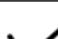</td><td></td><td rowspan="2">√</td><td></td><td></td><td>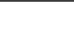</td></tr><tr><td>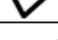</td><td>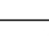</td><td></td><td>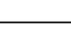</td><td>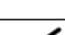</td></tr><tr><td>0是</td><td>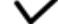</td><td>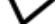</td><td></td><td></td><td></td><td>√</td></tr></table>

【分析】根据有理数的分类，分别对：-8，-2.25， $\frac{3}{5}$ ，0进行分类判断即可.

【详解】解：-8 属于有理数、整数；-2.25 属于有理数、分数、负分数； $\frac{3}{5}$ 属于有理数、分数；0 属于有理数、整数、自然数.

【点睛】本题考查了有理数，熟练掌握有理数的分类是解题的关键.

【变式 6-2】（24-25 七年级上·安徽六安·期末）把下列各数填入图中相应的位置，并填写公共部分的名称.

$$
- 1 6, 0, - \frac {2}{3}, - 4, - 3. 6, + 3 2
$$

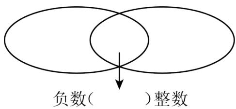

text_image

负数( )整数

【答案】见解析

【分析】本题主要查了有理数的分类．根据有理数的分类解答即可.

【详解】解：如图：

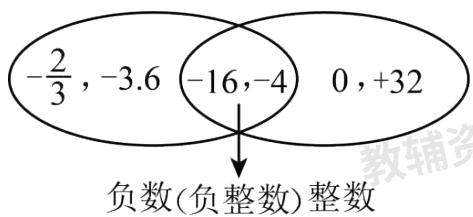

text_image

-2/3, -3.6 -16,-4 0,+32
负数(负整数)整数

【变式 6-3】（24-25 七年级上·广东深圳·期中）将下列各数填入适当的括号内：

$$
5, - 3, \frac {3}{4}, 8. 9, \pi , - \frac {6}{7}, - 3. 1 4, - 9, 0, 2 \frac {3}{5}
$$

(1)正有理数集合：{ ...}

(2)负有理数集合：{ ...}

(3)整数集合：{ ...}

(4)分数集合：{ ...}

【答案】(1)5, $\frac{3}{4}$ , 8.9, $\pi$ , $2\frac{3}{5}$ ,

(2)-3, $-\frac{6}{7}$ , -3.14, -9,

(3)5, -3, -9, 0,

(4) $\frac{3}{4}$ , 8.9, $-\frac{6}{7}$ , -3.14, $2\frac{3}{5}$ ,

【分析】此题考查了有理数的分类，根据有理数的分类方法进行解答即可.

(1) 根据正有理数的意义进行解答即可;  
(2) 根据负有理数的意义进行解答即可:  
(3) 根据整数的意义进行解答即可;  
(4) 根据分数的意义进行解答即可.

【详解】（1）解：正有理数集合： $\{5,\frac{3}{4},8.9,\pi,2\frac{3}{5},\ldots\}$

（2）解：负有理数集合： $\{-3, -\frac{6}{7}, -3.14, -9, \ldots\}$   
（3）解：整数集合： $\{5, -3, -9, 0, \ldots\}$   
（4）解：分数集合： $\left\{\frac{3}{4},8.9,-\frac{6}{7},-3.14,2\frac{3}{5},\ldots\right\}$

# 【题型7 有理数与规律探究】

【例 7】（24-25 七年级上·广东茂名·阶段练习）将一串有理数按下列规律排列，回答下列问题：

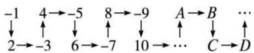

flowchart

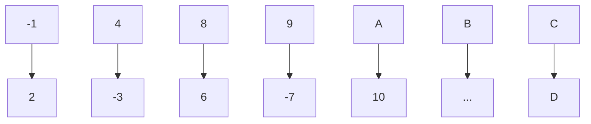

(1)在 A 处的数是正数还是负数?  
(2)负数排在 A, B, C, D 中的什么位置?  
(3)第2028个数是正数还是负数？排在对应于A，B，C，D中的什么位置？

【答案】(1)正数;(2)B、D;(3)正数，A.

【分析】由数字排列规律可知：A 是正数，B 是负数，C 是正数，D 是负数.每 4 个数一循环.

【详解】解：(1)在 A 处的数是正数.

(2)负数排在 B，D 的位置上.  
(3)2028=4×507.所以第2028个数是正数，排在对应A的位置上.

【点睛】本题考核知识点：数列规律. 解题关键点：观察规律，找出循环，注意符号.

【变式 7-1】（24-25 七年级上·浙江杭州·阶段练习）观察下列各数： $-\frac{1}{2},\frac{2}{3},-\frac{3}{4},\frac{4}{5},-\frac{5}{6},\cdots$ ，根据它们的排列规律写出第2024个数为\_\_\_\_。

【答案】 $\frac{2024}{2025}$

【分析】根据目中所给分数的特征，总结规律即可得解.

【详解】解：∵ $-\frac{1}{2}$ ， $\frac{2}{3}$ ， $-\frac{3}{4}$ ， $\frac{4}{5}$ ， $-\frac{5}{6}$ ，…，

:每一项的符号是奇数位置为负，偶数位置为正，分子是所在位置的序号，分母比分子大1，故第2024个数

为 $\frac{2024}{2025}$ ,

故答案为： $\frac{2024}{2025}$

【点睛】此题考查数字的变化规律，发现数字之间的联系，找出数字之间的规律，利用规律解决问题.

【变式 7-2】（24-25 九年级上·甘肃庆阳·期末）下列图形都是由完全相同的圆点“●”和五角星“★”按一定规律组成的，已知第 1 个图形中有 8 个“●”和 1 个“★”，第 2 个图形中有 16 个“●”和 4 个“★”，第 3 个图形中有 24 个“●”和 9 个“★”，…，则第\_\_\_\_个图形中“●”的个数和“★”的个数相等.

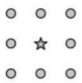  
第1个图形

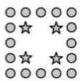  
第2个图形

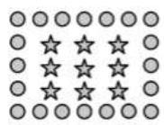  
第3个图形

【答案】8.

【分析】解题时根据前 3 个数据理清规律就可以得到结果

【详解】根据前 3 组数据的规律，可以得到下面的数据：

<table><tr><td></td><td></td><td>●</td><td>★</td></tr><tr><td>第4个图形</td><td>32</td><td>16</td><td></td></tr><tr><td>第5个图形</td><td>40</td><td>25</td><td></td></tr><tr><td>第6个图形</td><td>48</td><td>36</td><td></td></tr><tr><td>第7个图形</td><td>56</td><td>49</td><td></td></tr><tr><td>第8个图形</td><td>64</td><td>64</td><td></td></tr><tr><td colspan="4">故答案为第8个</td></tr></table>

【点睛】此题重点考查学生对数据规律的探索能力，根据前 3 个数据找出规律是解题的关键

【变式 7-3】（24-25 七年级上·山东青岛·期末）观察下面一列数：-1,2,-3,4,-5,6,-7,8,-9，....

(1)请写出这一列数中的第 100 个数和第 2026 个数.  
(2)在前 2026 个数中，正数和负数分别有多少个？  
(3)2025 和 -2025 是否都在这一列数中？若在，请指出它们分别是第几个数；若不在，请说明理由.

【答案】(1)第 100 个数是 100，第 2026 个数 2026

(2)分别有 1023 个   
(3)2025 和 -2025 不能都在这一列数中，理由见解析

【分析】（1）由题意可得：这一列数是正负相间的连续整数，且奇数项为负，规律是： $(-1)^{n}$ ，由此即可

# 解答;

(2) 在前 2026 个数中, 正数和负数的个数相等, 即可得出答案;  
（3）由规律可得：-2025在这一列数中，但2025不在这一列数中，进而可得答案.

【详解】（1）由题意可得：这一列数是正负相间的整数，且奇数项为负，规律是： $(-1)^{n}\cdot n$ ，所以第100个数是100，第2026个数2026；

（2）在前 2026 个数中，正数和负数的个数相等，分别有 1023 个；  
（3）由规律可得：-2025在这一列数中，但2025不在这一列数中，所以2025和-2025不能都在这一列数中.

【点睛】本题考查了数字类规律探寻，由题意归纳出规律是关键.