# 专题 2.2 数轴、相反数（举一反三讲义）

# 【北师大版 2024】

# 题型归纳

【题型 1 识别数轴】....2

【题型2 用数轴上的点表示有理数】....3

【题型3 数轴上的整点问题】....3

【题型4 数轴上点的平移】....4

【题型5相反数的定义】 4

【题型6 根据相反数定义求值】 5

【题型 7 化简多重符号】....5

【题型8 数轴与相反数的综合】....6

# 举一反三

教辅资源，关注公众号★全科AA+

# 知识点1 数轴

定义：规定了原点、正方向和单位长度的直线叫作数轴，它满足以下条件：

(1) 在直线上任取一个点表示数 0，这个点叫作原点；  
(2) 通常规定直线上从原点向右（或上）为正方向，从原点向左（或下）为负方向；  
(3) 选取适当的长度为单位长度, 直线上从原点向右, 每隔一个单位长度取一个点, 依次表示 $1, 2, 3, \dots$ ; 从原点向左, 用类似的方法依次表示 $-1, -2, -3, \dots$ .

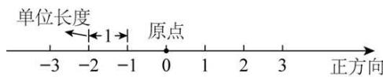

text_image

单位长度
←1→
原点
-3 -2 -1 0 1 2 3 正方向

# 知识点 2 数轴上的点与有理数之间的关系

1. 每个有理数都可以用数轴上的一点来表示，也可以说，每个有理数都对应数轴上的一点.  
2. 一般地, 设 $a$ 是一个正数, 则数轴上表示数 $a$ 的点在数轴的正半轴上, 与原点的距离是 $\underline{a}$ 个单位长度; 表示数 $-a$ 的点在数轴的负半轴上, 与原点的距离是 $\underline{a}$ 个单位长度.

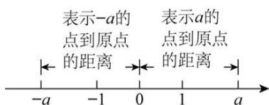

text_image

表示-a的
点到原点
的距离
表示a的
点到原点
的距离
-a -1 0 1 a

1. 相反数的定义: 像3和-3, $\frac{1}{2}$ 和 $-\frac{1}{2}$ 这样只有符号不同的两个数, 互为相反数.

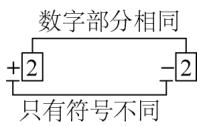

2. 相反数的表示方法: 一般地, $a$ 和 $-a$ 互为相反数. 这里, $a$ 表示任意一个数, 可以是正数、负数, 也可以是 $\underline{\mathbf{0}}$ .

例如：当a=1时，-a=-1，1的相反数是-1，同时，-1的相反数是1.

特别地，0 的相反数是 0.

3. 相反数的几何意义: 到数轴原点距离相等的两个点表示的两个数互为相反数.

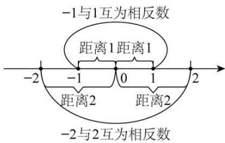

text_image

-1与1互为相反数
距离1距离1
-2 -1 0 1 2
距离2 距离2
-2与2互为相反数

4. 求一个数的相反数：在任意一个数前面添上“=”号，新的数就表示原数的相反数.

5. 多重符号的化简：与“+”号个数无关，有奇数个“-”号，结果为负，有偶数个“-”号，结果为正.

【题型 1 识别数轴】教辅资源，关注公众号★全科AA+

【例 1】（24-25 七年级上·云南文山·阶段练习）下列图形中是数轴的是（）

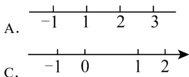

text_image

A. -1 1 2 3
C. -1 0 1 2

B.

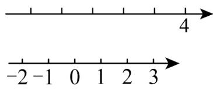

text_image

-2 -1 0 1 2 3
4

【变式 1-1】关于数轴下列说法最准确的是()

A. 一条直线

B. 有原点、正方向的一条直线

C. 有单位长度的一条直线

D. 规定了原点、正方向和单位长度的直线

【变式 1-2】下列说法:

①规定了原点、正方向的直线是数轴

②数轴上两个不同的点可以表示同一个有理数

③有理数 $-\frac{1}{100}$ 数轴上无法表示出来

④任何一个有理数都可以在数轴上找到与它对应的唯一点

其中正确的是（）

A. ①②③④

B. ②②③④

C. ③④

D. ④

【变式 1-3】超市、书店、玩具店依次坐落在一条东西走向的大街上，超市在书店西边 20 米处，玩具店位于书店东边 50 米处．请选择适当的单位长度画出数轴，并在数轴上标出超市、书店、玩具店的位置.

# 【题型2 用数轴上的点表示有理数】

【例 2】（24-25 九年级下·四川广安·期中）如图，数轴上点B表示的数是-2025,OA = OB，则点A表示的数是（）

A. 2025

B. -2025

C. $\frac{1}{2025}$

D. $-\frac{1}{2025}$

【变式 2-1】（24-25 六年级上·上海闵行·阶段练习）如图，点 A 在数轴上所表示的数是 \_\_\_\_.

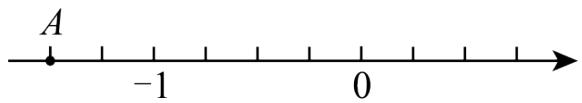

text_image

A
-1
0

【变式 2-2】如图，图中 1 格代表1m，点 A 在 -2 处，点 B 在点 A 右侧5m处，则点 B 表示数为（）

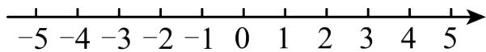

text_image

-5 -4 -3 -2 -1 0 1 2 3 4 5

A. 5

B. 3

C. -7

D. -5

【变式 2-3】（24-25 七年级上·吉林长春·期末）如图，小明同学借助刻度尺画了一条数轴，其中原点落在示数 7 的刻度线上，表示数字 1 的点落在示数 9 的刻度线上，则这条数轴上表示数字 -1.5 的点对应刻度尺的示数为 \_\_\_\_.

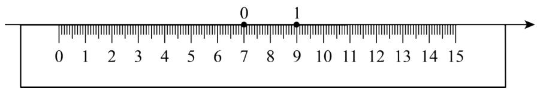

text_image

0
7
1
9

# 【题型3 数轴上的整点问题】

【例 3】（24-25 七年级上·河南南阳·期中）小宇不小心将墨水滴在了数轴上，使部分数轴被墨迹遮盖，则被遮盖的部分中表示整数的点有（）

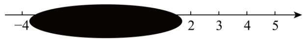

text_image

-4
2 3 4 5

A. 3 个

B. 4 个

C. 5 个

D. 6 个

【变式 3-1】如图，数轴上被遮挡的整数是（）

text_image

-2
0
1
2

A.-3

B. -1

C. -4

D. 3

【变式 3-2】（24-25 七年级上·辽宁盘锦·阶段练习）如图，小冰在写作业时不慎将墨水滴在数轴上，此时墨迹盖住的整数有 \_\_\_\_ 个.

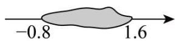

【变式 3-3】若数轴上表示整数的点称为整点，画一数轴，并规定单位长度为1厘米，若在这条数轴上随意画出一条长10厘米的线段AB，则线段AB盖住的整点有（）

A. 8个或9个

B. 9个或10个

C. 10个或11个

D. 11个或12个

【题型 4 数轴上点的平移】教辅资源，关注 公众号★全科AA+

【例 4】（24-25 七年级上·全国·期末）在数学超市课上，李老师出了这样一道题：点A是数轴上一点，一只蚂蚁从点A出发爬了5个单位长度到了表示的数2的点，则点A所表示的数是 \_\_\_\_.

【变式 4-1】（24-25 七年级上·甘肃平凉·期中）把数轴上表示数 2 的点向右移动 3 个单位后，表示的数为（）

A. 5

B. 1

C. 5 或 -1

D. 都不正确

【变式 4-2】（24-25 七年级上·河北唐山·期中）如图，将点P向右平移2个单位，对应的数是（）

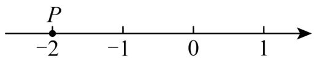

text_image

P
-2 -1 0 1

A. -1

B. 0

C. 1

D. 2

【变式 4-3】（24-25 六年级上·山东济宁·期中）若数轴上的点A距离原点3个单位长度，若一个点从点A出发向右移动2个单位长度，此时终点所表示的数是\_\_\_\_。

# 【题型5 相反数的定义】

【例 5】（24-25 七年级上·广东广州·期中）下列各对数中，互为相反数的是（）

A. -0.5和 $\frac{1}{2}$

B. 2和 $\frac{1}{2}$

C. -3和 $\frac{1}{3}$

D. $\frac{1}{3}$ 和-2

【变式 5-1】（20-21 七年级上·吉林长春·阶段练习）若一个数的相反数比它本身大，则这个数为 \_\_\_\_

【变式 5-2】（22-23 七年级·江苏·假期作业）填空：

(1) $-(-2.5)$ 的相反数是\_\_\_\_;

(2) \_\_\_\_是-100的相反数;

(3) $-5\frac{1}{5}$ 是\_\_\_\_的相反数;   
(4) \_\_\_\_的相反数是-1.1;   
(5) 8.2 和 \_\_\_\_ 互为相反数.  
(6) a 和 \_\_\_\_ 互为相反数.  
(7) \_\_\_\_的相反数比它本身大，\_\_\_\_的相反数等于它本身.

【变式 5-3】（24-25 七年级上·湖南怀化·期中）下面各组数中：① $\frac{1}{2}$ 和 $-\frac{1}{2}$ ；② $-(-6)$ 和 $+(-6)$ ；③ $-(-4)$ 和 $+(+4)$ ；④ $-(+1)$ 和 $+(-1)$ ；⑤ $+5\frac{1}{2}$ 和 $+\left(-5\frac{1}{2}\right)$ ；⑥ $-3\frac{1}{7}$ 和 $-\left(-3\frac{1}{7}\right)$ 。互为相反数的是 \_\_\_\_（填序号）。

# 【题型6 根据相反数定义求值】

【例 6】（24-25 七年级上·湖南湘潭·期末）如图是一个正方体的表面展开图，若该正方体相对面上的两个数互为相反数，则 $a = \_\_\_\_$ ， $b = \_\_\_\_$ ， $c = \_\_\_\_$

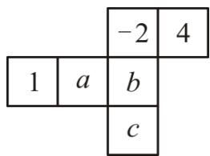

text_image

-2 4
1 a b
c

【变式 6-1】（24-25 七年级上·广西贺州·期末）a 的相反数是 -1，这个数 a 是 \_\_\_\_.

【变式 6-2】（2024 七年级上·全国·专题练习）相反数等于它本身的数 m 是 \_\_\_\_。

【变式 6-3】（24-25 七年级上·江苏宿迁·期末）已知a-3与-4互为相反数，则a= \_\_\_\_.

# 【题型 7 化简多重符号】 教辅资源，关注公众号★全科AA+

【例 7】（24-25 七年级上·内蒙古乌兰察布·阶段练习）给出下列各数：+(-10)，-(+15)，-(-7)，- $[+(-9)]$ ，- $[-(-20)]$ 。其中负数有（）

A. 0 个

B. 2 个

C. 3 个

D. 4 个

【变式 7-1】（22-23 七年级上·宁夏吴忠·阶段练习） $-\left[-(-2)\right]$ 的值是\_\_\_\_.

【变式 7-2】（23-24 七年级上·山东德州·阶段练习）化简：①-|+(-2.9)|= \_\_\_\_. ②-(-3)= \_\_\_\_. ③-[-(-0.5)]= \_\_\_\_. ④-|-(+2021)|= \_\_\_\_.

【变式 7-3】（24-25 七年级上·新疆和田·阶段练习）化简下列各数：

(1) + (-2);   
(2)-(+5);

(3)-(-3.4);

(4) $-\left[+\left(-8\right)\right]$ ;

(5) $-\left[-(-9)\right]$ .

# 【题型8 数轴与相反数的综合】

【例 8】（24-25 八年级下·海南儋州·期中）如图，数轴上点A表示的数的相反数是（）

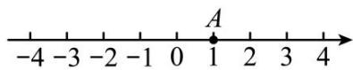

A.-2

B. -1

C. 0

D. 1

【变式 8-1】（24-25 七年级上·安徽阜阳·阶段练习）在数轴上，若点A，B分别表示互为相反数的两个数，并且这两个点的距离是8，点A在原点的左侧，则点A表示的数为\_\_\_\_。

【变式 8-2】（2024 七年级上·全国·专题练习）如图所示，A, B, C为数轴上三点，且当A为原点时，点B表示的数是2，点C表示的数是5．若以B为原点，则点A表示的数是\_\_\_\_，点C表示的数是\_\_\_\_；若A, C表示的两个数互为相反数，则点B表示的数是\_\_\_\_.

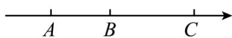

【变式 8-3】（24-25 七年级下·全国·期中）如图，将一刻度尺放在数轴上（数轴的单位长度是1cm），刻度尺上的“0cm”和“6cm”分别对应数轴上表示实数-2和实数x的两点，若x与-2互为相反数，则数轴上原点O对应刻度尺上的数值为\_\_\_\_。

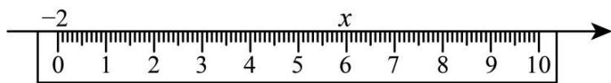

text_image

-2
0 1 2 3 4 5 6 7 8 9 10
x

