# 专题 2.2 数轴、相反数（举一反三讲义）

【北师大版 2024】

# 题型归纳

【题型 1 识别数轴】....2

【题型2 用数轴上的点表示有理数】....4

【题型3 数轴上的整点问题】 5

【题型4 数轴上点的平移】....7

【题型5 相反数的定义】 8

【题型6 根据相反数定义求值】....10

【题型 7 化简多重符号】....11

【题型8 数轴与相反数的综合】....13

# 举一反三

# 知识点1 数轴

定义: 规定了原点、正方向和单位长度的直线叫作数轴, 它满足以下条件:

(1) 在直线上任取一个点表示数 0，这个点叫作原点；  
(2) 通常规定直线上从原点向右（或上）为正方向，从原点向左（或下）为负方向；  
(3) 选取适当的长度为单位长度, 直线上从原点向右, 每隔一个单位长度取一个点, 依次表示 $1, 2, 3, \dots$ ; 从原点向左, 用类似的方法依次表示 $-1, -2, -3, \dots$ .

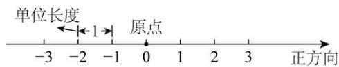

text_image

单位长度
←1→
原点
-3 -2 -1 0 1 2 3 正方向

# 知识点 2 数轴上的点与有理数之间的关系

1. 每个有理数都可以用数轴上的一点来表示，也可以说，每个有理数都对应数轴上的一点.  
2. 一般地, 设 $a$ 是一个正数, 则数轴上表示数 $a$ 的点在数轴的正半轴上, 与原点的距离是 $\underline{a}$ 个单位长度; 表示数 $-a$ 的点在数轴的负半轴上, 与原点的距离是 $\underline{a}$ 个单位长度.

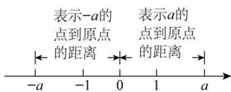

text_image

表示-a的
点到原点
的距离
表示a的
点到原点
的距离
-a -1 0 1 a

1. 相反数的定义: 像3和-3, $\frac{1}{2}$ 和 $-\frac{1}{2}$ 这样只有符号不同的两个数, 互为相反数.

2. 相反数的表示方法: 一般地, $a$ 和 $-a$ 互为相反数. 这里, $a$ 表示任意一个数, 可以是正数、负数, 也可以是 $\underline{\mathbf{0}}$ .

例如：当a=1时，-a=-1，1的相反数是-1，同时，-1的相反数是1.

特别地，0的相反数是0.

3. 相反数的几何意义: 到数轴原点距离相等的两个点表示的两个数互为相反数.

text_image

-1与1互为相反数
距离1距离1
-2 -1 0 1 2
距离2 距离2
-2与2互为相反数

4. 求一个数的相反数: 在任意一个数前面添上“=”号, 新的数就表示原数的相反数.

5. 多重符号的化简：与“+”号个数无关，有奇数个“-”号，结果为负，有偶数个“-”号，结果为正.

# 【题型1 识别数轴】

【例 1】（24-25 七年级上·云南文山·阶段练习）下列图形中是数轴的是（）

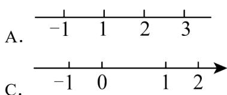

text_image

A. -1 1 2 3
C. -1 0 1 2

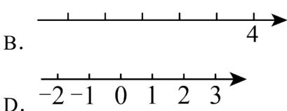

text_image

B.
4
D.

【答案】D

【分析】本题考查数轴的定义，掌握数轴的定义是解题的关键；

根据数轴的三要素是原点，单位长度，正方向，分析哪个图形含有这三要素，就是数轴；

【详解】解：A、没有方向，故错误；

B、没有原点，故错误；  
C、单位长度不一样长，故错误；  
D、符合所有条件，是数轴，故正确；

故选：D

【变式 1-1】关于数轴下列说法最准确的是()

A. 一条直线

B. 有原点、正方向的一条直线

C. 有单位长度的一条直线

D. 规定了原点、正方向和单位长度的直线

【答案】D

【详解】数轴是规定了原点、正方向和单位长度的直线．故可知：D 正确.

故选 D.

【变式 1-2】下列说法:

①规定了原点、正方向的直线是数轴  
②数轴上两个不同的点可以表示同一个有理数  
③有理数 $-\frac{1}{100}$ 数轴上无法表示出来  
④任何一个有理数都可以在数轴上找到与它对应的唯一点

其中正确的是（）

A. ①②③④

B. ②②③④

C. ③④

D. ④

【答案】D

【分析】根据数轴的概念：规定了原点、正方向、单位长度的直线叫做数轴．所有的有理数都可以用数轴上的点表示，但数轴上的点不都表示有理数可得答案.

【详解】①规定了原点、正方向和单位长度的直线是数轴，故原说法错误；

②数轴上两个不同的点可以表示两个不同的有理数，故原说法错误；  
③有理数 $-\frac{1}{100}$ 在数轴上可以表示出来，故原说法错误；  
④任何一个有理数都可以在数轴上找到与它对应的唯一点，说法正确；

故选：D.

【点睛】此题主要考查了数轴，关键是掌握数轴的概念.

【变式 1-3】超市、书店、玩具店依次坐落在一条东西走向的大街上，超市在书店西边 20 米处，玩具店位于书店东边 50 米处．请选择适当的单位长度画出数轴，并在数轴上标出超市、书店、玩具店的位置.

【答案】答案见解析

【分析】以东为正方向，书店为原点画数轴，然后根据数轴表示数的方法在数轴上分别表示出超市、书店、玩具店的位置即可.

【详解】解：以东为正方向，书店为原点画数轴，单位长度代表10米，如下图：

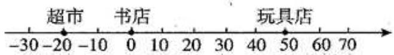

text_image

超市
书店
玩具店
-30 -20 -10 0 10 20 30 40 50 60 70

【点睛】本题考查了数轴的三要素：原点、正方向和单位长度，合理的选择原点和单位长度是解答本题的关键.

# 【题型2 用数轴上的点表示有理数】

【例 2】（24-25 九年级下·四川广安·期中）如图，数轴上点B表示的数是-2025,OA = OB，则点A表示的数是（）

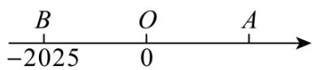

A. 2025

B. -2025

C. $\frac{1}{2025}$

D. $-\frac{1}{2025}$

【答案】A

【分析】本题考查的是数轴，解题的关键是根据题中提取的数量关系来求解．根据OA = OB，求出OA，继而可以求出点A表示的数.

【详解】解：∵OA = OB，点 B 表示的数是 -2025，

$$
\therefore O A = 2 0 2 5,
$$

∵点 A 在 O 点右侧，

∴点 A 表示的数为： $0 + 2025 = 2025$ ，

故选:A.

【变式 2-1】（24-25 六年级上·上海闵行·阶段练习）如图，点 A 在数轴上所表示的数是 \_\_\_\_.

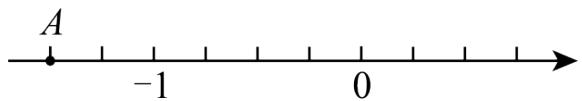

text_image

A
-1
0

【答案】-1.5

【分析】本题考查了了数轴表示数，根据所给数轴，得出一个单位长度为4小格，据此可得出答案，能根据题意得出一个单位长度为4小格是解题的关键.

【详解】解：由所给数轴可知，一个单位长度为4小格，

∴点A与-1相距0.5个单位长度，且在-1的左边，

∴点A表示的数为-1.5，

故答案为：-1.5.

【变式 2-2】如图，图中 1 格代表1m，点 A 在 -2 处，点 B 在点 A 右侧5m处，则点 B 表示数为（）

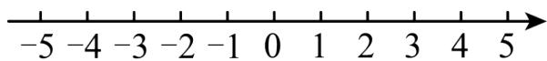

text_image

-5 -4 -3 -2 -1 0 1 2 3 4 5

A. 5

B. 3

C. -7

D. -5

【答案】B

【分析】此题考查了数轴，根据 $-2+5=3$ 即可得出答案.

【详解】解：∵点 A 在 -2 处，点 B 在点 A 右侧 5m 处，

∴点 B 表示数为 $-2 + 5 = 3$ .

故选：B.

【变式 2-3】（24-25 七年级上·吉林长春·期末）如图，小明同学借助刻度尺画了一条数轴，其中原点落在示数 7 的刻度线上，表示数字 1 的点落在示数 9 的刻度线上，则这条数轴上表示数字 -1.5 的点对应刻度尺的示数为 \_\_\_\_.

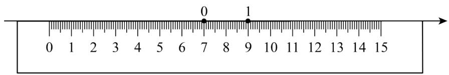

text_image

0
7
9
1

【答案】4

【分析】本题主要考查数轴，熟练掌握数轴的表示方法是解题的关键．根据数轴上1个单位长度表示2cm，即可得到答案.

【详解】解：由题意可得：数轴上1个单位长度表示2cm，

故1.5个单位长度表示 $2 \times 1.5 = 3cm$ ,

则这条数轴上表示数字-1.5的点对应刻度尺的示数为7-3=4，

故答案为：4.

# 【题型3 数轴上的整点问题】

【例 3】（24-25 七年级上·河南南阳·期中）小宇不小心将墨水滴在了数轴上，使部分数轴被墨迹遮盖，则被遮盖的部分中表示整数的点有（）

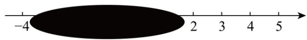

text_image

-4
2 3 4 5

A. 3 个

B. 4 个

C. 5 个

D. 6 个

【答案】C

【分析】此题考查了用数轴上的点表示有理数．写出被遮盖的部分中整数即可得到答案.

【详解】解：根据题意可得，被遮盖的部分中整数有-3,-2,-1,0,1，共5个，即被遮盖的部分中表示整数的

点有 5 个，

故选：C

【变式 3-1】如图，数轴上被遮挡的整数是（）

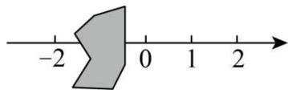

text_image

-2
0
1
2

A. -3

B. -1

C. -4

D. 3

【答案】B

【分析】在数轴上，原点右侧为正数，原点右侧为负数，且数轴上的点越往右数越大，越往左数越小.

【详解】解：被遮住的左边是整数-2，右边是0，因此被遮挡的整数是-1.

故选 B.

【点睛】本题主要考查数轴表示数的意义，互为相反数的求法，理解数轴表示数的意义.

【变式 3-2】（24-25 七年级上·辽宁盘锦·阶段练习）如图，小冰在写作业时不慎将墨水滴在数轴上，此时墨迹盖住的整数有 \_\_\_\_ 个.

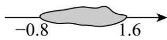

【答案】2

【分析】本题考查了数轴的特点，理解并掌握数轴上点与数的一一对应关系是解题的关键.根据数轴的特点，数形结合分析即可求解.

【详解】解：根据数轴的特点，墨迹盖住的整数有0，1，共2个，

故答案为：2.

【变式 3-3】若数轴上表示整数的点称为整点，画一数轴，并规定单位长度为1厘米，若在这条数轴上随意画出一条长10厘米的线段AB，则线段AB盖住的整点有（）

A. 8个或9个

B. 9个或10个

C. 10个或11个

D. 11个或12个

【答案】C

【分析】分线段AB的端点在整点上和不在整点上两种情况讨论，据此得出规律即可解答本题.

【详解】解：依题意得：①当线段AB的端点在整点上时，覆盖11个数；

②当线段AB的端点不在整点，即在两个整点之间时覆盖10个数.

故选：C.

【点睛】本题主要考查了分类讨论思想和数形结合思想的应用，AB取一个较小的整数，然后画出图形得出规律是解决此题的关键.

# 【题型4 数轴上点的平移】

【例 4】（24-25 七年级上·全国·期末）在数学超市课上，李老师出了这样一道题：点A是数轴上一点，一只蚂蚁从点A出发爬了5个单位长度到了表示的数2的点，则点A所表示的数是 \_\_\_\_.

【答案】7或-3

【分析】本题主要考查了数轴的动点问题，准确计算是解题的关键.

根据题意，分两种情况讨论即可求解；

【详解】解：从数轴上A点出发向左爬了5个单位长度到了表示的数2的点，则A点表示的数是 $2+5=7$ ；从数轴上A点出发向右爬了5个单位长度到了表示的数2的点，则A点表示的数是2-5=-3；

综上所述，点A所表示的数是7或-3；

故答案为：7或-3

【变式 4-1】（24-25 七年级上·甘肃平凉·期中）把数轴上表示数 2 的点向右移动 3 个单位后，表示的数为（）

A. 5

B. 1

C. 5 或 -1

D. 都不正确

【答案】A

【分析】本题考查了数轴，熟知“左减右加”的法则是解答此题的关键.

根据“左减右加”的法则进行解答即可.

【详解】解：把数轴上表示数 2 的点向右移动 3 个单位长度后，即 $2 + 3 = 5$ ，表示的数为 5，
故选：A.

【变式 4-2】（24-25 七年级上·河北唐山·期中）如图，将点P向右平移2个单位，对应的数是（）

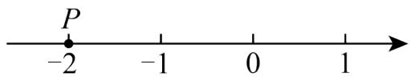

text_image

P
-2 -1 0 1

A. -1

B. 0

C. 1

D. 2

【答案】B

【分析】本题考查了数轴上点的平移，掌握“左减右加”的原则是解答本题的关键．根据“左减右加”的原则即可求解.

【详解】解：将点P向右平移2个单位，对应的数是0，

故选：B.

【变式 4-3】（24-25 六年级上·山东济宁·期中）若数轴上的点A距离原点3个单位长度，若一个点从点A出发向右移动2个单位长度，此时终点所表示的数是\_\_\_\_。

【答案】-1或5

【分析】本题考查数轴上的点所表示的数，根据数轴上的点距离原点3个单位长度，可得点A表示的数，再根据向右移动几个单位加几，向左移动几个单位减几．明确向右移动用加法，向左移动用减法是解题的关键.

【详解】解：∵点A距离原点3个单位长度，

∴点A表示的数为-3或3，

当点A表示的数为-3时，一个点从点A出发向右移动2个单位长度，终点所表示的数是： $-3+2=-1$ ;

当点A表示的数为3时，一个点从点A出发向右移动2个单位长度，终点所表示的数是： $3 + 2 = 5$ ;

综上所述，此时终点所表示的数是-1或5.

故答案为：-1或5.

# 【题型5 相反数的定义】

【例 5】（24-25 七年级上·广东广州·期中）下列各对数中，互为相反数的是（）

A. $-0.5$ 和 $\frac{1}{2}$

B. 2和 $\frac{1}{2}$

C. -3和 $\frac{1}{3}$

D. $\frac{1}{3}$ 和-2

【答案】A

【分析】本题考查了相反数的定义，只有符号不同的两个数是互为相反数，其中一个数是另一个数的相反数，正数的相反数是负数，负数的相反数是正数，0 的相反数是 0．据此逐项分析即可.

【详解】解：A. $-0.5 = -\frac{1}{2}$ 和 $\frac{1}{2}$ 只有符号不同，是互为相反数，故该选项符合题意；

B. 2和 $\frac{1}{2}$ 不是相反数，故该选项不符合题意；

C. -3和 $\frac{1}{3}$ , 不是相反数, 故该选项不符合题意;

D. $\frac{1}{3}$ 和-2不是相反数，故该选项不符合题意；

故选：A.

【变式 5-1】（20-21 七年级上·吉林长春·阶段练习）若一个数的相反数比它本身大，则这个数为 \_\_\_\_

【答案】负数

【分析】根据正数的相反数是负数，负数的相反数是正数，0 的相反数是 0，即可得出结论.

【详解】解：∵一个数的相反数比它本身大

∴这个数为负数

故答案为：负数.

【点睛】此题考查的是相反数，掌握正数的相反数是负数，负数的相反数是正数，0 的相反数是 0，是解题关键.

【变式 5-2】（22-23 七年级·江苏·假期作业）填空：

(1) $-(-2.5)$ 的相反数是\_\_\_\_;  
(2) \_\_\_\_是-100的相反数;   
(3) $-5\frac{1}{5}$ 是\_\_\_\_的相反数;   
(4) \_\_\_\_的相反数是-1.1;   
(5) 8.2 和 \_\_\_\_ 互为相反数.  
(6) a 和 \_\_\_\_ 互为相反数.  
(7) \_\_\_\_的相反数比它本身大，\_\_\_\_的相反数等于它本身.

【答案】-2.5 100 $5\frac{1}{5}$ 1.1 -8.2 -a 负数 0

【分析】根据相反数的定义逐一解答即可.

【详解】解：（1） $-(-2.5)=2.5$ ，相反数是-2.5；

故答案为：-2.5;

(2) 100 是 -100 的相反数;

故答案为：100;

(3) $-5\frac{1}{5}$ 是 $5\frac{1}{5}$ 的相反数;

故答案为： $5\frac{1}{5}$ ;

(4) 1.1 的相反数是 -1.1;

故答案为：1.1;

(5) 8.2 和 -8.2 互为相反数.

故答案为：-8.2;

(6) a 和 -a 互为相反数.

故答案为：-a;

（7）负数的相反数比它本身大，0 的相反数等于它本身.

故答案为：负数，0.

【点睛】本题考查了相反数的定义，熟知只有符号不同的两个数互为相反数是解题关键.

【变式 5-3】（24-25 七年级上·湖南怀化·期中）下面各组数中：① $\frac{1}{2}$ 和 $-\frac{1}{2}$ ；② $-(-6)$ 和 $+(-6)$ ；③ $-(-4)$ 和 $+(+4)$ ；④ $-(+1)$ 和 $+(-1)$ ；⑤ $+5\frac{1}{2}$ 和 $+\left(-5\frac{1}{2}\right)$ ；⑥ $-3\frac{1}{7}$ 和 $-\left(-3\frac{1}{7}\right)$ 。互为相反数的是 \_\_\_\_（填序号）。

【答案】①②⑤⑥

【分析】本题主要考查了相反数和多重符号化简，根据一个数的相反数就是在这个数前面添上“-”号，化简各项数字后再判断求解即可．正确使用相反数的意义对每个数字进行化简是解题的关键.

【详解】解：① $\frac{1}{2}$ 和 $-\frac{1}{2}$ 互为相反数；

② $-(-6)=6,\quad+(-6)=-6,\quad\because6$ 和-6互为相反数，∴ $-(-6)$ 和 $+(-6)$ 互为相反数；  
③ $-(-4)=4,\quad+(+4)=4,\quad\because4$ 和4不是互为相反数， $\therefore-(-4)$ 和 $+(+4)$ 相等，不是互为相反数；  
④ $-(+1)=-1,\quad+(-1)=-1,\quad\because-1$ 和-1不是互为相反数，∴ $-(+1)$ 和 $+(-1)$ 相等，不是互为相反数；  
⑤ + $\left(-5\frac{1}{2}\right) = -5\frac{1}{2}$ , $\because 5\frac{1}{2}$ 和 $-5\frac{1}{2}$ 互为相反数, $\therefore +5\frac{1}{2}$ 和 $+\left(-5\frac{1}{2}\right)$ 互为相反数;  
⑥ $-\left(-3\frac{1}{7}\right)=3\frac{1}{7},\quad\because-3\frac{1}{7}$ 和 $3\frac{1}{7}$ 互为相反数， $-3\frac{1}{7}$ 和 $-\left(-3\frac{1}{7}\right)$ 互为相反数.

∴ 互为相反数的是①②⑤⑥.

故答案为：①②⑤⑥.

# 【题型6 根据相反数定义求值】

【例 6】（24-25 七年级上·湖南湘潭·期末）如图是一个正方体的表面展开图，若该正方体相对面上的两个数互为相反数，则 $a = \_\_\_\_$ ， $b = \_\_\_\_$ ， $c = \_\_\_\_$

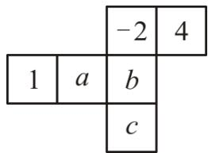

text_image

-2 4
1 a b
c

【答案】-4，-1，2

【分析】本题考查正方体的展开图，代数式求值，利用空间想象能力得出相对面的对应关系，从而求出 a、b、c 的值.

【详解】解：∵该正方体相对面上的两个数互为相反数，

$$
\therefore a = - 4, b = - 1, c = 2.
$$

【变式 6-1】（24-25 七年级上·广西贺州·期末）a 的相反数是 -1，这个数 a 是 \_\_\_\_.

【答案】1

【分析】本题考查了相反数：只有符号不同的两个数叫做互为相反数．根据相反数的定义即可得到结论.

【详解】解：若一个数的相反数是-1，则这个数是1，

故答案为：1.

【变式 6-2】（2024 七年级上·全国·专题练习）相反数等于它本身的数 m 是 \_\_\_\_.

【答案】0

【分析】本题考查了相反数，根据0的相反数是0，即可求解.

【详解】解：相反数等于它本身的数 m 是 0，

故答案为：0.

【变式 6-3】（24-25 七年级上·江苏宿迁·期末）已知a-3与-4互为相反数，则a= \_\_\_\_.

【答案】7

【分析】本题考查了解一元一次方程和相反数，根据互为相反数的两个数的和为0得出方程，再根据等式的性质求出方程的解即可.

【详解】解：∵a-3与-4互为相反数，

$$
\therefore - 4 + a - 3 = 0,
$$

$$
\therefore a = 7.
$$

故答案为：7.

# 【题型7 化简多重符号】

【例 7】（24-25 七年级上·内蒙古乌兰察布·阶段练习）给出下列各数：+(-10)，-(+15)，-(-7)，- $[+(-9)]$ ， $-[-(-20)]$ 。其中负数有（）

A. 0 个

B. 2 个

C. 3 个

D. 4 个

【答案】C

【分析】本题考查化简多重符号，将各数化简后，根据负数：“小于0的数”，进行判断即可．掌握化简多重符号，正负数的意义，是解题的关键.

【详解】解： $+(-10) = -10$ ， $-(+15) = -15$ ， $-(-7) = 7$ ， $-[ + (-9)] = 9$ ， $-[-(-20)] = -20$ 则共有3个负数，即 $+(-10)$ ， $-(+15)$ ， $-[-(-20)]$

故选：C.

【变式 7-1】（22-23 七年级上·宁夏吴忠·阶段练习） $-\left[-(-2)\right]$ 的值是\_\_\_\_.

【答案】-2

【分析】本题主要考查化简多重符号，根据多重符号的计算顺序去括号即可.

【详解】解：原式 = -(2) = -2，

故答案为：-2.

【变式 7-2】（23-24 七年级上·山东德州·阶段练习）化简：①-|+(-2.9)|= \_\_\_\_. ②-(-3)= \_\_\_\_. ③-[-(-0.5)]= \_\_\_\_. ④-|-(+2021)|= \_\_\_\_.

【答案】 -2.9 3 -0.5 -2021

【分析】根据多重符号的化简，绝对值的意义进行化简即可.

【详解】解：① $-|+(-2.9)|=-|-2.9|=-2.9;$

② $-(-3)=3;$   
③ $-\left[-(-0.5)\right]=-(-0.5)=-0.5;$   
④ $-|-(+2021)|=-|-2021|=-2021;$

故答案为：-2.9；3；-0.5；-2021。

【点睛】本题考查了绝对值的意义，熟知：正数的绝对值是正数，负数的绝对值是它的相反数，0 的绝对值是 0；是解本题的关键.

【变式 7-3】（24-25 七年级上·新疆和田·阶段练习）化简下列各数：

(1) + (-2);   
(2)-(+5);   
(3)-(-3.4);   
(4)- $\left[+(−8)\right]$ ;   
(5) $-\left[-(-9)\right]$ .

【答案】(1)-2

(2)-5   
(3)3.4   
(4)8   
(5)-9

【分析】本题考查了相反数中多重符号的化简，多重符号的化简：与“+”个数无关，有奇数个“-”负，有偶数个“-”号结果为正.

（1）根据多重符号的化简法则求解，即可解题；  
(2) 根据多重符号的化简法则求解, 即可解题;  
（3）根据多重符号的化简法则求解，即可解题；

（4）根据多重符号的化简法则求解，即可解题；  
（5）根据多重符号的化简法则求解，即可解题.

【详解】（1）解： $+(-2)=-2;$

(2) 解: $-(+5) = -5;$   
(3) 解: $-(-3.4)=3.4;$   
(4) 解: $-\left[+(-8)\right]=8;$   
(5) 解: $-\left[-(-9)\right]=-9.$

# 【题型8 数轴与相反数的综合】

【例 8】（24-25 八年级下·海南儋州·期中）如图，数轴上点A表示的数的相反数是（）

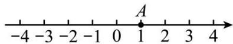

A.-2

B. -1

C. 0

D. 1

【答案】B

【分析】本题考查了数轴，相反数，掌握相反数的定义是解题关键．根据数轴可知点 A 表示的数是1，再根据相反数的定义，即可得到答案.

【详解】解：由数轴可知，点 A 表示的数是 1，

1的相反数是-1，

故选：B.

【变式 8-1】（24-25 七年级上·安徽阜阳·阶段练习）在数轴上，若点A，B分别表示互为相反数的两个数，并且这两个点的距离是8，点A在原点的左侧，则点A表示的数为\_\_\_\_。

【答案】-4

【分析】本题考查了相反数与数轴的关系，只有符号不同的两个数叫做互为相反数；相反数分为两类：一、0的相反数为0，二、可以是一个正数与一个负数，但它们的绝对值相等，即这两点到原点的距离相等，掌握相反数与数轴的关系是解题的关键.

根据相反数的概念得A和B是一个正数和一个负数，且距离为8；由相反数到原点的距离相等，所以可以得出两点所表示的数，即可得到结果.

【详解】解： $8 \div 2 = 4$ ，

∵ A 在原点的左侧，

∴ A 表示的数为 -4.

故答案为：-4.

【变式 8-2】（2024 七年级上·全国·专题练习）如图所示，A, B, C为数轴上三点，且当A为原点时，点B表示的数是2，点C表示的数是5．若以B为原点，则点A表示的数是\_\_\_\_，点C表示的数是\_\_\_\_；若A, C表示的两个数互为相反数，则点B表示的数是\_\_\_\_.

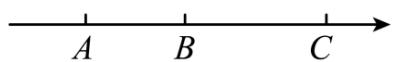

【答案】 -2 3 -0.5

【分析】本题考查数轴的综合应用，熟练掌握点在数轴上的表示、数轴的意义及三要素、相反数的意义和性质等是解题关键.

根据各点之间的位置关系、原点位置及相反数的性质解答；

【详解】解：由题意可知：AB = 2，AC = 5，BC = 3，

∴以 B 为原点时，点 A 表示的数是 -2，点 C 表示的数是 3，

若 A, C 表示的两个数互为相反数，则 AC 的中点（如图，设为 D）为原点，

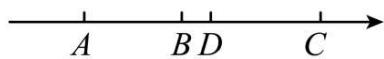

$\therefore AD = CD = 2.5, BD = AD - AB = 0.5,$ 且 D 在 B 的右边，

∴点 B 表示的数是 -0.5;

故答案为：-2；3；-0.5。

【变式 8-3】（24-25 七年级下·全国·期中）如图，将一刻度尺放在数轴上（数轴的单位长度是1cm），刻度尺上的“0cm”和“6cm”分别对应数轴上表示实数-2和实数x的两点，若x与-2互为相反数，则数轴上原点O对应刻度尺上的数值为\_\_\_\_。

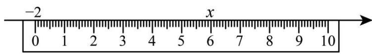

text_image

-2
0 1 2 3 4 5 6 7 8 9 10
x

【答案】3

【分析】根据 $x$ 与-2互为相反数，得到数轴的原点是这两个数表示的点构成线段的中点处，也是刻度尺上表示数0和6的点构成的线段的中点，设这个点对应的数为 $x_{0}$ ，则 $x_{0} - 0 = 6 - x_{0}$ ，解答即可.

【详解】解：根据题意， $x$ 与-2互为相反数，得到数轴的原点是这两个数表示的点构成线段的中点处，也是刻度尺上表示数0和6的点构成的线段的中点，

设这个点对应的数为 $x_{0}$ ，则 $x_{0}-0=6-x_{0}$ ，

解得 $x_0 = 3$

故答案为：3.

【点睛】本题考查了数轴上表示点，相反数的意义，线段中点的意义，一元一次方程的应用，数轴上两点间的距离，熟练掌握相关知识是解题的关键.