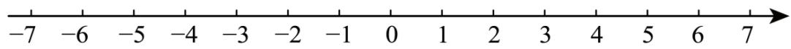
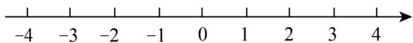
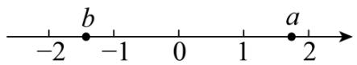
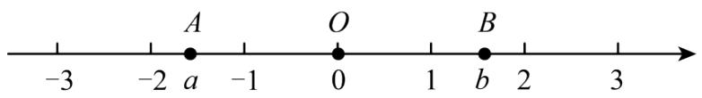
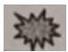

# 专题 2.3 绝对值、有理数大小比较（举一反三讲义）

# 【北师大版 2024】

# 题型归纳

【题型1 根据绝对值的代数意义求绝对值】....1

【题型2 根据绝对值的几何意义求绝对值】....2

【题型 3 根据去绝对值法则化简绝对值】....2

【题型4 根据绝对值的非负性求值】 3

【题型5 解绝对值方程】 3

【题型6 绝对值的应用】....3

【题型7 有理数比较大小】....4

【题型8 有理数大小比较的实际应用】....5

# 举一反三

# 知识点 1 绝对值

1. 定义: 一般地, 数轴上表示数 $a$ 的点与原点的距离叫作数 $a$ 的绝对值, 记作 $|a|$ .  
2. 绝对值的判断: 一个正数的绝对值是它本身, 一个负数的绝对值是它的相反数, 0 的绝对值是 $\mathbf{0}$ . 即如果 $a > 0$ , 那么 $|a| = \underline{\boldsymbol{a}}$ ; 如果 $a = 0$ , 那么 $|a| = \underline{\boldsymbol{0}}$ ; 如果 $a < 0$ , 那么 $|a| = -\underline{\boldsymbol{a}}$ .  
3. 绝对值非负性的应用：根据绝对值的非负性“若几个非负数的和为0，则每一个非负数必为0”，即若 $|a| + |b| = 0$ ，则 $|a| = 0$ 且 $|b| = 0$ .

# 知识点 2 有理数的大小比较

1. 利用数轴比较大小: 在水平的数轴上表示有理数, 它们从左到右的顺序, 就是从小到大的顺序, 即左边的数小于右边的数.  
2. 利用有理数的分类比较大小: 一般地, 正数大于0, 0大于负数, 正数大于负数; 两个负数, 绝对值大的反而小.  
3. 作差法: 若两数分别为 a, b, a-b > 0，则 a > b；若 a-b < 0，则 a < b；若 a-b = 0，则 a = b.

# 【题型 1 根据绝对值的代数意义求绝对值】教辅资源，关注公众号★全科AA+

【例 1】（2025·安徽合肥·三模） $\left|-\frac{1}{2025}\right|$ 的相反数是（）

A. $|2025|$

B. -2025

C. $\frac{1}{2025}$

D. $-\frac{1}{2025}$

【变式 1-1】（2024 七年级上·全国·专题练习）绝对值是 2026 的有理数是 \_\_\_\_.

【变式 1-2】（23-24 七年级上·山西太原·阶段练习）绝对值不大于 4 的所有负整数有 \_\_\_\_.

【变式 1-3】（24-25 九年级下·江西抚州·阶段练习）在 -2025，0， $-\pi$ ，2026 这四个数中，绝对值最小的数是（）

A. -2025

B. 0

C. $-\pi$

D. 2026

# 【题型 2 根据绝对值的几何意义求绝对值】

【例 2】（24-25 七年级上·湖北荆州·期末）知道式子 $|x-3|=3$ 的几何意义是数轴上表示数 x 的点与表示数 3 的点之间的距离是 3，则式子 $|x-2|+|x+1|$ 的最小值（）

A. 2

B. 3

C. 4

D. 5

【变式 2-1】（24-25 六年级上·山东济南·期末）|5-3|可以理解为 5 与 3 两个数在数轴上所对应的两点之间的距离；|5-(-2)|可以表示 5 与 -2 两个数在数轴上所对应的两点之间的距离．则：a 与 b 两个数在数轴上所对应的两点之间的距离可以表示为\_\_\_\_

text_image

-7 -6 -5 -4 -3 -2 -1 0 1 2 3 4 5 6 7

【变式 2-2】（24-25 七年级上·北京·期中）若 $|x|-3=|x-3|$ 成立，那么 x 的取值范围是 \_\_\_\_.

【变式 2-3】（23-24 七年级上·贵州安顺·期末）由绝对值的几何意义，我们知道 $|x|$ 表示数轴上某一点到原点的距离，同理可以得到 $|x-3|$ 表示数轴上某一点到表示数 3 的点的距离， $|x+2|$ 表示数轴上某一点到表示数 -2 的点的距离．设 $S=|x-1|+|x+1|$ ，结合数轴，则下面的结论中正确的是（）

text_image

-4
-3
-2
-1
0
1
2
3
4

A. S 没有最小值

B. 有有限个 $x$ （不止一个）使 $S$ 取得最小值

C. 只有一个 $x$ 使 $S$ 取得最小值

D. 有无限个 $x$ 使 $S$ 取得最小值

# 【题型3 根据去绝对值法则化简绝对值】

【例 3】（24-25 九年级下·江苏南京·阶段练习）已知1 < x < 2，则 $|x-3| + |x-2|$ 的值为\_\_\_\_。

【变式 3-1】（24-25 九年级下·重庆渝中·阶段练习） $-1 + |\pi - 2| =$ \_\_\_\_.

【变式 3-2】（24-25 七年级上·河南郑州·期中）已知a,b两数在数轴上的位置如图所示，则化简代数式 $|a+b|-|a-1|+|b+3|$ 的结果是()

A. 1

B. $2 b + 4$

C. $2a + 3$

D. -1

【变式 3-3】（24-25 七年级上·内蒙古包头·期末）在数轴上表示 a，0，b 三个数的点如图所示，已知 OA = OB，则 $\left|a + b\right| + \left|\frac{a}{b}\right| + 2 =$ \_\_\_\_.

text_image

-3
-2 a
A
-1
O
0
1
b
2
B
3

# 【题型4 根据绝对值的非负性求值】教辅资源，关注公众号★全科AA+

【例 4】（24-25 七年级上·广西桂林·阶段练习）若 $\left|x-2\right|+\left|2y-6\right|=0$ ，则 y-x 的值为（）

A. 3

B. 2

C. 1

D. 0

【变式 4-1】（24-25 七年级上·福建龙岩·期末）如果 x 为有理数，式子 $2025 - |x + 4|$ 存在最大值，这个最大值是（）

A. 2025

B. 2024

C. 2023

D. 2022

【变式 4-2】（23-24 七年级上·浙江金华·阶段练习）若 $|a| + |b| = 0$ ，则 $a + b =$ \_\_\_\_.

【变式 4-3】（24-25 八年级下·山东潍坊·阶段练习）若 $\left|x+2\right|=-x-2$ ，则 x 的取值范围是（）

A. $x \geq -2$

B. $x < 0$

C. $x \leq -2$

D. $x < -2$

# 【题型5 解绝对值方程】

【例 5】（24-25 七年级上·全国·单元测试）已知 $|m| = |-6|$ ，则m的值可能是（）

A. -6

B. 6

C. 6或-6

D. 无法确定

【变式 5-1】（24-25 六年级上·上海闵行·期中）已知一个数减去 2.4 的差的绝对值为 0，那么这个数是 \_\_\_\_.

【变式 5-2】若 $|x|=2$ ，则x= \_\_\_\_.

【变式 5-3】（24-25 七年级上·辽宁鞍山·阶段练习）如果 $|-a| = |-5|$ ，那么a = \_\_\_\_.

# 【题型6 绝对值的应用】

【例 6】（2025·山西运城·模拟预测）在工业生产中，AI大模型的引入，显著提升了工业产品的精密度．下面是某工厂四台接入AI大模型的机床生产的轴承的误差数据，其中精确度最高的是（）

A. +0.03mm

B. -0.02mm

C. +0.02mm

D. -0.01mm

【变式 6-1】（2025·河北邯郸·二模）为了解某种盒装茶叶的质量（单位：g）情况，质检员抽样监测了其中4盒茶叶．其中超标的记为正数，不足的记为负数．检验结果分别是 +5，-0.6，-0.3，-1.8，其中最接近

标准质量的是（）

A. +5

B. -0.6

C. -0.3

D. -1.8

【变式 6-2】（24-25 七年级上·河南省直辖县级单位·期末）党和国家非常重视青少年的身心健康，采取多种举措增强青少年体质，数据显示，近几年，青少年身体健康状况有一定提升，但肥胖问题仍不容忽视。一种少年儿童的标准体重(单位：kg)的计算公式为：标准体重 = (年龄 × 7 - 5) ÷ 2。如表是七年级某小组6位同学的体重情况，其中超出标准体重的千克数记为正数，少于标准体重的千克数记为负数，那么表中编号为\_\_\_\_的同学的体重最符合标准体重。

<table><tr><td>编号</td><td>1</td><td>2</td><td>3</td><td>4</td><td>5</td><td>6</td></tr><tr><td>体重情况</td><td>-1.1</td><td>+2</td><td>-0.4</td><td>+9</td><td>+1</td><td>-9.3</td></tr></table>

【变式 6-3】（24-25 七年级上·甘肃张掖·阶段练习）有一种密码，把26个英文字母a、b、c、d、...、z（不论大小写），依次对应自然数1，2，3，4，...，26（见表格），当明码对应的序号x为奇数时，密码对应的序号是 $\frac{|x-25|}{2}$ ，当明码对应的序号x为偶数时，密码对应的序号是 $\frac{x}{2}-3$ ，按上述规定，把明码“this”译成密码是\_\_\_\_。

<table><tr><td>字母</td><td>a</td><td>b</td><td>c</td><td>d</td><td>e</td><td>f</td><td>g</td><td>h</td><td>i</td><td>j</td><td>k</td><td>l</td><td>m</td></tr><tr><td>序号</td><td>1</td><td>2</td><td>3</td><td>4</td><td>5</td><td>6</td><td>7</td><td>8</td><td>9</td><td>10</td><td>11</td><td>12</td><td>13</td></tr><tr><td>字母</td><td>n</td><td>o</td><td>p</td><td>q</td><td>r</td><td>s</td><td>t</td><td>u</td><td>v</td><td>w</td><td>x</td><td>y</td><td>z</td></tr><tr><td>序号</td><td>14</td><td>15</td><td>16</td><td>17</td><td>18</td><td>19</td><td>20</td><td>21</td><td>22</td><td>23</td><td>24</td><td>25</td><td>26</td></tr></table>

【题型 7 有理数比较大小】教辅资源，关注公众号★全科AA+

【例 7】（24-25 七年级上·青海西宁·期中）在 -1, -(-2), 0, -|-2.5|, +3 中，最小的数是（）

A. 0

B. $-|-2.5|$

C. -1

D. $-(-2)$

【变式 7-1】（2025·广东清远·二模）下列各数中，最小的数是（）

A. -2

B. $\frac{1}{3}$

C. 1

D. -3

【变式 7-2】（2025·江苏南京·一模）比较大小： $-\frac{3}{4}$ \_\_\_\_ $-\frac{7}{12}$ . （填“＞”“＜”或“＝”号）

【变式 7-3】（23-24 七年级上·陕西榆林·阶段练习）在下面数轴上画出表示下列各数的点，比较这些数的大小，并用“＜”号将所有的数按从小到大的顺序连接起来.

$$
\begin{array}{c} - 4, - | - 2. 5 |, - \left(- 3 \frac {1}{2}\right), - 1, | + 5 |. \\ \hline - 5 - 4 - 3 - 2 - 1 0 1 2 3 4 5 \end{array}
$$

# 【题型8 有理数大小比较的实际应用】

【例 8】（2025·江西·中考真题）在 1 个标准大气压下，四种晶体的熔点如下表所示，则熔点最高的是（）

<table><tr><td>晶体</td><td>固态氢</td><td>固态氧</td><td>固态氮</td><td>固态酒精</td></tr><tr><td>熔点(单位:°C)</td><td>-259</td><td>-218</td><td>-210</td><td>-117</td></tr></table>

A. 固态氢

B. 固态氧

C. 固态氮

D. 固态酒精

【变式 8-1】（24-25 七年级上·广西南宁·期中）某工厂生产雨伞，每天标准生产量为 200 把，但由于各种原因，实际每天生产的量与标准产量相比有所不同，下表是这周的实际生产情况（超过每日标准产量的记作正数，不足每日标准产量的记作负数）：

<table><tr><td>星期</td><td>一</td><td>二</td><td>三</td><td>四</td><td>五</td><td>六</td><td>日</td></tr><tr><td>生产情况</td><td>8</td><td>-5</td><td>12</td><td>-13</td><td>-9</td><td>14</td><td>7</td></tr></table>

(1)表中的-5表示什么？  
(2)哪一天生产的雨伞数量最多？哪一天生产的雨伞数量最少？   
(3)这周雨伞的总生产量是多少?

【变式 8-2】（24-25 七年级上·河北邯郸·期中）【新情境·生产生活】某校举办了“废纸回收，变废为宝”活动，各班收集的废纸均以 5kg 为标准，超过的记为“+”，不足的记为“一”。七年级六个班的废纸收集情况如下表所示。统计员小虎不小心将六班的数据弄丢了，但他记得三班收集的废纸最少，且收集废纸最多和最少的班级的质量差为 4kg.

<table><tr><td>班级</td><td>一</td><td>二</td><td>三</td><td>四</td><td>五</td><td>六</td></tr><tr><td>质量/kg</td><td>+1</td><td>+2</td><td>-1.5</td><td>0</td><td>-1</td><td></td></tr></table>

(1)计算七年级六班同学收集废纸的质量;

(2)将本次活动七年级六个班收集的废纸集中卖出, 其中有 $3 \mathrm{~kg}$ 的硬纸板是 $1.2 \mathrm{~元} / \mathrm{kg}$ , 其余废纸均是 $0.8 \mathrm{~元} / \mathrm{kg}$ , 求卖废纸的总钱数. 教辅资源, 关注公众号★全科AA+

【变式 8-3】（24-25 六年级上·山东烟台·期中）某海鲜超市每天要到小龙虾养殖基地购进500kg小龙虾，下表是该海鲜超市记录的本周小龙虾购进单价变化情况（正号表示价格比前一天上涨，负号表示价格比前一天下降）.

<table><tr><td>星期</td><td>一</td><td>二</td><td>三</td><td>四</td><td>五</td><td>六</td><td>日</td></tr><tr><td>单价变化/元</td><td>-1</td><td>+2.5</td><td>-2</td><td></td><td>-3</td><td>+2</td><td>+2</td></tr></table>

已知小龙虾上周末的进价为每千克23元，这周四的进价为每千克24元.

(1)请你求出表中星期四的单价变化值;   
(2)这周购进小龙虾的最高价是每千克多少元？最低价是每千克多少元？  
(3)若该海鲜超市本周五将购进的小龙虾以每千克25元全部售出，那么该海鲜超市在本周五的收益情况如何？