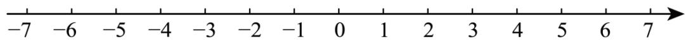
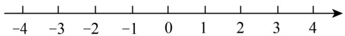
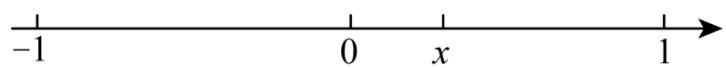
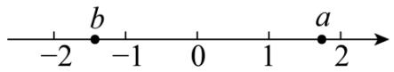
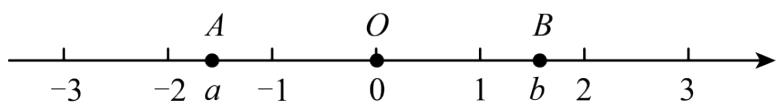
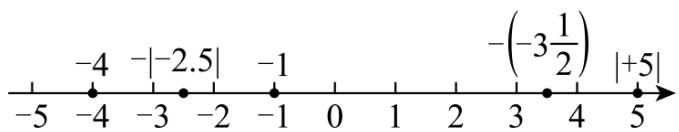
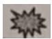

# 专题 2.3 绝对值、有理数大小比较（举一反三讲义）

# 【北师大版 2024】

# 题型归纳

【题型1 根据绝对值的代数意义求绝对值】....1

【题型2 根据绝对值的几何意义求绝对值】....3

【题型 3 根据去绝对值法则化简绝对值】....4

【题型4 根据绝对值的非负性求值】....6

【题型 5 解绝对值方程】....7

【题型 6 绝对值的应用】....8

【题型 7 有理数比较大小】....10

【题型 8 有理数大小比较的实际应用】....12

# 举一反三

# 知识点 1 绝对值

1. 定义: 一般地, 数轴上表示数 $a$ 的点与原点的距离叫作数 $a$ 的绝对值, 记作 $|a|$ .  
2. 绝对值的判断: 一个正数的绝对值是它本身, 一个负数的绝对值是它的相反数, 0 的绝对值是 $\mathbf{0}$ . 即如果 $a > 0$ , 那么 $|a| = \underline{\boldsymbol{a}}$ ; 如果 $a = 0$ , 那么 $|a| = \underline{\boldsymbol{0}}$ ; 如果 $a < 0$ , 那么 $|a| = -\underline{\boldsymbol{a}}$ .  
3. 绝对值非负性的应用：根据绝对值的非负性“若几个非负数的和为0，则每一个非负数必为0”，即若 $|a| + |b| = 0$ ，则 $|a| = 0$ 且 $|b| = 0$ .

# 知识点 2 有理数的大小比较

1. 利用数轴比较大小: 在水平的数轴上表示有理数, 它们从左到右的顺序, 就是从小到大的顺序, 即左边的数小于右边的数.  
2. 利用有理数的分类比较大小: 一般地, 正数大于0, 0大于负数, 正数大于负数; 两个负数, 绝对值大的反而小.  
3. 作差法: 若两数分别为 a, b, a-b > 0，则 a > b；若 a-b < 0，则 a < b；若 a-b = 0，则 a = b.

# 【题型1 根据绝对值的代数意义求绝对值】

【例 1】（2025·安徽合肥·三模） $\left|-\frac{1}{2025}\right|$ 的相反数是（）

A. $|2025|$

B. -2025

C. $\frac{1}{2025}$

D. $-\frac{1}{2025}$

【答案】D

【分析】本题主要考查了求一个数的绝对值和求一个数的相反数，先计算 $\left|- \frac{1}{2025}\right| = \frac{1}{2025}$ ，再根据只有符号不同的两个数互为相反数可得答案.

【详解】解： $\left|-\frac{1}{2025}\right|=\frac{1}{2025}$ ，则 $\left|-\frac{1}{2025}\right|$ 的相反数是 $-\frac{1}{2025}$ ，

故选：D.

【变式 1-1】（2024 七年级上·全国·专题练习）绝对值是 2026 的有理数是 \_\_\_\_.

【答案】2026或-2026

【分析】本题主要考查绝对值，根据绝对值的求法求解即可.

【详解】解：∵ $|2026|=2026,\quad|-2026|=2026,$

∴绝对值是2026的有理数是2026或-2026，

故答案为：2026或-2026.

【变式 1-2】（23-24 七年级上·山西太原·阶段练习）绝对值不大于 4 的所有负整数有 \_\_\_\_.

【答案】-4，-3，-2，-1

【分析】利用负整数的定义、绝对值的性质确定答案即可.

【详解】解：∵ $|-1|=1<4,\quad|-2|=2<4,\quad|-3|=3<4,\quad|-4|=4,$

∴绝对值不大于4的所有负整数有-4，-3，-2，-1.

故答案为：-4，-3，-2，-1.

【点睛】本题主要考查了有理数比较大小、绝对值、负整数等知识，熟练掌握相关知识是解题关键.

【变式 1-3】（24-25 九年级下·江西抚州·阶段练习）在 -2025, 0, -π, 2026 这四个数中，绝对值最小的数是（）

A. -2025

B. 0

C. $-\pi$

D. 2026

【答案】B

【分析】本题考查绝对值，实数的大小比较，解题的关键是求出各个数的绝对值.

先求出各个数的绝对值，再比较大小，即可解答.

【详解】解：∵ $|-2025|=2025,|0|=0,|- \pi|= \pi,|2026|=2026,$

$$
\therefore 0 <   \pi <   2 0 2 5 <   2 0 2 6,
$$

即绝对值最小的数是 0.

故选 B.

# 【题型 2 根据绝对值的几何意义求绝对值】

【例 2】（24-25 七年级上·湖北荆州·期末）知道式子 $|x-3|=3$ 的几何意义是数轴上表示数 x 的点与表示数 3 的点之间的距离是 3，则式子 $|x-2|+|x+1|$ 的最小值（）

A. 2

B. 3

C. 4

D. 5

【答案】B

【分析】本题考查绝对值的意义，两点间的距离公式，根据绝对值的意义，得出 $|x-2|+|x+1|$ 的几何意义是数轴上表示数x的点与表示数2的点之间的距离与数轴上表示数x的点与表示数-1的点之间的距离之和，说明当表示数x的点在表示数-1的点与表示数2的点之间时， $|x-2|+|x+1|$ 值最小，也即是表示数-1的点与表示数2的点之间距离，求出结果即可.

【详解】解：∵ $|x-2| + |x+1|$ 的几何意义是数轴上表示数 x 的点与表示数 2 的点之间的距离与数轴上表示数 x 的点与表示数 -1 的点之间的距离之和，

∴ 当表示数 x 的点在表示数 -1 的点与表示数 2 的点之间时， $|x-2|+|x+1|$ 值最小，也即是表示数 -1 的点与表示数 2 的点之间距离，

∴ $\left|x-2\right|+\left|x+1\right|$ 的最小值为 $1-(-2)=3$ ,

故选：B.

【变式 2-1】（24-25 六年级上·山东济南·期末）|5-3|可以理解为 5 与 3 两个数在数轴上所对应的两点之间的距离；|5-(-2)|可以表示 5 与 -2 两个数在数轴上所对应的两点之间的距离．则：a 与 b 两个数在数轴上所对应的两点之间的距离可以表示为\_\_\_\_

text_image

-7 -6 -5 -4 -3 -2 -1 0 1 2 3 4 5 6 7

【答案】 $|a-b|$

【分析】本题考查绝对值几何意义的应用，根据绝对值的意义求解即可.

【详解】a与b两个数在数轴上所对应的两点之间的距离可以表示为 $|a-b|$ .

故答案为： $|a-b|$ .

【变式 2-2】（24-25 七年级上·北京·期中）若 $|x|-3=|x-3|$ 成立，那么 x 的取值范围是 \_\_\_\_.

【答案】 $x \geq 3$

【分析】此题考查了绝对值的性质，根据题意得出 $|x|\geq3$ ，得到 $x\geq3$ 或 $x\leq-3$ ，然后分情况验证即可.

【详解】∵ $|x|-3=|x-3|\geq0$ 成立，

$$
\therefore | x | \geq 3
$$

$$
\therefore x > 3 \text {或} x <   - 3
$$

∴当 $x\geq3$ 时， $|x|-3=x-3,\quad|x-3|=x-3$ ，等式成立；

当 $x \leq -3$ 时， $|x| - 3 = -x - 3$ ， $|x - 3| = -x + 3$ ，等式不成立；

综上所述，x 的取值范围是 x > 3.

故答案为： $x \geq 3$ .

【变式 2-3】（23-24 七年级上·贵州安顺·期末）由绝对值的几何意义，我们知道 $|x|$ 表示数轴上某一点到原点的距离，同理可以得到 $|x-3|$ 表示数轴上某一点到表示数 3 的点的距离， $|x+2|$ 表示数轴上某一点到表示数 -2 的点的距离．设 $S=|x-1|+|x+1|$ ，结合数轴，则下面的结论中正确的是（）

text_image

-4
-3
-2
-1
0
1
2
3
4

A. S 没有最小值

B. 有有限个 $x$ （不止一个）使 $S$ 取得最小值

C. 只有一个 $x$ 使 $S$ 取得最小值

D. 有无限个 $x$ 使 $S$ 取得最小值

【答案】D

【分析】此题主要考查了绝对值的含义和应用．根据题意，可得 $|x-1|+|x+1|$ 表示数轴上某一点到点-1、点1的距离的和，S的最小值是2，当 $-1\leq x\leq1$ 时，S都能取到最小值2，据此解答即可.

【详解】解：如图，

text_image

-1
0
x
1

$$
\because S = | x - 1 | + | x + 1 |, \quad 1 - (- 1) = 2,
$$

∴ S 的最小值是 2，

当-1<x<1时，S都能取到最小值2，

∴有无穷个x使S取最小值.

故选：D.

# 【题型3 根据去绝对值法则化简绝对值】

【例 3】（24-25 九年级下·江苏南京·阶段练习）已知1 < x < 2，则 $|x-3| + |x-2|$ 的值为 \_\_\_\_.

【答案】5-2x

【分析】本题主要考查了绝对值的性质，二次根式的性质，

根据 $x$ 的取值范围，结合绝对值的性质，可得待求式 $= 3 - x + 2 - x$ ，整理得出答案.

【详解】解：∵1<x<2，

$$
\therefore | x - 3 | + | x - 3 | = 3 - x + 2 - x = 5 - 2 x
$$

故答案为：5-2x

【变式 3-1】（24-25 九年级下·重庆渝中·阶段练习） $-1 + |\pi - 2| =$ \_\_\_\_.

【答案】 $\pi -3$

【分析】本题考查了实数的加减运算，绝对值的性质，先去绝对值符号，再合并即可，掌握绝对值的性质是解题的关键.

【详解】解： $-1 + |\pi - 2| = -1 + \pi - 2 = \pi - 3$ ,

故答案为： $\pi-3$ .

【变式 3-2】（24-25 七年级上·河南郑州·期中）已知a,b两数在数轴上的位置如图所示，则化简代数式 $|a+b|-|a-1|+|b+3|$ 的结果是()

A. 1

B. $2b + 4$

C. $2a + 3$

D. -1

【答案】B

【分析】本题考查数轴，绝对值以及整式的加减，理解数轴表示数的意义以及绝对值、合并同类项的法则是正确解答的关键．根据a，b两数在数轴上的位置，判断代数式 $a+b$ ，a-1， $b+2$ 的符号，再根据绝对值的意义计算即可.

【详解】解：由a，b两数在数轴上的位置，可知，1<a<2，-2<b<-1，且 $|a|>|b|$ ，

$$
\therefore a + b > 0, \quad a - 1 > 0, \quad b + 3 > 0,
$$

$$
\therefore | a + b | - | a - 1 | + | b + 3 | = a + b - a + 1 + b + 3
$$

$$
= 2 b + 4,
$$

故选：B.

【变式 3-3】（24-25 七年级上·内蒙古包头·期末）在数轴上表示 a，0，b 三个数的点如图所示，已知 OA = OB，则 $\left|a + b\right| + \left|\frac{a}{b}\right| + 2 =$ \_\_\_\_.

text_image

-3
-2 a
-1
O
0
1 b 2
3

【答案】3

【分析】本题主要考查数轴上有理数的表示、绝对值的意义及代数式的值，熟练掌握数轴上有理数的表示、绝对值的意义及代数式的值是解题的关键；由数轴及题意可知 $a+b=0\frac{a}{b}=-1$ ，然后代入进行求解即可.

【详解】解：由OA = OB 可知：数轴上表示点 a、b 的数是互为相反数，

所以 $a+b=0,\frac{a}{b}=-1$ ,

$$
\therefore | a + b | + \left| \frac {a}{b} \right| + 2 = 0 + 1 + 2 = 3;
$$

故答案为3.

# 【题型4 根据绝对值的非负性求值】

【例 4】（24-25 七年级上·广西桂林·阶段练习）若 $\left|x-2\right|+\left|2y-6\right|=0$ ，则 y-x 的值为（）

A. 3

B. 2

C. 1

D. 0

【答案】C

【分析】本题考查了非负数的性质．当非负数和为0时，必须满足其中的每一项都等于0．根据非负数的性质列出方程求出x和y的值，再根据加法法则计算即可.

【详解】解：∵ $|x-2|+|2y-6|=0$ ，

$$
\therefore x - 2 = 0, 2 y - 6 = 0,
$$

$$
\therefore x = 2, y = 3,
$$

$$
\therefore y - x = 1,
$$

故选：C.

【变式 4-1】（24-25 七年级上·福建龙岩·期末）如果 x 为有理数，式子 $2025 - |x + 4|$ 存在最大值，这个最大值是（）

A. 2025

B. 2024

C. 2023

D. 2022

【答案】A

【分析】本题考查的是绝对值的非负性的含义，理解 $|x+4|\geq0$ 是解本题的关键.

根据 $|x+4|$ 的最小值是0即可求解.

【详解】解：∵ x 为有理数，式子2025- $|x+4|$ 存在最大值，

∴ 当 $\left|x+4\right|=0$ 时，式子 2025- $\left|x+4\right|$ 最大值为 2025，

故选：A.

【变式 4-2】（23-24 七年级上·浙江金华·阶段练习）若 $|a| + |b| = 0$ ，则 $a + b =$ \_\_\_\_.

【答案】0

【分析】根据非负数的性质求得a、b的值，即可求解.

【详解】解：∵ $|a|+|b|=0$ ，

$$
\therefore a = 0, \quad b = 0,
$$

$$
\therefore a + b = 0
$$

故答案为：0.

【点睛】本题考查了绝对值的非负性，掌握绝对值的意义是解题的关键.

【变式 4-3】（24-25 八年级下·山东潍坊·阶段练习）若 $\left|x+2\right|=-x-2$ ，则 x 的取值范围是（）

A. $x \geq -2$

B. $x <   0$

C. $x \leq -2$

D. $x < -2$

【答案】C

【分析】此题考查了绝对值的非负性，解一元一次不等式，根据题意得到 $x+2\leq0$ ，进而求解即可.

【详解】∵ $|x+2|=-x-2$

$$
\therefore x + 2 \leq 0
$$

$$
\therefore x \leq - 2.
$$

故选：C.

# 【题型5 解绝对值方程】

【例 5】（24-25 七年级上·全国·单元测试）已知 $|m| = |-6|$ ，则m的值可能是（）

A. -6

B. 6

C. 6或-6

D. 无法确定

【答案】C

【分析】本题考查绝对值的性质，熟练掌握绝对值的性质是解题的关键．利用绝对值的性质即可解决.

【详解】解：∵ $|m| = |-6| = 6$ ，

$$
\therefore m = 6 \text {或} - 6,
$$

故选：C.

【变式 5-1】（24-25 六年级上·上海闵行·期中）已知一个数减去 2.4 的差的绝对值为 0，那么这个数是 \_\_\_\_.

【答案】2.4

【分析】本题考查绝对值，解绝对值方程，有理数减法，掌握绝对值的意义是解题的关键.

设这个数是为 $x$ ，则 $|x - 2.4| = 0$ ，解之即可。

【详解】解：设这个数是为 $x$ ，根据题意，得

$$
\vert x - 2. 4 \vert = 0
$$

$$
\therefore x - 2. 4 = 0
$$

$$
\therefore x = 2. 4
$$

故答案为：2.4.

【变式 5-2】若 $|x|=2$ ，则x= \_\_\_\_.

【答案】±2

【分析】根据绝对值的意义可直接进行求解.

【详解】解：绝对值是2的数是 $\pm2$ ，

$$
\therefore x = \pm 2,
$$

故答案为：±2.

【点睛】本题主要考查了绝对值的定义，正确理解其定义是解题的关键.

【变式 5-3】（24-25 七年级上·辽宁鞍山·阶段练习）如果 $|-a| = |-5|$ ，那么a = \_\_\_\_.

【答案】±5

【分析】本题考查的是绝对值的含义，根据 $|-a| = |-5|$ ，可得 $|a| = 5$ ，可得 $a = \pm 5$ ，从而可得答案.

【详解】解：∵ $|-a| = |-5|$ ,

$$
\therefore | a | = 5,
$$

$$
\therefore a = \pm 5;
$$

故答案为：±5.

# 【题型6 绝对值的应用】

【例 6】（2025·山西运城·模拟预测）在工业生产中，AI大模型的引入，显著提升了工业产品的精密度。下面是某工厂四台接入AI大模型的机床生产的轴承的误差数据，其中精确度最高的是（）

A. +0.03mm

B. -0.02mm

C. +0.02mm

D. -0.01mm

【答案】D

【分析】本题词考查正负数的应用，求一个数的绝对值，绝对值的意义，熟练掌握正负数的应用和绝对值的意义是解题的关键.

分别 求出各项的绝对值，再比较大小，根据绝对值的意义可得绝对值越小的，精确度越高得出答案即可.

【详解】解：∵ $|+0.03|$ mm=0.03mm， $|-0.02|$ mm=0.02mm， $|+0.02|$ mm=0.02mm， $|-0.01|$ mm=0.01mm，
又∵0.01 < 0.02 < 0.03,

$$
\therefore | - 0. 0 1 | <   | - 0. 0 2 | = | + 0. 0 2 | <   | + 0. 0 3 |,
$$

∴精确度最高的是-0.01mm.

故选：D.

【变式 6-1】（2025·河北邯郸·二模）为了解某种盒装茶叶的质量（单位：g）情况，质检员抽样监测了其中4盒茶叶．其中超标的记为正数，不足的记为负数．检验结果分别是 +5，-0.6，-0.3，-1.8，其中最接近

标准质量的是（）

A. +5

B. -0.6

C. -0.3

D. -1.8

【答案】C

【分析】本题主要考查了正负数的实际应用，有理数比较大小的实际应用，求出所有检验结果的绝对值，绝对值最小的就是最接近标准质量的，据此求解即可.

【详解】解： $|+5|=5,\quad |-0.6|=0.6,\quad |-0.3|=0.3,\quad |-1.8|=1.8,\quad 0.3<0.6<1.8<5,$

∴最接近标准质量的是-0.3.

故选：C.

【变式 6-2】（24-25 七年级上·河南省直辖县级单位·期末）党和国家非常重视青少年的身心健康，采取多种举措增强青少年体质，数据显示，近几年，青少年身体健康状况有一定提升，但肥胖问题仍不容忽视。一种少年儿童的标准体重(单位：kg)的计算公式为：标准体重 = (年龄 × 7 - 5) ÷ 2。如表是七年级某小组6位同学的体重情况，其中超出标准体重的千克数记为正数，少于标准体重的千克数记为负数，那么表中编号为\_\_\_\_的同学的体重最符合标准体重。

<table><tr><td>编号</td><td>1</td><td>2</td><td>3</td><td>4</td><td>5</td><td>6</td></tr><tr><td>体重情况</td><td>-1.1</td><td>+2</td><td>-0.4</td><td>+9</td><td>+1</td><td>-9.3</td></tr></table>

【答案】3

【分析】本题考查了正负数的意义、绝对值的应用．首先分别求出这6位同学体重的绝对值，根据绝对值越小的体重与标准体重越接近判断哪位同学的体重最接近标准体重.

【详解】解： $|-1.1|=1.1,\quad|+2|=2,\quad|-0.4|=0.4,\quad|+9|=9,\quad|+1|=1,\quad|-9.3|=9.3$

$$
\because 0. 4 <   1 <   1. 1 <   2 <   9 <   9. 3
$$

3号同学的体重最接近标准体重.

故答案为：3.

【变式 6-3】（24-25 七年级上·甘肃张掖·阶段练习）有一种密码，把26个英文字母a、b、c、d、…、z（不论大小写），依次对应自然数1，2，3，4，…，26（见表格），当明码对应的序号x为奇数时，密码对应的序号是 $\frac{|x-25|}{2}$ ，当明码对应的序号x为偶数时，密码对应的序号是 $\frac{x}{2}-3$ ，按上述规定，把明码“this”译成密码是\_\_\_\_。

<table><tr><td>字母</td><td>a</td><td>b</td><td>c</td><td>d</td><td>e</td><td>f</td><td>g</td><td>h</td><td>i</td><td>j</td><td>k</td><td>l</td><td>m</td></tr><tr><td>序号</td><td>1</td><td>2</td><td>3</td><td>4</td><td>5</td><td>6</td><td>7</td><td>8</td><td>9</td><td>10</td><td>11</td><td>12</td><td>13</td></tr><tr><td>字母</td><td>n</td><td>o</td><td>p</td><td>q</td><td>r</td><td>s</td><td>t</td><td>u</td><td>v</td><td>w</td><td>x</td><td>y</td><td>z</td></tr><tr><td>序号</td><td>14</td><td>15</td><td>16</td><td>17</td><td>18</td><td>19</td><td>20</td><td>21</td><td>22</td><td>23</td><td>24</td><td>25</td><td>26</td></tr></table>

【答案】gahc

【分析】本题考查规律型：数字的变化类，绝对值，对应表格可得明码“this”对应的序号分别为：20、8、9、19，根据当明码对应的序号 $x$ 为奇数时，密码对应的序号为 $\frac{|x - 25|}{2}$ ，当明码对应的序号 $x$ 为偶数时，密码对应的序号为 $\frac{x}{2} - 3$ ，进行计算即可得密码。解题的关键是根据数字的变化寻找规律。

【详解】解：根据表格数据可知：

明码“this”对应的序号分别为：20、8、9、19，

∵明码对应的序号x为奇数时，密码对应的序号为 $\frac{|x-25|}{2}$ ，明码对应的序号x为偶数时，密码对应的序号为 $\frac{x}{2}-3$ ，
∴ $\frac{20}{2}-3=7,\quad\frac{8}{2}-3=7=1,\quad\frac{|9-25|}{2}=8,\quad\frac{|19-25|}{2}=3,$

∴密码是gahc.

故答案为: $gahc$ .

# 【题型7 有理数比较大小】

【例 7】（24-25 七年级上·青海西宁·期中）在 -1, -(-2), 0, -|-2.5|, +3 中，最小的数是（）

A. 0

B. $-|-2.5|$

C. -1

D. $-(-2)$

【答案】B

【分析】本题考查了有理数大小比较，根据相反数和绝对值的定义化简后，再根据“负数小于正数，两个负数比较大小，绝对值大的反而小”判断即可.

【详解】解：∵ $-|-2.5| = -2.5$ ， $-(-2) = 2$ ， $|-2.5| = 2.5 > |-1| = 1$ ，

又-2.5<-1<0<2<3,

$$
\therefore - | - 2. 5 | <   - 1 <   0 <   - (- 2) <   3,
$$

即在-1, -(-2), 0, -|-2.5|, +3中，最小的数是-|-2.5|,

故选：B.

【变式 7-1】（2025·广东清远·二模）下列各数中，最小的数是（）

A. -2

B. $\frac{1}{3}$

C. 1

D. -3

【答案】D

【分析】本题考查有理数大小的比较，熟知有理数的大小比较法则是解题的关键．根据有理数的大小比较法则，即正数都大于0，负数都小于0，正数大于负数，两个负数中绝对值大的反而小，进行比较判断即可.

【详解】解：∵ $|-2|=2,\quad|-3|=3,\quad2<3,$

$$
\therefore - 3 <   - 2,
$$

又 $0 < \frac{1}{3} < 1$

$$
\therefore - 3 <   - 2 <   \frac {1}{3} <   1,
$$

∴最小的数是-3.

故选：D.

【变式 7-2】（2025·江苏南京·一模）比较大小： $-\frac{3}{4}$ \_\_\_\_ $-\frac{7}{12}$ . （填“＞”“＜”或“＝”号）

【答案】<

【分析】本题考查了有理数的大小比较，绝对值的意义，根据有理数的大小比较方法即可求解，掌握有理数的大小比较方法是解题的关键.

【详解】解： $\left|-\frac{3}{4}\right|=\frac{3}{4}=\frac{9}{12},\quad\left|-\frac{7}{12}\right|=\frac{7}{12},$

$$
\because \frac {9}{1 2} > \frac {7}{1 2}, \text { 即 } \frac {3}{4} > \frac {7}{1 2},
$$

$$
\therefore - \frac {3}{4} <   - \frac {7}{1 2},
$$

故答案为: $<$ .

【变式 7-3】（23-24 七年级上·陕西榆林·阶段练习）在下面数轴上画出表示下列各数的点，比较这些数的大小，并用“<”号将所有的数按从小到大的顺序连接起来.

$$
- 4, - | - 2. 5 |, - \left(- 3 \frac {1}{2}\right), - 1, | + 5 |.
$$

$$
- 5 - 4 - 3 - 2 - 1 \quad 0 \quad 1 \quad 2 \quad 3 \quad 4 \quad 5
$$

【答案】见解析， $-4<-|-2.5|<-1<-\left(-3\frac{1}{2}\right)<|+5|$

【分析】本题考查的是有理数的大小比较，把各点在数轴上表示出来，从左到右用“＜”号连接起来即可．熟知数轴上右边的数总比左边的大是解题的关键.

【详解】解： $-|-2.5|=-2.5,-\left(-3\frac{1}{2}\right)=3\frac{1}{2},|+5|=5,$

在数轴上画出表示各数的点，如下图：

line

| Point | Value |
|---|---|
| -4 | -5 |
| -2.5 | -3 |
| -1 | -2 |
| -1 | -1 |
| -3 | 0 |
| -3 | 1 |
| 1 | 2 |
| 4 | 3 |
| 5 | +5 |

用“<”号将所有的数按从到大的顺序连接起来如下：

$$
- 4 <   - | - 2. 5 | <   - 1 <   - \left(- 3 \frac {1}{2}\right) <   | + 5 |.
$$

# 【题型8 有理数大小比较的实际应用】

【例 8】（2025·江西·中考真题）在 1 个标准大气压下，四种晶体的熔点如下表所示，则熔点最高的是（）

<table><tr><td>晶体</td><td>固态氢</td><td>固态氧</td><td>固态氮</td><td>固态酒精</td></tr><tr><td>熔点(单位:°C)</td><td>-259</td><td>-218</td><td>-210</td><td>-117</td></tr></table>

A. 固态氢

B. 固态氧

C. 固态氮

D. 固态酒精

【答案】D

【分析】本题考查负数的知识，负数大小的比较．分别比较几个凝固点的大小，即可得到解答．.

【详解】解：由表格可知，固态氢的熔点为 $-259^{\circ}\mathrm{C}$ ，固态氧的熔点为 $-218^{\circ}\mathrm{C}$ ，固态氮的熔点为 $-210^{\circ}\mathrm{C}$ ，固态酒精的熔点为 $-117^{\circ}\mathrm{C}$ ，

$$
\because - 2 5 9 <   - 2 1 8 <   - 2 1 0 <   - 1 1 7,
$$

∴熔点最高的是固态酒精.

故选：D.

【变式 8-1】（24-25 七年级上·广西南宁·期中）某工厂生产雨伞，每天标准生产量为 200 把，但由于各种原因，实际每天生产的量与标准产量相比有所不同，下表是这周的实际生产情况（超过每日标准产量的记作正数，不足每日标准产量的记作负数）：

<table><tr><td>星期</td><td>一</td><td>二</td><td>三</td><td>四</td><td>五</td><td>六</td><td>日</td></tr><tr><td>生产情况</td><td>8</td><td>-5</td><td>12</td><td>-13</td><td>-9</td><td>14</td><td>7</td></tr></table>

(1)表中的-5表示什么？  
(2)哪一天生产的雨伞数量最多？哪一天生产的雨伞数量最少？   
(3)这周雨伞的总生产量是多少?

【答案】(1)-5表示比每日标准产量少生产5把雨伞

(2)星期六生产的雨伞数量最多，星期四生产的雨伞数量最少  
(3)这周雨伞的总生产量是 1414 把

【分析】本题考查有理数运算的实际应用，正负数的实际应用：

（1）根据正负数的意义，进行作答即可；  
(2) 比较表格中数值的大小, 作答即可;  
（3）标准产量乘以天数，再加上表格中的数据之和，进行求解即可.

【详解】（1）解：-5表示比每日标准产量少生产5把雨伞；

(2) 由表格可知, 星期六生产的雨伞数量最多, 星期四生产的雨伞数量最少;  
(3) $200 \times 7 + (8 - 5 + 12 - 13 - 9 + 14 + 7) = 1414$ （把）；

答：这周雨伞的总生产量是 1414 把.

【变式 8-2】（24-25 七年级上·河北邯郸·期中）【新情境·生产生活】某校举办了“废纸回收，变废为宝”活动，各班收集的废纸均以 5kg 为标准，超过的记为“+”，不足的记为“-”。七年级六个班的废纸收集情况如下表所示。统计员小虎不小心将六班的数据弄丢了，但他记得三班收集的废纸最少，且收集废纸最多和最少的班级的质量差为 4kg。

<table><tr><td>班级</td><td>一</td><td>二</td><td>三</td><td>四</td><td>五</td><td>六</td></tr><tr><td>质量/kg</td><td>+1</td><td>+2</td><td>-1.5</td><td>0</td><td>-1</td><td></td></tr></table>

(1)计算七年级六班同学收集废纸的质量;   
(2)将本次活动七年级六个班收集的废纸集中卖出, 其中有 $3 \mathrm{~kg}$ 的硬纸板是 $1.2 \mathrm{~元} / \mathrm{kg}$ , 其余废纸均是 $0.8 \mathrm{~元} / \mathrm{kg}$ , 求卖废纸的总钱数.

【答案】(1)7.5kg

(2)27.6元

【分析】本题考查了正负数的应用，有理数的大小比较，有理数的四则混合运算，熟练掌握运算法则是解

题的关键.

(1) 根据 $+2 > + 1 > 0 > - 1 > - 1.5$ , 得到 $+2 - (-1.5) = 3.5$ , 不符合题意, 判断七年级六班同学收集废纸的质量最多, 解答即可.  
（2）先计算总质量： $5 \times 6 + [1 + 2 + (-1.5) + 0 + (-1) + 2.5] = 33(\text{kg})$ ，分类计算求和即可.

【详解】（1）解：根据 $+2 > + 1 > 0 > - 1 > - 1.5$ ，得到 $+2 - (-1.5) = 3.5$ ，不符合题意，故六班收集废纸的质量最多，超出标准质量 $4 + (-1.5) = 2.5(\mathrm{kg})$

故七年级六班收集废纸的质量为 $5 + 2.5 = 7.5(\text{kg})$ .

（2）解：收集的废纸的总质量为： $5 \times 6 + [1 + 2 + (-1.5) + 0 + (-1) + 2.5] = 33(\text{kg})$ .

故卖废纸的总钱数为 $3 \times 1.2 + (33 - 3) \times 0.8 = 27.6$ （元）.

【变式 8-3】（24-25 六年级上·山东烟台·期中）某海鲜超市每天要到小龙虾养殖基地购进500kg小龙虾，下表是该海鲜超市记录的本周小龙虾购进单价变化情况（正号表示价格比前一天上涨，负号表示价格比前一天下降）.

<table><tr><td>星期</td><td>一</td><td>二</td><td>三</td><td>四</td><td>五</td><td>六</td><td>日</td></tr><tr><td>单价变化/元</td><td>-1</td><td>+2.5</td><td>-2</td><td></td><td>-3</td><td>+2</td><td>+2</td></tr></table>

已知小龙虾上周末的进价为每千克23元，这周四的进价为每千克24元.

(1)请你求出表中星期四的单价变化值;   
(2)这周购进小龙虾的最高价是每千克多少元？最低价是每千克多少元？  
(3)若该海鲜超市本周五将购进的小龙虾以每千克 25 元全部售出，那么该海鲜超市在本周五的收益情况如何？

【答案】(1)1.5

(2)这周购进小龙虾的最高价是每千克 25 元；最低价是每千克 21 元；  
(3)该海鲜超市在本周星期五的收益情况是盈利2000元.

【分析】本题考查正负数的意义和有理数的混合运算的应用.

(1) 通过题意和图中的表格, 可以计算出每天小龙虾的进价, 即可求出星期四的单价变化值  
(2) 根据 (1) 的结论, 将进价从小到大排列, 即可求解;  
（3）算出周五购进的小龙虾的价格，根据题意列出关系式即可算出最终收益情况.

【详解】（1）由题意可知：星期一的小龙虾每千克进价为：23-1=22（元）；

星期二的小龙虾每千克进价为： $22 + 2.5 = 24.5$ （元）；

星期三的小龙虾每千克进价为：24.5-2=22.5（元）；

星期四的小龙虾每千克进价为：24元；

所以星期四的单价变化值为24-22.5 = 1.5;

星期五的小龙虾每千克进价为：24-3=21（元）；

星期六的小龙虾每千克进价为： $21 + 2 = 23$ (元);

星期日的小龙虾每千克进价为： $23 + 2 = 25$ （元），

故答案为：1.5.

(2) 由 (1) 可知:

21 < 22 < 22.5 < 23 < 24 < 24.5 < 25，这周购进小龙虾的最高价是每千克25元；最低价是每千克21元；

(3) 由 (1) 可知: 星期五的小龙虾每千克进价为 21 元,

$$
5 0 0 \times 2 5 - 5 0 0 \times 2 1 = 5 0 0 \times (2 5 - 2 1) = 2 0 0 0 (\text {元})
$$

答：该海鲜超市在本周星期五的收益情况是盈利2000元.