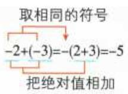
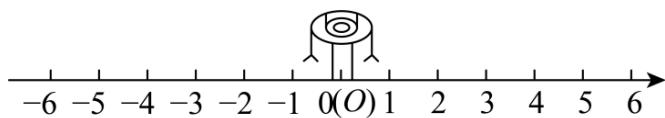
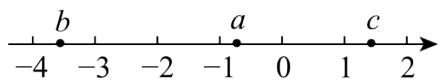
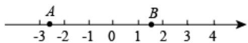
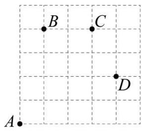
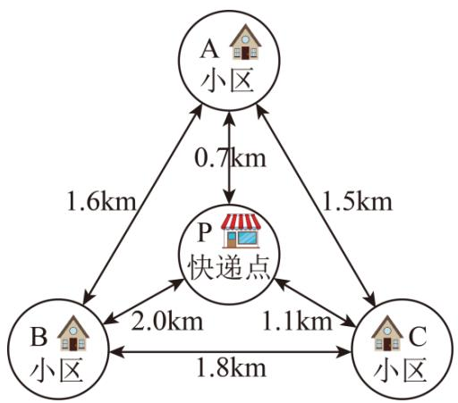
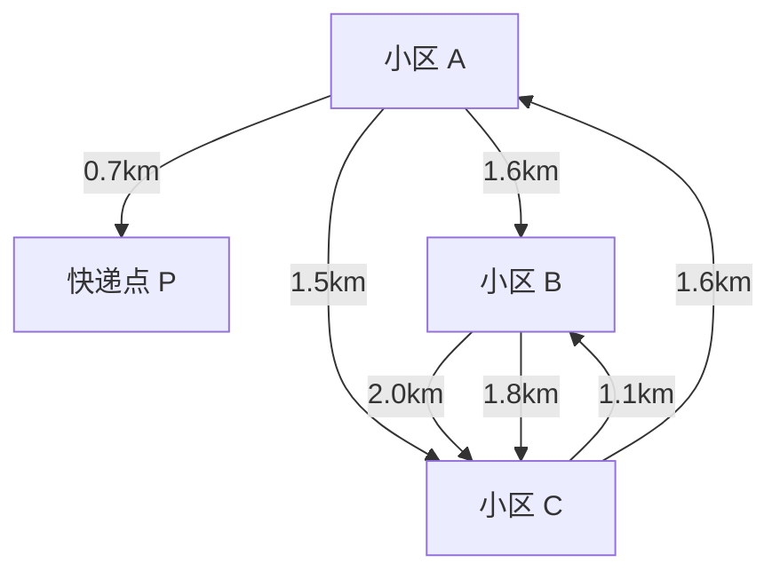
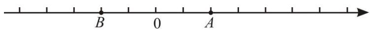
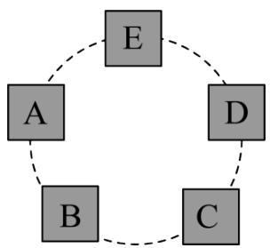
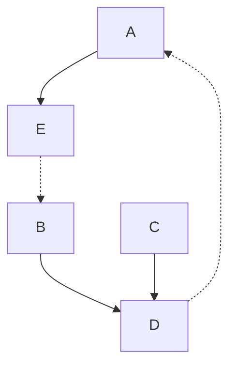

# 专题2.4 有理数的加减运算（举一反三讲义）

【北师大版 2024】

# 题型归纳

【题型 1 有理数加法运算】....2

【题型 2 有理数加法中的符号问题】....3

【题型 3 有理数加法在实际生活中的应用】....3

【题型4 有理数减法的运算】....5

【题型5 有理数减法的实际应用】....5

【题型 6 省略加号和括号的形式】....6

【题型 7 有理数加减的混合运算】....7

【题型8 有理数加减中的简便运算】....8

【题型 9 有理数加减混合运算的应用】....8

# 举一反三

知识点1 有理数加法法则

<table><tr><td>同号两数相加</td><td>和取相同的符号,且和的绝对值等于加数的绝对值的和</td><td></td></tr><tr><td rowspan="2">异号两数相加</td><td>绝对值不相等的异号两数相加,和取绝对值较大的加数的符号,且和的绝对值等于加数的绝对值中较大者与较小者的差</td><td>取绝对值较大的加数的符号用较大的绝对值减去较小的绝对值</td></tr><tr><td>互为相反数的两个数相加得0</td><td>a,b互为相反数,则a+b=0</td></tr><tr><td>一个数与0相加</td><td>仍得这个数</td><td>0+a=a</td></tr></table>

# 知识点 2 有理数加法运算律

1. 有理数的加法中，两个数相加，交换加数的位置，和不变．加法交换律： $a + b = b + a$   
2. 在有理数的加法中，三个数相加，先把前两个数相加，或者先把后两个数相加，和不变．加法结合律：

$$
(a + b) + c = a + (b + c).
$$

知识点 3 有理数减法法则 教辅资源，关注公众号★全科AA+

1. 减去一个数，等于加这个数的相反数，即 $a-b = a + (-b)$ .  
2. 有理数的减法是有理数的加法的逆运算.  
3. 减法转化为加法时，减数一定要改变符号.

# 知识点 4 有理数加减混合运算

# 1. 有理数加减混合运算

(1) 先将加减法统一成加法, 再运用加法的交换律和结合律简化运算.   
(2) 运用加法交换律交换加数的位置时, 要连同前面的符号一起交换.

2. 省略加号的和式及读法：统一成加法运算的算式，可以改写成省略加号和括号的形式，这种形式的算式一般有两种读法．例如： $-2-3+27-24$ ，可读作负2、负3、正27、负24的和，也可以读作负2减3加27减24.

# 3. 有理数加减混合运算的一般步骤

教辅资源，关注公众号★全科AA+

<table><tr><td>方法一:减法转化成加法</td><td>方法二:省略括号法</td></tr><tr><td>(1)减法变加法:a+b-c=a+b+(-c)</td><td>(1)省略括号</td></tr><tr><td>(2)运用加法交换律和结合律将同号的数分别相加</td><td>(2)同号的数相结合</td></tr><tr><td>(3)按有理数加法法则计算</td><td>(3)进行加减运算</td></tr></table>

# 【题型1 有理数加法运算】

【例 1】（2025·吉林长春·二模）下面给出的四个数，使式子 $(-2)+$ 的结果为正数的是（）

A. -1

B. 0

C. 1

D. 3

【变式 1-1】（24-25 六年级下·上海·假期作业）计算： $(-24)+24=$ \_\_\_\_， $5\frac{1}{5}+(-5\frac{1}{5})=$ \_\_\_\_， $(-3.375)+3\frac{3}{8}=$ \_\_\_\_.

【变式 1-2】（2025·河南信阳·三模）“一个数与 0 相加，和是负数”，请写出一个满足上述条件的数：\_\_\_\_。

【变式 1-3】（24-25 六年级下·黑龙江哈尔滨·阶段练习）在虚拟环境中，输入“+2”可以让虚拟机器人向右走 2 格，输入“-2”可以让虚拟机器人向左走 2 格，如图，虚拟机器人在起点 O 处，若先输入“+6”，再输入“-3”，则虚拟机器人会走到数字\_\_\_\_的位置上.

text_image

-6 -5 -4 -3 -2 -1 0(O) 1 2 3 4 5 6

# 【题型2 有理数加法中的符号问题】

【例 2】a, b, c 三个数的位置如图所示，下列结论错误的是（）

A. $b + a > 0$

B. $b + c <   0$

C. $a+b<0$

D. $a+c>0$

【变式 2-1】m 是有理数，则 $m + |m|$ （）

A. 可以是负数

B. 不可能是负数

C. 一定是正数

D. 可是正数也可是负数

【变式 2-2】如图，若数轴上 A, B 两点对应的有理数分别为 a, b，则 $a + b$ 的值可能是（）

text_image

-3
-2
-1
0
1
2
3
4
A
B

A. 2

B. 1

C. -1

D. -2

【变式 2-3】（2024 七年级·全国·竞赛）有一列数：-2011, -2004, -1997, -1990, …，它们按一定的规律排列，那么这列数的前（）个数的和最小.

A. 288

B. 289

C. 290

D. 292

# 【题型3 有理数加法在实际生活中的应用】

【例 3】（2025·湖南娄底·二模）如图，某品牌乒乓球的产品参数中标明球的直径是 $40 \mathrm{~mm} \pm 0.05 \mathrm{~mm}$ ，下列乒乓球的尺寸中，不合格的是（）

<table><tr><td colspan="3"></td></tr><tr><td rowspan="5">★★★</td><td>型号</td><td>3星级</td></tr><tr><td>质量</td><td>黄色</td></tr><tr><td>质量</td><td>(2.74±0.02)g</td></tr><tr><td>直径</td><td>(40±0.05)mm</td></tr><tr><td>包装规格</td><td>10只/盒</td></tr></table>

A. 39.92mm

B. 40.01mm

C. 39.99mm

D. 40.05mm

【变式 3-1】（24-25 七年级下·辽宁铁岭·期中）如图，一只蚂蚁在 $5 \times 5$ 的方格（每个小方格的边长均为 1）

上沿着网格线运动，它从 A 处出发去看望 B，C，D 处的其他蚂蚁，如从 A 处到 B 处记为 $A \rightarrow B (+1, +4)$ ，从 B 处到 A 处记为 $B \rightarrow A(-1, -4)$ ，其中第一个数表示左右方向，第二个数表示上下方向.

text_image

B
C
D
A

(1)图中 $A\rightarrow C(\_, \_)$ ， $B\rightarrow C(\_, \_)$ ， $C\rightarrow D(\_, \_)$ ;  
(2)若这只蚂蚁从 A 处去 P 处的行走路线依次为 $(+2,+2)$ ， $(+2,-1)$ ， $(-2,+3)$ ， $(-1,-2)$ ，请在图中标出 P 处的位置；  
(3)若这只蚂蚁的行走路线为 $A \rightarrow B \rightarrow C \rightarrow D$ ，请计算该蚂蚁走过的路程；  
(4)若图中另有两处 M, N, 且 $M \rightarrow A(3 - a, b - 4)$ , $M \rightarrow N(5 - a, b - 2)$ , 则从 N 处到 A 处应记为什么?

【变式 3-2】（2025·北京海淀·一模）某公司设有三个充电桩，分别为一个快充桩和两个慢充桩。每个充电桩在同一时间仅为一辆车提供充电服务，且每辆车充电完成前，充电过程不得中断。现有五辆车待充电，每辆车的充电需求如下表：

<table><tr><td>车辆序号</td><td>A</td><td>B</td><td>C</td><td>D</td><td>E</td></tr><tr><td>快充桩充电时间(分钟)</td><td>70</td><td>40</td><td>无法使用</td><td>90</td><td>60</td></tr><tr><td>慢充桩充电时间(分钟)</td><td>210</td><td>120</td><td>150</td><td>无法使用</td><td>170</td></tr></table>

车辆充电交接时间忽略不计，请回答下列问题：

(1) 若其中的四辆车完成充电的总用时不超过 150 分钟, 则这四辆车的序号可以为\_\_\_\_（写出一种即可）;  
(2) 这五辆车完成充电总用时最短为\_\_\_\_分钟.

【变式 3-3】（2025·山东临沂·二模）快递员小明每天从快递点 P 骑电动三轮车到 A, B, C 三个小区投送快递，每个小区经过且只经过一次，最后返回快递点 P. P, A, B, C 之间的距离（单位：km）如图所示，则小明骑行的最短距离为（）

flowchart

A. 4.5

B. 5.2

C. 6

D. 6.2

# 【题型4 有理数减法的运算】

教辅资源，关注公众号★全科AA+

【例 4】（24-25 七年级上·山西朔州·期末）计算： $|-5|-(-3)$ 的结果是\_\_\_\_.

【变式 4-1】（24-25 六年级下·上海·假期作业）计算：

(1) $\left(-\frac{3}{5}\right)-\left(-\frac{2}{5}\right);$   
(2)(-2)- $\left(+1\frac{1}{3}\right)$ ;   
(3)4.3-6.2;   
(4) $2\frac{7}{8}-(-3.4)$ .

【变式 4-2】（2025·山东德州·二模）如图，若数轴上点 A 表示的数是 +2，则点 B 表示的数为（）

text_image

B
0
A

A.-2

B. 0

C. 2

D. 4

【变式 4-3】（23-24 七年级上·甘肃兰州·期中）已知 $|a|=2$ ， $|b|=3$ ，且a<b，求a-b的值.

# 【题型 5 有理数减法的实际应用】

【例 5】一种零件标准尺寸是 20 毫米，质量部门工作人员将 19.97 毫米记为 -0.03 毫米，那么 20.05 毫米就记为 \_\_\_\_ 毫米.

【变式 5-1】（2025·湖北武汉·二模）武汉关的设防水位是25m，以它为基准点，高于25m的水位用正数表示，比如1998年武汉关的最高水位达到29.43m，记作+4.43m，2025年4月份，武汉关的最高水位是16m，记作\_\_\_\_m.

【变式 5-2】（2025·浙江金华·二模）2025年1月1日金华市四个景点的最高气温与最低气温如下表，该天温差最大的景点是（）

<table><tr><td>景点</td><td>诸葛八卦村</td><td>永康方岩</td><td>金华双龙洞</td><td>磐安百丈潭</td></tr><tr><td>最高气温</td><td>13°C</td><td>16°C</td><td>14°C</td><td>12°C</td></tr><tr><td>最低气温</td><td>-2°C</td><td>2°C</td><td>0°C</td><td>-1°C</td></tr></table>

A. 诸葛八卦村

B. 永康方岩

C. 金华双龙洞

D. 磐安百丈潭

【变式 5-3】（24-25 七年级下·福建泉州·期中）在“趣味数学”社团活动上，陈老师策划了一个“猜数”游戏，她准备了 50 张同样的卡牌，正面分别写有数字 1, 2, 3, ..., 49, 50. 游戏规则：先将卡牌顺序打乱，参与者从中随机抽取五张，并将它们正面向下放置在桌上（如图），这五张卡牌分别记为 A, B, C, D, E. 陈老师依次将相邻两张卡片上的数的和告诉参与者，请参与者猜出其中哪张卡牌上的数字最大. 小明同学参与了该游戏，他将抽取的五张卡牌如图放置，并将陈老师告诉他的相邻两张卡牌上的数的和记录如下表，则他所抽取的这五张卡牌上数字最大的是\_\_\_\_．（填 A, B, C, D, E）

<table><tr><td>卡牌编号</td><td>A,B</td><td>B,C</td><td>C,D</td><td>D,E</td><td>E,A</td></tr><tr><td>两数的和</td><td>74</td><td>70</td><td>71</td><td>67</td><td>72</td></tr></table>

flowchart

# 【题型6 省略加号和括号的形式】教辅资源，关注公众号★全科AA+

【例 6】写成省略加号和的形式后为-8-4-5+8的式子是()

A. $(-8) - (+4) - (-5) + (+8)$

B. $-( + 8) - (-4) - (+5) - (+8)$

C. $(-8) + (-4) + (+5) - (-8)$

D. $-8 - (+4) + (-5) - (-8)$

【变式 6-1】把 $(-2)-(+4)-(-8)+(+1)$ 写成统一成加法的形式是\_\_\_\_，写成省略加号的和形式\_\_\_\_，读

作：\_\_\_\_，或\_\_\_\_。

【变式 6-2】把 $(-7)-|-6|+(-4)+(+5)$ 写成省略括号的和的形式，下列变形正确的是（）

A. 原式 $= -7 + 6 - 4 - 5$

B. 原式 $= 7 + 6 - 4 + 5$

C. 原式 $= -7 - 6 - 4 + 5$

D. 原式 $= -7 + 6 - 4 + 5$

【变式 6-3】为计算简便，把 $(-1.4)-(-3.7)-(+0.5)+(+2.4)+(-3.5)$ 写成省略加号的和的形式，并按要求交换加数的位置正确的是()

A. $-1.4 + 2.4 + 3.7 - 0.5 - 3.5$

B. $-1.4 + 2.4 + 3.7 + 0.5 - 3.5$

C. $-1.4+2.4-3.7-0.5-3.5$

D. $-1.4 + 2.4 - 3.7 - 0.5 + 3.5$

# 【题型7 有理数加减的混合运算】

【例 7】（22-23 七年级上·河南平顶山·期中）学习情境·过程性纠错请指出下面计算错在哪一步（）

$$
\begin{array}{l} 1 + \frac {4}{5} - \left(\frac {2}{3}\right) - \left(- \frac {1}{5}\right) - \left(+ 1 \frac {1}{3}\right) \\ = 1 \frac {4}{5} - \frac {2}{3} + \frac {1}{5} - 1 \frac {1}{3} ⓛ \\ = \left(1 \frac {4}{5} + \frac {1}{5}\right) - \left(\frac {2}{3} - 1 \frac {1}{3}\right) ② \\ = 2 - \left(- \frac {2}{3}\right) ③ \\ = 2 + \frac {2}{3} = 2 \frac {2}{3} ④ \\ \end{array}
$$

A. ①

B. ②

C. ③

D. ④

【变式 7-1】（2024 七年级上·全国·专题练习）如图所示的手机截屏内容是某同学完成的作业，他的得分是\_\_\_\_。

姓名：\_\_\_\_ 得分：\_\_\_\_

计算（每小题25分，共100分）：

① $(-3)+5=2;$   
② $-(-5)+1=4;$   
③ $|-7|-3+2=6;$   
④ $(-4)+\left(-\frac{3}{4}\right)=-\frac{19}{4}.$

【变式 7-2】（23-24 六年级下·全国·假期作业）规定图形 $\begin{array}{cc}a & \\ b & c \end{array}$ 表示运算 $a - b + c$ ，图形 $\begin{array}{cc}x & w \\ y & z \end{array}$ 表示运算 $x + z - y - w$ ，则 $\begin{array}{ccc}1 & & \\ 2 & 3 & \\ \end{array} + \begin{array}{ccc}4 & 7 \\ 5 & 6 \end{array} =$ \_\_\_\_。（直接写出答案）

【变式 7-3】（24-25 七年级上·河北保定·期中）大家都知道，九点五十五分可以说成十点差五分．这启发人们设计了一种新的加减记数法．比如：9 写成1\$\overline{1}\$,1\$\overline{1}\$ = 10-1，198 写成20\$\overline{2}\$,20\$\overline{2}\$ = 200-2；7683 写成1\$\overline{2}\$3，1\$\overline{2}\$3=10000-2320+3，总之，数字上画一杠表示减去它，按这个方法请计算：3\$\overline{4}\$9\$\overline{2}\$-6\$\overline{3}\$7=\_。

【题型8 有理数加减中的简便运算】 教辅资源，关注公众号★全科AA+

【例 8】（24-25 七年级下·全国·假期作业）观察下列式子： $\frac{1}{2}=\frac{1}{1}-\frac{1}{2}$ ， $\frac{1}{6}=\frac{1}{2}-\frac{1}{3}$ ， $\frac{1}{12}=\frac{1}{3}-\frac{1}{4}$ ， $\frac{1}{20}=\frac{1}{4}-\frac{1}{5}$ …请计算 $\frac{1}{2}+\frac{1}{6}+\frac{1}{12}+\frac{1}{20}+\frac{1}{30}+\frac{1}{42}+\frac{1}{56}+\frac{1}{72}+\frac{1}{90}=()$

【变式 8-1】（2025 七年级下·全国·专题练习）计算： $(1+3+5+7+\cdots+2025)$

$$
(2 + 4 + 6 + 8 + \dots + 2 0 2 4).
$$

【变式 8-2】（24-25 六年级下·广东汕头·自主招生）简便计算：

$$
(1) 8 9 + 8 9 9 + 8 9 9 9 + 8 9 9 9 9 + 8 9 9 9 9 9;
$$

$$
(2) 1 - \frac {5}{6} + \frac {7}{1 2} - \frac {9}{2 0} + \frac {1 1}{3 0} - \frac {1 3}{4 2} + \frac {1 5}{5 6}.
$$

【变式 8-3】（24-25 七年级下·全国·假期作业）计算.

$$
(1) 2 0 0 4 \frac {1}{2} - 2 0 0 3 \frac {1}{3} + 2 0 0 2 \frac {1}{2} - 2 0 0 1 \frac {1}{3} + \dots + 2 \frac {1}{2} - 1 \frac {1}{3} + \frac {1}{2}
$$

$$
(2) 2 0 2 3 - 2 0 2 0 + 2 0 1 7 - 2 0 1 4 + 2 0 1 1 - 2 0 0 8 + \dots . + 1 9 - 1 6 + 1 3 - 1 0 + 7 - 4 + 1
$$

# 【题型9 有理数加减混合运算的应用】

【例 9】（24-25 七年级上·广东深圳·期中）某工艺厂计划一周生产工艺品 2100 个，平均每天生产 300 个，但实际每天生产量与计划相比有出入．下表是某周的生产情况（超产记为正、减产记为负）：

<table><tr><td>星期</td><td>一</td><td>二</td><td>三</td><td>四</td><td>五</td><td>六</td><td>日</td></tr><tr><td>增减(单位:个)</td><td>+5</td><td>-2</td><td>-5</td><td>+15</td><td>-10</td><td>+16</td><td>-9</td></tr></table>

(1)写出该厂星期一生产工艺品的数量是\_\_\_\_；本周产量最少的一天生产工艺品的数量是\_\_\_\_；

(2)本周产量最多的一天比最少的一天多生产多少个工艺品？

(3)请求出该工艺厂在本周实际生产工艺品的数量;

【变式 9-1】（24-25 七年级上·福建厦门·期末）元旦放假期间，小湖与同学相约外出游玩。已知他当日微信钱包的初始余额为 10 元，当日微信钱包的账单如表所示，请你解决如下问题：

表

<table><tr><td>交易</td><td>金额(元)</td></tr><tr><td>微信红包—来自妈妈</td><td>+300</td></tr><tr><td>手机充值—中国移动</td><td>-30</td></tr><tr><td>转账—来自小华</td><td>+50</td></tr><tr><td>美团支付</td><td>-155</td></tr><tr><td>滴滴出行支付</td><td>-32</td></tr></table>

(1)账单中支出费用最大的交易是\_\_\_\_；  
(2)求小湖当日的微信钱包余额是多少?

【变式 9-2】（24-25 七年级上·湖南常德·期末）老师倡导同学们要多帮助家长做家务，养成热爱劳动的好习惯，下面是小军对于自己的寒假假期的计划，他计划每天做家务一个小时，但放假期间，由于每天的不定因素，小军实际每天做家务的时间和计划有所出入，下面是放假后第一周小军做家务的时间（增加记为 +，减少记为 -）

<table><tr><td>星期</td><td>一</td><td>二</td><td>三</td><td>四</td><td>五</td><td>六</td><td>日(天)</td></tr><tr><td>增减/分钟</td><td>+5</td><td>-4</td><td>-6</td><td>+8</td><td>-2</td><td>+2</td><td>+3</td></tr></table>

问：

(1)做家务时间最长的一天比最短的一天多多少分钟?  
(2)实际情况较计划时间是较长还是较短，长（/短）了多少分钟？  
(3)根据记录的数据，小军这周做家务总时长是多少小时？

【变式 9-3】（24-25 七年级上·福建三明·期中）某工厂一周（7 天）计划每日生产自行车 100 辆，由于工人实行轮休，每日上班人数不一定相同，实际每日生产量与计划量相比情况如下表（以计划量为标准，增加的车辆数记为正数，减少的车辆数记为负数）：

<table><tr><td>星期一</td><td>星期二</td><td>星期三</td><td>星期四</td><td>星期五</td><td>星期六</td><td>星期日</td></tr><tr><td>-1</td><td>+3</td><td>-2</td><td>+4</td><td>+7</td><td>-5</td><td>-10</td></tr></table>

(1)生产量最多的一天比生产量最少的一天多生产多少辆?  
(2)请通过计算回答：本周总生产量是否按原计划完成了生产任务？

(3)若该工厂生产的自行车销售利润平均20元/辆，求该工厂本周能获得的利润是多少？