# 专题2.4 有理数的加减运算（举一反三讲义）

【北师大版 2024】

# 题型归纳

【题型 1 有理数加法运算】....2

【题型 2 有理数加法中的符号问题】....3

【题型 3 有理数加法在实际生活中的应用】....5

【题型4 有理数减法的运算】....9

【题型5 有理数减法的实际应用】....11

【题型 6 省略加号和括号的形式】....13

【题型 7 有理数加减的混合运算】....15

【题型8 有理数加减中的简便运算】....17

【题型 9 有理数加减混合运算的应用】....19

# 举一反三

知识点1 有理数加法法则

<table><tr><td>同号两数相加</td><td>和取相同的符号,且和的绝对值等于加数的绝对值的和</td><td>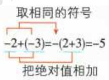</td></tr><tr><td rowspan="2">异号两数相加</td><td>绝对值不相等的异号两数相加,和取绝对值较大的加数的符号,且和的绝对值等于加数的绝对值中较大者与较小者的差</td><td>取绝对值较大的加数的符号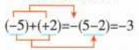用较大的绝对值减去较小的绝对值</td></tr><tr><td>互为相反数的两个数相加得0</td><td>a,b互为相反数,则a+b=0</td></tr><tr><td>一个数与0相加</td><td>仍得这个数</td><td>0+a=a</td></tr></table>

# 知识点 2 有理数加法运算律

1. 有理数的加法中，两个数相加，交换加数的位置，和不变．加法交换律： $a + b = b + a$   
2. 在有理数的加法中，三个数相加，先把前两个数相加，或者先把后两个数相加，和不变．加法结合律：

$$
(a + b) + c = a + (b + c).
$$

# 知识点 3 有理数减法法则

1. 减去一个数，等于加这个数的相反数，即 $a-b = a + (-b)$ .  
2. 有理数的减法是有理数的加法的逆运算.  
3. 减法转化为加法时，减数一定要改变符号.

# 知识点 4 有理数加减混合运算

# 1. 有理数加减混合运算

(1) 先将加减法统一成加法, 再运用加法的交换律和结合律简化运算.   
(2) 运用加法交换律交换加数的位置时, 要连同前面的符号一起交换.

2. 省略加号的和式及读法：统一成加法运算的算式，可以改写成省略加号和括号的形式，这种形式的算式一般有两种读法．例如： $-2-3+27-24$ ，可读作负2、负3、正27、负24的和，也可以读作负2减3加27减24.

# 3. 有理数加减混合运算的一般步骤

<table><tr><td>方法一:减法转化成加法</td><td>方法二:省略括号法</td></tr><tr><td>(1)减法变加法: $a + b - c = a + b + (-c)$ </td><td>(1)省略括号</td></tr><tr><td>(2)运用加法交换律和结合律将同号的数分别相加</td><td>(2)同号的数相结合</td></tr><tr><td>(3)按有理数加法法则计算</td><td>(3)进行加减运算</td></tr></table>

# 【题型1 有理数加法运算】

【例 1】（2025·吉林长春·二模）下面给出的四个数，使式子 $(-2)+$ 的结果为正数的是（）

A. -1

B. 0

C. 1

D. 3

【答案】D

【分析】本题主要考查了有理数加法运算、正负数等知识，熟练掌握有理数加法法则是解题关键．根据有理数加法法则以及负数的定义，逐项分析判断即可.

【详解】解：A. $-2+(-1)=-3<0$ ，故本选项不符合题意；

B. $-2 + 0 = -2 < 0$ ，故本选项不符合题意；  
C. $-2 + 1 = -1 < 0$ ，故本选项不符合题意；  
D. $-2 + 3 = 1 > 0$ ，本选项符合题意.

故选：D.

【变式 1-1】（24-25 六年级下·上海·假期作业）计算： $(-24)+24=$ \_\_\_\_， $5\frac{1}{5}+(-5\frac{1}{5})=$ \_\_\_\_， $(-3.375)+3\frac{3}{8}=$ \_\_\_\_.

【答案】000

【分析】本题考查了有理数的加法运算，掌握互为相反数的两个数的和为0是解题的关键.根据相反数的两个数的和为0即可求解.

【详解】解： $(-24)+24=0;$

$$
5 \frac {1}{5} + \left(- 5 \frac {1}{5}\right) = 0;
$$

$$
(- 3. 3 7 5) + 3 \frac {3}{8} = - 3 \frac {3}{8} + 3 \frac {3}{8} = 0,
$$

故答案为：0，0，0.

【变式 1-2】（2025·河南信阳·三模）“一个数与 0 相加，和是负数”，请写出一个满足上述条件的数：\_\_\_\_。

【答案】-1（答案不唯一）

【分析】本题主要考查了有理数的加法，解题关键是熟练掌握有理数的加法法则．写出一个数与0相加，再根据有理数的加法法则进行计算，从而解答即可

【详解】解：∵-1+0=-1，

∴满足条件的数是-1，

故答案为：-1（答案不唯一）.

【变式 1-3】（24-25 六年级下·黑龙江哈尔滨·阶段练习）在虚拟环境中，输入“+2”可以让虚拟机器人向右走 2 格，输入“-2”可以让虚拟机器人向左走 2 格，如图，虚拟机器人在起点 O 处，若先输入“+6”，再输入“-3”，则虚拟机器人会走到数字\_\_\_\_的位置上.

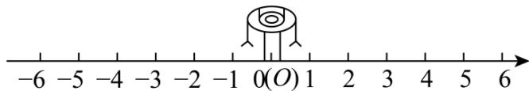

text_image

-6 -5 -4 -3 -2 -1 0(O) 1 2 3 4 5 6

【答案】3

【分析】先确定每次输入指令后机器人的移动方向和格数，通过有理数的加法计算最终位置．本题主要考查有理数的加法在实际情境中的应用，理解正负数表示的移动方向，熟练进行有理数加法运算是解题的关键.

【详解】解：输入“+6”，机器人从原点 O 向右走6格，此时位置是 $0 + 6 = 6$ .

再输入“-3”，机器人从6的位置向左走3格，位置变为 $6+(-3)=3$ 。

故答案为：3.

# 【题型2 有理数加法中的符号问题】

【例 2】a, b, c 三个数的位置如图所示，下列结论错误的是（）

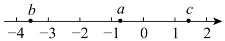

A. $b+a>0$

B. $b+c<0$

C. $a+b<0$

D. $a+c>0$

【答案】A

【分析】根据数轴上点的位置判断出 a, b, c 的大小，利用有理数的加法法则逐一判断即可.

【详解】根据数轴上点的位置得：-4<b<-3<-1<a<0<1<c，即 $|a|<|c|<|b|$ ，

$\therefore b+a<0$ ，故 A 选项错误，符合题意，

$b+c<0$ ，故 B 选项正确，不符合题意，

$a+b<0$ ，故 C 选项正确，不符合题意，

$a+c>0$ ，故 D 选项正确，不符合题意，

故选：A.

【点睛】此题考查了有理数的加法及数轴，正确判断 a, b, c 的大小，熟练掌握运算有理数加减法法则是解本题的关键.

【变式 2-1】m 是有理数，则 $m + |m|$ （）

A. 可以是负数

B. 不可能是负数

C. 一定是正数

D. 可是正数也可是负数

【答案】B

【分析】本题考查了有理数的加法法则和绝对值的概念，需要分情况讨论．采用分类讨论时，要把所有情况分析清楚．故考虑m>0,m<0,m=0三种情况，化简原式后判断即可.

【详解】解：当m>0时， $m+|m|=m+m=2m>0;$

当 $m \leq 0$ 时， $m + |m| = m - m = 0$ ;

$$
\therefore m + | m | \geq 0,
$$

即： $m + |m|$ 可能是正数，也可能是 0，但不可能是负数.

A. 不可以是负数，此选项错误；  
B. 不可能是负数，此选项正确；  
C. 可能是正数，也可能是 0，此选项错误；  
D. 可能是正数，但绝不可能是负数，此选项错误；

故选 B.

【变式 2-2】如图，若数轴上 A, B 两点对应的有理数分别为 a, b，则 $a + b$ 的值可能是（）

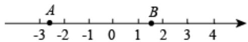

text_image

-3
A
-2
-1
0
1
B
2
3
4

A. 2

B. 1

C. -1

D. -2

【答案】C

【分析】由图可知-3<a<-2，1<b<2，且 $|a|>|b|$ ，则 $-2<a+b<0$ ，故可确定 $a+b$ 的可能值.

【详解】由图可知-3 < a < -2，1 < b < 2，且 $|a| > |b|$ ，则-2 < a + b < 0，所以 $a + b$ 的值可能是-1。故选：C

【点睛】本题考查了有理数的加法法则、利用数轴比较有理数的大小，正确理解题意是关键.

【变式 2-3】（2024 七年级·全国·竞赛）有一列数：-2011,-2004,-1997,-1990,…，它们按一定的规律排列，那么这列数的前（）个数的和最小.

A. 288

B. 289

C. 290

D. 292

【答案】A

【分析】本题考查有理数的加法，数字规律探索，当各项都是负数时，和最小，得出答案.

【详解】这列数的第n项可表示为 $-2011+7(n-1)$ ,

当各项都是负数时，和最小，

由当n=288时， $-2011+7(n-1)=-2$ ，当n=289时， $-2011+7(n-1)=5$ ，

所以前 288 项的和最小.

故选：A.

# 【题型3 有理数加法在实际生活中的应用】

【例 3】（2025·湖南娄底·二模）如图，某品牌乒乓球的产品参数中标明球的直径是 $40 \mathrm{~mm} \pm 0.05 \mathrm{~mm}$ ，下列乒乓球的尺寸中，不合格的是（）

<table><tr><td colspan="3"></td></tr><tr><td rowspan="3">★★★</td><td>型号</td><td>3星级</td></tr><tr><td>质量</td><td>黄色</td></tr><tr><td>质量</td><td>(2.74±0.02)g</td></tr><tr><td rowspan="2"></td><td>直径</td><td>(40±0.05)mm</td></tr><tr><td>包装规格</td><td>10只/盒</td></tr></table>

A. 39.92mm

B. 40.01mm

C. 39.99mm

D. 40.05mm

【答案】A

【分析】本题考查了正负数的应用，有理数加法在实际生活中的应用，根据题意算出直径上限和下限，即可得出答案，掌握相关知识是解题的关键.

【详解】解：由题意可得：

该品牌乒乓球的产品参数中标明球的直径上限是： $40mm + 0.05mm = 40.05mm$ ，

直径下限是：40mm-0.05mm = 39.95mm，

∴只要乒乓球直径在39.95mm和40.05mm之间都是合格的，

∴选项中，直径为39.92mm的乒乓球不合格，

故选：A.

【变式 3-1】（24-25 七年级下·辽宁铁岭·期中）如图，一只蚂蚁在 $5 \times 5$ 的方格（每个小方格的边长均为 1）上沿着网格线运动，它从 $A$ 处出发去看望 $B, C, D$ 处的其他蚂蚁，如从 $A$ 处到 $B$ 处记为 $A \to B(+1, +4)$ ，从 $B$ 处到 $A$ 处记为 $B \to A(-1, -4)$ ，其中第一个数表示左右方向，第二个数表示上下方向。

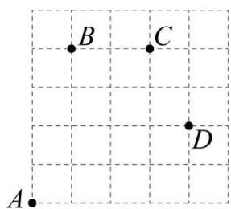

text_image

B
C
D
A

(1)图中 $A\rightarrow C(\_, \_)$ ， $B\rightarrow C(\_, \_)$ ， $C\rightarrow D(\_, \_)$ ;

(2)若这只蚂蚁从 A 处去 P 处的行走路线依次为 $(+2,+2)$ ， $(+2,-1)$ ， $(-2,+3)$ ， $(-1,-2)$ ，请在图中标出 P 处的位置；

(3)若这只蚂蚁的行走路线为 $A\rightarrow B\rightarrow C\rightarrow D$ ，请计算该蚂蚁走过的路程；

(4)若图中另有两处 M, N, 且 $M \rightarrow A(3 - a, b - 4)$ , $M \rightarrow N(5 - a, b - 2)$ ，则从 N 处到 A 处应记为什么？

【答案】(1)+3，+4；+2，0；+1，-2

(2) 见解析

(3)-2

(4)从 N 处到 A 处应记为 $N \rightarrow A(-2, -2)$

【分析】本题考查了正数与负数的应用，有理数的加法的应用，熟练掌握以上知识点并灵活运用，采用数形结合的思想是解此题的关键.

（1）根据题意结合图形即可得解；  
（2）根据题意把每个数对的第一个数字和第二个数字分别相加，从而得出点 $A$ 到点 $P$ 的平移方式，再画出 $P$ 处的位置即可；  
（3）由题意可知 $A\rightarrow B(+1,+4)$ ， $B\rightarrow C(+2,0)$ ， $C\rightarrow D(+1,-2)$ ，由此计算即可得解；  
（4）由题意可得 $N\rightarrow M(a-5,2-b)$ ，再求出 $a-5+3-a=-2$ ， $2-b+b-4=-2$ ，即可得解.

【详解】（1）解：由题意可得： $A \rightarrow C(+3, +4)$ ， $B \rightarrow C(+2, 0)$ ， $C \rightarrow D(+1, -2)$ ;

故答案为：+3，+4；+2，0；+1，-2；

(2) 解: $(+2)+(+2)+(-2)+(-1)=1$ , $(+2)+(-1)+(+3)+(-2)=2$ ,

∴点 A 到点 P 的平移方式是：向右一个单位长度，向上两个单位长度，

则 P 处的位置如图所示.

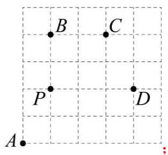

text_image

B
C
P
D
A

（3）解：由题意可知 $A\rightarrow B(+1,+4)$ ， $B\rightarrow C(+2,0)$ ， $C\rightarrow D(+1,-2)$ .

∴该蚂蚁走过的路程为 $1+4+2+0+1+2=10$ ;

（4）解：∵ $M \rightarrow A(3 - a, b - 4)$ ， $M \rightarrow N(5 - a, b - 2)$ ，

$$
\therefore N \rightarrow M (a - 5, 2 - b),
$$

$$
\therefore a - 5 + 3 - a = - 2, 2 - b + b - 4 = - 2,
$$

∴ 从 N 处到 A 处应记为 $N \rightarrow A(-2, -2)$ .

【变式 3-2】（2025·北京海淀·一模）某公司设有三个充电桩，分别为一个快充桩和两个慢充桩。每个充电桩在同一时间仅为一辆车提供充电服务，且每辆车充电完成前，充电过程不得中断。现有五辆车待充电，每辆车的充电需求如下表：

<table><tr><td>车辆序号</td><td>A</td><td>B</td><td>C</td><td>D</td><td>E</td></tr><tr><td>快充桩充电时间(分钟)</td><td>70</td><td>40</td><td>无法使用</td><td>90</td><td>60</td></tr><tr><td>慢充桩充电时间(分钟)</td><td>210</td><td>120</td><td>150</td><td>无法使用</td><td>170</td></tr></table>

车辆充电交接时间忽略不计，请回答下列问题：

(1) 若其中的四辆车完成充电的总用时不超过 150 分钟, 则这四辆车的序号可以为\_\_\_\_（写出一种即可）:

(2) 这五辆车完成充电总用时最短为\_\_\_\_分钟.

【答案】 ABCE（答案不唯一） 200

【分析】本题考查了有理数的加减运算的应用，解决本题的关键是根据每辆车的充电需求，合理安排时间.

（1）根据其中的四辆车完成充电的总用时不超过 150 分钟，进行合理安排即可；

（2）优先考虑慢充时间最长的应当安排快充，据此进行求解即可.

【详解】解：（1）要使其中的四辆车完成充电的总用时不超过 150 分钟，可安排如下：快充桩可依次提供给 A, E 充电，两个慢充桩可分别提供给 B, C 充电，

故答案为：ABCE（答案不唯一）；

(2) 要使五辆车完成充电总用时最短, 可安排如下: 快充桩可依次提供给 $A, B, D$ 充电, 共需要

$70 + 40 + 90 = 200$ （分钟），两个慢充桩可分别提供给C,E充电，其中C充电完成需要150分钟，E充电完成需要170分钟，

∴这五辆车完成充电总用时最短为200分钟.

故答案为：200.

【变式 3-3】（2025·山东临沂·二模）快递员小明每天从快递点 P 骑电动三轮车到 A, B, C 三个小区投送快递，每个小区经过且只经过一次，最后返回快递点 P. P, A, B, C 之间的距离（单位：km）如图所示，则小明骑行的最短距离为（）

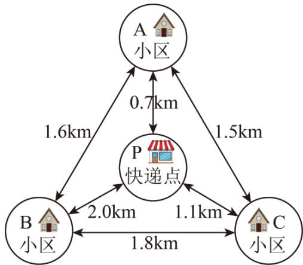

flowchart

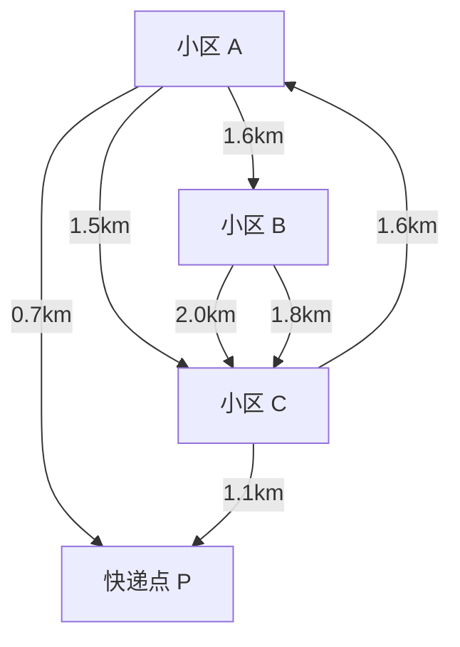

A. 4.5

B. 5.2

C. 6

D. 6.2

【答案】B

【分析】本题涉及到距离的计算．有理数加法的实际应用，需要找出所有可能的路线，计算其距离，再比

较得出最短距离.

【详解】找出所以可能路线计算：

$P\rightarrow B\rightarrow A\rightarrow C\rightarrow P$ ，距离为 $2.0+1.6+1.5+1.1=6.2km$ ;

$P\rightarrow B\rightarrow C\rightarrow A\rightarrow P$ ，距离为 $2.0+1.8+1.5+0.7=6km$

$P\rightarrow A\rightarrow B\rightarrow C\rightarrow P$ ，距离为 $0.7+1.6+1.8+1.1=5.2km$ ;

$P\rightarrow A\rightarrow C\rightarrow B\rightarrow P$ ，距离为 $0.7+1.5+1.8+2.0=6km$ ;

$P \rightarrow C \rightarrow A \rightarrow B \rightarrow P$ ，距离为 $1.1 + 1.5 + 1.6 + 2.0 = 6.2km$ ;

$P \rightarrow C \rightarrow B \rightarrow A \rightarrow P$ ，距离为 $1.1 + 1.8 + 1.6 + 0.7 = 5.2km$

通过比较这些路线的距离，5.2km是最短的。

故选：B

# 【题型4 有理数减法的运算】

【例 4】（24-25 七年级上·山西朔州·期末）计算： $|-5|-(-3)$ 的结果是\_\_\_\_.

【答案】8

【分析】本题考查绝对值，以及有理数的减法运算，解题的关键在于熟练掌握相关运算法则．根据相关运算法则计算求解，即可解题.

【详解】解： $|-5|-(-3)=5+3=8$ ，

故答案为：8.

【变式 4-1】（24-25 六年级下·上海·假期作业）计算：

(1) $\left(-\frac{3}{5}\right)-\left(-\frac{2}{5}\right);$

(2)(-2)- $\left(+1\frac{1}{3}\right)$ ;

(3)4.3-6.2;

(4) $2\frac{7}{8}-(-3.4)$ .

【答案】(1) $-\frac{1}{5}$ ;

(2) $-3\frac{1}{3};$

(3)-1.9;

(4)6.275.

【分析】本题考查了有理数的减法运算，熟练掌握运算法则是解题的关键.

（1）根据有理数的减法运算法则计算即可；  
(2) 根据有理数的减法运算法则计算即可;  
（3）根据有理数的减法运算法则计算即可；  
(4) 根据有理数的减法运算法则计算即可.

【详解】（1）解： $\left(-\frac{3}{5}\right)-\left(-\frac{2}{5}\right)$

$$
\begin{array}{l} = - \frac {3}{5} + \frac {2}{5} \\ = - \frac {1}{5}; \\ \end{array}
$$

(2) 解: $(-2)-\left(+1\frac{1}{3}\right)$

$$
\begin{array}{l} = (- 2) - 1 \frac {1}{3} \\ = - 3 \frac {1}{3}; \\ \end{array}
$$

(3) 解: 4.3-6.2

$$
= - 1. 9;
$$

(4) 解: $2\frac{7}{8} - (-3.4)$

$$
\begin{array}{l} = 2. 8 7 5 + 3. 4 \\ = 6. 2 7 5. \\ \end{array}
$$

【变式 4-2】（2025·山东德州·二模）如图，若数轴上点 A 表示的数是 +2，则点 B 表示的数为（）

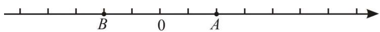

text_image

B
0
A

A.-2

B. 0

C. 2

D. 4

【答案】A

【分析】该题考查了数轴和有理数减法，根据两点的距离是4个单位长度解答即可.

【详解】解：若数轴上点 A 表示的数是 +2，

则点 B 表示的数为 +2-4 = -2，

故选：A.

【变式 4-3】（23-24 七年级上·甘肃兰州·期中）已知 $|a|=2$ ， $|b|=3$ ，且a<b，求a-b的值.

【答案】-1或-5

【分析】本题主要考查了化简绝对值、有理数减法等知识点，根据题意求得a=3或-3、b=6成为解题的

关键.

根据绝对值的意义并结合已知条件分别求得 a、b 的值，然后代入 a-b 计算即可.

【详解】解：∵ $|a|=2$ ，

$$
\therefore a = 2 \text {或} - 2,
$$

$$
\because | b | = 3,
$$

$$
\therefore b = 3 \text {或} - 3,
$$

$$
\because a <   b,
$$

$$
\therefore a = 2 \text {或} - 2, b = 3,
$$

$$
\therefore a - b = 2 - 3 = - 1 \text {或} a - b = - 2 - 3 = - 5.
$$

答：a-b的值为-1或-5.

# 【题型5 有理数减法的实际应用】

【例 5】一种零件标准尺寸是 20 毫米，质量部门工作人员将 19.97 毫米记为 -0.03 毫米，那么 20.05 毫米就记为\_\_\_\_毫米.

【答案】+0.05

【分析】本题考查正负数的意义，根据题意，低于标准尺寸为负，则高于标准尺寸为正，进行求解即可.

【详解】解：20.05-20 = +0.05（毫米）；

故答案为：+0.05.

【变式 5-1】（2025·湖北武汉·二模）武汉关的设防水位是25m，以它为基准点，高于25m的水位用正数表示，比如1998年武汉关的最高水位达到29.43m，记作+4.43m，2025年4月份，武汉关的最高水位是16m，记作\_\_\_\_m.

【答案】-9

【分析】本题考查了正负数的应用，有理数减法的应用．利用有理数的减法计算即可求解.

【详解】解：∵高于25m的水位用正数表示，

∴低于25m的水位用负数表示，

$$
\because 2 5 - 1 6 = 9 \mathrm{m},
$$

∴16m记作-9m，

故答案为：-9.

【变式 5-2】（2025·浙江金华·二模）2025年1月1日金华市四个景点的最高气温与最低气温如下表，该天温差最大的景点是（）

<table><tr><td>景点</td><td>诸葛八卦村</td><td>永康方岩</td><td>金华双龙洞</td><td>磐安百丈潭</td></tr><tr><td>最高气温</td><td>13°C</td><td>16°C</td><td>14°C</td><td>12°C</td></tr><tr><td>最低气温</td><td>-2°C</td><td>2°C</td><td>0°C</td><td>-1°C</td></tr></table>

A. 诸葛八卦村

B. 永康方岩

C. 金华双龙洞

D. 磐安百丈潭

【答案】A

【分析】本题考查了有理数减法的实际应用，有理数的大小比较，先利用有理数的减法求出四个景点的温差，再比较即可判断求解，掌握有理数的减法运算是解题的关键

【详解】解：诸葛八卦村的温差为 $13 - (-2) = 15^{\circ}\mathrm{C}$ ，永康方岩的温差为 $16 - 2 = 14^{\circ}\mathrm{C}$ ，金华双龙洞的温差为 $14 - 0 = 14^{\circ}\mathrm{C}$ ，磐安百丈潭的温差为 $12 - (-1) = 13^{\circ}\mathrm{C}$ ，

$$
\because 1 3 <   1 4 <   1 5,
$$

∴该天温差最大的景点是诸葛八卦村，

故选：A.

【变式 5-3】（24-25 七年级下·福建泉州·期中）在“趣味数学”社团活动上，陈老师策划了一个“猜数”游戏，她准备了 50 张同样的卡牌，正面分别写有数字 1, 2, 3, ..., 49, 50. 游戏规则：先将卡牌顺序打乱，参与者从中随机抽取五张，并将它们正面向下放置在桌上（如图），这五张卡牌分别记为 A, B, C, D, E. 陈老师依次将相邻两张卡片上的数的和告诉参与者，请参与者猜出其中哪张卡牌上的数字最大. 小明同学参与了该游戏，他将抽取的五张卡牌如图放置，并将陈老师告诉他的相邻两张卡牌上的数的和记录如下表，则他所抽取的这五张卡牌上数字最大的是\_\_\_\_．（填 A, B, C, D, E）

<table><tr><td>卡牌编号</td><td>A,B</td><td>B,C</td><td>C,D</td><td>D,E</td><td>E,A</td></tr><tr><td>两数的和</td><td>74</td><td>70</td><td>71</td><td>67</td><td>72</td></tr></table>

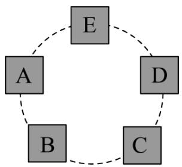

flowchart

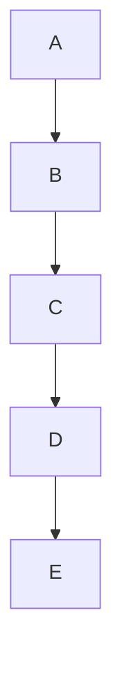

【答案】 $A$

【分析】本题考查了有理数的大小比较，利用表格数据列出算式进行比较即可得出结论，利用表格数据将各数排列是解此题的关键.

【详解】解：由题意可得：①A-C=74-70=4，

②B-D = 70-71 = -1,   
③C-E = 71-67 = 4,   
④A-D = 72-67 = 5,   
⑤B-E = 74-72 = 2,

由①④可得：A > C > D，由②可得B < D，由⑤可得：B > E，

$$
\therefore A > C > D > B > E,
$$

∴他所抽取的这五张卡牌上数字最大的是A，

故答案为：A.

# 【题型6 省略加号和括号的形式】

【例 6】写成省略加号和的形式后为 $-8-4-5+8$ 的式子是()

A. $(-8) - (+4) - (-5) + (+8)$

B. $-( + 8) - (-4) - (+5) - (+8)$

C. $(-8) + (-4) + (+5) - (-8)$

D. $-8 - (+4) + (-5) - (-8)$

【答案】D

【分析】根据有理数的减法运算，减去一个数等于加上这个数的相反数对各选项进行省略整理即可得解.

【详解】A. $(-8)-(+4)-(-5)+(+8)=-8-4+5+8$ ，故本选项错误；

B. $-(+8)-(-4)-(+5)-(+8)=-8+4-5-8$ ，故本选项错误；  
C. $(-8)+(-4)+(+5)-(-8)=-8-4+5+8$ ，故本选项错误；  
D. $-8 - (+4) + (-5) - (-8) = -8 - 4 - 5 + 8$ ，故本选项正确.

故选：D.

【点睛】本题考查了有理数的减法，主要是省略加号和的形式的练习，熟记减去一个数等于加上这个数的

相反数是解题的关键.

【变式 6-1】把 $(-2)-(+4)-(-8)+(+1)$ 写成统一成加法的形式是\_\_\_\_，写成省略加号的和形式\_\_\_\_，读作：\_\_\_\_，或\_\_\_\_。

【答案】 $(-2)+(-4)+(+8)+(+1)$ ， $-2-4+8+1$ ， $-2,-4,+8$ ，+1的和，或负2减4加8加1.

【分析】减去一个数，等于加上这个数的相反数．即可把减法统一成加法．省略加号时，注意符号变化法则：++得+，--得+，-+得-，+-得-

【详解】统一成加法的形式是 $(-2)+(-4)+(+8)+(+1)$ ,

省略加号的和形式 $-2-4+8+1$ ，

读作：-2,-4,+8，+1的和，或负2减4加8加1.

故答案为 $(-2) + (-4) + (+8) + (+1)$ ， $-2 - 4 + 8 + 1$ ， $-2, -4, +8$ ， $+1$ 的和，或负 2 减 4 加 8 加 1.

【点睛】正确理解加法的定义．注意：减去一个数，等于加上这个数的相反.

【变式 6-2】把 $(-7)-|-6|+(-4)+(+5)$ 写成省略括号的和的形式，下列变形正确的是（）

A. 原式 $= -7 + 6 - 4 - 5$

B. 原式 $= 7 + 6 - 4 + 5$

C. 原式 $= -7 - 6 - 4 + 5$

D. 原式 $= -7 + 6 - 4 + 5$

【答案】C

【分析】根据绝对值和正负数的定义以及性质进行转换即可.

【详解】 $(-7)-|-6|+(-4)+(+5)$

$$
= - 7 - 6 - 4 + 5
$$

故答案为：C.

【点睛】本题考查了去绝对值和括号的问题，掌握绝对值和正负数的定义以及性质是解题的关键.

【变式 6-3】为计算简便，把 $(-1.4)-(-3.7)-(+0.5)+(+2.4)+(-3.5)$ 写成省略加号的和的形式，并按要求交换加数的位置正确的是()

A. $-1.4+2.4+3.7-0.5-3.5$

B. $-1.4+2.4+3.7+0.5-3.5$

C. $-1.4+2.4-3.7-0.5-3.5$

D. -1.4+2.4-3.7-0.5+3.5

【答案】A

【分析】根据有理数的运算法则计算即可.

【详解】原式 $= -1.4 + 3.7 - 0.5 + 2.4 - 3.5$

$$
= - 1. 4 + 2. 4 + 3. 7 - 0. 5 - 3. 5,
$$

故选 A.

【点睛】考查有理数的运算，解题的关键是熟记和运用有理数的计算法则.

# 【题型7 有理数加减的混合运算】

【例 7】（22-23 七年级上·河南平顶山·期中）学习情境·过程性纠错请指出下面计算错在哪一步（）

$$
\begin{array}{l} 1 + \frac {4}{5} - \left(\frac {2}{3}\right) - \left(- \frac {1}{5}\right) - \left(+ 1 \frac {1}{3}\right) \\ = 1 \frac {4}{5} - \frac {2}{3} + \frac {1}{5} - 1 \frac {1}{3} ⓛ \\ = \left(1 \frac {4}{5} + \frac {1}{5}\right) - \left(\frac {2}{3} - 1 \frac {1}{3}\right) ② \\ = 2 - \left(- \frac {2}{3}\right) ③ \\ = 2 + \frac {2}{3} = 2 \frac {2}{3} ④ \\ \end{array}
$$

A. ①

B. ②

C. ③

D. ④

【答案】B

【分析】本题主要考查了有理数的加减法，根据有理数的减法运算法则判断出②错误，然后进行计算即可得解，熟练掌握减去一个数等于加上这个数的相反数是解决此题的关键.

【详解】 $1+\frac{4}{5}-\left(\frac{2}{3}\right)-\left(-\frac{1}{5}\right)-\left(+1\frac{1}{3}\right)$

$$
\begin{array}{l} = 1 \frac {4}{5} - \frac {2}{3} + \frac {1}{5} - 1 \frac {1}{3} (1) \\ = \left(1 \frac {4}{5} + \frac {1}{5}\right) - \left(\frac {2}{3} + 1 \frac {1}{3}\right) ② \\ = 2 - 2 \textcircled {3} \\ = 0 \textcircled {4} \\ \end{array}
$$

∴错在②的第二个括号内的运算，

故选：B.

【变式 7-1】（2024 七年级上·全国·专题练习）如图所示的手机截屏内容是某同学完成的作业，他的得分是\_\_\_\_。

姓名：\_\_\_\_ 得分：\_\_\_\_

计算（每小题 25 分，共 100 分）：

① $(-3)+5=2;$   
② $-(-5)+1=4;$

③ $|-7|-3+2=6;$

④ $(-4)+\left(-\frac{3}{4}\right)=-\frac{19}{4}.$

【答案】75

【分析】本题考查有理数的加减运算，熟记运算法则是解题的关键．根据有理数的加减运算法则逐个计算判断即可.

【详解】① $(-3)+5=2$ ，正确，

$-(-5)+1=6,$ ②错误.

③ $|-7|-3+2=6$ ，③正确，

④ $(-4)+\left(-\frac{3}{4}\right)=-\frac{19}{4}$ ，④正确，

故①③④正确，得75分，

故答案为：75

【变式 7-2】（23-24 六年级下·全国·假期作业）规定图形 $\triangle ABC$ 表示运算 $a-b+c$ ，图形 $\boxed{x,w}$ 表示运算 $x+z-y-w$ ，则 $\triangle ABC + \boxed{4\quad7} =$ \_\_\_\_。（直接写出答案）

【答案】0

【分析】此题考查了有理数的加减混合运算，弄清题中的新定义是解本题的关键．根据题中的新定义化简，计算即可得到结果.

【详解】解： $(1-2+3)+(4+6-7-5)=1-2+3+4+6-7-5=0$

故答案为：0.

【变式 7-3】（24-25 七年级上·河北保定·期中）大家都知道，九点五十五分可以说成十点差五分．这启发人们设计了一种新的加减记数法．比如：9 写成1\$\overline{1}\$,1\$\overline{1}\$ = 10-1，198 写成20\$\overline{2}\$,20\$\overline{2}\$ = 200-2；7683 写成1\$\overline{2}\$3，1\$\overline{2}\$3=10000-2320+3，总之，数字上画一杠表示减去它，按这个方法请计算：3\$\overline{4}\$9\$\overline{2}\$-6\$\overline{3}\$7=\_．

【答案】1945

【分析】本题考查有理数的加减混合运算，解题的关键是掌握新定义并熟练加以运用．先根据新定义计算出 $3\overline{492}-6\overline{37}=(3000-492)-(600-37)$ ，再计算可得答案.

【详解】解：由题意知3492-637

$$
= (3 0 0 0 - 4 9 2) - (6 0 0 - 3 7)
$$

$$
= 2 5 0 8 - 5 6 3
$$

$$
= 1 9 4 5,
$$

故选：A.

# 【题型8 有理数加减中的简便运算】

【例 8】（24-25 七年级下·全国·假期作业）观察下列式子： $\frac{1}{2}=\frac{1}{1}-\frac{1}{2}$ ， $\frac{1}{6}=\frac{1}{2}-\frac{1}{3}$ ， $\frac{1}{12}=\frac{1}{3}-\frac{1}{4}$ ， $\frac{1}{20}=\frac{1}{4}-\frac{1}{5}$ …请计算 $\frac{1}{2}+\frac{1}{6}+\frac{1}{12}+\frac{1}{20}+\frac{1}{30}+\frac{1}{42}+\frac{1}{56}+\frac{1}{72}+\frac{1}{90}=()$

【答案】 $\frac{9}{10} / 0.9$

【分析】该题考查了有理数的加减运算，观察给出的分解方法，找出规律，将所求的算式中的每一个加数分解成两个分数的差的形式，然后进行计算即可得解.

【详解】解： $\frac{1}{2}+\frac{1}{6}+\frac{1}{12}+\frac{1}{20}+\frac{1}{30}+\frac{1}{42}+\frac{1}{56}+\frac{1}{72}+\frac{1}{90}$

$$
\begin{array}{l} = \left(1 - \frac {1}{2}\right) + \left(\frac {1}{2} - \frac {1}{3}\right) + \left(\frac {1}{3} - \frac {1}{4}\right) + \left(\frac {1}{4} - \frac {1}{5}\right) + \left(\frac {1}{5} - \frac {1}{6}\right) + \left(\frac {1}{6} - \frac {1}{7}\right) + \left(\frac {1}{7} - \frac {1}{8}\right) + \left(\frac {1}{8} - \frac {1}{9}\right) + \left(\frac {1}{9} - \frac {1}{1 0}\right) = 1 - \frac {1}{2} + \frac {1}{2} - \frac {1}{3} + \frac {1}{3} \\ - \frac {1}{4} + \frac {1}{4} - \frac {1}{5} + \frac {1}{5} - \frac {1}{6} + \frac {1}{6} - \frac {1}{7} + \frac {1}{7} - \frac {1}{8} + \frac {1}{8} - \frac {1}{9} + \frac {1}{9} - \frac {1}{1 0} \\ = 1 - \frac {1}{1 0} \\ = \frac {9}{1 0}, \\ \end{array}
$$

故答案为: $\frac{9}{10}$ .

【变式 8-1】（2025 七年级下·全国·专题练习）计算： $(1+3+5+7+\cdots+2025)$

$$
(2 + 4 + 6 + 8 + \dots + 2 0 2 4).
$$

【答案】1013

【分析】此题考查了有理数混合运算，把原式变形为 $1+(3-2)+(5-4)+(7-6)+\cdots+(2025-2024)$ 进行解答即可.

【详解】解：原式 = 1 + (3 - 2) + (5 - 4) + (7 - 6) + … + (2025 - 2024)

$$
\begin{array}{l} = 1 \times 1 0 1 3 \\ = 1 0 1 3 \\ \end{array}
$$

【变式 8-2】（24-25 六年级下·广东汕头·自主招生）简便计算：

(1)89 + 899 + 8999 + 89999 + 899999;   
(2) $1-\frac{5}{6}+\frac{7}{12}-\frac{9}{20}+\frac{11}{30}-\frac{13}{42}+\frac{15}{56}.$

【答案】(1)999985;

(2) $\frac{5}{8}$ .

【分析】本题考查了有理数的加减法，运算律，掌握运算法则是解题的关键.

（1）根据有理数的加减法运算法则即可求解；  
(2) 根据有理数的加减法运算法则即可求解.

【详解】（1）解： $89 + 899 + 8999 + 89999 + 899999$

$$
\begin{array}{l} = (9 0 - 1) + (9 0 0 - 1) + (9 0 0 0 - 1) + (9 0 0 0 0 - 1) + (9 0 0 0 0 0 - 1) \\ = 9 9 9 9 9 0 - 5 \\ = 9 9 9 9 8 5; \\ \end{array}
$$

（2）解： $1-\frac{5}{6}+\frac{7}{12}-\frac{9}{20}+\frac{11}{30}-\frac{13}{42}+\frac{15}{56}$

$$
\begin{array}{l} = 1 - \left(\frac {1}{2} + \frac {1}{3}\right) + \left(\frac {1}{3} + \frac {1}{4}\right) - \left(\frac {1}{4} + \frac {1}{5}\right) + \left(\frac {1}{5} + \frac {1}{6}\right) - \left(\frac {1}{6} + \frac {1}{7}\right) + \left(\frac {1}{7} + \frac {1}{8}\right) \\ = 1 - \frac {1}{2} - \frac {1}{3} + \frac {1}{3} + \frac {1}{4} - \frac {1}{4} - \frac {1}{5} + \frac {1}{5} + \frac {1}{6} - \frac {1}{6} - \frac {1}{7} + \frac {1}{7} + \frac {1}{8} \\ = 1 - \frac {1}{2} + \frac {1}{8} \\ = \frac {5}{8}. \\ \end{array}
$$

【变式 8-3】（24-25 七年级下·全国·假期作业）计算.

$$
(1) 2 0 0 4 \frac {1}{2} - 2 0 0 3 \frac {1}{3} + 2 0 0 2 \frac {1}{2} - 2 0 0 1 \frac {1}{3} + \dots + 2 \frac {1}{2} - 1 \frac {1}{3} + \frac {1}{2}
$$

$$
(2) 2 0 2 3 - 2 0 2 0 + 2 0 1 7 - 2 0 1 4 + 2 0 1 1 - 2 0 0 8 + \dots \dots + 1 9 - 1 6 + 1 3 - 1 0 + 7 - 4 + 1
$$

【答案】(1) $1169\frac{1}{2}$

(2)1012

【分析】本题考查了有理数的加减运算，乘法运算，正确掌握相关性质内容是解题的关键.

（1）根据带分数的意义，可将算式变为 $(2004-2003)+(2002-2001)+\cdots+(2-1)+\left(\frac{1}{2}-\frac{1}{3}\right)+\left(\frac{1}{2}-\frac{1}{3}\right)$ $+\cdots+\left(\frac{1}{2}-\frac{1}{3}\right)+\frac{1}{2}$ ，然后去掉括号，将算式变为2004-2003+2002-2001+ $\cdots+2-1+\frac{1}{2}-\frac{1}{3}+\frac{1}{2}-\frac{1}{3}+\cdots+\frac{1}{2}-\frac{1}{3}$ $+\frac{1}{2}$ ，再添加括号，然后计算括号里面的结果，接着根据乘法的意义，进行简算即可.

(2) 合理分组: $(2023 - 2020) + (2017 - 2014) + (2011 - 2008) + \ldots + (13 - 10) + (7 - 4) + 1$ , 每两个数为一组, 结果是 3; 一共有 337 组; 进行简算即可.

【详解】（1） $2004\frac{1}{2}-2003\frac{1}{3}+2002\frac{1}{2}-2001\frac{1}{3}+\cdots+2\frac{1}{2}-1\frac{1}{3}+\frac{1}{2}$

$$
\begin{array}{l} = 2 0 0 4 + \frac {1}{2} - \left(2 0 0 3 + \frac {1}{3}\right) + 2 0 0 2 + \frac {1}{2} - \left(2 0 0 1 + \frac {1}{3}\right) + \dots + 2 + \frac {1}{2} - \left(1 + \frac {1}{3}\right) + \frac {1}{2} \\ = 2 0 0 4 + \frac {1}{2} - 2 0 0 3 - \frac {1}{3} + 2 0 0 2 + \frac {1}{2} - 2 0 0 1 - \frac {1}{3} + \dots + 2 + \frac {1}{2} - 1 - \frac {1}{3} + \frac {1}{2} \\ = 2 0 0 4 - 2 0 0 3 + 2 0 0 2 - 2 0 0 1 + \dots + 2 - 1 + \frac {1}{2} - \frac {1}{3} + \frac {1}{2} - \frac {1}{3} + \dots + \frac {1}{2} - \frac {1}{3} + \frac {1}{2} \\ = (2 0 0 4 - 2 0 0 3) + (2 0 0 2 - 2 0 0 1) + \dots + (2 - 1) + \left(\frac {1}{2} - \frac {1}{3}\right) + \left(\frac {1}{2} - \frac {1}{3}\right) + \dots + \left(\frac {1}{2} - \frac {1}{3}\right) + \frac {1}{2} \\ = 1 \times 1 0 0 2 + \frac {1}{6} \times 1 0 0 2 \\ = 1 1 6 9 \frac {1}{2}; \\ \end{array}
$$

(2) 解: $2023 - 2020 + 2017 - 2014 + 2011 - 2008 + \ldots + 19 - 16 + 13 - 10 + 7 - 4 + 1$

$$
= (2 0 2 3 - 2 0 2 0) + (2 0 1 7 - 2 0 1 4) + (2 0 1 1 - 2 0 0 8) + \dots . + (1 3 - 1 0) + (7 - 4) + 1
$$

每两个数为一组，结果是 3；一共有 337 组；

原式 $= 3 \times 337 + 1 = 1012$

# 【题型9 有理数加减混合运算的应用】

【例 9】（24-25 七年级上·广东深圳·期中）某工艺厂计划一周生产工艺品 2100 个，平均每天生产 300 个，但实际每天生产量与计划相比有出入．下表是某周的生产情况（超产记为正、减产记为负）：

<table><tr><td>星期</td><td>一</td><td>二</td><td>三</td><td>四</td><td>五</td><td>六</td><td>日</td></tr><tr><td>增减(单位:个)</td><td>+5</td><td>-2</td><td>-5</td><td>+15</td><td>-10</td><td>+16</td><td>-9</td></tr></table>

(1)写出该厂星期一生产工艺品的数量是\_\_\_\_；本周产量最少的一天生产工艺品的数量是\_\_\_\_；  
(2)本周产量最多的一天比最少的一天多生产多少个工艺品?  
(3)请求出该工艺厂在本周实际生产工艺品的数量;

【答案】(1)305个；290个

(2)26 个   
(3)2110 个

【分析】本题主要考查正负数的应用，掌握相反数与实际问题结合的运用，有理数的加减法等知识是解题的关键.

（1）根据正负数与实际运用的意义即可求解；  
(2) 分别找出产量最多的一天, 产量最少的一天, 由此即可求解;

（3）计算出本周的实际产量，由此即可求解.

【详解】（1）解：平均每天生产300个，超产记为正，减产记为负，

∴该厂星期一生产工艺品的数量为 $300 + 5 = 305$ （个），

本周产量最少的一天生产工艺品的数量是300-10 = 290（个）

故答案为：305 个；290 个；

(2) 解: 根据题意可得, 周五的产量最少, 比计划产量少 10 (个), 周六的产量最多, 比计划产量多 16 (个),

$$
\therefore 1 6 + 1 0 = 2 6 (\text {个})
$$

∴产量中最多的一天比最少的一天多26个；

（3）解：∵5-2-5+15-10+16-9=10（个），

∴超额完成任务，比计划多生产10个，即本周总的生产了 $2100 + 10 = 2110$ 个.

【变式 9-1】（24-25 七年级上·福建厦门·期末）元旦放假期间，小湖与同学相约外出游玩。已知他当日微信钱包的初始余额为 10 元，当日微信钱包的账单如表所示，请你解决如下问题：

表

<table><tr><td>交易</td><td>金额(元)</td></tr><tr><td>微信红包—来自妈妈</td><td>+300</td></tr><tr><td>手机充值—中国移动</td><td>-30</td></tr><tr><td>转账—来自小华</td><td>+50</td></tr><tr><td>美团支付</td><td>-155</td></tr><tr><td>滴滴出行支付</td><td>-32</td></tr></table>

(1)账单中支出费用最大的交易是\_\_\_\_；  
(2)求小湖当日的微信钱包余额是多少?

【答案】(1)美团支付

(2)143 元

【分析】本题考查了正数和负数，有理数的加减运算，熟练掌握相反意义的量用正数和负数表示是解题的

关键；

(1) 根据图中数据即可求解:  
(2) 将图中得数据相加即可求解:

【详解】（1）解：由图可得，账单中支出费用最大的交易是美团支付155元；

(2) 解: $10 + 300 + (-30) + 50 + (-155) + (-32) = 143$ (元)

答：小湖的当日的微信红包余额是 143 元.

【变式 9-2】（24-25 七年级上·湖南常德·期末）老师倡导同学们要多帮助家长做家务，养成热爱劳动的好习惯，下面是小军对于自己的寒假假期的计划，他计划每天做家务一个小时，但放假期间，由于每天的不定因素，小军实际每天做家务的时间和计划有所出入，下面是放假后第一周小军做家务的时间（增加记为 + ，减少记为 - ）

<table><tr><td>星期</td><td>一</td><td>二</td><td>三</td><td>四</td><td>五</td><td>六</td><td>日(天)</td></tr><tr><td>增减/分钟</td><td>+5</td><td>-4</td><td>-6</td><td>+8</td><td>-2</td><td>+2</td><td>+3</td></tr></table>

问：

(1)做家务时间最长的一天比最短的一天多多少分钟?  
(2)实际情况较计划时间是较长还是较短，长（/短）了多少分钟？  
(3)根据记录的数据，小军这周做家务总时长是多少小时?

【答案】(1)14 分钟

(2)长了6分钟   
(3)7.1

【分析】本题主要考查了正、负数、有理数的加、减法在实际生活中的应用，利用有理数的加法和减法法则计算是解答本题的关键.

(1) 根据表格找出家务时间最多的一天和最少的一天，再利用有理数的减法求解即可：  
(2) 根据表格中数据列出算式求出结果, 再进行判断即可;  
（2）根据正、负数的意义，运用有理数的加法即可求出该周做家务总时长.

【详解】（1）解： $+8-(-6)=8+6=14$ （分钟），

答：做家务时间最长的一天比最短的一天多14分钟；

(2) 解: +5-4-6+8-2+2+3=6 (分钟),

答：实际情况较计划时间，长了6分钟.

（3）解： $7 + \frac{6}{60} = 7.1$ （小时），

答：小军这周做家务总时长是7.1小时.

【变式 9-3】（24-25 七年级上·福建三明·期中）某工厂一周（7 天）计划每日生产自行车 100 辆，由于工人实行轮休，每日上班人数不一定相同，实际每日生产量与计划量相比情况如下表（以计划量为标准，增加的车辆数记为正数，减少的车辆数记为负数）：

<table><tr><td>星期一</td><td>星期二</td><td>星期三</td><td>星期四</td><td>星期五</td><td>星期六</td><td>星期日</td></tr><tr><td>-1</td><td>+3</td><td>-2</td><td>+4</td><td>+7</td><td>-5</td><td>-10</td></tr></table>

(1)生产量最多的一天比生产量最少的一天多生产多少辆?  
(2)请通过计算回答: 本周总生产量是否按原计划完成了生产任务?  
(3)若该工厂生产的自行车销售利润平均20元/辆，求该工厂本周能获得的利润是多少？

【答案】(1)17 辆

(2)没有按原计划完成生产任务，比原计划减少了4辆  
(3)13920 元

【分析】本题考查了正负数的应用、有理数的加减混合运算、有理数乘法的应用，理解题意，正确列出算式是解题的关键.

（1）由题意得，星期五生产量最多，星期日生产量最少，计算这两天生产量的差即可解答；  
（2）计算出表中的代数和为-4，可得本周总生产量比原计划减少了4辆，即可得出结论；  
（3）先计算出本周总生产量，再结合销售利润平均20元/辆，即可解答；

【详解】（1）解：由题意得，星期五生产量最多，生产量为 $100 + 7 = 107$ （辆），

星期日生产量最少，生产量为100-10 = 90（辆），

所以107-90 = 17（辆），

答：生产量最多的一天比生产量最少的一天多生产 17 辆.

(2) 解: $-1 + 3 - 2 + 4 + 7 - 5 - 10 = -4$ ,

$$
\because - 4 <   0,
$$

∴本周总生产量没有按原计划完成生产任务，比原计划减少了4辆.

（3）解：由（2）得，本周总生产量比原计划减少了4辆，

所以本周能获得的利润 = $(7 \times 100 - 4) \times 20 = 13920$ （元），

答：该工厂本周能获得的利润是 13920 元.