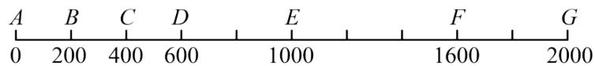
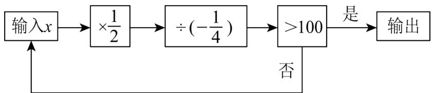
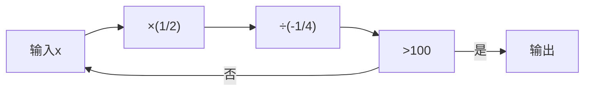
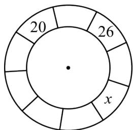
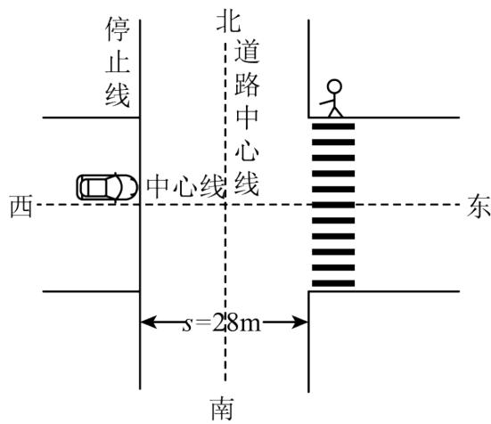

# 专题2.5 有理数的乘除运算（举一反三讲义）

# 【北师大版 2024】

# 题型归纳

【题型1 两个有理数的乘法运算】....3

【题型2 多个有理数的乘法运算】 3

【题型3 有理数的乘法的实际应用】....4

【题型4 倒数】 4

【题型5 有理数乘法运算律】....5

【题型 6 有理数的除法运算】....5

【题型 7 有理数除法的应用】....5

【题型8 有理数乘除混合运算】....6

【题型 9 有理数乘除中的简便运算】....7

【题型10有理数混合运算的应用】 8

# 举一反三 教辅资源，关注公众号★全科AA+

# 知识点1 有理数乘法法则

1. 正数乘正数，积为正数；正数乘负数，积为负数；负数乘正数，积为负数；负数乘负数，积为正数．积的绝对值等于各乘数的绝对值的积.   
2. 两数相乘，同号得正，异号得负，且积的绝对值等于乘数的绝对值的积；任何数与0相乘，都得0.  
3. 有理数乘法法则也可以表示如下:

设 a, b 为正有理数，c 为任意有理数，则

$$
(+ a) \times (+ b) = a \times b, (- a) \times (- b) = a \times b;
$$

$$
(- a) \times (+ b) = - (a \times b), (+ a) \times (- b) = - (a \times b);
$$

$$
c \times 0 = 0, 0 \times c = 0.
$$

# 知识点2 倒数的概念与求法

1. 倒数的概念: 乘积是 $\underline{1}$ 的两个数互为倒数. 即若 $a$ 与 $b$ 互为倒数, 则 $a \times b = 1$ .  
2. 倒数的求法

<table><tr><td>类型</td><td>方法</td></tr><tr><td>真、假分数的倒数</td><td>将分子分母交换位置</td></tr><tr><td>非0整数的倒数</td><td>整数作分母,1作分子</td></tr><tr><td rowspan="2">小数的倒数</td><td>对于可以除尽的数的倒数,可以用1除以这个数求倒数</td></tr><tr><td>对于除不尽的数,转换为分数,再按照真、假分数求倒数的方法来进行</td></tr><tr><td>带分数的倒数</td><td>先把带分数化为假分数,然后将分子分母调换位置</td></tr></table>

知识点 3 有理数的乘法运算律

<table><tr><td>运算律</td><td>文字叙述</td><td>用字母表示</td></tr><tr><td>乘法交换律</td><td>两个数相乘,交换乘数的位置,积不变</td><td>ab=ba</td></tr><tr><td>乘法结合律</td><td>三个数相乘,先把前两个数相乘,或者先把后两个数相乘,积不变</td><td>(ab)c=a(bc)</td></tr><tr><td>乘法分配率</td><td>一个数与两个数的和相乘,等于把这个数分别与这两个数相乘,再把积相加</td><td>a(b+c)=ab+ac</td></tr></table>

# 知识点 4 多个有理数相乘的符号法则

1. 几个不为 0 的数相乘，负的乘数的个数是 $\left\{\begin{array}{l}\text { 偶数时，积为正数， } \\ \text { 奇数时，积为负数． }\end{array}\right.$   
2. 几个数相乘, 如果其中有乘数为 0 , 那么积为 0 .

# 知识点 5 多个有理数相乘的符号法则

# 1. 有理数除法法则

(1) 除以一个不等于 0 的数, 等于乘这个数的倒数. 即 $a \div b = a \cdot \frac{1}{b} (b \neq 0)$ .  
(2) 两数相除, 同号得正, 异号得负, 且商的绝对值等于被除数的绝对值除以除数的绝对值的商. 若 $a$ $b > 0$ , 则 $\frac{a}{b} > 0$ ; 若 $ab < 0$ , 则 $\frac{a}{b} < 0$ .  
(3) 0 除以任何一个不等于 0 的数, 都得 0.

# 2. 有理数除法的两个法则要根据具体情况灵活选用

（1）对于除法的两个法则，在计算时可根据具体情况选用，一般在不能整除的情况下选用法则（1）比较简便，在能整除的情况下，选用法则（2）比较简便.  
(2) 如果被除数和除数都是整数, 且不能整除, 或者如果被除数和除数中有小数或分数, 一般选用法则 (1)进行计算.

# 知识点 6 多个有理数相乘的符号法则

有理数的乘除混合运算通常是先将除法转化为乘法，然后按照乘法法则，确定积的符号，最后求出结果.

# 知识点 7 多个有理数相乘的符号法则

有理数的四则运算：先算乘除，后算加减，有括号先算括号里面的（先小括号，再中括号，最后大括号），同级运算，按照从左往右的顺序进行计算.

【题型 1 两个有理数的乘法运算】教辅资源，关注 公众号★全科AA+

【例 1】（2025·浙江杭州·三模）下列结果中，是负数的是（）

A. $-(-3)$

B. $-|-2|$

C. $3 \times 4$

D. $0 \times (-2)$

【变式 1-1】（2025·山西运城·模拟预测）计算 $3 \times (-5)$ 的结果是（）

A.-2

B. 2

C. -15

D. 15

【变式 1-2】（2025·吉林松原·模拟预测）若 $(-3)\times\square$ 的运算结果为正数，则□内的数字可以为（）

A. -1

B. 0

C. 1

D. 2

【变式 1-3】（24-25 七年级上·四川宜宾·期末）在 4, -5, 6, -7 这四个数中，任意取两个数相乘，所得的积最大是\_\_\_\_.

# 【题型2 多个有理数的乘法运算】

【例 2】（2024 七年级上·全国·专题练习）下面计算正确的是（）

A. $12 \times (-13) \times (-14) = -2184$

B. $(-15) \times (-4) \times \frac{1}{5} \times \left(-\frac{1}{2}\right) = -12$

C. $(-9) \times 5 \times (-8) \times 0 = 9 \times 5 \times 8 = 360$

D. $-5 \times (-4) \times (-2) \times (-2) = 5 \times 4 \times 2 \times 2 = 80$

【变式 2-1】（24-25 七年级下·全国·假期作业）计算.

(1) $\left(-\frac{24}{13}\right)\times\left(-\frac{16}{7}\right)\times0\times\frac{4}{3};$   
(2) $(-4)\times (-1234)\times (-25);$   
(3) $49\frac{7}{8}\times(-16);$

【变式 2-2】（24-25 八年级上·云南昭通·期末）已知 $A_{4}^{1}=4$ ， $A_{4}^{2}=4\times3=12$ ， $A_{4}^{3}=4\times3\times2=24$ ， $A_{4}^{4}=4\times3\times2\times1=24$ ，观察并找规律，计算 $A_{7}^{3}$ 的结果是（）

A. 42

B. 120

C. 210

D. 840

【变式 2-3】（24-25 七年级上·河南南阳·期中）已知 x，y 表示两个数，规定新运算“※”及“△”如下：

$x \otimes y = 2x + 3y, x \triangle y = 3xy$ ，则 $(-3 \otimes 4) \triangle \left(-\frac{1}{3}\right)$ 的值为 \_\_\_\_.

# 【题型3 有理数的乘法的实际应用】

【例 3】（2025·江苏南京·模拟预测）在我国古代数学著作《孙子算经》中，有这样一道题：今有物不知其数，三三数之剩二，五五数之剩三，七七数之剩二．问物几何？其最小正整数解记为 a．又知 b = 23，则 a \_\_\_\_ b （填“＞”“＜”或“＝”）．

【变式 3-1】（24-25 六年级下·江苏南京·期末）实验小学要给报告厅的小舞台铺上地垫，舞台的面积是 40.8 平方米，地垫的单价为 19.9 元/平方米，一共要准备多少元？下面符合实际需要的估算方法是（）

40.8≈40
19.9×40=796(元)
准备796元就够了

40.8≈40, 19.9≈19
40×19=760(元)
准备760元就够了

40.8≈40, 19.9≈20
40×20=800(元)
准备800元就够了

40.8≈41, 19.9≈20
41×20=820(元)
准备820元就够了

【变式 3-2】（2025 八年级下·全国·专题练习）宾馆有 100 间相同的客房，经过一段时间的经营，发现客房定价与客房的入住率之间有下表所示的关系，按照这个关系，要使客房的收入最高，每间客房的定价应为（）

<table><tr><td>每间房价(元)</td><td>300</td><td>280</td><td>260</td><td>220</td></tr><tr><td>入住率</td><td>65%</td><td>75%</td><td>85%</td><td>95%</td></tr></table>

A. 300 元

B. 280 元

C. 260 元

D. 220 元

【变式 3-3】（24-25 七年级下·黑龙江绥化·开学考试）某商场优惠活动宣传：两个品牌分别标有“满 100 减 50 元”和“打 6 折”。请你比较以上两种优惠方案的异同（可举例说明）\_\_\_\_。

# 【题型4 倒数】

【例 4】（24-25 九年级下·甘肃张掖·期中）2025 的相反数的倒数是（）

A. 2025

B. $-\frac{1}{2025}$

C. -2025

D. $\frac{1}{2025}$

【变式 4-1】（2024·山东菏泽·二模） $-\left|-\frac{3}{4}\right|$ 的倒数是（）

A. $\frac{3}{4}$

B. $-\frac{3}{4}$

C. $\frac{4}{3}$

D. $-\frac{4}{3}$

【变式 4-2】（24-25 七年级上·陕西渭南·期中）请根据对话，解答下列问题.

我不小心把老师留的作业题弄丢了，只记得式子是 $3 - a + b - c$

我告诉你：“a的相反数是2，b<4，且b的绝对值是5，c的倒数是 $\frac{1}{2}$ 。”

求式子 $3-a+b-c$ 的值.

【变式 4-3】（24-25 七年级上·甘肃兰州·期中）若 a、b 互为相反数，c、d 互为倒数，m 的绝对值为 2.

(1)直接写出 $a+b,cd,m$ 的值;

(2)求 $m+cd+\frac{a+b}{m}$ 的值.

【题型 5 有理数乘法运算律】教辅资源，关注公众号★全科AA+

【例 5】（24-25 七年级下·全国·假期作业）张丽用计算器计算“45.7 × 9.9”时，发现键“9”坏了，下面输入不能得到正确结果的是（）.

A. $45.7 \times 3.3 \times 3$

B. $45.7 \times 10^{-0.1}$

C. $45.7 \times 8.8 + 45.7 \times 1.1$

【变式 5-1】（24-25 八年级下·辽宁丹东·期中）计算： $4.3 \times 202.5 + 7.6 \times 202.5 - 1.9 \times 202.5 =$ \_\_\_\_.

【变式 5-2】（24-25 六年级下·上海·假期作业）计算： $95\frac{3}{5}\times8.4-95.6\times3\frac{2}{5}$

【变式 5-3】（24-25 七年级下·全国·假期作业）脱式计算，能简算的要简算.

①0.25 × 5.32 × 4

② $9\frac{5}{7}+99\frac{5}{7}+999\frac{5}{7}+\frac{1}{7}\times6$

③ $\frac{4}{5}\times\frac{3}{7}\times\frac{5}{12}$

# 【题型6 有理数的除法运算】

【例 6】（24-25 七年级下·全国·假期作业）如果“ $A \div B = C$ ”，那么“ $B \div A = (\quad)$ ”．计算 $2016 \div 2016 \frac{2016}{2017}$ 的结果是( ).

【变式 6-1】（24-25 七年级上·湖南娄底·期末）计算： $4 \div (-8) \div (-2) =$ \_\_\_\_.

【变式 6-2】（24-25 七年级上·广东广州·期中）如果 $a + b < 0$ ， $\frac{a}{b} > 0$ ，那么下列成立的是（）

A. $a > 0, b > 0$

B. a > 0, b < 0

C. a < 0, b < 0

D. a < 0, b > 0

【变式 6-3】（24-25 七年级上·福建福州·期末）将十进制数 36 化为七进制数为 \_\_\_\_.

# 【题型7 有理数除法的应用】

【例 7】（24-25 七年级上·江苏连云港·阶段练习）教师发现学生平时喜欢玩洞洞乐，于是设计了一个洞洞乐游戏，游戏道具：每张 A4 纸上画满 24 个相同的圆圈，游戏规则：两人一组轮流用铅笔将圆圈戳洞，每个圆圈只戳一个洞，每人一次可戳一个或两个圆圈（不能多戳或不戳），谁将最后一个圆圈戳洞，谁就获胜.

(1)先开始的人胜，还是后开始的人胜？你有必胜的方法吗？请你写出你的方法.  
(2)如果游戏规则改为一次只能戳一个或两个或三个或四个圆圈（最多四个），怎样才能必胜？请写出你的方法.

【变式 7-1】（24-25 七年级上·湖南株洲·开学考试）据有关资料统计，株洲市2023年地方财政收入约124.8亿元，在湖南省的财政收入增速排名中排第六位，株洲市2023年地方财政收入相比2022年地方财政收入约增长了4%，请你计算一下株洲市2022年地方财政收入约为多少亿元？

【变式 7-2】（24-25 七年级上·山西长治·开学考试）中国铁路的发展见证了新中国的沧桑巨变，高铁已成为中国的一张名片。由我国自主研发的“复兴号”高铁的速度比“和谐号”动车组的速度快40%，“和谐号”动车组每小时比“复兴号”高铁少行100千米。“复兴号”与“和谐号”高铁每小时各行驶多少千米？

【变式 7-3】（24-25 七年级上·四川眉山·期中）中国高铁设计标准高，行驶稳定，是中国发展的一张独特而亮丽的“名片”。至 2022 年底，中国高铁运营里程超过 4.3 万千米，位居世界第一，高铁的票价是按“票价 = 每千米乘车价钱 × 乘车路程”的方法计算的，已知 A 站至 G 站的里程为 2000 千米，全程票价为 800 元，沿途各站的路程如图。李老师从 C 站上车，购买了一张 80 元的票，他可能会在哪一站下车？请列式说明。

text_image

A B C D E F G
0 200 400 600 1000 1600 2000

# 【题型8 有理数乘除混合运算】

【例 8】（24-25 七年级上·山东威海·期末）如图，按程序框图中的顺序计算，当输入的初始值 x 为 32 时，则输出的最后结果为 \_\_\_\_.

flowchart

【变式 8-1】（24-25 七年级上·浙江杭州·期中）高斯被认为是历史上最杰出的数学家之一，享有“数学王子”之称．现有一种高斯定义的计算式，已知 a 是有理数，[a]表示不超过 a 的最大整数，如[3.2] = 3，

$[-1.5] = -2$ ， $[0.8] = 0$ ， $[2] = 2$ 等，那么 $[3.14] \div [2] \times \left[-3\frac{3}{7}\right]$ 的值是（）

A. $-\frac{9}{2}$

B. -6

C. -8

D. -9

【变式 8-2】（24-25 七年级上·山东济宁·期中）小丽同学做一道计算题的解题过程如下： $12 \times \left(\frac{2}{3} - \frac{3}{4}\right) + 6 \div$

$$
\left(\frac {1}{2} - \frac {1}{3}\right)
$$

解：原式 $= 12 \times \frac{2}{3} - 12 \times \frac{3}{4} + 6 \div \left(\frac{1}{2} - \frac{1}{3}\right)$ ......第一步

$= 8 - 9 + 6 \div \frac{1}{2} - 6 \div \frac{1}{3}$ ......第二步

$= -1 + 12 - 18$ ......第三步

= -7 ......第四步

根据小丽的计算过程，回答下列问题：

(1)小丽在进行第一步时，运用了乘法的\_\_\_\_律；  
(2)她在计算中出现了错误，其中你认为在第\_\_\_\_步开始出错了；  
(3)请你给出正确的解答过程.

【变式 8-3】（24-25 七年级上·四川成都·期中）在一个遥远的魔法世界里，有一个神秘的圆环，它被称为“五二○圆环”。圆环被九条线段均匀分成了的九个部分，每个部分里会隐藏着一个数字，如果你找出了全部的数字，那么你将被授予“五二○大王”的称号。如图所示，这九个数字中相邻的连续三个数之积均为 520，则 x 的值为 \_\_\_\_.

pie

| Segment | Value |
|---|---|
| Outer Ring | 20 |
| Inner Ring | 26 |
| Middle Ring | x |
| Top Ring | (Unlabeled segment) |

【题型 9 有理数乘除中的简便运算】教辅资源，关注公众号★全科AA+

【例 9】（24-25 七年级上·山西临汾·期中）阅读下列材料，完成后面任务.

计算： $\left(-\frac{1}{30}\right)\div \left(\frac{2}{3} -\frac{1}{10} +\frac{1}{6} -\frac{2}{5}\right)$

解法①: 原式 $=\left(-\frac{1}{30}\right)\div\frac{2}{3}-\left(-\frac{1}{30}\right)\div\frac{1}{10}+\left(-\frac{1}{30}\right)\div\frac{1}{6}-$

$$
\left(- \frac {1}{3 0}\right) \div \frac {2}{5}
$$

$$
= - \frac {1}{2 0} + \frac {1}{3} - \frac {1}{5} + \frac {1}{1 2} = \frac {1}{6}
$$

解法②：原式 $= \left(-\frac{1}{30}\right) \div \left[\left(\frac{2}{3} + \frac{1}{6}\right) - \left(\frac{1}{10} + \frac{2}{5}\right)\right]$

$$
= \left(- \frac {1}{3 0}\right) \div \left(\frac {5}{6} - \frac {1}{2}\right) = - \frac {1}{3 0} \times 3 = - \frac {1}{1 0}
$$

解法③：原式的倒数为 $\left(\frac{2}{3} -\frac{1}{10} +\frac{1}{6} -\frac{2}{5}\right)\div \left(-\frac{1}{30}\right)$

$$
= \left(\frac {2}{3} - \frac {1}{1 0} + \frac {1}{6} - \frac {2}{5}\right) \times (- 3 0) = - 2 0 + 3 - 5 + 1 2 = - 1 0
$$

故原式 $= -\frac{1}{10}$

任务:

(1)上述三种解法得出的结果不同，肯定有解法是错误的，你认为解法\_是错误的。（填序号）  
(2)在正确的解法中，你认为解法\_比较简便。（填序号）  
(3)请你进行简便计算： $\left(-\frac{1}{24}\right)\div\left(\frac{1}{2}-\frac{2}{3}+\frac{5}{6}-\frac{9}{4}\right)$ .

【变式 9-1】（24-25 六年级上·黑龙江绥化·期中）计算下面各题，能用简便算法的就用简便算法.

(1) $\frac{20}{27}\times\frac{9}{5}\div\frac{1}{3}$   
(2) $\frac{12}{13}\div\frac{6}{5}\div\frac{12}{13}$   
(3) $\left(\frac{11}{12}-\frac{3}{8}\right)\times24$   
(4) $3-\frac{17}{25}\div\frac{34}{5}-\frac{9}{10}$

【变式 9-2】（23-24 七年级上·山东菏泽·开学考试）简便计算

(1) $\frac{1}{1 \times 2} + \frac{1}{2 \times 3} + \frac{1}{3 \times 4} + \ldots + \frac{1}{9 \times 10}$   
(2) $4.44 \div 4\frac{5}{8} + \frac{66}{37} \div \frac{25}{111} - 4\frac{11}{25}$   
(3) $\left[\frac{7}{12} -\left(0.75 + \frac{9}{20}\right)\div 3.6 + \frac{1}{7}\right]\times 2\frac{6}{11}$   
(4)2015× $\frac{2013}{2014}$   
(5) $\left(\frac{1}{9} + \frac{1}{10} + \frac{1}{11} + \frac{1}{12}\right) \times \left(\frac{1}{10} + \frac{1}{11} + \frac{1}{12} + \frac{1}{13}\right) - \left(\frac{1}{9} + \frac{1}{10} + \frac{1}{11} + \frac{1}{12} + \frac{1}{13}\right) \times \left(\frac{1}{10} + \frac{1}{11} + \frac{1}{12}\right)$

【变式9-3】（24-25七年级下·重庆·自主招生）计算： $\left(3.85\div \frac{5}{18} +12.3\times 1\frac{4}{5}\right)\div 3\frac{1}{4}\times 39.$

# 【题型10 有理数混合运算的应用】

【例 10】（24-25 七年级上·广东广州·期中）张家口市怀来县种植葡萄已有 800 多年的历史，其中最知名的品种之一是龙眼葡萄，它被郭沫若誉为“北国明珠”。该县质监局对某企业出售的葡萄进行了抽检，从库中任意抽出 20 箱样品进行检测，每箱的质量超过标准质量（标准质量为 10 千克）的部分记为正数，不足的部分记为负数，记录如下表：

<table><tr><td>与标准质量的差(单位:千克)</td><td>-0.1</td><td>0</td><td>-0.2</td><td>+0.3</td><td>+0.1</td><td>+0.4</td></tr><tr><td>箱数</td><td>2</td><td>5</td><td>1</td><td>4</td><td>6</td><td>2</td></tr></table>

(1)若每箱与标准质量的差的绝对值小于或等于0.2千克的记为合格产品，则这20箱样品的合格率是多少？  
(2)这批样品总质量是多少千克?

【变式 10-1】（24-25 七年级上·湖北黄冈·期中）1202 年数学家斐波那契在《计算之书》中记载了一列数：1，1，2，3，5，……，这一列数满足：从第三个数开始，每一个数都等于它的前两个数之和．则在这一列数的前 2024 个数中，奇数的个数有多少个？

【变式 10-2】（2025 七年级下·全国·专题练习）甲、乙两辆汽车同时分别从 A、B 两站相对开出，第一次相遇时离 A 站有 90 千米，然后各自按原来速度继续行驶，分别到达对方出发站后立即沿原路返回．第二次相遇时离 A 站的距离占 A、B 两站间全长的65%．求 A、B 两站间的路程.

【变式 10-3】（2025 七年级上·重庆·专题练习）“闯黄灯”已成为引发路口交通事故的主因之一．如图所示的十字路口，该路段交通信号灯红灯亮之前，会有3s亮黄灯的时间．某时刻，小车以18km/h的速度沿着中心线行驶到停止线时交通灯恰好变为黄灯，此时人行道的红绿灯也在3s后变成绿灯，行人以1.2m/s的速度过马路．已知马路宽7.2m，停止线到斑马线的距离s = 28m，小车的尺寸为：长度L = 4.8m，宽度d = 2.2m．求：

text_image

停止线
北
道路中心线
中心线
西
东
s=28m
南

(1)行人通过人行横道的时间;  
(2)若车闯黄灯，是否会撞到行人；  
(3)若人行道处有一长为 $2 \mathrm{~m}$ 的美团外卖摩托车以 $2 \mathrm{~m} / \mathrm{s}$ 的速度横过马路, 则小车速度在什么范围不会撞到摩托车. (不计摩托车宽度, 保留两位小数)