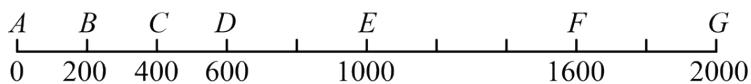
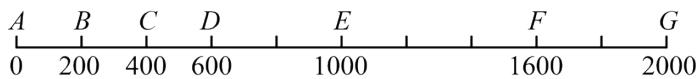
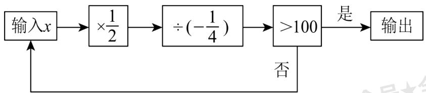
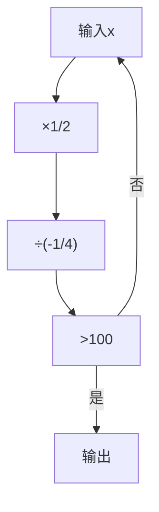
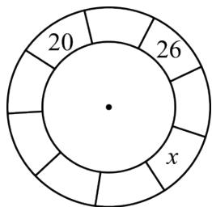
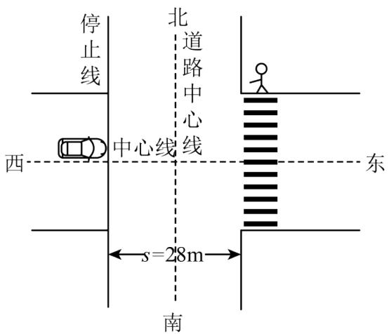

# 专题2.5 有理数的乘除运算（举一反三讲义）

# 【北师大版 2024】

# 题型归纳

【题型1 两个有理数的乘法运算】....3

【题型2 多个有理数的乘法运算】 4

【题型3 有理数的乘法的实际应用】....6

【题型 4 倒数】....8

【题型 5 有理数乘法运算律】....10

【题型 6 有理数的除法运算】....12

【题型 7 有理数除法的应用】....14

【题型8 有理数乘除混合运算】....17

【题型 9 有理数乘除中的简便运算】....19

【题型10有理数混合运算的应用】 25

# 举一反三

# 知识点 1 有理数乘法法则

1. 正数乘正数，积为正数；正数乘负数，积为负数；负数乘正数，积为负数；负数乘负数，积为正数．积的绝对值等于各乘数的绝对值的积.   
2. 两数相乘，同号得正，异号得负，且积的绝对值等于乘数的绝对值的积；任何数与0相乘，都得0.

# 3. 有理数乘法法则也可以表示如下:

设 a, b 为正有理数，c 为任意有理数，则

$$
(+ a) \times (+ b) = a \times b, (- a) \times (- b) = a \times b;
$$

$$
(- a) \times (+ b) = - (a \times b), (+ a) \times (- b) = - (a \times b);
$$

$$
c \times 0 = 0, 0 \times c = 0.
$$

# 知识点 2 倒数的概念与求法

1. 倒数的概念: 乘积是 $\underline{1}$ 的两个数互为倒数. 即若 $a$ 与 $b$ 互为倒数, 则 $a \times b = 1$ .

# 2. 倒数的求法

<table><tr><td>类型</td><td>方法</td></tr><tr><td>真、假分数的倒数</td><td>将分子分母交换位置</td></tr><tr><td>非0整数的倒数</td><td>整数作分母,1作分子</td></tr><tr><td rowspan="2">小数的倒数</td><td>对于可以除尽的数的倒数,可以用1除以这个数求倒数</td></tr><tr><td>对于除不尽的数,转换为分数,再按照真、假分数求倒数的方法来进行</td></tr><tr><td>带分数的倒数</td><td>先把带分数化为假分数,然后将分子分母调换位置</td></tr></table>

知识点 3 有理数的乘法运算律

<table><tr><td>运算律</td><td>文字叙述</td><td>用字母表示</td></tr><tr><td>乘法交换律</td><td>两个数相乘,交换乘数的位置,积不变</td><td>ab=ba</td></tr><tr><td>乘法结合律</td><td>三个数相乘,先把前两个数相乘,或者先把后两个数相乘,积不变</td><td>(ab)c=a(bc)</td></tr><tr><td>乘法分配率</td><td>一个数与两个数的和相乘,等于把这个数分别与这两个数相乘,再把积相加</td><td>a(b+c)=ab+ac</td></tr></table>

# 知识点 4 多个有理数相乘的符号法则

1. 几个不为 0 的数相乘，负的乘数的个数是 $\left\{\begin{array}{l}\text { 偶数时，积为正数， } \\ \text { 奇数时，积为负数． }\end{array}\right.$   
2. 几个数相乘，如果其中有乘数为 0，那么积为 0.

# 知识点 5 多个有理数相乘的符号法则

# 1. 有理数除法法则

(1) 除以一个不等于 0 的数, 等于乘这个数的倒数. 即 $a \div b = a \cdot \frac{1}{b} (b \neq 0)$ .  
(2) 两数相除, 同号得正, 异号得负, 且商的绝对值等于被除数的绝对值除以除数的绝对值的商. 若 $a$ $b > 0$ , 则 $\frac{a}{b} > 0$ ; 若 $ab < 0$ , 则 $\frac{a}{b} < 0$ .  
(3) 0 除以任何一个不等于 0 的数, 都得 0.

# 2. 有理数除法的两个法则要根据具体情况灵活选用

（1）对于除法的两个法则，在计算时可根据具体情况选用，一般在不能整除的情况下选用法则（1）比较简便，在能整除的情况下，选用法则（2）比较简便.  
(2) 如果被除数和除数都是整数, 且不能整除, 或者如果被除数和除数中有小数或分数, 一般选用法则 (1)进行计算.

# 知识点 6 多个有理数相乘的符号法则

有理数的乘除混合运算通常是先将除法转化为乘法，然后按照乘法法则，确定积的符号，最后求出结果.

# 知识点 7 多个有理数相乘的符号法则

有理数的四则运算：先算乘除，后算加减，有括号先算括号里面的（先小括号，再中括号，最后大括号），同级运算，按照从左往右的顺序进行计算.

# 【题型1 两个有理数的乘法运算】

【例 1】（2025·浙江杭州·三模）下列结果中，是负数的是（）

A. $-(-3)$

B. $-|-2|$

C. $3 \times 4$

D. $0 \times (-2)$

【答案】B

【分析】本题考查了负数的概念，绝对值、相反数及有理数的乘法，掌握这些知识是关键；分别计算各选项的值，判断是否为负数即可.

【详解】解：A. $-(-3)$ ：负负得正，结果为3，是正数；

B. $-|-2|$ ：先计算绝对值，再取负号，结果为-2，是负数；

C. $3 \times 4$ ：直接相乘，结果为12，是正数；

D. $0 \times (-2)$ ：任何数与0相乘均为0，既不是正数也不是负数；

综上，只有选项 B 的结果为负数；

故选：B.

【变式 1-1】（2025·山西运城·模拟预测）计算 $3 \times (-5)$ 的结果是（）

A.-2

B. 2

C. -15

D. 15

【答案】C

【分析】本题考查了有理数的乘法运算，熟练掌握有理数的乘法运算是解题的关键；因此此题可根据有理数的乘法运算进行求解即可

【详解】解： $3 \times (-5) = -15$ ;

故选：C.

【变式 1-2】（2025·吉林松原·模拟预测）若 $(-3)\times\square$ 的运算结果为正数，则□内的数字可以为（）

A.-1

B. 0

C. 1

D. 2

【答案】A

【分析】本题主要考查了有理数的乘法计算．根据有理数的乘法计算法则，即可得到答案.

【详解】解：∵ $(-3)\times\square$ 的运算结果为正数，

∴□内的数字为负数，故 A 选项符合题意；

故选：A

【变式 1-3】（24-25 七年级上·四川宜宾·期末）在 4, -5, 6, -7 这四个数中，任意取两个数相乘，所得的积最大是 \_\_\_\_.

【答案】35

【分析】本题考查有理数的乘法，有理数大小比较．关键要明确不为零的有理数相乘的法则：两数相乘，同号得正，异号得负，并把绝对值相乘.

两个非0数相乘，同号得正，异号得负，且正数大于一切负数，所以找积最大的应从同号的两个数中寻找即可.

【详解】解：要使所得的积最大，两数字必定同号，

$$
4 \times 6 = 2 4, (- 5) \times (- 7) = 3 5,
$$

$$
\because 2 4 <   3 5,
$$

∴任意取两个数相乘，所得的积最大是35，

故答案为：35.

# 【题型 2 多个有理数的乘法运算】

【例 2】（2024 七年级上·全国·专题练习）下面计算正确的是（）

A. $12 \times (-13) \times (-14) = -2184$

B. $(-15) \times (-4) \times \frac{1}{5} \times \left(-\frac{1}{2}\right) = -12$

C. $(-9) \times 5 \times (-8) \times 0 = 9 \times 5 \times 8 = 360$

D. $-5 \times (-4) \times (-2) \times (-2) = 5 \times 4 \times 2 \times 2 = 80$

【答案】D

【分析】本题考查有理数的乘法，多个有理数相乘，熟练掌握多个有理数相乘计算法则是解题的关键；根据多个有理数相乘计算法则即可求解；

【详解】解：A、 $12 \times (-13) \times (-14) = 2184$ ，故该选项错误；

B、 $(-15)\times(-4)\times\frac{1}{5}\times\left(-\frac{1}{2}\right)$

$$
= - 1 5 \times 4 \times \frac {1}{5} \times \frac {1}{2}
$$

$$
= - 6 0 \times \frac {1}{5} \times \frac {1}{2}
$$

$$
= - 6
$$

故该选项错误;

C、 $(-9)\times5\times(-8)\times0=0$ ，故该选项错误；

D、 $-5 \times (-4) \times (-2) \times (-2) = 5 \times 4 \times 2 \times 2 = 80$ ，故该选项正确；

故选：D

【变式 2-1】（24-25 七年级下·全国·假期作业）计算.

(1) $\left(-\frac{24}{13}\right)\times\left(-\frac{16}{7}\right)\times0\times\frac{4}{3};$

(2) $(-4)\times (-1234)\times (-25);$

(3) $49\frac{7}{8}\times(-16);$

【答案】(1)0

(2)-123400

(3)-798

【分析】本题考查有理数的乘除混合运算．掌握各运算法则是解题关键.

（1）任何数与 0 相乘都等于 0，所以结果为 0.  
(2) 利用乘法交换律先算-4与-25的积, 再乘-1234.  
(3) 将 $49 \frac{7}{8}$ 化为 $\left(50 - \frac{1}{8}\right)$ 后与 -16 相乘并约分计算.

【详解】（1）解：原式 = 0;

(2) 解: 原式 = (-4) × (-25) × (-1234)

$$
\begin{array}{l} = 1 0 0 \times (- 1 2 3 4) \\ = - 1 2 3 4 0 0; \\ \end{array}
$$

（3）解：原式 $= \left(50 - \frac{1}{8}\right)\times (-16)$

$$
\begin{array}{l} = - 5 0 \times 1 6 - \frac {1}{8} \times (- 1 6) \\ = - 8 0 0 + 2 \\ = - 7 9 8. \\ \end{array}
$$

【变式 2-2】（24-25 八年级上·云南昭通·期末）已知 $A_{4}^{1}=4$ ， $A_{4}^{2}=4\times3=12$ ， $A_{4}^{3}=4\times3\times2=24$ ， $A_{4}^{4}=4\times3\times2\times1=24$ ，观察并找规律，计算 $A_{7}^{3}$ 的结果是（）

A. 42

B. 120

C. 210

D. 840

【答案】C

【分析】此题考查了有理数的乘法运算，根据已知等式找出规律，利用规律列出乘法算式，即可求解.

【详解】解：由已知得 $A_{7}^{3}=7\times6\times5=210$ ,

故选 C.

【变式 2-3】（24-25 七年级上·河南南阳·期中）已知 x，y 表示两个数，规定新运算“※”及“△”如下： $x$ ※ $y = 2x + 3y, x$ $\triangle y = 3xy$ ，则 $(-3$ ※4) $\triangle\left(-\frac{1}{3}\right)$ 的值为\_\_\_\_.

【答案】-6

【分析】本题考查有理数的运算，根据新定义的法则，列出算式进行计算即可.

【详解】解：原式 = $[2 \times (-3) + 3 \times 4] \triangle \left(-\frac{1}{3}\right)$

$$
\begin{array}{l} = (- 6 + 1 2) \triangle \left(- \frac {1}{3}\right) \\ = 6 \triangle \left(- \frac {1}{3}\right) \\ = 3 \times 6 \times \left(- \frac {1}{3}\right) \\ = - 6; \\ \end{array}
$$

故答案为：-6.

# 【题型3 有理数的乘法的实际应用】

【例 3】（2025·江苏南京·模拟预测）在我国古代数学著作《孙子算经》中，有这样一道题：今有物不知其数，三三数之剩二，五五数之剩三，七七数之剩二．问物几何？其最小正整数解记为 a．又知 b = 23，则 a \_\_\_\_ b （填“＞”“＜”或“＝”）．

【答案】=

【分析】本题考查了有理数的乘法运算，理解题意，分别由小到大进行分析，发现符合题意的最小正整数解为23，即 $a = 23$ ，再结合 $b = 23$ ，即可作答.

【详解】解：∵三三数之剩二，

$$
\begin{array}{l} \therefore 3 \times 0 + 2 = 2, 3 \times 1 + 2 = 5, 3 \times 2 + 2 = 8, 3 \times 3 + 2 = 1 1, 3 \times 4 + 2 = 1 4, \\ 3 \times 5 + 2 = 1 7, 3 \times 6 + 2 = 2 0, 3 \times 7 + 2 = 2 3, \\ \end{array}
$$

∵五五数之剩三，

$$
\therefore 5 \times 0 + 3 = 3, 5 \times 1 + 3 = 8, 5 \times 2 + 3 = 1 3, 5 \times 3 + 3 = 1 8, 5 \times 4 + 3 = 2 3,
$$

∵七七数之剩二.

$$
\therefore 7 \times 0 + 2 = 2, 7 \times 1 + 2 = 9, 7 \times 2 + 2 = 1 6, 7 \times 3 + 2 = 2 3,
$$

∵最小正整数解记为 a.

$$
\therefore a = 2 3,
$$

$$
\because b = 2 3,
$$

$$
\therefore a = b,
$$

故答案为： = .

【变式 3-1】（24-25 六年级下·江苏南京·期末）实验小学要给报告厅的小舞台铺上地垫，舞台的面积是 40.8 平方米，地垫的单价为 19.9 元/平方米，一共要准备多少元？下面符合实际需要的估算方法是（）

A.

$$
4 0. 8 \approx 4 0
$$

$$
1 9. 9 \times 4 0 = 7 9 6 (\text {元})
$$

$$
\mathrm{准备} 7 9 6 \mathrm{元就够了}
$$

B.

$$
4 0. 8 \approx 4 0, 1 9. 9 \approx 1 9
$$

$$
4 0 \times 1 9 = 7 6 0 (\text {元})
$$

$$
\mathrm{准备} 7 6 0 \mathrm{元就够了}
$$

C.

$$
4 0. 8 \approx 4 0, 1 9. 9 \approx 2 0
$$

$$
4 0 \times 2 0 = 8 0 0 (\text {元})
$$

$$
\mathrm{准备} 8 0 0 \mathrm{元就够了}
$$

D.

$$
4 0. 8 \approx 4 1, 1 9. 9 \approx 2 0
$$

$$
4 1 \times 2 0 = 8 2 0 (\text {元})
$$

$$
\mathrm{准备} 8 2 0 \mathrm{元就够了}
$$

【答案】D

【分析】本题考查小数乘法估算的实际应用及方法，利用面积乘每平方米的单价，计算时把小数看作与它相近的整数计算即可，注意估算的时候估大一些.

【详解】解： $40.8 \times 19.9 \approx 41 \times 20 = 820$ （元），

因此准备 820 元就够了，

符合实际需要的估算方法是选项 D.

故选：D.

【变式 3-2】（2025 八年级下·全国·专题练习）宾馆有 100 间相同的客房，经过一段时间的经营，发现客房定价与客房的入住率之间有下表所示的关系，按照这个关系，要使客房的收入最高，每间客房的定价应为（）

<table><tr><td>每间房价(元)</td><td>300</td><td>280</td><td>260</td><td>220</td></tr><tr><td>入住率</td><td>65%</td><td>75%</td><td>85%</td><td>95%</td></tr></table>

A. 300 元

B. 280 元

C. 260 元

D. 220 元

【答案】C

【分析】本题考查了有理数乘法的应用，正确理解收入等于房价乘以数量乘以入住率是解题的关键.

分别计算不同房价对应的收入，比较即可.

【详解】解：当每间客房的定价为300元时，客房的收入为 $100 \times 65\% \times 300 = 19500$ （元）；

当每间客房的定价为 280 元时，客房的收入为 $100 \times 75\% \times 280 = 21000$ （元）；

当每间客房的定价为 260 元时，客房的收入为 $100 \times 85\% \times 260 = 22100$ （元）；

当每间客房的定价为 220 元时，客房的收入为 $100 \times 95\% \times 220 = 20900$ （元）.

所以当每间客房的定价为 260 元时，客房的收入最高.

故选：C.

【变式 3-3】（24-25 七年级下·黑龙江绥化·开学考试）某商场优惠活动宣传：两个品牌分别标有“满 100 减 50 元”和“打 6 折”。请你比较以上两种优惠方案的异同（可举例说明）\_\_\_\_。

【答案】标价整百时，满 100 减 50 元”更优惠；标价非整百时，“打 6 折”更优惠.

【分析】本题考查了商品销售问题中的方案选择问题，解题关键是要读懂题目的意思，根据题目给出的条件，分情况进行计算，然后再确定优惠方案，即可作答.

【详解】解：如果买的商品标价是整百元的，

如标价为500元，

则“满 100 减 50 元”， $500-5 \times 50 = 250$ （元）；

“打 6 折”， $500 \times 0.6 = 300$ （元）；

$$
\because 3 0 0 > 2 5 0
$$

∴此时满 100 减 50 元”更优惠；

如果买的商品标价不是整百元时，如标价为280元，则有

“满 100 减 50 元”: $280 - 50 \times 2 = 280 - 100 = 180$ （元）

“打6折”: $280 \times 60\% = 168$ （元），

$$
\because 1 8 0 > 1 6 8,
$$

∴“打6折”比较实惠，

故答案为标价整百时，满 100 减 50 元”更优惠；标价非整百时，“打 6 折”更优惠.

# 【题型4 倒数】

【例 4】（24-25 九年级下·甘肃张掖·期中）2025 的相反数的倒数是（）

A. 2025

B. $-\frac{1}{2025}$

C. -2025

D. $\frac{1}{2025}$

【答案】B

【分析】本题考查相反数和倒数的概念，掌握相反数的和倒数的定义成为解题的关键.

先确定 2025 的相反数，再求其倒数即可.

【详解】解：2025的相反数是-2025.

-2025的倒数为 $\frac{1}{-2025} = -\frac{1}{2025}$ .

∴2025 的相反数的倒数是 $-\frac{1}{2025}$ ，对应选项 B.

故选B.

【变式 4-1】（2024·山东菏泽·二模） $-\left|-\frac{3}{4}\right|$ 的倒数是（）

A. $\frac{3}{4}$

B. $-\frac{3}{4}$

C. $\frac{4}{3}$

D. $-\frac{4}{3}$

【答案】D

【分析】本题考查了绝对值、倒数的定义，熟练掌握以上知识点是解答本题的关键．根据绝对值、倒数的定义解答即可.

【详解】解：∵ $-\left|-\frac{3}{4}\right|=-\frac{3}{4}$ ,

∴ $-\left|-\frac{3}{4}\right|$ 的倒数是 $-\frac{4}{3}$ ,

故选：D.

【变式 4-2】（24-25 七年级上·陕西渭南·期中）请根据对话，解答下列问题.

我不小心把老师留的作业题弄丢了，只记得式子是 $3 - a + b - c$

我告诉你：“ $a$ 的相反数是2， $b < 4$ ，且 $b$ 的绝对值是5， $c$ 的倒数是 $\frac{1}{2}$ .”

求式子 $3-a+b-c$ 的值.

【答案】-2

【分析】本题考查了代数式求值，熟练掌握运算法则是解题的关键．直接利用相反数、绝对值的定义分别得出a，b，c的值，代入原式计算即可.

【详解】解：∵a的相反数是2，

$$
\therefore a = - 2;
$$

$\because b<4$ ，且b的绝对值是5，

$$
\therefore b = - 5;
$$

∵ c 的倒数是 $\frac{1}{2}$ ,

$$
\therefore c = 2.
$$

∴ 原式 = 3-(-2) + (-5)-2

$$
\begin{array}{l} = 3 + 2 + (- 5) + (- 2) \\ = - 2 \\ \end{array}
$$

【变式 4-3】（24-25 七年级上·甘肃兰州·期中）若 a、b 互为相反数，c、d 互为倒数，m 的绝对值为 2.

(1)直接写出 $a+b,cd,m$ 的值;  
(2)求 $m+cd+\frac{a+b}{m}$ 的值.

【答案】(1) $a+b=0,\quad cd=1,\quad m=\pm2;$

(2)3 或 -1

【分析】此题考查了有理数的混合运算，相反数、倒数，以及绝对值，熟练掌握各自的性质是解本题的关键.

(1) 利用相反数, 倒数, 以及绝对值的代数意义求出各自的值即可;  
(2) 把各自的值代入原式计算即可求出值.

【详解】（1）解：∵a、b互为相反数，c、d互为倒数，m的绝对值为2，

$$
\therefore a + b = 0, c d = 1, m = \pm 2;
$$

(2) 当 $m = 2$ 时, 原式 $= 2 + 1 + \frac{0}{2} = 2 + 1 + 0 = 3$ ;

当m = -2时，原式 $= -2 + 1 + \frac{0}{2} = -2 + 1 + 0 = -1$ ，

则原式的值为 3 或 -1.

# 【题型5 有理数乘法运算律】

【例 5】（24-25 七年级下·全国·假期作业）张丽用计算器计算“45.7 × 9.9”时，发现键“9”坏了，下面输入不能得到正确结果的是（）.

A. $45.7 \times 3.3 \times 3$

B. $45.7 \times 10^{-0.1}$

C. $45.7 \times 8.8 + 45.7 \times 1.1$

【答案】B

【分析】本题考查了乘法运算的灵活应用，以及通过分解、转化等方法解决实际问题的能力，解题的关键是在避免直接使用数字“9”的情况下，等价表示9.9．据题意，由于计算器的“9”键损坏，需将9.9转换为不含数字9的表达式进行计算，同时验证各选项是否与原式等价.

【详解】解：选项 A、 $45.7 \times 3.3 \times 3 = 45.7 \times (3.3 \times 3) = 45.7 \times 9.9$ ，计算正确，故此选项不符合题意；选项 B、正确拆分应为 $45.7 \times 10 - 45.7 \times 0.1 = 45.7 \times (10 - 0.1) = 45.7 \times 9.9$ ，但选项 B 直接减去 0.1，无法

得到正确答案，故此选项符合题意；

选项 C、根据乘法结合律， $45.7 \times 8.8 + 45.7 \times 1.1 = 45.7 \times (8.8 + 1.1) = 45.7 \times 9.9$ ，计算正确，故此选项不符合题意；

故选：B.

【变式 5-1】（24-25 八年级下·辽宁丹东·期中）计算： $4.3 \times 202.5 + 7.6 \times 202.5 - 1.9 \times 202.5 =$ \_\_\_\_.

【答案】2025

【分析】本题主要考查有理数的混合运算，简便计算的方法，逆用乘法的分配律将原式变为 $(4.3+7.6-1.9)\times202.5$ ，再进行计算即可.

【详解】解： $4.3 \times 202.5 + 7.6 \times 202.5 - 1.9 \times 202.5$

$$
\begin{array}{l} = (4. 3 + 7. 6 - 1. 9) \times 2 0 2. 5 \\ = 1 0 \times 2 0 2. 5 \\ = 2 0 2 5. \\ \end{array}
$$

故答案为：2025.

【变式 5-2】（24-25 六年级下·上海·假期作业）计算： $95\frac{3}{5} \times 8.4 - 95.6 \times 3\frac{2}{5}$

【答案】478

【分析】本题了考查逆用乘法分配律的运用．先把分数化为小数，再运用乘法分配律进行计算，即可作答.

【详解】解： $95\frac{3}{5}\times8.4-95.6\times3\frac{2}{5}$

$$
\begin{array}{l} = 9 5. 6 \times 8. 4 - 9 5. 6 \times 3. 4 \\ = 9 5. 6 \times (8. 4 - 3. 4) \\ = 9 5. 6 \times 5 \\ = 4 7 8. \\ \end{array}
$$

【变式 5-3】（24-25 七年级下·全国·假期作业）脱式计算，能简算的要简算.

$$
\begin{array}{l} ① 0. 2 5 \times 5. 3 2 \times 4 \\ ② 9 \frac {5}{7} + 9 9 \frac {5}{7} + 9 9 9 \frac {5}{7} + \frac {1}{7} \times 6 \\ ③ \frac {4}{5} \times \frac {3}{7} \times \frac {5}{1 2} \\ \end{array}
$$

【答案】5.32；1110； $\frac{1}{7}$

【分析】本题考查乘法交换律和结合律、拆分计算法、通过约分简化分数乘法，熟练掌握以上知识点是解题的关键．①根据乘法交换律 $a \times b = b \times a$ 把 $0.25 \times 5.32 \times 4$ 变成 $0.25 \times 4 \times 5.32$ ，再按顺序计算；②把 $\frac{1}{7} \times 6$ 改写成 $\frac{2}{7} + \frac{2}{7} + \frac{2}{7}$ ，然后根据加法交换律 $a + b = b + a$ ，加法结合律 $(a + b) + c = a + (b + c)$ ，把 $9\frac{5}{7} + 99\frac{5}{7} + 999\frac{5}{7} + \frac{2}{7} + \frac{2}{7} + \frac{2}{7}$ 变成 $\left(9\frac{5}{7} + \frac{2}{7}\right) + \left(99\frac{5}{7} + \frac{2}{7}\right) + \left(999\frac{5}{7} + \frac{2}{7}\right)$ ，再按顺序计算；③根据乘法交换律 $a \times b = b \times a$ 把 $\frac{4}{5} \times \frac{3}{7} \times \frac{5}{12}$ 变成 $\frac{4}{5} \times \frac{5}{12} \times \frac{3}{7}$ ，再按顺序计算.

【详解】解：① $0.25 \times 5.32 \times 4$

$$
= 0. 2 5 \times 4 \times 5. 3 2
$$

$$
= 1 \times 5. 3 2
$$

$$
= 5. 3 2
$$

② $9\frac{5}{7}+99\frac{5}{7}+999\frac{5}{7}+\frac{1}{7}\times6$

$$
= 9 \frac {5}{7} + 9 9 \frac {5}{7} + 9 9 9 \frac {5}{7} + \frac {2}{7} \times 3
$$

$$
= 9 \frac {5}{7} + 9 9 \frac {5}{7} + 9 9 9 \frac {5}{7} + \frac {2}{7} + \frac {2}{7} + \frac {2}{7}
$$

$$
= \left(9 \frac {5}{7} + \frac {2}{7}\right) + \left(9 9 \frac {5}{7} + \frac {2}{7}\right) + \left(9 9 9 \frac {5}{7} + \frac {2}{7}\right)
$$

$$
= 1 0 + 1 0 0 + 1 0 0 0
$$

$$
= 1 1 1 0
$$

③ $\frac{4}{5}\times\frac{3}{7}\times\frac{5}{12}$

$$
= \frac {4}{5} \times \frac {5}{1 2} \times \frac {3}{7}
$$

$$
= \frac {1}{3} \times \frac {3}{7}
$$

$$
= \frac {1}{7}.
$$

# 【题型6 有理数的除法运算】

【例 6】（24-25 七年级下·全国·假期作业）如果“ $A \div B = C$ ”，那么“ $B \div A = (\quad)$ ”．计算 $2016 \div 2016 \frac{2016}{2017}$ 的结果是( ).

【答案】 $\frac{1}{C}$ $\frac{2017}{2018}$

【分析】本题主要考查了有理数的除法计算，倒数的定义，熟知相关计算法则是解题的关键.

（1）因为 $A \div B = \frac{A}{B}$ ， $B \div A = \frac{B}{A}$ ， $\frac{A}{B}$ 与 $\frac{B}{A}$ 互为倒数，所以 $A \div B$ 的商和 $B \div A$ 的商互为倒数，而C的倒数是 $\frac{1}{C}$

由此可得答案.

（2）先将除数 $2016\frac{2016}{2017}$ 化成假分数，分子用相乘的形式表示，即 $2016 \times 2017 + 2016$ ，再把除法变成乘法求解即可.

【详解】解：（1）如果“ $A \div B = C$ ”，那么“ $B \div A = \frac{1}{C}$ ”；

(2) $2016 \div 2016 \frac{2016}{2017}$

$$
\begin{array}{l} = 2 0 1 6 \div \frac {2 0 1 6 \times 2 0 1 7 + 2 0 1 6}{2 0 1 7} \\ = 2 0 1 6 \times \frac {2 0 1 7}{2 0 1 6 \times 2 0 1 7 + 2 0 1 6} \\ = 2 0 1 6 \times \frac {2 0 1 7}{2 0 1 6 \times (2 0 1 7 + 1)} \\ = \frac {2 0 1 7}{2 0 1 8}, \\ \end{array}
$$

故答案为： $\frac{1}{C}$ ， $\frac{2017}{2018}$ .

【变式 6-1】（24-25 七年级上·湖南娄底·期末）计算： $4 \div (-8) \div (-2) =$ \_\_\_\_.

【答案】 $\frac{1}{4} / 0.25$

【分析】本题考查有理数的除法，熟练掌握有理数的除法法则是解题的关键；

根据有理数的除法法则计算即可求解;

【详解】解： $4 \div (-8) \div (-2) = \frac{1}{2} \times \frac{1}{2} = \frac{1}{4}$ ;

故答案为： $\frac{1}{4}$

【变式 6-2】（24-25 七年级上·广东广州·期中）如果 $a+b<0,\quad\frac{a}{b}>0$ ，那么下列成立的是（）

A. $a > 0, b > 0$

B. a > 0, b < 0

C. a < 0, b < 0

D. a < 0, b > 0

【答案】C

【分析】本题主要考查了有理数的加法、除法运算法则，熟知两种运算的法则是正确解答此题的关键。根据有理数加法法则：①同号相加，取相同符号，并把绝对值相加。②绝对值不等的异号加减，取绝对值较大的加数符号，并用较大的绝对值减去较小的绝对值。两数相除，同号得正，异号得负，并把绝对值相除，依此即可作出判断。

【详解】解：∵ $\frac{a}{b}>0$ ,

∴ a, b 同为正或同为负，

$$
\because a + b <   0,
$$

∴ a, b 同为负，即：a < 0, b < 0;

故选：C.

【变式 6-3】（24-25 七年级上·福建福州·期末）将十进制数 36 化为七进制数为 \_\_\_\_.

【答案】(51) $_{7}$

【分析】本题考查了进位制之间的转化，解题的关键是掌握“除 k 取余法”.

把所给的十进制数除以 7，得到商和余数，继续除以 7，直到商为 0，把余数倒序写下来即可得到答案.

【详解】解：∵36÷7=5…1，5÷7=0…5，

$$
\therefore 3 6 = (5 1) _ {7},
$$

故答案为： $(51)_{7}$ .

# 【题型7 有理数除法的应用】

【例 7】（24-25 七年级上·江苏连云港·阶段练习）教师发现学生平时喜欢玩洞洞乐，于是设计了一个洞洞乐游戏，游戏道具：每张 A4 纸上画满 24 个相同的圆圈，游戏规则：两人一组轮流用铅笔将圆圈戳洞，每个圆圈只戳一个洞，每人一次可戳一个或两个圆圈（不能多戳或不戳），谁将最后一个圆圈戳洞，谁就获胜.

(1)先开始的人胜，还是后开始的人胜？你有必胜的方法吗？请你写出你的方法.

(2)如果游戏规则改为一次只能戳一个或两个或三个或四个圆圈（最多四个），怎样才能必胜？请写出你的方法.

【答案】(1)后开始获胜，方法见解析

(2)先开始的人有必胜策略，方法见解析

【分析】本题考查了博弈策略，整数的除法运算及余数概念，熟练掌握整数的除法运算及余数概念是解题的关键；

(1) 根据每轮两人戳洞的总数情况, 得出选择控制每轮两人一共戳 3 个洞 (一人戳 1 个时另一人戳 2 个, 或者一人戳 2 个时另一人戳 1 个). 根据不管先开始的人第一次戳 1 个还是 2 个圆圈, 后开始的人都可以通过相应地戳 2 个或者 1 个圆圈, 使得两人第一轮一共 3 戳个圆圈. 然后在后续的每一轮中, 后开始的人继续根据先开始的人戳洞的数量, 保证每轮两人一共戳 3 个圆圈, 这样经过 8 轮后, 后开始的人就一定能戳到最后一个圆圈获胜.

(2) 根据两人一轮戳洞的数量之和可能是 2 到 8 个圆圈, 同样要从 24 个圆圈总数出发, 找到合适的每轮戳洞总数, 让其能整除 (或结合余数来控制局面), 以确定必胜策略. 分别计算除以每轮可能总数的情况发现，如果能保证每轮两人一共戳 5 个圆圈，经过 4 轮，在处理好开始的余数 4 个圆圈后，就能戳完所有圆圈.

【详解】（1）解：后开始的必胜，

∵每人一次可戳一个或两个圆圈，

∴两人一轮戳洞的数量之和存在三种可能情况：

若两人都戳一个圆圈，一轮共戳2个圆圈；

若一人戳一个，另一人戳两个，一轮共戳3个圆圈；

若两人都戳两个圆圈，一轮共戳4个圆圈.

通过计算分别除以每轮可能的总数情况:

$24 \div 2 = 12$ （轮）；

$24 \div 3 = 8$ （轮）；

$24 \div 4 = 6$ （轮）.

发现 24 能被 3 整除，这意味着如果能保证每轮两人一共 3 戳个圆圈，经过 8 轮就能戳完所有圆圈，并且可以通过先后手的策略来控制局面.

具体操作如下:

先开始的人先戳洞，不管先开始的人第一次戳 1 个还是 1 个圆圈，后开始的人都可以相应地戳 2 个或者 1 个圆圈，使得两人第一轮一共戳 3 个圆圈．然后在后续的每一轮中，后开始的人继续根据先开始的人戳洞的数量，保证每轮两人一共 3 戳个圆圈．这样经过 8 轮后，后开始的人就一定能戳到最后一个圆圈，从而获胜．

(2) 先开始的人有必胜策略.

∵游戏规则改为一次只能戳一个或两个或三个或四个圆圈（最多四个），

∴两人一轮戳洞的数量之和可能是2到8个圆圈，

$$
\therefore 2 4 \div 2 = 1 2;
$$

$$
2 4 \div 3 = 8;
$$

$$
2 4 \div 4 = 6;
$$

$$
2 4 \div 5 = 4 \dots 4;
$$

$$
2 4 \div 6 = 4;
$$

$$
2 4 \div 7 = 3 \dots 3;
$$

$$
2 4 \div 8 = 3.
$$

发现 $24 \div 5 = 4$ ……4，即如果能保证每轮两人一共戳5个圆圈，经过4轮，在处理好开始的余数4个圆圈后，就能戳完所有圆圈.

具体操作如下:

先开始的人先戳 4 个圆圈，此时剩下个圆圈。然后不管后开始的人戳 1 个、2 个、3 个还是 4 个圆圈，先开始的人在后续的每一轮中，都根据后开始的人戳洞的数量，保证每轮两人一共戳 5 个圆圈。这样经过 4 轮后，先开始的人就可以戳到最后一个圆圈，进而获胜。

【变式 7-1】（24-25 七年级上·湖南株洲·开学考试）据有关资料统计，株洲市2023年地方财政收入约124.8亿元，在湖南省的财政收入增速排名中排第六位，株洲市2023年地方财政收入相比2022年地方财政收入约增长了4%，请你计算一下株洲市2022年地方财政收入约为多少亿元？

【答案】120亿元

【分析】本题考查了有理数除法的应用，根据题意列出算式计算即可求解，理解题意是解题的关键.

【详解】解： $124.8 \div (1 + 4\%) = 120$ （亿元），

答：株洲市2022年地方财政收入约为120亿元.

【变式 7-2】（24-25 七年级上·山西长治·开学考试）中国铁路的发展见证了新中国的沧桑巨变，高铁已成为中国的一张名片。由我国自主研发的“复兴号”高铁的速度比“和谐号”动车组的速度快40%，“和谐号”动车组每小时比“复兴号”高铁少行100千米。“复兴号”与“和谐号”高铁每小时各行驶多少千米？

【答案】“和谐号”动车每小时行驶250千米，“复兴号”动车每小时行驶350千米.

【分析】本题考查有理数的混合运算．“和谐号”动车每小时行驶250千米，“复兴号”动车每小时行驶350千米．先根据和谐号”动车组每小时比“复兴号”高铁少行100千米求出“和谐号”的速度，再求“复兴号”的速度.

【详解】解：“和谐号”的速度为： $100 \div 40\% = 250$ （千米/小时）

“复兴号”的速度为： $250 + 100 = 350$ （千米/小时）.

答：“和谐号”动车每小时行驶250千米，“复兴号”动车每小时行驶350千米.

【变式 7-3】（24-25 七年级上·四川眉山·期中）中国高铁设计标准高，行驶稳定，是中国发展的一张独特而亮丽的“名片”。至 2022 年底，中国高铁运营里程超过 4.3 万千米，位居世界第一，高铁的票价是按“票价 = 每千米乘车价钱 × 乘车路程”的方法计算的，已知 A 站至 G 站的里程为 2000 千米，全程票价为 800 元，沿途各站的路程如图。李老师从 C 站上车，购买了一张 80 元的票，他可能会在哪一站下车？请列式说明。

text_image

A B C D E F G
0 200 400 600 1000 1600 2000

【答案】到D站或到B站，说明见解析

【分析】本题考查有理数运算的实际应用，先求出每千米的票价，进而求出李老师买票的费用除以单价，求出里程，进行判断即可.

【详解】

text_image

A B C D E F G
0 200 400 600 1000 1600 2000

$800 \div 2000 = 0.4$ （元/千米）

$80 \div 0.4 = 200$ （千米）

$400 + 200 = 600$ （千米）或 $400 - 200 = 200$ （千米）

到D站或到B站都可.

# 【题型8 有理数乘除混合运算】

【例 8】（24-25 七年级上·山东威海·期末）如图，按程序框图中的顺序计算，当输入的初始值 x 为 32 时，则输出的最后结果为 \_\_\_\_.

flowchart

【答案】128

【分析】本题考查程序流程图与有理数的运算，把32代入流程图，列出算式进行计算，直至最后结果>100，即可.

【详解】解： $32 \times \frac{1}{2} \div \left(-\frac{1}{4}\right) = -64 < 100$ ,

$-64 \times \frac{1}{2} \div \left(-\frac{1}{4}\right) = 128 > 100$ ，输出；

故答案为：128.

【变式 8-1】（24-25 七年级上·浙江杭州·期中）高斯被认为是历史上最杰出的数学家之一，享有“数学王子”之称．现有一种高斯定义的计算式，已知 a 是有理数，[a]表示不超过 a 的最大整数，如[3.2] = 3，

$[-1.5] = -2$ ， $[0.8] = 0$ ， $[2] = 2$ 等，那么[3.14]÷[2]× $\left[-3\frac{3}{7}\right]$ 的值是（）

A. $-\frac{9}{2}$

B. -6

C. -8

D. -9

【答案】B

【分析】本题主要考查有理数的乘除混合运算，根据新定义求出各个数，再进行乘除运算即可求解.

【详解】解： $[3.14] \div [2] \times \left[-3\frac{3}{7}\right]$

$$
\begin{array}{l} = 3 \div 2 \times (- 4) \\ = 1. 5 \times (- 4) \\ = - 6, \\ \end{array}
$$

故选：B.

【变式 8-2】（24-25 七年级上·山东济宁·期中）小丽同学做一道计算题的解题过程如下： $12 \times \left(\frac{2}{3} - \frac{3}{4}\right) + 6 \div \left(\frac{1}{2} - \frac{1}{3}\right)$

解：原式 $= 12 \times \frac{2}{3} - 12 \times \frac{3}{4} + 6 \div \left(\frac{1}{2} - \frac{1}{3}\right)$ …第一步

$= 8 - 9 + 6 \div \frac{1}{2} - 6 \div \frac{1}{3}$ ......第二步

$= -1 + 12 - 18$ ......第三步

= -7 ......第四步

根据小丽的计算过程，回答下列问题：

(1)小丽在进行第一步时，运用了乘法的\_\_\_\_律；

(2)她在计算中出现了错误，其中你认为在第\_\_\_\_步开始出错了；

(3)请你给出正确的解答过程.

【答案】(1)分配;

(2)二；

(3)见解析.

【分析】本题考查了有理数的混合运算，有理数混合运算顺序：“先算乘方，再算乘除，最后算加减；同级运算，应按从左到右的顺序进行计算；如果有括号，要先做括号内的运算．进行有理数的混合运算时，注意各个运算律的运用，使运算过程得到简化”.

（1）根据乘法分配律可得答案；  
(2) 除法没有分配律, 据此可得答案;  
（3）先利用乘法分配律展开，然后计算括号内的减法，再计算乘除，最后计算加减即可.

【详解】（1）解：小丽在进行计算第一步时运用了乘法分配律，

故答案为：分配；

(2) 解: 她在第二步出错了, 因为除法没有分配律,

故答案为：二；

（3）解： $12 \times \left(\frac{2}{3} - \frac{3}{4}\right) + 6 \div \left(\frac{1}{2} - \frac{1}{3}\right)$

$$
\begin{array}{l} = 1 2 \times \frac {2}{3} - 1 2 \times \frac {3}{4} + 6 \div \left(\frac {1}{2} - \frac {1}{3}\right) \\ = 8 - 9 + 6 \div \frac {1}{6} \\ = 8 - 9 + 3 6 \\ = 3 5. \\ \end{array}
$$

【变式 8-3】（24-25 七年级上·四川成都·期中）在一个遥远的魔法世界里，有一个神秘的圆环，它被称为“五二○圆环”。圆环被九条线段均匀分成了的九个部分，每个部分里会隐藏着一个数字，如果你找出了全部的数字，那么你将被授予“五二○大王”的称号。如图所示，这九个数字中相邻的连续三个数之积均为 520，则 x 的值为 \_\_\_\_.

pie

| Segment | Value |
|---|---|
| Top Left | 20 |
| Top Right | 26 |
| Bottom Left | 20 |
| Bottom Right | 26 |
| Bottom Right | x |

【答案】1

【分析】本题考查了有理数乘除混合运算的应用，熟练掌握有理数的乘除法运算是解本题的关键．先求出20与26之间的数，再求出26与x之间的数，进而可求x的值.

【详解】解：∵相邻的连续三个数之积均为520，

∴20 与 26 之间的数为： $520 \div (20 \times 26) = 1$ ，

∴26 与 x 之间的数为： $520 \div (1 \times 26) = 20$ ,

$$
\therefore x = 5 2 0 \div (2 6 \times 2 0) = 1,
$$

∴x 的值为 1.

故答案为：1.

# 【题型9 有理数乘除中的简便运算】

【例 9】（24-25 七年级上·山西临汾·期中）阅读下列材料，完成后面任务.

计算： $\left(-\frac{1}{30}\right)\div \left(\frac{2}{3} -\frac{1}{10} +\frac{1}{6} -\frac{2}{5}\right)$

解法①: 原式 $=\left(-\frac{1}{30}\right)\div\frac{2}{3}-\left(-\frac{1}{30}\right)\div\frac{1}{10}+\left(-\frac{1}{30}\right)\div\frac{1}{6}-$

$$
\begin{array}{l} \left(- \frac {1}{3 0}\right) \div \frac {2}{5} \\ = - \frac {1}{2 0} + \frac {1}{3} - \frac {1}{5} + \frac {1}{1 2} = \frac {1}{6} \\ \end{array}
$$

解法②：原式 $= \left(-\frac{1}{30}\right) \div \left[\left(\frac{2}{3} + \frac{1}{6}\right) - \left(\frac{1}{10} + \frac{2}{5}\right)\right]$

$$
= \left(- \frac {1}{3 0}\right) \div \left(\frac {5}{6} - \frac {1}{2}\right) = - \frac {1}{3 0} \times 3 = - \frac {1}{1 0}
$$

解法③：原式的倒数为 $\left(\frac{2}{3} -\frac{1}{10} +\frac{1}{6} -\frac{2}{5}\right)\div \left(-\frac{1}{30}\right)$

$$
= \left(\frac {2}{3} - \frac {1}{1 0} + \frac {1}{6} - \frac {2}{5}\right) \times (- 3 0) = - 2 0 + 3 - 5 + 1 2 = - 1 0
$$

故原式 $= -\frac{1}{10}$

任务:

(1)上述三种解法得出的结果不同，肯定有解法是错误的，你认为解法\_是错误的。（填序号）  
(2)在正确的解法中，你认为解法\_比较简便。（填序号）  
(3)请你进行简便计算： $\left(-\frac{1}{24}\right)\div\left(\frac{1}{2}-\frac{2}{3}+\frac{5}{6}-\frac{9}{4}\right)$ .

【答案】(1)①

(2)③   
(3) $\frac{1}{38}$

【分析】本题考查有理数的计算，熟练掌握有理数的混合运算是解题的关键.

（1）根据有理数的混合运算法则即可判断解法的正确性；  
（2）运用有理数的除法运算法则：除以一个数等于乘以这个数的倒数，运算是最简便的，只有解法三符合这种运算法则，  
(3) 参照解法③进行简便计算.

【详解】（1）解：解法①是错误的.

故答案为：①;

(2) 解: 在正确的解法中, 解法③运用了有理数的除法的运算法则, 乘法的分配律, 比较简便. 故答案为: ③;

(3) 解: 原式的倒数为:

$$
\left(\frac {1}{2} - \frac {2}{3} + \frac {5}{6} - \frac {9}{4}\right) \div \left(- \frac {1}{2 4}\right)
$$

$$
\begin{array}{l} = \left(\frac {1}{2} - \frac {2}{3} + \frac {5}{6} - \frac {9}{4}\right) \times (- 2 4) \\ = \frac {1}{2} \times (- 2 4) - \frac {2}{3} \times (- 2 4) + \frac {5}{6} \times (- 2 4) - \frac {9}{4} \times (- 2 4) \\ = - 1 2 + 1 6 - 2 0 + 5 4 \\ = 3 8, \\ \end{array}
$$

故原式 $= \frac{1}{38}$

【变式 9-1】（24-25 六年级上·黑龙江绥化·期中）计算下面各题，能用简便算法的就用简便算法.

(1) $\frac{20}{27}\times\frac{9}{5}\div\frac{1}{3}$   
(2) $\frac{12}{13}\div\frac{6}{5}\div\frac{12}{13}$   
(3) $\left(\frac{11}{12}-\frac{3}{8}\right)\times24$   
(4) $3-\frac{17}{25}\div\frac{34}{5}-\frac{9}{10}$

【答案】(1)4

(2) $\frac{5}{6}$

(3)13

(4)2

【分析】本题考查有理数的混合运算.

（1）按照从左到右的运算顺序进行计算即可；  
(2) 化除法为乘法, 然后运用乘法交换律进行计算即可;  
（3）运用乘法分配律进行计算即可；  
（4）先算除法，再运用减法的性质进行计算即可.

$$
\begin{array}{l} = \frac {2 0}{2 7} \times \frac {9}{5} \times 3 \\ = \frac {4}{3} \times 3 \\ = 4; \\ \end{array}
$$

【详解】（1）解： $\frac{20}{27}\times\frac{9}{5}\div\frac{1}{3}$

(2) 解: $\frac{12}{13} \div \frac{6}{5} \div \frac{12}{13}$

$$
= \frac {1 2}{1 3} \times \frac {5}{6} \times \frac {1 3}{1 2}
$$

$$
\begin{array}{l} = \frac {1 2}{1 3} \times \frac {1 3}{1 2} \times \frac {5}{6} \\ = 1 \times \frac {5}{6} \\ = \frac {5}{6}; \\ \end{array}
$$

（3）解： $\left(\frac{11}{12}-\frac{3}{8}\right)\times24$

$$
= \frac {1 1}{1 2} \times 2 4 - \frac {3}{8} \times 2 4
$$

$$
= 2 2 - 9
$$

$$
= 1 3;
$$

(4) 解: $3-\frac{17}{25}\div\frac{34}{5}-\frac{9}{10}$

$$
= 3 - \frac {1 7}{2 5} \times \frac {5}{3 4} - \frac {9}{1 0}
$$

$$
= 3 - \frac {1}{1 0} - \frac {9}{1 0}
$$

$$
= 3 - \left(\frac {1}{1 0} + \frac {9}{1 0}\right)
$$

$$
= 3 - 1
$$

$$
= 2.
$$

【变式 9-2】（23-24 七年级上·山东菏泽·开学考试）简便计算

(1) $\frac{1}{1 \times 2} + \frac{1}{2 \times 3} + \frac{1}{3 \times 4} + \ldots + \frac{1}{9 \times 10}$

(2) $4.44 \div 4\frac{5}{8} + \frac{66}{37} \div \frac{25}{111} - 4\frac{11}{25}$

(3) $\left[\frac{7}{12} - \left(0.75 + \frac{9}{20}\right) \div 3.6 + \frac{1}{7}\right] \times 2\frac{6}{11}$

(4)2015× $\frac{2013}{2014}$

(5) $\left(\frac{1}{9} + \frac{1}{10} + \frac{1}{11} + \frac{1}{12}\right) \times \left(\frac{1}{10} + \frac{1}{11} + \frac{1}{12} + \frac{1}{13}\right) - \left(\frac{1}{9} + \frac{1}{10} + \frac{1}{11} + \frac{1}{12} + \frac{1}{13}\right) \times \left(\frac{1}{10} + \frac{1}{11} + \frac{1}{12}\right)$

【答案】(1) $\frac{9}{10}$

(2)4.44

(3)1

(4)2013 $\frac{2013}{2014}$ (5) $\frac{1}{117}$

【分析】（1）根据 $\frac{1}{n(n+1)}=\frac{1}{n}-\frac{1}{n+1}$ ，根据分数的拆项公式进行简算即可；

(2) 先将除法转化为乘法, 再逆用乘法分配律进行计算即可;  
（3）先计算括号里面的，再计算最后计算乘法即可；  
（4）把原式转化为 $(2014+1)\times\frac{2013}{2014}$ ，再利用乘法分配律进行计算即可；  
（5）根据先将 $\frac{1}{9} + \frac{1}{10} + \frac{1}{11} + \frac{1}{12}$ 看着一个整体，利用乘法分配律把后面乘法部分展开，再逆用乘法分配律进行计算即可.

【详解】（1）解： $\frac{1}{1\times2}+\frac{1}{2\times3}+\frac{1}{3\times4}+\cdots+\frac{1}{9\times10}$

$$
= 1 - \frac {1}{2} + \frac {1}{2} - \frac {1}{3} + \frac {1}{3} - \frac {1}{4} + \dots + \frac {1}{9} - \frac {1}{1 0}
$$

$$
= 1 - \frac {1}{1 0}
$$

$$
= \frac {9}{1 0}
$$

(2) $4.44 \div 4\frac{5}{8} + \frac{66}{37} \div \frac{25}{111} - 4\frac{11}{25}$

$$
= 4. 4 4 \times \frac {8}{3 7} + \frac {6 6}{3 7} \times 4. 4 4 - 4. 4 4
$$

$$
= 4. 4 4 \times \left(\frac {8}{3 7} + \frac {6 6}{3 7} - 1\right)
$$

$$
= 4. 4 4 \times 1
$$

$$
= 4. 4 4
$$

(3) $\left[\frac{7}{12} -\left(0.75 + \frac{9}{20}\right)\div 3.6 + \frac{1}{7}\right]\times 2\frac{6}{11}$

$$
= (\frac {7}{1 2} - 1. 2 \div 3. 6 + \frac {1}{7}) \times 2 \frac {6}{1 1}
$$

$$
= \left(\frac {7}{1 2} - \frac {1}{3} + \frac {1}{7}\right) \times 2 \frac {6}{1 1}
$$

$$
= (\frac {1}{4} + \frac {1}{7}) \times \frac {2 8}{1 1}
$$

$$
= \frac {1 1}{2 8} \times \frac {2 8}{1 1}
$$

$$
= 1
$$

(4) $2015 \times \frac{2013}{2014}$

$$
\begin{array}{l} = (2 0 1 4 + 1) \times \frac {2 0 1 3}{2 0 1 4} \\ = 2 0 1 4 \times \frac {2 0 1 3}{2 0 1 4} + 1 \times \frac {2 0 1 3}{2 0 1 4} \\ = 2 0 1 3 \frac {2 0 1 3}{2 0 1 4} \\ \end{array}
$$

(5) $\left(\frac{1}{9} + \frac{1}{10} + \frac{1}{11} + \frac{1}{12}\right) \times \left(\frac{1}{10} + \frac{1}{11} + \frac{1}{12} + \frac{1}{13}\right) - \left(\frac{1}{9} + \frac{1}{10} + \frac{1}{11} + \frac{1}{12} + \frac{1}{13}\right) \times \left(\frac{1}{10} + \frac{1}{11} + \frac{1}{12}\right)$

$$
\begin{array}{l} = \left(\frac {1}{9} + \frac {1}{1 0} + \frac {1}{1 1} + \frac {1}{1 2}\right) \times \left(\frac {1}{1 0} + \frac {1}{1 1} + \frac {1}{1 2} + \frac {1}{1 3}\right) - \left[ \left(\frac {1}{9} + \frac {1}{1 0} + \frac {1}{1 1} + \frac {1}{1 2}\right) \times \left(\frac {1}{1 0} + \frac {1}{1 1} + \frac {1}{1 2}\right) + \frac {1}{1 3} \times \left(\frac {1}{1 0} + \frac {1}{1 1} + \frac {1}{1 2}\right) \right] \\ = \left(\frac {1}{9} + \frac {1}{1 0} + \frac {1}{1 1} + \frac {1}{1 2}\right) \times \left(\frac {1}{1 0} + \frac {1}{1 1} + \frac {1}{1 2} + \frac {1}{1 3}\right) - \left(\frac {1}{9} + \frac {1}{1 0} + \frac {1}{1 1} + \frac {1}{1 2}\right) \times \left(\frac {1}{1 0} + \frac {1}{1 1} + \frac {1}{1 2}\right) - \frac {1}{1 3} \times \left(\frac {1}{1 0} + \frac {1}{1 1} + \frac {1}{1 2}\right) \\ = \left(\frac {1}{9} + \frac {1}{1 0} + \frac {1}{1 1} + \frac {1}{1 2}\right) \times \left(\frac {1}{1 0} + \frac {1}{1 1} + \frac {1}{1 2} + \frac {1}{1 3} - \frac {1}{1 0} - \frac {1}{1 1} - \frac {1}{1 2}\right) - \frac {1}{1 3} \times \left(\frac {1}{1 0} + \frac {1}{1 1} + \frac {1}{1 2}\right) \\ = \left(\frac {1}{9} + \frac {1}{1 0} + \frac {1}{1 1} + \frac {1}{1 2}\right) \times \frac {1}{1 3} - \frac {1}{1 3} \times \left(\frac {1}{1 0} + \frac {1}{1 1} + \frac {1}{1 2}\right) \\ = \frac {1}{9} \times \frac {1}{1 3} \\ = \frac {1}{1 1 7} \\ \end{array}
$$

【点睛】本题主要考查了有理数的混合运算，解题的关键是熟练掌握有理数的混合运算顺序和运算法则．灵活运用乘法分配律进行计算.

【变式 9-3】（24-25 七年级下·重庆·自主招生）计算： $\left(3.85\div\frac{5}{18}+12.3\times1\frac{4}{5}\right)\div3\frac{1}{4}\times39.$

【答案】432

【分析】本题考查了有理数乘除的简便运算，熟练掌握有理数乘除的运算法则是解题的关键．根据有理数乘除的运算法则即可求解.

【详解】解： $\left(3.85\div\frac{5}{18}+12.3\times1\frac{4}{5}\right)\div3\frac{1}{4}\times39$

$$
= \left(3. 8 5 \times \frac {1 8}{5} + 1 2. 3 \times \frac {9}{5}\right) \div \frac {1 3}{4} \times 3 9
$$

$$
= \left(3. 8 5 \times 2 \times \frac {9}{5} + 1 2. 3 \times \frac {9}{5}\right) \times \frac {4}{1 3} \times 3 9
$$

$$
= \left(7. 7 \times \frac {9}{5} + 1 2. 3 \times \frac {9}{5}\right) \times \frac {4}{1 3} \times 3 9
$$

$$
= (7. 7 + 1 2. 3) \times \frac {9}{5} \times \frac {4}{1 3} \times 3 9
$$

$$
= 2 0 \times \frac {9}{5} \times \frac {4}{1 3} \times 3 9
$$

$$
= 4 3 2.
$$

# 【题型10 有理数混合运算的应用】

【例 10】（24-25 七年级上·广东广州·期中）张家口市怀来县种植葡萄已有 800 多年的历史，其中最知名的品种之一是龙眼葡萄，它被郭沫若誉为“北国明珠”。该县质监局对某企业出售的葡萄进行了抽检，从库中任意抽出 20 箱样品进行检测，每箱的质量超过标准质量（标准质量为 10 千克）的部分记为正数，不足的部分记为负数，记录如下表：

<table><tr><td>与标准质量的差(单位:千克)</td><td>-0.1</td><td>0</td><td>-0.2</td><td>+0.3</td><td>+0.1</td><td>+0.4</td></tr><tr><td>箱数</td><td>2</td><td>5</td><td>1</td><td>4</td><td>6</td><td>2</td></tr></table>

(1)若每箱与标准质量的差的绝对值小于或等于0.2千克的记为合格产品，则这20箱样品的合格率是多少？  
(2)这批样品总质量是多少千克?

【答案】(1)70%

(2)总质量为 202.2 千克

【分析】本题考查有理数运算的实际应用，正确的列出算式，是解题的关键：

（1）根据题意确定求出符合题意的数量除以总数量即可；  
(2) 标准质量乘以总箱数加上与标准质量的差的总和即可.

【详解】（1）解：由题意得：合格的有 $2+5+1+6=14$ （箱），

故合格率为： $14 \div 20 \times 100\% = 70\%$ ;

（2）解： $2 \times (-0.1) + 5 \times 0 + 1 \times (-0.2) + 4 \times 0.3 + 6 \times 0.1 + 2 \times 0.4$

$$
= - 0. 2 + 0 - 0. 2 + 1. 2 + 0. 6 + 0. 8
$$

= 2.2 (千克)

$$
2 0 \times 1 0 + 2. 2 = 2 0 2. 2 (\text {千克})
$$

答：这批样品总质量为 202.2 千克.

【变式 10-1】（24-25 七年级上·湖北黄冈·期中）1202 年数学家斐波那契在《计算之书》中记载了一列数：1，1，2，3，5，……，这一列数满足：从第三个数开始，每一个数都等于它的前两个数之和．则在这一列数的前 2024 个数中，奇数的个数有多少个？

【答案】1350

【分析】本题主要考查了数字类规律探索，有理数除法的应用，有理数四则混合运算的实际应用等知识点，从题中所给的一列数中发现并总结出一般规律是解题的关键.

根据所给的一列数，发现从第 1 个数开始，每相邻的三个数中，前 2 个数为奇数，后 1 个数为偶数，据此

即可得出答案.

【详解】解：由题意可知，在这列数中，从第1个数开始，每相邻的三个数中，前2个数为奇数，后1个数为偶数，

$$
\because 2 0 2 4 \div 3 = 6 7 4 \text {余} 2,
$$

$$
2 \times 6 7 4 + 2 = 1 3 5 0,
$$

∴ 在这一列数的前 2024 个数中，奇数的个数有 1350 个，

答：在这一列数的前 2024 个数中，奇数的个数有 1350 个.

【变式 10-2】（2025 七年级下·全国·专题练习）甲、乙两辆汽车同时分别从 A、B 两站相对开出，第一次相遇时离 A 站有 90 千米，然后各自按原来速度继续行驶，分别到达对方出发站后立即沿原路返回．第二次相遇时离 A 站的距离占 A、B 两站间全长的65%．求 A、B 两站间的路程.

【答案】A、B两站间的路程是200千米

【分析】本题主要考查了有理数混合运算．根据第一次相遇在距 A 地 90 千米的地方，可知甲乙每行驶一个总路程，一辆汽车就行了： $90 \times 3 = 270$ （千米），第二次在全程65%的地方相遇，说明甲在全程1-65%=35%的地方，据此列式计算求解即可.

【详解】解： $90 \times 3 = 270$ （千米），

第二次在全程65%的地方相遇，说明甲在全程1-65% = 35%的地方，

270 米包含甲走了 1 个全程和 1 个35%的全程，

则 270 米对应的全程百分率为 $1 + 35\%$ ,

即 1 个全程为 $270 \div (1 - 65\% + 1) = 200$ （千米）.

答：A、B两站间的路程是200千米.

【变式 10-3】（2025 七年级上·重庆·专题练习）“闯黄灯”已成为引发路口交通事故的主因之一．如图所示的十字路口，该路段交通信号灯红灯亮之前，会有3s亮黄灯的时间．某时刻，小车以18km/h的速度沿着中心线行驶到停止线时交通灯恰好变为黄灯，此时人行道的红绿灯也在3s后变成绿灯，行人以1.2m/s的速度过马路．已知马路宽7.2m，停止线到斑马线的距离s = 28m，小车的尺寸为：长度L = 4.8m，宽度d = 2.2m．求：

text_image

停止线
北
道路中心线
西
中心线
东
南
s=28m

(1)行人通过人行横道的时间;  
(2)若车闯黄灯，是否会撞到行人；  
(3)若人行道处有一长为 $2 \mathrm{~m}$ 的美团外卖摩托车以 $2 \mathrm{~m} / \mathrm{s}$ 的速度横过马路, 则小车速度在什么范围不会撞到摩托车. (不计摩托车宽度, 保留两位小数)

【答案】(1)行人通过人行横道的时间为6s

(2)小车不会撞到行人;   
(3)小于10m/s或大于46.86m/s

【分析】本题主要考查有理数混合运算的应用，解决本题的关键搞清甲、乙两车相撞的临界情况，抓住时间相等，根据路程关系求出临界速度。

（1）已知路程和时间，利用 $v=\frac{s}{t}$ 求出行人通过人行横道的时间；  
（2）先计算出小车穿过人行道的时间，再计算出此时行人到中心线时间，再进行比较即可；  
(3) 根据匀速直线运动的求出两种临界情况下小车的速度, 第一种临界为摩托车车头碰到小车车尾; 第二种临界为小车车头碰到摩托车车尾, 根据路程关系, 抓住时间相等, 求出小车的临界速度.

【详解】（1）解：行人通过人行横道的时间： $t_{人}=\frac{s_{人}}{v_{人}}=\frac{7.2m}{1.2m/s}=6s$ ;

(2) 解: 18km/h = 5m/s,

$$
(2 8 + 4. 8) \div 5 = 6. 5 6 \mathrm{s},
$$

$$
6. 5 6 - 3 = 3. 5 6 \mathrm{s},
$$

$$
3. 5 6 \times 1. 2 = 4. 2 7 2 \mathrm{m} > \frac {7 . 2}{2} \mathrm{m} = 3. 6 \mathrm{m},
$$

所以，小车不会撞到行人；

（3）解：①摩托车车头碰到小车车尾时， $\left(7.2-\frac{7.2}{2}-2.2\right)\div2=0.7s$

$$
(2 8 + 4. 8) \div 0. 7 \approx 4 6. 8 6 \mathrm{m} / \mathrm{s}
$$

所以小车的速度大于46.86m/s不会撞上摩托车；

②当小车的车头刚好撞上摩托车的车尾，则摩托车行驶的路程为 $\frac{7.2}{2}+2=5.6m,$

摩托车行驶的时间为： $5.6 \div 2 = 2.8s$ ，

小车的车头刚好撞上摩托车的车尾的速度为： $28 \div 2.8 = 10 \, m/s$ ,

所以甲车的速度小于10m/s也不会撞上摩托车；

综上可知，要使小车与摩托不相撞，小车的速度范围是 $v_{小车}<10m/s$ 或 $v_{小车}>46.86m/s$ .