# 专题 2.6 有理数的乘方、有理数的混合运算（举一反三讲义）

# 【北师大版 2024】

# 题型归纳

【题型 1 有理数幂的概念】....2

【题型 2 有理数的乘方运算】....2

【题型 3 有理数乘方的逆运算】....2

【题型 4 乘方运算的符号规律】....3

【题型 5 乘方的应用】....3

【题型6 有理数的混合运算】....4

【题型 7 有理数混合运算的实际应用】....5

【题型8 程序流程图与有理数的计算】....7

【题型 9 计算“24”点】....8

【题型10乘方中的规律探究】 8

# 举一反三

# 知识点 1 有理数的乘方 教辅资源，关注公众号★全科AA+

1. 一般地, $n$ 个相同的乘数 $a$ 相乘, 即 $\underbrace{a \cdot a \cdots a}_{n\text{个}}$ , 记作 $a^n$ . 求 $n$ 个相同乘数的积的运算, 叫作乘方, 乘方的结果叫作幂.

2. $a^{n}$ 中，a 叫作底数，n 叫作指数， $a^{n}$ 读作 a 的 n 次方（或 a 的 n 次幂）.

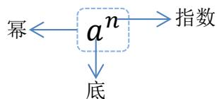

flowchart

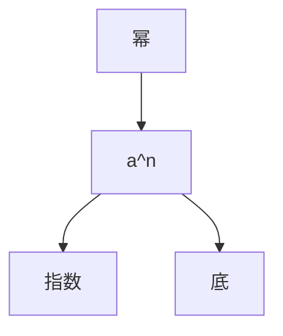

# 3. 乘方运算的结果及符号的规律

$\left\{ \begin{array}{ll}\text{正数：正数的任何次幂都是正数}\\ \text{负数：}\left\{ \begin{array}{ll} \text{负数的奇次幂是负数}\\ \text{负数的偶次幂是正数}\\ 0:0 \text{的任何正整数次幂都是}0 \end{array} \right. \end{array} \right.$

# 知识点 2 有理数的混合运算顺序

1. 先乘方，再乘除，最后加减；  
2. 同级运算，从左到右进行；  
3. 如有括号，先做括号内的运算，按小括号、中括号、大括号依次进行.

有理数运算分三级，加减是第一级运算，乘除是第二级运算，乘方是第三级运算．运算顺序是先算高级，再算低级；同级运算按从左到右的顺序进行；对于含有多重括号的运算，一般先算小括号内的，再算中括号内的，最后算大括号内的.

# 【题型1 有理数幂的概念】

【例 1】（2024·河北沧州·模拟预测）若 $\underbrace{2^{3}+2^{3}+2^{3}+\ldots+2^{3}}_{k个2^{3}}=2^{m}\quad(k>1,\quad k,m$ 都为正整数），则 m 的最小值为（）

A. 3

B. 4

C. 6

D. 9

【变式 1-1】（22-23 七年级上·江西宜春·阶段练习） $-2^{3}$ 的底数是\_\_\_\_指数是\_\_\_\_表示\_\_\_\_.

【变式 1-2】（2024 七年级上·全国·专题练习）下列说法正确的有（）

①没有平方得-9的数；② $-a^{2}$ 是负数；③ $(m+d)^{2}$ 是正数；④任何一个小于1的数都大于它的平方.

A. 1 个

B. 2 个

C. 3 个

D. 4 个

【变式 1-3】（24-25 七年级上·河北唐山·期末） $\overbrace{3+3+3+\cdots+3}^{m个}+\overbrace{2\times2\times2\times\cdots\times2}^{n个}$ 的结果可表示为（）

A. $3m + 2n$

B. $m^{3} + 2n$

C. $3^{m} + 2n$

D. $3m + 2^{n}$

# 【题型2 有理数的乘方运算】

【例 2】（24-25 七年级上·山东济宁·期中）比较大小： $-\frac{2^{3}}{3}$ \_\_\_\_ $-\left(\frac{3}{2}\right)^{2}$ （填＞或＜）。

【变式 2-1】（2025·福建泉州·二模）已知 $(x-2025)^{2}+|y+1|=0$ ，则 $y^{x}$ 的值是\_\_\_\_。

【变式 2-2】（24-25 七年级上·上海闵行·期中）计算： $\left(-\frac{1}{4}\right)^{11}\times16^{6}=$ \_\_\_\_.

【变式 2-3】（24-25 七年级上·广东广州·期末）利用二进制数加法运算法则计算 $(11010)_{2}+(111)_{2}$ ，并把计算结果转化为十进制数是\_\_\_\_。

# 【题型 3 有理数乘方的逆运算】教辅资源，关注 公众号★全科AA+

【例 3】（2025·四川广安·模拟预测）一般地，n 个相同的因数 a 相乘 $a \cdot a \cdot a \cdot a \cdots a$ 记作 $a^{n}$ ，如 $2 \times 2 \times 2 = 2^{3} = 8$ 。此时，3 叫做以 2 为底的 8 的“劳格数”，记为 $L_{2}(8)$ ，则 $L_{2}(8) = 3$ 。一般地，若 $a^{n} = b$ （a > 0 且 $a \neq 1$ ），则 n 叫做以 a 为底的 b 的“劳格数”，记为 $L_{a}(b) = n$ ，如 $3^{4} = 81$ ，则 4 叫做以 3 为底的 81 的“劳格数”，记为 $L_{3}(81) = 4$ 。则 $L_{3}(9), L_{3}(27), L_{3}(243)$ 满足关系式 \_\_\_\_。

【变式 3-1】（22-23 七年级上·广东东莞·期中） $6^{2}=36,(2\times3)^{2}=2^{2}\times3^{2}=4\times9=36$ ，由此你能算出 $2^{36} \times \left( \frac{1}{2} \right)^{33} = (\quad)$

A. 6

B. 8

C. $\frac{1}{8}$

D. 十分麻烦

【变式 3-2】（22-23 七年级上·山东青岛·阶段练习）已知 $|a|=2, b^{2}=25, 3^{c}=27$ ，且ab>0，则 $a-b+c$ 的值为（）

A. 10

B. 6

C. 3

D. 6 或者 0

【变式 3-3】（22-23 七年级上·福建厦门·期中）若 $126 \times 3^{8} = p$ ，则 $126 \times 3^{6}$ 的值可以表示为（）

A. $\frac{1}{6}p$

B. $p - 9$

C. $p - 6$

D. $\frac{1}{9}p$

# 【题型4 乘方运算的符号规律】

【例 4】（23-24 七年级上·广东揭阳·期末）计算： $(-1)^{1} + (-1)^{2} + (-1)^{3} + \cdots + (-1)^{10} =$

【变式 4-1】（23-24 七年级上·河南信阳·期中）在 $(-1)^{2021}$ ， $-2^{3}$ ， $(-7)^{11}$ ，0 中，非负数有（）

A. 1 个

B. 2 个

C. 3 个

D. 4 个

【变式 4-2】（24-25 七年级上·四川南充·期中）已知 $y = -(x - 6)^{4} + 2024$ 的最大值为 \_\_\_\_.

【变式 4-3】（23-24 七年级上·河南漯河·阶段练习）当整数n为\_\_\_\_时， $(-1)^{n}=-1$ ；若n是正整数，则 $(-1)^{n}+(-1)^{n+1}=$ \_\_\_\_.

# 【题型5 乘方的应用】

【例 5】（24-25 七年级上·江苏宿迁·期中）根据我国古代《易经》记载，远古时期人们通过在绳子上打结来记录数量，即“结绳记数”。如图，一位妇女在从右到左依次排列的绳子上打结，满七进一，用来记录采集到的野果的个数。已知她一共采集到的野果数不少于 75 个，则她在第 2 根绳子上打结的可能情况有（）

natural_image

Black-and-white sketch of a person sitting under a rope with hanging ropes (no text or symbols)

A. 1 种

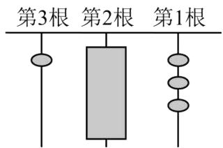

text_image

第3根 第2根 第1根

B. 2 种

C. 3 种

D. 4 种

【变式 5-1】（24-25 七年级上·江苏宿迁·期中）一根 1 米长的绳子，第一次剪去一半，第二次剪去剩下的一半，如此下去，第 6 次后剩下的绳子的长度为（）

A. $\left(\frac{1}{2}\right)^{3}$ 米

B. $\left(\frac{1}{2}\right)^{5}$ 米

C. $\left(\frac{1}{2}\right)^6$ 米

D. $\left(\frac{1}{2}\right)^{12}$ 米

【变式 5-2】（24-25 七年级上·云南昆明·期末）二进制在计算机科学中有广泛的应用，计算机和依赖计算机的设备都使用二进制来表示数字和数据。二进制是逢二进一，其各数位上的数字为 0 或 1，并利用角标表示二进制数，例如， $(1011)_2$ 就是二进制数 1011 的简单写法。在学习教科书《进位制的认识与探究》以后，小明查阅了资料并进行了思考，发现以下两种方法均可实现二进制与十进制之间的转换。

以 98 为例:

方法一：因为 $98 = 64 + 32 + 2$

$$
= 1 \times 2 ^ {6} + 1 \times 2 ^ {5} + 0 \times 2 ^ {4} + 0 \times 2 ^ {3} + 0 \times 2 ^ {2} + 1 \times 2 ^ {1} + 0 \times 2 ^ {0}
$$

所以 $98=(1100010)_{2}$ .

方法二：用如图的短除法算式表示：

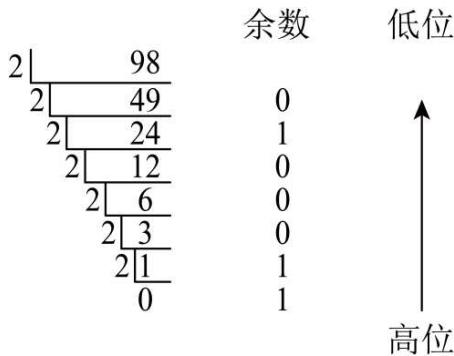

text_image

余数 低位
2 | 98
2 | 49
2 | 24
2 | 12
2 | 6
2 | 3
2 | 1
0
0
1
0
0
0
1
1
↑
高位

请你根据以上材料，把123转换为五进制数是（）

A. $(1111011)_{5}$

B. $(123)_{5}$

C. (443) $_{5}$

D. $(344)_{5}$

【变式 5-3】（2024 七年级上·全国·专题练习）某软件用户等级用四个标识图展示，从低到高分别为星星、月亮、太阳、皇冠，采用“满四进一”制，一开始是星星，1个星星为1级，4个星星等于1个月亮，4个月亮等于1个太阳，4个太阳等于1个皇冠。某用户的等级标识图为两个皇冠，则该用户的等级为（）

A. 64

B. 128

C. 256

D. 512

# 【题型 6 有理数的混合运算】教辅资源，关注公众号★全科AA+

【例 6】（23-24 七年级上·内蒙古呼伦贝尔·期末）小王利用计算机设计了一个计算程序，输入和输出的数据如下表：

<table><tr><td>输入</td><td>1</td><td>2</td><td>3</td><td>4</td><td>5</td><td>...</td></tr><tr><td>输出</td><td> $\frac{1}{2}$ </td><td> $\frac{2}{5}$ </td><td> $\frac{3}{10}$ </td><td> $\frac{4}{17}$ </td><td> $\frac{5}{26}$ </td><td>...</td></tr></table>

那么，当输入数据是8时，输出的数据是（）

A. $\frac{8}{61}$

B. $\frac{8}{63}$

C. $\frac{8}{65}$

D. $\frac{8}{67}$

【变式 6-1】（24-25 六年级上·山东烟台·期末）下列运算错误的是（）

A. $(-14) + 7 - (+5) = -12$

B. $(-3)^{2} - (-4) \div |-2| = 9 + 4 \div 2$   
C. $-7 \div 2 \times \left(-\frac{1}{2}\right) = 7 \div 2 \times \frac{1}{2}$   
D. $\frac{7}{13} \times (-9) + (-3) \times \left(-\frac{7}{13}\right) - \frac{7}{13} \times 2 = \frac{7}{13} \times (-9 - 3 + 2)$

【变式 6-2】（24-25 七年级上·安徽合肥·期末）用一排 6 个黑白圆圈来表示数，如图分别表示数1-5，则
●○○●●○表示的数是\_\_\_\_。

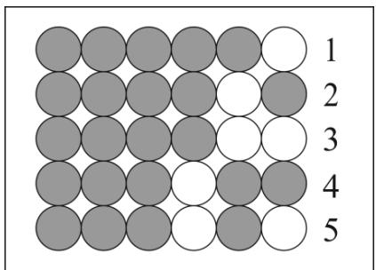

text_image

1
2
3
4
5

【变式 6-3】（24-25 七年级上·浙江台州·期末）对正整数 n 反复进行下列两种运算：①若 n 是偶数，就除以 2；②若 n 是奇数，就乘以 3 加 1．例如：正整数 6 经过一次操作后的结果是 3，经过两次操作后的结果是 10．若某正整数 m 经过 4 次操作后的结果是 2，则正整数 m 的值是 \_\_\_\_.

# 【题型7 有理数混合运算的实际应用】教辅资源，关注公众号★全科AA+

【例 7】（24-25 七年级下·重庆·阶段练习）二维码在我们日常生活中应用越来越广泛，它是用某种待定的几何图形按照一定的规律在平面分布的、黑白相间的、记录数据符号信息的图形；在代码编制上巧妙利用构成计算机内部逻辑基础的“0”，“1”，使用若干个与二进制相对应的几何图形来表示数值（黑色代表 1，白色代表 0）。如图是某次考试中两位同学的准考证号的二维码的简易编码，如图 1，是同学“小胡”的准考证号的二维码的简易编码，其中第一行代表二进制的数字 11000，转化成 10 进制为： $1 \times 2^{4} + 1 \times 2^{3} + 0 \times 2^{2} + 0 \times 2^{1} + 0 \times 1 = 24$ ，同理，第二行至第五行代表二进制的数字分别为 1110，111，11100，1101，转化成 10 进制为：14，07，28，13，将五行编码组合到一起就是“小胡”的准考证号 2414072813，其中第一行编码“24”和第二行编码“14”表示区域和学校，第三行编码“07”表示班级为 07 班，第四行编码“28”表示考场号为 28，第五行编码“13”表示座位号是 13；若图 2 是本次考试“小张”同学的准考证号的二维码的简易编码，则小张的准考证号为（）

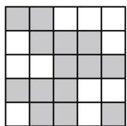

natural_image

Grid pattern with alternating shaded and unshaded squares (no text or symbols)

图1

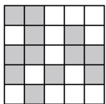

natural_image

Grid pattern with alternating shaded and unshaded squares (no text or symbols)

图2

A. 2410252110

B. 2010272108

C. 2212272408

D. 2410272108

【变式 7-1】（24-25 七年级上·四川成都·期末）某校一幢教学楼共有 5 层，相邻两层之间楼梯的台阶均为 18 级，从 1 层到 5 层参加舞蹈社团的学生人数分别为 9，7，5，5，6．若在某层楼确定活动地点，能使所有参加舞蹈社团的同学到活动地点所经过的台阶数之和最小，则台阶数之和最小为\_\_\_\_级.

【变式 7-2】（24-25 七年级下·重庆沙坪坝·期末）2025 重庆沙坪坝全球校友半程马拉松现场氛围热烈．某学校 9 人组成的啦啦队在站点表演三个助威节目，候场时间为从首个节目开始至参演节目开始前的时间间隔（不考虑换场等因素），各节目参与人数及表演时长（单位：min）如下表所示：

<table><tr><td>节目</td><td>甲</td><td>乙</td><td>丙</td></tr><tr><td>人数</td><td>3</td><td>4</td><td>2</td></tr><tr><td>时长</td><td>6</td><td>4</td><td>2</td></tr></table>

若节目按丙→乙→甲的顺序表演，则9位学生的候场时间之和是（）

A. 6

B. 20

C. 26

D. 44

【变式 7-3】（24-25 七年级上·重庆渝北·期末）正所谓：“人有人言，灯有灯语”。灯语（灯光通信）是船只之间通信的一种通用化语言，在国际上的使用十分广泛。利用灯光，以二进制的原理传递信息，可以帮助船员在较远的目视距离相互沟通。例如：“○”表示亮红灯。“●”表示亮绿灯。两只远洋航行的船只用亮红灯和亮绿灯来进行交流，并在启航前作如图所示的约定：

● 表示字母A;

●○

表示字母B;

● ●

表示字母C;

● ○ ○

表示字母D;

●○●

表示字母E;

● ● ○

表示字母F;

● ● ●

表示字母G;

● ● ●

根据约定的规则，下列说法正确的有（）

①“●○○○”表示字母 H:

②若要表示26个英文字母，需要6盏灯；

③某船先后发出“●○○●●”、“●●●●●”、“●○○●●”表示它遇到了危险，在求救.

A. 0 个

B. 1 个

C. 2 个

D. 3 个

# 【题型8 程序流程图与有理数的计算】教辅资源，关注公众号★全科AA+

【例 8】（24-25 八年级上·贵州遵义·期末）定义一种对正整数n的“F”运算，①当n为奇数时，结果为 $3n+5$ ；②当n为偶数时，结果为 $\frac{k}{2^{n}}$ （其中k是使 $\frac{k}{2^{n}}$ 为奇数的正整数），并且运算重复进行，例如，取n=26，如图所示；若n=449，则第“F④”的运算的结果是（）

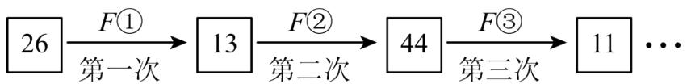

flowchart

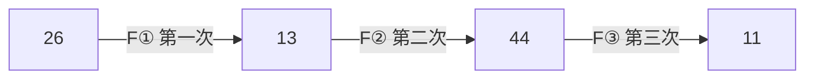

A. 1

B. 3

C. 7

D. 8

【变式 8-1】（24-25 七年级上·辽宁丹东·期中）如图是一个“数值转换机”的示意图，当 $x = -1$ ， $y = -2$ 时，输出的结果是 \_\_\_\_.

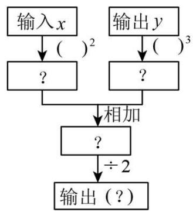

flowchart

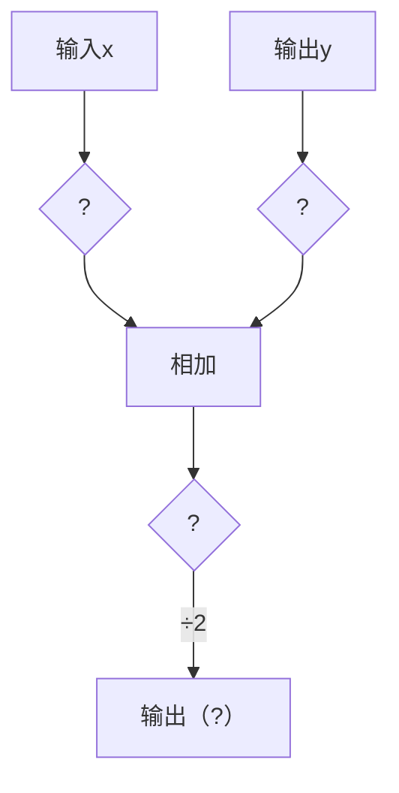

【变式 8-2】（24-25 七年级上·陕西西安·期末）如图是小字用计算机设计的一个有理数运算的程序框图．若输入的数a为1，则输出的结果是（）

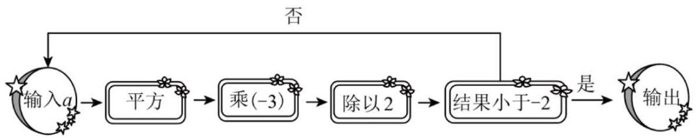

flowchart

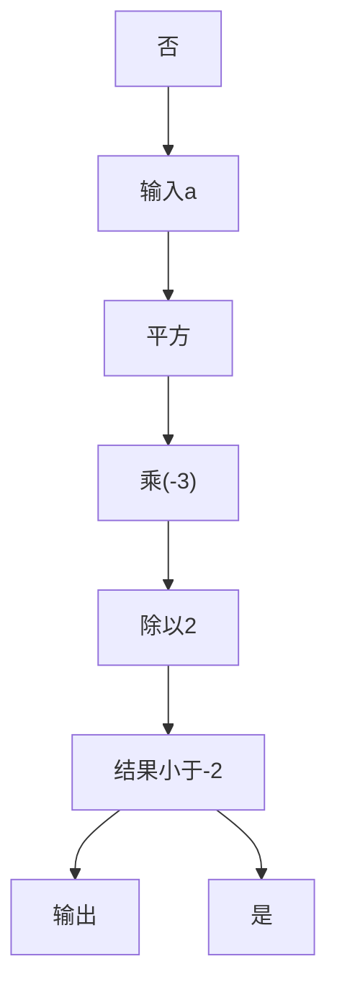

A. $-\frac{3}{2}$

B. $\frac{3}{2}$

C. $-\frac{27}{8}$

D. $\frac{27}{8}$

【变式 8-3】（24-25 九年级上·重庆江北·期末）对任意正整数 n，若 n 为偶数则除以 2，若 n 为奇数则乘 3 再加 1，在这样一次变化下，我们得到一个新的自然数，在 1937 年 LotharCollatz 提出了一个问题：如此反复这种变换，是否对于所有的正整数，最终都能变换到 1 呢？这就是数学中著名的“考拉兹猜想”。如果某个正整数通过上述变换能变成 1，我们就把第一次变成 1 时所经过的变换次数称为它的路径长，例如 5 经过 5 次变成 1，则路径长 m = 5。下列说法：

①无论输入的正整数 n 是奇数还是偶数，当路径长 $m \geq 4$ 时，总能得到连续四次变换的结果依次是 $2^{4}$ ， $2^{3}$ ，

$2^{2}$ ， $2^{1}$

②若输入正整数 n，变换次数 m，当 m = 8 时，n 的所有可能值只有 4 个；  
③若输入正整数 n，变换次数 m，当 m = 9 时，n 的所有可能值中最大是 512，最小是 13.

其中正确的个数是（）

A. 3 个

B. 2 个

C. 1 个

D. 0 个

# 【题型9 计算“24”点】

【例 9】（24-25 七年级上·四川成都·期末）24 点游戏是一种益智游戏，24 点是把 4 个整数（一般是正整数）通过加、减、乘、除或乘方等运算（可以使用括号），使最后的计算结果是 ±24 的一个数学游戏（每个数字均使用 1 次）。写出 1, 2, 2, 3 的 24 点游戏的一种计算式\_\_\_\_。

【变式 9-1】（24-25 七年级上·广东佛山·期末）游戏“24点”规则如下：从一副扑克牌（去掉大王、小王）中任意抽取4张，根据牌面上的数字进行混合运算（每张牌必须用一次且只能用一次），使得运算结果为24，其中红色（方块、红桃）扑克牌代表负数，黑色（梅花、黑桃）扑克牌代表正数。请用如图抽取出的4张牌，写出一个符合规则的算式：\_\_\_\_。

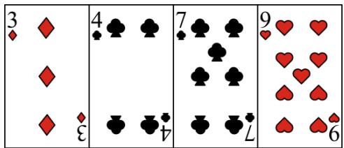

text_image

3 ◆
◆
◆
◆
◆
4 ♣
♣
♣
♣
♣
♣
♣
♣
♣
♣
♣
♣
♣
♣
♣
♣
♣
♣
♣
♣
♣
♣
♣
♣
♣
♣
♣
♣
♣
♣
♣
♣
♣
♣
♣
♣
♣
♣
♣
♣
♣
♣
♣
♣
♣
♣
♣
♣
♣
♣
♣
♥
♥
♥
♥
♥
♥
♥
♥
♥
♥
♥

【变式 9-2】（23-24 六年级上·山东威海·期末）有一种“二十四点”游戏，其游戏规则是：任取 1 至 13 之间的四个自然数，将这四个数（每个数用且只用一次，可以加括号）进行有理数混合运算，使其结果等于 24．现有四个有理数 1,2,2,3，请仿照“二十四点”游戏规则写出一个算式\_\_\_\_，使其结果等于 24.

【变式 9-3】“24 点”游戏规则是：从一副牌中（去掉大、小王）任意抽取 4 张牌，用上面的数字进行混合运算，使结果为 24 或—24。其中红色代表负数，黑色代表正数，A, J, Q, K 分别代表 1, 11, 12, 13，例如张毅同学抽取的 4 张牌分别为红桃 4、红桃 3、梅花 6、黑桃 2，于是张毅同学列出的算式为 $(-4) \times (-3 - 6 \div 2) = 24$ ，现在张毅同学想挑战“36 点”，将这四张牌中的任意一张换成其它牌，使结果为 36 或—36，下列方法可行的有几种：①将红桃 4 换成黑桃 6；②将红桃 3 换成红桃 6；③将梅花 6 换成黑桃 Q；④将黑桃 2 换成黑桃 A（）

A. 1 种

B. 2 种

C. 3 种

D. 4 种

# 【题型 10 乘方中的规律探究】教辅资源，关注 公众号★全科AA+

【例 10】（24-25 七年级上·河南商丘·期末）为了求 $1+2+2^{2}+2^{3}+\cdots+2^{20}$ 的值，可令 $A=1+2+2^{2}+$

$$
2 ^ {3} + \dots + 2 ^ {2 0}
$$

，则 $2A=2+2^{2}+2^{3}+2^{4}+\cdots+2^{21}$ ，因此 $A=2A-A=2^{21}-1$ ，所以 $1+2+2^{2}+2^{3}+\cdots+2^{20}=2^{21}-1$ 。仿照以上推理，计算 $1+7+7^{2}+7^{3}+\cdots+7^{2025}$ 的结果为（）

A. $7^{2025} - 1$

B. $7^{2026} - 1$

C. $\frac{7^{2025}-1}{6}$

D. $\frac{7^{2026}-1}{6}$

【变式 10-1】（24-25 七年级下·福建漳州·期中）我们规定一个新数“i”，一切有理数可以与新数进行四则运算，且原有的运算律和运算法则仍然成立， $i^{1}=i,i^{2}=-1,i^{3}=i^{2}\cdot i=-i,i^{4}=i^{2}\cdot i^{2}=-1\times(-1)=1$ ，那么 $i^{1}+i^{2}+i^{3}+\cdots+i^{2024}+i^{2025}=$ \_\_\_\_.

【变式 10-2】（24-25 七年级上·广东广州·期中）观察下图三行数：

-2, 4, -8, 16, -32, 64, ...; ①

0, 6, -6, 18, -30, 66, ...; ②

-1, 2, -4, 8, -16, 32, ...; ③

取每行数的第9个数，这三个数的和为\_\_\_\_；

【变式 10-3】（22-23 七年级上·湖北武汉·期中）计算机利用的是二进制数，它共有两个数码 0，1，将一个十进制数转化为二进制，只需把该数写出若干 $2^{n}$ 数的和，依次写出 1 或 0 即可。如 $19_{(10)} = 16 + 2 + 1 = 1 \times 2^{4} + 0 \times 2^{3} + 0 \times 2^{2} + 1 \times 2^{1} + 1 = 10011_{(2)}$ 为二进制下的五位数，则十进制2022是二进制下的（）

A. 10位数

B. 11位数

C. 12位数

D. 13 位数