# 专题 2.6 有理数的乘方、有理数的混合运算（举一反三讲义）

# 【北师大版 2024】

# 题型归纳

【题型 1 有理数幂的概念】....2

【题型2 有理数的乘方运算】....3

【题型3 有理数乘方的逆运算】....5

【题型 4 乘方运算的符号规律】....7

【题型 5 乘方的应用】....8

【题型 6 有理数的混合运算】....10

【题型 7 有理数混合运算的实际应用】....12

【题型8 程序流程图与有理数的计算】....16

【题型 9 计算“24”点】....20

【题型10乘方中的规律探究】 21

# 举一反三

# 知识点1 有理数的乘方

1. 一般地, $n$ 个相同的乘数 $a$ 相乘, 即 $\underbrace{a \cdot a \cdots a}_{n\text{个}}$ , 记作 $a^n$ . 求 $n$ 个相同乘数的积的运算, 叫作乘方, 乘方的结果叫作幂.

2. $a^{n}$ 中，a 叫作底数，n 叫作指数， $a^{n}$ 读作 a 的 n 次方（或 a 的 n 次幂）.

flowchart

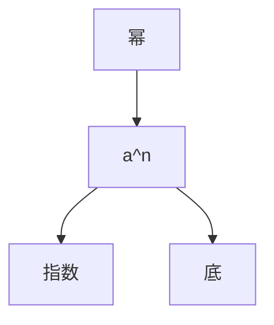

# 3. 乘方运算的结果及符号的规律

$\left\{ \begin{array}{ll}\text{正数：正数的任何次幂都是正数}\\ \text{负数：}\left\{ \begin{array}{ll} 负数的奇次幂是负数\\ 负数的偶次幂是正数 \\ 0:0 \text{的任何正整数次幂都是} 0 \end{array} \right. \end{array} \right.$

# 知识点 2 有理数的混合运算顺序

1. 先乘方，再乘除，最后加减；  
2. 同级运算，从左到右进行；  
3. 如有括号，先做括号内的运算，按小括号、中括号、大括号依次进行.

有理数运算分三级，加减是第一级运算，乘除是第二级运算，乘方是第三级运算．运算顺序是先算高级，再算低级；同级运算按从左到右的顺序进行；对于含有多重括号的运算，一般先算小括号内的，再算中括号内的，最后算大括号内的.

# 【题型1 有理数幂的概念】

【例 1】（2024·河北沧州·模拟预测）若 $\underbrace{2^{3}+2^{3}+2^{3}+\ldots+2^{3}}_{k个2^{3}}=2^{m}\quad(k>1,\quad k,m$ 都为正整数），则 m 的最小值为（）

A. 3

B. 4

C. 6

D. 9

【答案】B

【分析】本题主要考查数字的变化规律，解答的关键是是理解题意，明确幂的形式．根据所给的式子的特点，结合幂的运算的相应的法则进行分析即可.

【详解】

解： $2^{3}+2^{3}+2^{3}+\ldots+2^{3}=2^{m}\quad(k>1,\quad k,m$ 都为正整数 $\therefore2^{3}k=2^{m},$

则 k 是可以转为以 2 为底数的幂的形式的数，

∴k的最小值为： $2 = 2^{1}$ ,

$$
\therefore 2 ^ {3} \times 2 = 2 ^ {m},
$$

$$
\therefore m = 4,
$$

∴m的最小值为：4

故选：B

【变式 1-1】（22-23 七年级上·江西宜春·阶段练习） $-2^{3}$ 的底数是\_\_\_\_指数是\_\_\_\_表示\_\_\_\_.

【答案】232的3次方的相反数/ $2^{3}$ 的相反数

【分析】根据乘方的定义， $a^{n}$ 中，a是底数，n是指数， $a^{n}$ 是幂.

【详解】解：根据乘方的概念，则 $-2^{3}$ 的底数是2，指数是3，表示2的3次方的相反数.

故答案为2；3；2的3次方的相反数.

【点睛】此题考查了有理数的乘方的概念，注意 $-2^{3}$ 和 $(-2)^{3}$ 的区别，前者底数是2，后者底数是-2，正确区分乘方运算的底数是解题的关键.

【变式 1-2】（2024 七年级上·全国·专题练习）下列说法正确的有（）

①没有平方得-9的数；② $-a^{2}$ 是负数；③ $(m+d)^{2}$ 是正数；④任何一个小于1的数都大于它的平方.

A. 1 个

B. 2 个

C. 3 个

D. 4 个

【答案】A

【分析】本题考查有理数的乘方，以及正负数的概念，对于①，根据一个数的平方是非负数进行判断；对于②、③，根据零的平方是零，零既不是正数也不是负数，据此分析；对于④，根据负数的平方是正数，负数小于正数，即可举例作出判断.

【详解】解：没有平方得-9的数，①正确；

a = 0 时， $-a^{2} = 0$ ，不是负数，②错误；

$m+d=0$ 时， $(m+d)^{2}=0$ ，不是正数，③错误；

$(-1)^{2}=1,\ -1<1,\ ④错误.$

综上所述，正确的有 1 个，

故选：A.

【变式 1-3】（24-25 七年级上·河北唐山·期末） $\overbrace{3+3+3+\cdots+3}^{m个}+\overbrace{2\times2\times2\times\cdots\times2}^{n个}$ 的结果可表示为（）

A. $3m + 2n$

B. $m^3 + 2n$

C. $3^{m} + 2n$

D. $3m + 2^{n}$

【答案】D

【分析】本题主要考查了用代数式表示数，有理数幂等知识，先得出 m 个 3 相加表示为 3m，n 个 2 相乘表示为 $2^{n}$ ，然后相加即可得出答案.

【详解】解：m 个 3 相加表示为：3m，n 个 2 相乘表示为 $2^{n}$ ，

故 $\overbrace{3+3+3+\cdots+3}^{m个}+\overbrace{2\times2\times2\times\cdots\times2}^{n个}$ 的结果可表示为 $3m+2^{n}$ ,

故选：D.

# 【题型2 有理数的乘方运算】

【例 2】（24-25 七年级上·山东济宁·期中）比较大小： $-\frac{2^{3}}{3}$ \_\_\_\_ $-\left(\frac{3}{2}\right)^{2}$ （填＞或＜）。

【答案】<

【分析】本题考查了有理数的大小比较，1、在数轴上表示的两个数，右边的总比左边的数大．2、正数都大于零，负数都小于零，正数大于负数．3、两个正数比较大小，绝对值大的数大；两个负数比较大小，绝对值大的数反而小.

先计算各数，再利用有理数大小的比较方法比较即可.

【详解】解： $-\frac{2^{3}}{3}=-\frac{8}{3},-\left(\frac{3}{2}\right)^{2}=-\frac{9}{4},$

$$
\because \left| - \frac {8}{3} \right| > \left| - \frac {9}{4} \right|,
$$

$$
\therefore - \frac {8}{3} <   - \frac {9}{4},
$$

$$
\therefore - \frac {2 ^ {3}}{3} <   - \left(\frac {3}{2}\right) ^ {2}.
$$

故答案为: $<$ .

【变式 2-1】（2025·福建泉州·二模）已知 $(x-2025)^{2}+|y+1|=0$ ，则 $y^{x}$ 的值是\_\_\_\_.

【答案】-1

【分析】本题主要考查了非负数的性质，代数式求值，根据非负性的性质得到 $x - 2025 = 0$ ， $y + 1 = 0$ ，据此求出 $x$ 、 $y$ 的值即可得到答案.

【详解】解： $\because(x-2025)^{2}+|y+1|=0,\quad(x-2025)^{2}\geq0,\quad|y+1|\geq0,$

$$
\therefore (x - 2 0 2 5) ^ {2} = | y + 1 | = 0,
$$

$$
\therefore x - 2 0 2 5 = 0, y + 1 = 0,
$$

$$
\therefore x = 2 0 2 5, y = - 1,
$$

$$
\therefore y ^ {x} = (- 1) ^ {2 0 2 5} = - 1,
$$

故答案为：-1.

【变式2-2】（24-25七年级上·上海闵行·期中）计算： $\left(-\frac{1}{4}\right)^{11} \times 16^6 =$

【答案】-4

【分析】本题考查有理数的乘方运算，先将16化为 $4^{2}$ ，根据幂的乘方将原式化为 $\left(-\frac{1}{4}\right)^{11}\times4^{12}$ ，再根据同底数幂的乘法的逆运算转化为 $\left(-\frac{1}{4}\right)^{11}\times4^{11}\times4$ ，然后根据积的乘方的逆运算转化为 $\left(-\frac{1}{4}\times4\right)^{11}\times4$ ，即可得解．掌握相应的运算法则的逆运算是解题的关键.

【详解】解： $\left(-\frac{1}{4}\right)^{11}\times16^{6}$

$$
= \left(- \frac {1}{4}\right) ^ {1 1} \times (4 ^ {2}) ^ {6}
$$

$$
= \left(- \frac {1}{4}\right) ^ {1 1} \times 4 ^ {1 2}
$$

$$
= \left(- \frac {1}{4}\right) ^ {1 1} \times 4 ^ {1 1} \times 4
$$

$$
= \left(- \frac {1}{4} \times 4\right) ^ {1 1} \times 4
$$

$$
= (- 1) ^ {1 1} \times 4
$$

$$
= (- 1) \times 4
$$

$$
= - 4.
$$

故答案为：-4.

【变式 2-3】（24-25 七年级上·广东广州·期末）利用二进制数加法运算法则计算 $(11010)_{2}+(111)_{2}$ ，并把计算结果转化为十进制数是\_\_\_\_。

【答案】33

【分析】本题考查了二进制数的加法运算，二进制数转化为十进制数，先根据二进制数加法运算法则求出结果，再根据二进制数转化为十进制数的运算法则计算即可求解，掌握相关运算法则是解题的关键.

【详解】解：∵(11010) $_{2}$ +(111) $_{2}$ =(100001) $_{2}$ ,

∴计算结果转化为十进制数是 $1 \times 2^{5} + 0 \times 2^{4} + 0 \times 2^{3} + 0 \times 2^{2} + 0 \times 2^{1} + 1 \times 2^{0} = 32 + 1 = 33$ ,

故答案为：33.

# 【题型3 有理数乘方的逆运算】

【例 3】（2025·四川广安·模拟预测）一般地，n 个相同的因数 a 相乘 $a \cdot a \cdot a \cdot a \cdots a$ 记作 $a^{n}$ ，如 $2 \times 2 \times 2 = 2^{3} = 8$ 。此时，3 叫做以 2 为底的 8 的“劳格数”，记为 $L_{2}(8)$ ，则 $L_{2}(8) = 3$ 。一般地，若 $a^{n} = b$ （a > 0 且 $a \neq 1$ ），则 n 叫做以 a 为底的 b 的“劳格数”，记为 $L_{a}(b) = n$ ，如 $3^{4} = 81$ ，则 4 叫做以 3 为底的 81 的“劳格数”，记为 $L_{3}(81) = 4$ 。则 $L_{3}(9), L_{3}(27), L_{3}(243)$ 满足关系式 \_\_\_\_。

【答案】 $L_{3}(9)+L_{3}(27)=L_{3}(243)$

【分析】本题考查了有理数乘方，计算出 $L_{3}(9)=2$ ， $L_{3}(27)=3$ ， $L_{3}(243)=5$ ，即可解答，数熟练计算是解题的关键.

【详解】解：∵ $3^{2} = 9, 3^{3} = 27, 3^{5} = 243$ ,

$$
\therefore L _ {3} (9) = 2, L _ {3} (2 7) = 3, L _ {3} (2 4 3) = 5,
$$

$$
\therefore L _ {3} (9) + L _ {3} (2 7) = L _ {3} (2 4 3),
$$

故答案为： $L_{3}(9)+L_{3}(27)=L_{3}(243)$ .

【变式 3-1】（22-23 七年级上·广东东莞·期中） $6^{2}=36,(2\times3)^{2}=2^{2}\times3^{2}=4\times9=36$ ，由此你能算出 $2^{36} \times \left( \frac{1}{2} \right)^{33} = (\quad)$

A. 6

B. 8

C. $\frac{1}{8}$

D. 十分麻烦

【答案】B

【分析】先把原式变形为 $2^{33}\times\left(\frac{1}{2}\right)^{33}\times2^{3}$ ，从而得到 $\left(2\times\frac{1}{2}\right)^{33}\times2^{3}$ ，即可求解.

【详解】解： $2^{36} \times \left(\frac{1}{2}\right)^{33}$

$$
= 2 ^ {3 3} \times 2 ^ {3} \times \left(\frac {1}{2}\right) ^ {3 3}
$$

$$
\begin{array}{l} = 2 ^ {3 3} \times \left(\frac {1}{2}\right) ^ {3 3} \times 2 ^ {3} \\ = \left(2 \times \frac {1}{2}\right) ^ {3 3} \times 2 ^ {3} \\ = 1 ^ {3 3} \times 2 ^ {3} \\ = 1 \times 8 \\ = 8 \\ \end{array}
$$

故选：B.

【点睛】本题主要考查了有理数乘方运算，掌握有理数乘方的意义是解题的关键.

【变式 3-2】（22-23 七年级上·山东青岛·阶段练习）已知 $|a|=2, b^{2}=25, 3^{c}=27$ ，且ab>0，则 $a-b+c$ 的值为（）

A. 10

B. 6

C. 3

D. 6 或者 0

【答案】D

【分析】先求出 a, b, c 的值，然后分 2 种情况代入计算即可.

【详解】解：∵ $|a|=2$ ，

$$
\therefore a = 2 \text {或} a = - 2.
$$

$$
\because b ^ {2} = 2 5,
$$

$$
\therefore b = 5 \text {或} b = - 5.
$$

$$
\because a b > 0,
$$

∴当a=2时，b=5或当a=-2时，b=-5.

$$
\because 3 ^ {c} = 2 7,
$$

$$
\therefore c = 3.
$$

当a=2，b=5，c=3时，

原式=2-5+3=0.

当a=-2，b=-5，c=3时，

原式=-2+5+3=6.

故选 D.

【点睛】本题考查了乘方的意义，绝对值的意义，求代数式的值，分类讨论是解答本题的关键.

【变式 3-3】（22-23 七年级上·福建厦门·期中）若 $126 \times 3^{8} = p$ ，则 $126 \times 3^{6}$ 的值可以表示为（）

A. $\frac{1}{6} p$

B. p-9

C. p-6

D. $\frac{1}{9}p$

【答案】D

【分析】本题考查了有理数的乘方，乘方的逆运算，等式的性质等知识点，根据有理数乘方的运算法则即可得解，熟练掌握有理数的乘方的意义是解题关键.

【详解】∵ $126 \times 3^{8} = p,$

$$
\therefore 1 2 6 \times 3 ^ {6} \times 3 ^ {2} = p,
$$

$$
\therefore 1 2 6 \times 3 ^ {6} \times 9 = p,
$$

$$
\therefore 1 2 6 \times 3 ^ {6} = \frac {1}{9} p,
$$

故选：D.

# 【题型4 乘方运算的符号规律】

【例 4】（23-24 七年级上·广东揭阳·期末）计算： $(-1)^{1} + (-1)^{2} + (-1)^{3} + \cdots + (-1)^{10} =$

【答案】0

【分析】本题考查了有理数的加法运算，有理数的乘方，根据有理数的乘方找到规律，计算即可.

【详解】解：原式 $= (-1) + 1 + (-1) + \dots + 1$

$$
= 0,
$$

故答案为：0.

【变式 4-1】（23-24 七年级上·河南信阳·期中）在 $(-1)^{2021}$ ， $-2^{3}$ ， $(-7)^{11}$ ，0 中，非负数有（）

A. 1 个

B. 2 个

C. 3 个

D. 4 个

【答案】A

【分析】本题考查有理数乘方中的符号问题，判断每个数的正负号即可求解.

【详解】解： $\because(-1)^{2021}=-1<0,\quad-2^{3}<0,\quad(-7)^{11}=-7^{11}<0,$

$\therefore (-1)^{2021}, -2^3, (-7)^{11}, 0$ 中，只有 $0$ 是非负数.

故选：A.

【变式 4-2】（24-25 七年级上·四川南充·期中）已知 $y = -(x - 6)^{4} + 2024$ 的最大值为 \_\_\_\_.

【答案】2024

【分析】本题考查乘方的非负性．熟练乘方的非负性是解题的关键.

根据乘方的非负性，确定最大值即可.

【详解】解： $\because(x-6)^{4}\geq0,$

$$
\therefore - (x - 6) ^ {4} \leq 0
$$

$$
\therefore - (x - 6) ^ {4} + 2 0 2 4 \leq 2 0 2 4,
$$

$\therefore y = -(x-6)^{4} + 2024$ 的最大值为：2024;

故答案为：2024.

【变式 4-3】（23-24 七年级上·河南漯河·阶段练习）当整数n为\_\_\_\_时， $(-1)^{n}=-1$ ；若n是正整数，则 $(-1)^{n}+(-1)^{n+1}=$ \_\_\_\_.

【答案】 奇数 0

【分析】-1的奇次方为-1，-1的偶次方为1；再分类讨论即可得到答案.

【详解】解：当整数n为奇数时， $(-1)^{n}=-1$ ;

当整数n为奇数时，则 $n+1$ 为偶数，

$$
\therefore (- 1) ^ {n} + (- 1) ^ {n + 1} = - 1 + 1 = 0,
$$

当整数n为偶数时，则 $n+1$ 为奇数，

$$
(- 1) ^ {n} + (- 1) ^ {n + 1} = 1 - 1 = 0;
$$

故答案为：奇数，0

【点睛】本题考查的是负1的奇次方与偶次方，熟记乘方的含义与乘方的符号确定方法是解本题的关键.

# 【题型5 乘方的应用】

【例 5】（24-25 七年级上·江苏宿迁·期中）根据我国古代《易经》记载，远古时期人们通过在绳子上打结来记录数量，即“结绳记数”。如图，一位妇女在从右到左依次排列的绳子上打结，满七进一，用来记录采集到的野果的个数。已知她一共采集到的野果数不少于 75 个，则她在第 2 根绳子上打结的可能情况有（）

natural_image

Illustration of a person sitting on grass near a hanging curtain (no text or symbols)

A. 1 种

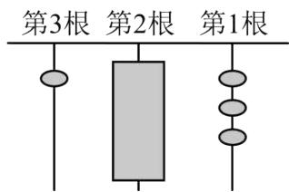

text_image

第3根 第2根 第1根

B. 2 种  
C. 3 种  
D. 4 种

【答案】C

【分析】本题考查了含乘方的有理数的混合运算，以古代“结绳计数”为背景，按满七进一计数，根据图中的数学列式计算即可.

【详解】解：根据题意得， $\frac{75-(1\times7^{2}+3)}{7}=3\cdots2$

因此有 4, 5, 6 三种可能的情况，

故选：C.

【变式 5-1】（24-25 七年级上·江苏宿迁·期中）一根 1 米长的绳子，第一次剪去一半，第二次剪去剩下的一半，如此下去，第 6 次后剩下的绳子的长度为（）

A. $\left(\frac{1}{2}\right)^3$ 米

B. $\left(\frac{1}{2}\right)^5$ 米

C. $\left(\frac{1}{2}\right)^6$ 米

D. $\left(\frac{1}{2}\right)^{12}$ 米

【答案】C

【分析】此题主要考查了乘方的意义．根据乘方的意义和题意可知：第2次后剩下的绳子的长度为 $\left(\frac{1}{2}\right)^{2}$ 米，那么依此类推得到第六次后剩下的绳子的长度为 $\left(\frac{1}{2}\right)^{6}$ 米.

【详解】解：∵ $1-\frac{1}{2}=\frac{1}{2}$ ,

∴第2次后剩下的绳子的长度为 $\left(\frac{1}{2}\right)^{2}$ 米；

依此类推第六次后剩下的绳子的长度为 $\left(\frac{1}{2}\right)^{6}$ 米.

故选：C.

【变式 5-2】（24-25 七年级上·云南昆明·期末）二进制在计算机科学中有广泛的应用，计算机和依赖计算机的设备都使用二进制来表示数字和数据。二进制是逢二进一，其各数位上的数字为 0 或 1，并利用角标表示二进制数，例如， $(1011)_2$ 就是二进制数 1011 的简单写法。在学习教科书《进位制的认识与探究》以后，小明查阅了资料并进行了思考，发现以下两种方法均可实现二进制与十进制之间的转换。

以 98 为例:

方法一：因为 $98 = 64 + 32 + 2$

$$
= 1 \times 2 ^ {6} + 1 \times 2 ^ {5} + 0 \times 2 ^ {4} + 0 \times 2 ^ {3} + 0 \times 2 ^ {2} + 1 \times 2 ^ {1} + 0 \times 2 ^ {0}
$$

所以 $98=(1100010)_{2}$ .

方法二：用如图的短除法算式表示：

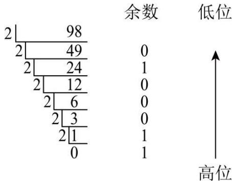

text_image

余数 低位
2 | 98
2 | 49
2 | 24
2 | 12
2 | 6
2 | 3
2 | 1
0
0
1
0
0
0
1
1
↑
高位

请你根据以上材料，把123转换为五进制数是（）

A. $(1111011)_{5}$

B. $(123)_{5}$

C. (443) 5

D. $(344)_{5}$

【答案】C

【分析】本题考查了乘方的应用；仿照二进制与十进制之间的转换的方法进行计算即可求解.

【详解】解：方法一：∵123 = 100 + 20 + 3

$$
= 4 \times 5 ^ {2} + 4 \times 5 ^ {1} + 3 \times 5 ^ {0}
$$

所以 $123 = (443)_{5}$ .

方法二

5 123 余数 低位
5 24 3 ↑
5 4 4
5 0 4 高位

所以 $123 = (443)_{5}$ .

故选：C.

【变式 5-3】（2024 七年级上·全国·专题练习）某软件用户等级用四个标识图展示，从低到高分别为星星、月亮、太阳、皇冠，采用“满四进一”制，一开始是星星，1个星星为1级，4个星星等于1个月亮，4个月亮等于1个太阳，4个太阳等于1个皇冠。某用户的等级标识图为两个皇冠，则该用户的等级为（）

A. 64

B. 128

C. 256

D. 512

【答案】B

【分析】本题考查了有理数乘方的应用，根据题意列出算式 $2 \times 4 \times 4 \times 4 = 2^{7}$ ，然后求解即可，正确列出运算式子是解题的关键.

【详解】解：由题意得，两个皇冠的等级是 $2 \times 4 \times 4 \times 4 = 2^{7} = 128$ ，

故选：B.

# 【题型6 有理数的混合运算】

【例 6】（23-24 七年级上·内蒙古呼伦贝尔·期末）小王利用计算机设计了一个计算程序，输入和输出的数据如下表：

<table><tr><td>输入</td><td>1</td><td>2</td><td>3</td><td>4</td><td>5</td><td>...</td></tr><tr><td>输出</td><td> $\frac{1}{2}$ </td><td> $\frac{2}{5}$ </td><td> $\frac{3}{10}$ </td><td> $\frac{4}{17}$ </td><td> $\frac{5}{26}$ </td><td>...</td></tr></table>

那么，当输入数据是8时，输出的数据是（）

A. $\frac{8}{61}$

B. $\frac{8}{63}$

C. $\frac{8}{65}$

D. $\frac{8}{67}$ 【答案】C

【分析】本题考查了有理数的混合运算，根据图表找出输出数字的规律：输出的数字中，分子就是输入的数，分母是输入的数字的平方加1，直接将输入数据代入即可求解，解题的关键是找到规律列出相应代数式.

【详解】解：根据图表找出输出数字的规律：输出的数字中，分子就是输入的数，分母是输入的数字的平方加1，

则当输入数据是8时，输出的数据是 $\frac{8}{8^{2}+1}=\frac{8}{65}$ ,

故选：C.

【变式 6-1】（24-25 六年级上·山东烟台·期末）下列运算错误的是（）

A. $(-14) + 7 - (+5) = -12$

B. $(-3)^{2} - (-4) \div |-2| = 9 + 4 \div 2$

C. $-7 \div 2 \times \left(-\frac{1}{2}\right) = 7 \div 2 \times \frac{1}{2}$

D. $\frac{7}{13} \times (-9) + (-3) \times \left(-\frac{7}{13}\right) - \frac{7}{13} \times 2 = \frac{7}{13} \times (-9 - 3 + 2)$

【答案】D

【分析】此题考查了有理数的混合运算，根据各个选项中的式子，可以计算出正确的式子或者结果，本题得以解决.

【详解】解：A. $(-14)+7-(+5)=-7-5=-12$ ，计算正确，选项不符合题意；

B. $(-3)^{2}-(-4)\div|-2|=9+4\div2$ ，计算正确，选项不符合题意；

C. $-7 \div 2 \times \left(-\frac{1}{2}\right) = 7 \div 2 \times \frac{1}{2}$ ，计算正确，选项不符合题意；

D. $\frac{7}{13} \times (-9) + (-3) \times \left(-\frac{7}{13}\right) - \frac{7}{13} \times 2 = \frac{7}{13} \times (-9 + 3 - 2)$ ，计算错误，选项符合题意；

故选：D.

【变式 6-2】（24-25 七年级上·安徽合肥·期末）用一排 6 个黑白圆圈来表示数，如图分别表示数1-5，则
●○○●●○表示的数是\_\_\_\_.

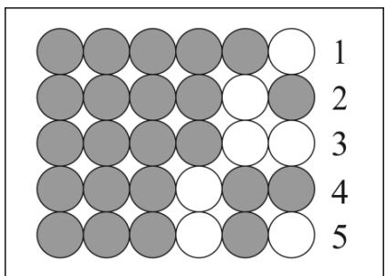

text_image

1
2
3
4
5

【答案】25

【分析】本题考查图形类规律探究，观察可知，黑圆圈表示0，从右到左，第一列的白圆圈表示1，第二列的白圆圈表示2，第三列的白圆圈表示 $2^{2}$ ，依次类推，进而列式求出●○○●○表示的数即可.

【详解】解：由图可知： $3 = 2 + 1,4 = 2^{2},5 = 2^{2} + 1\cdots$

即：黑圆圈表示 0，从右到左，第一列的白圆圈表示 1，第二列的白圆圈表示 2，第三列的白圆圈表示 $2^{2}$ ，

∴●○○●●○表示的数为： $2^{4}+2^{3}+1=16+8+1=25$ ;

故答案为：25.

【变式 6-3】（24-25 七年级上·浙江台州·期末）对正整数 n 反复进行下列两种运算：①若 n 是偶数，就除以 2；②若 n 是奇数，就乘以 3 加 1．例如：正整数 6 经过一次操作后的结果是 3，经过两次操作后的结果是 10．若某正整数 m 经过 4 次操作后的结果是 2，则正整数 m 的值是 \_\_\_\_.

【答案】32 或 5/5 或 32

【分析】本题考查了有理数的混合运算，从最后一步向前进行计算：因为计算的结果应是奇数或偶数，所以分数不符合题意；根据题中的运算，计算的结果是奇数，应是乘以3加上1得到的，结果是偶数，则是除以2得到的，根据上述的要求来进行解答即可，解题的关键是根据题中的运算要求来进行解答.

【详解】解：第4步运算前的数： $2 \times 2 = 4$ ; $(2-1) \div 3 = \frac{1}{3}$ （不符合题意）.

第 3 步运算前的数: $4 \times 2 = 8$ ; $(4 - 1) \div 3 = 1$ (不符合题意).

第 2 步运算前的数： $8 \times 2 = 16$ ; $(8 - 1) \div 3 = \frac{7}{3}$ （不符合题意）.

第 1 步运算前的数： $16 \times 2 = 32$ ; $(16 - 1) \div 3 = 5$ .

故正整数m的值是32或5.

故答案为：32 或 5.

# 【题型7 有理数混合运算的实际应用】

【例 7】（24-25 七年级下·重庆·阶段练习）二维码在我们日常生活中应用越来越广泛，它是用某种待定的几何图形按照一定的规律在平面分布的、黑白相间的、记录数据符号信息的图形；在代码编制上巧妙利用构成计算机内部逻辑基础的“0”，“1”，使用若干个与二进制相对应的几何图形来表示数值（黑色代表 1，白色代表 0）。如图是某次考试中两位同学的准考证号的二维码的简易编码，如图 1，是同学“小胡”的准考证号的二维码的简易编码，其中第一行代表二进制的数字 11000，转化成 10 进制为： $1 \times 2^{4} + 1 \times 2^{3} + 0 \times 2^{2} + 0 \times 2^{1} + 0 \times 1 = 24$ ，同理，第二行至第五行代表二进制的数字分别为 1110，111，11100，1101，转化成 10 进制为：14，07，28，13，将五行编码组合到一起就是“小胡”的准考证号 2414072813，其中第一行编码“24”和第二行编码“14”表示区域和学校，第三行编码“07”表示班级为 07 班，第四行编码“28”表示考场号为

28，第五行编码“13”表示座位号是 13；若图 2 是本次考试“小张”同学的准考证号的二维码的简易编码，则小张的准考证号为（）

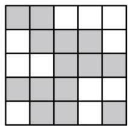

natural_image

Grid pattern with alternating shaded and unshaded squares (no text or symbols)

图1

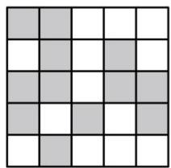

natural_image

Grid pattern with alternating shaded and white squares (no text or symbols)

图2

A. 2410252110

B. 2010272108

C. 2212272408

D. 2410272108

【答案】D

【分析】本题考查了含有乘方的有理数的混合运算，理解题意，掌握有理数的混合法则是解题的关键。根据题意，分别表示每行的二进制编码，再转换成10进制进行判定即可。

【详解】解：黑色代表1，白色代表0，

∴图2中，第一行11000，转换成10进制数为： $1 \times 2^{4} + 1 \times 2^{3} + 0 \times 2^{2} + 0 \times 2^{1} + 0 \times 1 = 24$

第二行01010，转换成10进制数为： $0 \times 2^{4} + 1 \times 2^{3} + 0 \times 2^{2} + 1 \times 2^{1} + 0 \times 1 = 10$ ，

第三行11011，转换成10进制数为： $1 \times 2^{4} + 1 \times 2^{3} + 0 \times 2^{2} + 1 \times 2^{1} + 1 \times 1 = 27$ ，

第四行10101，转换成10进制数为： $1 \times 2^{4} + 0 \times 2^{3} + 1 \times 2^{2} + 0 \times 2^{1} + 1 \times 1 = 21$ ，

第五行01000，转换成10进制数为： $0 \times 2^{4} + 1 \times 2^{3} + 0 \times 2^{2} + 0 \times 2^{1} + 0 \times 1 = 8$ ，

∴小张的准考证号为2410272108,

故选：D.

【变式 7-1】（24-25 七年级上·四川成都·期末）某校一幢教学楼共有 5 层，相邻两层之间楼梯的台阶均为 18 级，从 1 层到 5 层参加舞蹈社团的学生人数分别为 9，7，5，5，6．若在某层楼确定活动地点，能使所有参加舞蹈社团的同学到活动地点所经过的台阶数之和最小，则台阶数之和最小为\_\_\_\_级.

【答案】756

【分析】本题考查了有理数加法的应用，理解题意是解题的关键．先分别求出每一层楼层的台阶的级数的和，然后比较即可.

【详解】解：如果舞蹈社团在 1 层活动，则所有参加舞蹈社团的同学到活动地点所经过的台阶数之和为 $7 \times 18 + 5 \times 18 \times 2 + 5 \times 18 \times 3 + 6 \times 18 \times 4 = 1008$ （级）；

如果舞蹈社团在 2 层活动，则所有参加舞蹈社团的同学到活动地点所经过的台阶数之和为 $9 \times 18 + 5 \times 18 + 5 \times 18 \times 2 + 6 \times 18 \times 3 = 756$ （级）；

如果舞蹈社团在 3 层活动，则所有参加舞蹈社团的同学到活动地点所经过的台阶数之和为

$9 \times 18 \times 2 + 7 \times 18 + 5 \times 18 + 6 \times 18 \times 2 = 756$ （级）；

如果舞蹈社团在4层活动，则所有参加舞蹈社团的同学到活动地点所经过的台阶数之和为

$9 \times 18 \times 3 + 7 \times 18 \times 2 + 5 \times 18 + 6 \times 18 = 936$ （级）：

如果舞蹈社团在5层活动，则所有参加舞蹈社团的同学到活动地点所经过的台阶数之和为

$9 \times 18 \times 4 + 7 \times 18 \times 3 + 5 \times 18 \times 2 + 5 \times 18 = 1296$ （级）：

∵1296>1008>936>756,

∴所有参加舞蹈社团的同学到活动地点所经过的台阶数之和最小为756级，

故答案为：756.

【变式 7-2】（24-25 七年级下·重庆沙坪坝·期末）2025 重庆沙坪坝全球校友半程马拉松现场氛围热烈．某学校 9 人组成的啦啦队在站点表演三个助威节目，候场时间为从首个节目开始至参演节目开始前的时间间隔（不考虑换场等因素），各节目参与人数及表演时长（单位：min）如下表所示：

<table><tr><td>节目</td><td>甲</td><td>乙</td><td>丙</td></tr><tr><td>人数</td><td>3</td><td>4</td><td>2</td></tr><tr><td>时长</td><td>6</td><td>4</td><td>2</td></tr></table>

若节目按丙→乙→甲的顺序表演，则9位学生的候场时间之和是（）

A. 6

B. 20

C. 26

D. 44

【答案】C

【分析】本题考查了有理数的混合运算．根据节目表演顺序，计算每个节目的候场时间，再乘以对应人数求和.

【详解】解：确定各节目候场时间：

丙作为第一个节目，候场时间为0分钟（无需等待）：

乙作为第二个节目，需等待丙表演结束，候场时间为丙的时长2分钟；

甲作为第三个节目，需等待丙和乙表演结束，候场时间为丙时长+乙时长=2+4=6分钟：

计算各节目候场时间之和：

丙：2人×0分钟=0；

乙：4人×2分钟=8；

甲：3人×6分钟=18:

总和 = 0 + 8 + 18 = 26;

因此，9位学生的候场时间之和为26，

故选：C.

【变式 7-3】（24-25 七年级上·重庆渝北·期末）正所谓：“人有人言，灯有灯语”。灯语（灯光通信）是船只之间通信的一种通用化语言，在国际上的使用十分广泛。利用灯光，以二进制的原理传递信息，可以帮助船员在较远的目视距离相互沟通。例如：“○”表示亮红灯。“●”表示亮绿灯。两只远洋航行的船只用亮红灯和亮绿灯来进行交流，并在启航前作如图所示的约定：

● 表示字母A;

● ○ 表示字母B;

● ● 表示字母C;

● ○ ○ 表示字母D;

● ○ ● 表示字母E;

● ● ○ 表示字母F;

● ● ● 表示字母G;

● ● ●

根据约定的规则，下列说法正确的有（）

①“●○○○”表示字母 H:

②若要表示26个英文字母，需要6盏灯；

③某船先后发出“●○○●●”、“●●●●”、“●○○●●”表示它遇到了危险，在求救.

A. 0 个

B. 1 个

C. 2 个

D. 3 个

【答案】C

【分析】本题主要考查了有理数混合运算的应用，根据提供提供的信息，先得出●表示二进制中的1，○表示二进制中的0，然后根据二进制转化为十进制的方法，十进制转化为二进制的方法，逐项进行判断即可.

【详解】解：∵●表示字母 A，●○表示字母 B，

∴●表示二进制中的1，○表示二进制中的0，

：“●○○○”表示二进制的数为“1000”，

：“●○○○”表示十进制中的数为：

$$
1 \times 2 ^ {3} + 0 \times 2 ^ {2} + 0 \times 2 ^ {1} + 0 \times 1 = 8,
$$

∵字母表中第8个字母为H,

∴“●○○○”表示字母 H，故①正确；

$$
\because 2 6 \div 2 = 1 3 \dots 0,
$$

$$
1 3 \div 2 = 6 \dots 1,
$$

$$
6 \div 2 = 3 \dots 0,
$$

$$
3 \div 2 = 1 \dots 1,
$$

$$
1 \div 2 = 0 \dots 1,
$$

∴26 用二进制表示为11010，

:要表示26个英文字母，需要5盏灯，故②错误；

“●○○●●”表示二进制数为 10011，

二进制数 10011 表示为十进制数为:

$$
1 \times 2 ^ {4} + 0 \times 2 ^ {3} + 0 \times 2 ^ {2} + 1 \times 2 ^ {1} + 1 \times 1 = 1 9,
$$

第 19 个字母为 S,

∴“●○○●●”表示字母 S，

“●●●●”表示二进制数为1111，

二进制数 1111 表示为十进制数为:

$$
1 \times 2 ^ {3} + 1 \times 2 ^ {2} + 1 \times 2 ^ {1} + 1 \times 1 = 1 5,
$$

第 15 个字母为 O,

∴“●●●●”表示字母 O;

∴某船先后发出“●○○●●”、“●●●●”、“●○○●●”表示“SOS”，

“SOS”表示求救信号，

:某船先后发出“●○○●●”、“●●●●●”、“●○○●●”表示它遇到了危险，在求救，故③正确；

综上分析可知：正确的有2个，

故选：C.

# 【题型8 程序流程图与有理数的计算】

【例 8】（24-25 八年级上·贵州遵义·期末）定义一种对正整数n的“F”运算，①当n为奇数时，结果为 $3n+5$ ；②当n为偶数时，结果为 $\frac{k}{2^{n}}$ （其中k是使 $\frac{k}{2^{n}}$ 为奇数的正整数），并且运算重复进行，例如，取n=26，如图所示；若n=449，则第“F④”的运算的结果是（）

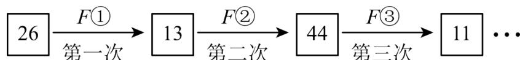

flowchart

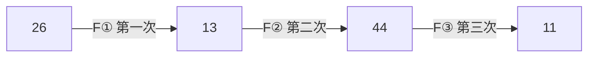

A. 1

B. 3

C. 7

D. 8

【答案】A

【分析】据提供的“F”运算，对正整数 n 分情况(奇数、偶数)循环计算，由于 n = 449 为奇数应先进行 F① 运算，再按照新定义进行计算即可求解．本题主要考查了新定义运算，有理数的混合运算．熟练掌握“F”运算法则，找到结果存在的规律，根据有理数的混合运算求出答案，是解题的关键.

【详解】解： $F①$ ： $3 \times 449 + 5 = 1352$ ，

$F②:\ \frac{1352}{2^{k}},\ 1352\div8=169,\ 即 k=3,$

$F③$ : $3 \times 169 + 5 = 512$ ,

$F④$ ： $512 = 2^{9}$ ，即k = 9，计算结果为1，

故选：A.

【变式 8-1】（24-25 七年级上·辽宁丹东·期中）如图是一个“数值转换机”的示意图，当 $x = -1$ ， $y = -2$ 时，输出的结果是 \_\_\_\_.

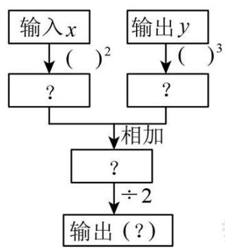

flowchart

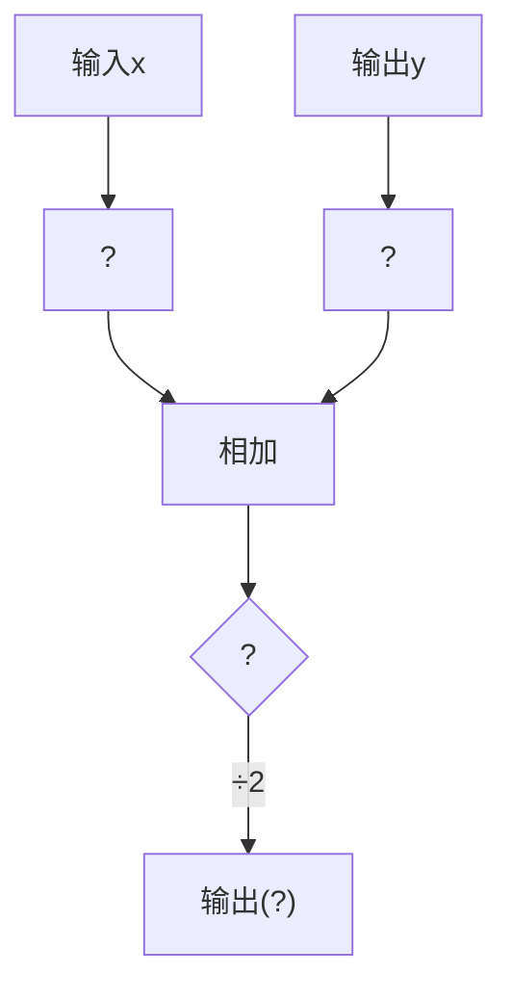

【答案】 $-\frac{7}{2}$

【分析】本题考查了代数式求值的问题，按照数值转换机的计算顺序列出代数式，再把x = -1, y = -2代入计算即可求解.

【详解】解：由示意图可得输出的代数式为： $\frac{x^{2}+y^{3}}{2}$ ,

当x=-1，y=-2时，

$$
{\frac {x ^ {2} + y ^ {3}}{2}} = {\frac {(- 1) ^ {2} + (- 2) ^ {3}}{2}} = - {\frac {7}{2}},
$$

故答案为： $-\frac{7}{2}$ .

【变式 8-2】（24-25 七年级上·陕西西安·期末）如图是小字用计算机设计的一个有理数运算的程序框图．若输入的数a为1，则输出的结果是（）

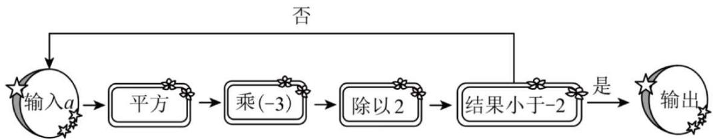

flowchart

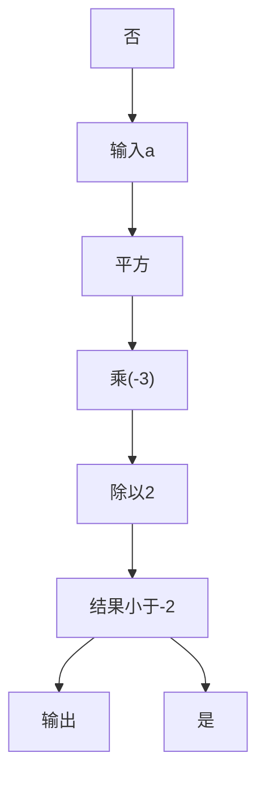

A. $-\frac{3}{2}$

B. $\frac{3}{2}$

C. $-\frac{27}{8}$

D. $\frac{27}{8}$

【答案】C

【分析】本题考查了程序框图与代数式求值、有理数的乘方，理解程序框图的计算过程是解题的关键．由程序框图得，输入数a后的计算过程为 $a^{2}\times(-3)\div2=-\frac{3}{2}a^{2}$ ，再判断结果是否小于-2，是则输出结果，否则再重复一次计算过程，据此即可解答.

【详解】解：由程序框图得，输入数a后的计算过程为 $a^{2}\times(-3)\div2=-\frac{3}{2}a^{2}$ ，再判断结果是否小于-2，是则输出结果，否则再重复一次计算过程.

若输入的数a为1，则计算结果为 $-\frac{3}{2}a^{2}=-\frac{3}{2}$ ,

$$
\because - \frac {3}{2} > - 2,
$$

∴需要再重复一次计算过程，

若输入的数a为 $-\frac{3}{2}$ ，则计算结果为 $-\frac{3}{2}a^{2}=-\frac{3}{2}\times\left(-\frac{3}{2}\right)^{2}=-\frac{27}{8}$

$$
\because - \frac {2 7}{8} <   - 2,
$$

∴ 输出的结果为 $-\frac{27}{8}$ .

故选：C.

【变式 8-3】（24-25 九年级上·重庆江北·期末）对任意正整数 n，若 n 为偶数则除以 2，若 n 为奇数则乘 3 再加 1，在这样一次变化下，我们得到一个新的自然数，在 1937 年 LotharCollatz 提出了一个问题：如此反复这种变换，是否对于所有的正整数，最终都能变换到 1 呢？这就是数学中著名的“考拉兹猜想”。如果某个正整数通过上述变换能变成 1，我们就把第一次变成 1 时所经过的变换次数称为它的路径长，例如 5 经过 5 次变成 1，则路径长 m = 5。下列说法：

①无论输入的正整数 n 是奇数还是偶数，当路径长 $m \geq 4$ 时，总能得到连续四次变换的结果依次是 $2^{4}$ ， $2^{3}$ ， $2^{2}$ ， $2^{1}$ ;  
②若输入正整数 n，变换次数 m，当 m = 8 时，n 的所有可能值只有 4 个；

③若输入正整数 n，变换次数 m，当 m = 9 时，n 的所有可能值中最大是 512，最小是 13.

其中正确的个数是（）

A. 3 个

B. 2 个

C. 1 个

D. 0 个

【答案】B

【分析】本题主要考查有理数的运算，归纳推理的应用，利用变换规则，逆向推理计算求出所有可能的取值，再判断结果即可.

【详解】解：∵对任意正整数 n，若 n 为偶数则除以 2，若 n 为奇数则乘 3 再加 1，在这样一次变化下，我们得到一个新的自然数，

∴由新自然数求原来的数计算方法为：新自然数乘以2，或新自然数减去1的差再除以3（取整数），若输入正整数n，则最后一次计算过程为： $2 \div 2 = 1$ ，上一步结果为 $2 = 2^{1}$ ;

倒数第二次计算过程为： $4 \div 2 = 2$ ，上一步结果为 $4 = 2^{2}$ ;

倒数第三次计算过程为： $8 \div 2 = 4$ ，上一步结果为 $8 = 2^{3}$ ;

倒数第四次计算过程为： $16 \div 2 = 8$ ，上一步结果为 $16 = 2^{4}$ ;

倒数第五次计算过程为： $32 \div 2 = 16$ ，或 $3 \times 5 + 1 = 16$ ，上一步结果为32或5；

倒数第六计算过程为： $64 \div 2 = 32$ ，或 $10 \div 2 = 5$ ，上一步结果为64或10；

倒数第七次计算过程为： $128 \div 2 = 64$ ，或 $3 \times 21 + 1 = 64$ ，或 $20 \div 2 = 10$ ，或 $3 \times 3 + 1 = 10$ ，上一步结果为128或21或20或3；

倒数第八次计算过程为： $256 \div 2 = 128$ ，或 $42 \div 2 = 21$ ，或 $40 \div 2 = 20$ ，或 $6 \div 2 = 3$ ，上一步结果为256或42或40或6；

倒数第九次计算过程为： $512 \div 2 = 256$ ，或 $3 \times 85 + 1 = 256$ ，或 $84 \div 2 = 42$ ，或 $80 \div 2 = 40$ ，或 $3 \times 13 + 1 = 40$ ，或 $12 \div 2 = 6$ ，上一步结果为 512 或 85 或 84 或 80 或 13 或 12；

∴①无论输入的正整数 n 是奇数还是偶数，当路径长 $m \geq 4$ 时，总能得到连续四次变换的结果依次是 $2^{4}$ ， $2^{3}$ ， $2^{2}$ ， $2^{1}$ ，说法正确；

②若输入正整数 n，变换次数 m，当 m = 8 时，n 的所有可能值为 256 或 42 或 40 或 6，只有 4 个，说法正确；

③若输入正整数 n，变换次数 m，当 m = 9 时，n 的所有可能值为 512 或 85 或 84 或 80 或 13 或 12，其中最大是 512，最小是 12，说法错误；

∴正确的个数是2个，

故选：B.

# 【题型9 计算“24”点】

【例 9】（24-25 七年级上·四川成都·期末）24 点游戏是一种益智游戏，24 点是把 4 个整数（一般是正整数）通过加、减、乘、除或乘方等运算（可以使用括号），使最后的计算结果是 ±24 的一个数学游戏（每个数字均使用 1 次）。写出 1, 2, 2, 3 的 24 点游戏的一种计算式\_\_\_\_。

【答案】 $(2 + 3)^{2} - 1$

【分析】本题主要考查有理数的混合运算．熟练掌握有理数的混合运算是解题的关键．根据有理数的混合运算可进行求解.

【详解】解： $(2+3)^{2}-1$ .

故答案为: $(2 + 3)^{2} - 1$ .

【变式 9-1】（24-25 七年级上·广东佛山·期末）游戏“24点”规则如下：从一副扑克牌（去掉大王、小王）中任意抽取4张，根据牌面上的数字进行混合运算（每张牌必须用一次且只能用一次），使得运算结果为24，其中红色（方块、红桃）扑克牌代表负数，黑色（梅花、黑桃）扑克牌代表正数。请用如图抽取出的4张牌，写出一个符合规则的算式：\_\_\_\_。

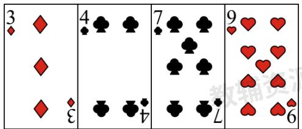

text_image

3
◆ ◆
◆ ◆
◆ ◆
4
♣
♣
♣
♣
♣
♣
♣
♣
♣
♣
♣
♣
♣
♣
♣
♣
♣
♣
♣
♣
♣
♣
♣
♣
♣
♣
♣
♣
♣
♣
♣
♣
♣
♣
♣
♣
♣
♣
♣
♣
♣
♣
♣
♣
♣
♣
♣
♣
♣
♣
♥
♥
♥
♥
♥
♥
♥
♥
♥
♥
♥
♥
♥
♥
♥
♥
♥
♥

【答案】 $[7 + (-9)]\times (-3)\times 4$ 或 $(-3)\times (-9) - (7 - 4)$ 或 $(-3)\times (-9) - 7 + 4$ （答案不唯一，任选一个）

【分析】本题考查了有理数的混合运算，根据有理数的运算法则列式即可，掌握有理数的运算法则是解题的关键.

【详解】解：符合规则的算式为 $[7 + (-9)] \times (-3) \times 4$ 或 $(-3) \times (-9) - (7 - 4)$ 或 $(-3) \times (-9) - 7 + 4$ 故答案为： $[7 + (-9)] \times (-3) \times 4$ 或 $(-3) \times (-9) - (7 - 4)$ 或 $(-3) \times (-9) - 7 + 4$ .

【变式 9-2】（23-24 六年级上·山东威海·期末）有一种“二十四点”游戏，其游戏规则是：任取 1 至 13 之间的四个自然数，将这四个数（每个数用且只用一次，可以加括号）进行有理数混合运算，使其结果等于 24．现有四个有理数 1,2,2,3，请仿照“二十四点”游戏规则写出一个算式\_\_\_\_，使其结果等于 24.

【答案】 $(1 + 2)\times 2^{3}$ （答案不唯一）

【分析】本题考查的是含乘方的有理数的混合运算，利用混合运算的特点构建 $24 = (1 + 2) \times 2^3$ 是解本题的关键.

【详解】解：∵24 = 3 × 8，

∴这个算式为： $(1+2)\times2^{3}$ ,

故答案为： $(1 + 2)\times 2^{3}$

【变式 9-3】“24 点”游戏规则是：从一副牌中（去掉大、小王）任意抽取 4 张牌，用上面的数字进行混合运算，使结果为 24 或—24。其中红色代表负数，黑色代表正数，A, J, Q, K 分别代表 1, 11, 12, 13，例如张毅同学抽取的 4 张牌分别为红桃 4、红桃 3、梅花 6、黑桃 2，于是张毅同学列出的算式为 $(-4) \times (-3 - 6 \div 2) = 24$ ，现在张毅同学想挑战“36 点”，将这四张牌中的任意一张换成其它牌，使结果为 36 或—36，下列方法可行的有几种：①将红桃 4 换成黑桃 6；②将红桃 3 换成红桃 6；③将梅花 6 换成黑桃 Q；④将黑桃 2 换成黑桃 A（）

A. 1 种

B. 2 种

C. 3 种

D. 4 种

【答案】D

【分析】根据有理数的四则混合计算法则求解即可.

【详解】解：①这四个数分别为6、-3、6、2，

$$
\because 6 \times 6 \times (- 3 + 2) = - 3 6,
$$

∴①符合题意；

②这四个数分别为-4、-6、6、2，

$$
\because (- 4) \times (- 6) + 6 \times 2 = 3 6,
$$

∴②符合题意；

③这四个数分别为-4、-3、12、2，

$$
\because (- 4) \times (- 3) + 1 2 \times 2 = 3 6,
$$

∴③符合题意;

④这四个数分别为-4、-3、6、1，

$$
\because (- 4) \times (- 3 - 6 \div 1) = 3 6,
$$

∴④符合题意；

故选 D.

【点睛】本题主要考查了有理数的四则混合运算，熟知相关计算法则是解题的关键.

# 【题型10 乘方中的规律探究】

【例 10】（24-25 七年级上·河南商丘·期末）为了求 $1+2+2^{2}+2^{3}+\cdots+2^{20}$ 的值，可令 $A=1+2+2^{2}+2^{3}+\cdots+2^{20}$ ，则 $2A=2+2^{2}+2^{3}+2^{4}+\cdots+2^{21}$ ，因此 $A=2A-A=2^{21}-1$ ，所以 $1+2+2^{2}+2^{3}+\cdots+2^{20}=2^{21}-1$ 。仿照以上推理，计算 $1+7+7^{2}+7^{3}+\cdots+7^{2025}$ 的结果为（）

A. $7^{2025} - 1$

B. $7^{2026}-1$

C. $\frac{7^{2025}-1}{6}$

D. $\frac{7^{2026}-1}{6}$

【答案】D

【分析】本题考查了数字的变化规律，有理数的混合运算，解答的关键是理解清楚题中的解答方式并运用．根据题意设 $S=1+7+7^{2}+7^{3}+\cdots+7^{2025}$ ，则 $7S=7+7^{2}+7^{3}+\cdots+7^{2026}$ ，相减即可得出答案.

【详解】解：设 $S=1+7+7^{2}+7^{3}+\cdots+7^{2025}$ ，

则 $7S = 7 + 7^{2} + 7^{3} + \cdots + 7^{2026}$ ,

因此7S-S=7 $^{2026}$ -1,

所以 $S=\frac{7^{2026}-1}{6}$ .

故选：D.

【变式 10-1】（24-25 七年级下·福建漳州·期中）我们规定一个新数“i”，一切有理数可以与新数进行四则运算，且原有的运算律和运算法则仍然成立， $i^{1}=i,i^{2}=-1,i^{3}=i^{2}\cdot i=-i,i^{4}=i^{2}\cdot i^{2}=-1\times(-1)=1$ ，那么 $i^{1}+i^{2}+i^{3}+\cdots+i^{2024}+i^{2025}=$ \_\_\_\_.

【答案】i

【分析】本题主要考查了数字变化的规律，利用新定义的规定，从第一个数开始，每4个数的和为0，则 $i^{1}+i^{2}+i^{3}+\cdots+i^{2024}=506\times0=0$ ，再利用幂的乘方与积的乘方法则运算即可.

【详解】解：∵ $i^{1}=i,i^{2}=-1,i^{3}=i^{2}\cdot i=-i,i^{4}=i^{2}\cdot i^{2}=-1\times(-1)=1$

$$
\therefore i ^ {1} + i ^ {2} + i ^ {3} + i ^ {4} = 0,
$$

$$
\therefore i ^ {5} + i ^ {6} + i ^ {7} + i ^ {8} = i ^ {4} (i ^ {1} + i ^ {2} + i ^ {3} + i ^ {4}) = 0,
$$

$$
\because 2 0 2 4 \div 4 = 5 0 6,
$$

$$
\therefore i ^ {1} + i ^ {2} + i ^ {3} + \dots + i ^ {2 0 2 4} = 5 0 6 \times 0 = 0,
$$

$$
\because i ^ {2 0 2 5} = i \cdot i ^ {2 0 2 4} = i \cdot (i ^ {4}) ^ {5 0 6} = i \times 1 ^ {5 0 6} = i,
$$

$$
\therefore i ^ {1} + i ^ {2} + i ^ {3} + \dots + i ^ {2 0 2 4} + i ^ {2 0 2 5} = 0 + i = i,
$$

故答案为：i.

【变式 10-2】（24-25 七年级上·广东广州·期中）观察下图三行数：

$$
- 2, 4, - 8, 1 6, - 3 2, 6 4, \dots ; \tag {①}
$$

$$
0, 6, - 6, 1 8, - 3 0, 6 6, \dots ; \tag {②}
$$

$$
- 1, 2, - 4, 8, - 1 6, 3 2, \dots ; \tag {③}
$$

取每行数的第9个数，这三个数的和为\_\_\_\_；

【答案】-1278

【分析】本题考查数字的变化类，根据题目中的数据，可以发现第一行数字的变化特点，从而可以写出第 n 个数的式子，同理可以发现第二行的数字就是第一行对应的数字加上 2，第三行数字的特点就是第一行对应的数字除以 2，然后即可得到每行的第 9 个数字，再作和即可解答本题.

【详解】解：由题目中的数据可得，

第一行数据的第 n 个数是 $(-2)^{n}$ ,

第二行数据的第 n 个数是 $(-2)^{n} + 2$ ,

第三行数据的第 n 个数是 $\frac{(-2)^{n}}{2}$ ,

故第一行的第9个数是 $(-2)^{9}$ ，第二行数据的第9个数是 $(-2)^{9}+2$ ，第三行数据的第9个数是 $\frac{(-2)^{9}}{2}=-2^{8}$ ，

$$
\begin{array}{l} (- 2) ^ {9} + (- 2) ^ {9} + 2 - 2 ^ {8} \\ = - 5 1 2 - 5 1 2 + 2 - 2 5 6 \\ = - 1 2 7 8, \\ \end{array}
$$

故答案为：-1278.

【变式 10-3】（22-23 七年级上·湖北武汉·期中）计算机利用的是二进制数，它共有两个数码 0，1，将一个十进制数转化为二进制，只需把该数写出若干 $2^{n}$ 数的和，依次写出 1 或 0 即可。如 $19_{(10)} = 16 + 2 + 1 = 1 \times 2^{4} + 0 \times 2^{3} + 0 \times 2^{2} + 1 \times 2^{1} + 1 = 10011_{(2)}$ 为二进制下的五位数，则十进制2022是二进制下的（）

A. 10 位数

B. 11位数

C. 12 位数

D. 13位数

【答案】B

【分析】根据题意， $2^{10}=1024$ ， $2^{11}=2048$ ，根据规律可知最高位应是 $1\times2^{10}$ ，故可求共有11位数.

【详解】解： $\because 2^{11} = 2048, 2^{10} = 1024, 1024 < 2022 < 2048$

∴最高位应是 $1 \times 2^{10}$ ,

故共有 $10+1=11$ 位数.

故选 B

【点睛】本题考查了有理数的混合运算，此题只需分析是几位数，所以只需估计最高位是乘以2的几次方即可分析出共有几位数，此题也可以用除以2取余的方法写出对应的二进制的数.