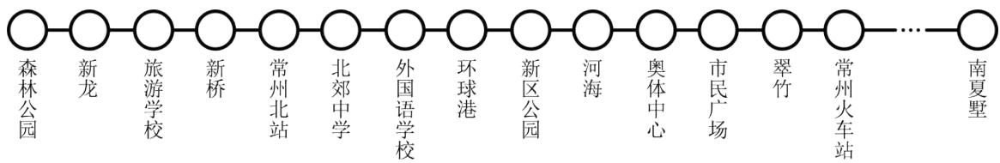

# 专题 2.7 科学记数法、近似数（举一反三讲义）

# 【北师大版 2024】

# 题型归纳

【题型1 用科学记数法表示数】....1  
【题型 2 将用科学记数法表示的数变回原数】....2  
【题型 3 与科学记数法有关的计算】....2  
【题型 4 科学记数法的应用】....3  
【题型 5 四舍五入法取近似数】....4  
【题型6 由近似数推断原数】....4  
【题型 7 科学记数法与近似数的综合】....4

# 举一反三

# 知识点1 科学记数法

把一个大于 10 的数表示成 $a \times 10^{n}$ 的形式（其中 a 大于或等于 1 且小于 10，n 是正整数），这种记数方法叫作科学记数法．对于小于 -10 的数也可以类似表示．例如 $-370000 = -3.7 \times 10^{5}$ ．

# 知识点 2 近似数 教辅资源，关注公众号★全科AA+

1. 接近实际数值的数，叫作近似数.  
2. 近似数与准确数的接近程度，我们用精确度来表示.  
3. 一般地, 一个近似数四舍五人到哪一位, 就说这个数精确到哪一位. 例如 $\pi \approx 3.14$ (精确到 0.01, 或叫作精确到百分位).

# 【题型1 用科学记数法表示数】

【例 1】（24-25 九年级下·江西抚州·阶段练习）江西省发布 2024 年 10 件民生实事，在支持重点群体就业创业方面，调整完善创业担保贷款政策，全年增加安排担保基金 6000 万元．将 6000 万用科学记数法表示为（）

A. $0.6 \times 10^{8}$

B. $6 \times 10^{7}$

C. $6 \times 10^{3}$

D. $6 \times 10^{6}$

【变式 1-1】（24-25 六年级下·黑龙江大庆·期中）我国国土面积 9600000 平方千米，这个数字用科学记数法表示应记作\_\_\_\_。

【变式 1-2】（24-25 九年级下·宁夏吴忠·期中）在 2025 年初的科技界，一款名为 DeepSeek 的人工智能应用程序异军突起，引发了全球用户的热烈关注。这款应用于1月11日正式上线，仅仅数周时间就迎来了破亿的下载量，显示了其强大的市场吸引力。根据数据分析，自发布至2月9日，DeepSeek的累计下载量已突破1.1亿。将数据1.1亿用科学记数法表示为（）

A. $0.11 \times 10^{9}$

B. $1.1 \times 10^{8}$

C. $1.1 \times 10^{7}$

D. $11 \times 10^{7}$

【变式 1-3】（24-25 七年级上·上海闵行·期中）当我们购买硬盘时，制造商通常采用十进制单位标注产品容量．数据的存储单位一般用KB、MB、GB、TB……来表示，其中 $1MB = 2^{10}KB$ ， $1GB = 2^{10}MB$ ．一个硬盘的容量是900GB，可用科学记数法表示为\_\_\_\_MB.

# 【题型 2 将用科学记数法表示的数变回原数】教辅资源，关注 公众号★全科AA+

【例 2】（24-25 七年级上·贵州·期末）下列四个数中，值最大的是（）

A. $8.2 \times 10^{3}$

B. $2.8 \times 10^{3}$

C. $8.2 \times 10^{2}$

D. $2.8 \times 10^{2}$

【变式 2-1】（2024 七年级上·全国·专题练习）今年“五一”假期，湖南省文旅市场持续升温，文旅经济强劲复苏。根据全省十四个市州综合测算情况汇总，今年“五一”假期全省共接待游客 $1.7871 \times 10^{7}$ 人次，同口径比去年“五一”假期增长了114.61%，数据 $1.7871 \times 10^{7}$ 的位数是（）

A. 6

B. 7

C. 8

D. 9

【变式 2-2】（2025·江苏扬州·中考真题）2025 年 3 月 30 日，扬州鉴真半程马拉松暨大运河马拉松系列赛在市民中心广场鸣枪开跑，约 30000 名跑者用脚步丈量千年古城，用拼搏诠释无限热爱．将数据 30000 用科学记数法表示为\_\_\_\_．

【变式 2-3】（24-25 七年级上·河南开封·阶段练习）小华在做练习题时，不小心把墨水洒在了习题上，如图所示，他翻看答案后得知本题的正确答案选 B，则原数中数字“3”后“0”的个数为（）

长江是世界第三长河，也是亚洲最长的河流，全长约63米，将63用科学记数法表示为（）

A. $63 \times 10^{5}$

B. $6.3 \times 10^{6}$

C. $0.63 \times 10^{7}$

D. $6.3 \times 10^{7}$

A. 3 个

B. 4 个

C. 5 个

D. 6 个

# 【题型3 与科学记数法有关的计算】

【例 3】（2025·北京·中考真题）2025 年 5 月 29 日，行星探测工程天问二号探测器在西昌卫星发射中心成功发射，开启对近地小行星 2016HO3 的探测与采样返回之旅。已知该小行星与地球的最近距离约为月球远地点距离的 45 倍，月球远地点距离约为 $4 \times 10^{5} \mathrm{~km}$ ，则该小行星与地球的最近距离约为（）

A. $1.8 \times 10^{5}$ km

B. $1.8 \times 10^{6}$ km

C. $1.8 \times 10^{7}$ km

D. $1.8 \times 10^{10} \mathrm{~km}$

【变式 3-1】（24-25 七年级上·上海普陀·期中）已知太阳到地球的距离约为 $1.5 \times 10^{8}$ 千米，光速约为 $3 \times 10^{5}$ 千米/秒，那么光从太阳照到地球大约需要\_\_\_\_秒。（结果用科学记数法表示）

【变式 3-2】（2025·湖南长沙·模拟预测）在一次“节约用水，保护水资源”的活动中，学校提倡每人每天节约0.1升水，如果该市约有5万学生，估计该市全体学生一年的节水量为\_\_\_\_升。

【变式 3-3】（24-25 七年级下·山东聊城·期中）水由水分子组成，1g水中约有 $3.34 \times 10^{22}$ 个水分子，则2kg 水中有（）个水分子.

A. $0.668 \times 10^{26}$

B. $6.68 \times 10^{25}$

C. $66.8 \times 10^{24}$

D. $668 \times 10^{23}$

【题型 4 科学记数法的应用】教辅资源，关注公众号★全科 AA+

【例 4】（24-25 七年级上·江苏常州·期中）作为城市高质量发展“大动脉”的常州地铁，近年来为城市发展和居民生活提供了高效便捷的公共交通服务。其中 1 号线是常州市第一条开工建设的地铁线路，于 2019 年 9 月 21 日开通运营，这条线路呈南北走向，北起新北区森林公园站，途经天宁区，南至武进区南夏墅站。如图为 1 号线串联的部分站点。据统计，2024 年 10 月 1 日至 7 日，常州地铁 1 号线客流量达 135.13 万人次。

flowchart

(1)若135.13万人次用科学记数法表示为 $1.3513 \times 10^{n}$ 人次，则n = \_\_\_\_.  
(2)某天, 小红同学从环球港站开始乘坐地铁 1 号线, 在地铁各站点做志愿者服务, 到 $A$ 站下车时, 本次志愿者服务活动结束, 约定向南夏墅站方向为正, 当天的乘车记录如下 (单位: 站):

$$
+ 5, - 2, - 6, + 8, + 3, - 4, - 9, + 8.
$$

①请通过计算说明 A 站是哪一站？  
②若相邻两站之间的平均距离为1.2千米，求这次小红志愿服务期间乘坐地铁行进的路程是多少千米？

【变式 4-1】（2024 七年级上·全国·专题练习）已知 $1 \mathrm{~cm}^{3}$ 的氢气质量约为 $0.00009 \mathrm{~g}$ ，请用科学记数法表示下列计算结果：

(1)求一个容积为 $8000000cm^{3}$ 的氢气球所充氢气的质量;  
(2)一块橡皮重18g，这块橡皮的质量是 $1cm^{3}$ 的氢气质量的多少倍？

【变式 4-2】（2024 七年级上·云南·专题练习）“一粥一饭当思来处不易”，勤俭节约是中华民族的传统美德，一粒大米虽然微不足道，但聚少成多，数量大了也是非常可观的。为了让同学们体会到节约爱护每一粒粮食的重要性，老师组织同学们进行了实际测算，称得 500 粒大米重约 10 克。

(1)一粒大米重约多少克?

(2)按 14 亿人口，每年 365 天，每人每天三餐计算，若每人每餐节约一粒大米，则一年大约能节约大米多少千克（用科学记数法表示）？  
(3)若把（2）中节约的大米卖成钱，按5元/千克计算，则大约可卖得多少元（用科学记数法表示）？

【变式 4-3】（24-25 七年级上·黑龙江·课后作业）有关资料表明，一个人在一次刷牙过程中如果一直打开水龙头，将浪费大约 8 杯水（每杯水约 0.25 升）。某地区总人口约 2000000 人，如果该地区所有的人在刷牙过程中都不关水龙头，那么一次刷牙过程共浪费多少杯水？约多少升？（用科学记数法表示）

【题型 5 四舍五入法取近似数】教辅资源，关注公众号★全科A A+

【例 5】（24-25 七年级上·河南洛阳·期末）下列说法正确的是（）

A. 数2.9951精确到千分位是3.00   
B. 将数60340精确到千位是 $6.0 \times 10^{4}$   
C. 按科学记数法表示的数 $6.05 \times 10^{5}$ , 其原数是60500  
D. 近似数8.1750精确到0.001

【变式 5-1】（24-25 八年级上·江苏连云港·期末）把 1598000 精确到万位，其结果正确的是（）

A. $1.60 \times 10^{6}$

B. $1.598 \times 10^{6}$

C. $2 \times 10^{6}$

D. $1.59 \times 10^{6}$

【变式 5-2】（24-25 七年级上·安徽淮北·期末）近似数 $5.08 \times 10^{3}$ 精确到\_\_\_\_位.

【变式 5-3】（24-25 七年级下·江苏苏州·期末）把圆周率3.1415926...精确到0.001，其近似值为\_\_\_\_。

# 【题型6 由近似数推断原数】

【例 6】（24-25 七年级上·河南驻马店·期末）近似数 1.50 是由数 a 四舍五入得到的，那么数 a 的取值范围是（）

A. $1.45 < a < 1.55$

B. $1.45 \leq a < 1.55$

C. $1.495 \leq a < 1.505$

D. 1.495 < a < 1.505

【变式 6-1】实数a用四舍五入法得到的近似数 64.0 精确到 \_\_\_\_ 位，实数a的范围是 \_\_\_\_.

【变式 6-2】（24-25 七年级上·浙江宁波·开学考试）如果一个数用“四舍五入法”求近似数为 4 万，那么这个数最大是\_\_\_\_。

【变式 6-3】一个三位小数保留两位小数约是 5.43，这个三位小数的最大值与最小值的差是 \_\_\_\_.

# 【题型7 科学记数法与近似数的综合】

【例 7】（24-25 八年级上·江苏无锡·期末）2024 年 11 月 10 日 7 时 30 分，雅迪 2024 锡山宛山湖马拉松在映月湖畔鸣枪开跑。据统计，本赛事总计 51717 人报名。用科学记数法将 51717 精确到千位的近似数是 \_\_\_\_.

教辅资源，关注公众号★全科AA+

【变式 7-1】（24-25 七年级上·河南南阳·期末）神舟十八号载人飞船是中国载人航天工程发射的第十八艘载人飞船，于 2024 年 4 月 25 日 20 时 58 分 57 秒在酒泉卫星发射中心发射，取得圆满成功．截至目前，有关神舟十八号的相关浏览次数已高达 626891 次，将 626891 精确到万位并用科学记数法表示的结果为\_\_\_\_.

【变式 7-2】（24-25 七年级上·安徽合肥·期中）《红楼梦》是我国古代四大名著之一，全书共 731017 个字，把这个数改写成精确到万位的近似数是\_\_\_\_。（用科学记数法表示）

【变式 7-3】（24-25 八年级上·江苏无锡·期末）无锡经济开发区 2024 年秋学期新开学校 8 所，新校总投资 26.5 亿元，总建筑面积 36.6 万平方米，新增 14880 个学位．将数据 14880 用四舍五入法精确到 1000，所得近似数用科学记数法表示为\_\_\_\_．