# 专题 3.1 代数式（举一反三讲义）

【北师大版 2024】

# 题型归纳

【题型 1 用字母表示运算或数量关系】....2

【题型 2 识别代数式】....2

【题型3 代数式的书写方法】....3

【题型4 代数式的意义】....3

【题型 5 列代数式】....4

【题型 6 已知字母的值求代数式的值】....5

【题型 7 已知式子的值求代数式的值】....5

【题型8 程序流程图中求代数式的值】....5

【题型 9 规律型：数字的变化类】....6

【题型 10 规律型：图形的变化类】....7

# 举一反三

教辅资源，关注公众号★全科AA+

# 知识点 1 用含字母的式子表示数

用字母或含有字母的式子表示数和数量关系，为我们今后的学习和研究带来了极大的方便.

用含字母的式子表示数的书写规则:

（1）字母与字母相乘时，“×”号通常省略不写或写成“·”；  
(2) 字母与数相乘时, 数通常写在字母的前面;   
(3) 带分数与字母相乘时, 通常化带分数为假分数;   
(4) 字母与字母相除时, 要写成分数的形式.  
（5）当式子为几个数的和或差的形式，且结果带单位时，式子整体加括号.

# 知识点 2 代数式的概念

用运算符号把数或表示数的字母连接起来的式子叫作代数式．单独的一个数或字母也是代数式．例如：0，a都是代数式.

# 知识点 3 代数式的意义

根据生活实际将给定的代数式的意义用语言叙述出来，就是将代数式的字母及运算符号赋予具体的含义.

# 知识点4 列代数式

把简单的与数量有关的词语用代数式表示出来叫作列代数式. 例如: 用代数式表示: $a$ 与 $a$ 减去 $b$ 的差的商, 其中运算词 “差” 表示的数量关系是 $\underline{a}$ 减去 $\underline{b}$ , 列成式子为 $\underline{a-b}$ ; 运算词 “商” 表示的数量关系是 $\underline{a}$ 除以 “差”, 即 $\frac{a}{a-b}$ (填完整的代数式).

# 知识点5 代数式的值的概念

用数值代替代数式中的字母，按照代数式中的运算关系计算得出的结果，叫作代数式的值．这个过程叫作求代数式的值．例如：当x=-5时，代数式 $(x+2)^{2}=(-5+2)^{2}=(-3)^{2}=9$ ，那么9就是当x=-5时，代数式 $(x+2)^{2}$ 的值．

# 知识点6 求代数式的值的步骤

求代数式的值有代入和计算两步.

第一步：用数值代替代数式里的字母，简称“代入”。代入时，将相应的字母换成已给定的或已算出来的数值，其他的运算符号、原来的数字及运算顺序都不改变。

第二步: 按照代数式中给出的运算, 计算出结果, 简称 “计算”. 代入的值不同, 最后计算出的结果也可能不同.

# 【题型 1 用字母表示运算或数量关系】

【例 1】一个没有关紧的水龙头一天滴水约 $0.09 \, m^{3}$ ，n 个这样的水龙头一天滴水约 \_\_\_\_ $m^{3}$ .

【变式 1-1】用-a表示的数一定是（）

A. 负数

B. 正数或负数

C. 0 或负数

D. 以上全不对

【变式 1-2】一个两位数，十位上的数字是 5，个位上的数字是 a，则这个两位数是 \_\_\_\_

【变式 1-3】n 是任意整数，我们常用 2n 表示偶数，由此想到奇数可以表示为\_\_\_\_，比 2n 小的最大奇数为\_\_\_\_。

# 【题型2 识别代数式】

【例 2】（24-25 七年级上·河南南阳·期末）在式子n-3、a、1、80%t、S=ab中，代数式的个数有（）

A. 2 个

B. 3 个

C. 4 个

D. 5 个

【变式 2-1】（24-25 六年级上·上海普陀·期末）下列各式中，不是代数式的是（）

A. $x = 1$

B. 5

C. $2a^{2}+1$

D. $x-2y+3$

【变式 2-2】（24-25 七年级上·安徽淮南·期中）下列数与式子：① $2x-y+1$ ② $\frac{1}{a}+\frac{1}{b}$ ③ $2x+1=3$ ④3>2

⑤a ⑥0 其中是代数式的是（填序号）\_\_\_\_。

【变式 2-3】若将代数式中的任意两个字母交换，代数式不变，则称这个代数式为完全对称式．如 $a + b + c$ 就是完全对称式．下列三个代数式：① $(a - b)^{2}$ ；② $ab + bc + ca$ ；③ $a^{2}b + b^{2}c + c^{2}a$ ．其中是完全对称式的是\_\_\_\_．（填写序号）

# 【题型3 代数式的书写方法】

【例 3】下列各式中，符合代数式书写规则的是（）

A. $x \times 5$

B. $\frac{1}{2}xy$

C. mn2

D. $m \div n$

【变式 3-1】进入初中后学习数学，对于代数式书写规范，教材中指出：“在含有字母的式子中如果出现乘号‘×’，通常将乘号写作‘•’或者省略不写”。其实还有一些书写规范，比如，在代数式中如果出现除号“÷”，通常用分数线“—”来取代；数字与字母相乘时，一般数字写在前面，根据以上书写要求，将代数式 $(ac \times 4 - b^{2}) \div 4$ 简写为\_\_\_\_。

【变式 3-2】下列各式：① $1\frac{1}{3}x$ ② $20^{0}/_{0}x$ ③ $4-b\div c$ ④ $\frac{m^{2}-n^{2}}{6}$ ⑤x-y千克，不符合代数式书写要求的是（）

A. 5 个

B. 4 个

C. 3 个

D. 2 个

【变式 3-3】将下列各式按照列代数式的规范要求重新书写：

(1) $a \times 5$ ，应写成\_\_\_\_；  
(2) $S \div t$ 应写成\_\_\_\_;   
(3) $a \times a \times 2 - b \times \frac{1}{3}$ , 应写成\_\_\_\_;   
(4) $1\frac{4}{3}x$ ，应写成\_\_\_\_.

# 【题型 4 代数式的意义】教辅资源，关注公众号★全科 AA+

【例 4】（24-25 七年级上·河北石家庄·期中）甲、乙同学关于“代数式 $2(x+y)$ ”的意义叙述，判断正确的是（）

甲：x的2倍与y的和；

乙：苹果每千克x元，香蕉每千克y元，苹果和香蕉各买2千克的总花费

A. 只有甲的正确

B. 只有乙的正确

C. 甲、乙的都正确

D. 甲、乙的都不正确

【变式 4-1】对于式子“ $m + n$ ”可以赋予实际意义：一个篮球的价格是 m 元，一个足球的价格是 n 元，体育

老师购买一个篮球和一个足球共需要付款 $(m+n)$ 元，请你对式子“2a”赋予一个实际意义：\_\_\_\_。

【变式 4-2】请仔细分析下列赋予 3a 实际意义的例子中不正确的是()

A. 若葡萄的价格是 3 元/千克，则 3a 表示买 a 千克葡萄的金额，  
B. 若 3 和 a 分别表示一个两位数中的十位数字和个位数字，则 3a 表示这个两位数：  
C. 若一个人骑自行车的速度为 $a$ 千米/时, 则 $3 a$ 表示他 3 小时骑行的路程,  
D. 若 $a$ 表示一个等边三角形的边长, 则 $3a$ 表示这个等边三角形的周长.

【变式 4-3】对单项式“0.75m”可以解释为：一件商品原价m元，若按原价的七五折出售，这件商品现在的售价为0.75m元．某超市的苹果价格为39元/斤，则代数式“50-3.9x”可表示的实际意义\_\_\_\_．

# 【题型5 列代数式】

【例 5】若x表示一个两位数，y也表示一个两位数，小明想用x、y来组成一个四位数，且把x放在y的左边，你认为下列表达式中哪一个是正确的（）

A. $yx$

B. $x + y$

C. $100x + y$

D. $100y + x$

【变式 5-1】一台电视机成本价为 a 元，销售价比成本价增加了 25%，因库存积压，所以就按销售价 7 折出售，那么每台的实际售价为 \_\_\_\_ 元.

【变式 5-2】（24-25 八年级下·河北保定·阶段练习）某校组织全体师生 m 人到革命圣地野三坡进行研学活动，租车公司提供的车每辆能乘坐 n 人，宋老师发现除自己外，其他人刚好能将座位坐满，则学校从租车公司共租用车辆（）

A. $\frac{m + 1}{n}$ 辆

B. $\frac{m - 1}{n}$ 辆

C. $\left(\frac{m}{n}+1\right)$ 辆

D. $\left(\frac{m}{n}-1\right)$ 辆

【变式 5-3】（24-25 七年级下·江苏镇江·期中）图为“L”型钢材的截面，要计算其截面面积，下列给出的算式中，错误的是（）

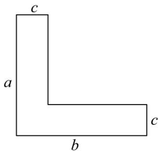

text_image

c
a
b
c

A. $ab-c^{2}$

B. $ac + (b - c)c$

C. $bc + (a - c)c$

D. $ab-(b-c)(a-c)$

# 【题型6 已知字母的值求代数式的值】

【例 6】（24-25 七年级上·全国·随堂练习）已知 a = -2, b = 1, c = -3，求整式 $-a^{2} + b^{2} + c^{2} + 2ab - 2ac$ 的值.

【变式 6-1】（24-25 七年级上·广东东莞·期末）当 a = 8，b = 4 时，代数式 $ab^{2} - \frac{b^{2}}{a}$ 的值为（）

A. 62

B. 63

C. 126

D. 1022

【变式 6-2】（24-25 七年级上·广东江门·阶段练习）如果 $|a|=3,|b|=13$ ，且ab>0，那么a-b的值是（）

A. 10 或 -16

B. 16 或 -16

C. 10 或 -10

D. -10或 16

【变式 6-3】（24-25 七年级上·湖南湘西·阶段练习）已知式子 $\frac{a}{|a|}+\frac{b}{|b|}+\frac{ab}{|ab|}$ 的最大值是 m，最小值是 n，则式子 $9m-n^{2}=$ \_\_\_\_.

# 【题型7 已知式子的值求代数式的值】

【例 7】（24-25 七年级上·河北唐山·阶段练习）若 $x^{2} + 3x$ 的值为 7，则 $3x^{2} + 9x - 2$ 的值为（）

A. 19

B. 24

C. 39

D. 44

【变式 7-1】（24-25 九年级上·云南昆明·阶段练习）若 $x^{2}-3x$ 的值是9.那么代数式 $x^{2}-3x-1$ 的值是\_\_\_\_.

【变式 7-2】（24-25 七年级上·甘肃张掖·期末）已知 a-b = -2，则代数式 $4(a-b)^{2} + a-b$ 的值为 \_\_\_\_.

【变式 7-3】（24-25 七年级上·河北沧州·期末）如图，约定：上方相邻两数之和等于这两数下方箭头共同指向的数，则： $x + y$ 的值为\_\_\_\_.

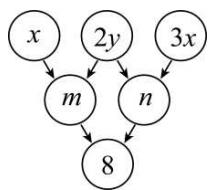

flowchart

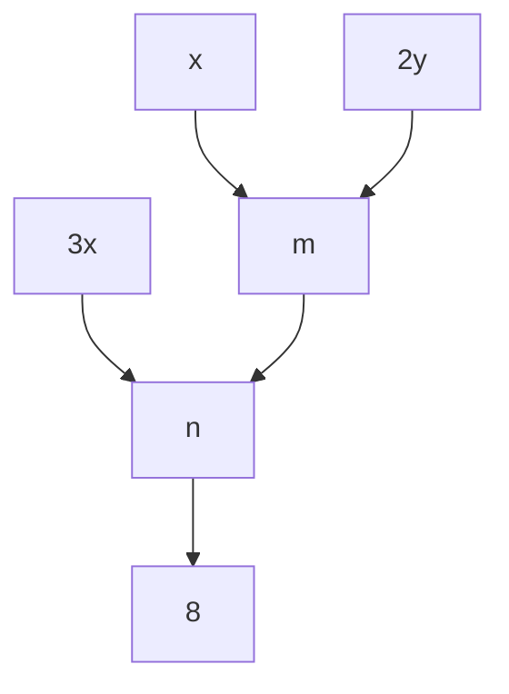

# 【题型 8 程序流程图中求代数式的值】教辅资源，关注公众号★全科AA+

【例 8】（24-25 七年级上·四川达州·期末）有一个数值转换器，原理如图所示，若开始输入 x 的值是 5，可发现第 1 次输出的结果是 16，第 2 次输出的结果是 8，第 3 次输出的结果是 4．依次继续下去，第 2025 次输出的结果是（）

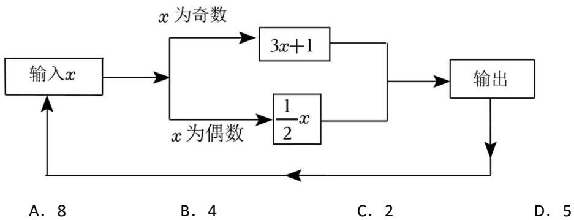

flowchart

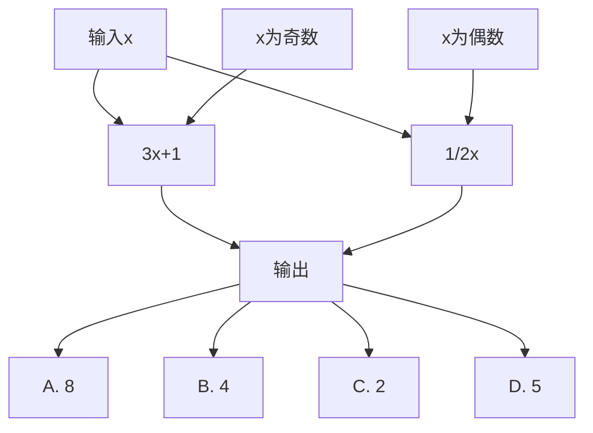

【变式 8-1】（2025·四川达州·二模）如图是一个运算程序示意图，若开始输入x的值为5，则输出y值为\_\_\_\_。

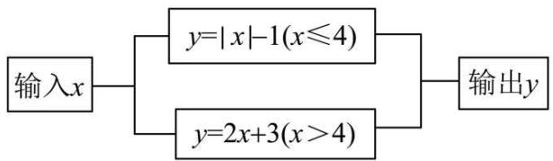

flowchart

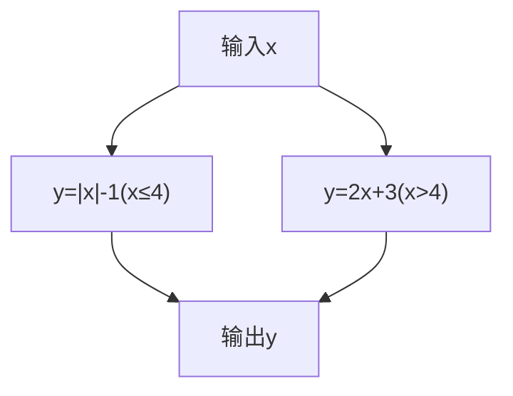

【变式 8-2】（24-25 七年级下·内蒙古乌海·期末）按如图所示的运算程序，能使输出的结果为 18 的是（）

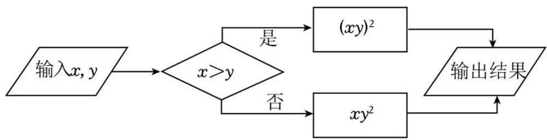

flowchart

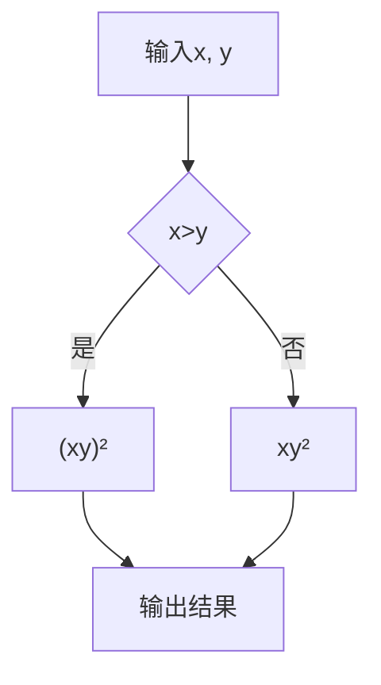

A. $x = 3, y = 2$

B. $x = 2, y = 3$

C. $x = 3, y = -2$

D. $x = 2, y = -3$

【变式 8-3】按如图所示的程序计算，当输入数据 x，y 的值满足 $\left|x+2\right|+\left(3-y\right)^{2}=0$ 时，m 的值为 \_\_\_\_.

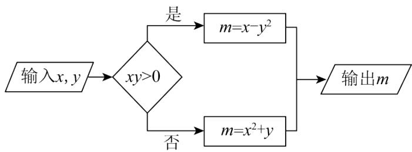

flowchart

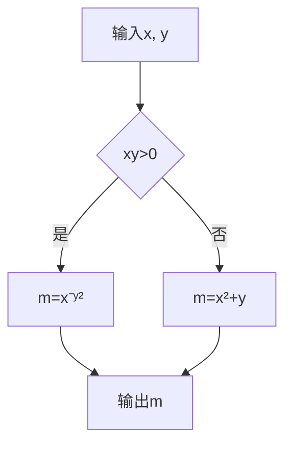

# 【题型 9 规律型：数字的变化类】

【例 9】（2025·云南昆明·模拟预测）按一定规律排列的代数式： $-x+2y,x^{3}+4y,-x^{5}+6y,x^{7}+8y,-x^{9}+10y$ ， $x^{12}+12y,\cdots$ ，第 n 个代数式是（）

A. $(-1)^{n}x^{2n+1}+2ny$

B. $(-1)^{n}x^{2n-1}+2ny$

C. $(-1)^{n+1}x^{2n+1} + ny$

D. $(-1)^{n+1}x^{2n-1}+ny$

【变式 9-1】（24-25 七年级上·全国·期末）观察下列各式：-2，4，-8，16，-32，…根据其中的排列规律，则第 n 个式子为 \_\_\_\_.

【变式 9-2】（24-25 七年级上·甘肃武威·期末）一组按规律排列的式子： $\frac{a^{2}}{3},\frac{-a^{3}}{5},\frac{a^{4}}{7},\frac{-a^{5}}{9},\cdots$ ，则第 2025 个式子

是\_\_\_\_。

【变式 9-3】将偶数按下列方式排成一个三角形数阵，按照此规律，第 10 行第 5 个数是 \_\_\_\_.

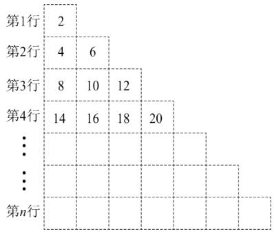

text_image

第1行
2
第2行
4
6
第3行
8
10
12
第4行
14
16
18
20
...
...
第n行

【题型10 规律型：图形的变化类】教辅资源，关注公众号★全科AA+

【例 10】（24-25 九年级下·云南·阶段练习）下列图形都是由同样大小的小圆圈按一定的规律组成，其中，第①个图形中一共有5个小圆圈，第②个图形中一共有7个小圆圈，第③个图形中一共有9个小圆圈……，按此规律，第⑧个图形中小圆圈的个数为（）

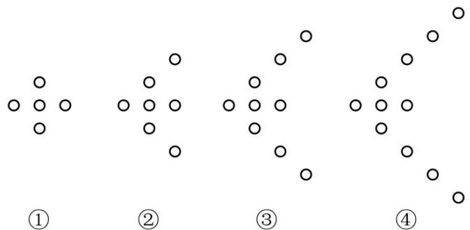

text_image

①
②
③
④

A. 15

B. 17

C. 19

D. 21

【变式 10-1】（24-25 七年级上·甘肃张掖·期末）小明用边长为1cm的小正方形纸片在桌面上摆放成如图所示的塔状图．第n（n是正整数）个塔状图的周长为\_\_\_\_cm（用含n的代数式表示）.

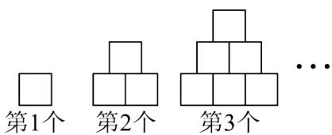

text_image

第1个
第2个
第3个
...

【变式 10-2】（24-25 七年级上·河北石家庄·期中）如图是一组有规律的图案。第 1 个图中有 4 个小黑点。第 2 个图中有 7 个小黑点，第 3 个图中有 12 个小黑点。第 4 个图中有 19 个小黑点。...、按此规律，第 9 个图中有\_\_\_\_个小黑点，第 n 个图中有\_\_\_\_个小黑点。（用含 n 的代数式表示）

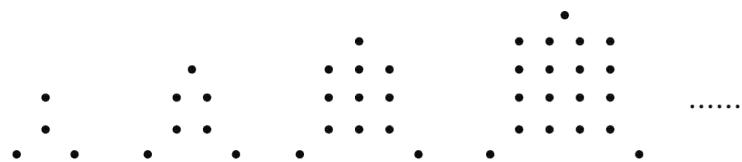

natural_image

Abstract pattern of black dots arranged in a grid-like structure (no text or symbols)

第1个图

第2个图

第3个图

第4个图

第 $n$ 个图

【变式 10-3】（24-25 七年级下·广东梅州·期末）如图，用大小相同的小正方形拼图，第1个图是一个小正方形，第2个图由9个小正方形拼成；第3个图由25个小正方形拼成，依此规律，则第n个图由\_\_\_\_个小正方形拼成.

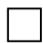

第1个图

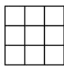

第2个图

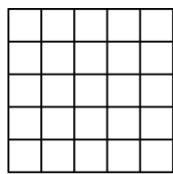

第3个图