# 专题 3.1 代数式（举一反三讲义）

【北师大版 2024】

# 题型归纳

【题型 1 用字母表示运算或数量关系】....2

【题型 2 识别代数式】....3

【题型3 代数式的书写方法】....5

【题型 4 代数式的意义】....7

【题型5 列代数式】....8

【题型 6 已知字母的值求代数式的值】....11

【题型 7 已知式子的值求代数式的值】....12

【题型8 程序流程图中求代数式的值】....14

【题型 9 规律型：数字的变化类】....16

【题型 10 规律型：图形的变化类】....18

# 举一反三

# 知识点 1 用含字母的式子表示数

用字母或含有字母的式子表示数和数量关系，为我们今后的学习和研究带来了极大的方便.

用含字母的式子表示数的书写规则:

（1）字母与字母相乘时，“×”号通常省略不写或写成“·”；  
(2) 字母与数相乘时, 数通常写在字母的前面;   
(3) 带分数与字母相乘时, 通常化带分数为假分数;   
(4) 字母与字母相除时, 要写成分数的形式.  
（5）当式子为几个数的和或差的形式，且结果带单位时，式子整体加括号.

# 知识点 2 代数式的概念

用运算符号把数或表示数的字母连接起来的式子叫作代数式．单独的一个数或字母也是代数式．例如：0，a都是代数式.

# 知识点 3 代数式的意义

根据生活实际将给定的代数式的意义用语言叙述出来，就是将代数式的字母及运算符号赋予具体的含义.

# 知识点 4 列代数式

把简单的与数量有关的词语用代数式表示出来叫作列代数式. 例如: 用代数式表示: $a$ 与 $a$ 减去 $b$ 的差的商, 其中运算词 “差” 表示的数量关系是 $\underline{a}$ 减去 $\underline{b}$ , 列成式子为 $\underline{a-b}$ ; 运算词 “商” 表示的数量关系是 $\underline{a}$ 除以 “差”, 即 $\frac{a}{a-b}$ (填完整的代数式).

# 知识点5 代数式的值的概念

用数值代替代数式中的字母，按照代数式中的运算关系计算得出的结果，叫作代数式的值．这个过程叫作求代数式的值．例如：当x = -5时，代数式 $(x + 2)^{2} = (-5 + 2)^{2} = (-3)^{2} = 9$ ，那么9就是当x = -5时，代数式 $(x + 2)^{2}$ 的值．

# 知识点 6 求代数式的值的步骤

求代数式的值有代入和计算两步.

第一步：用数值替代代数式里的字母，简称“代入”。代入时，将相应的字母换成已给定的或已算出来的数值，其他的运算符号、原来的数字及运算顺序都不改变。

第二步: 按照代数式中给出的运算, 计算出结果, 简称 “计算”. 代入的值不同, 最后计算出的结果也可能不同.

# 【题型 1 用字母表示运算或数量关系】

【例 1】一个没有关紧的水龙头一天滴水约 $0.09 \, m^{3}$ ，n 个这样的水龙头一天滴水约 \_\_\_\_ $m^{3}$ .

【答案】0.09n

【分析】直接用 0.09 乘以 n 即可得出答案.

【详解】一个没有关紧的水龙头一天滴水约 $0.09 \, m^{3}$ ，n 个这样的水龙头一天滴水约 $0.09 \, n \, m^{3}$ ，故答案为：0.09n.

【点睛】本题主要考查用字母表示数，读懂题意是解题的关键.

【变式 1-1】用-a表示的数一定是（）

A. 负数

B. 正数或负数

C. 0 或负数

D. 以上全不对

【答案】D

【分析】本题主要考查用字母可以表示数，既可以是正数，也可以是负数和 0，带有负号的数不一定就是负数.

【详解】解：A、当a为非正数时，则-a表示的数是非负数，故此选项不符合题意；

B、当a=0时，-a=0，即此时-a表示的数既不是负数，也不是正数，故此选项不符合题意；

C、当a<0时，-a>0，即此时-a表示正数，故此选项不符合题意；

综上所述，-a表示的数可以是负数，正数或0.

故选 D.

【变式 1-2】一个两位数，十位上的数字是 5，个位上的数字是 a，则这个两位数是 \_\_\_\_

【答案】 $50 + a/a + 50$

【分析】一个两位数，十位上数字是 5，表示 5 个十，即 50，个位上的数字是 a，所以此数为 $50 + a$ .

【详解】解：一个两位数，十位上数字是 5，个位上的数字是 a，此数为 $50 + a$ .

故答案为： $50 + a$ .

【点睛】此题考查用字母表示数，解答关键是明确十位上的数字表示几个十.

【变式 1-3】n 是任意整数，我们常用 2n 表示偶数，由此想到奇数可以表示为\_\_\_\_，比 2n 小的最大奇数为\_\_\_\_。

【答案】 $2n + 1$ 或 $2n - 1$ $2n - 1$

【分析】根据偶数和奇数的意义：整数中，是 2 的倍数的数是偶数，不是 2 的倍数的数是奇数，偶数可用 2n 表示，奇数可用 $2n+1$ 表示，故可求解.

【详解】n 是任意整数，我们常用 2n 表示偶数，由此想到奇数可以表示为 $2n+1$ 或 2n-1，比 2n 小的最大奇数为 2n-1.

故答案为： $2n+1$ 或 $2n-1; 2n-1$ .

【点睛】解答此题的关键：应明确偶数和奇数的含义.

# 【题型2 识别代数式】

【例 2】（24-25 七年级上·河南南阳·期末）在式子n-3、a、1、80%t、S=ab中，代数式的个数有（）

A. 2 个

B. 3 个

C. 4 个

D. 5 个

【答案】C

【分析】本题考查代数式的识别，用运算符号将数字和字母进行连接的式子叫做代数式，据此进行判断即可.

【详解】解：在式子 $n - 3$ 、 $a$ 、1、 $80\% t$ 、 $S = ab$ 中， $n - 3$ 、 $a$ 、1、 $80\% t$ 是代数式，共4个； $S = ab$ 是等式，不是代数式，

故选 C.

【变式 2-1】（24-25 六年级上·上海普陀·期末）下列各式中，不是代数式的是（）

A. $x = 1$

B. 5

C. $2a^{2}+1$

D. $x - 2y + 3$

【答案】A

【分析】本题考查了代数式的概念，准确理解代数式的概念是解题关键．根据代数式的概念：用运算符号（+、-、×、÷、乘方）将数与表示数的字母连接起来的式子叫做代数式．单独一个数或者一个字母也称代数式．据此逐一进行判断即可得到答案.

【详解】解：A、x=1，含有等号，不是代数式，符合题意；

B、5 是代数式，不符合题意；  
C、 $2a^{2}+1$ 是代数式，不符合题意；  
D、 $x-2y+3$ 是代数式，不符合题意.

故选：A.

【变式 2-2】（24-25 七年级上·安徽淮南·期中）下列数与式子：① $2x-y+1$ ② $\frac{1}{a}+\frac{1}{b}$ ③ $2x+1=3$ ④3>2

⑤a ⑥0 其中是代数式的是（填序号）\_\_\_\_.

【答案】①②⑤⑥

【分析】本题考查了代数式的定义，代数式是由数和表示数的字母经有限次加、减、乘、除、乘方和开方等代数运算所得的式子，据此逐个分析，即可作答.

【详解】解：依题意， $2x-y+1,\frac{1}{a}+\frac{1}{b},a$ ，0都是代数式，

故答案为: ①②⑤⑥.

【变式 2-3】若将代数式中的任意两个字母交换，代数式不变，则称这个代数式为完全对称式．如 $a + b + c$ 就是完全对称式．下列三个代数式：① $(a - b)^{2}$ ；② $ab + bc + ca$ ；③ $a^{2}b + b^{2}c + c^{2}a$ ．其中是完全对称式的是\_\_\_\_．（填写序号）

【答案】①②

【分析】对所给的代数式，任意交换两个字母，然后进行分析判断即可得到答案.

【详解】解：①代数式 $(a-b)^{2}$ 交换字母顺序后得 $(b-a)^{2}$ ，因为 $(b-a)^{2}=\left[-(a-b)\right]^{2}=(a-b)^{2}$ ，所以代数式 $(a-b)^{2}$ 是完全对称式；

② $ab + bc + ca$ 中，任意交换a,b,c，得到的代数式都是 $ab + bc + ca$ ，故 $ab + bc + ca$ 是完全对称式；  
③ $a^{2}b + b^{2}c + c^{2}a$ ，交换a,b得到 $b^{2}a + a^{2}c + c^{2}b$ ，与原代数式不一样，所以 $a^{2}b + b^{2}c + c^{2}a$ 不是完全对称式.

所以是完全对称式的是：①②

故答案为：①②

【点睛】本题考查代数式的基本概念，根据所给的完全对称式的定义进行判断分析是解题的关键.

# 【题型3 代数式的书写方法】

【例 3】下列各式中，符合代数式书写规则的是（）

A. $x \times 5$

B. $\frac{1}{2}xy$

C. mn2

D. $m \div n$

【答案】B

【分析】本题考查了代数式的书写，解题的关键是掌握代数式的书写要求：（1）在代数式中出现的乘号，通常简写成“·”或者省略不写；（2）数字与字母相乘时，数字要写在字母的前面；（3）在代数式中出现的除法运算，一般按照分数的写法来写．带分数要写成假分数的形式.

【详解】解：A. $x \times 5$ 不符合代数式的书写要求，应为 5x，故此选项不符合题意；

B. $\frac{1}{2}xy$ 符合代数式的书写要求，故此选项符合题意；

C. mn2不符合代数式的书写要求，应为2mn，故此选项不符合题意；

D. $m \div n$ 不符合代数式的书写要求，应为 $\frac{m}{n}$ ，故此选项不符合题意；

故选：B.

【变式 3-1】进入初中后学习数学，对于代数式书写规范，教材中指出：“在含有字母的式子中如果出现乘号‘×’，通常将乘号写作‘•’或者省略不写”。其实还有一些书写规范，比如，在代数式中如果出现除号“÷”，通常用分数线“—”来取代；数字与字母相乘时，一般数字写在前面，根据以上书写要求，将代数式 $(ac \times 4 - b^{2}) \div 4$ 简写为\_\_\_\_。

【答案】 $\frac{4ac-b^{2}}{4}$

【分析】根据题意即可写出答案.

【详解】解：简写为： $\frac{4ac-b^{2}}{4}$ ,

故答案为： $\frac{4ac-b^{2}}{4}$ .

【点睛】本题考查代数式的写法，解题的关键是正确理解题意给出的方法，本题属于基础题型.

【变式 3-2】下列各式: ① $1 \frac{1}{3} x$ ② $20^{0} / 0x$ ③ $4 - b \div c$ ④ $\frac{m^2 - n^2}{6}$ ⑤ $x - y$ 千克, 不符合代数式书写要求的是 ( )

A. 5 个

B. 4 个

C. 3 个

D. 2 个

【答案】C

【分析】根据代数式书写要求判断即可.

【详解】解：① $1\frac{1}{3}x=\frac{4}{3}x$ ，不符合要求；

②20%x，符合要求；  
③ $4-b\div c=4-\frac{b}{c}$ ，不符合要求；  
④ $\frac{m^{2}-n^{2}}{6}$ 符合要求;   
⑤x-y千克= $(x-y)$ 千克，不符合要求；

因此有 3 个书写不符合要求，

故选：C.

【点睛】此题考查了代数式，弄清代数式的书写要求是解本题的关键.

【变式 3-3】将下列各式按照列代数式的规范要求重新书写：

(1) $a \times 5$ ，应写成 \_\_\_\_；  
(2) $S \div t$ 应写成 \_\_\_\_ ;  
(3) $a \times a \times 2 - b \times \frac{1}{3}$ , 应写成\_\_\_\_;   
(4) $1\frac{4}{3}x$ , 应写成 \_\_\_\_.

【答案】 $5a \frac{s}{t} 2a^{2}-\frac{b}{3}\frac{7x}{3}$

【分析】（1）根据代数式书写规范将数字因数写在代数式前省略乘号即可得到结果.

(2) 根据代数式书写规范将除法算式写成分数形式即可得到结果.  
(3) 根据代数式书写规范将数字因数写在代数式前省略乘号, 同时将相同字母的乘积写成乘方形式即可得到结果.  
（4）根据代数式书写规范将数字因数的带分数化为假分数即可得到结果.

【详解】解：（1） $a \times 5 = 5a$ ，

故答案为:5a;

(2) $S \div t = \frac{s}{t}$ ,

故答案为: $\frac{s}{t}$ ;

(3) $a \times a \times 2 - b \times \frac{1}{3} = 2a^2 - \frac{b}{3},$

故答案为: $2a^{2}-\frac{b}{3}$ ;

(4) $1 \frac{4}{3} x = \frac{7}{3} x$

故答案为: $\frac{7x}{3}$ .

【点睛】本题考查代数式书写规范，熟知代数式的书写规范要求是解题关键.

# 【题型4 代数式的意义】

【例 4】（24-25 七年级上·河北石家庄·期中）甲、乙同学关于“代数式 $2(x+y)$ ”的意义叙述，判断正确的是（）

甲：x的2倍与y的和；

乙：苹果每千克x元，香蕉每千克y元，苹果和香蕉各买2千克的总花费

A. 只有甲的正确

B. 只有乙的正确

C. 甲、乙的都正确

D. 甲、乙的都不正确

【答案】B

【分析】本题考查了代数式的意义，根据甲、乙同学的叙述列出代数式，再进行判断即可求解，理解代数式的意义是解题的关键.

【详解】解：x 的 2 倍与 y 的和是 $2x + y$ ，所以甲同学叙述错误；

苹果每千克x元，香蕉每千克y元，苹果和香蕉各买2千克的总花费为 $2(x+y)$ 元，所以乙同学叙述正确；故选：B.

【变式 4-1】对于式子“ $m+n$ ”可以赋予实际意义: 一个篮球的价格是 $m$ 元, 一个足球的价格是 $n$ 元, 体育老师购买一个篮球和一个足球共需要付款 $(m+n)$ 元, 请你对式子“ $2a$ ”赋予一个实际意义: \_\_\_\_.

【答案】答案不唯一，如：一个篮球的价格是 a 元，购买 2 个篮球总价是 2a 元

【分析】本题考查代数式，解题的关键是理解题意.

根据题意解决问题即可.

【详解】解：答案不唯一，如：一个篮球的价格是a元，购买2个篮球总价是2a元.

故答案为：一个篮球的价格是a元，购买2个篮球总价是2a元(答案不唯一).

【变式 4-2】请仔细分析下列赋予 3a 实际意义的例子中不正确的是()

A. 若葡萄的价格是 3 元/千克，则 3a 表示买 a 千克葡萄的金额，

B. 若 3 和 $a$ 分别表示一个两位数中的十位数字和个位数字, 则 $3a$ 表示这个两位数:

C. 若一个人骑自行车的速度为 $a$ 千米/时, 则 $3 a$ 表示他 3 小时骑行的路程,

D. 若 $a$ 表示一个等边三角形的边长, 则 $3a$ 表示这个等边三角形的周长.

【答案】B

【分析】分别判断每个选项即可得.

【详解】解：A、若葡萄的价格是3元/千克，则3a表示买a千克葡萄的金额，正确；

B、若 3 和 a 分别表示一个两位数中的十位数字和个位数字，则 $30+a$ 表示这个两位数，此选项错误；  
C、若一个人骑自行车的速度为 a 千米/时，则 3a 表示他 3 小时骑行的路程，正确；  
D、若 a 表示一个等边三角形的边长，则 3a 表示这个等边三角形的周长，正确；

故选：B.

【点睛】本题主要考查代数式，解题的关键是掌握代数式的书写规范和实际问题中数量间的关系.

【变式 4-3】对单项式“0.75m”可以解释为：一件商品原价m元，若按原价的七五折出售，这件商品现在的售价为0.75m元。某超市的苹果价格为39元/斤，则代数式“50-3.9x”可表示的实际意义\_\_\_\_。

【答案】用 50 元买原价 39 元/斤一折出售的苹果 x 斤后余下的钱.

【分析】根据代数式50-3.9x，50是支付的钱， $3.9x=\left(39\times\frac{1}{10}\right)x$ 按原价一折，购买x斤的钱，其差表示余下的钱即可.

【详解】解：3.9x按原价一折，购买x斤的钱，

代数式“50-3.9x = 50-(39 × 1/10)x”可表示的实际意义是：支付50元买原价39元/斤一折出售的苹果x斤后余下的钱，

故答案为：用 50 元买原价 39 元/斤一折出售的苹果 x 斤后余下的钱.

【点睛】本题考查代数式的意义，特别注意减号与小数的实际意义，通过代数式变形将小数的实际意义突出出来是解题关键.

# 【题型5 列代数式】

【例 5】若x表示一个两位数，y也表示一个两位数，小明想用x、y来组成一个四位数，且把x放在y的左边，你认为下列表达式中哪一个是正确的（）

A. $yx$

B. $x + y$

C. $100x + y$

D. $100y + x$

【答案】C

【分析】根据题意，可知新的四位数中 $x$ 扩大了100倍，而 $y$ 没有变，从而可以用含 $x$ 、 $y$ 的代数式表示出这个四位数.

【详解】解：由题意可得新的四位数中x扩大了100倍，而y没有变，所以这个四位数是： $100x + y$ ，故选C.

【点睛】本题考查了列代数式，解答本题的关键是明确题意，列出相应的代数式.

【变式 5-1】一台电视机成本价为 a 元，销售价比成本价增加了 25%，因库存积压，所以就按销售价 7 折出售，那么每台的实际售价为 \_\_\_\_ 元.

【答案】 $\frac{7}{8} a$

【分析】根据“销售价×折扣=实际售价”这一等量关系列出关系式化简计算即可.

【详解】解：销售价比成本价增加了 25%，所以销售价= $a \times (1+25\%)$

实际售价按照销售价的 7 折出售，所以实际售价： $a \times (1 + 25\%) \times 70\% = \frac{7}{8}a$

故答案是： $\frac{7}{8}a$

【点睛】本题考查了用列代数式解决实际问题，解决本题的关键是找到售价、折扣和实际售价三者之间的关系.

【变式 5-2】（24-25 八年级下·河北保定·阶段练习）某校组织全体师生m人到革命圣地野三坡进行研学活动，租车公司提供的车每辆能乘坐n人，宋老师发现除自己外，其他人刚好能将座位坐满，则学校从租车公司共租用车辆（）

A. $\frac{m + 1}{n}$ 辆

B. $\frac{m - 1}{n}$ 辆

C. $\left(\frac{m}{n}+1\right)$ 辆

D. $\left(\frac{m}{n}-1\right)$ 辆

【答案】B

【分析】根据题意，总人数为m，但宋老师自己除外，因此实际乘车人数为m-1，每辆车可坐n人，且其他人刚好坐满所有座位，说明车辆数为 $\frac{m-1}{n}$ .

本题考查了列代数式，分式的应用，熟练掌握列代数式的基本方法是解题的关键.

【详解】解：根据题意，得实际乘车人数为m-1，每辆车可坐n人，且其他人刚好坐满所有座位，说明车辆数为 $\frac{m-1}{n}$ .

故选：B.

【变式 5-3】（24-25 七年级下·江苏镇江·期中）图为“L”型钢材的截面，要计算其截面面积，下列给出的算式中，错误的是（）

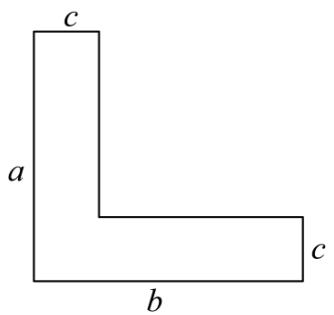

text_image

c
a
b
c

A. $ab - c^2$

B. $ac + (b - c)c$

C. $bc + (a - c)c$

D. $ab-(b-c)(a-c)$

【答案】A

【分析】本题考查代数式表示，整式的混合运算，根据图形中的字母，可以表示出“L”型钢材的截面的面积，本题得以解决．解答本题的关键是明确整式混合运算的计算方法，利用数形结合的思想解答.

【详解】解：由图可得，

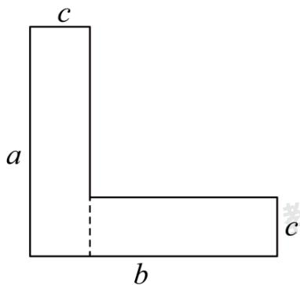

text_image

c
a
b
c

“L”型钢材的截面的面积为： $ac + (b - c)c$ ，故选项 B 正确；

由图可得，

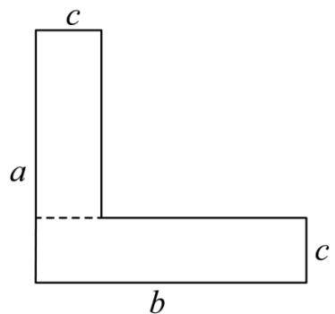

text_image

c
a
b
c

“L”型钢材的截面的面积为： $bc + (a - c)c$ ，故选项 C 正确；由图可得，

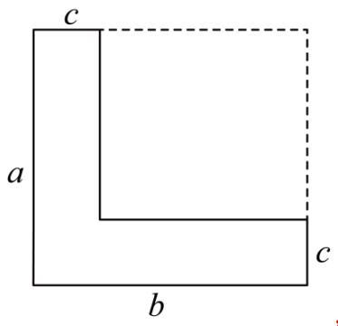

text_image

c
a
b
c

“L”型钢材的截面的面积为： $ab-(b-c)(a-c)$ ，故选项 D 正确，选项 A 错误，

故选：A.

# 【题型6 已知字母的值求代数式的值】

【例 6】（24-25 七年级上·全国·随堂练习）已知 a = -2, b = 1, c = -3，求整式 $-a^{2} + b^{2} + c^{2} + 2ab - 2ac$ 的值.

【答案】-10

【分析】本题考查代数式求值，直接将a=-2,b=1,c=-3代入求值即可.

【详解】解：当a=-2,b=1,c=-3时，

$$
- a ^ {2} + b ^ {2} + c ^ {2} + 2 a b - 2 a c = - 4 + 1 + 9 - 4 - 1 2 = - 1 0.
$$

【变式 6-1】（24-25 七年级上·广东东莞·期末）当 a = 8，b = 4 时，代数式 $ab^{2} - \frac{b^{2}}{a}$ 的值为（）

A. 62

B. 63

C. 126

D. 1022

【答案】C

【分析】本题考查了代数式求值．把a=8，b=4代入所求的代数式求值即可.

【详解】解：∵a=8，b=4，

$$
\therefore a b ^ {2} - \frac {b ^ {2}}{a} = 8 \times 4 ^ {2} - \frac {4 ^ {2}}{8} = 1 2 8 - 2 = 1 2 6,
$$

故选：C.

【变式 6-2】（24-25 七年级上·广东江门·阶段练习）如果 $|a|=3,|b|=13$ ，且ab>0，那么a-b的值是（）

A. 10 或 -16

B. 16 或 -16

C. 10 或 -10

D. -10或 16

【答案】C

【分析】本题考查了绝对值的意义，有理数乘法的法则，有理数减法，理解绝对值的意义是本题的关键．先根据绝对值的意义，得 $a=\pm3$ ， $b=\pm13$ ，再根据ab>0，得a,b同号，即可得出结果.

【详解】解：∵ $|a| = 3$ ，

$$
\therefore a = \pm 3,
$$

$$
\because | b | = 1 3,
$$

$$
\therefore b = \pm 1 3,
$$

$$
\because a b > 0,
$$

$$
\therefore a, b \text {同号，}
$$

$$
\therefore \left\{ \begin{array}{l} a = 3 \\ b = 1 3 \end{array} \text {或} \left\{ \begin{array}{l} a = - 3 \\ b = - 1 3 \end{array} \right. \right.,
$$

$$
a - b = 3 - 1 3 = - 1 0 \text {或} - 3 - (- 1 3) = - 3 + 1 3 = 1 0,
$$

故选：C.

【变式 6-3】（24-25 七年级上·湖南湘西·阶段练习）已知式子 $\frac{a}{|a|}+\frac{b}{|b|}+\frac{ab}{|ab|}$ 的最大值是 m，最小值是 n，则式子 $9m-n^{2}=$ \_\_\_\_.

【答案】26

【分析】本题主要考查了代数式求值，化简绝对值，分 $a > 0, b > 0$ ， $a > 0, b < 0$ ， $a < 0, b > 0$ 和 $a < 0, b < 0$ 四种情况，分别化简绝对值求出 $\frac{a}{|a|} + \frac{b}{|b|} + \frac{ab}{|ab|}$ 的值，进而确定 $m$ 、 $n$ 的值即可得到答案.

【详解】解：由题意得， $a \neq 0, b \neq 0,$

当a>0,b>0时，则 $\frac{a}{|a|}+\frac{b}{|b|}+\frac{ab}{|ab|}=\frac{a}{a}+\frac{b}{b}+\frac{ab}{ab}=1+1+1=3;$

当a>0,b<0时，则 $\frac{a}{|a|}+\frac{b}{|b|}+\frac{ab}{|ab|}=\frac{a}{a}+\frac{b}{-b}+\frac{ab}{-ab}=1-1-1=-1;$

当a<0,b>0时，则 $\frac{a}{|a|}+\frac{b}{|b|}+\frac{ab}{|ab|}=\frac{a}{-a}+\frac{b}{b}+\frac{ab}{-ab}=-1+1-1=-1;$

当a<0,b<0时，则 $\frac{a}{|a|}+\frac{b}{|b|}+\frac{ab}{|ab|}=\frac{a}{-a}+\frac{b}{-b}+\frac{ab}{ab}=-1-1+1=-1;$

由上可得， $\frac{a}{|a|}+\frac{b}{|b|}+\frac{ab}{|ab|}$ 的值为3或-1，

$\therefore\frac{a}{|a|}+\frac{b}{|b|}+\frac{ab}{|ab|}$ 的最大值为3，最小值为-1，即m=3，n=-1，

$$
\therefore 9 m - n ^ {2} = 9 \times 3 - (- 1) ^ {2} = 2 7 - 1 = 2 6,
$$

故答案为：26.

# 【题型7 已知式子的值求代数式的值】

【例 7】（24-25 七年级上·河北唐山·阶段练习）若 $x^{2}+3x$ 的值为 7，则 $3x^{2}+9x-2$ 的值为（）

A. 19

B. 24

C. 39

D. 44

【答案】A

【分析】此题考查求代数式的值，整理 $3x^{2}+9x-2$ 得 $3(x^{2}+3x)-2$ ，再把 $x^{2}+3x=7$ 代入 $3(x^{2}+3x)-2$ 进行求解，即可作答.

【详解】解： $\because x^{2}+3x$ 的值为 7，

$$
\therefore x ^ {2} + 3 x = 7,
$$

$$
\therefore 3 x ^ {2} + 9 x - 2 = 3 \left(x ^ {2} + 3 x\right) - 2 = 3 \times 7 - 2 = 1 9,
$$

故选：A

【变式 7-1】（24-25 九年级上·云南昆明·阶段练习）若 $x^{2}-3x$ 的值是9.那么代数式 $x^{2}-3x-1$ 的值是\_\_\_\_.

【答案】8

【分析】本题主要考查了代数式求值，解答本题的关键在于熟练掌握整体代入思想，将已知式代入目标式即可求解.

【详解】解： $\because x^{2}-3x=9,$

$$
\therefore x ^ {2} - 3 x - 1 = 9 - 1 = 8,
$$

故答案为：8.

【变式 7-2】（24-25 七年级上·甘肃张掖·期末）已知 a-b = -2，则代数式 $4(a-b)^{2} + a-b$ 的值为 \_\_\_\_.

【答案】14

【分析】本题主要考查了代数式求值，解题的关键是熟练掌握整体思想的应用．将a-b=-2整体代入求值即可.

【详解】解：∵a-b=-2，

$$
\begin{array}{l} \therefore 4 (a - b) ^ {2} + a - b \\ = 4 \times (- 2) ^ {2} + (- 2) \\ = 4 \times 4 - 2 \\ = 1 6 - 2 \\ = 1 4. \\ \end{array}
$$

故答案为：14.

【变式 7-3】（24-25 七年级上·河北沧州·期末）如图，约定：上方相邻两数之和等于这两数下方箭头共同指向的数，则： $x + y$ 的值为\_\_\_\_.

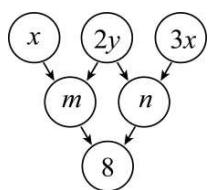

flowchart

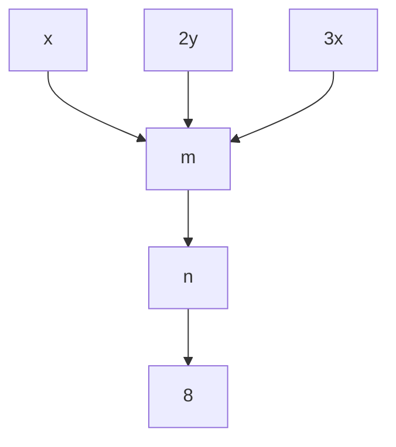

【答案】2

【分析】本题主要考查了求代数式的值．根据题意可得 $x+2y+2y+3x=m+n=8$ ，即可求解.

【详解】解：根据题意得： $m+n=8,x+2y=m,2y+3x=n$

$$
\therefore x + 2 y + 2 y + 3 x = m + n = 8,
$$

即 $4x + 4y = 8$ ,

$$
\therefore x + y = 2.
$$

故答案为：2

# 【题型8 程序流程图中求代数式的值】

【例 8】（24-25 七年级上·四川达州·期末）有一个数值转换器，原理如图所示，若开始输入 x 的值是 5，可发现第 1 次输出的结果是 16，第 2 次输出的结果是 8，第 3 次输出的结果是 4．依次继续下去，第 2025 次输出的结果是（）

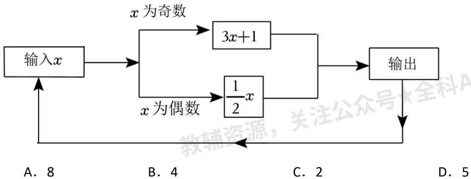

flowchart

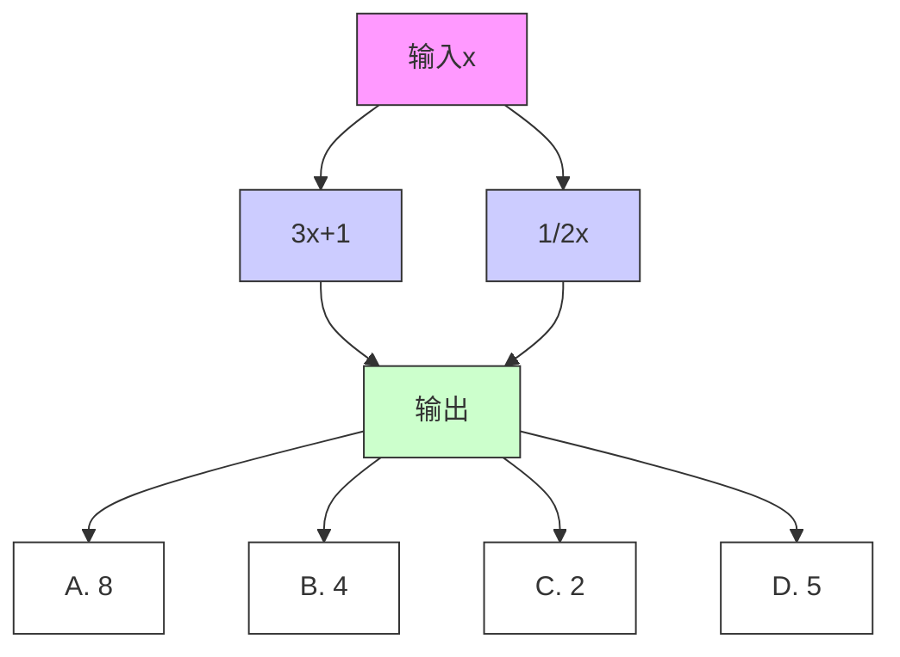

【答案】B

【分析】本题考查了有理数的混合运算，根据题目所给运算程序，先计算出前几次输出结果，得出一般规律：从第3次开始，输出结果每3次按照4，2，1的顺序循环，即可解答.

【详解】解：根据题意可得：

第 1 次输出的结果是 16,

第 2 次输出的结果是 8，

第 3 次输出的结果是 4,

第 4 次输出的结果是 $\frac{1}{2} \times 4 = 2$ ,

第 5 次输出的结果是 $\frac{1}{2} \times 2 = 1$ ,

第 6 次输出的结果是 $3 \times 1 + 1 = 4$ ,

第 7 次输出的结果是 2，

第 8 次输出的结果是 1,

第 9 次输出的结果是 4,

……，

从第 3 次开始，输出结果每 3 次按照 4，2，1 的顺序循环，

$$
(2 0 2 5 - 2) \div 3 = 6 7 4 \dots 1,
$$

∴第 2025 次输出的结果是第 675 次循环中的第 1 个数，

∴第 2025 次输出的结果为 4，

故选：B.

【变式 8-1】（2025·四川达州·二模）如图是一个运算程序示意图，若开始输入x的值为5，则输出y值为\_\_\_\_。

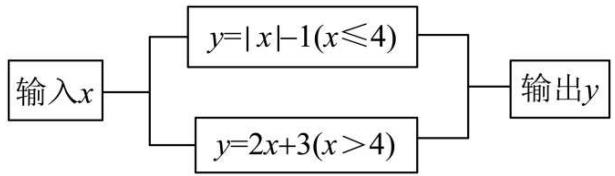

flowchart

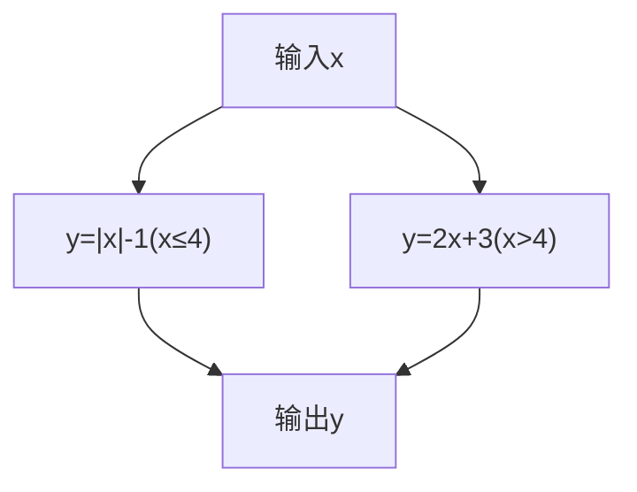

【答案】13

【分析】本题考查了代数式求值，读懂运算程序图是解题关键．根据5＞4和运算程序图，将x=5代入 $y=2x+3$ 计算即可得.

【详解】解：∵5 > 4，

∴若开始输入x的值为5，则输出y值为 $2 \times 5 + 3 = 13$ ，

故答案为：13.

【变式 8-2】（24-25 七年级下·内蒙古乌海·期末）按如图所示的运算程序，能使输出的结果为 18 的是（）

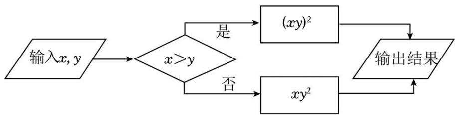

flowchart

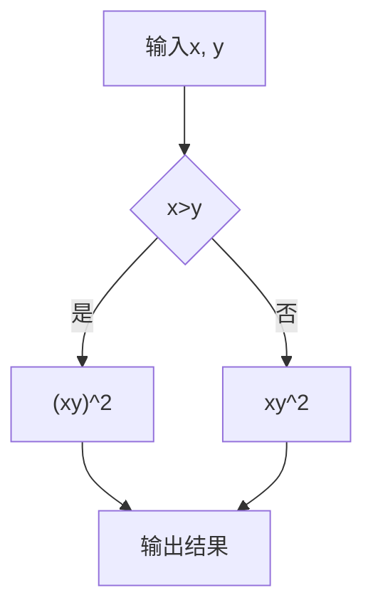

A. $x = 3, y = 2$

B. $x = 2, y = 3$

C. $x = 3, y = -2$

D. $x = 2, y = -3$

【答案】B

【分析】本题主要考查了代数式求值，解题关键是理解已知条件中的运算程序．各个选项均先判断x，y的大小，然后根据运算程序，把x，y代入相应的代数式进行计算，最后判断即可.

【详解】解：A. $\because 3 > 2$ ，即 x > y，

∴ 输出结果为 $(3 \times 2)^{2} = 6^{2} = 36$ ,

∴ 此选项不符合题意；

B. $\because 2 <   3$ ，即 $x <   y$

∴ 输出结果为 $2 \times 3^{2} = 2 \times 9 = 18$ ,

∴ 此选项符合题意；

C. $\because 3 > -2$ ，即 x > y，

∴ 输出结果为 $\left[3 \times (-2)\right]^{2} = (-6)^{2} = 36$ ,

∴ 此选项不符合题意;

D. $\because 2 > -3$ ，即 x > y，

∴ 输出结果为 $\left[2 \times (-3)\right]^{2} = (-6)^{2} = 36$ ,

∴ 此选项不符合题意;

故选：B.

【变式 8-3】按如图所示的程序计算，当输入数据 x，y 的值满足 $\left|x+2\right|+(3-y)^{2}=0$ 时，m 的值为 \_\_\_\_.

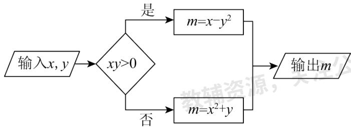

flowchart

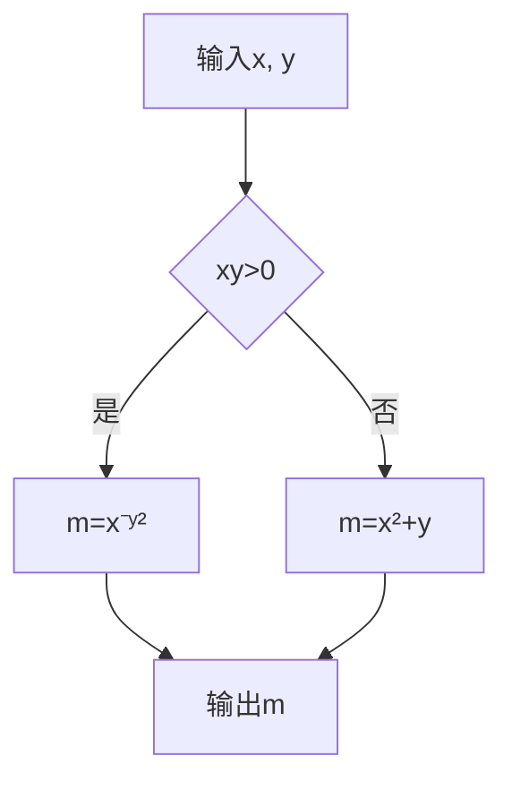

【答案】7

【分析】本题主要考查绝对值及平方的非负性，求代数式的值．先利用绝对值及平方的非负性得出 $x = -2$ ， $y = 3$ ，然后根据程序计算即可.

【详解】解：∵ $|x+2|+(3-y)^{2}=0$ ，

$$
\therefore x + 2 = 0, \quad 3 - y = 0,
$$

$$
\therefore x = - 2, \quad y = 3,
$$

$$
\therefore x y = - 6 <   0,
$$

$$
\therefore m = x ^ {2} + y = (- 2) ^ {2} + 3 = 7,
$$

故答案为：7.

# 【题型9 规律型：数字的变化类】

【例 9】（2025·云南昆明·模拟预测）按一定规律排列的代数式： $-x+2y,x^{3}+4y,-x^{5}+6y,x^{7}+8y,-x^{9}+10y$ ， $x^{12}+12y,\cdots$ ，第 n 个代数式是（）

A. $(-1)^{n}x^{2n+1}+2ny$

B. $(-1)^{n}x^{2n-1}+2ny$

C. $(-1)^{n+1}x^{2n+1}+ny$

D. $(-1)^{n+1}x^{2n-1}+ny$

【答案】B

【分析】本题考查数字的变化规律，通过观察所给的多项式中各单项式的特点，探索出一般规律是解题的关键.

通过观察各单项式的系数和次数，可得规律第n个多项式为 $(-1)^{n}x^{2n-1}+2ny$ .

【详解】解： $\because -x+2y,x^{3}+4y,-x^{5}+6y,x^{7}+8y,-x^{9}+10y,x^{12}+12y,\cdots,$

∴第n个多项式为 $(-1)^{n}x^{2n-1}+2ny$ ,

故选：B.

【变式 9-1】（24-25 七年级上·全国·期末）观察下列各式：-2，4，-8，16，-32，…根据其中的排列规律，则第 n 个式子为\_\_\_\_。

【答案】 $(-2)^{n}$

【分析】本题主要考查数字规律，有理数的乘方运算，理解数字规律的计算，掌握有理数的乘方运算法则是解题的关键．根据已知数据，确定符号与数值的关系，再运用 $(-2)^{n}$ 进行验证即可求解.

【详解】解： $-2=(-2)^{1}$ ， $4=(-2)^{2}$ ， $-8=(-2)^{3}$ ， $16=(-2)^{4}$ ， $-32=(-2)^{5}$ ，…，

∴第 n 个数字是 $(-2)^{n}$ ,

故答案为： $(-2)^{n}$ .

【变式 9-2】（24-25 七年级上·甘肃武威·期末）一组按规律排列的式子： $\frac{a^{2}}{3},\frac{-a^{3}}{5},\frac{a^{4}}{7},\frac{-a^{5}}{9},\cdots$ ，则第 2025 个式子是\_\_\_\_.

【答案】 $\frac{a^{2026}}{4051}$

【分析】本题考查的是数字的变化类规律问题，根据给出的式子分别找出分子、分母的变化规律是解题的关键．分别找出分子、分母的变化规律，根据规律解答即可.

【详解】解：第一个式子的分子是 $a^{2}$ ，分母是3，

第二个式子的分子是 $-a^{3}$ ，分母是5，

第三个式子的分子是 $a^{4}$ ，分母是7，

第四个式子的分子是 $-a^{5}$ ，分母是9，

…，

则第 n 个式子的分子是 $(-1)^{n+1}a^{n+1}$ ，分母是 $2n+1$ ，

所以第 2025 个式子的分子是 $a^{2026}$ ，分母是 $2025 \times 2 + 1 = 4051$ ，

所以第 2025 个式子是 $\frac{a^{2026}}{4051}$ ,

故答案为： $\frac{a^{2026}}{4051}$ .

【变式 9-3】将偶数按下列方式排成一个三角形数阵，按照此规律，第 10 行第 5 个数是\_\_\_\_。

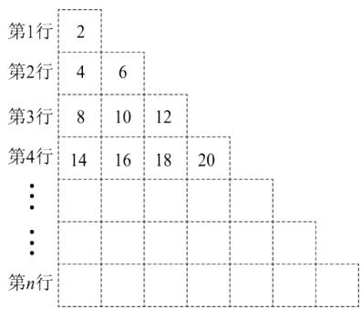

text_image

第1行
2
第2行
4
6
第3行
8
10
12
第4行
14
16
18
20
...
...
第n行

【答案】100

【分析】本题考查了数字类规律探究，通过观察推导出一般规律是解题关键．通过观察可知第n行有n个偶数，根据每行第一个数字推导出一般规律，即可得到答案.

【详解】解：根据观察可知：第n行有n个偶数

第 1 行的第 1 个数为： $2 = 1 \times 0 + 2$ ，

第 2 行的第 1 个数为: $4 = 2 \times 1 + 2$ ,

第 3 行的第 1 个数为: $8 = 3 \times 2 + 2$ ,

第 4 行的第 1 个数为: $14 = 4 \times 3 + 2$ ,

......

第n行的第1个数为： $n(n-1)+2$ ，

∴ 第 10 行的第 1 个数为： $10 \times 9 + 2 = 92$ ，

∴ 第 10 行的第 5 个数为： $92 + 2 \times 4 = 100$ ，

故答案为：100.

# 【题型 10 规律型：图形的变化类】

【例 10】（24-25 九年级下·云南·阶段练习）下列图形都是由同样大小的小圆圈按一定的规律组成，其中，第①个图形中一共有5个小圆圈，第②个图形中一共有7个小圆圈，第③个图形中一共有9个小圆圈……，按此规律，第⑧个图形中小圆圈的个数为（）

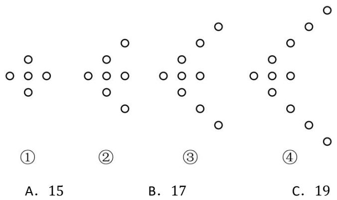

text_image

①
A. 15
②
B. 17
③
④
C. 19

【答案】C

【分析】本题主要考查图形规律，理解图示数量关系，找出规律是关键.

根据图示的数量得到第 $n$ 个图形中一共有 $(3 + 2n)$ 个小圆圈，由此即可求解.

【详解】解：由题知，第①个图形中一共有 $3+2\times1=5$ 个小圆圈，

第②个图形中一共有 $3+2\times2=7$ 个小圆圈，

第③个图形中一共有 $3+2\times3=9$ 个小圆圈，

…，

∴第n个图形中一共有 $(3+2n)$ 个小圆圈，

∴第⑧个图形中小圆圈的个数为 $3+2\times8=19$ ,

故选：C.

【变式 10-1】（24-25 七年级上·甘肃张掖·期末）小明用边长为1cm的小正方形纸片在桌面上摆放成如图所示的塔状图．第 n（n 是正整数）个塔状图的周长为\_\_\_\_cm（用含 n 的代数式表示）.

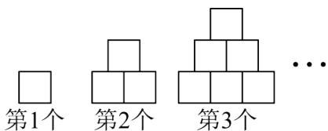

text_image

第1个
第2个
第3个
...

【答案】4n

【分析】本题考查图形的变化规律，代数式．根据题意分别求出前三次所摆图形周长，观察并得出规律进行分析求解即可.

【详解】解：第一次所摆图形周长是 $1 \times 4 = 4$ ;

第二次所摆图形的周长是 $2 \times 4 = 8$ ;

第三次所摆图形的周长是 $3 \times 4 = 12$ ;

第 n 次所摆图形的周长是 4n.

故答案为：4n.

【变式 10-2】（24-25 七年级上·河北石家庄·期中）如图是一组有规律的图案。第 1 个图中有 4 个小黑点。第 2 个图中有 7 个小黑点，第 3 个图中有 12 个小黑点。第 4 个图中有 19 个小黑点。…、按此规律，第 9 个图中有\_\_\_\_个小黑点，第 n 个图中有\_\_\_\_个小黑点。（用含 n 的代数式表示）

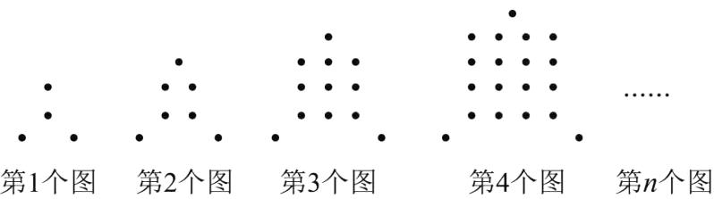

text_image

第1个图 第2个图 第3个图 第4个图 第n个图

【答案】 84 $n^2 +3$

【分析】本题主要考查列代数式，根据图案规律，写出第 n 个图案中图形的个数是解题的关键．根据图案找出规律即可.

【详解】由图可知：

第 1 个图案，小黑点个数为： $4 = 1^{2} + 3$ ，

第 2 个图案，小黑点个数为： $7 = 2^{2} + 3$ ，

第 3 个图案，小黑点个数为： $12 = 3^{2} + 3$ ，

第 4 个图案，小黑点个数为： $19 = 4^{2} + 3$

...

第 9 个图案，小黑点个数为： $84 = 9^{2} + 3$ ，

...

第 n 个图案，小黑点个数为： $n^{2}+3$ ，

故答案为：84， $n^{2}+3$

【变式 10-3】（24-25 七年级下·广东梅州·期末）如图，用大小相同的小正方形拼图，第1个图是一个小正方形，第2个图由9个小正方形拼成；第3个图由25个小正方形拼成，依此规律，则第n个图由\_\_\_\_个小正方形拼成.

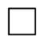

第1个图

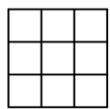

第2个图

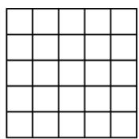

第3个图

【答案】 $(2n-1)^{2}$

【分析】本题考查了图形的变化规律、列代数式，观察图形变化，发现小正方形的个数为连续奇数的平方，

列出代数式即可，分析图形的变化规律是解题的关键.

【详解】解：∵第1个图形中小正方形的个数为：1，第2个图形中小正方形的个数为： $9=(2\times2-1)^{2}$ ，第3个图形中小正方形的个数为： $25=(2\times3-1)^{2}$ ，……，

∴第n个图形中小正方形的个数为： $(2n-1)^{2}$ ，故答案为： $(2n-1)^{2}$ .