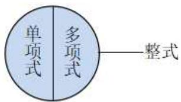

# 专题 3.2 整式（举一反三讲义）

【北师大版 2024】

# 题型归纳

【题型1 单项式的定义】....2

【题型 2 单项式的系数、次数】....2

【题型3 判断多项式】....3

【题型4 判断多项式的项与次数】....3

【题型 5 由多项式的系数、次数求字母的值】....3

【题型6 整式的判断】....4

【题型 7 将多项式按某个字的升幂或降幂排列】....4

【题型8 整式中的规律探究】....5

# 举一反三 教辅资源，关注 公众号★全科AA+

# 知识点 1 单项式

1. 定义: 如果一个代数式是数或字母的积, 那么这个代数式叫作单项式. 单独的一个数或一个字母也是单项式.  
2. 单项式的系数: 单项式中的数字因数叫作这个单项式的系数.  
3. 单项式的次数: 一个单项式中, 所有字母的指数的和叫作这个单项式的次数。对于一个非零的数, 规定它的次数为 0。

次数 $2+3=5$

# 知识点 2 多项式

1. 定义：几个单项式的和叫作多项式.  
2. 多项式的项: 在多项式中, 每个单项式叫作多项式的项, 其中不含字母的项叫作常数项, 一个多项式含有几项, 就叫几项式.  
3. 多项式的次数：多项式里，次数最高的项的次数，叫作这个多项式的次数.

# 知识点 3 整式

1. 定义：单项式与多项式统称整式.

2. 单项式、多项式与整式的关系如图所示.

text_image

单项式
多项式
整式

# 3. 判断整式、单项式及多项式的方法

（1）单项式不含加减运算，多项式必含加减运算；  
（2）多项式是几个单项式的和，多项式不包含单项式；  
（3）单项式和多项式都是整式，分母中含有字母的都不是整式.

# 【题型1 单项式的定义】

【例 1】（24-25 七年级上·河北邯郸·期末）下列代数式 8， $a^{2}+2,-x^{2}y,3a^{2},0,b,\frac{x-1}{2}$ 中，单项式的个数有（）

A. 3 个

B. 4 个

C. 5 个

D. 6 个

【变式 1-1】（24-25 七年级上·福建福州·期末）下列代数式中，属于单项式的是（）

A. $\frac{x}{6}$

B. $\frac{s}{t}$

C. $3x + 2y$

D. $\frac{x+1}{2}$

【变式 1-2】（24-25 七年级下·江苏苏州·阶段练习）在① $\frac{1}{4}x$ ，② $a^{2}-b^{2}$ ，③20%x，④ $4+8=12$ ，⑤ $\frac{m-n}{3}$ ，⑥ $\frac{1}{a}$ 中，属于单项式的有\_\_\_\_。

【变式 1-3】（24-25 七年级上·广东肇庆·期中）下列代数式：① $\frac{2}{3}$ ; ②m; ③ $\frac{3}{4}xy^{2}$ ; ④ $\frac{2x+3y}{3}$ ; ⑤ $\frac{ab}{m}$ ;

⑥ $6x+3y$ ; ⑦ $\frac{x}{\pi}$ ，其中是单项式的是\_\_\_\_（只填序号）.

# 【题型 2 单项式的系数、次数】 教辅资源，关注 公众号★全科AA+

【例 2】（24-25 七年级上·吉林·期中）已知一个单项式的系数是 3，次数是 4，则这个单项式可以是（）

A. $3xy^{2}$

B. $-3x^{4}$

C. $3x^{2} + y$

D. $3x^{3}y$

【变式 2-1】（24-25 七年级上·北京房山·期末）下列式子： $-m,0,(-1)^{2}xyz,2\pi R,-\frac{a}{3},x^{3},\frac{1}{x}$ 中，单项式共有\_\_\_\_个；系数为 1 的单项式是\_\_\_\_；系数为 -1 的单项式是\_\_\_\_；单项式 $(-1)^{2}xyz$ 的次数是\_\_\_\_。

【变式 2-2】（24-25 七年级上·湖北荆门·期中）若一个单项式同时满足条件：①含有字母 x，y，z；②系数为 -3；③次数为 5，则这样的单项式共有（）

A. 5 个

B. 6 个

C. 7 个

D. 8 个

【变式 2-3】（24-25 七年级下·湖南长沙·开学考试）①单项式 $-\frac{\pi^{2}x^{2}}{2}$ 的系数是 $-\frac{1}{2}$ ; ②ab的次数、系数都是1; ③ $\frac{3}{4}$ 与 $\frac{4}{a}$ 都是单项式; ④单项式的 $2\pi r$ 系数是 $2\pi$ . 以上说法中正确的有（）

A. 0 个

B. 1 个

C. 2 个

D. 3 个

# 【题型3 判断多项式】

【例 3】（24-25 七年级上·广东河源·期末）在代数式 $-1,2x + 7, -\frac{x+y}{2\pi}, x(x + 1), \frac{m+n}{2}$ 中，多项式的个数是（）个

A. 5

B. 4

C. 3

D. 2

【变式 3-1】在代数式① $x^{2}y$ ; ② $a^{2}-ab+\frac{1}{b}$ ; ③ $\frac{3}{n}$ , ④ $\frac{1}{2}x+1$ 中，下列判断正确的是（）

A. ①③是单项式

B. ②是二次三项式

C. ②④是多项式

D. ①④是整式

【变式 3-2】下列说法正确的是（）

A. $a, -6, ab + c, \frac{2x - 1}{3}$ 都是整式

B. $\frac{x + y}{2}$ 和 $\frac{xy}{2}$ 都是单项式

C. $\frac{y + 1}{y}$ 和 $x^{2} + xy + y^{2}$ 都是多项式

D. $3 x - 1$ 的项是 $3 x$ 和 1

【变式 3-3】下列整式 $-\frac{1}{2}x^{2}y,\quad\frac{m^{4}n^{2}}{7},\quad x^{2}+y^{2}-1,\quad-5,\quad x,\quad 2-y$ 中有 a 个单项式，b 个多项式，则 ab= \_\_\_\_.

# 【题型4 判断多项式的项与次数】

【例 4】（24-25 七年级上·四川南充·期中） $\frac{1}{2}x^{2}y^{3}-xy^{2}+xy-3$ 的次数是a，常数项是b，则ab的值是\_\_\_\_。

【变式 4-1】（24-25 六年级下·上海·期中）下列多项式中是三次三项式的是（）

A. $3x^{2}$ ;

B. $x^{2}y-3y-1;$

C. $xy - 3 + 2xy;$

D. $x + xy - 3y.$

【变式 4-2】（24-25 七年级上·河北邢台·阶段练习） $-2a^{3}b+\frac{1}{5}ab-b^{3}+4$ 的最高次项是\_\_\_\_.

【变式 4-3】（24-25 七年级上·上海宝山·期中）多项式 $\frac{3ab-2ab^{2}+3}{10}$ 的最高次项是\_\_\_\_.

# 【题型5 由多项式的系数、次数求字母的值】

【例 5】如果多项式 $5a^{m}-(n-1)a+1$ 是关于 a 的二次二项式， $m+2n=$ \_\_\_\_。

【变式 5-1】（24-25 七年级上·天津·期末）已知关于x的多项式 $(m-4)x^{3}-x^{n}+x-mn$ 为二次三项式，则当x=-1时，这个二次三项式的值是\_\_\_\_.

【变式5-2】已知 $(a + 10)x^{3} + cx^{2} - 2x + 5$ 是关于 $x$ 的二次多项式，且实数 $a$ ， $b$ ， $c$ 满足 $(c - 18)^{2} = -|a + b|$

则 $a-b+c=$ \_\_\_\_.

【变式 5-3】（24-25 七年级上·四川南充·期中）关于 x 的多项式 $ax^{|a|+4}-x^{5}+3x^{3}-5$ 的次数为 3，a 为何值（）

A. 0

B. 1

C. -1

D. $\pm 1$

# 【题型6 整式的判断】

【例6】下列式子： $x^{2} + 2$ ， $\frac{1}{a} +4$ ， $\frac{3ab^2}{7}$ ， $\frac{ab}{c}$ ，5x，0中，整式的个数是（）

A. 3

B. 4

C. 5

D. 6

【变式 6-1】下列式子: ① $x^{2}-x+1$ ; ② $m^{2}n+mn-1$ ; ③ $x^{4}+\frac{1}{x}+2$ ; ④ $5-x^{2}$ ; ⑤ $-x^{2}$ . 其中多项式有个, 次数最高的多项式为\_\_\_\_(请填写序号), 整式有\_\_\_\_个.

【变式 6-2】代数式2x-y、m、 $x^{2}-xy$ 、0、 $-ab^{2}$ 、 $\frac{1}{x}$ 、 $\frac{a}{3}+b$ 、 $2(a+b)$ 、 $|-0.5|$ 、 $\frac{x}{a}+y$ 中，单项式有\_\_\_\_个，多项式有\_\_\_\_个，整式有\_\_\_\_个.

【变式 6-3】观察下列各式： $-ab, -\frac{a}{2}, \frac{2}{a}, a + b, a^{2} + a - 1$ ．回答下列问题：

(1)单项式分别为：\_\_\_\_；  
(2)多项式分别为：\_\_\_\_；  
(3)整式有\_\_\_\_个;   
(4)-ab的系数为\_\_\_\_；  
(5)次数最高的多项式为\_\_\_\_。

【题型 7 将多项式按某个字的升幂或降幂排列】教辅资源，关注公众号★全科AA+

【例 7】（24-25 七年级上·上海普陀·期末）将整式 $3x^{7}y-4x^{m+1}y^{4}+2x^{m}y^{2}+x^{3}y^{6}$ 按y降幂排列后，第二项的系数为\_\_\_\_.

【变式 7-1】（24-25 七年级上·上海闵行·阶段练习）多项式 $3-2xy+6x^{2}y-5x^{3}y^{2}-4x^{4}y$ 是按照().

A. 按字母 x 升幂排列

B. 按字母 y 升幂排列

C. 按字母 x 降幂排列

D. 按字母 y 降幂排列

【变式 7-2】（2025·河南郑州·一模）写出一个同时满足下列条件的二次三项式：\_\_\_\_

①只含有字母a和b；②每一项的次数都是2；③按字母a的降幂排列.

【变式 7-3】（24-25 七年级上·上海杨浦·阶段练习）某多项式为 $x^{8}-x^{7}y+x^{6}y^{2}-x^{5}y^{3}+\cdots$ ，按这样的规律写下去，第6项是\_\_\_\_，此多项式应是\_\_\_\_次\_\_\_\_项式.

# 【题型8 整式中的规律探究】

【例 8】（24-25 八年级下·云南昭通·期中）观察下列式子：

$$
x - 1, x ^ {2} + 4, x ^ {3} - 9, x ^ {4} + 1 6, \dots
$$

请你找出其中规律，并将第n个式子写出来：\_\_\_\_。

【变式 8-1】（24-25 七年级上·云南昭通·期中）按照一定规律排列的单项式 $\frac{x}{2}$ ， $\frac{x^{3}}{4}$ ， $\frac{x^{5}}{6}$ ， $\frac{x^{7}}{8}$ ，…，试猜想第n个单项式为（）

A. $\frac{x^{2n + 1}}{n}$

B. $\frac{x^{2n+1}}{2n}$

C. $\frac{x^{2n-1}}{2n}$

D. $\frac{x^{2n-1}}{2n+1}$

【变式 8-2】（2025·上海·七年级期末）按一定规律排列的整式： $x + y^{2}$ ， $x^{3} + y^{4}$ ， $x^{5} + y^{6}$ ， $x^{7} + y^{8}$ ， $x^{9} + y^{10}$ ，…，第n个多项式是（）

A. $x^{2n} + y^{2n - 1}$

B. $x^{2n+1} + y^{2n}$

C. $x^{2n-1} + y^{n+1}$

D. $x^{2n-1} + y^{2n}$

【变式 8-3】（24-25 七年级上·北京西城·期中）按一定规律排列的一组多项式： $a + b^{2}$ ， $3a - b^{3}$ ， $5a + b^{4}$ ， $7a - b^{5}$ ， $9a + b^{6}$ ，…，它的第2024个多项式是（）

A. $4047a + b^{2025}$

B. 4047a-b2025

C. $4049a + b^{2025}$

D. $4049a-b^{2025}$