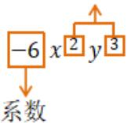

# 专题 3.2 整式（举一反三讲义）

【北师大版 2024】

# 题型归纳

【题型 1 单项式的定义】.....2

【题型2 单项式的系数、次数】 3

【题型3 判断多项式】 5

【题型4 判断多项式的项与次数】....7

【题型5 由多项式的系数、次数求字母的值】....8

【题型6 整式的判断】....9

【题型 7 将多项式按某个字的升幂或降幂排列】.....12

【题型8 整式中的规律探究】....13

# 举一反三

# 知识点 1 单项式

1. 定义: 如果一个代数式是数或字母的积, 那么这个代数式叫作单项式. 单独的一个数或一个字母也是单项式.  
2. 单项式的系数: 单项式中的数字因数叫作这个单项式的系数.  
3. 单项式的次数: 一个单项式中, 所有字母的指数的和叫作这个单项式的次数。对于一个非零的数, 规定它的次数为 0。

次数 $2+3=5$

# 知识点 2 多项式

1. 定义：几个单项式的和叫作多项式.  
2. 多项式的项: 在多项式中, 每个单项式叫作多项式的项, 其中不含字母的项叫作常数项, 一个多项式含有几项, 就叫几项式.  
3. 多项式的次数：多项式里，次数最高的项的次数，叫作这个多项式的次数.

# 知识点 3 整式

1. 定义：单项式与多项式统称整式.

2. 单项式、多项式与整式的关系如图所示.

text_image

单项式
多项式
整式

# 3. 判断整式、单项式及多项式的方法

（1）单项式不含加减运算，多项式必含加减运算；  
（2）多项式是几个单项式的和，多项式不包含单项式；  
（3）单项式和多项式都是整式，分母中含有字母的都不是整式.

# 【题型1 单项式的定义】

【例 1】（24-25 七年级上·河北邯郸·期末）下列代数式 8， $a^{2}+2,-x^{2}y,3a^{2},0,b,\frac{x-1}{2}$ 中，单项式的个数有（）

A. 3 个

B. 4 个

C. 5 个

D. 6 个

【答案】C

【分析】此题考查了单项式，熟练掌握单项式的定义是解题的关键．单项式是数与字母的乘积，单独一个数或一个字母也是单项式．据此判断即可.

【详解】在代数式 8， $a^{2}+2,-x^{2}y,3a^{2},0,b,\frac{x-1}{2}$ 中，单项式有 8， $-x^{2}y,3a^{2},0,b$ ，共 5 个，
故选：C.

【变式 1-1】（24-25 七年级上·福建福州·期末）下列代数式中，属于单项式的是（）

A. $\frac{x}{6}$

B. $\frac{s}{t}$

C. $3x + 2y$

D. $\frac{x+1}{2}$

【答案】A

【分析】本题考查了单项式的定义，解题的关键是理解数与字母的积的形式的代数式是单项式，单独的一个数或一个字母也是单项式.

根据单项式的定义进行分析即可.

【详解】解：A、 $\frac{x}{6}$ 是单项式，符合题意；

B、 $\frac{s}{t}$ 不是单项式，不符合题意；

C、 $3x + 2y$ 是多项式，不符合题意；

D、 $\frac{x+1}{2}$ 是多项式，不符合题意；

故选：A.

【变式 1-2】（24-25 七年级下·江苏苏州·阶段练习）在① $\frac{1}{4}x$ ，② $a^{2}-b^{2}$ ，③20%x，④ $4+8=12$ ，⑤ $\frac{m-n}{3}$ ，⑥ $\frac{1}{a}$ 中，属于单项式的有\_\_\_\_。

【答案】①③

【分析】本题考查单项式的定义，数与字母的积的形式的代数式是单项式，单独的一个数或一个字母也是单项式，分母中含字母的不是单项式．准确掌握定义是解题的关键.

【详解】解：式子 $\frac{1}{4}x$ ，20%x符合单项式的定义，是单项式；

式子 $\frac{1}{a}$ 分母中含有字母，不是单项式；

式子 $a^{2}-b^{2}$ ， $\frac{m-n}{3}$ ，不是单项式；

式子 $4+8=12$ 为等式，不是单项式；

故单项式有①③.

故答案为：①③.

【变式 1-3】（24-25 七年级上·广东肇庆·期中）下列代数式：① $\frac{2}{3}$ ; ②m; ③ $\frac{3}{4}xy^{2}$ ; ④ $\frac{2x+3y}{3}$ ; ⑤ $\frac{ab}{m}$ ;

⑥ $6x+3y$ ; ⑦ $\frac{x}{\pi}$ ，其中是单项式的是\_\_\_\_（只填序号）.

【答案】①②③⑦

【分析】直接利用单项式的定义分析得出答案.

【详解】解：单项式：由数或字母的积组成的代数式叫做单项式，单独的一个数或一个字母也叫做单项式则是单项式的是① $\frac{2}{3}$ ；②m；③ $\frac{3}{4}xy^{2}$ ；⑦ $\frac{x}{\pi}$ ,

故答案为：①②③⑦.

【点睛】本题考查了单项式的定义，熟记定义是解题关键.

# 【题型 2 单项式的系数、次数】

【例 2】（24-25 七年级上·吉林·期中）已知一个单项式的系数是 3，次数是 4，则这个单项式可以是（）

A. $3xy^{2}$

B. $-3x^{4}$

C. $3x^{2} + y$

D. $3x^{3}y$

【答案】D

【分析】本题主要考查了单项式的定义，单项式的次数，解题的关键在于能够熟知相关定义：表示数或字母的积的式子叫做单项式，单独的一个数或一个字母也是单项式，单项式中数字因数叫做这个单项式的系数，所有字母的指数之和叫做单项式的次数.

【详解】解：A、 $3xy^{2}$ 的系数为3，次数为3，不符合题意；

B、 $-3x^{4}$ 的系数为-3，次数为4，不符合题意；  
C、 $3x^{2}+y$ 不是单项式，不符合题意；  
D、 $3x^{3}y$ 的系数是3，次数是4，符合题意；

故选：D.

【变式 2-1】（24-25 七年级上·北京房山·期末）下列式子： $-m,0,(-1)^{2}xyz,2\pi R,-\frac{a}{3},x^{3},\frac{1}{x}$ 中，单项式共有\_\_\_\_个；系数为 1 的单项式是\_\_\_\_；系数为 -1 的单项式是\_\_\_\_；单项式 $(-1)^{2}xyz$ 的次数是\_\_\_\_。

【答案】6 $(-1)^{2}xyz, x^{3} - m$ 3

【分析】直接利用单项式的次数与系数确定方法得出答案.

【详解】解：单项式有： $-m,0,(-1)^{2}xyz,2\pi R,-\frac{a}{3},x^{3}$ 共6个，

系数为 1 的单项式是: $(-1)^{2}xyz, x^{3}$ ,

系数为-1的单项式是：-m，

单项式 $(-1)^{2}xyz$ 的次数是：3.

故答案为：6； $(-1)^{2}xyz,x^{3}$ ；-m；3.

【点睛】此题主要考查了单项式的次数与系数，正确把握定义是解题关键.

【变式 2-2】（24-25 七年级上·湖北荆门·期中）若一个单项式同时满足条件：①含有字母 x，y，z；②系数为 -3；③次数为 5，则这样的单项式共有（）

A. 5 个

B. 6 个

C. 7 个

D. 8 个

【答案】B

【分析】本题考查了单项式．根据单项式的系数是指单项式中的数字因数，次数是指单项式中所有字母指数的和，按要求写出即可.

【详解】解：同时满足条件①②③的单项式有 $-3x^{3}yz$ ， $-3xy^{3}z$ ， $-3xyz^{3}$ ， $-3x^{2}y^{2}z$ ， $-3x^{2}yz^{2}$ ， $-3xy^{2}z^{2}$ ，共有6个.

故选：B.

【变式 2-3】（24-25 七年级下·湖南长沙·开学考试）①单项式 $-\frac{\pi^{2}x^{2}}{2}$ 的系数是 $-\frac{1}{2}$ ; ②ab的次数、系数都是1; ③ $\frac{3}{4}$ 与 $\frac{4}{a}$ 都是单项式; ④单项式的 $2\pi r$ 系数是 $2\pi$ . 以上说法中正确的有（）

A. 0 个

B. 1 个

C. 2 个

D. 3 个

【答案】B

【分析】本题考查了单项式的概念，不含有加减运算的整式叫做单项式，单独的一个数或一个字母也是单项式．单项式中的数字因数叫做单项式的系数，系数包括它前面的符号，单项式的次数是所有字母的指数的和.

【详解】解：①单项式 $-\frac{\pi^{2}x^{2}}{2}$ 的系数是 $-\frac{\pi^{2}}{2}$ ，故此选项错误；

②ab的次数是2、系数是1，故此选项错误；  
③ $\frac{4}{a}$ 不是单项式，故此选项错误；  
④单项式 $2\pi r$ 的系数是 $2\pi$ ，此选项正确，

故正确的有 1 个.

故选：B.

# 【题型3 判断多项式】

【例 3】（24-25 七年级上·广东河源·期末）在代数式 $-1,2x + 7, -\frac{x+y}{2\pi}, x(x + 1), \frac{m+n}{2}$ 中，多项式的个数是（）个

A. 5

B. 4

C. 3

D. 2

【答案】B

【分析】本题考查了多项式“由几个单项式的和组成的代数式，称为多项式”，熟记多项式的定义是解题关键．根据多项式的定义求解即可得.

【详解】解： $2x+7,\ -\frac{x+y}{2\pi},\ x(x+1),\ \frac{m+n}{2}$ 都是多项式，共有4个，

故选：B.

【变式 3-1】在代数式① $x^{2}y$ ; ② $a^{2}-ab+\frac{1}{b}$ ; ③ $\frac{3}{n}$ , ④ $\frac{1}{2}x+1$ 中, 下列判断正确的是()

A. ①③是单项式

B. ②是二次三项式

C. ②④是多项式

D. ①④是整式

【答案】D

【分析】根据单项式、多项式、整式的概念解题即可.

【详解】根据题意得：①是整式，是单项式；②不是整式；③是分式；④是整式，是多项式；选项A、B、C错误，选项D正确.

故选：D.

【点睛】本题考查了多项式、单项式以及整式的概念，解题时牢记概念是关键.

【变式 3-2】下列说法正确的是（）

A. $a, -6, ab + c, \frac{2x - 1}{3}$ 都是整式

B. $\frac{x + y}{2}$ 和 $\frac{xy}{2}$ 都是单项式

C. $\frac{y + 1}{y}$ 和 $x^{2} + xy + y^{2}$ 都是多项式

D. $3 x - 1$ 的项是 $3 x$ 和1

【答案】A

【分析】根据整式的定义判断 A；根据单项式的定义判断 B；根据多项式的定义判断 C；根据多项式的项的定义判断 D.

【详解】解：A、a，-6，ab+c， $\frac{2x-1}{3}$ 都是整式，故本选项正确；

B、 $\frac{x+y}{2}$ 是多项式， $\frac{xy}{2}$ 是单项式，故本选项错误；  
C、 $\frac{y+1}{y}$ 分母中含有字母不是整式， $x^{2}+xy+y^{2}$ 是多项式，故本选项错误；  
D、3x-1 的项是 3x 和 -1，故本选项错误；

故选 A.

【点睛】本题考查了单项式、多项式以及整式的定义：数或字母的积组成的式子叫做单项式，单独的一个数或字母也是单项式；几个单项式的和叫做多项式，每个单项式叫做多项式的项，其中不含字母的项叫做常数项；单项式和多项式统称为整式.

【变式 3-3】下列整式 $-\frac{1}{2}x^{2}y,\quad\frac{m^{4}n^{2}}{7},\quad x^{2}+y^{2}-1,\quad-5,\quad x,\quad 2-y$ 中有 a 个单项式，b 个多项式，则 ab= \_\_\_\_.

【答案】16

【分析】根据单项式的定义：数或字母的积组成的式子叫做单项式，单独的一个数或字母也是单项式；几个单项式的和叫做多项式可得 a、b 的值，进而可得答案.

【详解】整式 $-\frac{1}{2}x^{2}y,\quad\frac{m^{4}n^{2}}{7},\quad-5,x$ 是单项式，共4个，

$x^{2}+y^{2}-1$ ，2-y 是多项式，共 2 个，

则 a=4，b=2，

$$
a ^ {b} = 1 6,
$$

故答案为 16.

【点睛】此题主要考查了整式，关键是掌握单项式和多项式概念.

# 【题型4 判断多项式的项与次数】

【例 4】（24-25 七年级上·四川南充·期中） $\frac{1}{2}x^{2}y^{3}-xy^{2}+xy-3$ 的次数是a，常数项是b，则ab的值是\_\_\_\_.

【答案】-15

【分析】本题考查了多项式的次数和常数项，代数式求值，由多项式的次数和常数项的定义可求出 $a$ 、 $b$ 的值，进而代入代数式计算即可求解，理解多项式的次数和常数项的定义是解题的关键.

【详解】解：∵多项式 $\frac{1}{2}x^{2}y^{3}-xy^{2}+xy-3$ 的次数是a，常数项是b，

$$
\therefore a = 2 + 3 = 5, b = - 3,
$$

$$
\therefore a b = 5 \times (- 3) = - 1 5,
$$

故答案为：-15.

【变式 4-1】（24-25 六年级下·上海·期中）下列多项式中是三次三项式的是（）

A. $3x^{2}$ ;

B. $x^{2}y-3y-1;$

C. $xy - 3 + 2xy;$

D. $x + xy - 3y$ .

【答案】B

【分析】本题考查了多项式的定义，根据多项式次数的定义“每一项中最高项的次数为多项式的次数”，解答即可.

【详解】解：A. $3x^{2}$ 是单项式，故该选项不正确，不符合题意；

B. $x^{2}y-3y-1$ ，是三次三项式，故该选项正确，符合题意；

C. $xy-3+2xy$ ，是二次二项式，故该选项不正确，不符合题意；

D. $x + xy - 3y$ ，是二次二项式，故该选项不正确，不符合题意.

故选：B.

【变式 4-2】（24-25 七年级上·河北邢台·阶段练习） $-2a^{3}b+\frac{1}{5}ab-b^{3}+4$ 的最高次项是\_\_\_\_.

【答案】 $-2a^{3}b$

【分析】此题主要考查了多项式，多项式中每个单项式叫做多项式的项，这些单项式中的最高次数，就是这个多项式的次数．直接利用多项式的次数确定项得出答案.

【详解】解：多项式 $-2a^{3}b+\frac{1}{5}ab-b^{3}+4$ 的最高次项是： $-2a^{3}b$ ，

故答案为： $-2a^{3}b$ .

【变式 4-3】（24-25 七年级上·上海宝山·期中）多项式 $\frac{3ab-2ab^{2}+3}{10}$ 的最高次项是\_\_\_\_.

【答案】 $-\frac{1}{5}ab^{2}$

【分析】本题考查了多项式的项的定义，多项式的次数，根据多项式的项的定义即可得出答案，掌握多项式的项的定义是解题的关键.

【详解】解： $\frac{3ab-2ab^{2}+3}{10}=\frac{3}{10}ab-\frac{1}{5}ab^{2}+\frac{3}{10},$

∴多项式的最高次项是： $-\frac{1}{5}ab^{2}$ ,

故答案为： $-\frac{1}{5}ab^{2}$ .

# 【题型5 由多项式的系数、次数求字母的值】

【例 5】如果多项式 $5a^{m}-(n-1)a+1$ 是关于 a 的二次二项式， $m+2n=$ \_\_\_\_。

【答案】4

【分析】此题主要考查了多项式，根据二次二项式可得m=2，n-1=0，再代入求值即可.

【详解】解：∵多项式 $5a^{m}-(n-1)a+1$ 是关于a的二次二项式，

$$
\therefore m = 2, n - 1 = 0,
$$

$$
\therefore n = 1,
$$

$$
\therefore m + 2 n = 2 + 2 \times 1 = 4,
$$

故答案为：4.

【变式 5-1】（24-25 七年级上·天津·期末）已知关于x的多项式 $(m-4)x^{3}-x^{n}+x-mn$ 为二次三项式，则当x=-1时，这个二次三项式的值是\_\_\_\_.

【答案】-10

【分析】本题考查代数式求值，理解多项式次数和项数的概念，掌握有理数混合运算的运算顺序和计算法则是解题关键．根据多项式的项数和次数的概念列方程求得 m 和 n 的值，从而代入求值.

【详解】解：∵多项式 $(m-4)x^{3}-x^{n}+x-mn$ 为二次三项式，

$$
\therefore m - 4 = 0, n = 2,
$$

$$
\therefore m = 4,
$$

$$
\therefore m n = 8
$$

∴这个多项式为 $-x^{2}+x-8$ ,

∴当x=-1时，原式 $=-(-1)^{2}+(-1)-8=-10$ ，

故答案为：-10.

【变式 5-2】已知 $(a+10)x^{3}+cx^{2}-2x+5$ 是关于x的二次多项式，且实数a, b, c满足 $(c-18)^{2}=|-a+b|$ ，则 $a-b+c=$ \_\_\_\_.

【答案】-2

【分析】本题考查了多项式，非负数的性质，解题的关键是掌握多项式的次数和非负数的性质是解题的关键.

根据多项式的定义求得 a，再根据非负数的性质求得 b、c，代入求解即可.

【详解】解： $\because(a+10)x^{3}+cx^{2}-2x+5$ 是关于x的二次多项式，

$$
\therefore a + 1 0 = 0, c \neq 0,
$$

$$
\therefore a = - 1 0, c \neq 0.
$$

$$
\because (c - 1 8) ^ {2} = - | a + b |,
$$

$$
\therefore (c - 1 8) ^ {2} + | a + b | = 0,
$$

$$
\therefore c = 1 8, a + b = 0,
$$

$$
\therefore b = 1 0,
$$

$$
\therefore a - b + c = - 1 0 - 1 0 + 1 8 = - 2.
$$

故答案为：-2.

【变式 5-3】（24-25 七年级上·四川南充·期中）关于 x 的多项式 $ax^{|a|+4}-x^{5}+3x^{3}-5$ 的次数为 3，a 为何值（）

A. 0

B. 1

C. -1

D. $\pm 1$

【答案】B

【分析】本题考查多项式的次数，掌握多项式中单项式的次数最高的次数叫多项式的次数是解题的关键.
根据多项式的次数得出 $|a|+4=5$ ，且 $a+(-1)=0$ ，求解即可.

【详解】解：∵关于x 的多项式 $ax^{|a|+4}-x^{5}+3x^{3}-5$ 的次数为3，

$$
\therefore | a | + 4 = 5, \text {且} a + (- 1) = 0,
$$

$$
\therefore a = 1,
$$

故选：B.

# 【题型6 整式的判断】

【例6】下列式子： $x^{2} + 2$ ， $\frac{1}{a} +4$ ， $\frac{3ab^2}{7}$ ， $\frac{ab}{c}$ ，5x，0中，整式的个数是（）

A. 3

B. 4

C. 5

D. 6

【答案】B

【分析】此题主要考查了整式的概念，根据整式的定义从给出的式子中找出整式的个数即可，正确把握定

义是解题关键.

【详解】解： $x^{2}+2$ 是单项式，属于整式，

$\frac{1}{a} + 4$ 是分式，

$\frac{3ab^{2}}{7}$ 是单项式，属于整式，

$\frac{ab}{c}$ 是分式，

5x是单项式，属于整式，

0是单项式，属于整式，

∴根据整式的定义可知，共有4个，

故选：B.

【变式 6-1】下列式子: ① $x^{2}-x+1$ ; ② $m^{2}n+mn-1$ ; ③ $x^{4}+\frac{1}{x}+2$ ; ④ $5-x^{2}$ ; ⑤ $-x^{2}$ . 其中多项式有个, 次数最高的多项式为\_\_\_\_（请填写序号）, 整式有\_\_\_\_个.

【答案】 3 ② 4

【分析】本题主要考查了整式，多项式及其次数，根据多项式及其次数解答，再根据整式的定义判断即可.

【详解】多项式有 $x^{2}-x+1$ ， $m^{2}n+mn-1$ ， $5-x^{2}$ ，一共有3个；

因为 $x^{2}-x+1$ 是二次三项式， $m^{2}n+mn-1$ 是三次三项式， $5-x^{2}$ 是二次二项式，所以次数最高的多项式是②；

整式有 $x^{2}-x+1,\ m^{2}n+mn-1,\ 5-x^{2},\ -x^{2}$ ，一共有4个.

故答案为：3，②，4.

【变式 6-2】代数式2x-y、m、 $x^{2}-xy$ 、0、 $-ab^{2}$ 、 $\frac{1}{x}$ 、 $\frac{a}{3}+b$ 、 $2(a+b)$ 、 $|-0.5|$ 、 $\frac{x}{a}+y$ 中，单项式有\_\_\_\_个，多项式有\_\_\_\_个，整式有\_\_\_\_个.

【答案】 4 4 8

【分析】根据整式的定义和多项式、单项式的定义求解.

【详解】解：单项式有：m、0、 $-ab^{2}$ 、 $|-0.5|$ 共4个.

多项式有 2x-y、 $x^{2}-xy$ 、 $\frac{a}{3}+b$ 、2（a+b）共4个.

$\frac{1}{x}$ 、 $\frac{x}{a}+y$ 分母中含有未知数不是整式，其余的都是整式，共8个.

故答案为 4,4,8.

【点睛】本题重点对整式、单项式、单项式定义的考查.

【变式 6-3】观察下列各式： $-ab, -\frac{a}{2}, \frac{2}{a}, a + b, a^{2} + a - 1$ ．回答下列问题：

(1)单项式分别为：

(2)多项式分别为：\_\_\_\_；

(3)整式有 个;

(4)-ab的系数为；

(5)次数最高的多项式为

【答案】(1)-ab， $-\frac{a}{2}$

(2) $a + b, a^2 + a - 1$

(3)4

(4)-1

(5) $a^{2}+a-1$

【分析】根据单项式的定义即可得出（1），根据多项式的定义即可得出（2），根据整式的定义即可得出（3），根据间项式的系数的定义即可得出（4），根据多项式的次数的定义即可得出（5）.

【详解】（1）解：单项式有- $ab$ ， $-\frac{a}{2}$ ;

故答案为： $-ab, -\frac{a}{2};$

(2) 多项式有 $a + b, a^2 + a - 1$ ;

故答案为： $a + b$ ， $a^{2} + a - 1$ ;

（3）整式有- $ab, -\frac{a}{2}, a + b, a^{2} + a - 1$ 共4个；

故答案为：4:

(4) -ab的系数为-1:

故答案为：-1:

(5) 次数最高的多项式为 $a^2 + a - 1$ .

故答案为： $a^{2}+a-1$

【点睛】本题考查了单项式，整式和多项式的定义，多项式的项和次数等知识点，能熟记单项式和多项式的定义是解此题的关键，注意：表示数与数或数与字母的积，叫单项式，单独一个数或字母也是单项式，两个或两个以上单项式的和，叫多项式，单项式和多项式统称整式，多项式中次数最高的项的次数，叫这个多项式的次数.

# 【题型 7 将多项式按某个字的升幂或降幂排列】

【例 7】（24-25 七年级上·上海普陀·期末）将整式 $3x^{7}y-4x^{m+1}y^{4}+2x^{m}y^{2}+x^{3}y^{6}$ 按y降幂排列后，第二项的系数为\_\_\_\_.

【答案】-4

【分析】本题主要考查了多项式，先把整式的各项按 y 降幂排列后，找出第二项，从而找出其系数即可.

【详解】解：整式 $3x^{7}y-4x^{m+1}y^{4}+2x^{m}y^{2}+x^{3}y^{6}$ 按y降幂排列为： $x^{3}y^{6}-4x^{m+1}y^{4}+2x^{m}y^{2}+3x^{7}y$ ，
∵第二项是 $-4x^{m+1}y^{4}$ ,

∴第二项的系数是-4，

故答案为：-4.

【变式 7-1】（24-25 七年级上·上海闵行·阶段练习）多项式 $3-2xy+6x^{2}y-5x^{3}y^{2}-4x^{4}y$ 是按照().

A. 按字母 x 升幂排列

B. 按字母 y 升幂排列

C. 按字母 $\mathbf{x}$ 降幂排列

D. 按字母 y 降幂排列

【答案】A

【分析】根据多项式幂的排列的定义解答.

【详解】多项式 $3-2xy+6x^{2}y-5x^{3}y^{2}-4x^{4}y$ 中，x 的次数依次为 1,2,3,4，y 的次数依次为 1,1,2,1，故选 A.

【点睛】此题考查多项式，解题关键在于掌握其定义.

【变式 7-2】（2025·河南郑州·一模）写出一个同时满足下列条件的二次三项式：\_\_\_\_

①只含有字母a和b；②每一项的次数都是2；③按字母a的降幂排列.

【答案】 $a^{2}+ab+b^{2}$ （答案不唯一）

【分析】本题考查了多项式的概念，多项式的次数、项数的概念，按某字母降幂排列，熟记多项式的次数，项数概念是解题的关键.

根据多项式次数，项数的定义，降幂排列求解即可.

【详解】解：∵二次三项式满足：①只含有字母a和b；②每一项的次数都是2；③按字母a的降幂排列，∴这个多项式可以为： $a^{2}+ab+b^{2}$ ，

故答案为： $a^{2}+ab+b^{2}$ （答案不唯一）.

【变式 7-3】（24-25 七年级上·上海杨浦·阶段练习）某多项式为 $x^{8}-x^{7}y+x^{6}y^{2}-x^{5}y^{3}+\cdots$ ，按这样的规律写下去，第6项是\_\_\_\_，此多项式应是\_\_\_\_次\_\_\_\_项式.

【答案】 $-x^{3}y^{5}$ 八 九

【分析】本题主要是寻找多项式排列的规律问题，以及多项式的项数和次数，由多项式排列的特点可知：该多项式正负交替，x从8开始降次一直递减到0，y从0开始升次递增到8，且当x为偶次时该项系数为正，当x为奇次时该项系数为负，根据该规律以及多项式的项数和次数，即可解题.

【详解】解：根据题意得到其规律为x从8开始降次一直递减到0，y从0开始升次递增到8，且当x为偶次时该项系数为正，当x为奇次时该项系数为负，

按这样的规律写下去，第6项是 $-x^{3}y^{5}$ ，

此多项式 $x^{8}-x^{7}y+x^{6}y^{2}-x^{5}y^{3}+x^{4}y^{4}-x^{3}y^{5}+x^{2}y^{6}+xy^{7}+y^{8}$ 应是八次九项式，

故答案为： $-x^{3}y^{5}$ ，八，九.

# 【题型8 整式中的规律探究】

【例 8】（24-25 八年级下·云南昭通·期中）观察下列式子：

$$
x - 1, x ^ {2} + 4, x ^ {3} - 9, x ^ {4} + 1 6, \dots
$$

请你找出其中规律，并将第n个式子写出来：\_\_\_\_。

【答案】 $x^{n} + (-1)^{n}\cdot n^{2}$

【分析】分别找到各项的规律，继而得出第 n 个式子.

【详解】解： $x-1,\quad x^{2}+4,\quad x^{3}-9,\quad x^{4}+16,\ldots,$

可发现含 x 的项次数为从 1 开始的自然数，

常数项为从 1 开始的自然数的平方，奇数项系数为负，偶数项系数为正，

∴第n个式子为 $x^{n}+(-1)^{n}\cdot n^{2}$ ,

故答案为： $x^{n}+(-1)^{n}\cdot n^{2}$

【点睛】本题考查了多项式的规律，解题的关键是从式子的各个部分出发寻找规律.

【变式 8-1】（24-25 七年级上·云南昭通·期中）按照一定规律排列的单项式 $\frac{x}{2}$ ， $\frac{x^{3}}{4}$ ， $\frac{x^{5}}{6}$ ， $\frac{x^{7}}{8}$ ，…，试猜想第 n 个单项式为（）

A. $\frac{x^{2n + 1}}{n}$

B. $\frac{x^{2n + 1}}{2n}$

C. $\frac{x^{2n - 1}}{2n}$

D. $\frac{x^{2n - 1}}{2n + 1}$

【答案】C

【分析】分母的规律，第 $n$ 个为 $2n$ ，分子指数部分的规律，第 $n$ 个为 $2n - 1$ ，即可求解，本题考查了数字的变化规律，解题的关键是：将分子、分母分开，找到各自的规律.

【详解】解：∵ $\frac{x}{2}$ ， $\frac{x^{3}}{4}$ ， $\frac{x^{5}}{6}$ ， $\frac{x^{7}}{8}$ ，…，

根据分母的变化规律，第n个为2n，

根据分子指数的变化规律，第n个为2n-1，

∴ 第n个单项式为 $\frac{x^{2n-1}}{2n}$ ,

故选：C.

【变式 8-2】（2025·上海·七年级期末）按一定规律排列的整式： $x + y^{2}$ ， $x^{3} + y^{4}$ ， $x^{5} + y^{6}$ ， $x^{7} + y^{8}$ ， $x^{9} + y^{10}$ ，…，第n个多项式是（）

A. $x^{2n} + y^{2n-1}$

B. $x^{2n+1} + y^{2n}$

C. $x^{2n-1} + y^{n+1}$

D. $x^{2n-1} + y^{2n}$

【答案】D

【分析】本题主要考查了数字类规律探究，找出次数变化的规律是解答本题的关键.

根据所给多项式次数总结出每个多项式前后两项次数变化的规律即可解答.

【详解】解：∵多项式的 x 项的系数依次为 1、3、5，……，y 项的次数依次为 2、4、6，……，

∴第 n 个多项式的 x 项的系数为 2n-1，y 项次数 2n，

∴第n个多项式是 $x^{2n-1}+y^{2n}$ .

故选：D.

【变式 8-3】（24-25 七年级上·北京西城·期中）按一定规律排列的一组多项式： $a + b^{2}$ ， $3a - b^{3}$ ， $5a + b^{4}$ ， $7a - b^{5}$ ， $9a + b^{6}$ ，…，它的第2024个多项式是（）

A. $4047a + b^{2025}$

B. $4047a-b^{2025}$

C. $4049a + b^{2025}$

D. $4049a-b^{2025}$

【答案】B

【分析】本题主要考查了多项式规律探究分析的规律，得a系数的规律：第n个对应的系数是2n-1，b的指数的规律：第n个对应的指数是 $n+1$ ，且奇数项为正，偶数项为负，即可求解.

【详解】解：根据分析的规律，得a系数的规律：第n个对应的系数是2n-1，

b的指数的规律：第n个对应的指数是 $n+1$ ，且奇数项系数为正，偶数项系数为负，

第2024个多项式是 $4047a-b^{2025}$ ,

故选：B.