# 七年级数学上学期第一次月考·培优卷

# 【北师大版 2024】

考试时间：120 分钟 满分：120 分 测试范围：丰富的图形世界\~有理数及其运算

姓名：\_\_\_\_ 班级：\_\_\_\_ 考号：\_\_\_\_

考卷信息:

本卷试题共 24 题，单选 10 题，填空 6 题，解答 8 题，满分 120 分，限时 120 分钟，本卷题型针对性较高，覆盖面广，选题有深度，可衡量学生掌握本章内容的具体情况！

# 第I卷

# 一．选择题（共10小题，满分30分，每小题3分）教辅资源，关注公众号★全科AA+

1. （3分）在-2，+3.5，0， $-\frac{2}{3}$ ，-0.7，11中．负数有（）

A. 1 个

B. 2 个

C. 3 个

D. 4 个

2. （3 分）（24-25 七年级上·陕西咸阳·期末）将如图所示的直角三角形绕一条直角边所在直线l旋转一周，得到的立体图形是（）

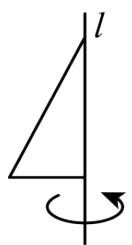

A. 圆柱

B. 三棱柱

C. 圆锥

D. 球

3. （3 分）下列说法中正确的是（）

A. 两个有理数的和一定大于每个加数

B. 绝对值最小的数是 0

C. 整数只包括正整数和负整数

D. -1是最大的负有理数

4. （3 分）（24-25 七年级上·全国·期末）下列图形中，不是正方体的表面展开图的是（）

A.

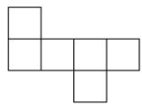

B.

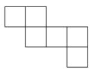

C.

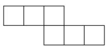

D.

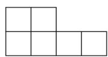

5. （3 分）（25-26 七年级上·江苏连云港·开学考试）我国一元硬币厚度是 1.85 毫米，重 6.1 克．照这样计算，1 亿枚硬币共重（）吨.

A. 6.1

B. 61

C. 610

D. 6100

6. （3 分）（2025·吉林松原·模拟预测）如图，一个圆柱体切去一部分，则从上面看到的图形是（）

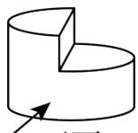

正面

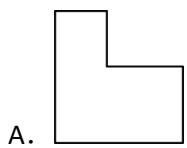

B.

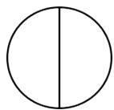

C.

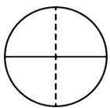

D.

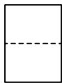

7. （3 分）（24-25 七年级上·贵州遵义·期末）有理数 $a$ 在数轴上的位置如图所示，下列各数中，可能在 1 到 2 之间的是（）

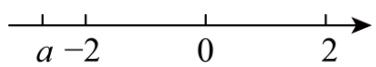

A. $-a$

B. $|a|$

C. $|a| - 1$

D. $1-|a|$

8. （3 分）（24-25 七年级下·安徽宿州·阶段练习）计算 $(-0.75)^{2025} \times \left(\frac{4}{3}\right)^{2024}$ 的结果为（）

A. -0.75

B. 0.75

C. $\frac{4}{3}$

D. $-\frac{4}{3}$

9. （3 分）（24-25 七年级上·河北邢台·期末）如图，数轴上的某数，被墨水遮盖，则该数的相反数可能是（）

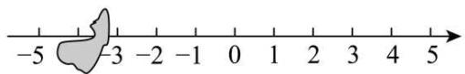

text_image

-5
-3
-2
-1
0
1
2
3
4
5

A. 3.3

B. 3.9

C. -3.3

D. -3.9

10. （3分）（24-25八年级上·贵州遵义·期末）定义一种对正整数n的“F”运算，①当n为奇数时，结果为 $3n+5$ ；②当n为偶数时，结果为 $\frac{k}{2^{n}}$ （其中k是使 $\frac{k}{2^{n}}$ 为奇数的正整数），并且运算重复进行，例如，取n=26，如图所示；若n=449，则第“F④”的运算的结果是（）

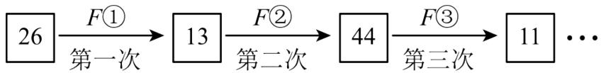

flowchart

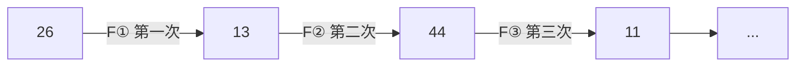

A. 1

B. 3

C. 7

D. 8

# 二．填空题（共6小题，满分18分，每小题3分）教辅资源，关注公众号★全科AA+

11. （3 分）若 $\left|x-2\right|+\left|y+3\right|=0$ ，则 $y^{x}$ 的值为 \_\_\_\_.

12. （3 分）已知点 $A$ 在数轴上表示的数是 $-2$ ，将点 $A$ 先向左平移 3 个单位长度，再向右平移 6 个单位长度得到点 $B$ ，则点 $B$ 表示的数是 \_\_\_\_.

13. （3 分）（24-25 六年级上·山东威海·期中）用一个平面分别截四个几何体：球、圆柱、圆锥、三棱柱，

可以得到三角形截面的几何体有\_\_\_\_。

14. （3 分）在数轴上点 $A$ 表示的数是 $-2$ ，点 $B$ 也在数轴上，且点 $A$ 、 $B$ 之间的距离是 4，则点 $B$ 表示的数是 \_\_\_\_.

15. （3 分）（24-25 七年级上·江苏宿迁·期末）一个正方体的相对的表面上所标的数的和都相等，如图是这个正方体的表面展开图，那么 $x + y$ 的值是\_\_\_\_。

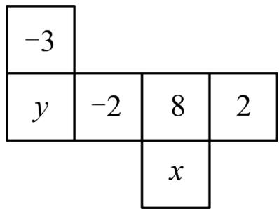

text_image

-3
y -2 8 2
x

16. （3分）（24-25七年级上·广东韶关·期中）如图，第十四届国际数学教育大会（ICME-14）会徽的主题图案有着丰富的数学元素，展现了我国古代数学的文化魅力，其右下方的“卦”是用我国古代的计数符号写出的八进制数3745．八进制是以8作为进位基数的数字系统，有0\~7共8个基本数字．八进制数3745换算成十进制数是 $3 \times 8^{3} + 7 \times 8^{2} + 4 \times 8^{1} + 5 \times 8^{0} = 2021$ ，则八进制数2025换算成十进制数是\_\_\_\_．（注： $8^{0} = 1$ ）

text_image

ICME-14

# 第II卷

# 三．解答题（共8小题，满分72分）

17. （6 分）（24-25 七年级上·贵州贵阳·阶段练习）计算：

(1)(-32)-18+10;

(2) $(-1)^{2025}\cdot\left(\frac{3}{2}\right)^{2}\div\left(-\frac{3}{4}\right)\times\frac{2}{3}.$

18. （6 分）（24-25 七年级上·广东韶关·期中）把下列各数填在相应的横线上：

① -28，② $\frac{13}{5}$ ，③5.21，④0，⑤2050，⑥ $-\frac{3}{8}$ ，⑦-0.1427，⑧ $95\%$ ，⑨-3.14，⑩ $+\frac{1}{2}$

(1) 非负整数: { ...}.

（2）负分数：{ ...}.

（3）正有理数：{\_\_\_\_…};

（4）负有理数：{ ...};

19. （8 分）（24-25 七年级上·山东青岛·期末）如图，在平整的地面上，10 个完全相同的棱长为 $8 \mathrm{~cm}$ 的小正方体堆成一个几何体.

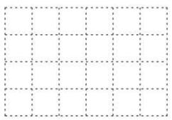

natural_image

Grid pattern with dashed lines forming a 4x4 layout (no text or symbols)

从左面看

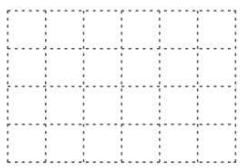

natural_image

Grid pattern with dashed lines forming a 4x4 layout (no text or symbols)

从上面看

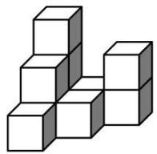

(1)在下面的网格中画出从左面看和从上面看的形状图.   
(2)求这个几何体的表面积. 教辅资源，关注公众号★全科AA+

20. （8分）某检修小组开汽车从A地出发，在东西向的马路上检修电路，如果规定向东行驶为正，向西行驶为负，一天中七次行驶记录如下：-4，+7，-9，+8，+6，-7，-2。（单位：km）

(1)求收工时距A地多远?   
(2)若每千米耗油0.5升，出发时油箱加满且容量为20升，求途中至少还需补充多少升油？

21. （10 分）（24-25 七年级上·湖南衡阳·期中）有理数 a、b、c 在数轴上的位置如图：

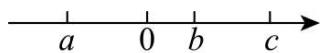

(1) 判断正负，用“＞”或“＜”填空： $b-c_{0}$ ， $-a+b_{0}$ ， $ac_{0}$ .  
(2)化简： $|b-c|-3|-a+b|$ .

22. （10 分）（1）用若干个棱长为 1 的小立方块搭一个几何体，从上面看到这个几何体的形状如图所示．请画出从正面看和从左面看到的这个几何体的形状图.

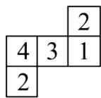

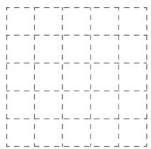

natural_image

Grid of dashed and solid lines forming a 4x4 pattern (no text or symbols)

从正面看

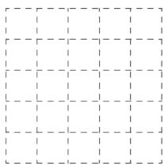

natural_image

Grid pattern with dashed and solid lines forming a 4x4 layout (no text or symbols)

从左面看

（2）请你在下图中增加一个小正方形，使所得图形经过折叠后能成为一个正方体。（画出一种即可）

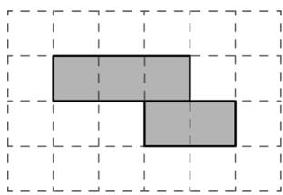

natural_image

Two gray rectangular blocks arranged in an L-shape on a grid background (no text or symbols)

23. （12 分）（24-25 七年级上·河北廊坊·阶段练习）某校篮球队选拔队员，按规定男队员的标准身高为 180cm，高于标准身高的部分记为正，低于标准身高的部分记为负．现有 8 名候选队员，身高记录如下表所示．

<table><tr><td>选手人数(人)</td><td>1</td><td>2</td><td>3</td><td>2</td></tr><tr><td>与标准身高相比(cm)</td><td>-2</td><td>+4</td><td>-6</td><td>-3</td></tr></table>

(1)选拔队员时，身高在180～185cm范围内为合格，则有\_\_\_\_名候选队员合格；  
(2)若将标准放宽为175～185cm，则有\_\_\_\_名候选队员合格；  
(3)求这8名候选队员的平均身高.

24. （12 分）如图，数轴上点A表示的数是-2，点B表示的数是3，阅读以下材料并解决相关问题．若在数轴上存在一点P，使得点P到点A的距离与点P到点B的距离之和等于n，则称点P为点A、B的“n格距点”．例如：在图1中，点P表示的数是-1，点P到点A的距离与点P到点B的距离之和为 $1+4=5$ ，则称点P为点A、B的“5格距点”.

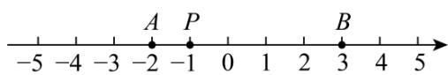

text_image

-5 -4 -3 -2 -1 0 1 2 3 4 5
A P B

(图1)   
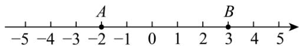

text_image

-5 -4 -3 -2 -1 0 1 2 3 4 5
A
B

(备用图)

(1)若点P表示的数是2，则n的值为\_\_\_\_；  
(2)数轴上表示整数的点称为整点，若整点P为点A、B的“5格距点”，则这样的整点P有\_\_\_\_个；  
(3)若点 P 为数轴上一点，且点 P 到点 B 的距离为 1，求点 P 表示的数及 n 的值；  
(4)若点P在数轴上运动, 满足点P到点B的距离等于点P到点A的距离的2倍, 且此时点P为点A、B的“n格距点”, 求点P表示的数及n的值.