# 七年级数学上学期第一次月考·培优卷

# 【北师大版 2024】

参考答案与试题解析

# 第I卷

# 一．选择题（共10小题，满分30分，每小题3分）

1. （3分）在-2，+3.5，0， $-\frac{2}{3}$ ，-0.7，11中．负数有（）

A. 1 个

B. 2 个

C. 3 个

D. 4 个

【答案】C

【分析】本题考查了负数，根据负数的定义，逐一判断各数是否为负数，再统计个数即可.

【详解】解：在-2，+3.5，0， $-\frac{2}{3}$ ，-0.7，11中．负数有-2， $-\frac{2}{3}$ ，-0.7，共3个，

故选:C.

2. （3 分）（24-25 七年级上·陕西咸阳·期末）将如图所示的直角三角形绕一条直角边所在直线l旋转一周，得到的立体图形是（）

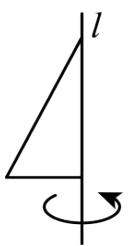

A. 圆柱

B. 三棱柱

C. 圆锥

D. 球

【答案】C

【分析】本题考查了点、线、面、体，根据直角三角形绕直角边旋转是圆锥，可得答案，熟记各种平面图形旋转得到的立体图形是解题的关键.

【详解】解：直角三角形绕一条直角边所在直线 $l$ 旋转一周，得到的立体图形是圆锥，故选：C.

3. （3 分）下列说法中正确的是（）

A. 两个有理数的和一定大于每个加数

B. 绝对值最小的数是 0

C. 整数只包括正整数和负整数

D. -1是最大的负有理数

【答案】B

【分析】本题主要考查了有理数的分类，绝对值的意义，有理数加法．注意整数分为三类，0既不是正数也不是负数．根据有理数的分类，绝对值的意义，有理数加法法则，逐项判断即可；

【详解】解：A、两个有理数的和不一定大于每个加数，例如 $-3+(-2)=-5$ ，和比每一个加数都小，故本选项错误；

B、绝对值最小的数是 0，故本选项正确；

C、整数包括正整数、负整数和零，故本选项错误；

D、比-1大的负有理数可以是 $-\frac{1}{2}$ ，故本选项错误.

故选：B.

4. （3 分）（24-25 七年级上·全国·期末）下列图形中，不是正方体的表面展开图的是（）

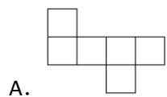

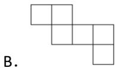

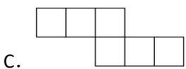

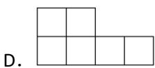

【答案】D

【分析】本题考查了正方体及其表面展开图的特点的知识，掌握以上知识是解答本题的关键；  
本题根据正方体及其表面展开图的特点的知识，进行作答，即可求解；

【详解】解：A、B、C 经过折叠均能围成正方体，由正方体表面展开图的“田凹应弃之”可知，选项 D 不是正方体的表面展开图，折叠后第一行两个面无法折起来，而且缺少一个侧面，不能折成正方体，故选：D.

5. （3 分）（25-26 七年级上·江苏连云港·开学考试）我国一元硬币厚度是 1.85 毫米，重 6.1 克．照这样计算，1 亿枚硬币共重（）吨.

A. 6.1

B. 61

C. 610

D. 6100

【答案】C

【分析】本题考查单位换算及大数乘法应用．根据题意，每枚硬币重6.1克，计算出1亿枚的总重量并转换为吨即可.

【详解】解：1 亿 = 100000000，

$6.1 \times 100000000 = 610000000$ 克，

610000000 克 = 610 吨，

故选：C.

6. （3 分）（2025·吉林松原·模拟预测）如图，一个圆柱体切去一部分，则从上面看到的图形是（）

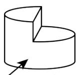

正面

A.

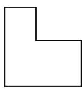

B.

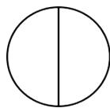

C.

D.

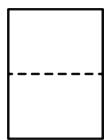

【答案】B

【分析】g c

本题主要考查了从三个方向看几何体．熟练掌握从三个方向看到的形状图是解题的关键．根据从上面看到的形状图判断即得.

【详解】

解：A. ，是从正面看到的图形；

B. ，是从上面看到的图形；

C. ，不是这个切去一部分的圆柱体从各个方面看到的图形；

D. 是从左面看到的图形.

故选：B.

7. （3 分）（24-25 七年级上·贵州遵义·期末）有理数 $a$ 在数轴上的位置如图所示，下列各数中，可能在 1 到 2 之间的是（）

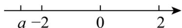

A. -a

B. $|a|$

C. $|a| - 1$

D. $1-|a|$

【答案】C

【分析】本题考查数轴、绝对值相关内容，通过数轴先读取 $a$ 的取值范围，再根据绝对值，相反数的性质求出对应选项的取值范围。解题的关键是对数轴上点对应取值范围的熟练掌握，及对绝对值相反数性质的灵活运用．通过数轴图可以确定 a 的取值范围是：-3 < a < -2，进而可以求出 -a， $|a|$ ， $|a|-1$ ， $1-|a|$ 的取值范围是否在 1 到 2 之间.

【详解】解：通过数轴图可以确定 a 的取值范围是：-3 < a < -2，

$$
\because - 3 <   a <   - 2,
$$

∴ 2 < -a < 3，故选项 A 不符合题意；

$$
\because - 3 <   a <   - 2,
$$

∴ 2 < |a| < 3，故选项 B 不符合题意；

$$
\because 2 <   | a | <   3,
$$

∴ 1 < |a| - 1 < 2，故选项 C 符合题意；

$$
\because 1 <   | a | - 1 <   2,
$$

$\therefore-2<1-|a|<-1$ ，故选项D不符合题意.

故选：C.

8. （3 分）（24-25 七年级下·安徽宿州·阶段练习）计算 $(-0.75)^{2025} \times \left(\frac{4}{3}\right)^{2024}$ 的结果为（）

A. -0.75

B. 0.75

C. $\frac{4}{3}$

D. $-\frac{4}{3}$

【答案】A

【分析】本题考查了乘方的运算，积的乘方的逆运算，熟练掌握运算法则是解题的关键．先利用乘方的定义得出 $(-0.75)^{2025}\times\left(\frac{4}{3}\right)^{2024}=\left(-\frac{3}{4}\right)^{2024}\times\left(\frac{4}{3}\right)^{2024}\times\left(-\frac{3}{4}\right)$ ，再利用积的乘方的逆运算法则计算即可.

【详解】解： $(-0.75)^{2025}\times\left(\frac{4}{3}\right)^{2024}$

$$
\begin{array}{l} = \left(- \frac {3}{4}\right) ^ {2 0 2 4} \times \left(\frac {4}{3}\right) ^ {2 0 2 4} \times \left(- \frac {3}{4}\right) \\ = \left(- \frac {3}{4} \times \frac {4}{3}\right) ^ {2 0 2 4} \times \left(- \frac {3}{4}\right) \\ = (- 1) ^ {2 0 2 4} \times \left(- \frac {3}{4}\right) \\ = 1 \times \left(- \frac {3}{4}\right) \\ = - 0. 7 5, \\ \end{array}
$$

故选：A.

9. （3 分）（24-25 七年级上·河北邢台·期末）如图，数轴上的某数，被墨水遮盖，则该数的相反数可能是（）

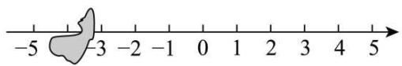

text_image

-5
-3
-2
-1
0
1
2
3
4
5

A. 3.3

B. 3.9

C. -3.3

D. -3.9

【答案】A

【分析】本题主要考查了有理数与数轴，相反数定义，根据由数轴可知，被遮住的数大于负3.5，小于负3，根据相反数定义得出该数的相反数可能是大于3，小于3.5，据此可得答案.

【详解】解：由数轴可知，被遮住的数大于负3.5，小于负3，

∴该数的相反数可能是大于3，小于3.5，

∴四个选项中只有 A 选项符合题意，

故选：A.

10. （3分）（24-25八年级上·贵州遵义·期末）定义一种对正整数n的“F”运算，①当n为奇数时，结果为 $3n+5$ ；②当n为偶数时，结果为 $\frac{k}{2^{n}}$ （其中k是使 $\frac{k}{2^{n}}$ 为奇数的正整数），并且运算重复进行，例如，取n=26，如图所示；若n=449，则第“F④”的运算的结果是（）

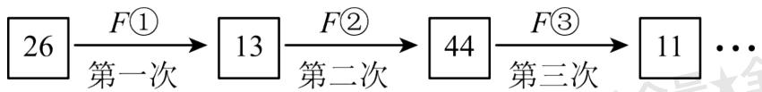

flowchart

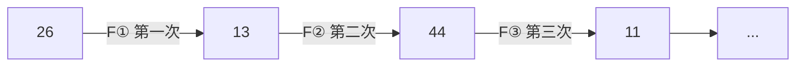

A. 1

B. 3

C. 7

D. 8

【答案】A

【分析】据提供的“F”运算，对正整数 n 分情况(奇数、偶数)循环计算，由于 n = 449 为奇数应先进行 F① 运算，再按照新定义进行计算即可求解．本题主要考查了新定义运算，有理数的混合运算．熟练掌握“F”运算法则，找到结果存在的规律，根据有理数的混合运算求出答案，是解题的关键.

【详解】解： $F①: 3 \times 449 + 5 = 1352$ ，

$F②:\ \frac{1352}{2^{k}},\ 1352\div8=169,\ 即 k=3,$

$F③$ : $3 \times 169 + 5 = 512$ ,

$F④$ : $512 = 2^{9}$ ，即 k = 9，计算结果为 1，

故选：A.

# 二．填空题（共6小题，满分18分，每小题3分）

11. （3分）若 $|x-2|+|y+3|=0$ ，则 $y^{x}$ 的值为\_\_\_\_。

【答案】9

【分析】本题考查了绝对值的非负性，有理数的乘方运算，代数式求值，熟练掌握绝对值的非负性时候解

题的关键.

先根据绝对值的非负性求出x=2,y=-3，再代入求值即可.

【详解】解：∵ $|x-2|+|y+3|=0,\quad|x-2|\geq0,|y+3|\geq0,$

$$
\therefore x - 2 = 0, y + 3 = 0,
$$

解得：x = 2, y = -3,

$$
\therefore y ^ {x} = (- 3) ^ {2} = 9,
$$

故答案为：9.

12. （3 分）已知点 $A$ 在数轴上表示的数是 $-2$ ，将点 $A$ 先向左平移 3 个单位长度，再向右平移 6 个单位长度得到点 $B$ ，则点 $B$ 表示的数是 \_\_\_\_.

【答案】1

【分析】本题主要考查了数轴上的点移动后所表示的数，有理数加减混合运算，明确数轴上的点移动时，向左移动几个单位减去几，向右移动几个单位加上几，是解题的关键．根据数轴上的点向左移动用减法，向右移动用加法，据此可解.

【详解】∵点 A 在数轴上表示的数是 -2，将点 A 先向左平移 3 个单位长度，再向右平移 6 个单位长度得到点 B，

∴点 B 表示的数是： $-2-3+6=1$ ，

故答案为：1.

13. （3 分）（24-25 六年级上·山东威海·期中）用一个平面分别截四个几何体：球、圆柱、圆锥、三棱柱，可以得到三角形截面的几何体有

【答案】圆锥，三棱柱

【分析】本题考查了几何体的截面，解决本题的关键是掌握用平面截不同几何体可以形成的截面是什么形状.

【详解】解：用平面截球和圆柱都不能得到三角形，

用平面截圆锥、三棱柱可以得到三角形.

故答案为：圆锥、三棱柱。

14. （3 分）在数轴上点 $A$ 表示的数是 $-2$ ，点 $B$ 也在数轴上，且点 $A$ 、 $B$ 之间的距离是 4，则点 $B$ 表示的数是 \_\_\_\_.

【答案】-6或2

【分析】本题考查了在数轴上表示有理数，两点间的距离，有理数的加减法应用，正确掌握相关性质内容

是解题的关键．理解题意，进行分类讨论，再列式计算，即可作答.

【详解】解：∵在数轴上点 A 表示的数是 -2，点 A、B 之间的距离是 4，

∴当点 B 在点 A 的左边时，则 -2-4 = -6;

∴当点 B 在点 A 的右边时，则 $-2 + 4 = 2$ ;

故答案为：-6或2

15. （3 分）（24-25 七年级上·江苏宿迁·期末）一个正方体的相对的表面上所标的数的和都相等，如图是这个正方体的表面展开图，那么 $x + y$ 的值是\_\_\_\_。

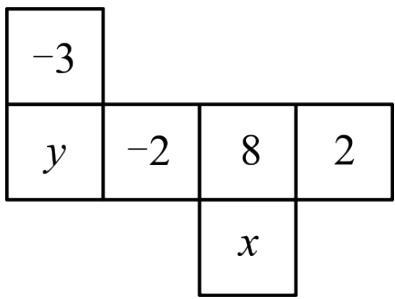

text_image

-3
y -2 8 2
x

【答案】-5

【分析】本题考查了正方体相对两个面上的数字，熟练掌握正方体表面展开图的特征判定相对的面是关键。根据正方体表面展开图的特征判定相对的面，再根据相反数的意义求解即可。

【详解】解：依题意可知，x 与 -3 是相对面，y 与 x 是相对面，-2 与 2 是相对面，

∵ 相对的表面上所标的数的和都相等，

$$
\therefore x - 3 = 2 + (- 2) = 0, y + 8 = 2 + (- 2) = 0,
$$

解得x=3，y=-8，

$$
x + y = 3 - 8 = - 5.
$$

故答案为：-5.

16. （3 分）（24-25 七年级上·广东韶关·期中）如图，第十四届国际数学教育大会（ICME-14）会徽的主题图案有着丰富的数学元素，展现了我国古代数学的文化魅力，其右下方的“卦”是用我国古代的计数符号写出的八进制数 3745．八进制是以 8 作为进位基数的数字系统，有 0\~7 共 8 个基本数字．八进制数 3745 换算成十进制数是 $3 \times 8^{3} + 7 \times 8^{2} + 4 \times 8^{1} + 5 \times 8^{0} = 2021$ ，则八进制数 2025 换算成十进制数是\_\_\_\_．（注： $8^{0} = 1$ ）

text_image

ICME-14

【答案】1045

【分析】本题考查有理数的混合运算，理解题意，正确求解是解答的关键.

根据题意列出算式，然后利用有理数的混合运算法则求解即可.

【详解】解：八进制数 2025 换算成十进制数为

$$
\begin{array}{l} 2 \times 8 ^ {3} + 0 \times 8 ^ {2} + 2 \times 8 ^ {1} + 5 \times 8 ^ {0} \\ = 1 0 2 4 + 0 + 1 6 + 5 \\ = 1 0 4 5. \\ \end{array}
$$

故答案为：1045.

# 第II卷

# 三．解答题（共8小题，满分72分）

17. （6 分）（24-25 七年级上·贵州贵阳·阶段练习）计算：

$$
\begin{array}{l} (1) (- 3 2) - 1 8 + 1 0; \\ (2) (- 1) ^ {2 0 2 5} \cdot \left(\frac {3}{2}\right) ^ {2} \div \left(- \frac {3}{4}\right) \times \frac {2}{3}. \\ \end{array}
$$

【答案】(1)40

(2)2

【分析】本题考查了含乘方的有理数的混合运算等知识点，熟练掌握其运算顺序是解决此题的关键.

(1) 利用有理数的加减法则计算即可;  
(2) 利用含乘方的有理数的混合运算法则计算即可.

【详解】（1）解： $(-32)-18+10$

$$
\begin{array}{l} = (- 3 2) + (- 1 8) + 1 0 \\ = (- 5 0) + 1 0 \\ = - 4 0; \\ \end{array}
$$

$$
\begin{array}{l} = (- 1) \times \frac {9}{4} \times \left(- \frac {4}{3}\right) \times \frac {2}{3} \\ = 2. \\ \end{array}
$$

(2) 解: $(-1)^{2025} \cdot \left(\frac{3}{2}\right)^{2} \div \left(-\frac{3}{4}\right) \times \frac{2}{3}$

$$
\begin{array}{l} = (- 1) \times \frac {9}{4} \times \left(- \frac {4}{3}\right) \times \frac {2}{3} \\ = 2. \\ \end{array}
$$

18. （6 分）（24-25 七年级上·广东韶关·期中）把下列各数填在相应的横线上：

① -28，② $\frac{13}{5}$ ，③5.21，④0，⑤2050，⑥ $-\frac{3}{8}$ ，⑦-0.1427，⑧ $95\%$ ，⑨-3.14，⑩ $+\frac{1}{2}$

(1) 非负整数: {\_\_\_\_...}.

(2) 负分数: {\_\_\_\_...}.   
（3）正有理数：{\_\_\_\_…};  
（4）负有理数：{\_\_\_\_…};

【答案】（1）④，⑤；

(2) ⑥, ⑦, ⑨;   
(3) ②, ③, ⑤, ⑧, ⑩;   
(4) ①, ⑥, ⑦, ⑨

【分析】本题考查了有理数的分类，解题的关键是明确各类有理数的定义（非负整数包括正整数和 0；负分数是小于 0 的分数；正有理数包括正整数和正分数；负有理数包括负整数和负分数）.

根据非负整数、负分数、正有理数、负有理数的定义，对所给的数逐一进行分类.

【详解】解：（1）非负整数：

非负整数包括正整数和0．在所给数中，④是整数且非负，⑤2050是正整数，所以非负整数：④，⑤；

(2) 负分数:

负分数是小于 0 的分数，分数包括有限小数和无限循环小数。⑥- $\frac{3}{8}$ 是负的分数形式，⑦-0.1427是负的有限小数，可化为负分数，⑨-3.14是负的有限小数，可化为负分数，所以负分数：⑥, ⑦, ⑨；

（3）正有理数：

正有理数包括正整数和正分数。② $\frac{13}{5}$ 是正分数，③5.21是正分数，⑤2050是正整数，⑧%95%= $\frac{95}{100}$ 是正分数，⑩+ $\frac{1}{2}$ 是正分数，所以正有理数：②,③,⑤,⑧,⑩；

(4) 负有理数:

负有理数包括负整数和负分数。①-28是负整数，⑥ $-\frac{3}{8}$ 是负分数，⑦-0.1427是负分数，⑨-3.14是负分数，所以负有理数：①, ⑥, ⑦, ⑨。

故答案为：（1）④，⑤；

(2) ⑥, ⑦, ⑨;   
(3) ②, ③, ⑤, ⑧, ⑩;   
(4) ①, ⑥, ⑦, ⑨.

19. （8 分）（24-25 七年级上·山东青岛·期末）如图，在平整的地面上，10 个完全相同的棱长为 $8 \mathrm{~cm}$ 的小正方体堆成一个几何体.

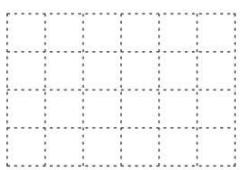

natural_image

Grid pattern with dashed lines forming a 4x4 layout (no text or symbols)

从左面看

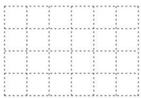

natural_image

Grid pattern with dashed lines forming a 4x4 layout (no text or symbols)

从上面看

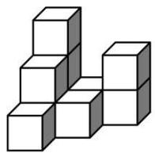

(1)在下面的网格中画出从左面看和从上面看的形状图.   
(2)求这个几何体的表面积.

【答案】(1)见解析

(2)2432

【分析】本题考查了从不同方向看、画图形，计算表面积，熟练掌握不同方向看图形的画法，学会分类计算表面积是解题的关键.

(1) 按照定义画出图形即可.   
(2) 按照上下面, 左右面, 前后面, 再加上两个相对面, 计算即可.

【详解】（1）解：如图所示，

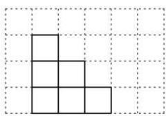

natural_image

Geometric grid pattern with four empty squares arranged in a stepped shape (no text or symbols)

从左面看

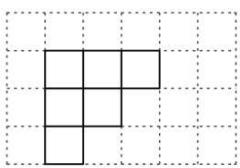

natural_image

Geometric grid pattern with a central square formed by smaller squares (no text or symbols)

从上面看

(2) 解: $\because$ 正方体的棱长为 $8 \mathrm{~cm}$ ,

∴一个正方形的面积为 $64cm^{2}$ ,

∵上下面有12个，左右面有12个，前后面有12个，再加上两个相对面，

∴这个几何体的表面积为： $64 \times (12 + 12 + 12 + 2) = 2432 \, \text{cm}^2$

20. （8 分）某检修小组开汽车从A地出发，在东西向的马路上检修电路，如果规定向东行驶为正，向西行驶为负，一天中七次行驶记录如下：-4，+7，-9，+8，+6，-7，-2。（单位：km）

(1)求收工时距A地多远?   
(2)若每千米耗油0.5升，出发时油箱加满且容量为20升，求途中至少还需补充多少升油？

【答案】(1)收工时距A地1km

(2)途中还需补充1.5升

【分析】本题主要考查正负数的意义，绝对值的含义，及有理数的加减运算，正确理解正负数的意义及掌握有理数的运算法则是解题的关键.

(1) 由收工时距 A 地的距离等于所有记录数字的和的绝对值, 从而可得答案;

（2）所有记录数的绝对值之和乘以每千米耗油量，就是共耗油数，再减去油箱中存油量即可得到答案.

【详解】（1）解： $-4+7-9+8+6-7-2=-1$ ，又 $|-1|=1$ ，

故收工时距离A地1km;

（2）解： $0.5 \times \left( |-4| + | + 7| + |-9| + | + 8| + | + 6| + |-7| + |-2| \right) = 21.5$ （升）

所以途中还需要补充：21.5-20 = 1.5（升）.

答：途中还需补充1.5升.

21. （10 分）（24-25 七年级上·湖南衡阳·期中）有理数 $a$ 、 $b$ 、 $c$ 在数轴上的位置如图：

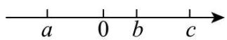

(1) 判断正负，用“＞”或“＜”填空： $b-c_{0}$ ， $-a+b_{0}$ ， $ac_{0}$ .  
(2)化简： $|b-c|-3|-a+b|$ .

【答案】(1) < ; > ; <

(2) $3a - 4b + c$

【分析】本题考查了利用数轴比较理数大小、绝对值，牢记有理数大小比较的法则是解题的关键.

（1）观察数轴可知a<0<b<c，由此即可得出结论；  
（2）由b-c<0， $-a+b>0$ ，结合绝对值的定义，即可得出 $|b-c|-3|-a+b|$ 的值.

【详解】（1）解：观察数轴可知：a < 0 < b < c，

$$
\therefore b - c <   0, - a + b > 0, a c <   0,
$$

故答案为： $<; >; <;$

(2) $\because b-c<0,\quad-a+b>0$

$$
\therefore | b - c | - 3 | - a + b | = - (b - c) - 3 (- a + b) = 3 a - 4 b + c.
$$

22. （10 分）（1）用若干个棱长为 1 的小立方块搭一个几何体，从上面看到这个几何体的形状如图所示．请画出从正面看和从左面看到的这个几何体的形状图.

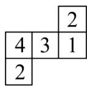

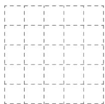

natural_image

Pure grid pattern with dashed lines, no text or symbols present

从正面看

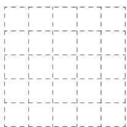

natural_image

Empty grid pattern with dashed lines, no text or symbols present

从左面看

（2）请你在下图中增加一个小正方形，使所得图形经过折叠后能成为一个正方体。（画出一种即可）

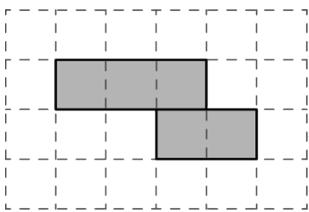

natural_image

Two gray rectangular blocks arranged in an L-shape on a grid background (no text or symbols)

【答案】（1）见详解（2）见详解（答案不唯一）

【分析】本题主要考查了作图—三视图、几何体的展开图等知识，理解三视图的定义和正方体的展开图是解题关键.

(1) 根据三视图的定义画图即可;   
(2) 根据正方体的展开图画图即可.

【详解】解：（1）如下图所示；

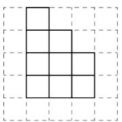  
从正面看

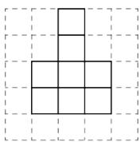  
从左面看

(2) 如下图所示（答案不唯一）.

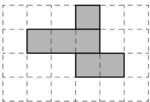

natural_image

Geometric shape composed of two gray squares arranged in an L-shape on a grid background (no text or symbols)

23. （12 分）（24-25 七年级上·河北廊坊·阶段练习）某校篮球队选拔队员，按规定男队员的标准身高为 180cm，高于标准身高的部分记为正，低于标准身高的部分记为负．现有 8 名候选队员，身高记录如下表所示.

<table><tr><td>选手人数(人)</td><td>1</td><td>2</td><td>3</td><td>2</td></tr><tr><td>与标准身高相比(cm)</td><td>-2</td><td>+4</td><td>-6</td><td>-3</td></tr></table>

(1)选拔队员时，身高在180～185cm范围内为合格，则有\_\_\_\_名候选队员合格；  
(2)若将标准放宽为175～185cm，则有\_\_\_\_名候选队员合格；  
(3)求这 8 名候选队员的平均身高.

【答案】(1)2

(2)5   
(3)177.75cm

【分析】本题考查有理数运算的实际应用，正负数的应用，正确的列出算式，是解题的关键：

（1）根据表格数据，求出真实身高，进行判断即可；  
（2）根据表格数据，求出真实身高，进行判断即可；  
（3）求出 8 名候选队员的身高和，再除以总人数，进行求解即可.

【详解】（1）解： $180-2=178cm$ ， $180+4=184cm$ ， $180-6=174cm$ ， $180-3=177cm$ ，故身高在 $180\sim185cm$ 范围内为合格时，有身高为 $184cm^{2}$ 名候选队员合格；

故答案为：2;

（2）由（1）可知，将标准放宽为175～185cm，有 $1+2+2=5$ 名候选队员合格；

故答案为：5;

(3) $(178 \times 1 + 184 \times 2 + 174 \times 3 + 177 \times 2) \div 8 = 177.75\mathrm{cm}$ ;

答: 这 8 名候选队员的平均身高为 $177.75 \mathrm{~cm}$ .

24. （12 分）如图，数轴上点A表示的数是-2，点B表示的数是3，阅读以下材料并解决相关问题．若在数轴上存在一点P，使得点P到点A的距离与点P到点B的距离之和等于n，则称点P为点A、B的“n格距点”．例如：在图1中，点P表示的数是-1，点P到点A的距离与点P到点B的距离之和为 $1+4=5$ ，则称点P为点A、B的“5格距点”.

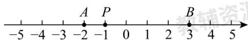

text_image

-5 -4 -3 -2 -1 0 1 2 3 4 5
A P B
辅助

(图1)   

text_image

-5 -4 -3 -2 -1 0 1 2 3 4 5
A
B

(备用图)

(1)若点P表示的数是2，则n的值为\_\_\_\_；  
(2)数轴上表示整数的点称为整点，若整点P为点A、B的“5格距点”，则这样的整点P有\_\_\_\_个；  
(3)若点 P 为数轴上一点，且点 P 到点 B 的距离为 1，求点 P 表示的数及 n 的值；  
(4)若点P在数轴上运动, 满足点P到点B的距离等于点P到点A的距离的2倍, 且此时点P为点A、B的“n格距点”, 求点P表示的数及n的值.

【答案】(1)5

(2)6

(3)点P表示的数为2或4，n=5或n=7  
(4)当P在AB之间时，点P表示的数为 $-\frac{1}{3}$ ，n=5；当P在点A左边时，点P表示的数为-7，n=15

【分析】本题考查了新定义，用数轴上的点表示有理数，数轴上两点之间的距离，数轴上的动点问题，理

解题意，利用数形结合的思想是解题关键.

(1) 由题意可求出点 $P$ 到点 $A$ 的距离与点 $P$ 到点 $B$ 的距离之和为5, 即可求解;  
（2）根据题意可得出，即说明点P在线段AB上，从而得出整点P所表示的数是-2，-1，0，1，2，3；  
（3）由题意可求出点P表示的数是2或4，进而即可求出n的值；

（4）分两种情况讨论：当P在AB之间时，AB = 5，点P表示的数为 $-\frac{1}{3}$ ，此时n = 5；当P在点A左边时，PA = AB = 5，点P表示的数为-7，此时n = 15.

【详解】（1）解：∵点P表示的数为2，

∴点P到点A的距离与点P到点B的距离之和为 $4+1=5$ ,

∴点P为点A、B的“5格距点”，

$$
\therefore n = 5,
$$

故答案为：5;

(2) 解: $\because$ 整点 $P$ 为点 $A 、 B$ 的“5格距点”,

$\therefore PA + PB = 5$ ，即P在线段AB上，

∴整点P所表示的数是-2，-1，0，1，2，3，共6个，

故答案为：6;

（3）解：∵点P到点B的距离为1，

∴点P表示的数为2或4，

①当点P表示的数为2时，点P到点A的距离与点P到点B的距离之和为 $4 + 1 = 5$ ，此时n = 5；  
②当点P表示的数为4时，点P到点A的距离与点P到点B的距离之和为 $6+1=7$ ，此时n=7；

(4) 解: ①当P在AB之间时, AB = 5,

点P表示的数为： $3-5\times\frac{2}{3}=-\frac{1}{3}$

此时n=5;

②当P在点A左边时，PA = AB = 5，

点 P 表示的数为：-2-5 = -7，

此时 $n = 5 + 10 = 15$