# 七年级数学上学期第一次月考·拔尖卷

# 【北师大版 2024】

时间：120 分钟 满分：120 分 测试范围：丰富的图形世界\~有理数及其运算

姓名：\_\_\_\_ 班级：\_\_\_\_ 考号：\_\_\_\_

考卷信息:

本卷试题共 24 题，单选 10 题，填空 6 题，解答 8 题，满分 120 分，限时 120 分钟，本卷题型针对性较高，覆盖面广，选题有深度，可衡量学生掌握本章内容的具体情况！

# 第I卷

# 一．选择题（共10小题，满分30分，每小题3分）

教辅资源，关注公众号★全科AA+

1. （3 分）（24-25 七年级上·全国·阶段练习）如图所示，若 $a + b + c = 0$ ，则下面判断中一定成立的是（）

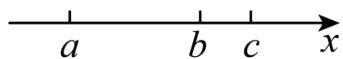

A. a < 0, c < 0

B. $a <   0,c > 0$

C. a > 0, c < 0

D. a > 0, c > 0

2. （3 分）（24-25 七年级上·江苏南京·阶段练习）若整数 $a$ 、 $b$ 满足 $|a + 1| + |b - 1| = 2$ ，则满足条件的 $a + b$ 的值有（）

A. 1 个

B. 2 个

C. 3 个

D. 4 个

3. （3 分）（24-25 七年级上·湖北黄石·阶段练习）在 -13 与 23 之间插入三个数，使这五个数中每相邻两个数的差相等，则插入的这三个数的和是( )

A. 15

B. 5

C. 9

D. 14

4. （3 分）如图，CD 是直角三角形 ABC 的高，将直角三角形 ABC 按以下方式旋转一周可以得到右侧几何体的是（）.

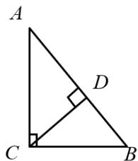

text_image

A
D
C
B

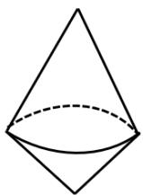

A. 绕着 $AC$ 旋转

B. 绕着AB旋转

C. 绕着CD旋转

D. 绕着BC旋转

5. （3 分）（24-25 七年级上·江苏南京·阶段练习）若 $2024^{6} - a^{2024}$ 结果的个位数字是 1，则 $a$ 的值可能是（）

A. 13

B. 24

C. 35

D. 49

6. （3 分）（24-25 七年级上·山西太原·阶段练习）一个几何体由几个大小相同的小立方块搭成，从上面观察这个几何体，看到的形状如图所示，其中小正方形中的数字表示该位置的小立方块的个数，则从正面看这个几何体的形状图是（）

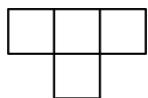

A.

B.

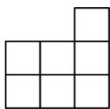

D.

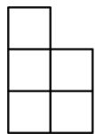

7. （3 分）（24-25 七年级上·湖北武汉·开学考试）下面各组数中，不能通过加、减、乘、除（含括号）运算得到 24 的是（）

A. 1, 1, 7, 7

B. 2, 2, 8, 8

C. 1, 1, 2, 8

D. 1, 1, 4, 6

8. （3 分）（24-25 七年级上·全国·期末）如图是一个正方体的表面展开图，则该正方体可能是（）

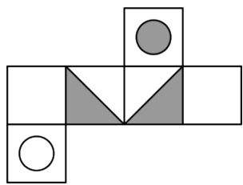

natural_image

Abstract geometric pattern composed of squares and triangles, no text or symbols present

A.

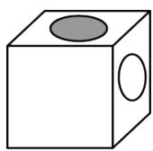

B.

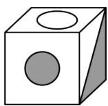

C.

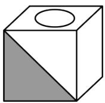

D.

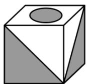

9. （3分）已知 $abc < 0$ ， $a + b + c > 0$ 且 $x = \frac{a}{|a|} + \frac{b}{|b|} + \frac{c}{|c|} + \frac{ab}{|ab|} + \frac{ac}{|ac|} + \frac{bc}{|bc|}$ . 则 $x$ 的值为（）

A. 0 或 1

B. 0

C. 0 或 -2 或 1

D. 0 或 1 或 -6

10. （3 分）七年级某班的学生共有 49 人，军训时排列成 $7 \times 7$ 的方阵，做了一个游戏，起初全体学生站立，教官每次任意点 n 个不同学号的学生，被点到的学生，站立的蹲下，蹲下的站立，且学生都正确完成指令同一名学生可以多次被点，则 m 次点名后，（n，m 为正整数）下列说法正确的是（）

A. 当 $n$ 为偶数时, 无论 $m$ 何值, 蹲下的学生人数不可能为奇数个  
B. 当 $n$ 为偶数时, 无论 $m$ 何值, 蹲下的学生人数不可能为偶数个  
C. 当 $n$ 为奇数时, 无论 $m$ 何值, 蹲下的学生人数不可能为偶数个  
D. 当 $n$ 为奇数时, 无论 $m$ 何值, 蹲下的学生人数不可能为奇数个

# 二．填空题（共6小题，满分18分，每小题3分）教辅资源，关注公众号★全科AA+

11. （3 分）（24-25 七年级上·江苏常州·阶段练习）数轴上表示整数的点为整点，某数轴的单位长度是 1 厘米，若在这个数轴上随意放上一根长为整数厘米的火柴棒，该火柴棒能盖住 3 个整点，则这根火柴棒的长度为\_\_\_\_厘米。  
12. （3 分）（24-25 七年级上·全国·期中）如图所示，这个几何体是由若干个完全相同的小正方体搭成的．如果在这个几何体上再添加一些相同的小正方体，并保持其从正面看和从左面看得到的图形不变，那么最多可以再添加\_\_\_\_个小正方体．

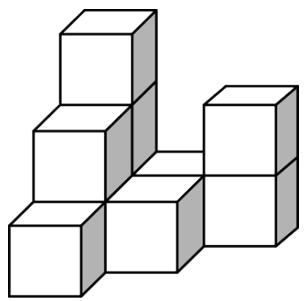

natural_image

3D geometric arrangement of white cubes forming a stepped structure (no text or symbols)

13. （3 分）（24-25 七年级上·河北廊坊·阶段练习）现有 5000 张A4纸，每张厚度为 0.1 毫米，若将每张纸对折 3 次，则对折后的 5000 张纸的厚度为\_\_\_\_（用科学记数法表示）毫米。  
14. （3分）（2025·陕西咸阳·二模）高斯被认为是历史上最杰出的数学家之一，享有“数学王子”之称。现有一种高斯定义的计算式，已知[x]表示不超过x的最大整数，例如 $[-0.8]=-1$ 。现定义 $\{x\}=x+[x]$ ，例如 $\{x\}=1.5+[1.5]=2.5$ ，则 $\{-2.5\}=$ \_\_\_\_.  
15. （3 分）（24-25 七年级上·江苏南京·期末）按图示切割正方体就可以切割出正六边形（正六边形的各顶点恰是其棱的中点），以下此正方体的平面展开图及切割线的画法正确的有\_\_\_\_。（填序号）

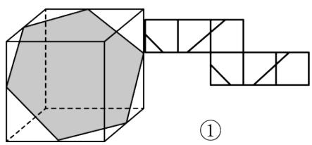

natural_image

Geometric diagram showing a polyhedron inscribed in a cube with connected squares and triangles (no text or symbols)

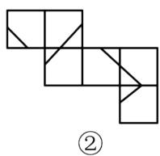

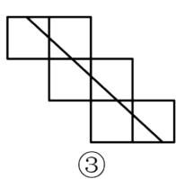

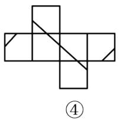

natural_image

Geometric diagram of a cross-shaped arrangement with diagonal lines, no text or symbols present

16. （3 分）（2025·北京门头沟·二模）某快递公司因天气原因需将五种货物进行延迟配送，每名配送员每次只能配送一种货物，从配送开始起进行计时，每延迟一分钟需赔付 1 元，忽略其它因素的影响，五种货物的配送时间如下表：

<table><tr><td>货物</td><td>A</td><td>B</td><td>C</td><td>D</td><td>E</td></tr><tr><td>配送时间(分钟)</td><td>5</td><td>8</td><td>9</td><td>7</td><td>10</td></tr></table>

(1) 如果由一名配送员进行配送, 那么下列三个配送顺序: ① $D \rightarrow B \rightarrow E \rightarrow A \rightarrow C$ ; ② $D \rightarrow A \rightarrow C \rightarrow E \rightarrow B$ ; ③ $C \rightarrow A \rightarrow E \rightarrow B \rightarrow D$ 中, 赔付最少的是\_\_\_\_（填序号）;

(2) 如果由两名配送员同时进行配送, 最少需要赔付\_\_\_\_元.

# 第II卷

# 三．解答题（共8小题，满分72分） 教辅资源，关注公众号★全科AA+

17. （6 分）（24-25 七年级上·全国·阶段练习）计算

(1) $-1^{2024} - \frac{1}{6} \times [2 - (-3)^{2}]$   
(2) $(-5)^{2} - \left[-4 + \left(1 - 0.2 \times \frac{1}{5}\right) \div (-2)\right]$

18. （6分）（24-25七年级上·湖北恩施·阶段练习）已知在数轴上有三点A，B，C，点A表示的数为a，点B表示的数为b，且a、b满足 $(a+3)^{2}+|b-1|=0$ 。沿A，B，C三点中的一点折叠数轴。

(1)求 $a, b$ 的值；  
(2)若另外两点互相重合，则点 C 表示的数是 \_\_\_\_.  
19. （8 分）（24-25 七年级上·湖南衡阳·开学考试）某市出租车的收费标准如下；

<table><tr><td>里程</td><td>收费</td></tr><tr><td>3千米及3千米以下</td><td>8.00元</td></tr><tr><td>3千米以上,单程,每增加1千米</td><td>1.60元</td></tr><tr><td>3千米以上,往返,每增加1千米</td><td>1.20元</td></tr></table>

(1)李丽乘出租车从家到外婆家共付车费 17.6 元，李丽家到外婆家相距多少千米？  
(2)王老师从学校去相距 6 千米的人事局取一份资料并立即回到学校。他怎样坐车比较合算？需付出租车费多少元？

20. （8 分）（24-25 七年级上·全国·期末）如图所示的是用 8 个大小相同的小正方体搭成的几何体.

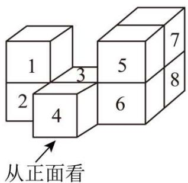

text_image

1
2
3
4
5
6
7
8
从正面看

(1)画出该几何体从正面和从左面看到的形状图.

(2)在该几何体中取走一个小正方体, 使得到的新几何体同时满足两个要求: ①从正面看到的形状图和原几何体从正面看到的形状图相同; ②从左面看到的形状图和原几何体从左面看到的形状图也相同. 在不改变其他小正方体位置的前提下, 可取走的小正方体是\_\_\_\_（只取走一个）.

21. （10 分）（24-25 七年级下·广东佛山·期中）一个三位数，若它是 3 的倍数，则把它除以 3 的商作为下一个数：否则，把它各位上的数相加的和再平方后作为下一个数．重复这个过程……直到出现了与之前重复的数，那就输出此数作为最终结果，结束操作．

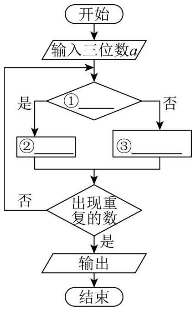

flowchart

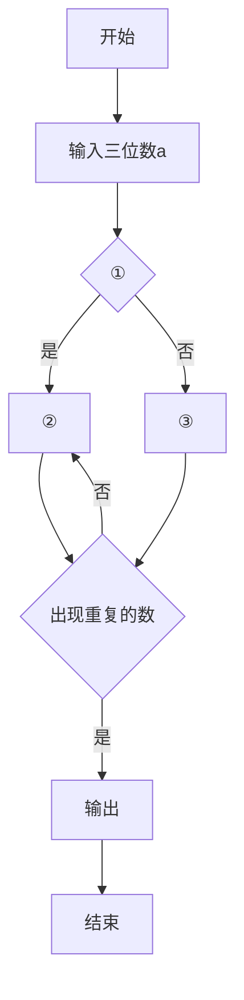

(1)上面的文字语言可以转化为流程图表达. 如图是流程图的一部分, 请把这个流程图补充完整. ①\_, ②\_, ③\_(在每空中填入题干中的关键词句, 把这个运算程序补充完整)

(2)现在输入一个三位数，如 123 作为起始数，操作第 3 次后得到的数是多少？请你写出过程.

(3)继续第（2）问的运算，操作\_次能够结束循环？最后输出的结果是\_.

(4)若起始数输入的三位数各位上的数字都是相同的数，如输入 111，最后输出的结果是\_；输入 222，最后输出的结果是\_.

22. （10 分）算筹是我国古代的计算工具之一，也是中华民族智慧的结晶，如要表示一个多位数字，即把各位的数字从左到右横列，各位数的筹式需要纵横相间，个位数用纵式表示，十位数用横式表示，百位、万位用纵式，千位、十万位用横式．例如614用算筹表示出来是T－| |；数字有空位时，如86021用算筹表示出来是π⊥=1，百位是空位就不放算筹.

纵式 1 2 3 4 5 6 7 8 9
| | | | | | | | | | | | | | | | | |

横式 $- = \equiv \equiv \equiv \perp \perp \perp \perp$

6728 表示为 $\bot\Pi=\Pi\Pi$

6708 表示为 ⊥ Ⅱ Ⅲ

(1) 8335 用算筹可表示为 ( )

A. ⊥ ≡ ||| ||| | B. ⊥ ||| ≡ ||| | C. ∅ = ||| ||| | D. ∅ ||| ≡ |||

(2) 算式“7408 + 2366”可用如图①中的算筹表示, 如图②中算筹表示两个三位数的运算, 其结果为\_\_\_\_\_\_\_\_;

⊥ Ⅲ Ⅲ + = Ⅲ ⊥ T Ⅰ Ⅲ - Ⅲ Ⅲ = Ⅲ

图①

图②

(3) “| | | | ≡”表示的最小的数是\_\_\_\_.

23. （12 分）（1）小明准备制作一个封闭的正方体盒子，他先用 5 个大小一样的正方形制成如图 1 所示的拼接图形（实线部分），经折叠后发现还少一个面，请在图中的拼接图形上再接一个正方形，使新拼接的图形经过折叠后能成为一个封闭的正方体盒子。（添加的正方形用阴影表示．只要画出一种即可）

(2) 如图 2 所示的几何体是由几个相同的正方体搭成的, 请画出它从正面看的形状图.

（3）如图 3 是几个正方体所组成的几何体从上面看的形状图，小正方形中的数字表示该位置小正方体的个数，请画出这个几何体从左面看的形状图.

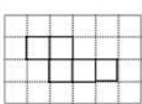

natural_image

Grid pattern with four connected squares (no text or symbols)

图1

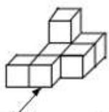  
正面

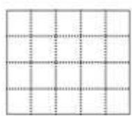  
图2

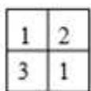

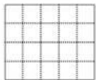  
图3

24. （12 分）（24-25 七年级上·全国·期末）已知点 A 在数轴上对应的数为 a，点 B 在数轴上对应的数为 b，且 $\left|a+3\right|+\left|b-2\right|=0$ ，A、B 之间的距离记为 $\left|AB\right|=\left|a-b\right|$ 或 $\left|b-a\right|$ ，请回答问题：

(1)直接写出 a, b 值， $a = \_, b = \_.$   
(2)设点 P 在数轴上对应的数为 x，若 $\left|x-3\right|=5$ ，则 $x=\_$ .  
(3)如图，点 M，N，P 是数轴上的三点，点 M 表示的数为 4，点 N 表示的数为 -1，动点 P 表示的数为 x.

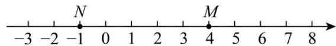

text_image

-3 -2 -1 0 1 2 3 4 5 6 7 8
N M

①若点 P 在点 M、N 之间，则 $\left|x+1\right|+\left|x-4\right|=\_\;$   
②若 $|x+1|+|x-4|=10$ ，则 $x=$ ；  
③若点 P 表示的数是 -5，现在有一蚂蚁从点 P 出发，以每秒 1 个单位长度的速度向右运动，当经过\_秒时，蚂蚁所在的点到点 M、点 N 的距离之和是 8.