# 七年级数学上学期第一次月考·拔尖卷

# 【北师大版 2024】

参考答案与试题解析

# 第I卷

# 一．选择题（共10小题，满分30分，每小题3分）

1. （3 分）（24-25 七年级上·全国·阶段练习）如图所示，若 $a + b + c = 0$ ，则下面判断中一定成立的是（）

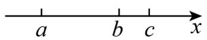

A. a < 0, c < 0

B. a < 0, c > 0

C. $a > 0, c < 0$

D. a > 0, c > 0

【答案】B

【分析】本题考查根据数轴判断式子的符号，由数轴上左边的点表示的数小于右边的点表示的数，可得 $a < b < c$ ，由 $a + b + c = 0$ 可得 $a, b, c$ 中1正2负或2正1负，进而可得 $a$ 一定小于0， $c$ 一定大于0.

【详解】解：由数轴可知，a < b < c，

又∵ $a + b + c = 0$ ,

$$
\therefore a <   0, c > 0,
$$

故选 B.

2. （3 分）（24-25 七年级上·江苏南京·阶段练习）若整数 $a$ 、 $b$ 满足 $|a + 1| + |b - 1| = 2$ ，则满足条件的 $a + b$ 的值有（）

A. 1 个

B. 2 个

C. 3 个

D. 4 个

【答案】C

【分析】本题考查有理数加法，绝对值，掌握绝对值的意义和有理数加法法则是正确计算的关键.

根据a、b是整数，而 $|a+1|+|b-1|=2$ ，因此有 $|a+1|=0,|b-1|=2$ 或 $|a+1|=2,|b-1|=0$ 或 $|a+1|=1,|b-1|=1$ 三种情况，进而求出相应的a、b的值，得出结论.

【详解】解：∵a、b是整数，而 $|a+1|+|b-1|=2$ ，

$$
\therefore | a + 1 | = 0, | b - 1 | = 2 \text {或} | a + 1 | = 2, | b - 1 | = 0 \text {或} | a + 1 | = 1, | b - 1 | = 1,
$$

①当 $|a+1|=0,|b-1|=2$ 时，∴a=-1,b=3或-1,

$$
\therefore a + b = 2 \text {或} a + b = - 2,
$$

② $|a+1|=2,|b-1|=0,\quad\therefore a=1$ 或-3，b=1，

$$
\therefore a + b = 2 \text {或} a + b = - 2.
$$

③ $|a+1|=1,|b-1|=1,$

∴ a = 0 或 -2，b = 0 或 2， $a + b = 0$ 或 2 或 -2，

综上所述， $a + b$ 的值有0，2，-2三个值，

故选：C.

3. （3 分）（24-25 七年级上·湖北黄石·阶段练习）在 -13 与 23 之间插入三个数，使这五个数中每相邻两个数的差相等，则插入的这三个数的和是( )

A. 15

B. 5

C. 9

D. 14

【答案】A

【分析】本题考查了有理数的加法，解题关键是确定插入的数字.

先确定共有多少个数字，再分成 4 组，从而确定插入的数字，然后求和.

【详解】解：在-13与23之间插入3个数，使这五个数中每相邻两个数的差相等，也就是将-13与23之间分成相等的4份.

$$
2 3 - (- 1 3) = 3 6,
$$

就是将36进行4等分

即每份的值是 $36 \div 4 = 9$ ，

$$
9 + (- 1 3) = - 4, - 4 + 9 = 5, 5 + 9 = 1 4,
$$

这 3 个数分别是 -4, 5, 14.

所以插入的这三个数的和是 $-4 + 5 + 14 = 15$

故选：A.

4. （3 分）如图，CD是直角三角形ABC的高，将直角三角形ABC按以下方式旋转一周可以得到右侧几何体的是（）.

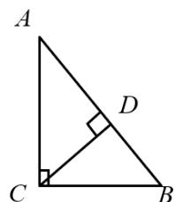

text_image

A
D
C
B

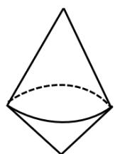

A. 绕着 $AC$ 旋转

B. 绕着AB旋转

C. 绕着CD旋转

D. 绕着BC旋转

【答案】B

【分析】根据直角三角形的性质，只有绕斜边旋转一周，才可以得出组合体的圆锥，进而解答即可.

【详解】将直角三角形 ABC 绕斜边 AB 所在直线旋转一周得到的几何体是:

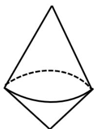

natural_image

Simple line drawing of a cone with a dashed base curve (no text or symbols)

故选：B.

【点睛】本题考查了点、线、面、体，培养学生的空间想象能力及几何体的三视图.

5. （3 分）（24-25 七年级上·江苏南京·阶段练习）若 $2024^{6} - a^{2024}$ 结果的个位数字是 1，则 $a$ 的值可能是（）

A. 13

B. 24

C. 35

D. 49

【答案】C

【分析】先找出 $2024^{n}$ 个位数字的规律，再根据 $2024^{6} - a^{2024}$ 结果的个位数字是1，确定 $a^{2024}$ 结果的个位数字，最后据此找出 $a$ 可能的值．本题主要考查了尾数特征问题，熟练掌握通过找规律的方法确定幂次的个位数字是解题的关键.

【详解】解： $2024^{1}$ 个位数字是4，

$2024^{2}$ 个位数字是6（ $4 \times 4 = 16$ ），

$2024^{3}$ 个位数字是4（ $4 \times 6 = 24$ ），

$2024^{4}$ 个位数字是6（ $4 \times 4 = 16$ ），

...

可以发现当n为奇数时， $2024^{n}$ 个位数字是4；当n为偶数时， $2024^{n}$ 个位数字是6.

$\therefore 2024^{6}$ 个位数字是6.

∵ $2024^{6}-a^{2024}$ 结果的个位数字是1,

$\therefore a^{2024}$ 结果的个位数字是6-1=5.

$13^{2024}$ 个位数字是1（3的幂次个位数字以3、9、7、1循环， $2024 \div 4 = 506$ ，余数为0时个位是1），

$24^{2024}$ 个位数字是6（4的幂次个位数字以4、6循环， $2024 \div 2 = 1012$ ，余数为0时个位是6），

$35^{2024}$ 个位数字是5（5的任何正整数次幂个位数字都是5），

$49^{2024}$ 个位数字是1（9的幂次个位数字以9、1循环， $2024 \div 2 = 1012$ ，余数为0时个位是1）.

∴ a 的值可能是 35.

故选：C.

6. （3 分）（24-25 七年级上·山西太原·阶段练习）一个几何体由几个大小相同的小立方块搭成，从上面观察这个几何体，看到的形状如图所示，其中小正方形中的数字表示该位置的小立方块的个数，则从正面看这个几何体的形状图是（）

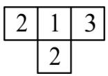

A.

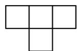

C.

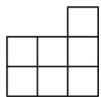

B.

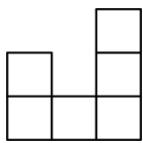

D.

【答案】C

【分析】本题考查从不同方向看几何体.根据图形得到小立方体的个数，结合正面看即可得到答案.

【详解】解：由图形可得，从正面看这个几何体的形状图是：

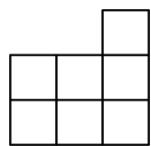

故选：C.

7. （3 分）（24-25 七年级上·湖北武汉·开学考试）下面各组数中，不能通过加、减、乘、除（含括号）运算得到 24 的是（）

A. 1, 1, 7, 7

B. 2, 2, 8, 8

C. 1, 1, 2, 8

D. 1, 1, 4, 6

【答案】A

【分析】本题考查有理数的四则运算，通过尝试不同的四则运算组合，判断每组数字是否能得到 24.

【详解】解：A、无法通过加、减、乘、除（含括号）运算得到24；

B、 $8 \times (8 - 2) \div 2 = 24$ ，即可以通过加、减、乘、除（含括号）运算得到24；

C、 $8 \times (2 + 1) \times 1 = 24$ ，即可以通过加、减、乘、除（含括号）运算得到24；

D、 $4 \times 6 \times 1 \times 1 = 24$ ，即可以通过加、减、乘、除（含括号）运算得到24.

故选：A

8. （3 分）（24-25 七年级上·全国·期末）如图是一个正方体的表面展开图，则该正方体可能是（）

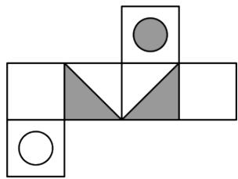

natural_image

Abstract geometric pattern composed of squares, triangles, and circles (no text or symbols)

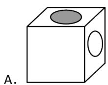

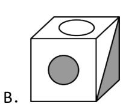

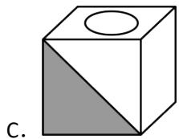

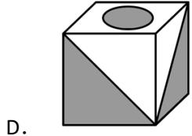

natural_image

3D geometric diagram of a cube with shaded faces and a central circle (no text or symbols)

【答案】D

【分析】本题考查由展开图还原立方体，根据展开图确定正方体的相邻面是解题的关键.根据正方体的展开图逐项判断即可解答.

【详解】解：根据正方体的表面展开图，可知该正方体可能为：

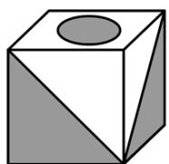

故选：D.

9. （3分）已知 $abc < 0$ ， $a + b + c > 0$ 且 $x = \frac{a}{|a|} + \frac{b}{|b|} + \frac{c}{|c|} + \frac{ab}{|ab|} + \frac{ac}{|ac|} + \frac{bc}{|bc|}$ . 则 $x$ 的值为（）

A. 0 或 1

B. 0

C. 0 或 -2 或 1

D. 0 或 1 或 -6

【答案】B

【分析】本题考查了有理数的运算法则及绝对值的性质，正确得到a、b、c的符号有三种情况（a<0, b>0, c>0或a>0, b<0, c>0或a>0, b>0, c<0）是解决问题的关键；由abc<0, $a+b+c>0$ ，可得a、b、c三个数中有一个负因数，且正因数绝对值的和大于负因数的绝对值，由此可得a、b、c的符号有三种情况（a<0, b>0, c>0或a>0, b<0, c>0或a>0, b>0, c<0），再根据绝对值的性质分三种情况求得x的值即可求解.

【详解】∵abc<0, $a+b+c>0$ ,

∴a、b、c三个数中有一个负因数，且正因数绝对值的和大于负因数的绝对值，

$\therefore a<0,\ b>0,\ c>0$ 或 $a>0,\ b<0,\ c>0$ 或 $a>0,\ b>0,\ c<0,$

当a<0, b>0, c>0时，ab<0, ac<0, bc>0,

$$
\begin{array}{l} \therefore x = \frac {a}{| a |} + \frac {b}{| b |} + \frac {c}{| c |} + \frac {a b}{| a b |} + \frac {a c}{| a c |} + \frac {b c}{| b c |} \\ = \frac {a}{- a} + \frac {b}{b} + \frac {c}{c} + \frac {a b}{- a b} + \frac {a c}{- a c} + \frac {b c}{b c} \\ = - 1 + 1 + 1 - 1 - 1 + 1 \\ = 0; \\ \end{array}
$$

当a>0，b<0，c>0时，ab<0，ac>0，bc<0，

$$
\begin{array}{l} \therefore x = \frac {a}{| a |} + \frac {b}{| b |} + \frac {c}{| c |} + \frac {a b}{| a b |} + \frac {a c}{| a c |} + \frac {b c}{| b c |} \\ = \frac {a}{a} + \frac {b}{- b} + \frac {c}{c} + \frac {a b}{- a b} + \frac {a c}{a c} + \frac {b c}{- b c} \\ = 1 - 1 + 1 - 1 + 1 - 1 \\ = 0; \\ \end{array}
$$

当a>0，b>0，c<0时，ab>0，ac<0，bc<0，

$$
\begin{array}{l} \therefore x = \frac {a}{| a |} + \frac {b}{| b |} + \frac {c}{| c |} + \frac {a b}{| a b |} + \frac {a c}{| a c |} + \frac {b c}{| b c |} \\ = \frac {a}{a} + \frac {b}{b} + \frac {c}{- c} + \frac {a b}{a b} + \frac {a c}{- a c} + \frac {b c}{- b c} \\ = 1 + 1 - 1 + 1 - 1 - 1 \\ = 0. \\ \end{array}
$$

综上，当 $abc < 0$ ， $a + b + c > 0$ 时， $x = \frac{a}{|a|} + \frac{b}{|b|} + \frac{c}{|c|} + \frac{ab}{|ab|} + \frac{ac}{|ac|} + \frac{bc}{|bc|} = 0$ .

故选：B.

10. （3 分）七年级某班的学生共有 49 人，军训时排列成 $7 \times 7$ 的方阵，做了一个游戏，起初全体学生站立，教官每次任意点 $n$ 个不同学号的学生，被点到的学生，站立的蹲下，蹲下的站立，且学生都正确完成指令同一名学生可以多次被点，则 $m$ 次点名后，（ $n, m$ 为正整数）下列说法正确的是（）

A. 当 $n$ 为偶数时, 无论 $m$ 何值, 蹲下的学生人数不可能为奇数个  
B. 当 $n$ 为偶数时, 无论 $m$ 何值, 蹲下的学生人数不可能为偶数个  
C. 当 $n$ 为奇数时, 无论 $m$ 何值, 蹲下的学生人数不可能为偶数个  
D. 当 $n$ 为奇数时, 无论 $m$ 何值, 蹲下的学生人数不可能为奇数个

【答案】A

【分析】假设站立记为“+1”，则蹲下为“-1”，开始时49个“+1”，其乘积为“+1”，每次改变其中的n个数，当 $n$ 为偶数时, 每次的改变其中 $n$ 个数, 都不改变上一次的符号, 则 $m$ 次点名后, 乘积仍然是 “+1”, 故最后出现的“-1”的个数为偶数, 即蹲下的人数为偶数; 即可获解.

【详解】解：假设站立记为“+1”，则蹲下为“-1”，开始时49个“+1”，其乘积为“+1”.

∵每次改变其中的n个数，经过m次点名，

①当n为偶数时，

若有偶数个“+1”偶数个“-1”，变为偶数个“-1”偶数个“+1”，其积的符号不变；

若有奇数个“+1”奇数个“-1”，变为奇数个“-1”奇数个“+1”，其积的符号不变；

故当n为偶数时，每次改变其中的n个数，其积的符号不变，那么m次点名后，乘积仍然是“+1”，

故最后出现的“-1”的个数为偶数，即蹲下的人数为偶数；

②当n为奇数时，

若有偶数个“+1”奇数个“-1”，变为偶数个“-1”奇数个“+1”，其积的符号改变；

若有奇数个“+1”偶数个“-1”，变为奇数个“-1”偶数个“+1”，其积的符号改变；

故当 $n$ 为奇数时，每次改变其中的 $n$ 个数，其积的符号改变，

那么 m 次点名后，

若m为偶数，乘积仍然是“+1”，故最后出现的“-1”的个数为偶数，即蹲下的人数为偶数；

若m为奇数，乘积最后是“-1”，故最后出现的“-1”的个数为奇数，即蹲下的人数为奇数；

综上所述，选项 A 正确，选项 B、C、D 均错误；

故选：A.

【点睛】此题考查了正负数的意义、有理数乘法中积的符号的判断，熟练掌握有理数乘法中符号法则与分类讨论的思想方法是解答此题的关键.

# 二．填空题（共6小题，满分18分，每小题3分）

11. （3 分）（24-25 七年级上·江苏常州·阶段练习）数轴上表示整数的点为整点，某数轴的单位长度是 1 厘米，若在这个数轴上随意放上一根长为整数厘米的火柴棒，该火柴棒能盖住 3 个整点，则这根火柴棒的长度为\_\_\_\_厘米。

【答案】3或2

【分析】本题考查了数轴，解题的关键是找出长度为 $n$ （ $n$ 为正整数）的线段盖住 $n$ 或 $(n + 1)$ 个整点，本题属于基础题，难度不大，解决该题型题目时，分端点是否与整点重合两种情况来考虑是关键。

由于若火柴棒的端点恰好与整点重合，则 1 厘米长的线段盖住 2 个整点，若火柴棒的端点不与整点重合，则 1 厘米长的线段盖住 1 个整点，据此分析即可求解.

【详解】解：∵长度为n（n为正整数）的线段盖住n或 $(n+1)$ 个整点，.

:长度为 m 的火柴棒能盖住的 3 个整点时，火柴棒的长度 m = 3 厘米或 $m + 1 = 3$ ，即 m = 2 厘米。

故答案为：3或2.

12. （3 分）（24-25 七年级上·全国·期中）如图所示，这个几何体是由若干个完全相同的小正方体搭成的．如果在这个几何体上再添加一些相同的小正方体，并保持其从正面看和从左面看得到的图形不变，那么最多可以再添加一个小正方体．

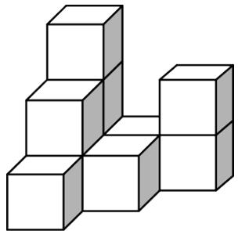

natural_image

3D geometric arrangement of white cubes forming a stepped structure (no text or symbols)

【答案】4

【分析】本题主要考查了从不同方向看几何体，为保持这个几何体的从左面看和从正面看到的形状图不变，可在最底层第二列第三行加1个，第三列第二行加2个，第三列第三行加1个，即可得最多可以再添加4个小正方体，熟练掌握从不同方向看几何体的方法是解决此题的关键.

【详解】保持从上面看到的图形和从左面看到的图形不变，最多可以再添加4个小正方体；

故答案为：4.

13. （3 分）（24-25 七年级上·河北廊坊·阶段练习）现有 5000 张A4纸，每张厚度为 0.1 毫米，若将每张纸对折 3 次，则对折后的 5000 张纸的厚度为 \_\_\_\_ （用科学记数法表示）毫米。

【答案】 $4 \times 10^{3}$

【分析】本题考查科学记数法，先求出对折后的 5000 张纸的厚度，再根据科学记数法的表示方法： $a \times 10^{n}$ ， $1 \leq |a| < 10$ ，n 为整数，进行表示即可.

【详解】解： $5000 \times 0.1 \times 2^{3} = 4000 = 4 \times 10^{3}$ mm:

故答案为： $4 \times 10^{3}$

14. （3分）（2025·陕西咸阳·二模）高斯被认为是历史上最杰出的数学家之一，享有“数学王子”之称。现有一种高斯定义的计算式，已知 $[x]$ 表示不超过 $x$ 的最大整数，例如 $[-0.8] = -1$ 。现定义 $\{x\} = x + [x]$ ，例如 $\{x\} = 1.5 + [1.5] = 2.5$ ，则 $\{-2.5\} =$

【答案】-5.5

【分析】本题主要考查了有理数的大小比较，有理数的加减混合运算，新定义运算，解题关键是理解新定

义运算.

根据 $[x]$ 表示不超过x的最大整数求解，列式计算.

【详解】由题意得： $\{-2.5\}=-2.5+[-2.5]=-2.5-3=-5.5.$

15. （3 分）（24-25 七年级上·江苏南京·期末）按图示切割正方体就可以切割出正六边形（正六边形的各顶点恰是其棱的中点），以下此正方体的平面展开图及切割线的画法正确的有\_\_\_\_。（填序号）

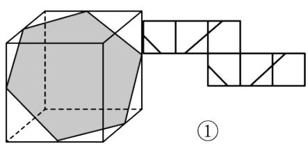

natural_image

Geometric diagram showing a polyhedron inscribed in a cube with connected squares and triangles (no text or symbols)

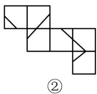

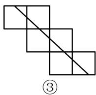

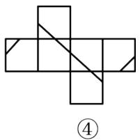

natural_image

Geometric diagram of a cross-shaped structure with internal diagonal lines, no text or symbols present

【答案】①③④

【分析】本题考查了正方体的展开图和截一个几何体，熟练掌握正方体的展开图，观察思考与动手操作结合是解决本题的关键．根据正方体的展开图和正六边形截面的特征，将题目中的展开图重新折叠，再与原来的正方体（含切割线）比较即可得到答案.

【详解】解：对于①，将展开图重新折叠可得出原来的正方体（含切割线），符合题意；

对于②，将展开图重新折叠不能得出原来的正方体（含切割线），不符合题意；

对于③，将展开图重新折叠可得出原来的正方体（含切割线），符合题意；

对于④，将展开图重新折叠可得出原来的正方体（含切割线），符合题意.

故答案为：①③④.

16. （3 分）（2025·北京门头沟·二模）某快递公司因天气原因需将五种货物进行延迟配送，每名配送员每次只能配送一种货物，从配送开始起进行计时，每延迟一分钟需赔付 1 元，忽略其它因素的影响，五种货物的配送时间如下表：

<table><tr><td>货物</td><td>A</td><td>B</td><td>C</td><td>D</td><td>E</td></tr><tr><td>配送时间(分钟)</td><td>5</td><td>8</td><td>9</td><td>7</td><td>10</td></tr></table>

(1) 如果由一名配送员进行配送, 那么下列三个配送顺序: ① $D \rightarrow B \rightarrow E \rightarrow A \rightarrow C$ ; ② $D \rightarrow A \rightarrow C \rightarrow E \rightarrow B$ ; ③ $C \rightarrow A \rightarrow E \rightarrow B \rightarrow D$ 中, 赔付最少的是 (填序号);

（2）如果由两名配送员同时进行配送，最少需要赔付\_\_\_\_元.

【答案】② 64

【分析】本题考查了有理数的加法和乘法混合运算的实际应用，找出方案是解题的关键.

（1）分别计算三种情况赔付的钱，求解判断即可；

(2) 因为赔付最少, 就要使配送的时间尽量短, 显然先配送时间短的即可, 所以先配送 $A$ 和 $D$ 时间短的, 一名配送员按 $A$ , $B$ , $E$ 的顺序送, 另一名配送员按 $D$ , $C$ 的顺序送, 配送赔付最少, 据此计算即可.

【详解】解：（1）①总赔付： $5 \times 7 + 4 \times 8 + 3 \times 10 + 2 \times 5 + 9 = 116$ （元），

②总赔付： $5 \times 7 + 4 \times 5 + 3 \times 9 + 2 \times 10 + 8 = 110$ （元），  
③总赔付： $5 \times 9 + 4 \times 5 + 3 \times 10 + 2 \times 8 + 7 = 118$ （元），

∴赔付最少的是②，

故答案为：②；

(2) 解: 因为赔付最少, 就要使配送的时间尽量短, 显然先配送时间短的, 所以先配送 $A$ 和 $D$ 时间短的; 然后再配送剩下的时间的短的, 最后一名配送员配送时间最长的,

一名配送员按A，B，E的顺序送，另一名配送员按D，C的顺序送，配送最少，

A, B, E配送赔付： $5 \times 3 + 8 \times 2 + 10 \times 1$ （元），

D, C配送赔付: $7 \times 2 + 9$ (元),

共需要最少赔付： $5 \times 3 + 8 \times 2 + 10 \times 1 + 7 \times 2 + 9 = 64$ （元），

故答案为：64.

# 第II卷

# 三．解答题（共8小题，满分72分）

17. （6 分）（24-25 七年级上·全国·阶段练习）计算

(1) $-1^{2024} - \frac{1}{6} \times [2 - (-3)^{2}]$

(2) $(-5)^{2} - \left[-4 + \left(1 - 0.2 \times \frac{1}{5}\right) \div (-2)\right]$

【答案】(1) $\frac{1}{6}$ ;

(2) $29\frac{12}{25}.$

【分析】本题主要考查了运算的优先级以及基本的四则运算，同时涉及到乘方和括号内的运算．熟练掌握运算的优先级，即先乘方、再括号、然后乘除、最后加减，是解题的关键.

（1）先进行乘方运算，然后进行括号内的运算，接着进行乘除运算，最后进行加减运算即可.

(2) 先进行括号内的运算, 注意括号内还有乘法和减法, 应先进行乘法运算, 再进行减法运算, 然后进行除法运算, 最后进行加减运算.

【详解】（1）解： $-1^{2024}-\frac{1}{6}\times[2-(-3)^{2}]$

$$
\begin{array}{l} = - 1 - \frac {1}{6} \times [ 2 - 9 ] \\ = - 1 - \frac {1}{6} \times (- 7) \\ = - 1 + \frac {7}{6} \\ = \frac {1}{6}; \\ \end{array}
$$

(2) 解: $(-5)^{2}-\left[-4+\left(1-0.2\times\frac{1}{5}\right)\div(-2)\right]$

$$
\begin{array}{l} = 2 5 - \left[ - 4 + \left(1 - \frac {1}{2 5}\right) \div (- 2) \right] \\ = 2 5 - \left[ - 4 + \frac {2 4}{2 5} \times \left(- \frac {1}{2}\right) \right] \\ = 2 5 - \left[ - 4 - \frac {1 2}{2 5} \right] \\ = 2 5 + 4 + \frac {1 2}{2 5} \\ = 2 9 \frac {1 2}{2 5}. \\ \end{array}
$$

18. （6分）（24-25七年级上·湖北恩施·阶段练习）已知在数轴上有三点A，B，C，点A表示的数为a，点B表示的数为b，且a、b满足 $(a+3)^{2}+|b-1|=0$ 。沿A，B，C三点中的一点折叠数轴。

(1)求 $a, b$ 的值；

(2)若另外两点互相重合，则点 C 表示的数是 \_\_\_\_.

【答案】(1)a = -3, b = 1

(2)-1, -7或5

【分析】本题考查了数轴的折叠问题，非负数的性质，解题的关键是注意分类讨论.

（1）根据平方、绝对值的非负性可得出 a, b 的值；

(2) 由 (1) 得知, $A, B$ 表示的数分别为 $-3, 1$ , 再分情况讨论, 当折叠中心分别为 $A, B, C$ 点时求点 $C$ 表示的数.

【详解】（1）解：∵ $(a+3)^{2} + |b-1| = 0$ ， $(a+3)^{2} \geq 0$ ， $|b-1| \geq 0$ ，

$$
\therefore a + 3 = 0, b - 1 = 0,
$$

$$
\therefore a = - 3, b = 1;
$$

(2) 解: 由 (1) 得 $A, B$ 表示的数分别为 $-3, 1$ , 设点 $C$ 表示的数为 $c$ ,

分三种情况:

当以点 C 为中心折叠，点 A，B 互相重合，

$$
c = \frac {- 3 + 1}{2} = - 1;
$$

当以点 A 为中心折叠，点 C，B 互相重合，

$$
- 3 = \frac {c + 1}{2},
$$

解得c = -7;

当以点 B 为中心折叠，点 C，A 互相重合，

$$
1 = \frac {- 3 + c}{2},
$$

解得c = 5;

综上可知，点 C 表示的数是 -1，-7 或 5.

故答案为：-1，-7或5.

19. （8 分）（24-25 七年级上·湖南衡阳·开学考试）某市出租车的收费标准如下；

<table><tr><td>里程</td><td>收费</td></tr><tr><td>3千米及3千米以下</td><td>8.00元</td></tr><tr><td>3千米以上,单程,每增加1千米</td><td>1.60元</td></tr><tr><td>3千米以上,往返,每增加1千米</td><td>1.20元</td></tr></table>

(1)李丽乘出租车从家到外婆家共付车费 17.6 元，李丽家到外婆家相距多少千米？

(2)王老师从学校去相距6千米的人事局取一份资料并立即回到学校。他怎样坐车比较合算？需付出租车费多少元？

【答案】(1)李丽家到外婆家相距9千米

(2)王老师按3千米以上，往返，每增加1千米，收费1.2元计算比较合算，需付出租车费18.8元

【分析】本题考查收费问题，理解并掌握相应的收费方法，正确的列出算式，是解题的关键：

（1）根据收费规则求出超出 3 千米的费用，进而求出超出的里程，即可得出结果；

(2) 求出两种收费方案的费用, 进行比较即可得出结果.

【详解】（1）解：17.6-8=9.6（元），

$9.6 \div 1.6 = 6$ （千米），

$6 + 3 = 9$ （千米）；

答：李丽家到外婆家相距9千米；

(2) 解: 第一种情况: 按 3 千米以上, 往返, 每增加 1 千米, 收费 1.20 元计算,

$$
(6 \times 2 - 3) \times 1. 2 + 8 = 1 8. 8 (\text {元}),
$$

第二种情况：按 3 千米以上，单程，每增加 1 千米，收费 1.60 元计算，

$$
(6 \times 2 - 3 \times 2) \times 1. 6 + 8 \times 2 = 2 5. 6 (\text {元}),
$$

$$
1 8. 8 <   2 5. 6;
$$

所以王老师按 3 千米以上，往返，每增加 1 千米，收费 1.20 元计算比较合算，需付出租车费 18.8 元.

20. （8 分）（24-25 七年级上·全国·期末）如图所示的是用 8 个大小相同的小正方体搭成的几何体.

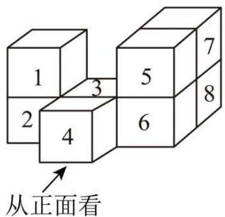

text_image

1
2
3
4
5
6
7
8
从正面看

(1)画出该几何体从正面和从左面看到的形状图.

(2)在该几何体中取走一个小正方体, 使得到的新几何体同时满足两个要求: ①从正面看到的形状图和原几何体从正面看到的形状图相同; ②从左面看到的形状图和原几何体从左面看到的形状图也相同. 在不改变其他小正方体位置的前提下, 可取走的小正方体是\_\_\_\_（只取走一个）.

【答案】(1)见解析

(2)3号或5号

【分析】本题考查了从不同方向看几何体，空间象限能力，正确掌握相关性质内容是解题的关键.

(1) 理解题意, 直接画出从正面和从左面看到的形状图, 即可作答.  
（2）理解题意，再结合几何体的特征以及题干的两个要求，进行作答即可.

【详解】（1）解：该几何体从正面和从左面看到的形状图如图所示：

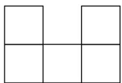

natural_image

Simple geometric grid of four empty squares arranged in a 2x2 pattern (no text or symbols)

从正面看

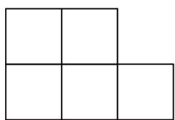

natural_image

Simple geometric shape composed of four connected squares forming an L-shape (no text or symbols)

从左面看

(2) 解: 3 号或 5 号, 理由如下:

若要使从正面看到的形状图和原几何体从正面看到的形状图相同，则可取走的一个小正方体是3号、4号、5号或7号．若要使从左面看到的形状图和原几何体从左面看到的形状图也相同，则可取走的一个小正方体是1号、3号或5号，

故取走 3 号或 5 号符合题意.

21. （10 分）（24-25 七年级下·广东佛山·期中）一个三位数，若它是 3 的倍数，则把它除以 3 的商作为下一个数：否则，把它各位上的数相加的和再平方后作为下一个数．重复这个过程……直到出现了与之前重复的数，那就输出此数作为最终结果，结束操作．

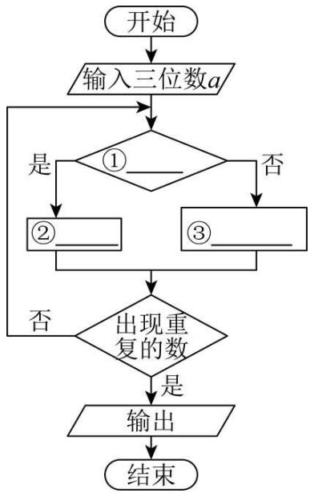

flowchart

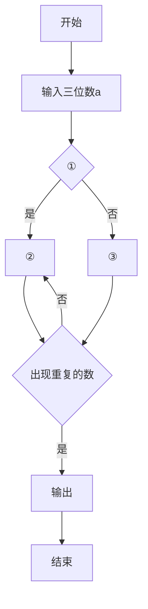

(1)上面的文字语言可以转化为流程图表达. 如图是流程图的一部分, 请把这个流程图补充完整. ①\_, ②\_, ③\_ (在每空中填入题干中的关键词句, 把这个运算程序补充完整)

(2)现在输入一个三位数，如 123 作为起始数，操作第 3 次后得到的数是多少？请你写出过程.

(3)继续第（2）问的运算，操作\_次能够结束循环？最后输出的结果是\_.

(4)若起始数输入的三位数各位上的数字都是相同的数，如输入 111，最后输出的结果是\_；输入 222，最后输出的结果是\_.

【答案】(1)①是 3 的倍数吗？②把它除以 3 的商作为下一个数？③把它各位上的数相加的和再平方后作为下一个数.

(2)49

(3)169

(4)1, 169

【分析】本题主要考查了程序流程图、有理数的混合运算等知识点，掌握有理数的混合运算法则成为解题的关键.

(1) 根据题意直接补全流程图即可;  
(2) 按照流程图进行列式计算即可;  
（3）根据流程图进行列式计算即可；  
（4）分别输入 111，222 并根据流程图进行计算即可.

【详解】（1）解：根据题意可得：①是3的倍数吗？②把它除以3的商作为下一个数？③把它各位上的数相加的和再平方后作为下一个数.

故答案为: ①是 3 的倍数吗? ②把它除以 3 的商作为下一个数? ③把它各位上的数相加的和再平方后作为下一个数.

(2) 解: 第 1 次: 123 是 3 的倍数, $123 \div 3 = 41$ ;

第 2 次：41 不是 3 的倍数， $(4+1)^{2}=25$ ;

第 3 次：25 不是 3 的倍数， $(2+5)^{2}=49$ ，

所以操作第 3 次后得到的数是 49.

（3）解：第4次：49不是3的倍数， $(4+9)^{2}=169$ ;

第 5 次：169 不是 3 的倍数， $(1+6+9)^{2}=256$ ;

第 6 次：256 不是 3 的倍数， $(2 + 5 + 6)^{2} = 169$ ，

∴169 出现重复，即操作 6 次结束循环，最后输出结果是 169，

故答案为：6，169.

（4）解：当输入111时，

第 1 次：111 是 3 的倍数， $111 \div 3 = 37$ ;

第 2 次：37 不是 3 的倍数， $(3 + 7)^{2} = 100$ ;

第 3 次：100 不是 3 的倍数， $(1 + 0 + 0)^{2} = 1$ ;

第 4 次：1 不是 3 的倍数， $1^{2}=1$ ，出现循环；则最后输出的为：1.

当输入 222 时，

第 1 次：222 是 3 的倍数， $222 \div 3 = 74$ ;

第 2 次：74 不是 3 的倍数， $(7 + 4)^{2} = 121$ ;

第 3 次：121 不是 3 的倍数， $(1+2+1)^{2}=25$ ;

第 4 次：25 不是 3 的倍数， $(2+5)^{2}=49$ ;

第 5 次：49 不是 3 的倍数， $(4+9)^{2}=169$ ;

第 5 次：169 不是 3 的倍数， $(1+6+9)^{2}=256$ ;

第 6 次：256 不是 3 的倍数， $(2+5+6)^{2}=169$ ；出现循环，则最后输出的为：169.

故答案为：1，169.

22. （10 分）算筹是我国古代的计算工具之一，也是中华民族智慧的结晶，如要表示一个多位数字，即把各位的数字从左到右横列，各位数的筹式需要纵横相间，个位数用纵式表示，十位数用横式表示，百位、万位用纵式，千位、十万位用横式．例如614用算筹表示出来是T－| |；数字有空位时，如86021用算筹表示出来是π⊥=1，百位是空位就不放算筹.

纵式 1 2 3 4 5 6 7 8 9
| | | | | | | | | | | | | | | | | |

横式 $- = \equiv \equiv \equiv \perp \perp \perp \perp$

6728 表示为 $\bot \Pi = \Pi$

6708 表示为 ⊥ Ⅱ Ⅲ

(1) 8335 用算筹可表示为 ( )

A. ⊥ ≡ ||| ||| | B. ⊥ ||| ≡ ||| | C. ∅ = ||| ||| | D. ∅ ||| ≡ |||

(2) 算式“7408 + 2366”可用如图①中的算筹表示, 如图②中算筹表示两个三位数的运算, 其结果为\_\_\_\_;

⊥ ||| Ⅲ + = ||| ⊥ T | 关注公式的资源，||| - ||| = Ⅲ

图①

图②

(3) “| | | | ≡”表示的最小的数是\_\_\_\_.

【答案】（1）B；（2）-426；（3）10340

【分析】（1）根据题意可得 8335 用算筹的表示方法；

（2）由算筹表示方法的到算式，再计算；

（3）根据算筹记数的规定可知，“| | | | ≡”表示的最小的数是 5 位数，依此即可得到“| | | | ≡”表示的最小的数.

【详解】解：（1）8335 用算筹可表示为：

⊥ || ≡ ||||,

故选 B;

(2) 由题意得: 图②中算式为:

103-529=-426,

故答案为：-426;

(3) 由已知可得:

表示的最小的数是 5 位数，且最高位是 1，个位是 0，

则最小的数是：10340.

【点睛】

本题考查了应用类问题，关键是对我国古代用算筹记数的规定的理解和掌握，再根据有理数的大小比较可知“| | | | ≡”表示的最小的数是5位数.

23. （12 分）（1）小明准备制作一个封闭的正方体盒子，他先用 5 个大小一样的正方形制成如图 1 所示的拼接图形（实线部分），经折叠后发现还少一个面，请在图中的拼接图形上再接一个正方形，使新拼接的图形经过折叠后能成为一个封闭的正方体盒子。（添加的正方形用阴影表示．只要画出一种即可）

(2) 如图 2 所示的几何体是由几个相同的正方体搭成的, 请画出它从正面看的形状图.  
（3）如图 3 是几个正方体所组成的几何体从上面看的形状图，小正方形中的数字表示该位置小正方体的个数，请画出这个几何体从左面看的形状图.

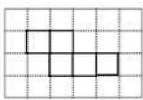

natural_image

Grid pattern with four empty squares arranged in a 2x2 layout (no text or symbols)

图1

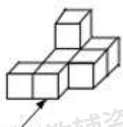  
正面

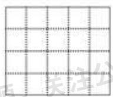  
图2

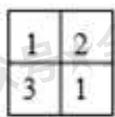

图3   
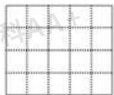

【答案】（1）见解析；（2）见解析；（3）见解析

【分析】（1）在第二行3个正方形的下方的任意一个位置添加一个正方形可经过折叠后能成为一个封闭的正方体盒子；

(2) 由图可知, 主视图有 3 列, 每列小正方数形数目分别为 1, 2, 1, 据此可画出图形;  
（3）由图可知，左视图有2列，每列小正方形数目分别为2，3，据此可画出图形.

【详解】（1）如图 1 所示：

(2) 如图 2 所示:  
(3) 如图 3 所示:

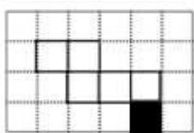

natural_image

Grid pattern with black and white squares forming a stepped structure (no text or symbols)

图1

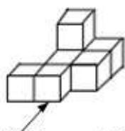  
正面

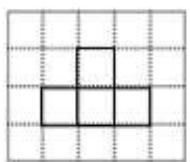  
图2

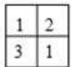

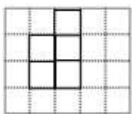  
图3

【点睛】本题考查了组成正方体的6个正方形的特点及画三视图的知识；用到的知识点为：能拼成正方体的正方形的基本形式为：一，四，一；二，三一；二，二，二；三，三；主视图和左视图是从物体的正面和左面看到的图形.

24. （12 分）（24-25 七年级上·全国·期末）已知点 A 在数轴上对应的数为 a，点 B 在数轴上对应的数为 b，且 $\left|a+3\right|+\left|b-2\right|=0$ ，A、B 之间的距离记为 $\left|AB\right|=\left|a-b\right|$ 或 $\left|b-a\right|$ ，请回答问题：

(1)直接写出 a, b 值， $a = \_, b = \_.$

(2)设点 P 在数轴上对应的数为 x，若 $\left|x-3\right|=5$ ，则 x = \_.

(3)如图，点 M, N, P 是数轴上的三点，点 M 表示的数为 4，点 N 表示的数为 -1，动点 P 表示的数为 x.

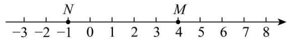

text_image

-3 -2 -1 0 1 2 3 4 5 6 7 8
N M

①若点 P 在点 M、N 之间，则 $\left|x+1\right|+\left|x-4\right|=\_\;$

②若 $|x+1|+|x-4|=10$ ，则 $x=$ ；

③若点 P 表示的数是 -5，现在有一蚂蚁从点 P 出发，以每秒 1 个单位长度的速度向右运动，当经过\_秒时，蚂蚁所在的点到点 M、点 N 的距离之和是 8.

【答案】(1)-3; 2

(2)8 或 -2

(3)①5；②-3.5或6.5；③2.5秒或10.5秒

【分析】（1）根据 $|a+3|+|b-2|=0$ ，结合 $|a+3|\geq0$ ， $|b-2|\geq0$ ，转化为关于a、b的方程求解；

（2）根据绝对值的意义，去掉绝对值，转化为一元一次方程求解；

(3) ①根据点 P 在点 M、N 之间，化去绝对值求解；

②根据①的化简结果，结合 $|x+1|+|x-4|=10$ ，分x<-1、x>4两种情况，分别求出x即可；

③分t-5<-1，t-5>4两种情况，分别求出t.

【详解】（1）解：∵ $\left|a+3\right|+\left|b-2\right|=0,\quad\left|a+3\right|\geq0,\quad\left|b-2\right|\geq0,$

$$
\therefore a + 3 = 0, b - 2 = 0,
$$

$$
\therefore a = - 3, b = 2,
$$

故答案为：-3；2；

(2) $\because|x-3|=5,$

$$
\therefore x - 3 = \pm 5,
$$

∴x=8或-2;

(3) ①∵点 P 在点 M、N 之间，

$$
\therefore | x + 1 | + | x - 4 | = x + 1 + (- x + 4) = 5,
$$

②∵ $|x+1|+|x-4|=10$ ,

$\therefore x < -1$ 或 x > 4,

当 $x < -1$ 时，

$$
\vert x + 1 \vert + \vert x - 4 \vert = - x - 1 + 4 - x = 3 - 2 x,
$$

$$
\because | x + 1 | + | x - 4 | = 1 0,
$$

$$
\therefore 3 - 2 x = 1 0,
$$

解得x = -3.5;

当x>4时，

$$
\vert x + 1 \vert + \vert x - 4 \vert = x + 1 + x - 4 = 2 x - 3,
$$

$$
\because | x + 1 | + | x - 4 | = 1 0,
$$

$$
\therefore 2 x - 3 = 1 0,
$$

解得x = 6.5;

③t 秒后，点 P 表示的数是 t-5， $NP = |t-5 + 1| = |t-4|$ ， $MP = |t-5-4| = |t-9|$

当t-5<-1时，

$$
\vert t - 4 \vert + \vert t - 9 \vert = 4 - t + 9 - t = 1 3 - 2 t = 8,
$$

解得t=2.5，

当t-5>4时，

$$
\vert t - 4 \vert + \vert t - 9 \vert = t - 4 + t - 9 = 2 t - 1 3 = 8,
$$

解得t = 10.5,

∴经过2.5秒或10.5秒时，蚂蚁所在的点到点M、点N的距离之和是8.

【点睛】本题考查了绝对值非负性，动点问题（一元一次方程的应用），数轴上两点之间的距离，绝对值非负性，绝对值的几何意义，解题关键是掌握数轴知识和绝对值的定义.