# 第一章 丰富的图形世界单元测试·培优卷

# 【北师大版 2024】

考试时间：120 分钟 满分：120 分

姓名：\_\_\_\_ 班级：\_\_\_\_ 考号：\_\_\_\_

考卷信息:

本卷试题共 24 题，单选 10 题，填空 6 题，解答 8 题，满分 120 分，限时 120 分钟，本卷题型针对性较高，覆盖面广，选题有深度，可衡量学生掌握本章内容的具体情况！

# 第I卷

# 一．选择题（共10小题，满分30分，每小题3分）教辅资源，关注公众号★全科AA+

1. （3 分）（24-25 七年级上·广东深圳·期中）下列图形中，属于棱柱的有（）

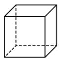

A. 2 个

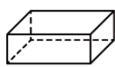

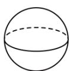

B. 3 个

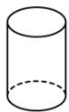

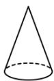

C. 4 个

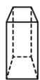

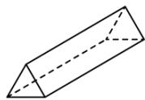

D. 5 个

2. （3 分）（24-25 六年级上·山东威海·期末）下列说法不正确的是（）

A. 长方体是四棱柱;  
B. 八棱柱有 16 条棱;  
C. 五棱柱有 7 个面;  
D. 直棱柱的每个侧面都是长方形.

3. （3 分）（24-25 六年级上·山东泰安·期末）如图所示的几何体从左面看到的形状图是（）

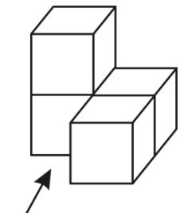

natural_image

Simple line drawing of three connected 3D cubes with an arrow indicating upward motion (no text or symbols)

从正面看

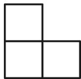

B.

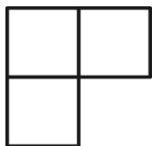

C.

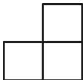

D.

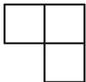

4. （3 分）（24-25 七年级上·贵州毕节·期中）如图，用一个平面去截一个三棱柱，截面的形状不可能是

( )

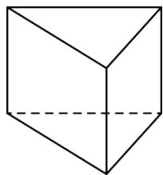

natural_image

Simple line drawing of a 3D cube with visible edges and a dashed hidden line (no text or symbols)

A. 三角形

B. 四边形

C. 五边形

D. 六边形

5. （3 分）（24-25 七年级上·四川成都·期中）在图中增加 1 个大小相同的正方形，使所得的新图形经过折叠能够围成一个正方体，那么有（）种不同的添加方法

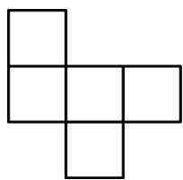

natural_image

Geometric arrangement of five connected squares forming an X shape (no text or symbols)

A. 2

B. 3

C. 4

D. 5

6. （3 分）（24-25 七年级上·江苏苏州·专题练习）如图几何体中可以由平面图形绕某条直线旋转一周得到的是（）

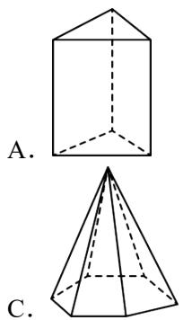

natural_image

Two geometric diagrams labeled A and C showing a 3D solid with dashed lines indicating hidden edges (no text or symbols beyond labels)

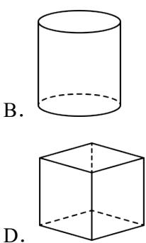

natural_image

Two simple geometric shapes: a cylinder and a cube, both with dashed hidden edges (no text or symbols)

7. （3 分）（24-25 七年级上·广东深圳·期中）如图所示的长方形（长为 7，宽为 4）硬纸板，剪掉阴影部分后，将剩余的部分沿虚线折叠，制作成底面为正方形的长方体箱子，则长方体箱子的体积为（）

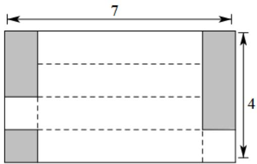

text_image

7
4

A. 22

B. 5

C. 7

D. 11

8. （3 分）（24-25 六年级下·上海·开学考试）把一个长 8 厘米、宽 6 厘米、高 4 厘米的长方体截成两个长

方体后，这两个长方体的表面积之和比原长方体增加了（）平方厘米.

A. 96

B. 48

C. 64

D. 以上三种都有可能

9. （3 分）（2025·河南焦作·二模）如图是正方体表面展开图．将其折叠成正方体后，距顶点P最远的点是（）

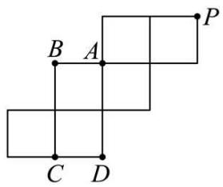

text_image

B A
C D
P

A. 点 $A$

B. 点 $B$

C. 点 $C$

D. 点 $D$

10. （3 分）（24-25 七年级上·江苏苏州·专题练习）变式1，用大小相同的小正方体搭一个几何体，从正面看和从上面看所得的图形如图所示，这样的几何体最少需要小正方体的个数为（）

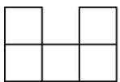  
从正面看

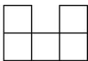  
从上面看

A. 5

B. 6

C. 7

D. 8

# 二．填空题（共6小题，满分18分，每小题3分）

11. （3 分）（24-25 七年级·江苏南京·专题练习）棱柱可以分为\_\_\_\_和\_\_\_\_。直棱柱的侧面是\_\_\_\_。

12. （3 分）（24-25 七年级上·河南郑州·期末）某几何体的一个截面是三角形，则这个几何体可能是 \_\_\_\_。（写一个即可）

13. （3 分）（24-25 七年级上·宁夏银川·期末）银川承天寺塔（如图），始建于西夏天佑垂圣元年（公元1050 年），是宁夏现存古塔中最高的一座砖塔。它是一座八角十一层楼阁式砖塔，它可以近似地看作由十一个八棱柱构成。请问：一个八棱柱一共有\_\_\_\_角\_\_\_\_条棱，有\_\_\_\_面，有\_\_\_\_个顶点。

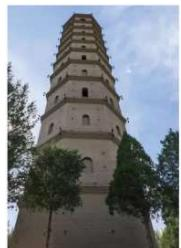

natural_image

Exterior view of a multi-tiered traditional Chinese pagoda with surrounding trees under a clear sky (no signage or text visible)

14. （3 分）（24-25 七年级上·福建宁德·期中）“点亮青春梦想”六个字分别书写在正方体的六个面上，如图是它的一种展开图，那么在原正方体中，与“青”字所在面相对的面上的汉字是\_\_\_\_。

<table><tr><td>点</td><td>亮</td><td colspan="2"></td></tr><tr><td></td><td>青</td><td>春</td><td>梦</td></tr><tr><td colspan="3"></td><td>想</td></tr></table>

15. （3 分）（24-25 七年级上·江苏南京·专题练习）下列各硬纸片分别沿虚线折叠，得不到长方体纸盒的是\_\_\_\_。（请填写序号）

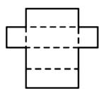  
①

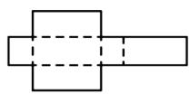  
②

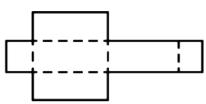  
③

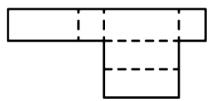  
④

16. （3 分）（24-25 六年级上·山东威海·期末）如图 1 是边长为 1 的六个小正方形组成的图形，它可以围成图 2 的正方体，则图 1 中小正方形的顶点 A、B 在图 2 围成的小正方体上的距离是 \_\_\_\_.

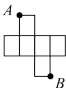  
图1

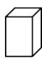  
图2

# 第II卷

# 三．解答题（共8小题，满分72分）教辅资源，关注公众号★全科AA+

17. （6 分）（24-25 七年级上·江苏无锡·单元测试）将下列几何体按名称分类：

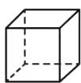

①正方体

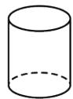

②圆柱

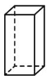

③长方体

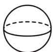

④球

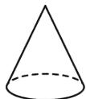

⑤圆锥

柱体有\_\_\_\_；

锥体有\_\_\_\_；

球体有\_\_\_\_。（请填写序号）

18. （6 分）（24-25 七年级上·江苏无锡·阶段练习）飞机表演“飞机拉线”时，我们用数学的知识可解释为点动成线。用数学知识解释下列现象：

(1)流星从空中划过留下的痕迹可解释为\_\_\_\_；  
(2)自行车的辐条运动可解释为\_\_\_\_；  
(3)一只蚂蚁行走的路线可解释为\_\_\_\_；  
(4)打开折扇得到扇面可解释为\_\_\_\_；

(5)一个圆面沿着它的一条直径旋转一周成球可解释为\_\_\_\_.

19. （8 分）（24-25 六年级上·山东淄博·期中）如图所示为一个棱柱形状的食品包装盒的展开图.

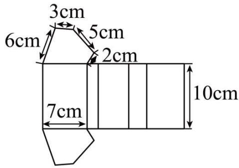

text_image

3cm
6cm
5cm
2cm
7cm
10cm

(1)这个食品包装盒的几何体名称是；

(2)根据图中所给数据，求这个食品包装盒的侧面积.

20. （8 分）（24-25 七年级上·江苏无锡·专题练习）我们知道，三棱柱的上、下底面都是三角形，那么正三棱柱的上、下底面都是等边三角形．如图，大正三棱柱的底面周长为 10，截取一个底面周长为 3 的小正三棱柱．

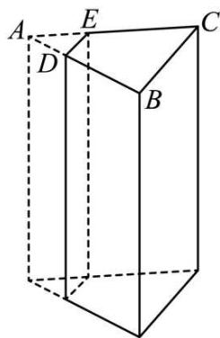

natural_image

Geometric diagram of a rectangular prism with labeled vertices A, B, C, D, E (no text or symbols beyond labels)

(1)请写出截面的形状;

(2)请直接写出四边形 DECB 的周长.

21. （10分）（24-25七年级上·山东威海·期末）如图所示的几何体，由五个大小相同的小正方体搭成.

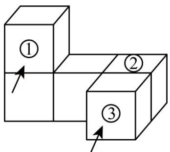

flowchart

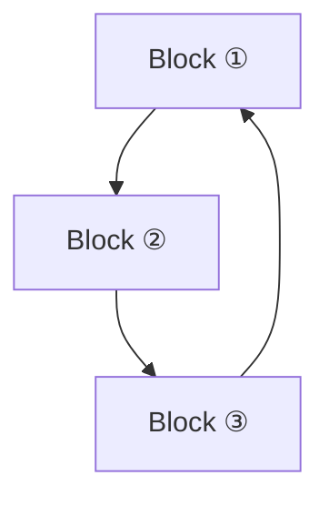

正面

(1)分别画出从正面，左面和上面看到的该几何体的形状图；  
(2)当去掉一个小正方体时，剩余部分从左面看形状没有改变（填写图中小正方体的序号）.

22. （10 分）（24-25 七年级上·河南郑州·期中）【问题情境】某综合实践小组计划进行废物再利用的环保小卫士活动。他们准备用废弃的宣传单制作成装垃圾的无盖纸盒。

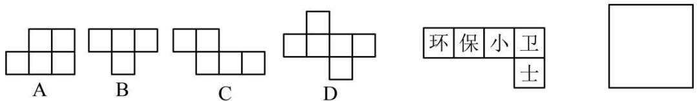  
图(2)  
图(3)   
图(1)

【操作探究】教辅资源，关注公众号★全科AA+

(1)若准备制作一个无盖的正方体纸盒，如图(1)，图形\_经过折叠能围成一个无盖正方体纸盒．(填 A，B，C，或 D)  
(2)如图(2)是小明的设计图，把它折成一个无盖正方体纸盒后与“保”字所在面相对的面上的文字是\_.  
(3)如图(3)，有一张边长为 $20 \mathrm{~cm}$ 的正方形废弃宣传单，小华将其四个角各剪去一个边长为 $4 \mathrm{~cm}$ 小正方形后，折成无盖长方体纸盒．求这个无盖长方体纸盒的底面积和容积.

23. （12 分）（24-25 七年级上·山东淄博·期中）（1）如图所示的六棱柱中，它的底面边长都是 $4 \mathrm{~cm}$ ，侧棱长为 $8 \mathrm{~cm}$ ，这个棱柱共有多少个面？这个棱柱共有多少个顶点？有多少条棱？它的侧面积是多少？

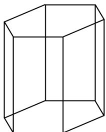

natural_image

Simple line drawing of a 3D rectangular prism (cuboid) with no text or symbols

（2）如图，有一个长6cm，宽4cm的长方形纸板，现要求以其一组对边中点所在直线为轴旋转180°，可按两种方案进行操作.

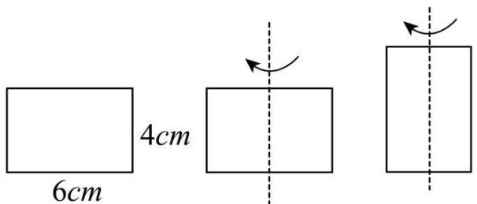

text_image

6cm
4cm

图(1)  
图(2)

方案一：以较长的一组对边中点所在直线为轴旋转，如图（1）；

方案二：以较短的一组对边中点所在直线为轴旋转，如图（2）.

①上述操作能形成的几何体是\_\_\_\_，说明的事实是\_\_\_\_；  
②请通过计算说明哪种方案得到的几何体的体积大.

24. （12 分）（24-25 七年级上·山西晋城·期末）综合与实践

新年晚会是我们最欢乐的时候，会场上，悬挂着五彩缤纷的小装饰，其中有各种各样的立体图形。下面是常见的一些多面体：

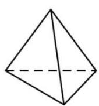  
四面体

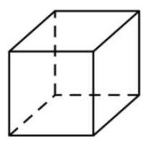  
六面体

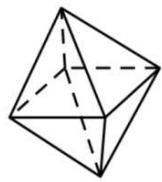  
八面体

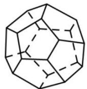  
十二面体

操作探究:

(1)通过数上面图形中每个多面体的顶点数（V）、面数（F）和棱数（E），填写下表中空缺的部分：

<table><tr><td>多面体</td><td>顶点数(V)</td><td>面数(F)</td><td>棱数(E)</td></tr><tr><td>四面体</td><td>4</td><td></td><td></td></tr><tr><td>六面体</td><td>8</td><td>6</td><td></td></tr><tr><td>八面体</td><td></td><td>8</td><td>12</td></tr><tr><td>十二面体</td><td>20</td><td></td><td>30</td></tr></table>

通过填表发现：顶点数（V）、面数（F）和棱数（E）之间的数量关系是\_，这就是伟大的数学家欧拉（L.Euler，1707—1783）证明的这一个关系式．我们把它称为欧拉公式；

探究应用:

(2)已知一个棱柱只有七个面，则这个棱柱是\_棱柱；

(3)已知一个多面体只有8个顶点，并且过每个顶点都有3条棱，求这个多面体的面数.