# 第一章 丰富的图形世界单元测试·培优卷

# 【北师大版 2024】

参考答案与试题解析

# 第I卷

# 一．选择题（共10小题，满分30分，每小题3分）

1. （3 分）（24-25 七年级上·广东深圳·期中）下列图形中，属于棱柱的有（）

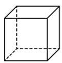

A. 2 个

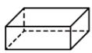

B. 3 个

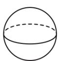

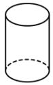

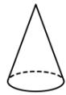

C. 4 个

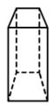

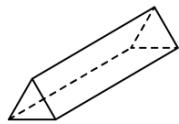

D. 5 个

【答案】C

【分析】本题考查了棱柱的定义，熟练掌握定义是解题的关键．根据棱柱的特点：上下两个面大小，形状完全相同，侧棱都相等，侧面都是平行四边形去判断.

【详解】解：根据题意，图中的第1个，第2个，第6个，第7个都是棱柱，共有4个棱柱，故选：C.

2. （3 分）（24-25 六年级上·山东威海·期末）下列说法不正确的是（）

A. 长方体是四棱柱;  
B. 八棱柱有 16 条棱;  
C. 五棱柱有 7 个面;  
D. 直棱柱的每个侧面都是长方形.

【答案】B

【分析】此题主要考查了认识立体图形，关键是认识常见的立体图形，掌握棱柱的特点．根据棱柱的特点可得答案.

【详解】解：A、长方体是四棱柱，选项说法正确，不符合题意；

B、八棱柱有 $8 \times 3 = 24$ 条棱，选项说法错误，符合题意；  
C、五棱柱有 7 个面，选项说法正确，不符合题意；  
D、直棱柱的每个侧面都是长方形，选项说法正确，不符合题意；

故选：B.

3. （3 分）（24-25 六年级上·山东泰安·期末）如图所示的几何体从左面看到的形状图是（）

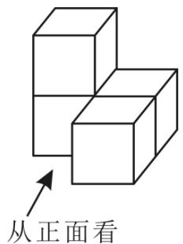

text_image

从正面看

A.

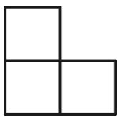

B.

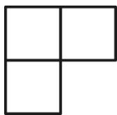

C.

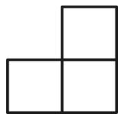

D.

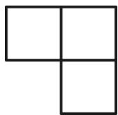

【答案】A

【分析】本题主要从不同方向看几何体，熟练掌握几何体的特征是解题的关键；因此此题可根据几何体的特征进行求解.

【详解】

解：由图可知从左面看到的形状图是

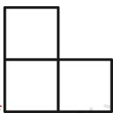

故选A.

4. （3 分）（24-25 七年级上·贵州毕节·期中）如图，用一个平面去截一个三棱柱，截面的形状不可能是（）

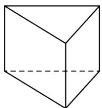

natural_image

Simple line drawing of a 3D cube with visible edges and a dashed hidden line (no text or symbols)

A. 三角形

B. 四边形

C. 五边形

D. 六边形

【答案】D

【分析】本题考查了截一个几何体，熟练掌握三棱柱的截面形状是解题的关键．根据三棱柱的截面形状判断即可.

【详解】解：用一个平面去截一个三棱柱，截面的形状可能是：三角形，四边形，五边形，

不可能是六边形.

故选：D.

5. （3 分）（24-25 七年级上·四川成都·期中）在图中增加 1 个大小相同的正方形，使所得的新图形经过折

叠能够围成一个正方体，那么有（）种不同的添加方法

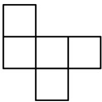

natural_image

Geometric arrangement of five connected squares forming an L-shape (no text or symbols)

A. 2

B. 3

C. 4

D. 5

【答案】C

【分析】本题考查了展开图折叠成几何体，结合正方体的平面展开图的特征，只要折叠后能围成正方体即可.

【详解】解：如图所示，在标有1、2、3、4的位置增加1个大小相同的正方形，能使所得的新图形经过折叠能够围成一个正方体，

所以有4种不同的添加方法.

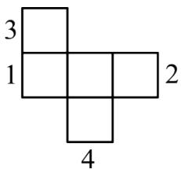

text_image

3
1
2
4

故选: C.

6. （3 分）（24-25 七年级上·江苏苏州·专题练习）如图几何体中可以由平面图形绕某条直线旋转一周得到的是（）

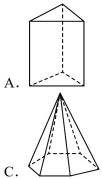

natural_image

Two geometric diagrams labeled A and C showing a 3D solid with dashed lines indicating hidden edges (no text or symbols beyond labels)

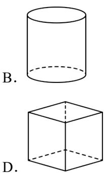

natural_image

Two simple geometric shapes: a cylinder and a cube, both with dashed hidden edges (no text or symbols)

【答案】B

【分析】根据平面图形绕某条直线旋转一周得到的几何体必须有曲面，逐一判断即可解答.
考查了平面图形旋转形成几何体，熟练掌握几何体的生成方式是解题的关键.

【详解】解：∵平面图形绕某条直线旋转一周得到的几何体必须有曲面，

∴B 选项符合题意;

故选：B.

7. （3 分）（24-25 七年级上·广东深圳·期中）如图所示的长方形（长为 7，宽为 4）硬纸板，剪掉阴影部分后，将剩余的部分沿虚线折叠，制作成底面为正方形的长方体箱子，则长方体箱子的体积为（）

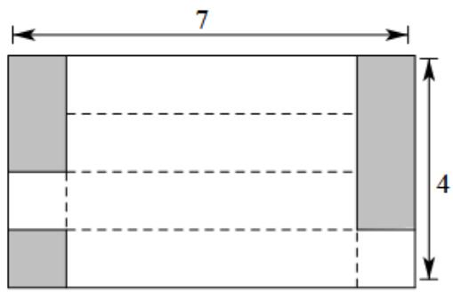

text_image

7
4

A. 22

B. 5

C. 7

D. 11

【答案】B

【分析】利用图形求出长方体的宽及长即可.

【详解】解：∵长方体的底面为正方形，由图可知底面周长等于长方形纸板的宽，

∴正方形的边长为1，箱子的长为 $7-1\times2=5$ ，

长方体的体积为： $5 \times 1 \times 1 = 5$

故选 B.

【点睛】本题主要考查长方体体积的计算方法，熟练根据图求出长宽高是解题关键.

8. （3 分）（24-25 六年级下·上海·开学考试）把一个长 8 厘米、宽 6 厘米、高 4 厘米的长方体截成两个长方体后，这两个长方体的表面积之和比原长方体增加了（）平方厘米.

A. 96

B. 48

C. 64

D. 以上三种都有可能

【答案】D

【分析】本题考查长方体的切割．通过不同的切割方式确定切面长方形的长和宽是解题的关键．求出切面的表面积进行比较即可.

【详解】解：如图，

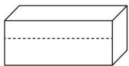

按照上图虚线截成两个长方体后，这两个长方体的表面积之和比原长方体增加了 $8 \times 6 \times 2 = 96$ 平方厘米；如图，

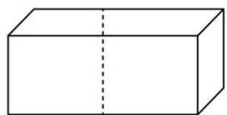

按照上图虚线截成两个长方体后，这两个长方体的表面积之和比原长方体增加了 $4 \times 6 \times 2 = 48$ 平方厘米；如图，

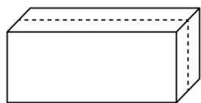

按照上图虚线截成两个长方体后，这两个长方体的表面积之和比原长方体增加了 $4 \times 8 \times 2 = 64$ 平方厘米；  
∴以上三种都有可能；

故选：D

9. （3 分）（2025·河南焦作·二模）如图是正方体表面展开图．将其折叠成正方体后，距顶点P最远的点是（）

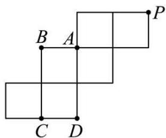

text_image

B A P
C D

A. 点 $A$

B. 点 $B$

C. 点 $C$

D. 点 $D$

【答案】A

【分析】本题考查了平面图形和立体图形，把图形围成立体图形求解.

【详解】解：把图形围成立方体如图所示：

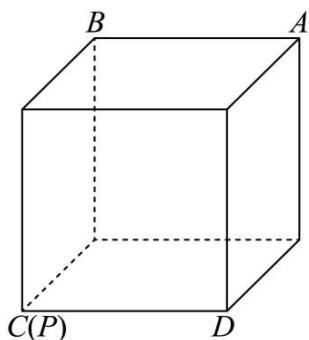

text_image

B
A
C(P)
D

所以与顶点P距离最远的顶点是A，

故选：A.

10. （3 分）（24-25 七年级上·江苏苏州·专题练习）变式1，用大小相同的小正方体搭一个几何体，从正面看和从上面看所得的图形如图所示，这样的几何体最少需要小正方体的个数为（）

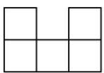  
从正面看

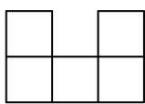  
从上面看

A. 5

B. 6

C. 7

D. 8

【答案】C

【分析】本题考查了学生对三视图的掌握程度和灵活运用能力、空间想象能力，灵活运用三视图的能力和空间想象能力是解答本题的关键.

从上面可以看出最底层小正方形的个数及形状，从正面可以看出第1列和第3列都有2个小正方体，从而可以算出最少需要小正方体的个数.

【详解】解：由从上面看到的形状可得最底层有5个小正方体，

由从正面看到的形状可得第1列和第3列都有2个小正方体，

那么最少需要 $5+2=7$ 个小正方体，

故选：C.

# 二．填空题（共6小题，满分18分，每小题3分）

11. （3 分）（24-25 七年级·江苏南京·专题练习）棱柱可以分为\_\_\_\_和\_\_\_\_。直棱柱的侧面是\_\_\_\_。

【答案】

直棱柱

斜棱柱

长方形

【分析】棱柱可以分为直棱柱和斜棱柱，直棱柱的每个侧面都是长方形，据此回答.

【详解】解：棱柱可以分为直棱柱和斜棱柱，直棱柱的侧面是长方形.

故答案为：直棱柱；斜棱柱；长方形.

【点睛】本题考查棱柱的分类和特征，棱柱的各个侧面都是平行四边形，所有的侧棱都平行且相等；直棱柱的各个侧面都是长方形.

12. （3 分）（24-25 七年级上·河南郑州·期末）某几何体的一个截面是三角形，则这个几何体可能是\_\_\_\_。（写一个即可）

【答案】三棱柱（答案不唯一）

【分析】本题考查截一个几何体，掌握正方体，圆锥、棱柱的截面的形状是正确解答的关键．根据正方体，圆锥、棱柱的截面的形状进行判断即可.

【详解】解：某几何体的一个截面是三角形，则这个几何体可能是正方体、三棱柱、圆锥，

故答案为：三棱柱（答案不唯一）.

13. （3 分）（24-25 七年级上·宁夏银川·期末）银川承天寺塔（如图），始建于西夏天佑垂圣元年（公元

1050 年），是宁夏现存古塔中最高的一座砖塔。它是一座八角十一层楼阁式砖塔，它可以近似地看作由十一个八棱柱构成。请问：一个八棱柱一共有\_\_角\_\_\_\_条棱，有\_\_\_\_面，有\_\_\_\_个顶点。

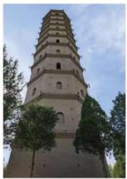

natural_image

Exterior view of a multi-tiered stone pagoda with arched windows and trees in the foreground (no signage or text visible)

【答案】 16 24 10 16

【分析】本题考查立体几何的知识，解题的关键是掌握八棱柱的立体图形，根据图形，进行解答，即可.

【详解】解：八棱柱是一个有8个侧面的棱柱，每个侧面都是矩形，有两个底面，每个底面都是都是一个八边形，每个底面有8个顶点；每个底面有8条棱，每个底面的顶点都于另一个底面对应的顶点相连；

∴八棱柱有16个角；有 $3 \times 8 = 24$ 条棱；有10个面；有 $8 \times 2 = 16$ 个顶点；

故答案为：16；24；10；16.

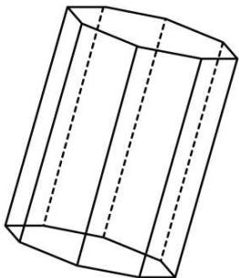

natural_image

3D geometric diagram of a cylinder with dashed internal lines (no text or symbols)

14. （3 分）（24-25 七年级上·福建宁德·期中）“点亮青春梦想”六个字分别书写在正方体的六个面上，如图是它的一种展开图，那么在原正方体中，与“青”字所在面相对的面上的汉字是\_\_\_\_。

<table><tr><td>点</td><td>亮</td><td colspan="2"></td></tr><tr><td></td><td>青</td><td>春</td><td>梦</td></tr><tr><td colspan="3"></td><td>想</td></tr></table>

【答案】梦

【分析】此题考查正方体相对面上的字，根据正方体相对面之间间隔一个正方形解答即可.

【详解】解：由正方体展开图的特点可知，“点”与“春”相对，“亮”与“想”相对，“青”与“梦”相对，故答案为：梦.

15. （3 分）（24-25 七年级上·江苏南京·专题练习）下列各硬纸片分别沿虚线折叠，得不到长方体纸盒的是\_\_\_\_。（请填写序号）

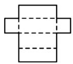  
①

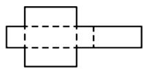  
②

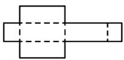  
③

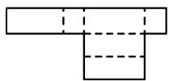  
④

【答案】③④

【分析】此题考查了展开图折叠成长方体，通过结合立体图形与平面图形的相互转化，去理解和掌握几何体的展开图，要注意多从实物出发，然后再从给定的图形中辨认它们能否折叠成给定的立体图形.由平面图形的折叠及展开图解题.

【详解】解:①和②可以折叠成, ③和④有重叠的面不可以折成,

故答案为：③④.

16. （3 分）（24-25 六年级上·山东威海·期末）如图 1 是边长为 1 的六个小正方形组成的图形，它可以围成图 2 的正方体，则图 1 中小正方形的顶点 A、B 在图 2 围成的小正方体上的距离是 \_\_\_\_.

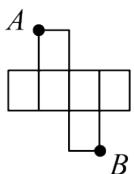  
图1

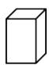  
图2

【答案】1

【分析】本题考查了展开图折成几何体，判断出 $A$ 、 $B$ 两点在正方体上的位置是解题关键。由展开图折叠成几何体可知，正方体上的顶点 $A$ 、 $B$ 是同一棱上的两个端点，据此即可得到答案。

【详解】解：由展开图折叠成几何体可知，正方体上的顶点 A、B 是同一棱上的两个端点，即 A、B 的距离是正方体的棱长 1，

故答案为：1.

# 第II卷

# 三．解答题（共8小题，满分72分）

17. （6 分）（24-25 七年级上·江苏无锡·单元测试）将下列几何体按名称分类：

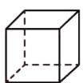

①正方体

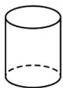

②圆柱

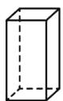

③长方体

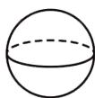

④球

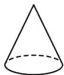

⑤圆锥

柱体有\_\_\_\_；

锥体有\_\_\_\_；

球体有\_\_\_\_。（请填写序号）

【答案】（1）（2）（3），（5），（4）

【分析】本题主要了立体图形的分类，理解立体图形的分类是解答关键。根据柱体、锥体、球体进行分类求解。

【详解】解：根据图形可知

柱体分为圆柱和棱柱，所以柱体有（1）（2）（3）；

锥体包括棱锥与圆锥，所以锥体有（5）

球体属于单独的一类，球有（4）.

故答案为：（1）（2）（3），（5），（4）.

18. （6 分）（24-25 七年级上·江苏无锡·阶段练习）飞机表演“飞机拉线”时，我们用数学的知识可解释为点动成线。用数学知识解释下列现象：

(1)流星从空中划过留下的痕迹可解释为\_\_\_\_；

(2)自行车的辐条运动可解释为\_\_\_\_；

(3)一只蚂蚁行走的路线可解释为\_\_\_\_；

(4)打开折扇得到扇面可解释为\_\_\_\_；

(5)一个圆面沿着它的一条直径旋转一周成球可解释为\_\_\_\_.

【答案】(1)点动成线;

(2)线动成面;

(3)点动成线;

(4)线动成面;

(5)面动成体.

【分析】根据点线面体之间的关系为：点动成线，线动成面，面动成体的规律来解答即可.

【详解】（1）解：流行是点，光线是线，流星划出一条长线，所以流星从空中划过留下的痕迹可解释为点动成线；

（2）解：自行车的辐条是线，在运动过程中形成面，所以自行车的辐条运动可解释为线动成面；

（3）解：蚂蚁可看做是点，行走的路线是线，所以一只蚂蚁行走的路线可解释为点动成线；

（4）解：折扇合起来时是一条线，打开折扇得到扇面可解释为线动成面；

（5）解：一个圆是面，球是立体图形，一个圆面沿着它的一条直径旋转一周成球可解释为面动成体.

【点睛】此题主要考查了点、线、面、体，关键是掌握四者之间的关系.

19. （8 分）（24-25 六年级上·山东淄博·期中）如图所示为一个棱柱形状的食品包装盒的展开图.

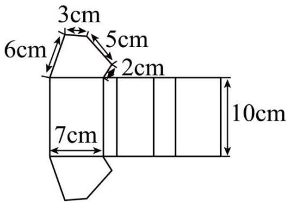

text_image

3cm
6cm
5cm
2cm
7cm
10cm

(1)这个食品包装盒的几何体名称是；  
(2)根据图中所给数据，求这个食品包装盒的侧面积.

【答案】(1)五棱柱

(2) $230cm^{2}$

【分析】本题考查了几何体的展开图，解决本题的关键是熟悉由平面图形的折叠及常见立体图形的展开图.

(1) 由平面图形的折叠及常见立体图形的展开图, 即可解答;   
(2) 侧面积为 5 个长方形的面积之和, 即可解答.

【详解】（1）解：这个包装盒为五棱柱；

(2) 解: $S_{\text{侧}} = 10 \times (7 + 2 + 5 + 3 + 6) = 230(\mathrm{cm}^2)$ .

20. （8 分）（24-25 七年级上·江苏无锡·专题练习）我们知道，三棱柱的上、下底面都是三角形，那么正三棱柱的上、下底面都是等边三角形．如图，大正三棱柱的底面周长为 10，截取一个底面周长为 3 的小正三棱柱．

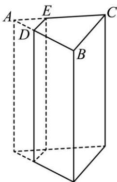

natural_image

Geometric diagram of a rectangular prism with labeled vertices A, B, C, D, E (no text or symbols beyond labels)

(1)请写出截面的形状;   
(2)请直接写出四边形 DECB 的周长.

【答案】(1)长方形

(2)9

【分析】（1）依据大正三棱柱的底面周长为 10，截取一个底面周长为 3 的小正三棱柱，即可得到截面的形状；

（2）依据 $\triangle ADE$ 是周长为3的等边三角形， $\triangle ABC$ 是周长为10的等边三角形，即可得到四边形 $DECB$ 的周长.

【详解】（1）由题可得，截面的形状为长方形.

(2) $\because\triangle ADE$ 是周长为3的等边三角形,

$$
\therefore D E = A D = 1,
$$

又∵△ABC 是周长为 10 的等边三角形，

$$
\therefore A B = A C = B C = \frac {1 0}{3},
$$

$$
\therefore D B = E C = \frac {1 0}{3} - 1 = \frac {7}{3},
$$

∴四边形 DECB 的周长= $1+\frac{7}{3}\times2+\frac{10}{3}=9$ .

【点睛】本题考查了正三棱柱的截面，底面周长的计算，正确理解正三棱柱的截面是解题的关键.

21. （10 分）（24-25 七年级上·山东威海·期末）如图所示的几何体，由五个大小相同的小正方体搭成.

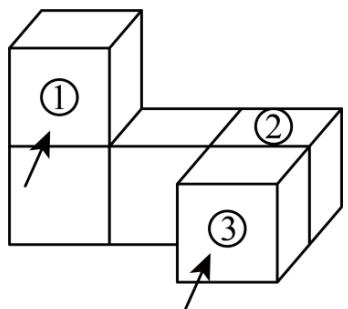

flowchart

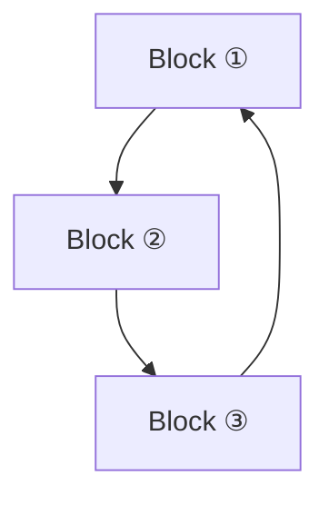

正面

(1)分别画出从正面，左面和上面看到的该几何体的形状图；

(2)当去掉一个小正方体\_\_\_\_时，剩余部分从左面看形状没有改变（填写图中小正方体的序号）.

【答案】(1)图见解析

(2)②

【分析】本题考查从不同方形看几何体:

（1）分别画出从前面，左面和上面看到的图形即可；  
(2) 根据从左面看的形状不变, 进行判断即可.

【详解】（1）解：由题意，作图如下：

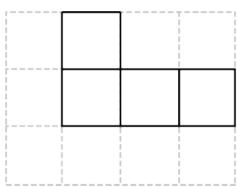

natural_image

Simple geometric diagram with three empty squares arranged in a 3x3 grid (no text or symbols)

从正面看

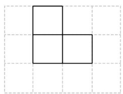

natural_image

Simple geometric diagram of three connected squares forming a T-shape (no text or symbols)

从左面看

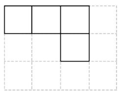

natural_image

Simple geometric grid with four empty squares and dashed lines (no text or symbols)

从上面看

(2) 由图可知: 去掉①或③时, 从左面看的形状都会发生改变, 去掉②时, 形状不变, 故答案为: ②.

22. （10 分）（24-25 七年级上·河南郑州·期中）【问题情境】某综合实践小组计划进行废物再利用的环保小卫士活动。他们准备用废弃的宣传单制作成装垃圾的无盖纸盒。

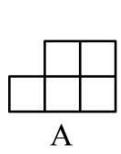

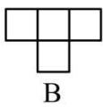

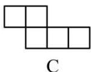

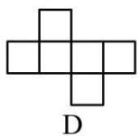  
图(1)

  
图(2)

  
图(3)

# 【操作探究】

(1)若准备制作一个无盖的正方体纸盒，如图(1)，图形\_经过折叠能围成一个无盖正方体纸盒．(填 A，B，C，或 D)  
(2)如图(2)是小明的设计图，把它折成一个无盖正方体纸盒后与“保”字所在面相对的面上的文字是\_.  
(3)如图(3), 有一张边长为 $20 \mathrm{~cm}$ 的正方形废弃宣传单, 小华将其四个角各剪去一个边长为 $4 \mathrm{~cm}$ 小正方形后, 折成无盖长方体纸盒. 求这个无盖长方体纸盒的底面积和容积.

【答案】(1)C

(2) 卫   
(3)这个无盖长方体纸盒的底面积为 $144 \, cm^{2}$ ，容积为 $576 \, cm^{3}$

【分析】本题主要考查了正方体的展开和折叠，

对于（1），根据正方体的折叠逐项判断；

对于（2），将正方体折叠可得各面相对的字，进而得出答案；

对于（3），画出示意图，再根据面积和体积计算公式计算即可.

【详解】（1）要围成一个无盖正方体纸盒，说明展开图有5个面，选项A不能制作成无盖正方体纸盒；选项B有4个面，不符合题意；选项D有6个面，不符合题意，只有选项C中的图形符合题意.

故选：C.

(2) 将正方体折叠可知“小”字对“环”字, “保”字与“卫”字.

故答案为：卫；

（3）正方形四个角各剪去一个小正方形后，如图所示.

natural_image

Pure geometric diagram with dashed and solid lines forming a square divided into four equal sections (no text or symbols)

因为剪去的小正方形的边长为 4cm，

所以无盖长方体纸盒的底面积为 $(20 - 2\times 4)\times (20 - 2\times 4) = 144(\mathrm{cm}^2)$ ，容积为 $4\times 144 = 576(\mathrm{cm}^3)$

答：这个无盖长方体纸盒的底面积为 $144 \, cm^{2}$ ，容积为 $576 \, cm^{3}$ .

23. （12 分）（24-25 七年级上·山东淄博·期中）（1）如图所示的六棱柱中，它的底面边长都是 $4 \mathrm{~cm}$ ，侧棱长为 $8 \mathrm{~cm}$ ，这个棱柱共有多少个面？这个棱柱共有多少个顶点？有多少条棱？它的侧面积是多少？

natural_image

Simple line drawing of a 3D rectangular prism (cuboid) with no text or symbols

(2) 如图, 有一个长 $6 \mathrm{~cm}$ , 宽 $4 \mathrm{~cm}$ 的长方形纸板, 现要求以其一组对边中点所在直线为轴旋转 $180^{\circ}$ , 可按两种方案进行操作.

text_image

6cm
4cm
教辅资源

图(1)  
图(2)

方案一：以较长的一组对边中点所在直线为轴旋转，如图（1）；

方案二：以较短的一组对边中点所在直线为轴旋转，如图（2）.

①上述操作能形成的几何体是\_\_\_\_，说明的事实是\_\_\_\_；

②请通过计算说明哪种方案得到的几何体的体积大.

【答案】（1）这个棱柱共有8个面，有12个顶点，有18条棱；侧面积为 $192cm^{2}$ ；（2）①圆柱，面动成体；②方案一得到的圆柱的体积大

【分析】本题考查基本图形旋转得到的体积及棱柱、圆柱体积计算；

(1) 根据棱柱特征直接解答即可;

(2) ①根据面动成体解答即可; ②先求出所得几何体体积再比较大小即可.

【详解】解：（1）①这个棱柱共有8个面，

有 12 个顶点，

有 18 条棱;

②它的侧面积为 $4 \times 8 \times 6 = 192(\text{cm}^2)$ ;

(2) ①长方形旋转可以得到圆柱, 上述操作能形成的几何体是圆柱,

说明的事实是：面动成体，

②方案一： $\pi\times3^{2}\times4=36\pi(cm^{3})$

方案二： $\pi\times2^{2}\times6=24\pi(cm^{3})$

$$
\because 3 6 \pi > 2 4 \pi ,
$$

∴方案一得到的圆柱的体积大.

24. （12 分）（24-25 七年级上·山西晋城·期末）综合与实践

新年晚会是我们最欢乐的时候，会场上，悬挂着五彩缤纷的小装饰，其中有各种各样的立体图形。下面是常见的一些多面体：

  
四面体

  
六面体

  
八面体

  
十二面体

操作探究:

(1)通过数上面图形中每个多面体的顶点数（V）、面数（F）和棱数（E），填写下表中空缺的部分：

<table><tr><td>多面体</td><td>顶点数(V)</td><td>面数(F)</td><td>棱数(E)</td></tr><tr><td>四面体</td><td>4</td><td></td><td></td></tr><tr><td>六面体</td><td>8</td><td>6</td><td></td></tr><tr><td>八面体</td><td></td><td>8</td><td>12</td></tr><tr><td>十二面体</td><td>20</td><td></td><td>30</td></tr></table>

通过填表发现: 顶点数 (V)、面数 (F) 和棱数 (E) 之间的数量关系是\_, 这就是伟大的数学家欧拉 (L.Euler, 1707—1783) 证明的这一个关系式. 我们把它称为欧拉公式;

探究应用:

(2)已知一个棱柱只有七个面，则这个棱柱是\_棱柱；

(3)已知一个多面体只有8个顶点，并且过每个顶点都有3条棱，求这个多面体的面数.

【答案】(1)表见解析， $V + F - E = 2$

(2)五

(3)6

【分析】（1）通过观察，发现棱数 = 顶点数 + 面数 - 2；

(2) 根据棱柱的定义进行解答即可;

(3) 由 (1) 得出的规律进行解答即可.

【详解】（1）解：填表如下：

<table><tr><td>多面体</td><td>顶点数(V)</td><td>面数(F)</td><td>棱数(E)</td></tr><tr><td>四面体</td><td>4</td><td>4</td><td>6</td></tr><tr><td>六面体</td><td>8</td><td>6</td><td>12</td></tr><tr><td>八面体</td><td>6</td><td>8</td><td>12</td></tr><tr><td>十二面体</td><td>20</td><td>12</td><td>30</td></tr></table>

顶点数（V）、面数（F）和棱数（E）之间的数量关系是 $V + F - E = 2$ ，

故答案为： $V + F - E = 2$ ;

(2) 解: $\because$ 一个棱柱只有七个面, 必有 2 个底面,

∴有7-2=5个侧面，

∴ 这个棱柱是五棱柱，

故答案为：五；

（3）解：由题意得：棱的总条数为 $\frac{8\times3}{2}=12$ （条），

由 $V + F - E = 2$ 可得 $8 + F - 12 = 2$ ,

解得：F = 6，

故该多面体的面数为 6.

【点睛】本题考查了多面体与棱柱的认识，点线面体的相关概念，正确看出图形中各量之间的关系是解题的关键.