# 第一章 丰富的图形世界·拔尖卷

# 【北师大版 2024】

考试时间：120 分钟 满分：120 分

姓名：\_\_\_\_ 班级：\_\_\_\_ 考号：\_\_\_\_

考卷信息:

本卷试题共 24 题，单选 10 题，填空 6 题，解答 8 题，满分 120 分，限时 120 分钟，本卷题型针对性较高，覆盖面广，选题有深度，可衡量学生掌握本章内容的具体情况！

# 第I卷

# 一．选择题（共10小题，满分30分，每小题3分）教辅资源，关注公众号★全科AA+

1. （3 分）（24-25 六年级上·山东泰安·期中）下图为小文同学的几何体素描作品，该作品中不存在的几何体为（）

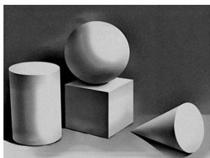

natural_image

Monochrome still life of four geometric shapes: cylinder, sphere, cube, and cone (no text or symbols)

A. 棱柱

B. 球

C. 圆柱

D. 棱锥

2. （3 分）（24-25 七年级上·重庆江津·期末）篆刻是中华传统艺术之一，雕刻印章是篆刻基本功。左图是一块雕刻印章的材料，从左面看到的平面图形为（）

A.

B.

C.

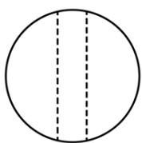

D.

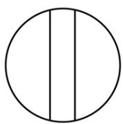

3. （3 分）（24-25 七年级上·辽宁丹东·期末）用一个平面去截四棱柱、圆锥、圆柱、五棱柱、球，截面可能是三角形的几何体有（）

A. 3 个

B. 2 个

C. 4 个

D. 5 个

4. （3 分）（24-25 七年级上·陕西渭南·期末）如图是将三角形绕虚线 $l$ 旋转一周得到的立体图形，则旋转的三角形是下列选项中的（）

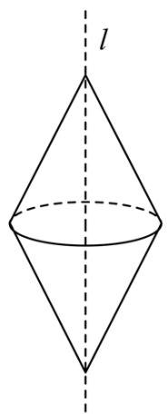

natural_image

Geometric diagram of a cone with a horizontal axis labeled 'l' and a dashed vertical line, no text or symbols present.

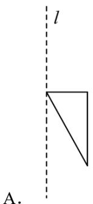

text_image

l
A.

B.   
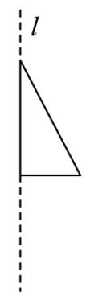

text_image

l

C.   
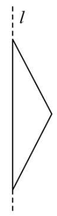

D.   
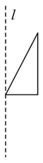

5. （3 分）（24-25 七年级上·湖北省直辖县级单位·期末）下列图中不是无盖正方体展开图的是（）

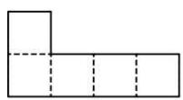  
①

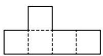  
②

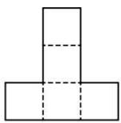  
③

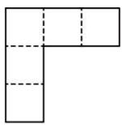  
④

A. ①

B. ②

C. ③

D. ④

6. （3 分）（14-15 七年级上·全国·课后作业）将一张正方形纸片按图①、图②所示的方式依次对折后，再沿图③中的虚线剪裁，最后将图④中的纸片打开铺平，所得到的图案是（）

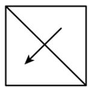  
图①

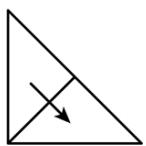  
图②

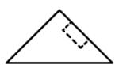  
图③

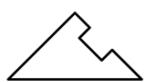  
图④

A.

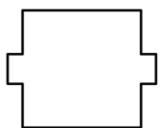

B.

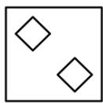

C.

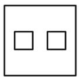

D.

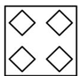

7. （3 分）（23-24 七年级上·山东济宁·阶段练习）如图所示的正方体的展开图是（）

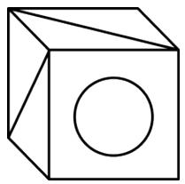

natural_image

Simple line drawing of a cube with a circle on its face (no text or symbols)

A.

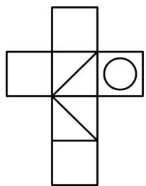

natural_image

Geometric cross shape composed of rectangles and triangles, no text or symbols present

B.

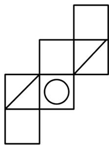

natural_image

Geometric diagram of squares arranged in a 3x3 grid with one circle at center (no text or symbols)

C.

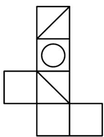

natural_image

Geometric diagram of a L-shaped structure composed of squares and triangles, with no text or symbols present.

D.

natural_image

Geometric cross shape composed of rectangles and triangles, no text or symbols present

8. （3 分）（22-23 七年级上·重庆合川·期末）图①是边长为 1 的六个正方形组成的图形，经过折叠能围成如图②的正方体，一只蜗牛从 A 点沿该正方体的棱爬行到 B 点的最短距离为（）

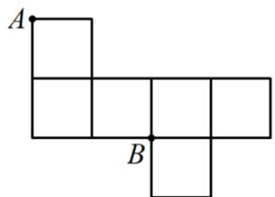

text_image

A
B

①

②

A. 0

B. 1

C. 2

D. 3

9. （3 分）（24-25 七年级上·辽宁沈阳·阶段练习）如图，已知线段BC是圆柱底面的直径，圆柱底面的周长为10，圆柱的高AB = 12，在圆柱的侧面上，过点A、C两点嵌有一圈长度最短的金属丝．现将圆柱侧面沿AB剪开，所得的圆柱侧面展开图是（）教辅资源，关注公众号★全科AA+

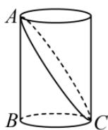

A.

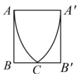

B.

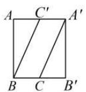

C.

D.

10. （3 分）桌面上摆着一个由一些相同的小正方体搭成的立体图形，从它的正面看到的形状是

，从它的左面看到的形状是 ，这个立体图形可能是（）

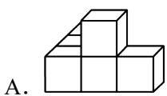

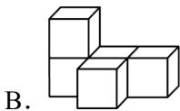

# 二．填空题（共6小题，满分18分，每小题3分）

11. （3 分）（24-25 七年级上·河南商丘·期末）一个立体图形的展开图如图所示，这个立体图形是\_\_\_\_。

natural_image

Pure geometric diagram with rectangles and hexagons, no text or symbols present

12. （3 分）（24-25 七年级上·陕西榆林·期末）向空中扔一块小石子，小石子经过的路线用数学知识解释为点动成线。中国扇文化有着深厚的文化底蕴，中国历来有“制扇王国”之称。如图，打开折扇时。随着扇骨的移动形成一个扇面，这种现象用数学知识解释为\_\_\_\_。

natural_image

Red traditional Chinese folding fan with black tassel and black base (no text or symbols)

13. （3 分）（22-23 七年级上·辽宁沈阳·期末）如图所示，①\~④是由相同的小立方块搭成的几何体，若组合其中的两个，恰是由 6 个小立方块搭成的长方体，则应选择\_\_\_\_。（填序号即可）

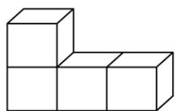  
①

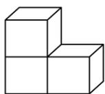  
②

  
③

  
④

14. （3 分）（24-25 七年级上·福建厦门·期末）在数学活动课上，同学们通过“剪一剪、画一画、折一折”的方法学习立体图形的展开图。如图，其中标注序号1-6的图形都是正方形，小艺认为它可以作为一个正方体的展开图，则她的判断\_\_\_\_（填“正确”或“错误”），理由

是\_\_\_\_。

<table><tr><td>1</td><td></td><td>2</td></tr><tr><td>3</td><td>4</td><td>5</td></tr><tr><td></td><td>6</td><td></td></tr></table>

15. （3 分）（23-24 七年级上·贵州毕节·期末）将如图所示的长方体用过ABCD的平面切割，得到的两个几何体是\_\_\_\_。

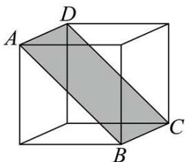

natural_image

Geometric diagram of a cube with labeled vertices A, B, C, D and shaded internal diagonals (no text or symbols)

16. （3 分）（22-23 七年级上·河北唐山·期末）如图是一个长方体的表面展开图，每个面上都标注了字母和数据，请根据要求回答

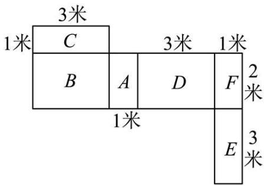

text_image

3米
1米 C 3米 1米
B A D F 2米
1米 E 3米

（1）如果 A 面在长方体的底部，那么 \_\_\_\_ 面会在上面；

(2) 这个长方体的体积为\_\_\_\_米 $^{3}$ .

# 第II卷

# 三．解答题（共8小题，满分72分）教辅资源，关注公众号★全科AA+

17. （6 分）（24-25 七年级上·河南洛阳·期末）一个长方体的每个面上都标注了字母，如图是该长方体的表面展开图，请根据要求回答问题：

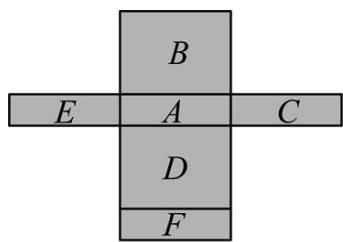

text_image

B
E A C
D
F

(1)如果 A 在长方体的底部，那么哪一面会在上面？  
(2)如果面 F 在前面，从左面看是 B 面，那么哪一面会在上面？

(3)如果从右面看是面 C，面 D 在后面，那么哪一面会在上面？

18. （6 分）（24-25 七年级上·贵州贵阳·期末）一个几何体由若干个大小相同的小立方块搭成，从上面看到的几何体形状图如图所示，其中小正方形中的数字表示在该位置的小立方块的个数。请画出从正面和从左面看到的这个几何体的形状图。

  
从上面看

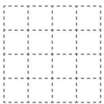

natural_image

Pure grid pattern with dashed and solid lines forming a symmetrical shape (no text or symbols)

从正面看

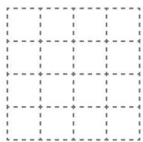

natural_image

Pure grid pattern with dashed lines and dots, no text or symbols present

从左面看

19. （8 分）（24-25 七年级上·全国·假期作业）如图，有一个长6cm，宽4cm的长方形纸板，现要求以其一组对边中点所在直线为轴旋转180°，可按两种方案进行操作。

text_image

6cm
4cm

图(1)  
图(2)

方案一：以较长的一组对边中点所在直线为轴旋转，如图（1）；

方案二：以较短的一组对边中点所在直线为轴旋转，如图（2）.

(1)上述操作能形成的几何体是\_\_\_\_，说明的事实是\_\_\_\_；  
(2)请通过计算说明哪种方案得到的几何体的体积大.

20. （8 分）（24-25 七年级上·广东揭阳·阶段练习）【问题背景】用小立方块搭一个几何体，使它从正面和上面看到的形状如图所示，从上面看到形状中小正方形中的字母表示在该位置上小立方块的个数.

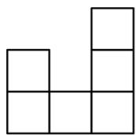

从正面看

从上面看

【初步探究】（1）a表示的数是\_\_\_\_，b表示的数是\_\_\_\_，c表示的数是\_\_\_\_；

【深入探究】（2）这个几何体最少由\_\_\_\_个小立方块搭成，最多由\_\_\_\_个小立方块搭成。

（3）当d=e=1，f=2时，画出从左面看这个几何体的形状.

21. （10 分）（24-25 六年级上·山东烟台·期中）三棱柱的上、下底面都是完全相同的三角形，正三棱柱的上、下底面都是完全相同的等边三角形．如图，大正三棱柱的底面周长为11，侧棱长为8，在大正三棱柱中截取了一个底面周长为3的小正三棱柱.

text_image

A
E
C
D
B

(1)请写出截面的形状\_，并求出截面的面积；  
(2)请直接写出四边形DECB的周长\_.

22. （10 分）（24-25 七年级上·贵州毕节·期中）小林所在的综合实践小组准备制作一些大小相同的正方体纸盒，用来收纳班级讲台上的粉笔（盒盖单独制作）.

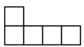  
①

  
②

  
③

  
④   
图1

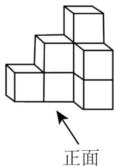

text_image

正面

图2

  
图3

(1)图 1 是综合实践小组的同学画出的一些形状图，其中\_\_\_\_（填序号）经过折叠能围成一个无盖正方体形纸盒.  
(2)综合实践小组的同学用制作的8个正方体形纸盒摆成如图2所示的几何体.

①在图 3 中画出从正面观察图 2 的几何体所看到的形状图;  
(2)如果在图 2 的几何体上再添加一些大小相同的正方体形纸盒, 并保持从上面看到的形状图和从左面看到的形状图不变, 最多可以再添加\_\_\_\_个正方体形纸盒.

23. （12 分）（24-25 六年级上·山东烟台·期中）下图是由若干个小立方块所搭建几何体从正面看与从上面看的形状图.

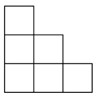  
从正面看

  
从上面看

(1)搭建这个几何体最少、最多各需多少个小立方块？搭建这个几何体需小立方块最少、最多可能有多种搭建方式，请你各拿出一种在从上面看的形状图的小正方形中用数字表示该位置所放小立方块的个数；  
(2)搭建该几何体有多种搭建方式，请你画出其中三种从左面看的形状图.

24. （12 分）（24-25 七年级上·全国·期末）下列图形中，图（a）是正方体木块，把它切去一块，得到如图（b）（c）（d）（e）的木块.

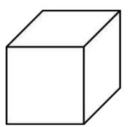  
(a)

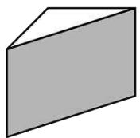  
(b)

  
(c)

  
(d)

  
(e)

(1)我们知道，图（a）（b）的相关数据已经给出，请你将图（c），（d），（e）中木块的顶点数，棱数，面数填入表：

<table><tr><td>图号</td><td>顶点数x</td><td>棱数y</td><td>面数z</td></tr><tr><td>(a)</td><td>8</td><td>12</td><td>6</td></tr><tr><td>(b)</td><td>6</td><td>9</td><td>-</td></tr><tr><td>(c)</td><td>-</td><td>-</td><td>-</td></tr><tr><td>(d)</td><td>-</td><td>-</td><td>-</td></tr><tr><td>(e)</td><td>-</td><td>-</td><td>-</td></tr></table>

(2)如表, 各种木块的顶点数, 棱数, 面数之间的数量关系可以归纳出一定的规律, 请你试写出顶点数, 棱数, 面数之间的数量关系式.