# 第一章 丰富的图形世界·拔尖卷

【北师大版 2024】

参考答案与试题解析

# 第I卷

# 一．选择题（共10小题，满分30分，每小题3分）

1. （3 分）（24-25 六年级上·山东泰安·期中）下图为小文同学的几何体素描作品，该作品中不存在的几何体为（）

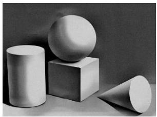

natural_image

Monochrome still life of geometric shapes: cylinder, sphere, and cone (no text or symbols)

A. 棱柱

B. 球

C. 圆柱

D. 棱锥

【答案】D

【分析】本题考查的是简单几何体的识别，熟练掌握几何体的特征是解题的关键；根据棱柱，球，圆锥的特点分析即可.

【详解】解：由题意可得：该作品中有棱柱，球，圆柱，没有棱锥

故选：D

2. （3 分）（24-25 七年级上·重庆江津·期末）篆刻是中华传统艺术之一，雕刻印章是篆刻基本功。左图是一块雕刻印章的材料，从左面看到的平面图形为（）

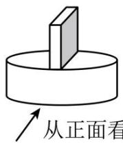

A.

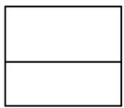

B.

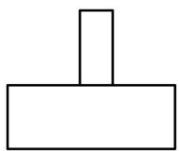

C.

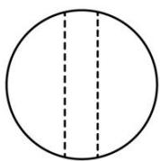

D.

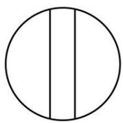

【答案】A

【分析】本题考查简单组合体的三视图，掌握简单组合体三视图的画法是正确解答的关键.

画出从左边看到的图形即可求解.

【详解】

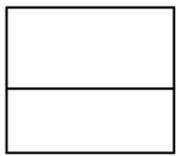

解：从左边看到的图形为：

故选：A.

3. （3 分）（24-25 七年级上·辽宁丹东·期末）用一个平面去截四棱柱、圆锥、圆柱、五棱柱、球，截面可能是三角形的几何体有（）

A. 3 个

B. 2 个

C. 4 个

D. 5 个

【答案】A

【分析】本题考查了截一个几何体，截面的形状既与被截的几何体有关，还与截面的角度和方向有关，根据几何体的形状，判断出截面的形状，掌握相关知识是解题的关键.

【详解】解：用一个平面去截四棱柱、圆锥、圆柱、五棱柱、球，截面可能是三角形的几何体有四棱柱、圆锥、五棱柱，共有3个，

故选：A.

4. （3 分）（24-25 七年级上·陕西渭南·期末）如图是将三角形绕虚线 l 旋转一周得到的立体图形，则旋转的三角形是下列选项中的（）

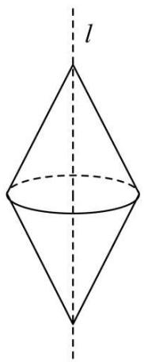

text_image

l

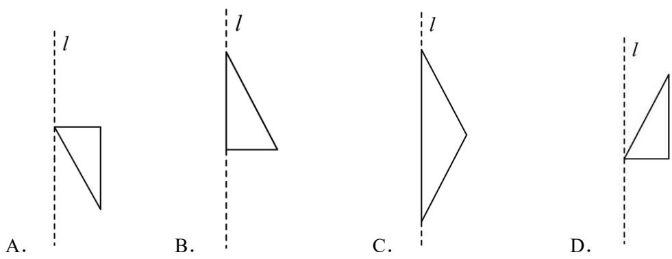

【答案】C

【分析】本题主要考查了平面图形旋转后所得的立体图形，根据立体图形是两个底面重合的圆锥，进而判断出三角形的形状，即可求解.

【详解】解：依题意，将平面图形

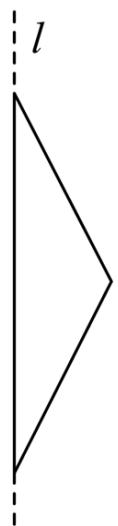

natural_image

Simple geometric diagram showing a triangle with a vertical dashed line labeled 'l' (no text or symbols within the shapes)

绕着直线l旋转一周即可得到如图所示的立体图形，

故选：C.

5. （3 分）（24-25 七年级上·湖北省直辖县级单位·期末）下列图中不是无盖正方体展开图的是（）

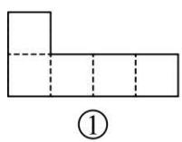

A. ①

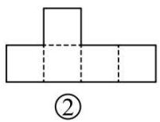

B. ②

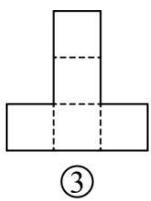

C. ③

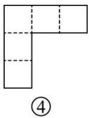

D. ④

【答案】D

【分析】本题主要考查正方体的展开图，熟练掌握正方体的11种展开图是解题的关键．根据正方体的11种展开图即可得到答案.

【详解】

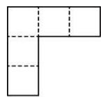

解：④ 不是无盖正方体展开图，

故选D.

6. （3 分）（14-15 七年级上·全国·课后作业）将一张正方形纸片按图①、图②所示的方式依次对折后，再沿图③中的虚线剪裁，最后将图④中的纸片打开铺平，所得到的图案是（）

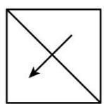  
图①

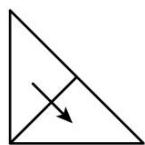  
图②

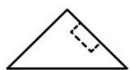  
图③

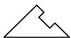  
图④

A.

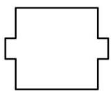

B.

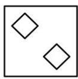

C.

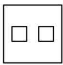

D.

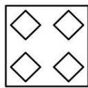

【答案】B

【分析】根据题中所给剪纸方法，进行动手操作，答案就会很直观地呈现.

【详解】解：严格按照图中的顺序进行操作，展开得到的图形如选项 B 中所示，故选：B.

【点睛】本题考查了剪纸问题，动手能力及空间想象能力，解题的关键是学生只要亲自动手操作，答案就会很直观地呈现.

7. （3 分）（23-24 七年级上·山东济宁·阶段练习）如图所示的正方体的展开图是（）

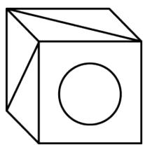

natural_image

Simple line drawing of a cube with a circular hole on its face (no text or symbols)

A.

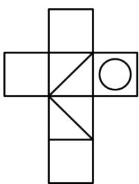

natural_image

Geometric cross shape composed of rectangles and triangles, no text or symbols present

B.

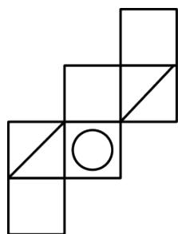

natural_image

Geometric diagram of squares arranged in a staggered pattern with one circle at center (no text or symbols)

C.

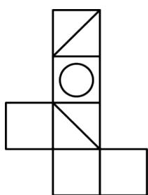

natural_image

Geometric diagram of a L-shaped structure composed of squares and triangles, with no text or symbols present.

D.

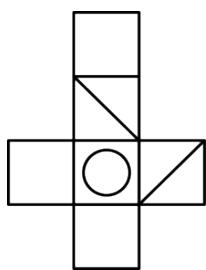

natural_image

Geometric cross shape composed of rectangles and triangles, no text or symbols present

【答案】D

【分析】根据答案可知，这几个展开图均为正方体展开图，再根据正方体上的图案位置判断即可.

【详解】解：根据答案可知，这几个展开图均为正方体展开图；

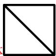

∵正方体这样的两个面的对角线没有连接在一起，∴A 错误；

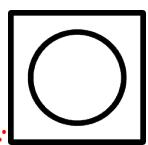

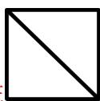

不在这两个面中间，∴B、C错误；

故选：D.

【点睛】本题主要考查正方体的展开图的应用，具备想象力和观察力是解题的关键.

8. （3 分）（22-23 七年级上·重庆合川·期末）图①是边长为 1 的六个正方形组成的图形，经过折叠能围成如图②的正方体，一只蜗牛从 A 点沿该正方体的棱爬行到 B 点的最短距离为（）

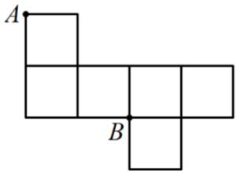

text_image

A
B

①

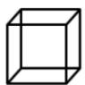  
②

A. 0

B. 1

C. 2

D. 3

【答案】C

【分析】将图①折成正方体，然后判断出A、B的在正方体中的位置，从而可得到AB之间的距离.

【详解】解：如图所示，将图①折成正方体后点A、B的在正方体中的位置，

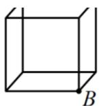

∵ 蜗牛是从A点沿该正方体的棱爬行到B点

$$
\therefore A B = 2,
$$

故选：C.

【点睛】本题考查了展开图折成几何体，判断出A、B的在正方体中的位置是解题的关键.

9. （3 分）（24-25 七年级上·辽宁沈阳·阶段练习）如图，已知线段BC是圆柱底面的直径，圆柱底面的周长为10，圆柱的高AB = 12，在圆柱的侧面上，过点A、C两点嵌有一圈长度最短的金属丝．现将圆柱侧面沿AB剪开，所得的圆柱侧面展开图是（）

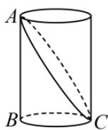

A.

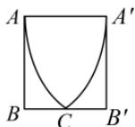

B.

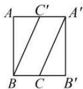

C.

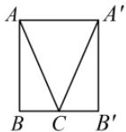

D.

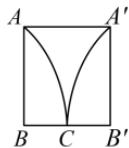

【答案】C

【分析】本题考查圆柱的侧面展开图，解题的关键是根据由平面图形的折叠及立体图形的表面展开图的特点解答即可.

【详解】解：∵圆柱的侧面展开面为长方形，

∴AC展开后应该是两条线段，且有公共点C.

故选：C.

10. （3 分）桌面上摆着一个由一些相同的小正方体搭成的立体图形，从它的正面看到的形状是

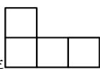

，从它的左面看到的形状是\_\_\_\_，这个立体图形可能是（）

A.

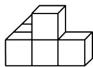

B.

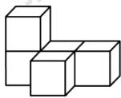

C.

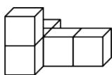

D.

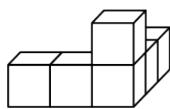

【答案】C

【分析】结合立体图形从正面看到的形状和从它的左面看到的形状，对照选项逐项分析，得出正确结论.

【详解】解：A．从正面能看到4个正方形，分两层，下层3个，上层1居中，与题干中正面看到的形状不符，故A不符合题意；

B. 从左面能看到 3 个正方形, 分两层, 下层 2 个, 上层 1 个, 左齐, 与题干中左面看到的形状不符, 故 B 不符合题意;

C. 从正面能看到 4 个正方形, 分两层, 下层 3 个, 上层 1 个, 左齐; 从左面能看到 4 个正方形, 分两层, 下层 3 个, 上层 1 个, 右齐, 与题干中从正面看到的形状和从它的左面看到的形状相符, 故 C 符合题意;

D. 从左面能看到四个正方形, 分两层, 下层 3 个, 上层 1 个, 右齐, 与题干中左面看到的形状不符, 故 D 不符合题意,

故选：C.

【点睛】本题考查作简单图形的三视图，能正确辨认从正面、上面、左面（或右面）观察到的简单几何体的平面图形.

# 二．填空题（共6小题，满分18分，每小题3分）

11. （3 分）（24-25 七年级上·河南商丘·期末）一个立体图形的展开图如图所示，这个立体图形是\_\_\_\_。

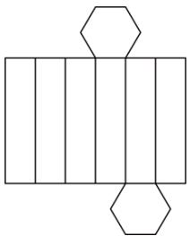

natural_image

Pure geometric diagram of rectangles and hexagons without any text, numbers, or symbols

【答案】六棱柱

【分析】本题考查立体图形的展开图，熟记常见立方体的展开图，是解题的关键．根据六棱柱的展开图特征即可解答.

【详解】解：根据展开图可见，中间有六个完全相同的长方形排成一排，它们对应正六棱柱侧面六个矩形面；上、下各有一个正六边形对应正六棱柱的顶部和底部，因此该立体图形是一个六棱柱，

故答案为：六棱柱.

12. （3 分）（24-25 七年级上·陕西榆林·期末）向空中扔一块小石子，小石子经过的路线用数学知识解释为点动成线。中国扇文化有着深厚的文化底蕴，中国历来有“制扇王国”之称。如图，打开折扇时。随着扇骨的移动形成一个扇面，这种现象用数学知识解释为\_\_\_\_。

natural_image

Red traditional Chinese folding fan with black tassel and black frame (no text or symbols)

【答案】线动成面

【分析】本题考查了线、面的关系，根据题意，结合线动成面的数学原理：某一条线在运动过程中留下的运动轨迹会组成一个平面图形，这个平面图形就是一个面，即可得出答案．熟练掌握线动成面的数学原理是解本题的关键.

【详解】解：根据题意，这种现象可以用数学原理解释为：线动成面.

故答案为：线动成面.

13. （3 分）（22-23 七年级上·辽宁沈阳·期末）如图所示，①～④是由相同的小立方块搭成的几何体，若组合其中的两个，恰是由 6 个小立方块搭成的长方体，则应选择\_\_\_\_。（填序号即可）

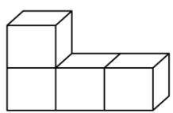  
①

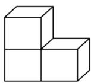  
②

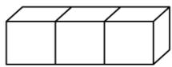  
③

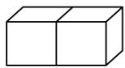  
④

【答案】①④/④①

【分析】根据组合后的几何体是长方体且有6个小正方体构成直接判断即可.

【详解】由题意知，组合后的几何体是长方体且由6个小立方块搭成，所以，应选择①④，故答案为：①④.

【点睛】本题考查了立体图形的拼搭，根据题意发挥空间想象能力是解题的关键.

14. （3 分）（24-25 七年级上·福建厦门·期末）在数学活动课上，同学们通过“剪一剪、画一画、折一折”的方法学习立体图形的展开图。如图，其中标注序号1-6的图形都是正方形，小艺认为它可以作为一个正方体的展开图，则她的判断\_\_\_\_（填“正确”或“错误”），理由

是\_\_\_\_。

<table><tr><td>1</td><td></td><td>2</td></tr><tr><td>3</td><td>4</td><td>5</td></tr><tr><td></td><td>6</td><td></td></tr></table>

【答案】错误 折成正方体形状后，标有数字 1 和 2 的两个面重叠.

【分析】本题考查几何体的展开图，掌握正方体表面展开图的特征是正确解答的关键.

根据正方体表面展开图的特征进行判断即可.

【详解】解：根据正方体表面展开图的“田凹应弃之”可得，该图形不是正方体的表面展开图，折成正方体形状后，标有数字 1 和 2 的两个面重叠.

故答案为:错误；折成正方体形状后，标有数字1和2的两个面重叠.

15. （3 分）（23-24 七年级上·贵州毕节·期末）将如图所示的长方体用过ABCD的平面切割，得到的两个几何体是\_\_\_\_。

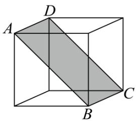

natural_image

Geometric diagram of a cube with labeled vertices A, B, C, D and shaded triangular faces (no text or symbols)

【答案】三棱柱

【分析】本题考查截一个几何体．截面的形状既与被截的几何体有关，还与截面的角度和方向有关．要利用本题中截面的特殊性求解．解题的关键是根据棱柱的定义进行分析．

【详解】解：如图，如图所示的长方体用过ABCD的平面切割，得到两个几何体的两个底面都是三角形，三个侧面都是长方形，

∴得到的两个几何体都是三棱柱.

故答案为：三棱柱.

16. （3 分）（22-23 七年级上·河北唐山·期末）如图是一个长方体的表面展开图，每个面上都标注了字母和数据，请根据要求回答

text_image

3米
1米 C 3米 1米
B A D F 2米
1米 E 3米

(1) 如果 $A$ 面在长方体的底部, 那么\_\_\_\_面会在上面;  
(2) 这个长方体的体积为\_\_\_\_米 $^{3}$ .

【答案】 $F$ 6

【分析】（1）根据展开图，可得几何体，A、B、C是邻面，D、F、E是邻面，根据A面在底面，F会在上面，可得答案；

(2) 由体积计算公式解答.

【详解】解：（1）如图所示， $A$ 与 $F$ 是对面，所以如果 $A$ 面在长方体的底部，那么 $F$ 面会在上面；故答案是： $F$ ;

(2) 这个长方体的体积是: $1 \times 2 \times 3 = 6$ (米 $^{3}$ ).

故答案是：6

text_image

3米
1米 C 1米 3米 1米
B A D F 2米
E 3米

【点睛】本题考查了几何体的展开图，利用了几何体展开图组成几何体时面与面之间的关系.

# 第II卷

# 三．解答题（共8小题，满分72分）

17. （6 分）（24-25 七年级上·河南洛阳·期末）一个长方体的每个面上都标注了字母，如图是该长方体的表面展开图，请根据要求回答问题：

text_image

B
E A C
D
F

(1)如果 A 在长方体的底部，那么哪一面会在上面？  
(2)如果面 F 在前面，从左面看是 B 面，那么哪一面会在上面？  
(3)如果从右面看是面 C，面 D 在后面，那么哪一面会在上面？

【答案】(1)F

(2)E   
(3)F

【分析】此题考查了正方体相对面上的字，正方体的展开图，根据正方体相对面的特点求解即可.

【详解】（1）解：∵A 和 F 是相对面上的字

∴如果 A 在长方体的底部，那么 F 会在上面；

(2) 解: 如果面 $F$ 在前面, 从左面看是 $B$ 面, 那么 $E$ 会在上面;  
（3）解：如果从右面看是面 C，面 D 在后面，那么 F 会在上面.

18. （6 分）（24-25 七年级上·贵州贵阳·期末）一个几何体由若干个大小相同的小立方块搭成，从上面看到的几何体形状图如图所示，其中小正方形中的数字表示在该位置的小立方块的个数。请画出从正面和从左面看到的这个几何体的形状图。

从上面看

natural_image

Pure grid pattern with no text, numbers, or symbols

从正面看

text_image

Grid of dashed and solid lines with varying tick marks, possibly representing a coordinate or data pattern.

从左面看

【答案】见解析

【分析】主视图有 2 列，每列小正方形数目分别为 2, 3，左视图有 2 列，每列小正方数形数目分别为 1, 3，据此可画出图形.

本题考查由三视图判断几何体和作图-三视图，熟练掌握几何体的画法是解题的关键.

【详解】解：图形如图所示：

  
从上面看

natural_image

Simple geometric diagram of a 3x3 grid with no text or symbols

从正面看

natural_image

Simple geometric diagram of three connected rectangles on a grid background (no text or symbols)

从左面看

19. （8 分）（24-25 七年级上·全国·假期作业）如图，有一个长6cm，宽4cm的长方形纸板，现要求以其一组对边中点所在直线为轴旋转180°，可按两种方案进行操作。

  
图(1)

natural_image

Simple diagram showing a rectangle with a dashed vertical line and an arrow indicating rotation (no text or symbols)

图(2)

方案一：以较长的一组对边中点所在直线为轴旋转，如图（1）；

方案二：以较短的一组对边中点所在直线为轴旋转，如图（2）.

(1)上述操作能形成的几何体是\_\_\_\_，说明的事实是\_\_\_\_；

(2)请通过计算说明哪种方案得到的几何体的体积大.

【答案】(1)圆柱体，面动成体

(2)方案一得到的圆柱的体积大

【分析】本题考查点，线，面，体，圆柱体积计算，解题的关键是掌握长方形旋转可得圆柱体.

（1）根据面动成体解答即可；

(2) 先分别求出所得几何体的体积再比较大小即可.

【详解】（1）解：∵长方形旋转可以得到圆柱，

∴上述操作能形成的几何体是圆柱，说明的事实是：面动成体.

故答案为：圆柱体，面动成体

（2）解：方案一： $\pi\times\left(\frac{6}{2}\right)^{2}\times4=36\pi(\mathrm{cm}^{3})$

方案二： $\pi \times \left(\frac{4}{2}\right)^2\times 6 = 24\pi (\mathrm{cm}^3),$

$\because 36\pi > 24\pi,$

∴ 方案一构造的圆柱体的体积大.

20. （8 分）（24-25 七年级上·广东揭阳·阶段练习）【问题背景】用小立方块搭一个几何体，使它从正面和上面看到的形状如图所示，从上面看到形状中小正方形中的字母表示在该位置上小立方块的个数.

从正面看

从上面看

【初步探究】（1）a表示的数是\_\_\_\_，b表示的数是\_\_\_\_，c表示的数是\_\_\_\_；

【深入探究】（2）这个几何体最少由\_\_\_\_个小立方块搭成，最多由\_\_\_\_个小立方块搭成。

（3）当 $d = e = 1$ ， $f = 2$ 时，画出从左面看这个几何体的形状.

【答案】（1）3，1，1；（2）9；11；（3）见解析

【分析】本题考查了从不同方向看几何体的知识；

(1) 根据第三列小立方体的个数为 3, 第二列为 1 个, 即可求解;  
(2) 根据第一列小立方体的个数最多为 $2 + 2 + 2$ , 最少为 $2 + 1 + 1$ , 那么加上其他两列小立方体的个数即可;  
（3）根据从左面看到的图形有三列，每列小正方形数目分别为3，1，2，即可求解.

【详解】解：（1）根据从正面看到的图形可知，第三列小立方体的个数为3，第二列为1个， $\therefore a$ 表示的数是3， $b$ 表示的数是1， $c$ 表示的数是1；

故答案为：3，1，1；（.

(2) 这个几何体最少由 $4 + 2 + 3 = 9$ 个小立方块搭成, 最多由 $6 + 2 + 3 = 11$ 个小立方块搭成; 故答案为: 9; 11.

（3）∵d = e = 1, f = 2，从左面看到的图形如图所示，

natural_image

Geometric grid pattern with five empty squares arranged in a staggered layout (no text or symbols)

从左面看

21. （10 分）（24-25 六年级上·山东烟台·期中）三棱柱的上、下底面都是完全相同的三角形，正三棱柱的上、下底面都是完全相同的等边三角形．如图，大正三棱柱的底面周长为11，侧棱长为8，在大正三棱柱中截取了一个底面周长为3的小正三棱柱.

text_image

A
D
E
B
C

(1)请写出截面的形状\_，并求出截面的面积；  
(2)请直接写出四边形DECB的周长\_.

【答案】(1)长方形，8

(2)10

【分析】本题考查了截一个几何体，熟练掌握以上知识点并灵活运用是解此题的关键.

（1）根据题意即可得出截面的形状为长方形；由题意得出DE=1，再根据长方形面积公式计算即可得解；  
(2) 由题意可得 $AB + AC + BC = 11$ , $AD = AE = DE = 1$ , 再列式计算即可得解.

【详解】（1）解：由题意可得：截面的形状为长方形；

∵在大正三棱柱中截取了一个底面周长为3的小正三棱柱，

$$
\therefore D E = 3 \div 3 = 1,
$$

∴截面的面积为 $1 \times 8 = 8$ ;

（2）解：由题意可得： $AB + AC + BC = 11$ ，AD = AE = DE = 1，

∴四边形DECB的周长 = AB + BC + AC - AD - AE + DE = 11 - 1 - 1 + 1 = 10.

22. （10 分）（24-25 七年级上·贵州毕节·期中）小林所在的综合实践小组准备制作一些大小相同的正方体纸盒，用来收纳班级讲台上的粉笔（盒盖单独制作）.

  
①

  
②

  
③

  
④   
图1

text_image

正面

图2

  
图3

(1)图 1 是综合实践小组的同学画出的一些形状图，其中 \_\_\_\_（填序号）经过折叠能围成一个无盖正方体

形纸盒.

(2)综合实践小组的同学用制作的8个正方体形纸盒摆成如图2所示的几何体.

①在图 3 中画出从正面观察图 2 的几何体所看到的形状图;

(2)如果在图 2 的几何体上再添加一些大小相同的正方体形纸盒, 并保持从上面看到的形状图和从左面看到的形状图不变, 最多可以再添加\_\_\_\_个正方体形纸盒.

【答案】(1)①③④

(2)①图见解析；②3

【分析】本题考查简单组合体，展开图折叠成几何体等知识.

（1）根据要求动手操作可得结论；

(2) ①根据主视图的定义画出图形即可;

②根据要求作出判断即可.

【详解】（1）解：图 1 是综合实践小组同学制作的图形，其中①③④经过折叠能围成无盖正方体纸盒；故答案为：①③④；

(2) 解: ①如图所示:

natural_image

Geometric grid pattern with five empty squares arranged in a stepped structure (no text or symbols)

②如果在图 2 的几何体上再添加一些大小相同的正方体形纸盒，并保持从上面看到的形状图和从左面看到的形状图不变，最多可以再添加 3 个正方体形纸盒.

故答案为：3.

23. （12 分）（24-25 六年级上·山东烟台·期中）下图是由若干个小立方块所搭建几何体从正面看与从上面看的形状图.

  
从正面看

  
从上面看

(1)搭建这个几何体最少、最多各需多少个小立方块？搭建这个几何体需小立方块最少、最多可能有多种搭建方式，请你各拿出一种在从上面看的形状图的小正方形中用数字表示该位置所放小立方块的个数；

(2)搭建该几何体有多种搭建方式，请你画出其中三种从左面看的形状图.

【答案】(1)最少需要 11 个，最多需要 17 个，画图见解析

(2) 见解析

【分析】本题主要考查从不同方向看小正方体的搭建的图形，解题的关键是：

（1）根据正面图和上面图可知，第一层有 8 个第二层最少有 2 个，最多有 6 个，第三层最少有 1 个，最多有 3 个，即可求解；  
(2) 根据 (1) 的结论, 在从上面看的形状图中标上搭建所需要小正方体的个数, 然后画出其从左面看的形状图即可.

【详解】（1）解：根据题意，得第一层有8个第二层最少有2个，最多有6个，第三层最少有1个，最多有3个，

∴搭建这个几何体最少需要 $8+2+1=11$ 个、最多需要 $8+6+3=17$ 个，

最少时，如图，

<table><tr><td>1</td><td>1</td><td>1</td></tr><tr><td>1</td><td>1</td><td>1</td></tr><tr><td>3</td><td>2</td><td></td></tr></table>

从上面看 （答案不唯一）

最多时，如图，

<table><tr><td>3</td><td>2</td><td>1</td></tr><tr><td>3</td><td>2</td><td>1</td></tr><tr><td>3</td><td>2</td><td></td></tr></table>

从上面看 （答案不唯一）.

(2) 解: 如图,

搭建如图时，

<table><tr><td>3</td><td>1</td><td>1</td></tr><tr><td>1</td><td>2</td><td>1</td></tr><tr><td>1</td><td>1</td><td></td></tr></table>

从上面看

从左边看的形状图为:

从左面看

搭建如图时，

<table><tr><td>3</td><td>2</td><td>1</td></tr><tr><td>3</td><td>2</td><td>1</td></tr><tr><td>1</td><td>1</td><td></td></tr></table>

从上面看

从左边看的形状图为:

从左面看

搭建如图时，

<table><tr><td>3</td><td>2</td><td>1</td></tr><tr><td>3</td><td>2</td><td>1</td></tr><tr><td>3</td><td>1</td><td></td></tr></table>

从上面看

从左边看的形状图为:

从左面看

(答案不唯一)

24. （12 分）（24-25 七年级上·全国·期末）下列图形中，图（a）是正方体木块，把它切去一块，得到如图（b）（c）（d）（e）的木块.

  
(a)

  
(b)

  
(c)

  
(d)

  
(e)

(1)我们知道，图（a）（b）的相关数据已经给出，请你将图（c），（d），（e）中木块的顶点数，棱数，

面数填入表:

<table><tr><td>图号</td><td>顶点数x</td><td>棱数y</td><td>面数z</td></tr><tr><td>(a)</td><td>8</td><td>12</td><td>6</td></tr><tr><td>(b)</td><td>6</td><td>9</td><td>-</td></tr><tr><td>(c)</td><td>-</td><td>-</td><td>-</td></tr><tr><td>(d)</td><td>-</td><td>-</td><td>-</td></tr><tr><td>(e)</td><td>-</td><td>-</td><td>-</td></tr></table>

(2)如表, 各种木块的顶点数, 棱数, 面数之间的数量关系可以归纳出一定的规律, 请你试写出顶点数, 棱数, 面数之间的数量关系式.

【答案】(1)5, 8, 12, 6, 8, 13, 7, 10, 15, 7

$$
(2) y = x + z - 2
$$

【分析】本题考查了截一个几何体，规律型：数字变化类.

（1）只要将图（b）、（c）、（d）、（e）各个木块的顶点数、棱数、面数数一下即可；

（2）通过观察找出每个图中“顶点数、棱数、面数”之间隐藏着的数量关系，这个数量关系用公式表示出来即可.

【详解】（1）解：见表：

<table><tr><td>图号</td><td>顶点数x</td><td>棱数y</td><td>面数z</td></tr><tr><td>(a)</td><td>8</td><td>12</td><td>6</td></tr><tr><td>(b)</td><td>6</td><td>9</td><td>5</td></tr><tr><td>(c)</td><td>8</td><td>12</td><td>6</td></tr><tr><td>(d)</td><td>8</td><td>13</td><td>7</td></tr><tr><td>(e)</td><td>10</td><td>15</td><td>7</td></tr></table>

故答案为：5，8，12，6，8，13，7，10，15，7；

(2) 解: 观察上表可得:

$$
1 2 = 8 + 6 - 2,
$$

$$
9 = 6 + 5 - 2,
$$

$$
1 2 = 8 + 6 - 2,
$$

$$
1 3 = 8 + 7 - 2,
$$

$$
1 5 = 1 0 + 7 - 2,
$$

$$
\therefore y = x + z - 2,
$$

∴顶点数 x、棱数 y、面数 z 之间的数量关系式为 $y = x + z - 2$ .