# 第三章 整式及其加减（举一反三讲义）全章题型归纳

【北师大版 2024】

# 题型归纳

# 【培优篇】....4

【题型1 代数式的定义、书写规范】....4

【题型 2 代数式的意义】....5

【题型3 列代数式】 5

【题型4 代数式求值】....6

【题型5 整式及整式有关的概念】....6

【题型 6 （合并）同类项】....7

【题型 7 去（添）括号】....7

【题型8 整式加减运算与化简求值】....8

# 【拔尖篇】....8

【题型 9 程序框图中求代数式的值】....8

【题型10几何图形中求代数式的值】....9

【题型11数式规律探究】....10

【题型12整式加减中的无关项问题】....11

【题型13整式加减中的多结论问题】....12

【题型 14 整式加减的实际应用】....13

【题型 15 与绝对值有关的化简】....15

【题型 16 探索与表达规律（数字变化类）】....15

【题型 17 探索与表达规律（图形变化类）】....16

# 举一反三

教辅资源，关注公众号★全科AA+

# 知识点 1 用含字母的式子表示数

用字母或含有字母的式子表示数和数量关系，为我们今后的学习和研究带来了极大的方便.

用含字母的式子表示数的书写规则:

（1）字母与字母相乘时，“×”号通常省略不写或写成“·”；

(2) 字母与数相乘时, 数通常写在字母的前面;

(3) 带分数与字母相乘时, 通常化带分数为假分数;

(4) 字母与字母相除时, 要写成分数的形式.

（5）当式子为几个数的和或差的形式，且结果带单位时，式子整体加括号.

# 知识点2 代数式的概念

用运算符号把数或表示数的字母连接起来的式子叫作代数式。单独的一个数或字母也是代数式。例如：0，a都是代数式。

# 知识点 3 代数式的意义

根据生活实际将给定的代数式的意义用语言叙述出来，就是将代数式的字母及运算符号赋予具体的含义.

# 知识点4 列代数式

把简单的与数量有关的词语用代数式表示出来叫作列代数式. 例如: 用代数式表示: $a$ 与 $a$ 减去 $b$ 的差的商, 其中运算词 “差” 表示的数量关系是 $\underline{a}$ 减去 $\underline{b}$ , 列成式子为 $\underline{a-b}$ ; 运算词 “商” 表示的数量关系是 $\underline{a}$ 除以 “差”, 即 $\frac{a}{a-b}$ (填完整的代数式).

# 知识点 5 代数式的值的概念

用数值代替代数式中的字母，按照代数式中的运算关系计算得出的结果，叫作代数式的值．这个过程叫作求代数式的值．例如：当x=-5时，代数式 $(x+2)^{2}=(-5+2)^{2}=(-3)^{2}=9$ ，那么9就是当x=-5时，代数式 $(x+2)^{2}$ 的值．

# 知识点 6 求代数式的值的步骤

求代数式的值有代入和计算两步.

第一步：用数值代替代数式里的字母，简称“代入”。代入时，将相应的字母换成已给定的或已算出来的数值，其他的运算符号、原来的数字及运算顺序都不改变。

第二步: 按照代数式中给出的运算, 计算出结果, 简称 “计算”. 代入的值不同, 最后计算出的结果也可能不同.

# 知识点 7 单项式

1. 定义: 如果一个代数式是数或字母的积, 那么这个代数式叫作单项式. 单独的一个数或一个字母也是单项式.  
2. 单项式的系数: 单项式中的数字因数叫作这个单项式的系数.  
3. 单项式的次数: 一个单项式中, 所有字母的指数的和叫作这个单项式的次数。对于一个非零的数, 规定它的次数为 0。

flowchart

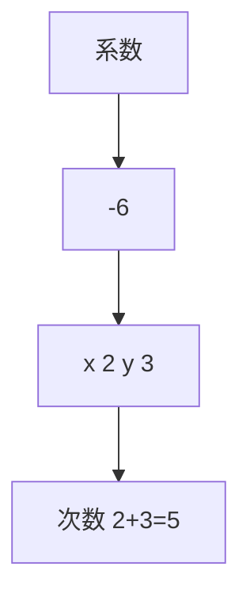

# 知识点 8 多项式

1. 定义：几个单项式的和叫作多项式.  
2. 多项式的项: 在多项式中, 每个单项式叫作多项式的项, 其中不含字母的项叫作常数项, 一个多项式含有几项, 就叫几项式.  
3. 多项式的次数：多项式里，次数最高的项的次数，叫作这个多项式的次数.

# 知识点9 整式

1. 定义：单项式与多项式统称整式.  
2. 单项式、多项式与整式的关系如图所示.

text_image

单项式
多项式
整式

# 3. 判断整式、单项式及多项式的方法

（1）单项式不含加减运算，多项式必含加减运算；  
（2）多项式是几个单项式的和，多项式不包含单项式；  
（3）单项式和多项式都是整式，分母中含有字母的都不是整式.

# 知识点 10 同类项

所含字母相同，并且相同字母的指数也相同的项叫作同类项．几个常数项也是同类项.

# 知识点 11 合并同类项

把多项式中的同类项合并成一项，叫作合并同类项．合并同类项后，所得项的系数是合并前各同类项的系数的和，字母连同它的指数不变.

合并同类项的一般步骤:

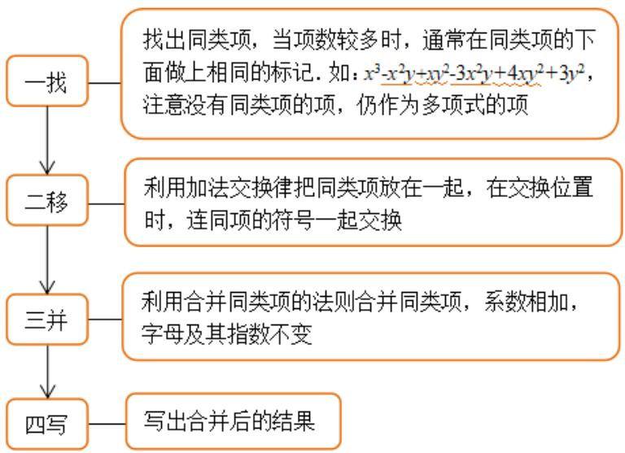

flowchart

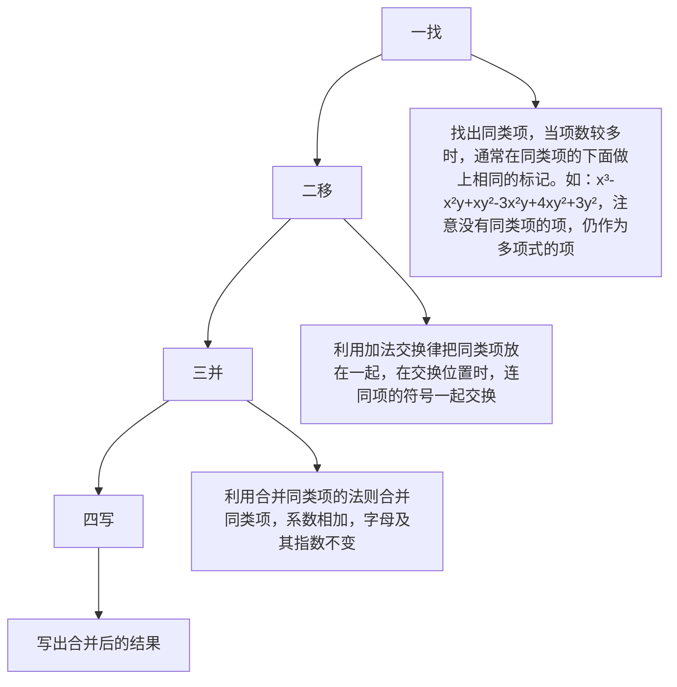

# 知识点 12 去括号

# 1. 去括号方法

一般地，一个数与一个多项式相乘，需要去括号，去括号就是用括号外的数乘括号内的每一项，再把所得的积相加。如果括号外的乘数是正数，去括号后原括号内各项的符号与原来的符号相同；如果括号外的乘数是负数，去括号后原括号内各项的符号与原来的符号相反。

2. 依据：分配律 $a(b+c)=ab+ac$ .  
3. 多层括号的去法：一般由内向外，先去小括号，再去中括号，最后去大括号.

# 知识点 13 整式的加减

整式加减的运算法则：几个整式相加减，如果有括号就先去括号，然后再合并同类项.

应用整式加减的运算法则化简求值时，一般先去括号、合并同类项，再代入字母的值进行计算，简记为“一化、二代、三计算”。在具体运算中，也可以先将同类项合并，再去括号，但是要按运算顺序去做。例如， $-2(x-3x+5x-7x+6)=-2(-4x+6)=8x-12$ 。

# 【培优篇】

【题型 1 代数式的定义、书写规范】教辅资源，关注公众号★全科AA+

【例 1】在式子 n - 3、 $a^{2}b$ 、 $m+s\leq2$ 、x、-ah、s=ab 中代数式的个数有（）

A. 6 个

B. 5 个

C. 4 个

D. 3 个

【变式 1-1】（24-25 七年级上·吉林·期中）下列书写:①-1a; ② $2\frac{2}{3}a^{2}b$ ; ③ $\frac{5a^{2}b}{3}$ ; ④ $b\frac{2}{3}$ ; ⑤ $2024 \times a \times b$ ; ⑥ $a+3$ 千克中，正确的有\_\_\_\_。（填写序号即可）

【变式 1-2】下列各式中，不是代数式的是（）

A. $3a$

B. 0

C. 2x=1

D. $a^{2}-\frac{\pi}{16}$

【变式 1-3】下列各式：3a， $1\frac{2}{3}$ a， $\frac{b}{5}$ ， $a \times 3$ ，3x-1， $2a \div b$ ，其中符合书写要求的有（）

A. 1个

B. 2个

C. 3个

D. 4个

# 【题型2 代数式的意义】

【例 2】（24-25 七年级上·福建漳州·期中）商店对商品尾货进行亏本促销活动，促销的方法是将成本为x元的商品提价50%后标价，再以(0.9x-30)元的促销价出售，则下列说法中，①标价减去30元后再打9折；②标价打9折后再减去30元；③标价减去50元后再打6折；④标价打6折后再减去30元．能正确表达该商店促销方法的是\_\_\_\_．（填序号）

【变式 2-1】（24-25 七年级上·湖南常德·期末）小明根据方程 $5x + 10(x - 5) = 400$ 编写了一道应用题，请你把空缺的部分补充完整。甲、乙两名工人生产零件，已知甲工人每天比乙工人多生产 5 个零件，\_\_\_\_，请问甲工人每天生产多少个零件？（设甲工人每天生产 x 个零件）

【变式 2-2】（24-25 七年级上·河北石家庄·期中）甲、乙同学关于“代数式 $2(x+y)$ ”的意义叙述，判断正确的是（）

甲：x的2倍与y的和；

乙：苹果每千克x元，香蕉每千克y元，苹果和香蕉各买2千克的总花费

A. 只有甲的正确

B. 只有乙的正确

C. 甲、乙的都正确

D. 甲、乙的都不正确

【变式 2-3】（24-25 七年级上·山东菏泽·期中）关于代数式8x-3y表示的意义，下列说法正确的是（）

A. 若 $x$ 表示一支铅笔的价格, $y$ 表示一块橡皮的价格, 则代数式 $8 x - 3 y$ 表示买 3 支铅笔和 8 块橡皮共花了多少钱  
B. 若长方形的长为 $x$ , 宽为 8, 正方形的边长为 $y$ , 则代数式 $8 x - 3 y$ 表示一个长方形的面积与 3 个正方形的面积差  
C. 汽车每小时行驶 $x$ 千米, 火车每小时行驶 $y$ 千米, 则代数式 $8 x - 3 y$ 表示火车行驶 3 小时比汽车行驶 8 小时少行驶的路程数  
D. 小米每千克 $x$ 元, 大米每千克 $y$ 元, 则代数式 $8 x - 3 y$ 表示买 8 千克大米比买 3 千克小米少花的钱数

# 【题型3 列代数式】

【例 3】（24-25 七年级上·福建龙岩·阶段练习）世界杯排球赛的积分规则为：比赛中以3-0（胜3局负0局）

或者3-1取胜的球队积3分，负队积0分；比赛中以3-2取胜的球队积2分，负队积1分．若某球队以3-1胜了a场，以3-2胜了b场，以2-3负了c场，则这支球队的积分用多项式可以表示为\_\_\_\_.

【变式 3-1】（24-25 七年级上·上海·期中）用代数式表示“x的 $2\frac{1}{3}$ 减去y的差”是\_\_\_\_.

【变式 3-2】（2025·陕西咸阳·模拟预测）九连环作为一种中国传统民间玩具，是由九个完全一样的圆环和中间的直杆连接而成，其俯视图可以看成九个水平摆放且间距一样的圆环，如图所示，若相邻两个圆环之间重叠部分的宽度均为 a，一个圆环的直径为 b，则整个九连环的宽度可以表示为\_\_\_\_。（用含 a, b 的代数式表示）

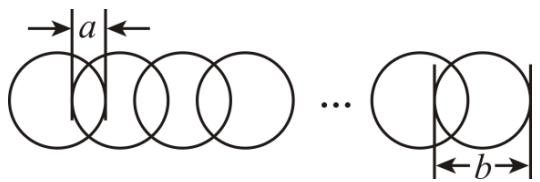

text_image

a
...
b

【变式 3-3】（24-25 七年级下·全国·假期作业）学校报告厅第一排有 a 个座位，第二排有 $(a+2)$ 个座位，第三排有 $(a+4)$ 个座位，后面每一排比前面一排多 2 个座位．第 n 排有（）个座位．

A. $a + 2n$

B. $a + 2(n-1)$

C. $2n$

D. $a + 2n + 2$

# 【题型4 代数式求值】

【例 4】如果代数式 $-2a^{2}+3b+8$ 的值为1，那么代数式 $4a^{2}-6b+2$ 的值等于（）

A. 14

B. 16

C. 18

D. 20

【变式 4-1】（25-26 七年级上·全国·周测）小明在计算41-N时，误将“-”看成“+”，结果得13，则41-N的值为（）

A. -28

B. 32

C. 69

D. -54

【变式 4-2】（24-25 七年级上·广东东莞·期末）若 $(3-m)^{2}+|n+2|=0$ ，则 $m^{2}+n^{3}$ 的值为（）

A. 17

B. -17

C. 1

D. -1

【变式 4-3】（24-25 七年级上·河北邯郸·期末）数学家欧拉最先用 $f(x)$ 来表示关于 x 的多项式．如对于 $f(x)=x+1$ ：当 x=-2 时，则 $f(-2)=(-2)+1$ ，当 x=a 时，则 $f(a)=a+1$ ．若规定 $f(x)=x+3$ ，下列结论中：① $f(-1)=2$ ；②若 $f(|x|)=4$ 时，则 $x=\pm1$ ；③当 x=-3 时， $7-|f(x)|$ 的值为 7；以上结论不正确的个数有（）

A. 0 个

B. 1 个

C. 2 个

D. 3 个

# 【题型5 整式及整式有关的概念】

【例 5】（24-25 七年级上·河南商丘·期中）多项式 $(m-4)x^{|m-2|}+x-5$ 是关于x的二次三项式，则m取值为

( )

A. 0

B. 4

C. 4 或 0

D. -4 或 1

【变式 5-1】（24-25 七年级上·河南驻马店·期中）下列式子： $-\frac{1}{3}$ ， $\frac{a}{3}$ ， $-\pi$ ， $-5x^{2}y^{3}$ ， $2xy^{2}$ ， $\frac{a+b}{2}$ ， $\frac{1}{2-x}$ ，其中属于单项式的是\_\_\_\_，属于多项式的是\_\_\_\_，属于整式的是\_\_\_\_。

【变式 5-2】下列说法中正确的是（）

A. 多项式 $-\frac{3x^{2}-5}{4}$ 的常数项是 $\frac{5}{4}$ ，二次项的系数是 $-\frac{3}{4}$

B. 单项式 $-5\pi xy^{2}z^{3}$ 的系数和次数分别是 -5, 7

C. $\frac{\pi}{2}$ 不是单项式

D. 把 $x^{3}+xy^{2}-y^{3}+2x^{2}y$ 按y的降幂排列为 $-y^{3}+xy^{2}+x^{3}+2x^{2}y$

【变式 5-3】已知多项式 $-7a^{m}b^{n}+5ab^{2}-1$ （m，n 为正整数且 a 的指数不相同）是按 a 的降幂排列的四次三项式，则 $(-n)^{m}$ 的值为（）

A. -1

B. 3 或 -4

C. -1或4

D. -3或4

# 【题型6 （合并）同类项】

【例 6】（24-25 九年级下·河南周口·阶段练习）若关于 b 的单项式 $b^{m}$ 与 $nb^{2024}$ 相加等于 0，则 mn \_\_\_\_.

【变式 6-1】（24-25 七年级上·全国·期末）下列各组式子中是同类项的是（）

A. ac与ab

B. $3a$ 与 $5a^{2}$

C. $3ab^{2}$ 与 $5a^{2}b$

D. $a^{2}b$ 与 $-ba^{2}$

【变式 6-2】（24-25 七年级上·北京·期中）请写出一个与 $-ab^{2}$ 为同类项的整式：\_\_\_\_.

【变式 6-3】已知 $-5a^{2m}b$ 和 $8a^{6}b^{3-n}$ 是同类项，则下列各组中的单项式是同类项的是（）

A. $-x^{m}y^{2}$ 与 $\frac{1}{2}x^{2}y^{n}$

B. $2x^{m - 1}y^{2}$ 与 $0.01x^{2}y^{n}$

C. $x^{3}y^{4}$ 与 $-4x^{m + 1}y^{n + 2}$

D. $-x^{2m}y^{4}$ 与 $6x^{6}y^{n+1}$

# 【题型7 去（添）括号】

【例 7】（24-25 七年级上·河北衡水·阶段练习）下列去括号正确的是（）

A. $a + (b + c) = ab + c$

B. $a^{2}-\left[-(-a+b)\right]=a^{2}-a-b$

C. $a + 2(b - c) = a + 2b - c$

D. $a-(b+c-d)=a-b-c+d$

【变式 7-1】已知 $x=1\frac{1}{3}$ ， $y=-\frac{1}{2}$ ， $z=\frac{5}{6}$ ，则 $x-(-y)+(-z)=$ \_\_\_\_

【变式 7-2】已知 $x-(\quad)=x-y-z$ ，则括号里的式子是（）

A. y-z

B. z-y

C. $y + z$

D. -y-z

【变式 7-3】已知 $x^{2}+2xy=4$ ， $y^{2}+xy=5$ ，则 $2x^{2}+3xy-y^{2}=$ \_\_\_\_.

# 【题型8 整式加减运算与化简求值】

【例 8】（24-25 七年级上·上海·期中）我们约定：上方相邻两数之和等于这两数下方箭头共同指向的数，例如：在图 1 中，即 $5 + 6 = 11$ ，若 a, b 满足 $|a - 3| + (b + 1)^{2} = 0$ ，则图 2 中 y 的值为 \_\_\_\_.

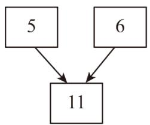

flowchart

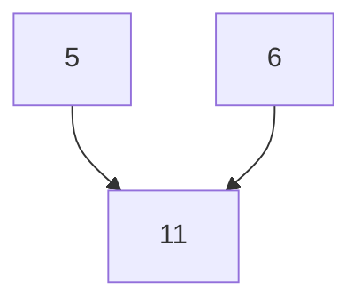

图1

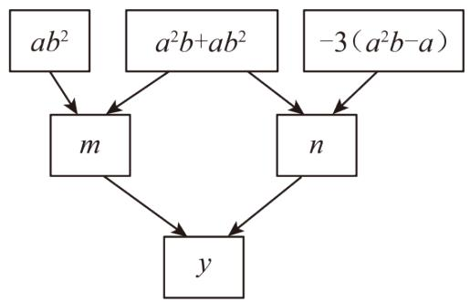

flowchart

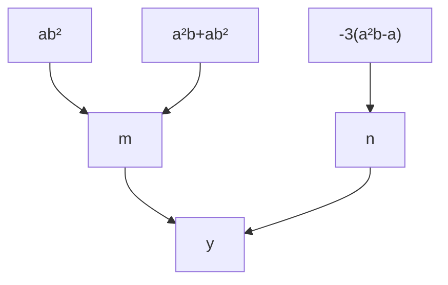

图2

【变式 8-1】（24-25 七年级上·陕西宝鸡·阶段练习）计算.

(1) $2(x^{2}-2xy)-3(y^{2}-3xy)$ ;

(2) $(-x^{2}+2xy-y^{2})-2(xy-3x^{2})+3(2y^{2}-xy)$ .

$$
= 5 \mathrm{x} ^ {2} - 3 \mathrm{xy} + 5 \mathrm{y} ^ {2}
$$

【变式 8-2】（24-25 七年级上·贵州遵义·期中）设 $M = x^{2} + 4mx - 3$ ， $N = 2x^{2} + 4mx - 2$ ，那么 M 与 N 的大小关系是（）

A. M > N

B. M = N

C. M < N

D. 无法确定

【变式 8-3】（24-25 九年级上·江苏南通·期中）已知 $3x^{2}-4xy+7y^{2}-2m=-17$ ， $x^{2}+5xy+6y^{2}-m=12$ ，则式子 $x^{2}-14xy-5y^{2}$ 的值为（）

A. -41

B. $-\frac{41}{2}$

C. $-\frac{7}{2}$

D. $\frac{7}{2}$

# 【拔尖篇】

# 【题型9 程序框图中求代数式的值】

【例 9】（24-25 七年级上·福建福州·期中）远古时期，人们通过绳子打结的方式来记录数量，如图 1 为一队互相合作打猎的猎人在从右往左依次排列的绳子上打结，满五进一，记录了他们一天之内所打的猎物数量．若把这个量的十进制数输入如图 2 的程序计算，则最后输出的结果是\_\_\_\_．

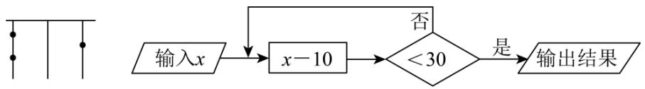

flowchart

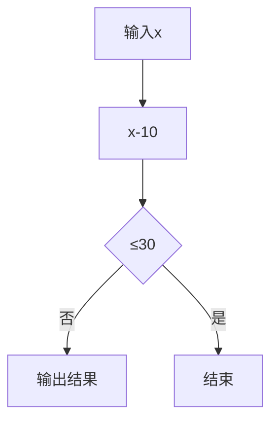

图1  
图2

【变式 9-1】（24-25 六年级下·山东泰安·期末）如图，关于变量 x，y 的程序计算，若开始输入的 x 值为 2，则最后输出因变量 y 的值为

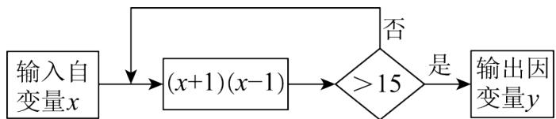

flowchart

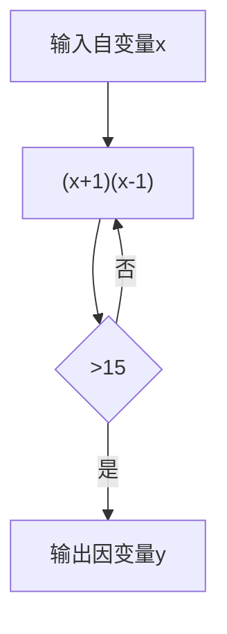

A. 3

B. 8

C. 63

D. 64

【变式 9-2】（24-25 七年级上·四川达州·期末）有一个数值转换器，原理如图所示，若开始输入 x 的值是 5，可发现第 1 次输出的结果是 16，第 2 次输出的结果是 8，第 3 次输出的结果是 4．依次继续下去，第 2025 次输出的结果是（）

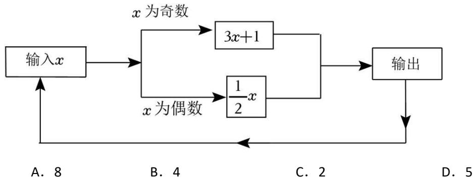

flowchart

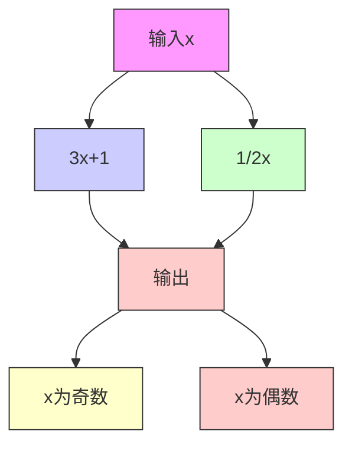

【变式 9-3】（2025·四川达州·二模）如图是一个运算程序示意图，若开始输入x的值为5，则输出y值为\_\_\_\_。

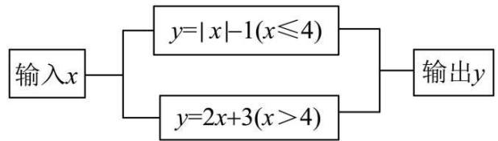

flowchart

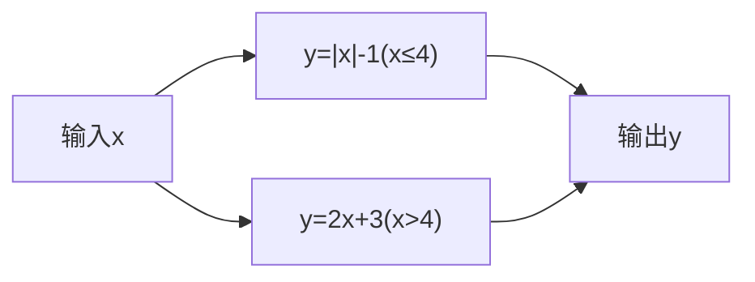

【题型 10 几何图形中求代数式的值】 教辅资源，关注公众号★全科AA+

【例 10】（24-25 七年级上·贵州遵义·期中）下列四个整式中，不能表示图中阴影部分面积的是（）

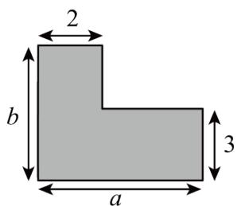

text_image

2
b
a
3

A. $ab-(a-2)(b-3)$

B. $2b + 3(a - 2)$

C. $2(b-3)+3(a-2)+6$

D. $3a + 2(b - 2)$

【变式 10-1】（24-25 七年级上·河北邯郸·期末）如图所示是一个长方形.

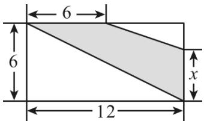

text_image

6
6
12
x

（1）根据图中尺寸大小，用含 x 的代数式表示阴影部分的面积 S = \_\_\_\_；

（2）若x=4，求S的值\_\_\_\_。

【变式 10-2】（24-25 七年级上·全国·期末）如图，7个完全相同的小长方形刚好拼成一个大长方形，若小长方形的宽为a，则大长方形的周长是\_\_\_\_。

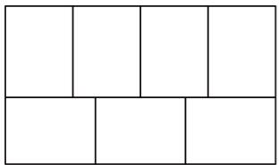

natural_image

Pure geometric grid pattern with no text, numbers, or symbols

【变式 10-3】（24-25 七年级下·河南郑州·期中）如图是 L 形钢材的截面，5 个同学分别列出它的截面面积的算式，你认为正确的有（）

① $ac-(b-c)c$ ; ② $(a-c)c+bc$ ; ③ $(a-c)c+c^{2}+(b-c)c$ ; ④ $ab+bc-c^{2}$ ; ⑤ $ab-(a-c)(b-c)$

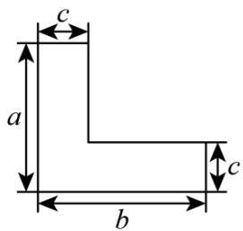

text_image

c
a
b
c

A. ①②③

B. ②③⑤

C. ③④⑤

D. ①②③④⑤

# 【题型 11 数式规律探究】

【例 11】（24-25 七年级上·贵州·期末）下列图案是某大院窗格的一部分，其中“○”代表窗纸上所贴的剪纸，则第 n 个图中所贴剪纸“○”的个数为（）.

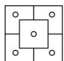  
图(1)

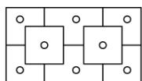  
图(2)

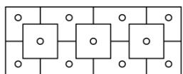  
图(3)

A. $2n + 1$

B. $2n + 2$

C. $3n + 1$

D. $3n + 2$

【变式 11-1】（24-25 七年级下·湖南岳阳·开学考试）我国南宋数学家杨辉发现了如图所示的三角形数表，我们称之为“杨辉三角”。图中两线之间的一列数：1，3，6，10，15，…，我们把第一个数记为 $a_{1}$ ，第二个数记为 $a_{2}$ ，第三个数记为 $a_{3}$ ，…，第n个数记为 $a_{n}$ ，则 $a_{9}-a_{6}+a_{5}$ 的值是（）

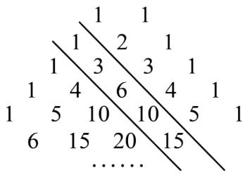

text_image

1 1
1 2 1
1 3 3 1
1 4 6 4 1
1 5 10 10 5 1
6 15 20 15
......

A. 17

B. 27

C. 39

D. 45

【变式 11-2】（24-25 七年级上·河南郑州·期末）莫高窟坐落于河西走廊西部的尽头——敦煌，是我国古代文明的璀璨艺术宝库，莫高窟保存壁画 4.5 万多平方米，具有独特的形式美感和艺术魅力。如图，为莫高窟壁画纹样，小明发现，壁画纹样中还蕴藏着数学知识，其中第①个图案中有 5 个花朵图案，第 2 个图案中有 8 个花朵图案，第③个图案中有 11 个花朵图案，……，按此规律排列下去，则第 100 个图案中花朵图案的个数为（）

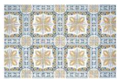

A. 302

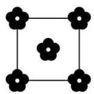

①

B. 301

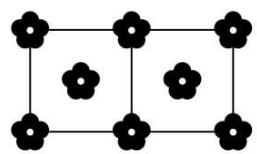

natural_image

Pure geometric grid pattern with black flower-like shapes at intersections (no text or symbols)

②

C. 303

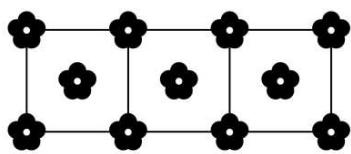

natural_image

Grid pattern with black flower-like shapes at intersections (no text or symbols)

③

D. 300

【变式 11-3】（24-25 八年级下·重庆巴南·期末）苯是一种有机化合物，可以合成一系列衍生物。如图是用小木棒摆放的苯及其衍生物的结构式，第①个图形需要 9 根小木棒，第②个图形需要 16 根，第③个图形需要 23 根，……，按此规律，第⑩个图形需要小木棒的根数是（）

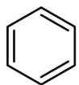

①

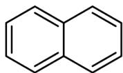

②

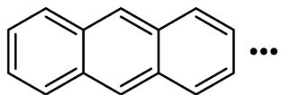

③

A. 85

B. 81

C. 76

D. 72

# 【题型 12 整式加减中的无关项问题】

【例 12】（24-25 七年级上·江苏南通·期中）关于x，y的多项式 $x^{2}+ax-y+b$ 与多项式 $bx^{2}-3x+6y-3$ 的差的值与字母x的取值无关，则代数式 $3(a^{2}-2ab-7)-(4a^{2}+ab+b^{2})$ 的值为\_\_\_\_.

【变式 12-1】（24-25 七年级上·吉林·期中）若关于 x、y 的多项式 $8(x^{2}-3xy-y^{2})-2(x^{2}+mxy+2y^{2})$ 化简后不含 xy 项，则 m= \_\_\_\_.

【变式 12-2】（24-25 七年级上·山东日照·期末）已知含字母 m，n 的代数式是： $3\left[m^{2}+2(n^{2}+mn-3)\right]-3$

$$
(m ^ {2} + 2 n ^ {2}) - 4 (m n - m - 1).
$$

(1)化简这个代数式.

(2)小明取 m，n 互为倒数的一对数值代入化简的代数式中，恰好计算得代数式的值等于 0．那么小明所取的字母 n 的值等于多少？

(3)聪明的小智从化简的代数式中发现, 只要字母 $n$ 取一个固定的数, 无论字母 $m$ 取何数, 代数式的值恒为一个不变的数, 那么小智所取的字母 $n$ , 的值是多少呢?

【变式 12-3】（24-25 七年级上·广东韶关·阶段练习）阅读与思考:阅读下列材料，完成后面任务.

一天, 我在某杂志上看到这样一道题: 小红和小英在完成题目“化简 $T(x - 1) + 3(x - 4) + 5$ ”时, 发现系数“ $T$ ”被墨迹污染了, 下面是她俩的对话:

小红：小英，我想，被墨迹污染的系数 $T$ 是-4

小英：你猜错啦！我查了一下，这道题的答案是一个常数呀！……

任务:

(1)根据材料中小红的话，化简式子 $T(x-1)+3(x-4)+5$ .

(2)根据材料中小英的话，求这道问题中的系数“T”及该式子的结果.

# 【题型13 整式加减中的多结论问题】

【例 13】（24-25 七年级上·浙江宁波·期末）如图，在一个大长方形中放入了标号为①，②，③，④，⑤五个四边形，其中①，②为两个长方形，③，④，⑤为三个正方形，相邻图形之间互不重叠也无缝隙．若想求得长方形②的周长，甲、乙、丙、丁四位同学提出了自己的想法：

甲说：只需要知道①与③的周长和；

乙说：只需要知道①与⑤的周长和；

丙说：只需要知道③与④的周长和；

丁说：只需要知道⑤与①的周长差；

下列说法正确的是（）

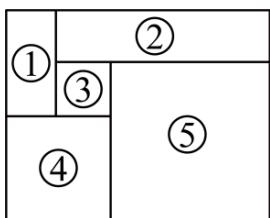

text_image

①
②
③
⑤
④

A. 只有甲正确

B. 甲和乙均正确

C. 乙和丙均正确

D. 只有丁正确

【变式 13-1】（24-25 六年级上·山东烟台·期末）关于 x，y 的单项式，若 x 的指数与 y 的指数是相等的正整数，则称该单项式是“等次单项式”。给出下面四个结论：① $-5x^{3}y^{3}$ 是“等次单项式”；②“等次单项式”的次数可能是奇数；③两个次数相等的“等次单项式”的和一定是“等次单项式”；④若五个“等次单项式”的次数均不高于8，则它们中必有同类项。上述结论中，所有正确结论的序号是（）

A. ①②③

B. ①④

C. ①②④

D. ①③④

【变式 13-2】有依次排列的两个整式: $x, x + 3$ , 对任意相邻的两个整式, 都用右边的整式减左边的整式,将所得之差写在这两个整式之间, 可以得到一个新的整式串: $x, 3, x + 3$ , 这称为第一次操作; 将第一次操作后的整式串按上述方式再做一次操作, 可以得到第二次操作后的整式串; 以此类推. 通过下列实际操作,

①第二次操作后的整式串为：x,3-x,3,x,x+3;

②第二次操作后，当x<-3或x>3时，所有整式的积为正数；

③第四次操作后的整式串共有 19 个整式;

④第 2022 次操作后，所有整式之和为 $2x + 6069$ ；上述结论中，正确的是（）

A. ①②

B. ①③

C. ①④

D. ②④

【变式 13-3】（24-25 七年级下·山东青岛·期末）有依次排列的 2 个整式： $x + y$ ，x - y.

将第 1 个整式乘以 2 再与第 2 个整式相加，得到第 3 个整式 $3x + y$ ，称为第一次操作；

将第 2 个整式乘以 2 再与第 3 个整式相加，得到第 4 个整式 5x-y，称为第二次操作；

将第 3 个整式乘以 2 再与第 4 个整式相加，得到第 5 个整式 $11x + y$ ，称为第三次操作，……，

以此类推，下列说法：

①第六次操作得到的整式为85x-y;  
②第 20 个整式中含 x 项的系数的 2 倍与第 21 个整式中含 x 项的系数之差为 1;  
③第 2025 个整式和第 2026 个整式中含 x 项的系数之和等于 $2^{2025}$ .

其中正确的有\_\_\_\_。

# 【题型14 整式加减的实际应用】

【例 14】（24-25 七年级上·江苏南通·阶段练习）我市某小区居民使用自来水 2024 年标准缴费如下（水费按月缴纳）：

<table><tr><td>用户月用水量</td><td>单价</td></tr><tr><td>不超过12立方米的部分</td><td>a元/立方米</td></tr><tr><td>超过12立方米但不超过20立方米的部分</td><td>1.5a元/立方米</td></tr><tr><td>超过 20 立方米的部分</td><td>2a元/立方米</td></tr></table>

(1)某户 4 月份用了 15 立方米的水，求该户 4 月份应缴纳的水费；（用含 a 的式子表示）  
(2)设某户月用水量为n立方米，当a = 2.5时，若该用户缴纳水费110元，则该用户这个月的用水量是多少立方米（列方程求解）？  
(3)当 $a = 2$ 时, 甲、乙两户一个月共用水 32 立方米, 已知甲户缴纳的水费超过了 24 元, 设甲户这个月用水 $x$ 立方米, 试求甲, 乙两户一个月共缴纳的水费 (可用含 $x$ 的式子表示)

【变式 14-1】（25-26 七年级上·全国·随堂练习）某地居民的生活用水收费标准为：每月用水量不超过15 m³，每立方米 a 元；超过部分每立方米(a+2)元．若该地区某家庭上月用水量为20m³，则应缴水费多少元？

【变式 14-2】（24-25 七年级上·广东韶关·阶段练习）项目式学习.

【主题】剪纸.

【素材】一张边长为a的正方形纸片、剪刀等.

【操作】从一个边长为a的正方形纸片（如图1）上剪去两个相同的小长方形，得到一个美术字“5”的图案（如图2），再将剪下的两个小长方形拼成一个新长方形（如图3）.

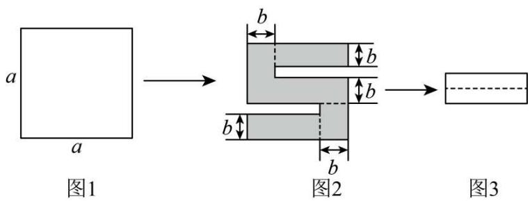

text_image

a
a
图1
b
b
b
b
图2
图3

【探究】

(1)求新长方形的周长（用含有a，b的代数式表示）；  
(2)求美术字“5”的图案的周长（用含有a，b的代数式表示）；  
(3)若a=8，剪去的小长方形的宽为1，求新长方形的周长和美术字“5”的图案的周长.

【变式 14-3】（24-25 七年级上·福建莆田·期末）在小学，我们知道像 12, 27, 36, 45, 108, ...这样的自然数能被 3 整除。一般地，如果一个自然数所有数位上的数字之和能被 3 整除，那么这个自然数就能被 3 整除。事实上，我们可以证明这个结论的正确性。

以两位数为例，若一个两位数的十位、个位上的数字分别为a,b，则通常记这个两位数为 $\overline{ab}$ ，于是 $\overline{ab}=10a+b=9a+(a+b)$ ，显然，9a能被3整除，因此，若 $a+b$ 能被3整除，那么 $9a+(a+b)$ ，就能被3整除，即 $\overline{ab}$ 能被3整除.

根据上述材料，解答下列问题：

(1)下列各数中，能被3整除的有 （填序号）

①25; ②225; ③1025.

(2)用含a、b、c的代数式表示三位数 $\overline{abc}=$ （其中a是百位数，b是十位数，c是个位数）；

(3)类比上述的过程, 尝试说明: 如果一个三位数 $\overline{abc}$ 的所有数位之和能被 9 整除, 那么这个三位数就能被 9 整除.

# 【题型15 与绝对值有关的化简】

【例 15】（24-25 七年级下·重庆·开学考试）x 是有理数， $|x-5|+|x-7|+|x+6|+|x-9|$ 的最小值是 \_\_\_\_.

【变式 15-1】（24-25 七年级上·全国·期末）已知a, b, c在数轴上的位置如图所示，所对应的点分别为A, B, C. 化简： $|a + b|-2|c - b|-|c - a| =$ \_\_\_\_.

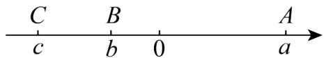

【变式 15-2】（24-25 七年级上·北京·期中）1．已知，有理数a、b、c在数轴上的位置如图所示，

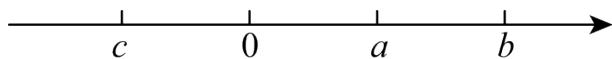

（1）化简： $|3a + b| - |c - 2a| + |c + 2b| =$

(2) 若 $a, c$ 两数的倒数是他们自身，当 $x$ 的范围是时， $|x - a| + |x - c|$ 有最小值，最小值为

（3）在（2）的条件下，若未知数 $x$ 、 $y$ 满足 $\left(|x - a| + |x - 3|\right)\left(|y - 2| + |y - c|\right) = 6$ ，则代数式 $x + 2y$ 的最大值是

【变式 15-3】（24-25 七年级上·安徽滁州·期中）有理数 a，b，c 在数轴上对应的点的位置如图所示，下列结论：① abc > 0；② $a - b + c < 0$ ；③ $\frac{|a|}{a} + \frac{|b|}{b} + \frac{|c|}{c} = -1$ ；④ $|a + b| - |b - c| + |a - c| = -2c$ 其中正确结论的个数是（）

A. 4 个

B. 3 个

C. 2 个

D. 1 个

# 【题型 16 探索与表达规律（数字变化类）】

【例 16】在“点燃我的梦想，数学皆有可衡”数学创新设计活动中，“智多星”小强设计了一个数学探究活动：对依次排列的两个整式 m，n 按如下规律进行操作：

第 1 次操作后得到整式中 m, n, n-m;

第 2 次操作后得到整式中 m, n, n-m, -m;

第 3 次操作后...

其操作规则为：每次操作增加的项，都是用上一次操作得到的最末项减去其前一项的差，小强将这个活动命名为“回头差”游戏.

则该“回头差”游戏第 2023 次操作后得到的整式中各项之和是（）

A. $m + n$

B. m

C. $n - m$

D. 2n

【变式 16-1】（24-25 七年级上·福建三明·期中）有一列按规律排列的代数式：b，2b-a，3b-2a，4b-3a，5b-4a，……相邻两个代数式的差都是同一个整式，若第 4 个代数式的值为 8，则前 7 个代数式的和为（）

A. 28

B. 56

C. 84

D. 112

【变式 16-2】借助符号，数学语言变得简洁明了．例如可用代数式 $\frac{d^{2}}{5}-\frac{c^{3}}{2}+\frac{a^{2}b^{2}}{27}$ 来表示“ $\frac{五}{丁}$ 丁 $\frac{二}{丙}$ 丁 $\frac{二七}{甲}$ 乙”（题目选自1905年清朝学堂课本）．观察其中的规律，将“ $\frac{六}{四乙}$ 丁 $\frac{三}{甲}$ 丁 $\frac{三}{乙}$ ”化简后得（）

A. $-\frac{a^{2}}{2}+b^{2}$

B. $\frac{a^{2}}{2}+b^{2}$

C. $-\frac{a^{2}}{2}+\frac{b^{2}}{3}$

D. $\frac{a^{2}}{2}+\frac{b^{2}}{3}$

【变式 16-3】（2025·河北邯郸·三模）嘉嘉和淇淇对 5 个正整数进行规律探究，嘉嘉写出三个连续偶数： $a_{1}, a_{2}, a_{3} (a_{1} < a_{2} < a_{3})$ ，淇祺写出两个连续奇数： $a_{4}, a_{5} (a_{4} < a_{5})$ ，若 $a_{1} + a_{2} + a_{3} = a_{4} + a_{5}$ ，则 $\frac{1}{3} (2a_{1} + a_{3} + a_{4}) + \frac{1}{2} (a_{2} + 2a_{5})$ 的值一定能（）

A. 被 6 整除

B. 被 7 整除

C. 被 8 整除

D. 被 9 整除

# 【题型 17 探索与表达规律（图形变化类）】

【例 17】（24-25 七年级上·全国·单元测试）如图，每个图案均由边长相等的黑、白两色正方形按规律拼接而成，照此规律，第 n 个图案中白色正方形比黑色正方形多\_\_\_\_个（用含 n 的式子表示）。

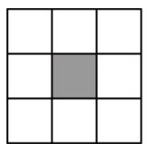  
第1个

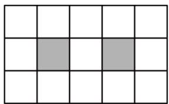

natural_image

Grid pattern with two shaded cells (no text or symbols)

第2个

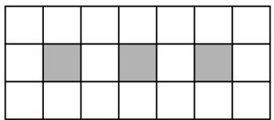

natural_image

Grid pattern with alternating shaded and unshaded squares (no text or symbols)

第3个

...

【变式 17-1】已知，如图，我们可以用长度相同的火柴棒按一定规律拼搭正多边形组成图案，图案①需8根火柴棒，图案②需15根火柴棒，...，按此规律，搭建第n个图案需要\_\_\_\_根火柴棒，搭建第2020个图案需要\_\_\_\_根火柴棒.

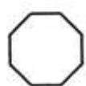  
①

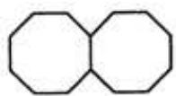  
②

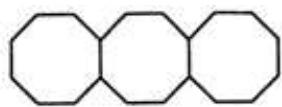  
③

• • • • • • •

【变式 17-2】（24-25 七年级上·河北唐山·阶段练习）按如图所示的规律搭正方形：搭一个小正方形需要 4 根小棒，搭两个小正方形需要 7 根小棒，则搭 2024 个这样的小正方形需要小棒（）

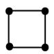

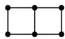

A. 6071 根

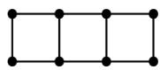

B. 6072 根

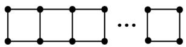

C. 6073 根

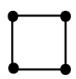

D. 6074 根

【变式 17-3】（24-25 七年级下·陕西西安·开学考试）如图是由大小相同的★组成的图形，第①个图形中有 4 个★，第②个图形中有 7 个★，第③个图形中有 10 个★，第④个图形中有 13 个★，…，按此规律摆下去，第 89 个图形中共有多少个★？（）

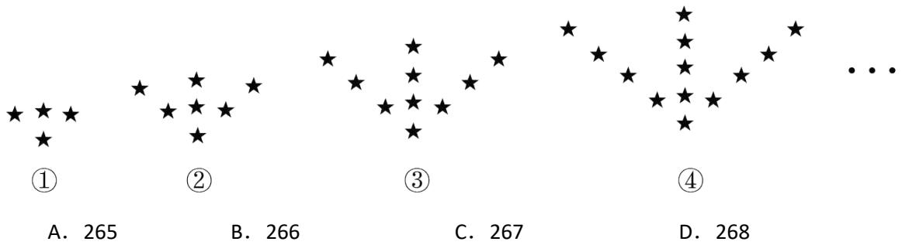

text_image

①
A. 265
②
B. 266
③
C. 267
④
D. 268
...

