# 第三章 整式及其加减（举一反三讲义）全章题型归纳

【北师大版 2024】

# 题型归纳

# 【培优篇】....4

【题型1 代数式的定义、书写规范】....4

【题型 2 代数式的意义】....6

【题型3 列代数式】....8

【题型4 代数式求值】....10

【题型5 整式及整式有关的概念】....11

【题型 6 （合并）同类项】....13

【题型 7 去（添）括号】....15

【题型 8 整式加减运算与化简求值】....16

# 【拔尖篇】....18

【题型 9 程序框图中求代数式的值】....18

【题型10几何图形中求代数式的值】 21

【题型11数式规律探究】 24

【题型 12 整式加减中的无关项问题】....27

【题型 13 整式加减中的多结论问题】....29

【题型 14 整式加减的实际应用】....33

【题型 15 与绝对值有关的化简】....37

【题型 16 探索与表达规律（数字变化类）】....40

【题型 17 探索与表达规律（图形变化类）】......42

# 举一反三

# 知识点 1 用含字母的式子表示数

用字母或含有字母的式子表示数和数量关系，为我们今后的学习和研究带来了极大的方便.

用含字母的式子表示数的书写规则:

（1）字母与字母相乘时，“×”号通常省略不写或写成“·”；

(2) 字母与数相乘时, 数通常写在字母的前面;

(3) 带分数与字母相乘时, 通常化带分数为假分数;

(4) 字母与字母相除时, 要写成分数的形式.

（5）当式子为几个数的和或差的形式，且结果带单位时，式子整体加括号.

# 知识点 2 代数式的概念

用运算符号把数或表示数的字母连接起来的式子叫作代数式。单独的一个数或字母也是代数式。例如：0，a都是代数式。

# 知识点 3 代数式的意义

根据生活实际将给定的代数式的意义用语言叙述出来，就是将代数式的字母及运算符号赋予具体的含义.

# 知识点4 列代数式

把简单的与数量有关的词语用代数式表示出来叫作列代数式. 例如: 用代数式表示: $a$ 与 $a$ 减去 $b$ 的差的商, 其中运算词 “差” 表示的数量关系是 $\underline{a}$ 减去 $\underline{b}$ , 列成式子为 $\underline{a-b}$ ; 运算词 “商” 表示的数量关系是 $\underline{a}$ 除以 “差”, 即 $\frac{a}{a-b}$ (填完整的代数式).

# 知识点 5 代数式的值的概念

用数值代替代数式中的字母，按照代数式中的运算关系计算得出的结果，叫作代数式的值．这个过程叫作求代数式的值．例如：当x=-5时，代数式 $(x+2)^{2}=(-5+2)^{2}=(-3)^{2}=9$ ，那么9就是当x=-5时，代数式 $(x+2)^{2}$ 的值．

# 知识点 6 求代数式的值的步骤

求代数式的值有代入和计算两步.

第一步：用数值替代代数式里的字母，简称“代入”。代入时，将相应的字母换成已给定的或已算出来的数值，其他的运算符号、原来的数字及运算顺序都不改变。

第二步: 按照代数式中给出的运算, 计算出结果, 简称 “计算”. 代入的值不同, 最后计算出的结果也可能不同.

# 知识点 7 单项式

1. 定义: 如果一个代数式是数或字母的积, 那么这个代数式叫作单项式. 单独的一个数或一个字母也是单项式.  
2. 单项式的系数: 单项式中的数字因数叫作这个单项式的系数.  
3. 单项式的次数: 一个单项式中, 所有字母的指数的和叫作这个单项式的次数。对于一个非零的数, 规定它的次数为 0。

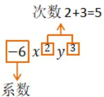

flowchart

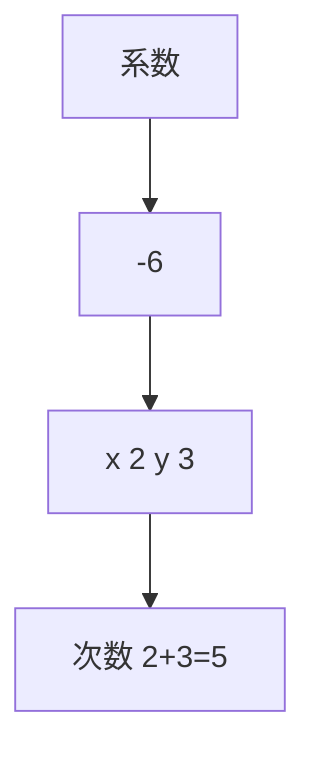

# 知识点 8 多项式

1. 定义：几个单项式的和叫作多项式.  
2. 多项式的项: 在多项式中, 每个单项式叫作多项式的项, 其中不含字母的项叫作常数项, 一个多项式含有几项, 就叫几项式.  
3. 多项式的次数：多项式里，次数最高的项的次数，叫作这个多项式的次数.

# 知识点9 整式

1. 定义：单项式与多项式统称整式.  
2. 单项式、多项式与整式的关系如图所示.

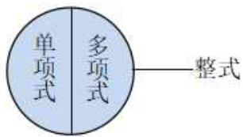

text_image

单项式
多项式
整式

# 3. 判断整式、单项式及多项式的方法

（1）单项式不含加减运算，多项式必含加减运算；  
（2）多项式是几个单项式的和，多项式不包含单项式；  
(3) 单项式和多项式都是整式, 分母中含有字母的都不是整式.

# 知识点 10 同类项

所含字母相同，并且相同字母的指数也相同的项叫作同类项．几个常数项也是同类项.

# 知识点 11 合并同类项

把多项式中的同类项合并成一项，叫作合并同类项．合并同类项后，所得项的系数是合并前各同类项的系数的和，字母连同它的指数不变.

合并同类项的一般步骤:

flowchart

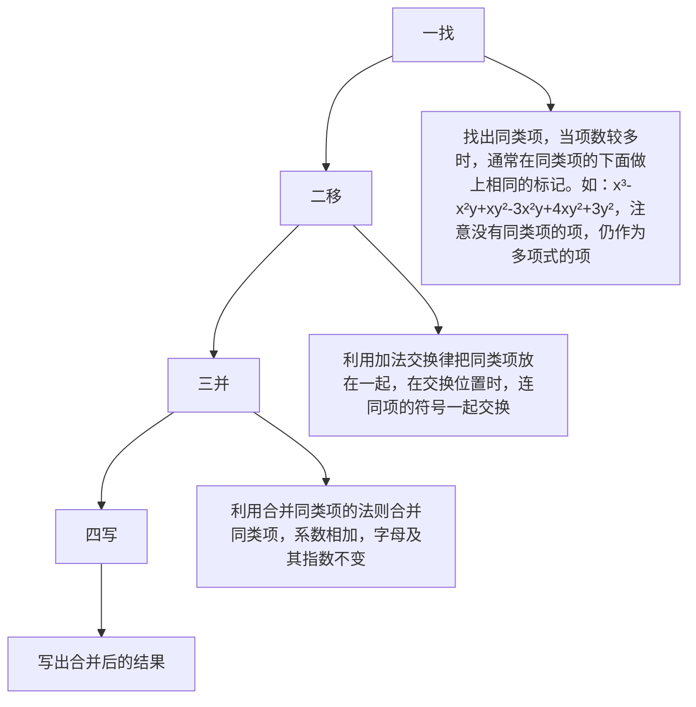

# 知识点 12 去括号

# 1. 去括号方法

一般地，一个数与一个多项式相乘，需要去括号，去括号就是用括号外的数乘括号内的每一项，再把所得的积相加。如果括号外的乘数是正数，去括号后原括号内各项的符号与原来的符号相同；如果括号外的乘数是负数，去括号后原括号内各项的符号与原来的符号相反。

2. 依据：分配律 $a(b + c) = ab + ac$ .  
3. 多层括号的去法：一般由内向外，先去小括号，再去中括号，最后去大括号.

# 知识点 13 整式的加减

整式加减的运算法则：几个整式相加减，如果有括号就先去括号，然后再合并同类项.

应用整式加减的运算法则化简求值时，一般先去括号、合并同类项，再代入字母的值进行计算，简记为“一化、二代、三计算”。在具体运算中，也可以先将同类项合并，再去括号，但是要按运算顺序去做。例如， $-2(x-3x+5x-7x+6)=-2(-4x+6)=8x-12$ 。

# 【培优篇】

# 【题型 1 代数式的定义、书写规范】

【例 1】在式子 n - 3、 $a^{2}b$ 、 $m+s\leq2$ 、x、-ah、s=ab 中代数式的个数有（）

A. 6 个

B. 5 个

C. 4 个

D. 3 个

【答案】C

【分析】代数式即用运算符号把数与字母连起来的式子，依据此意义求解.

【详解】因为代数式即用运算符号把数与字母连起来的式子，所以 n - 3、 $a^{2}b$ 、x、-ah 都是代数式，所以代数式的个数有 4 个．故选 C.

【点睛】考核知识点：代数式．理解代数式的意义是关键.

【变式 1-1】（24-25 七年级上·吉林·期中）下列书写:①-1a; ② $2\frac{2}{3}a^{2}b$ ; ③ $\frac{5a^{2}b}{3}$ ; ④ $b\frac{2}{3}$ ; ⑤ $2024 \times a \times b$ ; ⑥ $a+3$ 千克中，正确的有\_\_\_\_。（填写序号即可）

【答案】③

【分析】本题考查代数式书写规范，根据数字与字母之间乘号省略不写，数字在前字母在后，分数写成假分数，多项式与单位之间要加括号逐个判断即可得到答案；

【详解】解：-1a应写成-a，不符合题意，

$2\frac{2}{3}a^{2}b$ 应写成 $\frac{8}{3}a^{2}b$ ，不符合题意，

$\frac{5a^{2}b}{3}$ 书写规范符合题意，

$b\frac{2}{3}$ 应写成 $\frac{2}{3}b$ ，不符合题意，

$2024 \times a \times b$ 应写成2024ab，不符合题意，

$a+3$ 千克应写成 $(a+3)$ 千克，不符合题意，

故答案为：③.

【变式 1-2】下列各式中，不是代数式的是（）

A. $3a$

B. 0

C. 2x=1

D. $a^{2}-\frac{\pi}{16}$

【答案】C

【分析】根据代数式的定义逐项判断.

【详解】A、3a 是代数式，不符合题意；

B、0 是代数式，不符合题意；

C、2x=1 是方程，不是代数式，符合题意；

D、 $a^{2}-\frac{\pi}{16}$ 是代数式，不符合题意；

故选：C.

【点睛】本题主要考查了代数式的定义，正确把握代数式的定义是解题关键.

【变式1-3】下列各式： $3a$ ， $1\frac{2}{3} a$ ， $\frac{b}{5}$ ， $a\times 3$ ， $3x - 1$ ， $2a\div b$ ，其中符合书写要求的有（）

A. 1个

B. 2个

C. 3个

D. 4个

【答案】C

【分析】根据代数式的书写要求判断各个代数式即可.

【详解】解：3a， $\frac{b}{5}$ ，3x-1正确；

$1\frac{2}{3}a$ 应书写为 $\frac{5}{3}a;$

$a \times 3$ 应书写为3a;

$2a \div b$ 应书写为 $\frac{2a}{b}$ ;

所以符合书写要求的共3个，

故选：C.

【点评】本题主要考查了代数式的书写，代数式的书写要求：(1)在代数式中出现的乘号，通常简写成“•”或者省略不写；(2)数字与字母相乘时，数字要写在字母的前面；(3)在代数式中出现的除法运算，一般按照分数的写法来写．带分数要写成假分数的形式.

# 【题型2 代数式的意义】

【例 2】（24-25 七年级上·福建漳州·期中）商店对商品尾货进行亏本促销活动，促销的方法是将成本为x元的商品提价50%后标价，再以(0.9x-30)元的促销价出售，则下列说法中，①标价减去30元后再打9折；②标价打9折后再减去30元；③标价减去50元后再打6折；④标价打6折后再减去30元．能正确表达该商店促销方法的是\_\_\_\_．（填序号）

【答案】③④/④③

【分析】此题主要考查了代数式，成本为 $x$ 元的商品提价 $50\%$ 后标价为 $(1 + 50\%)x = 1.5x$ ，分别列出四个说法的促销价，再可判断即可.

【详解】解：成本为x元的商品提价50%后标价为 $(1+50\%)x=1.5x$ ,

①标价减去 30 元后再打 9 折，则促销价为： $(1.5x-30)\times0.9=1.35x-27\neq0.9x-30$

故①不符合;

②标价打 9 折后再减去 30 元，则促销价为： $0.9 \times 1.5x - 30 = 1.35x - 30 \neq 0.9x - 30$ ，

故②不符合;

③标价减去 50 元后再打 6 折，则促销价为： $(1.5x-50)\times0.6=0.9x-30$ ，

故③符合;

④标价打 6 折后再减去 30 元，则促销价为： $0.6 \times 1.5x - 30 = 0.9x - 30$ ，

故④符合;

综上，能正确表达该商店促销方法的是③④.

故答案为：③④.

【变式 2-1】（24-25 七年级上·湖南常德·期末）小明根据方程 $5x + 10(x - 5) = 400$ 编写了一道应用题，请你把空缺的部分补充完整。甲、乙两名工人生产零件，已知甲工人每天比乙工人多生产 5 个零件，\_\_\_\_，请问甲工人每天生产多少个零件？（设甲工人每天生产 x 个零件）

【答案】甲工人工作 5 天，乙工人工作 10 天，共生产了 400 个零件

【分析】本题考查了一元一次方程的应用．判断出相应的等量关系代表的实际意义是解决问题的关键．分析方程各项的意义，即可解答.

【详解】解：因为设甲工人每天生产x个零件，则乙工人每天生产 $(x-5)$ 个零件，

所以方程中5x表示甲工人5天共生产零件的数量，

10(x-5)表示乙工人 10 天共生产零件的数量,

故 $5x + 10(x - 5) = 400$ 表示甲工人工作 5 天，乙工人工作 10 天，共生产了 400 个零件.

故答案为：甲工人工作 5 天，乙工人工作 10 天，共生产了 400 个零件

【变式 2-2】（24-25 七年级上·河北石家庄·期中）甲、乙同学关于“代数式 $2(x+y)$ ”的意义叙述，判断正确的是（）

甲：x的2倍与y的和；

乙：苹果每千克x元，香蕉每千克y元，苹果和香蕉各买2千克的总花费

A. 只有甲的正确

B. 只有乙的正确

C. 甲、乙的都正确

D. 甲、乙的都不正确

【答案】B

【分析】本题考查了代数式的意义，根据甲、乙同学的叙述列出代数式，再进行判断即可求解，理解代数式的意义是解题的关键.

【详解】解：x 的 2 倍与 y 的和是 $2x + y$ ，所以甲同学叙述错误；

苹果每千克x元，香蕉每千克y元，苹果和香蕉各买2千克的总花费为 $2(x+y)$ 元，所以乙同学叙述正确；故选：B.

【变式 2-3】（24-25 七年级上·山东菏泽·期中）关于代数式8x-3y表示的意义，下列说法正确的是（）

A. 若 $x$ 表示一支铅笔的价格, $y$ 表示一块橡皮的价格, 则代数式 $8 x - 3 y$ 表示买 3 支铅笔和 8 块橡皮共花了多少钱  
B. 若长方形的长为 $x$ , 宽为 8, 正方形的边长为 $y$ , 则代数式 $8x - 3y$ 表示一个长方形的面积与 3 个正方形

的面积差

C. 汽车每小时行驶 $x$ 千米, 火车每小时行驶 $y$ 千米, 则代数式 $8 x - 3 y$ 表示火车行驶 3 小时比汽车行驶 8 小时少行驶的路程数

D. 小米每千克 $x$ 元, 大米每千克 $y$ 元, 则代数式 $8 x - 3 y$ 表示买 8 千克大米比买 3 千克小米少花的钱数

【答案】C

【分析】本题考查代数式的意义，理解代数式的意义是解题关键．根据代数式表示实际意义的方法逐项判断即可.

【详解】解：A、若 x 表示一支铅笔的价格，y 表示一块橡皮的价格，则代数式 8x-3y 表示 8 只铅笔比 3 块橡皮多花了多少钱，故本选项错误；

B、若 x 表示长方形的长，8 表示长方形的宽，y 表示正方形的边长，则代数式 8x - 3y 表示一个长方形的面积与 1 个正方形的三边长的差，故本选项错误：

C、汽车每小时行驶 x 千米，火车每小时行驶 y 千米，则代数式 8x - 3y 表示火车行驶 3 小时比汽车行驶 8 小时少行驶的路程数，故本选项正确：

D、小米每千克 x 元，大米每千克 y 元，则代数式 8x-3y 表示为买 8 千克小米比买 3 千克大米多花的钱数，故本选项错误.

故选：C.

# 【题型3 列代数式】

【例 3】（24-25 七年级上·福建龙岩·阶段练习）世界杯排球赛的积分规则为：比赛中以3-0（胜3局负0局）或者3-1取胜的球队积3分，负队积0分；比赛中以3-2取胜的球队积2分，负队积1分．若某球队以3-1胜了a场，以3-2胜了b场，以2-3负了c场，则这支球队的积分用多项式可以表示为\_\_\_\_．

【答案】 $3a + 2b + c$

【分析】本题主要考查了列代数式，根据积分规则列式即可.

【详解】:某球队以3-1胜了a场，以3-2胜了b场，以2-3负了c场，

∴这支球队的积分用多项式可以表示为 $3a+2b+c$ .

故答案为： $3a + 2b + c$ .

【变式 3-1】（24-25 七年级上·上海·期中）用代数式表示“x的 $2\frac{1}{3}$ 减去y的差”是\_\_\_\_.

【答案】 $\frac{7}{3}x-y$

【分析】此题考查了列代数式，以及代数式的书写规范；根据题意先求倍数后求差，列出代数式，将带分

数写成假分数的形式即可求解.

【详解】解：用代数式表示“x的 $2\frac{1}{3}$ 减去y的差”是 $2\frac{1}{3}x-y=\frac{7}{3}x-y$ .

故答案为： $\frac{7}{3}x-y$ .

【变式 3-2】（2025·陕西咸阳·模拟预测）九连环作为一种中国传统民间玩具，是由九个完全一样的圆环和中间的直杆连接而成，其俯视图可以看成九个水平摆放且间距一样的圆环，如图所示，若相邻两个圆环之间重叠部分的宽度均为 a，一个圆环的直径为 b，则整个九连环的宽度可以表示为\_\_\_\_。（用含 a, b 的代数式表示）

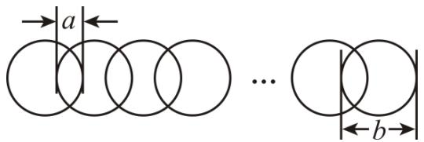

text_image

a
b

【答案】9b-8a

【分析】本题考查图形规律类，熟练掌握重叠后长度，重叠部分长度，并排长度的关系是解题的关键。用九个圆环的长度减去重叠的部分的长度即可。

【详解】解：整个九连环的宽度可以表示为9b-8a.

故答案为：9b-8a.

【变式 3-3】（24-25 七年级下·全国·假期作业）学校报告厅第一排有 a 个座位，第二排有 $(a+2)$ 个座位，第三排有 $(a+4)$ 个座位，后面每一排比前面一排多 2 个座位．第 n 排有（）个座位．

A. $a + 2n$

B. $a + 2(n-1)$

C. $2n$

D. $a + 2n + 2$

【答案】B

【分析】依题意，电影院第一排有 a 个座位，第 n 排与第一排相差 n-1 排，又后面每排比前排多 2 个座位，所以第 n 排比第一排多的座位为： $2(n-1)$ ，即可作答；本题考查规律的使用，关键在规律的总结和巧妙使用，此处重在归纳总结；

【详解】解：由题知，电影院第一排有 a 个座位；又后面每排比前排多 2 个座位；

第n排与第一排相差：n-1排，

∴第n排比第一排多的座位为： $2(n-1)$ ;

∴第n排的座位为： $a + 2(n-1)$ ;

故选：B

# 【题型4 代数式求值】

【例 4】如果代数式 $-2a^{2}+3b+8$ 的值为1，那么代数式 $4a^{2}-6b+2$ 的值等于（）

A. 14

B. 16

C. 18

D. 20

【答案】B

【分析】本题主要考查了代数式求值，利用整体代入的思想求解是解题的关键．先根据题意得到 $2a^{2}-3b=7$ ，再由 $4a^{2}-6b+2=2(2a^{2}-3b)+2$ 进行求解即可.

【详解】解：∵ $-2a^{2}+3b+8=1$ ，

$$
\therefore 2 a ^ {2} - 3 b = 7,
$$

$$
4 a ^ {2} - 6 b + 2 = 2 (2 a ^ {2} - 3 b) + 2,
$$

将 $2a^{2}-3b=7$ 代入得：原式 $=2\times7+2=16$ ，

故选：B.

【变式 4-1】（25-26 七年级上·全国·周测）小明在计算41-N时，误将“-”看成“+”，结果得13，则41-N的值为（）

A. -28

B. 32

C. 69

D. -54

【答案】C

【分析】本题主要考查了代数式求值，根据错误算法求出N的值是解题的关键．先根据错误算法求出N的值，然后再代入进行正确计算.

【详解】解：小明误将“-”看成“+”，得到错误等式： $41 + N = 13$

解得： $N = 13 - 41 = -28$

$$
\therefore 4 1 - N = 4 1 - (- 2 8) = 4 1 + 2 8 = 6 9
$$

故选：C.

【变式 4-2】（24-25 七年级上·广东东莞·期末）若 $(3-m)^{2}+|n+2|=0$ ，则 $m^{2}+n^{3}$ 的值为（）

A. 17

B. -17

C. 1

D. -1

【答案】C

【分析】本题考查代数式的求值、平方和绝对值的非负性，会利用非负数的性质求解是解答的关键．根据平方和绝对值的非负性求得 m、n 的值，再代值求解即可.

【详解】解： $\because(3-m)^{2}+|n+2|=0,\quad(3-m)^{2}\geq0,\quad|n+2|\geq0,$

$$
\therefore 3 - m = 0, n + 2 = 0,
$$

解得m=3，n=-2，

$$
\therefore \mathrm{m} ^ {2} + \mathrm{n} ^ {3} = 3 ^ {2} + (- 2) ^ {3} = 9 - 8 = 1.
$$

故选：C.

【变式 4-3】（24-25 七年级上·河北邯郸·期末）数学家欧拉最先用 $f(x)$ 来表示关于 x 的多项式．如对于 $f(x)=x+1$ ：当 x=-2 时，则 $f(-2)=(-2)+1$ ，当 x=a 时，则 $f(a)=a+1$ ．若规定 $f(x)=x+3$ ，下列结论中：① $f(-1)=2$ ；②若 $f(|x|)=4$ 时，则 $x=\pm1$ ；③当 x=-3 时， $7-|f(x)|$ 的值为 7；以上结论不正确的个数有（）

A. 0 个

B. 1 个

C. 2 个

D. 3 个

【答案】A

【分析】本题考查代数式求值，①将x=-1代入 $f(x)=x+3$ ，可求解；②根据题意得到方程 $|x|+3=4$ ，解方程即可求解；③将x=-3代入 $7-|f(x)|$ 即可求解.

【详解】解：∵ $f(x)=x+3$ ，

∴① $f(-1)=-1+3=2$ ，故①正确；

②若 $f(|x|)=4$ 时，即 $|x|+3=4$ ，

整理得 $|x|=1$ ,

$\therefore x=\pm1$ ，故②正确；

③当x=-3时， $7-|f(x)|=7-|f(-3)|=7-|-3+3|=7$ ，故③正确；

综上，①②③都正确，不正确的有0个.

故选：A.

# 【题型 5 整式及整式有关的概念】

【例 5】（24-25 七年级上·河南商丘·期中）多项式 $(m-4)x^{|m-2|}+x-5$ 是关于x的二次三项式，则m取值为（）

A. 0

B. 4

C. 4 或 0

D. -4 或 1

【答案】A

【分析】本题主要考查了多项式，熟练掌握多项式的次数：多项式中最高次项的次数，叫做多项式的次数；一个多项式有几项就叫几项式是解题的关键.

根据多项式的定义得 $|m-2|=2$ 且 $m-4\neq0$ ，求解即可.

【详解】解：∵多项式 $(m-4)x^{|m-2|}+x-5$ 是关于x的二次三项式，

$$
\therefore | m - 2 | = 2 \text {且} m - 4 \neq 0,
$$

$$
\therefore m = 0,
$$

故选：A.

【变式 5-1】（24-25 七年级上·河南驻马店·期中）下列式子： $-\frac{1}{3}$ ， $\frac{a}{3}$ ， $-\pi$ ， $-5x^{2}y^{3}$ ， $2xy^{2}$ ， $\frac{a+b}{2}$ ， $\frac{1}{2-x}$ ，其中属于单项式的是\_\_\_\_，属于多项式的是\_\_\_\_，属于整式的是\_\_\_\_。

【答案】 $-\frac{1}{3}, \frac{a}{3}, -\pi, -5x^2y^3, 2xy^2$ $\frac{a + b}{2}$ $-\frac{1}{3}, \frac{a}{3}, -\pi, -5x^2y^3, 2xy^2, \frac{a + b}{2}$

【分析】本题考查单项式、多项式、整式的概念，解题的关键是准确理解并依据这些概念来对给定式子进行分类.

①依据单项式的定义找出单项式;   
②依据多项式的定义找出多项式;   
③根据整式包含单项式和多项式确定整式.

【详解】①单项式是数或字母的积组成的代数式，单独的一个数或一个字母也叫做单项式，

$-\frac{1}{3}$ 是单独的数， $\frac{a}{3}$ 是数 $\frac{1}{3}$ 与字母a的积， $-\pi$ 是单独的数， $-5x^{2}y^{3}$ 是数5与字母x，y的积， $2xy^{2}$ 是数2与字母x，y的积，所以单项式是 $-\frac{1}{3}$ ， $\frac{a}{3}$ ， $-\pi$ ， $-5x^{2}y^{3}$ ， $2xy^{2}$ ；

②几个单项式的和叫做多项式， $\frac{a+b}{2}=\frac{a}{2}+\frac{b}{2}$ 是单项式 $\frac{a}{2}$ 与 $\frac{b}{2}$ 的和，所以多项式是 $\frac{a+b}{2}$ ，故（2）处填 $\frac{a+b}{2}$ ;  
③整式为单项式和多项式的统称，所以整式是 $-\frac{1}{3}$ ， $\frac{a}{3}$ ， $-\pi$ ， $-5x^{2}y^{3}$ ， $2xy^{2}$ ， $\frac{a+b}{2}$ ，

故答案为：① $-\frac{1}{3}$ ， $\frac{a}{3}$ ， $-\pi$ ， $-5x^{2}y^{3}$ ， $2xy^{2}$

② $\frac{a+b}{2}$   
③ $-\frac{1}{3}, \frac{a}{3}, -\pi, -5x^{2}y^{3}, 2xy^{2}, \frac{a+b}{2}$

【变式 5-2】下列说法中正确的是（）

A. 多项式 $-\frac{3x^{2}-5}{4}$ 的常数项是 $\frac{5}{4}$ ，二次项的系数是 $-\frac{3}{4}$   
B. 单项式 $-5\pi xy^{2}z^{3}$ 的系数和次数分别是 $-5, 7$   
C. $\frac{\pi}{2}$ 不是单项式  
D. 把 $x^{3}+xy^{2}-y^{3}+2x^{2}y$ 按y的降幂排列为 $-y^{3}+xy^{2}+x^{3}+2x^{2}y$

【答案】A

【分析】本题考查了多项式，单项式，根据单项式和多项式的意义，逐一判断即可解答.

【详解】解：A、多项式 $-\frac{3x^{2}-5}{4}$ 的常数项是 $\frac{5}{4}$ ，二次项的系数是 $-\frac{3}{4}$ ，本选项正确，符合题意；  
B、单项式 $-5\pi xy^{2}z^{3}$ 的系数和次数分别是 $-5\pi, 6$ ，本选项错误，不符合题意；  
C、 $\frac{\pi}{2}$ 是单项式，本选项错误，不符合题意；  
D、把 $x^{3}+xy^{2}-y^{3}+2x^{2}y$ 按y的降幂排列为 $-y^{3}+xy^{2}+2x^{2}y+x^{3}$ ，本选项错误，不符合题意.

故选：A.

【变式 5-3】已知多项式 $-7a^{m}b^{n}+5ab^{2}-1$ （m，n 为正整数且 a 的指数不相同）是按 a 的降幂排列的四次三项式，则 $(-n)^{m}$ 的值为（）

A. -1

B. 3 或 -4

C. -1或4

D. -3或4

【答案】C

【分析】本题主要考查了多项式的概念，几个单项式的和叫做多项式，每个单项式叫做多项式的项，其中不含字母的项叫做常数项．多项式中次数最高的项的次数叫做多项式的次数.

根据多项式及降幂排列的定义可得 $m > 1$ ， $m + n = 4$ ，即可求解 $m$ ， $n$ 的值，再分别代入计算可求解.

【详解】解：由题意得：m > 1， $m + n = 4$ ，

所以m=2，n=2或m=3，n=1，

当m=2，n=2时， $(-n)^{m}=(-2)^{2}=4;$

当m=3，n=1时， $(-n)^{m}=(-1)^{3}=-1$

故选：C.

# 【题型6 （合并）同类项】

【例 6】（24-25 九年级下·河南周口·阶段练习）若关于 b 的单项式 $b^{m}$ 与 $nb^{2024}$ 相加等于 0，则 mn \_\_\_\_.

【答案】-2024

【分析】本题考查合并同类项，熟练掌握同类项的定义是解题的关键；

根据同类项的定义“所含字母相同，并且相同字母的指数也相同”即可求出答案.

【详解】解：由题意可知： $b^{m}$ 与 $nb^{2024}$ 是同类项且和是0，

$$
\therefore m = 2 0 2 4, n + 1 = 0 \text {即} n = - 1,
$$

$$
\therefore m n = 2 0 2 4 \times (- 1) = - 2 0 2 4,
$$

故答案为：-2024.

【变式 6-1】（24-25 七年级上·全国·期末）下列各组式子中是同类项的是（）

A. ac与ab

B. $3a$ 与 $5a^{2}$

C. $3ab^{2}$ 与 $5a^{2}b$

D. $a^{2}b$ 与 $-ba^{2}$

【答案】D

【分析】本题考查同类项的定义，解题的关键是正确理解同类项的定义，本题属于基础题型.所含字母相同，并且相同字母的指数也相同，这样的项叫做同类项.

【详解】解：A、所含字母不相同，不是同类项，故 A 选项不符合题意；

B、相同字母的指数不相同，不是同类项，故 B 选项不符合题意；  
C、相同字母的指数不相同，不是同类项，故 C 选项不符合题意；  
D、符合同类项的定义，是同类项，故 D 选项符合题意；

故选：D.

【变式 6-2】（24-25 七年级上·北京·期中）请写出一个与 $-ab^{2}$ 为同类项的整式：\_\_\_\_.

【答案】 $8ab^{2}$ （答案不唯一）

【分析】本题考查了同类项的知识．熟练掌握同类项的定义“所含字母相同，相同字母的指数相同”，是解题的关键.

根据同类项定义中的两个“相同”：（1）所含字母相同；（2）相同字母的指数相同，书写即可，注意同类项与字母的顺序无关.

【详解】解：如 $8ab^{2}$ ，答案不唯一.

故答案为： $8ab^{2}$ （答案不唯一）.

【变式 6-3】已知 $-5a^{2m}b$ 和 $8a^{6}b^{3-n}$ 是同类项，则下列各组中的单项式是同类项的是（）

A. $-x^{m}y^{2}$ 与 $\frac{1}{2}x^{2}y^{n}$

B. $2x^{m - 1}y^{2}$ 与 $0.01x^{2}y^{n}$

C. $x^{3}y^{4}$ 与 $-4x^{m + 1}y^{n + 2}$

D. $-x^{2m}y^{4}$ 与 $6x^{6}y^{n+1}$

【答案】B

【分析】本题主要考查了同类项的定义．所含字母相同并且相同字母的指数相同的项叫做同类项．掌握同类项的定义是解题的关键.

根据相同字母的指数相同列方程求出 m 和 n 的值，然后再根据同类项的定义逐项判定即可.

【详解】解：∵ $-5a^{2m}b$ 和 $8a^{6}b^{3-n}$ 是同类项，

$\therefore \left\{ \begin{array}{l} 2m = 6 \\ 3 - n = 1 \end{array} \right.$ 即 $\left\{ \begin{array}{l} m = 3 \\ n = 2 \end{array} \right.$

$\therefore \mathrm{A}.$ 由 $-x^{m}y^{2} = -x^{3}y^{2},\frac{1}{2} x^{2}y^{n} = \frac{1}{2} x^{2}y^{2}$ ，则 $-x^{m}y^{2}$ 与 $\frac{1}{2} x^2 y^n$ 不是同类项，不符合题意；

B. 由 $2x^{m-1}y^2 = 2x^2y^2$ ， $0.01x^2y^n = 0.01x^2y^2$ ，则 $2x^{m-1}y^2$ 与 $0.01x^2y^n$ 是同类项，符合题意；

C. 由 $x^{3}y^{4}$ ， $-4x^{m+1}y^{n+2}=-4x^{4}y^{4}$ ，则 $x^{3}y^{4}$ 与 $-4x^{m+1}y^{n+2}$ 不是同类项，不符合题意；

D. $-x^{2m}y^{4}=-x^{6}y^{4},\quad6x^{6}y^{n+1}=6x^{6}y^{3}$ ，则 $-x^{2m}y^{4}$ 与 $6x^{6}y^{n+1}$ 不是同类项，不符合题意.
故选 B.

# 【题型7 去（添）括号】

【例 7】（24-25 七年级上·河北衡水·阶段练习）下列去括号正确的是（）

A. $a + (b + c) = ab + c$

B. $a^2 -[-(-a + b)] = a^2 -a - b$

C. $a + 2(b - c) = a + 2b - c$

D. $a-(b+c-d)=a-b-c+d$

【答案】D

【分析】本题考查了去括号法则的应用，能熟记去括号法则是解此题的关键．根据去括号法则逐个进行判断即可.

【详解】A、 $a+(b+c)=a+b+c$ ，但选项写为 $ab+c$ ，错误，不符合题意；

B、 $a^{2}-\left[-(-a+b)\right]=a^{2}-[a-b]=a^{2}-a+b$ ，但选项结果为 $a^{2}-a-b$ ，符号错误，不符合题意；

C、 $a + 2(b - c) = a + 2b - 2c$ ，但选项写为 $a + 2b - c$ ，系数缺失，错误，不符合题意；

D、 $a-(b+c-d)=a-b-c+d$ ，与选项一致，正确，符合题意；

故选：D.

【变式7-1】已知 $x = 1\frac{1}{3}$ ， $y = -\frac{1}{2}$ ， $z = \frac{5}{6}$ ，则 $x - (-y) + (-z) =$

【答案】0

【分析】根据去括号法则化简，再代入数字计算即可得到答案.

【详解】解：原式 = x + y - z ，

当 $x=1\frac{1}{3}$ ， $y=-\frac{1}{2}$ ， $z=\frac{5}{6}$ 时，

原式 = x + y - z = $\frac{4}{3} + (-\frac{1}{2}) - \frac{5}{6} = 0$ ，

故答案为0.

【点睛】本题考查整式化简求值，解题关键是去括号时注意符号的选取.

【变式 7-2】已知 $x-(\quad)=x-y-z$ ，则括号里的式子是（）

A. y-z

B. z-y

C. $y + z$

D. -y-z

【答案】C

【分析】本题考查添括号法则，解答此题的关键是熟练掌握添括号法则：添的括号前是正数时，被括到括号里的各项的符号都不变，添的括号前是负数时，被括到括号里的各项的符号都改变.

根据添括号法则解答即可，注意符号变化.

【详解】解：根据题意将x-y-z添括号， $x-y-z=x-(y+z)$ ,

故选：C.

【变式 7-3】已知 $x^{2}+2xy=4,\ y^{2}+xy=5$ ，则 $2x^{2}+3xy-y^{2}=$ \_\_\_\_.

【答案】3

【分析】把 $2x^{2}+3xy-y^{2}$ 化为 $2(x^{2}+2xy)-(y^{2}+xy)$ ，再整体代入求值即可.

【详解】解： $\because x^{2}+2xy=4,\quad y^{2}+xy=5,$

$$
\begin{array}{l} \therefore 2 x ^ {2} + 3 x y - y ^ {2} \\ = 2 (x ^ {2} + 2 x y) - (y ^ {2} + x y) \\ = 2 \times 4 - 5 \\ = 3. \\ \end{array}
$$

故答案为：3.

【点睛】本题考查的是求解代数式的值，掌握“整体代入法求解代数式的值”是解本题的关键.

# 【题型8 整式加减运算与化简求值】

【例 8】（24-25 七年级上·上海·期中）我们约定：上方相邻两数之和等于这两数下方箭头共同指向的数，例如：在图 1 中，即 $5 + 6 = 11$ ，若 a, b 满足 $|a - 3| + (b + 1)^{2} = 0$ ，则图 2 中 y 的值为 \_\_\_\_.

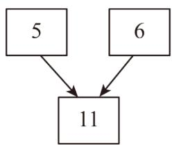

flowchart

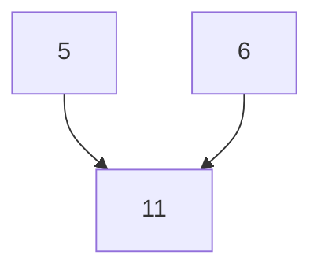

图1

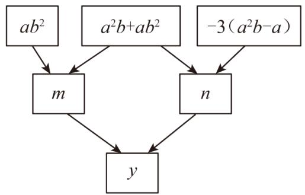

flowchart

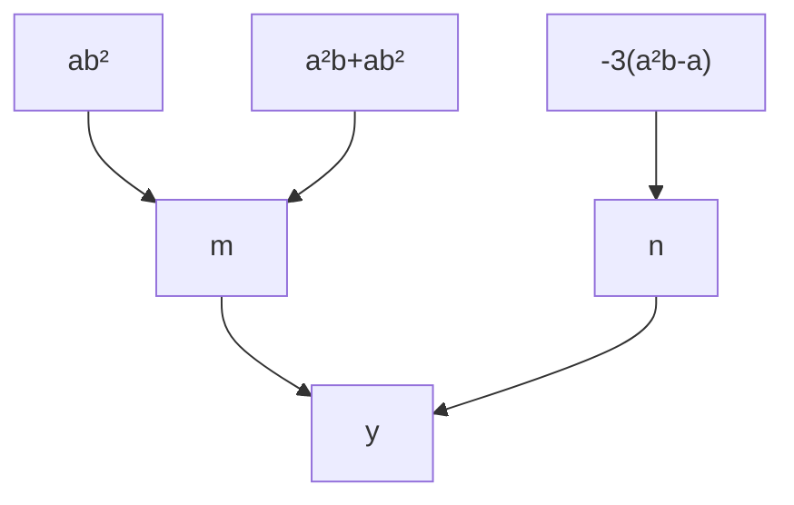

图2

【答案】27

【分析】本题考查了整式的加减与化简求值；先用含有 $a$ ， $b$ 的代数式表示 $m$ 和 $n$ ，再表示出 $y$ 即可。根据绝对值和完全平方的非负性求出 $a$ 和 $b$ 的值即可解决问题。

【详解】由题知，

$$
m = a b ^ {2} + a ^ {2} b + a b ^ {2} = a ^ {2} b + 2 a b ^ {2};
$$

$$
n = a ^ {2} b + a b ^ {2} - 3 \left(a ^ {2} b - a\right) = a ^ {2} b + a b ^ {2} - 3 a ^ {2} b + 3 a = - 2 a ^ {2} b + a b ^ {2} + 3 a;
$$

所以 $y = m + n = a^2 b + 2ab^2 - 2a^2 b + ab^2 + 3a = -a^2 b + 3ab^2 + 3a.$

因为 $|a-3|+(b+1)^{2}=0,$

所以a-3=0， $b+1=0$ ，

则a=3，b=-1，

所以 $y=-3^{2}\times(-1)+3\times3\times(-1)^{2}+3\times3=27.$

故答案为：27.

【变式 8-1】（24-25 七年级上·陕西宝鸡·阶段练习）计算.

(1) $2(x^{2}-2xy)-3(y^{2}-3xy)$ ;

(2) $(-x^{2}+2xy-y^{2})-2(xy-3x^{2})+3(2y^{2}-xy).$

【答案】(1) $2x^{2}-3y^{2}+5xy$

(2) $5x^{2}-3xy+5y^{2}$

【分析】本题主要考查了整式的加减，正确合并同类项是解题关键.

（1）直接去括号进而合并同类项得出答案；  
(2) 直接去括号进而合并同类项得出答案.

【详解】（1）解： $2(x^{2}-2xy)-3(y^{2}-3xy)$

$$
\begin{array}{l} = 2 x ^ {2} - 4 x y - 3 y ^ {2} + 9 x y \\ = 2 x ^ {2} - 3 y ^ {2} + 5 x y; \\ \end{array}
$$

(2) 解: $(-x^{2}+2xy-y^{2})-2(xy-3x^{2})+3(2y^{2}-xy)$

$$
\begin{array}{l} = - x ^ {2} + 2 x y - y ^ {2} - 2 x y + 6 x ^ {2} + 6 y ^ {2} - 3 x y \\ = 5 \mathrm{x} ^ {2} - 3 \mathrm{xy} + 5 \mathrm{y} ^ {2} \\ \end{array}
$$

【变式 8-2】（24-25 七年级上·贵州遵义·期中）设 $M = x^{2} + 4mx - 3$ ， $N = 2x^{2} + 4mx - 2$ ，那么 M 与 N 的大小关系是（）

A. M > N

B. M = N

C. $M <   N$

D. 无法确定

【答案】C

【分析】本题考查了整式的加减，不等式的性质，熟练掌握整式的加减运算是解题的关键．通过计算M-N，化简后根据结果的符号判断大小关系.

【详解】解： $M-N=(x^{2}+4mx-3)-(2x^{2}+4mx-2)$

$$
= x ^ {2} + 4 m x - 3 - 2 x ^ {2} - 4 m x + 2
$$

$$
= - x ^ {2} - 1
$$

$$
\because x ^ {2} \geq 0,
$$

$$
\therefore - x ^ {2} - 1 \leq - 1 <   0,
$$

$$
\therefore M - N <   0,
$$

即 $M < N$

选择 C.

【变式 8-3】（24-25 九年级上·江苏南通·期中）已知 $3x^{2}-4xy+7y^{2}-2m=-17$ ， $x^{2}+5xy+6y^{2}-m=12$ ，则式子 $x^{2}-14xy-5y^{2}$ 的值为（）

A. -41

B. $-\frac{41}{2}$

C. $-\frac{7}{2}$

D. $\frac{7}{2}$

【答案】A

【分析】本题主要考查了整式的化简求值，先把第二个等式两边乘以 2，再用第一个等式减去第二个等式两边乘以 2 后的结果即可得到答案.

【详解】解； $\because x^{2}+5xy+6y^{2}-m=12,$

$$
\therefore 2 (x ^ {2} + 5 x y + 6 y ^ {2} - m) = 2 4, \text {即} 2 x ^ {2} + 1 0 x y + 1 2 y ^ {2} - 2 m = 2 4,
$$

$$
\therefore 3 x ^ {2} - 4 x y + 7 y ^ {2} - 2 m - (2 x ^ {2} + 1 0 x y + 1 2 y ^ {2} - 2 m) = - 1 7 - 2 4 = - 4 1,
$$

$$
\therefore 3 x ^ {2} - 4 x y + 7 y ^ {2} - 2 m - 2 x ^ {2} - 1 0 x y - 1 2 y ^ {2} + 2 m = - 4 1,
$$

$$
\therefore x ^ {2} - 1 4 x y - 5 y ^ {2} = - 4 1,
$$

故选：A.

# 【拔尖篇】

# 【题型9 程序框图中求代数式的值】

【例 9】（24-25 七年级上·福建福州·期中）远古时期，人们通过绳子打结的方式来记录数量，如图 1 为一队互相合作打猎的猎人在从右往左依次排列的绳子上打结，满五进一，记录了他们一天之内所打的猎物数量．若把这个量的十进制数输入如图 2 的程序计算，则最后输出的结果是\_\_\_\_.

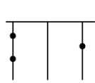  
图1

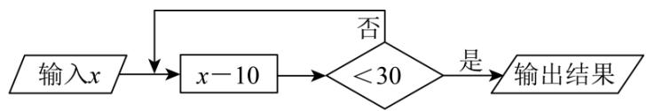

flowchart

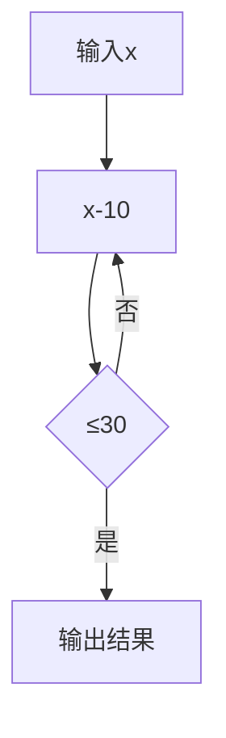

图2

【答案】21

【分析】本题考查有理数的乘方运算以及代数式求值，先根据图1，得出 $x=2\times5^{2}+0+1=51$ ，再代入程序计算，即可求解.

【详解】解：依题意， $x=2\times5^{2}+0+1=51$

$$
\therefore 5 1 - 1 0 = 4 1 > 3 0
$$

$$
4 1 - 1 0 = 3 1 > 3 0
$$

$$
3 1 - 1 0 = 2 1 <   3 0
$$

输出21

故答案为：21.

【变式 9-1】（24-25 六年级下·山东泰安·期末）如图，关于变量 x，y 的程序计算，若开始输入的 x 值为 2，则最后输出因变量 y 的值为

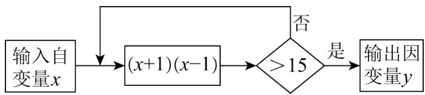

flowchart

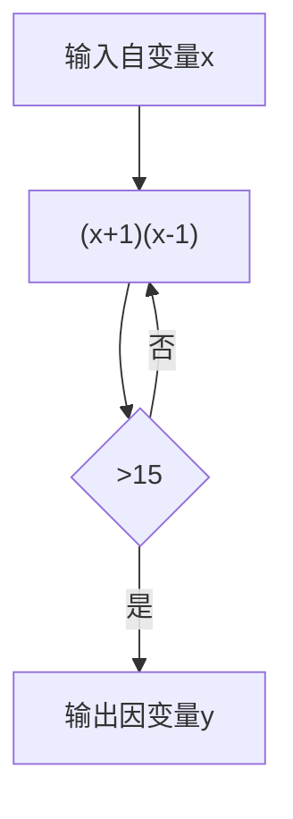

A. 3

B. 8

C. 63

D. 64

【答案】C

【分析】本题考查按照程序流程图与代数式求值．根据程序流程图，按照要求，当开始输入的x值为2时，代入 $y=(x+1)(x-1)=(2+1)(2-1)=3<15$ ，从而再输入x=3，直到大于15可得答案.

【详解】解：由题意可得，当x=2时， $y=(x+1)(x-1)=(2+1)(2-1)=3<15$ ，

当x=3时， $y=(x+1)(x-1)=(3+1)(3-1)=8<15,$

当x=8时， $y=(x+1)(x-1)=(8+1)(8-1)=63>15$

∴ 输出 y = 63,

故选：C.

【变式 9-2】（24-25 七年级上·四川达州·期末）有一个数值转换器，原理如图所示，若开始输入 x 的值是 5，可发现第 1 次输出的结果是 16，第 2 次输出的结果是 8，第 3 次输出的结果是 4．依次继续下去，第 2025 次输出的结果是（）

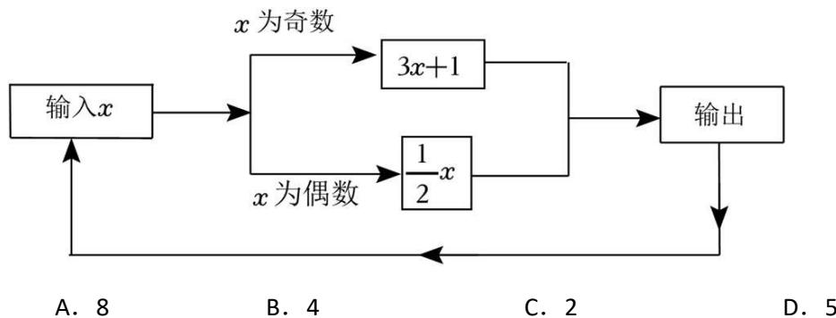

flowchart

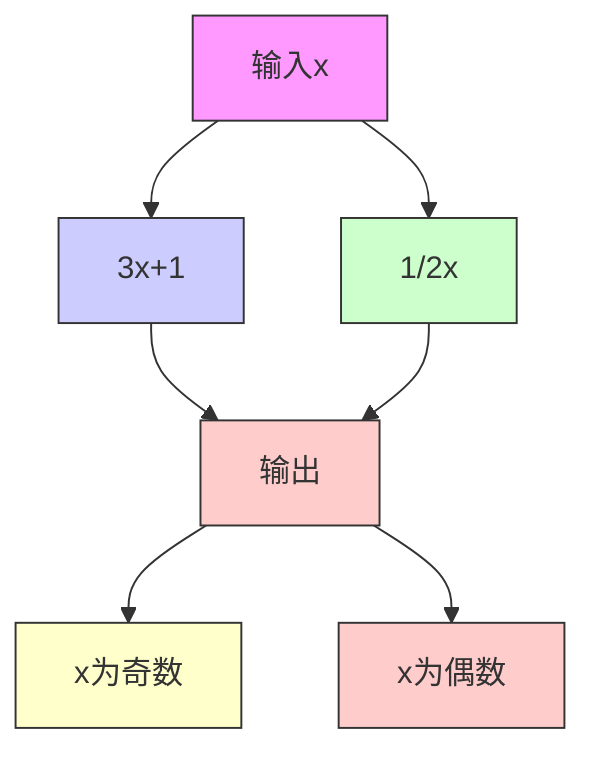

【答案】B

【分析】本题考查了有理数的混合运算，根据题目所给运算程序，先计算出前几次输出结果，得出一般规

律：从第 3 次开始，输出结果每 3 次按照 4，2，1 的顺序循环，即可解答.

【详解】解：根据题意可得：

第 1 次输出的结果是 16,

第 2 次输出的结果是 8,

第 3 次输出的结果是 4,

第 4 次输出的结果是 $\frac{1}{2} \times 4 = 2$ ,

第 5 次输出的结果是 $\frac{1}{2} \times 2 = 1$ ,

第 6 次输出的结果是 $3 \times 1 + 1 = 4$ ,

第 7 次输出的结果是 2,

第 8 次输出的结果是 1,

第 9 次输出的结果是 4,

……，

从第 3 次开始，输出结果每 3 次按照 4，2，1 的顺序循环，

$$
(2 0 2 5 - 2) \div 3 = 6 7 4 \dots 1,
$$

∴第 2025 次输出的结果是第 675 次循环中的第 1 个数，

∴第 2025 次输出的结果为 4，

故选：B.

【变式 9-3】（2025·四川达州·二模）如图是一个运算程序示意图，若开始输入x的值为5，则输出y值为\_\_\_\_。

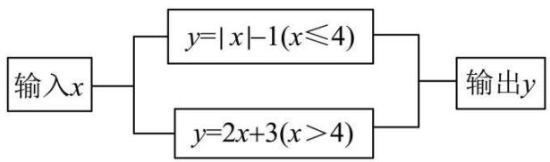

flowchart

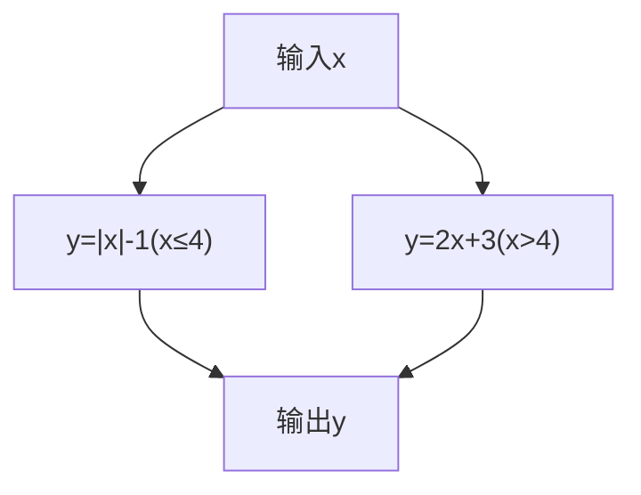

【答案】13

【分析】本题考查了代数式求值，读懂运算程序图是解题关键．根据5＞4和运算程序图，将x=5代入 $y=2x+3$ 计算即可得.

【详解】解：∵5 > 4，

∴若开始输入x的值为5，则输出y值为 $2 \times 5 + 3 = 13$ ，

故答案为：13.

# 【题型10 几何图形中求代数式的值】

【例 10】（24-25 七年级上·贵州遵义·期中）下列四个整式中，不能表示图中阴影部分面积的是（）

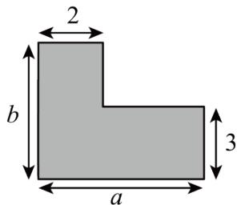

text_image

2
b
a
3

A. $ab - (a - 2)(b - 3)$

B. $2b + 3(a - 2)$

C. $2(b - 3) + 3(a - 2) + 6$

D. $3a + 2(b - 2)$

【答案】D

【分析】本题考查了正方形和长方形面积、代数式的知识；解题的关键是熟练掌握代数式的性质，从而完成求解.

结合题意，根据正方形和长方形面积、代数式的性质计算，即可得到答案.

【详解】解：如图，

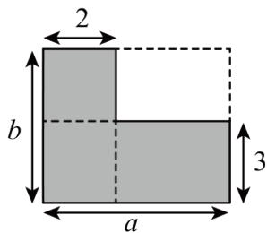

text_image

2
b
a
3

阴影部分的面积可以看作是长a，宽为b的长方形的面积减去长a-2，宽为b-3的长方形的面积，即 $ab-(a-2)(b-3)$ ，故A选项正确，不符合题意；

阴影部分的面积可以看作是长 2，宽为 b-3 的长方形的面积加上长 3，宽为 2 的长方形的面积加上长 a-2，宽为 3 的长方形的面积，即 $2(b-3) + 3(a-2) + 6$ ，故 C 选项正确，不符合题意；

阴影部分的面积可以看作是长b，宽为2的长方形的面积加上长a-2，宽为3的长方形的面积，即 $2b+3(a-2)$ ，故B选项正确，不符合题意；

阴影部分的面积可以看作是长 2，宽为 b-3 的长方形的面积加上长 a，宽为 3 的长方形的面积，即 $3a + 2(b - 3)$ ，故 D 选项错误，符合题意；

故选：D

【变式 10-1】（24-25 七年级上·河北邯郸·期末）如图所示是一个长方形.

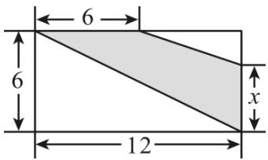

text_image

6
6
12
x

(1) 根据图中尺寸大小, 用含 $x$ 的代数式表示阴影部分的面积 $S = \_$ ;  
（2）若x=4，求S的值\_\_\_\_。

【答案】

$18 + 3x$

30

【分析】本题考查了代数式表示，求代数式的值.

(1) 根据图形的面积分割法, 列出代数式表示阴影的面积即可.  
(2) 根据字母的值, 求代数式的值即可.

【详解】（1）解： $S=\frac{1}{2}\times6\times12-\frac{1}{2}\times(12-6)(6-x)=18+3x$

故答案为： $18 + 3x$ ;

（2）解：当x=4时， $S=18+3\times4=30$ ，

故答案为：30.

【变式 10-2】（24-25 七年级上·全国·期末）如图，7个完全相同的小长方形刚好拼成一个大长方形，若小长方形的宽为a，则大长方形的周长是\_\_\_\_。

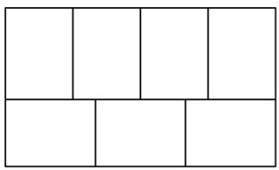

natural_image

Pure geometric grid pattern with no text, numbers, or symbols

【答案】 $\frac{38}{3} a$

【分析】本题考查列代数式，整式的加减运算的应用，根据小长方形的宽为a，则小长方形的长为 $\frac{4}{3}a$ ，结合大长方形的拼组方式，可用含a的代数式表示出大长方形的长与宽，即可得出结论。根据各数量之间的关系，用含a的代数式表示出大长方形的长与宽是解题的关键。

【详解】解：∵小长方形的宽为a，则小长方形的长为 $\frac{4}{3}a$ ，

∴大长方形的长为4a，大长方形的宽为： $\frac{4}{3}a + a = \frac{7}{3}a$

$$
\therefore 2 \left(4 a + \frac {7}{3} a\right) = 2 \times \frac {1 9}{3} a = \frac {3 8}{3} a,
$$

∴大长方形的周长是 $\frac{38}{3}a$ .

故答案为： $\frac{38}{3}a.$

【变式 10-3】（24-25 七年级下·河南郑州·期中）如图是 L 形钢材的截面，5 个同学分别列出它的截面面积的算式，你认为正确的有（）

① $ac-(b-c)c$ ; ② $(a-c)c+bc$ ; ③ $(a-c)c+c^{2}+(b-c)c$ ; ④ $ab+bc-c^{2}$ ; ⑤ $ab-(a-c)(b-c)$

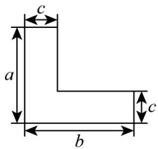

text_image

c
a
b
c

A. ①②③

B. ②③⑤

C. ③④⑤

D. ①②③④⑤

【答案】B

【分析】本题主要考查了列代数式，分解析图中五种情况，分别列式求出 L 的面积即可得到答案.

【详解】解：①如图，

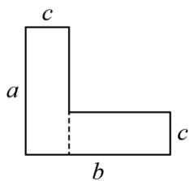

text_image

c
a
b
c

L的面积 = 左边竖着的长方形的面积 + 下面横着的长方形的面积 = $ac + (b - c)c$ ，故①错误；

②如图，

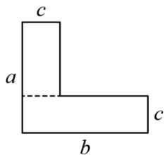

text_image

c
a
b
c

L的面积 = 上边竖着的长方形的面积 + 下面横着的长方形的面积 = $(a-c)c + bc$ ，故②正确；

③如图，

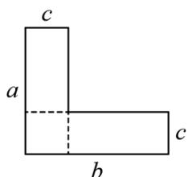

text_image

c
a
b
c

L的面积 = 两个长方形的面积 + 小正方形面积 = $(a-c)c + (b-c)c + c^{2}$ ，故③正确；

④如图，

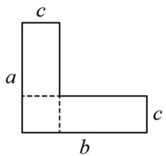

text_image

c
a
b
c

L的面积 = 竖着的长方形的面积 + 横着的长方形的面积 - 重叠部分的正方形的面积 = $ac + bc - c^{2}$ ，故④错误；

⑤如图，

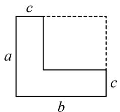

text_image

c
a
b
c

L的面积 = 长方形的面积 - 由辅助线构成的小长方形的面积 = ab - (a - c)(b - c)，故⑤正确，

综上可得：②③⑤正确，

故选：B.

# 【题型11 数式规律探究】

【例 11】（24-25 七年级上·贵州·期末）下列图案是某大院窗格的一部分，其中“○”代表窗纸上所贴的剪纸，则第 n 个图中所贴剪纸“○”的个数为（）.

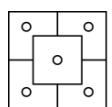  
图(1)

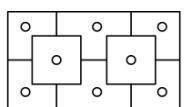  
图(2)

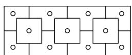  
图(3)

A. $2n + 1$

B. $2n + 2$

C. $3n + 1$

D. $3n + 2$

【答案】D

【分析】本题主要考查了图形类规律题，明确题意，准确得到规律是解题的关键．观察图形可知第一个图案为 $3+2=5$ 个窗花；第二个图案为 $2\times3+2=8$ 个窗花；第三个图案为 $3\times3+2=11$ 个窗花；……由此得到：第n个图案所贴窗花数，即可求解.

【详解】解：第一个图案为 $3+2=5$ 个窗花；

第二个图案为 $2 \times 3 + 2 = 8$ 个窗花；

第三个图案为 $3 \times 3 + 2 = 11$ 个窗花；

......

由此得到：第 n 个图案所贴窗花数为 $3n + 2$ 个.

故选：D.

【变式 11-1】（24-25 七年级下·湖南岳阳·开学考试）我国南宋数学家杨辉发现了如图所示的三角形数表，我们称之为“杨辉三角”。图中两线之间的一列数：1，3，6，10，15，…，我们把第一个数记为 $a_{1}$ ，第二个数记为 $a_{2}$ ，第三个数记为 $a_{3}$ ，…，第n个数记为 $a_{n}$ ，则 $a_{9}-a_{6}+a_{5}$ 的值是（）

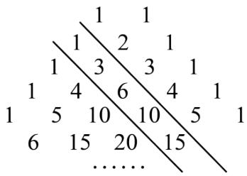

text_image

1 1
1 2 1
1 3 3 1
1 4 6 4 1
1 5 10 10 5 1
6 15 20 15
......

A. 17

B. 27

C. 39

D. 45

【答案】C

【分析】本题考查了规律型：数字的变化类，求代数式的值．解决本题的关键是根据数字的变化寻找规律．根据题意得出第n个数记为 $a_{n}=1+2+3+\ldots+n=\frac{1}{2}n(n+1)$ ，再代入求值，进而可得结果.

【详解】解：第一个数记为 $a_{1}=1$ ，

第二个数记为 $a_{2}=1+2=3$ ,

第三个数记为 $a_{3}=1+2+3=6$ ,

…，

第n个数记为 $a_{n}=1+2+3+\ldots+n=\frac{1}{2}n(n+1)$ ,

故 $a_{9}=\frac{1}{2}\times9\times10=45,\quad a_{6}=\frac{1}{2}\times6\times7=21,\quad a_{5}=\frac{1}{2}\times5\times6=15,$

$$
a _ {9} - a _ {6} + a _ {5} = 4 5 - 2 1 + 1 5 = 3 9.
$$

故选：C.

【变式 11-2】（24-25 七年级上·河南郑州·期末）莫高窟坐落于河西走廊西部的尽头——敦煌，是我国古代文明的璀璨艺术宝库，莫高窟保存壁画 4.5 万多平方米，具有独特的形式美感和艺术魅力。如图，为莫高窟壁画纹样，小明发现，壁画纹样中还蕴藏着数学知识，其中第①个图案中有 5 个花朵图案，第 2 个图案中有 8 个花朵图案，第③个图案中有 11 个花朵图案，……，按此规律排列下去，则第 100 个图案中花朵图案的个数为（）

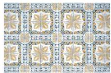  
A. 302

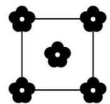  
①   
B. 301

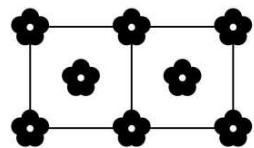  
②   
C. 303

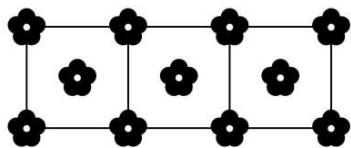

natural_image

Pure geometric grid pattern with black flower-like shapes at intersections (no text or symbols)

③   
D. 300

【答案】A

【分析】本题考查了图形的变化规律，根据图形的变化得出第 $n$ 个图形中有 $(3n + 2)$ 个花朵图案是解题的关键.

根据图形变化的规律得出第n个图形中有 $(3n+2)$ 个花朵图案即可解答.

【详解】由题知，第①个图案中有 $2 \times 2 + 1 = 5$ 个花朵图案，第②个图案中有 $2 \times 3 + 2 = 8$ 个花朵图案，第③个图案中有 $2 \times 4 + 3 = 11$ 个花朵图案，…，第n个图案中有 $2(n + 1) + n = 3n + 2$ 个花朵图案，

当n=100时， $3n+2=3\times100+2=302$ ，

故第 100 个图案中花朵图案的个数为 302.

故选：A.

【变式 11-3】（24-25 八年级下·重庆巴南·期末）苯是一种有机化合物，可以合成一系列衍生物．如图是用小木棒摆放的苯及其衍生物的结构式，第①个图形需要9根小木棒，第②个图形需要16根，第③个图形需要23根，……，按此规律，第⑩个图形需要小木棒的根数是（）

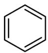  
①

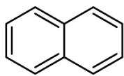  
②

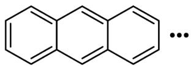  
③   
A. 85   
B. 81   
C. 76   
D. 72

【答案】D

【分析】本题考查了图形规律，理解数量关系，找出规律是关键.

根据题意得到第 n 个图形需要 $9 + 7(n-1) = 7n + 2$ （根），由此即可求解.

【详解】解：第①个图形需要9根小木棒，

第②个图形需要 16 根，即 $16 = 9 + 7$ ，

第③个图形需要 23 根，即 $23 = 9 + 2 \times 7$ ，

∴第 n 个图形需要 $9 + 7(n-1) = 7n + 2$ （根），

第⑩个图形需要 $7 \times 10 + 2 = 72$ （根），

故选：D.

# 【题型12 整式加减中的无关项问题】

【例 12】（24-25 七年级上·江苏南通·期中）关于x，y的多项式 $x^{2}+ax-y+b$ 与多项式 $bx^{2}-3x+6y-3$ 的差的值与字母x的取值无关，则代数式 $3(a^{2}-2ab-7)-(4a^{2}+ab+b^{2})$ 的值为\_\_\_\_.

【答案】-10

【分析】此题考查了整式的加减-化简求值，熟练掌握运算法则是解本题的关键．根据题意列出关系式，由结果与 $x$ 的值无关，确定出 $a$ 与 $b$ 的值，原式去括号合并后代入计算即可求出值.

【详解】解： $x^{2}+ax-y+b-(bx^{2}-3x+6y-3)=(1-b)x^{2}+(a+3)x-7y+3+b$

$\because$ 多项式 $x^{2} + ax - y + b$ 与多项式 $bx^{2} - 3x + 6y - 3$ 的差的值与字母 $x$ 的取值无关，

$$
\begin{array}{l} \therefore 1 - b = 0, a + 3 = 0, \\ \therefore b = 1, a = - 3, \\ \because 3 (a ^ {2} - 2 a b - 7) - (4 a ^ {2} + a b + b ^ {2}) \\ = 3 a ^ {2} - 6 a b - 2 1 - 4 a ^ {2} - a b - b ^ {2} \\ = - a ^ {2} - 7 a b - b ^ {2} - 2 1 \\ \end{array}
$$

当 $b = 1, a = -3$ 时

原式 = -9 + 21 - 1 - 21 = -10,

故答案为：-10.

【变式 12-1】（24-25 七年级上·吉林·期中）若关于 x、y 的多项式 $8(x^{2}-3xy-y^{2})-2(x^{2}+mxy+2y^{2})$ 化简后不含 xy 项，则 m= \_\_\_\_.

【答案】-12

【分析】本题考查了整式的加减中无关型问题，根据化简后不含xy的项，即xy的系数为0，进而可求解.

【详解】解： $8(x^{2}-3xy-y^{2})-2(x^{2}+mxy+2y^{2})$

$$
\begin{array}{l} = 8 x ^ {2} - 2 4 x y - 8 y ^ {2} - 2 x ^ {2} - 2 m x y - 4 y ^ {2} \\ = 6 x ^ {2} - 1 2 y ^ {2} - (2 4 + 2 m) x y, \\ \end{array}
$$

∵化简后不含xy的项，

$$
\therefore 2 4 + 2 m = 0,
$$

解得：m = -12，

故答案为：-12.

【变式 12-2】（24-25 七年级上·山东日照·期末）已知含字母 m，n 的代数式是： $3\left[m^{2}+2(n^{2}+mn-3)\right]-3$

$$
(m ^ {2} + 2 n ^ {2}) - 4 (m n - m - 1).
$$

(1)化简这个代数式.

(2)小明取 $m, n$ 互为倒数的一对数值代入化简的代数式中，恰好计算得代数式的值等于0．那么小明所取的字母 $n$ 的值等于多少？

(3)聪明的小智从化简的代数式中发现, 只要字母 $n$ 取一个固定的数, 无论字母 $m$ 取何数, 代数式的值恒为一个不变的数, 那么小智所取的字母 $n$ 的值是多少呢?

【答案】(1)2mn + 4m - 14

(2) $n=\frac{1}{3}$

(3)n = -2

【分析】本题考查整式加减中的无关型问题，正确的计算是关键：

(1) 去括号, 合并同类项, 化简即可;

(2) 根据互为倒数的两数之积为1, 得到mn = 1, 代入化简后的代数式, 求出m的值, 进而求出n的值即可;

(3) 根据题意, 得到代数式的值与字母 $m$ 无关, 得到 $m$ 的系数为 0 , 进行求解即可.

【详解】（1）解：原式 $= [3m^2 +(6n^2 +6mn - 18)] - (3m^2 +6n^2) - (4mn - 4m - 4)$

$$
= 3 m ^ {2} + 6 n ^ {2} + 6 m n - 1 8 - 3 m ^ {2} - 6 n ^ {2} - 4 m n + 4 m + 4
$$

$$
= 2 m n + 4 m - 1 4;
$$

(2) 解: 由题意, 得: $mn = 1$ , 代入 $2mn + 4m - 14$ , 得: $2 \times 1 + 4m - 14 = 0$ ,

解得：m = 3，

$$
\therefore n = \frac {1}{3};
$$

（3）解：∵2mn+4m-14=(2n+4)m-14,

∴当 $2n+4=0$ ，即：n=-2时， $2mn+4m-14=(2n+4)m-14=-14$ 为定值；

故n = -2.

【变式 12-3】（24-25 七年级上·广东韶关·阶段练习）阅读与思考:阅读下列材料，完成后面任务.

一天, 我在某杂志上看到这样一道题: 小红和小英在完成题目“化简 $T(x - 1) + 3(x - 4) + 5$ ”时, 发现系数“ $T$ ”被墨迹污染了, 下面是她俩的对话:

小红：小英，我想，被墨迹污染的系数 $T$ 是-4

小英：你猜错啦!我查了一下，这道题的答案是一个常数呀！……

任务:

(1)根据材料中小红的话，化简式子 $T(x-1)+3(x-4)+5$ .

(2)根据材料中小英的话，求这道问题中的系数“T”及该式子的结果.

【答案】(1)-x-3

(2)系数“T”为-3；该式子的结果为-4

【分析】本题主要考查整式的加减，熟练掌握合并同类项是解题的关键；

（1）先去括号，再合并同类项，进而得出答案；

（2）先去括号，再合并同类项，再利用结果是常数，得出答案.

【详解】（1）∵系数是-4，

$$
\begin{array}{l} \therefore - 4 (x - 1) + 3 (x - 4) + 5 \\ = - 4 x + 4 + 3 x - 1 2 + 5 \\ = - x - 3. \\ \end{array}
$$

(2) 原式 = $T(x-1)+3(x-4)+5$

$$
\begin{array}{l} = T (x - 1) + 3 x - 7 \\ = (T + 3) x - T - 7, \\ \end{array}
$$

∵ 计算结果是常数，

$$
\therefore T + 3 = 0,
$$

$$
\therefore T = - 3.
$$

$$
\therefore - 3 (x - 1) + 3 (x - 4) + 5 = - 3 x + 3 + 3 x - 1 2 + 5 = - 4.
$$

# 【题型13 整式加减中的多结论问题】

【例 13】（24-25 七年级上·浙江宁波·期末）如图，在一个大长方形中放入了标号为①，②，③，④，⑤五个四边形，其中①，②为两个长方形，③，④，⑤为三个正方形，相邻图形之间互不重叠也无缝隙．若想求得长方形②的周长，甲、乙、丙、丁四位同学提出了自己的想法：

甲说：只需要知道①与③的周长和；

乙说：只需要知道①与⑤的周长和；

丙说：只需要知道③与④的周长和；

丁说：只需要知道⑤与①的周长差；

下列说法正确的是（）

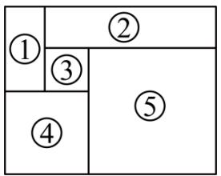

text_image

①
②
③
⑤
④

A. 只有甲正确

B. 甲和乙均正确

C. 乙和丙均正确

D. 只有丁正确

【答案】A

【分析】本题主要考查了整式加减的应用，正方形和矩形的性质，解题关键是通过设③的边长为a，④的边长为b，②的宽为x，求出各个图形的周长.

设③的边长为a，④的边长为b，②的宽为x，根据图形求出⑤的边长为 $a+b$ ，②的长为：

$a + a + b = 2a + b$ ，①的长为 $x + a$ ，宽为b - a，然后先求出②的周长，再分别算出①③④⑤的周长，最后通过计算①与③的周长和、①与⑤的周长和、③与④的周长和、⑤与①的周长差，与②的周长比较，再进行判断即可.

【详解】解：设③的边长为a，④的边长为b，②的宽为x，

∴ ⑤的边长为 $a + b$ ，②的长为： $a + a + b = 2a + b$ ，①的长为 $x + a$ ，宽为b - a，

∴ ②的周长为： $2(2a + b + x) = 4a + 2b + 2x$ ,

∵①的周长 = 2(x + a + b - a) = 2x + 2b，③的周长为4a，

∴①与③的周长和为： $4a + 2b + 2x$ ,

∴ 甲的说法正确;

∵①的周长 = 2(x + a + b - a) = 2x + 2b，⑤的周长为4(a + b) = 4a + 4b，

∴①与⑤的周长和为： $4a + 4b + 2x + 2b = 4a + 6b + 2x$

∴ 乙的说法错误;

∵③的周长 = 4a，④的周长 = 4b，

∴ ③与④的周长和为： $4a + 4b$ ，

∴ 丙的说法错误;

∵⑤的周长为 $4(a+b)=4a+4b$ ，①的周长= $2(x+a+b-a)=2x+2b$ ，

∴⑤与①的周长差为： $4a + 4b - 2x - 2b = 4a + 2b - 2x$

∴ 丁的说法错误;

综上可知：说法正确的只有甲，

故选：A.

【变式 13-1】（24-25 六年级上·山东烟台·期末）关于 x，y 的单项式，若 x 的指数与 y 的指数是相等的正整数，则称该单项式是“等次单项式”。给出下面四个结论：① $-5x^{3}y^{3}$ 是“等次单项式”；②“等次单项式”的次数可能是奇数；③两个次数相等的“等次单项式”的和一定是“等次单项式”；④若五个“等次单项式”的次数均不高于8，则它们中必有同类项。上述结论中，所有正确结论的序号是（）

A. ①②③

B. ①④

C. ①②④

D. ①③④

【答案】B

【分析】本题考查同类项，合并同类项，单项式的次数，根据新定义，结合同类项以及合并同类项的法则，逐一进行判断即可.

【详解】解： $-5x^{3}y^{3}$ 中 x 的指数与 y 的指数是相等的正整数，是“等次单项式”；故①正确；

“等次单项式”的次数必为偶数，不可能是奇数；故②错误；

两个次数相等的“等次单项式”的和不一定是“等次单项式”，可能为0，故③错误；

若五个“等次单项式”的次数均不高于8，则x，y的最大为4，则它们中必有同类项．故④正确；

故选 B.

【变式 13-2】有依次排列的两个整式: $x, x + 3$ , 对任意相邻的两个整式, 都用右边的整式减左边的整式, 将所得之差写在这两个整式之间, 可以得到一个新的整式串: $x, 3, x + 3$ , 这称为第一次操作; 将第一次操作后的整式串按上述方式再做一次操作, 可以得到第二次操作后的整式串; 以此类推. 通过下列实际操作,

①第二次操作后的整式串为：x,3-x,3,x,x+3;

②第二次操作后，当x<-3或x>3时，所有整式的积为正数；

③第四次操作后的整式串共有 19 个整式;

④第 2022 次操作后，所有整式之和为 $2x + 6069$ ；上述结论中，正确的是（）

A. ①②

B. ①③

C. ①④

D. ②④

【答案】C

【分析】根据运算新定义构造整式组，按照要求计算、寻找规律判断即可.

【详解】∵第一次操作后的整式串为： $x,3,x+3$ ，

∴第二次操作后的整式串为x,3-x,3,x+3-3,x+3,

即x,3-x,3,x,x+3,

故①的结论正确，符合题意；

第二次操作后整式的积为 $x \times (3 - x) \times 3 \times x \times (x + 3) = 3x^{2}(9 - x^{2})$ ,

$\because x<-3$ 或x>3，

$\therefore x^{2} > 9,$

即 $9-x^{2}<0$ ,

$$
\therefore 3 x ^ {2} \left(9 - x ^ {2}\right) <   0,
$$

即第二次操作后，当x<-3或x>3时，所有整式的积为负数，

故②的说法错误，不符合题意；

第三次操作后整式串为x,3-2x,3-x,x,3,x-3,x,3,x+3,

第四次操作后整式串为x,3-3x,3-2x,x,3-x,2x-3,x,3-x,3,x-6,x-3,3,x,3-x,3,x,x+3,

共 17 个，

故③的说法错误，不符合题意；

第一次操作后所有整式的和为 $x+3+x+3=2x+6=2x+3\times(1+1)$ ,

第二次操作后所有整式的和为 $x+3-x+3+x+x+3=2x+9=2x+3\times(2+1)$ ,

第三次操作后所有整式的和为:

$$
x + 3 - 2 x + 3 - x + x + 3 + x - 3 + x + 3 + x + 3 = 2 x + 1 2 = 2 x + 3 \times (3 + 1),
$$

...，

第 n 次操作后所有整式的和为 $2x + 3 \times (n + 1)$ ,

∴第 2022 次操作后，所有的整式的和为 $2x + 3 \times (2022 + 1) = 2x + 6069$ ,

故④的说法正确，符合题意；

正确的说法有①④，

故选：C.

【点睛】本题考查了整式加减中规律猜想，整式的加减，熟练掌握规律寻找的基本方向，正确进行整式的加减是解题的关键.

【变式 13-3】（24-25 七年级下·山东青岛·期末）有依次排列的 2 个整式： $x + y$ ，x - y.

将第 1 个整式乘以 2 再与第 2 个整式相加，得到第 3 个整式 $3x + y$ ，称为第一次操作；

将第 2 个整式乘以 2 再与第 3 个整式相加，得到第 4 个整式 5x-y，称为第二次操作；

将第 3 个整式乘以 2 再与第 4 个整式相加，得到第 5 个整式 $11x + y$ ，称为第三次操作，……，

以此类推，下列说法：

①第六次操作得到的整式为85x-y;  
②第 20 个整式中含 x 项的系数的 2 倍与第 21 个整式中含 x 项的系数之差为 1;  
③第 2025 个整式和第 2026 个整式中含 x 项的系数之和等于 $2^{2025}$ .

其中正确的有\_\_\_\_。

【答案】①③

【分析】本题主要考查了整式的加减计算，与多项式有关的规律探索，根据题意分别求出前8个整式的结果，可得规律当 $n$ 为奇数时，第 $n$ 个整式中含 $x$ 项的系数的2倍比第 $(n + 1)$ 个整式中含 $x$ 项的系数大1，当 $n$ 为偶数时，第 $n$ 个整式中含 $x$ 项的系数的2倍比第 $(n + 1)$ 个整式中含 $x$ 项的系数小1，且第 $n$ 个整式中含 $x$ 项的系数与第 $(n + 1)$ 个整式中含 $x$ 项的系数之和为 $2^{n}$ ，据此判断求解即可.

【详解】解：第1个整式为 $x + y$ ，

第 2 个整式为 x-y，

第 3 个整式为 $3x + y$ ,

第 4 个整式为 5x - y，

第 5 个整式为 $2(3x + y) + 5x - y = 6x + 2y + 5x - y = 11x + y$ ,

第 6 个整式为 $2(5x-y)+11x+y=10x-2y+11x+y=21x-y$ ,

第 7 个整式为 $2(11x + y) + 21x - y = 22x + 2y + 21x - y = 43x + y$ ,

第 8 个整式为 $2(21x-y)+43x+y=42x-2y+43x+y=85x-y$ ，故①正确；

……，

以此类推可知，当 n 为奇数时，第 n 个整式中含 x 项的系数的 2 倍比第 $(n+1)$ 个整式中含 x 项的系数大 1，当 n 为偶数时，第 n 个整式中含 x 项的系数的 2 倍比第 $(n+1)$ 个整式中含 x 项的系数小 1，且第 n 个整式中含 x 项的系数与第 $(n+1)$ 个整数中含 x 项的系数之和为 $2^{n}$ ，

∴第20个整式中含x项的系数的2倍与第21个整式中含x项的系数之差为-1，第2025个整式和第2026个整式中含x项的系数之和等于 $2^{2025}$ ，故②错误，③正确；

故答案为: ①③.

# 【题型 14 整式加减的实际应用】

【例 14】（24-25 七年级上·江苏南通·阶段练习）我市某小区居民使用自来水 2024 年标准缴费如下（水费按月缴纳）：

<table><tr><td>用户月用水量</td><td>单价</td></tr><tr><td>不超过12立方米的部分</td><td>a元/立方米</td></tr><tr><td>超过12立方米但不超过20立方米的部分</td><td>1.5a元/立方米</td></tr><tr><td>超过20立方米的部分</td><td>2a元/立方米</td></tr></table>

(1)某户4月份用了15立方米的水，求该户4月份应缴纳的水费；（用含a的式子表示）

(2)设某户月用水量为n立方米，当a = 2.5时，若该用户缴纳水费110元，则该用户这个月的用水量是多少立方米（列方程求解）？

(3)当 $a = 2$ 时, 甲、乙两户一个月共用水 32 立方米, 已知甲户缴纳的水费超过了 24 元, 设甲户这个月用水 $x$ 立方米, 试求甲, 乙两户一个月共缴纳的水费 (可用含 $x$ 的式子表示)

【答案】(1)16.5a元;

(2)30 立方米

(3)当12<x<20时，甲乙共缴纳72元；当20<x<32时，甲乙共缴纳(2x+32)元

【分析】本题考查了整式加减的应用，一元一次方程的生活实际应用，正确理解分段的界点是解题的关键.

(1) 根据缴费标准解答即可求解:  
(2) 设该用户这个月的用水量是 $m$ 立方米, 根据题意可得 $m > 20$ , 然后列出方程, 即可求解:  
（3）分两种情况：当 $12 < x \leq 20$ 时，当 $20 < x \leq 32$ 时，根据题意，列出代数式，即可求解.

【详解】（1）解： $12a + (15 - 12) \times 1.5a = 16.5a$ 元，

即该户4月份应缴纳的水费为16.5a元；

(2) 解: 设该用户这个月的用水量是 $m$ 立方米,

$$
\begin{array}{l} \because 2. 5 \times 1 2 = 3 0 <   1 1 0, \text {且} 3 0 + (2 0 - 1 2) \times 1. 5 \times 2. 5 = 6 0 <   1 1 0, \\ \therefore m > 2 0, \\ \end{array}
$$

根据题意得： $60 + 2 \times 2.5(m - 20) = 110$

解得：m=30.

答：该用户这个月的用水量是30立方米；

(3) 解: 当a=2时, 且 $12\times2=24$ 元,

根据题意，得甲户缴纳的水费超过了24元，

设甲户这个月用水x立方米，则x>12，

当 $12 < x \leq 20$ 时，甲户用水量超过 $12 \mathrm{~m}^{3}$ 但不超过 $20 \mathrm{~m}^{3}$ ，乙户用水量不少于 $12 \mathrm{~m}^{3}$ 但少于 $20 \mathrm{~m}^{3}$ ，所以甲、乙两用户一个月共缴纳的水费为：

$$
\begin{array}{l} [ 1 2 \times 2 + (x - 1 2) \times 1. 5 \times 2 ] + [ 1 2 \times 2 + (3 2 - x - 1 2) \times 1. 5 \times 2 ] \\ = (2 4 + 3 x - 3 6) + (2 4 + 6 0 - 3 x) \\ = 7 2 \text {元}; \\ \end{array}
$$

当 $20 < x \leq 32$ 时，甲的用水量超过 $20 \mathrm{~m}^{3}$ ，乙的用水量不超过 $12 \mathrm{~m}^{3}$ ，

所以甲、乙两用户一个月共缴纳的水费为:

$$
\begin{array}{l} [ 1 2 \times 2 + (2 0 - 1 2) \times 1. 5 \times 2 + (x - 2 0) \times 2 \times 2 ] + (3 2 - x) \times 2 \\ = (2 4 + 2 4 + 4 x - 8 0) + (6 4 - 2 x) \\ = (2 x + 3 2) \text {元}, \\ \end{array}
$$

综上所述，当 $12 < x \leq 20$ 时，甲乙共缴纳72元；当 $20 < x \leq 32$ 时，甲乙共缴纳 $(2x + 32)$ 元.

【变式 14-1】（25-26 七年级上·全国·随堂练习）某地居民的生活用水收费标准为：每月用水量不超过15 m³，每立方米 a 元；超过部分每立方米(a+2)元．若该地区某家庭上月用水量为20m³，则应缴水费多少元？

【答案】应缴水费 $(20a+10)$ 元

【分析】本题考查整式加减的实际应用，根据收费标准，列出代数式，进行计算即可.

【详解】解： $15a+(20-15)(a+2)=15a+5a+10=20a+10$ （元），

答：应缴水费 $(20a+10)$ 元.

【变式 14-2】（24-25 七年级上·广东韶关·阶段练习）项目式学习.

【主题】剪纸.

【素材】一张边长为a的正方形纸片、剪刀等.

【操作】从一个边长为a的正方形纸片（如图1）上剪去两个相同的小长方形，得到一个美术字“5”的图案（如图2），再将剪下的两个小长方形拼成一个新长方形（如图3）.

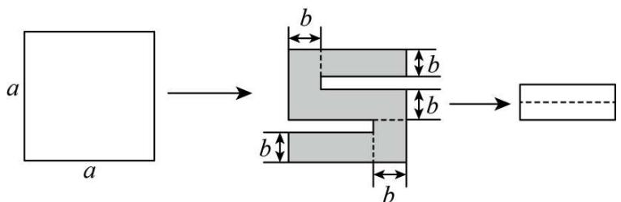

text_image

a
a
b
b
b
b
b

图1  
图2  
图3

【探究】

(1)求新长方形的周长（用含有a，b的代数式表示）；  
(2)求美术字“5”的图案的周长（用含有a，b的代数式表示）；  
(3)若a=8，剪去的小长方形的宽为1，求新长方形的周长和美术字“5”的图案的周长.

【答案】(1)4a-8b

(2)8a-4b

(3)新长方形的周长为16，美术字“5”的图案的周长56

【分析】本题考查了整式运算的应用，熟练掌握列代数式和代数式的求值是解题的关键，注意数形结合思

想的应用.

(1) 根据图 1 和图 2 得出: 新长方形的长为 $a - b$ , 宽为 $a - 3b$ , 然后再进行计算.  
（2）根据图形，列式计算即可；  
（3）根据小长方形的宽为 1，可知新长方形的宽为 2，所以 a-3b=2，再把 a=8 代入求出 b，然后代入  
(1) (2) 所求的周长代数式, 计算即可.

【详解】（1）解：∵新长方形的长为a-b，宽为a-3b，

∴新长方形的周长 = 2[(a-b)+(a-3b)] = 4a-8b;

(2) 解: 美术字“5”的图案的周长为: $4a + 4(a - b) = 8a - 4b$ ;

(3) 解: $\because$ 小长方形的宽为 1, 可知新长方形的宽为 2,

$$
\therefore a - 3 b = 2,
$$

∵a=8，则8-3b=2，

$$
\therefore b = 2,
$$

由（1）可得：新长方形的周长 = 4a - 8b = 4 × 8 - 8 × 2 = 16，

由（2）可得：美术字“5”的图案的周长 = 8a - 4b = 8 × 8 - 4 × 2 = 56.

【变式 14-3】（24-25 七年级上·福建莆田·期末）在小学，我们知道像 12，27，36，45，108，...这样的自然数能被 3 整除．一般地，如果一个自然数所有数位上的数字之和能被 3 整除，那么这个自然数就能被 3 整除．事实上，我们可以证明这个结论的正确性.

以两位数为例，若一个两位数的十位、个位上的数字分别为 $a, b$ ，则通常记这个两位数为 $\overline{ab}$ ，于是 $\overline{ab} = 10a + b = 9a + (a + b)$ ，显然， $9a$ 能被3整除，因此，若 $a + b$ 能被3整除，那么 $9a + (a + b)$ ，就能被3整除，即 $\overline{ab}$ 能被3整除。

根据上述材料，解答下列问题：

(1)下列各数中，能被3整除的有\_\_\_\_（填序号）

①25; ②225; ③1025.

(2)用含a、b、c的代数式表示三位数 $\overline{abc}=$ \_\_\_\_（其中a是百位数，b是十位数，c是个位数）；

(3)类比上述的过程，尝试说明：如果一个三位数 $\overline{abc}$ 的所有数位之和能被9整除，那么这个三位数就能被9整除.

【答案】(1)②

(2) $100a + 10b + c$

(3)见解析

【分析】本题考查列代数式以及数的整除，整式加减的应用．熟练掌握相关知识点是解题的关键；

（1）计算各数位上的数字之和，若能被3整除，则该数就能被3整除，据此逐个判断即可；  
（2）根据已知条件可得 $\overline{abc}=100a+10b+c;$   
（3） $\overline{abc}=100a+10b+c=9(11a+b)+(a+b+c)$ ，根据已知条件按照材料的方法即可证明.

【详解】（1）∵2+5=7，7不能被3整除，

∴ 25 不能被 3 整除;

∵ $2 + 2 + 5 = 9$ ，9 能被 3 整除，

∴ 225 能被 3 整除;

∵ $1 + 0 + 2 + 5 = 8$ ，8 不能被 3 整除，

∴ 1025 不能被 3 整除;

故能被 3 整除的有 225.

(2) $\overline{abc} = 100a + 10b + c.$   
(3) $\overline{abc}=100a+10b+c=9(11a+b)+(a+b+c)$ ,

∵ $9(11a + b)$ 能被 3 整除，

若 $a+b+c$ 能被3整除，则 $9(11a+b)+(a+b+c)$ 能被3整除，即 $\overline{abc}$ 能被3整除，

∴ 如果一个三位数 $\overline{abc}$ 的所有数位之和能被 9 整除，那么这个三位数就能被 9 整除.

# 【题型15 与绝对值有关的化简】

【例 15】（24-25 七年级下·重庆·开学考试）x 是有理数， $|x-5|+|x-7|+|x+6|+|x-9|$ 的最小值是 \_\_\_\_.

【答案】17

【分析】本题考查了绝对值的几何意义，整式的加减运算，借助数轴用几何方法化简含有绝对值的式子，熟练掌握绝对值的几何意义是解题的关键．．

利用绝对值的几何意义，即求一个数到点-6，5，7，9的距离的最小值.

【详解】解：设此数为 $x$

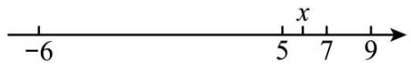

依题意， $|x-5|+|x-7|+|x+6|+|x-9|$ 表示数 x 的点到表示数 -6, 5, 7, 9 的点的距离总和最小，
∴由数轴可得，当 $5\leq x\leq7$ ，取得最小值，

$$
\therefore | x - 5 | + | x - 7 | + | x + 6 | + | x - 9 | = x - 5 + 7 - x + x + 6 + 9 - x = 1 7,
$$

故答案为：17.

【变式 15-1】（24-25 七年级上·全国·期末）已知a, b, c在数轴上的位置如图所示，所对应的点分别为A, B, C. 化简： $|a + b|-2|c - b|-|c - a| =$ \_\_\_\_.

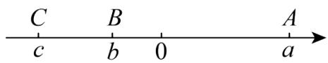

text_image

C B A
c b 0 a

【答案】3c-b/b-3c

【分析】本题考查的是整式的加减，熟知整式的加减实质上是合并同类项是解答此题的关键.

先根据各点在数轴上的位置判断出各点的符号及绝对值的大小，再去绝对值符号，合并同类项即可.

【详解】解：∵由图可知，c < b < 0 < a，且 $|a| > |b|$ ，

$$
\begin{array}{l} \therefore a + b > 0, c - b <   0, c - a <   0, \\ \therefore | a + b | - 2 | c - b | - | c - a | \\ = a + b + 2 (c - b) + c - a \\ = a + b + 2 c - 2 b + c - a \\ = 3 c - b, \\ \end{array}
$$

故答案为：3c-b.

【变式 15-2】（24-25 七年级上·北京·期中）1. 已知，有理数 $a$ 、 $b$ 、 $c$ 在数轴上的位置如图所示，

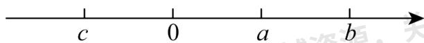

（1）化简： $|3a+b|-|c-2a|+|c+2b|=$ \_\_\_\_；

（2）若a,c两数的倒数是他们自身，当x的范围是\_\_\_\_时， $|x-a|+|x-c|$ 有最小值，最小值为\_\_\_\_。

(3) 在 (2) 的条件下, 若未知数 $x$ 、 $y$ 满足 $\left(|x - a| + |x - 3|\right)\left(|y - 2| + |y - c|\right) = 6$ , 则代数式 $x + 2y$ 的最大值是 \_\_\_\_.

【答案】 $a + 3b + 2c$ $-1\leq x\leq 1$ 27

【分析】本题考查化简绝对值，两点间的距离，整式的加减运算，根据数轴判断数的大小，式子的符号，掌握绝对值的意义，是解题的关键.

【详解】解：（1）由图可知：c < 0 < a < b， $|c| < b$ ，

$$
\therefore 3 a + b > 0, c - 2 a <   0, c + 2 b > 0,
$$

∴原式 = 3a + b - 2a + c + c + 2b = a + 3b + 2c;

故答案为： $a + 3b + 2c;$

(2) $\because a,c$ 两数的倒数是他们自身，

$$
\therefore a = 1, c = - 1,
$$

$\because|x-a|+|x-c|=|x-1|+|x-(-1)|$ 表示数轴上表示x的数到表示1和-1的数的距离和，

∴当 $-1 \leq x \leq 1$ 时， $|x-a| + |x-c|$ 有最小值为： $1-(-1) = 2$ ;

故答案为： $-1 \leq x \leq 1; 2;$

（3）由（2）知：当 $1 \leq x \leq 3$ 时， $|x - a| + |x - 3|$ 有最小值为 $3 - 1 = 2$

当 $-1 \leq y \leq 2$ 时， $|y-2| + |y-c|$ 有最小值为 $2-(-1) = 3$ ，

$$
\because (| x - a | + | x - 3 |) (| y - 2 | + | y - c |) = 6,
$$

$$
\therefore | x - a | + | x - 3 | = 2, \quad | y - 2 | + | y - c | = 3,
$$

∴x的最大值为3，y的最大值为2，

∴ $x+2y$ 的最大值为： $3+2\times2=7$ ;

故答案为：7.

【变式 15-3】（24-25 七年级上·安徽滁州·期中）有理数 a，b，c 在数轴上对应的点的位置如图所示，下列结论：① abc > 0；② a - b + c < 0；③ $\frac{|a|}{a} + \frac{|b|}{b} + \frac{|c|}{c} = -1$ ；④ $|a + b| - |b - c| + |a - c| = -2c$ 其中正确结论的个数是（）

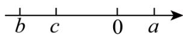

A. 4 个

B. 3 个

C. 2 个

D. 1 个

【答案】B

【分析】本题考查了利用数轴进行的相关计算，数形结合并明确绝对值等的化简法则，是解题的关键．先由数轴观察得出 $b < c < 0 < a, |b| > |c| > |a|$ ，据此逐项计算验证即可.

【详解】解：∵由数轴可得：b<c<0<a,|b|>|c|>|a|,

∴ abc > 0，①正确；

$a-b+c>0,$ ②错误;

$\frac{|a|}{a}+\frac{b}{|b|}+\frac{|c|}{c}=1-1-1=-1,$ ③正确；

$$
\vert a + b \vert - \vert b - c \vert + a - c \vert = - a - b - (c - b) + a - c
$$

$$
= - a - b - c + b + a - c
$$

$$
= - 2 c,
$$

④正确；

综上，正确的个数为3个.

故选：B.

# 【题型 16 探索与表达规律（数字变化类）】

【例 16】在“点燃我的梦想，数学皆有可衡”数学创新设计活动中，“智多星”小强设计了一个数学探究活动：对依次排列的两个整式 m，n 按如下规律进行操作：

第 1 次操作后得到整式中 m, n, n-m;

第 2 次操作后得到整式中 m, n, n-m, -m;

第 3 次操作后...

其操作规则为：每次操作增加的项，都是用上一次操作得到的最末项减去其前一项的差，小强将这个活动命名为“回头差”游戏.

则该“回头差”游戏第 2023 次操作后得到的整式中各项之和是（）

A. $m + n$

B. m

C. n-m

D. 2n

【答案】D

【分析】先逐步分析前面 5 次操作，可得整式串每四次一循环，再求解第四次操作后所有的整式之和为： $m + n + n - m - m - n - n + m = 0$ ，结合 $2023 \div 4 = 505 \cdots 3$ ，从而可得答案.

【详解】解：第1次操作后得到整式串 m，n，n-m；

第 2 次操作后得到整式串 m, n, n-m, -m;

第 3 次操作后得到整式串 m, n, n-m, -m, -n;

第 4 次操作后得到整式串 m, n, n-m, -m, -n, -n+m;

第 5 次操作后得到整式串 m, n, n-m, -m, -n, -n+m, m;

...

归纳可得：以上整式串每六次一循环，

$$
\because 2 0 2 3 \div 6 = 3 3 7 \dots 1,
$$

∴第 2023 次操作后得到的整式中各项之和与第 1 次操作后得到整式串之和相等，

∴这个和为 $m+n+n-m=2n$ ,

故选 D

【点睛】本题考查的是整式的加减运算，代数式的规律探究，掌握探究的方法，并总结概括规律并灵活运用是解本题的关键.

【变式 16-1】（24-25 七年级上·福建三明·期中）有一列按规律排列的代数式：b，2b-a，3b-2a，4b-3a，5b-4a，……相邻两个代数式的差都是同一个整式，若第 4 个代数式的值为 8，则前 7 个代数式的和为（）

A. 28

B. 56

C. 84

D. 112

【答案】B

【分析】本题考查了整式加减的应用，理解题意，找到规律正确列出算式是解题的关键．由题意得，相邻两个代数式的差都是b-a，先计算出前7个代数式的和，根据第4个代数式的值为8可得 $4b-3a=8$ ，再整体代入求值即可解答.

【详解】解：由题意得，相邻两个代数式的差都是 $(2b-a)-b=b-a$ ，

∴ 前 7 个代数式为： $b, b + (b - a), b + 2(b - a), b + 3(b - a), b + 4(b - a), b + 5(b - a), b + 6(b - a)$ ,

∴ 前 7 个代数式的和 = $7 \times b + (1 + 2 + 3 + 4 + 5 + 6) \times (b - a) = 28b - 21a$ ,

∵ 第 4 个代数式的值为 8,

$$
\therefore 4 b - 3 a = 8,
$$

$$
\therefore 2 8 b - 2 1 a = 7 (4 b - 3 a) = 7 \times 8 = 5 6,
$$

∴ 前 7 个代数式的和为 56.

故选：B.

【变式 16-2】借助符号，数学语言变得简洁明了．例如可用代数式 $\frac{d^{2}}{5}-\frac{c^{3}}{2}+\frac{a^{2}b^{2}}{27}$ 来表示“ $\frac{五}{丁}$ 丁 $\frac{二}{丙}$ 丁 $\frac{二七}{甲}$ 乙”（题目选自1905年清朝学堂课本）．观察其中的规律，将“ $\frac{六}{四乙}$ 丁 $\frac{三}{甲}$ 丁 $\frac{三}{乙}$ ”化简后得（）

A. $-\frac{a^{2}}{2}+b^{2}$

B. $\frac{a^{2}}{2}+b^{2}$

C. $-\frac{a^{2}}{2}+\frac{b^{2}}{3}$

D. $\frac{a^{2}}{2}+\frac{b^{2}}{3}$

【答案】D

【分析】本题考查了列代数式，整式的加减，理解题意是解题的关键．根据给定的例题，列代数式即可.

【详解】解：根据题意，可知“ $\frac{六}{四乙}$ ⊥ $\frac{二}{甲}$ ⊥ $\frac{三}{乙}$ ”表示为 $\frac{4b^{2}}{6}+\frac{a^{2}}{2}-\frac{b^{2}}{3}$ ，

化简得： $\frac{a^{2}}{2}+\frac{b^{2}}{3}$ ,

故选：D.

【变式 16-3】（2025·河北邯郸·三模）嘉嘉和淇淇对 5 个正整数进行规律探究，嘉嘉写出三个连续偶数： $a_{1}, a_{2}, a_{3} (a_{1} < a_{2} < a_{3})$ ，淇祺写出两个连续奇数： $a_{4}, a_{5} (a_{4} < a_{5})$ ，若 $a_{1} + a_{2} + a_{3} = a_{4} + a_{5}$ ，则 $\frac{1}{3} (2a_{1} + a_{3} + a_{4}) + \frac{1}{2} (a_{2} + 2a_{5})$ 的值一定能（）

A. 被 6 整除

B. 被 7 整除

C. 被 8 整除

D. 被 9 整除

【答案】B

【分析】本题考查的是整式的加减运算的应用，将三个连续偶数和两个连续奇数用代数式表示，利用已知条件建立方程，化简目标表达式，结合奇偶性分析得出结果.

【详解】解：∵三个连续偶数： $a_{1},a_{2},a_{3}(a_{1}<a_{2}<a_{3})$ ，两个连续奇数： $a_{4},a_{5}(a_{4}<a_{5})$

则 $a_2 = a_1 + 2, a_3 = a_1 + 4, a_5 = a_4 + 2,$

$$
\therefore a _ {1} + a _ {1} + 2 + a _ {1} + 4 = a _ {4} + a _ {4} + 2,
$$

$$
\therefore 3 a _ {1} + 6 = 2 a _ {4} + 2,
$$

$$
\therefore a _ {4} = \frac {1}{2} (3 a _ {1} + 4),
$$

$$
\begin{array}{l} \therefore \frac {1}{3} (2 a _ {1} + a _ {3} + a _ {4}) + \frac {1}{2} (a _ {2} + 2 a _ {5}) \\ = \frac {1}{3} \left(2 a _ {1} + a _ {1} + 4 + \frac {3}{2} a _ {1} + 2\right) + \frac {1}{2} \left(a _ {1} + 2 + 2 a _ {4} + 4\right) \\ = \frac {1}{3} \left(\frac {9}{2} a _ {1} + 6\right) + \frac {1}{2} \left(a _ {1} + 2 + 3 a _ {1} + 4 + 4\right) \\ = \frac {3}{2} a _ {1} + 2 + 2 a _ {1} + 5 \\ = \frac {7}{2} a _ {1} + 7, \\ \end{array}
$$

设 $a_{1}=2k,\quad a_{4}=\frac{1}{2}(3a_{1}+4)=3k+2$ 为奇数，则k为正奇数，

$$
\therefore \frac {7}{2} a _ {1} + 7 = 7 k + 7 = 7 (k + 1),
$$

$\therefore \frac{1}{3} (2a_{1} + a_{3} + a_{4}) + \frac{1}{2} (a_{2} + 2a_{5})$ 的值一定能被7整除，

故选：B

# 【题型 17 探索与表达规律（图形变化类）】

【例 17】（24-25 七年级上·全国·单元测试）如图，每个图案均由边长相等的黑、白两色正方形按规律拼接而成，照此规律，第 n 个图案中白色正方形比黑色正方形多\_\_\_\_个（用含 n 的式子表示）.

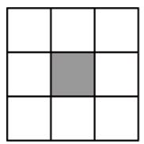  
第1个

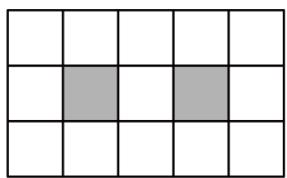

natural_image

Grid pattern with two shaded cells (no text or symbols)

第2个

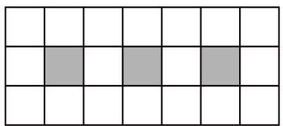

natural_image

Grid pattern with two shaded cells in the center (no text or symbols)

第3个

【答案】 $(4n + 3)$

【分析】本题考查了图形类规律，正确计算已知图形中色正方形比黑色正反向多的个数并得到规律是解题的关键．利用给出的三个图形寻找规律，发现白色正方形个数=总的正方形个数-黑色正方形个数，而黑色正方形个数第1个为1，第二个为2，由此寻找规律，总个数只要找到边与黑色正方形个数之间关系即可，依此类推，寻找规律.

【详解】解：第1个图形黑、白两色正方形共 $3 \times 3$ 个，其中黑色1个，白色 $(3 \times 3 - 1)$ 个，

第 2 个图形黑、白两色正方形共 $3 \times 5$ 个，其中黑色 2 个，白色 $(3 \times 5 - 2)$ 个，

第 3 个图形黑、白两色正方形共 $3 \times 7$ 个，其中黑色 3 个，白色 $(3 \times 7 - 3)$ 个，

依此类推，

第 n 个图形黑、白两色正方形共 $3(2n+1)$ 个，其中黑色 n 个，白色 $3(2n+1)-n=(5n+3)$ 个，

∴第 n 个图案中白色正方形比黑色正方形多 $5n + 3 - n = (4n + 3)$ 个，

故答案为: $(4n+3)$ .

【变式 17-1】已知，如图，我们可以用长度相同的火柴棒按一定规律拼搭正多边形组成图案，图案①需8根火柴棒，图案②需15根火柴棒，…，按此规律，搭建第n个图案需要\_\_\_\_根火柴棒，搭建第2020个图案需要\_\_\_\_根火柴棒.

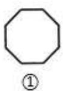

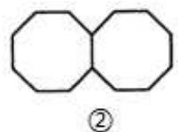

chemical

Simple molecular structure diagram with three fused octahedra, labeled with circled number ③

......

【答案】 $7n + 1$ 14141

【分析】根据图形和数字规律、合并同类项的性质，计算得第 n 个图案的火柴棒数量，再根据代数式的性质计算，即可得到答案.

【详解】根据题意，第1个图案的火柴棒有： $8 \times 1 + 0 = 8$ 根

第 2 个图案的火柴棒有: $8 \times 2 + 1 = 8$ 根

第 3 个图案的火柴棒有: $8 \times 3 + 2 = 8$ 根

...

第 n 个图案的火柴棒有： $\left[8 \times n + (n-1)\right]$ 根，即 $7n + 1$ 根

∴第 2020 个图案的火柴棒有： $7 \times 2020 + 1 = 14141$ 根

故答案为： $7n + 1$ ，14141.

【点睛】本题考查了数字和图形规律、合并同类项、代数式的知识；解题的关键是熟练掌握数字和图形规律的性质，从而完成求解.

【变式 17-2】（24-25 七年级上·河北唐山·阶段练习）按如图所示的规律搭正方形：搭一个小正方形需要 4 根小棒，搭两个小正方形需要 7 根小棒，则搭 2024 个这样的小正方形需要小棒（）

A. 6071 根

B. 6072 根

C. 6073 根

D. 6074 根

【答案】C

【分析】本题考查了规律型：图形的变化．解题的关键是发现各个正方形的联系，找出其中的规律.

通过归纳与总结得出规律：正方形每增加 1，火柴棒的个数增加 3，由此求出第 $n$ 个图形时需要火柴的根数的代数式，然后代入求值即可.

【详解】解：搭2个正方形需要 $4+3\times1=7$ 根火柴棒；

搭 3 个正方形需要 $4 + 3 \times 2 = 10$ 根火柴棒；

…，

搭n个这样的正方形需要 $4+3(n-1)=(3n+1)$ 根火柴棒，

搭 2024 个这样的正方形需要 $3 \times 2024 + 1 = 6073$ 根火柴棒.

故选：C.

【变式 17-3】（24-25 七年级下·陕西西安·开学考试）如图是由大小相同的★组成的图形，第①个图形中有 4 个★，第②个图形中有 7 个★，第③个图形中有 10 个★，第④个图形中有 13 个★，…，按此规律摆下去，第 89 个图形中共有多少个★？（）

text_image

①
A. 265
②
B. 266
③
C. 267
④
D. 268
...

【答案】D

【分析】此题主要考查了图形的变化规律．仔细观察图形的变化，找到规律，利用规律求解.

【详解】解：第①个图形中有 $3 \times 2 - 2 = 4$ 个★，

第②个图形中有 $3 \times 3 - 2 = 7$ 个★，

第③个图形中有 $3 \times 4 - 2 = 10$ 个★，

第④个图形中有 $3 \times 5 - 2 = 13$ 个★，

第 n 个图形中共有 $3 \times (n + 1) - 2 = (3n + 1)$ 个 ★.

当n=89时， $3\times89+1=268$ ，

故选：D.

教辅资源，关注公众号★全科AA+