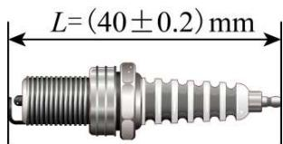
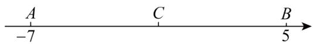
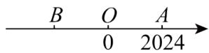
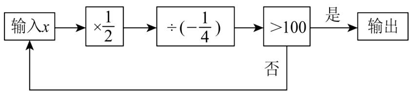
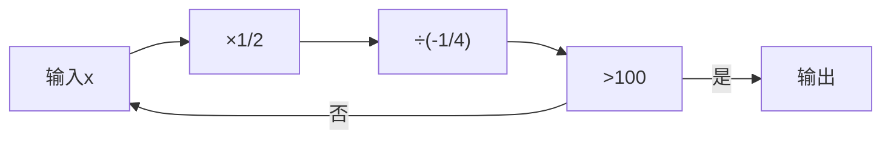
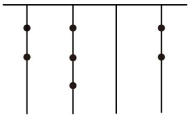

# 第二章 有理数及其运算·培优卷

# 【北师大版 2024】

考试时间：120 分钟 满分：120 分

姓名：\_\_\_\_ 班级：\_\_\_\_ 考号：\_\_\_\_

考卷信息：教辅资源，关注公众号★全科AA+

本卷试题共 24 题，单选 10 题，填空 6 题，解答 8 题，满分 120 分，限时 120 分钟，本卷题型针对性较高，覆盖面广，选题有深度，可衡量学生掌握本章内容的具体情况！

# 第I卷

# 一．选择题（共10小题，满分30分，每小题3分）

1. （3 分）（24-25 七年级下·河北秦皇岛·期末）第 33 届夏季奥林匹克运动会于 2024 年 7 月 26 日至 8 月 11 日在法国巴黎举行．据中国视听大数据（CVB）统计，在此期间，全国卫视共播出近 5000 期奥运相关节目，累计观看人次达 159.9 亿，将 159.9 亿用科学记数法表示为（）

A. $0.1599 \times 10^{11}$

B. $1.599 \times 10^{10}$

C. $1.599 \times 10^{9}$

D. $15.99 \times 10^{9}$

2. （3 分）（2025·吉林松原·模拟预测）若 $(-3)\times\square$ 的运算结果为正数，则□内的数字可以为（）

A. -1

B. 0

C. 1

D. 2

3. （3 分）（2021·河北石家庄·一模）若 $a$ 为整数，则 $(a^2)^3$ 表示的是（）

A. 3 个 $a^{2}$ 相乘

B. 2 个 $a^3$ 相加

C. 3 个 $a^{2}$ 相加

D. 5个 $a$ 相乘

4. （3 分）（2025·山西晋城·三模）如图，这是某机器零件的设计图纸。下列长度（L）的零件合格的是（）

text_image

L=(40±0.2)mm

A. $39.2 \mathrm{~mm}$

B. 39.6mm

C. 39.9mm

D. 40.5mm

5. （3 分）（2025·吉林长春·二模）把 $-2-(+3)-(-4)$ 写成省略加号的和的形式，正确的是（）

A. $-2 + 3 + 4$

B. $-2 - 3 + 4$

C. -2-3-4

D. $-2+3-4$

6. （3 分）（24-25 七年级上·山西太原·阶段练习）李双、李见是一对爱学习、进取心强的姐妹，学完第一章《有理数》后，李双对李见说：“a 是最小的正整数，b 是最大的负整数，c 是绝对值最小的数，d 是倒数等于自身的有理数，你说 $a-b+c-d$ 等于多少？”李见脱口答出正确答案，聪明的你知道答案是多少吗？（）

A. 1

B. 3

C. 1 或 3

D. 2 或 -1

7. （3 分）（23-24 七年级下·北京·阶段练习）以下的运算的结果中，最大的一个数是（）

A. $-13579 + 0.2468$

B. $-13579+\frac{1}{2468}$

C. $(-13579)\times\frac{1}{2468}$

D. $(-13579)\div\frac{1}{2468}$

8. （3 分）（2025·河北邯郸·二模）如图，数轴上有三个点 $A, B, C$ ，其中 $C$ 是线段 $AB$ 的中点，则原点 $O$ 的位置（）

text_image

A
-7
C
B
5

A. 位于线段 $AC$ 上，且靠近 $A$ 点

B. 位于线段 $AC$ 上，且靠近 $C$ 点

C. 位于线段 $BC$ 上，且靠近 $B$ 点

D. 位于线段 $BC$ 上，且靠近 $C$ 点

9. （3 分）（24-25 七年级下·云南文山·期末）中国古代著作《九章算术》在世界数学史上首次正式引入负数，如果将“收入100元记作+100元”，那么“支出80元”应记作（）

A. +80元

B. -80元

C. +100元

D. -100元

10. （3 分）（2025·河北邯郸·二模）|-3|与-(-3)的关系是（）

A. 相等

B. 互为相反数

C. 互为倒数

D. 积为-9

# 二．填空题（共6小题，满分18分，每小题3分）

11. （3 分）（2025·云南楚雄·模拟预测）如图，已知数轴上点A表示的数是 2024，且OA=OB，则点B表示的数是 \_\_\_\_.

教辅资源，关注公众号★全科AA+

12. （3 分）（2025·湖北十堰·三模）珠穆朗玛峰海拔约 8849 米，吐鲁番盆地最低处海拔约为 -155 米，两地的相对高度（即山峰最高处比盆地最低处高）是\_\_\_\_米。  
13. （3 分）（24-25 七年级上·山东威海·期末）如图，按程序框图中的顺序计算，当输入的初始值 x 为 32 时，则输出的最后结果为 \_\_\_\_.

flowchart

14. （3 分）（2025·四川资阳·模拟预测）在 $-2^{2}, |-4|, (-1)^{2011}, \pi, \frac{5}{11}, -(-13)^{3}, 3.1415, 0$ ，数中，其中整数有 m 个，非负数有 n 个，即 m-n= \_\_\_\_.  
15. （3 分）（2025·江西吉安·一模）如下表所示，算筹是我国古代的计算工具之一，摆法有纵式和横式两种，横式和纵式都可以表示同一个数，古人在个位数上划上斜线以表示负数。如“ $\pi = \pi$ ”表示-723，

则“T ≡ ￥”所表示的数是\_\_\_\_。

<table><tr><td>纵式</td><td>I</td><td>II</td><td>III</td><td>III</td><td>IIII</td><td>T</td><td> $\Pi$ </td><td> $\Pi\Pi$ </td><td> $\Pi\Pi\Pi$ </td></tr><tr><td>横式</td><td>-</td><td>=</td><td>≡</td><td>≡</td><td>≡</td><td>⊥</td><td>⊥</td><td>⊥</td><td>⊥</td></tr><tr><td></td><td>1</td><td>2</td><td>3</td><td>4</td><td>5</td><td>6</td><td>7</td><td>8</td><td>9</td></tr></table>

16. （3 分）（24-25 七年级上·江苏常州·期末）如图，图书馆、小明家、社区服务中心和超市在同一条笔直的马路上。若小明家位于图书馆和超市连线段上靠近图书馆的三等分点处，则社区服务中心和超市的距离为 \_\_\_\_ m.

text_image

图书馆
小明家
社区服务中心
超市
320m
200m

教辅资源，关注公众号 ★全科AA+

# 第II卷

# 三．解答题（共8小题，满分72分）

17. （6 分）（24-25 七年级上·湖北恩施·阶段练习）计算：

(1) $(-8)+10+2+(-1)$ ;

(2) $-(-2^{2})+(-2)^{3}\times5-(-28)\div4$

18. （6 分）（23-24 七年级上·江苏扬州·阶段练习）已知 $x^{2}=64$ ， $|y|=9$ ，

(1)求 $x$ 和 $y$ 的值；

(2)若x>y，求x-y的值.

19. （8分）（24-25六年级上·山东威海·期末）数学老师布置了一道思考题“计算： $\left(-\frac{1}{12}\right)\div\left(\frac{1}{3}-\frac{5}{6}\right)$ ”，小明用了一种不同的方法解决了这个问题，他认为原式的倒数为 $\left(\frac{1}{3}-\frac{5}{6}\right)\div\left(-\frac{1}{12}\right)=\left(\frac{1}{3}-\frac{5}{6}\right)\times(-12)=-4+10=6$ ，所以 $\left(-\frac{1}{12}\right)\div\left(\frac{1}{3}-\frac{5}{6}\right)=\frac{1}{6}$ .

请你运用小明的解法计算： $\left(-\frac{1}{30}\right)\div\left(\frac{1}{5}+\frac{1}{3}-\frac{1}{15}\right)$ .

20. （8 分）（24-25 七年级上·江苏泰州·阶段练习）对有理数 a、b 定义运算\*如下： $a*b=(a+2)(b-3)$ .

(1)计算 $4*(-3)=$ \_\_\_\_；

(2)求 $-5*[(-2)*6]$ 的值.

21. （10 分）（22-23 七年级上·江苏无锡·阶段练习）如图，小明有5张写着不同的数字的卡片，请你按要求取出卡片，完成下列问题：

-3

-5

+2

+3

+4

(1)从中取出2张卡片，使这2张卡片上数字乘积最大，最大值是\_；  
(2)从中取出2张卡片，使这2张卡片上数字相除的商最小，最小值是\_；  
(3)从中取出4张卡片，用学过的运算方法，写出一个运算式使结果为24.

22. （10 分）（24-25 七年级上·江苏泰州·阶段练习）某粮库 6 天内的粮食进出库的吨数为:

+23, -32, -15, +34, -36, -20. 问：

(1)经过这6天，库里的粮食是增多了多少？还是减少了多少？  
(2)经过这6天，仓库管理员发现库里还存有520吨粮食，那么6天前库里存粮多少吨？  
(3)如果进出的装卸费都是每吨5元，那么这6天需要多少装卸费？

23. （12 分）（23-24 七年级上·山东潍坊·期中）十进制是用0～9这十个数字来表示数，满十进一，例： $212=2\times10^{2}+1\times10+2$ ；计算机常用二进制来表示字符代码，它是用0和1两个数来表示数，满二进一，例：二进制数10000转化为十进制数： $1\times2^{4}+0\times2^{3}+0\times2^{2}+0\times2^{1}+0=16$ ；其他进制也有类似的算法。

natural_image

Pure diagram of vertical lines with dots at intersections (no text or symbols)

(1)根据以上信息，将二进制数“101110”转化为十进制数.  
教辅资源，关注公众号★全科 AA+  
(2)中国古代《易经》一书中记载，人们通过在绳子上打结来记录数量，即“结绳记数”。如图，一位妇女在从右到左依次排列的绳子上打结，满六进一，用来记录采集到的野果数量。根据图，计算采集到的野果数量。

24. （12 分）（24-25 七年级上·重庆秀山·期末）2024 年 11 月 7 日，恰逢立冬，又遇我县第一届运动会，更是我县 41 岁“生日”。为保证运动会顺利进行，全县人民高度重视并积极参与。某出租车驾驶员无偿为各能量补给站运送物资，他从物资配送站出发，在东西向的站前大道上连续接送 6 批物资，行驶路程记录如下（规定向东为正，向西为负，单位：km）：

<table><tr><td>第1批</td><td>第2批</td><td>第3批</td><td>第4批</td><td>第5批</td><td>第6批</td></tr><tr><td>4km</td><td>-7km</td><td>-3km</td><td>6km</td><td>-9km</td><td>5km</td></tr></table>

(1)接送完第6批物资后，该驾驶员在物资配送站什么方向，距离物资配送站多少千米？  
(2)若该出租车每千米耗油0.6升，那么在这个过程中共耗油多少升？