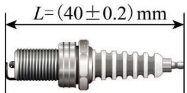
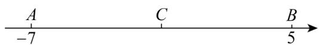
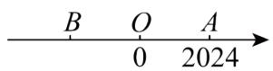
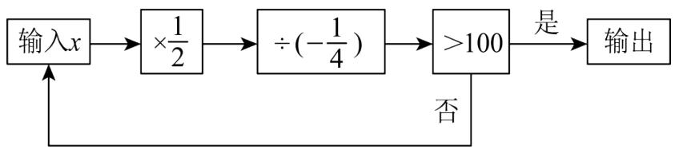
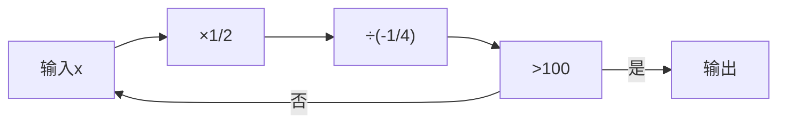
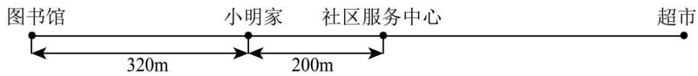
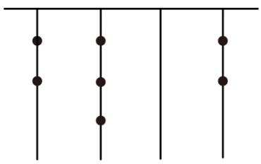

# 第二章 有理数及其运算·培优卷

# 【北师大版 2024】

参考答案与试题解析

# 第I卷

# 一．选择题（共10小题，满分30分，每小题3分）

1. （3 分）（24-25 七年级下·河北秦皇岛·期末）第 33 届夏季奥林匹克运动会于 2024 年 7 月 26 日至 8 月 11 日在法国巴黎举行．据中国视听大数据（CVB）统计，在此期间，全国卫视共播出近 5000 期奥运相关节目，累计观看人次达 159.9 亿，将 159.9 亿用科学记数法表示为（）

A. $0.1599 \times 10^{11}$

B. $1.599 \times 10^{10}$

C. $1.599 \times 10^{9}$

D. $15.99 \times 10^{9}$

【答案】B

【分析】该题考查了科学记数法，科学记数法的表示形式为 $a \times 10^{n}$ 的形式，其中 $1 \leq |a| < 10, n$ 为整数，确定 $n$ 的值时，要看把原数变成 $a$ 时，小数点移动了多少位， $n$ 的绝对值与小数点移动的位数相同．当原数绝对值 $\geq 10$ 时， $n$ 是正数；当原数的绝对值 $< 1$ 时， $n$ 是负数．据此求解即可．

【详解】解：依题意，159.9亿= $15990000000=1.599\times10^{10}$ ，则159.9亿用科学记数法表示为 $1.599\times10^{10}$ ，

故选：B.

2. （3 分）（2025·吉林松原·模拟预测）若 $(-3)\times\square$ 的运算结果为正数，则□内的数字可以为（）

A.-1

B. 0

C. 1

D. 2

【答案】A

【分析】本题主要考查了有理数的乘法计算．根据有理数的乘法计算法则，即可得到答案.

【详解】解：∵ $(-3)\times\square$ 的运算结果为正数，

∴□内的数字为负数，故 A 选项符合题意；

故选：A

3. （3 分）（2021·河北石家庄·一模）若 $a$ 为整数，则 $(a^2)^3$ 表示的是（）

A. 3 个 $a^{2}$ 相乘

B. 2 个 $a^3$ 相加

C. 3 个 $a^{2}$ 相加

D. 5个 $a$ 相乘

【答案】A

【分析】本题考查幂的乘方运算，熟练掌握并理解幂的乘方等于底数不变，指数相乘是解题的关键．根据幂的乘方法则： $(a^{m})^{n} = a^{m\times n}$ ，即幂的乘方等于底数不变，指数相乘，进行分析即可.

【详解】解： $(a^{2})^{3}$ 表示3个 $a^{2}$ 相乘或者 $(a^{2})^{3}=a^{2\times3}=a^{6}$ 表示6个a相乘.

故选：A.

4. （3 分）（2025·山西晋城·三模）如图，这是某机器零件的设计图纸。下列长度（L）的零件合格的是（）

text_image

L=(40±0.2)mm

A. 39.2mm

B. 39.6mm

C. 39.9mm

D. 40.5mm

【答案】C

【分析】本题考查了正负数的意义，先算出零件合格的范围为 $39.8 \leq L \leq 40.2$ ，再判断每个选项的数值在不在范围内，如果在吗，那就符合题意，否则不符合题意，即可作答.

【详解】解：依题意， $40-0.2=39.8,40+0.2=40.2$

∴零件合格的范围为39.8≤L≤40.2

$\because39.2<39.8,$

∴A选项不符合题意;

∵39.6<39.8,

∴B 选项不符合题意;

$\because39.8<39.9<40.2,$

∴C 选项符合题意;

∵40.2<40.5,

∴D 选项不符合题意;

故选：C

5. （3 分）（2025·吉林长春·二模）把 $-2-(+3)-(-4)$ 写成省略加号的和的形式，正确的是（）

A. $-2 + 3 + 4$

B. $-2 - 3 + 4$

C. -2-3-4

D. $-2 + 3 - 4$

【答案】B

【分析】本题考查有理数的加减．根据减去一个数等于加上这个数的相反数，然后去掉括号和加号即可.

【详解】解： $-2-(+3)-(-4)$

$= -2 - 3 + 4$

故选：B.

6. （3 分）（24-25 七年级上·山西太原·阶段练习）李双、李见是一对爱学习、进取心强的姐妹，学完第一章《有理数》后，李双对李见说：“a 是最小的正整数，b 是最大的负整数，c 是绝对值最小的数，d 是倒数等于自身的有理数，你说 $a-b+c-d$ 等于多少？”李见脱口答出正确答案，聪明的你知道答案是多少吗？（）

A. 1

B. 3

C. 1 或 3

D. 2 或 -1

【答案】C

【分析】本题主要考查有理数，绝对值，倒数的定义等知识点．此题的关键是弄清：最小的正整数是1，最大的负整数是-1，绝对值最小的数是0，倒数等于自身的有理数±1.

最小的正整数是 1，最大的负整数是 -1，绝对值最小的数是 0，倒数等于自身的有理数±1，然后求出 $a-b+c-d$ 的值即可.

【详解】解：∵a为最小的正整数，

$$
\therefore a = 1,
$$

∵b是最大的负整数，

$$
\therefore b = - 1,
$$

∵c是绝对值最小的数，

$$
\therefore c = 0,
$$

∵d是倒数等于自身的有理数，

$$
\therefore d = \pm 1,
$$

$$
\therefore a - b + c - d = 1 - (- 1) + 0 - 1 = 1 \text {或} a - b + c - d = 1 - (- 1) + 0 - (- 1) = 3,
$$

$\therefore a-b+c-d$ 的值为1或3，

故选：C.

7. （3 分）（23-24 七年级下·北京·阶段练习）以下的运算的结果中，最大的一个数是（）

A. -13579+0.2468

B. $-13579+\frac{1}{2468}$

C. $(-13579)\times\frac{1}{2468}$

D. $(-13579)\div\frac{1}{2468}$

【答案】C

【分析】本题考查有理数的运算，有理数的大小比较．比较四个选项的运算结果即可，需注意负数参与不同运算后的符号和大小变化.

【详解】解：选项 A: $-13579+0.2468=-13578.7532$ .

选项 B: $-13579+\frac{1}{2468}=-13578\frac{2467}{2468}.$

选项 C: $-13579 \times \frac{1}{2468} = -\frac{13579}{2468}$ ,

选项 D: $-13579 \div \frac{1}{2468} = -33512972.$

$$
\because \left| - 3 3 5 1 2 9 7 2 \right| = 3 3 5 1 2 9 7 2, \left| - 1 3 5 7 8. 7 5 3 2 \right| = 1 3 5 7 8. 7 5 3 2, \left| - 1 3 5 7 8 \frac {2 4 6 7}{2 4 6 8} \right| = 1 3 5 7 8 \frac {2 4 6 7}{2 4 6 8}, \quad \left| - \frac {1 3 5 7 9}{2 4 6 8} \right| = \frac {1 3 5 7 9}{2 4 6 8},
$$

$$
\therefore 3 3 5 1 2 9 7 2 > 1 3 5 7 8. 7 5 3 2 > 1 3 5 7 8 \frac {2 4 6 7}{2 4 6 8} > \frac {1 3 5 7 9}{2 4 6 8},
$$

$\therefore-\frac{13579}{2468}$ 最大，

故选 C.

8. （3 分）（2025·河北邯郸·二模）如图，数轴上有三个点 $A, B, C$ ，其中 $C$ 是线段 $AB$ 的中点，则原点 $O$ 的位置（）

text_image

A
-7
C
B
5

A. 位于线段 $AC$ 上，且靠近 $A$ 点

B. 位于线段 $AC$ 上，且靠近 $C$ 点

C. 位于线段 $BC$ 上，且靠近 $B$ 点

D. 位于线段 $BC$ 上，且靠近 $C$ 点

【答案】D

【分析】本题考查了数轴上找原点，理解中点和数轴的定义是解答关键.

根据中点求出C点表示的数，再利用数轴的定义求解.

【详解】∵C是线段AB的中点，

∴C点表示的数是 $\frac{-7+5}{2}=-1$ ,

∴原点O位于线段BC上，且靠近C点.

故选：D.

9. （3 分）（24-25 七年级下·云南文山·期末）中国古代著作《九章算术》在世界数学史上首次正式引入负数，如果将“收入100元记作+100元”，那么“支出80元”应记作（）

A. +80元

B. -80元

C. +100元

D. -100元

【答案】B

【分析】本题考查了相反意义的量，熟练掌握正负数的意义是解答本题的关键．已知收入记为“+”，则支出应记为“-”，直接根据数值对应符号即可得出答案.

【详解】解：因为收入100元记作+100元，

所以支出80元记作-80元.

故选：B.

10. （3 分）（2025·河北邯郸·二模）|-3|与-(-3)的关系是（）

A. 相等

B. 互为相反数

C. 互为倒数

D. 积为-9

【答案】A

【分析】此题考查了绝对值和化简多重符号，首先化简绝对值和多重符号，然后比较即可.

【详解】解： $|-3|=3,\quad-(-3)=3$

$\therefore |-3|$ 与 $-(-3)$ 的关系是相等.

故选：A.

# 二．填空题（共6小题，满分18分，每小题3分）

11. （3 分）（2025·云南楚雄·模拟预测）如图，已知数轴上点A表示的数是2024，且OA=OB，则点B表示的数是\_\_\_\_。

【答案】-2024

【分析】本题主要考查了数轴上两点距离计算，用数轴表示有理数，先求出 $OA = 2024$ ，进而得到 $OB = 2024$ ，由此即可得到答案.

【详解】解：∵数轴上点A表示的数是2024，

$$
\therefore O A = 2 0 2 4,
$$

$$
\because O A = O B,
$$

$$
\therefore O B = 2 0 2 4,
$$

∵点B在原点左侧，

∴点B表示的数是-2024，

故答案为：-2024.

12. （3 分）（2025·湖北十堰·三模）珠穆朗玛峰海拔约 8849 米，吐鲁番盆地最低处海拔约为 -155 米，两地的相对高度（即山峰最高处比盆地最低处高）是 \_\_\_\_ 米.

【答案】9004

【分析】此题考查有理数的减法，解题的关键是熟练运用有理数的减法法则：减去一个数，等于加上这个数的相反数．根据题意列出算式即可求出答案.

【详解】解：依题意，8849-(-155)=9004

故答案为：9004.

13. （3 分）（24-25 七年级上·山东威海·期末）如图，按程序框图中的顺序计算，当输入的初始值 x 为 32 时，则输出的最后结果为 \_\_\_\_.

flowchart

【答案】128

【分析】本题考查程序流程图与有理数的运算，把32代入流程图，列出算式进行计算，直至最后结果>100，即可.

【详解】解： $32\times\frac{1}{2}\div\left(-\frac{1}{4}\right)=-64<100$

$-64\times\frac{1}{2}\div\left(-\frac{1}{4}\right)=128>100$ ，输出；

故答案为：128.

14. （3 分）（2025·四川资阳·模拟预测）在 $-2^{2}, |-4|, (-1)^{2011}, \pi, \frac{5}{11}, -(-13)^{3}, 3.1415, 0$ ，数中，其中整数有 m 个，非负数有 n 个，即 m-n= \_\_\_\_.

【答案】-1

【分析】本题考查了有理数的分类，代数式求值，掌握有理数的分类是解题的关键，注意0比较特殊，是整数，既不是正数也不是负数．根据整数，非负数的定义得出m=5，n=6，代入计算即可得到答案.

【详解】解： $\because-2^{2}=-4,\quad|-4|=4,\quad(-1)^{2011}=-1,\quad-(-13)^{3}=13^{3}$

整数有 $-2^{2}$ 、 $|-4|$ ， $(-1)^{2011}$ ， $-(-13)^{3}$ ，0，共5个，即m=5，

非负数有 $|-4|$ 、 $\pi$ ， $\frac{5}{11}$ ， $-(-13)^{3}$ ，3.1415，0，共6个，即n=6，

$$
\therefore m - n = 5 - 6 = - 1,
$$

故答案为：-1.

15. （3分）（2025·江西吉安·一模）如下表所示，算筹是我国古代的计算工具之一，摆法有纵式和横式两种，横式和纵式都可以表示同一个数，古人在个位数上划上斜线以表示负数。如“π=π”表示-723，则“T≡≠”所表示的数是\_\_\_\_。

<table><tr><td>纵式</td><td>I</td><td>II</td><td>III</td><td>III</td><td>IIIIII</td><td>T</td><td> $\Pi$ </td><td> $\Pi\Pi$ </td><td> $\Pi\Pi\Pi$ </td></tr><tr><td>横式</td><td>-</td><td>=</td><td>≡</td><td>≡</td><td>≡</td><td>⊥</td><td>⊥</td><td>⊥</td><td>⊥</td></tr><tr><td></td><td>1</td><td>2</td><td>3</td><td>4</td><td>5</td><td>6</td><td>7</td><td>8</td><td>9</td></tr></table>

【答案】-652

【分析】本题主要考查了正数和负数，解题的关键是读懂题目，找出数筹和数字的对应关系.根据题干描述的算筹计数法计数即可.

【详解】

解：根据算筹计数法，“T ≡ ≠”所表示的数是-652，

故答案为：-652.

16. （3 分）（24-25 七年级上·江苏常州·期末）如图，图书馆、小明家、社区服务中心和超市在同一条笔直的马路上。若小明家位于图书馆和超市连线段上靠近图书馆的三等分点处，则社区服务中心和超市的距离为 \_\_\_\_ m.

text_image

图书馆
小明家
社区服务中心
超市
320m
200m

【答案】440

【分析】本题考查了有理数加减的混合运算，理解题意计算出图书馆到超市的距离是关键。根据题意，先求出图书馆到超市的距离，再列出960-320-200计算即可。

【详解】解：∵小明家位于图书馆和超市连线段上靠近图书馆的三等分点处，

∴图书馆到超市的距离为： $320 \times 3 = 960 \, m$ ,

∴社区服务中心和超市的距离为：960-320-200=440m.

故答案为：440.

# 第II卷

# 三．解答题（共8小题，满分72分）

17. （6 分）（24-25 七年级上·湖北恩施·阶段练习）计算：

(1)(-8)+10+2+(-1);

(2)- $(-2^{2})+(-2)^{3}\times5-(-28)\div4$

【答案】(1)3

(2)-29

【分析】本题考查了有理数的混合运算，解题的关键是掌握运算法则和运算顺序.

（1）根据有理数的加减混合运算法则求解即可；  
(2) 先计算乘方, 然后计算乘除, 最后计算加减.

【详解】（1） $(-8) + 10 + 2 + (-1)$

$$
= 2 + 1
$$

$$
= 3;
$$

(2) $-(-2^{2})+(-2)^{3}\times5-(-28)\div4$

$$
\begin{array}{l} = 4 + (- 8) \times 5 + 7 \\ = 4 - 4 0 + 7 \\ = - 2 9. \\ \end{array}
$$

18. （6 分）（23-24 七年级上·江苏扬州·阶段练习）已知 $x^{2} = 64$ ， $|y| = 9$

(1)求 $x$ 和 $y$ 的值；  
(2)若x>y，求x-y的值.

【答案】(1)x=8或-8；y=9或-9

(2)17 或 1

【分析】（1）利用有理数的乘方的定义、绝对值的定义计算即可；

（2）根据题意确定 x、y 的值，代入求代数式的值即可.

【详解】（1）解： $\because x^{2}=64$ ，

$$
\therefore x = \pm 8,
$$

$$
\because | y | = 9,
$$

$$
\therefore y = \pm 9;
$$

(2) $\because x > y,$

$\therefore x=\pm8$ 时，y=-9，

$$
\therefore x - y = 8 - (- 9) = 8 + 9 = 1 7,
$$

或x-y=-8-(-9)=-8+9=1，

∴x-y=17或1.

【点睛】本题考查了有理数的乘方和绝对值的意义，求解代数式的值，做题的关键是掌握有理数的乘方的定义、绝对值的定义.

19. （8分）（24-25六年级上·山东威海·期末）数学老师布置了一道思考题“计算： $\left(-\frac{1}{12}\right)\div\left(\frac{1}{3}-\frac{5}{6}\right)$ ”，小明用了一种不同的方法解决了这个问题，他认为原式的倒数为 $\left(\frac{1}{3}-\frac{5}{6}\right)\div\left(-\frac{1}{12}\right)=\left(\frac{1}{3}-\frac{5}{6}\right)\times(-12)=-4+10=6$ ，所以

$$
\left(- \frac {1}{1 2}\right) \div \left(\frac {1}{3} - \frac {5}{6}\right) = \frac {1}{6}.
$$

请你运用小明的解法计算： $\left(-\frac{1}{30}\right)\div\left(\frac{1}{5}+\frac{1}{3}-\frac{1}{15}\right)$ .

【答案】 $-\frac{1}{14}$

【分析】本题考查有理数计算．根据题意利用小明解法先取原式的倒数，再转化为乘法，计算后再取倒数

即可.

【详解】解：原式的倒数为 $\left(\frac{1}{5}+\frac{1}{3}-\frac{1}{15}\right)\div\left(-\frac{1}{30}\right)$

$$
\begin{array}{l} = \left(\frac {1}{5} + \frac {1}{3} - \frac {1}{1 5}\right) \times (- 3 0) \\ = \frac {1}{5} \times (- 3 0) + \frac {1}{3} \times (- 3 0) - \frac {1}{1 5} \times (- 3 0) \\ = - 6 - 1 0 + 2 \\ = - 1 4; \\ \therefore \left(- \frac {1}{3 0}\right) \div \left(\frac {1}{5} + \frac {1}{3} - \frac {1}{1 5}\right) = - \frac {1}{1 4}. \\ \end{array}
$$

20. （8 分）（24-25 七年级上·江苏泰州·阶段练习）对有理数 a、b 定义运算\*如下： $a*b=(a+2)(b-3)$ .

(1)计算 $4^{*}(-3)=$ \_\_\_\_；  
(2)求 $-5*[-(-2)*6]$ 的值.

【答案】(1)-36

(2)9

【分析】（1）根据定义的运算代入求解即可得出答案；

(2) 先计算中括号里面的, 再计算括号外面的即可得出答案.

本题考查的是有理数的混合运算，解题关键在于根据新定义列出代数式.

【详解】（1）根据题意得， $4^{*}(-3)$

$$
\begin{array}{l} = (4 + 2) (- 3 - 3) \\ = 6 \times (- 6) \\ = - 3 6; \\ \end{array}
$$

(2) $(-2)*6$

$$
\begin{array}{l} = (- 2 + 2) \times (6 - 3) \\ = 0 \times 3 \\ = 0 \\ - 5 * [ (- 2) * 6 ] \\ = - 5 * 0 \\ = (- 5 + 2) \times (0 - 3) \\ = - 3 \times (- 3) \\ = 9. \\ \end{array}
$$

21. （10 分）（22-23 七年级上·江苏无锡·阶段练习）如图，小明有5张写着不同的数字的卡片，请你按要求取出卡片，完成下列问题：

-3

-5

+2

+3

+4

(1)从中取出2张卡片，使这2张卡片上数字乘积最大，最大值是\_;  
(2)从中取出2张卡片，使这2张卡片上数字相除的商最小，最小值是\_；  
(3)从中取出4张卡片，用学过的运算方法，写出一个运算式使结果为24.

【答案】(1)15

(2) $-\frac{5}{2}$

(3) $\left[-3-(-5)\right]\times3\times4=24$

【分析】本题考查了有理数的混合运算，解题的关键是掌握有理数的运算法则.

（1）根据乘积最大的就是找符号相同且数值最大的数，即可求解；  
（2）根据2张卡片上数字相除的商最小就要找符号不同，且分母越大越好，分子越小越好，据此求解即可；  
(3) 用加减乘除只要答数是24即可.

【详解】（1）解：由题意可得，从中抽出2张卡片，使这两张卡片上数字乘积最大，最大值是： $(-3)\times(-5)=15$ ，故答案为：15；

(2) 由题意可得, 从中抽出2张卡片, 使这两张卡片上数字相除的商最小, 最小值是: $(-5) \div 2 = -\frac{5}{2}$ , 故答案为: $-\frac{5}{2}$ ;

（3）由题意可得， $\left[-3-(-5)\right]\times3\times4=24.$

22. （10 分）（24-25 七年级上·江苏泰州·阶段练习）某粮库 6 天内的粮食进出库的吨数为：
+23, -32, -15, +34, -36, -20. 问：

(1)经过这6天，库里的粮食是增多了多少？还是减少了多少？  
(2)经过这6天，仓库管理员发现库里还存有520吨粮食，那么6天前库里存粮多少吨？  
(3)如果进出的装卸费都是每吨5元，那么这6天需要多少装卸费？

【答案】(1)减少了46吨

(2)6 天前库里存粮 566 吨

(3)这6天需要800元装卸费

【分析】本题考查了正负数的实际意义，绝对值的计算，有理数混合运算的应用，理解题意，正确计算是解题的关键.

（1）把粮食进出库的吨数相加，若为正则增加，若为负则减少，若为0则不增不减；  
（2）经过 6 天库存的粮食等于原有粮食与 6 天粮食的变化量的和为 520 吨，由此列式即可求解原有粮食的库存数；  
（3）计算出进出粮食的总吨数，即计算出粮库进出库数量的绝对值的和，再乘以装卸费即可求解.

【详解】（1）解： $(+23)+(-32)+(-15)+(+34)+(-36)+(-20)$

=-46（吨）；

答：经过这6天，库里的粮食是减少了46吨；

(2) 解: $520 - (-46) = 566$ (吨);

答：6 天前库里存粮 566 吨；

（3）解： $|+23|+|-32|+|-15|+|+34|+|-36|+|-20|$

=160（吨），

$160 \times 5 = 800$ （元）；

答：这 6 天需要 800 元装卸费.

23. （12 分）（23-24 七年级上·山东潍坊·期中）十进制是用0～9这十个数字来表示数，满十进一，例：

$212=2\times10^{2}+1\times10+2$ ；计算机常用二进制来表示字符代码，它是用0和1两个数来表示数，满二进一，例：二进制数10000转化为十进制数： $1\times2^{4}+0\times2^{3}+0\times2^{2}+0\times2^{1}+0=16$ ；其他进制也有类似的算法.

natural_image

Pure electrical circuit lines without any symbols

(1)根据以上信息，将二进制数“101110”转化为十进制数.  
(2)中国古代《易经》一书中记载，人们通过在绳子上打结来记录数量，即“结绳记数”。如图，一位妇女在从右到左依次排列的绳子上打结，满六进一，用来记录采集到的野果数量。根据图，计算采集到的野果数量。

【答案】(1)46

(2)采集到的野果数量为542个

【分析】本题考查了有理数的乘方的应用；

（1）根据题意写成 $1\times2^{5}+0\times2^{4}+1\times2^{3}+1\times2^{2}+1\times2^{1}+0$ ，进而进行计算即可求解；  
（2）由于满六进一，类似于六进制数，转化为十进制数为： $2 \times 6^{3} + 3 \times 6^{2} + 0 \times 2^{1} + 2 \times 6^{0}$ ，进而计算即可求解.

【详解】（1）解：101110 转化为十进制数是：

$$
\begin{array}{l} 1 \times 2 ^ {5} + 0 \times 2 ^ {4} + 1 \times 2 ^ {3} + 1 \times 2 ^ {2} + 1 \times 2 ^ {1} + 0 \\ = 3 2 + 0 + 8 + 4 + 2 + 0 \\ = 4 6, \\ \end{array}
$$

故答案为：46;

（2）由于满六进一，类似于六进制数，转化为十进制数为：

$$
\begin{array}{l} 2 \times 6 ^ {3} + 3 \times 6 ^ {2} + 0 \times 2 ^ {1} + 2 \times 6 ^ {0} \\ = 4 3 2 + 1 0 8 + 0 + 2 \\ = 5 4 2. \\ \end{array}
$$

答：采集到的野果数量为542个.

24. （12 分）（24-25 七年级上·重庆秀山·期末）2024 年 11 月 7 日，恰逢立冬，又遇我县第一届运动会，更是我县 41 岁“生日”。为保证运动会顺利进行，全县人民高度重视并积极参与。某出租车驾驶员无偿为各能量补给站运送物资，他从物资配送站出发，在东西向的站前大道上连续接送 6 批物资，行驶路程记录如下（规定向东为正，向西为负，单位：km）：

<table><tr><td>第1批</td><td>第2批</td><td>第3批</td><td>第4批</td><td>第5批</td><td>第6批</td></tr><tr><td>4km</td><td>-7km</td><td>-3km</td><td>6km</td><td>-9km</td><td>5km</td></tr></table>

(1)接送完第6批物资后，该驾驶员在物资配送站什么方向，距离物资配送站多少千米？  
(2)若该出租车每千米耗油0.6升，那么在这个过程中共耗油多少升？

【答案】(1)该驾驶员在物资配送站西边，距离物资配送站4千米

(2)20.4 升

【分析】(1)计算各里程的和，正表示在东，负表示在西，绝对值表示距离.

(2) 计算各里程的绝对值的和，计算出耗油量较即可.

本题考查了正负数的实际应用，有理数的加减混合运算，有理数的乘法，熟练掌握有理数的加减混合运算法则是解题的关键.

【详解】（1）解：∵4-7-3+6-9+5=-4(千米)，

∴该驾驶员在物资配送站西边，距离物资配送站4千米.

(2) 解: $\because |4| + |-7| + |-3| + |-9| + |6| + |5| = 34$ 千米,

∴耗油量为： $34 \times 0.6 = 20.4$ （升），

答：这个过程中共耗油 20.4 升.