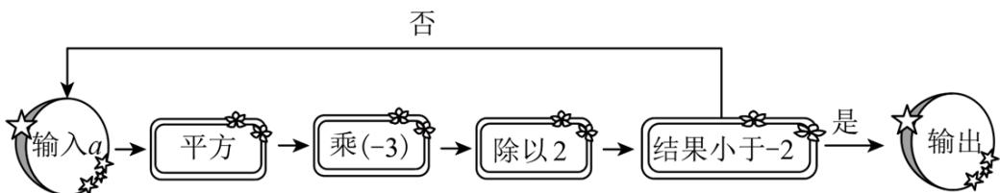
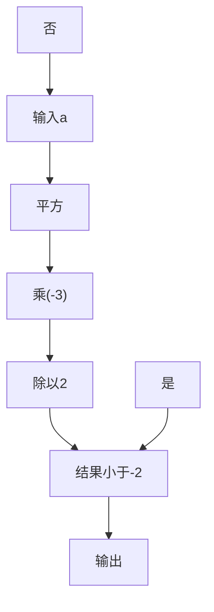
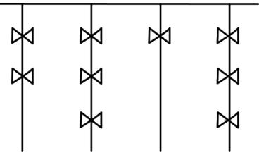
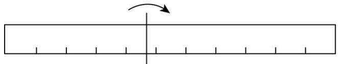
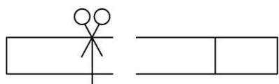
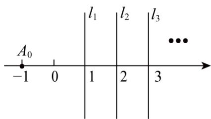
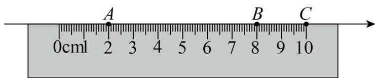
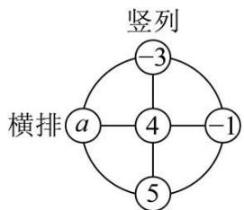
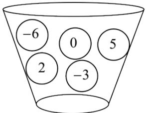

# 第二章 有理数及其运算·拔尖卷

# 【北师大版 2024】

考试时间：120 分钟 满分：120 分

姓名：\_\_\_\_ 班级：\_\_\_\_ 考号：\_\_\_\_

考卷信息:

本卷试题共 24 题，单选 10 题，填空 6 题，解答 8 题，满分 120 分，限时 120 分钟，本卷题型针对性较高，覆盖面广，选题有深度，可衡量学生掌握本章内容的具体情况！

# 第I卷

# 一．选择题（共10小题，满分30分，每小题3分）教辅资源，关注公众号★全科AA+

1. （3 分）（24-25 七年级上·浙江杭州·期中）若 x>0, y<0, $x+y>0$ ，则下列关系正确的是（）

A. $y < -x < -y < x$

B. $y < -x < x < -y$

C. -x<y<x<-y

D. $-x < y < -y < x$

2. （3 分）（24-25 七年级上·河北保定·期末）下列各式中，运用运算律不正确的是（）

A. $(-4)\times 8 = 8\times (-4)$

B. $-24 \times \frac{2}{5} \times \left(-\frac{1}{6}\right) = \frac{2}{5} \times \left[(-24) \times \left(-\frac{1}{6}\right)\right]$

C. $-4 \times \left(\frac{1}{3}\right) \times (-6) = (-4) \times \left(\left(\frac{1}{3}\right) \times (-6)\right)$

D. $-6 \times \left( \frac{1}{2} + \left( -\frac{1}{3} \right) \right) = (-6) \times \frac{1}{2} + \left( -\frac{1}{3} \right)$

3. （3 分）（24-25 七年级下·青海西宁·期末）小杰同学在本学期学习了有关“低碳生活”的内容后，查阅资料得到数据：一个普通快递包装约排放出 200g 二氧化碳，一盆绿萝每天约吸收 0.15g 二氧化碳。若要将一个快递包装排放出来的二氧化碳在一天内全部被吸收，至少需要绿萝（）

A. 1332 盆

B. 1333 盆

C. 1334 盆

D. 1335 盆

4. （3 分）（24-25 七年级上·陕西西安·期末）如图是小宇用计算机设计的一个有理数运算的程序框图，若输入的数 $a$ 为 1，则输出的结果是（）



<details>
<summary>flowchart</summary>


</details>

A. $-\frac{27}{8}$

B. $\frac{27}{8}$

C. $-\frac{3}{2}$

D. $\frac{3}{2}$

5. （3 分）（2025·广西柳州·三模）“结绳计数”是远古时代人类智慧的结晶，即人们通过在绳子上打结来记录数量，类似我们现在熟悉的“进位制”，如图所示是一位古人记录的当天采摘果实的个数，在从右向左依次排列的不同绳子上打结，满四进一，根据图示可知，这位古人当天采摘果实的个数是（）



<details>
<summary>natural_image</summary>

Pure electrical circuit lines without any symbols
</details>

A. 186

B. 185

C. 184

D. 183

6. （3分）（23-24七年级上·广东佛山·开学考试）“算24点”的游戏规则是：用“+，-，×，÷”…四种运算符号把给出的4个数字连接起来进行计算，要求最终算出的结果是24，例如，给出2，2，2，8这四个数，可以列式 $(2\div2+2)\times8=24$ ．以下的4个数用“+，-，×，÷”四种运算符号不能算出结果为24的是（）

A. 1,

8, 7

B. 1,

3, 4

C. 4,

4, 10, 10

D. 6,

3,8

7. （3 分）（23-24 七年级上·四川达州·期末）已知 $2^{1} = 2$ ， $2^{2} = 4$ ， $2^{3} = 8$ ， $2^{4} = 16$ ， $2^{5} = 32$ ，…，请你推算 $2^{2024}$ 的个位数字是（）

A. 8

B. 6

C. 4

D. 2

8. （3 分）（24-25 七年级上·重庆沙坪坝·阶段练习）对于 $1 + 2 \times 3 - 4 \div 5$ ，不改变数字和运算符号的顺序，也不添加任何运算符号，对至少两个数添加括号后并计算出结果，称为一种“加括号操作”。例如： $(1 + 2 \times 3) - 4 \div 5 = \frac{31}{5}$ 是一种“加括号操作”， $\frac{31}{5}$ 是其运算结果： $(1 + 2) \times (3 - 4) \div 5 = -\frac{3}{5}$ 是一种“加括号操作”， $-\frac{3}{5}$ 是其运算结果，给出下列说法：

①至少存在一种“加括号操作”的运算结果是 $\frac{7}{5}$ ;  
②不存在任何“加括号操作”的运算结果是 $\frac{26}{5}$ ;  
③所有“加括号操作”共有7种不同的运算结果.

其中正确的个数是（）

A. 0

B. 1

C. 2

D. 3

9. （3 分）（24-25 八年级下·湖南湘西·阶段练习）已知 $y = |x - a| + |x - 20| + |x - a - 20|$ ，其中 $0 < a < 20$ ， $a \leq x \leq 20$ ，那么 $y$ 的最小值为( )

A. 40

B. 30

C. 20

D. 10

10. （3 分）（24-25 七年级上·湖南娄底·期末）下表列出了国外几个城市与北京的时差（正数表示同一时刻比北京时间早）.

<table><tr><td>城市</td><td>纽约</td><td>巴黎</td><td>东京</td></tr><tr><td>与北京的时差/h</td><td>-13</td><td>-7</td><td>+1</td></tr></table>

2025年元月6日19:00，我国中央广播电视总台综合频道CCTV-1《新闻联播》节目开始播放时，下列各城市的时间表示错误的是（）

A. 纽约是2025年元月6日6:00

B. 巴黎是2025年元月6日11:00

C. 东京是2025年元月6日20:00

D. 上海是2025年元月6日19:00

# 二．填空题（共6小题，满分18分，每小题3分）教辅资源，关注公众号★全科AA+

11. （3 分）（24-25 七年级上·湖南邵阳·期末）若 $a, b$ 互为相反数， $c, d$ 互为倒数， $m$ 的绝对值最小的数，则 $2m - 2024(a + b) - cd$ 的值是 \_\_\_\_.  
12. （3分）（24-25七年级上·湖北恩施·期末）已知： $m = \frac{|a + b|}{c} + \frac{2|c + b|}{a} + \frac{3|a + c|}{b}$ ，且 $abc > 0$ ， $a + b + c = 0$ 。则 $m$ 共有 $x$ 个不同的值，若在这些不同的 $m$ 值中，最小的值为 $y$ ，则 $x - 3y =$ \_\_\_\_  
13. （3 分）（24-25 七年级上·浙江杭州·期中）如图，在数轴上剪下一条 11 个单位长度（从 -2 到 9）的线段，并把这条线段沿某点折叠，然后在重叠部分某处剪一刀得到三条线段。若这三条线段的长度之比为 1:1:2，则折痕处对应的点所表示的数可能是 \_\_\_\_。



<details>
<summary>natural_image</summary>

Simple diagram showing a horizontal bar with tick marks and an arrow indicating upward motion (no text or symbols)
</details>

折痕



<details>
<summary>natural_image</summary>

Simple line drawing of a stick figure on the left and a rectangle on the right (no text or symbols)
</details>

剪断处

14. （3 分）（2025·陕西咸阳·二模）高斯被认为是历史上最杰出的数学家之一，享有“数学王子”之称。现有一种高斯定义的计算式，已知 $[x]$ 表示不超过 $x$ 的最大整数，例如 $[-0.8] = -1$ 。现定义 $\{x\} = x + [x]$ ，例如 $\{x\} = 1.5 + [1.5] = 2.5$ ，则 $\{-2.5\} =$ \_\_\_\_.  
15. （3 分）（2025·北京门头沟·二模）某快递公司因天气原因需将五种货物进行延迟配送，每名配送员每次只能配送一种货物，从配送开始起进行计时，每延迟一分钟需赔付 1 元，忽略其它因素的影响，五种货物的配送时间如下表：

<table><tr><td>货物</td><td>A</td><td>B</td><td>C</td><td>D</td><td>E</td></tr><tr><td>配送时间(分钟)</td><td>5</td><td>8</td><td>9</td><td>7</td><td>10</td></tr></table>

（1）如果由一名配送员进行配送，那么下列三个配送顺序：① $D\rightarrow B\rightarrow E\rightarrow A\rightarrow C$ ；② $D\rightarrow A\rightarrow C\rightarrow E\rightarrow B$ ;

③ $C\rightarrow A\rightarrow E\rightarrow B\rightarrow D$ 中，赔付最少的是（填序号）；

(2) 如果由两名配送员同时进行配送, 最少需要赔付 元.

16. （3 分）（23-24 七年级上·陕西西安·阶段练习）如图，过数轴上表示1的点作数轴的垂线 $l_{1}$ ，过数轴上表示2的点作数轴的垂线 $l_{2}$ ，过数轴上表示3的点作数轴的垂线 $l_{3}$ ，…。已知点 $A_{0}$ 表示的数为-1，将点 $A_{0}$ 沿直线 $l_{1}$ 翻折得到点 $A_{1}$ ，将点： $A_{1}$ 沿直线 $l_{2}$ 翻折得到点 $A_{2}$ ，将点 $A_{2}$ 沿直线 $l_{3}$ 翻折得到点 $A_{3}$ ，…则 $A_{2021}$ 表示的数为 \_\_\_\_。



<details>
<summary>text_image</summary>

A₀
-1 0 | l₁ | l₂ | l₃
1 2 3
</details>

# 第II卷

# 三．解答题（共8小题，满分72分）

17. （6 分）（24-25 七年级上·贵州六盘水·期末）计算：

(1)(-9)-(-14)+(-10)-(-15);

(2) $32\div(-2)^{3}-\left(-\frac{1}{8}\right)\times(-4)$ .

18. （6分）（2025·河北邯郸·一模）如图，以 $1 \mathrm{~cm}$ 为 1 个单位长度，用直尺画数轴，数轴上的点 $A, B, C$ 刚好对着直尺上的刻度 2、刻度 8 和刻度 10。设点 $A, B, C$ 所表示的数的和是 $p$ ，该数轴的原点为 $O$ .



<details>
<summary>text_image</summary>

A
B
C
0cm1 2 3 4 5 6 7 8 9 10
</details>

(1)分别计算出原点O与点C重合时、与AB的中点重合时p的值.   
(2)原点O沿着数轴每向左移动1cm，p的值将会如何变化？当p的值为-4时，求原点O的位置.  
19. （8分）（2025·河北廊坊·二模）如图，在一个圆形转盘上，标有五个有理数.



<details>
<summary>flowchart</summary>

```mermaid
graph TD
    A["4"] --> B["-3"]
    A --> C["-1"]
    A --> D["5"]
    A --> E["a"]
    style A fill:#f9f,stroke:#333
    style B fill:#ccf,stroke:#333
    style C fill:#ccf,stroke:#333
    style D fill:#ccf,stroke:#333
    style E fill:#ccf,stroke:#333
    note right of A: 竖列
    note right of C: 横排
```
</details>

(1)求这已知的四个数的积:   
(2)若横排三个数的和与竖列三个数的和相等.

①求 a 的值:  
②求a，4，5，-1这四个数的平均数.

20. （8 分）（24-25 八年级下·四川广安·阶段练习）下表是某水库一星期内的水位（单位：米）变化情况：

<table><tr><td>星期</td><td>一</td><td>二</td><td>三</td><td>四</td><td>五</td><td>六</td><td>日</td></tr><tr><td>水位变化</td><td>+2.4</td><td>+0.6</td><td>-4.0</td><td>-1.6</td><td>+3.5</td><td>+2.0</td><td>-1.5</td></tr></table>

注：该水库的警戒水位是 35.5 米．表格中“+”表示比警戒水位高，“-”表示比警戒水位低.

(1)该水库这星期水位最高的一天是星期\_\_\_\_，这一天的实际水位是\_\_\_\_米.  
(2)若规定水位比前一天上升用“+”，比前一天下降用“-”，不升不降用“0”。请补全下面的这星期水位（单位：米）变化表.

<table><tr><td>星期</td><td>一</td><td>二</td><td>三</td><td>四</td><td>五</td><td>六</td><td>日</td></tr><tr><td>水位变化</td><td>+3.1</td><td></td><td></td><td>+2.4</td><td></td><td>-1.5</td><td>-3.5</td></tr></table>

(3)上一星期日该水库的水位是多少？与上星期日相比，这一星期日该水库水位是上升了，还是下降了？变化了多少？

21. （10 分）（24-25 七年级上·广东佛山·阶段练习）对于含绝对值的算式，在有些情况下，可以不需要计算出结果也能将绝对值符号去掉，例如： $|9-8|=9-8$ ; $|8-9|=9-8$ ; $\left|\frac{1}{8}-\frac{1}{9}\right|=\frac{1}{8}-\frac{1}{9}$ ; $\left|\frac{1}{9}-\frac{1}{8}\right|=\frac{1}{8}-\frac{1}{9}$ .

观察上述式子的特征，解答下列问题：教辅资源，关注公众号★全科AA+

(1)把下列各式写成去掉绝对值符号的形式（不用写出计算结果）：① $|35-84|=$ ；

② $\left|\frac{11}{14}-\frac{11}{16}\right|=-$ .

(2)当a>b时， $|a-b|=_{-}$ ；当a<b时， $|a-b|=_{-}$ .

(3)计算： $\left|\frac{1}{3}-\frac{1}{2}\right|+\left|\frac{1}{4}-\frac{1}{3}\right|+\left|\frac{1}{5}-\frac{1}{4}\right|+\cdots+\left|\frac{1}{2025}-\frac{1}{2024}\right|$

22. （10 分）（2025·河北唐山·二模）如图，容器中装有 5 个小球，小球上分别标有数字：-6, 0, 5, 2, -3. 现从容器中随机摸出四个小球，对小球上的数字进行运算.



<details>
<summary>text_image</summary>

-6
0
5
2
-3
</details>

(1)①若摸出的四个小球上分别标有 2, -6, 0, -3, 计算: $2 \times (-6) - 0 - (-3)$ ;

②若摸出的四个数字的积不为0，求这四个数字的和；  
(2)将摸出的四个小球上的数字按一定顺序填入“□-□-□-□”中的“□”内，计算所得算式的结果，直接写出计算结果的最小值.

23. （12 分）（24-25 七年级上·辽宁鞍山·阶段练习）乒乓球，被称为“国球”，在中华大地有着深厚的群众基础。2000 年 2 月 23 日，国际乒乓球大会决定从 2000 年 10 月 1 日起，乒乓球比赛将使用直径40mm、重量2.7g的大球，以取代38mm的小球。某工厂按要求加工一批标准化的直径为40mm乒乓球，但是实际生产的乒乓球直径可能会有一些偏差。随机抽查检验该批加工的 10 个乒乓球直径并记录如下：-0.4, -0.2, -0.1, -0.1, -0.1, -0.05, +0.1, +0.2, +0.3, +0.5（“+”表示超出标准；“-”表示不足标准）。

(1)其中偏差最大的乒乓球直径是 mm;  
(2)抽查的这10个乒乓球中，最符合标准的乒乓球的直径是 mm?  
(3)若误差在“±0.25mm”以内的球可以作为合格产品，误差在“±0.15mm”以内的球可以作为良好产品，这 10 个球的合格率是 \_\_\_\_；良好率是 \_\_\_\_。

24. （12 分）（24-25 七年级下·河北廊坊·阶段练习）生活在数字时代的我们，很多场合使用二维码来表示不同的信息，类似的，可通过正方形网格中，对每个小正方格涂黑色或不涂色所得的图形来表示不同的信息．在代码编制上巧妙利用构成计算机内部逻辑基础的“0”，“1”，使用若干个与二进制相对应的几何图形来表示数值（黑色代表 1，白色代表 0）．如图 1 是某校一次考试中三位同学的准考证号对应的二维码的简易编码．如图 2 是王芳同学准考证号的二维码简易编码，其中第一行代表二进制的数字 11000，转化成 10 进制为： $1 \times 2^{4} + 1 \times 2^{3} + 0 \times 2^{2} + 0 \times 2^{1} + 0 \times 1 = 24$ ．同理，第二行至第五行代表二进制的数字分别为 1100，111，11100，1101，转化成 10 进制为：12，07，28，13，将五行编码有序组合在一起就是王芳的准考证号 2412072813，其中第一行编码“24”表示区县，第二行编码“12”表示学校，第三行编码“07”表示班级，第四行编码“28”表示考场号，第五行编码“13”表示座位号．

教辅资源，关注公众号★全科AA+

(1) 如图 3 是本次考试张亮同学准考证号的二维码简易编码, 其中第四行代表二进制的数字是 10101, 转化成 10 进制后可得他的考场号是  
(2) 本次考试中, 赵军的准考证号是 2917021311, 如图 4 是赵军为自己绘制的二维码简易编码, 但少涂黑了 3 个小正方形, 请你在图 4 中帮他补充完整, 在补充的方格中画.