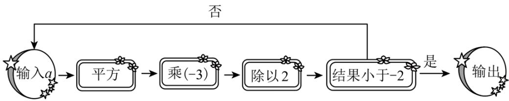
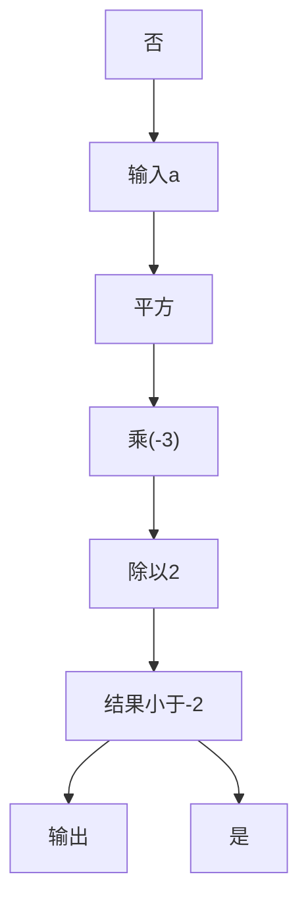
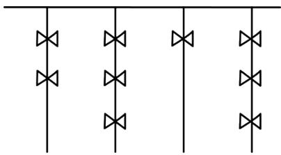
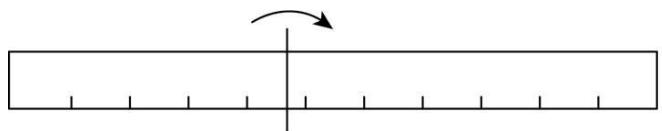
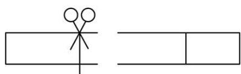
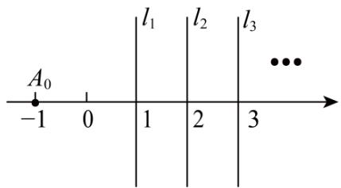
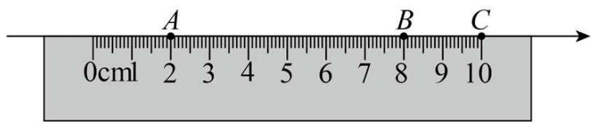
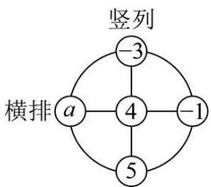
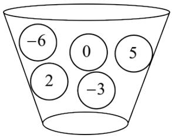
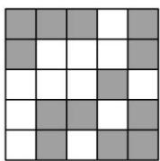

# 第二章 有理数及其运算·拔尖卷

# 【北师大版 2024】

参考答案与试题解析

# 第I卷

# 一．选择题（共10小题，满分30分，每小题3分）

1. （3 分）（24-25 七年级上·浙江杭州·期中）若 $x > 0$ ， $y < 0$ ， $x + y > 0$ ，则下列关系正确的是（）

A. $y < -x < -y < x$

B. $y < -x < x < -y$

C. -x<y<x<-y

D. $-x < y < -y < x$

【答案】D

【分析】此题主要考查了有理数大小比较的方法，由于 $x > 0$ ， $y < 0$ ， $x + y > 0$ ，则 $x > -y > 0$ ， $-x < y < 0$ ，进而可得答案.

【详解】解：∵x>0，y<0， $x+y>0$ ，

$$
\therefore x > - y > 0, \quad - x <   y <   0,
$$

$$
\therefore x > - y > 0 > y > - x,
$$

$$
\therefore - x <   y <   - y <   x,
$$

故选：D.

2. （3 分）（24-25 七年级上·河北保定·期末）下列各式中，运用运算律不正确的是（）

A. $(-4)\times8=8\times(-4)$

B. $-24 \times \frac{2}{5} \times \left(-\frac{1}{6}\right) = \frac{2}{5} \times \left[(-24) \times \left(-\frac{1}{6}\right)\right]$

C. $-4 \times \left(\frac{1}{3}\right) \times (-6) = (-4) \times \left(\left(\frac{1}{3}\right) \times (-6)\right)$

D. $-6 \times \left( \frac{1}{2} + \left( -\frac{1}{3} \right) \right) = (-6) \times \frac{1}{2} + \left( -\frac{1}{3} \right)$

【答案】D

【分析】本题主要考查了有理数乘法运算、乘法运算律等知识点，掌握相关运算法则成为解题的关键。根据有理数乘法运算、乘法运算律、有理数四则混合运算逐项化简即可。

【详解】解：A. $(-4)\times8=8\times(-4)$ 符合乘法交换律，正确，不符合题意；

B. $-24 \times \frac{2}{5} \times \left(-\frac{1}{6}\right) = \frac{2}{5} \times \left[(-24) \times \left(-\frac{1}{6}\right)\right]$ 符合乘法结合律，正确，不符合题意；

C. $-4 \times \left(\frac{1}{3}\right) \times (-6) = (-4) \times \left(\left(\frac{1}{3}\right) \times (-6)\right)$ 符合乘法结合律，正确，不符合题意；  
D. $-6\times\left(\frac{1}{2}+\left(-\frac{1}{3}\right)\right)=(-6)\times\frac{1}{2}+\left(-\frac{1}{3}\right)$ ，乘法和加法不能结合，错误，符合题意.

故选：D.

3. （3 分）（24-25 七年级下·青海西宁·期末）小杰同学在本学期学习了有关“低碳生活”的内容后，查阅资料得到数据：一个普通快递包装约排放出 200g 二氧化碳，一盆绿萝每天约吸收 0.15g 二氧化碳。若要将一个快递包装排放出来的二氧化碳在一天内全部被吸收，至少需要绿萝（）

A. 1332 盆

B. 1333 盆

C. 1334 盆

D. 1335 盆

【答案】C

【分析】本题考查除法运算的实际应用．需根据题意确定是否需要向上取整.

【详解】解：一个快递包装排放 200g 二氧化碳，每盆绿萝每天吸收 0.15g.

将总排放量除以每盆吸收量，即 $200\div0.15=1333.3$

由于绿萝盆数必须为整数，且 1333 盆仅能吸收 $1333 \times 0.15 = 199.95$ g，

剩余200-199.95=0.05g未被吸收，

因此需增加 1 盆，即至少需要 1334 盆，

1334 盆可吸收 $1334 \times 0.15 = 200.1$ g 满足全部吸收要求.

故选：C.

4. （3 分）（24-25 七年级上·陕西西安·期末）如图是小字用计算机设计的一个有理数运算的程序框图，若输入的数 $a$ 为 1，则输出的结果是（）



<details>
<summary>flowchart</summary>


</details>

A. $-\frac{27}{8}$

B. $\frac{27}{8}$

C. $-\frac{3}{2}$

D. $\frac{3}{2}$

【答案】A

【分析】本题主要考查对程序设计的理解和有理数的运算顺序，再代入计算求值即可.

【详解】解：根据题意可知，开始输入 a 的值为 1，

$$
\therefore 1 ^ {2} \times (- 3) \div 2 = - \frac {3}{2} > - 2;
$$

$$
\left(- \frac {3}{2}\right) ^ {2} \times (- 3) \div 2 = - \frac {2 7}{8} <   - 2
$$

∴输出的结果为 $-\frac{27}{8}$ .

故选：A.

5. （3 分）（2025·广西柳州·三模）“结绳计数”是远古时代人类智慧的结晶，即人们通过在绳子上打结来记录数量，类似我们现在熟悉的“进位制”，如图所示是一位古人记录的当天采摘果实的个数，在从右向左依次排列的不同绳子上打结，满四进一，根据图示可知，这位古人当天采摘果实的个数是（）



<details>
<summary>natural_image</summary>

Pure electrical circuit lines without any symbols
</details>

A. 186

B. 185

C. 184

D. 183

【答案】D

【分析】本题考查有理数的运算，读懂题意，理解古代记数规则，再转化为现代的十进制数是解决问题的关键.

【详解】解：根据题意，绳子上按照古代记数规则是2313，由于满四进一，将其转化为现在的十进制数为 $2 \times 4^{3} + 3 \times 4^{2} + 1 \times 4 + 3 \times 4^{0} = 183$ ，

故选：D.

6. （3 分）（23-24 七年级上·广东佛山·开学考试）“算 24 点”的游戏规则是：用“+，-，×，÷”…四种运算符号把给出的 4 个数字连接起来进行计算，要求最终算出的结果是 24，例如，给出 2，2，2，8 这四个数，可以列式 $(2\div2+2)\times8=24$ 。以下的 4 个数用“+，-，×，÷”四种运算符号不能算出结果为 24 的是（）

A. 1, 6, 8, 7

B. 1, 2, 3, 4

C. 4, 4, 10, 10

D. 6, 3, 3, 8

【答案】A

【分析】根据题意，逐项组合计算，即可作答.

【详解】A 项，1，6，8，7，不能算出结果为 24，故符合题意；

B 项， $(1+2+3)\times4=24$ ，能算出结果为 24，故不符合题意；

C 项， $(10 \times 10 - 4) \div 4 = 24$ ，能算出结果为 24，故不符合题意；

D 项， $(6+3)\times8\div3=24$ ，能算出结果为 24，故不符合题意；

故选：A.

【点睛】本题主要考查了数之间的混合运算，根据已有的数据灵活组合举例，是解答本题的关键.

7. （3 分）（23-24 七年级上·四川达州·期末）已知 $2^{1} = 2$ ， $2^{2} = 4$ ， $2^{3} = 8$ ， $2^{4} = 16$ ， $2^{5} = 32$ ，…，请你推算 $2^{2024}$ 的个位数字是（）

A. 8

B. 6

C. 4

D. 2

【答案】B

【分析】本题考查数学思想从特殊到一般，根据已知得出2的n次幂的尾数以2，4，8，6四个数字循环，据此求解可得.

【详解】解：∵ $2^{1}=2$ ， $2^{2}=4$ ， $2^{3}=8$ ， $2^{4}=16$ ，

又∵ $2^{5}=32,\quad2^{6}=64,\quad2^{7}=128,\quad2^{8}=256,\quad\cdots\cdots,$

观察可知，从 $2^{1}$ 开始，其个位数字以2、4、8、6四个为一组循环，

且 $1\div4=0\cdots1$ 、 $5\div4=1\cdots1$ 个位数字是2， $2\div4=0\cdots2$ 、 $6\div4=1\cdots2$ 个位数字是4， $3\div4=0\cdots3$ 、 $7\div4=1\cdots3$ 个位数字是8， $4\div4=1$ 、 $8\div4=2$ 个位数字是6，

∴2024÷4=506，无余数，即有 $2^{2024}$ 的个位数字是6，

故选：B.

8. （3 分）（24-25 七年级上·重庆沙坪坝·阶段练习）对于 $1 + 2 \times 3 - 4 \div 5$ ，不改变数字和运算符号的顺序，也不添加任何运算符号，对至少两个数添加括号后并计算出结果，称为一种“加括号操作”。例如： $(1 + 2 \times 3) - 4 \div 5 = \frac{31}{5}$ 是一种“加括号操作”， $\frac{31}{5}$ 是其运算结果： $(1 + 2) \times (3 - 4) \div 5 = -\frac{3}{5}$ 是一种“加括号操作”， $-\frac{3}{5}$ 是其运算结果，给出下列说法：

①至少存在一种“加括号操作”的运算结果是 $\frac{7}{5}$ ;  
②不存在任何“加括号操作”的运算结果是 $\frac{26}{5}$ ;  
③所有“加括号操作”共有7种不同的运算结果.

其中正确的个数是（）

A. 0

B. 1

C. 2

D. 3

【答案】D

【分析】将 $1+2\times3-4\div5$ 的“加括号操作”的所有结果计算出来即可得解.

本题主要考查了有理数混合运算，将 $1 + 2 \times 3 - 4 \div 5$ 的“加括号操作”的所有结果列出来，并进行正确的计算是解题的关键.

【详解】解：对于 $1+2\times3-4\div5$ ，进行“加括号操作”的所有结果如下：

$$
(1 + 2) \times 3 - 4 \div 5 = \frac {4 1}{5},
$$

$$
\begin{array}{l} (1 + 2 \times 3) - 4 \div 5 = \frac {3 1}{5}, \\ (1 + 2 \times 3 - 4) \div 5 = \frac {3}{5}, \\ 1 + (2 \times 3) - 4 \div 5 = \frac {3 1}{5}, \\ 1 + (2 \times 3 - 4) \div 5 = \frac {7}{5}, \\ 1 + (2 \times 3 - 4 \div 5) = \frac {3 1}{5}, \\ 1 + 2 \times (3 - 4) \div 5 = \frac {3}{5}, \\ 1 + 2 \times (3 - 4 \div 5) = \frac {2 7}{5}, \\ 1 + 2 \times 3 - (4 \div 5) = \frac {3 1}{5}, \\ (1 + 2) \times (3 - 4) \div 5 = - \frac {3}{5}, \\ (1 + 2) \times (3 - 4 \div 5) = \frac {3 3}{5}, \\ (1 + 2) \times 3 - (4 \div 5) = \frac {4 1}{5}, \\ (1 + 2 \times 3) - (4 \div 5) = \frac {3 1}{5}. \\ \end{array}
$$

观察以上结果发现：至少存在一种“加括号操作”的运算结果是 $\frac{7}{5}$ ，故①正确；

不存在任何“加括号操作”的运算结果是 $\frac{26}{5}$ ，故②正确；

所有“加括号操作”共有7种不同的运算结果，即 $\frac{41}{5}$ ， $\frac{31}{5}$ ， $\frac{3}{5}$ ， $\frac{7}{5}$ ， $\frac{27}{5}$ ， $-\frac{3}{5}$ ， $\frac{33}{5}$ ，故③正确.

故选：D.

9. （3 分）（24-25 八年级下·湖南湘西·阶段练习）已知 $y = |x - a| + |x - 20| + |x - a - 20|$ ，其中 $0 < a < 20$ ， $a \leq x \leq 20$ ，那么 $y$ 的最小值为( )

A. 40

B. 30

C. 20

D. 10

【答案】C

【分析】本题考查了一次函数的性质，化简绝对值；先化简绝对值，合并同类项后得到一次函数表达式，根据一次函数的性质，即可求解.

【详解】已知函数为 $y=|x-a|+|x-20|+|x-a-20|$ ，其中 0<a<20 且 $a\leq x\leq20$ ，

$$
\therefore | x - a | = x - a, \quad | x - 2 0 | = 2 0 - x, \quad | x - a - 2 0 | = a + 2 0 - x,
$$

$$
\therefore y = (x - a) + (2 0 - x) + (a + 2 0 - x) = - x + 4 0.
$$

$$
\because - 1 <   0,
$$

∴当 $a\leq x\leq20$ ，x取最大值20时，y取得最小值： $y_{最小}=-20+40=20.$

故选：C.

10. （3 分）（24-25 七年级上·湖南娄底·期末）下表列出了国外几个城市与北京的时差（正数表示同一时刻比北京时间早）.

<table><tr><td>城市</td><td>纽约</td><td>巴黎</td><td>东京</td></tr><tr><td>与北京的时差/h</td><td>-13</td><td>-7</td><td>+1</td></tr></table>

2025年元月6日19:00，我国中央广播电视总台综合频道CCTV-1《新闻联播》节目开始播放时，下列各城市的时间表示错误的是（）

A. 纽约是2025年元月6日6:00

B. 巴黎是2025年元月6日11:00

C. 东京是2025年元月6日20:00

D. 上海是2025年元月6日19:00

【答案】B

【分析】本题考查有理数加减的实际应用，正负数的应用，熟练掌握有理数加减法则是解题的关键；根据题意，分别计算纽约，巴黎，东京，上海在此时的时间，即可求解；

【详解】解：A、纽约与北京的时差为-13h，

$$
1 9 - 1 3 = 6,
$$

故纽约此时时间为：2025年元月6日6:00，

时间表示正确，不符合题意；

B、巴黎与北京的时差为-7h，

$$
1 9 - 7 = 1 2,
$$

故纽约此时时间为巴黎是2025年元月6日12:00，

时间表示错误，符合题意；

C、东京与北京的时差为+1h，

$$
1 9 + 1 = 2 0,
$$

故东京此时时间为2025年元月6日20:00，

时间表示正确，不符合题意；

D、上海与北京没有时差，故上海是2025年元月6日19:00，

时间表示正确，不符合题意；

故选：B

# 二．填空题（共6小题，满分18分，每小题3分）

11. （3 分）（24-25 七年级上·湖南邵阳·期末）若 $a, b$ 互为相反数， $c, d$ 互为倒数， $m$ 的绝对值最小的数，则 $2m - 2024(a + b) - cd$ 的值是 \_\_\_\_.

【答案】-1

【分析】本题考查代数式求值，解题的关键是掌握有理数混合运算顺序和运算法则及相反数性质、倒数的定义、绝对值的性质．先根据相反数性质、倒数的定义及绝对值的性质得出 $a+b=0,\quad cd=1,\quad m=0$ ，再代入计算即可.

【详解】解：∵a，b互为相反数，c，d互为倒数，m的绝对值最小的数，

$$
\therefore a + b = 0, c d = 1, m = 0,
$$

$$
\therefore 2 m - 2 0 2 4 (a + b) - c d = 0 - 0 - 1 = - 1
$$

故答案为：-1.

12. （3分）（24-25七年级上·湖北恩施·期末）已知： $m=\frac{|a+b|}{c}+\frac{2|c+b|}{a}+\frac{3|a+c|}{b}$ ，且abc>0， $a+b+c=0$ 。则m共有x个不同的值，若在这些不同的m值中，最小的值为y，则 $x-3y=$ \_\_\_\_

【答案】15

【分析】本题考查了绝对值意义，有理数加法运算，有理数除法运算，代数式求值．根据绝对值的意义分情况求出 m 的值，从而得出 x 的值，y 的值，然后再代入求值即可.

【详解】解：∵abc>0， $a+b+c=0$ ，

$$
\therefore a + b = - c, \quad b + c = - a, \quad c + a = - b,
$$

a, b, c 三个数中有两负一正，当 a, b 为负，c 为正数时，

$$
m = \frac {| a + b |}{c} + \frac {2 | b + c |}{a} + \frac {3 | c + a |}{b}
$$

$$
= \frac {| - c |}{c} + \frac {2 | - a |}{a} + \frac {3 | - b |}{b}
$$

$$
= \frac {c}{c} + \frac {- 2 a}{a} + \frac {- 3 b}{b}
$$

$$
= \frac {c}{c} - \frac {2 a}{a} - \frac {3 b}{b}
$$

$$
= 1 - 2 - 3
$$

$$
= - 4;
$$

当 a, c 为负，b 为正数时，

$$
\begin{array}{l} m = \frac {| a + b |}{c} + \frac {2 | b + c |}{a} + \frac {3 | c + a |}{b} \\ = \frac {| - c |}{c} + \frac {2 | - a |}{a} + \frac {3 | - b |}{b} \\ = \frac {- c}{c} + \frac {- 2 a}{a} + \frac {3 b}{b} \\ = - 1 + (- 2) + 3 \\ = 0; \\ \end{array}
$$

当 b, c 为负，a 为正数时，

$$
\begin{array}{l} m = \frac {| a + b |}{c} + \frac {2 | b + c |}{a} + \frac {3 | a + c |}{b} \\ = \frac {| - c |}{c} + \frac {2 | - a |}{a} + \frac {3 | - b |}{b} \\ = \frac {- c}{c} + \frac {2 a}{a} + \frac {- 3 b}{b} \\ = - 1 + 2 - 3 \\ = - 2; \\ \because - 4 <   - 2 <   0, \\ \end{array}
$$

∴m 共有 3 个不同的值，在这些不同的 m 值中，最小的值为 -4，

$$
\therefore x = 3, y = - 4,
$$

$$
\therefore x - 3 y = 3 + 1 2 = 1 5,
$$

故答案为：15.

13. （3 分）（24-25 七年级上·浙江杭州·期中）如图，在数轴上剪下一条 11 个单位长度（从 -2 到 9）的线段，并把这条线段沿某点折叠，然后在重叠部分某处剪一刀得到三条线段。若这三条线段的长度之比为 1:1:2，则折痕处对应的点所表示的数可能是 \_\_\_\_。



<details>
<summary>natural_image</summary>

Simple diagram showing a horizontal bar with tick marks and an arrow indicating rotation (no text or symbols)
</details>

折痕



<details>
<summary>natural_image</summary>

Simple line drawing of a stick figure on the left and a rectangle on the right (no text or symbols)
</details>

剪断处

【答案】 $\frac{17}{8}$ 或 $\frac{7}{2}$ 或 $\frac{39}{8}$

【分析】本题考查数轴翻折问题，两点之间的距离，分类讨论是解题的关键.

由线段总长度及三条线段的长度之比，可得三条线段的长度，再分情况讨论即可.

【详解】解：∵线段长为11，这三条线段的长度之比为1:1:2，

$$
\therefore 1 1 \div (1 + 1 + 2) = \frac {1 1}{4},
$$

∴这三条线段的长度分别为 $\frac{11}{4},\frac{11}{4},\frac{11}{2}$ ,

若剪下的第一条线段长为 $\frac{11}{4}$ ，第2条线段长度也为 $\frac{11}{4}$ ，

则折痕表示的数为： $\frac{11}{4}+\frac{11}{4}\times\frac{1}{2}+(-2)=\frac{17}{8}$ ;

若剪下的第一条线段长为 $\frac{11}{4}$ ，第2条线段长度为 $\frac{11}{2}$ ，

则折痕表示的数为： $\frac{11}{4}+\frac{11}{2}\times\frac{1}{2}+(-2)=\frac{7}{2}$ ;

若剪下的第一条线段长为 $\frac{11}{2}$ , 第 2 条线段长度为 $\frac{11}{4}$ ,

则折痕表示的数为： $\frac{11}{2}+\frac{11}{4}\times\frac{1}{2}+(-2)=\frac{39}{8}$ ;

∴折痕表示的数为 $\frac{17}{8}$ 或 $\frac{39}{2}$ 或 $\frac{39}{8}$ ,

故答案为： $\frac{17}{8}$ 或 $\frac{7}{2}$ 或 $\frac{39}{8}$ .

14. （3分）（2025·陕西咸阳·二模）高斯被认为是历史上最杰出的数学家之一，享有“数学王子”之称。现有一种高斯定义的计算式，已知 $[x]$ 表示不超过 $x$ 的最大整数，例如 $[-0.8] = -1$ 。现定义 $\{x\} = x + [x]$ ，例如 $\{x\} = 1.5 + [1.5] = 2.5$ ，则 $\{-2.5\} =$ \_\_\_\_.

【答案】-5.5

【分析】本题主要考查了有理数的大小比较，有理数的加减混合运算，新定义运算，解题关键是理解新定义运算.

根据[x]表示不超过x的最大整数求解，列式计算.

【详解】由题意得： $\{-2.5\}=-2.5+[-2.5]=-2.5-3=-5.5.$

15. （3 分）（2025·北京门头沟·二模）某快递公司因天气原因需将五种货物进行延迟配送，每名配送员每次只能配送一种货物，从配送开始起进行计时，每延迟一分钟需赔付 1 元，忽略其它因素的影响，五种货物的配送时间如下表：

<table><tr><td>货物</td><td>A</td><td>B</td><td>C</td><td>D</td><td>E</td></tr><tr><td>配送时间(分钟)</td><td>5</td><td>8</td><td>9</td><td>7</td><td>10</td></tr></table>

(1) 如果由一名配送员进行配送, 那么下列三个配送顺序: ① $D \rightarrow B \rightarrow E \rightarrow A \rightarrow C$ ; ② $D \rightarrow A \rightarrow C \rightarrow E \rightarrow B$ ; ③ $C \rightarrow A \rightarrow E \rightarrow B \rightarrow D$ 中, 赔付最少的是\_\_\_\_（填序号）;

(2) 如果由两名配送员同时进行配送, 最少需要赔付\_\_\_\_元.

【答案】 ② 64

【分析】本题考查了有理数的加法和乘法混合运算的实际应用，找出方案是解题的关键.

（1）分别计算三种情况赔付的钱，求解判断即可；  
(2) 因为赔付最少, 就要使配送的时间尽量短, 显然先配送时间短的即可, 所以先配送 $A$ 和 $D$ 时间短的, 一名配送员按 $A$ , $B$ , $E$ 的顺序送, 另一名配送员按 $D$ , $C$ 的顺序送, 配送赔付最少, 据此计算即可.

【详解】解：（1）①总赔付： $5 \times 7 + 4 \times 8 + 3 \times 10 + 2 \times 5 + 9 = 116$ （元），

②总赔付： $5 \times 7 + 4 \times 5 + 3 \times 9 + 2 \times 10 + 8 = 110$ （元），  
③总赔付： $5 \times 9 + 4 \times 5 + 3 \times 10 + 2 \times 8 + 7 = 118$ （元），

∴赔付最少的是②，

故答案为：②；

(2) 解: 因为赔付最少, 就要使配送的时间尽量短, 显然先配送时间短的, 所以先配送 $A$ 和 $D$ 时间短的; 然后再配送剩下的时间的短的, 最后一名配送员配送时间最长的,

一名配送员按A，B，E的顺序送，另一名配送员按D，C的顺序送，配送最少，

A, B, E 配送赔付: $5 \times 3 + 8 \times 2 + 10 \times 1$ （元），

D, C配送赔付: $7 \times 2 + 9$ (元),

共需要最少赔付： $5 \times 3 + 8 \times 2 + 10 \times 1 + 7 \times 2 + 9 = 64$ （元），

故答案为：64.

16. （3 分）（23-24 七年级上·陕西西安·阶段练习）如图，过数轴上表示1的点作数轴的垂线 $l_{1}$ ，过数轴上表示2的点作数轴的垂线 $l_{2}$ ，过数轴上表示3的点作数轴的垂线 $l_{3}$ ，…．已知点 $A_{0}$ 表示的数为-1，将点 $A_{0}$ 沿直线 $l_{1}$ 翻折得到点 $A_{1}$ ，将点： $A_{1}$ 沿直线 $l_{2}$ 翻折得到点 $A_{2}$ ，将点 $A_{2}$ 沿直线 $l_{3}$ 翻折得到点 $A_{3}$ ，…则 $A_{2021}$ 表示的数为\_\_\_\_.



<details>
<summary>text_image</summary>

A₀
-1 0 | l₁ | l₂ | l₃
1 2 3
</details>

【答案】2023

【分析】此题考查了数字类规律问题，首先根据题意得到点 $A_{1}$ ， $A_{2}$ ， $A_{3}$ ， $A_{4}$ ， $A_{5}$ ， $A_{6}$ 分别表示的数，然后找到规律求解即可.

【详解】解：∵点 $A_{0}$ 表示的数为-1，

∴将点 $A_{0}$ 沿直线 $l_{1}$ 翻折得到点 $A_{1}$ ，点 $A_{1}$ 表示的数为3，  
∴将点 $A_{1}$ 沿直线 $l_{2}$ 翻折得到点 $A_{2}$ ，点 $A_{2}$ 表示的数为1，  
∴将点 $A_{2}$ 沿直线 $l_{3}$ 翻折得到点 $A_{3}$ ，点 $A_{3}$ 表示的数为5，  
∴将点 $A_{3}$ 沿直线 $l_{4}$ 翻折得到点 $A_{4}$ ，点 $A_{4}$ 表示的数为3，  
∴将点 $A_{4}$ 沿直线 $l_{5}$ 翻折得到点 $A_{5}$ ，点 $A_{5}$ 表示的数为7，  
∴将点 $A_{5}$ 沿直线 $l_{6}$ 翻折得到点 $A_{6}$ ，点 $A_{6}$ 表示的数为5，

...

$$
\therefore A _ {2 n} = 2 n - 1, \quad A _ {2 n + 1} = 2 n + 1 + 2 = 2 n + 3,
$$

$\therefore A_{2021}$ 表示的数为2023.

故答案为：2023.

# 第II卷

# 三．解答题（共8小题，满分72分）

17. （6 分）（24-25 七年级上·贵州六盘水·期末）计算：

(1)(-9)-(-14)+(-10)-(-15);   
(2) $32\div(-2)^{3}-\left(-\frac{1}{8}\right)\times(-4)$ .

【答案】(1)10

(2) $-\frac{9}{2}$

【分析】本题主要考查了含乘方的有理数混合计算，有理数的加减计算，熟知相关计算法则是解题的关键.

（1）根据有理数的加减计算法则求解即可；  
(2) 先计算乘方, 再计算乘除法, 最后计算减法即可得到答案.

【详解】（1）解：原式 $=-9+14-10+15$

$$
\begin{array}{l} = 5 - 1 0 + 1 5 \\ = - 5 + 1 5 \\ = 1 0; \\ \end{array}
$$

(2) 解: 原式= $32\div(-8)-\left(-\frac{1}{8}\right)\times(-4)$

$$
\begin{array}{l} = - 4 - \frac {1}{2} \\ = - \frac {9}{2}. \\ \end{array}
$$

18. （6分）（2025·河北邯郸·一模）如图，以1cm为1个单位长度，用直尺画数轴，数轴上的点A, B, C 刚好对着直尺上的刻度2、刻度8和刻度10．设点A, B, C所表示的数的和是p，该数轴的原点为O.



<details>
<summary>text_image</summary>

A
B
C
0cm1 2 3 4 5 6 7 8 9 10
</details>

(1)分别计算出原点O与点C重合时、与AB的中点重合时p的值.   
(2)原点O沿着数轴每向左移动1cm，p的值将会如何变化？当p的值为-4时，求原点O的位置.

【答案】(1)当原点O与点C重合时，p=-10；当原点O与AB的中点重合时，p=5

(2)p的值将会增大3，原点O在点B处

【分析】本题考查了数轴，相反数，有理数的加减运算，数轴上点的特点，解题的关键是熟练掌握数轴上点的特点.

(1) 求出当原点 $O$ 与点 $C$ 重合时, 点 $A 、 B 、 C$ 表示的数, 再求出 $p$ 的值; 先求出原点 $O$ 与 $A B$ 的中点重合时, 点 $C$ 表示的数, 然后再求出 $p$ 的值即可;  
(2) 根据数轴特点, 得出原点 $O$ 沿着数轴每向左移动 $1 \mathrm{~cm}$ , 点 $A 、 B 、 C$ 表示的数分别增加 1 , 根据 $p = -4$ 时,得出 $p$ 增大了 6 , 从而得出原点 $O$ 从与点 $C$ 重合的位置, 向左移动 $2 \mathrm{~cm}$ , 能得到 $p = -4$ .

【详解】（1）解：∵当原点O与点C重合时，点A表示的数为-8，点B表示的数为-2，点C表示的数为0，
∴p=-8-2+0=-10,

当原点O与AB的中点重合时，点A，B表示的数为一对相反数，

∴此时点C表示的数为 $\frac{8-2}{2}+(10-8)=5$ ,

$$
\therefore p = 0 + 5 = 5.
$$

(2) 解: 原点 $O$ 沿着数轴每向左移动 $1 \mathrm{~cm}$ , 点 $A 、 B 、 C$ 表示的数分别增加 1, 则 $p$ 的值将会增大 3, 当 $p = -4$ 时, $-4 - (-10) = 6$ ,

$$
\because 6 \div 3 = 2,
$$

∴原点O从与点C重合的位置，向左移动2cm，能得到p=-4，

此时原点O在点B处.

19. （8 分）（2025·河北廊坊·二模）如图，在一个圆形转盘上，标有五个有理数.



<details>
<summary>flowchart</summary>

```mermaid
graph TD
    A["4"] --> B["-3"]
    A --> C["-1"]
    A --> D["5"]
    A --> E["a"]
    style A fill:#f9f,stroke:#333
    style B fill:#ccf,stroke:#333
    style C fill:#ccf,stroke:#333
    style D fill:#ccf,stroke:#333
    style E fill:#ccf,stroke:#333
    note right of A "竖列"
    note left of A "横排"
```
</details>

(1)求这已知的四个数的积;   
(2)若横排三个数的和与竖列三个数的和相等.

①求 a 的值:

②求a，4，5，-1这四个数的平均数.

【答案】(1)60

(2)①a=3；②四个数的平均数为 $2\frac{3}{4}$

【分析】本题主要考查了有理数的加法，求平均数，解一元一次方程：

（1）根据有理数的加法法则计算即可；

(2) ①根据题意列出关于 $a$ 的一元一次方程, 求解即可; ②由①知 $a$ 的值, 根据平均数的计算公式求解即可.

【详解】（1）解： $(-3)\times(-1)\times4\times5=60$

即这已知的四个数的积为 60;

(2) 解: ①∵横排三个数的和与竖列三个数的和相等,

$$
\therefore a + 4 + (- 1) = (- 3) + 4 + 5,
$$

解得：a=3;

② $\frac{3+4+5+(-1)}{4}=2\frac{3}{4}$

即这四个数的平均数为 $2\frac{3}{4}$ .

20. （8 分）（24-25 八年级下·四川广安·阶段练习）下表是某水库一星期内的水位（单位：米）变化情况：

<table><tr><td>星期</td><td>一</td><td>二</td><td>三</td><td>四</td><td>五</td><td>六</td><td>日</td></tr><tr><td>水位变化</td><td>+2.4</td><td>+0.6</td><td>-4.0</td><td>-1.6</td><td>+3.5</td><td>+2.0</td><td>-1.5</td></tr></table>

注：该水库的警戒水位是 35.5 米．表格中“+”表示比警戒水位高，“-”表示比警戒水位低.

(1)该水库这星期水位最高的一天是星期\_\_\_\_，这一天的实际水位是\_\_\_\_米.

(2)若规定水位比前一天上升用“+”，比前一天下降用“-”，不升不降用“0”。请补全下面的这星期水位（单

位：米）变化表.

<table><tr><td>星期</td><td>一</td><td>二</td><td>三</td><td>四</td><td>五</td><td>六</td><td>日</td></tr><tr><td>水位变化</td><td>+3.1</td><td></td><td></td><td>+2.4</td><td></td><td>-1.5</td><td>-3.5</td></tr></table>

(3)上一星期日该水库的水位是多少？与上星期日相比，这一星期日该水库水位是上升了，还是下降了？变化了多少？

【答案】(1)五；39

(2)见解析   
(3)34.8米，下降了，下降了0.8米

【分析】本题考查正负数的实际应用，有理数运算的实际应用，读懂题意，正确的列出算式，是解题的关键：

（1）找到表格中数据的最大数据，进行判断和求解即可；  
（2）根据题意，列出算式，填表即可；  
(3) 利用周一的实际水位减去变化量求出上一星期日的水位, 求出图 (2) 表格中数据的和, 进行判断即可.

【详解】（1）解：由表格可知，该水库这星期水位最高的一天是星期五，这一天的实际水位是 $35.5 + 3.5 = 39$ 米

(2) 0.6-2.4=-1.8, -4.0-0.6=-4.6, $3.5-(-1.6)=+5.1$ ,

填表如下:

<table><tr><td>星期</td><td>一</td><td>二</td><td>三</td><td>四</td><td>五</td><td>六</td><td>日</td></tr><tr><td>水位变化</td><td>+3.1</td><td>-1.8</td><td>-4.6</td><td>+2.4</td><td>+5.1</td><td>-1.5</td><td>-3.5</td></tr></table>

（3）上一星期日的水位为 $35.5+2.4-3.1=37.9-3.1=34.8$ （米）.

+3.1-1.8-4.6+2.4+5.1-1.5-3.5=-0.8（米），

所以与上一星期日相比，这一星期日该水库水位是下降了，下降了0.8米.

21. （10 分）（24-25 七年级上·广东佛山·阶段练习）对于含绝对值的算式，在有些情况下，可以不需要计算出结果也能将绝对值符号去掉，例如： $|9-8|=9-8$ ; $|8-9|=9-8$ ; $\left|\frac{1}{8}-\frac{1}{9}\right|=\frac{1}{8}-\frac{1}{9}$ ; $\left|\frac{1}{9}-\frac{1}{8}\right|=\frac{1}{8}-\frac{1}{9}$ .

观察上述式子的特征，解答下列问题：

(1)把下列各式写成去掉绝对值符号的形式（不用写出计算结果）：① $|35-84|=$ ；

② $\left|\frac{11}{14}-\frac{11}{16}\right|=-$ .

(2)当a>b时， $|a-b|=_{-}$ ；当a<b时， $|a-b|=_{-}$ .

(3)计算： $\left|\frac{1}{3}-\frac{1}{2}\right|+\left|\frac{1}{4}-\frac{1}{3}\right|+\left|\frac{1}{5}-\frac{1}{4}\right|+\cdots+\left|\frac{1}{2025}-\frac{1}{2024}\right|$

【答案】(1)①84-35；② $\frac{11}{14}-\frac{11}{16}$ ;

(2)a-b, b-a;

(3) $\frac{2023}{4050}$

【分析】本题考查了绝对值，有理数的加减运算，正数的绝对值等于它本身，负数的绝对值等于它的相反数，熟练掌握该知识点是解题的关键.

(1) ①根据正数的绝对值等于它本身, 负数的绝对值等于它的相反数, 即可得到答案; ②根据正数的绝对值等于它本身, 负数的绝对值等于它的相反数, 即可得到答案;  
（2）根据正数的绝对值等于它本身，负数的绝对值等于它的相反数，即可得到答案；  
（3）根据正数的绝对值等于它本身，负数的绝对值等于它的相反数，先去绝对值符号，然后计算即可.

【详解】（1）解：①∵35<84，

$$
\therefore | 3 5 - 8 4 | = 8 4 - 3 5;
$$

②∵ $\frac{11}{14}>\frac{11}{16}$ ,

$$
\therefore \left| \frac {1 1}{1 4} - \frac {1 1}{1 6} \right| = \frac {1 1}{1 4} - \frac {1 1}{1 6};
$$

故答案为：①84-35；② $\frac{11}{14}-\frac{11}{16}$ ;

(2) 解: 当 $a > b$ 时, $|a - b| = a - b$

当a<b时， $|a-b|=b-a$

故答案为：a-b，b-a;

（3）解： $\left|\frac{1}{3}-\frac{1}{2}\right|+\left|\frac{1}{4}-\frac{1}{3}\right|+\left|\frac{1}{5}-\frac{1}{4}\right|+\cdots+\left|\frac{1}{2025}-\frac{1}{2024}\right|$

$$
\begin{array}{l} = \frac {1}{2} - \frac {1}{3} + \frac {1}{3} - \frac {1}{4} + \frac {1}{4} - \frac {1}{5} + \dots + \frac {1}{2 0 2 4} - \frac {1}{2 0 2 5} \\ = \frac {1}{2} - \frac {1}{2 0 2 5} \\ = \frac {2 0 2 3}{4 0 5 0} \\ \end{array}
$$

22. （10 分）（2025·河北唐山·二模）如图，容器中装有 5 个小球，小球上分别标有数字：-6，0，5，2，

-3. 现从容器中随机摸出四个小球，对小球上的数字进行运算.



<details>
<summary>text_image</summary>

-6
0
5
2
-3
</details>

(1)①若摸出的四个小球上分别标有 2, -6, 0, -3, 计算: $2 \times (-6) - 0 - (-3)$ ;

②若摸出的四个数字的积不为0，求这四个数字的和；

(2)将摸出的四个小球上的数字按一定顺序填入“□-□-□-□”中的“□”内，计算所得算式的结果，直接写出计算结果的最小值.

【答案】(1)①-9，②-2

(2)-13

【分析】此题考查了有理数的混合运算，根据题意正确列式是关键.

(1) ①利用有理数的四则混合运算法则计算即可; ②根据题意得到摸出的四个数字为-6, 5, 2, -3. 再求和即可;

(3) 根据题意列式计算即可.

【详解】（1）解：① $2\times(-6)-0-(-3)$

$$
= - 1 2 - 0 + 3
$$

$$
= - 9
$$

②∵摸出的四个数字的积不为0，

∴摸出的四个数字为-6，5，2，-3.

$$
- 6 + 5 + 2 - 3
$$

$$
= - 6 - 3 + 5 + 2
$$

$$
= - 9 + 7
$$

$$
= - 2
$$

(2) 当摸出的四个小球上的数字为 -6, 0, 5, 2 时, 计算结果最小,

即-5-0-6-2=-13，即计算结果的最小值为-13.

23. （12 分）（24-25 七年级上·辽宁鞍山·阶段练习）乒乓球，被称为“国球”，在中华大地有着深厚的群众基础。2000 年 2 月 23 日，国际乒乓球大会决定从 2000 年 10 月 1 日起，乒乓球比赛将使用直径40mm、重量2.7g的大球，以取代38mm的小球。某工厂按要求加工一批标准化的直径为40mm乒乓球，但是实际生产的乒乓球直径可能会有一些偏差。随机抽查检验该批加工的 10 个乒乓球直径并记录如下：-0.4，-0.2，-0.1，-0.1，-0.1，-0.05，+0.1，+0.2，+0.3，+0.5（“+”表示超出标准；“-”表示不足标准）。

(1)其中偏差最大的乒乓球直径是\_\_\_\_mm;

(2)抽查的这 10 个乒乓球中, 最符合标准的乒乓球的直径是\_\_\_\_mm?

(3)若误差在“±0.25mm”以内的球可以作为合格产品, 误差在“±0.15mm”以内的球可以作为良好产品, 这 10个球的合格率是\_\_\_\_; 良好率是\_\_\_\_.

【答案】(1)40.5

(2)39.95

(3)70%, 50%

【分析】此题考查了正数和负数的意义，解题的关键是理解正和负的相对性，明确什么是一对具有相反意义的量.

(1) 根据题意列式计算即可;

(2) 根据绝对值的定义即可得到结论;

(3) 根据误差在“±0.25mm”以内的球可以作为合格产品, 误差在“±0.15mm”以内的球可以作为良好产品分别占总数的百分比, 即可求解.

【详解】（1）解：其中偏差最大的乒乓球的直径是 $40mm+0.5mm=40.5mm$ ;

(2) 解: $\because -0.4, -0.2, -0.1, -0.1, -0.1, -0.05, +0.1, +0.2, +0.3, +0.5$ 中绝对值最小的是 $-0.05$ , $\therefore$ 抽查的这 10 个乒乓球中, 最符合标准的乒乓球的直径是 $40 - 0.05 = 39.95 \mathrm{~mm}$ ;

（3）解：∵-0.4，-0.2，-0.1，-0.1，-0.1，-0.05，+0.1，+0.2，+0.3，+0.5，

误差在“±0.25mm”以内的球可以作为合格产品，

∴合格的有-0.2，-0.1，-0.1，-0.1，-0.05，+0.1，+0.2，

这些球的合格率是 $\frac{7}{10}\times100\%=70\%$ ;

∵误差在“±0.15mm”以内的球可以作为良好产品，

∴良好产品有-0.1，-0.1，-0.1，-0.05，+0.1，

∴良好率为 $\frac{5}{10}\times100\%=50\%$ ;

24. （12 分）（24-25 七年级下·河北廊坊·阶段练习）生活在数字时代的我们，很多场合使用二维码来表示不同的信息，类似的，可通过正方形网格中，对每个小正方格涂黑色或不涂色所得的图形来表示不同的信息。在代码编制上巧妙利用构成计算机内部逻辑基础的“0”，“1”，使用若干个与二进制相对应的几何图形来表示数值（黑色代表 1，白色代表 0）。如图 1 是某校一次考试中三位同学的准考证号对应的二维码的简易编码。如图 2 是王芳同学准考证号的二维码简易编码，其中第一行代表二进制的数字 11000，转化成 10 进制为： $1 \times 2^{4} + 1 \times 2^{3} + 0 \times 2^{2} + 0 \times 2^{1} + 0 \times 1 = 24$ 。同理，第二行至第五行代表二进制的数字分别为 1100，111，11100，1101，转化成 10 进制为：12，07，28，13，将五行编码有序组合在一起就是王芳的准考证号 2412072813，其中第一行编码“24”表示区县，第二行编码“12”表示学校，第三行编码“07”表示班级，第四行编码“28”表示考场号，第五行编码“13”表示座位号。

(1) 如图 3 是本次考试张亮同学准考证号的二维码简易编码, 其中第四行代表二进制的数字是 10101, 转化成 10 进制后可得他的考场号是 \_\_\_\_.  
(2) 本次考试中, 赵军的准考证号是 2917021311, 如图 4 是赵军为自己绘制的二维码简易编码, 但少涂黑了 3 个小正方形, 请你在图 4 中帮他补充完整, 在补充的方格中画.

【答案】（1）21 （2）见解析

【分析】本题主要考查了二进制与十进制数字转化、有理数运算等知识，熟练掌握二进制与十进制转化规则是解题关键.

（1）根据二维码编码规则即可确定第四行代表二进制的数字，再将其转化为10进制数字即可；  
(2) 根据题意可知赵军的准考证号是2917021311, 由二进制和十进制数字转化规则确定各行编码二进制数字, 即可获得答案.

【详解】解：（1）根据题意得，第四行代表二进制的数字是10101，

二进制的数字10101，转化成10进制为： $1 \times 2^{4} + 0 \times 2^{3} + 1 \times 2^{2} + 0 \times 2^{1} + 1 \times 2^{0} = 16 + 0 + 4 + 0 + 1 = 21$ ，

∴转化成10进制后可得他的考场号是21，

故答案为：21;

（2）准考证号2917021311，分别将29，17，02，13，11转化为二进制，

$$
2 9 = 1 \times 2 ^ {4} + 1 \times 2 ^ {3} + 1 \times 2 ^ {2} + 0 \times 2 ^ {1} + 1 \times 1,
$$

29转化为二进制为：11101，

$$
1 7 = 1 \times 2 ^ {4} + 0 \times 2 ^ {3} + 0 \times 2 ^ {2} + 0 \times 2 ^ {1} + 1 \times 1,
$$

17转化为二进制为：10001，

$$
2 = 1 \times 2 ^ {1} + 0 \times 1,
$$

02转化为二进制为：10，

$$
1 3 = 1 \times 2 ^ {3} + 1 \times 2 ^ {2} + 0 \times 2 ^ {1} + 1 \times 1,
$$

13转化为二进制为：1101，

$$
1 1 = 1 \times 2 ^ {3} + 0 \times 2 ^ {2} + 1 \times 2 ^ {1} + 1 \times 1,
$$

11转化为二进制为：1011，

如图所示:

