# 第二章 有理数及其运算（举一反三讲义）全章题型归纳

【北师大版 2024】

# 题型归纳

# 【培优篇】....8

【题型1 正负数的意义】....8

【题型 2 相反意义的量】....9

【题型3 有理数的概念及分类】....9

【题型4 数轴上的点与有理数之间的关系】....10

【题型 5 相反数】....11

【题型6 绝对值】....11

【题型 7 有理数的大小比较】....12

【题型 8 有理数的加法与减法】....12

【题型 9 有理数的乘法与除法】....13

【题型 10 倒数】....14

【题型11有理数的乘方】 14

【题型 12 科学记数法】....15

【题型 13 近似数】....16

# 【拔尖篇】……教辅资源，关注公众号★全科AA+……16

【题型 14 正负数的实际应用】....16

【题型 15 数轴上整点问题】....17

【题型 16 利用相反数化简多重符号】....18

【题型 17 绝对值的非负性】....18

【题型18有理数大小比较的实际应用】....19

【题型 19 绝对值与乘方的非负性】....20

【题型20绝对值中的分类讨论及最值问题】....20

【题型 21 结合倒数、相反数、绝对值等的计算】....21

【题型 22 结合数轴判断结论正误】....21

【题型 23 有理数的实际应用】....22

【题型 24 数轴中的动点问题】....24

# 举一反三

# 知识点 1 正数和负数的概念

# 1. 正数和负数的定义:

<table><tr><td></td><td>定义</td><td>示例</td><td>补充</td></tr><tr><td>正数</td><td>大于0的数叫做正数.有时,为了明确表达意义,在正数的前面也加上符号“+”(读作“正”)</td><td>3,1.8%,3.5, $\frac{3}{5}$ 都是正数</td><td>正数前的“+”可以省略不写</td></tr><tr><td>负数</td><td>在正数前加上符号“-”的数叫作负数</td><td>-3,-2.7%,- $\frac{3}{4}$ ,-4都是负数</td><td>负数前的“-”不能省略</td></tr></table>

2. 注意：0 既不是正数，也不是负数。

3.0 的意义

(1) 0 是正负数的分界;  
(2) 0 可以表示“没有”;  
（3）0 可以用来表示基准，一般地，高于基准的量用数表示，低于基准的量用负数表示.

# 知识点 2 具有相反意义的量

1. 定义：在日常生活中，人们常用正数、负数来表示一对具有相反意义的量.  
2. 表示方法: 一般地, 对于具有相反意义的量, 我们可以把其中一种意义的量规定为正的, 并用正数来表示, 把与它意义相反的量规定为负的, 并用负数来表示.

例如：若规定海平面的海拔高度为 0m，珠穆朗玛峰高于海平面 8848.86 m, 记作 +8 848.86 m.

# 知识点3 有理数

1. 定义: 正整数、0、负整数统称为整数; 正分数和负分数统称为分数; 整数可以写成分数的形式; 可以写成分数形式的数称为有理数.  
2. 有理数的分类:

<table><tr><td>按有理数的定义分类</td><td>按有理数的性质符号分类</td></tr><tr><td>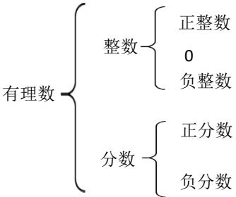</td><td>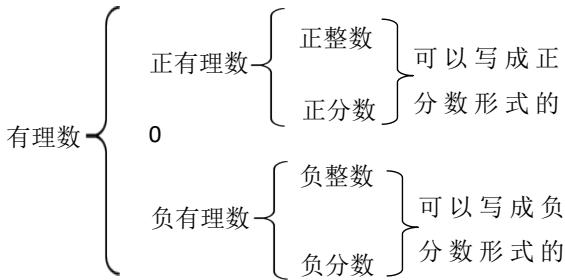</td></tr></table>

# 3. 各类数的含义:

<table><tr><td>名称</td><td>描述</td><td rowspan="5"></td><td>名称</td><td>描述</td></tr><tr><td>正整数</td><td>大于0的整数</td><td>负整数</td><td>小于0的整数</td></tr><tr><td>正分数</td><td>大于0的分数</td><td>负分数</td><td>小于0的分数</td></tr><tr><td>非负数</td><td>正数和0</td><td>非正数</td><td>负数和0</td></tr><tr><td>非正整数</td><td>负整数和0</td><td>非负整数</td><td>正整数和0</td></tr></table>

# 知识点4 数轴

定义：规定了原点、正方向和单位长度的直线叫作数轴，它满足以下条件：

(1) 在直线上任取一个点表示数 0，这个点叫作原点；  
(2) 通常规定直线上从原点向右 (或上) 为正方向, 从原点向左 (或下) 为负方向;  
(3) 选取适当的长度为单位长度, 直线上从原点向右, 每隔一个单位长度取一个点, 依次表示 $1, 2, 3, \dots$ ; 从原点向左, 用类似的方法依次表示 $-1, -2, -3, \dots$ .

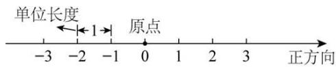

text_image

单位长度
←1→
原点
-3 -2 -1 0 1 2 3 正方向

# 知识点 5 数轴上的点与有理数之间的关系

1. 每个有理数都可以用数轴上的一点来表示，也可以说，每个有理数都对应数轴上的一点。  
2. 一般地, 设 $a$ 是一个正数, 则数轴上表示数 $a$ 的点在数轴的正半轴上, 与原点的距离是 $\underline{a}$ 个单位长度; 表示数 $-a$ 的点在数轴的负半轴上, 与原点的距离是 $\underline{a}$ 个单位长度.

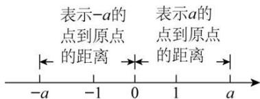

text_image

表示-a的
点到原点
的距离
表示a的
点到原点
的距离
-a -1 0 1 a

# 知识点6 相反数

1. 相反数的定义: 像3和-3, $\frac{1}{2}$ 和 $-\frac{1}{2}$ 这样只有符号不同的两个数, 互为相反数.

2. 相反数的表示方法: 一般地, $a$ 和 $-a$ 互为相反数. 这里, $a$ 表示任意一个数, 可以是正数、负数, 也可以是 $\mathbf{0}$ .

例如：当 $a = 1$ 时， $-a = -1$ ，1的相反数是-1，同时，-1的相反数是1.

特别地，0 的相反数是 0.

3. 相反数的几何意义：到数轴原点距离相等的两个点表示的两个数互为相反数.

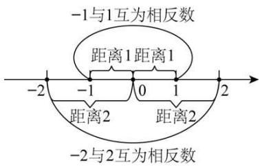

text_image

-1与1互为相反数
距离1距离1
-2 -1 0 1 2
距离2 距离2
-2与2互为相反数

4. 求一个数的相反数：在任意一个数前面添上“=”号，新的数就表示原数的相反数.  
5. 多重符号的化简：与“+”号个数无关，有奇数个“-”号，结果为负，有偶数个“-”号，结果为正.

# 知识点7 绝对值

1. 定义: 一般地, 数轴上表示数 $a$ 的点与原点的距离叫作数 $a$ 的绝对值, 记作 $|a|$ .  
2. 绝对值的判断: 一个正数的绝对值是它本身, 一个负数的绝对值是它的相反数, 0 的绝对值是 0. 即如果 $a > 0$ , 那么 $|a| = \underline{a}$ ; 如果 $a = 0$ , 那么 $|a| = \underline{0}$ ; 如果 $a < 0$ , 那么 $|a| = -\underline{a}$ .  
3. 绝对值非负性的应用：根据绝对值的非负性“若几个非负数的和为0，则每一个非负数必为0”，即若 $|a| + |b| = 0$ ，则 $|a| = 0$ 且 $|b| = 0$ .

# 知识点 8 有理数的大小比较

教辅资源，关注公众号★全科AA+

1. 利用数轴比较大小: 在水平的数轴上表示有理数, 它们从左到右的顺序, 就是从小到大的顺序, 即左边的数小于右边的数.  
2. 利用有理数的分类比较大小：一般地，正数大于0，0大于负数，正数大于负数；两个负数，绝对值大的反而小.  
3. 作差法: 若两数分别为 a, b, a-b > 0，则 a > b；若 a-b < 0，则 a < b；若 a-b = 0，则 a = b.

知识点 9 有理数加法法则

<table><tr><td>同号两数相加</td><td>和取相同的符号,且和的绝对值等于加数的绝对值的和</td><td>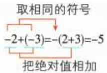</td></tr><tr><td>异号两数相加</td><td>绝对值不相等的异号两数相加,和取绝对值较大的加数的符号,且和的绝对值等于加数的绝对值中较大者与较小者的差互为相反数的两个数相加得0</td><td>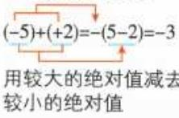a,b互为相反数,则a+b=0</td></tr><tr><td>一个数与0相加</td><td>仍得这个数</td><td>0+a=a</td></tr></table>

# 知识点 10 有理数加法运算律

1. 有理数的加法中，两个数相加，交换加数的位置，和不变．加法交换律： $a + b = b + a$   
2. 在有理数的加法中，三个数相加，先把前两个数相加，或者先把后两个数相加，和不变．加法结合律：

$$
(a + b) + c = a + (b + c).
$$

# 知识点 11 有理数减法法则

1. 减去一个数，等于加这个数的相反数，即 $a-b = a + (-b)$ .  
2. 有理数的减法是有理数的加法的逆运算.  
3. 减法转化为加法时，减数一定要改变符号.

# 知识点 12 有理数加减混合运算

# 1. 有理数加减混合运算

(1) 先将加减法统一成加法, 再运用加法的交换律和结合律简化运算.   
(2) 运用加法交换律交换加数的位置时, 要连同前面的符号一起交换.

2. 省略加号的和式及读法：统一成加法运算的算式，可以改写成省略加号和括号的形式，这种形式的算式一般有两种读法．例如： $-2-3+27-24$ ，可读作负2、负3、正27、负24的和，也可以读作负2减3加27减24.

# 3. 有理数加减混合运算的一般步骤

<table><tr><td>方法一:减法转化成加法</td><td>方法二:省略括号法</td></tr><tr><td>(1)减法变加法:a+b-c=a+b+(-c)</td><td>(1)省略括号</td></tr><tr><td>(2)运用加法交换律和结合律将同号的数分别相加</td><td>(2)同号的数相结合</td></tr><tr><td>(3)按有理数加法法则计算</td><td>(3)进行加减运算</td></tr></table>

# 知识点 13 有理数乘法法则

1. 正数乘正数，积为正数；正数乘负数，积为负数；负数乘正数，积为负数；负数乘负数，积为正数．积的绝对值等于各乘数的绝对值的积.   
2. 两数相乘，同号得正，异号得负，且积的绝对值等于乘数的绝对值的积；任何数与0相乘，都得0.

# 3. 有理数乘法法则也可以表示如下:

设 $a, b$ 为正有理数， $c$ 为任意有理数，则

$$
(+ a) \times (+ b) = a \times b, (- a) \times (- b) = a \times b;
$$

$$
(- a) \times (+ b) = - (a \times b), (+ a) \times (- b) = - (a \times b);
$$

$$
c \times 0 = 0, 0 \times c = 0.
$$

# 知识点 14 倒数的概念与求法

1. 倒数的概念: 乘积是 $\underline{1}$ 的两个数互为倒数. 即若 $a$ 与 $b$ 互为倒数, 则 $a \times b = 1$ .

# 2. 倒数的求法

<table><tr><td>类型</td><td>方法</td></tr><tr><td>真、假分数的倒数</td><td>将分子分母交换位置</td></tr><tr><td>非0整数的倒数</td><td>整数作分母,1作分子</td></tr><tr><td rowspan="2">小数的倒数</td><td>对于可以除尽的数的倒数,可以用1除以这个数求倒数</td></tr><tr><td>对于除不尽的数,转换为分数,再按照真、假分数求倒数的方法来进行</td></tr><tr><td>带分数的倒数</td><td>先把带分数化为假分数,然后将分子分母调换位置</td></tr></table>

# 知识点 15 有理数的乘法运算律

<table><tr><td>运算律</td><td>文字叙述</td><td>用字母表示</td></tr><tr><td>乘法交换律</td><td>两个数相乘,交换乘数的位置,积不变</td><td>ab=ba</td></tr><tr><td>乘法结合律</td><td>三个数相乘,先把前两个数相乘,或者先把后两个数相乘,积不变</td><td>(ab)c=a(bc)</td></tr><tr><td>乘法分配率</td><td>一个数与两个数的和相乘,等于把这个数分别与这两个数相乘,再把积相加</td><td>a(b+c)=ab+ac</td></tr></table>

# 知识点 16 多个有理数相乘的符号法则

1. 几个不为 0 的数相乘，负的乘数的个数是 $\left\{\begin{array}{l}\text { 偶数时，积为正数， } \\ \text { 奇数时，积为负数． }\end{array}\right.$

2. 几个数相乘, 如果其中有乘数为 0 , 那么积为 0 .

# 知识点 17 多个有理数相乘的符号法则

# 1. 有理数除法法则

（1）除以一个不等于0的数，等于乘这个数的倒数．即 $a\div b=a\cdot\frac{1}{b}(b\neq0)$ .

(2) 两数相除, 同号得正, 异号得负, 且商的绝对值等于被除数的绝对值除以除数的绝对值的商. 若 $ab > 0$ , 则 $\frac{a}{b} > 0$ ; 若 $ab < 0$ , 则 $\frac{a}{b} < 0$ .

(3) 0 除以任何一个不等于 0 的数, 都得 0.

# 2. 有理数除法的两个法则要根据具体情况灵活选用

（1）对于除法的两个法则，在计算时可根据具体情况选用，一般在不能整除的情况下选用法则（1）比较简便，在能整除的情况下，选用法则（2）比较简便.  
(2) 如果被除数和除数都是整数, 且不能整除, 或者如果被除数和除数中有小数或分数, 一般选用法则 (1)进行计算.

# 知识点 18 多个有理数相乘的符号法则

有理数的乘除混合运算通常是先将除法转化为乘法，然后按照乘法法则，确定积的符号，最后求出结果.

# 知识点 19 多个有理数相乘的符号法则

有理数的四则运算：先算乘除，后算加减，有括号先算括号里面的（先小括号，再中括号，最后大括号），同级运算，按照从左往右的顺序进行计算.

# 知识点 20 有理数的乘方

1. 一般地, $n$ 个相同的乘数 $a$ 相乘, 即 $\underbrace{a \cdot a \cdots a}_{n\text{个}}$ , 记作 $a^n$ . 求 $n$ 个相同乘数的积的运算, 叫作乘方, 乘方的结果叫作幂.  
2. $a^{n}$ 中，a 叫作底数，n 叫作指数， $a^{n}$ 读作 a 的 n 次方（或 a 的 n 次幂）.

flowchart

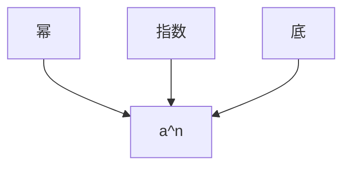

# 3. 乘方运算的结果及符号的规律

$\left\{ \begin{array}{ll}\text{正数：正数的任何次幂都是正数}\\ \text{负数：}\left\{ \begin{array}{ll} \text{负数的奇次幂是负数}\\ \text{负数的偶次幂是正数}\\ 0:0\text{的任何正整数次幂都是}0 \end{array} \right. \end{array} \right.$

# 知识点 21 有理数的混合运算顺序

1. 先乘方，再乘除，最后加减；  
2. 同级运算，从左到右进行；  
3. 如有括号，先做括号内的运算，按小括号、中括号、大括号依次进行.

有理数运算分三级，加减是第一级运算，乘除是第二级运算，乘方是第三级运算．运算顺序是先算高级，再算低级；同级运算按从左到右的顺序进行；对于含有多重括号的运算，一般先算小括号内的，再算中括号内的，最后算大括号内的.

# 知识点22 科学记数法

把一个大于 10 的数表示成 $a \times 10^n$ 的形式（其中 $a$ 大于或等于 1 且小于 10， $n$ 是正整数），这种记数方法叫作科学记数法。对于小于 -10 的数也可以类似表示。例如 $-370000 = -3.7 \times 10^5$ 。

# 知识点 23 近似数

1. 接近实际数值的数，叫作近似数.

2. 近似数与准确数的接近程度，我们用精确度来表示.

3. 一般地, 一个近似数四舍五人到哪一位, 就说这个数精确到哪一位. 例如 $\pi \approx 3.14$ (精确到 0.01, 或叫作精确到百分位).

# 【培优篇】

# 【题型1 正负数的意义】

【例 1】（24-25 六年级下·黑龙江哈尔滨·期末）在 -7, 2.5, -0.5, 0, + $\frac{4}{5}$ 中负数有（）

A. 1 个

B. 2 个

C. 3 个

D. 4 个

【变式 1-1】（24-25 七年级上·黑龙江绥化·阶段练习）在13.9，-26，+ $\frac{1}{3}$ ，0，-0.6，+45这些数中，正数有( )，负数有( )，( )既不是正数也不是负数.

【变式 1-2】在地形图上表示某地的高度时，需要以海平面为基准（规定海平面的海拔为0m），通常用正数表示高于海平面的某地的海拔，负数表示低于海平面的某地的海拔.

(1) 珠穆朗玛峰的海拔为 $8848.86 \mathrm{~m}$ , 它表示的含义是 \_\_\_\_;

(2) 吐鲁番盆地的海拔为 $-155 \mathrm{~m}$ , 它表示的含义是 \_\_\_\_.

【变式 1-3】如图所示的是图纸上一个零件的标注，现有下列直径尺寸的产品（单位：mm），其中不合格的是（）

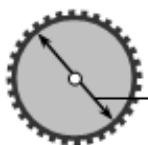

$\phi 30 \pm \begin{array}{c}0.03\\0.02\end{array}$

A. 29.8mm

B. 30.03mm

C. 30.02mm

D. 29.98mm

# 【题型 2 相反意义的量】教辅资源，关注公众号★全科AA+

【例 2】（24-25 七年级上·四川成都·期末）我国是最早使用负数的国家，东汉初我国著名的数学著作《九章算术》明确提出了“正负术”。如果盈利50元记作 +50元，那么亏损100元记作（）

A. -100元

B. 100元

C. 50元

D. -50元

【变式 2-1】（2025·湖南长沙·模拟预测）弹簧与单摆都是物理学中一个极具启发性的基础模型。在实际生活中，弹簧振子广泛应用于各种减震和避震系统，在车船、机床、建筑、民生乃至航天工业中都有重要的应用。如图是弹簧振子在工作时的状态，若弹簧振子从自然状态向右拉伸3 cm，记作 +3 cm，则弹簧振子从自然状态向左压缩5 cm，记作（）

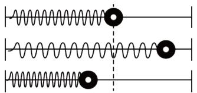

natural_image

Pure diagram of three parallel wavy lines with circular markers, no text or symbols present

A. $-5\mathrm{cm}$

B. -3 cm

C. +5 cm

D. -8 cm

【变式 2-2】（24-25 七年级上·浙江杭州·期末）地球上海拔最高的地点是珠穆朗玛峰，其海拔高于海平面 8848.86 米，记作 +8848.86 米，则地球上海拔最低的地点是我国新疆吐鲁番盆地的艾丁湖，其海拔低于海平面 154 米，记作\_\_米.

【变式 2-3】（24-25 七年级上·广东茂名·期中）某地提倡“节约用水，保护环境”，如果节约30L的水记为+30L，那么浪费10L的水记为\_\_\_\_L.

# 【题型3 有理数的概念及分类】

【例 3】（2025·贵州贵阳·二模）我国古代用算筹记数，表示数的方式有纵、横两种（如图），记数规则为：个位、百位、万位数用纵式表示；十位、千位数用横式表示；“0”用空位来代替．发现负数后，数学家还创造了在这个数的最后一个码上加一斜杠表示负数．如算筹“∥ ≡ ∥”表示的数为-248，则算筹

“⊥≡π”表示的数为（）

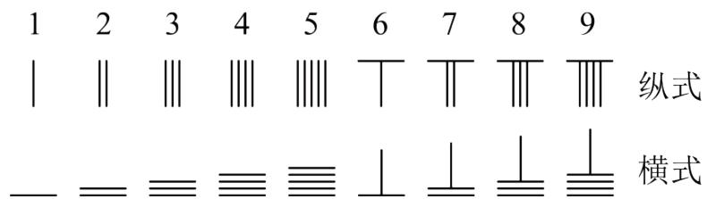

text_image

1 2 3 4 5 6 7 8 9
| | | | | | | | | | | | | | 纵式
_ = ≡ ≡ ≡ ⊥ ⊥ ⊥ ⊥ 横式

中国古代的算筹数码

A. 6037

B. -6037

C. 637

D. -637

【变式 3-1】下列说法正确的是（）

A. 一个有理数不是正数就是负数  
B. 一个有理数不是整数就是分数  
C. 有理数是指整数、分数、正有理数、负有理数和0这五类  
D. 负有理数既是分数，又是负数

【变式 3-2】（24-25 七年级上·江苏连云港·期中）把下列各数填在相应的大括号里，并用“<”把这些数连接起来.

27%, -2.5, $\frac{1}{3}$ , 2024, -3, 0.

(1)负整数 {\_\_\_\_…}  
(2)正分数 {\_\_\_\_…}  
(3)非负数 {\_\_\_\_…}  
(4)负有理数 {\_\_\_\_…}  
(5)用“<”把这些数连接起来为：\_\_\_\_。

【变式 3-3】阅读以下材料：如果一个无限小数的各数位上的数字，从小数部分的某一位起，按一定顺序不断重复出现，那么这样的小数叫做无限循环小数，简称循环小数，其中重复出现的一个或几个数字叫做它的一个循环节．例如 0.666...的循环节是“6”，它可以写作0.6，像这样的循环小数称为纯循环小数．又如 0.1333...、0.2456456456...的循环节是“3”“456”，它们可以写作0.13、0.2456，像这样的循环小数称为混循环小数．

阅读材料回答下列问题:

(1) 0.123是\_\_\_\_循环小数（填“纯”或“混”）  
(2) 0.24的循环节是\_\_\_\_。

# 【题型4 数轴上的点与有理数之间的关系】

【例 4】（24-25 七年级上·江苏镇江·阶段练习）如图，数轴上每个刻度为 1 个单位长度上点 A 表示的数是 -3.

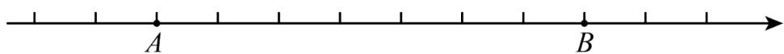

text_image

A
B

(1)在数轴上标出原点，并指出点 B 所表示的数是 \_\_\_\_.  
(2)在数轴上找一点 C，使它与点 B 的距离为 2 个单位长度，那么点 C 表示的数为 \_\_\_\_.

【变式 4-1】(24-25 七年级下·浙江杭州·开学考试)下图中, 如果 A 点表示 0, E 点表示 1, 则 G 点表示 \_\_\_\_; 如果 D 点表示 0, G 点表示 1, 则 A 点表示 \_\_\_\_.

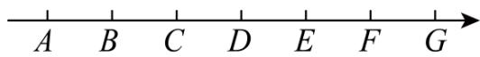

【变式 4-2】（24-25 七年级上·福建福州·期中）已知P是数轴上的一个点，把P向左移动4个单位后，这时它到原点的距离是5个单位，则P点表示的数是\_\_\_\_。

【变式 4-3】（24-25 七年级上·江苏常州·阶段练习）如图，把周长为 3 个单位长度的圆放到数轴（单位长度为 1）上，A, B, C三点将圆三等分，将点A与数轴上表示 1 的点重合，然后将圆沿着数轴正方向滚动，依次为点B与数轴上表示 2 的点重合，点C与数轴上表示 3 的点重合，点A与数轴上表示 4 的点重合，．．．，若当圆停止运动时点B正好落到数轴上，则点B对应的数轴上的数可能为（）

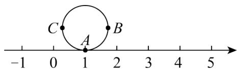

text_image

C
A
B
-1 0 1 2 3 4 5

A. 2020

B. 2021

C. 2022

D. 2023

# 【题型5 相反数】

【例 5】（2025·湖北孝感·模拟预测）请写出一个其相反数是负数的数为\_\_\_\_。

【变式 5-1】（24-25 七年级上·广东深圳·期末） $-\frac{1}{2025}$ 的相反数是\_\_\_\_.

【变式 5-2】（24-25 七年级上·山东威海·期末）如图，a, b, c, d 四个有理数在数轴上对应点的位置如图所示，请将 -a, -b, -c, -d 四个数按照从小到大的顺序排列 \_\_\_\_.

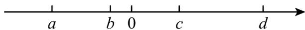

【变式 5-3】（2025·陕西延安·二模）如图，数轴上点A，B表示的数互为相反数，该数轴的单位长度是1，则点C表示的数是\_\_\_\_。

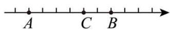

# 【题型6 绝对值】

【例 6】（24-25 七年级上·天津·阶段练习）下列说法：①若a>b，则 $|a|<|b|$ ；②若 $|-a|>|-b|$ ，则a<b；③若 $|a|>|b|$ ，则a>b；④若a<b<0，则 $|a|>|b|$ 。其中结论错误的有（）

A. 1 个

B. 2 个

C. 3 个

D. 4 个

【变式 6-1】绝对值小于6的整数有\_\_\_\_个，它们分别是\_\_\_\_；绝对值大于3且小于6的整数是\_\_\_\_。

【变式 6-2】写出一个绝对值小于 4 的负数\_\_\_\_。（写出一个即可）

【变式 6-3】按规定，食品包装袋上都应标明袋内装有食品多少克，下表是几种饼干的检验结果，“+、-”

分别表示比标准质量多、少，用绝对值判断最符合标准的一种食品是\_\_\_\_饼干.

<table><tr><td>威化</td><td>咸味</td><td>甜味</td><td>酥脆</td></tr><tr><td>+4(g)</td><td>-4.5(g)</td><td>+2(g)</td><td>-3.1(g)</td></tr></table>

# 【题型7 有理数的大小比较】

【例 7】（24-25 七年级上·陕西渭南·期末）在 4，-5，1，-2 四个有理数中，比 $-\frac{7}{2}$ 小的数是（）

A. 4

B. -5

C. 1

D. -2

【变式 7-1】（24-25 七年级上·山西大同·阶段练习）比大小：7\_\_\_\_-9， $-\frac{4}{5}$ \_\_\_\_- $\frac{3}{4}$ ， $-\left|-\frac{3}{4}\right|$ \_\_\_\_- $\left(-\frac{4}{3}\right)$ .

【变式 7-2】比较 $-\frac{2022}{2023}$ ， $-\frac{22}{23}$ ， $-\frac{2023}{2024}$ ， $-\frac{23}{24}$ 的大小.

【变式 7-3】（24-25 七年级上·山东菏泽·期中）如图，数轴上每个刻度为 1 个单位长度上点 A 表示的数是 -3.

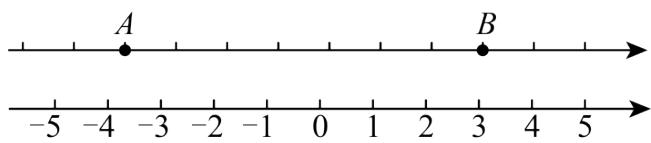

text_image

A
B
-5 -4 -3 -2 -1 0 1 2 3 4 5

(1)在数轴上标出原点，并指出点B所表示的数是\_；

(2)把这些数用数轴上的点表示出来： $0,1\frac{1}{2},-3,-(-5),-\left|-\frac{2}{3}\right|,+\left(-4\frac{1}{2}\right)$ . 请将这些数按从小到大的顺序排列（用“<”连接）.

# 【题型8 有理数的加法与减法】

【例8】 $\frac{1}{2} +\frac{1}{4} +\frac{1}{8} +\frac{1}{16} +\frac{1}{32} +\frac{1}{64} +\frac{1}{128} +\frac{1}{256}$ 再加上（）后，结果就是1.

A. $\frac{1}{64}$

B. $\frac{1}{128}$

C. $\frac{1}{256}$

D. $\frac{1}{512}$

【变式 8-1】（24-25 七年级上·浙江杭州·期中）若 x > 0, y < 0, $x + y > 0$ ，则下列关系正确的是（）

A. $y <   - x <   - y <   x$

B. $y <   - x <   x <   - y$

C. -x < y < x < -y

D. -x < y < -y < x

【变式 8-2】（24-25 七年级上·全国·期末）根据图中程序计算，若输入的数是 -9，则输出的结果是（）

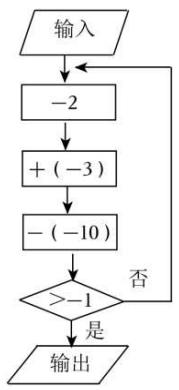

flowchart

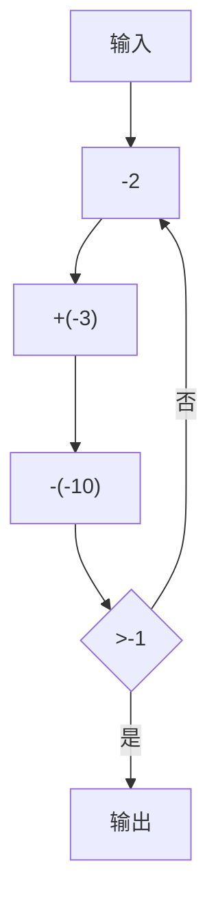

A. -4

B. -1

C. 1

D. 4

【变式 8-3】有一列数：-2011,-2004,-1997,-1990,…，它们按一定的规律排列，那么这列数的前（）个数的和最小.

A. 288

B. 289

C. 290

D. 292

# 【题型 9 有理数的乘法与除法】 教辅资源，关注公众号★全科AA+

【例 9】（24-25 七年级上·重庆·期中）如图所示，周长为 4 的圆沿着数轴无滑动地顺时针滚动．开始时，圆上一点 A 落在数轴上，滚动一圈后，点 A 落到了数轴上点 $A'$ 处，且 $A'$ 对应数为 1；滚动若干圈后，当圆上点 A 恰好落在数轴上，且它对应的数为 9 时，该圆从起始位置滚动的圈数为（）

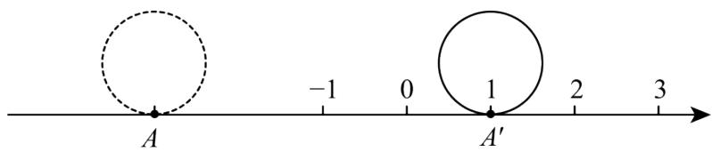

text_image

A
-1 0 1 2 3
A'

A. 2 圈

B. 3 圈

C. 4 圈

D. 5 卷

【变式 9-1】（24-25 七年级上·河北保定·期末）下列各式中，运用运算律不正确的是（）

A. $(-4) \times 8 = 8 \times (-4)$

B. $-24 \times \frac{2}{5} \times \left(-\frac{1}{6}\right) = \frac{2}{5} \times \left[(-24) \times \left(-\frac{1}{6}\right)\right]$

C. $-4 \times \left(\frac{1}{3}\right) \times (-6) = (-4) \times \left(\left(\frac{1}{3}\right) \times (-6)\right)$

D. $-6 \times \left(\frac{1}{2} + \left(-\frac{1}{3}\right)\right) = (-6) \times \frac{1}{2} + \left(-\frac{1}{3}\right)$

【变式 9-2】如图，阶梯图的每个台阶上都标着一个数，从下到上的第 1 个至第 3 个台阶上依次标着 -2, -1, - $\frac{1}{2}$ ，且任意相邻三个台阶上数的积都相等．下列判断正确的是（）

结论 I：从下到上前 2022 个台阶上的数的积是 -1;

结论Ⅱ：数“ $-\frac{1}{2}$ ”所在的台阶数用正整数 k 表示为 3k

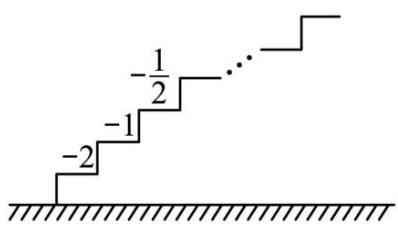

text_image

-1/2
-1
-2

A. I 对 II 错

B. I 错Ⅱ对

C. I 和 II 都对

D. I 和 II 都错

【变式 9-3】如图是一个计算程序框图，若输入的x值为-4，则输出的结果为（）

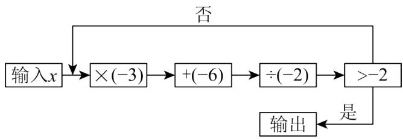

flowchart

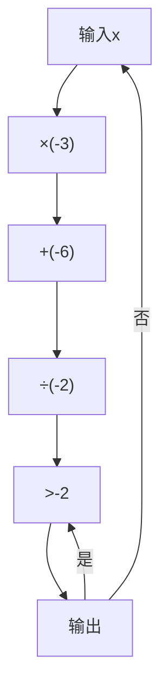

A. -3

B. $-\frac{3}{2}$

C. $\frac{3}{2}$

D. 3

# 【题型10 倒数】

【例 10】（24-25 七年级上·广西桂林·阶段练习）数学老师熊老师在课堂上布置了一道思考题“计算 $\left(-\frac{1}{12}\right)\div\left(\frac{1}{3}-\frac{5}{6}\right)$ ”，小雷同学仔细思考了一番，用了一种不同的方法解决了这个问题，小雷同学的解法：

原式的倒数为 $\left(\frac{1}{3} -\frac{5}{6}\right)\div \left(-\frac{1}{12}\right) = \left(\frac{1}{3} -\frac{5}{6}\right)\times (-12) = -4 + 10 = 6$ ，所以 $\left(-\frac{1}{12}\right)\div \left(\frac{1}{3} -\frac{5}{6}\right) = \frac{1}{6}.$

(1)根据倒数的定义我们知道，若 $a \div c = -1\frac{1}{3}$ ，则 $c \div a =$ \_\_\_\_.  
(2)请你运用小雷同学的解法解答下面的问题:

计算： $\left(-\frac{1}{42}\right)\div\left(\frac{1}{6}-\frac{3}{14}+\frac{2}{3}-\frac{2}{7}\right)$ .

【变式 10-1】（24-25 七年级上·四川泸州·阶段练习）学完《有理数》之后，甲同学对乙同学说：“a为最小的正整数，b是最大的负整数，c是倒数等于自身的有理数，你知道 $a+b+c$ 等于多少？”乙同学脱口答出正确答案是（）

A. 0

B. -1

C. 1 或 -1

D. 1 或 2

【变式 10-2】若两个数的积为-1，我们称它们互为负倒数，则3的负倒数是 \_.

【变式 10-3】（24-25 七年级上·江苏宿迁·阶段练习）若x个互不相等的正整数的倒数和等于 $\frac{13}{14}$ ，那么x的最小值为\_\_\_\_.

# 【题型11 有理数的乘方】

【例 11】《庄子·天下篇》讲到：“一尺之棰，日取其半，万世不竭”意思是说一尺长的木棍，每天截取它的一半，千秋万代也截不完．一天之后“一尺之棰”剩 $\frac{1}{2}$ 尺，两天之后剩 $\frac{1}{4}$ 尺，那么五天之后，这个“一尺之棰”还剩（）

A. $\frac{1}{4}$ 尺

B. $\frac{1}{8}$ 尺

C. $\frac{1}{16}$ 尺

D. $\frac{1}{32}$ 尺

【变式 11-1】计算： $(-4)^{2021}\times(-0.25)^{2022}=$ \_\_\_\_.

【变式 11-2】有下列各数：① $-1^{2}$ ；② $-(-1)^{2}$ ；③ $-1^{3}$ ；④ $-(-1)^{4}$ ，其中结果等于-1的是（）

A. ①②③

B. ①②④

C. ②③④

D. ①②③④

【变式 11-3】（24-25 七年级下·陕西西安·开学考试）我国古代《易经》中记载，远古时期，人们通过在绳子上打结来记录数量，即“结绳计数”。如图，一位母亲在从右到左依次排列的绳子上打结，满七进一，用来记录孩子自出生后的天数，由图可知、孩子自出生后的天数是（）

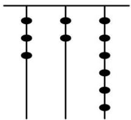

natural_image

Three vertical lines with evenly spaced black dots, no text or symbols present

A. 41

B. 65

C. 167

D. 181

# 【题型12 科学记数法】

【例 12】（2025·四川广元·中考真题）2025 年 5 月 29 日 1 时 31 分，西昌卫星发射中心用长征三号乙运载火箭发射天问二号探测器取得圆满成功．此次发射任务，火箭的入轨速度要达到11.2千米/秒，用科学记数法表示这个速度为\_\_\_\_米/秒．

【变式 12-1】（2025·天津南开·三模）2021 年我国发布的《中国应对气候变化的政策与行动》白皮书指出，2020 年我国碳排放强度（单位国内生产总值二氧化碳排放）比 2015 年下降 18.8%，比 2005 年下降 48.4%，超额完成了我国向国际社会承诺的“到 2020 年下降 40%\~45%”的目标，累计少排放二氧化碳约 58 亿吨，基本扭转了二氧化碳排放快速增长的局面。其中数据 58 亿用科学计数法表示为 $5.8 \times 10^{9}$ ，则数据 $5.8 \times 10^{9}$ 所表示的原数应为（）

A. 58000000

B. 580000000

C. 5800000000

D. 58000000000

【变式 12-2】（2025·河北邯郸·模拟预测）由DeepSeek开发的人工智能助手在全球范围内掀起了一股热潮，据国内AI产品榜统计数据，这款推理型AI聊天机器人在上线仅20天后，其日活跃用户数达2215万．下列说法正确的是（）

A. 2215 万=2.215×10 $^{6}$

B. 2215 万=22.15×10 $^{7}$

C. 2215 万是一个七位数

D. 2215 万写成221500...0的个数为 4

【变式 12-3】如表所示的是琳琳作业中的一道题目，“☐”处都是 0 但发生破损，琳琳查阅后发现本题答案为 1，则破损处“0”的个数为（）

已知： $60 = a \times 10^{n}$ ，求 $a - n$ 的值

A. 4

B. 5

C. 6

D. 7

# 【题型13 近似数】

【例 13】（24-25 七年级上·河南郑州·开学考试）[四舍五入]截至 2023 年 1 月 21 日 11 点，2023 河南春晚全网阅读量约 127 亿．如果这个阅读量是一个两位小数，那么这个两位小数最大是\_\_\_\_，最小是\_\_\_\_．

【变式 13-1】（24-25 七年级上·河南驻马店·期末）近似数 1.50 是由数 a 四舍五入得到的，那么数 a 的取值范围是（）

A. 1.45 < a < 1.55

B. $1.45 \leq a < 1.55$

C. $1.495 \leq a < 1.505$

D. 1.495 < a < 1.505

【变式 13-2】（24-25 七年级上·广东东莞·期末） $47.13 \approx$ \_\_\_\_（精确到0.1）.

【变式 13-3】（24-25 八年级上·河北石家庄·期末）某种鲸的体重约为 $1.4 \times 10^{5}$ kg，这个近似数精确\_\_\_\_位.

# 【拔尖篇】

# 【题型14 正负数的实际应用】

【例 14】（24-25 七年级上·甘肃陇南·期中）在活动课上，有 5 名学生用橡皮泥做了 5 个实心球，直径可以有 ±0.02 毫米的误差，超过规定直径的毫米数记作正数，不足的记作负数，检查结果如表：

<table><tr><td>做实心球的同学</td><td>李明</td><td>张兵</td><td>王敏</td><td>余佳</td><td>蔡伟</td></tr><tr><td>检测结果</td><td>+0.031</td><td>-0.017</td><td>+0.023</td><td>-0.021</td><td>-0.011</td></tr></table>

(1)请你指出哪些同学做的实心球是合乎要求的？  
(2)哪个同学做的质量最接近标准质量?

【变式 14-1】（24-25 七年级上·河南新乡·期中）近日，某社区针对老年人举办了“老年智能手机课堂”，该社区的王奶奶学会了使用智能手机，并参与了手机支付的消费体验。下表是王奶奶连续五笔交易的账单，则这五笔交易中支出最多的是 4 月\_\_\_\_日。

支付账单

<table><tr><td>日期</td><td>交易明细</td></tr><tr><td>4.10</td><td>买菜¥-36.00</td></tr><tr><td>4.11</td><td>转账收入 ¥+300.00</td></tr><tr><td>4.12</td><td>乘坐公交车¥-2.00</td></tr><tr><td>4.13</td><td>日常用品¥-75.00</td></tr><tr><td>4.14</td><td>衣物¥-99.00</td></tr></table>

【变式 14-2】（24-25 七年级上·安徽宿州·阶段练习）在一次体检过程中，七（3）班班长记录了该班 6 名学生的视力情况，若每名学生的视力以 5.0 为标准，大于 5.0 的记为正数，小于 5.0 的记为负数，记录数据如下：

<table><tr><td>学生</td><td>小明</td><td>小颖</td><td>小梦</td><td>小璐</td><td>小杰</td><td>小萌</td></tr><tr><td>视力</td><td>+0.1</td><td>-0.4</td><td>0</td><td>-0.6</td><td>-0.5</td><td>-0.1</td></tr></table>

(1)这6名学生中哪名学生的视力最差？用学过的知识说明理由；  
(2)若规定与标准视力相差大于0.2需要配戴眼镜，则6名学生中有几人需要配戴眼镜？

【变式 14-3】（24-25 七年级上·贵州黔东南·阶段练习）一种实验器材的标准质量是 15g，质检员抽查了 7 件样品的质量，把超过标准质量的克数记为正数，不足标准质量的克数记为负数，结果记录如下表.

<table><tr><td>序号</td><td>1</td><td>2</td><td>3</td><td>4</td><td>5</td><td>6</td><td>7</td></tr><tr><td>与标准质量的差/g</td><td>-10</td><td>+0.8</td><td>+0.9</td><td>-0.5</td><td>-1.2</td><td>+0.2</td><td>+0.6</td></tr></table>

(1)哪件实验器材的质量最接近标准质量?

(2)如果规定误差的绝对值在 0.8g（含 0.8g）之内是合格品；误差的绝对值在 0.8g～1.0g（含 1.0g）之间的是次品；误差的绝对值超过 1.0g 的视为废品，那么在上述 7 件样品中，哪些是合格品？哪些是次品？哪些是废品？

# 【题型15 数轴上整点问题】

【例 15】若在单位长度1cm的数轴上随意画出一条长100cm的线段AB，则线段AB盖住的整数点至少有()

A. 9 个

B. 10 个

C. 100 个

D. 101 个

【变式 15-1】（24-25 七年级上·全国·随堂练习）数轴上表示 $-2.5$ 与 $\frac{9}{4}$ 的两点之间，表示整数点的有（）

A. 3 个

B. 4 个

C. 5 个

D. 6 个

【变式 15-2】如图，数轴上被遮挡的整数是（）

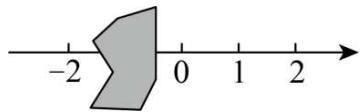

text_image

-2
0
1
2

A. -3

B. -1

C. -4

D. 3

【变式 15-3】（24-25 七年级上·河南南阳·期中）小宇不小心将墨水滴在了数轴上，使部分数轴被墨迹遮盖，则被遮盖的部分中表示整数的点有（）

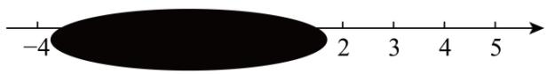

text_image

-4
2 3 4 5

A. 3 个

B. 4 个

C. 5 个

D. 6 个

【题型 16 利用相反数化简多重符号】 教辅资源，关注公众号 ★全科AA+

【例 16】（24-25 七年级上·全国·随堂练习）化简下列各式的符号，并回答问题：

①-(-2); ②+ $\left(-\frac{1}{8}\right)$ ; ③-[-(-4)]; ④-[-(+3.5)]; ⑤-{[-(+5)]}+5.

问：（1）当 +5 前面有 2024 个负号时，化简后的结果是多少？

(2) 当-5前面有 2025 个负号时, 化简后的结果是多少? 你能总结出什么规律?

【变式 16-1】化简 $-\left[-\left(-\frac{1}{4}\right)\right]=$ \_\_\_\_.

【变式 16-2】（24-25 七年级上·河南驻马店·期中）下列各数： $+(-1)$ ， $-\left[+(-5)\right]$ ， $-\left(-\frac{3}{4}\right)$ ， $-(-m)$ ， $+\left[-\left(+\frac{1}{5}\right)\right]$ 中一定是正数的（）

A. 1 个

B. 2 个

C. 3 个

D. 4 个

【变式 16-3】若b为-3，则 $-\left[+(-b)\right]$ 的相反数是\_\_\_\_.

# 【题型17 绝对值的非负性】

【例 17】（24-25 七年级上·甘肃张掖·阶段练习）若 $|-a| = -a$ ，则 a 的值不可能是（）

A. 3

B. 0

C. -5

D. -6

【变式 17-1】若 $|a-1|$ 与 $|b-2|$ 互为相反数，则 $a+b$ 的值为（）

A. 3

B. -3

C. 0

D. 3 或 -3

【变式 17-2】如果 x 为有理数，式子2026-|x-2026|存在最大值，这个最大值是（）

A. 2026

B. 4049

C. 20

D. 0

【变式 17-3】（24-25 七年级上·重庆·期中）若 $M = |x + 2| + 3$ ， $N = |x - 4| + |x - 5|$ ，M 的最小值与 N 的最小值分别为（）

A. 2, 4

B. 2, 1

C. 3, 5

D. 3, 1

# 【题型18 有理数大小比较的实际应用】

【例 18】正式排球比赛对所使用的排球的质量是有严格规定的，检查 5 个排球的质量，超过规定质量的克数记作正数，不足规定质量的克数记作负数，检查结果如下表（单位：克）：

<table><tr><td>1号球</td><td>2号球</td><td>3号球</td><td>4号球</td><td>5号球</td></tr><tr><td>+10</td><td>-8</td><td>+25</td><td>-12</td><td>-4</td></tr></table>

哪一个排球质量最接近规定质量？用绝对值知识来说明.

【变式 18-1】党和国家非常重视青少年的身心健康，采取多种举措增强青少年体质。有数据显示，近几年，青少年身体健康状况有一定提升，但肥胖问题仍不容忽视。一种少年儿童的标准体重(单位：kg)的计算方式为：标准体重 = (年龄 × 7 - 5) ÷ 2.

下表是七年级某小组7位同学的体重情况，其中超出标准体重的千克数记为正数，少于标准体重的千克数记为负数.

<table><tr><td>编号</td><td>1</td><td>2</td><td>3</td><td>4</td><td>5</td><td>6</td><td>7</td></tr><tr><td>体重情况</td><td>-2.6</td><td>+5.7</td><td>+2.2</td><td>-0.5</td><td>-0.2</td><td>+9.2</td><td>+0.8</td></tr></table>

(1)超出标准体重的同学有\_\_\_\_位.   
(2)哪位同学的体重最符合这种标准体重?   
(3)我们可以用标准体重法来判断是否肥胖．少年儿童：肥胖程度 $(\%)$ = $\frac{\text{实际体重}-\text{标准体重}}{\text{标准体重}} \times 100\%$ .

一般地，肥胖程度 $20\% \sim 30\%$ 为轻度肥胖；肥胖程度 $30\% \sim 50\%$ 为中度肥胖；肥胖程度 $50\%$ 以上为重度肥胖。6号同学今年12岁，请你判断一下他属于哪一类的肥胖。

【变式 18-2】在活动课上，6名同学用橡皮泥各做了1个乒乓球，直径可以有0.02毫米的误差，超过规定直径的毫米数记作正数，不足的记作负数，检查结果如下表所示：

<table><tr><td>做乒乓球的同学</td><td>李明</td><td>张兵</td><td>王敏</td><td>余佳</td><td>赵平</td><td>蔡伟</td></tr><tr><td>检查结果</td><td>+0.031</td><td>-0.017</td><td>+0.023</td><td>-0.021</td><td>+0.022</td><td>-0.011</td></tr></table>

(1)哪些同学做的乒乓球是符合要求的?

(2)在符合要求的乒乓球中，哪名同学做的质量最好？这6名同学中，哪名同学做的质量最差？  
(3)请你对这6名同学按照做的乒乓球质量从最好到最差排名;   
(4)请你用学过的绝对值知识来说明解答以上问题的依据.

【变式 18-3】已知零件的标准直径是100 mm，超过标准直径长度的数量(mm)记作正数，不足标准直径长度的数量(mm)记作负数，检验员某次抽查了5件样品，检查结果如下表：

<table><tr><td>样品编号</td><td>1</td><td>2</td><td>3</td><td>4</td><td>5</td></tr><tr><td>偏差/mm</td><td>+0.1</td><td>-0.15</td><td>+0.2</td><td>-0.05</td><td>+0.25</td></tr></table>

(1)指出哪件样品的大小最符合要求.  
(2)如果规定误差的绝对值在0.18 mm之内的是正品，误差的绝对值在0.18 mm～0.22 mm之间的是次品，误差的绝对值超过0.22 mm的是废品，那么这5件样品分别属于哪类产品？

# 【题型19 绝对值与乘方的非负性】

【例 19】已知 $|a-2|+(-3+b)^{2}=0$ ，若 $t=\frac{1}{ab}+\frac{1}{(a+1)(b+1)}+\frac{1}{(a+2)(b+2)}+\cdots+\frac{1}{(a+47)(b+47)}$ ，则t的值为（）

A. $\frac{12}{25}$

B. $\frac{13}{25}$

C. $\frac{49}{94}$

D. $\frac{46}{47}$

【变式 19-1】已知 $(x+1)^{2}+|y-2022|=0$ ，则 $x^{y}$ 的值是（）

A. -1

B. 1

C. 2022

D. $\frac{1}{2022}$

【变式 19-2】当式子 $(x+3)^{2}+|y-4|+2$ 取最小值时， $x^{y}=$ \_\_\_\_。

【变式 19-3】已知 $(x-5)^{2}+|y+3|=0$ ，则 $(x+y)^{2021}$ 的末尾数字是\_\_\_\_.

# 【题型20 绝对值中的分类讨论及最值问题】

【例 20】有理数 a, b, c 都不为零，且 $a + b + c = 0$ ，则 $\frac{|b+c|}{a} + \frac{|a+c|}{b} + \frac{|a+b|}{c} =$ \_\_\_\_.

【变式 20-1】若 $|x+a|+|x+1|$ 的最小值为3，则a的值为\_\_\_\_.

【变式 20-2】（24-25 七年级上·广东广州·期中）数轴是初中数学的一个重要工具，利用数轴可以将数与形进行完美地结合，研究数轴我们发现了很多重要的规律，如果数轴上点A、B在数轴上分别表示有理数a、b，那么A、B两点之间的距离表示为 $AB = |a - b|$ 。例如数轴上表示4和-1的两点之间的距离可表示为 $|4 - (-1)| = 5$ 。

(1)已知数轴上点A表示的数为-3，点B表示数为2，则线段AB的长度是\_\_\_\_。

(2)x表示任意一个有理数，利用数轴回答下列问题：

①若 $|x+3|+|x-2|=7$ ，求x的值；② $|x+3|+|x-2|$ 的最小值是多少，这时候x的取值范围.

【变式 20-3】已知整数 a, b, c，且 c < 0，满足 $\left|a\right| + 10b^{2} - 100c^{3} = 2023$ ，则 $a + b + c$ 的最小值为 \_\_\_\_.

# 【题型21 结合倒数、相反数、绝对值等的计算】

【例 21】（24-25 七年级上·山东德州·阶段练习）已知x，y互为相反数且均不为0，a和b互为倒数，m = -2，那么代数式 $\frac{x+y}{m}-2024ab + |m|$ 的值为 \_\_\_\_.

【变式 21-1】（24-25 七年级上·北京东城·期中）若a, b互为倒数，c, d互为相反数，|m|=1，则 $ab-2024(c+d)+2m$ 的值为\_\_\_\_.

【变式 21-2】（24-25 七年级上·江苏泰州·阶段练习）已知有理数 a、b 互为相反数且 $a \neq 0$ ，c，d 互为倒数，数轴上表示有理数 m 和 -2 的两个点相距 3 个单位长度，求 $|m| - \frac{a}{b} + \frac{a + b}{2024} - cd$ 的值.

【变式 21-3】（24-25 七年级上·四川宜宾·期中）对于有理数 a、b，定义运算： $a \otimes b = ab + |a| - b$ .

(1)填空： $3 \otimes (-2)$ \_\_\_\_(-2) $\otimes 3$ （填“＞”“＜”或“＝”）；

(2)若 $m$ 与 $-\frac{1}{5}$ 互为倒数， $n$ 与-4互为相反数，求 $m \otimes n$ 的值；

(3)求 $\left[2\otimes (-3)\right]\otimes 4$ 的值.

# 【题型 22 结合数轴判断结论正误】教辅资源，关注公众号★全科AA+

【例 22】有理数 a, b 在数轴上对应的位置如图所示，下列结论错误的是（）

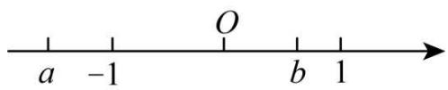

text_image

a -1 O b 1

A. $b^{2}$ 是小于 1 的正数

B. $a + b < 0$

C. $b - a <   0$

D. $a < -b < |a|$

【变式 22-1】有理数 a, b 在数轴上的位置如图所示，则下列结论正确的是（）

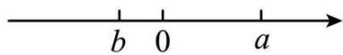

A. $a - b <   b <   a <   a + b$

B. $a - b <   b <   a + b <   a$

C. $b < a + b < a < a - b$

D. $a + b < b < a < a - b$

【变式 22-2】（24-25 七年级上·陕西延安·阶段练习）如图，点A和B表示的数分别为a和b，下列式子中错误的是（）

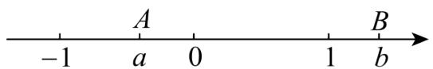

text_image

-1
A
a
0
1
B
b

A. $-a > -b$

B. $a + b > 0$

C. $|a| < |b|$

D. ab-1 > 0

【变式 22-3】（24-25 七年级上·陕西西安·期末）如图，数轴上的点 A, B, C 分别表示数 a, b, c 给出下列结论：① $a + b > 0$ ；② $abc < 0$ ；③ $a - c < 0$ ；④ $\frac{a}{b} > 0$ . 其中正确的是（）

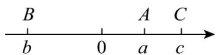

A. ①②

B. ①③

C. ②③

D. ②③④

# 【题型23 有理数的实际应用】

【例 23】（24-25 七年级上·辽宁盘锦·期末）根据国家卫健委发布的《儿童青少年近视防控适宜技术指南》，建议中学生使用电子产品的时间不超过 2 小时，某校想了解该校学生每天使用电子产品的时间情况，特制作了调查表进行调查，下表是该校某学生某周每天使用电子产品的时间情况（标准使用时间为每天 2 小时，超过记为正、不超过记为负）；

<table><tr><td>星期</td><td>一</td><td>二</td><td>三</td><td>四</td><td>五</td><td>六</td><td>七</td></tr><tr><td>增减</td><td>3</td><td>2</td><td>1</td><td>-0.5</td><td>-1.5</td><td>5</td><td>6</td></tr></table>

(1)该生周三使用电子产品用了多少个小时?  
(2)该生使用电子产品的时间最多的一天比时间最少的一天多多少小时?  
(3)该生这一周使用电子产品共用了多少小时?

【变式 23-1】（24-25 七年级上·福建泉州·期末）小明与同学约定好在距家 6 千米的公园聚会，可供小明选择的出行方式如下表所示，其中从小明家往公园方向 0.5 千米处有公交专线直达公园.

<table><tr><td>出行方式</td><td>等待上车时间(分钟)</td><td>速度(千米/小时)</td><td colspan="2">费用</td></tr><tr><td rowspan="2">出租车</td><td rowspan="2">2</td><td rowspan="2">30</td><td>不超过3千米</td><td>超过3千米部分</td></tr><tr><td>10元</td><td>里程费:2元/千米时长费:0.5元/分钟</td></tr><tr><td>公交专线</td><td>3</td><td>20</td><td colspan="2">票价共3元</td></tr><tr><td>便民自行车</td><td>0</td><td>15</td><td colspan="2">每15分钟1元,不足15分钟按15分钟计算</td></tr><tr><td>步行</td><td>0</td><td>5</td><td colspan="2">0元</td></tr></table>

(1)若小明乘坐公交专线前往，则小明需要花费的时间为多少分钟？

(2)下午 5:35 同学聚会结束，小明想利用剩余的 14 元，并在下午 6:00 前到家；

①若小明选择乘坐出租车，则小明能否按照计划到家并支付费用？若能，请计算出所需要的费用和到家的时间，若不能，请说明理由；  
②请你帮他设计一种用时最短的返程方案，并计算出所需要的费用和到家时间.

【变式 23-2】（24-25 九年级下·北京西城·开学考试）学校组织了一次文艺汇演，有四个节目需要彩排，分别是 A、B、C、D．所有演员到场后节目彩排开始，一个节目彩排完毕，下一个节目彩排立即开始，每个节目的演员人数和彩排时长（单位：分钟）如下：

<table><tr><td>节目</td><td>A</td><td>B</td><td>C</td><td>D</td></tr><tr><td>演员人数</td><td>8</td><td>5</td><td>12</td><td>3</td></tr><tr><td>彩排时长</td><td>20</td><td>15</td><td>25</td><td>10</td></tr></table>

已知每位演员只参演一个节目，一位演员的候场时间是指从第一个彩排的节目彩排开始到这位演员参演的节目彩排开始的时间间隔（不考虑换场时间等其他因素）。若节目按“A-B-C-D”的先后顺序彩排，则节目D的演员的候场时间为\_\_\_\_分钟；若使这28位演员的候场时间之和最小，则节目应按\_\_\_\_的先后顺序彩排。

【变式 23-3】（24-25 六年级下·上海虹口·期中）小红家需要购一台冰箱、一台洗衣机和一台微波炉，请你来给他们当消费顾问，帮他们做出选择.

信息一、财联社 1 月 19 日电，据“上海商务”官方公众号，上海进一步做好国家家电以旧换新补贴工作。2025年 1 月 20 日起，对购买二级能效电器给与15%补贴（不超过 1500 元），对购买一级能效电器给与20%的补贴（不超过 2000 元）（注：电器国补按每一台计算）

信息二、小红家在某商店已经看中三种商品各有两个不同型号（见表），另有一张该商店的五一促销海报（见图）

<table><tr><td></td><td>能效等级</td><td>标价(元)</td></tr><tr><td>冰箱A</td><td>1级</td><td>6000</td></tr><tr><td>冰箱B</td><td>2级</td><td>5000</td></tr><tr><td>洗衣机A</td><td>1级</td><td>4000</td></tr><tr><td>洗衣机B</td><td>2级</td><td>2400</td></tr><tr><td>微波炉A</td><td>1级</td><td>900</td></tr><tr><td>微波炉B</td><td>2级</td><td>600</td></tr></table>

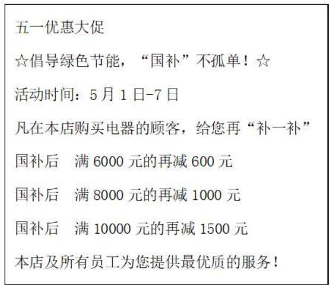

text_image

五一优惠大促
☆倡导绿色节能，“国补”不孤单！☆
活动时间：5月1日-7日
凡在本店购买电器的顾客，给您再“补一补”
国补后 满6000元的再减600元
国补后 满8000元的再减1000元
国补后 满10000元的再减1500元
本店及所有员工为您提供最优质的服务！

图

(1)如果在 5 月 1 日前，在该店购置一台价值 8000 元的电器，如果这是一台一级能效的电器，那么国补后只需要支付多少钱？  
(2)小红家如果购买三种电器都选择 A 型号，那么在“五一”期间，可以得到的优惠率是多少？（优惠率 = $\frac{国补与“五一优惠”总优惠金额}{商品原价} \times 100\%$ , 结果在百分号前保留 1 位小数）  
(3)如果小红家本次购置电器的消费预算在 7200 元以内，那么他们应该如何选择才能即不超过预算，又能得到最大的优惠率呢？（优惠率 = $\frac{\text{国补与“五一优惠”总优惠金额}}{\text{商品原价}} \times 100\%$ ）经过计算：完成以下购置计划清单：（结果在百分号前保留 1 位小数）

购置计划清单:

\_\_\_\_型号的电冰箱、\_\_\_\_型号的洗衣机、\_\_\_\_型号的微波炉，优惠率为\_\_\_\_。

# 【题型24 数轴中的动点问题】

【例 24】（24-25 七年级上·全国·假期作业）七年级数学兴趣小组成员自主开展数学微项目研究，他们决定研究“折线数轴”.

探索“折线数轴”：素材1 如图，将一条数轴在原点O，点B，点C处折一下，得到一条“折线数轴”。图中点A表示-9，点B表示12，点C表示24，点D表示36，我们称点A与点D在数轴上的“友好距离”为45个单位长度，并表示为 $\widehat{AD}=45$ 。

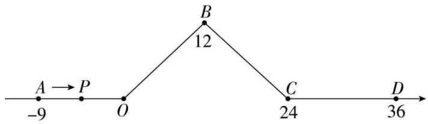

text_image

A → P
-9 O 12
B
C 24 D
36

素材 2 动点P从点A出发，以2个单位长度/秒的初始速度沿着“折线数轴”向其正方向运动．当运动到点O与点B之间时速度变为初始速度的一半．当运动到点B与点C之间时速度变为初始速度的两倍．经过点C后立刻恢复初始速度.

问题解决：探索 1 ：动点P从点A运动至点 B 需要多少时间？

探索 2 ： 动点P从点A出发，运动t秒至点B和点C之间时，求点P表示的数（用含t的代数式表示）；

探索 3 ：动点P从点A出发，运动至点D的过程中某个时刻满足 $\widehat{PB}+\widehat{PC}=16$ 时，求动点P运动的时间.

【变式 24-1】（24-25 七年级上·湖南岳阳·期末）已知如图，数轴上点 A 表示的数为 6，B 是数轴上在 A 左侧的一点，且 A，B 两点间的距离为 10．动点 P 从点 A 出发，以每秒 4 个单位长度的速度沿数轴向左匀速运动，设运动时间为 $t(t > 0)$ 秒.

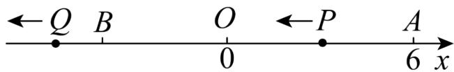

text_image

←Q B O ←P A
0 6 x

(1)数轴上点 B 表示的数是；当点 P 运动到 AB 的中点时，它所表示的数是

(2)动点 O 从点 B 出发，以每秒 2 个单位长度的速度沿数轴向左匀速运动，若点 P，O 同时出发．求：

①当点P追上点O时，点P所表示的数是多少？

②当点 P 运动多少秒时，点 P 与点 O 间的距离为 8 个单位长度？

【变式 24-2】如图，已知数轴的单位长度为 1，DE 的长度为 1 个单位长度.

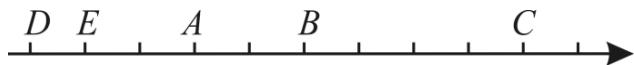

text_image

D E A B C

(1)如果点 A, B 表示的数是互为相反数，求点 C 表示的数.

(2)若点 A 为原点，在数轴上有一点 F，当 EF = 3 时，求点 F 表示的数.

(3)如果点 B, E 表示的数的绝对值相等, 动点 P 从点 B 出发沿数轴正方向运动, 速度是每秒 3 个单位长度, 动点 Q 同时从点 C 出发也沿数轴正方向运动, 速度是每秒 2 个单位长度, 求运动几秒后, 点 P 可以追上点 Q?

【变式 24-3】（24-25 七年级上·陕西西安·阶段练习）【知识引导】在数轴上，两点之间的距离可以用这两点在数轴上所对应数的差的绝对值来表示，例：点M表示的数为2，点N表示的数为-1，则点M,N之间的距离为 $|2-(-1)|=3$ .

【实际应用】如图，在一条数轴上，从左往右的点A,B,C表示的数分别是-3,b,6.

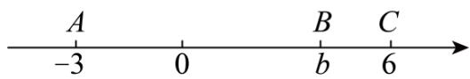

text_image

A
-3 0 B C
b 6

(1)点A到原点的距离是\_\_\_\_，A,C两点之间的距离是\_\_\_\_；  
(2)已知点B和点C之间的距离是2, 一动点P从点B出发, 以每秒1个单位长度的速度沿数轴向左匀速运动, 5秒后, 点P表示的数是多少?  
(3)已知点D在点A的左侧，和点A的距离是2个单位长度，一动点Q从点D出发，沿数轴运动，下表是小俊记录的点Q运动的情况（沿数轴向右运动记为正，向左运动记为负，例如“-2”表示向左运动2个单位长度，“+4”表示向右运动4个单位长度），在第几次运动后点Q与点D的距离最远，此时点Q表示的数是多少？

<table><tr><td>第1次</td><td>第2次</td><td>第3次</td><td>第4次</td></tr><tr><td>-2</td><td>+4</td><td>-8</td><td>-1</td></tr></table>

<table><tr><td>第1次</td><td>第2次</td><td>第3次</td><td>第4次</td></tr><tr><td>-2</td><td>+4</td><td>-8</td><td>-1</td></tr></table>