# 专题01 勾股定理与最值（举一反三专项训练）

# 【北师大版 2024】

# 题型归纳

【题型 1 几何最值(利用垂线段最短求最值)】....1

【题型 2 几何最值(利用两点之间线段最短求最值)】....2

【题型3 数形结合求最值】....3

【题型 4 化体为面求最值】....4

【题型5 拼接求最值】 5

# 举一反三

# 【题型 1 几何最值(利用垂线段最短求最值)】

【例 1】（2025·福建厦门·二模）如图，已知 $\triangle ABC$ 是等边三角形，AB = 2，AD 是 BC 边上的高，E 是 AC 的中点，P 是 AD 上一动点．则 $PE + PC$ 的最小值是（）

text_image

A
P
E
B
D
C

A. 1

B. $\sqrt{2}$

C. $\sqrt{3}$

D. $\sqrt{5}$

【变式 1-1】（24-25 八年级下·湖南长沙·期中）如图，在 $\triangle ABC$ 中，有一点 $P$ 在 $BC$ 边上移动，若 $AB = AC = 13$ ， $BC = 24$ ，则 $AP$ 的最小值为（）

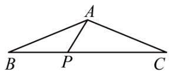

A. 5

B. 6

C. 8

D. 10

【变式 1-2】（2025·湖南郴州·二模）如图，在Rt△ABC中，∠B=90°，CD平分∠BCA．若BC=8，CD= $\sqrt{73}$ ，E为边AC上一动点，则线段DE长的最小值为\_\_\_\_.

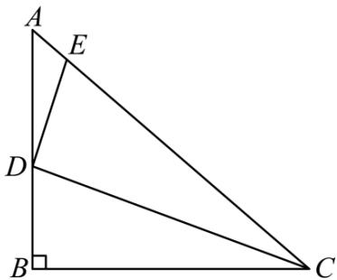

text_image

A
E
D
B
C

【变式 1-3】（23-24 八年级上·江苏宿迁·期中）如图，在Rt△ABC中，∠ACB = 90°，AC = 6，BC = 8，如果点D，E分别为BC，AB上的动点，那么AD + DE的最小值是\_\_\_\_。

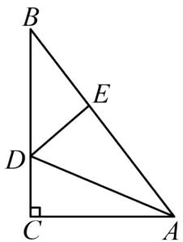

text_image

B
E
D
C
A

【题型 2 几何最值(利用两点之间线段最短求最值)】 教辅资源,关注公众号·全科AA+

【例 2】（24-25 八年级下·广西防城港·期中）如图，在长方形ABCD中，AB = 2，AD = 3，点P在AD上，点Q在BC上，且DP = BQ，连接CP，QD，则PC + QD的最小值为\_\_\_\_。

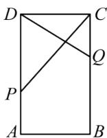

【变式 2-1】（2025·内蒙古·二模）如图，两条平行线 $l_{1}, l_{2}$ 之间的距离为 2，线段AB在 $l_{2}$ 上滑动，且AB = 2，C 为 $l_{1}$ 上任意一点，则CA + CB的最小值为\_\_\_\_。

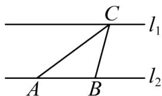

text_image

C
l₁
A B
l₂

【变式 2-2】（24-25 八年级下·广东中山·期中）如图，在长方形ABCD中，AB = 4，AD = 8，点E在边AD上，点F在边BC上，且BF = DE，连接CE,DF，则CE + DF的最小值为 \_\_\_\_.

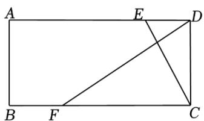

text_image

A
E
D
B
F
C

【变式 2-3】（24-25 八年级下·江苏盐城·期中）如图，在 $\triangle ABC$ 中， $\angle ACB = 90^{\circ}$ ， $AC = 5$ ， $BC = 4$ ， $D$ 在 $AC$ 延长线上，作平行四边形 $ABDE$ ，则 $BD + BE$ 的最小值为 \_\_\_\_.

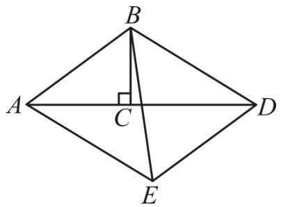

text_image

B
A	C	D
E

# 【题型3 数形结合求最值】

【例3】（24-25八年级上·陕西西安·开学考试）已知 $a, b$ 均为正实数，且 $a + b = 4$ ，求 $\sqrt{a^2 + 1} + \sqrt{b^2 + 9}$ 的最小值．通过分析，小师想到了构造图形解决此问题：如图， $AB = 4$ ， $AC = 1$ ， $BD = 3$ ， $AC \perp AB$ ， $BD \perp AB$ ，点 $E$ 是线段 $AB$ 上的动点，且不与端点重合，连接 $CE$ ， $DE$ ，设 $AE = a$ ， $BE = b$ ．则 $CE$ 、 $DE$ 长分别表示为 $\sqrt{a^2 + 1}$ ， $\sqrt{b^2 + 9}$ ．最后利用几何知识可得代数式 $\sqrt{a^2 + 1} + \sqrt{b^2 + 9}$ 的最小值为 $4\sqrt{2}$ ，根据以上材料，可求代数式 $\sqrt{x^2 + 16} + \sqrt{(x - 5)^2 + 36}$ 的最小值为 \_\_\_\_.

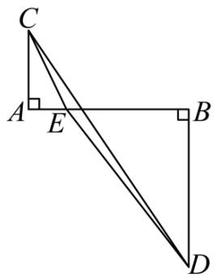

text_image

Geometric diagram showing triangle ABC with perpendiculars from C and D to AB, and point E on AC

【变式 3-1】请构图求出代数式 $\sqrt{x^{2}+4}+\sqrt{(8-x)^{2}+16}$ 的最小值为 \_\_\_\_.

【变式 3-2】（23-24 八年级下·福建莆田·阶段练习）（1）问题再现：学习二次根式时，老师给同学们提出了一个求代数式最小值的问题，如，求代数式 $\sqrt{x^{2}+4}+\sqrt{(12-x)^{2}+9}$ 的最小值；小强同学发现 $\sqrt{x^{2}+4}$ 可看作两直角边分别为 $x$ 和2的直角三角形斜边长， $\sqrt{(12-x)^{2}+9}$ 可看作两直角边分别是12- $x$ 和3的直角三角形的斜边长．于是构造出下图，将问题转化为求线段 $AB$ 的长，进而求得 $\sqrt{x^{2}+4}+\sqrt{(12-x)^{2}+9}$ 的最小值是\_\_\_\_．

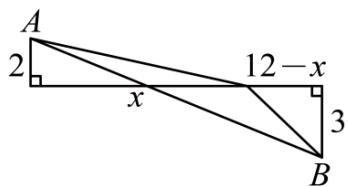

text_image

A
2
x
12 - x
3
B

（2）类比迁移：已知 $a$ ， $b$ 均为正数，且 $a + b = 4$ ，求 $y = \sqrt{a^2 + 4} +\sqrt{b^2 + 1}$ 的最小值.

（3）方法应用：若 $y=\sqrt{x^{2}+9}-\sqrt{(x-6)^{2}+1}$ ，求y的最大值.

【变式 3-3】（24-25 八年级下·广东·期中）在解决“当0 < x < 5时，求代数式 $\sqrt{x^{2}+9}+\frac{\sqrt{2}}{2}(5-x)$ 的最小值”这个问题时，我们可以将 $\sqrt{x^{2}+9}$ 看作是一个以x和3为直角边的Rt△ABP的斜边AP的长，再将BP延长至C，使得BC=5，以PC为斜边构造如图所示 $\angle C=45^{\circ}$ 的Rt△PCD，则 $\frac{\sqrt{2}}{2}(5-x)$ 为PD的长．于是将问题转化为求AP+PD的最小值．利用上述方法，这个代数式的最小值是\_\_\_\_；请运用此方法解决问题：当0<x<20时， $\sqrt{x^{2}+48}-\frac{1}{2}x+10$ 的最小值是\_\_\_\_．

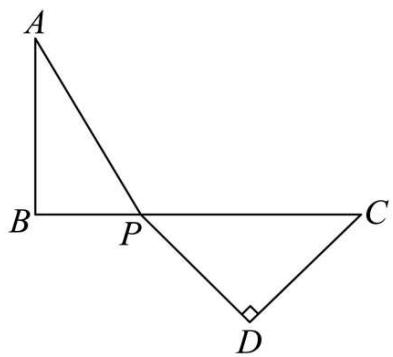

text_image

A
B P C
D

# 【题型 4 化体为面求最值】教辅资源,关注公众号·全科AA+

【例 4】（24-25 八年级上·山西临汾·期末）如图是放在地面上的一个长方体盒子，其中长6cm，宽4cm，高3cm，一只蚂蚁要沿着长方体盒子的表面从点 A 爬行到点 B，它需要爬行的最短路程为（）

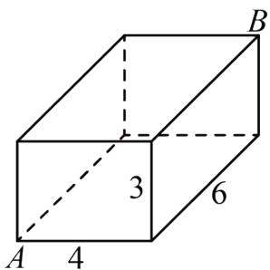

text_image

A
4
3
6
B

A. $\sqrt{85}$

B. $\sqrt{89}$

C. $\sqrt{97}$

D. $\sqrt{109}$

【变式 4-1】（24-25 八年级上·河南郑州·期末）如图，蚂蚁想要从两级台阶的左上角 M 处爬到右下角 N 处，它只能沿着台阶的表面爬行，已知每级台阶的长、宽、高分别是 16 分米，4 分米，2 分米，则蚂蚁从 M 处爬到 N 处的最短路程是（）

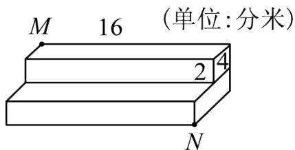

text_image

M 16 (单位:分米)
2 4
N

A. $16\sqrt{3}$ 分米

B. $20 \sqrt{2}$ 分米

C. 16 分米

D. 20 分米

【变式 4-2】（24-25 七年级下·陕西西安·期末）如图，已知圆柱底面的周长为16dm，圆柱高为15dm，在圆柱的侧面上，过点A和点C嵌有一圈金属丝，则这圈金属丝的长度最短为\_\_\_\_dm.

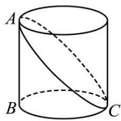

text_image

A
B
C

【变式 4-3】（24-25 八年级上·河南南阳·期末）如图，教室墙面 ADEF 与地面 ABCD 垂直，点 P 在墙面上，若 $PA = \sqrt{13}$ 米，AB = 2 米，点 P 到 AF 的距离是 3 米，一只蚂蚁要从点 P 爬到点 B，它的最短行程是（）米

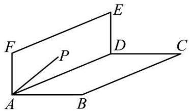

text_image

Geometric diagram showing a parallelogram ABCD with points E, F, P and connecting lines, labeled for mathematical analysis.

A. 5

B. $\sqrt{18}$

C. $\sqrt{13}$

D. 3

【题型 5 拼接求最值】教辅资源, 关注公众号·全科AA+

【例 5】（24-25 八年级下·陕西西安·期中）如图，在 $\triangle ABC$ 中，AB = AC = 4， $\angle ABC = 75^{\circ}$ ，M 是 $\triangle ABC$ 内的动点，连接 MA，MB，MC，则 $AM + BM + CM$ 的最小值是 \_\_\_\_.

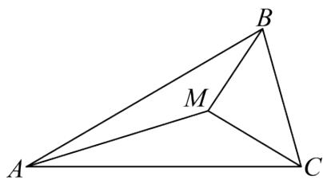

text_image

A
M
B
C

【变式 5-1】如图，在 $\triangle ABC$ 中， $AB=BC=3$ ， $\angle ABC=30^{\circ}$ ，点 $P$ 为 $\triangle ABC$ 内一点，连接 $PA$ 、 $PB$ 、 $PC$ ，则 $PA+PB+PC$ 的最小值为\_\_\_\_.

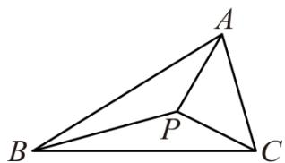

text_image

A
B
P
C

【变式 5-2】（23-24 九年级下·湖北武汉·期中）如图，在 $\triangle ABC$ 中， $\angle ABC = 60^{\circ}$ ， $BC = 6$ ， $AC = 8$ ， $D$ 、 $E$ 分别为边 $AC$ 、 $AB$ 上两个动点．且 $AE = CD$ ，连接 $BD$ 、 $CE$ ，则 $BD + CE$ 的最小值是 \_\_\_\_.

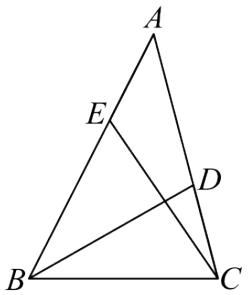

text_image

Geometric diagram of triangle ABC with internal points D and E, showing intersecting lines and segments

【变式 5-3】（24-25 八年级下·陕西西安·期中）如图，若三个村庄A、B、C构成Rt△ABC，其中AC = 6km, BC = 4√3km, ∠C = 90°. 现选取一点P打水井，使P点到三个村庄A、B、C铺设的输水管总长度最小，输水管总长度的最小值为\_\_\_\_.

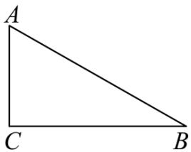

natural_image

Simple geometric diagram of a right triangle labeled A, C, and B (no additional text or symbols)

