# 专题01 勾股定理与最值（举一反三专项训练）

# 【北师大版 2024】

# 题型归纳

【题型 1 几何最值(利用垂线段最短求最值)】....1

【题型 2 几何最值(利用两点之间线段最短求最值)】......4

【题型3 数形结合求最值】 8

【题型 4 化体为面求最值】....15

【题型 5 拼接求最值】....18

# 举一反三

# 【题型 1 几何最值(利用垂线段最短求最值)】

【例 1】（2025·福建厦门·二模）如图，已知 $\triangle ABC$ 是等边三角形，AB = 2，AD 是 BC 边上的高，E 是 AC 的中点，P 是 AD 上一动点．则 $PE + PC$ 的最小值是（）

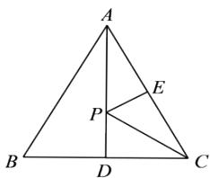

text_image

A
P
E
B
D
C

A. 1

B. $\sqrt{2}$

C. $\sqrt{3}$

D. $\sqrt{5}$

【答案】C

【分析】本题考查的是最短线路问题及等边三角形的性质，正确作出辅助线是解题关键．连接BE，则BE的长度即为PE与PC和的最小值，再利用等边三角形的性质可得 $BE \perp AC$ ，然后根据勾股定理求解即可.

【详解】解：如图，连接BE，与AD交于点P，

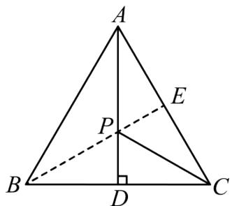

text_image

A
E
P
B
D
C

∵△ABC是等边三角形，AD是BC边上的高，

$\therefore AP \perp BC, BD = CD,$ 即AD垂直平分BC,

$$
\therefore P B = P C,
$$

$$
\therefore P E + P C = P B + P E \geq B E,
$$

∴此时PE + PC最小，即BE就是PE + PC的最小值，

∵△ABC是等边三角形，

$$
\therefore \angle B C E = 6 0 ^ {\circ},
$$

∵ BA = BC = AC = 2，E 是 AC 的中点，

$$
\therefore B E \perp A C, C E = \frac {1}{2} A C = 1
$$

$$
\therefore \angle B E C = 9 0 ^ {\circ},
$$

$$
\therefore B E = \sqrt {B C ^ {2} - C E ^ {2}} = \sqrt {3},
$$

故选：C.

【变式 1-1】（24-25 八年级下·湖南长沙·期中）如图，在 $\triangle ABC$ 中，有一点 $P$ 在 $BC$ 边上移动，若 $AB = AC = 13$ ， $BC = 24$ ，则 $AP$ 的最小值为（）

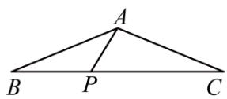

A. 5

B. 6

C. 8

D. 10

【答案】A

【分析】本题考查的是垂线段最短，等腰三角形的性质，勾股定理的应用，掌握“点到直线的距离，垂线段最短”是解题的关键。P在BC边上移动，由点到直线的距离，垂线段最短，可得当 $AP \perp BC$ 时，AP最短，再利用勾股定理求解即可。

【详解】解：如图，P在BC边上移动，当 $AP \perp BC$ 时，AP最短，

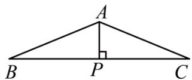

text_image

A
B P C

∵ AB = AC = 13, BC = 24, AP ⊥ BC ,

$$
\therefore B P = C P = 1 2,
$$

$$
\therefore A P = \sqrt {1 3 ^ {2} - 1 2 ^ {2}} = 5,
$$

∴AP的最小值是5，

故选：A.

【变式 1-2】（2025·湖南郴州·二模）如图，在Rt△ABC中， $\angle B=90^{\circ}$ ，CD平分 $\angle BCA$ 。若BC=8，CD= $\sqrt{73}$ ，E为边AC上一动点，则线段DE长的最小值为\_\_\_\_。

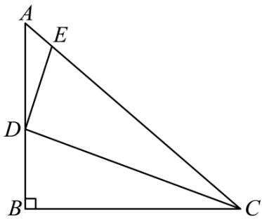

text_image

A
E
D
B
C

【答案】3

【分析】本题考查了角平分线的性质定理，垂线段最短，勾股定理等知识；当 $DE \perp AC$ 时，线段DE的长取得最小值，利用勾股定理求得BD = 3，，再由角平分线的性质定理即可求解.

【详解】解：由垂线段最短知，当 $DE \perp AC$ 时，线段DE的长取得最小值，

$$
\because \angle B = 9 0 ^ {\circ}, B C = 8, C D = \sqrt {7 3},
$$

$$
\therefore B D = \sqrt {C D ^ {2} - B C ^ {2}} = 3,
$$

∵CD平分∠BCA，DE⊥AC，

$$
\therefore D E = B D = 3,
$$

即 $DE$ 的最小值为3.

故答案为：3.

【变式 1-3】（23-24 八年级上·江苏宿迁·期中）如图，在Rt△ABC中，∠ACB = 90°，AC = 6，BC = 8，如果点D，E分别为BC，AB上的动点，那么AD + DE的最小值是\_\_\_\_。

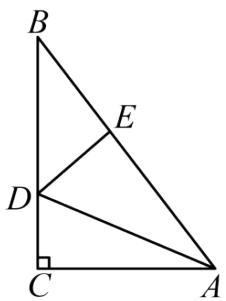

text_image

B
E
D
C
A

【答案】9.6

【分析】本题主要考查了轴对称最短路径问题，勾股定理，作点 A 关于直线 BC 的对称点 H，连接 HD，HB，由轴对称的性质可得 HC = AC = 6，DH = DA，由勾股定理可得 AB = 10，根据 $AD + DE = HD + DE$ ，可得当 H、D、E 三点共线，且 $HE \perp AB$ 时， $HD + DE$ 有最小值，即此时 $AD + DE$ 有最小值，最小值为 HE 的长，据此利用等面积法求出 HE 的长即可得到答案.

【详解】解：如图所示，作点 A 关于直线 BC 的对称点 H，连接 HD，HB，

由轴对称的性质可得HC = AC = 6, DH = DA,

∵在Rt△ABC中， $\angle ACB=90^{\circ}$ ，AC=6，BC=8，

$$
\therefore A B = \sqrt {A C ^ {2} + B C ^ {2}} = 1 0;
$$

$$
\because A D + D E = H D + D E,
$$

∴当 H、D、E 三点共线，且 $HE \perp AB$ 时， $HD + DE$ 有最小值，即此时 $AD + DE$ 有最小值，最小值为 HE 的长，

∴此时有 $S_{\triangle ABH}=\frac{1}{2}AH\cdot BC=\frac{1}{2}AB\cdot HE,$

$$
\therefore \frac {1}{2} \times (6 + 6) \times 8 = \frac {1}{2} \times 1 0 H E,
$$

$$
\therefore H E = 9. 6,
$$

$\therefore AD + DE$ 的最小值为9.6,

故答案为：9.6.

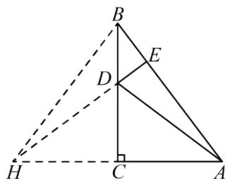

text_image

Geometric diagram of triangle ABC with auxiliary lines and points D, E, H labeled

# 【题型 2 几何最值(利用两点之间线段最短求最值)】

【例 2】（24-25 八年级下·广西防城港·期中）如图，在长方形ABCD中，AB = 2，AD = 3，点P在AD上，点Q在BC上，且DP = BQ，连接CP，QD，则PC + QD的最小值为\_\_\_\_。

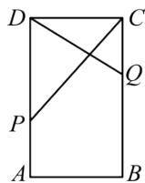

【答案】5

【分析】本题考查的是最短线路问题，长方形的性质，轴对称的性质，熟知两点之间线段最短的知识是解答此题的关键.

连接BP，在BA的延长线上截取AE=AB=2，连接PE，CE， $PC+QD=PC+PB$ ，则 $PC+QD$ 的最小值转化为 $PC+PB$ 的最小值，则 $PC+QD=PC+PB=PC+PE\geq CE$ ，根据勾股定理可得结果.

【详解】解：如图，连接BP，

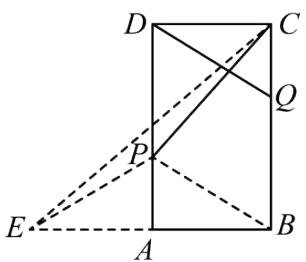

text_image

Geometric diagram with labeled points and lines, showing a rectangle ABCD with auxiliary points E, P, Q and connecting segments.

在长方形ABCD中， $AD \parallel BC$ ，AD = BC，

$$
\because D P = B Q, \quad D P \| B Q,
$$

∴四边形DPBQ是平行四边形，

$$
\therefore P B \| D Q, \quad P B = D Q,
$$

则 $PC+QD=PC+PB$ ，即 $PC+QD$ 的最小值转化为 $PC+PB$ 的最小值，

在BA的延长线上截取AE = AB = 2，连接PE，

$$
\because P A \perp B E,
$$

∴PA是BE的垂直平分线，

$$
\therefore P B = P E,
$$

$$
\therefore P C + P B = P C + P E,
$$

连接CE，则 $PC+QD=PC+PB=PC+PE\geq CE$ ，

$$
\because B E = 2 A B = 4, \quad B C = A D = 3,
$$

$$
\therefore C E = \sqrt {B E ^ {2} + B C ^ {2}} = \sqrt {4 ^ {2} + 3 ^ {2}} = 5.
$$

$\therefore PC + PB$ 的最小值为 5.

故答案为：5.

【变式 2-1】（2025·内蒙古·二模）如图，两条平行线 $l_{1}, l_{2}$ 之间的距离为 2，线段AB在 $l_{2}$ 上滑动，且AB = 2，C 为 $l_{1}$ 上任意一点，则CA + CB的最小值为\_\_\_\_。

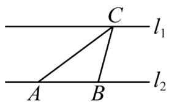

text_image

C
l₁
A B
l₂

【答案】 $2\sqrt{5}$

【分析】本题主要考查了利用轴对称的性质求线段和的最小值，过点 B 作点 B 关于直线 $l_{1}$ 的对称点 $B'$ ，连接 $AB'$ 交 $l_{1}$ 于点 $C'$ ，可得出当点 A， $C'$ ， $B'$ 三点共线时， $CA + CB$ 值最小，此时 $CA + CB \geq AC' + B'C' = A B'$ ，利用轴对称的性质得出 $BB' = 4$ ， $\angle ABB' = 90^{\circ}$ ，再利用勾股定理即可得出 $AB'$ .

【详解】解：过点 B 作点 B 关于直线 $l_{1}$ 的对称点 $B'$ ，连接 $AB'$ 交 $l_{1}$ 于点 $C'$ ，

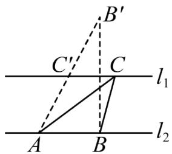

text_image

B'
C'
C
l₁
A
B
l₂

当点 A, $C'$ , $B'$ 三点共线时，CA + CB 值最小，此时 $CA + CB \geq AC' + B'C' = AB'$ ,

根据轴对称的性质可知， $\angle ABB' = 90^{\circ}$ ，

∵两条平行线 $l_{1},l_{2}$ 之间的距离为2，

$$
\therefore B B ^ {\prime} = 4,
$$

又∵AB=2,

$$
\therefore A B ^ {\prime} = \sqrt {A B ^ {2} + B B ^ {\prime 2}} = \sqrt {2 ^ {2} + 4 ^ {2}} = 2 \sqrt {5},
$$

即 $CA + CB$ 的最小值为： $2\sqrt{5}$ ，

故答案为： $2\sqrt{5}$

【变式 2-2】（24-25 八年级下·广东中山·期中）如图，在长方形ABCD中，AB = 4，AD = 8，点E在边AD上，点F在边BC上，且BF = DE，连接CE,DF，则CE + DF的最小值为 \_\_\_\_.

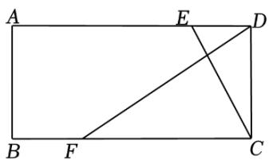

text_image

A
E
D
B
F
C

【答案】 $8\sqrt{2}$

【分析】本题主要考查了长方形的性质、轴对称的性质、全等三角形的判定与性质、勾股定理等知识，正确作出辅助线是解题关键．连接AF，证明 $\triangle ABF\cong\triangle CDE$ ，易得AF=CE，即有 $CE+DF=AF+DF$ ，作点A关于BC点的对称点 $A'$ ，连接 $A'D$ ，当 $A'$ 、F、D三点共线时，可有 $CD+DF=AF+DF=A'F+DF=A'D$ ，此时 $CD+DF$ 取最小值，然后根据勾股定理求得 $A'D$ 的值，即可获得答案.

【详解】解：连接AF，如下图，

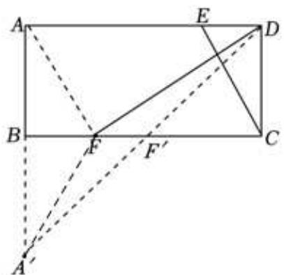

text_image

Geometric diagram of rectangle ABCD with diagonals and auxiliary points E, F, F' labeled

∵四边形ABCD是长方形，

$$
\therefore A B = C D, \angle B A D = \angle A B F = \angle C D E = 9 0 ^ {\circ},
$$

$$
\because B F = D E,
$$

$$
\therefore \triangle A B F \cong \triangle C D E (\text { SAS }),
$$

$$
\therefore A F = C E,
$$

$$
\therefore C E + D F = A F + D F,
$$

作点A关于BC点的对称点 $A'$ ，连接 $A'D$ ，

则 $AF = A'F$ ，当 $A'$ 、F、D三点共线时，

可有 $CD + DF = AF + DF = A'F + DF = A'D$ ，此时 $CD + DF$ 取最小值，

$$
\because A B = 4, A D = 8,
$$

$$
\therefore A A ^ {\prime} = 2 \times 4 = 8,
$$

$\therefore A^{\prime}D = \sqrt{AA^{\prime 2} + AD^{2}} = \sqrt{8^{2} + 8^{2}} = 8\sqrt{2}$ ，即 $CE + DF$ 的最小值为 $8\sqrt{2}$

故答案为： $8\sqrt{2}$ .

【变式 2-3】（24-25 八年级下·江苏盐城·期中）如图，在 $\triangle ABC$ 中， $\angle ACB = 90^{\circ}$ ， $AC = 5$ ， $BC = 4$ ， $D$ 在 $AC$ 延长线上，作平行四边形 $ABDE$ ，则 $BD + BE$ 的最小值为 \_\_\_\_.

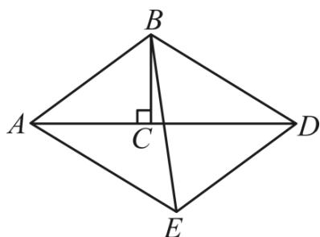

text_image

B
A	C	D
E

【答案】13

【分析】本题考查了平行四边形的性质，轴对称—最短路线，勾股定理，作 $EF \perp AD$ 于F，由题意可得E在平行于AD且与AD距离为4的直线l上运动，作B关于直线l的对称点 $B'$ ，连接 $BB'$ ， $B'E$ ，则 $BE = B'E$ ， $B'$ 、C、B三点共线，结合 $BD + BE = AE + B'E \geq AB'$ ，得出当且仅当，A, E, $B'$ 依次共线时取等号，最后由勾股定理计算即可得解，熟练掌握以上知识点并灵活运用是解此题的关键.

【详解】解：如图，作 $EF \perp AD$ 于F，

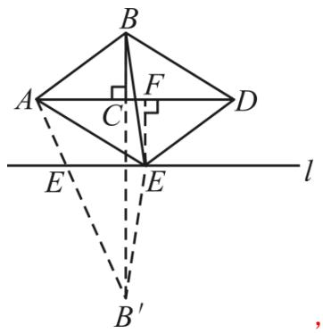

text_image

B
A
C
F
D
E
E
l
B'

∵四边形ABCD是平行四边形，

$$
\therefore E F = B C = 4, \quad B D = A E,
$$

∴E在平行于AD且与AD距离为4的直线l上运动，

作B关于直线l的对称点 $B'$ ，连接 $BB'$ ， $B'E$ ，

则 $BE=B'E$ ， $B'$ 、C、B三点共线，

$$
\because B C = 4,
$$

$$
\therefore B ^ {\prime} C = 2 \times 8 - 4 = 1 2,
$$

$\therefore BD + BE = AE + B'E \geq AB'$ ，当且仅当，A，E， $B'$ 依次共线时取等号，

在Rt $\triangle AB'C$ 中， $AB' = \sqrt{AC^{2} + B'C^{2}} = 13$ ，

$\therefore BD + BE$ 的最小值为13，

故答案为：13.

# 【题型3 数形结合求最值】

【例 3】（24-25 八年级上·陕西西安·开学考试）已知 a, b 均为正实数，且 $a + b = 4$ ，求 $\sqrt{a^{2} + 1} + \sqrt{b^{2} + 9}$ 的最小值．通过分析，小师想到了构造图形解决此问题：如图，AB = 4，AC = 1，BD = 3， $AC \perp AB$ ， $BD \perp AB$ ，点 E 是线段 AB 上的动点，且不与端点重合，连接 CE，DE，设 AE = a，BE = b．则 CE、DE 长分别表示为 $\sqrt{a^{2} + 1}$ ， $\sqrt{b^{2} + 9}$ ．最后利用几何知识可得代数式 $\sqrt{a^{2} + 1} + \sqrt{b^{2} + 9}$ 的最小值为 $4\sqrt{2}$ ，根据以上材料，可求代数式 $\sqrt{x^{2} + 16} + \sqrt{(x - 5)^{2} + 36}$ 的最小值为 \_\_\_\_．

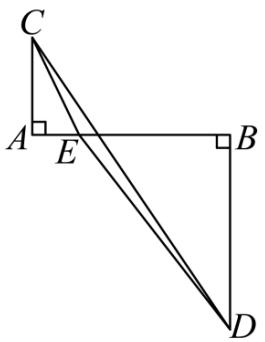

text_image

Geometric diagram showing triangle ABC with perpendiculars from C and D to AB, and point E on AC

【答案】 $5 \sqrt{5}$

【分析】构造如下：设AB=5，AC=4，BD=6，AE=x，则BE=AB-AE=5-x，过点D作DH⊥AC，交CA的延长线于点H，结合题目方法解得即可．本题考查了勾股定理，长方形的判定和性质，三角形不等式求最值，熟练掌握相关知识是解题的关键.

【详解】解：如图，设AB=5，AC=4，BD=6，AE=x，则BE=AB-AE=5-x，

则 $AE=\sqrt{x^{2}+16},DE=\sqrt{(x-5)^{2}+36},$

根据 $CE+DE\geq DC,$

当C,D,E三点共线时，取得最小值，

过点 D 作 $DH \perp AC$ ，交 CA 的延长线于点 H，

$\because AC \perp AB, BD \perp AB,$

∴四边形ABDH是长方形，

$$
\therefore A H = B D = 6, D H = A B = 5,
$$

$$
\therefore H C = 1 0, D H = A B = 5,
$$

$$
\therefore C D = \sqrt {C H ^ {2} + H D ^ {2}} = 5 \sqrt {5},
$$

故答案为： $5\sqrt{5}$ .

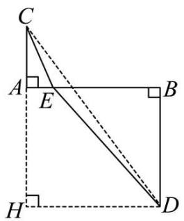

text_image

Geometric diagram of a right triangle with labeled vertices and perpendicular lines, including dashed auxiliary lines.

【变式 3-1】请构图求出代数式 $\sqrt{x^{2}+4}+\sqrt{(8-x)^{2}+16}$ 的最小值为 \_\_\_\_.

【答案】10.

【分析】可作 BD=8，过点 B 作 AB⊥BD，过点 D 作 ED⊥BD，使 AB=4，ED=2，C 为 BD 上一点，连接

AC、CE．当 A、C、E 三点共线时，AC+CE 的值最小，最小值为 AE 的长.然后构造长方形 AFDB, Rt△AFE，利用长方形和直角三角形的性质可求 AE 的值.

【详解】解：如图所示，过点 B 作 AB⊥BD，过点 D 作 ED⊥BD，使 AB=4，ED=2，DB=8，C 为 BD 上一点，连接 AC、CE.

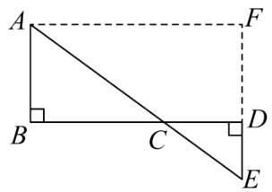

text_image

A
B
C
D
E
F

设 CD=x，则 BC=8-x，

$$
\therefore \mathrm{AC} = \sqrt {(8 - x) ^ {2} + 1 6}, \quad \mathrm{CE} = \sqrt {x ^ {2} + 4},
$$

$$
\therefore \mathrm{AC} + \mathrm{CE} = \sqrt {(8 - x) ^ {2} + 1 6} + \sqrt {x ^ {2} + 4},
$$

当 A、C、E 三点共线时，AC+CE 取到最小值，最小值为 AE 的长.

过点 A 作 AF∥BD 交 ED 的延长线于点 F，得长方形 ABDF，则 DF=AB=4，AF=BD=8.

$$
\therefore \mathrm{EF} = 4 + 2 = 6,
$$

在 Rt△AEF 中，由勾股定理得： $AE=\sqrt{AF^{2}+EF^{2}}=\sqrt{8^{2}+6^{2}}=10.$

$\therefore \sqrt{x^2 + 4} + \sqrt{(8 - x)^2 + 16}$ 的最小值为10.

故答案是：10.

【点睛】本题主要考查最短路线问题，利用了数形结合的思想，构造出符合题意的直角三角形是解题的关键.

【变式 3-2】（23-24 八年级下·福建莆田·阶段练习）（1）问题再现：学习二次根式时，老师给同学们提出了一个求代数式最小值的问题，如，求代数式 $\sqrt{x^{2}+4}+\sqrt{(12-x)^{2}+9}$ 的最小值；小强同学发现 $\sqrt{x^{2}+4}$ 可看作两直角边分别为 x 和 2 的直角三角形斜边长， $\sqrt{(12-x)^{2}+9}$ 可看作两直角边分别是 12-x 和 3 的直角三角形的斜边长．于是构造出下图，将问题转化为求线段 AB 的长，进而求得 $\sqrt{x^{2}+4}+\sqrt{(12-x)^{2}+9}$ 的最小值是 \_\_\_\_.

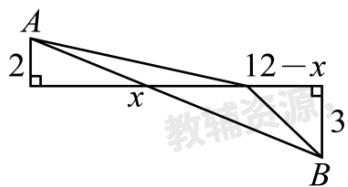

text_image

A
2
x
12 - x
3
B

（2）类比迁移：已知 a，b 均为正数，且 $a + b = 4$ ，求 $y = \sqrt{a^{2} + 4} + \sqrt{b^{2} + 1}$ 的最小值.  
（3）方法应用：若 $y=\sqrt{x^{2}+9}-\sqrt{(x-6)^{2}+1}$ ，求y的最大值.

【答案】（1）13；（2）5；（3） $2\sqrt{10}$

【分析】（1）先根据题意利用勾股定理求出 $AD = \sqrt{x^2 + 4}$ ， $BD = \sqrt{(12 - x)^2 + 9}$ ，则 $\sqrt{x^2 + 4} + \sqrt{(12 - x)^2 + 9} = AD + BD$ ，要想 $\sqrt{x^2 + 4} + \sqrt{(12 - x)^2 + 9}$ 的值最小，则 $AD + BD$ 的值最小，即当A、D、B三点共线时， $AD + BD$ 的值最小，最小值为AB，由此利用勾股定理求出AB的值即可；

（2）如图所示，AC = 1, CD = b, DE = a, BE = 2，利用勾股定理求出 $AD = \sqrt{b^{2} + 1}$ ， $BD = \sqrt{a^{2} + 4}$ ，然后同（1）求解即可；  
（3）如图所示， $BE = CD = a$ ， $EF = 2a$ ， $BF = 3a$ ， $AB = BC = DE = b$ ， $\angle ABF = \angle ACD = \angle DEF = 90^{\circ}$ 则 $DF = \sqrt{DE^2 + EF^2} = \sqrt{4a^2 + b^2}$ ， $AF = \sqrt{AB^2 + BF^2} = \sqrt{9a^2 + b^2}$ ， $AD = \sqrt{AC^2 + CD^2} = \sqrt{a^2 + 4b^2}$ ，故 $\triangle ADF$ 的面积即为所求，由此求解即可.

【详解】解：（1）如图所示，AC = 2，CD = x，DE = 12 - x，BE = 3，

在直角三角形ACD中， $AD=\sqrt{AC^{2}+CD^{2}}=\sqrt{x^{2}+4}$

在直角三角形BDE中， $BD=\sqrt{DE^{2}+BE^{2}}=\sqrt{(12-x)^{2}+9}$

$$
\therefore \sqrt {x ^ {2} + 4} + \sqrt {(1 2 - x) ^ {2} + 9} = A D + B D,
$$

$\therefore \text{要想} \sqrt{x^2 + 4} + \sqrt{(12 - x)^2 + 9}$ 的值最小，则 $AD + BD$ 的值最小，

∴当 A、D、B 三点共线时， $AD + BD$ 的值最小，最小值为 AB，

过点 B 作 $BF \perp AC$ 交 AC 延长线于 F,

$\because EC \perp AF, BF \perp AC, BE \perp AC,$

∴四边形CEBF为矩形，

$$
\therefore B F = C E = C D + D E = 1 2, \quad C F = B E = 3,
$$

$$
\therefore A F = A C + C F = 5,
$$

$$
\therefore A B = \sqrt {A F ^ {2} + B F ^ {2}} = 1 3,
$$

$\therefore\sqrt{x^{2}+4}+\sqrt{(12-x)^{2}+9}$ 的最小值为13,

故答案为：13;

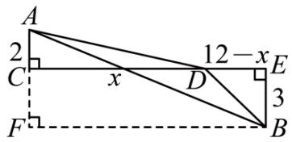

text_image

A
2
C
x
12 - x
E
D
3
F
B

（2）如图，AC = 1，CD = b，DE = a，BE = 2，

在直角三角形ACD中， $AD=\sqrt{AC^{2}+CD^{2}}=\sqrt{b^{2}+1}$ ，

在直角三角形BDE中， $BD=\sqrt{DE^{2}+BE^{2}}=\sqrt{a^{2}+4}$

$$
\therefore \sqrt {a ^ {2} + 4} + \sqrt {b ^ {2} + 1} = A D + B D,
$$

∴要想 $\sqrt{a^{2}+4}+\sqrt{b^{2}+1}$ 的值最小，则AD+BD的值最小，

∴当 A、D、B 三点共线时， $AD + BD$ 的值最小，最小值为 AB，

过点 B 作 $BF \perp AC$ 交 AC 延长线于 F,

∵EC⊥AF，BF⊥AC，BE⊥AC，

∴四边形CEBF为矩形，

$$
\therefore B F = C E = C D + D E = a + b = 4, \quad C F = B E = 2,
$$

$$
\therefore A F = A C + C F = 3,
$$

$$
\therefore A B = \sqrt {A F ^ {2} + B F ^ {2}} = 5,
$$

$\therefore\sqrt{a^{2}+4}+\sqrt{b^{2}+1}$ 的最小值为5;

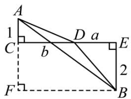

text_image

A
1
C
b
D a
E
2
F
B

（3）如图， $\angle ACB = \angle CBE = \angle BED = 90^{\circ}$ ， $AC = 3$ ， $BC = x$ ， $BE = 1$ ， $DE = x - 6$ ，

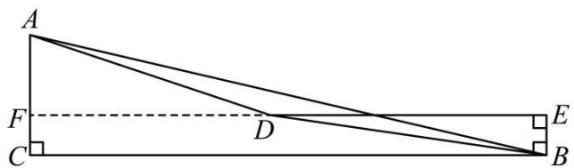

text_image

A
F
D
E
C
B

在直角三角形ACB中， $AB=\sqrt{AC^{2}+BC^{2}}=\sqrt{3^{2}+x^{2}}=\sqrt{x^{2}+9}$

在直角三角形BDE中， $BD=\sqrt{DE^{2}+BE^{2}}=\sqrt{(x-6)^{2}+1}$

$$
y = \sqrt {x ^ {2} + 9} - \sqrt {(x - 6) ^ {2} + 1} = A B - B D,
$$

$\therefore$ 要想 $y$ 的值最大，则 $AB - BD$ 的值最大，

∴根据三角形三边关系可知，当 A、D、B 三点共线时，AB-BD 的值最大，最大值为 AD，

延长ED，交AC于点F，

$$
\because \angle F C B = \angle C B E = \angle B E F = 9 0 ^ {\circ},
$$

∴四边形CBEF为矩形，

$$
\therefore E F = B C = x, \quad C F = B E = 1, \quad \angle E F C = 9 0 ^ {\circ},
$$

$$
\therefore D F = E F - D E = x - (x - 6) = 6, A F = 3 - 1 = 2,
$$

在直角三角形AFD中， $AD=\sqrt{AF^{2}+DF^{2}}=\sqrt{2^{2}+6^{2}}=2\sqrt{10}$

即 y 的最大值为 $2\sqrt{10}$ .

【点睛】本题主要考查了勾股定理，线段和最值问题、矩形的性质与判定，三角形三边关系的应用，解题的关键在于能够准确读懂题意，利用勾股定理求解.

【变式 3-3】（24-25 八年级下·广东·期中）在解决“当0 < x < 5时，求代数式 $\sqrt{x^{2}+9}+\frac{\sqrt{2}}{2}(5-x)$ 的最小值”这个问题时，我们可以将 $\sqrt{x^{2}+9}$ 看作是一个以x和3为直角边的Rt△ABP的斜边AP的长，再将BP延长至C，使得BC=5，以PC为斜边构造如图所示 $\angle C=45^{\circ}$ 的Rt△PCD，则 $\frac{\sqrt{2}}{2}(5-x)$ 为PD的长．于是将问题转化为求 $AP+PD$ 的最小值．利用上述方法，这个代数式的最小值是\_\_\_\_；请运用此方法解决问题：当0<x<20时， $\sqrt{x^{2}+48}-\frac{1}{2}x+10$ 的最小值是\_\_\_\_．

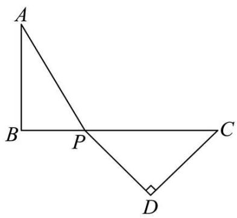

text_image

A
B P C
D

【答案】 $4\sqrt{2}$ 16

【分析】本题主要考查了勾股定理，等腰三角形的性质和判定，直角三角形的性质，

先根据三点共线时 $AP + PD$ 最小，再根据等腰直角三角形的性质得出答案；将原式整理为 $\sqrt{x^2 + (4\sqrt{3})^2} + \frac{1}{2}(20 - x)$ ，画出图形，我们将 $\sqrt{x^2 + (4\sqrt{3})^2}$ 看作是一个以 $x$ 和 $4\sqrt{3}$ 为直角边的 Rt $\triangle ABP$ 的斜边长，再将 $BP$ 延长至 $C$ ，使得 $BC = 20$ ，以 $PC$ 为斜边构造 $\angle C = 30^\circ$ 的 Rt $\triangle PCD$ ，则 $\frac{1}{2}(20 - x)$ 为 $PD$ 的长，将问题转化为求 $AP + PD$ 的最小值，然后根据直角三角形的性质和勾股定理可得答案.

【详解】解：当点 A, P, D 三点共线时 AP + PD 最小，

此时 $\angle CPD = \angle APB = 45^{\circ}$ ,

$$
\therefore A B = B P = 3, C D = P D,
$$

$$
\therefore P C = 5 - 3 = 2,
$$

根据勾股定理，得 $AP = \sqrt{AB^2 + BP^2} = 3\sqrt{2}$ ， $PD^2 + CD^2 = PC^2$

则 $PD=\sqrt{2}$ ,

$$
\therefore A P + P D = 3 \sqrt {2} + \sqrt {2} = 4 \sqrt {2}.
$$

这个代数式得最小值是 $4\sqrt{2}$ ;

根据题意，得 $\sqrt{x^2 + 48} -\frac{1}{2} x + 10 = \sqrt{x^2 + (4\sqrt{3})^2} +\frac{1}{2} (20 - x),$

如图所示，我们将 $\sqrt{x^2 + (4\sqrt{3})^2}$ 看作是一个以 $x$ 和 $4\sqrt{3}$ 为直角边的Rt $\triangle ABP$ 的斜边长，再将 $BP$ 延长至 $C$ 使得BC = 20，以PC为斜边构造 $\angle C = 30^{\circ}$ 的Rt $\triangle PCD$ ，则 $\frac{1}{2}(20 - x)$ 为PD的长，将问题转化为求 $AP + PD$ 的最小值.

当点 A, P, D 三点共线时 $AP + PD$ 最小，

此时 $\angle CPD = \angle APB = 60^{\circ}$ ，则 $\angle A = 30^{\circ}$ ，

$$
\therefore A B = 4 \sqrt {3}, A P = 2 B P,
$$

根据勾股定理，得 $AP^{2}=BP^{2}+AB^{2}$ ，

即 $3BP^{2}=48$ ,

解得BP = 4, 则AP = 8,

$$
\therefore C P = 1 6.
$$

在Rt $\triangle CDP$ 中， $\angle C = 30^{\circ}$ ，

$$
\therefore D P = \frac {1}{2} C P = 8,
$$

$$
\therefore A P + P D = 8 + 8 = 1 6.
$$

这个代数式得最小值是 16.

故答案为： $4\sqrt{2}$ ; 16.

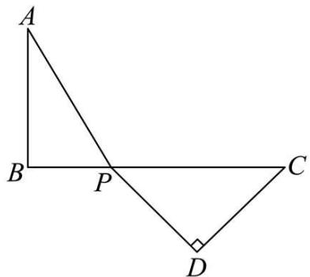

text_image

A
B P C
D

# 【题型4 化体为面求最值】

【例 4】（24-25 八年级上·山西临汾·期末）如图是放在地面上的一个长方体盒子，其中长6cm，宽4cm，高3cm，一只蚂蚁要沿着长方体盒子的表面从点 A 爬行到点 B，它需要爬行的最短路程为（）

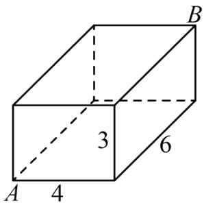

text_image

A
4
3
6
B

A. $\sqrt{85}$

B. $\sqrt{89}$

C. $\sqrt{97}$

D. $\sqrt{109}$

【答案】A

【分析】本题主要考查了平面展开图的最短路径问题和勾股定理的应用，利用平面展开图有三种情况，画出图形利用勾股定理求出 $AB$ 的长，比较即可获得答案.

【详解】解：分三种情况讨论：

①如图，

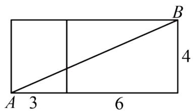

text_image

A 3
6
4
B

此时 $AB=\sqrt{9^{2}+4^{2}}=\sqrt{97}$ ;

②如图，

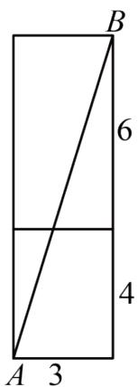

text_image

B
6
4
A 3

此时 $AB=\sqrt{3^{2}+10^{2}}=\sqrt{109}$ ,

③如图，

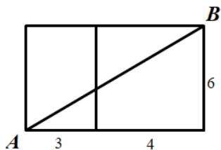

text_image

A 3 4
6
B

此时 $AB=\sqrt{7^{2}+6^{2}}=\sqrt{85}$ ,

又∵ $\sqrt{85}<\sqrt{97}<\sqrt{109}$ ,

∴需要爬行的最短路程为 $\sqrt{85}$ .

故选：A.

【变式 4-1】（24-25 八年级上·河南郑州·期末）如图，蚂蚁想要从两级台阶的左上角 M 处爬到右下角 N 处，它只能沿着台阶的表面爬行，已知每级台阶的长、宽、高分别是 16 分米，4 分米，2 分米，则蚂蚁从 M 处爬到 N 处的最短路程是（）

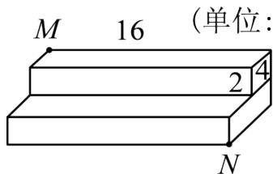

text_image

M 16 （单位：
2 4
N

(单位:分米)

A. $16 \sqrt{3}$ 分米

B. $20 \sqrt{2}$ 分米

C. 16 分米

D. 20 分米

【答案】D

【分析】根据题意画出台阶的侧面展开图，根据勾股定理求出MN的长即可得出结论.

本题考查的是平面展开-最短路径问题，根据题意画出台阶的表面展开图，利用勾股定理求解是解答此题的关键.

【详解】解：如图所示

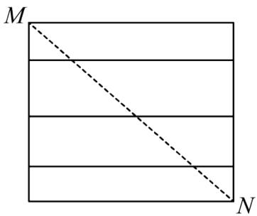

text_image

M
N

$$
M N = \sqrt {1 6 ^ {2} + (4 + 2 + 4 + 2) ^ {2}} = 2 0 (\text {分米})
$$

答：它沿着台阶面从点 A 爬到点 B 的最短路程是 20 分米.

故选：D

【变式 4-2】（24-25 七年级下·陕西西安·期末）如图，已知圆柱底面的周长为16dm，圆柱高为15dm，在圆柱的侧面上，过点A和点C嵌有一圈金属丝，则这圈金属丝的长度最短为\_\_\_\_dm.

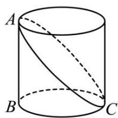

【答案】34

【分析】本题考查了平面展开 - 最短路径问题，圆柱的侧面展开图是一个矩形，此矩形的长等于圆柱底面周长，高等于圆柱的高，本题就是把圆柱的侧面展开成矩形，“化曲面为平面”，用勾股定理解决．要求丝线的长，需将圆柱的侧面展开，进而根据“两点之间线段最短”得出结果，在求线段长时，根据勾股定理计算即可.

【详解】解：如图，把圆柱的侧面展开，得到矩形，则这圈金属丝的周长最小为2AC的长度.

∵圆柱底面的周长为16dm，圆柱高为15dm，

$$
\therefore A B = 1 5 \mathrm{dm}, B C = B C ^ {\prime} = 8 \mathrm{dm},
$$

根据勾股定理得： $AC=\sqrt{AB^{2}+BC^{2}}=\sqrt{15^{2}+8^{2}}=17(\mathrm{dm})$

∴这圈金属丝的周长最小为 $2AC = 2 \times 17 = 34(\text{dm})$ .

故答案为：34.

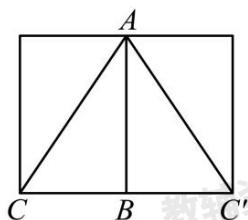

text_image

A
C B C'

【变式 4-3】（24-25 八年级上·河南南阳·期末）如图，教室墙面 ADEF 与地面 ABCD 垂直，点 P 在墙面上，若

$PA = \sqrt{13}$ 米，AB = 2米，点P到AF的距离是3米，一只蚂蚁要从点P爬到点B，它的最短行程是（）米

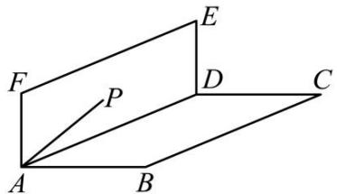

text_image

Geometric diagram showing a parallelogram ABCD with points E, F, P and connecting lines, labeled for spatial geometry analysis.

A. 5

B. $\sqrt{18}$

C. $\sqrt{13}$

D. 3

【答案】A

【分析】本题考查平面展开—最短路径问题及勾股定理的应用，可将教室的墙面ADEF与地面ABCD展开，连接PB，根据两点之间线段最短，利用勾股定理求解即可．正确利用立体图形中的最短距离，通常要转换为平面图形的两点间的线段长来进行解决是解题的关键.

【详解】解：如图，过P作 $PG \perp BF$ 于G，连接PB，

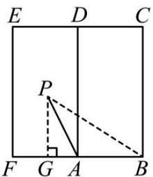

text_image

E D C
P
F G A B

此时PB的长为这只蚂蚁从点P爬到点B的最短行程，

∵PA = $\sqrt{13}$ 米，AB = 2米，点P到AF的距离是3米，

∴PG = 3米，

$\therefore \mathrm{AG} = \sqrt{\mathrm{PA}^2 - \mathrm{PG}^2} = \sqrt{(\sqrt{13})^2 - 3^2} = 2$ （米），

∴BG = GA + AB = 2 + 2 = 4（米），

∴PB = $\sqrt{GB^{2} + PG^{2}} = \sqrt{4^{2} + 3^{2}} = 5$ （米），

∴这只蚂蚁的最短行程应该是5米.

故选：A.

# 【题型5 拼接求最值】

【例 5】（24-25 八年级下·陕西西安·期中）如图，在 $\triangle ABC$ 中，AB = AC = 4， $\angle ABC = 75^{\circ}$ ，M 是 $\triangle ABC$ 内的动点，连接 MA，MB，MC，则 $AM + BM + CM$ 的最小值是 \_\_\_\_.

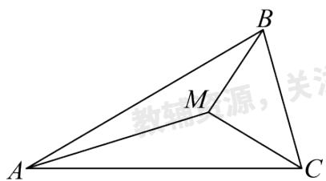

text_image

A
M
B
C
教辅资源，关

【答案】 $4\sqrt{2}$

【分析】本题考查了旋转的性质，勾股定理，等边三角形的性质与判定；过B点作 $BH \perp AC$ 于H点，如图，先计算出 $\angle BAC = 30^{\circ}$ ，则BH = 2， $AH = 2\sqrt{3}$ ，于是利用勾股定理可计算出 $BC = 2\sqrt{6} - 2\sqrt{2}$ ；把 $\triangle BAM$ 绕点B顺时针旋转 $60^{\circ}$ 得到 $\triangle BND$ ，如图，连接DM，CN，根据旋转的性质得到DN = AM，BM = BD，BN = BA = 4， $\angle MBD = \angle ABN = 60^{\circ}$ ，则可判断 $\triangle BMD$ 为等边三角形，所以DM = BM，由于 $DN + DM + CM \geq CN$ （当且仅当N、D、M、C共线时取等号），所以 $DN + DM + CM$ 的最小值为CN，即 $AM + BM + CM$ 的最小值为CN，过N点作 $NE \perp BC$ 于E点，如图，计算出 $\angle NBE = 45^{\circ}$ ，则 $NE = BE = 2\sqrt{2}$ ，接着计算出 $CE = 2\sqrt{6}$ ，然后利用勾股定理计算出CN，从而得到 $AM + BM + CM$ 的最小值.

【详解】解：过B点作 $BH \perp AC$ 于H点，如图，

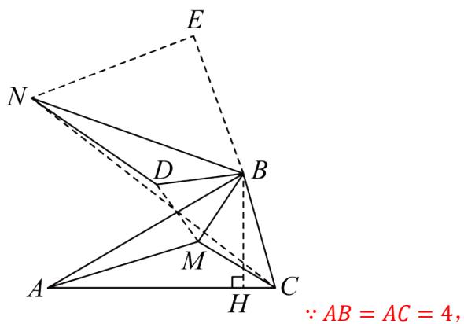

text_image

E
N
D
B
M
A
H
C
∵ AB = AC = 4,

$$
\therefore \angle A C B = \angle A B C = 7 5 ^ {\circ},
$$

$$
\therefore \angle B A C = 3 0 ^ {\circ},
$$

$$
\therefore B H = \frac {1}{2} A B = 2,
$$

$$
\therefore A H = \sqrt {3} B H = 2 \sqrt {3}
$$

$$
\therefore C H = A C - A H = 4 - 2 \sqrt {3},
$$

在 $Rt\triangle BCH$ 中， $BC = \sqrt{CH^2 + BH^2}\sqrt{(4 - 2\sqrt{3})^2 + 2^2} = 2\sqrt{6} - 2\sqrt{2},$ 把 $\triangle BAM$ 绕点 $B$ 顺时针旋转 $60^{\circ}$ 得到 $\triangle BND$ ，如图，连接 $DM$ ， $CN$

$$
\therefore D N = A M, B M = B D, B N = B A = 4, \angle M B D = \angle A B N = 6 0 ^ {\circ},
$$

$\therefore\triangle BMD$ 为等边三角形，

$$
\therefore D M = B M,
$$

$$
\therefore A M + B M + C M = D N + D M + C M,
$$

∵ DN + DM + CM ≥ CN(当且仅当N、D、M、C共线时取等号)

∴ DN + DM + CM 的最小值为 CN，即 $AM + BM + CM$ 的最小值为 CN，

过N点作 $NE \perp BC$ 于E点，如图，

$$
\because \angle N B E = 1 8 0 ^ {\circ} - \angle A B C - \angle A B N = 1 8 0 ^ {\circ} - 7 5 ^ {\circ} - 6 0 ^ {\circ} = 4 5 ^ {\circ},
$$

$$
\therefore N E = B E = \frac {\sqrt {2}}{2} B N = 2 \sqrt {2},
$$

$$
\therefore C E = C B + B E = 2 \sqrt {6} - 2 \sqrt {2} + 2 \sqrt {2} = 2 \sqrt {6},
$$

在 $Rt\triangle CNE$ 中， $CN = \sqrt{NE^2 + CE^2} = \sqrt{(2\sqrt{2})^2 + (2\sqrt{6})^2} = 4\sqrt{2},$

∴ $AM + BM + CM$ 的最小值为 $4\sqrt{2}$ .

故答案为： $4\sqrt{2}$ .

【变式 5-1】如图，在 $\triangle ABC$ 中， $AB=BC=3$ ， $\angle ABC=30^{\circ}$ ，点 $P$ 为 $\triangle ABC$ 内一点，连接 $PA$ 、 $PB$ 、 $PC$ ，则 $PA+PB+PC$ 的最小值为\_\_\_\_。

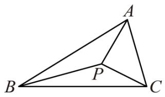

text_image

A
B
P
C

【答案】 $3 \sqrt{2}$

【分析】将 $\triangle ABP$ 绕点 $B$ 逆时针旋转 $60^{\circ}$ 得到 $\triangle BFE$ , 连接 $PF$ , $EC$ . 易证 $PA+PB+PC=PC+PF+EF$ , 因为 $PC+PF+EF \geq EC$ , 推出当 $P$ , $F$ 在直线 $EC$ 上时, $PA+PB+PC$ 的值最小, 求出 $EC$ 的长即可解决问题.

【详解】解：将 $\triangle ABP$ 绕点B逆时针旋转 $60^{\circ}$ 得到 $\triangle BFE$ ，连接PF，EC.

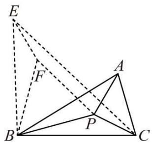

text_image

Geometric diagram with labeled points A, B, C, E, F, P and solid/dashed lines forming triangles and quadrilaterals

由旋转的性质可知：AB=BE=3，BP=BF， $\angle PBF=60^{\circ}=\angle ABE$ ，

$\therefore\triangle PBF$ 是等边三角形，

$$
\therefore P B = P F,
$$

$$
\because P A = E F,
$$

$$
\therefore P A + P B + P C = P C + P F + E F,
$$

$$
\because P C + P F + E F \geq E C,
$$

∴当 P，F 在直线 EC 上时， $PA+PB+PC$ 的值最小，

$$
\because \angle C B E = \angle A B C + \angle A B E = 9 0 ^ {\circ}, B E = B C,
$$

$$
\therefore E C = \sqrt {2} B C = 3 \sqrt {2},
$$

$\therefore PA+PB+PC$ 的最小值为 $3\sqrt{2}$ ,

故答案为： $3\sqrt{2}$ .

【点睛】本题考查了旋转的性质，等边三角形的判定和性质，勾股定理等知识，添加恰当辅助线构造全等三角形是解题的关键.

【变式 5-2】（23-24 九年级下·湖北武汉·期中）如图，在 $\triangle ABC$ 中， $\angle ABC = 60^{\circ}$ ， $BC = 6$ ， $AC = 8$ ， $D$ 、 $E$ 分别为边 $AC$ 、 $AB$ 上两个动点．且 $AE = CD$ ，连接 $BD$ 、 $CE$ ，则 $BD + CE$ 的最小值是 \_\_\_\_.

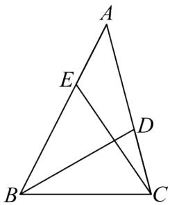

text_image

Geometric diagram of triangle ABC with internal points D and E, showing intersecting lines and segments

【答案】 $2 \sqrt{37}$

【分析】本题考查了全等三角形的性质与判定，勾股定理，两点之间线段最短；过点C作 $CF\parallel BA$ ，截取CF=AC，过点F作 $FG\perp BC$ 交BC的延长于点G，连接BF、DF，证明 $\triangle AEC\cong\triangle CDF(SAS)$ 得出FD=CE，当D在线段BF上时， $BD+CE=BD+DF=BF$ ，则 $BD+CE$ 的最小值为BF的长，进而求得FG,CG，在Rt $\triangle BFG$ 中，勾股定理，即可求解.

【详解】解：如图所示，过点C作 $CF\|BA$ ，截取CF=AC，过点F作 $FG\perp BC$ 交BC的延长于点G，连接BF、DF，

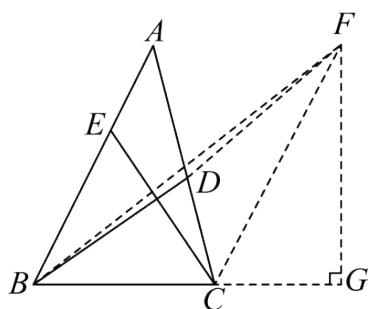

text_image

Geometric diagram with labeled points A, B, C, D, E, F, G and intersecting lines, likely from a math problem or proof.

$$
\therefore \angle A = \angle D C F,
$$

又∵AE = CD

$$
\therefore \triangle A E C \cong \triangle C D F (\text { SAS })
$$

$$
\therefore F D = C E,
$$

∴当D在线段BF上时， $BD + CE = BD + DF = BF$ ，则 $BD + CE$ 的最小值为BF的长，

$$
\because C F \parallel B A
$$

$$
\therefore \angle F C G = \angle A B C = 6 0 ^ {\circ}
$$

$$
\therefore \angle C F G = 3 0 ^ {\circ}
$$

$$
\therefore C G = \frac {1}{2} F C = 4, F G = 4 \sqrt {3},
$$

$$
\because B C = 6,
$$

$$
\therefore B G = B C + C G = 6 + 4 = 1 0,
$$

在Rt $\triangle FBG$ 中， $FB = \sqrt{FG^2 + BG^2} = \sqrt{(4\sqrt{3})^2 + 10^2} = 2\sqrt{37}$

故答案为： $2\sqrt{37}$ .

【变式 5-3】（24-25 八年级下·陕西西安·期中）如图，若三个村庄A、B、C构成Rt△ABC，其中AC = 6km，BC = 4√3km，∠C = 90°。现选取一点P打水井，使P点到三个村庄A、B、C铺设的输水管总长度最小，输水管总长度的最小值为\_\_\_\_。

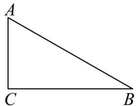

natural_image

Simple geometric diagram of a right triangle labeled A, C, and B (no additional text or symbols)

【答案】 $2\sqrt{39}$ km

【分析】本题考查了全等三角形的性质与判定，等边三角形的性质，旋转的性质，勾股定理，将 $\triangle PBC$ 绕点 $C$ 顺时针旋转 $60^{\circ}$ 得到 $\triangle DEC$ ，得出 $\triangle PCD, \triangle BCE$ 是等边三角形，进而得出当 $A, P, D, E$ 四点共线时， $PA + PB + PC$ 取得最小值，最小值为 $AE$ 的长，过点 $E$ 作 $EF \perp AC$ 交 $AC$ 的延长线于点 $F$ ，根据含30度角的直角三角形的性质，勾股定理求得 $EF, CF$ ，进而在 Rt $\triangle AEF$ 中，勾股定理，。即可求解.

【详解】解：如图，将 $\triangle PBC$ 绕点 C 顺时针旋转 $60^{\circ}$ 得到 $\triangle DEC$ ，连接 AE，

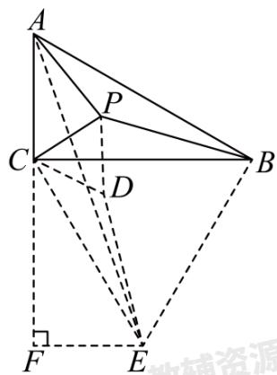

text_image

A
P
C
D
B
F
E
教辅资源

$$
\therefore \triangle P B C \cong \triangle D E C,
$$

$$
\therefore P B = D E,
$$

$$
\therefore C B = C E, \angle B C E = \angle P C D = 6 0 ^ {\circ}
$$

$\therefore \triangle PCD, \triangle BCE$ 是等边三角形，

$$
\therefore P C = P D,
$$

$$
\therefore P A + P B + P C = P A + P D + D E \geq A E,
$$

∴当A,P,D,E四点共线时， $PA+PB+PC$ 取得最小值，最小值为AE的长，

如图，过点E作EF⊥AC交AC的延长线于点F，

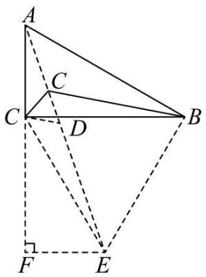

text_image

Geometric diagram of a tetrahedron with labeled vertices and internal points, including dashed lines indicating hidden edges.

$$
\because \angle A C B = 9 0 ^ {\circ},
$$

$$
\therefore \angle F C B = 1 8 0 ^ {\circ} - 9 0 ^ {\circ} = 9 0 ^ {\circ},
$$

$$
\because C E = B C = 4 \sqrt {3}, \angle F C E = 9 0 ^ {\circ} - \angle B C E = 3 0 ^ {\circ},
$$

$$
\therefore E F = \frac {1}{2} C E = 2 \sqrt {3},
$$

$$
\therefore C F = \sqrt {C E ^ {2} - E F ^ {2}} = 6,
$$

又∵AC = 6,

$$
\therefore A F = A C + C F = 1 2,
$$

在Rt $\triangle AEF$ 中， $AE = \sqrt{AF^2 + EF^2} = \sqrt{12^2 + (2\sqrt{3})^2} = 2\sqrt{39},$

即 $PA + PB + PC$ 的最小值为： $2\sqrt{39}$ ，

故答案为： $2\sqrt{39}$ km.