# 专题 01 平面直角坐标系中的面积问题（举一反三专项训练）

# 【北师大版 2024】

# 题型归纳

【题型1 求三角形的面积】....1

【题型 2 求四边形的面积】....2

【题型3 由面积的值求解】....3

【题型 4 由面积相等求解】....4

【题型5 由面积间的关系求参数】....5

【题型 6 直线分图形面积】....6

【题型 7 求不规则图形的面积】....7

# 举一反三

# 【题型1 求三角形的面积】

【例 1】（24-25 七年级下·湖北武汉·期中）如图在平面直角坐标系中，点A(2,3)，点B(-3,-2)，点C(4,-3)，则三角形ABC的面积是（）

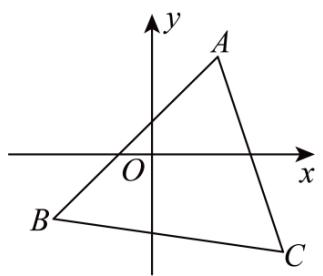

text_image

y
A
O
x
B
C

A. 19

B. 20

C. 21

D. 21.5

【变式 1-1】（24-25 七年级下·甘肃武威·期末）平面直角坐标系中，由点 $A(a,3)$ ， $B(a+4,3)$ ， $C(b,-3)$ 组成的 $\triangle ABC$ 的面积是\_\_\_\_.

【变式 1-2】（2025·湖北武汉·三模）在平面直角坐标系中，O 为坐标原点， $A(2,4)$ , $B(6,2)$ .

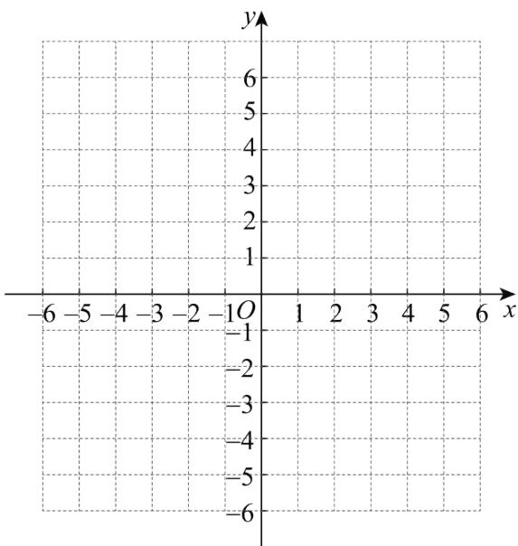

text_image

y
6
5
4
3
2
1
-1O
-1
-2
-3
-4
-5
-6
-6
-6
-6
-6
-6
-6
-6
-6
-6
-6
-6
-6
-6
-6
-6
-6
-6
-6
-6
-6
-6
-6
-6
-6
-6
-6
-6
-6
-6
-6
-6
-6
-6

(1)画出三角形AOB;   
(2)将三角形AOB向左平移3个单位长度, 向下平移5个单位长度, 得到三角形 $A_{1}O_{1}B_{1}$ , 画出三角形 $A_{1}O_{1}B_{1}$ ;  
(3)直接写出点 $A_{1},B_{1}$ 的坐标;  
(4)直接写出三角形 $A_{1}O_{1}B_{1}$ 的面积.

【变式 1-3】（24-25 八年级上·福建福州·开学考试）在平面直角坐标系中，点 A 在第一象限，点 A(2,-a-1)，点 B(2,-a+3)，C(-2,-a-1)，则 $\triangle ABC$ 的面积是（）

A. 9

B. 8

C. 7

D. 6

# 【题型2 求四边形的面积】

【例 2】（24-25 七年级下·福建厦门·期中）如图，在平面直角坐标系xOy中，已知点 $A(2,n+2)$ ， $B(k,n+2)$ ， $C(4,n+4)$ ， $D(2,n+k)$ 。则四边形ABCD的面积 = \_\_\_\_（用含有k的式子表示）

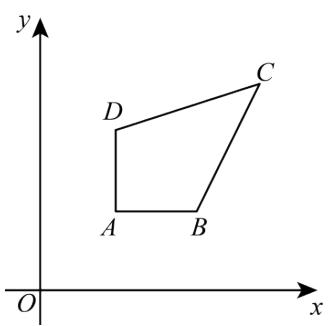

text_image

y
D
C
A
B
O
x

【变式 2-1】（24-25 七年级下·广东中山·期中）如图， $\triangle OAB$ 的顶点 $A, B$ 的坐标分别为 $(2,4)$ ， $(6,0)$ ，把 $\triangle OAB$ 沿 $x$ 轴向右平移得到 $\triangle CDE$ .

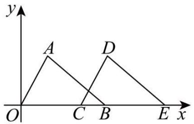

text_image

y
A
D
O
C
B
E x

（1）若 $CB = \frac{3}{2}$ ，则 $OE$ 的长为  
(2) 连接AD, 在 (1) 的条件下, 则四边形OADE的面积是\_\_\_\_.

【变式 2-2】（24-25 七年级下·福建泉州·期中）在平面直角坐标系中，已知点A(-2,0)，B(-1,2)，将线段AB平移至线段CD．若点C和D恰好都在两坐标轴上，且点D在y轴的负半轴上，则四边形ABCD的面积是\_\_\_\_．

【变式 2-3】（24-25 八年级下·辽宁丹东·期末）如图在平面直角坐标系中将□ABCD向右平移得到□A₁B₁C₁D₁，其中点 A 坐标为(2,3)，点 C 坐标(2,1)，点 D 坐标(1,1)，点 C₁坐标(5,1)，则□ABCD在平移过程扫过的面积即四边形ADC₁B₁的面积为\_\_\_\_.

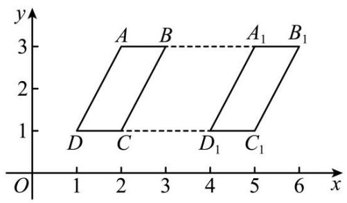

text_image

y
3
A B A₁ B₁
2
1
D C D₁ C₁
O 1 2 3 4 5 6 x

【题型 3 由面积的值求解】 教辅资源,关注公众号·全科AA+

【例 3】（24-25 七年级下·新疆喀什·期末）已知点 $A(2,0)$ ， $B(0,1)$ ，点P在y轴上，且三角形PAB的面积是3，则点P的坐标是（）

A. $(0, -2)$

B. $(4, 0)$

C. $(0, 4)$ 或 $(0, -2)$

D. $(4,0)$ 或 $(-2,0)$

【变式 3-1】（24-25 七年级上·河北邢台·期末）已知点A(0,a)和点B(6,0)两点，且直线AB与坐标轴围成的三角形的面积等于12，则点A的坐标为\_\_\_\_。

【变式 3-2】（24-25 七年级下·江西宜春·期中）如图所示，在长方形OABC中，点 O 是平面直角坐标系的原点，B 点坐标为(4, 6)，有一动点 P 从原点出发，以每秒 1 个单位长度的速度沿着 $O \rightarrow C \rightarrow B \rightarrow A$ 的路线移动，到 A 点停止运动．在点 P 移动的过程中，当三角形OBP的面积是 8 时，则 P 点运动的时间为\_\_\_\_秒.

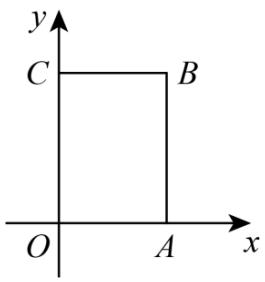

text_image

y
C B
O A x

【变式 3-3】（24-25 七年级下·广东潮州·期中）如图，长方形OABC在平面直角坐标系中，其中A(4,0)，C(0,3)，点E是BC的中点，动点P从O点出发，以每秒1cm的速度沿O-A-B-E运动，最终到达点E．若点P运动的时间为x秒，那么当△OPE的面积等于5cm²时，P点坐标为\_\_\_\_．

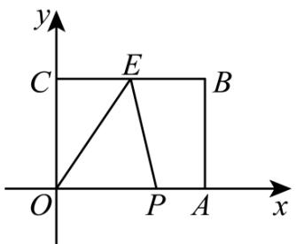

text_image

y
C E B
O P A x

# 【题型4 由面积相等求解】

【例 4】（24-25 八年级上·河南郑州·期中）如图，在平面直角坐标系中， $\triangle ABC$ 的顶点为 $A(-1,3)$ ， $B(0,-1)$ ， $C(1,1)$ 点D是x轴上一个动点，当 $\triangle BCD$ 的面积等于 $\triangle ABC$ 的面积时，点D的坐标为\_\_\_\_.

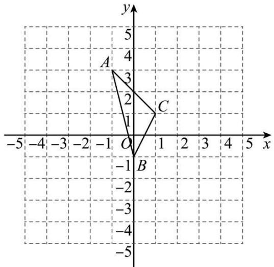

text_image

y
5
4
A
3
2
C
1
-5 -4 -3 -2 -1 O 1 2 3 4 5 x
-1
B
-2
-3
-4
-5

【变式 4-1】（24-25 七年级下·江西南昌·期末）在平面直角坐标系中，有点 A（2，4），点 B（0，2），若在坐标轴上有一点 C（不与点 B 重合），使三角形 AOC 和三角形 AOB 面积相等，则点 C 的坐标为 \_\_\_\_.

【变式 4-2】（24-25 八年级上·江苏苏州·阶段练习）在平面直角坐标系中， $A(0,1)$ ， $B(2,0)$ ， $C(4,3)$ ，点 P 在 x 轴上，且 $\triangle ABP$ 与 $\triangle ABC$ 的面积相等，则点 P 的坐标为 \_\_\_\_.

【变式 4-3】（24-25 七年级下·河北石家庄·期中）在平面直角坐标系中， $A(-1,0)$ ， $B(3,0)$ ， $C(0,3)$ ，则三角形ABC的面积为\_\_\_\_，如果在y轴上存在一点P，使得△PBC的面积与△ABC的面积相等，则点P的坐标为\_\_\_\_。

【题型 5 由面积间的关系求参数】教辅资源,关注公众号·全科AA+

【例 5】（24-25 七年级下·湖北武汉·期中）在平面直角坐标系中，已知点 $A(m-4,m+2)$ ， $B(m-4,m)$ ， $C(m,0)$ ， $D(2,0)$ ，已知三角形ABD的面积是三角形ABC面积的2倍，则m的值为（）

A. -14

B. 2

C. -14或2

D. 14 或 -2

【变式 5-1】（24-25 七年级下·山西吕梁·期末）如图，在平面直角坐标系中，四边形ABCO各个顶点的坐标分别为A(-1,8)，B(-8,4)，C(-10,0)，O(0,0)，P是y轴正半轴上一点，连接PC，若三角形PCO的面积等于四边形ABCO面积的 $\frac{1}{5}$ ，则点P的坐标为\_\_\_\_。

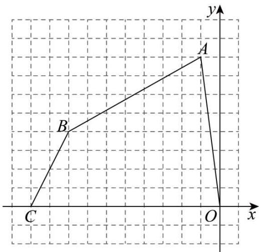

text_image

y
A
B
C
O
x

【变式 5-2】（24-25 七年级上·广东江门·期末）如图，在平面直角坐标系xOy中，点A, B, C的坐标分别为(1,2)，(1,1)，(4,1)．若在∠ABC内中存在一点D(a,a+2)，使得△DCB的面积是△DAB的面积的9倍，则点D的坐标为\_\_\_\_.

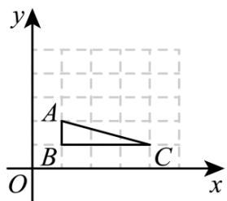

text_image

y
A
B
C
O
x

【变式 5-3】（24-25 七年级下·北京·期中）在平面直角坐标系中，已知点 $A(-2,8)$ ， $B(-11,6)$ ， $C(-14,0)$ ， $O(0,0)$ .

(1) 四边形OABC的面积为\_\_\_\_；

(2) 若 $y$ 轴上存在点 $M$ , 使 $\triangle OAM$ 的面积恰为四边形 $OABC$ 的面积的 $\frac{1}{10}$ , 则 $M$ 点坐标为 \_\_\_\_.

# 【题型6 直线分图形面积】

【例 6】（24-25 七年级下·湖北十堰·期中）如图， $A(-2,0)$ 、 $B(0,3)$ 、 $C(2,4)$ 、 $D(3,0)$ ，点 $P$ 在 $x$ 轴上，直线 $CP$ 将四边形 $ABCD$ 的面积分成 1:2 两部分，则 $OP$ 的长为 \_\_\_\_.

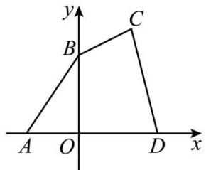

text_image

y
B
C
A O D x

【变式 6-1】（24-25 九年级上·北京·开学考试）七个边长为 2 的正方形按如图所示的方式放置在平面直角坐标系 $xOy$ 中，直线 $l$ 经过点 $A(8,8)$ 且将这七个正方形的面积分成相等的两部分，则直线 $l$ 与 $x$ 轴的交点 $B$ 的横坐标为 \_\_\_\_.

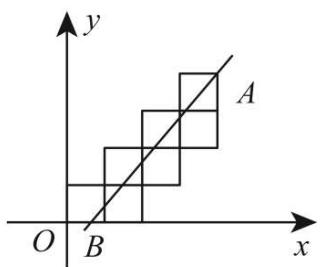

text_image

y
A
O B x

【变式 6-2】（24-25 七年级下·河南新乡·期中）综合与实践

如图，点A，C分别在y轴、x轴上， $AB \parallel OC$ ，点B的坐标为 $B(3,-5)$ ，OC = 5.

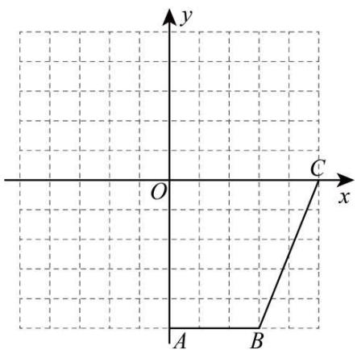

text_image

y
O
C
x
A
B

(1)点A的坐标是\_\_\_\_，点C的坐标是\_\_\_\_。

(2)有一个智能小车D，现从平面直角坐标系的原点O出发，沿着y轴向下匀速移动，移动速度为 $\frac{1}{2}$ 个单位长度/秒，将智能小车D和点C的连线记为线段CD．当线段CD将四边形OABC分成面积相等的两部分时，智能小车停止移动，求智能小车D移动的时间.

(3)在（2）的条件下，智能小车D停止移动时，将智能小车E移动到x轴上的某点，连接DE．请问将智能小车

E停在x轴上的哪个坐标时，能使得三角形CDE的面积与四边形OABC的面积相等？

【变式 6-3】（24-25 七年级下·上海·期末）在平面直角坐标系中，已知点A(2,4),B(6,4)，连接AB，将AB向下平移5个单位得线段CD，其中点A的对应点为点C，连接AC，BD．当PD将四边形ACDB的面积分成2:3两部分时，那么点P的坐标为\_\_\_\_.

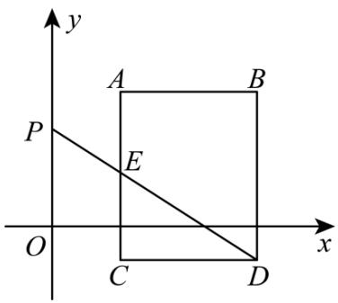

text_image

y
A B
P
E
O C D x

【题型 7 求不规则图形的面积】教辅资源, 关注公众号·全科AA+

【例 7】（24-25 七年级下·河南驻马店·期末）如图，在平面直角坐标系中，点 $E(8,0)$ ，点 $F(0,8)$ ，将三角形OEF向下平移2个单位长度得到三角形ABC，BC与x轴交于点G，CO=GO，则阴影部分面积是\_\_\_\_。

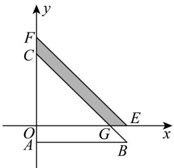

text_image

y
F
C
O
A
G
B
x
E

【变式 7-1】（24-25 七年级下·河南安阳·期末）如图，这是某县的部分平面简图.

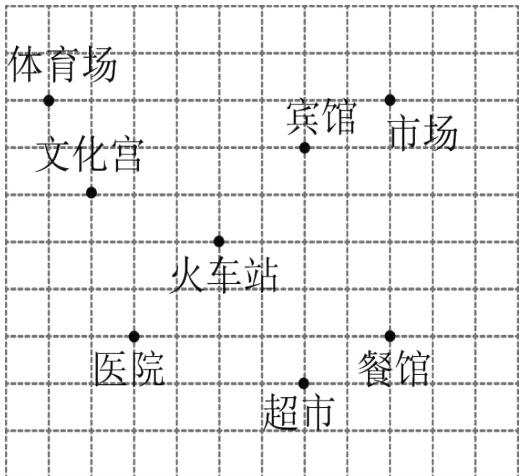

text_image

体育场
文化宫
火车站
医院
宾馆
市场
餐馆
超市

(1)请在图上建立适当的平面直角坐标系，并分别写出宾馆、文化宫、医院的坐标；  
(2)在（1）的条件下，如果把人的行走看作平移，某人从医院出发，先向右平移4个单位长度，再向下平移1个单位长度到达超市，请在图上标出超市的位置，并写出它的坐标；

(3)顺次连接表示宾馆、文化宫、医院、超市的点成为一个封闭图形，并求这个图形的面积.

【变式 7-2】（24-25 七年级下·北京海淀·期中）在平面直角坐标系中，我们把横纵坐标均为整数的点称为格点，若一个多边形的顶点全是格点，则称该多边形为格点多边形．例如：图中 $\triangle ABC$ 的与四边形 DEFG 均为格点多边形．图中每个小正方形边长均为 1．

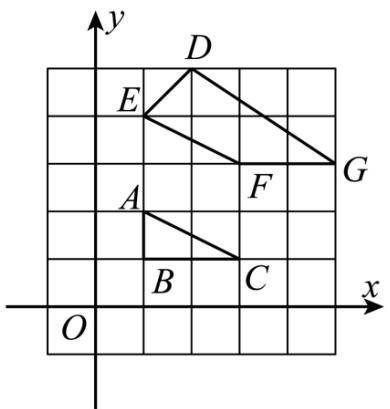

text_image

y
D
E
A
F
G
B
C
O
x

(1) $\triangle ABC$ 的面积为 $\_\_\_\_\_$ , 四边形 $DEFG$ 的面积为 $\_\_\_\_\_$ .  
(2)格点多边形的面积记为 S，其内部的格点数记为 N，边界上的格点记为 L，已知格点多边形的面积可表示为 $S = N + aL + b$ （a, b 为常数）。由（1）中所求图形的面积求 a, b 的值。  
(3)若某格点多边形对应的N=14，L=7，则S= \_\_\_\_.

【变式 7-3】（24-25 七年级下·湖北孝感·期中）如图 1，已知 $A(0,a)$ ， $B(b,0)$ ，满足 $|a-4|+|a-b+4|=0$ ，C，D 分别为 x 轴，y 轴正半轴上的点，且 C 在 B 右边，D 在 A 上方， $DC \parallel AB$ .

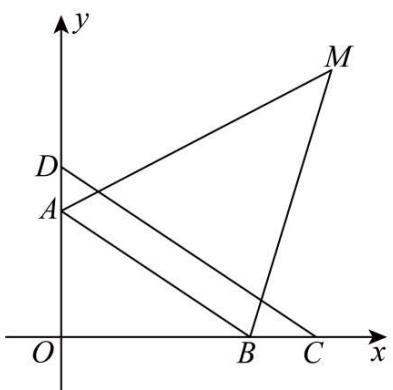

text_image

y
D
A
O
B
C
x
M

图1

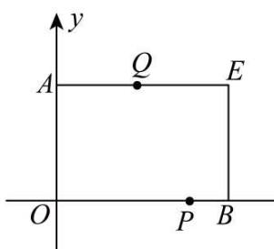

text_image

y
A Q E
O P B

图2

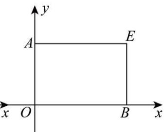

text_image

y
A	E
x	O	B	x

备用图

(1)求A，B两点的坐标.   
(2)如图1，作 $\angle DAB$ 和 $\angle CBA$ 的角平分线交于点 $M$ ，试求 $\frac{\angle ODC + \angle OBA}{\angle AMB}$ 的值.  
(3)如图2, 以 $OA$ 、 $OB$ 为邻边作长方形 $OAEB$ , 有一动点 $P$ 从 $B$ 点出发沿 $BO \rightarrow OA$ 方向以每秒1个单位长度的速度运动, 同时有一动点 $Q$ 从 $A$ 点出发沿 $AE \rightarrow EB$ 方向以每秒 $\frac{3}{2}$ 个单位长度的速度运动, 当两个点有一个到达终点时两点同时停止运动, 设运动时间为 $t$ , 求 $t$ 为何值时, 以 $P$ 、 $A$ 、 $Q$ 、 $B$ 为顶点的图形的面积恰为长方形 $OAEB$

面积的 $\frac{2}{3}$ ?