# 专题 01 平面直角坐标系中的面积问题（举一反三专项训练）

# 【北师大版 2024】

# 题型归纳

【题型1 求三角形的面积】....1

【题型 2 求四边形的面积】....5

【题型3 由面积的值求解】....8

【题型 4 由面积相等求解】....12

【题型 5 由面积间的关系求参数】....16

【题型 6 直线分图形面积】....19

【题型 7 求不规则图形的面积】....27

# 举一反三

# 【题型1 求三角形的面积】

【例 1】（24-25 七年级下·湖北武汉·期中）如图在平面直角坐标系中，点A(2,3)，点B(-3,-2)，点C(4,-3)，则三角形ABC的面积是（）

text_image

y
A
O
x
B
C

A. 19

B. 20

C. 21

D. 21.5

【答案】B

【分析】本题考查了三角形的面积，坐标与图形的性质．过点 A 作 $DE \parallel x$ 轴，过点 B 作 $EF \parallel y$ 轴，过点 C 作 $CD \parallel y$ 轴，过点 C 作 $CF \parallel x$ 轴，根据题意可得 AD = 2, CD = 6, AE = 5, BE = 5, BF = 1, CF = 7，即可求解.

【详解】解：如图，过点 A 作 $DE \parallel x$ 轴，过点 B 作 $EF \parallel y$ 轴，过点 C 作 $CD \parallel y$ 轴，过点 C 作 $CF \parallel x$ 轴，

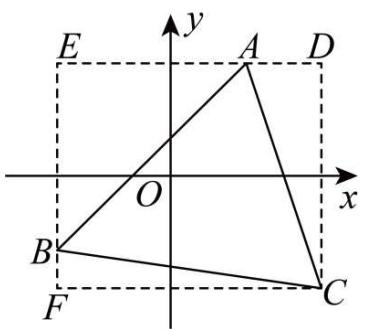

text_image

E
y
A
D
O
x
B
F
C

∵点A(2,3)，点B(-3,-2)，点C(4,-3)，

$$
\therefore A D = 2, C D = 6, A E = 5, B E = 5, B F = 1, C F = 7,
$$

∴三角形ABC的面积是： $6 \times 7 - \frac{1}{2} \times 2 \times 6 - \frac{1}{2} \times 5 \times 5 - \frac{1}{2} \times 17 = 42 - 6 - \frac{25}{2} - \frac{7}{2} = 20$ .

故选：B

【变式 1-1】（24-25 七年级下·甘肃武威·期末）平面直角坐标系中，由点 $A(a,3)$ ， $B(a+4,3)$ ， $C(b,-3)$ 组成的 $\triangle ABC$ 的面积是\_\_\_\_.

【答案】12

【分析】根据 A 和 B 两点的纵坐标相等，可得线段 AB 的长，再根据点 C 的纵坐标，可得以 AB 为底的 $\triangle ABC$ 的高，从而 $\triangle ABC$ 的面积可求.

【详解】解：∵点 $A(a,3),B(a+4,3)$ ,

$$
\therefore A B = 4,
$$

$$
\therefore C (b, - 3),
$$

∴ 点C在直线y = -3上，

∵直线 AB: y = 3 与直线 y = -3 平行，且平行线间的距离为 6，

$$
\therefore S = \frac {1}{2} \times 4 \times 6 = 1 2
$$

故答案为：12.

【点睛】本题考查了三角形的面积计算，明确平面直角坐标系中的点的坐标特点及求相应线段的长，是解题的关键.

【变式 1-2】（2025·湖北武汉·三模）在平面直角坐标系中，O 为坐标原点， $A(2,4), B(6,2)$ .

text_image

y
6
5
4
3
2
1
-1O
-1
-2
-3
-4
-5
-6
-6
-6
-6
-6
-6
-6
-6
-6
-6
-6
-6
-6
-6
-6
-6
-6
-6
-6
-6
-6
-6
-6
-6
-6
-6
-6
-6
-6
-6
-6
-6
-6
-6

(1)画出三角形AOB;   
(2)将三角形AOB向左平移3个单位长度, 向下平移5个单位长度, 得到三角形 $A_{1}O_{1}B_{1}$ , 画出三角形 $A_{1}O_{1}B_{1}$ ;  
(3)直接写出点 $A_{1},B_{1}$ 的坐标;  
(4)直接写出三角形 $A_{1}O_{1}B_{1}$ 的面积.

【答案】(1)见解析

(2) 见解析   
(3) $A_{1}(-1,-1)$ , $B_{1}(3,-3)$   
(4)10

【分析】本题考查平面直角坐标系中描点，平移作图，点的坐标，利用网格求三角形的面积．熟练掌握平移的性质是解题的关键.

（1）根据点的坐标描出点 A、点 B，再连接 AB、AO、BO 即可；  
(2) 利用平移的性质作出三角形即可;  
（3）根据 $A_{1}$ 、 $B_{1}$ 的位置，写出两点的坐标即可；  
（4）利用割补法求出三角形的面积即可.

【详解】（1）解：如图， $\triangle AOB$ 即为所求；

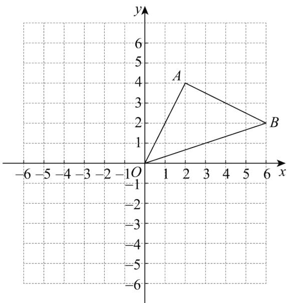

text_image

y
6
5
A
4
3
2
1
B
x
-6 -5 -4 -3 -2 -1 O 1 2 3 4 5 6
-1
-2
-3
-4
-5
-6

(2) 解: 如图, $\triangle A_{1}O_{1}B_{1}$ 即为所求;

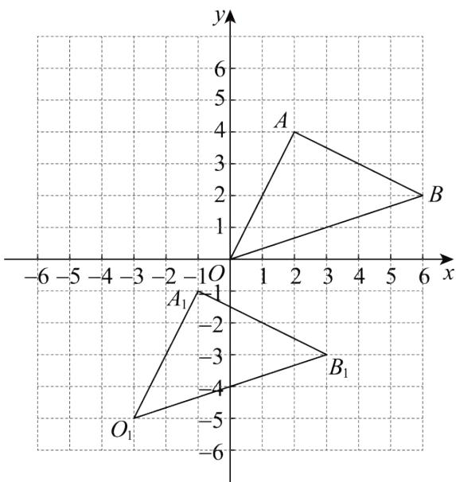

text_image

y
6
5
4
3
2
1
A
B
-6 -5 -4 -3 -2 -1 O 1 2 3 4 5 6 x
O₁ B₁
-1
-2
-3
-4
-5
-6

（3）解：由图可得： $A_{1}(-1,-1)$ ， $B_{1}(3,-3)$ .  
（4）解： $S_{\triangle A_{1}O_{1}B_{1}}=6\times4-\frac{1}{2}\times2\times4-\frac{1}{2}\times6\times2-\frac{1}{2}\times4\times2=10.$

【变式 1-3】（24-25 八年级上·福建福州·开学考试）在平面直角坐标系中，点 A 在第一象限，点 A(2,-a-1)，点 B(2,-a+3)，C(-2,-a-1)，则 $\triangle ABC$ 的面积是（）

A. 9

B. 8

C. 7

D. 6

【答案】B

【分析】本题主要考查了坐标与图形，三角形面积，根据点的坐标得出点 A 与点 B 的横坐标相同，点 A 与点 C 的纵坐标相同，是解题的关键.

先根据点的坐标可得点 A 与点 B 的横坐标相同，点 A 与点 C 的纵坐标相同，即有 $AB \parallel y$ 轴， $AC \parallel x$ 轴，进而

可得 $AB = |(-a + 3) - (-a - 1)| = 4$ ， $AC = 2 - (-2) = 4$ ，且 $AB \perp AC$ ，问题随之得解.

【详解】解：∵A(2,-a-1)，B(2,-a+3)，C(-2,-a-1)，

∴点 A 与点 B 的横坐标相同，点 A 与点 C 的纵坐标相同，

$\therefore AB \parallel y$ 轴， $AC \parallel x$ 轴，

$$
\therefore A B = | (- a + 3) - (- a - 1) | = 4, A C = 2 - (- 2) = 4 \text {, 且} A B \perp A C,
$$

$$
\therefore S _ {\triangle A B C} = \frac {1}{2} A B \cdot A C = \frac {1}{2} \times 4 \times 4 = 8,
$$

故选：B.

# 【题型2 求四边形的面积】

【例 2】（24-25 七年级下·福建厦门·期中）如图，在平面直角坐标系xOy中，已知点 $A(2,n+2)$ ， $B(k,n+2)$ ， $C(4,n+4)$ ， $D(2,n+k)$ 。则四边形ABCD的面积 = \_\_\_\_（用含有k的式子表示）

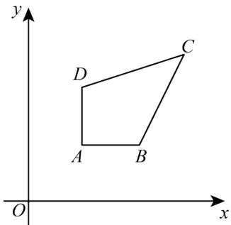

text_image

y
D
C
A
B
O
x

【答案】 $2k - 4 / - 4 + 2k$

【分析】本题主要考查了坐标与图形，延长BA交y轴于点E，过点C作 $CF\perp y$ 轴于点F，延长AD交CF于点H，过点C作 $CG\perp AG$ 于点G，根据 $A(2,n+2)$ ， $B(k,n+2)$ ， $C(4,n+4)$ ， $D(2,n+k)$ ，得出CH=4-2=2， $AH=n+4-(n+2)=2$ ， $DH=n+4-(n+k)=4-k$ ，BG=4-k，利用割补法求出四边形的面积即可.

【详解】解：延长BA交y轴于点E，过点C作 $CF \perp y$ 轴于点F，延长AD交CF于点H，过点C作 $CG \perp AG$ 于点G，

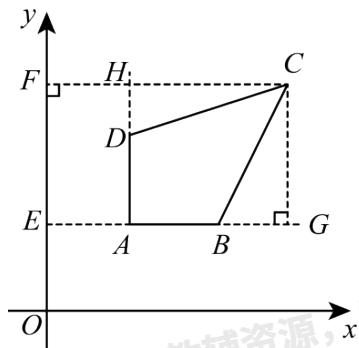

text_image

y
F H C
D
E A B G
O x

$$
\because A (2, n + 2), B (k, n + 2), C (4, n + 4), D (2, n + k),
$$

$\therefore AD\|y轴,\ AB\|x轴,$

$\therefore AH\|CG,\ CH\|EG,$

$$
\therefore C H = 4 - 2 = 2, A H = n + 4 - (n + 2) = 2,
$$

$$
D H = n + 4 - (n + k) = 4 - k,
$$

$$
B G = 4 - k,
$$

∴四边形ABCD的面积为:

$$
\begin{array}{l} 2 \times 2 - \frac {1}{2} \times 2 \times (4 - k) - \frac {1}{2} \times 2 \times (4 - k) \\ = 4 - 4 + k - 4 + k \\ = 2 k - 4. \\ \end{array}
$$

故答案为：2k-4.

【变式 2-1】（24-25 七年级下·广东中山·期中）如图， $\triangle OAB$ 的顶点 $A, B$ 的坐标分别为 $(2,4)$ ， $(6,0)$ ，把 $\triangle OAB$ 沿 $x$ 轴向右平移得到 $\triangle CDE$ .

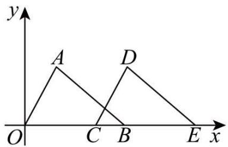

text_image

y
A
D
O
C
B
E
x

（1）若 $CB = \frac{3}{2}$ ，则 $OE$ 的长为  
(2) 连接 $AD$ , 在 (1) 的条件下, 则四边形 $O A D E$ 的面积是 \_\_\_\_.

【答案】 $\frac{21}{2}$ 30

【分析】本题考查平移的性质，梯形的面积.

（1）由点的坐标和平移的性质先求出OB = CE = 6 ，再求OE即可；  
（2）由平移可知四边形OADE是梯形，再根据坐标求出上底，下底和高即可.

【详解】解：（1）∵ A,B 的坐标分别为 $(2,4)$ ， $(6,0)$ ，△ OAB 沿 x 轴向右平移得到 △ CDE

$$
\therefore O B = C E = 6
$$

$$
\because C B = \frac {3}{2}
$$

$$
\therefore B E = 6 - \frac {3}{2} = \frac {9}{2}
$$

$$
\therefore O E = O B + B E = 6 + \frac {9}{2} = \frac {2 1}{2}
$$

故答案为： $\frac{21}{2}$ ;

(2) 如图，连接AD，

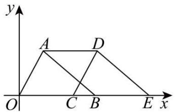

text_image

y
A D
O C B E x

∵ A,B的坐标分别为(2,4)，(6,0)， $\triangle OAB$ 沿x轴向右平移得到 $\triangle CDE$

∴ 四边形 OADE 是梯形

由（1）知， $BE=\frac{9}{2},OE=\frac{21}{2}$

$$
\therefore A D = B E = \frac {9}{2}
$$

∴梯形OADE面积是 $\frac{\left(\frac{9}{2}+\frac{21}{2}\right)\times4}{2}=30.$

故答案为：30.

【变式 2-2】（24-25 七年级下·福建泉州·期中）在平面直角坐标系中，已知点A(-2,0)，B(-1,2)，将线段AB平移至线段CD．若点C和D恰好都在两坐标轴上，且点D在y轴的负半轴上，则四边形ABCD的面积是\_\_\_\_．

【答案】6

【分析】根据点D在y轴的负半轴上作出图形，可得点C坐标为(1,0)，点D坐标为(0,-2)，然后计算即可.

【详解】解：如图所示，平移后点 C 坐标为 $(1,0)$ ，点 D 坐标为 $(0,-2)$ ，

∴四边形ABCD的面积 $=S_{\triangle ABC} + S_{\triangle ADC} = \frac{1}{2} \times 3 \times 2 + \frac{1}{2} \times 3 \times 2 = 6,$

故答案为：6.

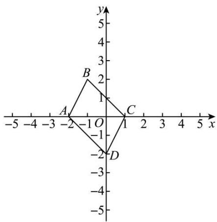

text_image

y
5
4
3
2
1
B
A
-2
-1
O
C
-1
-2
D
-3
-4
-5
x
-5
-4
-3
-2
-1
1
2
3
4
5

【点睛】本题考查了平移的性质，坐标与图形，熟练掌握平移的性质，作出平移后的图形是解题的关键.

【变式 2-3】（24-25 八年级下·辽宁丹东·期末）如图在平面直角坐标系中将□ABCD向右平移得到□ $A_{1}B_{1}C_{1}$

$D_{1}$ ，其中点 A 坐标为 $(2,3)$ ，点 C 坐标 $(2,1)$ ，点 D 坐标 $(1,1)$ ，点 $C_{1}$ 坐标 $(5,1)$ ，则 □ABCD 在平移过程扫过的面积即四边形 $ADC_{1}B_{1}$ 的面积为 \_\_\_\_.

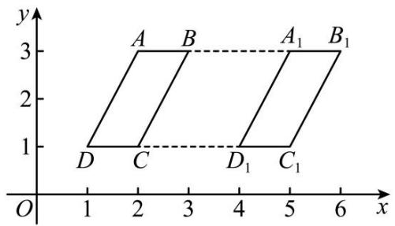

text_image

y
3
A B A₁ B₁
2
1
D C D₁ C₁
O 1 2 3 4 5 6 x

【答案】8

【分析】本题考查了根据平移的性质求解，平行四边形的性质，坐标与图形，根据点 $C$ 、 $C_1$ 的坐标求出平移距离，然后求出点 $A_{1}$ ， $B_{1}$ 的坐标，再根据平行四边形的面积公式列式计算即可得解.

【详解】解：∵点 $C(2,1)$ ，点 $C_{1}(5,1)$ ，

∴平移距离5-2=3，

∵点A(2,3),

∴点 $A_{1}$ 的坐标为(5,3)，

∵点C(2,1)，点D坐标(1,1)，

∴点 B 的坐标为(3,3)

$\therefore B_{1}(6,3),$

由平移性质得四边形 $ADC_{1}B_{1}$ 是平行四边形，

∴四边形 $ADC_{1}B_{1}$ 的面积 $=(3-1)\times(6-2)=8$

故答案为：8.

# 【题型3 由面积的值求解】

【例 3】（24-25 七年级下·新疆喀什·期末）已知点 $A(2,0)$ ， $B(0,1)$ ，点P在y轴上，且三角形PAB的面积是3，则点P的坐标是（）

A. $(0, -2)$

B. $(4, 0)$

C. $(0, 4)$ 或 $(0, -2)$

D. $(4,0)$ 或 $(-2,0)$

【答案】C

【分析】本题考查了图形与坐标，先设点P的坐标为 $(0, n)$ ，结合点 $A(2, 0)$ ， $B(0, 1)$ ，列式三角形PAB的面积是 $\frac{1}{2} \times 2|n - 1|$ ，因为三角形 $PAB$ 的面积是3，得出 $\frac{1}{2} \times 2|n - 1| = 3$ ，再解方程，即可作答.

【详解】解：∵点P在y轴上

∴设点P的坐标为 $(0, n)$

依题意， $\frac{1}{2}\times2|n-1|=3$

解得 $n = 4$ ，-2

∴点P的坐标是 $(0, 4)$ 或 $(0, -2)$

故选：C

【变式 3-1】（24-25 七年级上·河北邢台·期末）已知点A(0,a)和点B(6,0)两点，且直线AB与坐标轴围成的三角形的面积等于12，则点A的坐标为\_\_\_\_。

【答案】(0,4)或(0,-4)

【分析】本题考查了坐标与图形．先求出OA、OB的长度，再利用三角形的面积列方程求出a的值，然后写出点A的坐标即可.

【详解】解：∵点 $A(0,a)$ 和点 $B(6,0)$ 两点，

$$
\therefore O A = | a |, O B = 6,
$$

∵ 直线AB与坐标轴围成的三角形的面积等于12,

$$
\therefore \frac {1}{2} \times 6 \cdot | a | = 1 2,
$$

解得 $a=\pm4$ ,

所以，点A的坐标为(0,4)或(0,-4).

故答案为： $(0,4)$ 或 $(0,-4)$ .

【变式 3-2】（24-25 七年级下·江西宜春·期中）如图所示，在长方形OABC中，点 O 是平面直角坐标系的原点，B 点坐标为 $(4, 6)$ ，有一动点 P 从原点出发，以每秒 1 个单位长度的速度沿着 $O \rightarrow C \rightarrow B \rightarrow A$ 的路线移动，到 A 点停止运动。在点 P 移动的过程中，当三角形OBP 的面积是 8 时，则 P 点运动的时间为 \_\_\_\_ 秒。

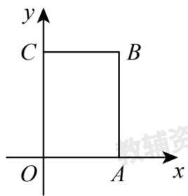

text_image

y
C B
O A x

【答案】4或 $\frac{22}{3}$ 或14

【分析】本题主要考查了坐标与图形，先求出 $OA = BC = 4$ ， $OC = AB = 6$ ，再分当点 $P$ 在 $OC$ 上时，当点 $P$ 在 $BC$ 上时，当点 $P$ 在 $AB$ 上时，三种情况根据三角形面积公式列出方程求出点 $P$ 的运动路程，进而求出运动时间即可.

【详解】解：∵在长方形OABC中，点O是平面直角坐标系的原点，B点坐标为 $(4,6)$ ，

$$
\therefore O A = B C = 4, \quad O C = A B = 6,
$$

当点 P 在 OC 上时，

∵三角形OBP的面积是8，

$\therefore\frac{1}{2}OP\cdot BC=8$ ，即 $\frac{1}{2}\times4OP=8$ ，

$$
\therefore O P = 4,
$$

∴此时运动时间为4秒;

当点 P 在 BC 上时，

∵三角形OBP的面积是8，

$\therefore \frac{1}{2} BP \cdot OC = 8$ ，即 $\frac{1}{2} \times 6BP = 8$

$$
\therefore B P = \frac {8}{3},
$$

∴此时运动时间为 $4+6-\frac{8}{3}=\frac{22}{3}$ 秒；

当点 P 在 AB 上时，

∵三角形OBP的面积是8，

$\therefore \frac{1}{2} BP \cdot OA = 8$ ，即 $\frac{1}{2} \times 4BP = 8$

$$
\therefore B P = 4,
$$

∴此时运动时间为 $4+6+4=14$ 秒;

综上所述，P 点运动的时间为 4 秒或 $\frac{22}{3}$ 秒或 14 秒，

故答案为：4 或 $\frac{22}{3}$ 或 14.

【变式 3-3】（24-25 七年级下·广东潮州·期中）如图，长方形OABC在平面直角坐标系中，其中A(4,0)，C(0,3)，点E是BC的中点，动点P从O点出发，以每秒1cm的速度沿O-A-B-E运动，最终到达点E．若点P运动的时间为x秒，那么当△ OPE的面积等于5cm²时，P点坐标为\_\_\_\_．

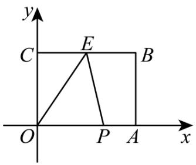

text_image

y
C E B
O P A x

【答案】 $\left(\frac{10}{3},0\right)$ 或(4,1)

【分析】本题考查了矩形的性质，三角形面积公式，利用分类讨论思想解决问题是解题的关键.

分三种情况讨论，即点 $P$ 在 $OA$ 上， $AB$ 上及 $BC$ 上；再根据分上述三种情况分别画出图形，利用三角形的面积公式进行计算解答即可.

【详解】解：∵ $A(4,0)$ ， $C(0,3)$ ，

$$
\therefore O A = B C = 4, \quad O C = A B = 3,
$$

①当P在OA上时，

∵ $\triangle OPE$ 的面积等于 $5cm^{2}$ ,

$$
\therefore \frac {1}{2} \times x \times 3 = 5,
$$

解得 $x=\frac{10}{3}$ ,

点 $P(\frac{10}{3}, 0)$ ,

②当P在BC上时，如图2，

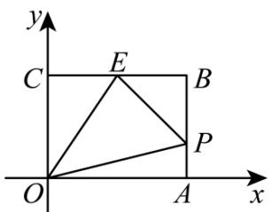

text_image

y
C E B
O A x
P

图2

∵ $\triangle OPE$ 的面积等于 $5cm^{2}$ ,

$$
\therefore S _ {\text {矩形} A B C O} - S _ {\triangle B P E} - S _ {\triangle O C E} - S _ {\triangle A O P} = 5,
$$

$$
\therefore 4 \times 3 - \frac {1}{2} (4 + 3 - x) \times 2 - \frac {1}{2} \times 3 \times 2 - \frac {1}{2} \times 4 \times (x - 4) = 5,
$$

解得x=5.

∴ 点 $P(4,1)$ ;

③当P在BE上时，

$$
\therefore \frac {1}{2} (4 + 3 + 2 - x) \times 3 = 5,
$$

解得 $x=\frac{17}{3}$ ，不合题意，舍去.

综上可知，当点P坐标为 $\left(\frac{10}{3},0\right)$ 或(4,1)时， $\triangle OPE$ 的面积等于 $5cm^{2}$ ，

故答案为： $\left(\frac{10}{3},0\right)$ 或(4,1)

# 【题型4 由面积相等求解】

【例 4】（24-25 八年级上·河南郑州·期中）如图，在平面直角坐标系中， $\triangle ABC$ 的顶点为 $A(-1,3)$ ， $B(0,-1)$ ， $C(1,1)$ 点 D 是 x 轴上一个动点，当 $\triangle BCD$ 的面积等于 $\triangle ABC$ 的面积时，点 D 的坐标为 \_\_\_\_.

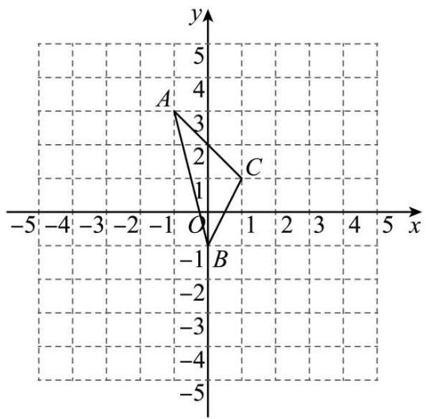

text_image

y
5
4
A
3
2
1
C
-1
B
-2
-3
-4
-5
-5
-4
-3
-2
-1
0
1
2
3
4
5
x
-5 -4 -3 -2 -1 O 1 2 3 4

【答案】 $\left(3\frac{1}{2},0\right)$ 或 $\left(-2\frac{1}{2},0\right)$

【分析】本题考查三角形的面积，坐标与图形性质，关键是要分两种情况讨论.

求出 $\triangle ABC$ 的面积 $= 3$ ，当 $D$ 在 $x$ 轴正半轴上时，由三角形面积公式得到 $\frac{1}{2} MD_1 \times 1 + \frac{1}{2} MD_1 \times 1 = 3$ ，因此 $MD_1 = 3$ ，当 $D$ 在 $x$ 轴负半轴上时，同理求出 $MD_2 = 3$ ，于是得到 $OD_1 = 3\frac{1}{2}$ ， $OD_2 = 2\frac{1}{2}$ ，即可得到 $D$ 的坐标.

【详解】解：根据题意可得： $\triangle ABC$ 的面积 $=4\times2-\frac{1}{2}\times2\times2-\frac{1}{2}\times1\times4-\frac{1}{2}\times2\times1=3$

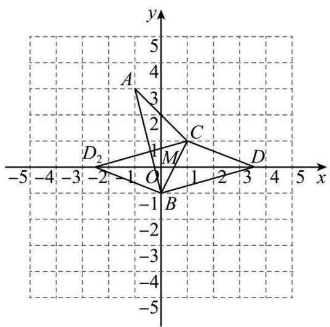

text_image

y
5
4
A
3
2
C
1
M
D₂
-2
O
1
2
3
4
5
x
-5 -4 -3 -2 1 -2 -1 B
-2
-3
-4
-5

设BC交x轴于M,

当 D 在 x 轴正半轴上时，

∵△CMD的面积+△BMD的面积=△BCD的面积=△ABC的面积=3,

$$
\therefore \frac {1}{2} M D _ {1} \times 1 + \frac {1}{2} M D _ {1} \times 1 = 3,
$$

$$
\therefore M D _ {1} = 3,
$$

当 D 在 x 轴负半轴上时，

同理求出 $MD_{2}=3$ ,

根据图象可得 $OM=\frac{1}{2}$ ,

$$
\therefore O D _ {1} = 3 + \frac {1}{2} = 3 \frac {1}{2}, O D _ {2} = 3 - \frac {1}{2} = 2 \frac {1}{2},
$$

∴D的坐标是 $\left(3\frac{1}{2},0\right)$ 或 $\left(-2\frac{1}{2},0\right)$ ,

故答案为： $\left(3\frac{1}{2},0\right)$ 或 $\left(-2\frac{1}{2},0\right)$ .

【变式 4-1】（24-25 七年级下·江西南昌·期末）在平面直角坐标系中，有点 A（2，4），点 B（0，2），若在坐标轴上有一点 C（不与点 B 重合），使三角形 AOC 和三角形 AOB 面积相等，则点 C 的坐标为 \_\_\_\_.

【答案】（1，0），（-1，0），（0，-2）

【分析】根据题意点 C 的位置可分当点 C 在 x 轴上时和当点 C 在 y 轴上时两种情况进行讨论，从而根据三角形的面积公式列式，进而求得 OC，得出点 C 的坐标.

【详解】解：根据题意可知三角形 AOB 面积 $S_{\triangle AOB}=\frac{1}{2}\times OB\times|x_{A}|=\frac{1}{2}\times2\times2=2$

当点 C 在 x 轴上时，

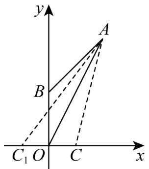

text_image

y
A
B
C₁ O C x

$$
\because S _ {\triangle A O C} = S _ {\triangle A O B},
$$

$$
\therefore \frac {1}{2} \times O C \times | y _ {A} | = \frac {1}{2} \times O C \times 4 = 2,
$$

解得 OC=1，

∴点 C 的坐标为 $(1, 0)$ ， $(-1, 0)$ ;

当点 C 在 y 轴上时，

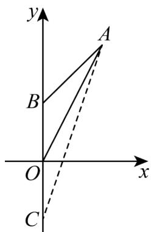

text_image

y
A
B
O
x
C

$$
\because S _ {\triangle A O C} = S _ {\triangle A O B},
$$

$$
\therefore \frac {1}{2} \times O C \times | x _ {A} | = \frac {1}{2} \times O C \times 2 = 2,
$$

$$
\therefore O C = 2,
$$

又点 C 不与点 B 重合，

∴点 C 坐标为 $(0, -2)$ .

综上所述，点 C 的坐标为 $(1, 0)$ ， $(-1, 0)$ ， $(0, -2)$ .

故答案为：（1，0），（-1，0），（0，-2）.

【点睛】本题考查三角形的面积及坐标与图形性质，解题的关键是根据题意分两种情况进行讨论（当点 C 在 x 轴上时和当点 C 在 y 轴上时），根据三角形的面积公式求得 OC，再得出点 C 的坐标，也可以适当的画草图进行分析.

【变式 4-2】（24-25 八年级上·江苏苏州·阶段练习）在平面直角坐标系中， $A(0,1)$ ， $B(2,0)$ ， $C(4,3)$ ，点 P 在 x 轴上，且 $\triangle ABP$ 与 $\triangle ABC$ 的面积相等，则点 P 的坐标为 \_\_\_\_.

【答案】 $(10, 0)$ 或 $(-6, 0)$

【分析】过点 C 作 $CD \perp x$ 轴， $CE \perp y$ 轴，垂足分别为 D、E，然后依据 $S_{\triangle ABC} = S_{四边形CDOE} - S_{\triangle AEC} - S_{\triangle ABO} - S_{\triangle BCD}$ 求出 $S_{\triangle ABC} = 4$ ，设点 P 的坐标为 $(x,0)$ ，于是得到 BP = |x-2|，再根据三角形的面积公式求解即可.

【详解】解：如图，过点 C 作 $CD \perp x$ 轴， $CE \perp y$ 轴，垂足分别为 D、E，

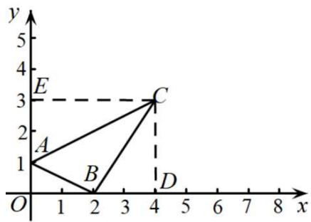

text_image

y
5
4
E
3
A
2
C
1
B
D
O
1
2
3
4
5
6
7
8
x

则 $S_{\triangle ABC}=S_{四边形CDOE}-S_{\triangle AEC}-S_{\triangle ABO}-S_{\triangle BCD}$

$$
\begin{array}{l} = 3 \times 4 - \frac {1}{2} \times 2 \times 4 - \frac {1}{2} \times 1 \times 2 - \frac {1}{2} \times 2 \times 3 \\ = 1 2 - 4 - 1 - 3 \\ = 4, \\ \end{array}
$$

设点 P 的坐标为 $(x,0)$ ，则 BP = |x-2|，

∵△ABP与△ABC的面积相等，

$$
\therefore \frac {1}{2} | x - 2 | \times 1 = 4,
$$

解得：x = 10 或 x = -6，

∴点 P 的坐标为 $(10, 0)$ 或 $(-6, 0)$ ,

故答案为： $(10, 0)$ 或 $(-6, 0)$ .

【点睛】本题主要考查的是坐标与图形的性质，利用割补法求得 $\triangle ABC$ 的面积是解题的关键.

【变式 4-3】（24-25 七年级下·河北石家庄·期中）在平面直角坐标系中， $A(-1,0)$ ， $B(3,0)$ ， $C(0,3)$ ，则三角形ABC的面积为\_\_\_\_，如果在y轴上存在一点P，使得△PBC的面积与△ABC的面积相等，则点P的坐标为\_\_\_\_。

【答案】6 (0,7)或(0,-1)/(0,-1)或(0,7)

【分析】本题考查了三角形的面积，坐标与图形的性质，正确进行分类讨论是解题的关键．设点 $P(0,y)$ ，根据△PBC的面积与△ABC的面积相等，先计算△ABC的面积，然后列出等式计算y即可解答.

【详解】解：如图，

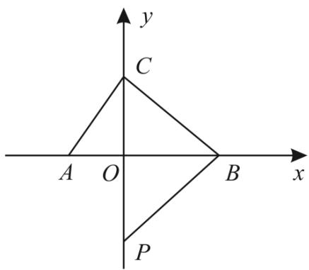

text_image

y
C
A O B x
P

$$
\because A (- 1, 0), B (3, 0),
$$

$$
\therefore A B = 4,
$$

∴ $\triangle ABC$ 的面积为： $\frac{1}{2} \times AB \cdot y_{C} = \frac{1}{2} \times 4 \times 3 = 6;$

设点 $P(0,y)$ ,

∵△PBC的面积与△ABC的面积相等，

$$
\therefore \frac {1}{2} \times | 3 - y | \times 3 = 6,
$$

解得y = -1或y = 7，

∴点 P 的坐标为： $(0,7)$ 或 $(0,-1)$ .

故答案为：6；(0,7)或(0,-1).

# 【题型5 由面积间的关系求参数】

【例 5】（24-25 七年级下·湖北武汉·期中）在平面直角坐标系中，已知点 $A(m-4,m+2)$ ， $B(m-4,m)$ ， $C(m,0)$ ， $D(2,0)$ ，已知三角形ABD的面积是三角形ABC面积的2倍，则m的值为（）

A. -14

B. 2

C. -14或2

D. 14 或 -2

【答案】D

【分析】本题考查三角形的面积，坐标与图形，熟练掌握坐标与图形的性质是解题的关键．根据三角形的面积关系列出方程解题即可．先根据点 A、B 的横坐标相等得出 $AB \parallel y$ 轴以及 AB 的长，再根据三角形面积之间的关系得出关于 m 的方程求解即可.

【详解】解：∵三角形ABD的面积是三角形ABC面积的2倍，

$$
\therefore \frac {1}{2} \times (m + 2 - m) \cdot | m - 4 - 2 | = \frac {1}{2} \times (m + 2 - m) \cdot | m - 4 - m | \times 2,
$$

解得：m = 14 或 m = -2，

故选 D.

【变式 5-1】（24-25 七年级下·山西吕梁·期末）如图，在平面直角坐标系中，四边形ABCO各个顶点的坐标分别为A(-1,8)，B(-8,4)，C(-10,0)，O(0,0)，P是y轴正半轴上一点，连接PC，若三角形PCO的面积等于四边形ABCO面积的 $\frac{1}{5}$ ，则点P的坐标为\_\_\_\_。

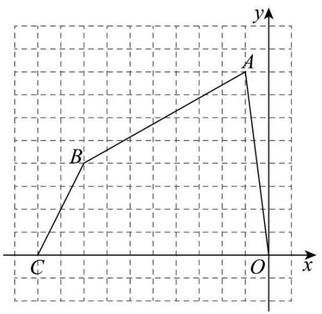

text_image

y
A
B
C
O
x

【答案】(0,58)

【分析】本题考查利用网格求三角形的面积，先利用网格求出四边形ABCO面积，再根据三角形PCO的面积等于四边形ABCO面积的 $\frac{1}{5}$ ，即可求解.

【详解】解：由题意得： $S_{ABCO}=10\times8-\frac{1}{2}\times1\times8-\frac{1}{2}\times4\times2-\frac{1}{2}\times7\times4=58,$

∵三角形PCO的面积等于四边形ABCO面积的 $\frac{1}{5}$ ，P是y轴正半轴上一点，

$\therefore\frac{1}{2}\times10\times y_{P}=\frac{1}{5}\times58$ ，解得： $y_{P}=58$ ，

则点 P 的坐标为 $(0,58)$ ,

故答案为：(0,58).

【变式 5-2】（24-25 七年级上·广东江门·期末）如图，在平面直角坐标系xOy中，点A，B，C的坐标分别为(1,2)，(1,1)，(4,1)．若在∠ABC内中存在一点D(a,a+2)，使得△DCB的面积是△DAB的面积的9倍，则点D的坐标为\_\_\_\_.

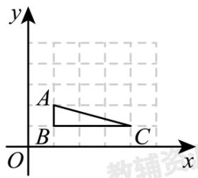

text_image

y
A
B C
O x
教辅资

【答案】(2,4)

【分析】本题主要考查了坐标与图形，解题的关键是根据题意列出关于 a 的方程并解出 a 的值．根据点的坐标先表示两个三角形面积，列方程求出求出 a 的值，即可得出结论.

【详解】解：∵ $D(a,a+2)$ $A(1,2)$ ， $B(1,1)$ ， $C(4,1)$ ，

$$
\therefore S _ {\triangle D C B} = \frac {1}{2} \times (4 - 1) \times (a + 2 - 1) = \frac {3}{2} (a + 1),
$$

$$
\therefore S _ {\triangle D A B} = \frac {1}{2} \times (2 - 1) \times (a - 1) = \frac {1}{2} (a - 1),
$$

∵△DCB的面积是△DAB的面积的9倍，

$$
\therefore \frac {3}{2} (a + 1) = 9 \times \frac {1}{2} (a - 1),
$$

解得：a = 2，

$\therefore D(2,4).$

故答案为：(2,4)

【变式 5-3】（24-25 七年级下·北京·期中）在平面直角坐标系中，已知点 $A(-2,8)$ ， $B(-11,6)$ ， $C(-14,0)$ ， $O(0,0)$ .

(1) 四边形OABC的面积为\_\_\_\_；

(2) 若 $y$ 轴上存在点 $M$ , 使 $\triangle OAM$ 的面积恰为四边形 $OABC$ 的面积的 $\frac{1}{10}$ , 则 $M$ 点坐标为 \_\_\_\_.

【答案】80 (0,8)或(0,-8)

【分析】本题主要考查了平面直角坐标系中四边形面积的计算，以及利用三角形面积公式求解特定点的坐标.

（1）过B作 $BD \perp x$ 轴于点D，过A作 $AE \perp x$ 轴于点E，则 $BD = y_{B} = 6$ ， $AE = y_{A} = 8$ ， $OE = -x_{A} = 2$ ， $OD = -x_{B} = 11$ ， $OC = -x_{C} = 14$ ， $DE = 9$ ， $DC = 3$ ，再根据 $S_{\text{四边形}OABC} = S_{\triangle AOE} + S_{\triangle BCD} + S_{\text{梯形}ABDE}$ 求解即可；

（2）设M点坐标为 $(0,m)$ ，由题意得 $S_{\triangle OAM}=\frac{1}{10}S_{四边形OABC}=\frac{1}{10}\times80=8$ ，即可得 $\frac{1}{2}|x_{A}|\cdot|m|=8$ ，解方程即可.

【详解】解：（1）过B作 $BD \perp x$ 轴于点D，过A作 $AE \perp x$ 轴于点E，

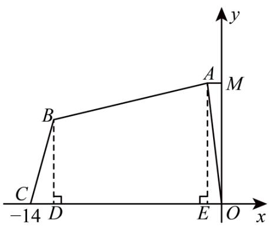

text_image

y
A
M
B
C
-14 D
E O x

则 $BD=y_{B}=6,\ AE=y_{A}=8,\ OE=-x_{A}=2,\ OD=-x_{B}=11,\ OC=-x_{C}=14,$

$$
\therefore D E = O D - O E = 1 1 - 2 = 9, D C = O C - O D = 1 4 - 1 1 = 3,
$$

$$
\begin{array}{l} \therefore S _ {\text {四边形} O A B C} = S _ {\triangle A O E} + S _ {\triangle B C D} + S _ {\text {梯形} A B D E} \\ = \frac {1}{2} O E \cdot A E + \frac {1}{2} D C \cdot B D + \frac {1}{2} (B D + A E) \cdot D E \\ = \frac {1}{2} \times 2 \times 8 + \frac {1}{2} \times 3 \times 6 + \frac {1}{2} \times (6 + 8) \times 9 \\ = 8 + 9 + 6 3 \\ = 8 0, \\ \end{array}
$$

故答案为：80;

(2) 设M点坐标为 $(0,m)$ ,

∵ $\triangle OAM$ 的面积恰为四边形 OABC 的面积的 $\frac{1}{10}$ ,

$$
\therefore S _ {\triangle O A M} = \frac {1}{1 0} S _ {\text {四边形} O A B C} = \frac {1}{1 0} \times 8 0 = 8,
$$

$\therefore \frac{1}{2} |x_A|\cdot |m| = 8$ ，即 $\frac{1}{2}\times 2\times |m| = 8,$

解得 $m=\pm8$ ,

∴M点坐标为(0,8)或(0,-8),

故答案为：(0,8)或(0,-8).

# 【题型6 直线分图形面积】

【例 6】（24-25 七年级下·湖北十堰·期中）如图， $A(-2,0)$ 、 $B(0,3)$ 、 $C(2,4)$ 、 $D(3,0)$ ，点 $P$ 在 $x$ 轴上，直线 $CP$ 将四边形 $ABCD$ 的面积分成 1:2 两部分，则 $OP$ 的长为 \_\_\_\_.

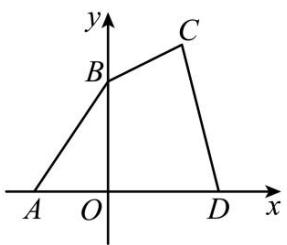

text_image

y
B
C
A O D x

【答案】1

【分析】本题考查了坐标与图形，三角形的面积，作 $CE \perp x$ 轴，CP与x轴交于点P，用分割法求出四边形的面积，分类讨论求出 $\triangle PDC$ 的面积，再求出PD的值，进而可得OP的值，根据坐标与图形的性质，用分割法求出不规则图形的面积，再进行计算是解本题的关键.

【详解】解：如图，作 $CE \perp x$ 轴，CP与x轴交于点P，

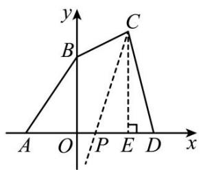

text_image

y
B
C
A O P E D x

由题意可得， $S_{\triangle ABO} = \frac{1}{2} OA \cdot OB = \frac{1}{2} \times 2 \times 3 = 3$

$$
S _ {\text {梯形} O E C B} = \frac {1}{2} (O B + C E) \cdot O E = \frac {1}{2} \times (3 + 4) \times 2 = 7,
$$

$$
S _ {\triangle E D C} = \frac {1}{2} E D \cdot C E = \frac {1}{2} \times 1 \times 4 = 2,
$$

$$
\therefore S _ {\text {四边形} A B C D} = S _ {\triangle A B O} + S _ {\text {梯形} O E C B} + S _ {\triangle E D C} = 3 + 7 + 2 = 1 2,
$$

$$
\because S _ {\triangle P C D} = \frac {1}{2} P D \cdot C E = \frac {1}{2} P D \times 4 = 2 P D,
$$

$$
\therefore S _ {\triangle P C D}: S _ {\text {四边形} A B C D} = 2 P D: 1 2 = P D: 6,
$$

①当 $S_{\triangle PCD}:S_{四边形ABCD}=1:3$ 时，即PD:6=1:3，

解得PD = 2，

∴点P的坐标为(1,0)，

$$
\therefore O P = 1;
$$

②当 $S_{\triangle PCD}:S_{四边形ABCD}=2:3$ 时，即PD:6=2:3，

解得PD = 4,

∴点P的坐标为 $(-1,0)$ ,

$$
\therefore O P = 1;
$$

综上所述，OP = 1，

故答案为：1.

【变式 6-1】（24-25 九年级上·北京·开学考试）七个边长为 2 的正方形按如图所示的方式放置在平面直角坐标系 xOy 中，直线 l 经过点 A(8,8) 且将这七个正方形的面积分成相等的两部分，则直线 l 与 x 轴的交点 B 的横坐标为 \_\_\_\_.

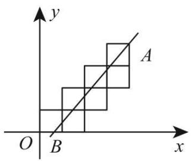

text_image

y
A
O B x

【答案】 $\frac{3}{2}$

【分析】本题考查坐标与图形的性质，根据直线 l 经过点 $A(8, 8)$ 且将这七个正方形的面积分成相等的两部分列方程求解是解本题的关键．作 $AD \perp x$ 轴于 D， $AE \perp y$ 轴于 E，设 $B(m, 0)(m > 0)$ ，则 OB = m，BD = 8 - m，根据题意有 $S_{梯形OBAE} - 24 = S_{\triangle ABD} - 12$ ，代入相关数据即可求解.

【详解】解：作 $AD \perp x$ 轴于D， $AE \perp y$ 轴于E

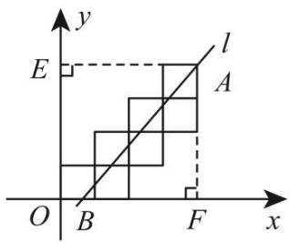

text_image

y
E
l
A
O B F x

$\because A(8, 8),$

$$
\therefore O D = A D = O E = A E = 8,
$$

设 $B(m, 0)(m > 0)$ ，则OB = m，BD = 8 - m，

则根据题意有： $S_{梯形OBAE}-24=S_{\triangle ABD}-12$

$$
\therefore \frac {1}{2} (O B + A E) \cdot O E - 2 4 = \frac {1}{2} \cdot B D \cdot A D - 1 2,
$$

$$
\therefore \frac {1}{2} (m + 8) \times 8 - 2 4 = \frac {1}{2} (8 - m) \times 8 - 1 2,
$$

解得： $m=\frac{3}{2}$

∴直线 l 与 x 轴的交点 B 的横坐标为 $\frac{3}{2}$ .

故答案为： $\frac{3}{2}$ .

【变式 6-2】（24-25 七年级下·河南新乡·期中）综合与实践

如图，点A，C分别在y轴、x轴上， $AB \parallel OC$ ，点B的坐标为 $B(3,-5)$ ，OC=5.

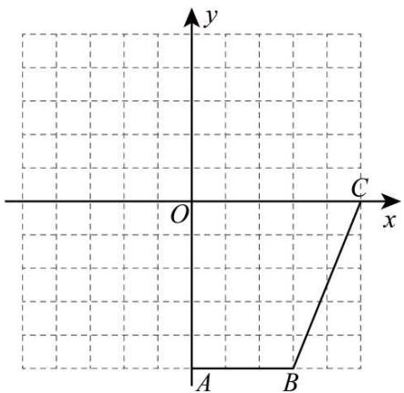

text_image

y
O
C
x
A
B

(1)点A的坐标是，点C的坐标是

(2)有一个智能小车D，现从平面直角坐标系的原点O出发，沿着y轴向下匀速移动，移动速度为 $\frac{1}{2}$ 个单位长度/秒，将智能小车D和点C的连线记为线段CD．当线段CD将四边形OABC分成面积相等的两部分时，智能小车停止移动，求智能小车D移动的时间.

(3)在（2）的条件下，智能小车D停止移动时，将智能小车E移动到x轴上的某点，连接DE．请问将智能小车E停在x轴上的哪个坐标时，能使得三角形CDE的面积与四边形OABC的面积相等？

【答案】(1)(0,-5),(5,0)

(2)8秒

(3)(-5,0)或(15,0)

【分析】本题考查了点的坐标，运用网格求面积，正确掌握相关性质内容是解题的关键.

（1）理解 $AB \parallel OC$ ，点B的坐标为 $B(3,-5)$ ，OC=5，得出 $A(0,-5)$ ， $C(5,0)$ ，即可作答.

(2)先算出四边形OABC的面积, 再结合线段CD将四边形OABC分成面积相等的两部分, 得出 $OD \times OC \times \frac{1}{2} = S_{\triangle DCO} = 10$ , 算出OD = 4, 结合速度, 列式计算, 即可作答.

（3）在（2）的条件下，智能小车D停止移动时，OD = 4，先表示三角形CDE的面积，再结合三角形CDE的面积与四边形OABC的面积相等，得出2CE = 20，分别算出点E的坐标，即可作答.

【详解】（1）解：∵点A，C分别在y轴、x轴上， $AB \parallel OC$ ，点B的坐标为 $B(3,-5)$ ，OC=5.

$$
\therefore A (0, - 5), C (5, 0),
$$

故答案为： $(0,-5),(5,0)$ .

（2）解：由（1）得 $A(0, - 5),C(5,0)$ ，且 $B(3, - 5)$

$$
\therefore A B = 3, O C = 5, O A = 5
$$

则四边形OABC的面积= $(AB+OC)\times OA\times\frac{1}{2}$

$$
\begin{array}{l} = (3 + 5) \times 5 \times \frac {1}{2} \\ = 2 0, \\ \end{array}
$$

∴有一个智能小车D，现从平面直角坐标系的原点O出发，沿着y轴向下匀速移动，线段CD将四边形OABC分成面积相等的两部分，

$$
\begin{array}{l} \therefore \angle C O D = 9 0 ^ {\circ}, S _ {\triangle D C O} = \frac {1}{2} \times 2 0 = 1 0, \\ \therefore O D \times O C \times \frac {1}{2} = S _ {\triangle D C O} = 1 0, \\ \therefore O D \times 5 \times \frac {1}{2} = 1 0, \\ \therefore O D = 4, \\ \end{array}
$$

∵移动速度为 $\frac{1}{2}$ 个单位长度/秒，

∴4÷ $\frac{1}{2}$ =8（秒）；

（3）解：∵在（2）的条件下，智能小车D停止移动时，OD = 4，

∴三角形CDE的面积 = CE × OD × $\frac{1}{2}$ = CE × 4 × $\frac{1}{2}$ = 2CE,

∵三角形CDE的面积与四边形OABC的面积相等，且由（2）得四边形OABC的面积为20，

$$
\therefore 2 C E = 2 0,
$$

即CE=10,

$$
\because C (5, 0),
$$

∴当点 E 在点 C 的左边时，如图所示:

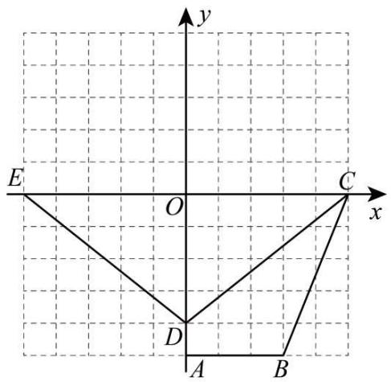

text_image

y
E
O
C
x
D
A
B

$$
\therefore 5 - 1 0 = - 5,
$$

此时 $E(-5,0)$ ;

当点 E 在点 C 的右边时， $5 + 10 = 15$ ，

此时 $E(15,0)$ ,

综上：满足题意的点E的坐标为 $(-5,0)$ 或 $(15,0)$ .

【变式 6-3】（24-25 七年级下·上海·期末）在平面直角坐标系中，已知点 $A(2,4), B(6,4)$ ，连接AB，将AB向下平移5个单位得线段CD，其中点A的对应点为点C，连接AC，BD．当PD将四边形ACDB的面积分成2:3两部分时，那么点P的坐标为\_\_\_\_.

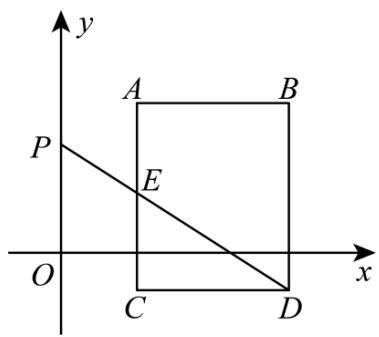

text_image

y
A B
P
E
O C D x

【答案】(0,5)或 $\left(0,\frac{67}{8}\right)$

【分析】本题考查了坐标与图形, 平移的性质, 三角形的面积公式, 用分类讨论的思想是解本题的关键. 分DP 交线段AC和交AB两种情况, 利用面积之差求出 $\triangle PCE$ 和 $\triangle PBE$ , 最后用三角形面积公式即可得出结论.

【详解】解：∵点A(2,4),B(6,4),

$$
\therefore A B = 4,
$$

将AB向下平移5个单位得线段CD，得矩形ABDC，

$$
\therefore C (2, - 1), D (6, - 1),
$$

$$
\therefore A B = C D = 4, \quad A C = B D = 5,
$$

$$
\therefore S _ {\text {矩形} A B D C} = 4 \times 5 = 2 0,
$$

如图 1，当 PD 交线段 AC 于 E，且 PD 将四边形 ACDB 分成面积为 2:3 两部分时，连接 PC，延长 DC 交 y 轴于点 M，

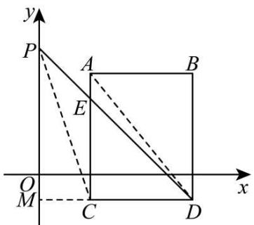

text_image

y
P
A
B
E
O
M
C
D
x

图1

则 $M(0, -1)$ ,

$$
\therefore O M = 1,
$$

连接AD，则 $S_{\triangle ACD}=\frac{1}{2}S_{矩形ABDC}=10,$

∵PD将四边形ACDB的面积分成2:3两部分，

$$
\therefore S _ {\triangle C D E} = \frac {2}{5} S _ {\text {矩形} A B D C} = \frac {2}{5} \times 2 0 = 8,
$$

$$
\therefore \frac {1}{2} \times 4 \times E C = 8,
$$

$$
\therefore E C = 4,
$$

$$
\therefore E (2, 3),
$$

$$
\because C M = \frac {1}{2} C D,
$$

$$
\therefore S _ {\triangle P E C} = \frac {1}{2} S _ {\triangle E C D} = \frac {1}{2} \times 8 = 4,
$$

$$
\therefore S _ {\triangle P C D} = S _ {\triangle P E C} + S _ {\triangle E C D} = 4 + 8 = 1 2,
$$

$$
\because S _ {\triangle P C D} = \frac {1}{2} C D \cdot P M = \frac {1}{2} \times 4 P M = 1 2
$$

$$
\therefore P M = 6,
$$

$$
\therefore P O = P M - O M = 6 - 1 = 5,
$$

$$
\therefore P (0, 5).
$$

如图 2，当PD交AB于点E，PD将四边形ACDB分成面积为2:3两部分时，

连接PB，延长BA交y轴于点G，

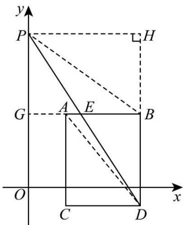

text_image

y
P
H
G
A
E
B
O
C
D
x

图2

则 $G(0,4)$ ,

$$
\therefore O G = 4,
$$

连接AD，则 $S_{\triangle ACD}=\frac{1}{2}S_{矩形ABDC}=10,$

∵PD将四边形ACDB的面积分成2:3两部分，

$$
\therefore S _ {\triangle B D E} = \frac {2}{5} S _ {\text {矩形} A B D C} = \frac {2}{5} \times 2 0 = 8,
$$

$$
\because S _ {\triangle B D E} = \frac {1}{2} \times 5 B E = 8,
$$

$$
\therefore B E = \frac {1 6}{5},
$$

过 P 点作 $PH \perp BD$ 交 DB 的延长线于点 H,

$$
\because B (6, 4),
$$

$$
\therefore P H = 6,
$$

$$
\therefore S _ {\triangle P D B} = \frac {1}{2} B D P H = \frac {1}{2} \times 5 \times 6 = 1 5,
$$

$$
\therefore S _ {\triangle P B E} = S _ {\triangle P D B} + S _ {\triangle B D E} = 1 5 - 8 = 7,
$$

$$
\because S _ {\triangle P B E} = \frac {1}{2} B E \cdot P G = \frac {1}{2} \times \frac {1 6}{5} \times P G = 7,
$$

$$
\therefore P G = \frac {3 5}{8},
$$

$$
\therefore P O = P G + O G = \frac {3 5}{8} + 4 = \frac {6 7}{8},
$$

$$
\therefore P \left(0, \frac {6 7}{8}\right),
$$

综上所述，点 P 坐标为 $(0,5)$ 或 $P\left(0,\frac{67}{8}\right)$ ,故答案为： $(0,5)$ 或 $\left(0,\frac{67}{8}\right)$ .

# 【题型7 求不规则图形的面积】

【例 7】（24-25 七年级下·河南驻马店·期末）如图，在平面直角坐标系中，点 $E(8,0)$ ，点 $F(0,8)$ ，将三角形OEF向下平移2个单位长度得到三角形ABC，BC与x轴交于点G，CO=GO，则阴影部分面积是\_\_\_\_。

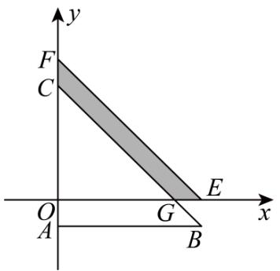

text_image

y
F
C
O
A
G
B
x
E

【答案】14

【分析】本题考查了坐标与图形变化-平移，熟练掌握平移的性质是关键．用 $\triangle EOF$ 的面积减去 $\triangle COG$ 的面积即可.

【详解】解：∵点 $E(8,0)$ ，点 $F(0,8)$ ,

$$
\therefore O E = O F = 8,
$$

$$
\because F C = 2, \quad C O = G O,
$$

$$
\therefore C O = G O = 6,
$$

∴阴影部分面积是：

$$
S _ {\Delta E O F} - S _ {\Delta C O G} = \frac {1}{2} \times 8 \times 8 - \frac {1}{2} \times 6 \times 6 = 1 4.
$$

故答案为：14.

【变式 7-1】（24-25 七年级下·河南安阳·期末）如图，这是某县的部分平面简图.

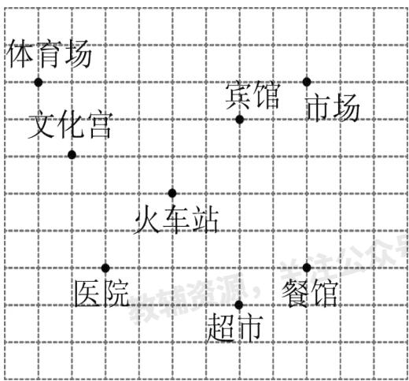

text_image

体育场
文化宫
宾馆
市场
火车站
医院
餐馆
超市

(1)请在图上建立适当的平面直角坐标系，并分别写出宾馆、文化宫、医院的坐标；  
(2)在（1）的条件下，如果把人的行走看作平移，某人从医院出发，先向右平移4个单位长度，再向下平移1个单位长度到达超市，请在图上标出超市的位置，并写出它的坐标；  
(3)顺次连接表示宾馆、文化宫、医院、超市的点成为一个封闭图形，并求这个图形的面积.

【答案】(1)详见解析，宾馆(2,2)；文化宫(-3,1)；医院(-2,-2)

(2)详见解析， $(2,-3)$   
(3)详见解析，18

【分析】（1）以火车站为坐标原点建立平面直角坐标系，再分别写坐标即可；

(2) 根据直角坐标系即可得出答案;  
（3）利用补的方法把所求不规则四边形补成一个边长为 5 的正方形，再求面积即可.

【详解】（1）如图，以火车站为坐标原点建立平面直角坐标系.

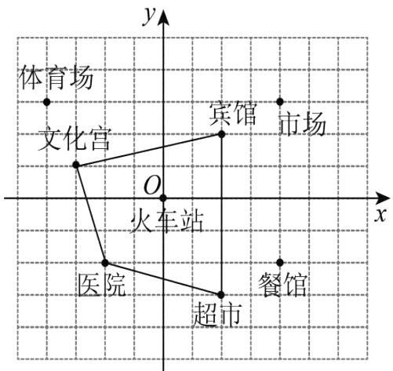

text_image

体育场
文化宫
O
火车站
医院
超市
宾馆
市场
餐馆
x
y

宾馆(2,2)；文化宫(-3,1)；医院(-2,-2).

(2) 超市的位置如图所示, 它的坐标为 $(2, -3)$ .  
（3）如图所示，利用补的方法把所求不规则四边形补成一个边长为 5 的正方形，

则 $S_{四边形}=5\times5-5\times1\div2-4\times1\div2-(4+1)\times1\div2=18.$

【点睛】本题考查直角坐标系，坐标与图形，正确建立直角坐标系是解题的关键.

【变式 7-2】（24-25 七年级下·北京海淀·期中）在平面直角坐标系中，我们把横纵坐标均为整数的点称为格点，若一个多边形的顶点全是格点，则称该多边形为格点多边形．例如：图中 $\triangle ABC$ 的与四边形 DEFG 均为格点多边形．图中每个小正方形边长均为 1.

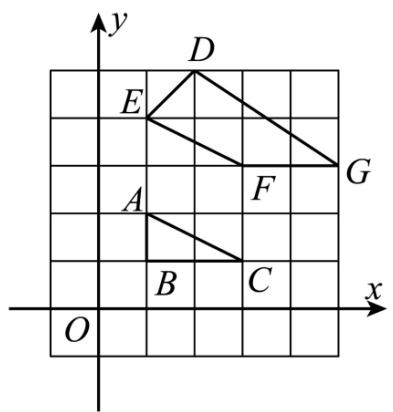

text_image

y
D
E
A
F
G
B
C
O
x

(1) $\triangle ABC$ 的面积为 \_\_\_\_，四边形 $DEFG$ 的面积为 \_\_\_\_.  
(2)格点多边形的面积记为 S，其内部的格点数记为 N，边界上的格点记为 L，已知格点多边形的面积可表示为 $S = N + aL + b$ （a, b 为常数）。由（1）中所求图形的面积求 a, b 的值。  
(3)若某格点多边形对应的N=14，L=7，则S= \_\_\_\_.

【答案】(1)1,3.5

(2) $\left\{\begin{aligned}a&=\frac{1}{2}\\ b&=-1\end{aligned}\right.$   
(3)16.5

【分析】（1）利用面积公式直接计算三角形的面积即可；再利用长方形的面积减去周围三个三角形的面积即可；

(2) 由格点三角形 ABC 可得: $N = 0, L = 4, S = 1$ , 由格点四边形 DEFG 可得: $N = 2, L = 5, S = 3.5$ , 再由 $S = N + aL + b$ 建立方程组即可;  
（3）把N=14，L=7代入 $S=N+\frac{1}{2}L-1$ 进行计算即可.

【详解】（1）解： $S_{\triangle ABC}=\frac{1}{2}\times2\times1=1,$

$$
S _ {\text {四边形} D E F G} = 2 \times 4 - \frac {1}{2} \times 1 \times 1 - \frac {1}{2} \times 1 \times 2 - \frac {1}{2} \times 2 \times 3
$$

$$
= 8 - \frac {1}{2} - 1 - 3 = 3. 5.
$$

故答案为：1,3.5

(2) 解: 由格点三角形 ABC 可得: $N = 0, L = 4, S = 1$ ,

由格点四边形 DEFG 可得: $N = 2, L = 5, S = 3.5$ ,

$$
\therefore \left\{ \begin{array}{l} 0 + 4 a + b = 1 \\ 2 + 5 a + b = 3. 5 \end{array} \right.
$$

解得： $\left\{\begin{aligned}a&=\frac{1}{2}\\ b&=-1\end{aligned}\right.$

（3）解：某格点多边形对应的N=14，L=7，

则 $S=N+\frac{1}{2}L-1=14+\frac{1}{2}\times7-1=16.5.$

故答案为：16.5

【点睛】本题考查格点图形的面积变化与多边形内部格点数和边界格点数的关系，从简单情况分析，找出规律解决问题，同时考查二元一次方程组的解法，理解题意，列出方程组是解本题的关键.

【变式 7-3】（24-25 七年级下·湖北孝感·期中）如图 1，已知 $A(0,a)$ ， $B(b,0)$ ，满足 $|a-4|+|a-b+4|=0$ ，C，D 分别为 x 轴，y 轴正半轴上的点，且 C 在 B 右边，D 在 A 上方， $DC \parallel AB$ .

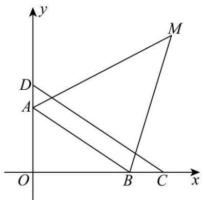

text_image

y
D
A
O
B
C
x
M

图1

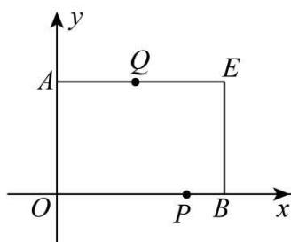

text_image

y
A —— Q —— E
O —— P —— B
x

图2

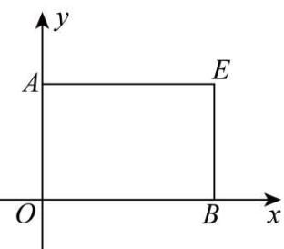

text_image

y
A	E
O	B	x

备用图

(1)求A，B两点的坐标.

(2)如图1，作 $\angle DAB$ 和 $\angle CBA$ 的角平分线交于点 $M$ ，试求 $\frac{\angle ODC + \angle OBA}{\angle AMB}$ 的值.

(3)如图2, 以 $OA$ 、 $OB$ 为邻边作长方形 $OAEB$ , 有一动点 $P$ 从 $B$ 点出发沿 $BO \rightarrow OA$ 方向以每秒1个单位长度的速度运动, 同时有一动点 $Q$ 从 $A$ 点出发沿 $AE \rightarrow EB$ 方向以每秒 $\frac{3}{2}$ 个单位长度的速度运动, 当两个点有一个到达终点时两点同时停止运动, 设运动时间为 $t$ , 求 $t$ 为何值时, 以 $P$ 、 $A$ 、 $Q$ 、 $B$ 为顶点的图形的面积恰为长方形 $OAEB$ 面积的 $\frac{2}{3}$ ?

【答案】(1) $A(0,4)$ ， $B(6,0)$

(2)2

(3)当 $t = \frac{16}{5}$ 或 $t = \frac{28}{5}$ 时以 $P$ 、 $A$ 、 $Q$ 、 $B$ 为顶点的图形的面积恰为长方形OAEB面积的 $\frac{2}{3}$

【分析】本题考查了坐标与图形、一元一次方程的应用、平行线的性质、角平分线的定义、三角形内角和定理等知识，

（1）根据非负数的性质得到关于 a、b 的方程组，解方程组得到 a、b 的值，即可得到 A，B 两点的坐标；  
(2) 根据三角形外角平分线和三角形内角和定理进行求解即可;  
（3）按照 t 的取值范围，分情况列出方程求解即可.

【详解】（1）解：根据题意得： $\left\{\begin{aligned}a-4&=0\\ a-b&+2&=0\end{aligned}\right.$

解之得： $\left\{\begin{aligned}a&=4\\ b&=6\end{aligned}\right.$

∴ A(0,4), B(6,0);

(2) 解: 如图,

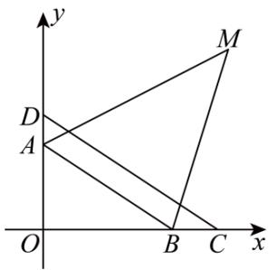

text_image

y
D
A
O
B
C
x
M

∵ AM 平分 $\angle DAB$ ，BM 平分 $\angle CBA$ ，

$$
\therefore \angle D A M = \angle M A B = \frac {1}{2} \angle D A B, \angle A B M = \angle M B C = \frac {1}{2} \angle C B A,
$$

$$
\because \angle D A O + \angle O B C = 3 6 0 ^ {\circ},
$$

$$
\therefore \angle D A B + \angle O A B + \angle C B A + \angle O B A = 3 6 0 ^ {\circ},
$$

$$
\because \angle O A B + \angle O B A = 9 0 ^ {\circ},
$$

$$
\therefore \angle D A B + \angle C B A = 2 7 0 ^ {\circ},
$$

$$
\therefore \angle D A B + \angle C B A = 2 7 0 ^ {\circ},
$$

$$
\therefore \frac {1}{2} \angle D A B + \frac {1}{2} \angle C B A = 1 3 5 ^ {\circ},
$$

即 $\angle MAB + \angle ABM = 135^{\circ}$

在 $\triangle ABM$ 中， $\angle AMB = 180^{\circ} - \angle MAB - \angle ABM = 180^{\circ} - 135^{\circ} = 45^{\circ}$

$$
\because D C \parallel A B,
$$

$$
\therefore \angle O D C = \angle O A B,
$$

$$
\therefore \angle O D C + \angle O B A = 9 0 ^ {\circ},
$$

$$
\therefore \frac {\angle O D C + \angle O B A}{\angle A M B} = 2;
$$

（3）解：根据题意得 $S_{四边形A Q B P}=\frac{2}{3}S_{长方形O A E B}=16,$

当 $0 < t \leq 4$ 时，点P在线段OB上，点Q在线段AE上，

如图 2,

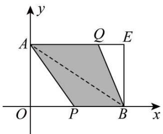

text_image

y
A Q E
O P B x

图2

$$
\begin{array}{l} S _ {\text {四边形} A Q B P} = S _ {\triangle A P B} + S _ {\triangle A Q B} = \frac {1}{2} (P B + A Q) \times O A \\ = \frac {1}{2} \left(t + \frac {3}{2} t\right) \times 4 = 1 6 \\ \end{array}
$$

解得 $t=\frac{16}{5}$ ,

当 $4 < t \leq 6$ 时，点P在线段OB上，点Q在线段EB上，

如图 3

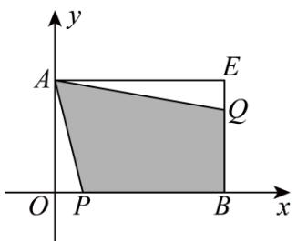

text_image

y
A
E
Q
O
P
B
x

图3

$$
S _ {\text {四边形} A Q B P} = S _ {\text {长方形} O A E B} - S _ {\triangle O A P} - S _ {\triangle A E Q}
$$

$$
\begin{array}{l} = 2 4 - \frac {1}{2} \times \left(\frac {3}{2} t - 6\right) \times 6 - \frac {1}{2} \times (6 - t) \times 4, \\ = 3 0 - \frac {5}{2} t = 1 6, \\ \end{array}
$$

解得 $t=\frac{28}{5}$ ,

当 $6 < t \leq \frac{20}{3}$ 时，点P在线段OA上，点Q在线段EB上，

如图 4

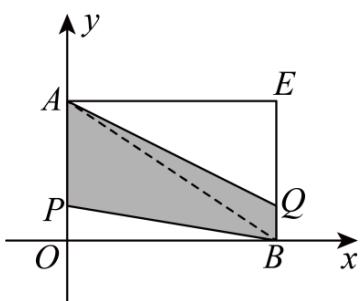

text_image

y
A
E
P
O
B
x
Q

图4

$$
S _ {\text {四边形} A Q B P} = S _ {\triangle A P B} + S _ {\triangle A Q B} = \frac {1}{2} (P A + B Q) \times O B
$$

$$
= \frac {1}{2} \times \left(1 0 - t + 1 0 - \frac {3}{2} t\right) \times 6
$$

$$
= 6 0 - \frac {1 5}{2} t = 1 6,
$$

解得 $t=\frac{88}{15}<6$ ，不符合要求：

综上，当 $t=\frac{16}{5}$ 或 $t=\frac{28}{5}$ 时以P、A、Q、B为顶点的图形的面积恰为长方形OAEB面积的 $\frac{2}{3}$ .