# 专题 02 利用勾股定理求立体图形中的最短路径(举一反三专项训练)

# 【北师大版 2024】

# 题型归纳

【题型 1 利用勾股定理求正方体中的最短路径】....1

【题型 2 利用勾股定理求长方体中的最短路径】....3

【题型 3 利用勾股定理求圆柱中的最短路径】....5

【题型 4 利用勾股定理求圆锥中的最短路径】....7

# 举一反三

# 【题型1 利用勾股定理求正方体中的最短路径】

1. （24-25 八年级下·广东惠州·期中）如图，一只蚂蚁从边长是3正方体纸箱的A点沿纸箱表面爬到B点，那么它需要爬行的最短路线的长是（）

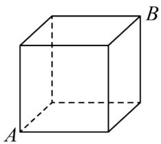

natural_image

Simple line drawing of a cube with labeled vertices A, B, and D (no text or symbols beyond labels)

A. 9

B. $3 + \sqrt{3}$

C. $3\sqrt{5}$

D. $3 \sqrt{3}$

2. （24-25 八年级上·福建漳州·期中）如图是一个棱长为6的正方体木箱，点Q在上底面的棱上，AQ = 2，一只蚂蚁从P点出发沿木箱表面爬行到点Q，则蚂蚁爬行的最短路程是（）

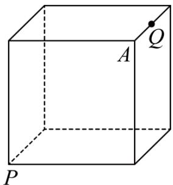

text_image

A
Q
P

A. 6

B. 8

C. 10

D. 12

3. （24-25 八年级上·山西晋中·期中）如图，一只蚂蚁沿着边长为 2 的正方体表面从点 A 出发，经过 3 个面爬行到点 B，则它运动的最短路径的长为（）

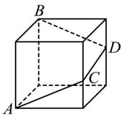

text_image

B
D
C
A

A. $3 \sqrt{5}$

B. $\sqrt{17}$

C. $2\sqrt{10}$

D. $2 \sqrt{13}$

4. （24-25 八年级上·山东青岛·期中）棱长分别为 $8 \mathrm{~cm}$ , $6 \mathrm{~cm}$ 的两个正方体如图放置, 点 $A, B, C$ 在同一直线上, 顶点 $E$ 在棱 $BF$ 上, 点 $P$ 是棱 $DK$ 的靠近点 $D$ 的三等分点。一只蚂蚁要沿着正方体的表面从点 $A$ 爬到点 $P$ , 它爬行的最短距离是 ( )

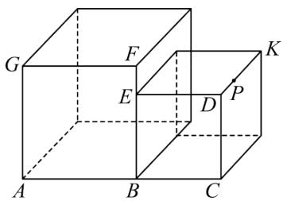

text_image

G
F
K
E
D
P
A
B
C

A. $20 \mathrm{~cm}$

B. $8\sqrt{2}$ cm

C. $2\sqrt{73}$ cm

D. $2\sqrt{65}$ cm

5. （2023·江苏南京·一模）如图，用 7 个棱长为 1 的正方体搭成一个几何体，沿着该几何体的表面从点 M 到点 N 的所有路径中，最短路径的长是（）

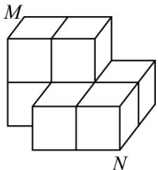

natural_image

Geometric diagram of stacked cubes labeled M and N (no text or symbols beyond labels)

A. 5

B. $\sqrt{5} + 2\sqrt{2}$

C. $2\sqrt{5} + 1$

D. $2 + \sqrt{2} + \sqrt{5}$

6. （2025 八年级下·全国·专题练习）如图，一个无盖的正方体盒子的棱长为 2，BC 的中点为 M，一只蚂蚁从盒外的点 D 沿正方体的盒壁爬到盒内的点 M（盒壁的厚度不计），蚂蚁爬行的最短距离是 \_\_\_\_.

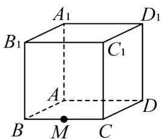

text_image

A₁
B₁
C₁
D₁
A
B
M
C
D

教辅资源, 关注公众号·全科AA+

7. （2025·江苏南京·一模）如图，A，B分别是棱长为1的正方体两个相邻的面的中心．将这个正方体的表面展开成平面图形后，点A，B之间的最大距离是\_\_\_\_．

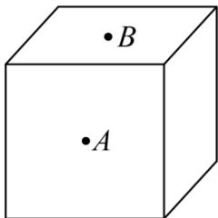

text_image

•B
•A

8. （2025·江苏宿迁·模拟预测）如图，用 3 个棱长为 1 的正方体搭成一个几何体，沿着该几何体的表面从点 A 到点 B 的所有路径中，最短路径的长是 \_\_\_\_.

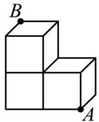

9. （23-24 八年级上·江西抚州·阶段练习）如图，在棱长为 $3 \mathrm{~cm}$ 的正方体上有一些线段，把所有的面都分成 9 个小正方形，每个小正方形的边长都为 $1 \mathrm{~cm}$ 。若一只蚂蚁每秒爬行 $2 \mathrm{~cm}$ ，则它从下底面 $A$ 点沿表面爬行至右侧 $B$ 点最少要花多长时间？

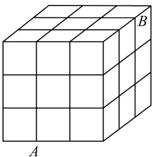

natural_image

3D wireframe cube diagram with labeled faces A and B (no text or symbols on the cube itself)

# 【题型 2 利用勾股定理求长方体中的最短路径】 教辅资源,关注公众号·全科AA+

1. （2025 八年级下·河南·专题练习）如图，长方体的底面是边长为 6 的正方形，侧面都是长为 13 的长方形，点 D 是 BC 的中点，在长方体下底面的 A 点处有一只蚂蚁，它想吃到上底面点 D 处的蜂蜜，则沿着表面需要爬行的最短路程 n 的值为（）

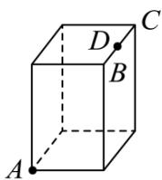

A. $2 \sqrt{73}$

B. $5 \sqrt{10}$

C. $\sqrt{370}$

D. $\sqrt{205}$

2. 如图是放在地面上的一个长方体盒子, 其中 $AB = 8 \mathrm{~cm}$ , $BC = 4 \mathrm{~cm}$ , $BF = 6 \mathrm{~cm}$ , 点 $M$ 在棱 $AB$ 上, 且 $AM = 2 \mathrm{~cm}$ , 点 $N$ 是 $FG$ 的中点, 一只蚂蚁要沿着长方形盒子的外表面从点 $M$ 爬行到点 $N$ , 它需要爬行的最短路程为( )

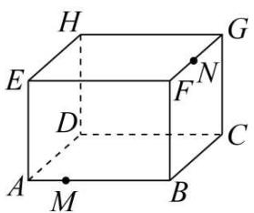

text_image

H
E
G
F
N
D
C
A
M
B

A. $10 \mathrm{~cm}$

B. $4 \sqrt{5} \mathrm{~cm}$

C. $6\sqrt{2}$ cm

D. $2 \sqrt{13} \mathrm{~cm}$

3. （24-25 八年级上·吉林长春·期中）将长方形纸片ABCD按如图所示折叠，已知

$AD = 6, AG = HB = 2.5, EG = EH = 1$ ，则蚂蚁在纸片上从点 $A$ 处爬到点 $C$ 处需要走的最短路程是（）

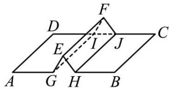

text_image

Geometric diagram showing two planes ABCD and AEG with points E, F, G, H, I, J and dashed lines forming a parallelogram.

A. $\sqrt{61}$

B. $\sqrt{85}$

C. 10

D. $\sqrt{113}$

4. （22-23 八年级下·内蒙古鄂尔多斯·阶段练习）如图，直四棱柱侧棱长为 $4 \, cm$ ，底面是长为 $5 \, cm$ 宽为 $3 \, cm$ 的长方形。一只蚂蚁从顶点 A 出发沿棱柱的表面爬到顶点 B。则蚂蚁经过的最短路程 \_\_\_\_ cm

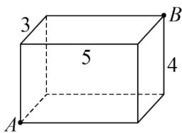

text_image

3
5
4
A
B

5. 长方体敞口玻璃罐, 长、宽、高分别为 $16 \mathrm{~cm} 、 6 \mathrm{~cm}$ 和 $6 \mathrm{~cm}$ , 在罐内点 $E$ 处有一小块饼干碎末, 此时一只蚂蚁正好在罐外壁, 在长方形ABCD中心的正上方 $2 \mathrm{~cm}$ 处, 则蚂蚁到达饼干的最短距离是\_\_\_\_ $\mathrm{cm}$ .

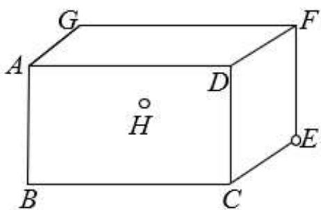

text_image

G
A
D
H
B
C
F
E

6. （24-25 八年级上·辽宁阜新·阶段练习）如图，在一个长 4 米，宽 2 米的长方形草地上，放着一根长方体的木块，它的棱和草地宽 $AD$ 平行且棱长大于 $AD$ ，木块从正面看是边长为 40 厘米的正方形，一只蚂蚁从点 $A$ 处到达点 $C$ 处需要走的最短路程是 \_\_\_\_ 米.

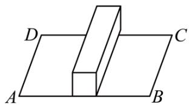

natural_image

Geometric diagram showing two planes ABCD and a right-angled rectangle ABCD (no text or symbols)

7. （22-23 八年级上·陕西西安·阶段练习）如图，一个底面为正方形的无盖长方形盒子的长、宽、高分别为 $20 \mathrm{~cm}$ ， $20 \mathrm{~cm}$ ， $30 \mathrm{~cm}$ ，即 $EF = FG = 20 \mathrm{~cm}$ ， $CG = 30 \mathrm{~cm}$ ，现在顶点 $C$ 处有一滴蜜糖，一只蚂蚁如果要沿着长方体的表面从顶点 $E$ 爬到 $C$ 处去吃蜜糖，求需要爬行的最短距离。（注：底面可以爬行）

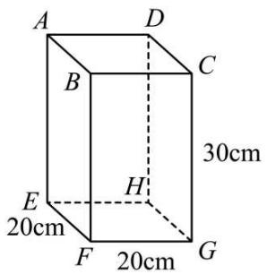

text_image

A
D
B
C
30cm
E
H
20cm
F
20cm
G

【题型 3 利用勾股定理求圆柱中的最短路径】教辅资源,关注公众号·全科AA+

1. （24-25 八年级下·内蒙古通辽·期中）如图，圆柱体的底面周长为6cm，AB是底面圆的直径，在圆柱表面的高BC上有一点D，BD = 2CD，BC = 6cm，一只蚂蚁从A点出发，沿圆柱的表面爬行到点D的最短路程是（）

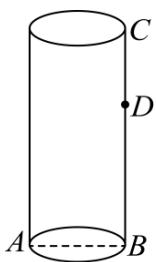

text_image

C
D
A
B

A. 6cm

B. 5cm

C. 3cm

D. $2\sqrt{13}$ cm

2. （24-25 八年级上·广东深圳·期中）如图，这是一个供滑板爱好者使用的 $U$ 型池的示意图，该 $U$ 型池可以看成是长方体去掉一个“半圆柱”而成，中间可供滑行部分的截面是直径为 $\frac{40}{\pi}\mathrm{m}$ 的半圆，其边缘

$AB = CD = 20\mathrm{m}$ , 点 $E$ 在 $CD$ 上, $CE = 5\mathrm{m}$ , 一滑板爱好者从 $A$ 点滑到 $E$ 点, 则他滑行的最短距离约为 ( ) m. (边缘部分的厚度忽略不计)

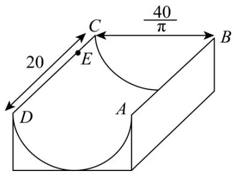

text_image

20
40/π
C
E
B
A
D

A. 25

B. $5 \sqrt{73}$

C. 35

D. $20\sqrt{2}$

3. （23-24 八年级上·贵州黔东南·开学考试）如图所示，圆柱底面半径为 $\frac{4}{\pi}\mathrm{cm}$ ，高为 $18\mathrm{cm}$ ，点 $A$ ， $B$ 分别是圆柱两底面圆周上的点，且 $A$ ， $B$ 在同一母线上，用一根棉线从 $A$ 点顺着圆柱侧面绕3圈到 $B$ 点，则这根棉线

的长度最短为（）

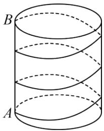

natural_image

Diagram of a cylinder with labeled points A and B, showing concentric curved lines (no text or symbols beyond labels)

A. $24 \mathrm{~cm}$

B. $30 \mathrm{~cm}$

C. 18cm

D. 27cm

4. （23-24 八年级下·河南商丘·期末）如图，若圆柱的底面周长是9cm，高是12cm，从圆柱底部 A 处沿侧面缠绕一圈丝线到顶部 B 处，则这条丝线的最小长度是\_\_\_\_cm.

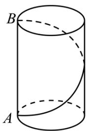

text_image

B
A

5. （2025 九年级下·全国·专题练习）2024 年 12 月 4 日，我国的“春节”申遗成功，为了增添节日气氛，小刚家计划购买一条彩带，按如图所示的方式从圆柱的点A处缠绕到圆柱的点B处（点A在下底面，点B在上底面，点B在点A的正上方），若圆柱的底面周长为5dm，高为7dm，则需要购买彩带的长度最短为\_\_\_\_dm.

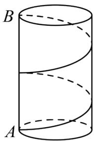

text_image

B
A

6. 如图, 圆柱的底面周长为 24 厘米, 高 $A B$ 为 5 厘米, $B C$ 是底面直径, 一只蚂蚁从点 $A$ 出发沿着圆柱体的侧面爬行到点 $C$ 的最短路程是 \_\_\_\_.

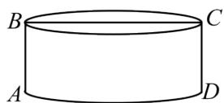

7. （24-25 八年级上·河南郑州·期末）如图所示，地面上铺了一块长方形地毯ABCD，因使用时间长而变形，中间形成一个半圆柱的凸起，半圆柱的底面直径为 $\frac{8}{\pi}\mathrm{m}$ ，已知 $AE + BF = 20\mathrm{m}$ ， $BC = 10\mathrm{m}$ ，一只蚂蚁从A点爬到C点，且必须翻过半圆柱凸起，则它至少要走\_\_\_\_m的路程。

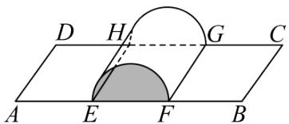

text_image

D H G C
A E F B

8. （24-25 八年级下·山东潍坊·阶段练习）勾股定理是人类早期发现并证明的重要数学定理之一，是用代数思想解决几何问题重要的工具之一，也是数形结合的纽带之一，它不但因证明方法层出不穷吸引着人们，更因为应用广泛而使人入迷.

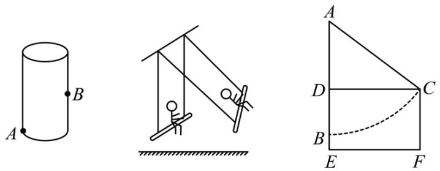

text_image

Diagram showing three geometric configurations: a cylinder with labeled points A and B, a suspended structure with a person, and a triangular shape with dashed curve and labeled points A, D, C, E, F.

(1)应用一：最短路径问题

如图, 一只蚂蚁从点 $A$ 沿圆柱侧面爬到相对一侧中点 $B$ 处, 如果圆柱的高为 $16 \mathrm{~cm}$ , 圆柱的底面半径为 $\frac{6}{\pi} \mathrm{~cm}$ , 那么最短的路线长是\_\_\_\_;

(2)应用二：解决实际问题.

如图，某公园有一秋千，秋千静止时，踏板离地的垂直高度BE = 0.5m，将它往前推2m至C处时，即水平距离CD = 2m，踏板离地的垂直高度CF = 1.5m，它的绳索始终拉直，求绳索AC的长.

# 【题型 4 利用勾股定理求圆锥中的最短路径】 教辅资源,关注公众号·全科AA+

1. （2023·内蒙古赤峰·中考真题）某班学生表演课本剧，要制作一顶圆锥形的小丑帽．如图，这个圆锥的底面圆周长为 $20 \pi \mathrm{~cm}$ ，母线 $AB$ 长为 $30 \mathrm{~cm}$ ，为了使帽子更美观，要粘贴彩带进行装饰，其中需要粘贴一条从点 $A$ 处开始，绕侧面一周又回到点 $A$ 的彩带（彩带宽度忽略不计），这条彩带的最短长度是（）

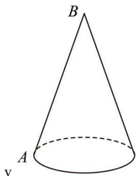

text_image

B
A
v

A. $30 \mathrm{~cm}$

B. $30\sqrt{3}$ cm

C. 60 cm

D. $20 \pi \mathrm{~cm}$

2. （24-25 九年级下·全国·期末）如图，圆锥的轴截面是边长为8cm的正三角形ABC，P是母线AC的中点，则在圆锥的侧面上从B点到P点的最短路线的长为\_\_\_\_。

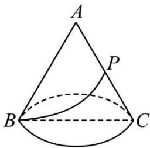

text_image

A
P
B
C

3. （24-25 九年级下·全国·期末）如图是一个用来盛爆米花的圆锥形纸杯，纸杯开口圆的直径EF长为8cm，母线OE(OF)长为8cm。在母线OF上的点A处有一块爆米花残渣，且FA = 2cm，一只蚂蚁从杯口的点E处沿圆锥表面爬行到A点，则此蚂蚁爬行的最短距离为\_cm。

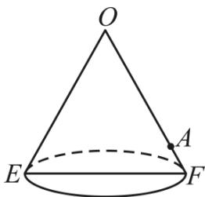

text_image

O
A
E
F

4. （22-23 九年级上·河北保定·期末）如图，小明用半径为 20，圆心角为 $\theta$ 的扇形，围成了一个底面半径 $r$ 为 5 的圆锥.

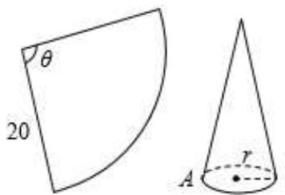

text_image

θ
20
A
r

(1) 扇形的圆心角θ为\_\_\_\_;

(2) 一只蜘蛛从圆锥底面圆周上一点 $A$ 出发, 沿圆锥的侧面爬行一周后回到点 $A$ 的最短路程是 \_\_\_\_.

5. （24-25 九年级上·贵州贵阳·期中）已知圆锥的底面半径为 $r = 20 \mathrm{~cm}$ ，高 $h = 20 \sqrt{15} \mathrm{~cm}$ ，现有一只蚂蚁从底边上一点 $A$ 出发，在侧面上爬行一周后又回到 $A$ 点.

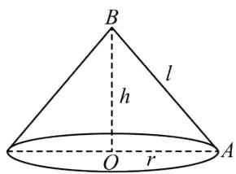

text_image

B
l
h
O r A

(1)求圆锥的全面积;

(2)求蚂蚁爬行的最短距离.

6. 如图所示, 圆锥的母线长为 4 , 底面圆半径为 1 , 若一小虫 $P$ 从 $A$ 点开始绕着圆锥表面爬行一圈到 $SA$ 的中点 $C$ , 求小虫爬行的最短距离是多少?

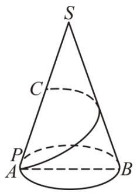

text_image

S
C
P
A
B

