# 专题 02 利用勾股定理求立体图形中的最短路径(举一反三专项训练)

【北师大版 2024】

# 题型归纳

【题型 1 利用勾股定理求正方体中的最短路径】....1

【题型 2 利用勾股定理求长方体中的最短路径】....7

【题型3 利用勾股定理求圆柱中的最短路径】....14

【题型 4 利用勾股定理求圆锥中的最短路径】....21

# 举一反三

# 【题型1 利用勾股定理求正方体中的最短路径】

1. （24-25 八年级下·广东惠州·期中）如图，一只蚂蚁从边长是3正方体纸箱的A点沿纸箱表面爬到B点，那么它需要爬行的最短路线的长是（）

natural_image

Simple line drawing of a cube with labeled vertices A, B, and D (no text or symbols beyond labels)

A. 9

B. $3 + \sqrt{3}$

C. $3\sqrt{5}$

D. $3 \sqrt{3}$

【答案】C

【分析】本题考查了平面展开最短路径问题，先将图形展开，再根据两点之间线段最短，由勾股定理计算即可得出答案，掌握知识点的应用是解题的关键.

【详解】解：如图，由题意得AC=6，BC=3，

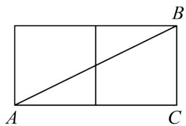

text_image

A
C
B

∵展开后由勾股定理得： $AB=\sqrt{BC^{2}+AC^{2}}=\sqrt{3^{2}+6^{2}}=3\sqrt{5}$

∴它需要爬行的最短路线的长是 $3\sqrt{5}$ ，

故选：C.

2. （24-25 八年级上·福建漳州·期中）如图是一个棱长为6的正方体木箱，点Q在上底面的棱上，AQ = 2，

一只蚂蚁从P点出发沿木箱表面爬行到点Q，则蚂蚁爬行的最短路程是（）

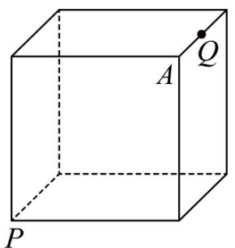

text_image

A
Q
P

A. 6

B. 8

C. 10

D. 12

【答案】C

【分析】此题考查的是勾股定理之最短路径问题，掌握两点之间线段最短和利用勾股定理求边长是解决此题的关键．将正方体上表面如图展开，根据两点之间，线段最短，即可得到：展开图有三种形式，利用勾股定理分别求解即可.

【详解】解：依题意，展开图有三种形式：

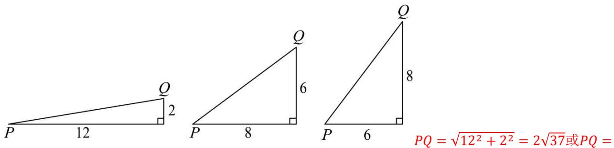

text_image

P 12 Q 2
P 8 Q 6
P 6 Q 8
P = \u221a12² + 2² = 2\u221a37 或 PQ =

$$
\sqrt {6 ^ {2} + 8 ^ {2}} = 1 0
$$

$$
\because 1 0 <   2 \sqrt {3 7}
$$

∴蚂蚁爬行的最短路程10.

故选：C.

3. （24-25 八年级上·山西晋中·期中）如图，一只蚂蚁沿着边长为 2 的正方体表面从点 $A$ 出发，经过 3 个面爬行到点 $B$ ，则它运动的最短路径的长为（）

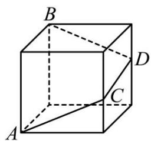

text_image

B
D
C
A

A. $3 \sqrt{5}$

B. $\sqrt{17}$

C. $2\sqrt{10}$

D. $2 \sqrt{13}$

【答案】C

【分析】本题考查了最短路径问题以及勾股定理，先将正方体展开，然后找出最短路线，利用勾股定理直

接计算即可.

【详解】解：如图，将正方体的三个侧面展开，连接AB，则AB最短，

$$
\therefore A B = \sqrt {6 ^ {2} + 2 ^ {2}} = 2 \sqrt {1 0}.
$$

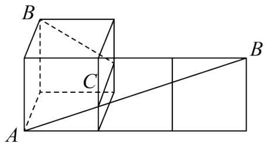

text_image

B
C
A
B

故选：C.

4. （24-25 八年级上·山东青岛·期中）棱长分别为8cm，6cm的两个正方体如图放置，点 A，B，C 在同一直线上，顶点 E 在棱 BF 上，点 P 是棱 DK 的靠近点 D 的三等分点。一只蚂蚁要沿着正方体的表面从点 A 爬到点 P，它爬行的最短距离是（）

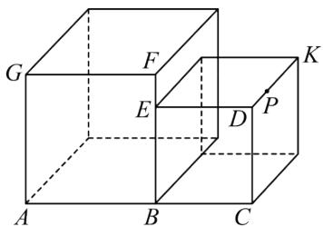

text_image

G
F
K
E
D
P
A
B
C

A. $20 \mathrm{~cm}$

B. $8\sqrt{2}$ cm

C. $2\sqrt{73}$ cm

D. $2\sqrt{65}$ cm

【答案】D

【分析】本题考查平面展开-最短问题．求出两种展开图PA的值，比较即可判断.

【详解】解：如图， $DP=\frac{1}{3}DK=2$ ，有两种展开方法：

方法一： $PA=\sqrt{14^{2}+8^{2}}=2\sqrt{65}cm,$

方法二： $PA=\sqrt{(8+6+2)^{2}+6^{2}}=2\sqrt{73}cm.$

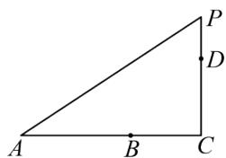

text_image

A
B
C
D
P

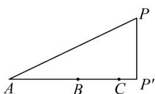

text_image

A
B
C
P
P'

故需要爬行的最短距离是 $2\sqrt{65}$ cm.

故选：D.

5. （2023·江苏南京·一模）如图，用 7 个棱长为 1 的正方体搭成一个几何体，沿着该几何体的表面从点 M 到点 N 的所有路径中，最短路径的长是（）

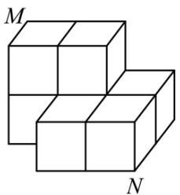

natural_image

Geometric diagram of two stacked cubes labeled M and N (no text or symbols on the cubes themselves)

A. 5

B. $\sqrt{5} + 2\sqrt{2}$

C. $2 \sqrt{5} + 1$

D. $2 + \sqrt{2} +\sqrt{5}$

【答案】A

【分析】先画出侧面展开图，根据两点之间践段最短，利用勾股定理求出线段MN的长即可.

【详解】将第一层小正方体的顶面和正面，以及第二层小正方体的顶面和正面展开，如下图，

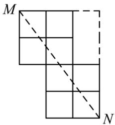

text_image

M
N

连接MN，

则最短路径 $MN=\sqrt{4^{2}+3^{2}}=5$ ,

故选 A

【点睛】本题主要考查了两点之间线段最短，以及勾股定理，正确画出侧面展开图，确定两点之间线段最短是解题的关键.

6. （2025 八年级下·全国·专题练习）如图，一个无盖的正方体盒子的棱长为 2，BC 的中点为 M，一只蚂蚁从盒外的点 D 沿正方体的盒壁爬到盒内的点 M（盒壁的厚度不计），蚂蚁爬行的最短距离是 \_\_\_\_.

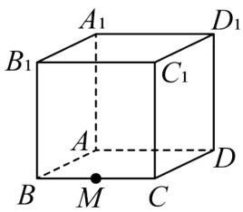

text_image

A₁
B₁
C₁
D₁
A
B
M
C
D

【答案】5

【分析】本题考查的是勾股定理的应用—最短路径问题，解答此类问题应先根据题意把立体图形展开成平面图形后，在平面图形上构造直角三角形解决问题；画出侧面展开图，得出蚂蚁从盒外的 D 点沿正方形的表面爬到盒内的 M 点，蚂蚁爬行的最短距离是如图 DM 的长度，利用勾股定理进行求解即可.

【详解】解：将立方体展开，得到如下图形，此时DM即为所求，

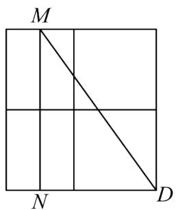

text_image

M
N
D

由题意，可知： $\angle MND = 90^{\circ}, MN = 2 \times 2 = 4, DN = \frac{1}{2} \times 2 + 2 = 3,$

$$
\therefore D M = \sqrt {M N ^ {2} + D N ^ {2}} = 5;
$$

故答案为：5.

7. （2025·江苏南京·一模）如图，A, B 分别是棱长为 1 的正方体两个相邻的面的中心。将这个正方体的表面展开成平面图形后，点 A, B 之间的最大距离是 \_\_\_\_.

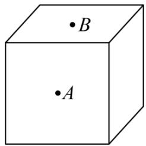

text_image

•B
•A

【答案】 $\sqrt{17}$

【分析】该题考查了勾股定理和正方体展开图，根据题意和正方体的11种表面展开图的特征得出要使点 $A$ ， $B$ 之间的最大距离则时则点 $A$ ， $B$ 最远，结合题意画出展开图求解即可.

【详解】解：根据点 A, B 的位置关系和正方体的表面展开图可得：当点 A, B 的位置在如图所示位置时，点 A, B 之间的最大距离，

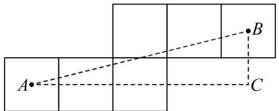

text_image

A
B
C

点 A, B 之间的最大距离 $=\sqrt{4^{2}+1^{2}}=\sqrt{17}$ ,

故答案为： $\sqrt{17}$ .

8. （2025·江苏宿迁·模拟预测）如图，用 3 个棱长为 1 的正方体搭成一个几何体，沿着该几何体的表面从点 A 到点 B 的所有路径中，最短路径的长是 \_\_\_\_。

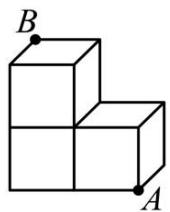

【答案】 $\sqrt{13}$

【分析】本题主要考查了两点之间线段最短，以及勾股定理，正确画出侧面展开图，确定两点之间线段最短是解题的关键.

先画出侧面展开图，根据两点之间践段最短，利用勾股定理求出线段AB的长即可.

【详解】解：向正表面展开，如图，

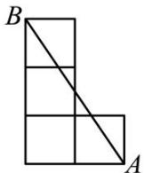

∴最短路径的长是 $AB=\sqrt{3^{2}+2^{2}}=\sqrt{13}$ ,
向左表面展开，如图，

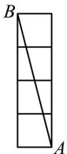

∴最短路径的长是 $AB=\sqrt{4^{2}+1^{2}}=\sqrt{17}$ ,
向上表面展开，如图，

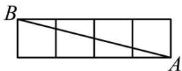

∴最短路径的长是 $AB=\sqrt{4^{2}+1^{2}}=\sqrt{17}$ ,
∵ $\sqrt{13}<\sqrt{17}$ ,

∴最短路径的长是 $\sqrt{13}$ ,

故答案为： $\sqrt{13}$ .

9. （23-24 八年级上·江西抚州·阶段练习）如图，在棱长为 $3 \mathrm{~cm}$ 的正方体上有一些线段，把所有的面都分成 9 个小正方形，每个小正方形的边长都为 $1 \mathrm{~cm}$ . 若一只蚂蚁每秒爬行 $2 \mathrm{~cm}$ ，则它从下底面 $A$ 点沿表面爬行至右侧 $B$ 点最少要花多长时间？

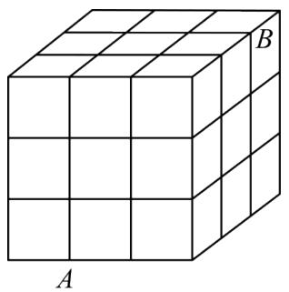

natural_image

3D cube diagram with labeled faces A and B, no text or symbols present

【答案】2.5(s)

【分析】把正方形的点A所在的面展开，然后在平面内，由于展开图有两种情况：在直角三角形中，一条直角边长等于5，另一条直角边长等于2；一条直角边长等于4，另一条直角边长等于3；利用勾股定理求点A和点B间的线段长，即可得到蚂蚁爬行的最短距离．再比较即可得到答案.

【详解】解：如图所示，分两种情况讨论：

①如图1，将正方体的正前和右侧两面展开，使点A，B在同一平面内．则点A到点B的最短路径是线段AB，由题意，得AO = 4cm，BO = 3cm，

根据勾股定理，得 $AB=\sqrt{AO^{2}+BO^{2}}=\sqrt{4^{2}+3^{2}}=5(cm)$ ;

②如图 2，将正方体的正前和上底两面展开，使点A，B在同一平面内，则点A到点B的最短路径为线段AB，由题意，得AO = 2cm，BO = 5cm，

根据勾股定理．得 $AB=\sqrt{AO^{2}+BO^{2}}=\sqrt{2^{2}+5^{2}}=\sqrt{29}(cm)$ .

$$
\because \sqrt {2 9} > 5,
$$

∴图 1 中的路径最短，

∴这只蚂蚁至少要爬行的时间为 $5 \div 2 = 2.5(s)$ .

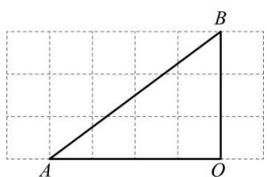

text_image

A
O
B

图1

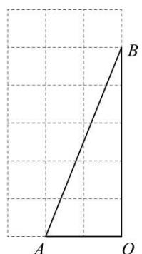

text_image

A
O
B

图2

【点睛】本题考查了勾股定理的拓展应用，“化曲面为平面”是解决“怎么爬行最近”这类问题的关键.

# 【题型 2 利用勾股定理求长方体中的最短路径】

1. （2025 八年级下·河南·专题练习）如图，长方体的底面是边长为 6 的正方形，侧面都是长为 13 的长方形，点 $D$ 是 $BC$ 的中点，在长方体下底面的 $A$ 点处有一只蚂蚁，它想吃到上底面点 $D$ 处的蜂蜜，则沿着表面需要爬行的最短路程 $n$ 的值为（）

A. $2 \sqrt{73}$

B. $5\sqrt{10}$

C. $\sqrt{370}$

D. $\sqrt{205}$

【答案】B

【分析】本题考查了平面展开-最短问题，勾股定理及两点之间线段最短，将棱柱展开，根据两点之间线段最短即可得到最短路径，利用勾股定理解答即可，将棱柱的侧面展开图正确画出来是解题的关键.

【详解】解：当沿着正面和侧面爬行时，如图所示，

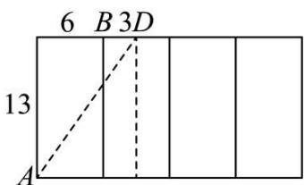

text_image

6 B 3D
13
A

·棱柱的底面是边长为6的正方形，侧面都是长为13的长方形，点D是的中点，

$$
\therefore B D = 3,
$$

$$
\therefore n = A D = \sqrt {(3 + 6) ^ {2} + 1 3 ^ {2}} = 5 \sqrt {1 0};
$$

当沿着正面和上底面爬行时，如图所示，

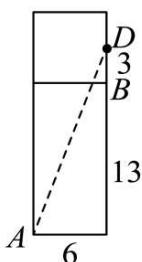

·棱柱的底面是边长为6的正方形，侧面都是长为13的长方形，点D是的中点，

$$
\therefore B D = 3,
$$

$$
\therefore n = A D = \sqrt {(3 + 1 3) ^ {2} + 6 ^ {2}} = 2 \sqrt {7 3};
$$

$$
\because 5 \sqrt {1 0} <   2 \sqrt {7 3},
$$

∴要爬行的最短路程n的值为 $5\sqrt{10}$ .

故选：B.

2. 如图是放在地面上的一个长方体盒子, 其中 $AB = 8 \mathrm{~cm}$ , $BC = 4 \mathrm{~cm}$ , $BF = 6 \mathrm{~cm}$ , 点 $M$ 在棱 $AB$ 上, 且 $AM = 2 \mathrm{~cm}$ , 点 $N$ 是 $FG$ 的中点, 一只蚂蚁要沿着长方形盒子的外表面从点 $M$ 爬行到点 $N$ , 它需要爬行的最短路程为( )

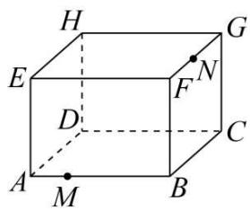

text_image

H
E
G
F
N
D
C
A
M
B

A. $10 \mathrm{~cm}$

B. $4 \sqrt{5} \mathrm{~cm}$

C. $6\sqrt{2}$ cm

D. $2 \sqrt{13} \mathrm{~cm}$

【答案】A

【分析】利用平面展开图有三种情况需要比较，画出图形利用勾股定理求出MN的长，然后作比较即可.

【详解】解：如图1中，MB = AB - AM = 8 - 2 = 6cm, BN = BF + $\frac{1}{2}$ BC = 6 + 2 = 8cm

$$
\therefore M N = \sqrt {M B ^ {2} + N B ^ {2}} = \sqrt {6 ^ {2} + 8 ^ {2}} = 1 0 (\mathrm{cm}),
$$

如图 2 中， $PM = MB + \frac{1}{2}BF = 6 + 2 = 8cm, PN = BF = 6cm$

$$
\therefore M N = \sqrt {P M ^ {2} + P N ^ {2}} = \sqrt {8 ^ {2} + 6 ^ {2}} = 1 0 (\mathrm{cm}),
$$

如图 3 中， $MF = AB + BF - AM = 8 + 6 - 2 = 12cm$ ， $FN = \frac{1}{2}BC = 2cm$

$$
\therefore M N = \sqrt {M F ^ {2} + F N ^ {2}} = \sqrt {1 2 ^ {2} + 2 ^ {2}} = 2 \sqrt {3 7} (\mathrm{cm}),
$$

$$
\because 1 0 <   2 \sqrt {3 7}
$$

∴一只蚂蚁要沿着长方形盒子的外表面从点 M 爬行到点 N，它需要爬行的最短路程为10cm，
故选：A.

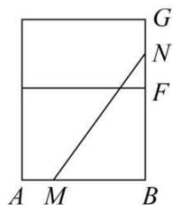

text_image

G
N
F
A M B

图1

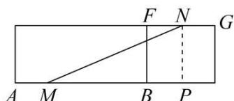

text_image

F N
A M B P G

图2

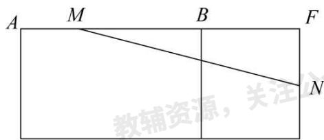

text_image

A M B F
教辅资源，关注
N

图3

【点睛】此题主要考查了平面展开图的最短路径问题和勾股定理的应用，利用展开图有三种情况分析得出是解题关键.

3. （24-25 八年级上·吉林长春·期中）将长方形纸片ABCD按如图所示折叠，已知

$AD = 6, AG = HB = 2.5, EG = EH = 1$ ，则蚂蚁在纸片上从点 $A$ 处爬到点 $C$ 处需要走的最短路程是（）

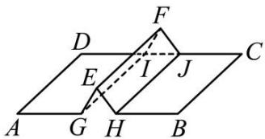

text_image

Geometric diagram showing two planes ABCD and AEG with points E, F, G, H, I, J and dashed lines forming a parallelogram intersection.

A. $\sqrt{61}$

B. $\sqrt{85}$

C. 10

D. $\sqrt{113}$

【答案】B

【分析】本题考查了勾股定理的实际应用和两点之间线段最短等问题，解题关键是展开该矩形纸片．本题可以利用勾股定理计算展开后的AC长度，则AC即为所求.

【详解】解：如图，展开长方形，由题意得 $\angle ABC=90^{\circ}$ ，BC=AD=6，

$$
A B = A G + E G + E H + H B = 2. 5 + 1 + 1 + 2. 5 = 7,
$$

$$
\therefore A C = \sqrt {A B ^ {2} + B C ^ {2}} = \sqrt {7 ^ {2} + 6 ^ {2}} = \sqrt {8 5},
$$

∴蚂蚁在纸片上从点A处爬到点C处需要走的最短路程是 $\sqrt{85}$ ,

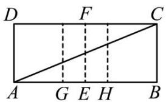

text_image

D F C
A G E H B

故选：B.

4. （22-23 八年级下·内蒙古鄂尔多斯·阶段练习）如图，直四棱柱侧棱长为 4cm，底面是长为 5cm 宽为 3cm 的长方形。一只蚂蚁从顶点 A 出发沿棱柱的表面爬到顶点 B。则蚂蚁经过的最短路程 \_\_\_\_ cm

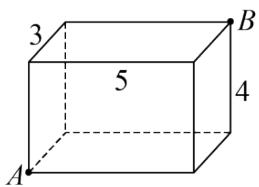

text_image

3
5
4
A
B

【答案】 $\sqrt{74}$

【分析】最短路线可放在平面内根据两点之间线段最短去求解，蚂蚁爬的两个面可以放平面内成为一个长方形，根据勾股定理去求解.

【详解】解：AB的长就为最短路线.

如图 1，若蚂蚁沿侧面和底面爬行，则经过的路程为 $\sqrt{(4+3)^{2}+5^{2}}=\sqrt{74}(cm)$ ,

如图 2，若蚂蚁沿侧面爬行，则经过的路程为 $\sqrt{(5+3)^{2}+4^{2}}=\sqrt{80}=4\sqrt{5}(cm)$ ,

如图 3，若蚂蚁沿左面和上面爬行，则经过的路程为 $\sqrt{(4+5)^{2}+3^{2}}=\sqrt{90}=3\sqrt{10}$ ;

$$
\because \sqrt {7 4} <   \sqrt {8 0} <   \sqrt {9 0},
$$

∴所以蚂蚁经过的最短路程是 $\sqrt{74}$ cm.

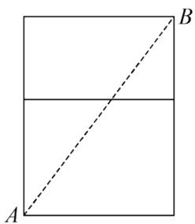

text_image

A
B

图1

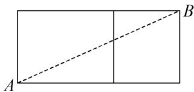

text_image

A
B

图2

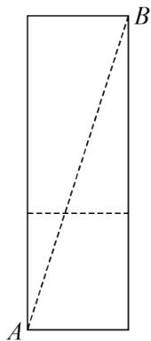

text_image

A
B

图3

故答案为: $\sqrt{74}$ .

【点睛】本题考查平面展开-最短路径问题，勾股定理的应用，关键是把立体图形能够展成平面图形求解.

5. 长方体敞口玻璃罐, 长、宽、高分别为 $16 \mathrm{~cm} 、 6 \mathrm{~cm}$ 和 $6 \mathrm{~cm}$ , 在罐内点 $E$ 处有一小块饼干碎末, 此时一只蚂蚁正好在罐外壁, 在长方形ABCD中心的正上方 $2 \mathrm{~cm}$ 处, 则蚂蚁到达饼干的最短距离是\_\_\_\_ $\mathrm{cm}$ .

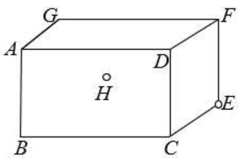

text_image

G
A
D
H
B
C
F
E

【答案】 $\sqrt{233}$

【分析】把这个长方体中蚂蚁所走的路线放到一个平面内，在平面内线段最短，根据勾股定理求解即可.

【详解】解：若蚂蚁从平面ABCD和平面CDFE经过，

蚂蚁到达饼干的最短距离，如图 1

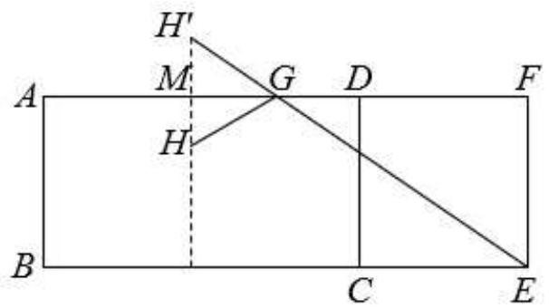

text_image

H'
M
G
D
F
A
H
B
C
E

图1

由题意可得： $MH = MH' = 1cm$ ，FM = 14cm，

$$
H ^ {\prime} E = \sqrt {1 4 ^ {2} + 7 ^ {2}} = \sqrt {2 4 5} = 7 \sqrt {5} \mathrm{cm},
$$

若蚂蚁从平面ABCD和平面ADFG经过，

蚂蚁到达饼干的最短距离，如图 2

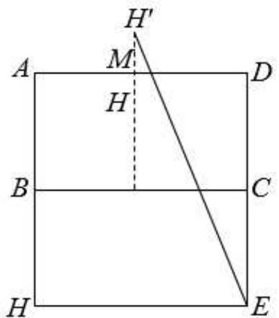

text_image

H'
A
M
D
H
B
C
H
E

图2

由题意可得: $MH = MH' = 1 \mathrm{~cm}$ , $DM = 8 \mathrm{~cm}$ , $DE = 12 \mathrm{~cm}$

$$
H ^ {\prime} E = \sqrt {1 3 ^ {2} + 8 ^ {2}} = \sqrt {2 3 3} \mathrm{cm}
$$

$$
\because \sqrt {2 3 3} <   \sqrt {2 4 5} = 7 \sqrt {5}
$$

最短距离为 $\sqrt{233}$ cm，

故答案为： $\sqrt{233}$

【点睛】本题考查了平面展开-最短路径问题，解题的关键是明确两点之间线段最短，然后将长方体放到一个平面内，进行分类讨论，利用勾股定理进行求解.

6. （24-25 八年级上·辽宁阜新·阶段练习）如图，在一个长 4 米，宽 2 米的长方形草地上，放着一根长方体的木块，它的棱和草地宽 $AD$ 平行且棱长大于 $AD$ ，木块从正面看是边长为 40 厘米的正方形，一只蚂蚁从点 $A$ 处到达点 $C$ 处需要走的最短路程是 \_\_\_\_ 米.

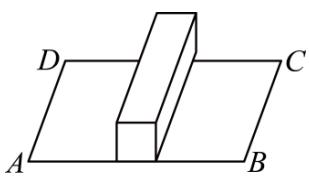

natural_image

Geometric diagram showing two planes A and B intersected by a vertical prism (no text or labels)

【答案】5.2

【分析】本题考查了勾股定理的应用、平面展开—最短路径问题，由题意可得，将木块展开，相当于是 $AB + 2$ 个正方形的宽，求出展开后的长为 $4 + 2 \times 0.4 = 4.8$ 米，宽为2米，最后由勾股定理计算即可得解.

【详解】解：由题意可得，将木块展开，相当于是 $AB+2$ 个正方形的宽，如图所示：

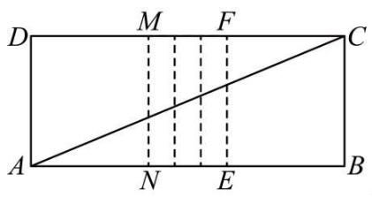

text_image

D M F C
A N E B

∴展开后的长为 $4+2\times0.4=4.8$ 米，宽为2米，

∴最短路径为 $\sqrt{4.8^{2}+2^{2}}=5.2$ 米，

∴一只蚂蚁从点 A 处到达点 C 处需要走的最短路程5.2米，

故答案为：5.2.

7. （22-23 八年级上·陕西西安·阶段练习）如图，一个底面为正方形的无盖长方形盒子的长、宽、高分别为 $20 \mathrm{~cm}, 20 \mathrm{~cm}, 30 \mathrm{~cm}$ ，即 $EF = FG = 20 \mathrm{~cm}, CG = 30 \mathrm{~cm}$ ，现在顶点 $C$ 处有一滴蜜糖，一只蚂蚁如果要沿着长方体的表面从顶点 $E$ 爬到 $C$ 处去吃蜜糖，求需要爬行的最短距离。（注：底面可以爬行）

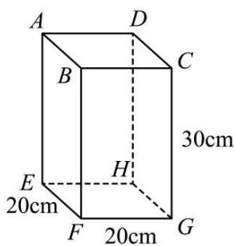

text_image

A
D
B
C
30cm
E
H
20cm
F
20cm
G

【答案】蚂蚁爬行的最短距离为50 cm

【分析】根据图形可知长方体的四个侧面都相等，所以分两种情况进行解答即可.

【详解】解：分两种情况：

如图1，连接EC，

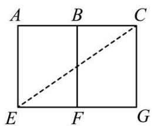

text_image

A B C
E F G

图1

在 $Rt\triangle EGC$ 中， $EG=20+20=40cm,\quad CG=30cm,$

根据勾股定理得： $EC = \sqrt{30^2 + 40^2} = 50\mathrm{cm}$

②如图2，连接EC，

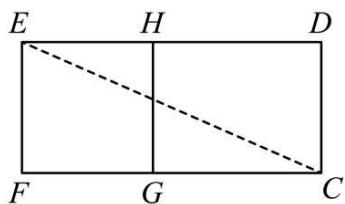

text_image

E H D
F G C

图2

在 $Rt\triangle EFC$ 中， $FC=20+30=50cm,\ EF=20cm,$

根据勾股定理得： $EC = \sqrt{50^2 + 20^2} = 10\sqrt{29}\mathrm{cm} > 50\mathrm{cm}$

蚂蚁爬行的最短距离为50 cm.

【点睛】本题考查了勾股定理的实际应用—求最短距离，读懂题意，熟悉立体图形的侧面展开图是解本题的关键.

# 【题型 3 利用勾股定理求圆柱中的最短路径】

1. （24-25 八年级下·内蒙古通辽·期中）如图，圆柱体的底面周长为 $6 \mathrm{~cm}$ ， $AB$ 是底面圆的直径，在圆柱表面的高 $BC$ 上有一点 $D$ ， $BD = 2CD$ ， $BC = 6 \mathrm{~cm}$ ，一只蚂蚁从 $A$ 点出发，沿圆柱的表面爬行到点 $D$ 的最短路程是

( )

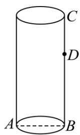

text_image

C
D
A
B

A. $6 \mathrm{~cm}$

B. 5cm

C. 3cm

D. $2\sqrt{13}$ cm

【答案】B

【分析】此题主要考查了平面展开最短路径问题，以及勾股定理的应用．首先画出圆柱的侧面展开图，根据底面周长为6cm，求出AB的值；再在Rt△ABD中，根据勾股定理求出AD的长，即可解得.

【详解】解：圆柱侧面展开图如图所示，

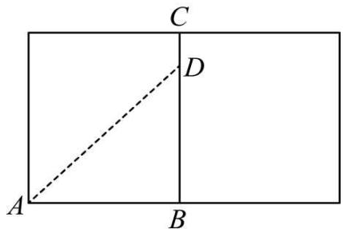

text_image

C
D
A
B

∵ 圆柱的底面周长为6cm，

$$
\therefore A B = 3 \mathrm{cm}.
$$

$$
\because B D = 2 C D, \quad B C = 6 \mathrm{cm},
$$

$$
\therefore B D = 4 \mathrm{cm},
$$

在Rt $\triangle ABD$ 中， $AD^{2}=AB^{2}+BD^{2}$

$$
\therefore A D = \sqrt {3 ^ {2} + 4 ^ {2}} = 5 (\mathrm{cm}),
$$

即蚂蚁从A点出发沿着圆柱体的表面爬行到点D的最短距离是5cm.

故选：B.

2. （24-25 八年级上·广东深圳·期中）如图，这是一个供滑板爱好者使用的 $U$ 型池的示意图，该 $U$ 型池可以看成是长方体去掉一个“半圆柱”而成，中间可供滑行部分的截面是直径为 $\frac{40}{\pi}\mathrm{m}$ 的半圆，其边缘

$AB = CD = 20\mathrm{m}$ , 点 $E$ 在 $CD$ 上, $CE = 5\mathrm{m}$ , 一滑板爱好者从 $A$ 点滑到 $E$ 点, 则他滑行的最短距离约为 ( ) $\mathbf{m}$ . (边缘部分的厚度忽略不计)

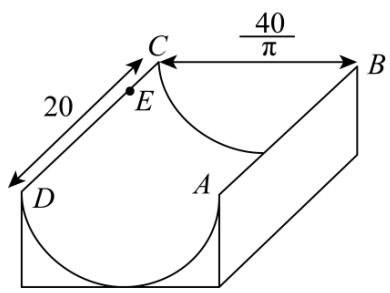

text_image

20
40/π
C
E
B
D
A

A. 25

B. $5\sqrt{73}$

C. 35

D. $20 \sqrt{2}$

【答案】A

【分析】本题考查了平面展开-最短路径问题，要求滑行的最短距离，需将该 U 型池的侧面展开，进而根据“两点之间线段最短”得出结果，U 型池的侧面展开图是一个矩形，此矩形的宽等于半径为 $\frac{20}{\pi}$ m 的半圆的弧长，矩形的长等于 AB = CD = 20m.

【详解】解：将半圆柱展开，如图： $AD = \frac{1}{2}\pi \cdot \frac{40}{\pi} = 20m$ ，AB = CD = 20m，DE = CD - CE = 20 - 5 = 15(m)，

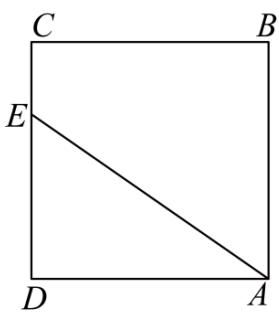

text_image

C
B
E
D
A

$$
A D ^ {2} + D E ^ {2} = A E ^ {2},
$$

$$
\therefore 2 0 ^ {2} + 1 5 ^ {2} = A E ^ {2},
$$

解得AE = 25（负值舍去），即他滑行的最短距离约为25m.

故选：A.

3. （23-24 八年级上·贵州黔东南·开学考试）如图所示，圆柱底面半径为 $\frac{4}{\pi}\mathrm{cm}$ ，高为 $18\mathrm{cm}$ ，点 $A$ ， $B$ 分别是圆柱两底面圆周上的点，且 $A$ ， $B$ 在同一母线上，用一根棉线从 $A$ 点顺着圆柱侧面绕3圈到 $B$ 点，则这根棉线的长度最短为（）

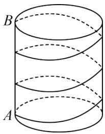

natural_image

Diagram of a cylinder with three horizontal curved lines, labeled A, B, and no text or symbols on the cylinder itself.

A. $24 \mathrm{~cm}$

B. 30cm

C. $18 \mathrm{~cm}$

D. 27cm

【答案】B

【分析】本题主要考查了圆柱的计算、侧面展开——路径最短问题。圆柱的侧面展开图是一个长方形，此长方形的宽等于圆柱底面周长，长方形的长等于圆柱的高。本题就是把圆柱的侧面展开成长方形，“化曲面为平面”，用勾股定理解决。要求圆柱体中两点之间的最短路径，最直接的作法就是将圆柱展开，然后利用两点之间线段最短解答即可。

【详解】解：圆柱体的展开图如下图所示：用一根棉线从A顺着圆柱侧面绕3圈到B的运动最短路线是：

$$
A C \rightarrow C D \rightarrow D B,
$$

即在圆柱体的展开图长方形中，将长方形平均分成3个小长方形，从A沿着3个长方形的对角线运动到B的路线最短.

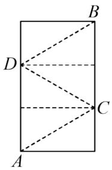

text_image

A
B
C
D

∵ 圆柱底面半径为 $\frac{4}{\pi}cm$ ,

∴长方形的宽即圆柱体的底面周长为： $2\pi \times \frac{4}{\pi} = 8(\text{cm})$ ,

又∵圆柱高为18cm，

∴ 小长方形的一条边长是6cm，

根据勾股定理求得AC = CD = DB = $\sqrt{6^{2} + 8^{2}} = 10(\text{cm})$ ,

$$
\therefore A C + C D + D B = 3 0 (\mathrm{cm}),
$$

故选：B.

4. （23-24 八年级下·河南商丘·期末）如图，若圆柱的底面周长是9cm，高是12cm，从圆柱底部A处沿侧面缠绕一圈丝线到顶部B处，则这条丝线的最小长度是\_\_\_\_cm.

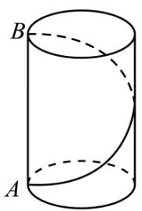

text_image

B
A

【答案】15

【分析】本题考查圆柱的展开图、最短路径问题、勾股定理，理解题意，灵活运用两点之间线段最短解决最短路径问题是解答的关键．先将圆柱侧面展开得到长为12cm，宽是9cm的长方形，然后利用勾股定理求解即可.

【详解】解：如图，将圆柱侧面展开得到长为12cm，宽是9cm的长方形，连接AB，

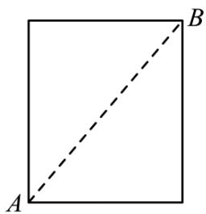

natural_image

Simple geometric diagram of a square with labeled vertices A, B, and diagonal line (no text or symbols beyond labels)

根据两点之间线段最短得这条丝线的最小长度是AB的长度，

由勾股定理得 $AB^{2}=12^{2}+9^{2}=225$ ，解得AB=15cm，

则这条丝线的最小长度是15cm，

故答案为：15.

5. （2025 九年级下·全国·专题练习）2024 年 12 月 4 日，我国的“春节”申遗成功，为了增添节日气氛，小刚家计划购买一条彩带，按如图所示的方式从圆柱的点A处缠绕到圆柱的点B处（点A在下底面，点B在上底面，点B在点A的正上方），若圆柱的底面周长为5dm，高为7dm，则需要购买彩带的长度最短为\_\_\_\_dm.

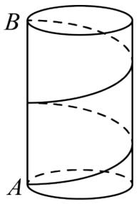

text_image

B
A

【答案】 $\sqrt{149}$

【分析】本题主要考查了平面展开—最短路径问题，根据题意画出圆柱的侧面展开图，利用勾股定理求解是解题的关键．圆柱的侧面展开图是一个长方形，此长方形的宽等于圆柱底面周长5dm，长方形的长等于圆柱的高7dm，在展开图中，根据题意，利用两点之间线段最短，求出 $AC + BD$ 即可.

【详解】解：圆柱体的侧面展开图如图所示，

text_image

B
3.5
D
C
3.5
A
5

在Rt $\triangle BDC$ 中， $BD = \sqrt{5^{2} + 3.5^{2}} = \frac{\sqrt{149}}{2}$ ,

同理求得 $AC = \sqrt{5^2 + 3.5^2} = \frac{\sqrt{149}}{2}$

最短长度为 $AC + BD = \sqrt{149}$

故答案为： $\sqrt{149}$ .

6. 如图, 圆柱的底面周长为 24 厘米, 高 $A B$ 为 5 厘米, $B C$ 是底面直径, 一只蚂蚁从点 $A$ 出发沿着圆柱体的侧面爬行到点 $C$ 的最短路程是 \_\_\_\_.

【答案】13厘米

【分析】本题考查了平面展开，最短路径问题，将图形展开和勾股定理进行计算是解题的关键．同时也考查了同学们的创造性思维能力.

先将图形展开，再根据两点之间线段最短可知AC长即蚂蚁爬行的最短路程，再利用勾股定理求解，即可求得答案.

【详解】解：如图所示：由于圆柱体的底面周长为24cm，

则弧 $AD = 24 \times \frac{1}{2} = 12(\mathrm{cm})$

又因为CD = 5cm,

所以 $AC=\sqrt{12^{2}+5^{2}}=13cm,$

故答案为：13厘米.

7. （24-25 八年级上·河南郑州·期末）如图所示，地面上铺了一块长方形地毯ABCD，因使用时间长而变形，中间形成一个半圆柱的凸起，半圆柱的底面直径为 $\frac{8}{\pi}m$ ，已知 $AE + BF = 20m$ ，BC = 10m，一只蚂蚁从A点爬到C点，且必须翻过半圆柱凸起，则它至少要走\_\_\_\_m的路程.

text_image

D H G C
A E F B

【答案】26

【分析】本题主要考查平面展开，最短路径问题，熟练掌握勾股定理是解题的关键．将中间半圆柱的凸起展平，使原来的长方形长增加而宽不变，再利用勾股定理求出新矩形的对角线长即可.

【详解】解：如图，将中间半圆柱的凸起展平，图形长度增加半圆周长，

text_image

D H G C
A E F B

原图长度增加 $\frac{8}{\pi}\times\pi\times\frac{1}{2}=4,$

则 $AB=20+4=24,$

连接AC，

$$
\therefore A C = \sqrt {A B ^ {2} + B C ^ {2}} = \sqrt {2 4 ^ {2} + 1 0 ^ {2}} = 2 6,
$$

故答案为：26.

8. （24-25 八年级下·山东潍坊·阶段练习）勾股定理是人类早期发现并证明的重要数学定理之一，是用代数思想解决几何问题重要的工具之一，也是数形结合的纽带之一，它不但因证明方法层出不穷吸引着人们，更因为应用广泛而使人入迷.

text_image

Diagram showing three geometric configurations: a cylinder with labeled points A and B, a suspended structure with a person, and a triangular shape with labeled vertices A, D, C, E, F.

(1)应用一：最短路径问题

如图, 一只蚂蚁从点 $A$ 沿圆柱侧面爬到相对一侧中点 $B$ 处, 如果圆柱的高为 $16 \mathrm{~cm}$ , 圆柱的底面半径为 $\frac{6}{\pi} \mathrm{~cm}$ , 那么最短的路线长是\_\_\_\_;

(2)应用二：解决实际问题.

如图，某公园有一秋千，秋千静止时，踏板离地的垂直高度BE = 0.5m，将它往前推2m至C处时，即水平距离CD = 2m，踏板离地的垂直高度CF = 1.5m，它的绳索始终拉直，求绳索AC的长.

【答案】(1)10cm

(2)绳索AC的长为2.5m

【分析】本题主要考查勾股定理的运用，掌握最短路的计算，勾股定理的计算方法是关键.

(1) 根据题意可得圆柱底面圆的周长为 $2 \pi \times \frac{6}{\pi} = 12(\mathrm{~cm})$ ，由展开图可得 $AB$ 即为最短路径，由勾股定理即可求解；

(2) 根据题意得到四边形CDEF是矩形, 如图所示, 过点B作 $BG \perp CF$ , 四边形CDBG, BCFG是矩形, 则 $BE = FG = 0.5m$ , $BD = CG = CF - FG = 1.5 - 0.5 = 1m$ , 设 $AB = AC = x$ , 则 $AD = AB - BD = x - 1$ , 在Rt $\triangle ACD$ 中由勾股定理得到 $AC^2 = AD^2 + CD^2$ , 代入计算即可求解.

【详解】（1）解：圆柱的底面半径为 $\frac{6}{\pi}cm$ ，

∴圆柱底面圆的周长为 $2\pi\times\frac{6}{\pi}=12(cm)$ ,

如图所示，AB即为最短路径， $AC=\frac{1}{2}\times12=6cm,\quad BC=\frac{1}{2}\times16=8cm,$

text_image

A
B
C

$$
\therefore A B = \sqrt {A C ^ {2} + B C ^ {2}} = \sqrt {6 ^ {2} + 8 ^ {2}} = 1 0 (\mathrm{cm}),
$$

∴最短的路线长是10cm，

故答案为：10cm;

(2) 解: 根据题意, $AE \perp EF, CF \perp EF, CD \perp AB$ ,

∴四边形CDEF是矩形，

$$
\therefore \angle C D E = \angle D E F = \angle E F C = 9 0 ^ {\circ}, D E = C F = 1. 5 \mathrm{m}, C D = E F = 2 \mathrm{m},
$$

如图所示，过点B作 $BG \perp CF$ ，

text_image

A
D
C
B
G
E
F

$$
\therefore \angle C D B = \angle D B G = \angle B G C = 9 0 ^ {\circ},
$$

∴四边形CDBG，BCFG是矩形，

$$
\therefore B E = F G = 0. 5 \mathrm{m},
$$

$$
\therefore B D = C G = C F - F G = 1. 5 - 0. 5 = 1 \mathrm{m},
$$

设AB = AC = x，则AD = AB - BD = x - 1，

在Rt $\triangle ACD$ 中， $AC^{2}=AD^{2}+CD^{2}$ ，即 $x^{2}=2^{2}+(x-1)^{2}$ ，

解得，x = 2.5，

∴绳索AC的长为2.5m.

# 【题型4 利用勾股定理求圆锥中的最短路径】

1. （2023·内蒙古赤峰·中考真题）某班学生表演课本剧，要制作一顶圆锥形的小丑帽。如图，这个圆锥的底面圆周长为 $20 \pi \mathrm{~cm}$ ，母线 $AB$ 长为 $30 \mathrm{~cm}$ ，为了使帽子更美观，要粘贴彩带进行装饰，其中需要粘贴一条从点 $A$ 处开始，绕侧面一周又回到点 $A$ 的彩带（彩带宽度忽略不计），这条彩带的最短长度是（）

text_image

B
A
v

A. $30 \mathrm{~cm}$

B. $30\sqrt{3}$ cm

C. 60 cm

D. $20\pi$ cm

【答案】B

【分析】根据圆锥的底面圆周长求得半径为10，根据母线长求得展开后的扇形的圆心角为 $120^{\circ}$ ，进而即可求解.

【详解】解：∵这个圆锥的底面圆周长为 $20\pi$ cm，

$$
\therefore 2 \pi r = 2 0 \pi
$$

解得: r = 10

$$
\because \frac {n \pi \times 3 0}{1 8 0} = 2 0 \pi
$$

解得: $n = 120$

∴侧面展开图的圆心角为 $120^{\circ}$

如图所示，AC即为所求，过点B作 $BD \perp AC$ ，

$\because\angle ABC=120^{\circ},\quad BA=BC,$ 则 $\angle BAC=30^{\circ}$

∵AB = 30，则BD = 15

$\therefore AD = 15\sqrt{3}, AC = 2AD = 30\sqrt{3},$

text_image

B
A
D
C

故选：B.

【点睛】本题考查了圆锥侧面展开图的圆心角的度数，勾股定理解直角三角形，求得侧面展开图的圆心角为 $120^{\circ}$ 解题的关键.

2. （24-25 九年级下·全国·期末）如图，圆锥的轴截面是边长为8cm的正三角形ABC，P是母线AC的中点，则在圆锥的侧面上从B点到P点的最短路线的长为\_\_\_\_。

text_image

A
P
B
C

【答案】 $4\sqrt{5}$

【分析】求出圆锥底面圆的周长，则以AB为一边，将圆锥展开，就得到一个以A为圆心，以AB为半径的扇形，根据弧长公式求出展开后扇形的圆心角，求出展开后 $\angle BAC=90^{\circ}$ ，连接BP，根据勾股定理求出BP即可.

【详解】解：圆锥底面是以BC为直径的圆，圆的周长是 $=8\pi$ ，

以AB为一边，将圆锥展开，就得到一个以A为圆心，以AB为半径的扇形，弧长是 $l=8\pi$ ，

设展开后的圆心角是 $n^{\circ}$ ，则 $\frac{n\pi\times8}{180}=8\pi$

解得： $n = 180^{\circ}$

即展开后 $\angle BAC = \frac{1}{2} \times 180^{\circ} = 90^{\circ}$ , $AP = \frac{1}{2} AC = 4$ , $AB = 8$ ,

则在圆锥的侧面上从B点到P点的最短路线的长就是展开后线段BP的长，

由勾股定理得： $PB = \sqrt{PA^{2} + AB^{2}} = \sqrt{4^{2} + 8^{2}} = 4\sqrt{5}$

故答案为： $4\sqrt{5}$ .

【点睛】本题考查了圆锥的计算，平面展开-最短路线问题，勾股定理，弧长公式等知识点的应用，熟练掌握以上知识点是解答本题的关键.

3. （24-25 九年级下·全国·期末）如图是一个用来盛爆米花的圆锥形纸杯，纸杯开口圆的直径EF长为8cm，母线OE(OF)长为8cm。在母线OF上的点A处有一块爆米花残渣，且FA = 2cm，一只蚂蚁从杯口的点E处沿圆锥表面爬行到A点，则此蚂蚁爬行的最短距离为cm。

text_image

O
A
E
F

【答案】10

【分析】考查了平面展开-最短路径问题，圆锥的侧面展开图是一个扇形，此扇形的弧长等于圆锥底面周长，扇形的半径等于圆锥的母线长．本题就是把圆锥的侧面展开成扇形，“化曲面为平面”，用勾股定理解决．要求蚂蚁爬行的最短距离，需将圆锥的侧面展开，进而根据“两点之间线段最短”得出结果.

【详解】解：∵ OE = OF = EF = 8(cm),

∴底面周长 = 8π(cm),

将圆锥侧面沿OF剪开展平得一扇形，此扇形的半径 $OE = 8(\text{cm})$ ，弧长等于圆锥底面圆的周长 $8\pi(\text{cm})$ 设扇形圆心角度数为n，则根据弧长公式得：

$$
8 \pi = \frac {8 n \pi}{1 8 0},
$$

$$
\therefore n = 1 8 0,
$$

即展开图是一个半圆，

∵ E 点是展开图弧的中点，

$$
\therefore \angle E O F = 9 0 ^ {\circ},
$$

连接EA，则EA就是蚂蚁爬行的最短距离，

text_image

O
A
F
E

在Rt $\triangle AOE$ 中由勾股定理得，

$$
E A ^ {2} = O E ^ {2} + O A ^ {2} = 6 4 + 3 6 = 1 0 0,
$$

$$
\therefore E A = 1 0 (\mathrm{cm}),
$$

即蚂蚁爬行的最短距离是10cm.

故答案为：10.

4. （22-23 九年级上·河北保定·期末）如图，小明用半径为 20，圆心角为 $\theta$ 的扇形，围成了一个底面半径 $r$ 为 5 的圆锥.

text_image

θ
20
A
r

(1) 扇形的圆心角θ为\_\_\_\_;   
(2) 一只蜘蛛从圆锥底面圆周上一点 $A$ 出发, 沿圆锥的侧面爬行一周后回到点 $A$ 的最短路程是

【答案】 $90^{\circ} / 90$ 度 $20\sqrt{2}$

【分析】（1）由于圆锥的底面圆周长就是圆锥的侧面展开图的弧长，利用弧长公式即可求出侧面展开图的

圆心角；

(2) 根据两点之间线段最短, 把圆锥的侧面展开成平面图形, 构造直角三角形根据勾股定理即可求得.

【详解】解（1）∵圆锥的底面周长= $2\pi\times5=10\pi$ ,

$$
\therefore \frac {\theta \pi \times 2 0}{1 8 0} = 1 0 \pi ,
$$

解得 $\theta=90^{\circ}$ ;

故答案为 $90^{\circ}$ .

（2）圆锥的侧面展开图如图所示，构造Rt $\triangle AOA'$ ，根据两点之间线段最短得最短路程为： $\sqrt{20^{2}+20^{2}}=20\sqrt{2}$ .

故答案为 $20\sqrt{2}$ .

text_image

A
O
A'

【点睛】本题考查了最短路径问题，根据题意把立体图形展开成平面图形后，再确定两点之间的最短路径，在平面图形上构造直角三角形是解题的关键.

5. （24-25 九年级上·贵州贵阳·期中）已知圆锥的底面半径为 $r = 20 \mathrm{~cm}$ , 高 $h = 20 \sqrt{15} \mathrm{~cm}$ , 现有一只蚂蚁从底边上一点 $A$ 出发, 在侧面上爬行一周后又回到 $A$ 点.

text_image

B
l
h
O r A

(1)求圆锥的全面积;

(2)求蚂蚁爬行的最短距离.

【答案】(1) $2000\pi cm^{2}$

(2) $80\sqrt{2}cm$

【分析】本题主要考查了求圆锥全面积，勾股定理，弧长公式，

对于（1），先根据勾股定理求出圆锥的母线，再根据 $S_{圆锥全}=\pi r^{2}+\pi rl$ 得出答案；

对于（2），先根据弧长公式求出圆心角，可知该三角形是直角三角形，结合两点之间线段最短，再根据勾股定理得出答案.

【详解】（1）解：∵r=20cm， $h=20\sqrt{15}$ cm.

∴在Rt△AOE中，由勾股定理，得母线 $l=\sqrt{r^{2}+h^{2}}=\sqrt{20^{2}+(20\sqrt{15})^{2}}=80(\mathrm{cm})$

$$
\therefore S _ {\text {圆锥全}} = \pi r ^ {2} + \pi r l = 2 0 ^ {2} \pi + 2 0 \times 8 0 \pi = 2 0 0 0 \pi \left(\mathrm{cm} ^ {2}\right);
$$

(2) 解: 设扇形的圆心角为 $n^{\circ}$ . 由 (1) 知, $l = 80 \mathrm{~cm}$ ,

而圆锥的侧面展开后的扇形的弧长为 $2\pi r = 2 \times 20\pi = 40\pi$ ,

$$
\therefore \frac {n \pi \times 8 0}{1 8 0} = 4 0 \pi ,
$$

解得n=90，即 $\triangle EAA'$ 是等腰直角三角形.

在Rt $\triangle AEA'$ 中，由勾股定理，得 $AA' = \sqrt{A'E^{2} + AE^{2}} = \sqrt{80^{2} + 80^{2}} = 80\sqrt{2}$ (cm)，

∴蚂蚁爬行的最短距离为 $80\sqrt{2}cm$ .

text_image

A'
B
l
h
O
r
A

6. 如图所示, 圆锥的母线长为 4 , 底面圆半径为 1 , 若一小虫 $P$ 从 $A$ 点开始绕着圆锥表面爬行一圈到 $SA$ 的中点 $C$ , 求小虫爬行的最短距离是多少?

text_image

S
C
P
A
B

【答案】 $2 \sqrt{5}$

【分析】圆锥的侧面展开图是一个扇形，此扇形的弧长等于圆锥底面周长，扇形的半径等于圆锥的母线长．本题就是把圆锥的侧面展开成扇形，“化曲面为平面”，用勾股定理解决．将圆锥的侧面展开如图所示，取 $SA'$ 的中点C，连接AC，则AC是小虫爬行的最短路线.

【详解】如图，将圆锥侧面沿母线AS展开，取 $SA'$ 的中点C，连接AC，则AC是小虫爬行的最短路线.

text_image

S
A
C
A'

$$
\because 2 \pi \times 1 = \frac {n \pi \times 4}{1 8 0},
$$

∴ $n = 90^{\circ}$ ，即 $\angle ASA' = 90^{\circ}$ .

$$
\because S A = 4, \quad S C = 2,
$$

$$
\therefore A C = \sqrt {4 ^ {2} + 2 ^ {2}} = 2 \sqrt {5}.
$$

∴ 小虫爬行的最短距离为 $2\sqrt{5}$ .