# 专题 02 点的坐标规律探索（举一反三专项训练）

# 【北师大版 2024】

考卷信息:

本套训练卷共 30 题，选择题 15 题，填空题 15 题。题型针对性较高，覆盖面广，选题有深度，可加强学生对平面直角坐标系中点的坐标规律探究的理解！

1. （24-25 七年级下·重庆·阶段练习）如图，在平面直角坐标系中，动点 $A$ 从 $A_{0}(1,0)$ 出发，第一次运动到点 $A_{1}(1,-1)$ ，第二次运动到点 $A_{2}(0,-1)$ ，第三次运动到点 $A_{3}(-1,-1)$ ，第四次运动到点 $A_{4}(-1,0)$ ，按照此运动规律，第83次运动到点 $A_{83}$ 的坐标为（）

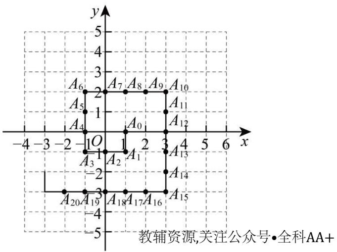

text_image

A6
2
A7 A8 A9 A10
A5
-1
A4
O
1
2
3
4
x
-4 -3 -2 -1 O 1 2 3 4
A3 A2 A1
-2
A20 A19 A18 A17 A16 A15
-4
-5
教辅资源,关注公众号•全科AA+

A. (7,2)

B. $(7,1)$

C. $(7,0)$

D. $(7,3)$

2. （24-25 七年级下·湖北黄石·期中）在平面直角坐标系中，若干个等腰直角三角形按如图所示的规律摆放．点 P 从原点 O 出发，沿着“ $O \rightarrow A_{1} \rightarrow A_{2} \rightarrow A_{3} \rightarrow A_{4} \cdots$ ”的路线运动（每秒一条直角边），已知 $A_{1}$ 坐标为 $(1,1), A_{2}(2,0), A_{3}(3,1), A_{4}(4,0) \cdots$ ，设第 n 秒运动到点 $P_{n}$ （n 为正整数），则点 $P_{2025}$ 的坐标是（）

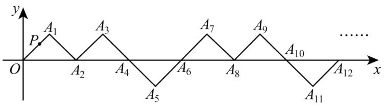

text_image

y
P A₁ A₃ A₇ A₉ ......
O A₂ A₄ A₆ A₈ A₁₀
A₅ A₁₁ A₁₂ x

A. (2023,1)

B. (2024,0)

C. (2025,-1)

D. (2025,1)

3. （24-25 七年级下·四川南充·期中）如图，在平面直角坐标系中，有若干个整数点，其顺序按图中“→”方向排列，如(0,1)，(-1,2)，(0,2)，(1,2)，(2,3)，(1,3)，(0,3)，……，根据这个规律探索可得第 2025 个点

的坐标是（）

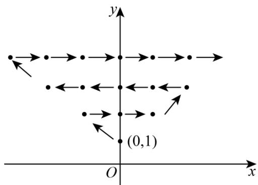

text_image

y
(0,1)
O
x

A. (43,45)

B. (44,45)

C. $(-43,45)$

D. $(-44,45)$

4. （24-25 八年级下·北京·专题练习）如图，一个粒子在第一象限和 $x$ 轴， $y$ 轴的正半轴上运动，在第 1 秒内，它从原点运动到 $(0,1)$ ，接着它按图所示在 $x$ 轴， $y$ 轴的平行方向来回运动，即 $(0,0) \rightarrow (0,1) \rightarrow (1,1) \rightarrow (1,0) \rightarrow (2,0) \rightarrow \ldots$ ，且每秒运动一个单位长度，那么 2024 秒时，这个粒子所处位置为（）

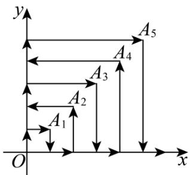

text_image

y
A₅
A₄
A₃
A₂
A₁
O
x

A. (1,44)

B. $(5,44)$

C. (44,1)

D. $(44,5)$

5. （2025·浙江杭州·模拟预测）如图，点P在平面直角坐标系中按图中箭头所示方向运动，第1次从原点运动到点(1,1)，第2次接着运动到点(2,0)，第3次接着运动到点(3,2)…，按这样的运动规律，经过第2025次运动后动点P的坐标是（）

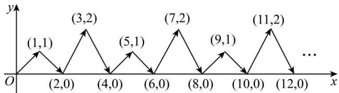

line

| x | y |
|---|---|
| 0 | 0 |
| (1,1) | 1 |
| (2,0) | 0 |
| (3,2) | 2 |
| (4,0) | 0 |
| (5,1) | 1 |
| (6,0) | 0 |
| (7,2) | 2 |
| (8,0) | 0 |
| (9,1) | 1 |
| (10,0) | 0 |
| (11,2) | 2 |
| (12,0) | ... |

A. (2024,0)

B. (2023,1)

C. (2025,2)

D. (2025,1)

6. （24-25 七年级下·湖北武汉·期中）如图，小球起始时位于(3,0)处，沿所示的方向击球，小球运动的轨迹如图所示，如果小球起始时位于(1,0)处，仍按原来方向击球，小球第一次碰到球桌边时，小球的位置是(0,1)，那么小球第 2025 次碰到球桌边时，小球的位置是（）

line

| x | y |
|---|---|
| 0 | 3 |
| 1 | 4 |
| 2 | 3 |
| 3 | 0 |
| 4 | 1 |
| 5 | 0 |
| 6 | 1 |
| 7 | 4 |
| 8 | 3 |

A. $(1, 0)$

B. $(5, 4)$

C. $(7, 0)$

D. $(8, 1)$

7. （2025·河南安阳·模拟预测）如图，在平面直角坐标系中，有点 $A_{1}(-1,0)$ ，点 $A_{1}$ 第一次先向右平移2个单位长度，再向上平移1个单位长度到点 $A_{2}(1,1)$ ，第二次向左平移3个单位长度到点 $A_{3}(-2,1)$ ，第三次先向右平移4个单位长度，再向上平移1个单位长度到点 $A_{4}(2,2)$ ，第四次向左平移5个单位长度到点 $A_{5}(-3,2)$ ……依此规律平移下去，点 $A_{1}$ 第2025次平移后的点可表示为（）教辅资源，关注公众号·全科AA+

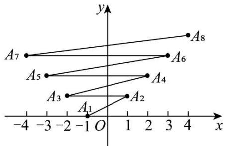

text_image

A7
A5
A3
A1
O
A2
A4
A6
A8
x
-4 -3 -2 -1 0 1 2 3 4

A. $A_{2025}(-1013,1012)$

B. $A_{2024}(1012,1012)$

C. $A_{2026}(1013,1013)$

D. $A_{2026}(-1013,1013)$

8. （2025·山西长治·模拟预测）如图，在平面直角坐标系xOy中，A，B，C，D是边长为1个单位长度的小正方形的顶点，开始时，顶点A，B依次放在点(1,0)，(2,0)的位置，然后向右滚动，第1次滚动使点C落在点(3,0)的位置，第2次滚动使点D落在点(4,0)的位置…，按此规律滚动下去，则第2025次滚动后，顶点A的坐标是（）

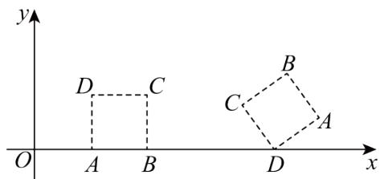

text_image

y
D C
O A B
B
C A
D x

A. (2025,1)

B. (2025,0)

C. (2026,1)

D. (2026,0)

9. （24-25 七年级下·重庆北碚·期中）如图，动点A在平面直角坐标系中按图中方向运动，从原点O出发，依次运动到点 $A_{1}(1,2)$ ， $A_{2}(3,1)$ ， $A_{3}(4,1)$ ， $A_{4}(5,3)$ ， $A_{5}(7,2)$ ， $A_{6}(8,2)$ ，…，按这样的运动规律，点 $A_{2027}$ 的坐标是（）

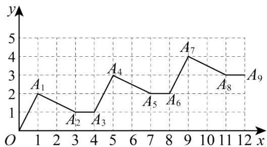

line

| Point | x | y |
|---|---|---|
| A1 | 1 | 2 |
| A2 | 3 | 1 |
| A3 | 4 | 1 |
| A4 | 5 | 3 |
| A5 | 7 | 2 |
| A6 | 8 | 2 |
| A7 | 9 | 4 |
| A8 | 11 | 3 |
| A9 | 12 | 3 |

A. (2701,675)

B. (2702,675)

C. (2703,676)

D. (2704,676)

10. （2025·湖南·模拟预测）如图，在平面直角坐标系中，半径均为 2 个单位长度的半圆 $O_{1}, O_{2}, O_{3}, \cdots$ 组成一条平滑的曲线，将一枚棋子放在原点O处，第一步，棋子从点O跳到点 $A_{1}(2,2)$ ；第二步，从点 $A_{1}$ 跳到点 $A_{2}(4,0)$ ；第三步，从点 $A_{2}$ 跳到点 $A_{3}(6,-2)$ ；然后依次在曲线上向右跳动一步，则棋子跳到点 $A_{1013}$ 时的坐标为（）

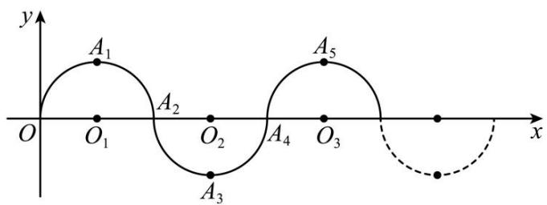

text_image

y
A₁
O₁ O₂ O₃
A₂
A₃
A₄
A₅
x

A. (2026,0)

B. (2026, -2)

C. (2024,0)

D. (2026, 2)

11. （24-25 七年级下·河南洛阳·期中）如图，一只小蚂蚁在平面直角坐标系中按图中路线进行“爬楼梯”运动，第 1 次它从原点运动到点(1,0)，第 2 次运动到点(1,1)，第 3 次运动到点(2,1)...按这样的规律，经过第 2025 次运动后，蚂蚁的坐标（）

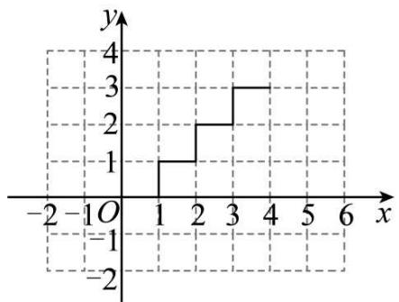

line

| x | y |
|---|---|
| -1 | 0 |
| 1 | 1 |
| 2 | 2 |
| 3 | 3 |
| 4 | 3 |

A. (1012,1011)

B. (1013,1012)

C. (1011,1011)

D. (1012,1012)

12. （24-25 九年级下·山东烟台·期中）在直角坐标系中，点 $A_{1}$ 从原点出发，沿如图所示的方向运动，到达位置的坐标依次为： $A_{2}(1,0)$ ， $A_{3}(1,1)$ ， $A_{4}(-1,1)$ ， $A_{5}(-1,-1)$ ， $A_{6}(2,-1)$ ， $A_{7}(2,2)$ …，若到达终点 $A_{n}(-505,-505)$ ，则 n 的值为（）

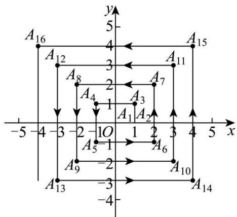

text_image

A16
A12
A8
A4
A3
A7
A1
A2
-5 -4 -3 -2 -1 O 1 2 3 4 5 x
A5=1
A6
A9
-2
A10
A13
-3
-4
y
5
4
3
2
1
A1
A2
A11
A15

A. 2021

B. 2023

C. 2025

D. 2027

13. （24-25 七年级下·重庆·期中）如图，在平面直角坐标系中，各点坐标分别为 $A_{0}(-1,0), A_{1}(0,1)$ ， $A_{2}(1,0), A_{3}(-1,-2), A_{4}(-3,0), A_{5}(0,3), A_{6}(3,0)$ ， $A_{7}(-1,-4), A_{8}(-5,0), \cdots$ ，则依据图中所示的规律，点 $A_{12}$ 的坐标为（）

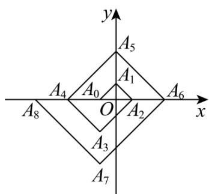

text_image

y
A5
A1
A4 A0 O A2 A6
x
A8
O
A3
A7

A. $(-7,0)$

B. $(-8,0)$

C. $(-9,0)$

D. $(-1,-6)$

14. （24-25 七年级下·广东广州·期中）如图，在平面直角坐标系中，将 $\triangle ABO$ 绕点 $A$ 顺时针旋转到 $\triangle AB_{1}C_{1}$ 的位置，点 $B$ 、 $O$ 分别落在点 $B_{1}$ 、 $C_{1}$ 处，点 $B_{1}$ 在 $x$ 轴上，再将 $\triangle AB_{1}C_{1}$ 绕点 $B_{1}$ 顺时针旋转到 $\triangle A_{1}B_{1}C_{2}$ 的位置，点 $C_{2}$ 在 $x$ 轴上，将 $\triangle A_{1}B_{1}C_{2}$ 绕点 $C_{2}$ 顺时针旋转到 $\triangle A_{2}B_{2}C_{2}$ 的位置，点 $A_{2}$ 在 $x$ 轴上，依次进行下去…，若点 $OA = 1.5$ ， $OB = 2$ ， $AB = 2.5$ ，则点 $B_{2025}$ 的坐标为（）

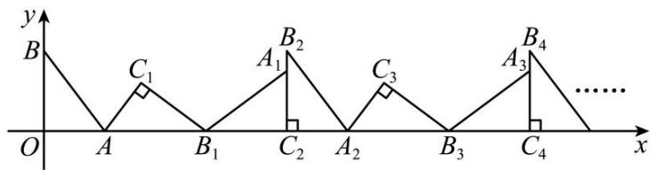

text_image

y
B
C₁
A₁ B₂
O A B₁ C₂ A₂ C₃ A₃ B₄
x
......

A. (6070,0)

B. (6072,2)

C. (6076,0)

D. (6078,2)

15. （2025·广东广州·一模）如图，在平面直角坐标系中，一动点从原点出发，按如下方向依次不断移动，得到 $A_{1}(0,-2)$ 、 $A_{2}(1,-2)$ 、 $A_{3}(1,0)$ 、 $A_{4}(1,2)$ 、 $A_{5}(2,2)$ 、 $A_{6}(2,0)$ ……，那么 $A_{2025}$ 的坐标为（）

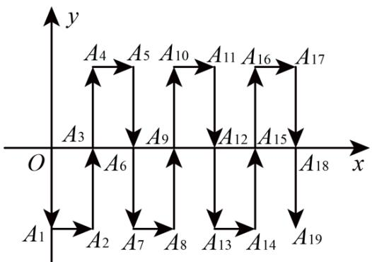

flowchart

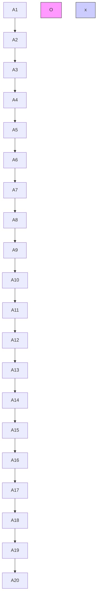

A. (674,0)

B. (674,2)

C. (675,2)

D. (675,0)

16. （2025·山东临沂·二模）在平面直角坐标系中，有点 $P(x,y)$ 和点 $P'(-y+1,x+2)$ 两点，我们把点 $P'$ 叫做点P的伴随点．已知点 $A_{1}$ 的伴随点为 $A_{2}$ ，点 $A_{2}$ 的伴随点为 $A_{3}$ ，点 $A_{3}$ 的伴随点为 $A_{4}$ ，…这样依次得到点 $A_{1},A_{2},A_{3},\ldots,A_{n},\ldots$ ．若点 $A_{1}$ 的坐标为(2,5)，则点 $A_{2025}$ 的坐标为\_\_\_\_．  
17. （24-25 七年级下·北京·期中）如图，一动点从(1,0)出发，沿所示方向运动，每当碰到长方形OABC的边时就反弹，反弹后路径与长方形的边所夹锐角为 $45^{\circ}$ ，已知第1次碰到长方形边上的点的坐标为(0,1)，则第5次碰到长方形边上的点的坐标为\_\_\_\_；第2025次碰到长方形边上的点的坐标为\_\_\_\_。

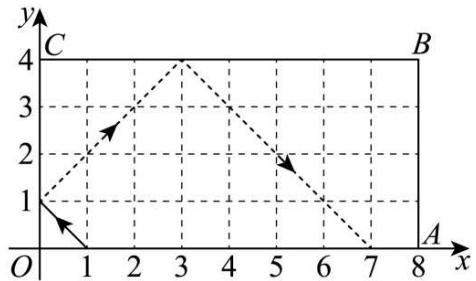

line

| Point | x | y |
|---|---|---|
| 1 | 0.5 | 1 |
| 2 | 1.5 | 2 |
| 3 | 3 | 4 |
| 4 | 4 | 3 |
| 5 | 5.5 | 2 |
| 6 | 7 | 0 |
| 7 | 8 | 0 |
The chart displays a dashed line connecting points (1,1) to (3,4), (5,2), and (7,0). The x-axis is labeled 'x' and the y-axis is labeled 'y'. There are no labels or additional data series in this image.

18. （24-25 七年级下·广西南宁·期中）在平面直角坐标系中，一个智能机器人接到的指令是：从原点 O 出发，按“向上→向右→向下→向右→向下→向右→向上→向右”的方向依次不断移动，每次移动 1 个单位长度，其移动路线如图所示，第一次移动到点 $A_{1}$ ，第二次移动到点 $A_{2}$ ……第 n 次移动到点 $A_{n}$ ，则点 $A_{2025}$ 的坐标是\_\_\_\_。

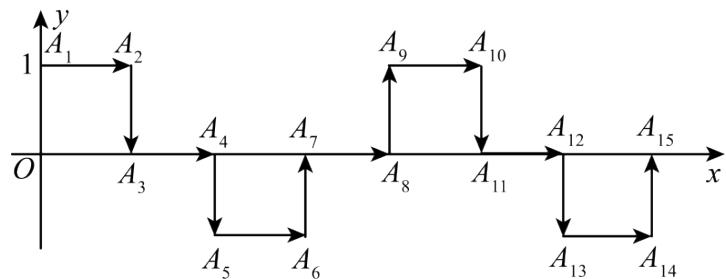

flowchart

```mermaid
graph TD
    A1["A₁"] --> A2["A₂"]
    A2 --> A3["A₃"]
    A3 --> A4["A₄"]
    A4 --> A5["A₅"]
    A5 --> A6["A₆"]
    A6 --> A7["A₇"]
    A7 --> A8["A₈"]
    A8 --> A9["A₉"]
    A9 --> A10["A₁₀"]
    A10 --> A11["A₁₁"]
    A11 --> A12["A₁₂"]
    A12 --> A13["A₁₃"]
    A13 --> A14["A₁₄"]
    A14 --> A15["A₁₅"]
    style A1 fill:#f9f,stroke:#333
    style A2 fill:#f9f,stroke:#333
    style A3 fill:#f9f,stroke:#333
    style A4 fill:#f9f,stroke:#333
    style A5 fill:#f9f,stroke:#333
    style A6 fill:#f9f,stroke:#333
    style A7 fill:#f9f,stroke:#333
    style A8 fill:#f9f,stroke:#333
    style A9 fill:#f9f,stroke:#333
    style A10 fill:#f9f,stroke:#333
    style A11 fill:#f9f,stroke:#333
    style A12 fill:#f9f,stroke:#333
    style A13 fill:#f9f,stroke:#333
    style A14 fill:#f9f,stroke:#333
    style A15 fill:#f9f,stroke:#333
```

19. （24-25 七年级下·广东中山·期中）如图，在平面直角坐标系中，有若干个横纵坐标分别为整数的点，其顺序为(1,0)，(2,0)，(2,1)，(1,1)，(1,2)，(2,2)，…，根据这个规律，第 121 个点的坐标为\_\_\_\_。

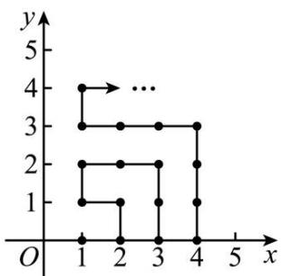

line

| x | y |
|---|---|
| 1 | 4 |
| 1 | 3 |
| 1 | 2 |
| 1 | 1 |
| 2 | 3 |
| 2 | 2 |
| 2 | 1 |
| 3 | 3 |
| 3 | 2 |
| 3 | 1 |
| 4 | 3 |
| 4 | 2 |
| 4 | 1 |
| ... | ... |

20. （24-25 七年级下·广东东莞·期中）如图，在平面直角坐标系中，长方形 ABCD 从位于第二象限的初始位置（点 A 和原点 O 重合）开始顺时针向右做“无滑动”翻转，前 5 次翻转得到的位置如图所示，跟踪点 A 的坐标可以得到点． $A_{1}(0,0)$ ， $A_{2}(2,2)$ ， $A_{3}(5,1)$ ， $A_{4}(6,0)$ ，…，那么第六次翻转后点 $A_{6}$ 的坐标为 \_\_\_\_.

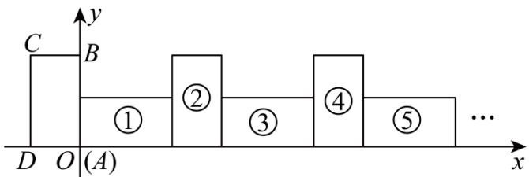

text_image

C
y
B
①
②
③
④
⑤
...
D O (A) x

21. （2025·山东德州·一模）平面直角坐标系中，我们把横，纵坐标都是整数，且横，纵坐标之和大于0的点称为“和点”。将某“和点”平移，每次平移的方向取决于该点横、纵坐标之和除以3所得的余数（当余数为0时，向右平移；当余数为1时，向上平移；当余数为2时，向左平移），每次平移1个单位长度。

例：“和点” $P(2,1)$ 按上述规则连续平移3次后，到达点 $P_{3}(2,2)$ ，其平移过程如下：

$$
P _ {\text {余} 0} (2, 1) \stackrel {\text {右}} {\rightarrow} P _ {1} (3, 1) \stackrel {\text {上}} {\rightarrow} P _ {2} (3, 2) \stackrel {\text {左}} {\rightarrow} P _ {3} (2, 2)
$$

若“和点”Q 按上述规则连续平移 16 次后，到达点 $Q_{16}(-1,9)$ ，则点Q的坐标为 \_\_\_\_.

22. （24-25 七年级下·四川泸州·期中）如图，将边长为1的正方形OAPB沿x轴正方向连续翻转2025次，点P依次落在点 $P_{1}$ ， $P_{2}$ ， $P_{3}$ … $P_{2025}$ 的位置，则 $P_{2025}$ 的坐标为\_\_\_\_。

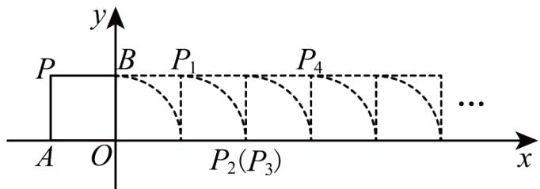

text_image

y
P B P₁ P₄
A O P₂(P₃) ... x

23. （24-25 八年级下·河北廊坊·期中）如图，在平面直角坐标系上有一点 $P(1,0)$ ，点 $P$ 第 1 次向上跳动 1 个单位长度至点 $P_{1}(1,1)$ ，紧接着第 2 次向左跳动 2 个单位长度至点 $P_{2}(-1,1)$ ，第 3 次向上跳动 1 个单位长度，第 4 次向右跳动 3 个单位长度，第 5 次又向上跳动 1 个单位长度，第 6 次向左跳动 4 个单位长度，…，依此规律跳动下去，点 $P$ 第 2025 次跳动至 $P_{2025}$ ，则 $P_{2025}$ 的坐标是 \_\_\_\_.

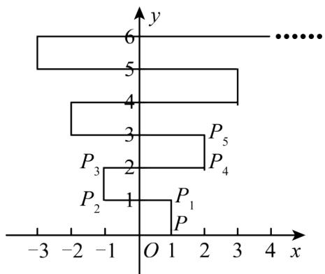

line

| x | y |
|---|---|
| -3 | 6 |
| -2 | 5 |
| -1 | 4 |
| 0 | 3 |
| 1 | 2 |
| 2 | 1 |
| 3 | 0 |
| 4 | 0 |
| 5 | 0 |
| 6 | 0 |
O
1
2
3
4
5
......
x

24. （24-25 八年级上·江苏宿迁·期末）如图，以O为顶点，x轴正半轴上选点 $A_{1}$ 、 $A_{4}$ 、 $A_{7}$ 、…作边长为1、2、3、…的正方形 $OA_{1}A_{2}A_{3}$ 、 $OA_{4}A_{5}A_{6}$ 、 $OA_{7}A_{8}A_{9}$ 、…，其中 $A_{3}$ 、 $A_{6}$ 、 $A_{9}$ 、…在y轴的正半轴上．则点 $A_{2025}$ 的坐标为\_\_\_\_．

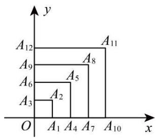

bar

| Label | x | y |
|---|---|---|
| A1 | 0 | 0 |
| A2 | 1 | 0 |
| A3 | 2 | 0 |
| A4 | 3 | 0 |
| A5 | 4 | 0 |
| A6 | 5 | 0 |
| A7 | 6 | 0 |
| A8 | 7 | 0 |
| A9 | 8 | 0 |
| A10 | 9 | 0 |
| A11 | 10 | 0 |
| A12 | 11 | 0 |

25. （24-25 八年级上·山东青岛·期末）如图，在平面直角坐标系xOy中，A, B, C, D是边长为1个单位长度的小正方形的顶点，开始时，顶点A, B依次放在点(1,0)，(2,0)的位置，然后向右滚动，第1次滚动使点C落在点(3,0)的位置，第2次滚动使点D落在点(4,0)的位置…，按此规律滚动下去，则第2024次滚动后，顶点A的坐标是\_\_\_\_．教辅资源,关注公众号•全科AA+

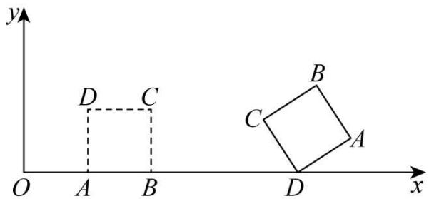

text_image

y
D C
O A B
x
B
C
A
D

26. （24-25 七年级上·山东淄博·期末）如图所示，在平面直角坐标系中，已知 $A_{1}(1,2), A_{2}(2,1), A_{3}(3,3), A_{4}(4,2)$ ，…，以此类推， $A_{2025}$ 的坐标为 \_\_\_\_.

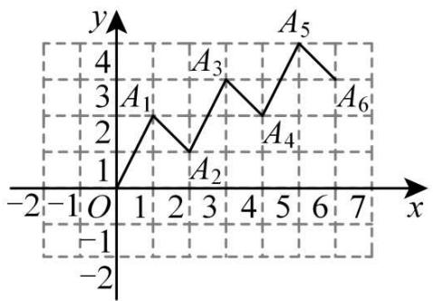

line

| Point | x | y |
|---|---|---|
| A1 | 1 | 3 |
| A2 | 2 | 1 |
| A3 | 3 | 4 |
| A4 | 4 | 2 |
| A5 | 5 | 5 |
| A6 | 6 | 4 |

27. （24-25 七年级下·全国·单元测试）如图，点 $A(0,1)$ ，点 $A_{1}(2,0)$ ，点 $A_{2}(3,2)$ ，点 $A_{3}(5,1)$ ，…按照这样的规律下去，点 $A_{2025}$ 的坐标为 \_\_\_\_.

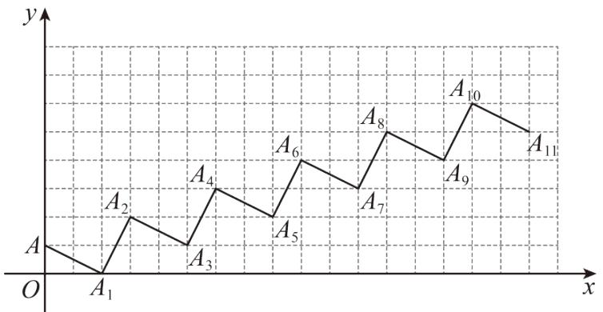

line

| Point | x | y |
|---|---|---|
| A | 0 | 0 |
| A₁ | 0 | 0 |
| A₂ | 1 | 1 |
| A₃ | 1 | 0 |
| A₄ | 2 | 1 |
| A₅ | 3 | 0 |
| A₆ | 4 | 1 |
| A₇ | 5 | 0 |
| A₈ | 6 | 1 |
| A₉ | 7 | 0 |
| A₁₀ | 8 | 1 |
| A₁₁ | 9 | 0 |

28. (24-25 九年级上·浙江宁波·期中) 如图, 已知点 $A(-1,2)$ , 将矩形ABOC沿 $x$ 轴正方向连续滚动 2024 次, 点 $A$ 依次落在点 $A_{1}, A_{2}, A_{3}, \cdots, A_{2024}$ 的位置, 则点 $A_{2024}$ 的坐标为 \_\_\_\_.

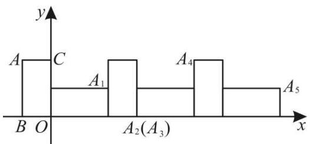

text_image

y
A C
A₁ A₄
B O A₂(A₃) A₅
x

29. （24-25 八年级上·山西大同·期中）如图，正方形ABCD的顶点A(1,1),B(3,1)，规定把正方形ABCD“先沿x轴翻折，再向左平移1个单位”为一次变换，这样连续经过2024次变换后，正方形ABCD的顶点C的坐标为\_\_\_\_。

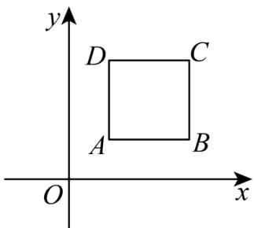

text_image

y
D C
A B
O x

教辅资源, 关注公众号·全科AA+

30. （24-25 八年级上·全国·专题练习）如图，在直角坐标系中，第一次将 $\triangle AOB$ 变换成 $\triangle OA_{1}B_{1}$ ，第二次将 $\triangle OA_{1}B_{1}$ 变换成 $\triangle OA_{2}B_{2}$ ，第三次将 $\triangle OA_{2}B_{2}$ 变换成 $\triangle OA_{3}B_{3}$ ，已知 $A(1,4)$ ， $A_{1}(2,4)$ ， $A_{2}(4,4)$ ， $A_{3}(8,4)$ ； $B(2,0)$ ， $B_{1}(4,0)$ ， $B_{2}(8,0)$ ， $B_{3}(16,0)$ .

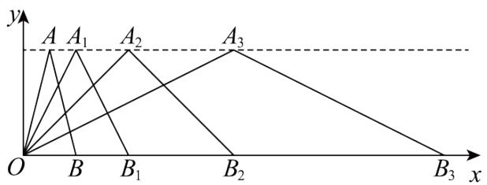

text_image

y
A A₁ A₂ A₃
O B B₁ B₂ B₃ x

(1) 观察每次变换前后的三角形有何变化, 找出规律, 按此变化规律再将 $\triangle OA_{3}B_{3}$ 变换成 $\triangle OA_{4}B_{4}$ , 则 $A_{4}$ 的坐标是 , $B_{4}$ 的坐标是 .

(2) 若按 (1) 找到的规律将 $\triangle OAB$ 进行了 $n$ 次变换, 得到 $\triangle OA_{n}B_{n}$ , 比较每次变换中三角形顶点有何变化, 找出规律, 推测 $A_{n}$ 的坐标是 , $B_{n}$ 的坐标是 .