# 专题 02 点的坐标规律探索（举一反三专项训练）

# 【北师大版 2024】

考卷信息:

本套训练卷共 30 题，选择题 15 题，填空题 15 题。题型针对性较高，覆盖面广，选题有深度，可加强学生对平面直角坐标系中点的坐标规律探究的理解！

1. （24-25 七年级下·重庆·阶段练习）如图，在平面直角坐标系中，动点 $A$ 从 $A_{0}(1,0)$ 出发，第一次运动到点 $A_{1}(1,-1)$ ，第二次运动到点 $A_{2}(0,-1)$ ，第三次运动到点 $A_{3}(-1,-1)$ ，第四次运动到点 $A_{4}(-1,0)$ ，按照此运动规律，第83次运动到点 $A_{83}$ 的坐标为（）

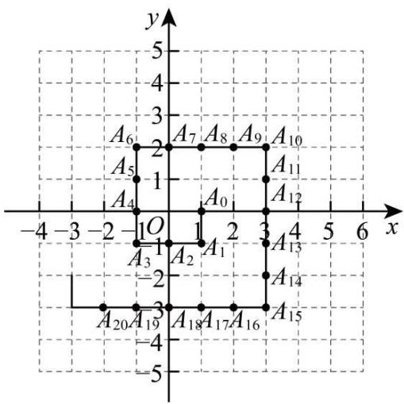

text_image

y
5
4
3
A6
2
A7 A8 A9 A10
A5
-1
A4
O
A0
A12
-4 -3 -2 -1 O 1 2 3 4 5 6 x
A3
-1
A2
A1
-2
A14
-3
A20 A19 A18 A17 A16 A15
-4 -5

A. (7,2)

B. $(7,1)$

C. $(7,0)$

D. (7,3)

【答案】B

【分析】本题为平面直角坐标系下的规律探究题，观察图形可发现：前 n 次改变方向需要运动 n 个单位长度 $\frac{n(n+1)}{2}$ ，则 $A_{83}$ 是第 12 次改变方向后再运动 5 次到达的点，观察图形发现：每改变四次方向，运动方向与第一次相同，则 $A_{78}$ 是第三个运动周期的终点，然后根据每个周期终点的坐标间的规律求解即可.

【详解】解：观察图形可发现：第一次改变方向需要运动 1 个单位长度；

第二次改变方向需要运动 2 个单位长度;

第三次改变方向需要运动 3 个单位长度:

第四次改变方向需要运动 4 个单位长度;

第五次改变方向需要运动 5 个单位长度;

...

∴第 n 次改变方向需要运动 n 个单位长度;

∴前 n 次改变方向需要运动 n 个单位长度 $\frac{n(n+1)}{2}$ ,

当n=12时， $\frac{n(n+1)}{2}=78$ ，当n=13时， $\frac{n(n+1)}{2}=91$ ，

$\therefore A_{83}$ 是第 12 次改变方向后再运动 5 次到达的点，

观察图形发现：每改变四次方向，运动方向与第一次相同，

$\therefore A_{78}$ 是第三个运动周期的终点，

如图，

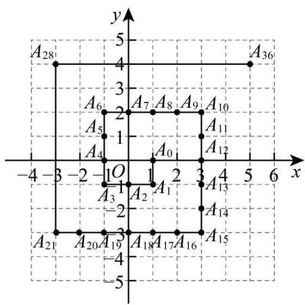

text_image

A₂₈
4
y
A₃₆
3
A₆
2
A₇
A₈
A₉
A₁₀
A₅
-1
A₁₁
A₄
A₁₂
-4 -3 -2 -1 O 1 2 3 4 5 6 x
A₃
-1 A₂
-2 A₁₃
A₂₁ A₂₀ A₁₉ A₁₈ A₁₇ A₁₆ A₁₅
-4 -3 -2 -1 O 1 2 3 4 5 6 x

∵起点 $A_{0}(1,0)$ ，第一个周期的终点 $A_{10}(3,2)$ ，第二个周期的终点 $A_{36}(5,4)$ ，

∴周期的终点的横坐标依次加2，纵坐标也是依次加2，

∴第三个周期的终点 $A_{78}(7,6)$ ,

$\therefore A_{83}$ 的坐标为(7,6-5)，即为(7,1)，

故选：B.

2. （24-25 七年级下·湖北黄石·期中）在平面直角坐标系中，若干个等腰直角三角形按如图所示的规律摆放．点 P 从原点 O 出发，沿着“ $O \rightarrow A_{1} \rightarrow A_{2} \rightarrow A_{3} \rightarrow A_{4} \cdots$ ”的路线运动（每秒一条直角边），已知 $A_{1}$ 坐标为 $(1,1), A_{2}(2,0), A_{3}(3,1), A_{4}(4,0) \cdots$ ，设第 n 秒运动到点 $P_{n}$ （n 为正整数），则点 $P_{2025}$ 的坐标是（）

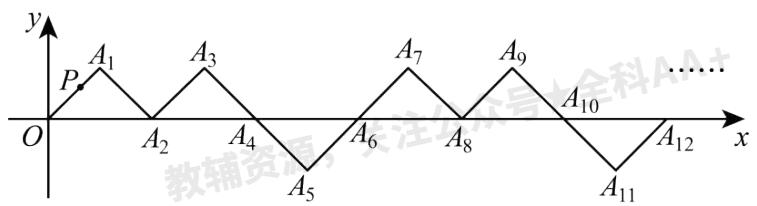

text_image

y
P A₁ A₃ ... 
O A₂ A₄ A₆ A₈ A₁₀ A₁₁ A₁₂ x
教辅资者 注注

A. (2023,1)

B. (2024,0)

C. (2025,-1)

D. (2025,1)

【答案】D

【分析】此题考查了点坐标的规律，正确理解题意发现并总结运用规律是解题的关键．根据图形发现每6个点为一个循环，每个循环内横坐标增加6，纵坐标为1，0，1，0，-1，0循环，据此规律得到答案即可.

【详解】解： $A_{1}$ 坐标为(1,1), $A_{2}(2,0)$ , $A_{3}(3,1)$ , $A_{4}(4,0)\cdots$

以此类推，可知，每6秒运动为一个循环，每个循环内横坐标增加6，纵坐标为1，0，1，0，-1，0循环，
∵2025÷6=337...3,

∴ $P_{2025}$ 的横坐标为 $337 \times 6 + 3 = 2025$ ，纵坐标为1，

∴点 $P_{2025}$ 的坐标是(2025,1),

故选：D

3. （24-25 七年级下·四川南充·期中）如图，在平面直角坐标系中，有若干个整数点，其顺序按图中“→”方向排列，如(0,1)，(-1,2)，(0,2)，(1,2)，(2,3)，(1,3)，(0,3)，……，根据这个规律探索可得第 2025 个点的坐标是（）

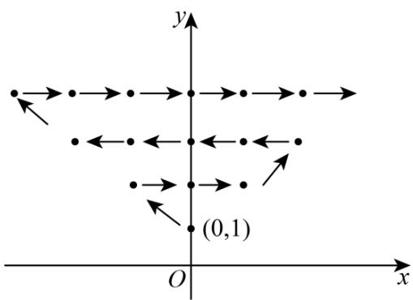

text_image

y
(0,1)
O
x

A. (43,45)

B. (44,45)

C. $(-43,45)$

D. $(-44,45)$

【答案】D

【分析】本题考查了点的坐标规律探索，探索出点的坐标规律是解题的关键；按点的纵坐标分类：纵坐标是1的点有1个，纵坐标是2的点有3个，纵坐标是3的点有5个，纵坐标是4的点有7个，……，一般地，纵坐标为n的点有 $(2n-1)$ 个；考虑点排列方向：纵坐标是1、3、5、7，……，点是从右往左的方向，纵坐标是2、4、6，……，点是从左往右排列的方向；而 $45^{2}=2025$ ，当纵坐标是45时，这样的点共有89个，且点是从右往左方向，则可得第2025个点的坐标.

【详解】解：纵坐标是1的点有1个，

纵坐标是 2 的点有 3 个，

纵坐标是 3 的点有 5 个，

纵坐标是 4 的点有 7 个，……，

一般地，纵坐标为 n 的点有 $(2n-1)$ 个，且这 n 个点的横坐标从左往右依次是 $-n+1, -n+2, \ldots, -1, 0$ ，1, ……, n-1;

考虑点排列方向：纵坐标是 1、3、5、7，……，点是从右往左的方向，

纵坐标是 2、4、6，……，点是从左往右排列的方向；

∵ $45^{2} = 2025$ ，当纵坐标是 45 时，这样的点共有 89 个，且点是从右往左方向，

∴ 最左边的点坐标为 $(-44,45)$ ，即第2025个点的坐标，

∴ 第 2025 个点的坐标为 $(-44,45)$ .

故选：D.

4. （24-25 八年级下·北京·专题练习）如图，一个粒子在第一象限和 x 轴，y 轴的正半轴上运动，在第 1 秒内，它从原点运动到 $(0,1)$ ，接着它按图所示在 x 轴，y 轴的平行方向来回运动，即 $(0,0)\rightarrow(0,1)\rightarrow(1,1)\rightarrow(1,0)\rightarrow(2,0)\rightarrow\ldots$ ，且每秒运动一个单位长度，那么 2024 秒时，这个粒子所处位置为（）

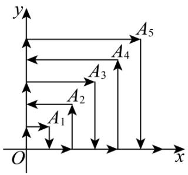

text_image

y
A₅
A₄
←
A₃
A₂
←
A₁
O
x

A. (1,44)

B. (5,44)

C. (44,1)

D. (44,5)

【答案】A

【分析】本题主要考查了规律型一点的坐标，分析粒子在第一象限的运动规律得到数列 $a_{n}$ 的递推关系式 $a_{n}-a_{n-1}=2n$ 是本题的突破口，对运动规律的探索知： $A_{1},A_{2},\cdots A_{n}$ 中，奇数点处向下运动，偶数点处向左运动是解题的关键.

设粒子运动到 $A_{1},A_{2},\cdots A_{n}$ 时所用的时间分别为 $a_{1},a_{2},\cdots a_{n}$ ，则 $a_{1}=2,a_{2}=6,a_{3}=12,a_{4}=20\cdots$ 由 $a_{n}-a_{n-1}=2n$ ，则 $a_{2}-a_{1}=2\times2,a_{3}-a_{2}=2\times3,a_{4}-a_{3}=2\times4,\cdots,a_{n}-a_{n-1}=2n$ ，以上相加得到 $a_{n}-a_{1}$ 的值，进而求得 $a_{n}$ ，再找到运动方向的规律即可求解.

【详解】解：由题意，设粒子运动到 $A_{1},A_{2},\cdots A_{n}$ 时所用的时间分别为 $a_{1},a_{2},\cdots a_{n}$ ，则 $a_{1}=2,a_{2}=6,a_{3}=12,a_{4}=20\cdots$

$$
\therefore a _ {2} - a _ {1} = 2 \times 2, a _ {3} - a _ {2} = 2 \times 3, a _ {4} - a _ {3} = 2 \times 4, \dots , a _ {n} - a _ {n - 1} = 2 n,
$$

相加得： $a_{n}-a_{1}=2(2+3+4+\cdots+n)=n^{2}+n-2,$

$$
\therefore a _ {n} = n (n + 1).
$$

$$
\because 4 4 \times 4 5 = 1 9 8 0,
$$

∴运动了 1980 秒时它到点 $A_{44}(44,44)$ ;

又由运动规律知： $A_{1},A_{2},\cdots,A_{n}$ 中，奇数点处向下运动，偶数点处向左运动.

故达到 $A_{44}(44,44)$ 时向左运动43秒到达点 $(1,44)$ ,

∴运动了2023秒．所求点应为(1，44).

故选：A.

5. （2025·浙江杭州·模拟预测）如图，点P在平面直角坐标系中按图中箭头所示方向运动，第1次从原点运动到点(1,1)，第2次接着运动到点(2,0)，第3次接着运动到点(3,2)…，按这样的运动规律，经过第2025次运动后动点P的坐标是（）

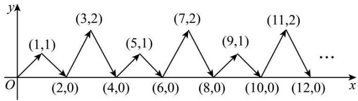

line

| x | y |
|---|---|
| (1,1) | 1 |
| (2,0) | 0 |
| (3,2) | 2 |
| (4,0) | 0 |
| (5,1) | 1 |
| (6,0) | 0 |
| (7,2) | 2 |
| (8,0) | 0 |
| (9,1) | 1 |
| (10,0) | 0 |
| (11,2) | 2 |
| ... | ... |

A. (2024,0)

B. (2023,1)

C. (2025,2)

D. (2025,1)

【答案】D

【分析】本题主要考查了点的坐标规律探索，确定点的变化规律是解题关键．根据题意可得第 n 次运动后的点的横坐标为 n，且纵坐标是 1，0，2，0 四个数一循环，即可求解.

【详解】解：根据题意，可得第 1 次从原点运动到点(1,1)，第 2 次接着运动到点(2,0)，第 3 次接着运动到点(3,2)…，

由此发现，第 n 次运动后的点的横坐标为 n，且纵坐标是 1，0，2，0 四个数一循环，

$$
\because 2 0 2 5 \div 4 = 5 0 6 \dots 1,
$$

∴经过第 2025 次运动后，动点 P 的坐标是(2025,1).

故选：D.

6. （24-25 七年级下·湖北武汉·期中）如图，小球起始时位于(3, 0)处，沿所示的方向击球，小球运动的轨迹如图所示，如果小球起始时位于(1, 0)处，仍按原来方向击球，小球第一次碰到球桌边时，小球的位置是(0,1)，那么小球第 2025 次碰到球桌边时，小球的位置是（）

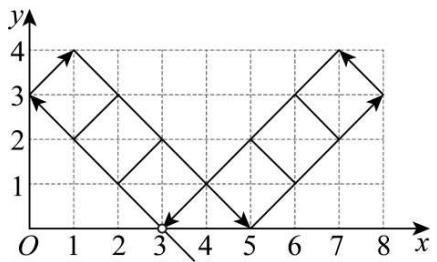

line

| x | y |
|---|---|
| 0 | 3 |
| 1 | 4 |
| 2 | 3 |
| 3 | 0 |
| 4 | 1 |
| 5 | 0 |
| 6 | 1 |
| 7 | 4 |
| 8 | 3 |

A. $(1, 0)$

B. $(5, 4)$

C. $(7, 0)$

D. $(8, 1)$

【答案】C

【分析】本题考查了坐标确定位置，解答本题的关键是明确题意，发现点的坐标位置的变化特点，利用数形结合的思想解答．小球的运动轨迹是起点，第一次撞击点在 y 轴，且连线是等腰直角三角形的斜边；第二次撞击点在直线 y = 4 上，连线是等腰直角三角形的斜边；第三次撞击点在 x 轴上，连线是等腰直角三角形的斜边；第四次撞击点在直线 x = 8 上，连线是等腰直角三角形的斜边；第五次撞击点在直线 y = 4 上，连线是等腰直角三角形的斜边；第六次撞击点回到起始点，清楚了小球的运动轨迹，画图，根据循环的特点解答即可；

【详解】解：从点 $(1,0)$ 开始，第一次碰撞后的点的坐标为 $(0,1)$ ，第二次碰撞后的点的坐标为 $(3,4)$ ，第三次碰撞后的点的坐标为 $(7,0)$ ，第四次碰撞后的点的坐标为 $(8,1)$ ，第五次碰撞后的点的坐标为 $(5,4)$ ，第六次碰撞后的点的坐标为 $(1,0)$ ，

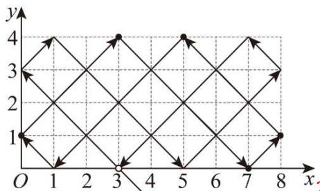

text_image

y
4
3
2
1
O 1 2 3 4 5 6 7 8 x

2025 ÷ 6 = 337......3，小球第 2025 次碰到球桌边时，小球的位置是

$(7, 0)$ ,

故选：C.

7. （2025·河南安阳·模拟预测）如图，在平面直角坐标系中，有点 $A_{1}(-1,0)$ ，点 $A_{1}$ 第一次先向右平移2个单位长度，再向上平移1个单位长度到点 $A_{2}(1,1)$ ，第二次向左平移3个单位长度到点 $A_{3}(-2,1)$ ，第三次先向右平移4个单位长度，再向上平移1个单位长度到点 $A_{4}(2,2)$ ，第四次向左平移5个单位长度到点 $A_{5}(-3,2)$ ……依此规律平移下去，点 $A_{1}$ 第2025次平移后的点可表示为（）

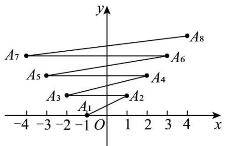

text_image

y
A7
A6
A5
A4
A3
A1
A2
-4 -3 -2 -1 O 1 2 3 4 x

A. $A_{2025}(-1013,1012)$

B. $A_{2024}(1012,1012)$

C. $A_{2026}(1013,1013)$

D. $A_{2026}(-1013,1013)$

【答案】C

【分析】本题主要考查了平面直角坐标系中点坐标的规律，根据已知点的坐标寻找出点的变化规律是解题的关键.

先根据从 $A_{1}$ 经过多次平移得到 $A_{2}$ 、 $A_{3}$ 、 $A_{4}\cdots$ 的坐标的变化规律，再根据坐标规律求解即可.

【详解】解：∵点 $A_{1}(-1,0)$ 第一次先向右平移2个单位长度，再向上平移1个单位长度到点 $A_{2}(1,1)$ ，第二次向左平移3个单位长度到点 $A_{3}(-2,1)$ ，

第三次先向右平移 4 个单位长度，再向上平移 1 个单位长度到点 $A_{4}(2,2)$ ,

第四次向左平移 5 个单位长度到点 $A_{5}(-3,2)$ ,

第五次先向右平移 6 个单位长度，再向上平移 1 个单位长度到点 $A_{6}(3,3)$ ,

第六次向左平移 7 个单位长度到点 $A_{7}(-4,3)$ ……

∴可得，第m次平移后得到点 $A_{m+1}$ ，奇数次平移后点为 $\left(\frac{m+1}{2},\frac{m+1}{2}\right)$ ，（m为正整数），

点 $A_{1}$ 第2025次平移后的点可表示为 $A_{2026}(1013,1013)$ ,

故选：C.

8. （2025·山西长治·模拟预测）如图，在平面直角坐标系 $xOy$ 中， $A, B, C, D$ 是边长为1个单位长度的小正方形的顶点，开始时，顶点 $A, B$ 依次放在点(1,0)，(2,0)的位置，然后向右滚动，第1次滚动使点 $C$ 落在点(3,0)的位置，第2次滚动使点 $D$ 落在点(4,0)的位置…，按此规律滚动下去，则第2025次滚动后，顶点 $A$ 的坐标是（）

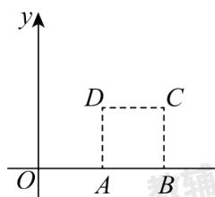

text_image

y
D C
O A B

A. (2025,1)

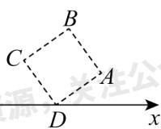

B. (2025,0)

C. (2026,1)

D. (2026,0)

【答案】C

【分析】本题主要考查了点的坐标变化规律，解题关键是找到点A随滚动次数的变化规律。列举几次滚动后的A点坐标，找到滚动次数与点A坐标之间的规律，进而求出第2025次滚动后顶点A的坐标。

【详解】解：第1次滚动点 $A_{1}$ 的坐标为(2,1)，

第 2 次滚动点 $A_{2}$ 的坐标为(4,1),

第 3 次滚动点 $A_{3}$ 的坐标为(5,0)，

第 4 次滚动点 $A_{4}$ 的坐标为(5,0)，

第 5 次滚动点 $A_{5}$ 的坐标为(6,1)，

...，

每滚动 4 次一个循环，

$$
\therefore A _ {4 n + 1} (4 n + 2, 1), A _ {4 n + 2} (4 n + 4, 1), A _ {4 n + 3} (4 n + 5, 0), A _ {4 n + 4} (4 n + 5, 0),
$$

$$
\because 2 0 2 5 \div 4 = 5 0 6 \dots 1,
$$

$$
\therefore A _ {2 0 2 5} (4 \times 5 0 6 + 2, 1),
$$

即 $A_{2025}(2026,1)$ ,

故选：C.

9. （24-25 七年级下·重庆北碚·期中）如图，动点A在平面直角坐标系中按图中方向运动，从原点O出发，依次运动到点 $A_{1}(1,2)$ ， $A_{2}(3,1)$ ， $A_{3}(4,1)$ ， $A_{4}(5,3)$ ， $A_{5}(7,2)$ ， $A_{6}(8,2)$ ，…，按这样的运动规律，点 $A_{2027}$ 的坐标是（）

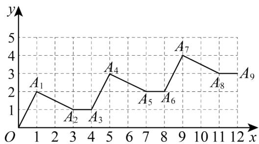

line

| x | y |
|---|---|
| 0 | 0 |
| 1 | 2 |
| 2 | 1 |
| 3 | 1 |
| 4 | 1 |
| 5 | 3 |
| 6 | 2.5 |
| 7 | 2 |
| 8 | 2 |
| 9 | 4 |
| 10 | 3.5 |
| 11 | 3 |
| 12 | 3 |

A. (2701,675)

B. (2702,675)

C. (2703,676)

D. (2704,676)

【答案】C

【分析】本题主要考查了点的坐标变化规律，根据点运动规律，可知横坐标的变化规律是依次 +1、+2、+1、…，每三个是一次循环运动；纵坐标的变化规律是依次 +2、-1、+0、…每三个是一次循环运动， $2027 \div 3 = 675 \cdots 2$ ，根据变化规律即可解答.

【详解】解：根据从原点O出发，点 $A_{1}(1,2)$ ， $A_{2}(3,1)$ ， $A_{3}(4,1)$ ， $A_{4}(5,3)$ ， $A_{5}(7,2)$ ， $A_{6}(8,2)$ 的运动规律，

可知横坐标的变化规律是依次 +1、+2、+1、…，每三个是一次循环运动，

纵坐标的变化规律是依次 +2、-1、+0、…，每三个是一次循环运动，

$$
\because 2 0 2 7 \div 3 = 6 7 5 \dots 2,
$$

∴ $A_{2027}$ 的横坐标为 $675 \times (1 + 2 + 1) + 1 + 2 = 2703$ ，纵坐标为 $675 \times (2 - 1 + 0) + 2 - 1 = 676$ .

$$
\therefore A _ {2 0 2 7} (2 7 0 3, 6 7 6),
$$

故选：C.

10. （2025·湖南·模拟预测）如图，在平面直角坐标系中，半径均为 2 个单位长度的半圆 $O_{1}, O_{2}, O_{3}, \cdots$ 组成一条平滑的曲线，将一枚棋子放在原点O处，第一步，棋子从点O跳到点 $A_{1}(2,2)$ ；第二步，从点 $A_{1}$ 跳到点 $A_{2}(4,0)$ ；第三步，从点 $A_{2}$ 跳到点 $A_{3}(6,-2)$ ；然后依次在曲线上向右跳动一步，则棋子跳到点 $A_{1013}$ 时的坐标为（）

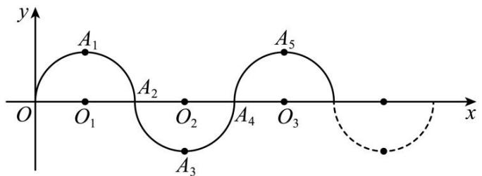

text_image

y
A₁
O₁ O₂ O₃
A₂
A₃
A₄
A₅
x

A. (2026,0)

B. (2026, -2)

C. (2024,0)

D. (2026, 2)

【答案】D

【分析】本题主要考查了规律型：点的坐标，解题关键是观察各点坐标，找出规律．先写出 $A_{1}$ ， $A_{2}$ ， $A_{3}$ ， $A_{4}$ ， $A_{5}$ 的坐标，然后观察点的坐标可知：各个点的横坐标是各A点的下标的2倍，纵坐标分别为2，0，-2，0，且每4个点一循环，按照此规律解答即可.

【详解】解：观察图形可知： $A_{1}(2,2)$ ， $A_{2}(4,0)$ ， $A_{3}(6,-2)$ ， $A_{4}(8,0)$ ，……

各个点的横坐标是各 A 点的下标的2倍，纵坐标分别为2，0，-2，0，且每4个点一循环，

$\therefore A_{1023}$ 的横坐标为2026,

$$
\because 1 0 1 3 \div 4 = 2 5 3 \dots 1,
$$

$\therefore A_{1013}$ 的纵坐标为2，

$\therefore A_{1013}$ 的坐标为(2026,2),

故选：D.

11. （24-25 七年级下·河南洛阳·期中）如图，一只小蚂蚁在平面直角坐标系中按图中路线进行“爬楼梯”运动，第 1 次它从原点运动到点(1,0)，第 2 次运动到点(1,1)，第 3 次运动到点(2,1)...按这样的规律，经过第 2025 次运动后，蚂蚁的坐标（）

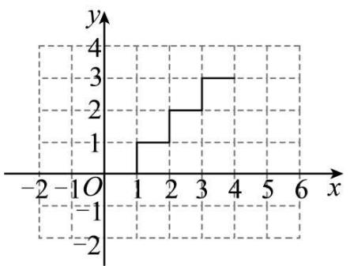

line

| x | y |
|---|---|
| 1 | 1 |
| 2 | 2 |
| 3 | 3 |
| 4 | 3 |

A. (1012,1011)

B. (1013,1012)

C. (1011,1011)

D. (1012,1012)

【答案】B

【分析】本题考查了规律型—点的坐标，解决本题的关键是观察点的运动变化发现规律，总结规律.分别找到横坐标和纵坐标的变化规律，再算出2025与2的商和余数，继而得解.

【详解】解：第1次：(1,0)，

第2次：(1,1)，

第 3 次: (2,1),

第 4 次: (2,2),

第 5 次: (3,2),

...，

则横坐标是从 1 开始的正整数，每个正整数出现 2 次，

纵坐标是从 0 开始的正整数，其中只有 0 出现 1 次，其余数出现 2 次，

则 $2025 \div 2 = 1012.....1$ ,

∴第 2025 次的坐标是：(1013,1012)，

故选：B.

12. （24-25 九年级下·山东烟台·期中）在直角坐标系中，点 $A_{1}$ 从原点出发，沿如图所示的方向运动，到达位置的坐标依次为： $A_{2}(1,0)$ ， $A_{3}(1,1)$ ， $A_{4}(-1,1)$ ， $A_{5}(-1,-1)$ ， $A_{6}(2,-1)$ ， $A_{7}(2,2)$ …，若到达终点 $A_{n}(-505,-505)$ ，则 n 的值为（）

flowchart

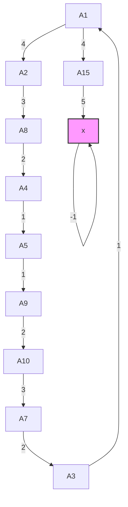

A. 2021

B. 2023

C. 2025

D. 2027

【答案】A

【分析】本题考查了坐标规律探究，探索出坐标变化的规律是解题的关键.

寻找在第四象限内的点的坐标变化的规律：第 m 个点 $A_{n}(-m,-m)$ ， $n=4m+1$ ，即可求解。

【详解】解：在第四象限内的点：

第 1 个点 $A_{5}(-1,-1)$ ， $5=4\times1+1$

第2个点 $A_{9}(-2, - 2)$ ， $9 = 4\times 2 + 1$

第 3 个点 $A_{13}(-3,-3)$ ， $13=4\times3+1$

...

第 m 个点 $A_{n}(-m,-m)$ ， $n=4m+1$

$$
\because A _ {n} (- 5 0 5, - 5 0 5)
$$

$$
\therefore n = 4 \times 5 0 5 + 1 = 2 0 2 1,
$$

故选：A.

13. （24-25 七年级下·重庆·期中）如图，在平面直角坐标系中，各点坐标分别为 $A_{0}(-1,0),A_{1}(0,1)$ ， $A_{2}(1,0)$ ， $A_{3}(-1,-2),A_{4}(-3,0),A_{5}(0,3),A_{6}(3,0)$ ， $A_{7}(-1,-4),A_{8}(-5,0)$ ，…，则依据图中所示的规律，点 $A_{12}$ 的坐标为（）

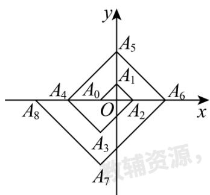

text_image

y
A5
A1
A4 A0 O A2 A6 x
A8
A3
A7
辅资源，

A. $(-7,0)$

B. $(-8,0)$

C. $(-9,0)$

D. $(-1, - 6)$

【答案】A

【分析】本题考查了点坐标的规律探索，正确归纳类推出一般规律是解题关键．观察出一般规律：点 $A_{4n-2}$ 的坐标为 $A_{4n-2}(2n-1,0)$ ，且点 $A_{4n-2}$ 与点 $A_{4n-4}$ 关于y轴对称（其中，n为正整数），再根据 $14=4\times4-2$ ， $12=4\times4-4$ 即可得.

【详解】解：由图可知， $A_{2}(1,0)$ ，即 $A_{4\times1-2}\left(\frac{4\times1-2}{2},0\right)$ ，且点 $A_{2}$ 与点 $A_{0}(-1,0)$ 关于y轴对称，

$A_{6}(3,0)$ ，即 $A_{4\times2-2}\left(\frac{4\times2-2}{2},0\right)$ ，且点 $A_{6}$ 与点 $A_{4}(-3,0)$ 关于y轴对称，

$A_{10}(5,0)$ ，即 $A_{4\times3-2}\left(\frac{4\times3-2}{2},0\right)$ ，且点 $A_{10}$ 与点 $A_{8}(-5,0)$ 关于y轴对称，

归纳类推得：点 $A_{4n-2}$ 的坐标为 $A_{4n-2}\left(\frac{4n-2}{2},0\right)$ ，即为 $A_{4n-2}(2n-1,0)$ ，且点 $A_{4n-2}$ 与点 $A_{4n-4}$ 关于y轴对称（其中，n为正整数），

$$
\because 1 4 = 4 \times 4 - 2, 1 2 = 4 \times 4 - 4,
$$

∴点 $A_{14}$ 的坐标为 $A_{14}(2\times4-1,0)$ ，即为 $A_{14}(7,0)$ ，且点 $A_{14}$ 与点 $A_{12}$ 关于y轴对称，

∴点 $A_{12}$ 的坐标为 $A_{12}(-7,0)$ ,

故选：A.

14. （24-25 七年级下·广东广州·期中）如图，在平面直角坐标系中，将 $\triangle ABO$ 绕点 $A$ 顺时针旋转到 $\triangle AB_{1}C_{1}$ 的位置，点 $B$ 、 $O$ 分别落在点 $B_{1}$ 、 $C_{1}$ 处，点 $B_{1}$ 在 $x$ 轴上，再将 $\triangle AB_{1}C_{1}$ 绕点 $B_{1}$ 顺时针旋转到 $\triangle A_{1}B_{1}C_{2}$ 的位置，点 $C_{2}$ 在 $x$ 轴上，将 $\triangle A_{1}B_{1}C_{2}$ 绕点 $C_{2}$ 顺时针旋转到 $\triangle A_{2}B_{2}C_{2}$ 的位置，点 $A_{2}$ 在 $x$ 轴上，依次进行下去…，若点 $OA = 1.5$ ， $OB = 2$ ， $AB = 2.5$ ，则点 $B_{2025}$ 的坐标为（）

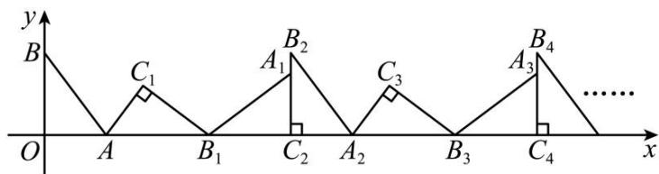

text_image

y
B
C₁
A₁ B₂
O A B₁ C₂ A₂ C₃ A₃ B₄ C₄ ...... x

A. (6070,0)

B. (6072,2)

C. (6076,0)

D. (6078,2)

【答案】C

【分析】此题考查了点的坐标规律变换，结合图形求出 $B_{1}$ ， $B_{2}$ ， $B_{3}$ ， $B_{4}$ ，…，发现当下标为偶数时，其横坐标是下标的3倍，根据这个规律可以求得 $B_{2025}$ 的坐标.

【详解】解：∵OA = 1.5，OB = 2，AB = 2.5，

$$
\therefore O B _ {1} = O A + A B _ {1} = O A + A B = 1. 5 + 2. 5 = 4,
$$

$$
\therefore B _ {1} (4, 0),
$$

同理可求： $B_{2}(6,2)$ ， $B_{3}(10,0)$ ， $B_{4}(12,2)$ ， $B_{5}(16,0)$ ，…，

∴当下标为偶数时，其横坐标是下标的 3 倍，纵坐标为 2，当下标为奇数时，横坐标比前一个下标为偶数的横坐标大 4，纵坐标为 0，

$\therefore B_{2024}$ 的横坐标为： $2024 \times 3 = 6072$ ，

$\therefore B_{2025}$ 的坐标为(6076,0).

故选 C.

15. （2025·广东广州·一模）如图，在平面直角坐标系中，一动点从原点出发，按如下方向依次不断移动，得到 $A_{1}(0,-2)$ 、 $A_{2}(1,-2)$ 、 $A_{3}(1,0)$ 、 $A_{4}(1,2)$ 、 $A_{5}(2,2)$ 、 $A_{6}(2,0)$ ……，那么 $A_{2025}$ 的坐标为（）

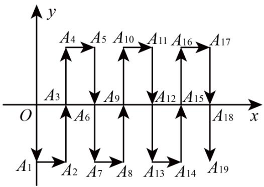

flowchart

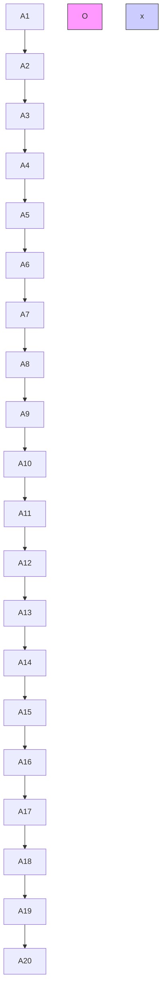

A. (674,0)

B. (674,2)

C. (675,2)

D. (675,0)

【答案】D

【分析】本题考查点坐标规律探索，仔细观察图象，找到点的坐标的变化规律是解答的关键.
根据题意得到每移动3次，动点向右移动1个单位，此时动点回到x轴，根据 $2025 \div 3 = 675$ 得到 $A_{2025}$ (675,0)，即可得到答案.

【详解】解：根据题意得，每移动3次，动点向右移动1个单位，此时动点回到x轴，纵坐标为0，

$$
\because 2 0 2 5 \div 3 = 6 7 5,
$$

$$
\therefore A _ {2 0 2 5} (6 7 5, 0),
$$

故选：D.

16. （2025·山东临沂·二模）在平面直角坐标系中，有点 $P(x,y)$ 和点 $P'(-y+1,x+2)$ 两点，我们把点 $P'$ 叫做点P的伴随点．已知点 $A_{1}$ 的伴随点为 $A_{2}$ ，点 $A_{2}$ 的伴随点为 $A_{3}$ ，点 $A_{3}$ 的伴随点为 $A_{4}$ ，…这样依次得到点 $A_{1},A_{2},A_{3},\ldots,A_{n},\ldots$ ．若点 $A_{1}$ 的坐标为(2,5)，则点 $A_{2025}$ 的坐标为\_\_\_\_．

【答案】(2,5)

【分析】本题主要考查了实数的运算，新定义下的规律问题，解题的关键是根据题意找出周期规律。根据题意求出点的坐标找出规律，进行总结计算即可。

【详解】解：根据伴随点的定义可得：

$A_{1}(2,5), A_{2}(-4,4), A_{3}(-3,-2), A_{4}(3,-1), A_{5}(2,5), A_{6}(-4,4), A_{7}(-3,-2), A_{8}(3,-1)$

根据周期规律， $A_{1}$ 到 $A_{4}$ 为一个周期，周期为4，

$$
\therefore 2 0 2 5 \div 4 = 5 0 6 \dots 1
$$

所以，点 $A_{2025}$ 的坐标为(2,5)，

故答案为：(2,5).

17. （24-25 七年级下·北京·期中）如图，一动点从(1,0)出发，沿所示方向运动，每当碰到长方形OABC的边时就反弹，反弹后路径与长方形的边所夹锐角为 $45^{\circ}$ ，已知第1次碰到长方形边上的点的坐标为(0,1)，则第5次碰到长方形边上的点的坐标为\_\_\_\_；第2025次碰到长方形边上的点的坐标为\_\_\_\_。

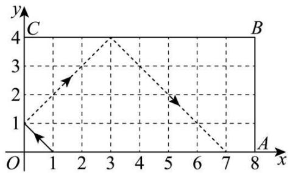

line

| Point | x | y |
|---|---|---|
| 1 | 0 | 1 |
| 2 | 1 | 2 |
| 3 | 3 | 4 |
| 4 | 4 | 3 |
| 5 | 5 | 2 |
| 6 | 6 | 1 |
| 7 | 7 | 0 |
| C | 8 | 0 |
The chart displays a Cartesian coordinate system with x and y axes. The dashed line connects points (1,1), (2,2), (3,4), (4,3), (5,2), and (7,0). Arrows indicate direction of movement along the x-axis.

【答案】 (5,4) (7,0)

【分析】本题考查点的坐标的规律问题，根据图形得出图形变化规律：每碰撞6次回到始点，从而可以得出2025次碰到长方形边上的点的坐标.

【详解】解：根据题意，如图示：

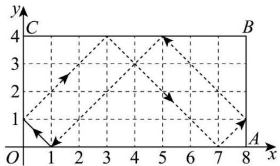

line

| x | y |
|---|---|
| 1 | 0 |
| 2 | 2 |
| 3 | 3 |
| 4 | 3 |
| 5 | 2 |
| 6 | 1 |
| 7 | 0 |
| 8 | 1 |

第 5 次碰到长方形边上的点的坐标为(5,4)，

通过图观察可知，每碰撞6次回到始点.

$$
\because 2 0 2 5 \div 6 = 3 3 7 \dots 3,
$$

∴第 2025 次碰到长方形边上的点的坐标与第三次相同，即坐标为(7,0).

故答案为： $(5,4)$ ， $(7,0)$ .

18. （24-25 七年级下·广西南宁·期中）在平面直角坐标系中，一个智能机器人接到的指令是：从原点 O 出发，按“向上→向右→向下→向右→向下→向右→向上→向右”的方向依次不断移动，每次移动 1 个单位长度，其移动路线如图所示, 第一次移动到点 $A_{1}$ , 第二次移动到点 $A_{2} \ldots$ 第 $n$ 次移动到点 $A_{n}$ , 则点 $A_{2025}$ 的坐标是 \_\_\_\_.

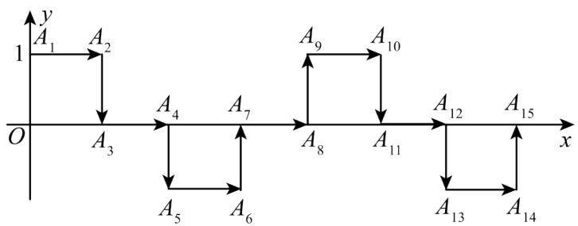

flowchart

```mermaid
graph TD
    A1["A₁"] --> A2["A₂"]
    A2 --> A3["A₃"]
    A3 --> A4["A₄"]
    A4 --> A5["A₅"]
    A5 --> A6["A₆"]
    A6 --> A7["A₇"]
    A7 --> A8["A₈"]
    A8 --> A9["A₉"]
    A9 --> A10["A₁₀"]
    A10 --> A11["A₁₁"]
    A11 --> A12["A₁₂"]
    A12 --> A13["A₁₃"]
    A13 --> A14["A₁₄"]
    A14 --> A15["A₁₅"]
    style A1 fill:#f9f,stroke:#333
    style A2 fill:#f9f,stroke:#333
    style A3 fill:#f9f,stroke:#333
    style A4 fill:#f9f,stroke:#333
    style A5 fill:#f9f,stroke:#333
    style A6 fill:#f9f,stroke:#333
    style A7 fill:#f9f,stroke:#333
    style A8 fill:#f9f,stroke:#333
    style A9 fill:#f9f,stroke:#333
    style A10 fill:#f9f,stroke:#333
    style A11 fill:#f9f,stroke:#333
    style A12 fill:#f9f,stroke:#333
    style A13 fill:#f9f,stroke:#333
    style A14 fill:#f9f,stroke:#333
    style A15 fill:#f9f,stroke:#333
```

【答案】(1012,1)

【分析】本题考查了平面直角坐标系中的点的规律探索问题，仔细观察图形，找出规律是解题的关键。根据题意可得 $A_{1}(0,1)$ ， $A_{2}(1,1)$ ， $A_{3}(1,0)$ ， $A_{4}(2,0)$ ， $A_{5}(2,-1)$ ， $A_{6}(3,-1)$ ，…，由此得出纵坐标规律：以1，1，0，0，-1，-1，0，0的顺序，每8个为一个循环，可求出点 $A_{2025}$ 的纵坐标，然后找出脚标为奇数的点的横坐标的规律，即可求解。

【详解】解：由题意得： $A_{1}(0,1)$ ， $A_{2}(1,1)$ ， $A_{3}(1,0)$ ， $A_{4}(2,0)$ ， $A_{5}(2,-1)$ ， $A_{6}(3,-1)$ ，…，由此得出纵坐标规律：以1，1，0，0，-1，-1，0，0的顺序，每8个为一个循环，

$$
\because 2 0 2 5 \div 8 = 2 5 3 \dots \dots 1,
$$

∴ 点 $A_{2025}$ 的纵坐标为 1，

∵ $A_{1}$ 的横坐标为 0， $A_{3}$ 的横坐标为 1， $A_{5}$ 的横坐标为 2， $A_{7}$ 的横坐标为 3， $A_{9}$ 的横坐标为 4…，由此得： $A_{2025}$ 的横坐标为 $(2025-1) \div 2 = 1012$ ，

$$
\therefore A _ {2 0 2 5} (1 0 1 2, 1).
$$

故答案为: (1012,1).

19. （24-25 七年级下·广东中山·期中）如图，在平面直角坐标系中，有若干个横纵坐标分别为整数的点，其顺序为(1,0)，(2,0)，(2,1)，(1,1)，(1,2)，(2,2)，…，根据这个规律，第 121 个点的坐标为\_\_\_\_。

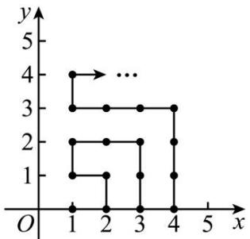

line

| x | y |
|---|---|
| 1 | 4 |
| 2 | 3 |
| 3 | 3 |
| 4 | 3 |
| 5 | 0 |
| 6 | 1 |
| 7 | 2 |
| 8 | 2 |
| 9 | 1 |
| 10 | 1 |
| 11 | 0 |
| 12 | 0 |
| 13 | 0 |
| 14 | 0 |
| 15 | 0 |
| 16 | 0 |
| 17 | 0 |
| 18 | 0 |
| 19 | 0 |
| 20 | 0 |
| 21 | 0 |
| 22 | 0 |
| 23 | 0 |
| 24 | 0 |
| 25 | 0 |
| 26 | 0 |
| 27 | 0 |
| 28 | 0 |
| 29 | 0 |
| 30 | 0 |
| 31 | 0 |
| 32 | 0 |
| 33 | 0 |
| 34 | 0 |
| 35 | 0 |
| 36 | 0 |
| 37 | 0 |
| 38 | 0 |
| 39 | 0 |
| 40 | 0 |
| 41 | 0 |
| 42 | 0 |
| 43 | 0 |
| 44 | 0 |
| 45 | 0 |
| 46 | 0 |
| 47 | 0 |
| 48 | 0 |
| 49 | 0 |
| 50 | 0 |
| ... | ... |
| O | <1 |
| X-axis label: x (positions) and Y-axis label: y (positions). The chart displays a step function with discrete jumps between integer x-values.

【答案】(11,0)

【分析】本题考查点的坐标规律问题，根据图形推导出当 n 为奇数时，第 n 个正方形每条边上有 $(n+1)$ 个点，连同前边所有正方形共有 $(n+1)^{2}$ 个点，且终点为 $(1,n)$ ；当 n 为偶数时，第 n 个正方形每条边上有 $(n+1)$

个点，连同前边所以正方形共有 $(n+1)^{2}$ 点，且终点为 $(n+1,0)$ 。由规律可知，第10个正方形的终点为(11,0)，前10个正方形一共有 $(10+1)^{2}=121$ 个点，据此可得答案。

【详解】解：由图可知：第一个正方形每条边上有2个点，共有 $4=2^{2}$ 个点，且终点为(1,1);

第二个正方形每条边上有 3 个点，连同第一个正方形共有 $9 = 3^{2}$ 个点，且终点为 $(3,0)$ ;

第三个正方形每条边上有 4 个点，连同前两个正方形共有 $16 = 4^{2}$ 个点，且终点为 $(1,3)$ ;

第四个正方形每条边上有 5 个点，连同前三个正方形共有 $25 = 5^{2}$ 个点，且终点为 $(5,0)$ ;

故当 n 为奇数时，第 n 个正方形每条边上有 $(n+1)$ 个点，连同前边所有正方形共有 $(n+1)^{2}$ 个点，且终点为 $(1,n)$ ;

当 n 为偶数时，第 n 个正方形每条边上有 $(n+1)$ 个点，连同前边所以正方形共有 $(n+1)^{2}$ 点，且终点为 $(n+1,0)$ .

由规律可知, 第 10 个正方形的终点为 $(11,0)$ , 前 10 个正方形一共有 $(10 + 1)^{2} = 121$ 个点, 则第 121 个点是第 10 个正方形的终点为 $(11,0)$ .

故答案为：(11,0).

20. （24-25 七年级下·广东东莞·期中）如图，在平面直角坐标系中，长方形 ABCD 从位于第二象限的初始位置（点 A 和原点 O 重合）开始顺时针向右做“无滑动”翻转，前 5 次翻转得到的位置如图所示，跟踪点 A 的坐标可以得到点． $A_{1}(0,0)$ ， $A_{2}(2,2)$ ， $A_{3}(5,1)$ ， $A_{4}(6,0)$ ，…，那么第六次翻转后点 $A_{6}$ 的坐标为 \_\_\_\_.

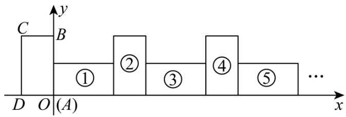

text_image

C
B
①
②
③
④
⑤
...
D O(A) x

【答案】(8,2)

【分析】本题考查平面直角坐标系中图形的旋转与坐标变化规律, 解题关键是分析长方形每次翻转时顶点 A 坐标的变化情况, 找出循环规律并据此计算指定次数翻转后点 A 的坐标.

分析长方形每次翻转后点 A 坐标的变化，找出每 4 次翻转的循环规律，确定一个循环内点 A 横向移动距离，计算 6 次翻转包含的循环数和剩余翻转次数，根据循环规律和剩余翻转次数，计算第六次翻转后点 A 的横、纵坐标.

【详解】解：设长方形长为a，宽为b.

第一次翻转，以长方形右上角顶点为旋转中心，点A位置没变，为 $A_{1}(0,0)$ .

第二次翻转，以长方形新的右上角顶点为旋转中心，点A从 $A_{1}$ 到 $A_{2}(2,2)$ ，此时横向移动距离等于长方形的

长a=2，纵向移动距离等于长方形的宽b=2。

第三次翻转，以长方形新的右上角顶点为旋转中心，横向移动距离等于长方形的宽 $b = 2$ ，纵向移动距离为 $b - 1 = 1$ 得到 $A_{3}(2 + 2 + 1,2 - 1) = (5,1)$ ：

第四次翻转，横向移动距离为a-1=1，纵向移动距离为-1，得到 $A_{4}(5+1,1-1)=(6,0)$ ，

可以看出每4次翻转为一个循环，一个循环内点A横向总共移动 $2+2+1+1=6$ 个单位.

因为 $6 \div 4 = 1 \cdots 2$ ，即经过1个完整循环后，又进行了2次翻转.

经过1个完整循环，点A横向移动了6个单位.

新的一轮前两次翻转：第一次翻转横向移动距离等于长方形的长2，第二次翻转横向移动距离等于长方形的宽2，纵向移动距离等于长方形的宽2．

所以 $A_{6}$ 的横坐标为 $6+2=8$ ，纵坐标为2，

即 $A_{6}$ 坐标是(8,2)；

故答案为：(8,2).

21. （2025·山东德州·一模）平面直角坐标系中，我们把横，纵坐标都是整数，且横，纵坐标之和大于0的点称为“和点”。将某“和点”平移，每次平移的方向取决于该点横、纵坐标之和除以3所得的余数（当余数为0时，向右平移；当余数为1时，向上平移；当余数为2时，向左平移），每次平移1个单位长度。

例：“和点” $P(2,1)$ 按上述规则连续平移3次后，到达点 $P_{3}(2,2)$ ，其平移过程如下：

$$
P (2, 1) \underset {\text {余} 0} {\overset {\text {右}} {\rightarrow}} P _ {1} (3, 1) \underset {\text {余} 1} {\overset {\text {上}} {\rightarrow}} P _ {2} (3, 2) \underset {\text {余} 2} {\overset {\text {左}} {\rightarrow}} P _ {3} (2, 2)
$$

若“和点”Q 按上述规则连续平移 16 次后，到达点 $Q_{16}(-1,9)$ ，则点Q的坐标为 \_\_\_\_.

【答案】(5,1)或(7,1)

【分析】本题考查了点的坐标规律探索，先分别计算余0，1，2的平移，得出规律点Q先向右平移1个单位，再按照向上、向左，向上、向左不断重复的规律平移，由此计算即可得解，正确得出规律是解此题的关键.

【详解】解：根据已知：点 $P_{3}(2,2)$ 横、纵坐标之和除以3所得的余数为1，继而向上平移1个单位得到 $P_{4}(2,3)$ ，此时横、纵坐标之和除以3所得的余数为2，继而向左平移1个单位得到 $P_{5}(1,3)$ ，此时横、纵坐标之和除以3所得的余数为1，又向上平移1个单位……，因此发现规律为若“和点”横、纵坐标之和除以3所得的余数为0时，先向右平移1个单位，再按照向上、向左，向上、向左不断重复的规律平移；

若“和点”Q按上述规则连续平移16次后，到达点 $Q_{16}(-1,9)$ ，则按照“和点” $Q_{16}$ 反向运动16次即可，可以分为两种情况：

① $Q_{16}$ 先向右1个单位得到 $Q_{15}(0,9)$ ，此时横、纵坐标之和除以3所得的余数为0，应该是 $Q_{15}$ 向右平移1个单

位得到 $Q_{16}$ ，故矛盾，不成立；

② $Q_{16}$ 先向下1个单位得到 $Q_{15}(-1,8)$ ，此时横、纵坐标之和除以3所得的余数为1，则应该向上平移1个单位得到 $Q_{16}$ ，故符合题意，

∴ 点 $Q_{16}$ 先向下平移，再向右平移，当平移到第15次时，共计向下平移了8次，向右平移了7次，此时坐标为 $(-1+7,9-8)$ ，即(6,1)，

∴ 最后一次若向右平移则为(7,1)，若向左平移则为(5,1)，

故答案为：(7,1)或(5,1).

22. （24-25 七年级下·四川泸州·期中）如图，将边长为1的正方形OAPB沿x轴正方向连续翻转2025次，点P 依次落在点 $P_{1}$ ， $P_{2}$ ， $P_{3}$ … $P_{2025}$ 的位置，则 $P_{2025}$ 的坐标为\_\_\_\_。

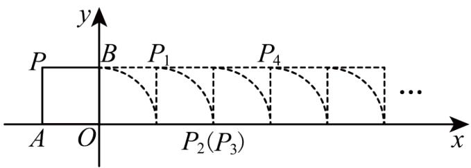

text_image

y
P B P₁ P₄
A O P₂(P₃) ... x

【答案】(2025,1)

【分析】本题主要考查了规律型点的坐标，解题关键是根据各点坐标和题意，找出坐标规律.

根据图形得出点的坐标变化规律，再根据规律求解.

【详解】解：由图可知： $P_{1}(1,1)$ ， $P_{2}(2,0)$ ， $P_{3}(2,0)$ ， $P_{4}(3,1)$ ， $P_{5}(5,1)$ ， $P_{6}(6,0)$ ， $P_{7}(6,0)$ ， $P_{8}(7,1)$ …，故相对位置每4个一循环，

$$
\because 2 0 2 5 \div 4 = 5 0 6 \text {   余   } 1,
$$

$\therefore P_{2025}$ 在506次循环后位置与 $P_{1}$ 对应，

由 $P_{1}(1,1)$ ， $P_{5}(5,1)$ ，…可知，其横坐标即为翻转次数，

$\therefore P_{2025}$ 的横坐标为：2025，

则坐标为：(2025,1)，

故答案为：(2025,1).

23. （24-25 八年级下·河北廊坊·期中）如图，在平面直角坐标系上有一点 $P(1,0)$ ，点 $P$ 第 1 次向上跳动 1 个单位长度至点 $P_{1}(1,1)$ ，紧接着第 2 次向左跳动 2 个单位长度至点 $P_{2}(-1,1)$ ，第 3 次向上跳动 1 个单位长度，第 4 次向右跳动 3 个单位长度，第 5 次又向上跳动 1 个单位长度，第 6 次向左跳动 4 个单位长度，…，依此规律跳动下去，点 $P$ 第 2025 次跳动至 $P_{2025}$ ，则 $P_{2025}$ 的坐标是 \_\_\_\_.

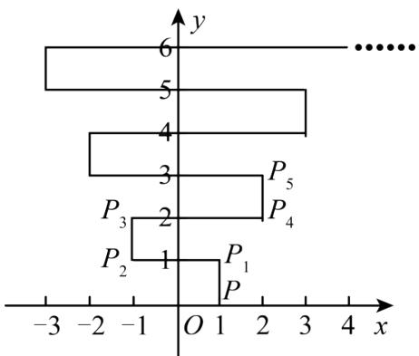

line

| Point | Value |
|---|---|
| P1 | 1 |
| P2 | 1 |
| P3 | 2 |
| P4 | 2 |
| P5 | 3 |
| ... | ... |
| ... | ... |
| ... | ... |
| ... | ... |
| ... | ... |
| ... | ... |
| ... | ... |
| ... | ... |
| ... | ... |
| ... | ... |
| ... | ... |
| ... | ... |
| ... | ... |
| ... | ... |
| ... | ... |
| ... | ... |
| ... | ... |
| ... | ... |
| ... | ... |
| ... | ... |
| ... |... |
| ... | ... |
| ... | ... |
| ... | ... |
| ... | ... |
| ... | ... |
| ... | ... |
| ... | ... |
| ... | ... |
| ... | ... |
| ... | ... |
| ... | ... |
| ... | ... |
| ... | ... |
| ... | ... |
| ... | ... |
| ... | ... |
| ... | ... |
| ... | ... |
| ... | ... |
| ... | ..., 
| P1, P2, P3, P4, P5 | 1, 2, 3, 4, 5, 6, 7, 8, 9, 10, 11, 12, 13, 14, 15, 16, 17, 18, 19, 20, 21, 22, 23, 24, 25, 26, 27, 28, 29, 30, 31, 32, 33, 34, 35, 36, 37, 38, 39, 40, 41, 42, 43, 44, 45, 46, 47, 48, 49, 50, 51, 52, 53, 54, 55, 56, 57, 58, 59, 60, 61, 62, 63, 64, 65, 66, 67, 68, 69, 70, 71, 72, 73, 74, 75, 76, 77, 78, 79, 80, 81, 82, 83, 84, 85, 86, 87, 88, 89, 90, 91, 92, 93, 94, 95, 96, 97, 98, 99, 100 |

【答案】(507,1013)

【分析】本题是坐标规律题，根据题意找出坐标的规律是解题关键．设第n次跳动至点 $P_{n}$ ，根据点 $P_{n}$ 坐标的变化发现： $P_{4n}(n+1,2n)$ ， $P_{4n+1}(n+1,2n+1)$ ， $P_{4n+2}(-n-1,2n+1)$ ， $P_{4n+3}(-n-1,2n+2)$ ，其中n为自然数，即可求解.

【详解】解：设第n次跳动至点 $P_{n}$ ，

由题意可知， $P_{1}(1,1)$ 、 $P_{2}(-1,1)$ 、 $P_{3}(-1,2)$ 、 $P_{4}(2,2)$ 、 $P_{5}(2,3)$ 、 $P_{6}(-2,3)$ 、 $P_{7}(-2,4)$ 、 $P_{8}(3,4)$ 、 $P_{9}(3,5)$ ……观察发现， $P_{4n}(n+1,2n)$ ， $P_{4n+1}(n+1,2n+1)$ ， $P_{4n+2}(-n-1,2n+1)$ ， $P_{4n+3}(-n-1,2n+2)$ ，其中n为自然数，

$$
\because 2 0 2 5 = 5 0 6 \times 4 + 1,
$$

$$
\therefore P _ {2 0 2 5} (5 0 7, 1 0 1 3),
$$

故答案为：(507,1013).

24. （24-25 八年级上·江苏宿迁·期末）如图，以O为顶点，x轴正半轴上选点 $A_{1}$ 、 $A_{4}$ 、 $A_{7}$ 、…作边长为1、2、3、…的正方形 $OA_{1}A_{2}A_{3}$ 、 $OA_{4}A_{5}A_{6}$ 、 $OA_{7}A_{8}A_{9}$ 、…，其中 $A_{3}$ 、 $A_{6}$ 、 $A_{9}$ 、…在y轴的正半轴上．则点 $A_{2025}$ 的坐标为\_\_\_\_．

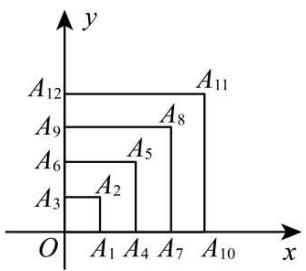

bar

| Label | x | y |
|---|---|---|
| A1 | 0 | 0 |
| A2 | 1 | 0 |
| A3 | 2 | 0 |
| A4 | 3 | 0 |
| A5 | 4 | 0 |
| A6 | 5 | 0 |
| A7 | 6 | 0 |
| A8 | 7 | 0 |
| A9 | 8 | 0 |
| A10 | 9 | 0 |
| A11 | 10 | 0 |
| A12 | 11 | 0 |

【答案】(0,675)

【分析】本题考查了点的坐标变化规律，读懂题意找到点坐标的规律是解题的关键．根据可知每三个点一圈进行循环，得到点 $A_{2025}$ 位于y轴上，再根据y轴上点的坐标规律即可得到.

【详解】解：∵2025÷3=675，

∴ 点 $A_{2025}$ 位于y轴上，

根据图中规律， $A_{3}(0,1)$ ， $A_{6}(0,2)$ ， $A_{9}(0,3)$ ，…，

$$
\therefore A _ {3 n} (0, n)
$$

$\therefore A_{2025}$ 坐标为(0,675),

故答案为：(0,675).

25. （24-25 八年级上·山东青岛·期末）如图，在平面直角坐标系xOy中，A, B, C, D是边长为1个单位长度的小正方形的顶点，开始时，顶点A, B依次放在点(1,0)，(2,0)的位置，然后向右滚动，第1次滚动使点C落在点(3,0)的位置，第2次滚动使点D落在点(4,0)的位置…，按此规律滚动下去，则第2024次滚动后，顶点A的坐标是\_\_\_\_。

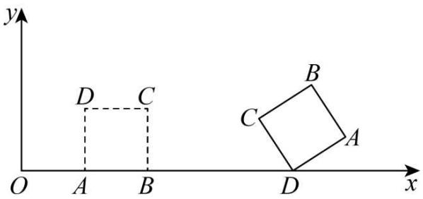

text_image

y
D C
O A B
B
C
A
D
x

【答案】(2025,0)

【分析】本题主要考查了点的坐标变化规律，解题关键是找到点A随滚动次数的变化规律.

列举几次滚动后的A点坐标，找到滚动次数与点A坐标之间的规律，进而求出第2024次滚动后顶点A的坐标.

【详解】解：第1次滚动点 $A_{1}$ 的坐标为(2,1)，

第 2 次滚动点 $A_{2}$ 的坐标为(4,1),

第 3 次滚动点 $A_{3}$ 的坐标为(5,0)，

第 4 次滚动点 $A_{4}$ 的坐标为(5,0)，

滚动 5 次后， $A(4 + 2,1)$ ;

滚动 6 次后， $A(4 + 4,1)$ ;

滚动 7 次后， $A(4 + 5,0)$ ;

滚动 8 次后， $A(4 + 5,0)$ ;

∴每滚动4次一个循环，

$$
\therefore A _ {4 n + 1} (4 n + 2, 1), A _ {4 n + 2} (4 n + 4, 1), A _ {4 n + 3} (4 n + 5, 0), A _ {4 n + 4} (4 n + 5, 0),
$$

$$
\because 2 0 2 4 \div 4 = 5 0 6,
$$

$$
\therefore A _ {2 0 2 4} (4 \times 5 0 5 + 5, 0),
$$

即 $A_{2024}(2025,0)$ ,

故答案为：(2025,0).

26. （24-25 七年级上·山东淄博·期末）如图所示，在平面直角坐标系中，已知 $A_{1}(1,2), A_{2}(2,1), A_{3}(3,3), A_{4}(4,2)$ ，…，以此类推， $A_{2025}$ 的坐标为 \_\_\_\_.

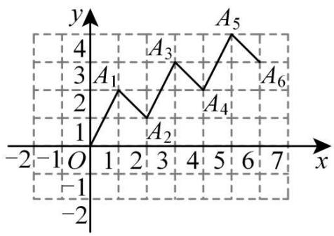

line

| Point | x | y |
|---|---|---|
| A1 | 0 | 3 |
| A2 | 1 | 2 |
| A3 | 2 | 4 |
| A4 | 3 | 3 |
| A5 | 4 | 5 |
| A6 | 5 | 4 |

【答案】(2025,1014)

【分析】本题考查点的坐标规律探究，观察可知，点 $A_{n}$ 的横坐标为n， $A_{2n-1}$ 的纵坐标为 $n+1$ ，进行求解即可.

【详解】解：∵ $A_{1}(1,2)$ , $A_{2}(2,1)$ , $A_{3}(3,3)$ , $A_{4}(4,2)$ , $A_{5}(5,4)$ ，…，

∴点 $A_{n}$ 的横坐标为n， $A_{2n-1}$ 的纵坐标为 $n+1$ ，

$$
\because 2 0 2 5 = 1 0 1 3 \times 2 - 1,
$$

$\therefore A_{2025}$ 的横坐标为 2025，纵坐标为： $1013 + 1 = 1014$ ，即： $A_{2025}$ 的坐标为(2025,1014);

故答案为：(2025,1014).

27. （24-25 七年级下·全国·单元测试）如图，点 $A(0,1)$ ，点 $A_{1}(2,0)$ ，点 $A_{2}(3,2)$ ，点 $A_{3}(5,1)$ ，…按照这样的规律下去，点 $A_{2025}$ 的坐标为\_\_\_\_。

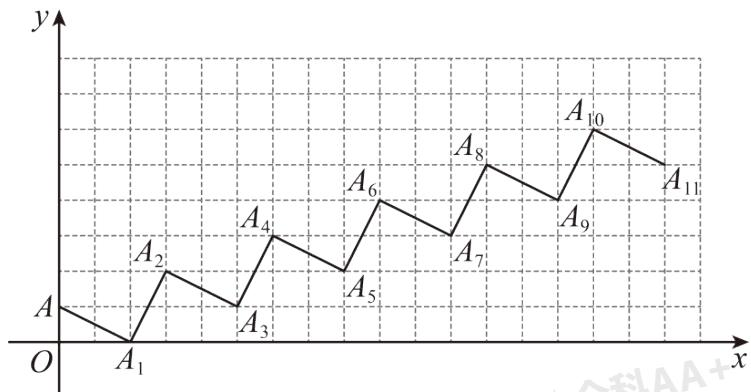

line

| Point | x | y |
|---|---|---|
| A₁ | 0 | 0 |
| A₂ | 1 | 0.8 |
| A₃ | 2 | 0.6 |
| A₄ | 3 | 0.9 |
| A₅ | 4 | 0.7 |
| A₆ | 5 | 1.0 |
| A₇ | 6 | 0.8 |
| A₈ | 7 | 1.1 |
| A₉ | 8 | 0.9 |
| A₁₀ | 9 | 1.5 |
| A₁₁ | 10 | 1.4 |

【答案】(3038,1012)

【分析】本题主要考查点的坐标规律，根据图形准确找到平面内点的坐标的变化规律是解答此题的关键. 观察图形可得奇数点的规律为： $A_{1}(2,0)$ ， $A_{3}(5,1)$ ， $A_{5}(8,2)$ …． $A_{2n-1}(3n-1,n-1)$ ，偶数点的规律为：

$A_{2}(3,2)$ ， $A_{4}(6,3)$ ， $A_{6}(9,4)$ …… $A_{2n}(3n,n+1)$ ，根据规律求解即可.

【详解】解：由图象可得，奇数点的规律为： $A_{1}(2,0)$ ， $A_{3}(5,1)$ ， $A_{5}(8,2)$ …． $A_{2n-1}(3n-1,n-1)$ ，偶数点的规律为： $A_{2}(3,2)$ ， $A_{4}(6,3)$ ， $A_{6}(9,4)$ …… $A_{2n}(3n,n+1)$ ，

∵2025 是奇数，即2n-1 = 2025，

$$
\therefore n = 1 0 1 3,
$$

$\therefore A_{2025}$ 的坐标为(3038,1012),

故答案为：(3038,1012).

28. (24-25 九年级上·浙江宁波·期中) 如图, 已知点 $A(-1,2)$ , 将矩形ABOC沿 $x$ 轴正方向连续滚动 2024 次, 点 $A$ 依次落在点 $A_{1}, A_{2}, A_{3}, \cdots, A_{2024}$ 的位置, 则点 $A_{2024}$ 的坐标为 \_\_\_\_.

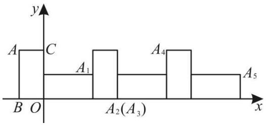

text_image

y
A C
A₁ A₄
B O A₂(A₃) x
A₅

【答案】(3035,2)

【分析】本题主要考查规律型：点的坐标，图形的旋转变换，解题关键是找到图形在旋转的过程中，点坐标变化规律进而求解．先求出 $A_{1}(2,1),A_{2}(3,0),A_{3}(3,0),A_{4}(5,2),A_{5}(8,1)$ ，…，找到规律求解.

【详解】解：由题意得：从 $A$ 开始翻转，当旋转到 $A_{4}$ ，时， $A$ 回到矩形的起始位置，所以为一个循环，故坐标变换规律为 4 次一循环.

$$
\begin{array}{l} \because A _ {1} (2, 1), A _ {2} (3, 0), A _ {3} (3, 0), A _ {4} (5, 2), A _ {5} (8, 1), A _ {6} (9, 0), A _ {7} (9, 0), A _ {8} (1 1, 2), A _ {9} (1 4, 1), A _ {1 0} (1 5, 0), A _ {1 1} (1 5, 0), A _ {1 2} \\ (1 7, 2), \dots , \end{array}
$$

$$
\therefore A _ {4 n + 1} (6 n + 2, 1), A _ {4 n + 2} (6 n + 3, 0), A _ {4 n + 3} (6 n + 3, 0), A _ {4 n + 4} (6 n + 5, 2),
$$

当 $A_{2024}$ 时，即 $4n+4=2024$ ，解得：n=505，

∴横坐标为 $6n+5=6\times505+5=3035$ ，纵坐标为2，

则 $A_{2024}$ 的坐标(3035,2)，

故答案为：(3035,2).

29. （24-25 八年级上·山西大同·期中）如图，正方形ABCD的顶点A(1,1),B(3,1)，规定把正方形ABCD“先沿x轴翻折，再向左平移1个单位”为一次变换，这样连续经过2024次变换后，正方形ABCD的顶点C的坐标为\_\_\_\_。

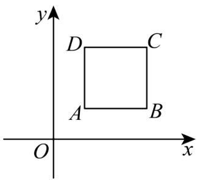

text_image

y
D C
A B
O x

【答案】(-2021,3)

【分析】本题考查了坐标与图形变化-对称、规律型-点的坐标、坐标与图形变化-平移，解决本题的关键是掌握对称性质和平移旋转的性质．根据正方形ABCD的顶点A(1,1)，B(3,1)，可得AB=BC=2，C(3,3)，先求出前几次变换后C点的坐标，一次变换即点C的横坐标向左移一个单位，又翻折次数为奇数时点C的纵坐标为-3，翻折次数为偶数时点C的纵坐标为3，再求出点C的横坐标即可.

【详解】解：∵正方形ABCD的顶点A(1,1)，B(3,1)，

$$
\therefore A B = B C = 2,
$$

$$
\therefore C (3, 3),
$$

一次变换后，点 $C_{1}$ 的坐标为(2,-3)，

二次变换后，点 $C_{2}$ 的坐标为(1,3)，

三次变换后，点 $C_{3}$ 的坐标为 $(0,-3)$ ，

...

通过观察得：翻折次数为奇数时点C的纵坐标为-3，翻折次数为偶数时点C的纵坐标为3，

∵ 2024是偶数，

∴ 点C的纵坐标为3，其横坐标为 $3-2024 \times 1 = -2021$ .

∴ 经过 2024 次变换后，正方形 ABCD 的顶点 C 的坐标为 $(-2021,3)$ .

故答案为： $(-2021,3)$ .

30. （24-25 八年级上·全国·专题练习）如图，在直角坐标系中，第一次将 $\triangle AOB$ 变换成 $\triangle OA_1B_1$ ，第二次将 $\triangle OA_1B_1$ 变换成 $\triangle OA_2B_2$ ，第三次将 $\triangle OA_2B_2$ 变换成 $\triangle OA_3B_3$ ，已知 $A(1,4)$ ， $A_1(2,4)$ ， $A_2(4,4)$ ， $A_3(8,4)$ ； $B(2,0)$ ， $B_1(4,0)$ ， $B_2(8,0)$ ， $B_3(16,0)$ .

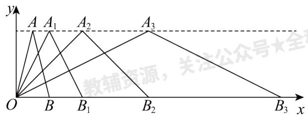

text_image

y
A A₁ A₂ A₃
教辅资源，关注公众号★全
O B B₁ B₂ B₃ x

(1) 观察每次变换前后的三角形有何变化, 找出规律, 按此变化规律再将 $\triangle OA_{3}B_{3}$ 变换成 $\triangle OA_{4}B_{4}$ , 则 $A_{4}$ 的坐标是 , $B_{4}$ 的坐标是 .

(2) 若按 (1) 找到的规律将 $\triangle OAB$ 进行了 $n$ 次变换, 得到 $\triangle OA_{n}B_{n}$ , 比较每次变换中三角形顶点有何变化, 找出规律, 推测 $A_{n}$ 的坐标是 , $B_{n}$ 的坐标是 .

【答案】

(16,4)

(32,0)

$(2^{n},4)$

$(2^{n + 1},0)$

【分析】本题考查了坐标与图形性质，坐标规律，仔细观察图形中点的横坐标的变化并熟悉2的指数次幂是解题的关键.

（1）根据规律直接写出结论；

(2) 由题可得, $A$ 点的规律为: 可以发现它们各点坐标的关系为横坐标是 $2^{n}$ , 纵坐标都是 4; $B$ 点坐标规律为: 可以发现它们各点坐标的关系为横坐标是 $2^{n+1}$ , 纵坐标都是 0, 再写出 $A_{n}$ , $B_{n}$ 的坐标即可.

【详解】（1）解：∵A(1,4)， $A_{1}(2,4)$ ， $A_{2}(4,4)$ ， $A_{3}(8,4)$ ，

$\therefore A_{4}$ 的横坐标为： $2^{4} = 16$ ，纵坐标为：4，

∴点 $A_{4}$ 的坐标为：(16,4)，

又∵ $B(2,0)$ ， $B_{1}(4,0)$ ， $B_{2}(8,0)$ ， $B_{3}(16,0)$ ，

$\therefore B_{4}$ 的横坐标为： $2^{5}=32$ ，纵坐标为：0，

∴点 $B_{4}$ 的坐标为：(32,0)，

故答案为：(16,4)，(32,0);

(2) 解: 由 $A(1,4)$ , $A_{1}(2,4)$ , $A_{2}(4,4)$ , $A_{3}(8,4)$ , 可以发现它们各点坐标的关系为横坐标是 $2^{n}$ , 纵坐标都是 4,

故 $A_{n}$ 的坐标为： $(2^{n},4)$ ，

由 $B(2,0)$ ， $B_{1}(4,0)$ ， $B_{2}(8,0)$ ， $B_{3}(16,0)$ ，可以发现它们各点坐标的关系为横坐标是 $2^{n+1}$ ，纵坐标都是0，故 $B_{n}$ 的坐标为： $(2^{n+1},0)$ ，

故答案为： $(2^{n},4)$ ， $(2^{n+1},0)$ .