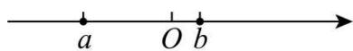
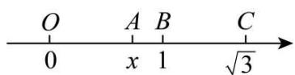
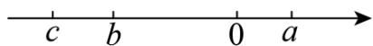
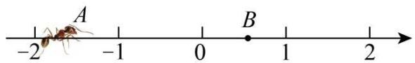

# 专题03 二次根式的化简求值（举一反三专项训练）

【北师大版 2024】

# 题型归纳

【题型1 运用二次根式的非负性求值】....2

【题型 2 运用数形结合法化简】....2

【题型3 运用乘法公式求值】....3

【题型4 运用分母有理化求值】 3

【题型 5 运用整体代入法化简求值】....4

【题型 6 运用配方法化简双重二次根式】....4

# 举一反三

# 【题型1 运用二次根式的非负性求值】

【例 1】（24-25 九年级下·广东茂名·阶段练习）已知实数a满足 $|2025-a|+\sqrt{a-2026}=a$ ，那么 $a-2025^{2}$ 的值是（）

A. 2023

B. 2024

C. 2025

D. 2026

【变式 1-1】（24-25 八年级下·河南焦作·期中）化简： $\sqrt{(x+5)^{2}}-(\sqrt{x+2})^{2}=$ \_\_\_\_.

【变式 1-2】(24-25 七年级下·河南商丘·期中)若 a, b 为实数，且满足 $\left|a-4\right|+\sqrt{-b^{2}}=0$ ，则 $\sqrt{4a-b}$ 的值为 \_\_\_\_.

【变式 1-3】已知△ABC的三边长a、b、c满足 $a+b-2\sqrt{a-1}-4\sqrt{b-2}=3\sqrt{c+3}-\frac{1}{2}c-8$ ，求△ABC的周长.

# 【题型 2 运用数形结合法化简】教辅资源,关注公众号·全科AA+

【例 2】（24-25 八年级下·重庆九龙坡·期末）实数a，b表示的数在数轴上如图所示，化简求值： $\sqrt{a^{2}-2ab+b^{2}}+\sqrt{9a^{2}-6a+1}-\sqrt{b^{2}}+|a+b|$ ，其中 $a=1-\sqrt{5}$ ， $b=\sqrt{5}-2$

【变式 2-1】（23-24 八年级上·甘肃兰州·期末）如图，在数轴上点 O、B、C 所表示的实数分别为 0、1、 $\sqrt{3}$ ，若点 B 到点 C 的距离与点 O 到点 A 的距离相等，设点 A 表示的实数为 x.

(1)写出实数x的值;   
(2)求 $(x - \sqrt{3})^{2024}$ .

【变式 2-2】（23-24 八年级上·四川成都·期中）（1）已知数 a, b, c 在数轴上的位置如图所示：

化简： $\sqrt{b^2} - |a - b| + \sqrt{(c - a)^2} - |c|$

（2）已知 $x=\sqrt{5}-2$ ，求 $(9+4\sqrt{5})x^{2}-(\sqrt{5}+2)x+4$ 的值.

【变式 2-3】(24-25 八年级上·江西吉安·期中) 如图, 一只蚂蚁从点 $A$ 沿数轴向右爬 2 个单位长度到达点 $B$ , 点 $C$ 与点 $B$ 关于原点对称, 若 $A 、 B 、 C$ 三点表示的数分别为 $a 、 b 、 c$ , 且 $a = -\sqrt{2}$ .

text_image

A
-2 -1 0 1 2

(1)则 $b=$ ，c=， $bc+6=$ ；  
(2)化简： $\sqrt{a^2} +\sqrt{b^2} +\sqrt{c^2}.$

【题型 3 运用乘法公式求值】 教辅资源,关注公众号·全科AA+

【例 3】（2024 八年级下·浙江·专题练习）已知 $a=\sqrt{5}+2$ ， $b=\sqrt{5}-2$ ，求下列式子的值：

(1) $a^{2}b+ab^{2}$ ;   
(2) $a^{2}-3ab+b^{2}$ ;   
(3)(a-2)(b-2).

【变式 3-1】（24-25 八年级下·广东广州·期中）已知 $a=\sqrt{11}+4,\quad b=\sqrt{11}-4$ ，求 $a^{2}+b^{2}+ab$ 的值.

【变式 3-2】（23-24 八年级下·广东珠海·期中）已知 $x=\sqrt{5}-2,\quad y=\sqrt{5}+2$ .

(1)求 $x^{2}+2xy+v^{2}$ 的值.  
(2)求 $\frac{y}{x}-\frac{x}{y}$ 的值.

【变式 3-3】（22-23 七年级下·黑龙江大庆·期中）已知 $x_{1}=\frac{2}{\sqrt{5}+\sqrt{3}}$ ， $x_{2}=\sqrt{5}+\sqrt{3}$ ，求 $x_{1}^{2}+x_{2}^{2}$ 的值

# 【题型4 运用分母有理化求值】

【例 4】（24-25 八年级下·四川达州·阶段练习）若 $x^{2}-x-2=0$ ，则 $\frac{x^{2}-x+2\sqrt{3}}{(x^{2}-x)^{2}-1+\sqrt{3}}$ 的值为（）

A. 1

B. $\frac{1}{3}$

C. $\frac{2\sqrt{3}}{3}$

D. $\sqrt{3}$ 或 $\frac{\sqrt{3}}{3}$

【变式 4-1】（23-24 八年级上·山东枣庄·阶段练习）已知 $x=\sqrt{2}+1$ ，则代数式 $\frac{x+1}{x-1}$ 的值为（）

A. $\sqrt{2} + 1$

B. $\sqrt{2}+2$

C. 3

D. $\sqrt{2}-1$

【变式 4-2】（22-23 八年级上·上海·阶段练习）规定 $a \otimes b = \frac{a - b}{a + b}$ ，则 $\sqrt{5} \otimes 2$ 的值是（）

A. $5+4\sqrt{5}$

B. $5-4\sqrt{5}$

C. $9-4\sqrt{5}$

D. $9+4\sqrt{5}$

【变式4-3】若 $x = \frac{\sqrt{5} + 1}{2}$ ，则 $\frac{x^2 - x + 1 + 2\sqrt{3}}{(x^2 - x)^2 + 2 + \sqrt{3}}$ 的值等于（）

A. $\frac{2\sqrt{3}}{3}$

B. $\frac{\sqrt{3}}{3}$

C. $\sqrt{3}$

D. $\frac{\sqrt{3}}{3}$ 或 $\sqrt{3}$

# 【题型 5 运用整体代入法化简求值】教辅资源,关注公众号·全科AA+

【例5】已知 $a + b = -8$ ， $ab = 12$ 求 $\sqrt{\frac{b}{a}} +\sqrt{\frac{a}{b}}$ 的值

【变式 5-1】（24-25 八年级下·福建龙岩·期中）已知 $a+b=\sqrt{3}+\sqrt{2}$ ， $ab=\sqrt{6}$ ，分别求下列代数式的值：

(1) $\frac{1}{a+b}$   
(2) $a^{2}+b^{2}$

【变式 5-2】（23-24 八年级下·湖北武汉·阶段练习）已知 $x-y=-2\sqrt{3}$ ，xy=1，求下列代数式的值：

(1) $x^{2}-xy+y^{2}$ ;   
(2) $\frac{y}{x}+\frac{x}{y}.$

【变式 5-3】请阅读下列材料:

问题：已知 $x=\sqrt{5}+2$ ，求代数式 $x^{2}-4x-7$ 的值．小敏的做法是：根据 $x=\sqrt{5}+2$ 得 $(x-2)^{2}=5$ ， $\therefore x^{2}-4x+4=5$ ，得 $x^{2}-4x=1$ ．把 $x^{2}-4x$ 作为整体代入得 $x^{2}-4x-7=1-7=-6$ ．即：把已知条件适当变形，再整体代入解决问题．请你用上述方法解决下面问题：

(1)已知 $x=\sqrt{5}-2$ ，求代数式 $x^{2}+4x-10$ 的值；  
(2)已知 $x = \frac{\sqrt{5} - 1}{2}$ ，求代数式 $x^{3} + x^{2} + 1$ 的值.

# 【题型6 运用配方法化简双重二次根式】

【例 6】（24-25 八年级下·山西吕梁·期中）阅读与思考

形如 $\sqrt{m \pm 2\sqrt{n}}$ 的化简，只要我们找到两个数 $a, b$ 使 $a + b = m, ab = n$ ，这样 $(\sqrt{a})^2 + (\sqrt{b})^2 = m, \sqrt{a} \cdot \sqrt{b} = \sqrt{n}$ ，那么便有 $\sqrt{m \pm 2\sqrt{n}} = \sqrt{(\sqrt{a} \pm \sqrt{b})^2} = \sqrt{a} \pm \sqrt{b} (a > b)$ .

例如：化简 $\sqrt{7+4\sqrt{3}}$ .

解：首先把 $\sqrt{7 + 4\sqrt{3}}$ 化为 $\sqrt{7 + 2\sqrt{12}}$ ，这里 $m = 7$ ， $n = 12$

由于 $4+3=7,\quad4\times3=12,\quad(\sqrt{4})^{2}+(\sqrt{3})^{2}=7,\quad\sqrt{4}\cdot\sqrt{3}=\sqrt{12},$

$$
\therefore \sqrt {7 + 4 \sqrt {3}} = \sqrt {7 + 2 \sqrt {1 2}} = \sqrt {(\sqrt {4} + \sqrt {3}) ^ {2}} = 2 + \sqrt {3}.
$$

仿照上面例题，解决下列问题．教辅资源,关注公众号·全科AA+

(1) $\sqrt{8+2\sqrt{15}}$ .   
(2) $\sqrt{11-2\sqrt{30}}$ .   
(3) $\sqrt{7+\sqrt{40}}$ .

【变式 6-1】（22-23 八年级下·安徽芜湖·阶段练习）计算 $\sqrt{\sqrt{2025}-\sqrt{2024}}$ 的结果是 \_\_\_\_.

【变式 6-2】（23-24 八年级下·辽宁大连·阶段练习）观察、思考、解答：

$$
(\sqrt {2} - 1) ^ {2} = (\sqrt {2}) ^ {2} - 2 \times 1 \times \sqrt {2} + 1 ^ {2} = 2 - 2 \sqrt {2} + 1 = 3 - 2 \sqrt {2}
$$

反之 $3-2\sqrt{2}=2-2\sqrt{2}+1=(\sqrt{2}-1)^{2}$

$$
\therefore 3 - 2 \sqrt {2} = (\sqrt {2} - 1) ^ {2}
$$

$$
\therefore \sqrt {3 - 2 \sqrt {2}} = \sqrt {2} - 1
$$

(1)仿上例，化简： $\sqrt{6-2\sqrt{5}}=$ ， $\sqrt{7-\sqrt{48}}=$ \_\_\_\_.  
(2)若 $\sqrt{a + 2\sqrt{b}} = \sqrt{m} +\sqrt{n}$ ，则 $m$ 、 $n$ 与 $a$ 、 $b$ 的关系是什么？并说明理由；

【变式 6-3】若a为 $\sqrt{6-2\sqrt{5}}$ 的小数部分，b为 $\sqrt{7-4\sqrt{3}}$ 的小数部分，则 $\frac{1}{a}\frac{1}{b}$ 的值为\_\_\_\_.