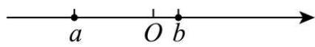
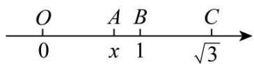
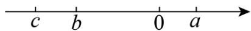
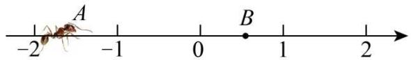

# 专题 03 二次根式的化简求值（举一反三专项训练）

【北师大版 2024】

# 题型归纳

【题型1 运用二次根式的非负性求值】....1

【题型 2 运用数形结合法化简】....2

【题型3 运用乘法公式求值】 5

【题型4 运用分母有理化求值】 8

【题型 5 运用整体代入法化简求值】....9

【题型 6 运用配方法化简双重二次根式】....12

# 举一反三

# 【题型1 运用二次根式的非负性求值】

【例 1】（24-25 九年级下·广东茂名·阶段练习）已知实数a满足 $|2025-a|+\sqrt{a-2026}=a$ ，那么 $a-2025^{2}$ 的值是（）

A. 2023

B. 2024

C. 2025

D. 2026

【答案】D

【分析】本题考查二次根式有意义的条件、去绝对值运算、利用算术平方根解方程等知识，先由二次根式有意义的条件的得到 $a\geq2026$ ，进而化简绝对值，得到 $\sqrt{a-2026}=2025$ ，利用算术平方根解方程即可得到答案，熟练掌握二次根式有意义的条件、去绝对值运算等知识是解决问题的关键.

【详解】解：∵ $\sqrt{a-2026}$ 中 $a-2026\geq0$ ,

∴a≥2026，则2025-a<0，

$\because|2025-a|+\sqrt{a-2026}=a,$

$\therefore a-2025+\sqrt{a-2026}=a$ ，即 $\sqrt{a-2026}=2025$ ，

$\therefore a-2026=2025^{2}$ ，则 $a-2025^{2}=2026$ ，

故选：D.

【变式 1-1】（24-25 八年级下·河南焦作·期中）化简： $\sqrt{(x+5)^{2}}-(\sqrt{x+2})^{2}=$ \_\_\_\_.

【答案】3

【分析】本题考查二次根式的性质和有意义的条件；先根据二次根式有意义的条件得到 $x+2\geq0$ ，即可得到 $x+5>0$ ，然后根据二次根式的性质化简，然后合并解题即可.

【详解】解：由题可得 $x+2\geq0$ ，

$$
\therefore x + 5 > 0,
$$

$$
\therefore \sqrt {(x + 5) ^ {2}} - (\sqrt {x + 2}) ^ {2} = x + 5 - (x + 2) = 3,
$$

故答案为：3.

【变式 1-2】（24-25 七年级下·河南商丘·期中）若 a, b 为实数，且满足 $\left|a-4\right|+\sqrt{-b^{2}}=0$ ，则 $\sqrt{4a-b}$ 的值为 \_\_\_\_.

【答案】4

【分析】本题考查了绝对值和算术平方根的非负性，求一个数的算术平方根，掌握绝对值和算术平方根的非负性是解题关键.

根据绝对值和算术平方根的非负性得到 $\left\{\begin{aligned}a-4&=0\\ -b^{2}&=0\end{aligned}\right.$ ，求出a,b，再代入进行求算术平方根.

【详解】解：∵ $|a-4|+\sqrt{-b^{2}}=0,\quad|a-4|\geq0,\quad\sqrt{-b^{2}}\geq0,$

$$
\therefore \left\{ \begin{array}{l} a - 4 = 0 \\ - b ^ {2} = 0 \end{array} \right.,
$$

$$
\therefore a = 4, b = 0,
$$

$$
\therefore \sqrt {4 a - b} = \sqrt {4 \times 4 - 0} = 4,
$$

故答案为：4.

【变式 1-3】已知△ABC的三边长a、b、c满足 $a+b-2\sqrt{a-1}-4\sqrt{b-2}=3\sqrt{c+3}-\frac{1}{2}c-8$ ，求△ABC的周长.

【答案】14

【详解】解： $\because a+b-2\sqrt{a-1}-4\sqrt{b-2}=3\sqrt{c+3}-\frac{1}{2}c-8,$

$$
\therefore (\sqrt {a - 1} - 1) ^ {2} + (\sqrt {b - 2} - 2) ^ {2} + \frac {1}{2} (\sqrt {c + 3} - 3) ^ {2} = 0,
$$

$$
\therefore \sqrt {a - 1} - 1 = 0, \sqrt {b - 2} - 2 = 0, \sqrt {c + 3} - 3 = 0,
$$

$$
\therefore a = 2, \quad b = 6, \quad c = 6,
$$

$$
\therefore a + b + c = 1 4.
$$

# 【题型 2 运用数形结合法化简】

【例 2】（24-25 八年级下·重庆九龙坡·期末）实数a，b表示的数在数轴上如图所示，化简求值： $\sqrt{a^{2}-2ab+b^{2}}+\sqrt{9a^{2}-6a+1}-\sqrt{b^{2}}+|a+b|$ ，其中 $a=1-\sqrt{5}$ ， $b=\sqrt{5}-2$

【答案】1-5a-b， $4\sqrt{5}-2$

【分析】本题考查实数与数轴，二次根式的化简求值，根据点在数轴上的位置，判断式子的符号，根据二次根式的性质和绝对值的意义，化简后，再代值计算即可.

【详解】解：由数轴可知：a<0<b，|a|>b，

$$
\begin{array}{l} \therefore a - b <   0, a + b <   0, \\ \because a = 1 - \sqrt {5}, b = \sqrt {5} - 2, \\ \therefore 3 a - 1 = 3 - 3 \sqrt {5} - 1 = 2 - 3 \sqrt {5} <   0, \\ \therefore \sqrt {a ^ {2} - 2 a b + b ^ {2}} + \sqrt {9 a ^ {2} - 6 a + 1} - \sqrt {b ^ {2}} + | a + b | \\ = \sqrt {(a - b) ^ {2}} + \sqrt {(3 a - 1) ^ {2}} - \sqrt {b ^ {2}} + | a + b | \\ = b - a + 1 - 3 a - b - a - b \\ = 1 - 5 a - b; \\ \end{array}
$$

∴ $a=1-\sqrt{5}$ ， $b=\sqrt{5}-2$ 时，原式 $=1-5(1-\sqrt{5})-(\sqrt{5}-2)=1-5+5\sqrt{5}-\sqrt{5}+2=4\sqrt{5}-2$ .

【变式 2-1】（23-24 八年级上·甘肃兰州·期末）如图，在数轴上点 O、B、C 所表示的实数分别为 0、1、 $\sqrt{3}$ ，若点 B 到点 C 的距离与点 O 到点 A 的距离相等，设点 A 表示的实数为 x.

(1)写出实数x的值;   
(2)求 $(x - \sqrt{3})^{2024}$ .

【答案】(1) $\sqrt{3}-1$

(2)1

【分析】本题主要考查了二次根式的混合运算、数轴上两点间的距离、一元一次方程的应用等知识点，正确表示出线段长是解题的关键.

（1）利用点B到点C的距离与点O到点A的距离相等，并结合A，B，C的位置列关于x的一元一次方程求解即可：  
（2）直接把（1）所得 $x$ 的值代入进行计算即可.

【详解】（1）解：∵点 O, B, C 所表示的数分别为 0, 1, $\sqrt{3}$ ,

$$
\therefore B C = \sqrt {3} - 1,
$$

∵点 B 到点 C 的距离与点 O 到点 A 的距离相等，

$\therefore OA=\sqrt{3}-1$ ，即 $x-0=\sqrt{3}-1$ ，

$$
\therefore x = \sqrt {3} - 1.
$$

（2）解： $(x-\sqrt{3})^{2024}=(\sqrt{3}-1-\sqrt{3})^{2024}=(-1)^{2024}=1$

【变式 2-2】（23-24 八年级上·四川成都·期中）（1）已知数 a, b, c 在数轴上的位置如图所示：

化简： $\sqrt{b^2} - |a - b| + \sqrt{(c - a)^2} - |c|$

（2）已知 $x=\sqrt{5}-2$ ，求 $(9+4\sqrt{5})x^{2}-(\sqrt{5}+2)x+4$ 的值.

【答案】（1）0

(2) 4

【分析】本题考查了实数与数轴，二次根式的性质、化简与混合运算，准确化简各式是解题的关键.

（1）先化简各式，然后再进行计算即可；  
（2）先计算出 $x^{2}$ 的值，再代入求值即可.

【详解】解：（1）由数轴知：c<b<0<a，

$$
\therefore a - b > 0, c - a <   0
$$

$$
\therefore \sqrt {b ^ {2}} - | a - b | + \sqrt {(c - a) ^ {2}} - | c |
$$

$$
= - b - (a - b) - (c - a) - (- c)
$$

$$
= - b - a + b + a - c + c
$$

$$
= 0;
$$

(2) 由 $x=\sqrt{5}-2$ ,

$$
\therefore x ^ {2} = (\sqrt {5} - 2) ^ {2} = 5 - 4 \sqrt {5} + 4 = 9 - 4 \sqrt {5},
$$

$$
\therefore (9 + 4 \sqrt {5}) x ^ {2} - (\sqrt {5} + 2) x + 4
$$

$$
= (9 + 4 \sqrt {5}) (9 - 4 \sqrt {5}) - (\sqrt {5} + 2) (\sqrt {5} - 2) + 4
$$

$$
= 8 1 - 8 0 - (5 - 4) + 4
$$

$$
= 4.
$$

【变式 2-3】（24-25 八年级上·江西吉安·期中）如图，一只蚂蚁从点 A 沿数轴向右爬 2 个单位长度到达点 B，点 C 与点 B 关于原点对称，若 A、B、C 三点表示的数分别为 a、b、c，且 $a=-\sqrt{2}$ .

text_image

A
-2 -1 0 1 2

(1)则 $b=$ \_\_\_\_， $c=$ \_\_\_\_， $bc+6=$ \_\_\_\_；  
(2)化简： $\sqrt{a^2} +\sqrt{b^2} +\sqrt{c^2}.$

【答案】(1) $-\sqrt{2}+2$ ; $\sqrt{2}-2$ ; $4\sqrt{2}$

(2) $4-\sqrt{2}$

【分析】本题主要考查了实数与数轴，二次根式的混合计算，化简二次根式：

（1）根据数轴上两点距离计算公式可得 $b=a+2=-\sqrt{2}+2$ ，再由点C与点B关于原点对称，可得 $c=-b=\sqrt{2}-2$ ，据此计算 $bc+6$ 的结果即可；  
（2）根据（1）所求，先化简二次根式，再根据二次根式的加减计算法则求解即可.

【详解】（1）解；∵一只蚂蚁从点 A 沿数轴向右爬 2 个单位长度到达点 B， $a=-\sqrt{2}$ ，

$$
\therefore b = a + 2 = - \sqrt {2} + 2;
$$

∵点 C 与点 B 关于原点对称，

$$
\begin{array}{l} \therefore c = - b = \sqrt {2} - 2, \\ \therefore b c + 6 \\ = (\sqrt {2} - 2) (- \sqrt {2} + 2) + 6 \\ = - (2 - 4 \sqrt {2} + 4) + 6 \\ = - 6 + 4 \sqrt {2} + 6 \\ = 4 \sqrt {2}, \\ \end{array}
$$

故答案为： $-\sqrt{2}+2$ ; $\sqrt{2}-2$ ; $4\sqrt{2}$ ;

(2) 解: $\sqrt{a^2} + \sqrt{b^2} + \sqrt{c^2}$

$$
\begin{array}{l} = \sqrt {(- \sqrt {2}) ^ {2}} + \sqrt {(- \sqrt {2} + 2) ^ {2}} + \sqrt {(\sqrt {2} - 2) ^ {2}} \\ = \sqrt {2} + 2 - \sqrt {2} + 2 - \sqrt {2} \\ = 4 - \sqrt {2}. \\ \end{array}
$$

# 【题型3 运用乘法公式求值】

【例 3】（2024 八年级下·浙江·专题练习）已知 $a=\sqrt{5}+2$ ， $b=\sqrt{5}-2$ ，求下列式子的值：

(1) $a^{2}b+ab^{2};$   
(2) $a^{2}-3ab+b^{2}$ ;

(3)(a-2)(b-2).

【答案】(1) $2\sqrt{5}$

(2) $78 - 30\sqrt{5}$   
(3) $5-4\sqrt{5}$

【分析】此题考查二次根式的化简求值，因式分解和整式乘法运算，掌握利用提公因式法因式分解和多项式乘多项式法则是解决此题的关键.

（1）先求出ab和 $a+b$ ，然后将原式因式分解代入求值即可；  
(2) 利用完全平方公式变形得出答案;  
（3）利用多项式乘多项式法则将原式展开，代入求值即可.

【详解】（1）解：∵ $a=\sqrt{5}+2,b=\sqrt{5}-2$ ,

$$
\begin{array}{l} \therefore a b = (\sqrt {5} + 2) (\sqrt {5} - 2) = 1, \quad a + b = (\sqrt {5} + 2) + (\sqrt {5} - 2) = 2 \sqrt {5}, \\ \therefore a ^ {2} b + a b ^ {2} = a b (a + b) = 1 \times 2 \sqrt {5} = 2 \sqrt {5}; \\ \end{array}
$$

(2) 解: $a^{2}-30b+b^{2}$

$$
\begin{array}{l} = (a + b) ^ {2} - 2 a b - 3 0 b \\ = (2 \sqrt {5}) ^ {2} - 2 \times 1 - 3 0 \times (\sqrt {5} - 2) \\ = 2 0 - 2 - 3 0 \sqrt {5} + 6 0 \\ = 7 8 - 3 0 \sqrt {5}; \\ \end{array}
$$

（3）解： $(a-2)(b-2)$

$$
\begin{array}{l} = a b - 2 (a + b) + 4 \\ = 1 - 2 \times 2 \sqrt {5} + 4 \\ = 5 - 4 \sqrt {5}. \\ \end{array}
$$

【变式 3-1】（24-25 八年级下·广东广州·期中）已知 $a=\sqrt{11}+4,\quad b=\sqrt{11}-4$ ，求 $a^{2}+b^{2}+ab$ 的值.

【答案】49

【分析】本题主要考查了二次根式的混合运算，先求出 $a+b$ ，ab的值，再根据 $a^{2}+b^{2}+ab=(a+b)^{2}-ab$ 代值计算即可得到答案.

【详解】解：∵ $a=\sqrt{11}+4,\quad b=\sqrt{11}-4,$

$$
\begin{array}{l} \therefore a + b = \sqrt {1 1} + 4 + \sqrt {1 1} - 4 = 2 \sqrt {1 1}, a b = (\sqrt {1 1} + 4) \times (\sqrt {1 1} - 4) = 1 1 - 1 6 = - 5, \\ \therefore a ^ {2} + b ^ {2} + a b \\ = (a ^ {2} + b ^ {2} + 2 a b) - a b \\ \end{array}
$$

$$
\begin{array}{l} = (a + b) ^ {2} - a b \\ = (2 \sqrt {1 1}) ^ {2} - (- 5) \\ = 4 4 + 5 \\ = 4 9. \\ \end{array}
$$

【变式 3-2】（23-24 八年级下·广东珠海·期中）已知 $x=\sqrt{5}-2,\quad y=\sqrt{5}+2$ .

(1)求 $x^{2}+2xy+y^{2}$ 的值.

(2)求 $\frac{y}{x}-\frac{x}{y}$ 的值.

【答案】(1)20

(2) $8\sqrt{5}$

【分析】（1）根据二次根式的加法法则求出 $x+y$ ，根据完全平方公式把原式变形，代入计算即可；

(2) 根据二次根式的减法法则求出 $x - y$ , 根据二次根式的乘法法则求出 $xy$ , 根据分式的减法法则把原式变形, 代入计算即可.

本题考查的是二次根式的化简求值，掌握二次根式的加减法法则、乘法法则是解题的关键.

【详解】（1）解：∵ $x=\sqrt{5}-2,\quad y=\sqrt{5}+2$

$$
\therefore x + y = (\sqrt {5} - 2) + (\sqrt {5} + 2) = 2 \sqrt {5},
$$

$$
\therefore x ^ {2} + 2 x y + y ^ {2} = (x + y) ^ {2} = (2 \sqrt {5}) ^ {2} = 2 0;
$$

(2) 解: $\because x = \sqrt{5} - 2, y = \sqrt{5} + 2,$

$$
\therefore x - y = (\sqrt {5} - 2) - (\sqrt {5} + 2) = - 4,
$$

$$
\therefore x y = (\sqrt {5} - 2) (\sqrt {5} + 2) = 5 - 4 = 1,
$$

$$
\therefore \frac {y}{x} - \frac {x}{y} = \frac {y ^ {2} - x ^ {2}}{x y} = \frac {(y + x) (y - x) 2 \sqrt {5} \times 4}{x y} = 8 \sqrt {5}.
$$

【变式 3-3】（22-23 七年级下·黑龙江大庆·期中）已知 $x_{1}=\frac{2}{\sqrt{5}+\sqrt{3}}$ ， $x_{2}=\sqrt{5}+\sqrt{3}$ ，求 $x_{1}^{2}+x_{2}^{2}$ 的值

【答案】16

【分析】利用完全平方公式化简求值即可.

【详解】 $\because x_{1}=\frac{2}{\sqrt{5}+\sqrt{3}}=\sqrt{5}-\sqrt{3},\quad x_{2}=\sqrt{5}+\sqrt{3},$

$$
\therefore x _ {1} + x _ {2} = 2 \sqrt {5}, x _ {1} x _ {2} = 2
$$

$$
\therefore x _ {1} ^ {2} + x _ {2} ^ {2} = \left(x _ {1} + x _ {2}\right) ^ {2} - 2 x _ {1} x _ {2} = (2 \sqrt {5}) ^ {2} - 2 \times 2 = 1 6.
$$

【点睛】本题考查二次根式的混合运算，完全平方公式变形求值，解题的关键是熟练掌握二次根式的混合运算法则.

# 【题型4 运用分母有理化求值】

【例 4】（24-25 八年级下·四川达州·阶段练习）若 $x^{2}-x-2=0$ ，则 $\frac{x^{2}-x+2\sqrt{3}}{(x^{2}-x)^{2}-1+\sqrt{3}}$ 的值为（）

A. 1

B. $\frac{1}{3}$

C. $\frac{2\sqrt{3}}{3}$

D. $\sqrt{3}$ 或 $\frac{\sqrt{3}}{3}$

【答案】C

【分析】本题主要考查了分式的化简求值，分母有理化，根据题意得到 $x^{2}-x=2$ ，再把 $x^{2}-x=2$ 整体代入所求式子中计算求解即可.

【详解】解： $\because x^{2}-x-2=0,$

$$
\begin{array}{l} \therefore x ^ {2} - x = 2, \\ \therefore \frac {x ^ {2} - x + 2 \sqrt {3}}{(x ^ {2} - x) ^ {2} - 1 + \sqrt {3}} \\ = \frac {2 + 2 \sqrt {3}}{2 ^ {2} - 1 + \sqrt {3}} \\ = \frac {2 + 2 \sqrt {3}}{3 + \sqrt {3}} \\ = \frac {(2 + 2 \sqrt {3}) (3 - \sqrt {3})}{(3 + \sqrt {3}) (3 - \sqrt {3})} \\ = \frac {6 + 6 \sqrt {3} - 2 \sqrt {3} - 6}{9 - 3} \\ = \frac {2 \sqrt {3}}{3}, \\ \end{array}
$$

故选：C.

【变式 4-1】（23-24 八年级上·山东枣庄·阶段练习）已知 $x=\sqrt{2}+1$ ，则代数式 $\frac{x+1}{x-1}$ 的值为（）

A. $\sqrt{2} + 1$

B. $\sqrt{2} + 2$

C. 3

D. $\sqrt{2}-1$

【答案】A

【分析】将x的值代入代数式中，然后再分母有理化即可.

【详解】解：原式= $\frac{\sqrt{2}+2}{\sqrt{2}}=1+\sqrt{2}$ ;

故选：A.

【点睛】此题考查的是二次根式的分母有理化.

【变式 4-2】（22-23 八年级上·上海·阶段练习）规定 $a \otimes b = \frac{a - b}{a + b}$ ，则 $\sqrt{5} \otimes 2$ 的值是（）

A. $5+4\sqrt{5}$

B. $5-4\sqrt{5}$

C. $9-4\sqrt{5}$

D. $9 + 4\sqrt{5}$

【答案】C

【分析】根据新定义 $a\otimes b=\frac{a-b}{a+b}$ ，直接将 $a=\sqrt{5},b=2$ 代入后，分母有理化即可得到答案.

【详解】解：∵ $a \otimes b = \frac{a - b}{a + b}$ ,

$$
\begin{array}{l} \therefore \sqrt {5} \otimes 2 = \frac {\sqrt {5} - 2}{\sqrt {5} + 2} \\ = \frac {(\sqrt {5} - 2) (\sqrt {5} - 2)}{(\sqrt {5} - 2) (\sqrt {5} + 2)} \\ = \frac {5 - 4 \sqrt {5} + 4}{5 - 4} \\ = 9 - 4 \sqrt {5}, \\ \end{array}
$$

故选：C.

【点睛】本题考查新定义运算，涉及代数式求值、分母有理化，熟练掌握二次根式运算法则是解决问题的关键.

【变式 4-3】若 $x=\frac{\sqrt{5}+1}{2}$ ，则 $\frac{x^{2}-x+1+2\sqrt{3}}{(x^{2}-x)^{2}+2+\sqrt{3}}$ 的值等于（）

A. $\frac{2\sqrt{3}}{3}$

B. $\frac{\sqrt{3}}{3}$

C. $\sqrt{3}$

D. $\frac{\sqrt{3}}{3}$ 或 $\sqrt{3}$

【答案】A

【详解】试题解析： $\because x = \frac{\sqrt{5} + 1}{2}$ ，

$$
\begin{array}{l} \therefore \mathrm{x} ^ {2} - \mathrm{x} \\ = x (x - 1), \\ = \frac {\sqrt {5} + 1}{2} \times \frac {\sqrt {5} - 1}{2}, \\ = 1, \\ = \frac {1 + 1 + 2 \sqrt {3}}{1 + 2 + \sqrt {3}}, \\ = \frac {2 \sqrt {3}}{3}, \\ \end{array}
$$

$$
\therefore \frac {x ^ {2} - x + 1 + 2 \sqrt {3}}{(x ^ {2} - x) ^ {2} + 2 + \sqrt {3}},
$$

故选A.

# 【题型5 运用整体代入法化简求值】

【例5】已知 $a + b = -8$ ， $ab = 12$ 求 $\sqrt{\frac{b}{a}} +\sqrt{\frac{a}{b}}$ 的值

【答案】 $\frac{4}{3}\sqrt{3}$

【分析】本题考查了二次根式的化简求值，算术平方根的非负性，熟练掌握这些数学概念是解题的关键．根据求代数式值中的整体思想，即可解答.

【详解】解： $\because \left(\sqrt{\frac{b}{a}}+\sqrt{\frac{a}{b}}\right)^{2}=\frac{b}{a}+\frac{a}{b}+2=\frac{b^{2}+a^{2}+2ab}{ab}=\frac{(a+b)^{2}}{ab}=\frac{64}{12};$

∴原式= $\sqrt{\frac{64}{12}}=\frac{4}{3}\sqrt{3}$ .

【变式 5-1】（24-25 八年级下·福建龙岩·期中）已知 $a+b=\sqrt{3}+\sqrt{2}$ ， $ab=\sqrt{6}$ ，分别求下列代数式的值：

(1) $\frac{1}{a+b}$

(2) $a^{2}+b^{2}$

【答案】(1) $\sqrt{3} -\sqrt{2}$

(2)5

【分析】本题考查二次根式的混合运算、分母有理化，熟练掌握相关运算法则并正确求解是解答的关键.

（1）利用分母有理化的求解方法求解即可；

(2) 利用完全平方公式和二次根式的运算法则求解即可.

【详解】（1）解：∵ $a+b=\sqrt{3}+\sqrt{2}$ ,

$$
\therefore \frac {1}{a + b} = \frac {1}{\sqrt {3} + \sqrt {2}};
$$

$$
= \frac {\sqrt {3} - \sqrt {2}}{(\sqrt {3} + \sqrt {2}) (\sqrt {3} - \sqrt {2})}
$$

$$
= \sqrt {3} - \sqrt {2};
$$

(2) 解: $\because a + b = \sqrt{3} + \sqrt{2}, ab = \sqrt{6}$ ,

$$
\therefore a ^ {2} + b ^ {2} = (a + b) ^ {2} - 2 a b
$$

$$
= (\sqrt {3} + \sqrt {2}) ^ {2} - 2 \sqrt {6}
$$

$$
= 3 + 2 \sqrt {6} + 2 - 2 \sqrt {6}
$$

$$
= 5.
$$

【变式 5-2】（23-24 八年级下·湖北武汉·阶段练习）已知 $x-y=-2\sqrt{3}$ ，xy=1，求下列代数式的值：

(1) $x^{2}-xy+y^{2}$ ;

(2) $\frac{y}{x}+\frac{x}{y}.$

【答案】(1)13

(2)14

【分析】（1）将原式整理为 $(x-y)^{2}+xy$ ，然后代入求值即可；

（2）将原式整理为 $\frac{(x-y)^{2}+2xy}{xy}$ ，然后代入求值即可.

【详解】（1）解： $x^{2}-xy+y^{2}$

$$
\begin{array}{l} = (x - y) ^ {2} + x y \\ = (- 2 \sqrt {3}) ^ {2} + 1 \\ = 1 2 + 1 \\ = 1 3; \\ \end{array}
$$

(2) 解: $\frac{y}{x} + \frac{x}{y}$

$$
\begin{array}{l} = \frac {x ^ {2} + y ^ {2}}{x y} \\ = \frac {(x - y) ^ {2} + 2 x y}{x y} \\ = \frac {(- 2 \sqrt {3}) ^ {2} + 2}{1} \\ = 1 2 + 2 \\ = 1 4. \\ \end{array}
$$

【点睛】本题主要考查了二次根式混合运算、运用完全平方公式进行运算等知识，熟练掌握相关运算法则是解题关键.

【变式 5-3】请阅读下列材料:

问题：已知 $x=\sqrt{5}+2$ ，求代数式 $x^{2}-4x-7$ 的值．小敏的做法是：根据 $x=\sqrt{5}+2$ 得 $(x-2)^{2}=5$ ， $\therefore x^{2}-4x+4=5$ ，得 $x^{2}-4x=1$ ．把 $x^{2}-4x$ 作为整体代入得 $x^{2}-4x-7=1-7=-6$ ．即：把已知条件适当变形，再整体代入解决问题．请你用上述方法解决下面问题：

(1)已知 $x=\sqrt{5}-2$ ，求代数式 $x^{2}+4x-10$ 的值；

(2)已知 $x=\frac{\sqrt{5}-1}{2}$ ，求代数式 $x^{3}+x^{2}+1$ 的值.

【答案】(1)-9

(2) $\frac{\sqrt{5}+1}{2}$

【分析】（1）本题主要考查了完全平方公式的应用、整体思想等知识点，根据完全平方公式求出 $x^{2}+4x=1$ ，然后代入计算即可；掌握整体思想是解题的关键；

(2) 本题主要考查了二次根式的乘法、完全平方公式等知识点根据二次根式的乘法法则、完全平方公式计算可得 $x^{2} = \frac{3 - \sqrt{5}}{2}, x^{3} = \sqrt{5} - 2$ ，然后整体代入计算即可；灵活运用相关运算法则是解题的关键。

【详解】（1）解：∵ $x=\sqrt{5}-2$ ，

$$
\therefore (x + 2) ^ {2} = 5,
$$

$$
\therefore x ^ {2} + 4 x + 4 = 5,
$$

$$
\therefore x ^ {2} + 4 x = 1,
$$

$$
\therefore x ^ {2} + 4 x - 1 0 = 1 - 1 0 = - 9.
$$

(2) 解: $\because x = \frac{\sqrt{5} - 1}{2}$ ,

$$
\therefore x ^ {2} = \left(\frac {\sqrt {5} - 1}{2}\right) ^ {2} = \frac {3 - \sqrt {5}}{2},
$$

$$
\therefore x ^ {3} = x \cdot x ^ {2} = \frac {\sqrt {5} - 1}{2} \times \frac {3 - \sqrt {5}}{2} = \sqrt {5} - 2,
$$

$$
\therefore x ^ {3} + x ^ {2} + 1 = \sqrt {5} - 2 + \frac {3 - \sqrt {5}}{2} = \frac {\sqrt {5} + 1}{2}.
$$

# 【题型6 运用配方法化简双重二次根式】

【例 6】（24-25 八年级下·山西吕梁·期中）阅读与思考

形如 $\sqrt{m \pm 2\sqrt{n}}$ 的化简，只要我们找到两个数 $a, b$ 使 $a + b = m, ab = n$ ，这样 $(\sqrt{a})^2 + (\sqrt{b})^2 = m, \sqrt{a} \cdot \sqrt{b} = \sqrt{n}$ ，那么便有 $\sqrt{m \pm 2\sqrt{n}} = \sqrt{(\sqrt{a} \pm \sqrt{b})^2} = \sqrt{a} \pm \sqrt{b} (a > b)$ ：

例如：化简 $\sqrt{7+4\sqrt{3}}$ .

解：首先把 $\sqrt{7+4\sqrt{3}}$ 化为 $\sqrt{7+2\sqrt{12}}$ ，这里m=7，n=12。

由于 $4+3=7,\quad4\times3=12,\quad(\sqrt{4})^{2}+(\sqrt{3})^{2}=7,\quad\sqrt{4}\cdot\sqrt{3}=\sqrt{12},$

$$
\therefore \sqrt {7 + 4 \sqrt {3}} = \sqrt {7 + 2 \sqrt {1 2}} = \sqrt {(\sqrt {4} + \sqrt {3}) ^ {2}} = 2 + \sqrt {3}.
$$

仿照上面例题，解决下列问题.

(1) $\sqrt{8+2\sqrt{15}}$ .

(2) $\sqrt{11-2\sqrt{30}}.$

(3) $\sqrt{7+\sqrt{40}}$ .

【答案】(1) $\sqrt{5}+\sqrt{3}$

(2) $\sqrt{6}-\sqrt{5}$

(3) $\sqrt{5}+\sqrt{2}$

【分析】本题考查了复合二次根式的化简，熟练掌握复合二次根式化简的方法是解答本题的关键.

（1）仿照阅读材料中的方法计算即可；  
(2) 仿照阅读材料中的方法计算即可;  
(3) 仿照阅读材料中的方法计算即可.

【详解】（1）解： $\sqrt{8+2\sqrt{15}}=\sqrt{\left(\sqrt{5}+\sqrt{3}\right)^{2}}=\sqrt{5}+\sqrt{3}$ ;

（2）解： $\sqrt{11 - 2\sqrt{30}} = \sqrt{(\sqrt{6} - \sqrt{5})^2} = \sqrt{6} -\sqrt{5};$   
（3）解： $\sqrt{7 + \sqrt{40}} = \sqrt{7 + 2\sqrt{10}} = \sqrt{\left(\sqrt{5} + \sqrt{2}\right)^2} = \sqrt{5} +\sqrt{2}.$

【变式 6-1】（22-23 八年级下·安徽芜湖·阶段练习）计算 $\sqrt{\sqrt{2025}-\sqrt{2024}}$ 的结果是 \_\_\_\_.

【答案】 $\sqrt{23} -\sqrt{22}$

【分析】注意到 $\sqrt{2025}=45$ ，故可将原式化为 $\sqrt{45-2\sqrt{506}}$ ，然后探寻 $45-2\sqrt{506}=(\sqrt{23}-\sqrt{22})^{2}$ ，进而得解.

【详解】解： $\sqrt{\sqrt{2025}-\sqrt{2024}}$

$$
\begin{array}{l} = \sqrt {4 5 - 2 \sqrt {5 0 6}} \\ = \sqrt {(\sqrt {2 3} - \sqrt {2 2}) ^ {2}} \\ = \sqrt {2 3} - \sqrt {2 2}; \\ \end{array}
$$

故答案为： $\sqrt{23}-\sqrt{22}$ .

【点睛】本题考查了二次根式的化简，数字比较大，正确找到 $45-2\sqrt{506}=(\sqrt{23}-\sqrt{22})^{2}$ 是解题的关键.

【变式 6-2】（23-24 八年级下·辽宁大连·阶段练习）观察、思考、解答：

$$
(\sqrt {2} - 1) ^ {2} = (\sqrt {2}) ^ {2} - 2 \times 1 \times \sqrt {2} + 1 ^ {2} = 2 - 2 \sqrt {2} + 1 = 3 - 2 \sqrt {2}
$$

反之 $3-2\sqrt{2}=2-2\sqrt{2}+1=(\sqrt{2}-1)^{2}$

$$
\therefore 3 - 2 \sqrt {2} = (\sqrt {2} - 1) ^ {2}
$$

$$
\therefore \sqrt {3 - 2 \sqrt {2}} = \sqrt {2} - 1
$$

(1)仿上例，化简： $\sqrt{6-2\sqrt{5}}=$ \_\_\_\_ ， $\sqrt{7-\sqrt{48}}=$ \_\_\_\_.

(2)若 $\sqrt{a+2\sqrt{b}}=\sqrt{m}+\sqrt{n}$ ，则m、n与a、b的关系是什么？并说明理由；

【答案】(1) $\sqrt{5}-1$ ， $2-\sqrt{3}$

(2) $m+n=a,\ mn=b;$ 理由见解析

【分析】本题考查了复合二次根式的化简，完全平方公式的应用；

（1）仿照例子，根据完全平方公式的特点化简即可；  
（2）由题意知， $a+2\sqrt{b}=(\sqrt{m}+\sqrt{n})^{2}$ ，用完全平方公式，再进行比较即可确定 m、n 与 a、b 的关系.

【详解】（1）解： $\sqrt{6-2\sqrt{5}}=\sqrt{(\sqrt{5})^{2}-2\times\sqrt{5}\times1+1^{2}}=\sqrt{(\sqrt{5}-1)^{2}}=\sqrt{5}-1;$

$$
\sqrt {7 - \sqrt {4 8}} = \sqrt {2 ^ {2} - 2 \times 2 \times \sqrt {3} + (\sqrt {3}) ^ {2}} = \sqrt {(2 - \sqrt {3}) ^ {2}} = 2 - \sqrt {3};
$$

故答案为： $\sqrt{5}-1,\ 2-\sqrt{3};$

(2) $\because \sqrt{a + 2\sqrt{b}} = \sqrt{m} + \sqrt{n},$

$$
\therefore a + 2 \sqrt {b} = (\sqrt {m} + \sqrt {n}) ^ {2}
$$

即 $a+2\sqrt{b}=m+n+2\sqrt{mn}$ ,

$$
\therefore m + n = a, \quad m n = b
$$

【变式 6-3】若a为 $\sqrt{6-2\sqrt{5}}$ 的小数部分，b为 $\sqrt{7-4\sqrt{3}}$ 的小数部分，则 $\frac{1}{a}\frac{1}{b}$ 的值为\_\_\_\_.

【答案】 $\sqrt{5}-\sqrt{3}/-\sqrt{3}+\sqrt{5}$

【分析】将两个根式分别用完全平方公式进行化简，再代入 $\frac{1}{a}-\frac{1}{b}$ ，即可求解，本题考查了完全平方公式，根式的化简，分母有理化。解题的关键是：熟练掌握配方法，化简根式.

【详解】 $\sqrt{6 - 2\sqrt{5}} = \sqrt{(\sqrt{5})^2 - 2\sqrt{5} + 1^2} = \sqrt{(\sqrt{5} - 1)^2} = \sqrt{5} - 1,$

$$
\because 2 <   \sqrt {5} <   3,
$$

$\therefore1<\sqrt{5}-1<2$ ，整数部分为1，

$$
\therefore a = \sqrt {5} - 1 - 1 = \sqrt {5} - 2,
$$

$$
\sqrt {7 - 4 \sqrt {3}} = \sqrt {2 ^ {2} - 4 \sqrt {3} + (\sqrt {3}) ^ {2}} = \sqrt {(2 - \sqrt {3}) ^ {2}} = 2 - \sqrt {3},
$$

$$
\because 1 <   \sqrt {3} <   2,
$$

$\therefore0<2-\sqrt{3}<1$ ，整数部分为0，

$$
\therefore b = 2 - \sqrt {3} - 0 = 2 - \sqrt {3},
$$

$$
\therefore \frac {1}{a} - \frac {1}{b} = \frac {1}{\sqrt {5} - 2} - \frac {1}{2 - \sqrt {3}} = \frac {\sqrt {5} + 2}{(\sqrt {5} - 2) (\sqrt {5} + 2)} - \frac {2 + \sqrt {3}}{(2 - \sqrt {3}) (2 + \sqrt {3})} = \sqrt {5} - \sqrt {3},
$$

故答案为： $\sqrt{5}-\sqrt{3}$ .