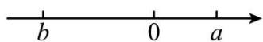
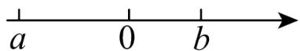
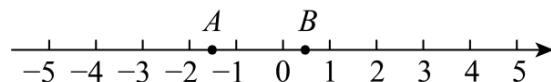

# 专题04 二次根式的双重非负性（40题）（举一反三专项训练）

# 【北师大版 2024】

考卷信息:

本套训练卷共 40 题. 含两大题型, $\sqrt{a}$ 中 $a \geq 0$ 的应用 20 题, $\sqrt{a} \geq 0$ 的应用 20 题. 题型针对性较高, 覆盖面广, 选题有深度, 可加深学生对二次根式的双重非负性的理解!

# 【题型 1 $\sqrt{a}$ 中 $a\geq0$ 的应用】教辅资源,关注公众号·全科AA+

1.（23-24八年级下·全国·单元测试）若 $\sqrt{x} +\sqrt{-x}$ 有意义，则 $\sqrt{3x + 4}$ 的值是（）

A. $\sqrt{2}$

B. 2

C. $\sqrt{7}$

D. 7

2.（24-25八年级下·广西防城港·期中）已知 $y=\sqrt{x-3}+\sqrt{3-x}+1$ ，则xy值为（）

A. 1

B. 2

C. 3

D. 4

3. 要使 $\sqrt{-a^2}$ 有意义，则 $a$ 的值是（）

A. $a \geq 0$

B. a>0

C. a<0

D. a=0

4. a,b的位置如图所示，则下列各式有意义的是（）

A. $\sqrt{a + b}$

B. $\sqrt{ab}$

C. $\sqrt{a-b}$

D. $\sqrt{b-a}$

5. 已知 $x$ 是实数，且满足 $(x - 2)(x - 3)\sqrt{1 - x} = 0$ ，则相应的 $y = x^2 + x + 1$ 的值为（）

A. 13 或 3

B. 7 或 3

C. 3

D. 13 或 7 或 3

6.（24-25八年级下·江苏南京·阶段练习）已知 $x$ ， $y$ 是实数，且满足 $y = \sqrt{x - 2025} - \sqrt{2025 - x}$ ，则 $x^y$ 的值是（）

A. 1

B. $\frac{1}{2}$

C. 0

D. -1

7.（2025·云南楚雄·二模）若 $\frac{7}{\sqrt{x}}$ 在实数范围内有意义，则实数 $x$ 的取值范围为（）

A. $x \geq 0$

B. $x \leq 0$

C. $x > 0$

D. $x <   0$

8.（24-25 七年级下·四川南充·阶段练习）已知 $a$ ， $b$ 为实数，且 $b = \sqrt{a - 8} - \sqrt{8 - a} + 36$ ，则 $\sqrt[3]{a} + \sqrt{b}$ 的值为（）

A. 7

B. 8

C. 9

D. 10

9.（24-25八年级下·全国·课后作业）要使等式 $\sqrt{x(1 - x)} = \sqrt{x}\cdot \sqrt{1 - x}$ 成立，实数 $x$ 的取值范围是（ ）.

A. $x \leq 0$

B. $x \geq 0$

C. $0 \leq x \leq 1$

D. $x \geq 1$

10.（24-25 九年级下·广东茂名·阶段练习）已知实数 $a$ 满足 $\vert 2025 - a\vert +\sqrt{a - 2026} = a$ ，那么 $a - 2025^2$ 的值是（）

A. 2023

B. 2024

C. 2025

D. 2026

11.（2025·河南·模拟预测）若x为正整数，要使 $\sqrt{2025-x}$ 有意义，则x=\_\_\_\_。（写出一个即可）

12.（24-25 八年级下·广东汕头·期中）已知 $x$ ， $y$ 为实数，且 $y = \sqrt{x - 25} - \sqrt{25 - x} + 16$ ，则 $\sqrt{x} + \sqrt{y} =$ \_\_\_\_.

13.（24-25 八年级下·湖北孝感·期中）已知 $x, y$ 为实数，且 $y = \sqrt{x^2 - 9} - \sqrt{9 - x^2} + 4$ ，则 $x - y =$ \_\_\_\_.

14.（24-25 八年级下·四川泸州·期中）计算 $(\sqrt{5 - x})^2 + \sqrt{(x - 6)^2}$ 的结果是 \_\_\_\_.

15.（2025·湖南永州·一模）若 $y=\sqrt{1-2x}+\sqrt{2x-1}+\sqrt{(x-1)^{2}}$ ，则 $(x+y)^{2025}=$ \_\_\_\_.

16.（24-25 七年级下·天津和平·期中） $y=\sqrt{4x-2}-\sqrt{1-2x}+8x$ ，求 $\sqrt{-x+4y+9\frac{1}{2}}$ 的二次根式为 \_\_\_\_.

17.（24-25 八年级下·贵州黔东南·期中）已知 $x$ ， $y$ 是实数，且 $y = \sqrt{x - 7} + \sqrt{7 - x} + 8$ ，求 $(x - y)^{2026}$ 的值.

18. 已知 $a$ 、 $b$ 为等腰三角形的两边长，且 $a$ 、 $b$ 满足 $b = \sqrt{3 - a} + \sqrt{2a - 6} + 4$ ，求此三角形的周长.

19.（23-24八年级下·安徽芜湖·阶段练习）已知a满足 $|2023-a|+\sqrt{a-2024}=a$ .

(1) $\sqrt{a-2024}$ 有意义，a的取值范围是\_\_\_\_；则在这个条件下将 $|2023-a|$ 去掉绝对值符号可得 $|2023-a|=$ \_\_\_\_。

(2)根据（1）的分析，求 $a-2023^{2}$ 的值.

20.（24-25 八年级下·湖北黄冈·期中）问题背景：请认真阅读下列的解法.

例：已知 $y=\sqrt{2024-x}+\sqrt{x-2024}+2025$ ，求 $\frac{y}{x}$ 的值

解：由 $\left\{ \begin{array}{l}2024 - x\geq 0\\ x - 2024\geq 0 \end{array} \right.$ ，得 $x = 2024$

$$
\therefore y = 2 0 2 5, \quad \therefore \frac {y}{x} = \frac {2 0 2 5}{2 0 2 4}
$$

(1)尝试应用：若 x, y 为实数，且 $y > \sqrt{x-3} + \sqrt{3-x} + 2$ ，化简： $\frac{|1-y|}{y-1}$ ;

(2)拓展创新：已知 $b=\sqrt{ab-10}+\sqrt{20-2ab}-a+7$ ，求a-b的值.

# 【题型 2 $\sqrt{a}\geq0$ 的应用】教辅资源,关注公众号·全科AA+

1.（24-25 七年级下·广东韶关·期末）已知实数 $m$ ， $n$ 满足 $|n - 2| + \sqrt{m - 1} = 0$ ，则 $n + 2m$ 的值为（）

A. 4

B. 3

C. 1

D. 0

2.（24-25八年级下·云南昭通·期中）已知： $\sqrt{x - 4} +\sqrt{2x + y} = 0$ ，则 $x - y$ 的值为（）

A. 0

B. 4

C. 12

D. 16

3.（24-25七年级下·贵州贵阳·期中）已知 $|a-3|+\sqrt{3+b}=0$ ，则 $\left(\frac{a}{b}\right)^{2025}=(\quad)$

A. 1

B.-1

C. 2

D.-2

4.（2025七年级下·全国·专题练习）在数轴上有 $C$ ， $D$ 两点分别表示实数 $c$ 和 $d$ ，且有 $|2c + d|$ 与 $\sqrt{d + 4}$ 互为相反数，则 $3c - 2d$ 的平方根为（）

A. $\pm\sqrt{14}$

B. $\sqrt{14}$

C. 7

D. $\pm7$

5.（24-25 七年级下·北京·期中）若 m，n 为实数，且 $(m+4)^{2}+\sqrt{n-5}=0$ ，则 $(m+n)^{2}$ 的值为（）

A. 1

B. 0

C. 81

D. -9

6.（24-25八年级下·山东菏泽·期中）已知 $|a^{3}-1|+\sqrt{7+b}=0$ ，则 $a+b=$ （）

A.-8

B.-6

C. 6

D. 8

7.（2025·湖北·模拟预测）已知a、b均为实数且 $\sqrt{1-2a}$ 与 $\sqrt{4b-2}$ 互为相反数，则 $a+b=$ （）

A. 0.5

B. 1

C. 1.5

D. 2

8.（24-25 七年级下·湖南湘潭·期中）若 $\sqrt{x + 2}$ 与 $\sqrt{(y - 3)^2}$ 互为相反数，则 $x^y$ 的值是（）

A. 6

B.-6

C. 8

D.-8

9.（24-25七年级下·天津河北·期中）已知非零实数 $a$ ， $b$ 满足 $\vert a - 2\vert +\vert b + 1\vert +\sqrt{a - 3} = a - 2$ ，则 $a + b$ 等于（）

A. 0

B. 2

C. 1

D.-1

10.（24-25 七年级下·吉林·期中）若 $|x + 2| + \sqrt{y + 1} +(z - 3)^{2} = 0$ ，则 $x + y + z$ 的值为（）

A. 0

B. 1

C. 2

D. 3

11.（24-25 七年级下·黑龙江佳木斯·阶段练习）代数式 $\sqrt{(x - 2)^2}$ 的最小值是 \_\_\_\_.  
12.（24-25 七年级下·河南商丘·期中）若 a, b 为实数，且满足 $\left|a-4\right|+\sqrt{-b^{2}}=0$ ，则 $\sqrt{4a-b}$ 的值为 \_\_\_\_.  
13.（24-25 七年级下·河南周口·期中）已知 m，n 满足 $\sqrt{m-2} + \left| n - \frac{1}{4} \right| = 0$ ，那么 $\sqrt[m]{n} =$ \_\_\_\_ .  
14.（2025八年级下·湖北·专题练习）已知非零实数 $a$ ， $b$ 满足 $|2a - 4| + |b + 2| + \sqrt{(a - 4)b^2} + 4 = 2a$ ，则 $a + b =$ \_\_\_\_.  
15.（24-25 八年级下·山西临汾·期中）若 $|a - 2026| + \sqrt{b + 2027} = 0$ ，其中 $a, b$ 均为整数，则 $(a + b)^{2025} =$ \_\_\_\_.  
16.（24-25 七年级下·江西南昌·期中）若 $(2a+3)^{2}+\sqrt{b-2}=0$ ，则 $\sqrt{a^{b}}=$ \_\_\_\_.  
17.（24-25 八年级下·全国·单元测试）已知x、y为实数，且 $\sqrt{x-2}+\sqrt{9-y}=0$ ，则 $\sqrt{xy}$ 的值为\_\_\_\_。  
18.（24-25 八年级下·全国·单元测试）已知 $a$ 、 $b$ 在数轴上的位置如图所示，化简 $\sqrt{a^2} + \sqrt{(a - b)^2} - |b - a|$ 的结果是 \_\_\_\_.

19. 设 a, b, c 都是实数，且满足 $(2-a)^{2}+\sqrt{a^{2}+b+c}+|c+8|=0$ ， $ax^{2}+bx+c=0$ ，求式子 $x^{2}+2x$ 的二次根式.

20. (24-25 八年级上·河北石家庄·期中) 如图, 一只蚂蚁从点 $A$ 沿数轴向右爬了 2 个单位长度到达点 $B$ , 点 $A$ 表示 $-\sqrt{2}$ , 设点 $B$ 所表示的数为 $m$ .

text_image

-5 -4 -3 -2 -1 0 1 2 3 4 5
A B

(1)m的值是；

(2)求 $|m+1|+\sqrt{(m-1)^{2}}$ 的值；

(3)在数轴上还有C、D两点分别表示实数c和d，且有 $|2c+6|$ 与 $\sqrt{d-4}$ 互为相反数，求 $2c+3d$ 的平方根.