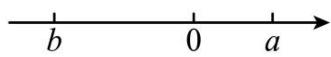
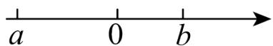
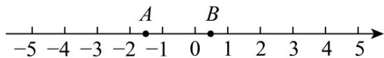

# 专题 04 二次根式的双重非负性（40 题）（举一反三专项训练）

# 【北师大版 2024】

考卷信息:

本套训练卷共 40 题. 含两大题型, $\sqrt{a}$ 中 $a \geq 0$ 的应用 20 题, $\sqrt{a} \geq 0$ 的应用 20 题. 题型针对性较高, 覆盖面广, 选题有深度, 可加深学生对二次根式的双重非负性的理解!

# 【题型1 $\sqrt{\mathrm{a}}$ 中 $\mathrm{a} \geq 0$ 的应用】

1. （23-24八年级下·全国·单元测试）若 $\sqrt{x} + \sqrt{-x}$ 有意义，则 $\sqrt{3x + 4}$ 的值是（）

A. $\sqrt{2}$

B. 2

C. $\sqrt{7}$

D. 7

【答案】B

【分析】本题考查了二次根式有意义的条件，求一个数的二次根式，根据题意得 $x \geq 0, -x \geq 0$ ，可求出x=0，再得代数式 $\sqrt{3x+4} = \sqrt{4} = 2$ ，由此即可求解.

【详解】解：根据题意得， $x \geq 0$ ， $-x \geq 0$ ，

$$
\therefore x = 0,
$$

$$
\therefore \sqrt {3 x + 4} = \sqrt {4} = 2,
$$

故选：B.

2. （24-25 八年级下·广西防城港·期中）已知 $y = \sqrt{x - 3} + \sqrt{3 - x} + 1$ ，则 $xy$ 值为（）

A. 1

B. 2

C. 3

D. 4

【答案】C

【分析】本题考查二次根式有意义的条件，代数式求值，熟练掌握二次根式有意义的条件是解题的关键．先根据二次根式有意义的条件得出 $x-3\geq0$ 且 $3-x\geq0$ ，得出x=3，再进行求值即可.

【详解】解：∵ $y=\sqrt{x-3}+\sqrt{3-x}+1$ ，

$$
\therefore x - 3 \geq 0 \text {   且   } 3 - x \geq 0,
$$

得x-3=0，

$$
\therefore x = 3,
$$

$$
\therefore y = 1,
$$

$$
\therefore x y = 1 \times 3 = 3,
$$

故选：C.

3. 要使 $\sqrt{-a^2}$ 有意义，则 $a$ 的值是（）

A. $a \geq 0$

B. a>0

C. a<0

D. a=0

【答案】D

【分析】根据开平方的被开方数都是非负数，可得答案.

【详解】解：∵ $\sqrt{-a^{2}}$ 有意义

$$
\therefore - a ^ {2} \geq 0
$$

$$
\therefore a = 0
$$

故选：D

【点睛】本题考查了二次根式，注意二次根式的被开方数都是非负数.

4. a,b的位置如图所示，则下列各式有意义的是（）

A. $\sqrt{a + b}$

B. $\sqrt{ab}$

C. $\sqrt{a - b}$

D. $\sqrt{b - a}$

【答案】C

【分析】本题考查了实数与数轴，二次根式的意义，数形结合是解答本题的关键．根据a,b在数轴上的位置判断被开方数的正负即可求解.

【详解】解：∵b<0<a，|b|>|a|，

$$
\therefore a + b <   0, \quad a b <   0, \quad a - b > 0, \quad b - a <   0,
$$

$\therefore \sqrt{a - b}$ 有意义.

故选 C.

5. 已知 $x$ 是实数，且满足 $(x - 2)(x - 3)\sqrt{1 - x} = 0$ ，则相应的 $y = x^2 + x + 1$ 的值为（）

A. 13 或 3

B. 7 或 3

C. 3

D. 13 或 7 或 3

【答案】C

【分析】根据二次根式有意义的条件，解得 $x \leq 1$ ，再运用因式分解法解 $(x-2)(x-3)\sqrt{1-x}=0$ ，筛选符合条件的x的值，即x=1，代入 $y=x^{2}+x+1$ ，求值即可解题.

【详解】根据二次根式有意义的条件，得 $1-x\geq0$

$$
\therefore x \leq 1
$$

$$
\because (x - 2) (x - 3) \sqrt {1 - x} = 0
$$

$\therefore x-2=0$ ，或x-3=0，或1-x=0，

解得x=2（舍去）或x=3（舍去）或x=1

当x=1时，

$$
y = x ^ {2} + x + 1 = 1 ^ {2} + 1 + 1 = 3
$$

故选：C.

6. （24-25 八年级下·江苏南京·阶段练习）已知 $x, y$ 是实数，且满足 $y = \sqrt{x - 2025} - \sqrt{2025 - x}$ ，则 $x^y$ 的值是（）

A. 1

B. $\frac{1}{2}$

C. 0

D. -1

【答案】A

【分析】本题主要考查了二次根式有意义的条件、代数式求值等知识，正确确定 $x$ ， $y$ 的值是解题关键。根据二次根式有意义的条件可得 $x = 2025$ ，进而可知 $y = 0$ ，然后代入求值即可。

【详解】解：根据题意，可知 $x-2025\geq0,2025-x\geq0$

$$
\therefore x = 2 0 2 5,
$$

$$
\therefore y = 0,
$$

$$
\therefore x ^ {y} = 2 0 2 5 ^ {0} = 1.
$$

故选：A.

7. （2025·云南楚雄·二模）若 $\frac{7}{\sqrt{x}}$ 在实数范围内有意义，则实数 $x$ 的取值范围为（）

A. $x \geq 0$

B. $x \leq 0$

C. $x > 0$

D. $x <   0$

【答案】C

【分析】本题考查二次根式有意义的条件、分式有意义的条件，熟练掌握二次根式被开方数不小于零的条件和分母不为零的条件是解题的关键．根据二次根式被开方数不小于零的条件和分母不为零的条件进行解题即可.

【详解】解：由题意可得x>0，

故选：C.

8. （24-25 七年级下·四川南充·阶段练习）已知 $a, b$ 为实数，且 $b = \sqrt{a - 8} - \sqrt{8 - a} + 36$ ，则 $\sqrt[3]{a} + \sqrt{b}$ 的值为（）

A. 7

B. 8

C. 9

D. 10

【答案】B

【分析】本题主要考查了实数的运算、实数的性质、二次根式有意义的条件，根二次根式有意义的条件求得 a 的值成为解题的关键.

根据实数的性质可得 $\left\{\begin{aligned}a-8&\geq0\\ 8-a&\geq0\end{aligned}\right.$ ，解得：a=8，进而求得b=36，然后代入据此可得 $\sqrt[3]{a}+\sqrt{b}$ 求解即可.

【详解】解：由题意得， $\left\{\begin{aligned}a-8&\geq0\\ 8-a&\geq0\end{aligned}\right.$ ，解得：a=8，

$$
\therefore b = \sqrt {8 - 8} - \sqrt {8 - 8} + 3 6 = 3 6,
$$

$$
\therefore \sqrt [ 3 ]{a} + \sqrt {b} = \sqrt [ 3 ]{8} + \sqrt {3 6} = 2 + 6 = 8.
$$

故选；B.

9. （24-25 八年级下·全国·课后作业）要使等式 $\sqrt{x(1 - x)} = \sqrt{x} \cdot \sqrt{1 - x}$ 成立，实数 $x$ 的取值范围是（ ）.

A. $x \leq 0$

B. $x \geq 0$

C. $0 \leq x \leq 1$

D. $x \geq 1$

【答案】C

【分析】本题考查了二次根式有意义的条件，解一元一次不等式组，熟练掌握以上知识点是解答本题的关键.

根据二次根式有意义的条件得到 $\left\{\begin{aligned}x&\geq0\\ 1-x&\geq0\end{aligned}\right.$ ，解一元一次不等式组即可求得x的取值范围.

【详解】解：根据题意得 $\left\{\begin{aligned}x&\geq0\\ 1-x&\geq0\end{aligned}\right.$

解得： $0 \leq x \leq 1$ ，

故选：C.

10. （24-25 九年级下·广东茂名·阶段练习）已知实数 $a$ 满足 $\vert 2025 - a \vert + \sqrt{a - 2026} = a$ ，那么 $a - 2025^2$ 的值是（）

A. 2023

B. 2024

C. 2025

D. 2026

【答案】D

【分析】本题考查二次根式有意义的条件、去绝对值运算、利用二次根式解方程等知识，先由二次根式有意义的条件的得到 $a\geq2026$ ，进而化简绝对值，得到 $\sqrt{a-2026}=2025$ ，利用二次根式解方程即可得到答案，熟练掌握二次根式有意义的条件、去绝对值运算等知识是解决问题的关键.

【详解】解：∵ $\sqrt{a-2026}$ 中 $a-2026\geq0$ ,

$\therefore a\geq2026$ ，则2025-a<0，

$$
\because | 2 0 2 5 - a | + \sqrt {a - 2 0 2 6} = a,
$$

$\therefore a-2025+\sqrt{a-2026}=a$ ，即 $\sqrt{a-2026}=2025$ ，

$\therefore a-2026=2025^{2}$ ，则 $a-2025^{2}=2026$ ，

故选：D.

11. （2025·河南·模拟预测）若x为正整数，要使 $\sqrt{2025-x}$ 有意义，则x=\_\_\_\_。（写出一个即可）

【答案】2025（答案不唯一）

【分析】此题考查了二次根式有意义的条件，根据二次根式有意义的条件即可求出x的范围，解题的关键是

熟练掌握二次根式有意义的条件.

【详解】解：∵要使 $\sqrt{2025-x}$ 有意义，

∴2025-x≥0，则x≤2025，

∵x为正整数，

$$
\therefore x = 2 0 2 5,
$$

故答案为：2025（答案不唯一）.

12. （24-25 八年级下·广东汕头·期中）已知 $x$ ， $y$ 为实数，且 $y = \sqrt{x - 25} - \sqrt{25 - x} + 16$ ，则 $\sqrt{x} + \sqrt{y} =$ \_\_\_\_.

【答案】9

【分析】本题考查了二次根式的非负性质，求二次根式等知识，由二次根式的非负性求出 x 与 y 的值是解题的关键；由二次根式的非负性可求得 x 与 y 的值，再代入计算二次根式即可.

【详解】解：由题意得： $\left\{\begin{aligned}x-25&\geq0\\ 25-x&\geq0\end{aligned}\right.$ ，解得：x=25，

当x=25时， $y=0+0+16=16;$

$$
\therefore \sqrt {2 5} + \sqrt {1 6} = 5 + 4 = 9;
$$

故答案为：9.

13. （24-25 八年级下·湖北孝感·期中）已知 x，y 为实数，且 $y=\sqrt{x^{2}-9}-\sqrt{9-x^{2}}+4$ ，则 x-y= \_\_\_\_.

【答案】-1或-7

【分析】本题主要考查了二次根式有意义的条件，得出 x, y 的值，然后讨论进而得出答案.

【详解】解： $\because y=\sqrt{x^{2}-9}-\sqrt{9-x^{2}}+4.$

$$
\therefore x ^ {2} - 9 \geq 0, 9 - x ^ {2} \geq 0,
$$

$$
\therefore x ^ {2} = 9, \quad y = 4,
$$

$$
\therefore x = \pm 3,
$$

当x=3，y=4时，x-y=3-4=-1；

当x=-3，y=4时， $x-y=-3-4=-7$ ;

$$
\therefore x - y = - 1 \text {或} - 7.
$$

14. （24-25 八年级下·四川泸州·期中）计算 $(\sqrt{5 - x})^2 + \sqrt{(x - 6)^2}$ 的结果是 \_\_\_\_。

【答案】11-2x

【分析】本题考查二次根式有意义的条件，结合已知条件确定 x 的取值范围是解题的关键。由式子可得 $5 - x \geq 0$ ，则 $x \leq 5$ ，那么 x - 6 < 0，然后进行化简即可。

【详解】解：已知算式为 $(\sqrt{5-x})^{2}+\sqrt{(x-6)^{2}}$ ,

则 $5-x\geq0$ ,

解得： $x\leq 5$

那么x-6<0，

原式=5-x+6-x=11-2x,

故答案为：11-2x.

15. （2025·湖南永州·一模）若 $y=\sqrt{1-2x}+\sqrt{2x-1}+\sqrt{(x-1)^{2}}$ ，则 $(x+y)^{2025}=$ \_\_\_\_.

【答案】1

【分析】本题考查二次根式有意义的条件及幂运算，熟练掌握二次根式的开方数非负性是解题的关键.根据二次根式有意义的条件求出 x 的值，再代入求出 y 的值，最后计算代数式即可.

【详解】解：二次根式有意义的条件得，

$1-2x\geq0$ 且 $2x-1\geq0$ ,

解得 $x=\frac{1}{2}$ ,

$$
\therefore y = 0 + 0 + \sqrt {\left(\frac {1}{2} - 1\right) ^ {2}} = \frac {1}{2}
$$

$$
\therefore (x + y) ^ {2 0 2 5} = \left(\frac {1}{2} + \frac {1}{2}\right) ^ {2 0 2 5} = 1,
$$

故答案为：1.

16. （24-25 七年级下·天津和平·期中） $y=\sqrt{4x-2}-\sqrt{1-2x}+8x$ ，求 $\sqrt{-x+4y+9\frac{1}{2}}$ 的二次根式为 \_\_\_\_.

【答案】 $\sqrt{5}$

【分析】本题考查了二次根式有意义的条件，二次根式的定义，熟练掌握二次根式有意义的条件是解题的关键；

根据被开方数大于等于0列式求出x的值，再求出y的值，然后代入即可求解.

【详解】解： $y=\sqrt{4x-2}-\sqrt{1-2x}+8x$

由题意可得： $\left\{\begin{aligned}&4x-2\geq0\\ &1-2x\geq0\end{aligned}\right.$

解得： $x=\frac{1}{2}$ ;

当 $x=\frac{1}{2}$ 时，y=4；

则 $\sqrt{-x + 4y + 9\frac{1}{2}} = \sqrt{-\frac{1}{2} + 4\times 4 + 9\frac{1}{2}} = \sqrt{25} = 5;$

5的二次根式为 $\sqrt{5}$ ;

故答案为： $\sqrt{5}$

17. （24-25 八年级下·贵州黔东南·期中）已知 $x, y$ 是实数，且 $y = \sqrt{x - 7} + \sqrt{7 - x} + 8$ ，求 $(x - y)^{2026}$ 的值.

【答案】1

【分析】本题考查了二次根式有意义的条件，有理数的乘方，熟练掌握以上知识点是解题的关键．根据二次根式有意义的条件，可求得x，然后将x代入，可求得y，最后求得答案.

【详解】解：根据二次根式有意义的条件得 $\left\{\begin{aligned}x-7&\geq0\\ 7&-x\geq0\end{aligned}\right.$

$$
\therefore x = 7,
$$

把x=7代入 $y=\sqrt{x-7}+\sqrt{7-x}+8$ ，得 $y=\sqrt{7-7}+\sqrt{7-7}+8=8$ ，

$$
\therefore (x - y) ^ {2 0 2 6} = (7 - 8) ^ {2 0 2 6} = (- 1) ^ {2 0 2 6} = 1.
$$

18. 已知 a、b 为等腰三角形的两边长，且 a、b 满足 $b=\sqrt{3-a}+\sqrt{2a-6}+4$ ，求此三角形的周长.

【答案】10 或者 11.

【分析】根据二次根式有意义的条件求得a,b的值，再根据等腰三角形的性质求得三角形的周长.

【详解】由题意得： $\left\{\begin{aligned}3-a&\geq0\\ 2a-6&\geq0\end{aligned}\right.$

解得a=3，

$$
\because b = \sqrt {3 - a} + \sqrt {2 a - 6} + 4,
$$

$$
\therefore b = 4,
$$

∴等腰三角形的三边长为3,3,4或者3,4,4,

∴等腰三角形的周长为： $3+3+4=10$ 或者 $3+4+4=11$ .

【点睛】本题考查了二次根式有意义的条件，等腰三角形的性质.

19. （23-24 八年级下·安徽芜湖·阶段练习）已知 $a$ 满足 $\vert 2023 - a\vert + \sqrt{a - 2024} = a$ .

(1) $\sqrt{a-2024}$ 有意义，a的取值范围是\_\_\_\_；则在这个条件下将 $|2023-a|$ 去掉绝对值符号可得 $|2023-a|=$ \_\_\_\_。

(2)根据（1）的分析，求 $a-2023^{2}$ 的值.

【答案】(1) $a \geq 2024$ ，a-2023

(2)2024

【分析】本题考查了绝对值的意义，二次根式有意义的条件，能求出 $a\geq2024$ 是解此题的关键.

(1) 先根据二次根式有意义的条件求出 a 的范围, 再根据绝对值的性质化简;

(2) 去掉绝对值符号, 然后求解即可.

【详解】（1）解：∵ $\sqrt{a-2024}$ 有意义，

$\therefore a-2024\geq0$ ，解得 $a\geq2024$ ，

$$
\therefore | 2 0 2 3 - a | = a - 2 0 2 3,
$$

故答案为： $a \geq 2024$ ，a - 2023.

（2）解：则原方程为 $a-2023+\sqrt{a-2024}=a$ ，

即 $\sqrt{a-2024}=2023$ ,

$\therefore a-2024=2023^{2}$ ，即 $a-2023^{2}=2024$ .

20. （24-25 八年级下·湖北黄冈·期中）问题背景：请认真阅读下列的解法.

例：已知 $y=\sqrt{2024-x}+\sqrt{x-2024}+2025$ ，求 $\frac{y}{x}$ 的值

解：由 $\left\{\begin{aligned}&2024-x\geq0\\ &x-2024\geq0\end{aligned}\right.$ ，得x=2024

$$
\therefore y = 2 0 2 5, \quad \therefore \frac {y}{x} = \frac {2 0 2 5}{2 0 2 4}
$$

(1)尝试应用：若 x, y 为实数，且 $y > \sqrt{x-3} + \sqrt{3-x} + 2$ ，化简： $\frac{|1-y|}{y-1}$ ;

(2)拓展创新：已知 $b=\sqrt{ab-10}+\sqrt{20-2ab}-a+7$ ，求a-b的值.

【答案】(1)1

(2) $\pm3$

【分析】本题主要考查了二次根式有意义的条件，完全平方公式，绝对值的意义，熟练掌握二次根式有意义的条件，完全平方公式是解题的关键.

（1）根据二次根式有意义的条件可求出x的值，从而得到y的值，即可求解；

（2）根据二次根式有意义的条件可求出ab=10，从而得到 $a+b=7$ ，再根据完全平方公式的变形，即可求解.

【详解】（1）解：由题意得： $\left\{\begin{aligned}x-3&\geq0\\ 3-x&\geq0\end{aligned}\right.$

解得： $x = 3$

$$
\therefore y > 2,
$$

$$
\therefore 1 - y <   0,
$$

$$
\therefore \frac {| 1 - y |}{y - 1} = \frac {y - 1}{y - 1} = 1;
$$

（2）解：由题意得： $\left\{\begin{aligned}ab-10&\geq0\\ 20&-2ab\geq0\end{aligned}\right.$

解得：ab=10，

$$
\therefore b = - a + 7,
$$

$$
\therefore a + b = 7,
$$

$$
\therefore (a - b) ^ {2} = (a + b) ^ {2} - 4 a b = 7 ^ {2} - 4 \times 1 0 = 9,
$$

$$
\therefore a - b = \pm 3.
$$

# 【题型2 $\sqrt{a} \geq 0$ 的应用】

1. （24-25 七年级下·广东韶关·期末）已知实数 $m$ ， $n$ 满足 $|n - 2| + \sqrt{m - 1} = 0$ ，则 $n + 2m$ 的值为（）

A. 4

B. 3

C. 1

D. 0

【答案】A

【分析】本题主要考查非负数的性质，由非负数的性质可知，绝对值和二次根式的和为0时，每个部分都为0，由此解出 $m$ 和 $n$ 的值，再代入计算即可.

【详解】解：∵实数 m，n 满足 $\left|n-2\right|+\sqrt{m-1}=0$ ，

$$
\therefore | n - 2 | = 0, \sqrt {m - 1} = 0,
$$

$$
\therefore n - 2 = 0, m - 1 = 0,
$$

解得，n=2,m=1，

$$
\therefore n + 2 m = 2 + 2 \times 1 = 2 + 2 = 4,
$$

故选：A.

2. （24-25八年级下·云南昭通·期中）已知： $\sqrt{x - 4} + \sqrt{2x + y} = 0$ ，则 $x - y$ 的值为（）

A. 0

B. 4

C. 12

D. 16

【答案】C

【分析】此题考查了二次根式非负数的性质，代数式求值，

根据二次根式非负数的性质，两个非负数的和为0，则每个非负数均为0．由此可解出x和y的值，再代入计算x-y.

【详解】 $\because \sqrt{x-4}+\sqrt{2x+y}=0,\quad\sqrt{x-4}\geq0,\quad\sqrt{2x+y}\geq0$

$$
\therefore x - 4 = 0, \quad 2 x + y = 0
$$

$$
\therefore x = 4, \quad y = - 8
$$

$$
\therefore x - y = 4 - (- 8) = 4 + 8 = 1 2.
$$

故选：C.

3. （24-25 七年级下·贵州贵阳·期中）已知 $|a-3|+\sqrt{3+b}=0$ ，则 $\left(\frac{a}{b}\right)^{2025}=(\quad)$

A. 1

B.-1

C. 2

D.-2

【答案】B

【分析】本题考查绝对值，二次根式，有理数的乘方，解题的关键是求出a和b的值.

根据绝对值和二次根式的非负性，解得a和b的值，代入计算即可.

【详解】解： $|a-3|+\sqrt{3+b}=0,\quad|a-3|\geq0,\quad\sqrt{3+b}\geq0,$

$$
\therefore | a - 3 | = 0, \sqrt {3 + b} = 0,
$$

$$
\therefore a - 3 = 0, \quad 3 + b = 0,
$$

$$
\therefore a = 3, \quad b = - 3,
$$

$$
\therefore \frac {a}{b} = - 1
$$

$$
\therefore \left(\frac {a}{b}\right) ^ {2 0 2 5} = (- 1) ^ {2 0 2 5} = - 1
$$

故选：B.

4. （2025 七年级下·全国·专题练习）在数轴上有 C，D 两点分别表示实数 c 和 d，且有 $\left|2c+d\right|$ 与 $\sqrt{d+4}$ 互为相反数，则 3c-2d 的平方根为（）

A. $\pm\sqrt{14}$

B. $\sqrt{14}$

C. 7

D. $\pm7$

【答案】A

【分析】本题主要考查了平方根的定义，绝对值和二次根式的非负性，先根据非负数的性质和相反数的定义求出 $c = 2$ ， $d = -4$ ，得出 $3c - 2d = 3 \times 2 - 2 \times (-4) = 6 + 8 = 14$ ，最后根据平方根定义求出结果即可.

【详解】解：∵ $|2c+d|$ 与 $\sqrt{d+4}$ 互为相反数，

$$
\therefore | 2 c + d | + \sqrt {d + 4} = 0,
$$

$$
\therefore 2 c + d = 0, \quad d + 4 = 0,
$$

解得：c=2，d=-4，

$$
\therefore 3 c - 2 d = 3 \times 2 - 2 \times (- 4) = 6 + 8 = 1 4,
$$

∵14 的平方根为± $\sqrt{14}$ ,

∴3c-2d的平方根为± $\sqrt{14}$ .

故选：A

5. （24-25 七年级下·北京·期中）若 $m, n$ 为实数，且 $(m + 4)^{2} + \sqrt{n - 5} = 0$ ，则 $(m + n)^{2}$ 的值为（）

A. 1

B. 0

C. 81

D. -9

【答案】A

【分析】本题考查平方与二次根式的非负性，求代数式的值．根据平方和二次根式的非负性求出 m，n 的值，再代入计算即可.

【详解】解： $\because(m+4)^{2}\geq0,\quad\sqrt{n-5}\geq0,\quad 且(m+4)^{2}+\sqrt{n-5}=0,$

$$
\therefore (m + 4) ^ {2} = 0, \sqrt {n - 5} = 0,
$$

$$
\therefore m = - 4, n = 5,
$$

$$
\therefore (m + n) ^ {2} = (- 4 + 5) ^ {2} = 1 ^ {2} = 1.
$$

故选：A.

6. （24-25 八年级下·山东菏泽·期中）已知 $|a^{3}-1|+\sqrt{7+b}=0$ ，则 $a+b=$ （）

A.-8

B.-6

C. 6

D. 8

【答案】B

【分析】本题考查了绝对值的非负性，二次根式的非负性，求立方根，求二次根式，熟练掌握以上知识点是解题的关键．根据非负数的性质，绝对值和平方根的结果均为非负数，它们的和为零时，各自必须为零，由此可解出a和b的值，再求和.

【详解】解：∵ $\left|a^{3}-1\right|+\sqrt{7+b}=0$ ,

∴ $\left|a^{3}-1\right|=0$ 且 $\sqrt{7+b}=0$ ,

$$
\therefore a = 1, b = - 7
$$

$$
\therefore a + b = 1 + (- 7) = - 6,
$$

故选：B.

7. （2025·湖北·模拟预测）已知 $a$ 、 $b$ 均为实数且 $\sqrt{1 - 2a}$ 与 $\sqrt{4b - 2}$ 互为相反数，则 $a + b =$ （）

A. 0.5

B. 1

C. 1.5

D. 2

【答案】B

【分析】本题主要考查了非负数的性质，相反数的性质，熟练掌握二次根式的非负性是解题的关键。根据相反数的性质得 $\sqrt{1 - 2a} +\sqrt{4b - 2} = 0$ ，再根据二次根式的非负性和非负数的性质得出 $1 - 2a = 0$ ， $4b - 2 = 0$ ，从而可求出 $a$ 、 $b$ 的值，进而可求解.

【详解】解：∵ $\sqrt{1-2a}$ 与 $\sqrt{4b-2}$ 互为相反数，

$$
\therefore \sqrt {1 - 2 a} + \sqrt {4 b - 2} = 0
$$

$$
\therefore 1 - 2 a = 0, \quad 4 b - 2 = 0,
$$

解得： $a=\frac{1}{2}$ ， $b=\frac{1}{2}$ .

$$
\therefore a + b = 1.
$$

故选：B.

8. （24-25 七年级下·湖南湘潭·期中）若 $\sqrt{x + 2}$ 与 $\sqrt{(y - 3)^2}$ 互为相反数，则 $x^y$ 的值是（）

A. 6

B. -6

C. 8

D.-8

【答案】D

【分析】本题考查了互为相反数的两个数之间的关系，代数式求值，二次根式的非负性，首先利用二次根式的非负性，即可求得 $x$ 、 $y$ 的值，再把 $x$ 、 $y$ 的值代入 $x^{y}$ ，即可求得其值.

【详解】解：∵ $\sqrt{x+2}$ 与 $\sqrt{(y-3)^{2}}$ 互为相反数，

$$
\therefore \sqrt {x + 2} + \sqrt {(y - 3) ^ {2}} = 0
$$

$$
\therefore x + 2 = 0, \quad y - 3 = 0,
$$

解得x=-2，y=3，

$$
\therefore x ^ {y} = (- 2) ^ {3} = - 8.
$$

故选：D.

9. （24-25 七年级下·天津河北·期中）已知非零实数 $a$ ， $b$ 满足 $|a - 2| + |b + 1| + \sqrt{a - 3} = a - 2$ ，则 $a + b$ 等于（）

A. 0

B. 2

C. 1

D.-1

【答案】B

【分析】本题考查了绝对值和二次根式的非负性，得到 $a-2\geq0$ 是解题的关键．先由条件得出 $a-2\geq0$ ，然后即可将原式去掉一个绝对值，从而即可求出a、b的值，可得到答案.

【详解】解：由 $|a-2|+|b+1|+\sqrt{a-3}=a-2$ 可知， $a-2\geq0$ ，

$$
\therefore a - 2 + | b + 1 | + \sqrt {a - 3} = a - 2,
$$

即 $|b+1|+\sqrt{a-3}=0$

$$
\therefore b + 1 = 0, \quad a - 3 = 0,
$$

$$
\therefore b = - 1, \quad a = 3,
$$

$$
\therefore a + b = 3 - 1 = 2,
$$

故选：B.

10.（24-25七年级下·吉林·期中）若 $|x+2|+\sqrt{y+1}+(z-3)^{2}=0$ ，则 $x+y+z$ 的值为（）

A. 0

B. 1

C. 2

D. 3

【答案】A

【分析】此题主要考查了非负数的性质，直接利用非负数的性质得出x，y，z的值，进而得出答案，掌握非

负数的性质是解题的关键.

【详解】解：∵ $|x+2|+\sqrt{y+1}+(z-3)^{2}=0$ ,

$$
\therefore x + 2 = 0, \quad y + 1 = 0, \quad z - 3 = 0,
$$

$$
\therefore x = - 2, y = - 1, z = 3,
$$

$$
\therefore x + y + z = - 2 - 1 + 3 = 0,
$$

故选：A.

11. （24-25 七年级下·黑龙江佳木斯·阶段练习）代数式 $\sqrt{(x - 2)^2}$ 的最小值是 \_\_\_\_.

【答案】0

【分析】本题考查二次根式的非负性，根据非负性，得到 $\sqrt{(x-2)^{2}}\geq0$ ，即可得出结果.

【详解】解： $\because \sqrt{(x-2)^{2}} \geq 0$ ，

∴代数式 $\sqrt{(x-2)^{2}}$ 的最小值是0;

故答案为：0.

12. （24-25 七年级下·河南商丘·期中）若 a, b 为实数，且满足 $\left|a-4\right|+\sqrt{-b^{2}}=0$ ，则 $\sqrt{4a-b}$ 的值为 \_\_\_\_.

【答案】4

【分析】本题考查了绝对值和二次根式的非负性，求一个数的二次根式，掌握绝对值和二次根式的非负性是解题关键.

根据绝对值和二次根式的非负性得到 $\left\{\begin{aligned}a-4&=0\\ -b^{2}&=0\end{aligned}\right.$ ，求出a,b，再代入进行求二次根式.

【详解】解：∵ $|a-4|+\sqrt{-b^{2}}=0$ ， $|a-4|\geq0$ ， $\sqrt{-b^{2}}\geq0$ ，

$$
\therefore \left\{ \begin{array}{l} a - 4 = 0 \\ - b ^ {2} = 0 \end{array} \right.,
$$

$$
\therefore a = 4, b = 0,
$$

$$
\therefore \sqrt {4 a - b} = \sqrt {4 \times 4 - 0} = 4,
$$

故答案为：4.

13. （24-25 七年级下·河南周口·期中）已知 m，n 满足 $\sqrt{m-2} + \left| n - \frac{1}{4} \right| = 0$ ，那么 $\sqrt[m]{n} =$ \_\_\_\_ .

【答案】 $\frac{1}{2}$ /0.5

【分析】本题考查了二次根式以及绝对值的非负性，求一个数的二次根式，先由 $\sqrt{m-2}+\left|n-\frac{1}{4}\right|=0$ ，得m=2,n=

，再代入 $\sqrt[m]{n}$ 进行计算，即可作答.

【详解】解： $\because \sqrt{m - 2} + \left|n - \frac{1}{4}\right| = 0$

$$
\therefore \sqrt {m - 2} = 0, \left| n - \frac {1}{4} \right| = 0,
$$

$$
\therefore m = 2, n = \frac {1}{4},
$$

$$
\therefore \sqrt [ m ]{n} = \sqrt {\frac {1}{4}} = \frac {1}{2},
$$

故答案为: $\frac{1}{2}$

14. （2025八年级下·湖北·专题练习）已知非零实数 $a, b$ 满足 $\vert 2a - 4\vert + \vert b + 2\vert + \sqrt{(a - 4)b^2} + 4 = 2a$ ，则 $a + b =$ \_\_\_\_.

【答案】2

【分析】本题主要考查了二次根式的非负性，绝对值的非负性，将式子变形为 $|2a-4|+|b+2|+\sqrt{(a-4)b^{2}}=2a-4$ ，由二次根式的非负性，绝对值的非负性得出 $2a-4\geq0$ ，再化简式子可得出 $|b+2|+\sqrt{(a-4)b^{2}}=0$ ，再根据二次根式的非负性，绝对值的非负性即可得出b=-2，a=4，进而代入代数式即可得出答案.

【详解】解：∵ $|2a-4|+|b+2|+\sqrt{(a-4)b^{2}}+4=2a$

$$
\therefore | 2 a - 4 | + | b + 2 | + \sqrt {(a - 4) b ^ {2}} = 2 a - 4,
$$

$$
\therefore 2 a - 4 \geq 0,
$$

$$
\therefore 2 a - 4 + | b + 2 | + \sqrt {(a - 4) b ^ {2}} = 2 a - 4,
$$

$$
\therefore | b + 2 | + \sqrt {(a - 4) b ^ {2}} = 0
$$

$$
\therefore b + 2 = 0, \quad a - 4 = 0,
$$

解得，b=-2，a=4，

则 $a+b=4-2=2$ ，

故答案为：2.

15. （24-25 八年级下·山西临汾·期中）若 $\left|a-2026\right|+\sqrt{b+2027}=0$ ，其中 a, b 均为整数，则 $(a+b)^{2025}=$ \_\_\_\_.

【答案】-1

【分析】本题考查绝对值和二次根式的非负性，乘方，根据 $|a-2026|+\sqrt{b+2027}=0$ ，得a=2026，b=-2027，再代入 $(a+b)^{2025}$ ，进行计算，即可作答.

【详解】解：∵ $|a-2026|\geq0,\quad\sqrt{b+2027}\geq0$ ，且 $|a-2026|+\sqrt{b+2027}=0$ .

$$
\therefore | a - 2 0 2 6 | = 0, \sqrt {b + 2 0 2 7} = 0
$$

解得a=2026，b=-2027，

$$
\therefore (a + b) ^ {2} = [ 2 0 2 6 + (- 2 0 2 7) ] ^ {2 0 2 5} = - 1,
$$

故答案为：-1.

16. （24-25 七年级下·江西南昌·期中）若 $(2a+3)^{2}+\sqrt{b-2}=0$ ，则 $\sqrt{a^{b}}=$ \_\_\_\_。

【答案】 $\frac{3}{2}$

【分析】本题考查了平方、二次根式的非负性，掌握相关知识是解题关键．根据平方、二次根式的非负性求出 $a=\frac{3}{2}$ ，b=2，再根据二次根式的定义即可求解.

【详解】解：∵ $(2a+3)^{2}+\sqrt{b-2}=0$ ,

$$
\therefore 2 a + 3 = 0, b - 2 = 0,
$$

解得： $a=-\frac{3}{2}$ ，b=2，

$$
\therefore a ^ {b} = \left(- \frac {3}{2}\right) ^ {2} = \frac {9}{4},
$$

$$
\therefore \sqrt {a ^ {b}} = \sqrt {\frac {9}{4}} = \frac {3}{2},
$$

故答案为： $\frac{3}{2}$ .

17. （24-25 八年级下·全国·单元测试）已知 $x$ 、 $y$ 为实数，且 $\sqrt{x - 2} + \sqrt{9 - y} = 0$ ，则 $\sqrt{xy}$ 的值为 \_\_\_\_.

【答案】 $3\sqrt{2}$

【分析】本题考查了二次根式的非负性，二次根式的化简，求得x,y的值是解题的关键．根据二次根式的非负性，求得x,y的值，再代入代数式中求解即可.

【详解】解：∵ $\sqrt{x-2}+\sqrt{9-y}=0$ ,

$$
\therefore x - 2 = 0, \quad 9 - y = 0,
$$

解得：x=2，y=9，

$$
\therefore \sqrt {x y} = \sqrt {1 8} = 3 \sqrt {2},
$$

故答案为： $3\sqrt{2}$ .

18. （24-25 八年级下·全国·单元测试）已知 $a$ 、 $b$ 在数轴上的位置如图所示，化简 $\sqrt{a^2} + \sqrt{(a - b)^2} - |b - a|$ 的结果是 \_\_\_\_.

【答案】-a

【分析】本题考查了利用数轴判断代数式的大小，绝对值、二次根式的意义以及整式的加减，熟练掌握绝对值、二次根式的意义是解答本题的关键.

由数轴可得，a<0<b，然后利用绝对值、二次根式的意义以及整式的加减进行化简即可.

【详解】解：由数轴可得，a<0<b，

$$
\therefore \sqrt {a ^ {2}} + \sqrt {(a - b) ^ {2}} - | b - a | = - a + b - a - b + a = - a,
$$

故答案为：-a.

19. 设 a, b, c 都是实数，且满足 $(2-a)^{2}+\sqrt{a^{2}+b+c}+|c+8|=0$ ， $ax^{2}+bx+c=0$ ，求式子 $x^{2}+2x$ 的二次根式.

【答案】）2

【分析】根据非负数的性质列式求出 a、b、c 的值，然后代入代数式求出 $x^{2}+2x$ 的值，再根据二次根式的定义解答.

【详解】由题意得，2-a=0， $a^{2}+b+c=0$ ， $c+8=0$ ，

解得 a=2，b=4，c=-8，

代入 $ax^{2}+bx+c=0$ 得， $2x^{2}+4x-8=0$ ，

所以， $x^{2}+2x=4$ ，

所以， $x^{2}+2x$ 的二次根式是 2.

20. （24-25 八年级上·河北石家庄·期中）如图，一只蚂蚁从点A沿数轴向右爬了2个单位长度到达点B，点A表示 $-\sqrt{2}$ ，设点B所表示的数为m.

text_image

-5 -4 -3 -2 -1 0 1 2 3 4 5
A B

(1)m的值是\_\_\_\_；

(2)求 $|m+1|+\sqrt{(m-1)^{2}}$ 的值；

(3)在数轴上还有C、D两点分别表示实数c和d，且有 $|2c+6|$ 与 $\sqrt{d-4}$ 互为相反数，求 $2c+3d$ 的平方根.

【答案】(1) $-\sqrt{2}+2$

(2)2

(3) $\pm\sqrt{6}$

【分析】本题考查实数与数轴，非负性，求一个数的平方根：

（1）根据数轴上点的移动规则，左减右加，求出m的值即可；

(2) 根据点 $B$ 的位置, 确定式子的符号, 进而化简即可;

（3）根据非负性求出c,d的值，进而求出代数式的值，再求出平方根即可.

【详解】（1）解：由题意，可知： $m=-\sqrt{2}+2$ ;

(2) 由图可知: $0 < m < 1$ ,

$$
\therefore m + 1 > 0, m - 1 <   0,
$$

$$
\therefore | m + 1 | + \sqrt {(m - 1) ^ {2}} = m + 1 + 1 - m = 2;
$$

（3）由题意，得： $|2c+6|+\sqrt{d-4}=0$ ，

$$
\therefore 2 c + 6 = 0, \quad d - 4 = 0,
$$

$$
\therefore c = - 3, d = 4,
$$

$$
\therefore 2 c + 3 d = 2 \times (- 3) + 3 \times 4 = 6,
$$

$\therefore 2c+3d$ 的平方根为 $\pm\sqrt{6}$ .