# 专题 1.1 探索勾股定理（举一反三讲义）

【北师大版 2024】

# 题型归纳

【题型 1 利用勾股定理求边长】....2

【题型 2 勾股定理与折叠】....3

【题型 3 勾股定理与方程】....4

【题型 4 勾股定理与网格】....5

【题型 5 利用勾股定理证平方关系】....6

【题型 6 勾股定理常见模型之赵爽线图】....7

【题型 7 勾股定理常见模型之勾股树】....8

【题型 8 勾股定理常见模型之斜边上的高】....10

# 举一反三

# 知识点1 勾股定理

1. 定义: 直角三角形两直角边的平方和等于斜边的平方, 如果用 $a$ , $b$ 和 $c$ 分别表示直角三角形的两直角边和斜边, 那么 $a^2 + b^2 = c^2$ .

如图所示， $\triangle ABC$ 是直角三角形，其中较短的直角边 $a$ 叫做勾，较长的直角边 $b$ 叫做股，斜边 $c$ 叫做弦.

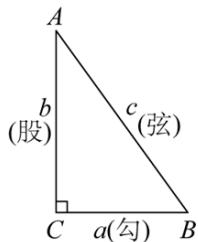

text_image

A
b
(股)
c
(弦)
C
a(勾)
B

# 知识点 2 勾股定理的验证

勾股定理的验证主要通过拼图法完成，这种方法是以数形转换为指导思想，图形拼补为手段，各部分面积之间的关系为依据来实现的。用两种方式表示图形面积（算两次），根据面积相同得到等量关系，进而进行等量变换得到勾股定理公式是证明勾股定理的常见方法。

# 拼图法验证勾股定理的一般步骤

<table><tr><td rowspan="3">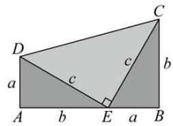</td><td>(1) 拼出图形</td><td>直角梯形(3个直角三角形)</td></tr><tr><td>(2)用两种方式表示图形面积</td><td> $\frac{1}{2}(a + b) \times (a + b), \frac{1}{2}ab + \frac{1}{2}c^2 + \frac{1}{2}ab$ </td></tr><tr><td>(3)根据面积相同得到等量关系</td><td> $\frac{1}{2}(a + b)^2 = \frac{1}{2}c^2 + ab$ </td></tr><tr><td rowspan="2"></td><td>(4) 恒等变形</td><td> $a^{2} + b^{2} + 2ab = c^{2} + 2ab$ </td></tr><tr><td>(5) 推导出勾股定理</td><td> $a^{2} + b^{2} = c^{2}$ </td></tr></table>

# 知识点 3 勾股定理的应用 教辅资源,关注公众号·全科AA+

利用勾股定理可以解决与直角三角形有关的问题，主要应用如下：

(1)已知直角三角形的任意两边长，求第三边长；  
(2)已知直角三角形的任意一边长，确定另外两边长的关系；  
(3)解决包含平方关系的几何问题;  
(4)构造方程计算有关线段的长度问题，解决生产生活中的一些实际问题.

# 【题型1 利用勾股定理求边长】

【例 1】（24-25 九年级上·山西吕梁·期末）如图，在长方形ABCD中，若 $AB = 3, BD = 5, \frac{DE}{BC} = \frac{1}{4}$ ，则线段CE的长为\_\_\_\_。

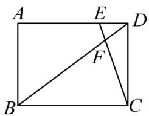

text_image

A
E
D
F
B
C

【变式 1-1】（24-25 九年级上·广西河池·期末）如图， $\triangle ABC$ 与 $\triangle DEC$ 关于点 $C$ 成中心对称， $AB=3$ ， $AE=5$ ， $\angle BAD=90^{\circ}$ ，则点 $A$ 到 $BE$ 的距离是\_\_\_\_.

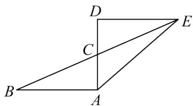

text_image

D
C
B
A
E

【变式 1-2】（24-25 八年级下·上海·期中）如图，在梯形ABCD中， $AD \parallel BC$ ，如果AD = 2，BC = 10，梯形ABCD的面积为48．取CD的中点E，连接AE并延长，与BC的延长线交于点F．如果 $\angle DAF = \angle ABC$ ，那么AB的长是\_\_\_\_．

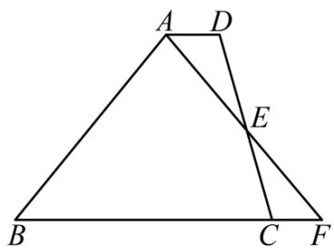

text_image

A
D
E
B
C
F

【变式 1-3】（24-25 八年级下·云南临沧·期中）如图，将 $\triangle ABC$ 绕点 A 顺时针旋转 $60^{\circ}$ 得到 $\triangle AED$ ，点 B、C

的对应点分别为点E、D，连接BE，点D恰好落在线段BE上，若BD=6，BC=2，则AC的长为（）

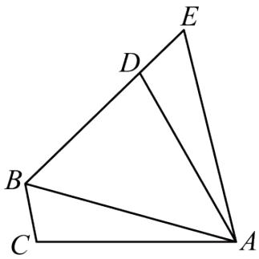

text_image

Geometric diagram of triangle ABC with points D and E on sides, and segment BD drawn

A. $\sqrt{13}$

B. $2 \sqrt{13}$

C. $4 \sqrt{3}$

D. $2 \sqrt{26}$

【题型 2 勾股定理与折叠】教辅资源, 关注公众号·全科AA+

【例 2】（24-25 八年级下·北京·期中）如图，在Rt△ABC中，∠C=90°，AC=6，BC=4，D是AC的中点，E是BC上一点，连接BD、DE．将△CDE沿DE翻折，点C落在BD上的点F处，则CE的长是（）

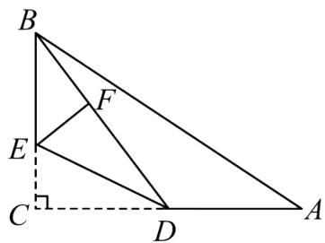

text_image

Geometric diagram of triangle ABC with internal points D, E, F and perpendicular lines from A to BC

A. 1.5

B. 2

C. 2.5

D. 3

【变式 2-1】（24-25 八年级上·河南郑州·期中）小明在帮妹妹完成手工作业的时候发现了其中的数学问题，如图，在 $\triangle ABC$ 中， $\angle BAC = 90^{\circ}$ ，AB = 4，AC = 8，沿过点A的直线折叠，使点B落在BC边上的点D处，再次折叠，使点C与点D重合，折痕交AC于点E，则AE的长度为（）

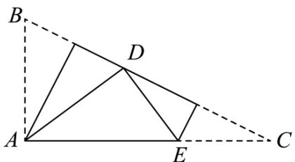

text_image

Geometric diagram with labeled points A, B, C, D, E and dashed lines forming triangles and quadrilaterals

A. 4

B. 5

C. 6

D. 7

【变式 2-2】（24-25 八年级上·陕西汉中·期末）如图，在 $\triangle ABC$ 中，AB = 6，AC = 8，BC = 10，点 D 为 AB 上一点，将 $\triangle BCD$ 沿 CD 所在直线折叠后，点 B 的对应点 E 恰好落在 CA 的延长线上，则 AD 的长为（）

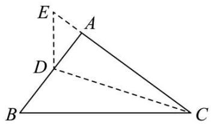

text_image

Geometric diagram of triangle ABC with points D and E, showing dashed lines from A to B and C to C.

A. 5

B. 4

C. 3

D. $\frac{8}{3}$

【变式 2-3】（24-25 八年级下·河北廊坊·阶段练习）如图，在长方形ABCD中， $AB=\frac{13}{2}$ ，BC=12，
AG = 13，沿边AE所在直线翻折△ABE，AB与AF重合，点F在AG上，则CE的长是\_\_\_\_。

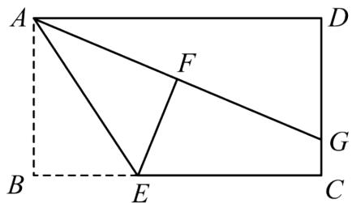

text_image

A
D
F
B
E
C
G

【题型 3 勾股定理与方程】教辅资源, 关注公众号·全科AA+

【例 3】（24-25 九年级上·黑龙江哈尔滨·期末）如图，在 $\triangle ABC$ 中，AB = AC，点 D 为 AC 边上的一点，AD = BD， $AE \perp BD$ 于点 E，若 AE = 3， $BC = \sqrt{10}$ ，则线段 BD 的长为 \_\_\_\_.

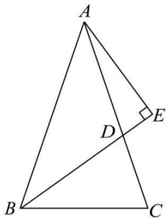

text_image

A
D
E
B
C

【变式 3-1】（24-25 八年级下·湖北孝感·期中）如图，在 $\triangle ABC$ ，AB=7，BC=8，AC=5，求 $\triangle ABC$ 的面积.

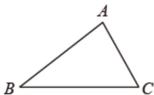

natural_image

Simple geometric triangle labeled ABC with vertices marked (no additional text or symbols)

【变式 3-2】（24-25 八年级上·江西吉安·期末）如图，在 $\triangle ABC$ 中， $\angle B = 90^{\circ}$ ，点 D 在 AB 边上，若 BD = 10，BC = 5，且 $AD + AC = BD + BC$ ，求 AD 的长.

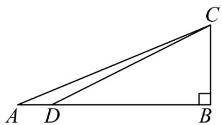

text_image

Geometric diagram of a right triangle ABC with point D on base AB and right angle at B

【变式 3-3】（24-25 八年级下·山东德州·期中）如图，在Rt△ABC中，∠C = 90°, AC = 6, BC = 8, D、E 分别是斜边AB和直角边CB上的点．把△ABC沿着直线DE折叠，顶点B的对应点是点B'．若点B'落在直角边AC的中点上，则BE的长是（）

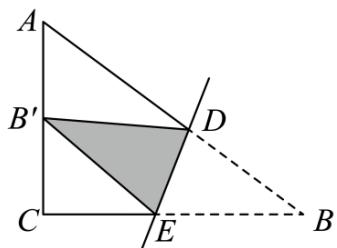

text_image

A
B'
C
E
D
B

A. $\frac{55}{16}$

B. 4

C. 5

D. $\frac{73}{16}$

【题型 4 勾股定理与网格】教辅资源, 关注公众号·全科AA+

【例 4】（24-25 八年级下·山东潍坊·阶段练习）如图，在边长为1的小正方形网格中， $\triangle ABC$ 位置如图所示，则点A到线段BC的距离为（）

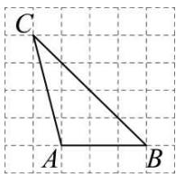

A. 3

B. $\frac{3\sqrt{3}}{2}$

C. 2

D. $\frac{3\sqrt{2}}{2}$

【变式 4-1】（24-25 八年级上·江苏泰州·期末）如图，在边长为 1 的小正方形组成的网格中，点 A, B, C 都是格点，在图中找一点 O，使得 OA = OB = OC，则 OA 的长为 \_\_\_\_.

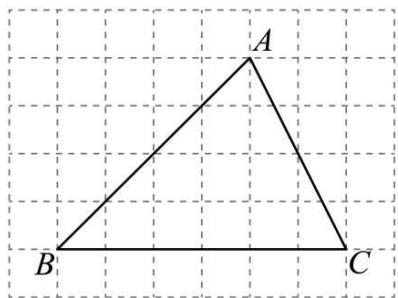

text_image

A
B
C

【变式 4-2】（24-25 八年级上·江苏南通·期末）如图，在 $4 \times 4$ 的网格中，每个小正方形的边长为 1，点 $A, B, C, D$ 均在格点上， $E$ 是 $AB$ 与网格线的交点，则 $DE$ 的长是（）

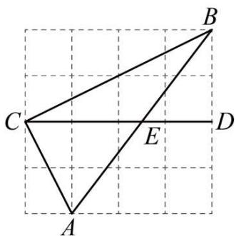

text_image

Geometric diagram with labeled points A, B, C, D, E on a grid background

A. $\sqrt{3}$

B. $\frac{3}{2}$

C. $\sqrt{2}$

D. $\frac{\sqrt{5}}{2}$

【变式 4-3】（24-25 八年级上·北京朝阳·期末）如图，在 $3 \times 3$ 的正方形网格中， $\triangle ABC$ 的 3 个顶点均在正方形的顶点（格点）上，这样的三角形叫做格点三角形。 $E$ 为网格图中与 $\triangle ABC$ 全等的格点三角形（ $\triangle ABC$ 除外）的一个顶点，其对应点为 $C$ 。若在平面直角坐标系中，点 $A$ 的坐标为 $(0,3)$ ，点 $C$ 的坐标为 $(2,0)$ ，点 $E$ 在坐标轴上，则点 $E$ 的坐标为 \_\_\_\_.

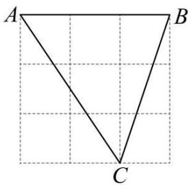

text_image

A
B
C

# 【题型5 利用勾股定理证平方关系】

【例 5】（24-25 八年级上·四川成都·期中）如图 $\triangle ABD$ 和 $\triangle ACE$ 是 $\triangle ABC$ 外两个等腰直角三角形， $\angle BAD = \angle CAE = 90$ ，下列说法正确的是：\_\_\_\_.

①CD = BE，且DC ⊥ BE；  
② $DE^{2}+BC^{2}=2BD^{2}+EC^{2};$   
③FA平分∠DFE;   
④取BC的中点M，连MA，则 $MA \perp DE$ .

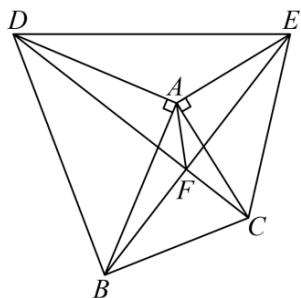

text_image

Geometric diagram with labeled points A, B, C, D, E, F and intersecting lines forming triangles and a right angle at A.

【变式 5-1】（24-25 八年级上·福建宁德·阶段练习）对角线互相垂直的四边形叫做“垂美”四边形，现有如图所示的“垂美”四边形ABCD，对角线AC，BD交于点O．若AD=2，BC=5，则 $AB^{2}+CD^{2}=$ \_\_\_\_．

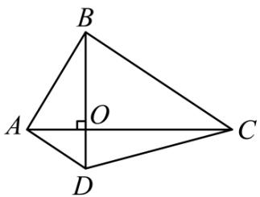

text_image

B
A O C
D

【变式 5-2】（24-25 八年级下·辽宁抚顺·阶段练习）如图，Rt△ABC中，∠ACB = 90°，D为AB中点，点E在BC边上（点E不与点B，C重合），连接DE，过点D作DE⊥DF交AC于点F，连接EF.

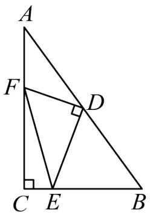

text_image

A
F
D
C E B

(1)求证： $AF^{2}+BE^{2}=EF^{2}$ .  
(2)若AC=7，BC=5，EC=1，直接写出线段AF的长.

【变式 5-3】（24-25 八年级上·湖北十堰·期末）如图，等腰直角 $\triangle AOB$ ，等腰直角 $\triangle COD$ ， $\angle AOB = \angle COD = 90^{\circ}, AO = 3, CO = 4$ ，连接 AD, BC 相交于点 M，则 $AC^{2} + BD^{2} =$ \_\_\_\_ .

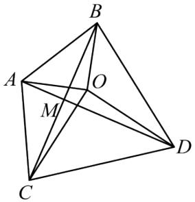

text_image

Geometric diagram of a tetrahedron with labeled vertices A, B, C, D and intersection point M, showing edges and diagonals.

【题型 6 勾股定理常见模型之赵爽线图】教辅资源,关注公众号·全科AA+

【例 6】（24-25 八年级上·福建漳州·期中）我国古代数学家赵爽在注解《周髀算经》时给出的“赵爽弦图”，它是由 4 个全等的直角三角形与 1 个小正方形拼成的一个大正方形，如图，若拼成的大正方形为正方形 ABCD，面积为 9，中间的小正方形为正方形 EFGH，面积为 2，连接 AC，交 BG 于点 P，交 DE 于点 M，①
△ CGP ≅ △ AEM，② $2S_{\triangle AFP}-S_{\triangle CGP}=\frac{1}{2}$ ; ③DH + HC = 4, ④HC = 2 + $\frac{\sqrt{2}}{2}$ ，以上说法正确的是\_\_\_\_。（填写序号）

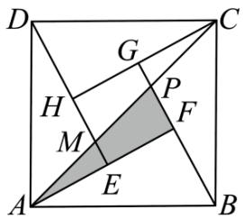

text_image

D
G
C
H
P
M
F
A
E
B

【变式 6-1】（24-25 八年级下·天津河北·期中）如图所示的“赵爽弦图”是由四个全等的直角三角形与中间的一个小正方形拼成的大正方形，若图中的直角三角形的长直角边是 12，大正方形的面积是 169，则小正方形的面积是\_\_\_\_。

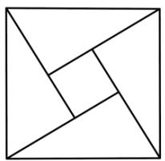

natural_image

Geometric diagram of a square divided into triangles and smaller squares (no text or symbols)

【变式 6-2】（24-25 八年级上·四川眉山·期末）如图，我国古代数学家赵爽为了证明勾股定理，创制了一幅“弦图”（图 1），后人称其为“赵爽弦图”、由图 1 变化得到图 2，它是用八个全等的直角三角形拼接而成的，记图中正方形ABCD，正方形EFGH，正方形的MNKT的面积分别为 $S_{1}$ ， $S_{2}$ ， $S_{3}$ ，若 $S_{2}=4$ ，则 $S_{1}+S_{3}$ 的值为\_\_\_\_。

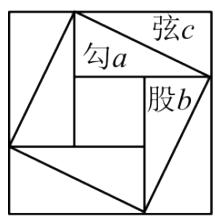

text_image

弦c
勾a
股b

图1

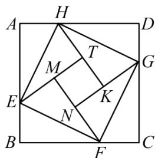

text_image

A
H
D
M
T
G
E
K
N
B
F
C

图2

【变式 6-3】（24-25 八年级上·浙江绍兴·期中）如图，我国汉代数学家赵爽在注解《周髀算经》时给出的“赵爽弦图”，它是由四个全等的直角三角形与中间的小正方形EFGH拼成的一个大正方形ABCD，连接AC，交BE于点P，若正方形ABCD的面积为28， $AE + BE = 7$ ，则 $\triangle CFP$ 与 $\triangle AEP$ 的面积差是\_\_\_\_。

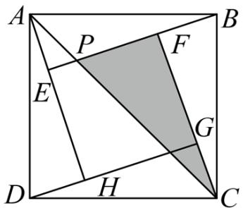

text_image

A
P
F
E
G
D
H
C
B

【题型 7 勾股定理常见模型之勾股树】 教辅资源,关注公众号·全科AA+

【例 7】（24-25 八年级上·河南商丘·期中）有一个边长为 1 的大正方形，经过 1 次“生长”后，在它的左右肩上生出两个小正方形，其中，三个正方形围成的三角形是直角三角形，再经过1次“生长”后，形成的图形如图所示．如果继续“生长”下去，它将变得“枝繁叶茂”，那么“生长”了2023次后形成的图形中所有的正方形的面积和是（）

natural_image

Stylized tree illustration composed of green and orange geometric patterns (no text or symbols)

A. 2024

B. 2023

C. $2^{2002}$

D. $2^{2002} - 1$

【变式 7-1】（24-25 八年级上·安徽安庆·期末）如图是一株美丽的勾股树，其中所有的四边形都是正方形，所有的三角形都是直角三角形。若正方形 A, B, C, D 的面积分别是 3, 5, 2, 3，则正方形 E 的面积是\_\_\_\_，正方形 F 的面积是\_\_\_\_，正方形 G 的面积是\_\_\_\_。

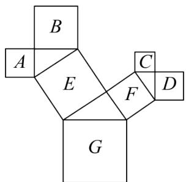

text_image

B
A
E
C
F
D
G

【变式 7-2】（24-25 八年级下·湖南怀化·期中）如图是一种“羊头”形图案，其做法是：从正方形①开始，以它的一边为斜边，向外作等腰直角三角形，然后再以其直角边为边，分别向外作正方形②和②'，…，然后依此类推，若正方形①的面积为 64，则第 4 个正方形的边长为（）

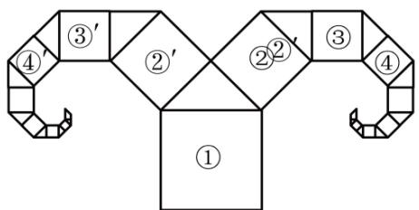

flowchart

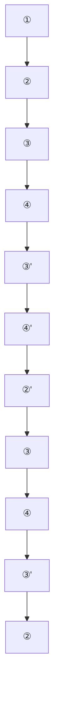

A. $\sqrt{2}$

B. $\sqrt{4}$

C. $\sqrt{8}$

D. $16\sqrt{2}$

【变式 7-3】（24-25 八年级上·贵州毕节·期末）问题情境：

毕达哥拉斯利用勾股定理在初始的大正方形上，作出了两个小正方形（如图1），再以此类推无限重复地作出各种大小不一的正方形，就形成了茂密的“毕达哥拉斯树”，也叫“勾股树”.

解决问题:

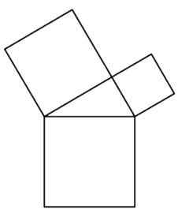

natural_image

Geometric diagram of two overlapping squares forming an open box (no text or symbols)

图1

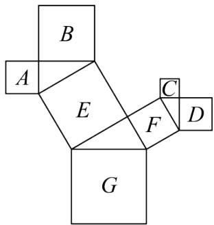

text_image

B
A
E
C
F
D
G

图2

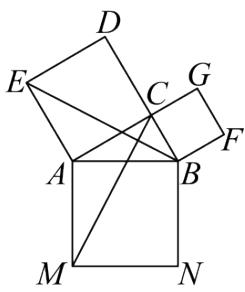

text_image

Geometric diagram with labeled points and intersecting lines, likely from a math problem or proof

图3

(1)如图2, 是一株美丽的“勾股树”, 其中所有的四边形都是正方形, 所有的三角形都是直角三角形. 若正方形 $A, B, C, D$ 的面积分别是3, 5, 2, 3, 则正方形 $E$ 的面积是 , 正方形 $G$ 的边长是 .

(2)如图3, 在一株最简单的“勾股树”中, 连接 $BE$ , $CM$ . 若正方形 $ACDE$ , 正方形 $BCGF$ 的面积分别为64, 16, 求 $CM$ 的长.

# 【题型 8 勾股定理常见模型之斜边上的高】教辅资源,关注公众号·全科AA+

【例 8】（24-25 八年级上·江苏泰州·期中）定义：如果一个三角形一边的平方与另一边上高的平方之和等于第三边的平方，则称这个三角形为“牵手三角形”，这条边与第三边的交点称为“牵手顶点”。例如图 1，在 $\triangle ABC$ 中， $BC > AB, BD$ 是 $AC$ 边上的高，若 $AB^{2} + BD^{2} = BC^{2}$ ，则 $\triangle ABC$ 为“牵手三角形”，点 $B$ 为“牵手顶点”。

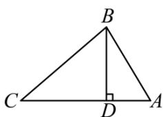

text_image

B
C
D
A

图1

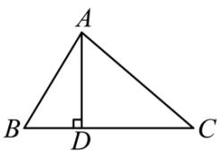

text_image

A
B D C

图2

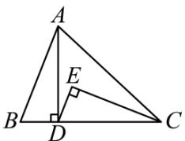

text_image

A
E
B
D
C

图3

(1)等边三角形\_\_\_\_“牵手三角形”（填写“是”或者“不是”）；  
(2)如图 2, 已知 $\triangle ABC$ 为“牵手三角形”, 其中点 $A$ 为“牵手顶点”, $AC > AB$ , $AD$ 是 $BC$ 边上的高. 在不添加其他线段和字母的情况下, 找出图中一组相等的线段, 并说明理由;  
(3)运用（2）中的结论解决下列问题：

①已知 $\triangle ABC$ 为“牵手三角形”，其中点 $C$ 为“牵手顶点”且 $AC > BC, CD$ 是 $AB$ 边上的高．若 $BC = 5, CD = 4$ ，则 $AB$ 的长是 \_\_\_\_；  
②如图3， $\triangle ABC$ 为“牵手三角形”，其中 $AC > AB, A$ 为“牵手顶点”， $AD$ 是 $BC$ 边上的高， $\angle DEC = 90^{\circ}$ ，若 $BD = DE, \angle ACB = 2\angle BAD$ 。求证： $\triangle ABC$ 为等腰三角形。

【变式 8-1】（24-25 八年级下·山东聊城·阶段练习）如图，在 $\triangle ABC$ 中， $CD \perp AB$ 于点 D，AC = 4，

$$
B C = 3, D B = \frac {9}{5}.
$$

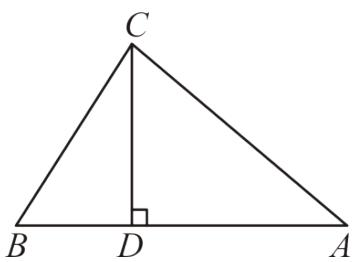

text_image

C
B D A

(1)求CD的长;   
(2)求AD的长;

【变式 8-2】（24-25 八年级下·甘肃武威·期中）如图，在 $\triangle ABC$ 中， $\angle ACB = 90^{\circ}$ ，点 $D$ 、 $F$ 为边 $AB$ 上点，连接 $CD$ 、 $CF$ ，将边 $BC$ 沿 $CD$ 翻折，使点 $B$ 的对称点在边 $AB$ 上的点 $E$ 处；再将边 $AC$ 沿 $CF$ 翻折，使点 $A$ 的对称点落在 $CE$ 的延长线上的点 $A'$ 处．若 $AC = 4$ ， $AB = 5$ ，则 $EF$ 的长为 \_\_\_\_.

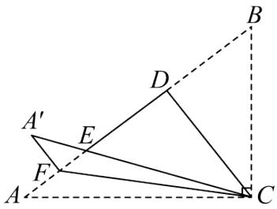

text_image

Geometric diagram showing triangle ABC with auxiliary points D, E, F and dashed lines forming a quadrilateral

【变式 8-3】（24-25 八年级上·陕西汉中·期末）【问题提出】

（1）如图 1，AD 为 $\triangle ABC$ 的边 BC 上的高，若 $AB = \sqrt{13}$ ，AD = BC = 3，则 CD 的长为 \_\_\_\_；

# 【问题探究】

（2）如图 2，在 $\triangle ABC$ 中， $\angle B = 90^{\circ}$ ，AD 平分 $\angle BAC$ 交 BC 于点 D，若 BD = 6，CD = 10，求 AB 的长；

# 【问题解决】

（3）如图 3，直线 l 是一条小路， $\triangle ABC$ 是李叔叔家的一块花园的平面示意图，其中边 BC 在小路 l 上，AC 边上的点 D 处有一口灌溉水井，经测量， $\angle ACB = 90^{\circ}$ ，AC = BC = 80 米，CD = 30 米．李叔叔计划对该花园进行扩建，在点 C 右侧的小路 l 上取点 E，并在 $\triangle ABD$ 、 $\triangle AED$ 、 $\triangle BED$ 内分别种植不同的花卉，根据李叔叔的规划要求， $\angle AED = \angle CED$ ，请你计算 $\triangle BED$ 区域的面积.

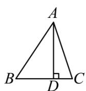  
图1

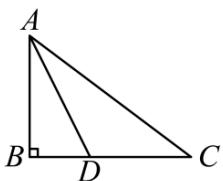

text_image

A
B D C

图2

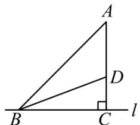

text_image

A
D
B
C
l

图3