# 专题 1.1 探索勾股定理（举一反三讲义）

【北师大版 2024】

# 题型归纳

【题型 1 利用勾股定理求边长】....2

【题型 2 勾股定理与折叠】....6

【题型 3 勾股定理与方程】....9

【题型 4 勾股定理与网格】....13

【题型 5 利用勾股定理证平方关系】....16

【题型 6 勾股定理常见模型之赵爽线图】....22

【题型 7 勾股定理常见模型之勾股树】....27

【题型 8 勾股定理常见模型之斜边上的高】....30

# 举一反三

# 知识点1 勾股定理

1. 定义: 直角三角形两直角边的平方和等于斜边的平方, 如果用 $a$ , $b$ 和 $c$ 分别表示直角三角形的两直角边和斜边, 那么 $a^2 + b^2 = c^2$ .

如图所示， $\triangle ABC$ 是直角三角形，其中较短的直角边 $a$ 叫做勾，较长的直角边 $b$ 叫做股，斜边 $c$ 叫做弦.

text_image

A
b
(股)
c
(弦)
C
a(勾)
B

# 知识点 2 勾股定理的验证

勾股定理的验证主要通过拼图法完成，这种方法是以数形转换为指导思想，图形拼补为手段，各部分面积之间的关系为依据来实现的。用两种方式表示图形面积（算两次），根据面积相同得到等量关系，进而进行等量变换得到勾股定理公式是证明勾股定理的常见方法。

# 拼图法验证勾股定理的一般步骤

<table><tr><td rowspan="3">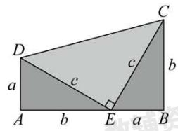</td><td>(1) 拼出图形</td><td>直角梯形(3个直角三角形)</td></tr><tr><td>(2)用两种方式表示图形面积</td><td> $\frac{1}{2}(a + b) \times (a + b), \frac{1}{2}ab + \frac{1}{2}c^2 + \frac{1}{2}ab$ </td></tr><tr><td>(3)根据面积相同得到等量关系</td><td> $\frac{1}{2}(a + b)^2 = \frac{1}{2}c^2 + ab$ </td></tr><tr><td rowspan="2"></td><td>(4) 恒等变形</td><td> $a^{2} + b^{2} + 2ab = c^{2} + 2ab$ </td></tr><tr><td>(5) 推导出勾股定理</td><td> $a^{2} + b^{2} = c^{2}$ </td></tr></table>

# 知识点 3 勾股定理的应用

利用勾股定理可以解决与直角三角形有关的问题，主要应用如下：

(1)已知直角三角形的任意两边长，求第三边长；  
(2)已知直角三角形的任意一边长，确定另外两边长的关系；  
(3)解决包含平方关系的几何问题;  
(4)构造方程计算有关线段的长度问题，解决生产生活中的一些实际问题.

# 【题型 1 利用勾股定理求边长】

【例 1】（24-25 九年级上·山西吕梁·期末）如图，在长方形ABCD中，若 $AB = 3, BD = 5, \frac{DE}{BC} = \frac{1}{4}$ ，则线段CE的长为\_\_\_\_。

text_image

A
E
D
F
B
C

【答案】 $\sqrt{10}$

【分析】本题考查了勾股定理，熟练掌握勾股定理是解题的关键.

由长方形的性质得出 $\angle A = \angle D = 90^{\circ}$ ， $BC = AD$ ， $CD = AB = 3$ ，利用勾股定理得出 $AD = \sqrt{BD^2 - AB^2} = 4$ 再由已知条件可得出 $DE = 1$ ，再利用勾股定理即可得出答案.

【详解】解：∵四边形ABCD是长方形，

$$
\therefore \angle A = \angle D = 9 0 ^ {\circ}, B C = A D, C D = A B = 3
$$

$$
\because B D = 5,
$$

$$
\therefore A D = \sqrt {B D ^ {2} - A B ^ {2}} = 4,
$$

$$
\therefore B C = 4,
$$

$$
\because \frac {D E}{B C} = \frac {1}{4}
$$

$$
\therefore D E = 1,
$$

$$
\therefore C E = \sqrt {C D ^ {2} + D E ^ {2}} = \sqrt {3 ^ {2} + 1 ^ {2}} = \sqrt {1 0}
$$

故答案为: $\sqrt{10}$ .

【变式 1-1】（24-25 九年级上·广西河池·期末）如图， $\triangle ABC$ 与 $\triangle DEC$ 关于点 $C$ 成中心对称， $AB=3$ ， $AE=5$ ， $\angle BAD=90^{\circ}$ ，则点 $A$ 到 $BE$ 的距离是\_\_\_\_.

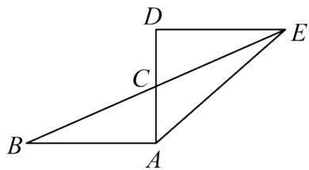

text_image

D
C
B
A
E

【答案】 $\frac{6\sqrt{13}}{13}$

【分析】本题考查了中心对称图形的性质、勾股定理等知识，熟练掌握中心对称图形的性质是解题关键．过点A作 $AF \perp BE$ 于点F，先根据中心对称图形的性质可得DE = AB = 3，AC = DC， $\angle D = \angle BAD = 90^{\circ}$ ，利用勾股定理可得AD = 4，从而可得AC = 2，再利用勾股定理可得 $BC = \sqrt{13}$ ，然后利用三角形的面积公式求解即可得.

【详解】解：如图，过点A作 $AF \perp BE$ 于点F，

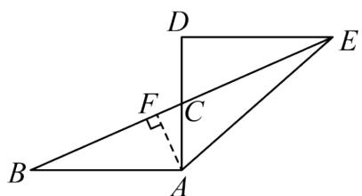

text_image

Geometric diagram of a parallelogram ABCD with diagonal AC and perpendicular from D to AB at C, labeled with points A, B, C, D, E, F.

∵ $\triangle ABC$ 与 $\triangle DEC$ 关于点 C 成中心对称，AB = 3， $\angle BAD = 90^{\circ}$ ，

$$
\therefore D E = A B = 3, A C = D C, \angle D = \angle B A D = 9 0 ^ {\circ},
$$

$$
\because A E = 5,
$$

$$
\therefore A D = \sqrt {A E ^ {2} - D E ^ {2}} = 4,
$$

$$
\therefore A C = D C = 2,
$$

$$
\therefore B C = \sqrt {A B ^ {2} + A C ^ {2}} = \sqrt {1 3},
$$

$$
\because S _ {\triangle A B C} = \frac {1}{2} A F \cdot B C = \frac {1}{2} A B \cdot A C,
$$

$$
\therefore A F = \frac {A B \cdot A C}{B C} = \frac {3 \times 2}{\sqrt {1 3}} = \frac {6 \sqrt {1 3}}{1 3},
$$

即点A到BE的距离是 $\frac{6\sqrt{13}}{13}$ ,

故答案为： $\frac{6\sqrt{13}}{13}$ .

【变式 1-2】（24-25 八年级下·上海·期中）如图，在梯形ABCD中， $AD \parallel BC$ ，如果AD = 2，BC = 10，梯形ABCD的面积为48．取CD的中点E，连接AE并延长，与BC的延长线交于点F．如果 $\angle DAF = \angle ABC$ ，那么AB

的长是\_\_\_\_。

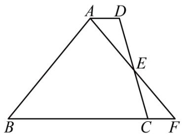

text_image

A
D
E
B
C
F

【答案】10

【分析】本题考查了全等三角形的判定与性质，等腰三角形的判定与性质，勾股定理，熟练掌握以上知识点是解题的关键．过点A作AM⊥BC于点M，根据梯形的面积可求得AM，然后利用AAS可证得

$\triangle DAE \cong \triangle CFE$ ，得到 $S_{\triangle DAE} = S_{\triangle CFE}$ ，进而可推出 $S_{\triangle ABF} = 48$ ，即可求得 $BF$ ，然后由 $\angle DAF = \angle ABC$ ，可知 $\angle ABC = \angle AFB$ ，根据等角对等边可知 $\triangle ABF$ 为等腰三角形，然后利用三线合一和勾股定理即可求得 $AB$ .

【详解】解：过点A作 $AM \perp BC$ 于点M，如图所示，

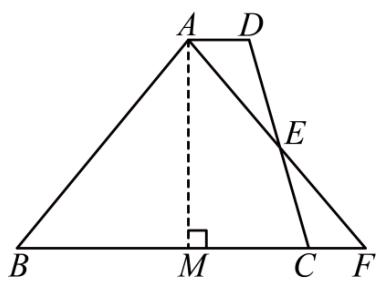

text_image

A
D
E
B
M
C
F

∵ AD = 2, BC = 10，梯形ABCD的面积为48，

$\therefore \frac{1}{2} (AD + BC) \cdot AM = 48$ ，即 $\frac{1}{2}(2 + 10) \cdot AM = 48$

$$
\therefore A M = 8,
$$

$$
\because A D \parallel B C,
$$

$$
\therefore \angle D A E = \angle C F E, \angle A D E = \angle F C E,
$$

又∵点E为CD的中点，

$$
\therefore D E = C E,
$$

$$
\therefore \triangle D A E \cong \triangle C F E (A A S),
$$

$$
\therefore S _ {\triangle D A E} = S _ {\triangle C F E},
$$

$$
\therefore S _ {\text {梯形} A B C D} = S _ {\text {四边形} A B C E} + S _ {\triangle D A E} = S _ {\text {四边形} A B C E} + S _ {\triangle C F E} = S _ {\triangle A B F} = 4 8,
$$

∴ $\frac{1}{2}BF\cdot AM=48$ ，即 $\frac{1}{2}\times8\times BF=48$ ，

$$
\therefore B F = 1 2,
$$

$$
\because \angle D A F = \angle A B C, \angle D A E = \angle C F E,
$$

$$
\therefore \angle A B C = \angle A F B,
$$

$$
\therefore A B = A F,
$$

$$
\because A M \perp B F,
$$

$$
\therefore B M = M F = \frac {1}{2} B F = \frac {1}{2} \times 1 2 = 6,
$$

$$
\therefore A B = \sqrt {A M ^ {2} + B M ^ {2}} = \sqrt {8 ^ {2} + 6 ^ {2}} = 1 0,
$$

故答案为：10.

【变式 1-3】（24-25 八年级下·云南临沧·期中）如图，将 $\triangle ABC$ 绕点 $A$ 顺时针旋转 $60^{\circ}$ 得到 $\triangle AED$ ，点 $B$ 、 $C$ 的对应点分别为点 $E$ 、 $D$ ，连接 $BE$ ，点 $D$ 恰好落在线段 $BE$ 上，若 $BD = 6$ ， $BC = 2$ ，则 $AC$ 的长为（）

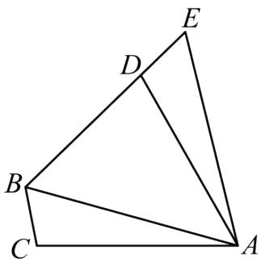

text_image

Geometric diagram of triangle ABC with points D and E on sides, and segment BD drawn

A. $\sqrt{13}$

B. $2\sqrt{13}$

C. $4\sqrt{3}$

D. $2\sqrt{26}$

【答案】B

【分析】本题考查了旋转的性质，等边三角形的判定和性质，勾股定理；过点 A 作 $AF \perp BE$ 于点 F，根据旋转的性质证明 $\triangle ABE$ 为等边三角形，然后求出 BF，再利用勾股定理计算出 AF 和 AD 即可.

【详解】解：过点 A 作 $AF \perp BE$ 于点 F，

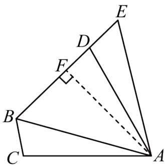

text_image

Geometric diagram of triangle ABC with points D, E, F and perpendicular line EF

由旋转得， $DE = BC = 2$ ，AD = AC，AB = AE， $\angle BAE = 60^{\circ}$ ，

$\therefore\triangle ABE$ 为等边三角形，

$$
\therefore \angle A B E = 6 0 ^ {\circ}, A B = B E = B D + D E = 8,
$$

$$
\therefore B F = \frac {1}{2} B E = 4, A F = \sqrt {A B ^ {2} - B F ^ {2}} = 4 \sqrt {3},
$$

$$
\therefore D F = B D - B F = 6 - 4 = 2,
$$

由勾股定理得， $AD = \sqrt{AF^2 + DF^2} = \sqrt{(4\sqrt{3})^2 + 2^2} = 2\sqrt{13},$

∴ AC 的长为 $2\sqrt{13}$ .

故选：B.

# 【题型2 勾股定理与折叠】

【例 2】（24-25 八年级下·北京·期中）如图，在Rt△ABC中，∠C=90°，AC=6，BC=4，D是AC的中点，E是BC上一点，连接BD、DE．将△CDE沿DE翻折，点C落在BD上的点F处，则CE的长是（）

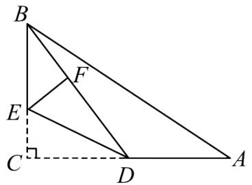

text_image

Geometric diagram of triangle ABC with internal points D, E, F and perpendicular lines from A to BC

A. 1.5

B. 2

C. 2.5

D. 3

【答案】A

【分析】本题考查勾股定理与折叠问题，勾股定理求出BD的长，折叠得到CD = DF，CE = EF, $\angle EFD = 90^{\circ}$ ，设CE = x，在Rt $\triangle BFE$ 中，利用勾股定理进行求解即可.

【详解】解： $\because \angle ACB = 90^{\circ}, AC = 6, BC = 4, D$ 是边 $AC$ 的中点，

$$
\therefore C D = \frac {1}{2} A C = 3,
$$

$$
\therefore B D = \sqrt {B C ^ {2} + C D ^ {2}} = 5,
$$

∵将 $\triangle CDE$ 沿 DE 翻折，点 C 落在 BD 上的点 F 处，

$$
\therefore C D = D F = 3, \quad C E = E F, \angle E F D = 9 0 ^ {\circ},
$$

$$
\therefore B F = B D - D F = 2, \angle B F E = 9 0 ^ {\circ},
$$

设CE = x，则：EF = x, BE = BC - CE = 4 - x,

在Rt $\triangle BFE$ 中，由勾股定理，得： $(4-x)^{2}=x^{2}+2^{2}$

解得：x = 1.5;

$$
\therefore C E = 1. 5;
$$

故选：A.

【变式 2-1】（24-25 八年级上·河南郑州·期中）小明在帮妹妹完成手工作业的时候发现了其中的数学问题，如图，在 $\triangle ABC$ 中， $\angle BAC = 90^{\circ}$ ， $AB = 4$ ， $AC = 8$ ，沿过点 $A$ 的直线折叠，使点 $B$ 落在 $BC$ 边上的点 $D$ 处，再次折叠，使点 $C$ 与点 $D$ 重合，折痕交 $AC$ 于点 $E$ ，则 $AE$ 的长度为（）

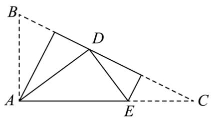

text_image

Geometric diagram with labeled points A, B, C, D, E and dashed lines forming triangles and a quadrilateral

A. 4

B. 5

C. 6

D. 7

【答案】B

【点睛】本题考查了折叠的性质，勾股定理，掌握折叠的性质以及勾股定理是解题的关键.

根据题意可得 $AD = AB = 4$ ， $\angle B = \angle ADB$ ， $CE = DE$ ， $\angle C = \angle CDE$ ，可得 $\angle ADE = 90^{\circ}$ ，继而设 $AE = x$ ，则 $CE = DE = 8 - x$ ，根据勾股定理即可求解.

【详解】解：∵沿过点 A 的直线将纸片折叠，使点 B 落在边 BC 上的点 D 处，AB = 4，

$$
\therefore A D = A B = 4, \angle B = \angle A D B,
$$

∵折叠纸片，使点 C 与点 D 重合，

$$
\therefore C E = D E, \angle C = \angle C D E,
$$

$$
\because \angle B A C = 9 0 ^ {\circ},
$$

$$
\therefore \angle B + \angle C = 9 0 ^ {\circ},
$$

$$
\therefore \angle A D B + \angle C D E = 9 0 ^ {\circ},
$$

$$
\therefore \angle A D E = 9 0 ^ {\circ},
$$

$$
\therefore A D ^ {2} + D E ^ {2} = A E ^ {2},
$$

设AE = x, AC = 8,

则CE = DE = 8 - x,

$$
\therefore 4 ^ {2} + (8 - x) ^ {2} = x ^ {2},
$$

解得x=5，

即AE = 5，

故选：B.

【变式 2-2】（24-25 八年级上·陕西汉中·期末）如图，在 $\triangle ABC$ 中，AB = 6，AC = 8，BC = 10，点 D 为 AB 上一点，将 $\triangle BCD$ 沿 CD 所在直线折叠后，点 B 的对应点 E 恰好落在 CA 的延长线上，则 AD 的长为（）

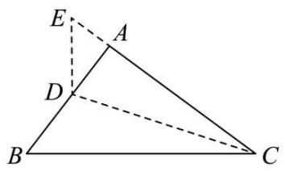

text_image

Geometric diagram of triangle ABC with points D and E, showing dashed lines from A to B and C to C.

A. 5

B. 4

C. 3

D. $\frac{8}{3}$

【答案】D

【分析】本题考查了勾股定理及其逆定理，折叠的性质，熟练掌握勾股定理的应用是解题关键．由勾股定理的逆定理可知 $\angle BAC = 90^{\circ}$ ，由折叠的性质可知， $CE = BC = 10$ ， $BD = DE$ ，设 $AD = x$ ，则 $BD = DE = 6 - x$ ，再利用勾股定理列方程求解即可.

【详解】解：在 $\triangle ABC$ 中，AB = 6，AC = 8，BC = 10，

$$
\therefore A B ^ {2} + A C ^ {2} = B C ^ {2},
$$

$$
\therefore \angle B A C = 9 0 ^ {\circ},
$$

由折叠的性质可知，CE = BC = 10，BD = DE，

$$
\therefore A E = C E - A C = 2,
$$

设AD = x，则BD = DE = 6 - x，

在Rt $\triangle ADE$ 中， $AD^{2} + AE^{2} = DE^{2}$ ，

$$
\therefore x ^ {2} + 2 ^ {2} = (6 - x) ^ {2},
$$

解得： $x=\frac{8}{3}$ ,

故选：D

【变式 2-3】（24-25 八年级下·河北廊坊·阶段练习）如图，在长方形ABCD中， $AB=\frac{13}{2}$ ，BC=12，
AG = 13，沿边AE所在直线翻折△ABE，AB与AF重合，点F在AG上，则CE的长是\_\_\_\_。

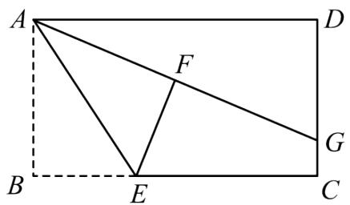

text_image

A
F
B
E
C
D
G

【答案】 $\frac{23}{3}/7\frac{2}{3}$

【分析】本题考查了长方形的性质，勾股定理与折叠问题，连接EG．证明EF垂直平分AG得AE=GE．在Rt△ADG中，由勾股定理求出DG=5，然后根据 $AB^{2}+BE^{2}=CE^{2}+CG^{2}$ 求解即可.

【详解】解：如图，连接EG.

∵四边形ABCD是长方形，

$$
\therefore \angle B = \angle C = \angle D = 9 0 ^ {\circ}, A B = C D = \frac {1 3}{2}, A D = B C = 1 2.
$$

根据题意， $\angle AFE = \angle B = 90^{\circ}$ ， $AF = AB = \frac{13}{2}$ .

$$
\because A G = 1 3,
$$

$$
\therefore F G = A G - A F = \frac {1 3}{2},
$$

$$
\therefore A F = F G,
$$

∴EF垂直平分AG，

$$
\therefore A E = G E.
$$

$$
\because A D = B C = 1 2, \quad A G = 1 3, \quad \angle D = 9 0 ^ {\circ},
$$

$$
\therefore D G = \sqrt {1 3 ^ {2} - 1 2 ^ {2}} = 5,
$$

$$
\therefore C G = C D - D G = \frac {3}{2}.
$$

在Rt $\triangle ABE$ 中， $AE^{2}=AB^{2}+BE^{2}$

在Rt $\triangle CEG$ 中， $GE^{2}=CE^{2}+CG^{2}$ .

$$
\because A E = G E,
$$

$$
\therefore A B ^ {2} + B E ^ {2} = C E ^ {2} + C G ^ {2},
$$

$$
\therefore \left(\frac {1 3}{2}\right) ^ {2} + (1 2 - C E) ^ {2} = \left(\frac {3}{2}\right) ^ {2} + C E ^ {2},
$$

解得 $CE=\frac{23}{3}$ .

故答案为： $\frac{23}{3}$ .

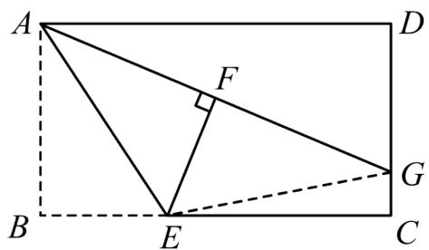

text_image

A
F
B
E
C
D
G

# 【题型3 勾股定理与方程】

【例 3】（24-25 九年级上·黑龙江哈尔滨·期末）如图，在 $\triangle ABC$ 中，AB = AC，点 D 为 AC 边上的一点，AD = BD， $AE \perp BD$ 于点 E，若 AE = 3， $BC = \sqrt{10}$ ，则线段 BD 的长为 \_\_\_\_.

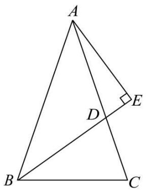

text_image

A
D
E
B
C

【答案】 $\frac{25}{8}$

【详解】过点 B 作 $BF \perp AC$ 于点 F，证明 $\triangle ABE \cong \triangle BAF$ （AAS），得 BF = AE = 3，再由勾股定理求出 CF = 1，设 AF = x，则 AB = AC = x + 1，进而在 Rt $\triangle ABF$ 中，由勾股定理求出 AF = 4，设 BD = AD = a，则 DF = AF - AD = 4 - a，然后在 Rt $\triangle BDF$ 中，由勾股定理求出 BD 即可.

【解答】解：如图，过点 B 作 $BF \perp AC$ 于点 F，

$$
\because A E \perp B D, B F \perp A C,
$$

$$
\therefore \angle A E B = \angle B F A = 9 0 ^ {\circ},
$$

$$
\because A D = B D,
$$

$$
\therefore \angle A B E = \angle B A F,
$$

在 $\triangle ABE$ 和 $\triangle BAF$ 中，

$$
\left\{ \begin{array}{c} \angle A B E = \angle B A F \\ \angle A E B = \angle B A F \\ A B = B A \end{array} \right.,
$$

$$
\therefore \triangle A B E \cong \triangle B A F (\text { A   A   S }),
$$

$$
\therefore B F = A E = 3,
$$

在Rt $\triangle BCF$ 中，由勾股定理得： $CF = \sqrt{BC^2 - BF^2} = \sqrt{(\sqrt{10})^2 - 3^2} = 1$ ，设 $AF = x$ ，则

$$
A B = A C = A F + 1 = x + 1,
$$

在Rt△ABF中，由勾股定理得： $AF^{2}+BF^{2}=AB^{2}$ ，

即 $x^{2}+3^{2}=(x+1)^{2}$ ,

解得：x = 4，

$$
\therefore A F = 4,
$$

设BD = AD = a，则DF = AF - AD = 4 - a，

在Rt $\triangle BDF$ 中，由勾股定理得： $DF^{2} + BF^{2} = BD^{2}$ ，

即 $(4 - a)^{2} + 3^{2} = a^{2}$

解得： $a=\frac{25}{8}$ ,

$$
\therefore B D = \frac {2 5}{8},
$$

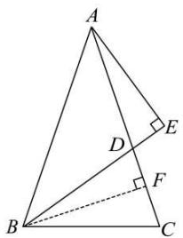

text_image

Geometric diagram of triangle ABC with perpendiculars from points D and E to base BC, labeled with right angles at F and D.

故答案为： $\frac{25}{8}$ .

【点睛】本题考查了全等三角形的判定与性质，等腰三角形的性质以及勾股定理等知识，熟练掌握勾股定理，正确作出辅助线构造全等三角形是解题的关键.

【变式 3-1】（24-25 八年级下·湖北孝感·期中）如图，在 $\triangle ABC, AB=7, BC=8, AC=5$ ，求 $\triangle ABC$ 的面积.

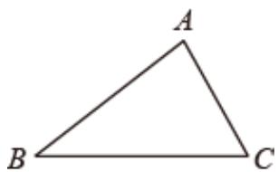

natural_image

Simple geometric triangle labeled ABC with vertices marked (no additional text or symbols)

【答案】 $10\sqrt{3}$

【分析】作 $AD \perp BC$ 于 D，设 CD = x，则 BD = 8 - x，然后由勾股定理可得 $7^{2} - (8 - x)^{2} = 5^{2} - x^{2}$ ，进而求解 x，即可得 AD 的长，最后根据三角形面积公式即可求解.

【详解】作 $AD \perp BC$ 于 D，如图所示：

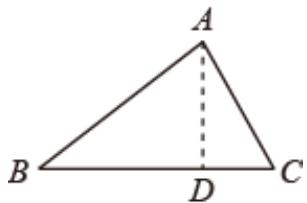

text_image

A
B D C

设 CD=x，则 BD=8-x，

在 $Rt\triangle ADB$ 中，由勾股定理可得： $AD^{2}=AB^{2}-BD^{2}$

在 $Rt\triangle ADB$ 中，由勾股定理可得： $AD^{2}=AC^{2}-CD^{2}$

$$
\therefore 7 ^ {2} - (8 - x) ^ {2} = 5 ^ {2} - x ^ {2},
$$

解得， $x=\frac{5}{2}$ ,

在 $Rt\triangle ACD$ 中， $AD = \sqrt{AC^2 - CD^2} = \sqrt{5^2 - \left(\frac{5}{2}\right)^2} = \frac{5}{2}\sqrt{3}$

$$
\therefore S _ {\triangle A B C} = \frac {1}{2} B C \cdot A D = \frac {1}{2} \times 8 \times \frac {5}{2} \sqrt {3} = 1 0 \sqrt {3}.
$$

【点睛】本题主要考查勾股定理，熟练掌握勾股定理是解题的关键.

【变式 3-2】（24-25 八年级上·江西吉安·期末）如图，在 $\triangle ABC$ 中， $\angle B = 90^{\circ}$ ，点 D 在 AB 边上，若 BD = 10，BC = 5，且 $AD + AC = BD + BC$ ，求 AD 的长.

text_image

Geometric diagram of a right triangle ABC with point D on base AB and right angle at B

【答案】2

【分析】本题主要考查了勾股定理的应用，解题关键是根据勾股定理列出方程并求解.

设AD = x，根据题意可知 $AB = x + 10$ ，AC = 15 - x，再根据勾股定理可知 $AB^{2} + BC^{2} = AC^{2}$ ，代入数值求解后即可计算AB的长.

【详解】解：设AD = x，

$$
\because B D = 1 0, \quad B C = 5, \quad A D + A C = B D + B C,
$$

$$
\therefore A C = B D + B C - A D = 1 5 - x, \quad A B = B D + A D = 1 0 + x,
$$

再Rt $\triangle ABC$ 中， $\angle B = 90^{\circ}$ ，根据勾股定理可知， $AB^{2} + BC^{2} = AC^{2}$ ，

即 $(x+10)^{2}+5^{2}=(15-x)^{2}$ ,

解得x=2，

$$
\therefore A D = 2.
$$

【变式 3-3】（24-25 八年级下·山东德州·期中）如图，在Rt△ABC中，∠C=90°,AC=6,BC=8，D、E分别是斜边AB和直角边CB上的点．把△ABC沿着直线DE折叠，顶点B的对应点是点B'．若点B'落在直角边AC的中点上，则BE的长是（）

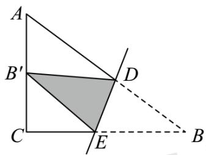

text_image

A
B'
C
E
D
B

A. $\frac{55}{16}$

B. 4

C. 5

D. $\frac{73}{16}$

【答案】D

【分析】根据题意，得 $CB'=\frac{1}{2}AC=3,\quad BE=B'E$ ，则CE=BC-BE=8- $B'E$ ，

根据勾股定理，得 $B^{\prime}E^{2}=(8-B^{\prime}E)^{2}+9$ ，解答即可.

本题考查了折叠的性质，勾股定理，熟练掌握定理和性质是解题的关键.

【详解】解： $\because \angle C = 90^{\circ}, AC = 6, BC = 8$ ， $\triangle ABC$ 沿着直线 $DE$ 折叠，顶点 $B$ 的对应点是点 $B'$ 。且点 $B'$ 落在直角边 $AC$ 的中点上，

$$
\therefore C B ^ {\prime} = \frac {1}{2} A C = 3, B E = B ^ {\prime} E,
$$

则CE = BC - BE = 8 - B'E,

根据勾股定理，得 $B^{\prime}E^{2}=(8-B^{\prime}E)^{2}+9$ ，

解得 $B^{\prime}E=\frac{73}{16}$ ,

则BE = $\frac{73}{16}$ ,

故选：D.

# 【题型4 勾股定理与网格】

【例 4】（24-25 八年级下·山东潍坊·阶段练习）如图，在边长为1的小正方形网格中， $\triangle ABC$ 位置如图所示，则点A到线段BC的距离为（）

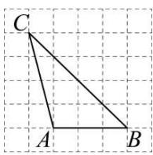

A. 3

B. $\frac{3\sqrt{3}}{2}$

C. 2

D. $\frac{3\sqrt{2}}{2}$

【答案】D

【分析】本题以网格背景考查勾股定理、三角形面积计算公式．求出 $\triangle ABC$ 的面积、 $BC$ 边的长，再利用三角形面积公式列方程求解即可．熟练利用面积法是解题的关键.

【详解】解：设点A到线段BC的距离等于h，

∵小正方形的边长为1

$$
\therefore S _ {\triangle A B C} = \frac {1}{2} \times 3 \times 4 = 6,
$$

$$
B C = \sqrt {4 ^ {2} + 4 ^ {2}} = 4 \sqrt {2},
$$

$\because \frac{1}{2} BC \cdot h = S_{\triangle ABC} = 6$ ，即 $\frac{1}{2} \times 4\sqrt{2} h = 6$

$$
\therefore h = \frac {3 \sqrt {2}}{2},
$$

∴点A到线段BC的距离为 $\frac{3\sqrt{2}}{2}$ .

故选：D.

【变式 4-1】（24-25 八年级上·江苏泰州·期末）如图，在边长为 1 的小正方形组成的网格中，点 A, B, C 都是格点，在图中找一点 O，使得 OA = OB = OC，则 OA 的长为 \_\_\_\_.

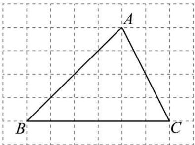

text_image

A
B
C

【答案】 $\sqrt{10}$

【分析】本题考查的是线段的垂直平分线的性质与判定，勾股定理的应用，先利用网格特点画出点 $O$ ，再利用勾股定理计算即可.

【详解】解：如图，

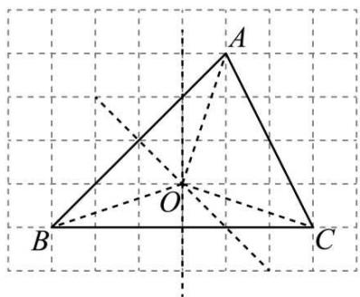

text_image

A
O
B
C

$$
\because O A = O B = O C,
$$

∴O在线段AB,BC的垂直平分线上，

$$
\therefore O A = O B = \sqrt {1 ^ {2} + 3 ^ {2}} = \sqrt {1 0},
$$

故答案为： $\sqrt{10}$

【变式 4-2】（24-25 八年级上·江苏南通·期末）如图，在 $4 \times 4$ 的网格中，每个小正方形的边长为 1，点 $A, B, C, D$ 均在格点上， $E$ 是 $AB$ 与网格线的交点，则 $DE$ 的长是（）

text_image

Geometric diagram with labeled points A, B, C, D, E on a grid background

A. $\sqrt{3}$

B. $\frac{3}{2}$

C. $\sqrt{2}$

D. $\frac{\sqrt{5}}{2}$

【答案】B

【分析】本题考查了勾股定理及其逆定理，三角形的面积.

先通过勾股定理和逆定理证明出 $AC \perp BC$ ，再用等面积法求出 $CE = \frac{5}{2}$ ，即可求出DE.

【详解】解：根据题意利用勾股定理计算出：

$$
A C = \sqrt {2 ^ {2} + 1 ^ {2}} = \sqrt {5}, A B = \sqrt {3 ^ {2} + 4 ^ {2}} = 5, B C = \sqrt {4 ^ {2} + 2 ^ {2}} = 2 \sqrt {5},
$$

$$
\therefore A B ^ {2} = A C ^ {2} + B C ^ {2},
$$

∴ $\triangle ABC$ 是直角三角形， $\angle ACB = 90^{\circ}$ ,

$$
\therefore S _ {\triangle A B C} = \frac {1}{2} A C \cdot B C = 5,
$$

$$
\because S _ {\triangle A B C} = S _ {\triangle B C E} + S _ {\triangle A C E}
$$

$$
\therefore S _ {\triangle A B C} = \frac {1}{2} \times C E \times 2 + \frac {1}{2} \times C E \times 2 = 5,
$$

解得： $CE=\frac{5}{2}$ ,

$$
\therefore D E = C D - C E = 4 - \frac {5}{2} = \frac {3}{2},
$$

故选：B.

【变式 4-3】（24-25 八年级上·北京朝阳·期末）如图，在 $3 \times 3$ 的正方形网格中， $\triangle ABC$ 的 3 个顶点均在正方形的顶点（格点）上，这样的三角形叫做格点三角形。 $E$ 为网格图中与 $\triangle ABC$ 全等的格点三角形（ $\triangle ABC$ 除外）的一个顶点，其对应点为 $C$ 。若在平面直角坐标系中，点 $A$ 的坐标为 $(0,3)$ ，点 $C$ 的坐标为 $(2,0)$ ，点 $E$ 在坐标轴上，则点 $E$ 的坐标为 \_\_\_\_.

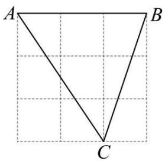

text_image

A
B
C

【答案】(1,0)或(0,1)或 (0,2)

【分析】本题考查了全等三角形的判定的应用，熟练掌握三角形全等的判定方法，找出符合条件的所有三角形是解此题的关键.

三角形的各个顶点都在格点上，所以任意长度都可用勾股定理计算得出，本题可以采用“三边对应相等”进行判定三角形全等.

【详解】∵点 A 的坐标为 $(0,3)$ ，点 C 的坐标为 $(2,0)$ ，

∴坐标系原点在点 A 的下方 3 个单位，在点 C 的左方 2 个单位处，建立坐标系，如图，

∴点 B 的坐标为(3,3)，

$$
\therefore A B = 3, A C = \sqrt {2 ^ {2} + 3 ^ {2}} = \sqrt {1 3}, B C = \sqrt {(3 - 2) ^ {2} + 3 ^ {2}} = \sqrt {1 0},
$$

∵点E为网格图中与 $\triangle ABC$ 全等的格点三角形的一个顶点，对应点为C，在坐标轴上，

∴符合条件的点 E 的坐标有(1,0)或(0,1)或(0,2).

故答案为：(1,0)或(0,1)或(0,2).

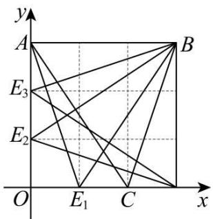

text_image

y
A
E₃
E₂
O
E₁
C
x
B

# 【题型5 利用勾股定理证平方关系】

【例 5】（24-25 八年级上·四川成都·期中）如图 $\triangle ABD$ 和 $\triangle ACE$ 是 $\triangle ABC$ 外两个等腰直角三角形， $\angle BAD = \angle CAE = 90$ ，下列说法正确的是：\_\_\_\_.

①CD = BE，且 $DC \perp BE;$   
② $DE^{2}+BC^{2}=2BD^{2}+EC^{2};$   
③FA平分∠DFE;

④取BC的中点M，连MA，则 $MA \perp DE$ .

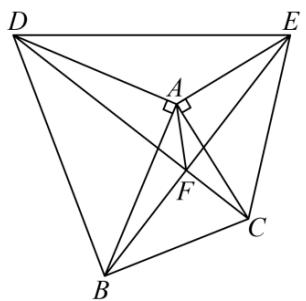

text_image

Geometric diagram with labeled points A, B, C, D, E, F and connecting lines forming triangles and a right angle at vertex A

【答案】①③④

【分析】①由 $\triangle ABD$ 与 $\triangle ACE$ 是等腰直角三角形，AD = AB，AC = AE， $\angle DAB = \angle EAC$ 可证 $\triangle ADC \cong \triangle ABE(SAS)$ ，CD = BE， $\angle AEB = \angle ACD$ 且 $\angle ARE = \angle FRC$ ， $\angle EAR = 90^{\circ}$

$\angle AER + \angle ARE = \angle FCR + \angle FRC$ ，即可退出；

②由 $DC \perp BE$ ，由勾股定理 $DF^{2} + EF^{2} = DE^{2}$ ， $BF^{2} + CF^{2} = BC^{2}$ ，

$DE^{2}+BC^{2}=(DF^{2}+BF^{2})+(CF^{2}+EF^{2})=BD^{2}+EC^{2}$ ，即可；

③过点A作 $AS \perp DC$ ， $AG \perp BE$ ，可证 $\triangle ADS \cong \triangle ABG(AAS)$ ，由性质得AS = AG，结合 $AS \perp DC$ ， $AG \perp BE$ ，即可；

④取BC中点M，使得AM=MN，易证 $\triangle BMN\cong\triangle CMA(SAS)$ ，推出BN=AC，再证 $\triangle DAE\cong\triangle ABN(SAS)$ ，推出 $\angle BAN=\angle ADH$ ，由 $\angle DAH+\angle BAN=90^{\circ}$ ，推出 $\angle DAH+\angle ADH=90^{\circ}$ 即可.

【详解】∵△ABD与△ACE是等腰直角三角形，

$$
\therefore A D = A B, \quad A C = A E, \quad \angle D A B = \angle E A C,
$$

$\therefore \angle DAC = \angle EAB, \therefore$ 在 $\triangle ADC$ 与 $\triangle ABE$ 中，

$$
\left\{ \begin{array}{c} A D = A B \\ \angle D A C = \angle E A B, \quad \therefore \triangle A D C \cong \triangle A B E (S A S), \\ A C = A E \end{array} \right.
$$

$$
\therefore C D = B E,
$$

设BE交AC于点R，

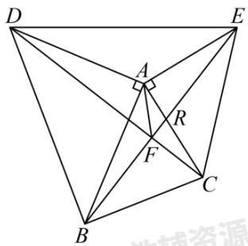

text_image

D
A
E
R
F
C
B
机械资源

由①可知 $\angle AEB = \angle ACD$ 且 $\angle ARE = \angle FRC$ ,

$$
\therefore \angle A E R + \angle A R E = \angle F C R + \angle F R C,
$$

$\therefore \angle EFC = \angle EAR = 90^{\circ}$ ，即 $DC \perp BE$ ，

故①符合题意.

②∵DC⊥BE,

$$
\therefore D F ^ {2} + E F ^ {2} = D E ^ {2}, B F ^ {2} + C F ^ {2} = B C ^ {2},
$$

$$
\therefore D F ^ {2} + E F ^ {2} + B F ^ {2} + C F ^ {2} = D E ^ {2} + B C ^ {2},
$$

且 $DF^{2}+BF^{2}=BD^{2},\quad CF^{2}+EF^{2}=CE^{2},$

$$
\therefore D E ^ {2} + B C ^ {2} = B D ^ {2} + C E ^ {2}.
$$

故②不符合题意.

③证明，过点A作 $AS \perp DC$ ， $AG \perp BE$ ，

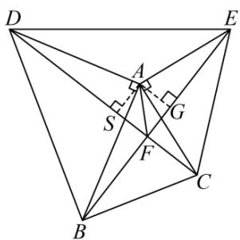

text_image

Geometric diagram with labeled points and right-angle symbols, likely from a math problem or proof

由①可知 $\angle ADS=\angle ABG$ ，且 $AD=AB$ ， $\angle ASD=\angle AGB$ ，

∴ 在 $\triangle ADS$ 与 $\triangle ABG$ 中，

$$
\left\{ \begin{array}{c} \angle A D S = \angle A B G \\ \angle A S D = \angle A G B \\ A D = A B \end{array} , \quad \therefore \triangle A D S \cong \triangle A B G (A A S), \right.
$$

$\therefore AS = AG, \text{且} AS \perp DC, AG \perp BE,$

∴ FA平分∠DFE，故③符合题意.

④作BC中点M，倍长AM，使得AM=MN，

∴ 在 $\triangle BMN$ 与 $\triangle CMA$ 中， $\left\{\begin{aligned}BM&=MC\\ \angle BMN&=\angle CMA\\ MN&=AM\end{aligned}\right.$

$\therefore\triangle BMN\cong\triangle CMA(SAS)$ ，则BN=AC，

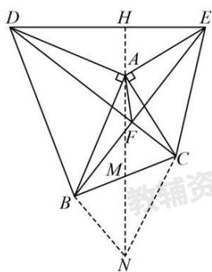

text_image

Geometric diagram with labeled points and perpendicular lines, likely from a math problem or proof

$$
\because A C = A E, \quad \therefore B N = A E,
$$

$$
\because \angle B A C + \angle D A E = 1 8 0 ^ {\circ}, \angle B A C + \angle A B N = 1 8 0 ^ {\circ},
$$

$\therefore \angle DAE = \angle ABN, \therefore$ 在 $\triangle DAE$ 与 $\triangle ABN$ 中，

$$
\left\{ \begin{array}{c} A D = A B \\ \angle D A E = \angle A B N, \\ A E = B N \end{array} \right., \therefore \triangle D A E \cong \triangle A B N (S A S),
$$

$$
\therefore \angle B A N = \angle A D H,
$$

$$
\because \angle D A H + \angle B A N = 9 0 ^ {\circ}, \therefore \angle D A H + \angle A D H = 9 0 ^ {\circ},
$$

$\therefore \angle AHD = 90^{\circ}$ ，即 $AM \perp DE$ ，

故④符合题意.

故答案为：①③④.

【点睛】本题考查等腰直角三角形的性质，三角形全等，两直线垂直，勾股定理知识，掌握等腰直角三角形的性质，三角形全等，两直线垂直，勾股定理知识是解题关键.

【变式 5-1】（24-25 八年级上·福建宁德·阶段练习）对角线互相垂直的四边形叫做“垂美”四边形，现有如图所示的“垂美”四边形ABCD，对角线AC，BD交于点O．若AD=2，BC=5，则 $AB^{2}+CD^{2}=$ \_\_\_\_.

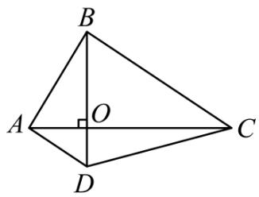

text_image

B
A
O
C
D

【答案】29

【分析】先利用勾股定理求出 $OA^2 + OD^2 = AD^2 = 4$ ， $OB^2 + OC^2 = BC^2 = 25$ ，可得 $OA^2 + OD^2 + OB^2 + OC^2 = 29$ ，然后由 $OA^2 + OB^2 = AB^2$ ， $OC^2 + OD^2 = CD^2$ 得出答案.

【详解】解：由题意知 $BD \perp AC$ ，

$$
\therefore \angle C O B = \angle A O B = \angle A O D = \angle C O D = 9 0 ^ {\circ},
$$

根据勾股定理得， $OA^{2}+OD^{2}=AD^{2}=2^{2}=4$ ， $OB^{2}+OC^{2}=BC^{2}=5^{2}=25$ ，

$$
\therefore O A ^ {2} + O D ^ {2} + O B ^ {2} + O C ^ {2} = 4 + 2 5 = 2 9,
$$

根据勾股定理得， $OA^{2}+OB^{2}=AB^{2}$ ， $OC^{2}+OD^{2}=CD^{2}$ ，

$$
\therefore A B ^ {2} + C D ^ {2} = 2 9,
$$

故答案为：29.

【点睛】本题考查勾股定理的应用，从题中抽象出勾股定理这一数学模型是解题关键.

【变式 5-2】（24-25 八年级下·辽宁抚顺·阶段练习）如图，Rt△ABC中，∠ACB = 90°，D为AB中点，点E在BC边上（点E不与点B，C重合），连接DE，过点D作DE⊥DF交AC于点F，连接EF.

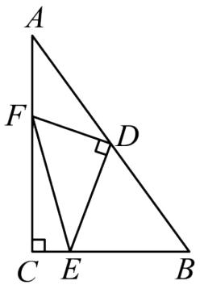

text_image

A
F
D
C E B

(1)求证： $AF^{2}+BE^{2}=EF^{2}$ .

(2)若AC=7，BC=5，EC=1，直接写出线段AF的长.

【答案】(1)见解析

(2) $AF = \frac{17}{7}$

【分析】本题考查了全等三角形的判定和勾股定理，中垂线的性质；

（1）延长ED至G使DG = DE，连接AG，证明 $\triangle BDE \cong \triangle ADG$ ，从而得DE = AG， $AG \perp AC$ ，由 $DF \perp DE$ 得DF为GE中垂线，故GF = EF，在Rt $\triangle AGF$ 中根据勾股定理即可的结论；

（2）结合（1）中的结论可得 $AG = BE = 4$ ， $EF = GF$ ，在Rt△GAF中利用勾股定理即可解决.

【详解】（1）证明：作 $AG \perp AC$ ，AG交ED延长线于G，连接FG

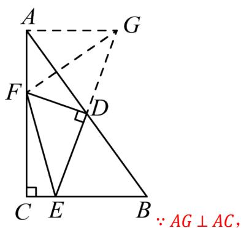

text_image

A
G
F
D
C E B
∵ AG ⊥ AC,

$$
\therefore \angle C A G = 9 0 ^ {\circ},
$$

$$
\therefore \angle C A G + \angle A C B = 9 0 ^ {\circ} + 9 0 ^ {\circ} = 1 8 0 ^ {\circ},
$$

$$
\therefore A G \parallel B E,
$$

$$
\therefore \angle A G D = \angle D E B,
$$

在 $\triangle AGD$ 和 $\triangle BED$ 中， $\left\{ \begin{array}{l} \angle AGD = \angle DEB \\ \angle ADG = \angle BDE \\ AD = BD \end{array} \right.$ ，

$$
\therefore \triangle A G D \cong \triangle B E D (\mathrm{AAS}),
$$

$$
\therefore A G = B E, D G = D E,
$$

$$
\because D F \perp E G,
$$

$$
\therefore F G = E F,
$$

$$
\because \angle F A G = 9 0 ^ {\circ},
$$

$$
\therefore A F ^ {2} + A G ^ {2} = F G ^ {2},
$$

$$
\therefore A F ^ {2} + B E ^ {2} = E F ^ {2},
$$

(2) 解: 设AF = x,

$$
\because A C = 7, B C = 5, C E = 1,
$$

则CF = AC - AF = 7 - x,

$$
B E = B C - C E = 4,
$$

$$
\because \angle C = 9 0 ^ {\circ},
$$

$$
\therefore C F ^ {2} + C E ^ {2} = E F ^ {2},
$$

即： $EF^{2}=(7-x)^{2}+1,$

由（1）知： $GF = EF, \angle BAF = 90^{\circ}, AG = BE,$

$$
\therefore G F ^ {2} = (7 - x) ^ {2} + 1, A G = 4,
$$

$$
\because \angle B A F = 9 0 ^ {\circ},
$$

$$
\therefore A F ^ {2} + A G ^ {2} = G F ^ {2},
$$

即： $x^{2} + 4^{2} = (7 - x)^{2} + 1,$

解得： $x=\frac{17}{7}$ ,

即： $AF = \frac{17}{7}$ .

【变式 5-3】（24-25 八年级上·湖北十堰·期末）如图，等腰直角 $\triangle AOB$ ，等腰直角 $\triangle COD$ ， $\angle AOB = \angle COD = 90^{\circ}, AO = 3, CO = 4$ ，连接 AD, BC 相交于点 M，则 $AC^{2} + BD^{2} =$ \_\_\_\_ .

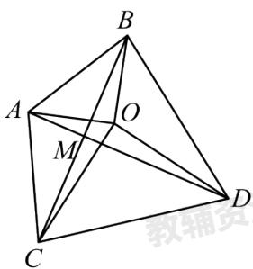

text_image

B
A
O
M
C
D
教辅

【答案】50

【分析】此题重点考查等腰直角三角形的性质、全等三角形的判定与性质、勾股定理等知识，证明 $\triangle AOD \cong \triangle BOC$ 是解题的关键．设 $BC$ 交 $OA$ 于点 $F$ ，由等腰直角三角形的性质得 $AO = BO = 3$ ， $DO = CO = 4$ ， $\angle AOB = \angle COD = 90^{\circ}$ ，可证明 $\angle AOD = \angle BOC$ ，求得 $AB^{2} = AO^{2} + BO^{2} = 18$ ， $CD^{2} = DO^{2} + CO^{2} = 32$ ，再证明 $\triangle AOD \cong \triangle BOC$ ，得 $\angle OAD = \angle OBC$ ，则 $\angle AMC = \angle OAD + \angle AFM = \angle OBC + \angle BFO = 90^{\circ}$ 推导出 $AC^{2} + BD^{2} = AB^{2} + CD^{2} = AM^{2} + BM^{2} + CM^{2} + DM^{2}$ ，求得 $AC^{2} + BD^{2} = AB^{2} + CD^{2} = 50$ ，于是得到问题的答案.

【详解】解：设BC交OA于点F，

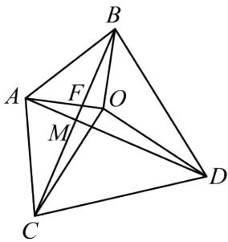

text_image

Geometric diagram of a tetrahedron with labeled vertices A, B, C, D and internal points M, F, O, showing edges and diagonals.

∵ $\triangle AOB$ 和 $\triangle COD$ 都是等腰直角三角形， $\angle AOB = \angle COD = 90^{\circ}$ ，AO = 3，CO = 4，

$$
\therefore A O = B O = 3, D O = C O = 4, \angle A O D = \angle B O C = 9 0 ^ {\circ} + \angle A O C,
$$

$$
\therefore A B ^ {2} = A O ^ {2} + B O ^ {2} = 3 ^ {2} + 3 ^ {2} = 1 8, C D ^ {2} = D O ^ {2} + C O ^ {2} = 4 ^ {2} + 4 ^ {2} = 3 2,
$$

在 $\triangle AOD$ 和 $\triangle BOC$ 中，

$$
\left\{ \begin{array}{c} A O = B O \\ \angle A O D = \angle B O C \\ D O = C O \end{array} \right.,
$$

$$
\therefore \triangle A O D \cong \triangle B O C (\mathrm{SAS}),
$$

$$
\therefore \angle O A D = \angle O B C,
$$

$$
\because \angle A F M = \angle B F O,
$$

$$
\therefore \angle A M C = \angle O A D + \angle A F M = \angle O B C + \angle B F O = 9 0 ^ {\circ},
$$

$$
\therefore \angle B M D = \angle A M B = \angle C M D = 9 0 ^ {\circ},
$$

$$
\because A C ^ {2} = A M ^ {2} + C M ^ {2}, B D ^ {2} = B M ^ {2} + D M ^ {2}, A B ^ {2} = A M ^ {2} + B M ^ {2}, C D ^ {2} = C M ^ {2} + D M ^ {2},
$$

$$
\therefore A C ^ {2} + B D ^ {2} = A B ^ {2} + C D ^ {2} = A M ^ {2} + B M ^ {2} + C M ^ {2} + D M ^ {2},
$$

$$
\therefore A C ^ {2} + B D ^ {2} = A B ^ {2} + C D ^ {2} = 1 8 + 3 2 = 5 0,
$$

故答案为：50.

# 【题型6 勾股定理常见模型之赵爽线图】

【例 6】（24-25 八年级上·福建漳州·期中）我国古代数学家赵爽在注解《周髀算经》时给出的“赵爽弦图”，它是由 4 个全等的直角三角形与 1 个小正方形拼成的一个大正方形，如图，若拼成的大正方形为正方形 ABCD，面积为 9，中间的小正方形为正方形 EFGH，面积为 2，连接 AC，交 BG 于点 P，交 DE 于点 M，①$\triangle CGP \cong \triangle AEM$ ，② $2S_{\triangle AFP} - S_{\triangle CGP} = \frac{1}{2}$ ；③ $DH + HC = 4$ ，④ $HC = 2 + \frac{\sqrt{2}}{2}$ ，以上说法正确的是\_\_\_\_。（填写序号）

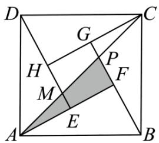

text_image

D
G
C
H
P
M
F
A
E
B

【答案】①③④

【分析】根据正方形得性质、勾股定理、平行线的性质、全等三角形的判定与性质和梯形面积的计算逐项判断即可.

【详解】解：∵四边形EFGH为正方形，

$$
\therefore \angle A E M = \angle H E F = \angle F G H = \angle C G P = 9 0 ^ {\circ}, E M \| P F, A F \| C H, A D = B C,
$$

$$
\therefore \angle E A M = \angle G C P,
$$

由题意得，Rt $\triangle AED \cong Rt \triangle CGB$ ，

$$
\therefore A E = C G,
$$

在 $\triangle AEM$ 和 $\triangle CGP$ 中，

$$
\left\{ \begin{array}{c} \angle A E M = \angle C G P \\ A E = C G \\ \angle E A M = \angle G C P \end{array} \right.,
$$

∴ $\triangle CGP \cong \triangle AEM$ (ASA)，故①正确；

由①得 $S_{\triangle AEM}=S_{\triangle CGP}, EM=PG,$

$$
\therefore S _ {\triangle A F P} - S _ {\triangle C G P} = S _ {\triangle A F P} - S _ {\triangle A E M}
$$

$$
= S _ {\text {梯形} F P M E} = \frac {1}{2} (E M + P F) \cdot E F
$$

$$
= \frac {1}{2} (P G + P F) \cdot E F = \frac {1}{2} F G \cdot E F
$$

$$
= \frac {1}{2} S _ {\text {正方形} E F G H}
$$

$$
\because S _ {\text {正方形} E F G H} = 2,
$$

$$
\therefore S _ {\triangle A F P} - S _ {\triangle C G P} = 1,
$$

即 $\frac{1}{2} S_{\triangle AFP} - \frac{1}{2} S_{\triangle CGP} = \frac{1}{2}$

故②错误;

用 x, y 表示直角三角形的两条边 $(x < y)$ ,

∵大正方形面积为9，小正方形面积为2，

$$
\therefore x ^ {2} + y ^ {2} = 9, (y - x) ^ {2} = 2,
$$

∴直角三角形的面积和为 $4 \times \frac{1}{2}xy = 2xy = 9 - 2 = 7$ ,

于是得到 $(x+y)^{2}=x^{2}+y^{2}+2xy=9+7=16,$

解得 $x + y = 4;$

即 $DH + HC = 4$ ，故③正确；

$$
\because C G = D H, \quad H G = \sqrt {2},
$$

$$
\therefore D H + C H = 2 D H + H G = 2 D H + \sqrt {2} = 4,
$$

$$
\therefore D H = \frac {4 - \sqrt {2}}{2} = 2 - \frac {\sqrt {2}}{2},
$$

$$
\therefore C H = C G + H G = D H + H G = 2 - \frac {\sqrt {2}}{2} + \sqrt {2} = 2 + \frac {\sqrt {2}}{2}.
$$

故④正确，

故答案为：①③④.

【点睛】本题考查了正方形得性质、勾股定理、平行线的性质、全等三角形的判定与性质和梯形面积的计算，解决此题的关键是熟练地运用这些性质和读懂题目意思并把图形联系起来.

【变式 6-1】（24-25 八年级下·天津河北·期中）如图所示的“赵爽弦图”是由四个全等的直角三角形与中间的一个小正方形拼成的大正方形，若图中的直角三角形的长直角边是 12，大正方形的面积是 169，则小正方形的面积是\_\_\_\_。

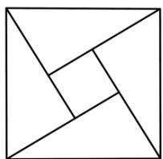

natural_image

Geometric diagram of a square divided into triangles and smaller squares (no text or symbols)

【答案】49

【分析】本题考查了勾股定理的证明，熟练掌握勾股定理是解题的关键．根据题意和题目中的数据，可以计算出小正方形的边长，即可得到小正方形的面积.

【详解】解：由题意可得：大正方形的边长为 $\sqrt{169}=13$ ，

小正方形的边长 = $12 - \sqrt{13^{2} - 12^{2}} = 7$ ,

∴ 小正方形的面积为 $7 \times 7 = 49$ ,

故答案为：49

【变式 6-2】（24-25 八年级上·四川眉山·期末）如图，我国古代数学家赵爽为了证明勾股定理，创制了一幅“弦图”（图 1），后人称其为“赵爽弦图”、由图 1 变化得到图 2，它是用八个全等的直角三角形拼接而成的，记图中正方形ABCD，正方形EFGH，正方形的MNKT的面积分别为 $S_{1}$ ， $S_{2}$ ， $S_{3}$ ，若 $S_{2}=4$ ，则 $S_{1}+S_{3}$ 的值为\_\_\_\_。

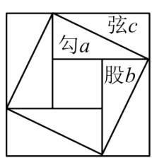

text_image

弦c
勾a
股b

图1

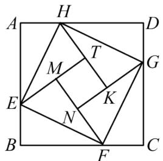

text_image

A H D
M T G
E K
N
B F C

图2

【答案】8

【分析】本题考查了以赵爽弦图为背景的勾股定理的证明，理解正方形的面积，全等三角形面积相等是解题的关键.

根据题意， $\triangle AEH, \triangle BFE, \triangle CGF, \triangle DHG$ 是 4 个全等的三角形，设每个的面积为 $S$ ，由此可得 $S_{1} - 4S = S3 + 4S = S_{2}$ ，根据 $S_{1} + S_{3} = (S_{1} - 4S) + (S_{3} + 4S) = 4 + 4 = 8$ ，即可求解.

【详解】解：正方形ABCD，正方形EFGH，正方形的MNKT的面积分别为 $S_{1}$ ， $S_{2}$ ， $S_{3}$ ， $\triangle AEH, \triangle BFE, \triangle CGF, \triangle DHG$ 是4个全等的三角形，设每个的面积为S，

$$
\therefore S _ {1} - 4 S = S _ {3} + 4 S = S _ {2},
$$

$$
\therefore S _ {1} + S _ {3} = (S _ {1} - 4 S) + (S _ {3} + 4 S) = 4 + 4 = 8,
$$

故答案为：8.

【变式 6-3】（24-25 八年级上·浙江绍兴·期中）如图，我国汉代数学家赵爽在注解《周髀算经》时给出的“赵爽弦图”，它是由四个全等的直角三角形与中间的小正方形EFGH拼成的一个大正方形ABCD，连接AC，交BE于点P，若正方形ABCD的面积为28， $AE + BE = 7$ ，则 $\triangle CFP$ 与 $\triangle AEP$ 的面积差是\_\_\_\_。

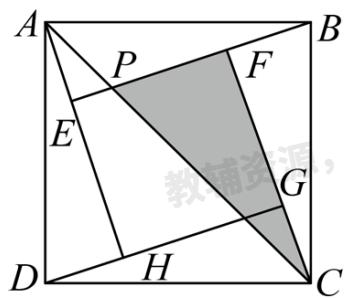

text_image

A
P
F
B
E
G
D
H
C

【答案】 $\frac{7}{2}$

【分析】本题考查了“赵爽弦图”，多边形的面积，勾股定理等知识点，熟练掌握勾股定理和三角形全等的性质是解题的关键.

先证明 $\triangle AEP \cong \triangle CGM(ASA)$ ，则 $S_{\triangle AEP} = S_{\triangle CGM}$ ，所以两三角形面积的差是中间正方形面积的一半，设 $AE = x$ ， $BE = 7 - x$ ，根据勾股定理得： $AE^2 + BE^2 = AB^2$ ， $x^2 + (7 - x)^2 = 28$ ，整体代入可得结论.

【详解】解：∵正方形ABCD的面积为28，

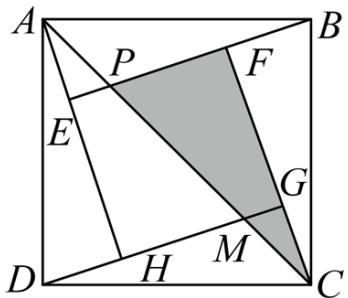

text_image

A
P
F
B
E
G
D
H
M
C

$$
\therefore A B ^ {2} = 2 8,
$$

设AE = x,

$$
\because A E + B E = 7,
$$

$$
\therefore B E = 7 - x,
$$

在Rt $\triangle AEB$ 中，由勾股定理得： $AE^{2} + BE^{2} = AB^{2}$ ，

$$
\therefore x ^ {2} + (7 - x) ^ {2} = 2 8,
$$

$$
\therefore 2 x ^ {2} - 1 4 x = - 2 1,
$$

$$
\because A H \perp B E, B E \perp C F,
$$

$$
\therefore A H \parallel C F,
$$

$$
\therefore \angle E A P = \angle G C M,
$$

“赵爽弦图”是由四个全等的直角三角形与中间的小正方形EFGH拼成的一个大正方形ABCD，

$$
\therefore \triangle A E B \cong \triangle C G D,
$$

$$
\therefore A E = C G,
$$

$$
\therefore \triangle A E P \cong \triangle C G M (\mathrm{ASA}),
$$

$$
\therefore S _ {\triangle A E P} = S _ {\triangle C G M}, E P = M G,
$$

$$
\therefore S _ {\triangle C F P} - S _ {\triangle A E P} = S _ {\triangle C F P} - S _ {\triangle C G M} = S _ {\text {梯形} F P M G} = \frac {1}{2} (M G + P F) \cdot F G = \frac {1}{2} E F \cdot F G = \frac {1}{2} S _ {\text {正方形} E H G F},
$$

$$
\because S _ {\text {正方形} E H G F} = S _ {\text {正方形} A B C D} - 4 S _ {\triangle A E B} = 2 8 - 4 \times \frac {1}{2} x (7 - x) = 2 x ^ {2} - 1 4 x + 2 8 = - 2 1 + 2 8 = 7,
$$

则 $S_{\triangle CFP}-S_{\triangle AEP}$ 的值是 $\frac{7}{2}$ ;

故 $\triangle CFP$ 与 $\triangle AEP$ 的面积差为 $\frac{7}{2}$ ;

故答案为： $\frac{7}{2}$

# 【题型7 勾股定理常见模型之勾股树】

【例 7】（24-25 八年级上·河南商丘·期中）有一个边长为 1 的大正方形，经过 1 次“生长”后，在它的左右肩上生出两个小正方形，其中，三个正方形围成的三角形是直角三角形，再经过 1 次“生长”后，形成的图形如图所示．如果继续“生长”下去，它将变得“枝繁叶茂”，那么“生长”了 2023 次后形成的图形中所有的正方形的面积和是（）

natural_image

Stylized tree diagram with green and orange patterns, no text or symbols present

A. 2024

B. 2023

C. $2^{2002}$

D. $2^{2002} - 1$

【答案】A

【分析】本题考查了勾股定理以及规律型：图形的变化类，根据勾股定理求出“生长”了1次后形成的图形中所有的正方形的面积和，结合图形总结规律，根据规律解答即可，能够根据勾股定理发现每一次得到的新的正方形的面积和与原正方形的面积之间的关系是解答本题的关键.

【详解】解：由题意得，正方形 A 的面积为 1，

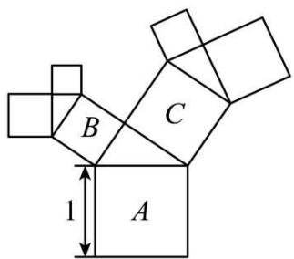

text_image

B
C
1
A

由勾股定理得，正方形 B 的面积 + 正方形 C 的面积 = 正方形 A 的面积 = 1，

∴“生长”了1次后形成的图形中所有的正方形的面积和为2，

同理可得，“生长”了2次后形成的图形中所有的正方形的面积和为3，

“生长”了 3 次后形成的图形中所有的正方形的面积和为 4，

以此类推，“生长”了 2023 次后形成的图形中所有的正方形的面积和为 2024，

故选A.

【变式 7-1】（24-25 八年级上·安徽安庆·期末）如图是一株美丽的勾股树，其中所有的四边形都是正方形，所有的三角形都是直角三角形。若正方形 A, B, C, D 的面积分别是 3, 5, 2, 3，则正方形 E 的面积是\_\_\_\_，正方形 F 的面积是\_\_\_\_，正方形 G 的面积是\_\_\_\_。

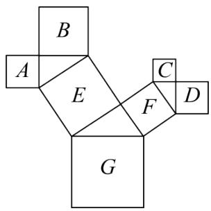

text_image

B
A
E
F
C
D
G

【答案】 8 5 13

【分析】本题考查了勾股定理，正方形的面积，解题的关键是熟练应用勾股定理求得正方形的边长．先由正方形 A, B, C, D 的面积分别为 3, 5, 2, 3，得到对应的边长分别为 $\sqrt{3}, \sqrt{5}, \sqrt{2}, \sqrt{3}$ ，然后利用勾股定理求得正方形 E, F 的边长分别为 $2\sqrt{2}, \sqrt{5}$ ，从而求得正方形 E 和 F 的面积，正方形 G 的边长，即可得到正方形 G 的面积.

【详解】解：∵正方形 A, B, C, D 的面积分别为 3, 5, 2, 3,

∴ 正方形 A, B, C, D 的边长分别为 $\sqrt{3}, \sqrt{5}, \sqrt{2}, \sqrt{3}$ ,

由勾股定理得，正方形E的边长为 $\sqrt{3+5}=2\sqrt{2}$ ，正方形F的边长为 $\sqrt{2+3}=\sqrt{5}$ ，

∴正方形E的面积为8，正方形F的面积为5，正方形G的边长为 $\sqrt{8+5}=\sqrt{13}$ ，

∴ 正方形G的面积为 13，

故答案为：8，5，13.

【变式 7-2】（24-25 八年级下·湖南怀化·期中）如图是一种“羊头”形图案，其做法是：从正方形①开始，以它的一边为斜边，向外作等腰直角三角形，然后再以其直角边为边，分别向外作正方形②和②'，…，然后依此类推，若正方形①的面积为 64，则第 4 个正方形的边长为（）

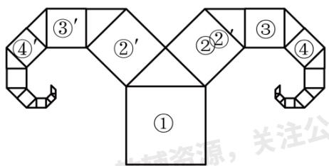

flowchart

```mermaid
graph TD
    A["①"] --> B["②"]
    B --> C["③"]
    C --> D["④"]
    D --> E["③'"]
    E --> F["④'"]
    F --> G["③"]
    G --> H["②'"]
    H --> I["②"]
    I --> J["③"]
    J --> K["④"]
    K --> L["③"]
    L --> M["④"]
    M --> N["③'"]
    N --> O["②'"]
    O --> P["③"]
    P --> Q["④"]
    Q --> R["③"]
    R --> S["④"]
    S --> T["③"]
    T --> U["④"]
    U --> V["③"]
    V --> W["④"]
    W --> X["③"]
    X --> Y["④"]
    Y --> Z["③"]
```

A. $\sqrt{2}$

B. $\sqrt{4}$

C. $\sqrt{8}$

D. $16\sqrt{2}$

【答案】C

【分析】本题考查了勾股树问题，正方形的性质，等腰直角三角形的性质，熟练掌握勾股定理是解题的关键.

根据正方形①的面积=正方形②的面积+正方形②'的面积 = 2正方形②的面积，求得正方形②的面积为32，同理，正方形③的面积为 $\frac{1}{2} \times 32 = 16$ ，正方形④的面积为 $\frac{1}{2} \times 16 = 8$ ，即可求出第4个正方形的边长.

【详解】解：根据勾股定理得：

正方形①的面积=正方形②的面积+正方形②'的面积 = 2正方形②的面积,

∵正方形①的面积为64，

∴正方形②的面积为 $\frac{1}{2}\times64=32$ ,

同理，正方形③的面积为 $\frac{1}{2}\times32=16$ ，

正方形④的面积为 $\frac{1}{2}\times16=8$ ,

∴正方形④的边长为 $\sqrt{8}$ ，即第4个正方形的边长 $\sqrt{8}$ .

故选：C.

【变式 7-3】（24-25 八年级上·贵州毕节·期末）问题情境：

毕达哥拉斯利用勾股定理在初始的大正方形上，作出了两个小正方形（如图1），再以此类推无限重复地作出各种大小不一的正方形，就形成了茂密的“毕达哥拉斯树”，也叫“勾股树”.

解决问题:

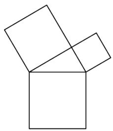

natural_image

Geometric diagram of two overlapping squares forming an open box (no text or symbols)

图1

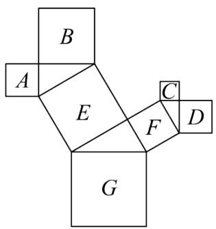

text_image

B
A
E
C
F
D
G

图2

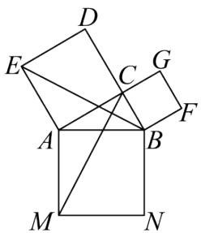

text_image

Geometric diagram with labeled points and intersecting lines, likely from a math problem or proof

图3

(1)如图2, 是一株美丽的“勾股树”, 其中所有的四边形都是正方形, 所有的三角形都是直角三角形。若正方形 $A, B, C, D$ 的面积分别是3, 5, 2, 3, 则正方形 $E$ 的面积是 , 正方形 $G$ 的边长是 .

(2)如图3, 在一株最简单的“勾股树”中, 连接 $BE$ , $CM$ . 若正方形 $ACDE$ , 正方形 $BCGF$ 的面积分别为64, 16, 求 $CM$ 的长.

【答案】(1)8,13

(2) $2\sqrt{5}$

【分析】本题考查了勾股定理，正方形的面积，解题的关键是熟练应用勾股定理求得正方形的边长.

（1）先由正方形A，B，C，D的面积分别为3，5，2，3，得到对应的边长分别为 $\sqrt{3},\sqrt{5},\sqrt{2},\sqrt{3}$ ，然后利用勾股定理求得正方形E,F的边长分别为 $2\sqrt{2},\sqrt{5}$ ，从而求得正方形E和F的面积，正方形G的边长，即可得到正方形G的面积；

（2）根据题意得出 $ED = DC = 8, BC = 4$ ，勾股定理求得 $EB = 2\sqrt{5}$ ，进而证明 $\triangle EAB \cong \triangle CAM(SAS)$ ，根据全等三角形的性质，即可求解.

【详解】（1）解：∵正方形A，B，C，D的面积分别为3，5，2，3，

∴ 正方形A, B, C, D的边长分别为 $\sqrt{3},\sqrt{5},\sqrt{2},\sqrt{3}$ ,

由勾股定理得，正方形E的边长为 $\sqrt{3+5}=2\sqrt{2}$ ，正方形F的边长为 $\sqrt{2+3}=\sqrt{5}$ ，

∴ 正方形E的面积为8，正方形F的面积为5，正方形G的边长为 $\sqrt{8+5}=\sqrt{13}$ ，

∴ 正方形G的面积为13，

故答案为：8，13.

(2) 解: $\because$ 正方形 $ACDE$ , 正方形 $BCGF$ 的面积分别为 64, 16,

$$
\therefore E D = D C = 8, B C = 4
$$

在Rt $\triangle EDB$ 中， $EB = \sqrt{ED^2 + DB^2} = \sqrt{8^2 + 4^2} = 2\sqrt{5}$

∵四边形ACDE,ABMN,BCGF是正方形，

$$
\therefore \angle M A B = \angle E A C = 9 0 ^ {\circ}, A B = A M, C A = E A
$$

$$
\therefore \angle E A C + \angle C A B = \angle C A B + \angle B A M
$$

$$
\therefore \angle E A B = \angle C A M
$$

$$
\therefore \triangle E A B \cong \triangle C A M (\text { SAS })
$$

$$
\therefore C M = E B = 2 \sqrt {5}.
$$

# 【题型 8 勾股定理常见模型之斜边上的高】

【例 8】（24-25 八年级上·江苏泰州·期中）定义：如果一个三角形一边的平方与另一边上高的平方之和等于第三边的平方，则称这个三角形为“牵手三角形”，这条边与第三边的交点称为“牵手顶点”。例如图 1，在 $\triangle ABC$ 中，BC > AB, BD 是 AC 边上的高，若 $AB^{2} + BD^{2} = BC^{2}$ ，则 $\triangle ABC$ 为“牵手三角形”，点 B 为“牵手顶点”。

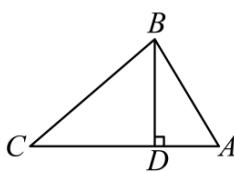

text_image

B
C
D
A

图1

text_image

A
B D C

图2

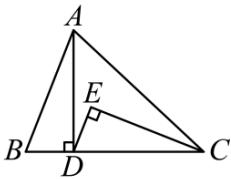

text_image

A
E
B
D
C

图3

(1)等边三角形\_\_\_\_“牵手三角形”（填写“是”或者“不是”）；

(2)如图 2, 已知 $\triangle ABC$ 为“牵手三角形”, 其中点 $A$ 为“牵手顶点”, $AC > AB$ , $AD$ 是 $BC$ 边上的高. 在不添加其他线段和字母的情况下, 找出图中一组相等的线段, 并说明理由;

(3)运用（2）中的结论解决下列问题：

①已知 $\triangle ABC$ 为“牵手三角形”，其中点 $C$ 为“牵手顶点”且 $AC > BC, CD$ 是 $AB$ 边上的高。若 $BC = 5, CD = 4$ ，则 $AB$ 的长是 \_\_\_\_；

②如图3， $\triangle ABC$ 为“牵手三角形”，其中 $AC > AB, A$ 为“牵手顶点”， $AD$ 是 $BC$ 边上的高， $\angle DEC = 90^{\circ}$ ，若 $BD = DE, \angle ACB = 2\angle BAD$ 。求证： $\triangle ABC$ 为等腰三角形。

【答案】(1)不是

(2)AB = CD，理由见解析

(3)①8；②见解析

【分析】本题主要查了全等三角形的判定和性质，勾股定理，等腰三角形的判定，等边三角形的性质：

（1）直接根据“牵手三角形”的定义，即可求解；

（2）根据“牵手三角形”的定义，可得 $AB^{2}+AD^{2}=AC^{2}$ ，在Rt△ACD中，再由勾股定理可得 $CD^{2}+AD^{2}=AC^{2}$ ，即可解答；

(3) ①由 (2) 得: $BC = AD = 5$ , 在 Rt $\triangle BCD$ 中, 再由勾股定理可得 $BD = 3$ , 即可求解; ②证明 Rt $\triangle ABD \cong Rt$ $\triangle CDE$ , 可得 $\angle BAD = \angle DCE$ , $\angle CDE = \angle ABC$ , 从而得到 $AB \parallel DE$ , 再由 $\angle ACB = 2\angle BAD$ , 可得 $\angle ACE = \angle DCE$ , 延长 $DE$ 交 $AC$ 于点 $F$ , 证明 $\triangle DCE \cong \triangle FCE$ , 可得 $\angle CDE = \angle CFE$ , 从而得到 $\angle BAC = \angle ABC$ , 即可求证.

【详解】（1）解：∵等边三角形的三边相等，

∴等边三角形一边的平方与另一边上高的平方之和大于第三边的平方，

∴等边三角形不是“牵手三角形”；

故答案为：不是

(2) 解: AB = CD，理由如下:

∵△ABC为“牵手三角形”，AD是BC边上的高，

$$
\therefore A B ^ {2} + A D ^ {2} = A C ^ {2},
$$

在Rt $\triangle ACD$ 中， $CD^{2} + AD^{2} = AC^{2}$ ，

$$
\therefore A B ^ {2} = C D ^ {2},
$$

$$
\therefore A B = C D;
$$

(3) 解: ①如图,

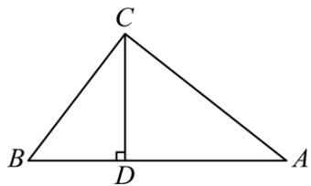

text_image

C
B
D
A

由（2）得：BC = AD = 5，

在Rt $\triangle BCD$ 中，BC = 5, CD = 4,

$$
\therefore B D = \sqrt {B C ^ {2} - C D ^ {2}} = 3,
$$

$$
\therefore A C = 3,
$$

$$
\therefore A B = B D + A D = 3 + 5 = 8;
$$

故答案为：8

②证明：由（2）得：AB = CD，

$$
\because \angle A D B = \angle D E C = 9 0 ^ {\circ},
$$

∴△ABD和△CDE、均为直角三角形，

在Rt $\triangle ABD$ 和Rt $\triangle CDE$ 中，

$$
\because A B = C D, \quad B D = D E,
$$

$$
\therefore \mathrm{Rt} \triangle A B D \cong \mathrm{Rt} \triangle C D E (\mathrm{HL}),
$$

$$
\therefore \angle B A D = \angle D C E, \angle C D E = \angle A B C,
$$

$$
\therefore A B \parallel D E,
$$

$$
\because \angle A C B = 2 \angle B A D,
$$

$$
\therefore \angle A C B = 2 \angle D C E,
$$

即 $\angle ACE=\angle DCE,$

如图，延长DE交AC于点F，

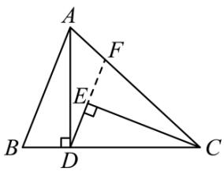

text_image

A
F
E
B
D
C

在 $\triangle DCE$ 和 $\triangle FCE$ 中，

$$
\because \angle A C E = \angle D C E, C E = C E, \angle D E C = \angle F E C = 9 0 ^ {\circ},
$$

$$
\therefore \triangle D C E \cong \triangle F C E (\mathrm{ASA}),
$$

$$
\therefore \angle C D E = \angle C F E,
$$

$$
\because A B \parallel D E,
$$

$$
\therefore \angle B A C = \angle C F E,
$$

$$
\therefore \angle B A C = \angle A B C,
$$

$$
\therefore A C = B C,
$$

∴ $\triangle ABC$ 为等腰三角形.

【变式 8-1】（24-25 八年级下·山东聊城·阶段练习）如图，在 $\triangle ABC$ 中， $CD \perp AB$ 于点 D，AC = 4，
BC = 3, $DB = \frac{9}{5}$ .

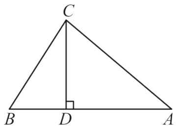

text_image

C
B D A

(1)求 $CD$ 的长;

(2)求AD的长;

【答案】(1) $\frac{12}{5}$

(2) $\frac{16}{5}$

(3)见解析

【分析】本题主要考查了勾股定理：

(1) 在Rt $\triangle CBD$ 中, 根据勾股定理进行计算即可;  
(2) 在Rt $\triangle CAD$ 中根据勾股定理进行计算即可;

【详解】（1）解：在 $\triangle ABC$ 中， $CD \perp AB$ 于点 D，
故在Rt $\triangle CBD$ 中，

$$
C D = \sqrt {B C ^ {2} - B D ^ {2}} = \sqrt {3 ^ {2} - \left(\frac {9}{5}\right) ^ {2}} = \frac {1 2}{5};
$$

(2) 解: 在 $\triangle ABC$ 中, $CD \perp AB$ 于点 $D$ ,

在Rt $\triangle$ CAD中，

$$
\mathrm{AD} = \sqrt {\mathrm{AC} ^ {2} - \mathrm{CD} ^ {2}} = \sqrt {4 ^ {2} - \left(\frac {1 2}{5}\right) ^ {2}} = \frac {1 6}{5}
$$

【变式 8-2】（24-25 八年级下·甘肃武威·期中）如图，在 $\triangle ABC$ 中， $\angle ACB = 90^{\circ}$ ，点 $D$ 、 $F$ 为边 $AB$ 上点，连接 $CD$ 、 $CF$ ，将边 $BC$ 沿 $CD$ 翻折，使点 $B$ 的对称点在边 $AB$ 上的点 $E$ 处；再将边 $AC$ 沿 $CF$ 翻折，使点 $A$ 的对称点落在 $CE$ 的延长线上的点 $A'$ 处。若 $AC = 4$ ， $AB = 5$ ，则 $EF$ 的长为 \_\_\_\_.

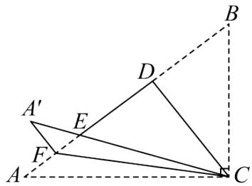

text_image

Geometric diagram with labeled points A, B, C, D, E, F, and A', showing triangles and dashed auxiliary lines

【答案】 $\frac{3}{5} / 0.6$

【分析】本题考查了翻折的性质，等腰三角形的判定与性质，勾股定理的应用，解题关键是理清折叠前后对应的线段和角相等，等面积法的应用．先利用勾股定理求出BC的值，再根据翻折的性质得CE = CB = 3, DE = DB, ∠BCD = ∠ECD, ∠ACF = ∠A'CF，由等腰三角形的性质，易得CD⊥BE, ∠DCF = 45°，进而由等腰三角形判定得DF = CD，再利用等面积法得 $S_{\triangle ABC} = \frac{1}{2} AC \cdot BC = \frac{1}{2} AB \cdot CD$ ，即可求出CD的值，然后在Rt△CDE中，利用勾股定理求出DE的值，最后根据EF = DF - DE，即可得出答案.

【详解】解：∵ $\angle ACB = 90^{\circ}$ ，AC = 4，AB = 5，

$$
\therefore B C = \sqrt {A B ^ {2} - A C ^ {2}} = \sqrt {5 ^ {2} - 4 ^ {2}} = 3,
$$

由翻折得CE = CB = 3，DE = DB， $\angle BCD = \angle ECD$ ， $\angle ACF = \angle A'CF$ ，

$$
\therefore C D \perp B E, \angle E C D + \angle A ^ {\prime} C F = \angle B C D + \angle A C F,
$$

$$
\therefore \angle D C F = \frac {1}{2} \angle A C B = 4 5 ^ {\circ},
$$

$$
\therefore \angle D C F = \angle D F C,
$$

$$
\therefore D F = C D,
$$

$$
\because S _ {\triangle A B C} = \frac {1}{2} A C \cdot B C = \frac {1}{2} A B \cdot C D,
$$

$$
\therefore \frac {1}{2} \times 4 \times 3 = \frac {1}{2} \times 5 \cdot C D,
$$

$$
\therefore C D = \frac {4 \times 3}{5} = \frac {1 2}{5},
$$

$$
\therefore D F = \frac {1 2}{5},
$$

在Rt $\triangle CDE$ 中， $DE = \sqrt{CE^{2} - CD^{2}} = \sqrt{3^{2} - \left(\frac{12}{5}\right)^{2}} = \frac{9}{5}$ ,

$$
\therefore E F = D F - D E = \frac {1 2}{5} - \frac {9}{5} = \frac {3}{5},
$$

故答案为： $\frac{3}{5}$ .

【变式 8-3】（24-25 八年级上·陕西汉中·期末）【问题提出】

（1）如图 1，AD 为 $\triangle ABC$ 的边 BC 上的高，若 $AB = \sqrt{13}$ ，AD = BC = 3，则 CD 的长为 \_\_\_\_；

# 【问题探究】

（2）如图 2，在 $\triangle ABC$ 中， $\angle B = 90^{\circ}$ ，AD 平分 $\angle BAC$ 交 BC 于点 D，若 BD = 6，CD = 10，求 AB 的长；

# 【问题解决】

(3) 如图 3, 直线 $l$ 是一条小路, $\triangle ABC$ 是李叔叔家的一块花园的平面示意图, 其中边 $BC$ 在小路 $l$ 上, $AC$ 边上的点 $D$ 处有一口灌溉水井, 经测量, $\angle ACB = 90^{\circ}$ , $AC = BC = 80$ 米, $CD = 30$ 米. 李叔叔计划对该花园进行扩建, 在点 $C$ 右侧的小路 $l$ 上取点 $E$ , 并在 $\triangle ABD$ 、 $\triangle AED$ 、 $\triangle BED$ 内分别种植不同的花卉, 根据李叔叔的规划要求, $\angle AED = \angle CED$ , 请你计算 $\triangle BED$ 区域的面积.

  
图1

text_image

A
B D C

图2

text_image

A
D
B
C
l

图3

【答案】（1）1 （2）12 （3） $\triangle BED$ 区域的面积为 2100 平方米

【分析】本题考查了勾股定理的应用，全等三角形的判定和性质，角平分线的性质：

（1）根据勾股定理求得BD，再由CD = BC - BD，即可得到答案；

（2）过点 $D$ 作 $DE \perp AC$ 于点 $E$ ，由角平分线的性质可得 $\angle DAB = \angle DAE$ ， $DE = BD = 6$ ，再根据勾股定理求得 $CE$ ，再证明 $\triangle ABD \cong \triangle AED$ ，可得 $AB = AE$ ，再利用勾股定理建立方程求解即可；

(3) 过点 $D$ 作 $DF \perp AE$ 于点 $F$ , 由 $\angle AED = \angle CED$ 可知 $ED$ 平分 $\angle AEC$ , 则 $DF = DC$ , 由勾股定理求得 $AF$ , 再证明 $\triangle DFE \cong \triangle DCE$ , 再利用勾股定理建立方程求得 $CE$ , 进而求得 $BE$ , 再利用三角形的面积公式求解即可.

【详解】（1）解：∵ $AB = \sqrt{13}$ ，AD = 3，

∴ 在Rt $\triangle ADB$ 中， $BD = \sqrt{AB^{2} - AD^{2}} = \sqrt{\left(\sqrt{13}\right)^{2} - 3^{2}} = 2$ ,

$$
\because B C = 3,
$$

$$
\therefore C D = B C - B D = 3 - 2 = 1,
$$

故答案为：1;

(2) 解: 过点 $D$ 作 $DE \perp AC$ 于点 $E$ , 如图.

text_image

A
B
D
C
E

图2

∵ AD 平分 $\angle BAC$ ,

$$
\therefore \angle D A B = \angle D A E, D E = B D = 6,
$$

$$
\therefore C E = \sqrt {C D ^ {2} - D E ^ {2}} = \sqrt {1 0 ^ {2} - 6 ^ {2}} = 8.
$$

$$
\because \angle D A B = \angle D A E, \angle A B D = \angle A E D, A D = A D,
$$

$$
\therefore \quad \triangle A B D \cong \triangle A E D (\mathrm{AAS}),
$$

$$
\therefore A B = A E.
$$

设AB = x，则AC = AE + CE = x + 8，BC = BD + CD = 16.

∵ 在Rt $\triangle ABC$ 中， $AC^{2}=AB^{2}+BC^{2}$

$$
\therefore (x + 8) ^ {2} = x ^ {2} + 1 6 ^ {2},
$$

解得x=12，即AB的长为12.

(3) 解: 过点 $D$ 作 $DF \perp AE$ 于点 $F$ , 如图 3.

text_image

A
D
F
B
C
E
l

图3

$$
\because \angle A E D = \angle C E D,
$$

∴ ED平分∠AEC,

$$
\therefore D F = D C = 3 0 \text { 米 },
$$

∴ $AF = \sqrt{AD^{2} - DF^{2}} = \sqrt{(80 - 30)^{2} - 30^{2}} = 40$ （米）.

$$
\because \angle F E D = \angle C E D, \angle D F E = \angle D C E = 9 0 ^ {\circ}, D E = D E,
$$

$$
\therefore \quad \triangle D F E \cong \triangle D C E (\mathrm{AAS}),
$$

$$
\therefore E F = C E.
$$

设CE = x 米，则EF = CE = x 米， $AE = (x + 40)$ 米.

∵ 在Rt $\triangle ACE$ 中， $AE^{2} = AC^{2} + CE^{2}$ ，

∴ $(x+40)^{2}=80^{2}+x^{2}$ ，解得x=60，

∴ $BE = BC + CE = 140$ （米），

∴ $S_{\triangle BED} = \frac{1}{2} BE \cdot CD = \frac{1}{2} \times 140 \times 30 = 2100$ （平方米）.

即 $\triangle BED$ 区域的面积为 2100 平方米.