# 专题1.2 一定是直角三角形吗（举一反三讲义）

# 【北师大版 2024】

# 题型归纳

教辅资源, 关注公众号·全科AA+

【题型 1 判断三边能否构成直角三角形】....2

【题型 2 勾股数】....2

【题型3 网格中判断直角三角形】 3

【题型 4 图形上与已知两点构成直角三角形的点】....4

【题型 5 利用勾股定理的逆定理求解】....4

【题型 6 利用勾股定理的逆定理证明】....5

【题型 7 勾股定理的逆定理实际应用】....6

【题型 8 勾股定理及其逆定理的综合求值】....8

【题型 9 利用勾股定理及其逆定理解决无刻度的尺规作图】....9

# 举一反三

# 知识点 1 直角三角形的判别条件

1. 定义: 如果三角形的三边 $a, b, c$ 满足 $a^2 + b^2 = c^2$ 那么这个三角形是直角三角形。（此判别条件也称为勾股定理的逆定理）

2. 判断一个三角形是否为直角三角形的方法:

<table><tr><td>从角度上判断</td><td>三角形中有一个角是直角,或者三角形中有两个角互余</td></tr><tr><td>从边长上判断</td><td>两条较短边的平方和等于最长边的平方</td></tr></table>

# 知识点 2 勾股数

1. 勾股数

<table><tr><td>定义</td><td>满足 $a^{2} + b^{2} = c^{2}$ 的三个正整数,称为勾股数</td></tr><tr><td>满足条件</td><td>1三个数都是正整数2两个较小整数的平方和等于最大整数的平方</td></tr><tr><td>拓展</td><td>勾股数的整数倍仍为勾股数,如3,4,5的2倍6,8,10仍为勾股数.</td></tr><tr><td>常见形式</td><td>1 $n^{2}-1$ ,2n, $n^{2}+1$ (n大于1的全部数);24n,4 $n^{2}-1$ ,4 $n^{2}+1$ (n为正整数)等</td></tr></table>

2. 判断勾股数的方法步骤:

(1)确定三个是正整数;

(2)确定最大的数字与另外两个较小的数，分别计算最大的数的平方与另外两个较小的数的平方和；

(3)进行比较, 若最大数的平方等于另外两个较小数的平方和, 则是勾股数, 否则不是.

# 【题型1 判断三边能否构成直角三角形】

【例 1】（2025·江苏南京·二模）下列长度的两条线段与长度为 12 的线段首尾依次相连能组成直角形三角形的是（）

A. 6, 9

B. 9, 15

C. 10, 16

D. 15, 18

【变式 1-1】（24-25 八年级下·湖北十堰·期中）以下列各组数为边长，可以构成直角三角形的是（）

A. 2, 3, 4

B. 3, 4, 6

C. 6, 8, 10

D. 7, 24, 26

【变式 1-2】（24-25 八年级下·四川南充·期中）已知 a、b、c 是三角形的三边长，如果满足 $(a-9)^{2}+(b-12)^{2}+|c-15|=0$ ，则三角形的形状是（）

A. 直角三角形

B. 等边三角形

C. 钝角三角形

D. 底与腰不相等的等腰三角形

【变式 1-3】（24-25 八年级下·福建三明·期中）已知 a, b, c 是 $\triangle ABC$ 的三条边，则下列条件能判定 $\triangle ABC$ 为直角三角形的是（）

A. a:b:c = 1:2:3

B. $(a + b)^2 +(a - b)^2 = 2c^2$

C. $\angle A:\angle B:\angle C = 2:3:4$

D. $\angle A = \angle B = 2\angle C$

# 【题型2 勾股数】

【例 2】（2023·江苏南通·中考真题）勾股数是指能成为直角三角形三条边长的三个正整数，世界上第一次给出勾股数公式的是中国古代数学著作《九章算术》．现有勾股数 a, b, c，其中 a, b 均小于 c, $a = \frac{1}{2} m^{2} - \frac{1}{2}$ , $c = \frac{1}{2} m^{2} + \frac{1}{2}$ , m 是大于 1 的奇数，则 b = \_\_\_\_（用含 m 的式子表示）.

【变式 2-1】（24-25 八年级下·河南周口·期中）我国是最早了解勾股定理的国家之一，它被记载于我国古代著名的数学著作《周髀算经》中，下列各组数中，是“勾股数”的是（）

A. 5, 12, 11

B. 6, 8, 10

C. 7, 8, 9

D. 15, 17, 18

【变式 2-2】（23-24 八年级下·河北保定·期中）若8，15，x 是一组勾股数，则x 的值为 \_\_\_\_.

【变式 2-3】（22-23 七年级上·山东烟台·期中）下列说法：

①因为 0.6, 0.8, 1 不是勾股数, 所以以 0.6, 0.8, 1 为边的三角形不是直角三角形

②若 a, b, c 是勾股数，且 c > b, c > a，则必有 $a^{2} + b^{2} = c^{2}$

③因以 0.5，1.2，1.3 为边长的三角形是直角三角形，所以 0.5，1.2，1.3 是勾股数  
④若三个整数 a, b, c 是直角三角形的三条边，则 3a, 3b, 3c 必是勾股数

其中正确的是\_\_\_\_（填序号）.

# 【题型3 网格中判断直角三角形】

【例 3】如图，在一个 $6 \times 6$ 的正方形网格中，有三个格点三角形(顶点在网格的交点上)，其中直角三角形的个数是（）

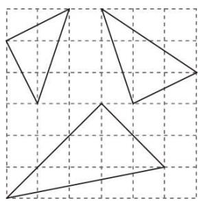

natural_image

Three triangles drawn on a grid background, no text or symbols present

A. 0

B. 1

C. 2

D. 3

【变式 3-1】（24-25 八年级上·福建漳州·阶段练习）如图所示，在 $4 \times 4$ 的正方形网格图中，小正方形的顶点称为格点， $\triangle ABC$ 的顶点都在格点上，每个小正方形的边长均为 1，则 $\triangle ABC$ 的形状描述最准确的是（）

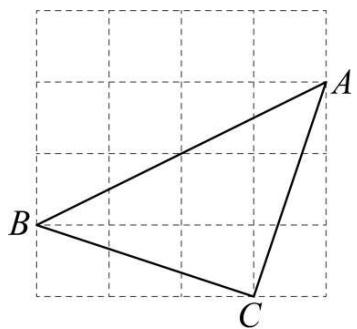

natural_image

Geometric diagram of triangle ABC on a grid background (no labels or measurements)

教辅资源, 关注公众号·全科AA+

A. 直角三角形

B. 等腰三角形

C. 等腰直角三角形

D. 等边三角形

【变式 3-2】（24-25 八年级上·全国·期中）如图所示的是正方形网格，则 $\angle MDC - \angle MAB =$ \_\_\_\_ $^{\circ}$ （点 A, B, C, D, M 为网格线交点）.

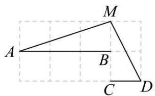

text_image

A
B
C
D
M

【变式 3-3】（2025·河北邢台·模拟预测）图是由小正方形拼成的网格，A,B两点均在格点上，C,D两点均为小正方形一边的中点，直线AB与直线CD交于点E，则 $\angle BED = (\quad)$

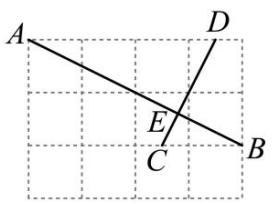

text_image

A
D
E
C
B

A. $60^{\circ}$

B. $75^{\circ}$

C. $90^{\circ}$

D. $105^{\circ}$

# 【题型4 图形上与已知两点构成直角三角形的点】

【例 4】点 A（2，m），B（2，m-5）在平面直角坐标系中，点 O 为坐标原点．若△ABO 是直角三角形，则 m 的值不可能是（）

A. 4

B. 2

C. 1

D. 0

【变式 4-1】已知点A的坐标为(3,5)，点B在x轴上，且AB=13，那么点B的坐标为\_\_\_\_。

【变式 4-2】在平面直角坐标系中，点 A 的坐标为(1, 1)，点 B 的坐标为(11, 1)，点 C 到直线 AB 的距离为 5，且△ABC 是直角三角形，则满足条件的 C 点有()

A. 4 个

B. 5 个

C. 6个

D. 8 个

【变式 4-3】点P在y轴上， $A(4,1)$ 、 $B(1,4)$ ，如果 $\triangle ABP$ 是直角三角形，求点P的坐标.

# 【题型5 利用勾股定理的逆定理求解】

【例 5】（24-25 八年级下·福建莆田·期中）如图，在 $\triangle ABC$ 中， $\angle ACB = 90^{\circ}$ ，AC = BC，P 是 $\triangle ABC$ 内的一点，且 PB = 1，PC = 2，PA = 3，则 $\angle BPC$ 的度数为（）

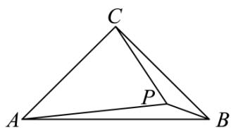

text_image

C
A
P
B

A. $120^{\circ}$

B. $135^{\circ}$

C. $140^{\circ}$

D. $150^{\circ}$

【变式 5-1】（24-25 八年级上·浙江衢州·期中）如图，三角形纸片 ABC 的三边长分别为 AC = 6, BC = 8, AB = 10，现将边 AC 沿 AD 折叠，使它落在边 AB 上，点 C 与点 E 重合，求 CD 的长.

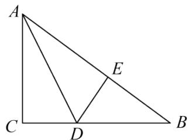

text_image

A
C
D
B
E

【变式 5-2】如图，在四边形 ABCD 中，AB: BC: CD: DA=2: 2: 3: 1，且 $\angle ABC=90^{\circ}$ ，则 $\angle DAB$ 的度数是 \_\_\_\_。

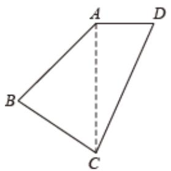

text_image

A
B
C
D

【变式 5-3】（24-25 八年级下·安徽合肥·期中）如图，在 $\triangle OAB$ 中， $OA = 3, OB = 4, AB = 5, \angle OAB$ 的平分线 $AC$ 交 $OB$ 于点 $C$ ，点 $P$ ， $Q$ 分别为线段 $AC$ ，边 $OA$ 上的动点．则 $OP + PQ$ 的最小值为（）

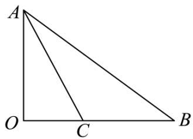

text_image

A
O C B

A. 2

B. 2.4

C. 2.5

D. 2.6

# 【题型6 利用勾股定理的逆定理证明】

【例 6】（24-25 八年级下·山西运城·阶段练习）定义：在 $\triangle ABC$ 中，若 BC = a, AC = b, AB = c，且 a, b, c 满足 $ac + a^{2} = b^{2}$ ，则称这个三角形为“类勾股三角形”.

请根据以上定义解决下列问题:

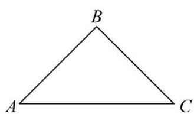

natural_image

Simple geometric diagram of a triangle labeled A, B, C (no additional text or symbols)

图1

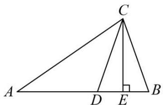

text_image

A
D
E
B
C

图2

(1)如图 1，若等腰三角形ABC是“类勾股三角形”，AB = BC，AC > AB，求∠C的度数.  
(2)如图 2, 在 $\triangle ABC$ 中, $\angle B = 2\angle A$ , 且 $\angle ACB > \angle A$ , $D$ 是 $AB$ 上的点, 连接 $CD$ , 满足 $AD = CD$ , 过点 $C$ 作 $CE \perp AB$ , 垂足为 $E$ . 求证: $\triangle ABC$ 为“类勾股三角形”.

【变式 6-1】（22-23 八年级下·河南许昌·期中）如图， $\triangle ABC$ 中， $AB$ 的垂直平分线 $DE$ 分别交 $AC$ 、 $AB$ 于点 $D$ ， $E$ ，且 $AD^{2}-DC^{2}=BC^{2}$ .

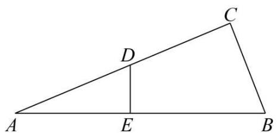

text_image

A
D
E
B
C

(1)求证： $\angle C = 90^{\circ}$ ;  
(2)若AC=8，BC=4，求AD的长.

【变式 6-2】（24-25 八年级下·河北唐山·期中）已知 $\triangle ABC$ 的三边 $a = n^{2} - 1 (n > 1)$ ，b = 2n， $c = n^{2} + 1$ .

(1)求证：c是 $\triangle ABC$ 的最长边；  
(2)求证： $\triangle ABC$ 是直角三角形；  
(3)直接写出一组满足 $\triangle ABC$ 的三边长，其中含正整数12.

【变式 6-3】（2025·河北邯郸·一模）【问题提出】

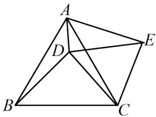

natural_image

Geometric diagram of a quadrilateral ABCD with internal diagonals and extended lines, no text or labels present.

图1

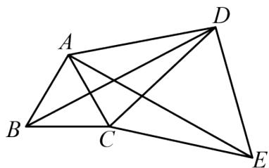

natural_image

Geometric diagram of a quadrilateral with internal diagonals and labeled vertices (no text or symbols)

图2

(1) 如图1, $\triangle ABC$ 和 $\triangle DCE$ 都是等边三角形, 点 $D$ 在 $\triangle ABC$ 内部, 连接 $AD$ , $AE$ , $BD$ .

①求证：BD = AE;   
②若 $\angle ADC=150^{\circ}$ ，求证： $BD^{2}=AD^{2}+CD^{2}$ ；

【问题探究】

(2) 如图2. $\triangle ABC$ 和 $\triangle DCE$ 都是等边三角形, 点 $D$ 在 $\triangle ABC$ 外部, 若 $BD^{2} = AD^{2} + CD^{2}$ 仍然成立, 求 $\angle ADC$ 的度数. 教辅资源, 关注公众号·全科AA+

# 【题型 7 勾股定理的逆定理实际应用】

【例 7】（24-25 八年级下·吉林松原·期中）如图，一架无人机旋停在空中点 A 处，点 A 与地面上点 B 之间的距离 AB = 20 米，点 A 与地面上点 C（点 B、C 处于同一水平面上）的距离 AC = 25 米，且 BC = 15 米.

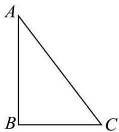

natural_image

Simple geometric diagram of a right triangle labeled A, B, C (no additional text or symbols)

(1)求∠ABC的度数;   
(2)现这架无人机沿AB所在直线向下飞行至点D处，若点D恰好在边AC的垂直平分线上，连接CD，求这架无人机向下飞行的距离（AD的长）.

【变式 7-1】（24-25 八年级下·江西赣州·阶段练习）如图，某小区的两个喷泉A，B位于小路AC的同侧，两个喷泉之间的距离 $AB = 25\mathrm{m}$ 。现要为喷泉铺设供水管道 $AM$ ， $BM$ ，供水点 $M$ 在小路 $AC$ 上，供水点 $M$ 到 $AB$ 的距离 $MN = 12\mathrm{m}$ ， $BM = 15\mathrm{m}$ 。

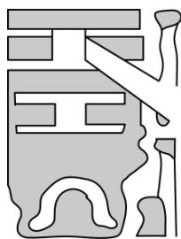

natural_image

Abstract geometric pattern with stylized shapes and no text or symbols

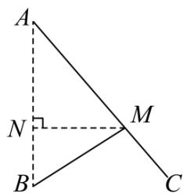

text_image

A
N
M
B
C

(1)求供水点M到喷泉A需要铺设的管道长AM.  
(2)求证： $\angle BMA = 90^{\circ}$ .

【变式 7-2】（24-25 八年级上·河南新乡·期末）某运动会以环保、舒适、温馨为出发点，对运动员休息区进行了精心设计．如图，四边形ABCD为休闲区域，四周是步道， $AB \perp BC$ ，中间是花卉种植区域，为减少拥堵，中间穿插了氢能源环保电动步道AC，经测量AB = 9，BC = 12，CD = 8，AD = 17.

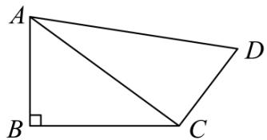

text_image

A
B
C
D

(1)求证： $AC \perp CD$ .  
(2)求四边形ABCD的面积.

【变式 7-3】我市夏季经常受台风天气影响，台风是一种自然灾害，它以台风中心为圆心在周围上千米的范围内形成极端气候，有极强的破坏力．如图，有一台风中心沿东西方向 AB 由点 A 行驶向点 B，已知点 C 为一海港，且点 C 与直线 AB 上两点 A，B 的距离分别为 300km 和 400km，且 AB = 500km，以台风中心为圆心周围 250km 以内为受影响区域.

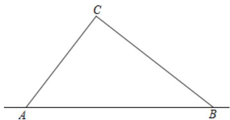

text_image

C
A
B

(1)求证： $\angle ACB = 90^{\circ}$ ;   
(2)海港 C 受台风影响吗？为什么？  
(3)若台风的速度为 40km/h，则台风影响该海港持续的时间有多长？

# 【题型 8 勾股定理及其逆定理的综合求值】教辅资源,关注公众号·全科AA+

【例 8】（24-25 八年级下·安徽六安·期中）如下图，学校有一块三角形空地ABC，计划将这块三角形空地分割成四边形ABDE和三角形EDC，分别摆放两种不同的花卉．经测量， $\angle EDC = 90^{\circ}$ ，DC = 15，DE = 20，DB = 35，AB = 40，AE = 5，求四边形ABDE的面积．（单位：米）

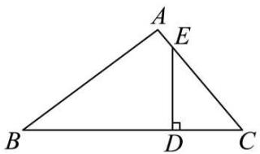

text_image

A
E
B
D
C

【变式8-1】如图 $\angle B = 90^{\circ}$ ， $AB = 20$ ， $BC = 15$ ， $CD = 7$ ， $AD = 24$ ，求 $\angle D$ 的度数.

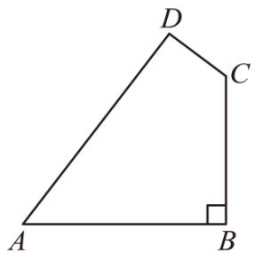

text_image

D
C
A
B

【变式 8-2】如图，有一块四边形花圃ABCD， $\angle ADC = 90^{\circ}$ ，AD = 4m，AB = 13m，BC = 12m，DC = 3m，该花圃的面积为\_\_\_\_m².

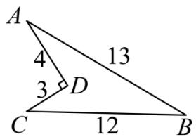

text_image

A
4
13
3
D
C
12
B

【变式 8-3】（24-25 八年级下·广西贺州·期中）【阅读与思考】勾股定理神秘而美妙，它的证法多种多样，其巧妙各有不同。在进行《勾股定理》一章学习时，老师带领同学们进行探究活动：如图 1，这是用纸片剪成的四个全等的直角三角形（两条直角边长分别为 $a$ ， $b(b > a)$ ，斜边长为 $c$ ）和一个边长为 $c$ 的正方形，请你将它们拼成一个图形，该图形能验证勾股定理。

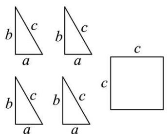

text_image

b
c
a
b
c
a
b
c
a
b
c
a
c
c

图1

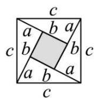  
图2

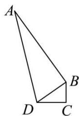  
图3

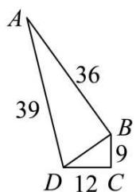

text_image

A
36
39
B
9
D 12 C

图4

【任务】

(1)如图2，这是小敏同学拼成的图形。请你利用图2验证勾股定理。

(2)一个零件的形状如图3所示，按照规定，零件中∠ABD和∠C都是直角，才是合格零件．如图4所示，工人师傅测得零件∠ABD = 90°，AD = 39cm，AB = 36cm，BC = 9cm，CD = 12cm，这个零件符合要求？请判断并说明理由.

# 【题型 9 利用勾股定理及其逆定理解决无刻度的尺规作图】

【例 9】（24-25 七年级上·江西抚州·阶段练习）线段AB的端点A，B在 $6 \times 6$ 的正方形网格的格点（网格线的交点）上，请仅用无刻度的直尺在网格中按要求作图.

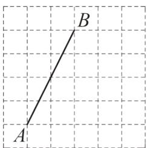

text_image

A
B

图①

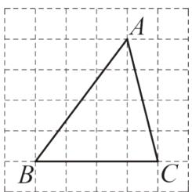

text_image

A
B
C

图②

(1)在图①中找出格点C，并连接AC，BC，使 $AC^{2}=AB^{2}+BC^{2}$ ;  
(2)在图②中作出 $\triangle ABC$ 的高 $CH$ ，并直接写出 $CH$ 的长为

【变式 9-1】（2025·山东滨州·模拟预测）如图所示的网格是正方形网格，则 $\angle PAB + \angle PBA =$ \_\_\_\_（点A，B，P是网格线交点），请只用无刻度的直尺，在如图所示的网格中，画出解决该题的关键思路的连线.

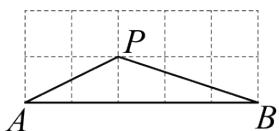

【变式 9-2】（24-25 八年级上·江西吉安·期末）如图是 $4 \times 4$ 正方形网格，已知格点 $A, B$ ，请用无刻度直尺按要求作图.

text_image

A
B

图1

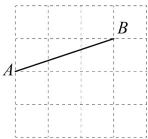

text_image

A
B

图2

(1)在图1中，以AB为腰，作等腰△ABC；教辅资源,关注公众号·全科AA+  
(2)在图 2 中，以AB为斜边，作直角△ABM，使其面积最小.

【变式 9-3】（24-25 八年级上·吉林长春·阶段练习）图①、图②、图③是 $3 \times 3$ 的正方形网格，每个小正方形的边长都为1．线段AB的端点在格点上．只用无刻度的直尺，在给定的网格中按要求画图，所画图形的顶点均在格点上，不要求写出画法，并保留作图痕迹.

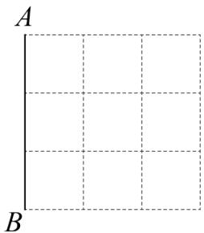

natural_image

Empty Cartesian coordinate grid with labeled axes A and B (no data points or text)

图①

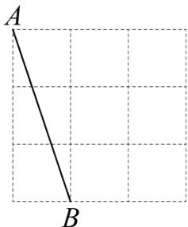

text_image

A
B

图②

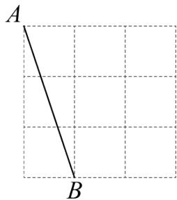

text_image

A
B

图③

(1)在图①中以 AB 为直角边画一个直角三角形，使它的面积为 3.  
(2)在图②中以 AB 为边画一个等腰三角形，使它的面积为 3.  
(3)在图③中以 AB 为斜边画一个等腰直角三角形.