# 专题1.2 一定是直角三角形吗（举一反三讲义）

# 【北师大版 2024】

# 题型归纳

【题型 1 判断三边能否构成直角三角形】....2

【题型 2 勾股数】....4

【题型3 网格中判断直角三角形】....6

【题型 4 图形上与已知两点构成直角三角形的点】....9

【题型 5 利用勾股定理的逆定理求解】....11

【题型 6 利用勾股定理的逆定理证明】....15

【题型 7 勾股定理的逆定理实际应用】....20

【题型 8 勾股定理及其逆定理的综合求值】....24

【题型 9 利用勾股定理及其逆定理解决无刻度的尺规作图】……28

# 举一反三

# 知识点 1 直角三角形的判别条件

1. 定义: 如果三角形的三边 $a, b, c$ 满足 $a^2 + b^2 = c^2$ 那么这个三角形是直角三角形。（此判别条件也称为勾股定理的逆定理）

2. 判断一个三角形是否为直角三角形的方法:

<table><tr><td>从角度上判断</td><td>三角形中有一个角是直角,或者三角形中有两个角互余</td></tr><tr><td>从边长上判断</td><td>两条较短边的平方和等于最长边的平方</td></tr></table>

# 知识点 2 勾股数

1. 勾股数

<table><tr><td>定义</td><td>满足 $a^{2} + b^{2} = c^{2}$ 的三个正整数,称为勾股数</td></tr><tr><td>满足条件</td><td>1三个数都是正整数2两个较小整数的平方和等于最大整数的平方</td></tr><tr><td>拓展</td><td>勾股数的整数倍仍为勾股数,如3,4,5的2倍6,8,10仍为勾股数.</td></tr><tr><td>常见形式</td><td>1 $n^{2}-1$ ,2n, $n^{2}+1$ (n大于1的全部数);24n, $4n^{2}-1$ , $4n^{2}+1$ (n为正整数)等</td></tr></table>

2. 判断勾股数的方法步骤:

(1)确定三个是正整数;

(2)确定最大的数字与另外两个较小的数，分别计算最大的数的平方与另外两个较小的数的平方和；

(3)进行比较, 若最大数的平方等于另外两个较小数的平方和, 则是勾股数, 否则不是.

# 【题型1 判断三边能否构成直角三角形】

【例 1】（2025·江苏南京·二模）下列长度的两条线段与长度为 12 的线段首尾依次相连能组成直角形三角形的是（）

A. 6, 9

B. 9, 15

C. 10, 16

D. 15, 18

【答案】B

【分析】本题考查了勾股定理的逆定理，根据勾股定理的逆定理即可判断，掌握勾股定理的逆定理是解题的关键.

【详解】解：A、 $6^{2}+9^{2}\neq12^{2}$ ，不能组成直角三角形，故选项不符合题意；

B、 $9^{2}+12^{2}=15^{2}$ ，能组成直角三角形，故选项符合题意；

C、 $10^{2} + 12^{2} \neq 16^{2}$ ，不能组成直角三角形，故选项不符合题意；

D、 $12^{2} + 15^{2} \neq 18^{2}$ ，不能组成直角三角形，故选项不符合题意；

故选：B.

【变式 1-1】（24-25 八年级下·湖北十堰·期中）以下列各组数为边长，可以构成直角三角形的是（）

A. 2, 3, 4

B. 3, 4, 6

C. 6, 8, 10

D. 7, 24, 26

【答案】C

【分析】本题主要考查了勾股定理的逆定理，解题的关键是掌握勾股定理的逆定理．利用勾股定理的逆定理逐项进行判断即可.

【详解】解：A. $\because2^{2}+3^{2}=13,\quad4^{2}=16,\quad2^{2}+3^{2}\neq4^{2}$

∴该选项三个数据不能构成直角三角形，故不符合题意；

B. $\because 3^{2} + 4^{2} = 25, 6^{2} = 36, 3^{2} + 4^{2} \neq 6^{2},$

∴该选项三个数据不能构成直角三角形，故不符合题意；

C. $\because 6^{2} + 8^{2} = 100, \quad 10^{2} = 100, \quad 6^{2} + 8^{2} = 10^{2},$

∴该选项三个数据能构成直角三角形，故符合题意；

D. $\because7^{2}+24^{2}=625,\quad26^{2}=676,\quad7^{2}+24^{2}\neq26^{2},$

∴该选项三个数据就不能构成直角三角形，故不符合题意；

故选：C.

【变式 1-2】（24-25 八年级下·四川南充·期中）已知 a、b、c 是三角形的三边长，如果满足 $(a-9)^{2}+(b-12)^{2}+|c-15|=0$ ，则三角形的形状是（）

A. 直角三角形

B. 等边三角形

C. 钝角三角形

D. 底与腰不相等的等腰三角形

【答案】A

【分析】本题主要考查了勾股定理和非负数的性质，几个非负数的和为0，那么这几个非负数的值都为0，据此可得 $a - 9 = 0$ ， $b - 12 = 0$ ， $c - 15 = 0$ ，则 $a = 9$ ， $b = 12$ ， $c = 15$ ，进而可证明 $a^2 + b^2 = c^2$ ，则该三角形是直角三角形.

【详解】解： $\because (a - 9)^{2} + (b - 12)^{2} + |c - 15| = 0, (a - 9)^{2} \geq 0, (b - 12)^{2} \geq 0, |c - 15| \geq 0,$

$$
\therefore (a - 9) ^ {2} = (b - 1 2) ^ {2} = | c - 1 5 | = 0,
$$

$$
\therefore a - 9 = 0, b - 1 2 = 0, c - 1 5 = 0,
$$

$$
\therefore a = 9, b = 1 2, c = 1 5,
$$

$$
\therefore a ^ {2} + b ^ {2} = 9 ^ {2} + 1 2 ^ {2} = 8 1 + 1 4 4 = 2 2 5, c ^ {2} = 1 5 ^ {2} = 2 2 5,
$$

$$
\therefore a ^ {2} + b ^ {2} = c ^ {2},
$$

∴该三角形是直角三角形，

故选：A.

【变式 1-3】（24-25 八年级下·福建三明·期中）已知 a, b, c 是 $\triangle ABC$ 的三条边，则下列条件能判定 $\triangle ABC$ 为直角三角形的是（）

A. a:b:c = 1:2:3

B. $(a + b)^{2} + (a - b)^{2} = 2c^{2}$

C. $\angle A:\angle B:\angle C = 2:3:4$

D. $\angle A = \angle B = 2\angle C$

【答案】B

【分析】本题主要考查了勾股定理的逆定理以及三角形的内角和定理，熟练应用勾股定理逆定理是解题的关键.

根据勾股定理的逆定理以及三角形内角和定理逐项分析判断即可解答.

【详解】解：A．由a:b:c=1:2:3，设a=k,b=2k,c=3k，则 $k^{2}+4k^{2}\neq9k^{2}$ ，即 $a^{2}+b^{2}\neq c^{2}$ ，能判定 $\triangle ABC$ 不是直角三角形，不合题意；

B. 由 $(a+b)^{2}+(a-b)^{2}=2c^{2}$ 可得 $a^{2}+b^{2}=c^{2}$ ，能判定 $\triangle ABC$ 是直角三角形，符合题意；

C. 由 $\angle A: \angle B: \angle C = 2:3:4$ 可得 $\angle A = 40^{\circ}$ , $\angle B = 60^{\circ}$ , $\angle C = 80^{\circ}$ , 不能判定 $\triangle ABC$ 是直角三角形, 不合题意;

D. 由 $\angle A = \angle B = 2\angle C$ 可得 $\angle A = 72^{\circ}$ , $\angle B = 72^{\circ}$ , $\angle C = 36^{\circ}$ , 不能判定 $\triangle ABC$ 是直角三角形, 不合题意.

故选：B.

# 【题型 2 勾股数】

【例 2】（2023·江苏南通·中考真题）勾股数是指能成为直角三角形三条边长的三个正整数，世界上第一次给出勾股数公式的是中国古代数学著作《九章算术》．现有勾股数 a, b, c，其中 a, b 均小于 c, $a = \frac{1}{2} m^{2} - \frac{1}{2}$ , $c = \frac{1}{2} m^{2} + \frac{1}{2}$ , m 是大于 1 的奇数，则 b = \_\_\_\_（用含 m 的式子表示）.

【答案】m

【分析】根据直角三角形的性质，直角边小于斜边得到a，b为直角边，c为斜边，根据勾股定理即可得到b的值.

【详解】解：由于现有勾股数 a, b, c，其中 a, b 均小于 c，

∴ a, b 为直角边，c 为斜边，

$$
\therefore a ^ {2} + b ^ {2} = c ^ {2},
$$

$$
\therefore \left(\frac {1}{2} m ^ {2} - \frac {1}{2}\right) ^ {2} + b ^ {2} = \left(\frac {1}{2} m ^ {2} + \frac {1}{2}\right) ^ {2},
$$

得到 $\frac{1}{4} m^4 -\frac{1}{2} m^2 +\frac{1}{4} +b^2 = \frac{1}{4} m^4 +\frac{1}{2} m^2 +\frac{1}{4},$

$$
\therefore b ^ {2} = m ^ {2},
$$

$$
\therefore b = \pm m,
$$

∵ m 是大于 1 的奇数，

$$
\therefore b = m.
$$

故答案为：m.

【点睛】本题考查勾股定理的应用，分清楚a，b为直角边，c为斜边是解题的关键.

【变式 2-1】（24-25 八年级下·河南周口·期中）我国是最早了解勾股定理的国家之一，它被记载于我国古代著名的数学著作《周髀算经》中，下列各组数中，是“勾股数”的是（）

A. 5, 12, 11

B. 6, 8, 10

C. 7, 8, 9

D. 15, 17, 18

【答案】B

【分析】本题考查勾股数，熟知勾股数的定义是正确解答此题的关键．根据勾股数的定义，三个正整数，两个较小数的平方和等于较大数的平方，这三个正整数构成一组勾股数，进行判定即可.

【详解】解：A、 $5^{2}+11^{2}\neq12^{2}$ ，故不是勾股数，不符合题意；

B、 $6^{2}+8^{2}=10^{2}$ ，故是勾股数，符合题意；

C、 $7^{2}+8^{2}\neq9^{2}$ ，故不是勾股数，不符合题意；

D、 $15^{2} + 17^{2} \neq 18^{2}$ ，故不是勾股数，不符合题意，

故选：B.

【变式 2-2】（23-24 八年级下·河北保定·期中）若8，15，x 是一组勾股数，则x 的值为 \_\_\_\_.

【答案】17

【分析】本题考查了勾股数的定义，分 x 为直角边和斜边两种情况分类讨论，再由勾股数的定义得出答案即可，解题关键是掌握勾股数的定义是可以构成一个直角三角形三边的一组正整数.

【详解】解：当x为直角边时， $x^{2}=161$ ，x不是正整数，不符合题意，

当x为斜边时，x=17，是正整数，符合题意，

综上，若8，15，x是一组勾股数，则x的值为17，

故答案为：17.

【变式 2-3】（22-23 七年级上·山东烟台·期中）下列说法：

①因为 0.6，0.8，1 不是勾股数，所以以 0.6，0.8，1 为边的三角形不是直角三角形  
②若 a, b, c 是勾股数，且 c > b, c > a，则必有 $a^{2} + b^{2} = c^{2}$   
③因以 0.5，1.2，1.3 为边长的三角形是直角三角形，所以 0.5，1.2，1.3 是勾股数  
④若三个整数 a, b, c 是直角三角形的三条边，则 3a, 3b, 3c 必是勾股数

其中正确的是\_\_\_\_（填序号）.

【答案】②④/④②

【分析】欲判断是否为勾股数，必须根据勾股数是正整数，同时还需验证两小边的平方和是否等于最长边的平方.

【详解】解：①虽然 0.6，0.8，1 不是勾股数，但是 $0.6^{2} + 0.8^{2} = 1^{2}$ ，所以以 0.6，0.8，1 为边的三角形是直角三角形，故①说法错误；

②若 a, b, c 是勾股数，且 c > b, c > a，则必有 $a^{2} + b^{2} = c^{2}$ ，故②说法正确；  
③因为 0.5，1.2，1.3 都不是正整数，所以 0.5，1.2，1.3 不是勾股数，故③说法错误；  
④若三个整数 a, b, c 是直角三角形的三边长，则 3a, 3b, 3c 一定是勾股数，故④说法正确.

故答案为：②④.

【点睛】本题主要考查了勾股数：满足 $a^{2}+b^{2}=c^{2}$ 的三个正整数，称为勾股数．注意：三个数必须是正整数，例如：2.5、6、6.5满足 $a^{2}+b^{2}=c^{2}$ ，但是它们不是正整数，所以它们不是勾股数．

# 【题型3 网格中判断直角三角形】

【例 3】如图，在一个 $6 \times 6$ 的正方形网格中，有三个格点三角形(顶点在网格的交点上)，其中直角三角形的个数是（）

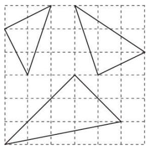

natural_image

Three triangles drawn on a grid background, no text or symbols present

A. 0

B. 1

C. 2

D. 3

【答案】C

【分析】根据勾股定理逐个判断即可；

【详解】如图所示:

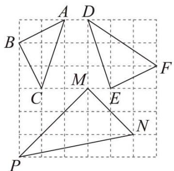

text_image

A D
B
C M E F
P N

$$
\because A B ^ {2} = 2 ^ {2} + 1 ^ {2} = 5, A C ^ {2} = 3 ^ {2} + 1 ^ {2} = 1 0, B C ^ {2} = 2 ^ {2} + 1 ^ {2} = 5,
$$

$$
\therefore A B ^ {2} + B C ^ {2} = A C ^ {2},
$$

∴ $\triangle ABC$ 是直角三角形;

$$
\because D E ^ {2} = 3 ^ {2} + 1 ^ {2} = 1 0, E F ^ {2} = 2 ^ {2} + 1 ^ {2} = 5, D F ^ {2} = 3 ^ {2} + 2 ^ {2} = 1 3,
$$

$$
\therefore D F ^ {2} + E F ^ {2} \neq D F ^ {2},
$$

∴ $\triangle DEF$ 不是直角三角形;

$$
\because P M ^ {2} = 3 ^ {2} + 3 ^ {2} = 1 8, N M ^ {2} = 2 ^ {2} + 2 ^ {2} = 8, P N ^ {2} = 5 ^ {2} + 1 ^ {2} = 2 6,
$$

$$
\therefore P M ^ {2} + M N ^ {2} = P N ^ {2},
$$

∴ $\triangle PMN$ 是直角三角形;

故答案选 C.

【点睛】本题主要考查了勾股定理的应用，准确计算是解题的关键.

【变式 3-1】（24-25 八年级上·福建漳州·阶段练习）如图所示，在 $4 \times 4$ 的正方形网格图中，小正方形的顶点称为格点， $\triangle ABC$ 的顶点都在格点上，每个小正方形的边长均为 1，则 $\triangle ABC$ 的形状描述最准确的是（）

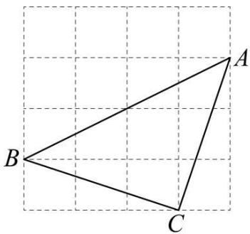

natural_image

Geometric diagram of triangle ABC on a grid background (no labels or measurements)

A. 直角三角形

B. 等腰三角形

C. 等腰直角三角形

D. 等边三角形

【答案】C

【分析】本题考查了勾股定理的逆定理．利用勾股定理分别求出三角形三边的长度，再利用勾股定理的逆定理即可求解.

【详解】解：∵边长为1的正方形网格中，点A，B，C均在格点上，

$$
\therefore A B ^ {2} = 2 ^ {2} + 4 ^ {2} = 2 0, A C ^ {2} = 1 ^ {2} + 3 ^ {2} = 1 0, B C ^ {2} = 1 ^ {2} + 3 ^ {2} = 1 0,
$$

$$
\therefore A C ^ {2} + B C ^ {2} = A B ^ {2},
$$

$$
\therefore \angle A C B = 9 0 ^ {\circ} \text {且} A C = B C,
$$

$\therefore\triangle ABC$ 为等腰直角三角形，

故选：C.

【变式 3-2】（24-25 八年级上·全国·期中）如图所示的是正方形网格，则 $\angle MDC - \angle MAB =$ \_\_\_\_ $^{\circ}$ （点 A, B, C, D, M 为网格线交点）.

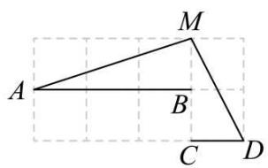

text_image

A
B
C
D
M

【答案】45

【分析】本题考查了勾股定理及其逆定理，等腰三角形的性质，解题的关键是掌握相关知识并数形结合．在直线AB上取点E，使得EM = DM，连接DE，过点E作EF⊥CD，交CD的延长线于点D，得到 $\angle MAB = \angle EDF$ ，推出 $\angle MDC - \angle MAB = \angle EDM$ ，根据勾股定理的逆定理证明 $\triangle DEM$ 是直角三角形，结合
EM = DM，即可求解.

【详解】解：如图，在直线AB上取点E，使得EM = DM，连接DE，过点E作EF ⊥ CD，交CD的延长线于点F，

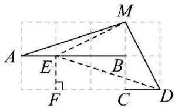

text_image

Geometric diagram with labeled points and lines, including triangle ABC and auxiliary constructions

由图可知， $\angle MAB = \angle EDF$ ，

$$
\therefore \angle M D C - \angle M A B = \angle M D C - \angle E D F = \angle E D M,
$$

$$
\because M E ^ {2} = M D ^ {2} = 1 ^ {2} + 2 ^ {2} = 5, D E ^ {2} = 1 ^ {2} + 3 ^ {2} = 1 0,
$$

$$
\therefore E M ^ {2} + D M ^ {2} = D E ^ {2},
$$

∴ $\triangle DEM$ 是直角三角形，

$$
\because E M = D M,
$$

∴ $\angle EDM = 45^{\circ}$ ，即 $\angle MDC - \angle MAB = 45^{\circ}$

故答案为：45.

【变式 3-3】（2025·河北邢台·模拟预测）图是由小正方形拼成的网格，A,B两点均在格点上，C,D两点均为小正方形一边的中点，直线AB与直线CD交于点E，则 $\angle BED = (\quad)$

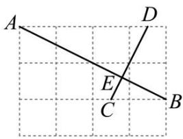

text_image

A
D
E
C
B

A. $60^{\circ}$

B. $75^{\circ}$

C. $90^{\circ}$

D. $105^{\circ}$

【答案】C

【分析】本题考查平移的性质，勾股定理及其逆定理，通过平移，将点 C、D 移到格点是银题的关键。将 CD 向下平移一格，再向左平移 $\frac{1}{2}$ 格，得到 GF，连接 GB，利用勾股定理及其逆定理，证明 $\angle BFG = 90^{\circ}$ ，即可由平行线的性质求得 $\angle BEC = \angle BFG = 90^{\circ}$ ，从而求得 $\angle BED$ 。

【详解】解：如图，平移CD至FG处，则F,G均在正方形格点上，连接GB，

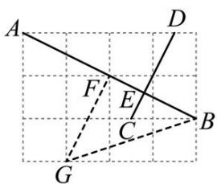

text_image

Geometric diagram with labeled points A, B, C, D, E, F, G and intersecting lines on a grid background

设小正方形的边长为 1，由勾股定理得:

$$
B F ^ {2} = 1 ^ {2} + 2 ^ {2} = 5, G F ^ {2} = 1 ^ {2} + 2 ^ {2} = 5, B G ^ {2} = 1 ^ {2} + 3 ^ {2} = 1 0,
$$

$$
\therefore B F ^ {2} + G F ^ {2} = B G ^ {2}
$$

$$
\therefore \angle B F G = 9 0 ^ {\circ}
$$

∵平移CD至FG处，.

$$
\therefore C D \parallel G F
$$

$$
\therefore \angle B E C = \angle B F G = 9 0 ^ {\circ}
$$

$$
\therefore \angle B E D = 9 0 ^ {\circ}
$$

故选：C.

# 【题型4 图形上与已知两点构成直角三角形的点】

【例 4】点 A（2，m），B（2，m-5）在平面直角坐标系中，点 O 为坐标原点．若△ABO 是直角三角形，则 m 的值不可能是（）

A. 4

B. 2

C. 1

D. 0

【答案】B

【分析】分 $\angle OAB=90^{\circ}$ ， $\angle OBA=90^{\circ}$ ， $\angle AOB=90^{\circ}$ 三种情况考虑：当 $\angle OAB=90^{\circ}$ 时，点A在x轴上，进而可得出m=0；当 $\angle OBA=90^{\circ}$ 时，点B在x轴上，进而可得出m=5；当 $\angle AOB=90^{\circ}$ 时，利用勾股定理可得出关于m的一元二次方程，解之即可得出m的值．综上，对照四个选项即可得出结论.

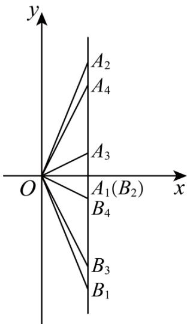

text_image

y
A₂
A₄
A₃
O
A₁(B₂)
B₄
x
B₃
B₁

【详解】

解：分三种情况考虑（如图所示）：

当 $\angle OAB=90^{\circ}$ 时，m=0;

当 $\angle OBA=90^{\circ}$ 时，m-5=0，解得：m=5；

当 $\angle AOB=90^{\circ}$ 时， $AB^{2}=OA^{2}+OB^{2}$ ，即 $25=4+m^{2}+4+m^{2}-10m+25$ ，

解得： $m_{1}=1,\quad m_{2}=4.$

综上所述：m 的值可以为 0, 5, 1, 4.

故选B.

【点睛】本题考查了坐标与图形性质以及勾股定理，分 $\angle OAB=90^{\circ}$ ， $\angle OBA=90^{\circ}$ ， $\angle AOB=90^{\circ}$ 三种情况求出m的值是解题的关键.

【变式 4-1】已知点A的坐标为(3,5)，点B在x轴上，且AB = 13，那么点B的坐标为\_\_\_\_。

【答案】 $(-9,0)$ 或 $(15,0)$

【分析】设点 B 的横坐标为 t，利用两点间的距离公式得到 $\sqrt{(3-t)^{2}+5^{2}}=13$ ，从而可以求出 t 的值.

【详解】解：设点 B 的横坐标为 t，

根据题意得 $(3-t)^{2}+5^{2}=169$ ，即 $(3-t)^{2}=12$ .

所以 3-t=12 或 3-t=-12.

∴t=-9 或 t=15.

故答案为 $(-9,0)$ 或 $(15,0)$ .

【变式 4-2】在平面直角坐标系中，点 A 的坐标为(1, 1)，点 B 的坐标为(11, 1)，点 C 到直线 AB 的距离为 5，且△ABC 是直角三角形，则满足条件的 C 点有()

A. 4 个

B. 5 个

C. 6 个

D. 8 个

【答案】C

【分析】当 $\angle A=90^{\circ}$ 时，满足条件的C点2个；当 $\angle B=90^{\circ}$ 时，满足条件的C点2个；当 $\angle C=90^{\circ}$ 时，满足条件的C点2个．所以共有6个.

【详解】∵点 A，B 的纵坐标相等，

∴AB||x 轴，

∵点 C 到 AB 距离为 5，AB=10，

∴点 C 在平行于 AB 的两条直线上，

∴过点 A 的垂线与那两条直线有 2 个交点，过点 B 的垂线与那两条直线有 2 个交点，以 AB 为直径的圆与那两条直线有只有 2 个交点（这两个两点在线段 AB 的垂直平分线上），

∴满足条件的 C 点共，6 个.

故选 C.

【点睛】用到的知识点为：到一条直线距离为某个定值的直线有两条． $\triangle ABC$ 是直角三角形，它的任意一个顶点都有可能为直角顶点.

【变式 4-3】点P在y轴上， $A(4,1)$ 、 $B(1,4)$ ，如果 $\triangle ABP$ 是直角三角形，求点P的坐标.

【答案】点P的坐标为(0,3)或(0,-3)

【分析】本题考查的是两点距离与勾股定理，根据 A、B 坐标构造直角三角形，运用勾股定理与两点间距离公式，分类讨论即可求出点 P 坐标

【详解】设点P的坐标为 $(0,x)$ ，分两种情况：

①当点B为直角顶点时，点P在y轴正半轴，

作 $AD \perp y$ 轴于D， $BE \perp y$ 轴于E， $BF \perp x$ 轴于F，如图所示：

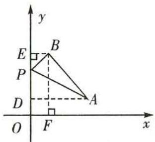

text_image

y
E
B
P
D
A
O
F
x

由勾股定理，得 $PB^{2}+AB^{2}=PA^{2}$ ，

即 $1^{2}+(4-x)^{2}+3^{2}+3^{2}=(x-1)^{2}+4^{2}$ ，解得x=3，

∴点P的坐标为(0,3).

②当点A为直角顶点时，点P在y轴负半轴，作 $AD \perp y$ 轴于D， $BE \perp y$ 轴于E，如图所示：

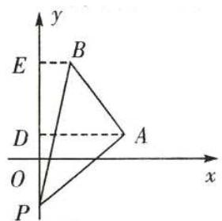

text_image

y
E
B
D
A
O
x
P

由勾股定理，得 $PA^{2}+AB^{2}=PB^{2}$ ，

即 $4^{2}+(1-x)^{2}+3^{2}+3^{2}=(4-x)^{2}+1^{2}$ ，解得x=-3，

∴点P的坐标为 $(0,-3)$ .

综上所述，如果 $\triangle ABP$ 是直角三角形，那么点 P 的坐标为 $(0,3)$ 或 $(0,-3)$ .

【点睛】本题的关键是分类讨论点 P 的情况，并灵活运用勾股定理和两点间距离公式.

# 【题型5 利用勾股定理的逆定理求解】

【例 5】（24-25 八年级下·福建莆田·期中）如图，在 $\triangle ABC$ 中， $\angle ACB = 90^{\circ}$ ，AC = BC，P 是 $\triangle ABC$ 内的一点，且 PB = 1，PC = 2，PA = 3，则 $\angle BPC$ 的度数为（）

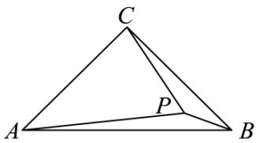

text_image

C
A
P
B

A. $120^{\circ}$

B. $135^{\circ}$

C. $140^{\circ}$

D. $150^{\circ}$

【答案】B

【分析】本题主要考查了旋转的性质，勾股定理逆定理，等腰直角三角形的判定与性质，熟记各性质并作辅助线构造出等腰直角三角形和直角三角形是解题的关键.

将 $\triangle ACP$ 绕 $C$ 点旋转 $90^{\circ}$ , 根据旋转的性质可得出 $\angle QPC = 45^{\circ}$ , 根据勾股定理可证出 $\angle PBQ = 90^{\circ}$ , 从而可得出答案.

【详解】如图，将 $\triangle ACP$ 绕 C 点旋转 $90^{\circ}$ ，得 $\triangle BCQ$ ，连接 PQ，

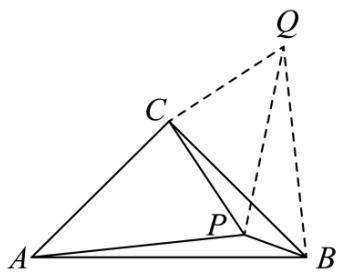

text_image

Geometric diagram showing triangle ABC with internal point P and auxiliary point Q connected by dashed lines

由旋转的性质可知：Rt $\triangle ACB \sim Rt \triangle PCQ$ ， $\angle PCQ = 90^{\circ}$ ，

$$
\therefore C Q = C P = 2, B Q = P A = 3, \angle Q B C = \angle P A C,
$$

$\therefore PQ^{2}=CQ^{2}+CP^{2}=8,$ 且 $\angle QPC=45^{\circ},$

在 $\triangle BPQ$ 中， $PB^{2} + PQ^{2} = 8 + 1 = 9,$

$$
\therefore P B ^ {2} + P Q ^ {2} = B Q ^ {2},
$$

$$
\therefore \angle Q P B = 9 0 ^ {\circ},
$$

$$
\therefore \angle B P C = \angle Q P B + \angle Q P C = 1 3 5 ^ {\circ}.
$$

故选 B.

【变式 5-1】（24-25 八年级上·浙江衢州·期中）如图，三角形纸片ABC的三边长分别为AC = 6, BC = 8, AB = 10，现将边AC沿AD折叠，使它落在边AB上，点C与点E重合，求CD的长.

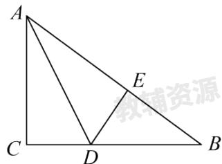

text_image

A
E
C
D
B

【答案】3

【分析】本题考查了勾股定理及其逆定理、折叠问题，熟练掌握性质定理是解题的关键.

先根据勾股定理逆定理得出 $\triangle ABC$ 是直角三角形， $\angle ACB = 90^{\circ}$ ，再根据折叠得出

$AE = AC = 6, \angle AED = 90^{\circ}$ ，然后设DE = CD = x，根据勾股定理即可得出答案.

【详解】解：在 $\triangle ABC$ 中，AC = 6, BC = 8, AB = 10,

$$
\therefore A C ^ {2} + B C ^ {2} = A B ^ {2},
$$

∴△ABC是直角三角形，∠ACB = 90°，

∵△AED是△ACD翻折而成，

$$
\therefore A E = A C = 6, \angle A E D = 9 0 ^ {\circ},
$$

设DE = CD = x,

$$
\therefore B E = A B - A E = 1 0 - 6 = 4,
$$

在Rt△BDE中， $BD^{2}=DE^{2}+BE^{2}$ ，即 $(8-x)^{2}=4^{2}+x^{2}$

解得x=3.

故CD的长为3.

【变式 5-2】如图，在四边形 ABCD 中，AB: BC: CD: DA=2: 2: 3: 1，且 $\angle ABC=90^{\circ}$ ，则 $\angle DAB$ 的度数是 \_\_\_\_。

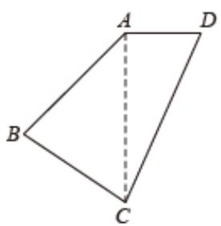

text_image

A
B
C
D

【答案】 $135^{\circ}$

【分析】由已知可得 AB=BC，从而可求得 $\angle BAC$ 的度数. 设 AB=2x ，通过计算证明 $AC^{2}+AD^{2}=CD^{2}$ ，从而证得 $\triangle ACD$ 是直角三角形，即可得到 $\angle DAC=90^{\circ}$ ，从而求得 $\angle DAB$ 的度数.

【详解】解：∵AB: BC: CD: DA=2: 2: 3: 1，且∠ABC=90°，

$$
\therefore \mathrm{AB} = \mathrm{BC},
$$

$$
\therefore \angle B A C = \angle A C B = 4 5 ^ {\circ},
$$

∴设 AB=2x，则 BC=2x，CD=3x，DA=x，

$$
\therefore \mathrm{AC} ^ {2} = \mathrm{AB} ^ {2} + \mathrm{BC} ^ {2} = (2 \mathrm{x}) ^ {2} + (2 \mathrm{x}) ^ {2} = 8 \mathrm{x} ^ {2}
$$

又 $CD^{2}-AD^{2}=(3x)^{2}-x^{2}=8x^{2}$

$$
\therefore \mathrm{AC} ^ {2} = \mathrm{CD} ^ {2} - \mathrm{AD} ^ {2}
$$

$$
\because \mathrm{AC} ^ {2} + \mathrm{AD} ^ {2} = \mathrm{CD} ^ {2}
$$

$\therefore\triangle ACD$ 是直角三角形，

$$
\therefore \angle D A C = 9 0 ^ {\circ},
$$

$$
\therefore \angle D A B = 4 5 ^ {\circ} + 9 0 ^ {\circ} = 1 3 5 ^ {\circ}.
$$

故答案是： $135^{\circ}$ .

【点睛】此题主要考查学生对逆定理的理解和运用能力，正确得出 $\angle DAC=90^{\circ}$ 是解题关键.

【变式 5-3】（24-25 八年级下·安徽合肥·期中）如图，在 $\triangle OAB$ 中， $OA = 3, OB = 4, AB = 5, \angle OAB$ 的平分线 $AC$ 交 $OB$ 于点 $C$ ，点 $P$ ， $Q$ 分别为线段 $AC$ ，边 $OA$ 上的动点．则 $OP + PQ$ 的最小值为（）

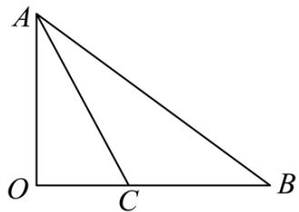

text_image

A
O C B

A. 2

B. 2.4

C. 2.5

D. 2.6

【答案】B

【分析】本题考查了勾股定理逆定理，角平分线的性质定理，垂线段最短，轴对称的性质，熟练掌握知识点，利用轴对称性质求解最值问题是解题的关键.

先由勾股定理逆定理得到 $OA \perp OB$ ，作 $CD \perp AB$ 交 $AB$ 于点 $D$ ，根据角平分线性质定理得到 $CO = CD$ ，再由等面积法求出 $OC$ ，作点 $Q$ 关于 $AC$ 的对称点 $Q'$ ，则在点 $Q'$ 在 $AB$ 上，则 $PQ = PQ'$ ，过点 $O$ 作 $OH \perp AB$ 交 $AB$ 于点 $H$ ，那么 $OP + PQ = OP + PQ' \geq OH$ ，故当点 $O$ 、 $P$ 、 $Q'$ 三点共线且点 $Q'$ 与点 $H$ 重合时， $OP + PQ = OP + PQ'$ 最小， $OH$ 为最小值，再由等面积法即可求解.

【详解】解：∵OA = 3, OB = 4, AB = 5

$$
\therefore O A ^ {2} + O B ^ {2} = A B ^ {2},
$$

∴ $\triangle OAB$ 是直角三角形， $OA \perp OB$ ，

作 $CD \perp AB$ 交AB于点D，

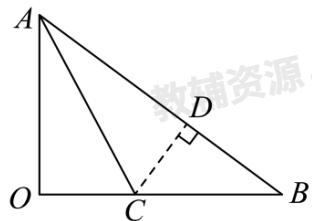

text_image

A
O
C
B
D
教辅资源

$$
\therefore \angle O = \angle C D A = 9 0 ^ {\circ},
$$

又∵ AC是∠OAB的平分线，

$$
\therefore C O = C D.
$$

$$
\therefore S _ {\triangle A B C} = \frac {1}{2} A B \cdot C D = \frac {1}{2} B C \cdot A O,
$$

即 $\frac{1}{2} \times 5 \times OC = \frac{1}{2} BC \times 3 = \frac{1}{2}(OB - OC) \times 3 = \frac{1}{2}(4 - OC) \times 3,$

$$
\therefore O C = \frac {3}{2},
$$

∵ AC是∠OAB的平分线，点Q为OA上动点，作点Q关于AC的对称点 $Q'$ ，则在点 $Q'$ 在AB上，

$$
\therefore P Q = P Q ^ {\prime}.
$$

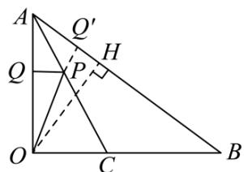

text_image

A
Q'
H
Q
P
O
C
B

过点O作OH⊥AB交AB于点H,

$$
\therefore O P + P Q = O P + P Q ^ {\prime} \geq O H
$$

当点O、P、 $Q'$ 三点共线且点 $Q'$ 与点H重合时， $OP + PQ = OP + PQ'$ 最小，OH为最小值.

由（1）可知， $\triangle OAB$ 是直角三角形，

$$
\therefore S _ {\triangle A O B} = \frac {1}{2} O B \cdot O A = \frac {1}{2} O H \cdot A B,
$$

$$
\therefore \frac {1}{2} \times 4 \times 3 = \frac {1}{2} O H \times 5
$$

解得：OH = 2.4.

故选：B.

# 【题型6 利用勾股定理的逆定理证明】

【例 6】（24-25 八年级下·山西运城·阶段练习）定义：在 $\triangle ABC$ 中，若 BC = a, AC = b, AB = c，且 a, b, c 满足 $ac + a^{2} = b^{2}$ ，则称这个三角形为“类勾股三角形”.

请根据以上定义解决下列问题:

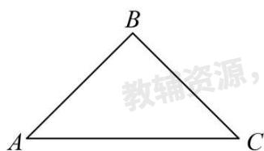

text_image

B
A C
教辅资源,

图1

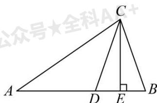

text_image

公众号★全科A
C
A
D
E
B

图2

(1)如图 1，若等腰三角形ABC是“类勾股三角形”，AB = BC，AC > AB，求∠C的度数.

(2)如图 2, 在 $\triangle ABC$ 中, $\angle B = 2\angle A$ , 且 $\angle ACB > \angle A$ , $D$ 是 $AB$ 上的点, 连接 $CD$ , 满足 $AD = CD$ , 过点 $C$ 作 $CE \perp AB$ , 垂足为 $E$ . 求证: $\triangle ABC$ 为“类勾股三角形”.

【答案】(1) $45^{\circ}$

(2) 见解析

【分析】本题考查了等腰三角形的判定及性质，勾股定理等知识点，熟悉掌握各性质是解题的关键.

（1）设BC=a，AC=b，AB=c，根据类勾股三角形的特征 $ac+a^{2}=b^{2}$ ，把a=c代入运算求解即可.

（2）设BC=a，AC=b，AB=c，利用角的等量代换证出 $\angle B=\angle CDB$ ，得到CD=CB=a，利用等腰三角形的性质得到 $DE=BE=\frac{c-a}{2}$ ，再利用勾股定理列式求解即可.

【详解】（1）解：设BC=a，AC=b，AB=c，

∵△ABC是“类勾股三角形”，

$$
\therefore a c + a ^ {2} = b ^ {2},
$$

$$
\because A B = B C,
$$

$$
\therefore a = c,
$$

$$
\therefore c ^ {2} + a ^ {2} = b ^ {2},
$$

$$
\therefore \angle B = 9 0 ^ {\circ},
$$

∴ $\triangle ABC$ 是等腰直角三角形，

$$
\therefore \angle C = 4 5 ^ {\circ};
$$

（2）证明：设BC=a，AC=b，AB=c，

$$
\because A D = C D,
$$

$$
\therefore \angle A = \angle D C A,
$$

$$
\therefore \angle C D B = \angle A + \angle D C A = 2 \angle A,
$$

又∵∠B = 2∠A,

$$
\therefore \angle B = \angle C D B,
$$

$$
\therefore C D = C B = a,
$$

$$
\therefore A D = C D = a,
$$

$$
\because C E \perp A B,
$$

$$
\therefore D E = B E = \frac {c - a}{2},
$$

在Rt $\triangle AEC$ 中， $AE = AD + DE = a + \frac{c - a}{2} = \frac{c + a}{2}$ ，由勾股定理得 $CE^{2} = AC^{2} - AE^{2} = b^{2} - \left(\frac{a + c}{2}\right)^{2}$ ，
在Rt $\triangle CED$ 中，由勾股定理得 $CE^{2}=CD^{2}-DE^{2}=a^{2}-\left(\frac{c-a}{2}\right)^{2}$

$$
\therefore b ^ {2} - \left(\frac {a + c}{2}\right) ^ {2} = a ^ {2} - \left(\frac {c - a}{2}\right) ^ {2},
$$

$$
\therefore b ^ {2} = a ^ {2} + a c,
$$

∴ $\triangle ABC$ 为“类勾股三角形”.

【变式 6-1】（22-23 八年级下·河南许昌·期中）如图， $\triangle ABC$ 中， $AB$ 的垂直平分线 $DE$ 分别交 $AC$ 、 $AB$ 于点 $D$ ， $E$ ，且 $AD^{2}-DC^{2}=BC^{2}$ .

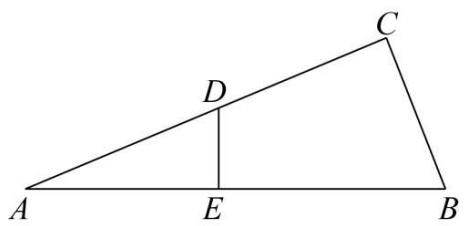

text_image

A
D
E
B
C

(1)求证： $\angle C = 90^{\circ}$ ;

(2)若AC=8，BC=4，求AD的长.

【答案】(1)证明见解析

(2)5

【分析】（1）由线段垂直平分线的性质得到AD = BD，再结合 $AD^{2}-DC^{2}=BC^{2}$ 证明 $\triangle BCD$ 是直角三角形，即可证明结论；

（2）设 $AD = BD = x$ ，则 $CD = 8 - x$ ，然后根据 $BD^{2} - DC^{2} = BC^{2}$ 建立方程求解即可.

【详解】（1）证明：如图所示，连接BD，

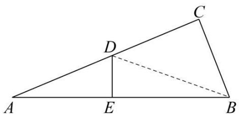

text_image

Geometric diagram of triangle ABC with point D on AC and auxiliary line DE, labeled with points A, B, C, D, E, and a dashed extension.

∵ DE 垂直平分 AB，

$$
\therefore A D = B D,
$$

$$
\because A D ^ {2} - D C ^ {2} = B C ^ {2},
$$

$$
\therefore B D ^ {2} - D C ^ {2} = B C ^ {2},
$$

$\therefore\triangle BCD$ 是直角三角形，

$$
\therefore \angle C = 9 0 ^ {\circ};
$$

（2）解：设AD = BD = x，则CD = AC - AD = 8 - x，

由（1）得 $BD^{2}-DC^{2}=BC^{2}$ ,

$$
\therefore x ^ {2} - (8 - x) ^ {2} = 4 ^ {2},
$$

解得x=5，

$$
\therefore A D = 5.
$$

【点睛】本题主要考查了垂直平分线的性质、勾股定理及其逆定理等知识，是重要考点，难度较易，添加辅助线是解题关键.

【变式 6-2】（24-25 八年级下·河北唐山·期中）已知 $\triangle ABC$ 的三边 $a = n^{2} - 1 (n > 1)$ ，b = 2n， $c = n^{2} + 1$ .

(1)求证：c是 $\triangle ABC$ 的最长边；

(2)求证： $\triangle ABC$ 是直角三角形；

(3)直接写出一组满足 $\triangle ABC$ 的三边长，其中含正整数12.

【答案】(1)见解析

(2) 见解析

(3)12, 35, 37

【分析】此题考查了勾股定理的逆定理的应用、整式混合运算和乘法公式，熟练掌握勾股定理的逆定理是关键.

（1）分别证明 $c > a$ ， $c > b$ ，即可证明结论；  
(2) 根据勾股定理的逆定理进行证明即可;  
（3）当b=2n=12时，即n=6，求出此时a=35，c=37即可.

【详解】（1）解： $\because c-a=(n^{2}+1)-(n^{2}-1)=n^{2}+1-n^{2}+1=2>0$

$$
\therefore c > a,
$$

$$
\because n > 1,
$$

$$
\therefore n - 1 > 0
$$

$$
\therefore c - b = (n ^ {2} + 1) - 2 n = (n - 1) ^ {2} > 0,
$$

$$
\therefore c > b,
$$

综上可知，c是 $\triangle ABC$ 的最长边；

(2) $\because c^{2} = (n^{2} + 1)^{2}, a^{2} + b^{2} = (n^{2} - 1)^{2} + (2n)^{2} = n^{4} - 2n^{2} + 1 + 4n^{2} = n^{4} + 2n^{2} + 1 = (n^{2} + 1)^{2},$

$$
\therefore a ^ {2} + b ^ {2} = c ^ {2},
$$

∴ $\triangle ABC$ 是直角三角形;

(3) 解: 当 $b = {2n} = {12}$ 时, 即 $n = 6$ ,

则此时 $a = n^2 - 1 = 6^2 - 1 = 35$ ， $c = n^2 + 1 = 6^2 + 1 = 37$

∴△ABC的三边长为12，35，37.

【变式 6-3】（2025·河北邯郸·一模）【问题提出】

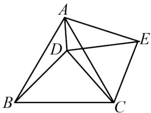

natural_image

Geometric diagram of a tetrahedron with labeled vertices A, B, C, D, E (no text or symbols present)

图1

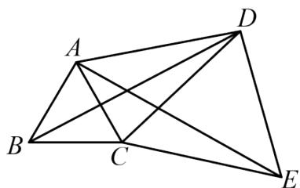

natural_image

Geometric diagram of a quadrilateral with internal diagonals and labeled vertices (no text or symbols)

图2

(1) 如图1, $\triangle ABC$ 和 $\triangle DCE$ 都是等边三角形, 点 $D$ 在 $\triangle ABC$ 内部, 连接 $AD$ , $AE$ , $BD$ .

①求证：BD = AE;   
②若 $\angle ADC=150^{\circ}$ ，求证： $BD^{2}=AD^{2}+CD^{2}$ ;

【问题探究】

（2）如图2． $\triangle ABC$ 和 $\triangle DCE$ 都是等边三角形，点 $D$ 在 $\triangle ABC$ 外部，若 $BD^{2} = AD^{2} + CD^{2}$ 仍然成立，求 $\angle ADC$ 的度数.

【答案】（1）①见解析；②见解析；（2） $30^{\circ}$ .

【分析】本题考查了全等三角形的判定与性质，勾股定理及逆定理，等边三角形的性质，掌握知识点的应用是解题的关键.

(1) ①由等边三角形性质可得 $BC = AC$ , $CD = CE$ , $\angle ACB = \angle ECD = 60^{\circ}$ , 然后利用“SAS”证明 $\triangle DCB \cong \triangle ECA$ 即可;  
②由 $\angle ADC = 150^{\circ}$ , 则 $\angle ADE = \angle ADC - \angle EDC = 90^{\circ}$ , 再通过勾股定理得 $AD^{2} + DE^{2} = AE^{2}$ , 又 $AE = BD$ ,从而求证;

(2) 证明 $\triangle DCB \cong \triangle ECA(SAS)$ , 则有 $BD = AE$ , 又 $BD^{2} = AD^{2} + CD^{2}$ , 则 $AE^{2} = AD^{2} + DE^{2}$ , 从而得出 $\angle ADE = 90^{\circ}$ , 最后用角度和差即可求解.

【详解】解：（1）证明：①∵△ABC和△DCE都是等边三角形，

$$
\therefore B C = A C, \quad C D = C E, \quad \angle A C B = \angle E C D = 6 0 ^ {\circ},
$$

$$
\therefore \angle D C B = 6 0 ^ {\circ} - \angle D C A = \angle E C A,
$$

$$
\therefore \triangle D C B \cong \triangle E C A (\text { SAS }),
$$

$$
\therefore B D = A E;
$$

②∵△DCE是等边三角形，

$$
\therefore \angle E D C = 6 0 ^ {\circ}, D E = C D,
$$

$$
\because \angle A D C = 1 5 0 ^ {\circ},
$$

$$
\therefore \angle A D E = \angle A D C - \angle E D C = 9 0 ^ {\circ},
$$

$$
\therefore A D ^ {2} + D E ^ {2} = A E ^ {2},
$$

由①知AE = BD，

$$
\therefore B D ^ {2} = A D ^ {2} + C D ^ {2};
$$

(2) 解: $\triangle ABC$ 和 $\triangle DCE$ 都是等边三角形,

$$
\therefore B C = A C, \quad C D = C E = D E, \quad \angle A C B = \angle E C D = 6 0 ^ {\circ} = \angle C D E,
$$

$$
\therefore \angle D C B = 6 0 ^ {\circ} + \angle A C D = \angle E C A,
$$

$$
\therefore \triangle D C B \cong \triangle E C A (\text { SAS }),
$$

$$
\therefore B D = A E,
$$

$$
\because B D ^ {2} = A D ^ {2} + C D ^ {2},
$$

$$
\therefore A E ^ {2} = A D ^ {2} + D E ^ {2},
$$

$$
\therefore \angle A D E = 9 0 ^ {\circ},
$$

$$
\therefore \angle A D C = \angle A D E - \angle C D E = 3 0 ^ {\circ}.
$$

# 【题型 7 勾股定理的逆定理实际应用】

【例 7】（24-25 八年级下·吉林松原·期中）如图，一架无人机旋停在空中点 A 处，点 A 与地面上点 B 之间的距离 AB = 20 米，点 A 与地面上点 C（点 B、C 处于同一水平面上）的距离 AC = 25 米，且 BC = 15 米.

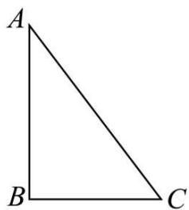

natural_image

Simple geometric diagram of a right triangle labeled A, B, C (no additional text or symbols)

(1)求 $\angle ABC$ 的度数;

(2)现这架无人机沿AB所在直线向下飞行至点D处，若点D恰好在边AC的垂直平分线上，连接CD，求这架无人机向下飞行的距离（AD的长）.

【答案】(1) $90^{\circ}$ (2) $\frac{125}{8}$ 米

【分析】本题主要考查了勾股定理的逆定理和线段垂直平分线的性质，熟练的掌握勾股定理的逆定理和线段垂直平分线的性质是解题的关键.

（1）根据勾股定理的逆定理即可解答；  
(2) 在Rt $\triangle BDC$ 中, 根据勾股定理即可解答.

【详解】（1）解：∵ $AB^{2}+BC^{2}=20^{2}+15^{2}=625$ ， $AC^{2}=25^{2}=625$ ，

$$
\therefore A B ^ {2} + B C ^ {2} = A C ^ {2},
$$

$\therefore\triangle ABC$ 是直角三角形， $\angle ABC=90^{\circ}$ ;

（2）设AD = x 米，若点D恰好在边AC的垂直平分线上，

则CD = AD = x米，BD = (20 - x)米，

在Rt $\triangle BDC$ 中， $DC^{2}=BD^{2}+BC^{2}$ ，

$$
\therefore x ^ {2} = (2 0 - x) ^ {2} + 1 5 ^ {2},
$$

解得 $x=\frac{125}{8}$ .

答: 这架无人机向下飞行的距离(AD 的长)为 $\frac{125}{8}$ 米.

【变式 7-1】（24-25 八年级下·江西赣州·阶段练习）如图，某小区的两个喷泉A，B位于小路AC的同侧，两个喷泉之间的距离AB = 25m．现要为喷泉铺设供水管道AM，BM，供水点M在小路AC上，供水点M到AB的距离MN = 12m，BM = 15m.

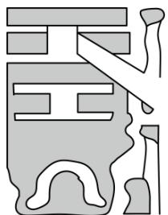

natural_image

Abstract geometric pattern with stylized shapes and no text or symbols

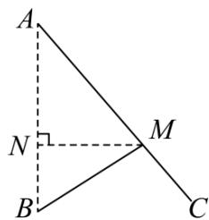

text_image

A
N
M
B
C

(1)求供水点M到喷泉A需要铺设的管道长AM.  
(2)求证： $\angle BMA = 90^{\circ}$ .

【答案】(1)供水点M到喷泉A需要铺设的管道长AM为20m;

(2)见详解.

【分析】本题考查了勾股定理和勾股定理的逆定理，熟练掌握勾股定理和勾股定理的逆定理是解题的关键，要注意勾股定理逆定理的格式.

（1）在Rt△MNB中，先利用勾股定理求出BN，从而求出AN，再在Rt△ANM中，利用勾股定理求出AM；

(2) 利用勾股定理的逆定理证明 $\triangle AMB$ 是直角三角形，再根据斜边所对的角是直角从而得到 $\angle BMA = 90^{\circ}$ .

【详解】（1）解：由题意可知： $MN \perp AB$ ，

在Rt△MNB中， $BN^{2}=BM^{2}-MN^{2}=15^{2}-12^{2}=81$

$$
\therefore B N = 9 \mathrm{m},
$$

$$
\therefore A N = A B - B N = 2 5 - 9 = 1 6 \mathrm{m},
$$

在Rt△ANM中， $AM^{2}=AN^{2}+MN^{2}=16^{2}+12^{2}=400$

$$
\therefore A M = 2 0 \mathrm{m},
$$

∴ 供水点M到喷泉A需要铺设的管道长AM为20m;

(2) 证明: $\because AM = 20 \mathrm{~m}, B M = 15 \mathrm{~m}, A B = 25 \mathrm{~m}$ ,

$$
\therefore A M ^ {2} + B M ^ {2} = 2 0 ^ {2} + 1 5 ^ {2} = 2 5 ^ {2} = A B ^ {2},
$$

∴△AMB是直角三角形，∠BMA = 90°.

【变式 7-2】（24-25 八年级上·河南新乡·期末）某运动会以环保、舒适、温馨为出发点，对运动员休息区进行了精心设计．如图，四边形ABCD为休闲区域，四周是步道， $AB \perp BC$ ，中间是花卉种植区域，为减少拥堵，中间穿插了氢能源环保电动步道AC，经测量AB = 9，BC = 12，CD = 8，AD = 17.

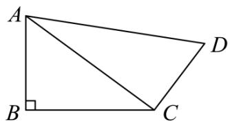

text_image

A
B
C
D

(1)求证： $AC \perp CD$ .

(2)求四边形ABCD的面积.

【答案】(1)见解析

(2)114

【分析】本题主要考查勾股定理及其逆定理的运用，掌握勾股定理及其逆定理的计算是解题的关键.

（1）运用勾股定理得到 $AC^{2}=225$ ，再运用勾股定理逆定理得到 $\triangle ACD$ 是直角三角形，由此即可求解；  
（2）根据 $S_{四边形ABCD}=S_{\triangle ABC}+S_{\triangle ACD}$ ，代入计算即可求解.

【详解】（1）证明：在Rt△ABC中，AB=9，BC=12，

由勾股定理，得 $AC^{2}=AB^{2}+BC^{2}=9^{2}+12^{2}=225$ ，

$$
\because A D ^ {2} = 1 7 ^ {2} = 2 8 9, C D ^ {2} = 6 4,
$$

$$
\therefore A D ^ {2} = C D ^ {2} + A C ^ {2} = 2 8 9,
$$

∴△ACD是直角三角形，且∠ACD=90°，

$$
\therefore A C \perp C D.
$$

(2) 解: 由 (1), 可得 $AC = 15$ , $\angle ACD = 90^{\circ}$ ,

$$
\begin{array}{l} \therefore S _ {\text {四边形} A B C D} = S _ {\triangle A B C} + S _ {\triangle A C D} \\ = \frac {1}{2} A B \cdot B C + \frac {1}{2} A C \cdot C D \\ = \frac {1}{2} \times 9 \times 1 2 + \frac {1}{2} \times 1 5 \times 8 \\ = 1 1 4. \\ \end{array}
$$

【变式 7-3】我市夏季经常受台风天气影响，台风是一种自然灾害，它以台风中心为圆心在周围上千米的范围内形成极端气候，有极强的破坏力．如图，有一台风中心沿东西方向 AB 由点 A 行驶向点 B，已知点 C 为一海港，且点 C 与直线 AB 上两点 A，B 的距离分别为 300km 和 400km，且 AB = 500km，以台风中心为圆心周围 250km 以内为受影响区域.

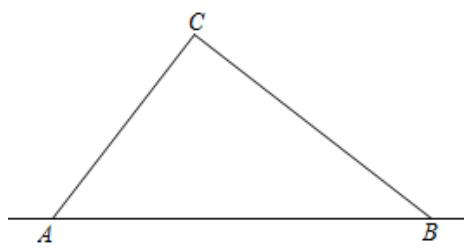

text_image

C
A
B

(1)求证： $\angle ACB = 90^{\circ}$ ;   
(2)海港 C 受台风影响吗？为什么？  
(3)若台风的速度为 40km/h，则台风影响该海港持续的时间有多长？

【答案】(1)见解析

(2)海港 C 受台风影响，理由见解析  
(3)3.5h

【分析】（1）根据勾股定理的逆定理，即可求解；

（2）过点 C 作 $CD \perp AB$ 于 D．根据直角三角形的面积，可得 $\frac{1}{2}AC \cdot BC = \frac{1}{2}AB \cdot CD$ ，即可求解；  
(3) 在线段 $AB$ 上取点 $E, F$ , 使 $EC = 250 \mathrm{~km}$ , $FC = 250 \mathrm{~km}$ , 则台风中心在线段 $EF$ 上时正好影响 $C$ 港口. 根据等腰三角形的性质可得 $ED = FD$ , 然后根据勾股定理可得 $ED = 70 (\mathrm{~km})$ , 从而得到 $EF = 140 \mathrm{~km}$ , 即可求解.

【详解】（1）解：∵AC = 300km，BC = 400km，AB = 500km，

$$
\therefore A C ^ {2} + B C ^ {2} = A B ^ {2}.
$$

∴ $\triangle ABC$ 是直角三角形，

$$
\therefore \angle A C B = 9 0 ^ {\circ};
$$

(2) 解: 海港 $C$ 受台风影响. 理由如下:

如图，过点 C 作 $CD \perp AB$ 于 D.

$$
\because S _ {\triangle A B C} = \frac {1}{2} A C \cdot B C = \frac {1}{2} A B \cdot C D,
$$

$$
\therefore C D = \frac {A C \cdot B C}{A B} = \frac {3 0 0 \times 4 0 0}{5 0 0} = 2 4 0 (\mathrm{km}).
$$

$$
\because 2 5 0 > 2 4 0,
$$

∴海港 C 受到台风影响.

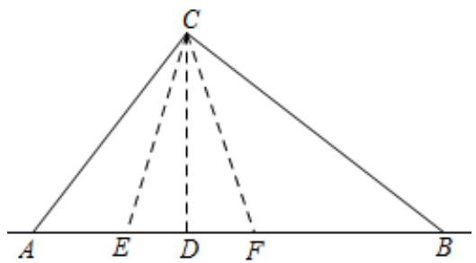

text_image

C
A E D F B

（3）解：如图，在线段 $AB$ 上取点 $E, F$ ，使 $EC = 250\mathrm{km}$ ， $FC = 250\mathrm{km}$ ，则台风中心在线段 $EF$ 上时正好影响 $C$ 港口.

$$
\therefore E C = F C,
$$

$$
\because C D \perp A B,
$$

$$
\therefore E D = F D,
$$

在 $Rt\triangle CED$ 中，由勾股定理得：

$$
E D = 7 0 (\mathrm{km}),
$$

$$
\therefore E F = 1 4 0 \mathrm{km},
$$

∵台风的速度为 40km/h,

$$
\therefore 1 4 0 \div 4 0 = 3. 5 (\mathrm{h}).
$$

∴台风影响该海港持续的时间为 3.5h .

【点睛】本题主要考查了勾股定理的逆定理，勾股定理的实际应用，等腰三角形的性质，熟练掌握勾股定理的逆定理，正确构造直角三角形是解题的关键.

# 【题型8 勾股定理及其逆定理的综合求值】

【例 8】（24-25 八年级下·安徽六安·期中）如下图，学校有一块三角形空地ABC，计划将这块三角形空地分割成四边形ABDE和三角形EDC，分别摆放两种不同的花卉．经测量， $\angle EDC = 90^{\circ}$ ，DC = 15，DE = 20，

$DB = 35$ ， $AB = 40$ ， $AE = 5$ ，求四边形ABDE的面积．（单位：米）

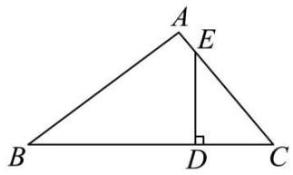

text_image

A
E
B
D
C

【答案】 $450\mathrm{m}^2$

【分析】先根据勾股定理算出EC的长，进而可以得到 $\triangle ABC$ 的各边长，再根据勾股定理的逆定理得到此三角形是直角三角形，进而得到所求面积为 $\triangle ABC$ 的面积减去 $\triangle EDC$ 的面积，即可得到答案；

【详解】解：∵∠EDC = 90°，DC = 15，DE = 20，

$$
\therefore C E = 2 5,
$$

$$
\therefore A C = A E + C E = 3 0,
$$

$$
\because B C = D B + D C = 5 0, \quad A B = 4 0
$$

$$
\therefore A B ^ {2} + A C ^ {2} = 2 5 0 0 = B C ^ {2},
$$

∴△ABC是直角三角形，且∠A = 90°

$$
\therefore S _ {\text {四边形} A B D E} = S _ {\triangle A B C} - S _ {\triangle C D E} = 4 5 0 \left(\mathrm{m} ^ {2}\right)
$$

【点睛】本题主要考查了勾股定理和勾股定理的逆定理，解决此题的关键是合理的利用勾股定理逆定理.

【变式 8-1】如图 $\angle B = 90^{\circ}$ ，AB = 20，BC = 15，CD = 7，AD = 24，求 $\angle D$ 的度数.

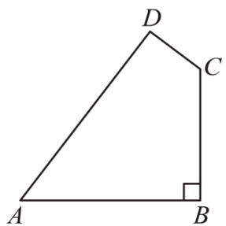

text_image

D
C
A
B

【答案】 $\angle D = 90^{\circ}$

【分析】本题考查的是勾股定理及其逆定理，连接AC，先根据勾股定理求出 $AC^{2}$ 的值，再由勾股定理的逆定理判断出 $\triangle ACD$ 的形状即可.

【详解】解：如图，连接AC，

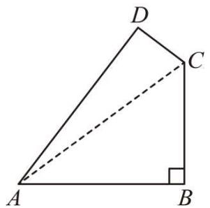

text_image

D
C
A
B

$$
\because \angle B = 9 0 ^ {\circ}, A B = 2 0, B C = 1 5,
$$

$$
\therefore A C ^ {2} = A B ^ {2} + B C ^ {2} = 2 0 ^ {2} + 1 5 ^ {2} = 6 2 5,
$$

$$
\because C D = 7, A D = 2 4,
$$

$$
\therefore C D ^ {2} + A D ^ {2} = 7 ^ {2} + 2 4 ^ {2} = 6 2 5 = A C ^ {2},
$$

$\therefore \triangle ACD$ 是直角三角形，

$$
\therefore \angle D = 9 0 ^ {\circ}.
$$

【变式 8-2】如图，有一块四边形花圃ABCD， $\angle ADC = 90^{\circ}$ ，AD = 4m，AB = 13m，BC = 12m，DC = 3m，该花圃的面积为\_\_\_\_m².

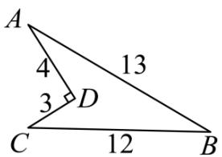

text_image

A
4
13
3
D
C
12
B

【答案】24

【分析】本题考查了直角三角形中勾股定理的运用，根据勾股定理逆定理判定直角三角形，本题中判断 $\triangle ABC$ 是直角三角形是解题的关键.

连接AC，根据解直角 $\triangle ADC$ 求 AC 的长度，求证 $\triangle ACB$ 为直角三角形，根据四边形 ABCD 的面积 $=\triangle ABC$ 面积 $-\triangle ACD$ 面积即可计算.

【详解】如图，连接AC.

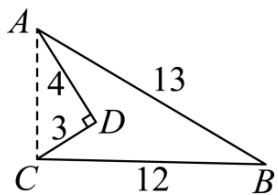

text_image

A
4
13
3
D
C
12
B

$$
\because D A = 4 \mathrm{m}, C D = 3 \mathrm{m}, \angle D = 9 0 ^ {\circ},
$$

$$
\therefore A C = 5 \mathrm{m},
$$

$$
\therefore S _ {\triangle A C D} = 3 \times 4 \times \frac {1}{2} = 6 (\mathrm{m} ^ {2}),
$$

在 $\triangle ABC$ 中，∵AC = 5m, BC = 12m, AB = 13m,

$$
\therefore A C ^ {2} + B C ^ {2} = A B ^ {2},
$$

$\therefore\triangle ABC$ 为直角三角形，且 $\angle ACB=90^{\circ}$ ,

∴Rt $\triangle ABC$ 的面积 = 12 × 5 × $\frac{1}{2}$ = 30(m $^{2}$ ),

∵四边形ABCD的面积 = 30-6 = 24(m²).

故答案为：24.

【变式 8-3】（24-25 八年级下·广西贺州·期中）【阅读与思考】勾股定理神秘而美妙，它的证法多种多样，其巧妙各有不同。在进行《勾股定理》一章学习时，老师带领同学们进行探究活动：如图 1，这是用纸片剪成的四个全等的直角三角形（两条直角边长分别为 $a$ ， $b(b > a)$ ，斜边长为 $c$ ）和一个边长为 $c$ 的正方形，请你将它们拼成一个图形，该图形能验证勾股定理。

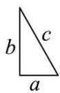

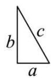

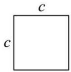

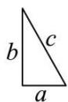

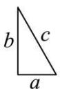  
图1

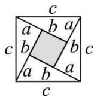  
图2

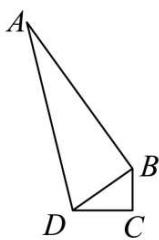  
图3

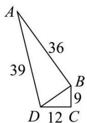

text_image

A
36
39
B
9
D 12 C

图4

【任务】

(1)如图2，这是小敏同学拼成的图形．请你利用图2验证勾股定理.  
(2)一个零件的形状如图3所示，按照规定，零件中∠ABD和∠C都是直角，才是合格零件．如图4所示，工人师傅测得零件∠ABD = 90°，AD = 39cm，AB = 36cm，BC = 9cm，CD = 12cm，这个零件符合要求？请判断并说明理由.

【答案】(1)见解析

(2)这个零件符合要求，理由见解析

【分析】本题主要考查勾股定理的证明、勾股定理逆定理的应用等知识点，掌握勾股定理逆定理的作用是解题的关键.

(1) ①根据图 2 用两种方法表示出大正方形的面积, 然后进行整理即可解答;  
(2) 根据勾股定理的逆定理验证和是否为直角即可判断这个零件是否符合要求.

【详解】（1）解：∵根据图2：大正方形面积可表示为： $c^{2}$ 或 $\frac{1}{2}ab\times4+(b-a)^{2}$

$$
\therefore \frac {1}{2} a b \times 4 + (b - a) ^ {2} = c ^ {2}, \text {即} 2 a b + b ^ {2} - 2 a b + a ^ {2} = c ^ {2},
$$

$$
\therefore a ^ {2} + b ^ {2} = c ^ {2}.
$$

(2) 解: 这个零件符合要求, 理由如下:

在Rt $\triangle ABD$ 中，根据勾股定理，可得：

$$
B D ^ {2} = A D ^ {2} - A B ^ {2} = 3 9 ^ {2} - 3 6 ^ {2} = 2 2 5,
$$

在 $\triangle BCD$ 中， $BC^{2} + CD^{2} = 9^{2} + 12^{2} = 225$

$$
\therefore B C ^ {2} + C D ^ {2} = B D ^ {2}.
$$

∴ $\triangle BCD$ 是直角三角形，∠C 是直角．且 $\angle ABD = 90^{\circ}$

∴这个零件符合要求.

# 【题型 9 利用勾股定理及其逆定理解决无刻度的尺规作图】

【例 9】（24-25 七年级上·江西抚州·阶段练习）线段AB的端点A，B在 $6 \times 6$ 的正方形网格的格点（网格线的交点）上，请仅用无刻度的直尺在网格中按要求作图.

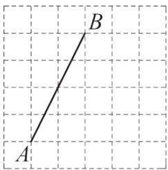

text_image

A
B

图①

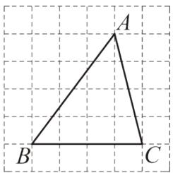

text_image

A
B
C

图②

(1)在图①中找出格点C，并连接AC，BC，使 $AC^{2}=AB^{2}+BC^{2}$ ;  
(2)在图②中作出 $\triangle ABC$ 的高 $CH$ , 并直接写出 $CH$ 的长为

【答案】(1)见解析

(2)见解析， $CH=\frac{16}{5}$

【分析】（1）如图①，由题意知， $AB^{2}=2^{2}+4^{2}=20$ ， $BC^{2}=2^{2}+1^{2}=5$ ， $AC^{2}=3^{2}+4^{2}=25$ ，则 $AC^{2}=AB^{2}+BC^{2}$ ，格点C，AC，BC即为所作；

（2）如图②，作 $\triangle BCD$ ， $CD$ 、 $AB$ 的交点为 $H$ ，证明 $\triangle CBD\cong \triangle AEB(SAS)$ ，则 $\angle BCD = \angle EAB$ ，可求 $\angle BHC = 180^{\circ} - (\angle BCD + \angle ABE) = 90^{\circ}$ ，即 $CH$ 为 $\triangle ABC$ 的高，由勾股定理得， $AB = 5$ ，由题意知， $S_{\triangle ABC} =$ $\frac{1}{2} AB\times CH = \frac{1}{2} BC\times AE$ ，即 $\frac{1}{2}\times 5\times CH = \frac{1}{2}\times 4\times 4$ ，计算求解即可.

【详解】（1）解：如图①，

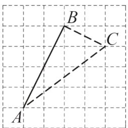

text_image

A
B
C

图①

由题意知， $AB^{2}=2^{2}+4^{2}=20,\quad BC^{2}=2^{2}+1^{2}=5,\quad AC^{2}=3^{2}+4^{2}=25,$

$$
\therefore A C ^ {2} = A B ^ {2} + B C ^ {2},
$$

∴格点C，AC，BC即为所作；

(2) 解: 如图②, 作 $\triangle BCD$ , $CD$ 、 $AB$ 的交点为 $H$ ,

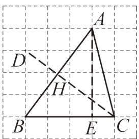

text_image

A
D
H
B
E
C

图②

$$
\because C B = 4 = A E, \angle C B D = 9 0 ^ {\circ} = \angle A E B, B D = 3 = E B,
$$

$$
\therefore \triangle C B D \cong \triangle A E B (\mathrm{SAS}),
$$

$$
\therefore \angle B C D = \angle E A B,
$$

$$
\therefore \angle B C D + \angle A B E = \angle E A B + \angle A B E = 9 0 ^ {\circ},
$$

$$
\therefore \angle B H C = 1 8 0 ^ {\circ} - (\angle B C D + \angle A B E) = 9 0 ^ {\circ},
$$

∴CH为△ABC的高，

由勾股定理得，AB = 5，

$\therefore S_{\triangle ABC} = \frac{1}{2} AB \times CH = \frac{1}{2} BC \times AE$ ，即 $\frac{1}{2} \times 5 \times CH = \frac{1}{2} \times 4 \times 4,$

解得， $CH = \frac{16}{5}$

【点睛】本题考查了勾股定理，勾股定理的逆定理，全等三角形的判定与性质，三角形内角和定理等知识．熟练掌握勾股定理，勾股定理的逆定理，全等三角形的判定与性质，三角形内角和定理是解题的关键.

【变式 9-1】（2025·山东滨州·模拟预测）如图所示的网格是正方形网格，则 $\angle PAB + \angle PBA =$ \_\_\_\_（点A，B，P是网格线交点），请只用无刻度的直尺，在如图所示的网格中，画出解决该题的关键思路的连线.

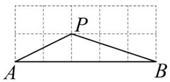

【答案】 $45^{\circ}$ 或45度

【分析】本题考查了勾股定理的逆定理，勾股定理，三角形的外角的性质，等腰直角三角形的判定和性质，延长AP交格点于D，连接BD，根据勾股定理得到 $PD^{2}=BD^{2}=1^{2}+2^{2}=5$ ， $PB^{2}=1^{2}+3^{2}=10$ ，求得 $PD^{2}+DB^{2}=PB^{2}$ ，于是得到 $\angle PDB=90^{\circ}$ ，根据三角形外角的性质即可得到结论，正确的作出辅助线是解题的关键.

【详解】解：延长AP交格点于D，连接BD，

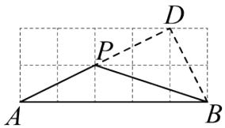

text_image

A
P
B
D

$$
\therefore P D ^ {2} = B D ^ {2} = 1 ^ {2} + 2 ^ {2} = 5, \quad P B ^ {2} = 1 ^ {2} + 3 ^ {2} = 1 0,
$$

$$
\therefore P D ^ {2} + D B ^ {2} = P B ^ {2},
$$

$$
\therefore \angle P D B = 9 0 ^ {\circ},
$$

∴ $\triangle PBD$ 为等腰直角三角形，

$$
\therefore \angle D P B = \angle P A B + \angle P B A = 4 5 ^ {\circ},
$$

故答案为： $45^{\circ}$ .

【变式 9-2】（24-25 八年级上·江西吉安·期末）如图是 $4 \times 4$ 正方形网格，已知格点 A, B，请用无刻度直尺按要求作图.

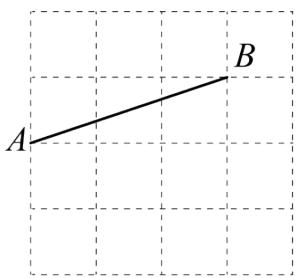

text_image

A
B

图1

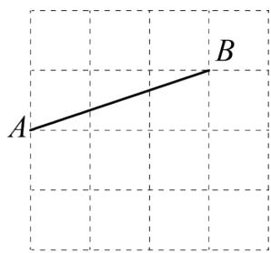

text_image

A
B

图2

(1)在图 1 中，以AB为腰，作等腰 $\triangle ABC$ ;  
(2)在图 2 中，以AB为斜边，作直角 $\triangle ABM$ ，使其面积最小.

【答案】(1)见详解

(2)见详解

【分析】本题考查了等腰三角形定义及勾股定理的逆定理，熟练掌握等腰三角形的定义及勾股定理的逆定

理是解题的关键.

（1）根据等腰三角形的定义，进行作图，即可得解；

（2）根据面积最小，则 $AM \cdot BM$ 的值最小，且并且满足以 $AB$ 为斜边，作直角 $\triangle ABM$ 这个条件，结合勾股定理的逆定理作图即可.

【详解】（1）解：等腰 $\triangle ABC$ 如图所示：

text_image

A
B
C

(2) 解: 直角 $\triangle ABM$ 如图所示:

text_image

A
B
M

图2

【变式 9-3】（24-25 八年级上·吉林长春·阶段练习）图①、图②、图③是 $3 \times 3$ 的正方形网格，每个小正方形的边长都为1．线段AB的端点在格点上．只用无刻度的直尺，在给定的网格中按要求画图，所画图形的顶点均在格点上，不要求写出画法，并保留作图痕迹．

natural_image

Empty Cartesian coordinate grid with labeled axes A and B (no data points or text)

图①

text_image

A
B

图②

text_image

A
B

图③

(1)在图①中以 AB 为直角边画一个直角三角形，使它的面积为 3.  
(2)在图②中以 AB 为边画一个等腰三角形，使它的面积为 3.  
(3)在图③中以 AB 为斜边画一个等腰直角三角形.

【答案】(1)见解析

(2)见解析

(3)见解析

【分析】本题主要考查了格点画图、直角三角形、等腰三角形的定义等知识点．掌握相关定义成为解题的关键.

（1）根据直角三角形的定义以及面积为 3 画出所求三角形即可；  
(2) 根据等腰三角形的定义以及面积为 3 画出所求三角形即可;  
（3）根据等腰直角三角形的定义画出所求三角形即可.

【详解】（1）解：如图①、图②即为所求.

text_image

A
B
C

图①

text_image

A
C
B

图②

(2) 解: 如图③即为所求.

text_image

A
D
B

图③

(3) 解: 如图④即为所求.

text_image

A
E
B

图④