# 专题 1.3 勾股定理的应用（举一反三讲义）

【北师大版 2024】

# 题型归纳

【题型 1 判断汽车是否超速】....1

【题型 2 判断是否受台风影响】....3

【题型 3 选址到两地距离相等】....4

【题型 4 解决航海问题】....6

【题型 5 求河宽】....7

【题型 6 求台阶上地毯长度】....8

【题型 7 求旗杆高度】....9

【题型 8 求小鸟飞行距离】....11

【题型 9 求大树折断前高度】....13

【题型 10 求杯子中物体长度】....14

【题型 11 求梯子滑落高度】....15

【题型 12 求最短路径】....17

# 举一反三

# 知识点 1 利用勾股定理解决立体图形中的最短路径问题

1. 在平面上寻找两点之间的最短路线是根据线路的性质: 两点之间, 线段最短. 在立体图形上, 由于受物体与空间的阻隔, 将其发展成平面图形, 利用平面图形中线段的性质确定最短路线.  
2. 立体图形表面的最短路线问题的一般解题步骤:

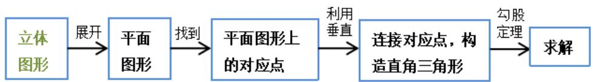

flowchart

# 知识点 2 利用三角形三边关系判断垂直

现实生活中需要判断两条直线是否垂直，解决问题的一般方法是将实际问题转化为数学问题，再利用三角形三边关系判断是否垂直.

# 【题型 1 判断汽车是否超速】 教辅资源,关注公众号·全科AA+

【例 1】（24-25 八年级上·四川宜宾·期末）如图，一条东西向的公路 l 旁有一所中学 M，在中学 M 的大门前有两条长度均为 200 米的通道 MA、MB 通往公路 l 旁的两个公交站点 A、B，且 A、B 两站点相距 320 米.

text_image

M
l
A B C

(1)现要在学校到公路 l 修一条新路，把 A、B 两个站点合为一个站点 D（在公路 l 旁），使得学生从学校走到公路 l 的距离最短，求新路 MD 的距离；  
(2)为了行车安全, 在公路 $l$ 旁的点 $B$ 和点 $C$ 设置区间测速装置, 其中点 $C$ 在点 $B$ 的东侧, 且与中学 $M$ 相距 312 米, 公路 $l$ 限速 30 千米/小时 (约 8.33 米/秒). 一辆汽车经过 $BC$ 区间用时 16 秒, 试判断该车是否超速, 并说明理由.

【变式 1-1】（24-25 八年级下·广西贵港·期中）已知某高速路段限速90km/h（即25m/s）。如图，汽车在车速检测仪 A 正前方 30 米的C处( $\angle C = 90^{\circ}$ )，过了2s后到B处，测得AB = 50m。请通过计算判断汽车是否超速。

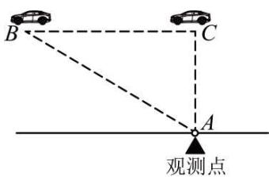

text_image

B
C
A
观测点

【变式 1-2】为了积极响应国家新农村建设，某镇政府采用了移动宣讲的广播形式进行宣传．如图，笔直公路MN的一侧有一报亭 A，报亭 A 到公路MN的距离AB为600米，且宣讲车 P 周围1000米以内能听到广播宣传，宣讲车 P 在公路MN上沿PN方向行驶.

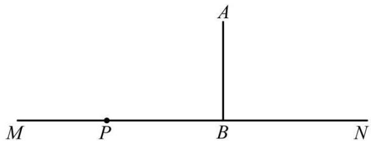

text_image

A
M P B N

(1)请问报亭的人能否听到广播宣传，并说明理由；  
(2)如果能听到广播宣传，已知宣讲车的速度是 200 米/分，那么报亭的人总共能听到多长时间的广播宣传？

【变式 1-3】（23-24 七年级下·山东济南·期末）如下图，实验中学位于一条南北向公路 l 的一侧 A 处，门前有两条长度均为 100 米的小路 AB、AC 通往公路 l，与公路 l 交于 B，C 两点，且 B，C 两点相距 120 米.

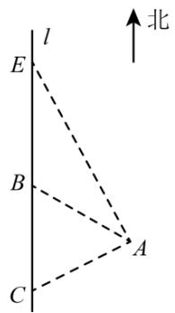

text_image

l
E
B
C
A
↑北

(1)为方便学生出入, 现在打算修一条从实验中学到公路 $l$ 的新路 $A D$ (点 $D$ 在 $l$ 上), 使得学生从学校走到公路路程最短, 应该如何修路 (请在图中画出 $A D$ )? 并计算新路 $A D$ 的长度.

(2)为保证学生的安全, 在公路 $l$ 上的点 $E$ 和点 $C$ 处设置了一组区间测速装置, 点 $E$ 在点 $B$ 的北侧, 且距实验中学 $A$ 处 170 米. 一辆汽车经过 $EC$ 区间共用时 21 秒, 若此段公路限速为 $40 \mathrm{~km} / \mathrm{h}$ (约 $11.1 \mathrm{~m} / \mathrm{s}$ ), 请判断该车是否超速, 并说明理由.

# 【题型 2 判断是否受台风影响】

【例 2】（24-25 八年级上·江苏常州·期中）2024 年 9 月第 13 号台风“贝碧嘉”登陆，使我国长三角很多地区受到严重影响，这是今年以来对我国影响最大的台风，风力影响半径100km（即距离台风中心小于或等于100km区域内都会受台风影响）。如图，线段BD是台风“贝碧嘉”中心从上海市（记为点 B）向西北方向移动到常州市（记为点 D）的大致路线，无锡市惠山区（记为点 C）大致在线段BD上，南通市记为点 A，且 AB + AC。若 A, C 之间相距120km, A, B 之间相距160km。

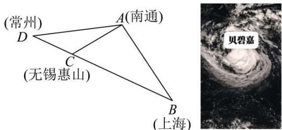

text_image

(常州)
D
A(南通)
C
(无锡惠山)
B
(上海)
贝碧嘉

(1)判断南通市（记为点 $A$ ）是否会受到台风“贝碧嘉”的影响，并说明理由.  
(2)若台风“贝碧嘉”中心的移动速度为20km/h，则台风影响南通市（记为点A）持续时间有多长？

【变式 2-1】（2023 八年级上·江苏·专题练习）如图，经过A村和B村的笔直公路l旁有一块山地正在开发，现需要在C处进行爆破。已知C处与A村的距离为900米，C处与B村的距离为1200米，且 $AC \perp BC$ 。

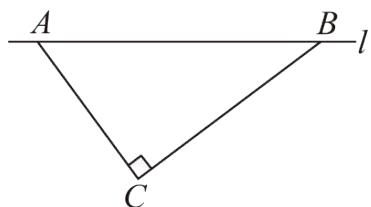

text_image

A
B
l
C

(1)求A、B两村的距离；

(2)为了安全起见, 爆破点 $C$ 周围半径 750 米范围内不得进入, 在进行爆破时, 公路 $A B$ 段是否有危险而需要封锁? 请说明理由.

【变式 2-2】（2024 八年级下·全国·专题练习）台风是一种自然灾害，它以台风中心为圆心，在周围数十千米范围内形成气旋风暴，有极强的破坏力，此时某台风中心在海域 B 处，在沿海城市 A 的正南方向 320 千米，其中心风力为 13 级，每远离台风中心 25 千米，台风就会减弱一级，如图所示，该台风中心正以 20 千米/时的速度沿北偏东30°方向向 C 移动，且台风中心的风力不变，若城市所受风力超过 5 级，则称受台风影响．试问：

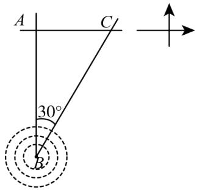

text_image

A
C
30°
B

(1) $A$ 城市是否会受到台风影响？请说明理由.  
(2)若会受到台风影响，那么台风影响该城市的持续时间有多长？  
(3)该城市受到台风影响的最大风力为几级？

【变式 2-3】如图，公路MN和公路PQ在点 P 处交汇，且 $\angle QPN = 30^{\circ}$ ，在 A 处有一所中学，AP = 120 米，此时有一辆消防车在公路MN上沿PN方向以每秒 8 米的速度行驶，假设消防车行驶时周围100 米以内有噪音影响.

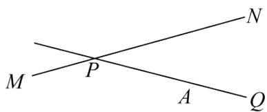

text_image

M
P
N
A
Q

(1)学校是否会受到影响？请说明理由.  
(2)如果受到影响，则影响时间是多长？

# 【题型3 选址到两地距离相等】

【例 3】（24-25 八年级下·湖北武汉·期中）如图铁路上A、B两点相距40千米，C、D为铁路两边的两个村庄，DA⊥AB，CB⊥AB，垂足分别为A和B，DA=24千米，CB=16千米，现在要在铁路旁修建一个候车点E，使得C、D两村到该候车点的距离相等．则候车点E应距A点（）

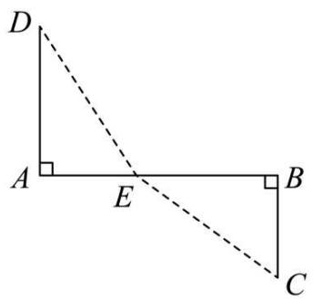

text_image

D
A
E
B
C

A. 12 千米

B. 16 千米

C. 20 千米

D. 24 千米

【变式 3-1】（11-12 九年级上·河北·期中）如图，铁路上 A、B 两点相距25km，C、D 为两村庄，DA⊥AB 于 A，CB⊥AB 于 B，已知DA = 15km，CB = 10km，现在要在铁路AB上建一个土特产品收购站 E，使得 C、D 两村到 E 站的距离相等，则 E 站应建在距 A 站多少千米处？

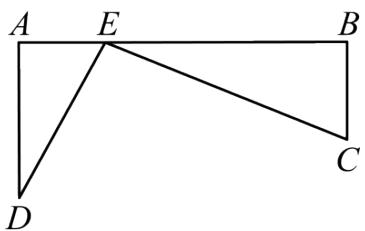

text_image

A E B
D C

【变式 3-2】（24-25 八年级上·陕西渭南·期末）如图，已知某学校 A 与直线公路 BD 相距 300 米（即 AB = 300 米， $AB \perp BD$ ），且与该公路上一个车站 D 相距 500 米（即 AD = 500 米），现要在公路边 BD 建一个超市 C，使之与学校 A 及车站 D 的距离相等，那么该超市 C 与车站 D 的距离 CD 是多少米？

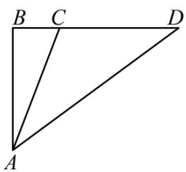

text_image

B C D
A

【变式 3-3】（23-24 八年级下·湖北荆州·阶段练习）如图，直线 l 为一条公路，A，D 两处各有一个村庄， $AB \perp l$ 于点 B， $DC \perp l$ 于点 C，AB = 4 千米，BC = 8 千米，CD = 6 千米．现需要在 BC 上建立一个物资调运站 E，使得 E 到 A，D 两个村庄距离相等，请求出 E 到 C 的距离.

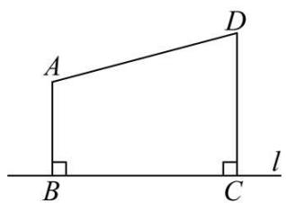

text_image

A
D
B
C
l

# 【题型4 解决航海问题】

【例 4】（24-25 八年级上·吉林长春·期末）如图，甲、乙两船同时从A港出发，甲船的速度是15海里/时，航向是东北方向（射线AB方向），乙船比它每小时快5海里，航向是东南方向（射线AC方向），多少小时后两船相距100海里？

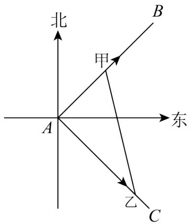

text_image

北
甲
B
东
A
乙
C

【变式 4-1】（24-25 八年级上·辽宁本溪·期中）某海岛海域争端持续，我国海监船加大该岛附近海域的巡航维权力度．如图， $OA \perp OB, OA = 72$ 海里，OB = 12海里，海岛位于 O 点，我国海监船在点 B 处发现有一不明国籍的渔船，自 A 点出发沿着 AO 方向匀速驶向海岛所在地点 O，我国海监船立即从 B 处出发以相同的速度沿某直线去拦截这艘渔船，结果在点 C 处截住了渔船．

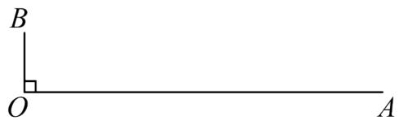

text_image

B
O
A

(1)请用直尺和圆规作出 C 处的位置;

(2)求我国海监船行驶的航程BC的长.

【变式 4-2】（22-23 八年级下·重庆巴南·期末）在海平面上有 A, B, C 三个标记点，其中 A 在 C 的北偏西 $54^{\circ}$ 方向上，与 C 的距离是 800 海里，B 在 C 的南偏西 $36^{\circ}$ 方向上，与 C 的距离是 600 海里.

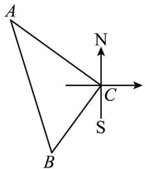

text_image

A
N
C
S
B

(1)求点 A 与点 B 之间的距离;

(2)若在点 C 处有一灯塔, 灯塔的信号有效覆盖半径为 500 海里, 每隔半小时会发射一次信号, 此时在点 B 处有一艘轮船准备沿直线向点 A 处航行, 轮船航行的速度为每小时 20 海里. 轮船在驶向 A 处的过程中, 最多能收到多少次信号? (信号传播的时间忽略不计).

【变式 4-3】如图所示，某港口位于东西方向的海岸线上．“远航”号、“海天”号轮船同时离开港口，各自沿一固定方向航行，“远航”号每小时航行 16 海里，“海天”号每小时航行 12 海里．它们离开港口 $\frac{3}{2}$ 小时后相距 30 海里．如果知道“远航”号沿东北方向航行，能知道“海天”号沿哪个方向航行吗？

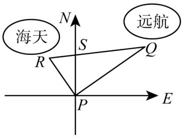

text_image

海天
N
S
Q
R
P
E
远航

# 【题型5 求河宽】

【例 5】（22-23 八年级下·浙江台州·期中）某工程队负责挖掘一处通山隧道，为了保证山脚 A，B 两处出口能够直通，工程队在工程图上留下了一些测量数据（此为山体俯视图，图中测量线拐点处均为直角，数据单位：米）。据此可以求得该隧道预计全长\_\_\_\_米。

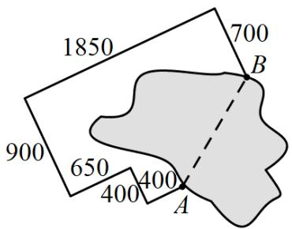

text_image

1850
700
900
650
400
400
A
B

【变式 5-1】（24-25 八年级下·辽宁葫芦岛·期中）在一次研学活动中，小宣同学欲控制遥控轮船匀速垂直横渡一条河，但由于水流的影响，实际上岸地点 C 与欲到达地点 B 相距 8 米，结果轮船在水中实际航行的路程 AC 比河的宽度 AB 多 2 米，则河的宽度 AB 是（）

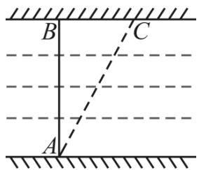

text_image

B
C
A

教辅资源,关注公众号·全科AA+

A. 6 米

B. 9 米

C. 12 米

D. 15 米

【变式 5-2】某隧道的截面是由如图所示的图形构成，图形下面是长方形ABCD，上面是半圆形，其中AB = 10米， $BC = 2.5$ 米，隧道设双向通车道，中间有宽度为 2 米的隔离墩，一辆满载家具的卡车，宽度为 3 米，高度为 4.9 米，请计算说明这辆卡车是否能安全通过这个隧道？

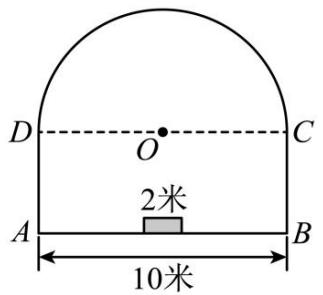

text_image

D
O
C
2米
A
B
10米

【变式 5-3】（24-25 八年级下·内蒙古乌兰察布·期中）直角三角形的三边关系：如果直角三角形两条直角边长为 a、b，斜边长为 c，则 $a^{2} + b^{2} = c^{2}$ .

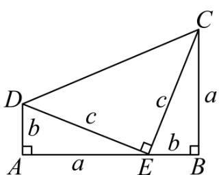

text_image

D
b
c
a
c
b
A
a
E
B
C

图1

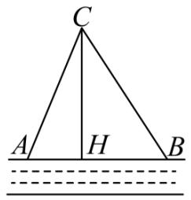

text_image

C
A H B

图2

(1)图 1 为美国第二十任总统伽菲尔德的“总统证法”，请你利用图 1 推导上面的关系式．利用以上所得的直角三角形的三边关系进行解答；

(2)如图2, 在一条东西走向河流的一侧有一村庄 $C$ , 河边原有两个取水点 $A 、 B$ , 其中 $AB = AC$ , 由于某种原因, 由 $C$ 到 $A$ 的路现在已经不通, 该村为方便村民取水决定在河边新建一个取水点 $H$ ( $A 、 H 、 B$ 在一条直线上), 并新修一条路 $CH$ , 且 $CH \perp AB$ . 测得 $CH = 6$ 千米, $HB = 4$ 千米, 求新路 $CH$ 比原路 $CA$ 少多少千米?

(3)在第（2）问中若 $AB \neq AC$ 时， $CH \perp AB$ ，AC = 8，BC = 10，AB = 12，设AH = x，求x的值.

# 【题型6 求台阶上地毯长度】

【例 6】如图，是一个三级台阶，它的每一级的长，宽和高分别等于5cm，3cm和1cm，A和B是这个台阶的两个相对的端点，A点上有一只蚂蚁，想到B点去吃可口的食物，请你想一想，这只蚂蚁从A点出发，沿着台阶面爬到B点，最短线路是（）

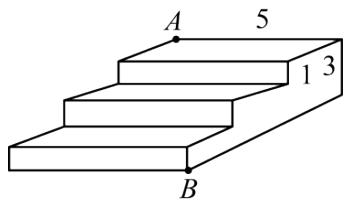

text_image

A
5
1 3
B

A. 12

B. 13

C. 14

D. 15

【变式 6-1】（23-24 八年级下·山东济宁·期中）如图，在一个高为 3 米的楼梯表面铺地毯，地毯总长度为 7 米，则楼梯斜面 AB 长为（）

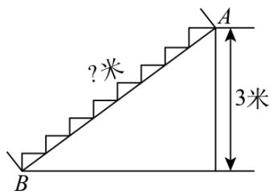

text_image

?米
A
3米
B

A. 4 米

B. 5 米

C. 6 米

D. 7 米

【变式 6-2】如图，要修建一个育苗棚，棚高 h=5 m，棚宽 a=12 m，棚的长 d 为 12m，现要在矩形的棚顶上覆盖塑料薄膜，试求需要多少平方米塑料薄膜？

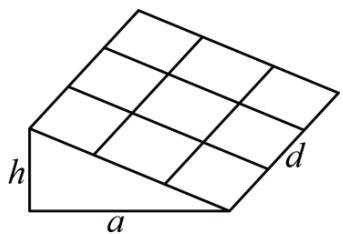

text_image

h
a
d

【变式 6-3】如图：一个三级台阶，它的每一级的长，宽和高分别是 50cm，30cm，10cm，A 和 B 是这个台阶的两个相对的端点，A 点上有一只壁虎，它想到 B 点去吃可口的食物，请你想一想，这只壁虎从 A 点出发，沿着台阶面爬到 B 点，最短路线的长是 \_\_\_\_ cm.

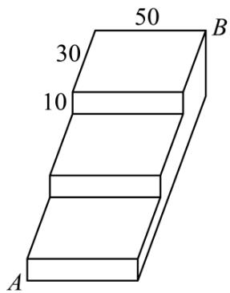

text_image

50
30
10
A
B

# 【题型7 求旗杆高度】

【例 7】（22-23 八年级下·北京东城·期末）如图1，同学们想测量旗杆的高度h（米），他们发现系在旗杆顶端的绳子垂到了地面，

并多出了一段，但这条绳子的长度未知。小明和小亮同学应用勾股定理分别提出解决这个问题的方案如下：
小明：①测量出绳子垂直落地后还剩余1米，如图1；

②把绳子拉直，绳子末端在地面上离旗杆底部4米，如图2.

小亮：先在旗杆底端的绳子上打了一个结，然后举起绳结拉到如图3点D处（BD = BC）.

  
图1

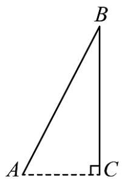

text_image

B
A
C

图2

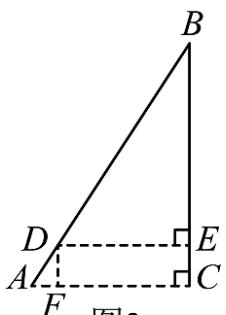

text_image

B
D
E
A
F
C
图2

图3

(1)请你按小明的方案求出旗杆的高度 h（米）；  
(2)已知小亮举起绳结离旗杆4.5米远，此时绳结离地面多高？

【变式 7-1】（22-23 八年级下·山东临沂·期中）学校需要测量旗杆的高度。同学们发现系在旗杆顶端的绳子垂到了地面还多出了一段，但这条绳子的长度未知。请你应用勾股定理提出一个解决这个问题的方案（画出图形，结合图形说明需要测量的数据，把这些数据用字母表示，并用这些字母表示旗杆的高度）。

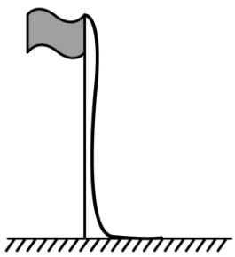

natural_image

Simple line drawing of a flagpole with a pole and ground base (no text or symbols)

【变式 7-2】（23-24 七年级下·山东济南·期末）“儿童散学归来早，忙趁东风放纸鸢”，周末王明和李华去放风筝，为了测得风筝的垂直高度AD，他们利用学过的“勾股定理”知识，进行了如下操作：

①测得水平距离BC的长为12米;   
②根据手中剩余线的长度计算出风筝线AB的长为15米;   
③牵线放风筝的王明放风筝时手离地面的距离BE为1.6米.

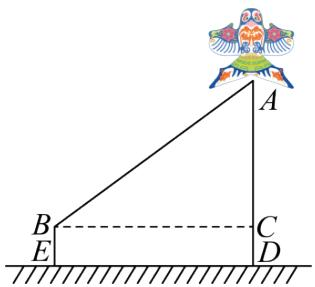

text_image

Geometric diagram showing a right triangle ABCDE with a decorative bird icon above, and a horizontal dashed line CD intersecting base BE.

(1)求风筝的垂直高度AD;   
(2)如果王明想让风筝沿DA方向再上升7米，BC长度不变，则他应该把线再放出\_米.

【变式 7-3】（2025·湖北孝感·二模）为测量学校旗杆AB的高度，某中学数学兴趣小组的同学经过讨论，设

计了以下两种方案:

<table><tr><td></td><td>方案一</td><td>方案二</td></tr><tr><td>测量工具</td><td>含45°角的教学用直角三角板、足够长的皮尺.</td><td>升旗用的绳子、足够长的皮尺.</td></tr><tr><td>测量方案示意图</td><td>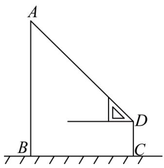</td><td>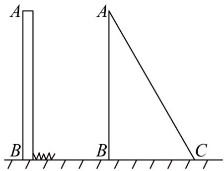</td></tr><tr><td>实施方案及测量数据</td><td>一同学站在C点,双手水平托好直角三角板,恰好看到旗杆顶A点,测得旗杆底部B处与C点的距离BC=10.8m,人的眼睛与地面的距离CD=1.2m.</td><td>升旗用的绳子从旗杆顶端垂落地面后还多出1m,将绳子斜拉直后,使得绳子底端C刚好接触地面,此时测得BC=5m.</td></tr><tr><td>备注</td><td>教辅资源,关注公众号·全科AA+1图上所有点均在同一平面内;2旗杆半径忽略不计.</td><td>1实施过程中,旗杆顶端绳子保持不动.</td></tr></table>

请从以上两种方案中任选一种，计算旗杆AB的高度.

# 【题型8 求小鸟飞行距离】

【例 8】（24-25 八年级上·江苏宿迁·期末）如图所示，有两根直杆隔河相对，一杆高 30m，另一杆高 20m，两杆相距 $50 \mathrm{~m}$ 。现两杆上各有一只鱼鹰，他们同时看到两杆之间的河面上 $E$ 处浮起一条小鱼，于是以同样的速度同时飞下来夺鱼，结果两只鱼鹰同时叼住小鱼。则两杆底部距小鱼 $E$ 处的距离各是多少？

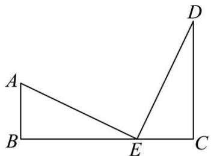

text_image

Geometric diagram with labeled points A, B, C, D, and E forming triangles and a right angle at E

【变式 8-1】（23-24 八年级下·广西贺州·期中）姑婆山国家森林公园古窑冲猴趣园，调皮可爱的猴子随处可见．如图：有两只猴子爬到—棵树CD上的点B处，且BC = 2m，突然发现远方A处有好吃的东西，其中一只猴子沿树爬下走到离树6m处的池塘A处，另一只猴子先爬到树顶D处后再沿缆绳线段DA滑到A处，已知两只猴子所经过的路程相等，设BD为xm.

text_image

Geometric diagram showing a tree with labeled vertices A, B, C, D and a vertical line from D to base BC

(1)请用含有 x 的整式表示线段 AD 的长为 \_m;  
(2)求这棵树高有多少米?

【变式 8-2】（23-24 八年级下·新疆喀什·期中）如图，一只小鸟旋停在空中A点，A点到地面的高度AB = 8 米，A点到地面C点（B，C两点处于同一水平面）的距离AC = 10米.

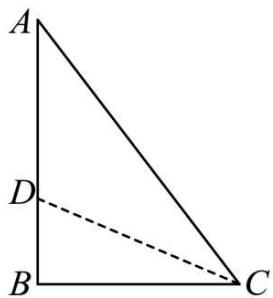

text_image

A
D
B
C

(1)求出BC的长度;

(2)若小鸟竖直下降到达D点（D点在线段AB上），此时小鸟到地面C点的距离与下降的距离相同，求小鸟下降的距离.

【变式 8-3】（23-24 八年级下·重庆铜梁·期中）如图，有一只喜鹊在一棵2m高的小树AB上觅食，它的巢筑在与该树水平距离（BD）为8m的一棵9m高的大树DM上，喜鹊的巢位于树顶下方1m的 C 处，当它听到巢中幼鸟的叫声，立即飞过去，如果它飞行的速度为2m/s，那么它要飞回巢中所需的时间至少是（）

A. 5s

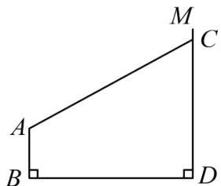

text_image

M
C
A
B
D

B. 4s

C. 3s

D. 2s

# 【题型9 求大树折断前高度】

【例 9】（24-25 八年级上·甘肃兰州·期末）九章算术中记载了一个“折竹抵地”问题：今有竹高一丈，末折抵地，去本三尺，问折者高几何？题意是：一根竹子原高 1 丈（1 丈 = 10 尺），中部有一处折断，竹稍触地面处离竹根 4 尺，试问折断处离地面多高？则折断处离地面的高度为（）

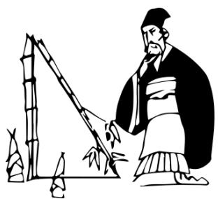

natural_image

Illustration of a historical figure in traditional attire observing bamboo and rock formation (no text or symbols)

A. 4.55 尺

B. 5.45 尺

C. 4.2 尺

D. 5.8 尺

【变式 9-1】（24-25 八年级上·河南平顶山·期中）如图，一棵垂直于地面且高度为12m的大树被大风吹折，折断处A与地面的距离AC = 4.5m，树尖B恰好碰到地面．在大树倒下的方向上的点D处停着一辆小轿车，CD = 6.5m，树枝落地时是否会砸着小轿车并说明理由．

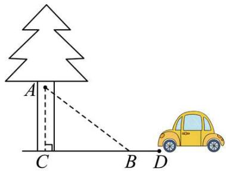

text_image

Geometric diagram showing a tree with points A, B, C, D and a dashed line segment AB, alongside a yellow car with 'H' on the side.

【变式 9-2】（24-25 八年级上·江苏盐城·阶段练习）如图，车高2.4m(AC = 2.4m)，货车卸货时后面支架AB弯折落在地面 $A_{1}$ 处，经过测量 $A_{1}C = 1.2m$ ，求弯折点B与地面的距离.

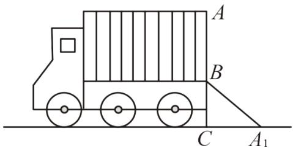

text_image

A
B
C
A₁

【变式 9-3】我国古代数学名著《算法统宗》有一道“荡秋千”的问题：“平地秋千未起，踏板一尺离地．送行二步与人齐，5 尺人高曾记，仕女家人争蹴．良工高士素好奇，算出索长有几？”此问题可理解为：“如图，有一架秋千，当它静止时，踏板离地距离 $PA$ 的长为 1 尺，将它向前水平推送 10 尺时，即 $P'C = 10$ 尺，秋千踏板离地的距离 $P'B$ 和身高 5 尺的人一样高，秋千的绳索始终拉得很直，试问绳索有多长？”，设秋千的绳索长为 $x$ 尺，根据题意可列方程为 \_\_\_\_.

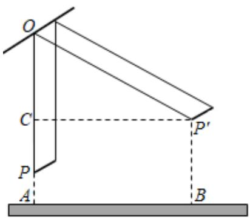

text_image

O
C
P'
A
B

# 【题型 10 求杯子中物体长度】 教辅资源,关注公众号·全科AA+

【例 10】（24-25 八年级上·山西运城·期末）如图是两个型号的圆柱型笔筒，粗细相同，高度分别是8cm和12cm，将一支铅笔按如图所示的方式先后放入两个笔筒，铅笔露在笔筒外面的部分分别为4cm和2cm，则铅笔的长为（）

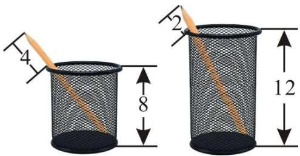

text_image

4
8
2
12

A. $19 \mathrm{~cm}$   
B. $21 \mathrm{~cm}$   
C. $23 \mathrm{~cm}$   
D. $25 \mathrm{~cm}$

【变式 10-1】如图，八年级一班的同学准备测量校园人工湖的深度，他们把一根竹竿AB竖直插到水底，此时竹竿AB离岸边点C处的距离CD=0.8米．竹竿高出水面的部分AD长0.2米，如果把竹竿的顶端A拉向岸边点C处，竿顶和岸边的水面刚好相齐，则人工湖的深度BD为（）

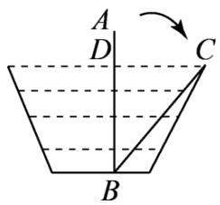

text_image

A
D
C
B

A. 1.5 米

B. 1.7 米

C. 1.8 米

D. 0.6 米

【变式 10-2】《九章算术》中有一道“引葭赴岸”问题：“今有池一丈，葭生其中央，出水一尺，引葭赴岸，适与岸齐．问水深，葭长各几何？”题意是：有一个池塘，其底面是边长为 10 尺的正方形，一棵芦苇 AB 生长在它的中央，高出水面部分 BC 为 1 尺．如果把该芦苇沿与水池边垂直的方向拉向岸边，那么芦苇的顶部 B 恰好碰到岸边的 B'（如图）．则芦苇长\_\_\_\_尺．

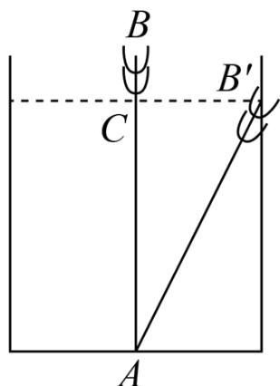

text_image

B
C
A
B'
A'

【变式 10-3】如图, 湖面上有一朵盛开的红莲, 它高出水面 $30 \mathrm{~cm}$ 。大风吹过, 红莲被吹至一边, 花朵下部刚好齐及水面, 已知红莲移动的水平距离为 $60 \mathrm{~cm}$ , 则水深是\_\_\_\_cm.

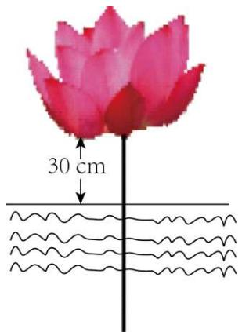

text_image

30 cm

# 【题型11 求梯子滑落高度】

【例 11】（23-24 八年级上·北京延庆·期末）如图，小巷左右两侧是竖直的墙，已知小巷的宽度CE是2.2米．一架梯子AB斜靠在左墙时，梯子顶端A与地面点C距离是2.4米．如果保持梯子底端B位置不动，将梯子斜靠在右墙时，梯子顶端D与地面点E距离是2米．求此时梯子底端B到右墙角点E的距离是多少米．

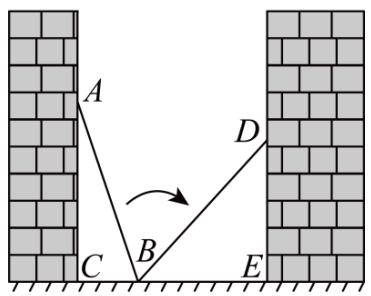

text_image

A
D
C
B
E

【变式 11-1】如图，一个梯子 AB 长 2.5 米，顶端 A 靠在墙 AC 上，这时梯子下端 B 离墙角 C 的距离为 1.5 米，梯子滑动后停在 DE 的位置上了，测得 BD 长为 0.9 米，则梯子顶端 A 下滑（）.

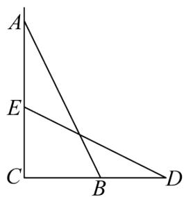

text_image

A
E
C
B
D

A. 0.9 米

B. 1.3 米

C. 1.5 米

D. 2 米

【变式 11-2】（24-25 八年级上·全国·期末）如图，在一宽度EC为2米的电梯井里，一架2.5米长的梯子AB斜靠在竖直的墙AC上，顶端A被固定在墙上，这时B到墙底端C的距离为0.7米．程师傅为了方便修理，将梯子的底端举到对面D的位置，问此时梯子底端离地高度DE长为（）

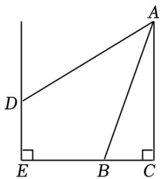

text_image

A
D
E B C

A. 0.7 米

B. 0.9 米

C. 1.2 米

D. 1.5 米

【变式 11-3】（24-25 八年级上·广东深圳·阶段练习）某数学兴趣小组开展了笔记本电脑的张角大小的实践探究活动．如图，当张角为∠BAF时，顶部边缘B处离桌面的高度BC为7cm，此时底部边缘A处与C处间的距离AC为24cm，小组成员调整张角的大小继续探究，最后发现当张角为∠DAF时（D是B的对应点），顶部边缘D处到桌面的距离DE为20cm，则底部C处与E处之间的距离CE为（）

natural_image

Exterior view of a modern laptop computer with visible keyboard and drive slots (no text or symbols)

A. $9 \mathrm{~cm}$

B. 18cm

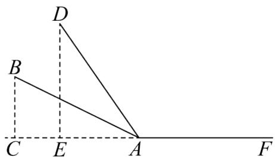

text_image

D
B
C E A F

C. 21cm

D. 24cm

# 【题型12 求最短路径】

【例 12】（24-25 八年级上·广东深圳·期中）如图，这是一个供滑板爱好者使用的 U 型池的示意图，该 U 型池可以看成是长方体去掉一个“半圆柱”而成，中间可供滑行部分的截面是直径为 $\frac{40}{\pi}$ m 的半圆，其边缘 AB = CD = 20m，点 E 在 CD 上，CE = 5m，一滑板爱好者从 A 点滑到 E 点，则他滑行的最短距离约为（）m。（边缘部分的厚度忽略不计）教辅资源，关注公众号·全科 AA+

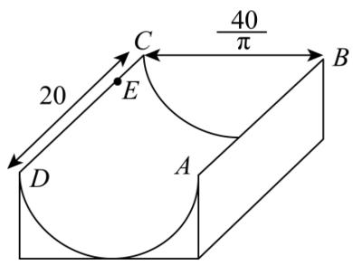

text_image

20
40/π
C
E
B
A
D

A. 25

B. $5 \sqrt{73}$

C. 35

D. $20 \sqrt{2}$

【变式 12-1】（24-25 八年级上·甘肃兰州·期末）如图：长方体的长、宽、高分别是 12，8，30，在 AB 中点 C 处有一滴蜜糖，一只小虫从 E 处爬到 C 处去吃，有无数种走法，则最短路程是（）

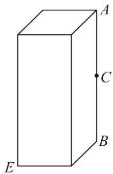

text_image

A
C
B
E

A. 15

B. 25

C. 35

D. 45

【变式 12-2】（24-25 八年级上·山东青岛·期末）如图，长方体的底面边长分别为2cm和4cm，高为5cm．若一只蚂蚁从点 P 开始经过 4 个侧面爬行一圈到达点 Q，则蚂蚁爬行的最短路径长为 \_\_\_\_

text_image

Q
5cm
2cm
4cm P

【变式 12-3】（24-25 八年级下·四川自贡·期中）如图，圆柱的高为12cm，底面圆的周长为18cm，在圆柱下底面的点 A 有一只蚂蚁，它想吃到上底面上与点 A 相对的点 B 处的食物，沿圆柱侧面爬行的最短路程是多少？

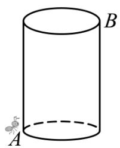

natural_image

Simple line drawing of a cylinder with an insect at the base (no text or symbols)

